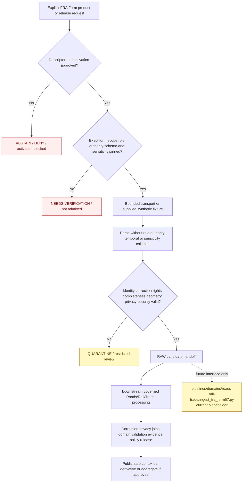

<!-- [KFM_META_BLOCK_V2]
doc_id: kfm://doc/connectors-fra-form57-readme
title: connectors/fra_form57/ — FRA Form 57 Connector Lane
type: readme
version: v0.2
status: draft
owners: OWNER_TBD — Connector steward · FRA/Form 57 source steward · Roads/Rail/Trade steward · Rail steward · Hazards steward · People/DNA/Land privacy steward · Settlements/Infrastructure steward · Rights reviewer · Privacy/sensitivity reviewer · Security reviewer · Validation steward · Docs steward
created: 2026-06-18
updated: 2026-07-11
policy_label: restricted-review; source-admission; greenfield; no-network-default; observed-incident-report; carrier-reported; person-detail-sensitive; hazmat-sensitive; precise-location-sensitive; raw-or-quarantine-only; no-navigation; no-emergency-guidance; no-publication
proposed_path: connectors/fra_form57/README.md
truth_posture: CONFIRMED README-only connector lane / implementation ABSENT / SourceDescriptor ABSENT or UNPROVED / exact Form 6180.57 scope UNRESOLVED / source NOT ACTIVATED / downstream pipeline PLACEHOLDER / tests and CI ABSENT or UNKNOWN
related:
  - ../README.md
  - ../fra_gcis/README.md
  - ../stb_class1/README.md
  - ../ntad/README.md
  - ../../docs/sources/catalog/usdot/README.md
  - ../../docs/sources/catalog/usdot/fra-form57.md
  - ../../docs/sources/catalog/usdot/fra-gcis.md
  - ../../docs/sources/catalog/usdot/stb-class1.md
  - ../../docs/domains/roads-rail-trade/README.md
  - ../../docs/domains/roads-rail-trade/SOURCES.md
  - ../../docs/domains/roads-rail-trade/SOURCE_FAMILIES.md
  - ../../docs/domains/roads-rail-trade/CANONICAL_PATHS.md
  - ../../docs/domains/hazards/README.md
  - ../../docs/domains/people-dna-land/README.md
  - ../../docs/domains/settlements-infrastructure/README.md
  - ../../data/registry/roads-rail-trade/sources/README.md
  - ../../data/registry/sources/README.md
  - ../../data/raw/roads-rail-trade/README.md
  - ../../data/quarantine/roads-rail-trade/
  - ../../pipelines/domains/roads-rail-trade/ingest_fra_form57.py
  - ../../fixtures/
  - ../../schemas/contracts/v1/source/
  - ../../policy/domains/roads-rail-trade/
  - ../../policy/sensitivity/
  - ../../policy/redaction/
  - ../../policy/rights/
  - ../../release/
tags: [kfm, connectors, fra, form57, form-6180-57, rail, incident-report, observed, carrier-reported, casualty, hazmat, privacy, roads-rail-trade, hazards, source-admission, raw, quarantine, governance]
notes:
  - "Repository inspection confirms that connectors/fra_form57/ contains this README only; no package metadata, Python module, client, parser, fixture, test, SourceDescriptor, activation record, source payload, or passing CI evidence is proved."
  - "The only directly named downstream Form 57 pipeline file is an eight-line PROPOSED placeholder docstring; it is not executable ingestion evidence."
  - "The source profile proposes observed incident-report evidence with the reporting carrier as record-level role authority and FRA as dataset curator, but the exact Form 6180.57 scope versus sibling FRA 6180.xx forms remains unresolved."
  - "The repository source profile marks this product high-sensitivity because person-identifying casualty detail, operator/crew detail, hazardous-material detail, precise incident location/time, and free-text narrative can create privacy, security, and inference risk."
  - "Naming and topology drift remain unresolved: proposed source ID fra_form57, source-profile references to data/raw/roads-rail-trade/fra_form57/, no confirmed RAW child lane, and domain-first versus subtype-first source-registry patterns."
  - "The source profile still links a stale people-genealogy-dna-land path while the live domain path is people-dna-land; cross-domain routing must use reviewed current paths rather than copying stale documentation."
[/KFM_META_BLOCK_V2] -->

<a id="top"></a>

# FRA Form 57 Connector Lane

> Evidence-grounded boundary for future Federal Railroad Administration Form 57 source-admission code. The current directory is documentation-only. It does **not** provide an importable connector, live FRA access, an activated source, executable tests, RAW captures, downstream ingestion, incident truth, public redaction, emergency guidance, or publication capability.

<p>
  
  
  
  
  
  
  
</p>

`connectors/fra_form57/`

> [!IMPORTANT]
> **Confirmed state:** this directory contains this README only. No `pyproject.toml`, `src/`, importable package, endpoint configuration, SourceDescriptor, activation decision, client, downloader, parser, schema adapter, sensitivity classifier, handoff builder, fixture set, test suite, RAW child lane, or passing CI evidence is confirmed. The named downstream pipeline file is a placeholder docstring, not working ingestion logic. Treat every implementation structure, command, endpoint, form field, code list, suppression rule, and outcome below as a future contract or proposal—not current behavior.

**Quick jumps:** [Purpose](#purpose) · [Verified repository state](#verified-repository-state) · [Evidence ledger](#evidence-ledger) · [Connector authority boundary](#connector-authority-boundary) · [Blocking drift](#blocking-drift) · [Source identity scope and role](#source-identity-scope-and-role) · [What Form 57 may and may not support](#what-form-57-may-and-may-not-support) · [Access-surface and product classification](#access-surface-and-product-classification) · [Input contract](#input-contract) · [Metadata preservation](#metadata-preservation) · [Temporal amendment and correction handling](#temporal-amendment-and-correction-handling) · [Geometry crossing and rail-network handling](#geometry-crossing-and-rail-network-handling) · [Sensitivity privacy and security posture](#sensitivity-privacy-and-security-posture) · [Cross-domain routing](#cross-domain-routing) · [Finite outcomes](#finite-outcomes) · [Lifecycle boundary](#lifecycle-boundary) · [Proposed implementation shape](#proposed-implementation-shape) · [Testing relationship](#testing-relationship) · [Pipeline and downstream separation](#pipeline-and-downstream-separation) · [Implementation sequence](#implementation-sequence) · [Activation gates](#activation-gates) · [Review and rollback](#review-and-rollback) · [Definition of done](#definition-of-done) · [Verification backlog](#verification-backlog)

---

## Purpose

`connectors/fra_form57/` is the reserved source-specific connector lane for FRA Form 57 admission behavior.

When implementation exists, connector code may:

- validate explicit, side-effect-free connector configuration;
- consume an accepted SourceDescriptor reference and activation decision supplied by governed callers;
- identify one specifically approved FRA release, Form 6180.57 product, archive, extract, table, service, or metadata surface;
- retrieve approved source material through bounded, replaceable transport;
- parse synthetic fixtures or approved source-shaped payloads without upgrading a carrier report into final investigation truth;
- preserve provider, form, product, report, reporting-carrier, source-role, role-authority, incident-time, location, correction, rights, sensitivity, retrieval, and digest metadata;
- preserve source-issued incident, casualty, hazardous-material, property-damage, operational-context, and narrative fields under explicit sensitivity classes where present and verified;
- detect ambiguous form scope, missing source vintage, incomplete capture, unstable report identity, schema or code-list drift, amendment conflicts, location uncertainty, rights uncertainty, or sensitive-content risk;
- return finite error, abstention, activation-blocked, drift, review, RAW-candidate, or QUARANTINE-candidate results;
- remain deterministic and testable with no network, no account, and no credentials.

This lane must never become:

- final accident-cause, fault, liability, enforcement, compliance, or legal truth;
- current rail operating status, closure, restriction, dispatch, routing, or navigation authority;
- emergency notification, hazardous-material response guidance, evacuation guidance, or roadway/rail safety advice;
- public casualty, crew, operator, narrative, or precise sensitive-location disclosure;
- canonical rail-segment, crossing, facility, person, or hazard-event identity;
- source-registry, schema, policy, proof, catalog, release, or public-data authority.

[Back to top ↑](#top)

---

## Verified repository state

The following relationship is confirmed on the repository's `main` branch at the time of this update:

```text
connectors/
└── fra_form57/
    └── README.md                              # this connector contract

pipelines/
└── domains/
    └── roads-rail-trade/
        └── ingest_fra_form57.py               # PROPOSED placeholder docstring only
```

Related documentation and lifecycle surfaces exist elsewhere:

```text
docs/sources/catalog/usdot/fra-form57.md
docs/sources/catalog/usdot/fra-gcis.md
docs/sources/catalog/usdot/stb-class1.md
docs/domains/roads-rail-trade/
docs/domains/hazards/
docs/domains/people-dna-land/
docs/domains/settlements-infrastructure/
data/registry/roads-rail-trade/sources/README.md
data/raw/roads-rail-trade/README.md
```

### Current maturity

| Surface | Confirmed content | Maturity |
|---|---|---:|
| `connectors/fra_form57/README.md` | This source-admission contract. | **DOCUMENTED** |
| Other files below `connectors/fra_form57/` | None found in current repository search. | **ABSENT / NEEDS CONTINUOUS VERIFICATION** |
| Package metadata | None confirmed. | **ABSENT** |
| Importable connector namespace | None confirmed. | **ABSENT / UNPROVED** |
| FRA transport/client | None confirmed. | **ABSENT** |
| Form parser, validator, sensitivity classifier, or handoff code | None confirmed. | **ABSENT** |
| Connector-local fixtures or tests | None confirmed. | **ABSENT** |
| Accepted Form 57 SourceDescriptor | None found or verified in this update. | **ABSENT / NEEDS VERIFICATION** |
| Exact Form 6180.57 product scope | Source documentation explicitly leaves scope versus sibling 6180.xx forms unresolved. | **BLOCKED / NEEDS VERIFICATION** |
| Source role | Proposed as `observed`, with carrier record authority and FRA dataset curation. | **PROPOSED / NEEDS DESCRIPTOR** |
| Live source access | No approved endpoint or access surface confirmed. | **NOT ACTIVATED** |
| `pipelines/domains/roads-rail-trade/ingest_fra_form57.py` | Eight-line placeholder docstring. | **PLACEHOLDER / NON-EXECUTABLE** |
| Form 57 RAW child lane | Parent RAW README confirms no child source-family README lanes. | **ABSENT / PROPOSED** |
| Connector-specific CI evidence | None confirmed. | **UNKNOWN** |

> [!CAUTION]
> A connector-shaped directory, source catalog page, or pipeline-shaped placeholder does not constitute an implementation. Do not describe this connector as installable, importable, runnable, activated, tested, rights-cleared, privacy-cleared, schema-pinned, current, complete, or production-ready until repository artifacts and reviewable execution evidence support those claims.

[Back to top ↑](#top)

---

## Evidence ledger

| Evidence | Status | What it supports | What it does not support |
|---|---:|---|---|
| `connectors/fra_form57/README.md` | **CONFIRMED** | The connector lane and its boundary exist. | Executable connector behavior. |
| Current repository search for `connectors/fra_form57/` | **CONFIRMED for inspected state** | Only this README was found under the connector path. | Permanent absence or unindexed future files. |
| `docs/sources/catalog/usdot/fra-form57.md` | **CONFIRMED draft source profile** | Proposed source ID, observed incident role, carrier/FRA authority split, temporal handling, high-sensitivity classes, cross-domain relationships, and open questions are documented. | Current endpoint, exact form scope, current code lists, rights terms, activation, or implementation. |
| `docs/sources/catalog/usdot/README.md` | **CONFIRMED draft family documentation** | FRA Form 57 is a named rail-incident product in the proposed USDOT family and the connector path is documented. | Ratified family placement, connector activation, or runtime maturity. |
| `data/registry/roads-rail-trade/sources/README.md` | **CONFIRMED registry documentation** | Source identity, role, rights, cadence, activation, authority limits, and caveats belong in the source registry. | A completed Form 57 descriptor or settled registry topology. |
| `data/raw/roads-rail-trade/README.md` | **CONFIRMED RAW documentation** | RAW is immutable, no-public-path, source-role-preserving, and has no confirmed child source-family README. | A Form 57 capture, receipt, or accepted child-folder name. |
| `pipelines/domains/roads-rail-trade/ingest_fra_form57.py` | **CONFIRMED placeholder** | A future downstream ingest responsibility has been named. | Executable parsing, privacy handling, correction processing, cross-domain routing, or lifecycle transition. |
| `docs/domains/people-dna-land/` | **CONFIRMED live domain path** | The current People/DNA/Land domain spelling exists. | Automatic correction of stale source-profile links or permission to route casualty data there. |
| Connector tests and CI | **ABSENT / UNKNOWN** | Test requirements can be documented here. | Passing behavior or enforcement. |

[Back to top ↑](#top)

---

## Connector authority boundary

```text
THIS CONNECTOR MAY EVENTUALLY:
  validate explicit configuration
  verify descriptor and activation preconditions
  identify one approved Form 57 product, release, or source surface
  perform bounded source retrieval
  parse supplied source-shaped records, tables, or archives
  preserve product, report, carrier, authority, role, time, field, sensitivity, and geometry metadata
  detect incomplete capture, schema drift, unstable keys, amendment conflicts, location uncertainty, and sensitive-content risk
  return finite connector outcomes
  prepare RAW-or-QUARANTINE handoff candidates

THIS CONNECTOR MUST NOT:
  assign canonical SourceDescriptor values by itself
  infer exact Form 6180.57 scope from the folder name
  combine sibling FRA 6180.xx forms under one parser or descriptor by convenience
  treat a carrier-submitted report as a final FRA investigation finding
  infer cause, fault, liability, compliance, legal status, or enforcement outcome
  publish casualty, operator, crew, hazmat, narrative, or precise sensitive-location detail
  create current closure, restriction, passability, dispatch, routing, or emergency guidance
  conflate Form 57 geometry with canonical crossing or rail-segment geometry
  merge, snap, or create canonical rail objects at the connector edge
  define redaction, suppression, rights, sensitivity, schema, proof, catalog, or release decisions
  write directly to WORK, PROCESSED, CATALOG, TRIPLET, PROOF, RECEIPT, RELEASE, or PUBLISHED authority roots
  serve public APIs, maps, tiles, graphs, alerts, reports, stories, search payloads, or generated answers
```

The connector preserves what a specifically admitted FRA product and reporting carrier say, when they say the incident occurred, and the scope and status of that report. It does not decide that the report is complete, independently verified, causally final, legally controlling, currently operational, safe for public detail, or eligible for release.

[Back to top ↑](#top)

---

## Blocking drift

The connector cannot be implemented safely until these gaps are resolved or represented as explicit fail-closed conditions.

| Blocker | Current state | Required resolution |
|---|---|---|
| Connector implementation | README-only directory. | Select an implementation and packaging convention; add code only with tests and ownership. |
| Source identity | `fra_form57` is a proposed source-ID hint, not a verified admitted identifier. | Approve a canonical source/product ID in the accepted registry. |
| Exact form scope | Source documentation does not settle which incident classes belong to Form 6180.57 versus sibling 6180.xx forms. | Pin the admitted form, product, reporting scope, exclusions, and source documentation before parser design. |
| Product decomposition | A release may expose multiple tables, record classes, amendments, summaries, or sibling forms. | Admit each materially different product independently; no umbrella “all FRA incidents” activation. |
| Source role and authority | `observed` is proposed; reporting carrier is record-level authority and FRA is dataset curator. | Encode role and authority explicitly in a descriptor/contract and test mismatches. |
| Report versus investigation | Carrier report fields may include reported cause or classification without proving final investigation findings. | Preserve reporting status, source vocabulary, amendment state, and authority limitations. |
| Registry topology | Domain-first `data/registry/roads-rail-trade/sources/` and subtype-first `data/registry/sources/roads-rail-trade/` patterns both appear in documentation. | Choose one canonical descriptor home or governed compatibility/migration plan. |
| RAW child identity | Source profile proposes `data/raw/roads-rail-trade/fra_form57/`; no child lane is confirmed. | Accept a handoff identifier and child-lane contract before writes. |
| Access surface | Current endpoint, service, download, archive, table, or export form is unverified. | Pin the approved source surface; prohibit guessed URLs, broad crawling, or provider-wide activation. |
| Release and schema identity | Current release naming, field inventory, code lists, data dictionary, schema version, and encoding are unverified. | Pin a release/schema fingerprint and drift policy. |
| Stable report identity | Report-ID stability, composite keys, re-release behavior, and duplicate semantics are unresolved. | Define deterministic source keys before incremental updates, joins, or deduplication. |
| Amendments and corrections | The source profile proposes supersession rather than silent overwrite, but no runtime contract exists. | Define correction lineage, prior-record retention, aggregate invalidation, and rollback behavior. |
| Completeness | Release counts, pagination, archive membership, rejected rows, and partial-download behavior are unimplemented. | Define completeness evidence and incomplete-run outcomes. |
| Rights and terms | Current terms, attribution, redistribution, and source-side redaction posture are unverified. | Complete a product-specific rights snapshot before activation. |
| Sensitive fields | Person-identifying casualty detail, operator/crew detail, hazmat detail, precise location/time, and narrative require field-level handling. | Define classification, retention, access, quarantine, logging, fixture, and downstream redaction obligations. |
| Public suppression | The source profile contains illustrative suppression language but no accepted threshold or aggregation contract. | Policy and sensitivity stewards select binding rules downstream; connector must not invent them. |
| Crossing and network joins | GCIS, HIFLD, NTAD, source coordinates, and rail geometry may disagree. | Preserve all source identities and uncertainty; select reviewed downstream authority and conflict behavior. |
| Cross-domain path drift | The source profile references `people-genealogy-dna-land`; the live domain path is `people-dna-land`. | Correct documentation and select explicit cross-domain routing contracts. |
| Handoff contract | No binding connector-result or RAW/QUARANTINE envelope is confirmed. | Select contract, schema, validation, routing, sensitivity flags, and finite error semantics. |
| Downstream pipeline | Named pipeline file is a placeholder docstring only. | Implement separately after connector handoff contracts exist; do not treat the placeholder as a working consumer. |
| Fixtures and tests | None confirmed. | Add synthetic no-network fixtures and executable behavior tests without real person or security-sensitive detail. |
| CI | No passing connector-specific run is confirmed. | Prove a clean local no-network command before claiming CI enforcement. |

Do not hide these gaps with guessed endpoint URLs, permissive source-role defaults, invented form fields, assumed code lists, broad FRA activation, unreviewed real records, blanket “public federal data” claims, or examples presented as operational configuration.

[Back to top ↑](#top)

---

## Source identity, scope, and role

The current working provider/product identity is:

```text
provider: Federal Railroad Administration (FRA / USDOT)
product family: Form 6180.57 rail incident reports
proposed KFM source ID: fra_form57
connector path: connectors/fra_form57/
proposed primary domain route: roads-rail-trade
```

Only the connector path and repository documentation are confirmed. The source ID, exact product scope, form interpretation, current release identity, and operational fields remain subject to source-registry approval.

### Exact-scope requirement

The connector must not use “Form 57” as an informal umbrella for every FRA incident-related record.

Before implementation:

- identify the exact form number and revision admitted;
- distinguish Form 6180.57 from sibling FRA 6180.xx forms and products;
- record included and excluded incident/report classes;
- pin source tables, files, archives, or endpoints that implement the admitted scope;
- separate source records, public summaries, investigation material, amendments, and derived products;
- require independent descriptors or product keys when role, authority, sensitivity, schema, cadence, or correction behavior differs;
- reject records whose form/product identity cannot be established.

### Source-role and authority requirement

Repository source documentation proposes:

| Dimension | Proposed posture | Connector requirement |
|---|---|---|
| Source role | `observed` incident-report evidence | Preserve role without converting it to administrative, regulatory, modeled, or aggregate by convenience. |
| Record-level role authority | Reporting carrier / railroad of record | Preserve carrier identity and reporting authority where supplied. |
| Dataset curator | FRA | Preserve FRA release, acceptance, publication, and correction context without treating curation as authorship of every observation. |
| Aggregate derivative | Separate downstream aggregate product | Never rewrite the underlying observed record as `aggregate`; use independent downstream evidence and receipts. |

An `observed` role does not mean every reported field is independently confirmed. In particular:

- source-carried cause, classification, narrative, or operational statements remain attributed to their reporting status;
- preliminary, amended, corrected, superseded, or investigation-status fields remain distinguishable;
- carrier reporting authority is not final legal, enforcement, liability, or investigative authority;
- connector parsing must not silently strengthen the epistemic status of a field;
- role or authority corrections require reviewed descriptor or correction evidence, not parser convenience.

[Back to top ↑](#top)

---

## What Form 57 may and may not support

Subject to exact-product admission, Form 57 material may support downstream contextual claims about:

- a source-reported rail incident and its source-issued report identity;
- the reporting carrier or other source-carried authority context;
- incident occurrence date/time and duration as reported;
- source-carried incident type, cause code, classification, or status with explicit attribution;
- source-carried location, crossing, route, segment, jurisdiction, or geographic reference;
- reported casualty counts or classes under sensitivity controls;
- reported hazardous-material involvement under sensitivity controls;
- reported property-damage estimates and operational context;
- source-carried narrative as restricted evidence subject to review;
- amendments, corrections, supersession, or re-release lineage;
- candidate joins to GCIS, rail-network, carrier, hazard, infrastructure, and time-series evidence downstream;
- comparisons across releases only when report identity, schema, codes, source scope, and correction semantics remain compatible.

Form 57 does **not** by itself prove:

- final accident cause, fault, negligence, liability, compliance, enforcement outcome, or legal responsibility;
- current rail traffic, closure, detour, restriction, passability, dispatch, or emergency status;
- route safety, facility security, hazardous-material response requirements, or public evacuation action;
- canonical KFM crossing, rail-segment, carrier, person, facility, or hazard-event identity;
- that source coordinates are exact, current, or superior to GCIS, HIFLD, NTAD, or another source;
- public eligibility of person-identifying casualty, operator/crew, hazardous-material, precise-location/time, or narrative detail;
- complete national, state, carrier, or time-window incident coverage without capture-completeness evidence;
- absence of incidents from an empty or filtered result;
- current status of a historical incident record;
- current risk to nearby people, facilities, parcels, infrastructure, or communities;
- emergency, medical, environmental, legal, engineering, operational, or navigation guidance.

[Back to top ↑](#top)

---

## Access-surface and product classification

Every source input must be classified before retrieval or parsing. The exact current FRA access surfaces remain unverified.

| Surface class | Allowed future use | Prohibited use |
|---|---|---|
| Official Form 6180.57 release, archive, or extract | Immutable source capture after descriptor and activation gates. | Silent overwrite, unversioned extraction, or implicit publication. |
| Record-level table or feature product | Parsing and source-admission validation under a pinned form scope and data dictionary. | Assuming every record has the same completeness, sensitivity, correction, or investigation state. |
| Data dictionary, form instructions, code list, technical guide, or release metadata | Field meaning, role, key, code, time, sensitivity, correction, and drift evidence. | Source activation by itself. |
| Service or API surface | Bounded retrieval only after endpoint, limits, completeness, and terms review. | Guessed URLs, provider-wide crawling, hidden pagination, or unbounded queries. |
| Amendment, correction, or replacement release | New immutable source state with explicit supersession lineage. | In-place mutation of prior captures or untracked aggregate changes. |
| Public summary or aggregate product | Source-attributed aggregate context at its published unit. | Reconstruction of record-level person, crew, hazmat, narrative, or precise-location detail. |
| Visualization, dashboard, or rendered product | Human reference where accurately labeled. | Field extraction, record reconstruction, canonical geometry, or analytic replacement for governed source data. |
| Downstream map, alert, graph, report, search index, or AI summary | Released presentation only after validation, evidence, policy, and release. | Evidence substitution or direct connector output. |

A shared FRA or USDOT provider does not create umbrella admission across Form 57, GCIS, investigation products, safety datasets, regulatory actions, carrier metrics, or other transportation surfaces.

[Back to top ↑](#top)

---

## Input contract

Future live or fixture-backed operations should require explicit inputs, subject to the accepted connector contract:

- canonical SourceDescriptor reference;
- SourceActivationDecision or accepted equivalent;
- provider and exact form/product/release/table key;
- approved source surface, archive, service, file, table, export, or query identity;
- exact Form 6180.57 scope and exclusions;
- source release, publication, update, or retrieval-vintage scope;
- explicit source role and role authority model;
- stable source report key or documented composite key;
- schema, form revision, data-dictionary, and code-list identity or fingerprint;
- current rights and terms snapshot reference;
- sensitivity and restricted-field posture reference;
- validated carrier, geography, date range, release, table, or query scope;
- timeout, retry, size, pagination, archive, redirect, and checksum limits where applicable;
- intended primary domain route and any separately governed cross-domain candidate routes;
- lifecycle target of RAW or QUARANTINE only;
- synthetic no-network fixture or approved source payload supplied through an explicit interface.

Required behavior:

- reject missing or ambiguous form, product, release, table, report, or authority identity;
- reject missing descriptor or activation evidence for live behavior;
- reject unknown or non-admitted forms, sibling-form records, releases, or tables;
- reject product/role/authority mismatches;
- reject missing restricted-field handling when sensitive fields may be present;
- never route by URL substring, filename, file extension, table title, or provider name alone;
- never activate every FRA or USDOT product through one provider-wide switch;
- never treat a public summary as permission to ingest or expose record-level detail;
- keep fixture configuration unable to fall through to live transport;
- document no endpoint, environment-variable name, credential convention, marker, or live command as accepted until implementation and security review establish it.

[Back to top ↑](#top)

---

## Metadata preservation

Every non-error candidate should preserve, where applicable and confirmed by the admitted source product.

### Source and product minimum

- canonical KFM source identifier;
- FRA/USDOT provider identity;
- exact form number, revision, product, release, table, file, archive, or service identity;
- source role and role authority;
- reporting carrier or railroad-of-record identity and source-issued codes where present;
- stable report identity or documented composite key;
- source URI, distribution, archive, service, table, file, or query identity;
- source release/vintage, publication date, update date, and retrieval state;
- schema/data-dictionary identity, code-list identity, and field fingerprint;
- connector and parser version;
- rights, attribution, privacy, sensitivity, restriction, and review state;
- checksum or digest;
- intended primary domain route and any review-only cross-domain route candidates;
- intended lifecycle target of RAW or QUARANTINE only;
- drift, stale, incomplete, corrected, superseded, quarantine, and review flags.

### Report and incident semantics

Where present and verified, preserve source-issued values for:

- report number, incident number, form identifier, amendment identifier, and source status;
- reporting carrier, operator, railroad, or organization identifiers;
- incident type, cause, classification, status, and code values;
- source description of occurrence, location, crossing, track, route, jurisdiction, or facility context;
- reported casualty counts, categories, or restricted person-detail indicators;
- reported operator/crew detail indicators and restricted fields;
- hazardous-material involvement, class, quantity, release, evacuation, or response indicators;
- property-damage estimates and source units/currency basis;
- train, equipment, track, signal, weather, speed, consist, or operational fields carried by the admitted source;
- free-text narrative and narrative-presence/restriction flags;
- field definitions, units, null/unknown/not-applicable semantics, code lists, confidence/quality flags, and source caveats.

The connector must not invent a field inventory from this README. It must pin and test the actual admitted source shape.

### Capture and completeness minimum

- query or release scope;
- expected and received files, pages, members, rows, or records where available;
- row count, unique-key count, duplicate count, rejected-row count, and unresolved-row count;
- archive membership and extraction status;
- checksum verification status;
- first/last stable source identity where meaningful;
- partial-download, partial-page, truncated-record, and interrupted-run state;
- schema and code-list drift evidence.

### Spatial and reference minimum

Where present and verified, preserve:

- source location fields and coordinate source;
- geometry type and source geometry;
- CRS and horizontal datum;
- coordinate precision, uncertainty, rounding, suppression, or geocoding basis;
- FRA crossing identifier, route identifier, rail-segment reference, milepost, subdivision, jurisdiction, or other source references;
- source versus joined geometry status;
- clipping, reprojection, repair, generalization, redaction, snapping, or conflation status;
- geometry and attribute checksums or fingerprints;
- disagreement flags for GCIS, HIFLD, NTAD, or other downstream geographic anchors.

Source-issued values must remain inspectable. Simplified, crosswalked, conflated, redacted, generalized, aggregated, or derived values may be added downstream only when originals and transformation evidence remain governed and available to authorized reviewers.

[Back to top ↑](#top)

---

## Temporal, amendment, and correction handling

Form 57 is incident-time and correction sensitive. A historical report or prior release must never be presented as current operational status by convenience.

Keep these time meanings distinct when material:

| Time kind | Connector meaning | Guardrail |
|---|---|---|
| Incident/observed time | Date, time, or interval the source says the incident occurred. | Preserve as the incident-event time; do not replace with submission or retrieval time. |
| Valid/duration time | Period during which the reported incident state or consequence persisted, if supplied. | Do not infer from publication timing alone. |
| Carrier submission time | When the reporting carrier submitted or updated the record. | Preserve separately from incident time. |
| FRA acceptance/publication time | When FRA accepted, published, or revised the source release. | Preserve separately from carrier submission and incident time. |
| Retrieval time | When KFM captured the source material. | Required for provenance and stale-state review. |
| Downstream release time | When a governed KFM derivative was released. | Outside connector authority. |
| Amendment/correction/supersession time | When a prior source or KFM artifact was corrected, replaced, or withdrawn. | Requires new capture and lineage; no silent overwrite. |

Required behavior:

- never overwrite a prior source capture silently;
- bind each capture to product/release identity, form revision, schema fingerprint, scope, and checksum;
- treat amended or corrected reports as new source states with explicit lineage;
- preserve prior report hashes and source states for audit;
- distinguish source correction from KFM interpretation correction;
- block “current incident,” “current closure,” or “current risk” language from historical reports;
- detect amendments that alter casualty, hazmat, location, classification, cause, damage, or narrative fields;
- require downstream invalidation/recomputation of affected aggregates, joins, maps, reports, or released derivatives;
- emit drift or review outcomes when update semantics, stable keys, field definitions, or amendment behavior change.

The connector records correction evidence and handoff flags. CorrectionNotice, aggregate invalidation, public correction, release rollback, and derivative withdrawal remain downstream responsibilities.

[Back to top ↑](#top)

---

## Geometry, crossing, and rail-network handling

Form 57 location material is source evidence, not canonical KFM rail topology, crossing truth, or routing authority.

Minimum posture:

1. Record upstream CRS, datum, precision, coordinate source, and geocoding basis from source metadata; do not infer them from coordinate appearance.
2. Preserve source coordinates, crossing identifiers, route/track references, mileposts, jurisdictions, and location descriptions where supplied and permitted.
3. Distinguish source-carried point geometry, generalized/public geometry, textual location, crossing-reference geometry, rail-segment match, and downstream conflated geometry.
4. Do not snap, merge, conflate, or assign canonical KFM crossing or rail-segment identity inside the connector unless a binding pre-admission contract explicitly requires a bounded transform with evidence.
5. Treat a cited GCIS crossing identifier as a source-attributed join candidate, not proof that every coordinate source agrees.
6. Route empty, truncated, invalid, unsupported, over-precise, or ambiguous geometry to review or quarantine.
7. Record every reprojection, coordinate repair, geocoding, snapping, clipping, generalization, fuzzing, or redaction as downstream transformation evidence.
8. Do not infer current access, passability, closure, operating status, facility security, ownership, or navigation suitability from incident geometry.
9. Keep Form57-to-GCIS, Form57-to-HIFLD, Form57-to-NTAD, Form57-to-rail-segment, Form57-to-parcel, and Form57-to-facility matching in governed downstream pipelines with confidence, disagreement, review, correction, and rollback support.
10. When GCIS, HIFLD, NTAD, source coordinates, or domain geometry disagree, preserve the competing references and block silent canonicalization.

[Back to top ↑](#top)

---

## Sensitivity, privacy, and security posture

> [!CAUTION]
> Repository source documentation marks Form 57 as a high-sensitivity product. The connector must classify and preserve restrictions, fail closed on uncertainty, and stop at RAW or QUARANTINE. It does not decide public redaction, suppression, generalization, or release.

### Sensitive field classes

| Field class | Connector posture | Downstream requirement |
|---|---|---|
| Person-identifying casualty detail | Detect, mark restricted, minimize logs, and route according to the approved restricted-RAW/QUARANTINE contract. Never place real detail in committed fixtures. | Privacy review, authorized handling, redaction/withholding, review evidence, and release decision. |
| Casualty counts/categories | Preserve source values and geography/time scope without declaring them public-safe. | Aggregation and minimum-cell/suppression policy selected by sensitivity authority. |
| Operator/crew names, identifiers, ranks, or roles | Treat as person/operator detail; redact from logs and fixtures; fail closed if handling is unclear. | Product-specific rights/privacy review and governed transform. |
| Hazardous-material substance, quantity, release, evacuation, or facility context | Treat specific detail as security- and infrastructure-sensitive; route to restricted review or quarantine when posture is unresolved. | Coarse public classification, if any, requires policy, review, evidence, and release. |
| Precise location and time | Preserve internal source precision only under approved handling; mark potential inference risk. | Deterministic generalization/redaction and review before public use where required. |
| Free-text narrative | Treat as unstructured high-risk content that may leak person, crew, hazmat, facility, or response detail. Do not log full text or place real narrative in fixtures. | Review and redaction before any public or generated use; cite-or-abstain remains downstream. |
| Critical facility, crossing, infrastructure, parcel, or access join | Do not perform cross-source joins in the connector. | Join-specific sensitivity review and no-public-path enforcement. |
| Tribal land or Indigenous mobility-corridor context | Preserve source geography and route for steward review; do not infer control or public suitability. | Sovereignty/cultural-context review where governing doctrine requires it. |

### Required controls

- verify current source terms, attribution, redistribution, and source-side redaction before activation;
- keep rights separate from sensitivity, privacy, security, source role, and legal authority;
- minimize source rows and sensitive fields in logs, exceptions, metrics, snapshots, and test output;
- redact authorization material and sensitive values from errors;
- prohibit real casualty names, crew identities, precise sensitive locations, hazardous-material quantities, facility-security details, or narratives in committed fixtures;
- preserve source-side suppression, withholding, redaction, or public/private status;
- never attempt to reconstruct withheld or redacted details through cross-source joins;
- route unresolved rights, privacy, precision, security, cultural-context, retention, or joining risk to restriction, quarantine, abstention, or denial;
- keep public transforms downstream and receipt-backed;
- treat generated maps, summaries, indexes, and AI text as downstream carriers that cannot override source restrictions.

[Back to top ↑](#top)

---

## Cross-domain routing

Form 57 is source-first and cross-domain. One source capture may support multiple downstream domains without cloning the connector or source payload.

### Primary admission route

The current source profile proposes Roads/Rail/Trade as the primary route. Until a binding handoff contract exists:

- do not create a source-specific RAW child merely from this README;
- do not dual-write one retrieval into Roads/Rail/Trade, Hazards, People/DNA/Land, and Settlements/Infrastructure;
- preserve one source capture or source-reference manifest with explicit source identity and sensitivity;
- let governed downstream transforms create domain-specific candidates with lineage.

### Candidate downstream meanings

| Domain | Potential downstream candidate | Connector boundary |
|---|---|---|
| Roads/Rail/Trade | Source-attributed rail incident candidate; crossing/segment join candidate; service-impact candidate. | No canonical incident, crossing, rail-segment, route, or restriction truth. |
| Hazards | Fire, release, derailment, or other hazard-related candidate where the admitted report supports it. | No emergency alert, forecast, response instruction, or independently verified Hazard Event. |
| People/DNA/Land | Restricted casualty-reference or aggregate-count evidence where policy permits. | No person identity resolution, public casualty detail, consent inference, or genealogy linkage. |
| Settlements/Infrastructure | Reported facility or infrastructure-damage context. | No facility vulnerability publication, engineering determination, or critical-asset exposure. |

The source profile's stale `people-genealogy-dna-land` link must not be copied into runtime configuration. Use the reviewed live `people-dna-land` domain path or a future accepted replacement.

Cross-domain routing never changes the source role or removes rights, sensitivity, uncertainty, report status, correction lineage, or source attribution.

[Back to top ↑](#top)

---

## Finite outcomes

Future connector APIs and tests should require a small documented set of deterministic outcomes rather than ambiguous partial success.

| Condition | Required safe behavior |
|---|---|
| Connector package absent or not installed | Fail clearly; do not report connector validation success. |
| SourceDescriptor missing | Refuse live activation with an actionable error. |
| Activation decision missing | `ABSTAIN` or activation-blocked result. |
| Source identity, form number, product key, release, table, or authority ambiguous | Validation failure or `NEEDS_VERIFICATION`. |
| Exact Form 6180.57 scope unresolved | Activation block; do not accept sibling-form records by convenience. |
| Product/release/table not admitted | Product/table-not-admitted result. |
| Source role or authority unresolved | Review/activation block; do not choose a permissive default. |
| Product/role/authority mismatch | Validation failure. |
| Sensitive-field posture missing | Quarantine or deny; no ordinary RAW or public-safe result. |
| Network disabled | Fixture/parser paths remain usable; live request returns bounded disabled outcome. |
| Unauthorized or forbidden | Finite redacted error; no credential leakage. |
| Timeout or rate limit | Bounded error; no infinite retry. |
| Unexpected redirect, host, content type, encoding, compression, or archive format | Validation failure or quarantine. |
| Empty response | `ABSTAIN` unless the approved product contract defines empty as valid. |
| Malformed response | Finite parser error with safe source metadata. |
| Archive/page/file incomplete or checksum mismatch | Incomplete-capture quarantine. |
| Schema, field, code-list, type, or form-revision drift | Reviewable drift result; no silent field loss. |
| Stable report identity absent or changed | Block deterministic update and deduplication. |
| Incident/observed time missing | Quarantine or abstention for event-shaped use. |
| Submission, publication, retrieval, and incident times collapsed | Validation failure. |
| Amendment conflicts with prior report without lineage | Block update and emit correction review. |
| Historic report emitted as current closure, status, or risk | Hard temporal-boundary failure. |
| Reported cause emitted as final investigation or liability truth | Hard authority-boundary failure. |
| Identifying casualty/operator/crew detail lacks approved restricted handling | Restrict, quarantine, or deny. |
| Hazardous-material or facility detail lacks approved handling | Restrict, quarantine, or deny. |
| Narrative is logged or emitted without approved handling | Hard privacy/security failure. |
| CRS, datum, precision, crossing reference, or location basis unresolved | Quarantine; block silent spatial conflation. |
| GCIS/HIFLD/NTAD/source-location disagreement hidden | Validation failure. |
| Runtime attempts to use downstream placeholder as proof of ingestion | Validation failure. |
| Direct downstream or public write attempted | Hard failure. |
| Navigation, dispatch, emergency, medical, legal, liability, enforcement, engineering, safety, or hazmat-response determination requested | Refuse and direct callers to official or governed channels. |

Errors must be deterministic, actionable, finite, safe to log, and free of secrets or unnecessary source-payload content.

[Back to top ↑](#top)

---

## Lifecycle boundary

The connector participates only at the source-admission edge.



The diagram defines responsibility boundaries. It does not prove package import, source access, parsing, sensitivity classification, handoff, RAW storage, pipeline execution, correction handling, cross-domain projection, evidence closure, redaction, aggregation, or release.

KFM lifecycle discipline remains:

```text
RAW -> WORK / QUARANTINE -> PROCESSED -> CATALOG / TRIPLET -> PUBLISHED
```

The connector may construct a RAW/QUARANTINE handoff candidate only after a binding contract exists. It must not independently create canonical incident truth, person records, hazard events, crossing/segment identity, redacted public records, aggregate releases, catalog entries, proof, alerts, or publication artifacts.

[Back to top ↑](#top)

---

## Proposed implementation shape

No implementation layout is accepted. A coherent future package might look like:

```text
connectors/fra_form57/
├── README.md
├── pyproject.toml
├── src/
│   └── fra_form57/
│       ├── __init__.py
│       ├── config.py
│       ├── dispatch.py
│       ├── transport.py
│       ├── products.py
│       ├── parse.py
│       ├── validate.py
│       ├── classify.py
│       ├── handoff.py
│       └── errors.py
└── tests/
    ├── README.md
    ├── fixtures/
    ├── test_import_safety.py
    ├── test_configuration.py
    ├── test_activation_preconditions.py
    ├── test_form_scope_and_dispatch.py
    ├── test_transport.py
    ├── test_source_role_and_authority.py
    ├── test_parser_and_code_lists.py
    ├── test_temporal_and_corrections.py
    ├── test_geometry_and_crossing_references.py
    ├── test_sensitive_fields.py
    ├── test_cross_domain_boundaries.py
    ├── test_handoff_boundaries.py
    └── test_errors_and_drift.py
```

This tree is **PROPOSED**, not implementation evidence. Do not create it mechanically. Each module must correspond to implemented responsibility, an accepted contract, an owner, synthetic fixtures, executable tests, and a reviewed sensitivity posture.

Potential responsibility split:

| Future module | Responsibility | Boundary |
|---|---|---|
| `config.py` | Side-effect-free validated configuration and safe defaults. | No self-activation, provider-wide switch, or hidden live fallback. |
| `dispatch.py` | Closed form/product/release/table routing. | No URL/filename routing or sibling-form admission. |
| `transport.py` | Bounded replaceable download/service/archive transport. | No parsing policy, public redaction, or hidden credential acquisition. |
| `products.py` | Pinned form scope, source surfaces, schema/code-list expectations, and correction semantics. | Not SourceDescriptor or legal authority. |
| `parse.py` | Deterministic source-shaped parsing with exact field/value preservation. | No final-cause inference, canonical incident creation, or public projection. |
| `validate.py` | Connector-local identity, role, authority, time, completeness, schema, geometry, and drift checks. | Not domain, privacy-policy, legal, safety, or release authority. |
| `classify.py` | Field-level restricted/sensitive-content flags according to accepted configuration and contract. | No autonomous public redaction, suppression, or release decision. |
| `handoff.py` | Finite connector results and RAW/QUARANTINE candidates. | No direct downstream promotion or cross-domain publication. |
| `errors.py` | Small deterministic redacted error taxonomy. | No secrets, narratives, person details, or unbounded payload excerpts. |

Before any package is called importable, it must declare a build backend, package discovery, supported Python version, dependencies, version policy, and a narrow side-effect-free import surface.

[Back to top ↑](#top)

---

## Testing relationship

No connector-local test directory or executable test is currently confirmed.

Future tests should prove:

- clean import with no network, secret read, filesystem write, logging setup, environment mutation, cache initialization, registry mutation, or source activation;
- no-network default transport behavior;
- explicit descriptor and activation requirements;
- closed form/product/release/table dispatch;
- Form 6180.57 records remain distinguishable from sibling FRA 6180.xx products;
- `observed` source role, carrier record authority, and FRA dataset curation remain explicit;
- a carrier report cannot become final investigation, cause, liability, compliance, or enforcement truth;
- source submission, incident/observed, valid/duration, FRA publication/update, retrieval, release, correction, and supersession times remain distinct;
- schema/data-dictionary, code-list, form-revision, and source-shape drift produce reviewable outcomes;
- stable-key, duplicate, count, page, archive-member, and checksum failures close safely;
- source field names, code values, units, null semantics, reporting status, and quality flags are preserved;
- person-identifying casualty, operator/crew, hazardous-material, precise-location/time, and narrative fields route safely;
- source-side redaction/withholding is preserved and never reversed;
- real sensitive records cannot enter committed fixtures or captured logs;
- CRS, datum, precision, crossing reference, geometry, and source disagreement route safely;
- source geometry cannot become canonical crossing or rail-segment identity at the connector edge;
- historic records cannot become current status, closure, risk, emergency, navigation, or safety claims;
- one source capture does not dual-write into multiple domain RAW lanes by convenience;
- only finite connector results and RAW/QUARANTINE candidates are accepted;
- all direct WORK, PROCESSED, CATALOG, TRIPLET, PROOF, RECEIPT, RELEASE, PUBLISHED, alert, map, graph, routing, search, report, story, or generated-answer writes fail.

Fixtures must be synthetic, minimized, no-network, and free of real casualty names, crew identities, exact sensitive locations, hazardous-material quantities tied to real facilities, unredacted narratives, credentials, or restricted source payloads unless separately governed approval exists.

Minimum synthetic cases should include:

- valid source-reported incident with stable report identity, carrier authority, incident time, source release, and no sensitive person detail;
- valid corrected/amended incident with explicit supersession lineage;
- sibling FRA form record presented to the Form 57 parser;
- missing form/product identity;
- missing role authority;
- reported cause presented as final finding;
- missing incident time or collapsed incident/retrieval time;
- changed field name, type, code list, or form revision;
- missing or changed stable key;
- duplicate reports or count mismatch;
- incomplete archive/page or checksum mismatch;
- identifying casualty or crew detail without approved restricted handling;
- casualty counts at a small cell presented as automatically public-safe;
- hazardous-material quantity/facility detail without approved handling;
- free-text narrative emitted to logs or output;
- missing CRS/datum/precision/location basis;
- GCIS/HIFLD/NTAD/source-coordinate disagreement;
- source geometry presented as canonical crossing/rail identity;
- historical incident presented as current closure or hazard status;
- one source run dual-written to multiple domain RAW lanes;
- downstream placeholder cited as ingestion proof;
- direct downstream-write attempt.

No test runner, dependency, local command, live-test flag, marker, endpoint constant, credential mode, fixture convention, or passing status is accepted by this README. A future command such as:

```bash
python -m pytest connectors/fra_form57/tests
```

remains **PROPOSED** until packaging and tests exist and the repository-standard runner is verified.

[Back to top ↑](#top)

---

## Pipeline and downstream separation

Source access, source admission, domain processing, identity/conflation, privacy, hazard interpretation, aggregation, policy, evidence, and release are separate responsibilities.

| Surface | Responsibility | Must not do |
|---|---|---|
| `connectors/fra_form57/` | Approved source access, parsing, connector-local validation/classification, finite outcomes, and RAW/QUARANTINE handoff candidates. | Build canonical incident/person/hazard truth, redact for public release, publish, or own domain normalization. |
| `pipelines/domains/roads-rail-trade/ingest_fra_form57.py` | Future downstream ingest/normalization after admission. | Act as SourceDescriptor authority or bypass RAW/QUARANTINE; currently it is only a placeholder. |
| Roads/Rail/Trade identity/network packages | Downstream incident identity, crossing/segment matching, carrier relations, and network context under contracts. | Rewrite source evidence invisibly or claim routing/safety authority. |
| Hazards pipelines | Downstream hazard candidates and environmental context under hazard contracts. | Convert every reported incident into a verified Hazard Event or emergency alert. |
| People/DNA/Land privacy lanes | Restricted casualty-reference handling or governed aggregates where policy permits. | Resolve people, publish identities, infer consent, or create genealogy links from connector output. |
| Settlements/Infrastructure pipelines | Downstream facility/damage context under infrastructure sensitivity controls. | Publish vulnerability, security, or engineering conclusions from source detail alone. |
| Policy and sensitivity validators | Decide restriction, quarantine, redaction, generalization, aggregation, suppression, access, and release prerequisites. | Fetch source material or infer source role by convenience. |
| Evidence/catalog surfaces | Close provenance, citation, correction, aggregation, redaction, and projection requirements after validation. | Treat connector output as proof automatically. |
| Release surfaces | Approve public-safe derivatives, corrections, withdrawal, supersession, and rollback. | Treat RAW, connector, pipeline, aggregate, or redacted candidates as released truth. |

A pipeline-shaped path is not proof of a working pipeline. A downstream incident object is not a source-role correction. A redacted or aggregated derivative is not the source record. A map pin, alert, graph edge, or generated answer is not source truth or emergency authority.

[Back to top ↑](#top)

---

## Implementation sequence

Implement in dependency order:

1. **Resolve source and path identity**
   - accept canonical source/product ID;
   - reconcile registry topology;
   - accept RAW child-lane and handoff naming;
   - correct stale cross-domain links.
2. **Resolve exact Form 6180.57 scope**
   - distinguish sibling FRA 6180.xx forms;
   - pin included and excluded record classes;
   - select product/release/table keys and authority model.
3. **Resolve rights, privacy, security, and retention**
   - verify current source terms and source-side redaction;
   - define restricted-field classes, storage, logging, fixture, access, and quarantine rules;
   - keep public suppression/redaction decisions downstream.
4. **Resolve packaging and contracts**
   - select implementation layout, build backend, package discovery, Python version, dependencies, and public imports;
   - select finite connector-result and RAW/QUARANTINE handoff contracts.
5. **Pin one source release for fixture-only work**
   - verify form revision, release identity, schema/data dictionary, code lists, stable keys, correction semantics, location metadata, rights, and caveats;
   - create the smallest synthetic fixture set.
6. **Implement import safety, configuration, dispatch, and finite errors**
   - no-network defaults;
   - explicit form/product/release/table keys;
   - deterministic redacted outcomes.
7. **Implement one fixture-only parser slice**
   - preserve source fields, role, authority, times, report status, corrections, sensitivity flags, geometry, and metadata;
   - add executable tests before live transport.
8. **Add validated transport**
   - only after source access form, terms, limits, completeness, security, and retention are reviewed;
   - keep transport replaceable by test doubles.
9. **Add handoff integration**
   - only after RAW/QUARANTINE contract, child-lane naming, domain routing, and restricted-field behavior are accepted;
   - reject direct downstream writes and dual-domain RAW writes.
10. **Implement the downstream pipeline separately**
    - replace the placeholder only after connector output exists;
    - test incident identity, corrections, crossing/segment joins, privacy, hazard projection, aggregation, evidence, and rollback independently.
11. **Add additional FRA forms or source surfaces independently**
    - each receives identity, role, authority, rights, sensitivity, cadence, schema, fixtures, tests, and activation evidence.
12. **Add CI last**
    - prove a clean local no-network command first;
    - retain reviewable run evidence;
    - do not upgrade badges or maturity claims before evidence exists.

[Back to top ↑](#top)

---

## Activation gates

No live Form 57 behavior should run until all applicable gates close:

- [ ] Canonical source/product identifier is accepted.
- [ ] Registry topology and SourceDescriptor home are accepted.
- [ ] Product-specific SourceDescriptor and activation decision exist.
- [ ] Exact Form 6180.57 scope, sibling-form exclusions, and product/table decomposition are resolved.
- [ ] `observed` source role, carrier record authority, FRA curator authority, and report-status limitations are explicit and tested.
- [ ] Current source surface, endpoint/archive/export identity, form revision, release identity, and cadence are verified.
- [ ] Current schema/data dictionary, field meanings, code lists, units, stable keys, duplicate semantics, and amendment behavior are pinned or fingerprinted.
- [ ] Source terms, rights, attribution, redistribution, and source-side redaction posture are reviewed.
- [ ] Person-detail, casualty-count, operator/crew, hazardous-material, precise-location/time, narrative, facility, parcel, and joining risks are reviewed.
- [ ] Restricted-RAW versus QUARANTINE behavior, retention, access, logging, deletion, and incident-response procedures are defined.
- [ ] CRS, datum, precision, crossing identifiers, rail references, geometry, and source-disagreement rules are defined.
- [ ] Incident, submission, publication/update, retrieval, correction, supersession, stale-state, and currentness rules are defined.
- [ ] Completeness, counts, duplicates, pages, archive members, checksums, retry, timeout, rate-limit, redirect, and size bounds are defined.
- [ ] Primary domain route, cross-domain candidate routing, no-dual-write rule, RAW child-lane name, connector-result contract, and handoff envelope are accepted.
- [ ] Packaging and clean import behavior are verified from a clean environment.
- [ ] Synthetic no-network fixtures and executable tests pass.
- [ ] Secrets and configuration use approved handling.
- [ ] Connector, pipeline, identity/conflation, privacy, hazards, aggregation, policy, evidence, catalog, and release responsibilities remain separate.
- [ ] Correction, supersession, aggregate invalidation, rollback, stale-state, incomplete-run, cache invalidation, and payload cleanup procedures are documented.
- [ ] CI evidence is reviewable before any activation or maturity claim is upgraded.

Until then, this connector remains documentation-only and live access remains inactive.

[Back to top ↑](#top)

---

## Review and rollback

Review connector changes as source-role, reporting-authority, temporal, correction, spatial, privacy, security, packaging, rail-safety-adjacent, and cross-domain changes.

A reviewer should confirm:

- implementation claims match the repository tree and test evidence;
- SourceDescriptor and activation authority remain external;
- exact form/product/release/table identity is explicit;
- sibling FRA forms cannot enter through convenience routing;
- carrier-reported observation remains distinct from final investigation, liability, enforcement, or legal findings;
- incident, submission, publication, retrieval, correction, and supersession times remain distinct;
- amendments do not overwrite prior captures silently;
- stable-key, schema, code-list, completeness, rights, privacy, security, precision, and correction failures close safely;
- casualty, crew/operator, hazardous-material, narrative, precise-location, and critical-infrastructure detail cannot leak through logs, fixtures, errors, or public outputs;
- geometry and crossing references are not silently promoted to canonical rail topology;
- connector output stops at finite results and RAW/QUARANTINE candidates;
- the downstream pipeline placeholder is not cited as implementation evidence;
- cross-domain routing is lineage-preserving and does not clone source captures;
- no public client consumes connector, registry, RAW, WORK, or QUARANTINE material directly;
- no API or documentation suggests emergency, navigation, dispatch, medical, legal, liability, enforcement, engineering, hazmat-response, or safety authority.

Rollback is required if a change:

- claims implementation, activation, endpoint support, test coverage, rights/privacy clearance, or CI without evidence;
- adds import-time network, secret, filesystem, logging, environment, cache, registry, or activation behavior;
- broadens exact Form 57 scope without source and descriptor review;
- hard-codes an unresolved role, authority, field list, code list, suppression rule, or public class;
- upgrades a carrier report to final investigative or legal truth;
- weakens correction, stable-key, schema, completeness, geometry, rights, privacy, security, retention, or sensitivity controls;
- exposes credentials, source payloads, person details, crew/operator details, hazardous-material detail, narratives, precise sensitive locations, or critical-infrastructure context;
- conflates source geometry into canonical crossing or rail-network identity without a governed downstream contract;
- dual-writes one source capture into multiple domain RAW lanes by convenience;
- writes directly beyond RAW/QUARANTINE handoff;
- emits public claims, alerts, guidance, or determination-like output.

Rollback procedure:

1. Revert the unsafe or misleading connector change.
2. Restore the last verified no-network and no-secret posture.
3. Remove or quarantine unapproved payloads, caches, credentials, logs, fixtures, narratives, or sensitive rows and assess repository-history exposure.
4. Move legitimate pipeline, domain identity, hazard, privacy, aggregation, policy, lifecycle, evidence, catalog, or release work to its correct responsibility lane.
5. Repair descriptors, form/product mappings, configuration, imports, workflows, RAW aliases, cross-domain links, and generated templates.
6. Record source-role, authority, form-scope, schema, correction, temporal, geometry, privacy, security, path, or rights drift in the appropriate register.
7. Invalidate or recompute affected downstream aggregates and derivatives when correction semantics require it.
8. Re-run the last verified clean test command when one exists.
9. Correct README badges and maturity claims to match evidence.

[Back to top ↑](#top)

---

## Definition of done

This connector lane is not complete merely because its boundary is documented.

- [x] Current README-only connector state is explicit.
- [x] The placeholder downstream pipeline is identified as non-executable evidence.
- [x] Exact Form 6180.57 scope is marked unresolved rather than guessed.
- [x] Observed-report role, carrier authority, FRA curation, and final-investigation boundaries are explicit.
- [x] Person-detail, casualty, operator/crew, hazmat, precise-location/time, narrative, and join sensitivity are explicit.
- [x] Incident-time, submission, publication, retrieval, correction, and supersession boundaries are explicit.
- [x] Crossing/rail geometry and canonical-network boundaries are explicit.
- [x] RAW-or-QUARANTINE-only output is explicit.
- [x] Connector, pipeline, domain, privacy, hazards, evidence, policy, and release responsibilities are separated.
- [x] Stale People/DNA/Land path drift is visible.
- [ ] Canonical source ID, SourceDescriptor home, and RAW child-lane name are accepted.
- [ ] Exact form scope, product/table decomposition, role, authority, and sibling-form exclusions are resolved.
- [ ] Current source surface, form revision, release identity, schema/data dictionary, rights, cadence, and correction behavior are verified.
- [ ] Stable keys, code lists, completeness, incident time, geometry, crossing references, and location semantics are pinned.
- [ ] Restricted-field classification, retention, logging, access, quarantine, redaction-handoff, and deletion rules are accepted.
- [ ] Packaging metadata and an importable side-effect-free connector package exist.
- [ ] Configuration, dispatch, transport, parser, validation, classification, finite error, and handoff contracts are implemented.
- [ ] Synthetic no-network fixtures and executable tests exist and pass.
- [ ] Binding connector-result and RAW/QUARANTINE handoff contracts are selected.
- [ ] Primary and cross-domain routing rules are accepted without duplicate source captures.
- [ ] Downstream pipeline, correction handling, joins, privacy, aggregates, and hazard projections are separately verified.
- [ ] CI wiring and passing evidence exist.
- [ ] Current rights, privacy, sensitivity, security, cultural-context, and joining reviews support any live activation.
- [ ] No connector API creates final cause/liability truth, public person detail, current operational claims, emergency guidance, navigation guidance, or formal determinations.

[Back to top ↑](#top)

---

## Verification backlog

| Item | Status | Needed evidence |
|---|---:|---|
| Confirm `README.md` remains the only file under `connectors/fra_form57/` until implementation begins. | **NEEDS CONTINUOUS VERIFICATION** | Repository tree inspection. |
| Resolve canonical source/product ID. | **NEEDS VERIFICATION** | Accepted SourceDescriptor and source-registry decision. |
| Resolve domain-first versus subtype-first source-registry topology. | **CONFLICTED / NEEDS VERIFICATION** | Registry ADR, migration note, or accepted standard. |
| Resolve RAW child-lane identity and naming. | **NEEDS VERIFICATION** | Handoff contract, domain review, and RAW-lane decision. |
| Confirm exact Form 6180.57 scope versus sibling FRA 6180.xx forms. | **BLOCKED** | Current FRA form documentation, source-steward review, product decomposition, and negative tests. |
| Confirm source role, carrier record authority, FRA curator authority, and report-status semantics. | **NEEDS VERIFICATION** | Descriptor, contracts, fixtures, and anti-collapse tests. |
| Confirm current access surface and release/download mechanism. | **NEEDS VERIFICATION** | Current source documentation, terms, and source-steward review. |
| Confirm release cadence, publication/update semantics, and source-side correction behavior. | **NEEDS VERIFICATION** | Source metadata, descriptor, and temporal/correction tests. |
| Confirm schema/data-dictionary version, form revision, field inventory, code lists, units, and null semantics. | **NEEDS VERIFICATION** | Pinned upstream documentation, fingerprints, fixtures, and parser tests. |
| Confirm stable report identity, duplicate semantics, and re-release behavior. | **NEEDS VERIFICATION** | Source technical documentation and deterministic-key tests. |
| Confirm completeness accounting for files, archives, pages, rows, and partial runs. | **NEEDS VERIFICATION** | Transport contract, test doubles, fixtures, and parser tests. |
| Confirm incident, submission, publication/update, retrieval, correction, and supersession time handling. | **NEEDS VERIFICATION** | Temporal contract and tests. |
| Confirm CRS, datum, precision, crossing identifiers, rail references, geometry, and disagreement handling. | **NEEDS VERIFICATION** | Source metadata, GCIS/HIFLD/NTAD review, contracts, fixtures, and geometry tests. |
| Confirm current rights, attribution, redistribution, retention, and source-side redaction posture. | **NEEDS VERIFICATION** | Terms snapshot and rights review. |
| Confirm casualty/person, operator/crew, hazardous-material, narrative, location/time, facility, parcel, and cultural-context controls. | **NEEDS VERIFICATION** | Policy, negative fixtures, privacy/security review, and reviewer decisions. |
| Select accepted restricted-RAW versus QUARANTINE behavior for sensitive records. | **OPEN DECISION** | Lifecycle, security, privacy, retention, access-control, and incident-response review. |
| Confirm downstream redaction, aggregation, suppression, ReviewRecord, and correction requirements. | **NEEDS VERIFICATION** | Policy, receipt contracts, domain tests, and release controls. |
| Correct `people-genealogy-dna-land` references to the accepted current People/DNA/Land path. | **CONFIRMED DRIFT / NEEDS CORRECTION** | Documentation update and cross-domain route review. |
| Select connector implementation and packaging convention. | **OPEN DECISION** | Design review, ownership, dependency, and test analysis. |
| Select accepted connector-result and RAW/QUARANTINE handoff contracts. | **NEEDS VERIFICATION** | Contracts, schemas, validators, and tests. |
| Confirm fixture authority and metadata convention. | **NEEDS VERIFICATION** | Root fixture documentation, privacy/sensitivity review, and test policy. |
| Confirm no-network default and executable local command. | **NEEDS VERIFICATION** | Package configuration, tests, and clean run output. |
| Replace or remove the downstream pipeline placeholder only when a real connector handoff exists. | **BLOCKED BY CONNECTOR** | Implemented pipeline code, specs, tests, and ownership review. |
| Confirm correction and downstream-derivative invalidation behavior. | **NEEDS VERIFICATION** | CorrectionNotice/rollback contracts, aggregate tests, and release workflow. |
| Confirm connector-output, no-public-path, no-alert, and no-guidance enforcement. | **NEEDS VERIFICATION** | Negative tests, validators, ADRs, branch policy, and CI evidence. |
| Inventory generated templates or docs that recreate incorrect form scope, domain paths, public suppression, or maturity assumptions. | **NEEDS VERIFICATION** | Repository-wide search and correction review. |
| Define any live-smoke policy, marker, and secret handling only if live tests become necessary. | **NOT APPROVED** | Source, security, rights, privacy, activation, retention, and CI reviews. |

---

## Maintainer note

Build FRA Form 57 source access once, under one source-specific connector, and admit one precisely scoped product at a time. Preserve reporting-carrier authority, FRA curation, incident time, report status, amendments, source geometry, field meaning, rights, and sensitivity without turning a carrier report into final causation, liability, current operations, emergency guidance, public person detail, or canonical rail truth. Keep source activation in governed registry decisions, corrections and cross-domain interpretation downstream, sensitive fields fail-closed, public transforms receipt-backed, and every release behind evidence, policy, review, correction, and rollback gates.

[Back to top ↑](#top)
