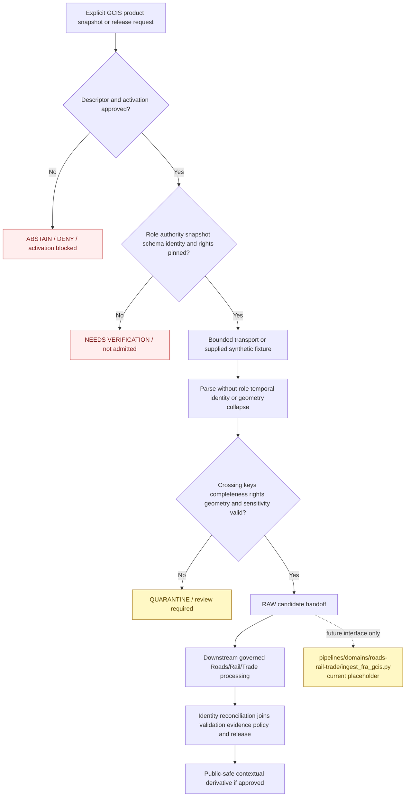

<!-- [KFM_META_BLOCK_V2]
doc_id: kfm://doc/connectors-fra-gcis-readme
title: connectors/fra_gcis/ — FRA GCIS Connector Lane
type: readme
version: v0.2
status: draft
owners: OWNER_TBD — Connector steward · FRA/GCIS source steward · Roads/Rail/Trade steward · Rail-network steward · Settlements/Infrastructure steward · Rights reviewer · Privacy/sensitivity reviewer · Security reviewer · Validation steward · Docs steward
created: 2026-06-18
updated: 2026-07-11
policy_label: public-context; source-admission; greenfield; no-network-default; administrative-inventory; crossing-identity-aware; source-vintage-aware; coordinate-disagreement-preserving; sensitive-joins-fail-closed; raw-or-quarantine-only; no-navigation; no-safety-determination; no-publication
proposed_path: connectors/fra_gcis/README.md
truth_posture: CONFIRMED README-only connector lane / implementation ABSENT / SourceDescriptor ABSENT or UNPROVED / current GCIS schema and access UNRESOLVED / source NOT ACTIVATED / downstream pipeline PLACEHOLDER / tests and CI ABSENT or UNKNOWN
related:
  - ../README.md
  - ../fra_form57/README.md
  - ../stb_class1/README.md
  - ../ntad/README.md
  - ../../docs/sources/catalog/usdot/README.md
  - ../../docs/sources/catalog/usdot/fra-gcis.md
  - ../../docs/sources/catalog/usdot/fra-form57.md
  - ../../docs/sources/catalog/usdot/stb-class1.md
  - ../../docs/sources/catalog/usdot/ntad.md
  - ../../docs/domains/roads-rail-trade/README.md
  - ../../docs/domains/roads-rail-trade/SOURCES.md
  - ../../docs/domains/roads-rail-trade/SOURCE_FAMILIES.md
  - ../../docs/domains/roads-rail-trade/IDENTITY_MODEL.md
  - ../../docs/domains/roads-rail-trade/CANONICAL_PATHS.md
  - ../../docs/domains/settlements-infrastructure/README.md
  - ../../data/registry/roads-rail-trade/sources/README.md
  - ../../data/registry/sources/README.md
  - ../../data/raw/roads-rail-trade/README.md
  - ../../data/quarantine/roads-rail-trade/
  - ../../pipelines/domains/roads-rail-trade/ingest_fra_gcis.py
  - ../../fixtures/
  - ../../schemas/contracts/v1/source/
  - ../../policy/domains/roads-rail-trade/
  - ../../policy/sensitivity/
  - ../../policy/rights/
  - ../../release/
tags: [kfm, connectors, fra, gcis, grade-crossing, rail, administrative-inventory, crossing-identity, source-vintage, coordinate-disagreement, roads-rail-trade, settlements-infrastructure, source-admission, raw, quarantine, governance]
notes:
  - "Repository inspection confirms that connectors/fra_gcis/ contains this README only; no package metadata, Python module, client, parser, fixture, test, SourceDescriptor, activation record, source payload, or passing CI evidence is proved."
  - "The only directly named downstream GCIS pipeline file is an eight-line PROPOSED placeholder docstring; it is not executable ingestion evidence."
  - "The source profile proposes GCIS as an administrative crossing inventory and rail-stack join anchor, while the Roads/Rail/Trade identity model treats external authority identifiers as evidence anchors rather than sufficient KFM identity by themselves."
  - "The source profile explicitly leaves current access surfaces, schema fields, code lists, cadence, rights, crossing-ID stability, GNIS coverage, and GCIS-versus-HIFLD/NTAD coordinate policy unresolved."
  - "Naming and topology drift remain unresolved: proposed source ID fra_gcis, source-profile references to data/raw/roads-rail-trade/fra_gcis/, no confirmed RAW child lane, and domain-first versus subtype-first source-registry patterns."
  - "GCIS inventory state must not be converted into observed change, current warning-device operation, current traffic, legal access, route safety, or emergency guidance."
[/KFM_META_BLOCK_V2] -->

<a id="top"></a>

# FRA GCIS Connector Lane

> Evidence-grounded boundary for future Federal Railroad Administration Grade Crossing Inventory System source-admission code. The current directory is documentation-only. It does **not** provide an importable connector, live FRA access, an activated source, executable tests, RAW captures, downstream ingestion, canonical crossing identity, current crossing status, safety guidance, routing authority, or publication capability.

<p>
  
  
  
  
  
  
  
</p>

`connectors/fra_gcis/`

> [!IMPORTANT]
> **Confirmed state:** this directory contains this README only. No `pyproject.toml`, `src/`, importable package, endpoint configuration, SourceDescriptor, activation decision, client, downloader, parser, schema adapter, identity reconciler, handoff builder, fixture set, test suite, RAW child lane, or passing CI evidence is confirmed. The named downstream pipeline file is a placeholder docstring, not working ingestion logic. Treat every implementation structure, command, endpoint, field name, code list, identifier rule, and outcome below as a future contract or proposal—not current behavior.

**Quick jumps:** [Purpose](#purpose) · [Verified repository state](#verified-repository-state) · [Evidence ledger](#evidence-ledger) · [Connector authority boundary](#connector-authority-boundary) · [Blocking drift](#blocking-drift) · [Source identity scope and role](#source-identity-scope-and-role) · [What GCIS may and may not support](#what-gcis-may-and-may-not-support) · [Access-surface and product classification](#access-surface-and-product-classification) · [Input contract](#input-contract) · [Metadata preservation](#metadata-preservation) · [Temporal snapshot and correction handling](#temporal-snapshot-and-correction-handling) · [Crossing identity and re-identification discipline](#crossing-identity-and-re-identification-discipline) · [Geometry and cross-source disagreement](#geometry-and-cross-source-disagreement) · [Rights sensitivity and join risk](#rights-sensitivity-and-join-risk) · [Cross-domain routing](#cross-domain-routing) · [Finite outcomes](#finite-outcomes) · [Lifecycle boundary](#lifecycle-boundary) · [Proposed implementation shape](#proposed-implementation-shape) · [Testing relationship](#testing-relationship) · [Pipeline and downstream separation](#pipeline-and-downstream-separation) · [Implementation sequence](#implementation-sequence) · [Activation gates](#activation-gates) · [Review and rollback](#review-and-rollback) · [Definition of done](#definition-of-done) · [Verification backlog](#verification-backlog)

---

## Purpose

`connectors/fra_gcis/` is the reserved source-specific connector lane for FRA GCIS admission behavior.

When implementation exists, connector code may:

- validate explicit, side-effect-free connector configuration;
- consume an accepted SourceDescriptor reference and activation decision supplied by governed callers;
- identify one specifically approved GCIS release, inventory snapshot, archive, extract, table, service, or metadata surface;
- retrieve approved source material through bounded, replaceable transport;
- parse synthetic fixtures or approved GCIS-shaped payloads without upgrading an inventory record into observed change or current operational truth;
- preserve provider, product, snapshot, crossing, submitting-entity, source-role, authority, temporal, spatial, rights, sensitivity, retrieval, and digest metadata;
- preserve source-issued crossing identity, public/private classification, configuration, warning-device, exposure, operator, road, jurisdiction, and related attributes where present and verified;
- detect missing source vintage, incomplete capture, duplicate or unstable crossing identity, schema or code-list drift, coordinate uncertainty, cross-source disagreement, rights uncertainty, or sensitive-join risk;
- return finite error, abstention, activation-blocked, drift, review, RAW-candidate, or QUARANTINE-candidate results;
- remain deterministic and testable with no network, no account, and no credentials.

This lane must never become:

- final crossing truth, canonical KFM crossing identity, or canonical rail-network topology;
- a per-crossing observed event timeline merely because some attributes carry dates;
- current warning-device operation, crossing closure, train movement, traffic, restriction, passability, or maintenance status;
- legal-access, public/private entry-permission, ownership, right-of-way, enforcement, or liability authority;
- roadway, rail, dispatch, routing, navigation, emergency, or crossing-safety guidance;
- accident or casualty evidence that belongs to separately admitted incident sources such as Form 57;
- source-registry, schema, policy, proof, catalog, release, or public-data authority.

[Back to top ↑](#top)

---

## Verified repository state

The following relationship is confirmed on the repository's `main` branch at the time of this update:

```text
connectors/
└── fra_gcis/
    └── README.md                              # this connector contract

pipelines/
└── domains/
    └── roads-rail-trade/
        └── ingest_fra_gcis.py                 # PROPOSED placeholder docstring only
```

Related documentation and lifecycle surfaces exist elsewhere:

```text
docs/sources/catalog/usdot/fra-gcis.md
docs/sources/catalog/usdot/fra-form57.md
docs/sources/catalog/usdot/stb-class1.md
docs/sources/catalog/usdot/ntad.md
docs/domains/roads-rail-trade/IDENTITY_MODEL.md
docs/domains/settlements-infrastructure/
data/registry/roads-rail-trade/sources/README.md
data/raw/roads-rail-trade/README.md
```

### Current maturity

| Surface | Confirmed content | Maturity |
|---|---|---:|
| `connectors/fra_gcis/README.md` | This source-admission contract. | **DOCUMENTED** |
| Other files below `connectors/fra_gcis/` | None found in current repository search. | **ABSENT / NEEDS CONTINUOUS VERIFICATION** |
| Package metadata | None confirmed. | **ABSENT** |
| Importable connector namespace | None confirmed. | **ABSENT / UNPROVED** |
| FRA transport/client | None confirmed. | **ABSENT** |
| GCIS parser, validator, identity, or handoff code | None confirmed. | **ABSENT** |
| Connector-local fixtures or tests | None confirmed. | **ABSENT** |
| Accepted GCIS SourceDescriptor | None found or verified in this update. | **ABSENT / NEEDS VERIFICATION** |
| Source role | Proposed as `administrative`, with FRA dataset authority and possible submitting-entity provenance. | **PROPOSED / NEEDS DESCRIPTOR** |
| Rail-stack join-anchor role | Proposed by the source profile; no binding implementation contract exists. | **PROPOSED / NEEDS IDENTITY REVIEW** |
| Live source access | No approved endpoint or access surface confirmed. | **NOT ACTIVATED** |
| `pipelines/domains/roads-rail-trade/ingest_fra_gcis.py` | Eight-line placeholder docstring. | **PLACEHOLDER / NON-EXECUTABLE** |
| GCIS RAW child lane | Parent RAW README confirms no child source-family README lanes. | **ABSENT / PROPOSED** |
| Connector-specific CI evidence | None confirmed. | **UNKNOWN** |

> [!CAUTION]
> A connector-shaped directory, source catalog page, or pipeline-shaped placeholder does not constitute an implementation. Do not describe this connector as installable, importable, runnable, activated, tested, rights-cleared, schema-pinned, current, complete, or production-ready until repository artifacts and reviewable execution evidence support those claims.

[Back to top ↑](#top)

---

## Evidence ledger

| Evidence | Status | What it supports | What it does not support |
|---|---:|---|---|
| `connectors/fra_gcis/README.md` | **CONFIRMED** | The connector lane and its boundary exist. | Executable connector behavior. |
| Current repository search for `connectors/fra_gcis/` | **CONFIRMED for inspected state** | Only this README was found under the connector path. | Permanent absence or unindexed future files. |
| `docs/sources/catalog/usdot/fra-gcis.md` | **CONFIRMED draft source profile** | Proposed source ID, administrative role, inventory semantics, crossing-number anchor, temporal handling, coordinate-disagreement problem, sensitivity-elevating joins, and open questions are documented. | Current endpoint, schema, cadence, rights, activation, crossing-ID stability, or implementation. |
| `docs/domains/roads-rail-trade/IDENTITY_MODEL.md` | **CONFIRMED draft domain identity doctrine** | KFM identity uses source, object role, temporal scope, and normalized digest; external IDs are evidence anchors rather than sufficient identity alone. | A binding GCIS connector identity schema or implemented resolver. |
| `docs/sources/catalog/usdot/README.md` | **CONFIRMED draft family documentation** | GCIS is a named FRA rail product in the proposed USDOT family and the connector path is documented. | Ratified USDOT-family placement, connector activation, or runtime maturity. |
| `data/registry/roads-rail-trade/sources/README.md` | **CONFIRMED registry documentation** | Source identity, role, rights, cadence, activation, authority limits, and caveats belong in the source registry. | A completed GCIS descriptor or settled registry topology. |
| `data/raw/roads-rail-trade/README.md` | **CONFIRMED RAW documentation** | RAW is immutable, no-public-path, source-role-preserving, and has no confirmed child source-family README. | A GCIS capture, receipt, or accepted child-folder name. |
| `pipelines/domains/roads-rail-trade/ingest_fra_gcis.py` | **CONFIRMED placeholder** | A future downstream ingest responsibility has been named. | Executable parsing, identity resolution, coordinate reconciliation, cross-domain routing, or lifecycle transition. |
| Connector tests and CI | **ABSENT / UNKNOWN** | Test requirements can be documented here. | Passing behavior or enforcement. |

[Back to top ↑](#top)

---

## Connector authority boundary

```text
THIS CONNECTOR MAY EVENTUALLY:
  validate explicit configuration
  verify descriptor and activation preconditions
  identify one approved GCIS product snapshot release or surface
  perform bounded source retrieval
  parse supplied GCIS-shaped records tables or archives
  preserve product snapshot crossing authority role field time and geometry metadata
  detect incomplete capture schema drift unstable keys coordinate disagreement and sensitive-join risk
  return finite connector outcomes
  prepare RAW-or-QUARANTINE handoff candidates

THIS CONNECTOR MUST NOT:
  assign canonical SourceDescriptor values by itself
  treat an FRA crossing number as sufficient KFM object identity without the accepted identity contract
  infer role or authority from provider name filename layer name or URL
  convert the administrative inventory into an observed-change timeline
  infer current warning-device operation traffic exposure closure restriction passability or safety
  interpret public/private classification as legal permission to enter or cross
  conflate GCIS geometry with canonical KFM road or rail geometry
  silently snap merge average or canonicalize conflicting GCIS HIFLD NTAD or domain coordinates
  create Form 57 incidents casualty claims carrier metrics or facility vulnerability from inventory rows
  provide navigation routing dispatch emergency legal engineering or crossing-safety guidance
  define policy rights sensitivity schemas proof catalog or release decisions
  write directly to WORK PROCESSED CATALOG TRIPLET PROOF RECEIPT RELEASE or PUBLISHED authority roots
  serve public APIs maps tiles graphs reports stories search payloads or generated answers
```

The connector preserves what a specifically admitted GCIS snapshot says, which crossing identifier and attributes it carries, who supplied or curated the record, and the source scope under which it was issued. It does not decide that the material is canonical KFM identity, current operational truth, legally controlling, safe for routing, or eligible for public release.

[Back to top ↑](#top)

---

## Blocking drift

The connector cannot be implemented safely until these gaps are resolved or represented as explicit fail-closed conditions.

| Blocker | Current state | Required resolution |
|---|---|---|
| Connector implementation | README-only directory. | Select an implementation and packaging convention; add code only with tests and ownership. |
| Source identity | `fra_gcis` is a proposed source-ID hint, not a verified admitted identifier. | Approve a canonical source/product ID in the accepted registry. |
| Registry topology | Domain-first `data/registry/roads-rail-trade/sources/` and subtype-first `data/registry/sources/roads-rail-trade/` patterns both appear in documentation. | Choose one canonical descriptor home or governed compatibility/migration plan. |
| RAW child naming | The source profile proposes `data/raw/roads-rail-trade/fra_gcis/`; the RAW parent confirms no child lane and offers only hyphenated examples for future families. | Accept one handoff identifier or an explicitly governed alias contract. |
| Join anchor versus KFM identity | Source profile calls the FRA crossing number the rail-stack join key; the domain identity model says external IDs are evidence anchors, not sufficient identity alone. | Define the binding relationship between `fra_gcis` source identity, FRA crossing number, temporal scope, normalized digest, KFM object identity, and supersession. |
| Source role and authority | Inventory is proposed `administrative`; FRA is dataset authority; per-record submitting carrier/state authority is not confirmed consistently. | Pin descriptor-level role and record-level submitting-authority fields without upgrading dated attributes to `observed`. |
| Access surface | Current endpoint, service, download, archive, extract, query, or export form is unverified. | Pin approved product surfaces and prohibit provider-wide or guessed access. |
| Release, schema, and cadence | Current snapshot naming, field inventory, code lists, submission cadence, public release cadence, and technical guidance are unverified. | Pin a release/schema fingerprint and drift policy. |
| Crossing-ID stability | FRA crossing-number stability, retirement, merge, split, reuse, and re-identification behavior are unverified. | Define stable-key and supersession rules before incremental updates or cross-source joins. |
| Snapshot completeness | Expected public/private coverage, record counts, archive members, geographic scope, and completeness evidence are unverified. | Define capture accounting and partial-run outcomes. |
| Inventory-versus-observation decomposition | Installation, survey, exposure, or other dated attributes may carry observation semantics. | Decide whether they remain attributed inventory metadata or become separately admitted observations downstream. |
| Coordinate disagreement | GCIS versus HIFLD/NTAD/domain geometry policy is an explicit rail-stack open question. | Preserve every source geometry, define review thresholds, and choose canonical join behavior through an accepted ADR or contract. |
| GNIS/name anchoring | Source profile proposes GNIS anchoring for crossing road/locality names, but coverage and fallback behavior are unverified. | Define optional downstream name-authority behavior; do not make it a hidden connector dependency. |
| Rights and terms | Current terms, attribution, redistribution, and caveats are unverified. | Complete a source-specific rights snapshot before activation or public-safe derivatives. |
| Sensitive joins | Form 57, STB, hazmat/facility, parcel/person, and Indigenous-corridor joins are not governed here. | Adopt fail-closed policy and negative tests before any elevated join can leave quarantine. |
| Handoff contract | No binding connector-result or RAW/QUARANTINE envelope is confirmed. | Select contract, schema, validation, routing, and finite error semantics. |
| Downstream pipeline | Named pipeline file is a placeholder docstring only. | Implement separately after connector handoff contracts exist; do not treat the placeholder as a working consumer. |
| Fixtures and tests | None confirmed. | Add synthetic no-network fixtures and executable behavior tests. |
| CI | No passing connector-specific run is confirmed. | Prove a clean local no-network command before claiming CI enforcement. |

Do not hide these gaps with guessed endpoint URLs, permissive role defaults, invented field schemas, assumed crossing-ID stability, broad FRA activation, silent coordinate snapping, or examples presented as operational configuration.

[Back to top ↑](#top)

---

## Source identity, scope, and role

The current working provider/product identity is:

```text
provider: Federal Railroad Administration (FRA / USDOT)
product family: Grade Crossing Inventory System (GCIS)
proposed KFM source ID: fra_gcis
connector path: connectors/fra_gcis/
proposed primary domain route: roads-rail-trade
```

Only the connector path and repository documentation are confirmed. The source ID, exact product scope, current release identity, source surfaces, schema, and operational fields remain subject to source-registry approval.

### Source-role and authority requirement

Repository source documentation proposes:

| Dimension | Proposed posture | Connector requirement |
|---|---|---|
| Inventory source role | `administrative` | Preserve the curated-inventory role without converting the snapshot into `observed`, `regulatory`, `modeled`, or `aggregate`. |
| Dataset-level authority | FRA | Preserve FRA release, curation, publication, and correction context. |
| Record-level submitting authority | Carrier, railroad, state, or another source-identified submitter where supplied | Preserve the actual submitter field and source lineage; do not infer one from the current operator name. |
| Per-attribute dates | Inventory metadata or separately modeled observations, pending contract | Preserve exact dates and meanings without upgrading the inventory role. |
| Aggregate or analytic derivative | Separate downstream product | Never rewrite the underlying administrative record as an aggregate or observed event. |

An `administrative` role does not mean every inventory value is timeless or authoritative for every use. In particular:

- warning-device, exposure, survey, track, road, operator, or classification fields remain source-attributed inventory state;
- an installation date does not make the whole record an event;
- a current-looking value is not current merely because it appears in the latest retrieved file;
- FRA curation does not prove every submitting entity's field is complete or contemporaneous;
- connector parsing must not silently strengthen the epistemic status of a field;
- role or authority corrections require reviewed descriptor or correction evidence, not parser convenience.

[Back to top ↑](#top)

---

## What GCIS may and may not support

Subject to exact-product and snapshot admission, GCIS material may support downstream contextual claims about:

- a source-reported crossing inventory record at a specifically identified snapshot;
- the FRA crossing inventory number carried by the source;
- public/private classification as a source attribute, not an access permission;
- source-carried crossing type, grade relationship, track count, road context, jurisdiction, warning-device configuration, surface, illumination, sight-distance, exposure, or special-use indicators where present and verified;
- source-carried operator, railroad, submitting-entity, state, county, route, street, locality, or geographic references;
- source-carried point geometry and coordinate metadata;
- snapshot-to-snapshot comparison when identity, schema, codes, source scope, and temporal semantics remain compatible;
- candidate joins to Form 57, NTAD/HIFLD, STB, GNIS, rail-network, road-network, crossing-facility, and time-aware evidence downstream;
- a proposed rail-stack join anchor when an accepted identity and supersession contract exists.

GCIS does **not** by itself prove:

- current warning-device operation, maintenance state, malfunction, closure, restriction, traffic, train count, sight distance, or crossing safety;
- an observed change event merely because a field carries a survey, installation, or measurement date;
- legal access, public right of entry, ownership, title, easement, right-of-way, enforcement, or liability;
- canonical KFM crossing, road-segment, rail-segment, operator, facility, or network-node identity;
- that source coordinates are exact, current, or superior to HIFLD, NTAD, road, rail, parcel, or facility geometry;
- accident, casualty, incident, hazmat release, service disruption, or carrier-performance history;
- complete national, state, county, carrier, or public/private coverage without capture-completeness evidence;
- biological, demographic, parcel, infrastructure-vulnerability, or cultural conclusions created through joins;
- absence of a crossing from an empty, filtered, partial, or stale result;
- navigation suitability, route safety, emergency response, legal interpretation, engineering certification, or operational instruction.

[Back to top ↑](#top)

---

## Access-surface and product classification

Every source input must be classified before retrieval or parsing. The exact current GCIS access surfaces remain unverified.

| Surface class | Allowed future use | Prohibited use |
|---|---|---|
| Official GCIS inventory snapshot, archive, or extract | Immutable source capture after descriptor and activation gates. | Silent overwrite, unversioned extraction, or implicit publication. |
| Record-level table or feature product | Parsing and source-admission validation under a pinned schema and snapshot identity. | Assuming every record or field shares one date, authority, quality, or completeness state. |
| Data dictionary, code list, technical guide, submission instructions, or release metadata | Field meaning, role, key, time, geometry, authority, and drift evidence. | Source activation by itself. |
| Service or API surface | Bounded retrieval only after endpoint, limits, completeness, and terms review. | Guessed URLs, provider-wide crawling, hidden pagination, or unbounded queries. |
| Incremental, correction, retirement, or replacement material | New immutable source state with explicit lineage. | In-place mutation of prior captures or silent crossing re-identification. |
| Public dashboard, map, or rendered product | Human reference where accurately labeled. | Feature extraction, field reconstruction, canonical geometry, or analytic replacement for governed source data. |
| Downstream map, graph, risk score, alert, report, search index, or AI summary | Released presentation only after validation, evidence, policy, and release. | Evidence substitution or direct connector output. |

A shared FRA or USDOT provider does not create umbrella admission across GCIS, Form 57, investigation products, safety datasets, carrier metrics, NTAD, or other transportation surfaces.

[Back to top ↑](#top)

---

## Input contract

Future live or fixture-backed operations should require explicit inputs, subject to the accepted connector contract:

- canonical SourceDescriptor reference;
- SourceActivationDecision or accepted equivalent;
- provider and exact GCIS product/release/snapshot/table key;
- approved source surface, archive, service, file, table, export, or query identity;
- source snapshot, publication, update, correction, or retrieval-vintage scope;
- explicit `administrative` role and authority model;
- FRA crossing inventory number field or accepted stable/composite source key;
- schema, data-dictionary, and code-list identity or fingerprint;
- current rights and terms snapshot reference;
- sensitivity and join-risk posture reference;
- validated geography, state, county, crossing, carrier, release, table, or query scope;
- timeout, retry, size, pagination, archive, redirect, and checksum limits where applicable;
- intended primary domain route and any separately governed downstream candidate routes;
- lifecycle target of RAW or QUARANTINE only;
- synthetic no-network fixture or approved source payload supplied through an explicit interface.

Required behavior:

- reject missing or ambiguous product, release, snapshot, table, crossing-key, or authority identity;
- reject missing descriptor or activation evidence for live behavior;
- reject unknown or non-admitted releases, tables, or correction products;
- reject product/role/authority mismatches;
- reject source rows whose required crossing identity cannot be established;
- never route by URL substring, filename, extension, layer name, table title, or provider name alone;
- never activate every FRA or USDOT product through one provider-wide switch;
- never treat a public map or dashboard as permission to reconstruct the governed source table;
- keep fixture configuration unable to fall through to live transport;
- document no endpoint, environment-variable name, credential convention, marker, or live command as accepted until implementation and security review establish it.

[Back to top ↑](#top)

---

## Metadata preservation

Every non-error candidate should preserve, where applicable and confirmed by the admitted source product.

### Source and product minimum

- canonical KFM source identifier;
- FRA/USDOT provider identity;
- exact GCIS product, release, snapshot, table, file, archive, service, or query identity;
- source role and role authority;
- submitting carrier, railroad, state, agency, or other source-issued contributor identity where present;
- source URI, distribution, archive, service, table, file, or query identity;
- source snapshot/vintage, publication date, update date, correction state, and retrieval state;
- schema/data-dictionary identity, code-list identity, and field fingerprint;
- connector and parser version;
- rights, attribution, sensitivity, restriction, and review state;
- checksum or digest;
- intended primary domain route and any review-only downstream route candidates;
- intended lifecycle target of RAW or QUARANTINE only;
- drift, stale, incomplete, corrected, superseded, retired, quarantine, and review flags.

### Crossing and inventory semantics

Where present and verified, preserve source-issued values for:

- FRA crossing inventory number and any alternate, prior, retired, or superseding identifiers;
- source record status, update status, public/private classification, crossing type, and grade relationship;
- submitting entity, operating railroad, railroad codes, route, subdivision, or operational references;
- road, street, highway, route, locality, county, state, FIPS, and jurisdiction fields;
- number of tracks, crossing angle, surface, illumination, sight-distance, surrounding-land-use, and configuration fields;
- warning-device types, counts, installation dates, update dates, and status codes as inventory attributes;
- highway exposure, train counts, passenger, school-bus, hazmat, or other source-carried indicators and their observation/source dates;
- source field names and code values before downstream recoding;
- field definitions, units, null/unknown/not-applicable semantics, code lists, confidence/quality flags, and source caveats.

The connector must not invent a field inventory from this README. It must pin and test the actual admitted source shape.

### Capture and completeness minimum

- query or release scope;
- expected and received files, pages, members, rows, or records where available;
- row count, unique-key count, duplicate count, rejected-row count, and unresolved-row count;
- archive membership and extraction status;
- checksum verification status;
- first/last stable source identity where meaningful;
- public/private and geographic scope counts where the source provides them;
- partial-download, partial-page, truncated-record, and interrupted-run state;
- schema and code-list drift evidence.

### Spatial and reference minimum

Where present and verified, preserve:

- source coordinate fields and coordinate source;
- geometry type and source geometry;
- CRS and horizontal datum;
- coordinate precision, uncertainty, rounding, suppression, or geocoding basis;
- crossing, road, rail, route, subdivision, milepost, jurisdiction, and locality references;
- source versus joined geometry status;
- geometry fingerprint or equivalent deterministic source-geometry digest;
- clipping, reprojection, repair, generalization, snapping, or conflation status;
- geometry and attribute checksums or fingerprints;
- disagreement flags for HIFLD, NTAD, GNIS, road-network, rail-network, or other downstream anchors.

Source-issued values must remain inspectable. Simplified, crosswalked, conflated, generalized, aggregated, or derived values may be added downstream only when originals and transformation evidence remain governed and available to authorized reviewers.

[Back to top ↑](#top)

---

## Temporal, snapshot, and correction handling

GCIS is source-vintage and inventory-state sensitive. A prior snapshot must never be presented as current operational status by convenience.

Keep these time meanings distinct when material:

| Time kind | Connector meaning | Guardrail |
|---|---|---|
| Inventory/source snapshot time | Date or version under which FRA published or represented the inventory state. | Required for every promotion-track candidate. |
| Per-attribute observation, survey, measurement, or installation time | Date carried by a specific field or source submission. | Does not upgrade the entire inventory record to `observed`. |
| Valid/effective time | Period during which the source asserts the inventory state applies, if the contract defines one. | Must not be inferred solely from retrieval date. |
| Submitting-entity update time | When a carrier, railroad, state, or other contributor updated the source record, if supplied. | Preserve separately from FRA publication. |
| FRA publication/update time | When FRA issued or revised the source release. | Preserve separately from snapshot meaning and retrieval. |
| Retrieval time | When KFM captured the source material. | Required for provenance and stale-state review. |
| Downstream release time | When a governed KFM derivative was released. | Outside connector authority. |
| Correction/retirement/supersession time | When a prior source or KFM artifact was corrected, replaced, retired, merged, split, or withdrawn. | Requires new capture and lineage; no silent overwrite. |

Required behavior:

- never overwrite a prior source capture silently;
- bind each capture to product/release identity, snapshot, schema fingerprint, scope, and checksum;
- treat corrected or replacement inventory records as new source states with explicit lineage;
- preserve prior crossing IDs, hashes, geometries, and source states for audit;
- distinguish source correction from downstream interpretation correction;
- block “current crossing,” “currently active,” “currently protected,” or “currently safe” language without appropriate current-source evidence;
- prevent attribute dates from replacing inventory snapshot time;
- detect changes to crossing identity, status, public/private class, coordinates, operator, road, warning devices, track configuration, exposure, and code meanings;
- require downstream invalidation or recomputation of affected joins, maps, indexes, risk analyses, and released derivatives when identity or geometry changes materially;
- emit drift or review outcomes when update semantics, stable keys, field definitions, or retirement behavior change.

The connector records correction evidence and handoff flags. CorrectionNotice, graph invalidation, public correction, release rollback, and derivative withdrawal remain downstream responsibilities.

[Back to top ↑](#top)

---

## Crossing identity and re-identification discipline

The source profile proposes the FRA crossing inventory number as the rail-stack join key. The domain identity model separately requires a KFM identity envelope that includes source, object role, temporal scope, and normalized digest.

The safe combined posture is:

1. Preserve the FRA crossing inventory number exactly as a source-native authority anchor.
2. Do not treat that number alone as sufficient KFM object identity.
3. Bind every candidate to the admitted `source_id`, object role, snapshot/temporal scope, and normalized source digest.
4. Preserve alternate, prior, retired, replaced, merged, split, and superseding source identifiers where the source supplies them.
5. Reject duplicate source identifiers within the same admitted scope unless the product contract explicitly permits them.
6. Do not silently merge two records because their coordinates match.
7. Do not silently split one record because coordinates or attributes changed.
8. Treat source re-identification, merge, split, or identifier reuse as a rail-stack-wide correction-review event.
9. Preserve historical identifiers for time-aware joins to Form 57, NTAD/HIFLD, STB, roads, rails, and released derivatives.
10. Keep canonical KFM `Crossing` identity creation and identity reconciliation in governed downstream domain processing.

A connector-side source-key validator may confirm source-key shape and uniqueness. It must not become the domain identity authority.

[Back to top ↑](#top)

---

## Geometry and cross-source disagreement

GCIS location material is source evidence, not canonical KFM road/rail topology, legal access, or routing authority.

Minimum posture:

1. Record upstream CRS, datum, precision, coordinate source, and geocoding basis from source metadata; do not infer them from coordinate appearance.
2. Preserve source coordinates, crossing identifiers, road/rail references, mileposts, jurisdictions, and location descriptions where supplied.
3. Distinguish source-carried point geometry, textual location, generalized geometry, road/rail intersection candidates, and downstream conflated geometry.
4. Do not snap, merge, average, conflate, or assign canonical KFM crossing, road-segment, rail-segment, or network-node identity inside the connector unless a binding pre-admission contract explicitly requires a bounded transform with evidence.
5. Treat the FRA crossing number as a source-attributed join candidate, not proof that every coordinate source agrees.
6. Route empty, truncated, invalid, unsupported, over-precise, or ambiguous geometry to review or quarantine.
7. Record every reprojection, coordinate repair, geocoding, snapping, clipping, generalization, or simplification as downstream transformation evidence.
8. Do not infer current access, passability, closure, operating status, facility security, ownership, or navigation suitability from crossing geometry.
9. Keep GCIS-to-HIFLD, GCIS-to-NTAD, GCIS-to-GNIS, GCIS-to-road, GCIS-to-rail, GCIS-to-parcel, and GCIS-to-facility matching in governed downstream pipelines with confidence, disagreement, review, correction, and rollback support.
10. When GCIS, HIFLD, NTAD, road, rail, or other geometries disagree, preserve the competing references and block silent canonicalization.

### Coordinate-disagreement contract

Until the rail-stack ADR or equivalent contract resolves the issue, future tests and runtime behavior should require:

- every compared geometry remains source-attributed;
- the comparison method, units, threshold, CRS, and distance result are explicit;
- no automatic average or snap is treated as source truth;
- any chosen join preference is configuration- and descriptor-backed;
- alternate geometries remain inspectable;
- material disagreement returns a review or quarantine outcome;
- downstream transform and review evidence is required before a reconciled geometry is promoted;
- public output does not hide the existence of a material disagreement when it affects the claim.

GNIS-based name anchoring, where supported, is downstream authority-resolution work. The connector may preserve source names and candidate GNIS references but must not silently replace source text or require GNIS as an undocumented live dependency.

[Back to top ↑](#top)

---

## Rights, sensitivity, and join risk

Public-source availability does not create a blanket public-safe, current-safe, or join-safe decision.

### Inventory-level posture

- verify current rights, attribution, redistribution, and source terms before activation;
- preserve public/private classification as source metadata without interpreting it as permission or legal access;
- preserve operator/carrier attribution and review any product that exposes commercially or operationally sensitive combinations;
- preserve source-side suppression, withholding, rounding, or caveats;
- do not call a warning-device, traffic-exposure, passenger, school-bus, hazmat, or safety-related field current without current-source support;
- keep logs, fixtures, snapshots, and errors minimized and free of unnecessary source rows.

### Sensitivity-elevating joins

| Join | Elevated risk | Connector posture |
|---|---|---|
| GCIS × Form 57 | Casualty, operator, hazmat, incident, and precise-location inference. | Do not join in the connector; downstream privacy/security review required. |
| GCIS × STB or carrier operations | Operator commercial or operational detail at infrastructure scale. | Preserve source IDs only; review downstream use. |
| GCIS × hazmat consist, facility, utility, or security data | Critical-infrastructure dependency or vulnerability inference. | Fail closed absent explicit policy and review. |
| GCIS × parcel, person, household, ownership, or access data | Person-parcel or private-access inference. | Deny or quarantine absent governed purpose and policy. |
| GCIS × Indigenous trade or mobility corridors | Cultural, sovereignty, and interpretation risk. | Steward review where governing doctrine requires it. |
| GCIS × current closure, dispatch, maintenance, or warning-device feed | Operational-status and safety risk. | Require separately admitted current sources; do not inherit GCIS activation. |

Required controls:

- keep rights separate from sensitivity, source role, currency, legal authority, and safety authority;
- never perform source-to-source joins inside the connector merely because join keys are available;
- preserve geography and precision so downstream policy can generalize, restrict, or deny appropriately;
- prohibit real person, parcel, facility-security, hazardous-material, restricted-access, or sensitive cultural data in committed fixtures;
- redact credentials and sensitive values from errors;
- route unresolved rights, precision, sensitivity, cultural-context, operational, or joining risk to restriction, quarantine, abstention, or denial;
- keep public transforms downstream and receipt-backed;
- treat generated maps, scores, summaries, indexes, and AI text as downstream carriers that cannot override source role, vintage, caveats, or release gates.

[Back to top ↑](#top)

---

## Cross-domain routing

GCIS is source-first and may support more than one downstream domain without cloning the connector or source payload.

### Primary admission route

The current source profile proposes Roads/Rail/Trade as the primary route. Until a binding handoff contract exists:

- do not create a source-specific RAW child merely from this README;
- do not dual-write one retrieval into Roads/Rail/Trade and Settlements/Infrastructure;
- preserve one source capture or source-reference manifest with explicit source identity, role, vintage, rights, and geometry;
- let governed downstream transforms create domain-specific candidates with lineage.

### Candidate downstream meanings

| Domain | Potential downstream candidate | Connector boundary |
|---|---|---|
| Roads/Rail/Trade | Source-attributed crossing inventory candidate, rail-stack join candidate, road/rail intersection candidate, or time-aware inventory-state candidate. | No canonical Crossing, network node, route, restriction, safety, or operational truth. |
| Settlements/Infrastructure | Crossing-as-infrastructure or facility-context candidate where contracts permit. | No facility vulnerability, engineering determination, ownership, access, or critical-asset publication. |
| Hazards or People/DNA/Land | No direct GCIS source route by default; possible downstream context only through separately admitted incident or exposure evidence. | No casualty, hazard-event, person, parcel, or emergency claim from GCIS alone. |

Cross-domain routing never changes the source role or removes rights, sensitivity, uncertainty, snapshot state, correction lineage, or source attribution.

[Back to top ↑](#top)

---

## Finite outcomes

Future connector APIs and tests should require a small documented set of deterministic outcomes rather than ambiguous partial success.

| Condition | Required safe behavior |
|---|---|
| Connector package absent or not installed | Fail clearly; do not report connector validation success. |
| SourceDescriptor missing | Refuse live activation with an actionable error. |
| Activation decision missing | `ABSTAIN` or activation-blocked result. |
| Source identity, product key, release, snapshot, table, or authority ambiguous | Validation failure or `NEEDS_VERIFICATION`. |
| Product/release/table not admitted | Product/table-not-admitted result. |
| Source role or authority unresolved | Review/activation block; do not choose a permissive default. |
| Product/role/authority mismatch | Validation failure. |
| Required crossing identity absent | Quarantine or reject the record; no anonymous join candidate. |
| Duplicate crossing identity within admitted scope | Validation failure or duplicate-review result. |
| Crossing-ID stability or supersession unresolved | Block deterministic update and cross-source joins. |
| Network disabled | Fixture/parser paths remain usable; live request returns bounded disabled outcome. |
| Unauthorized or forbidden | Finite redacted error; no credential leakage. |
| Timeout or rate limit | Bounded error; no infinite retry. |
| Unexpected redirect, host, content type, encoding, compression, or archive format | Validation failure or quarantine. |
| Empty response | `ABSTAIN` unless the approved product contract defines empty as valid. |
| Malformed response | Finite parser error with safe source metadata. |
| Archive/page/file incomplete or checksum mismatch | Incomplete-capture quarantine. |
| Schema, field, code-list, type, or release drift | Reviewable drift result; no silent field loss. |
| Source snapshot or vintage missing | Quarantine or abstention. |
| Inventory and per-attribute observation times collapsed | Validation failure. |
| Administrative inventory emitted as observed event history | Hard source-role anti-collapse failure. |
| Historic snapshot emitted as current operating or safety status | Hard temporal-boundary failure. |
| Public/private classification emitted as legal access permission | Hard authority-boundary failure. |
| Warning-device or exposure field emitted as current functioning state without current evidence | Validation failure or abstention. |
| CRS, datum, precision, crossing reference, or location basis unresolved | Quarantine; block silent spatial conflation. |
| GCIS/HIFLD/NTAD/domain coordinate disagreement hidden | Validation failure. |
| Sensitive join requested without policy support | Restrict, quarantine, or deny. |
| Runtime attempts to use downstream placeholder as proof of ingestion | Validation failure. |
| Direct downstream or public write attempted | Hard failure. |
| Navigation, dispatch, emergency, legal-access, liability, engineering, safety, or crossing-operation determination requested | Refuse and direct callers to official or governed channels. |

Errors must be deterministic, actionable, finite, safe to log, and free of secrets or unnecessary source-payload content.

[Back to top ↑](#top)

---

## Lifecycle boundary

The connector participates only at the source-admission edge.



The diagram defines responsibility boundaries. It does not prove package import, source access, parsing, identity handling, handoff, RAW storage, pipeline execution, coordinate reconciliation, cross-domain projection, evidence closure, or release.

KFM lifecycle discipline remains:

```text
RAW -> WORK / QUARANTINE -> PROCESSED -> CATALOG / TRIPLET -> PUBLISHED
```

The connector may construct a RAW/QUARANTINE handoff candidate only after a binding contract exists. It must not independently create canonical crossing identity, road/rail topology, current status, safety analysis, sensitive joins, catalog entries, proof, alerts, or publication artifacts.

[Back to top ↑](#top)

---

## Proposed implementation shape

No implementation layout is accepted. A coherent future package might look like:

```text
connectors/fra_gcis/
├── README.md
├── pyproject.toml
├── src/
│   └── fra_gcis/
│       ├── __init__.py
│       ├── config.py
│       ├── dispatch.py
│       ├── transport.py
│       ├── products.py
│       ├── parse.py
│       ├── validate.py
│       ├── identity.py
│       ├── handoff.py
│       └── errors.py
└── tests/
    ├── README.md
    ├── fixtures/
    ├── test_import_safety.py
    ├── test_configuration.py
    ├── test_activation_preconditions.py
    ├── test_product_snapshot_dispatch.py
    ├── test_transport.py
    ├── test_source_role_and_authority.py
    ├── test_parser_and_code_lists.py
    ├── test_snapshot_and_crossing_identity.py
    ├── test_geometry_and_disagreement.py
    ├── test_sensitive_joins.py
    ├── test_handoff_boundaries.py
    └── test_errors_and_drift.py
```

This tree is **PROPOSED**, not implementation evidence. Do not create it mechanically. Each module must correspond to implemented responsibility, an accepted contract, an owner, synthetic fixtures, executable tests, and a reviewed source/rights/sensitivity posture.

Potential responsibility split:

| Future module | Responsibility | Boundary |
|---|---|---|
| `config.py` | Side-effect-free validated configuration and safe defaults. | No self-activation, provider-wide switch, or hidden live fallback. |
| `dispatch.py` | Closed product/release/snapshot/table routing. | No URL/filename routing or role inference. |
| `transport.py` | Bounded replaceable download/service/archive transport. | No parsing policy, identity reconciliation, or hidden credential acquisition. |
| `products.py` | Pinned product surfaces, schema/code-list expectations, snapshot semantics, and correction behavior. | Not SourceDescriptor or authority. |
| `parse.py` | Deterministic source-shaped parsing with exact field/value preservation. | No canonical Crossing creation or observed-change inference. |
| `validate.py` | Connector-local identity, role, authority, snapshot, completeness, schema, geometry, and drift checks. | Not domain, legal, safety, or release authority. |
| `identity.py` | Source-key validation, duplicate detection, and source-level supersession references. | No KFM domain identity resolution, cross-source conflation, or canonicalization. |
| `handoff.py` | Finite connector results and RAW/QUARANTINE candidates. | No direct downstream promotion or cross-domain publication. |
| `errors.py` | Small deterministic redacted error taxonomy. | No secrets or unbounded payload excerpts. |

Before any package is called importable, it must declare a build backend, package discovery, supported Python version, dependencies, version policy, and a narrow side-effect-free import surface.

[Back to top ↑](#top)

---

## Testing relationship

No connector-local test directory or executable test is currently confirmed.

Future tests should prove:

- clean import with no network, secret read, filesystem write, logging setup, environment mutation, cache initialization, registry mutation, or source activation;
- no-network default transport behavior;
- explicit descriptor and activation requirements;
- closed product/release/snapshot/table dispatch;
- `administrative` inventory role, FRA curation, and submitting-entity provenance remain explicit;
- dated attributes do not upgrade the inventory into observed change;
- FRA crossing numbers remain source keys/evidence anchors and do not become sufficient KFM identity by themselves;
- snapshot, attribute-observation, contributor-update, FRA publication, retrieval, release, correction, retirement, and supersession times remain distinct;
- schema/data-dictionary, code-list, release, and source-shape drift produce reviewable outcomes;
- stable-key, duplicate, count, page, archive-member, and checksum failures close safely;
- source field names, code values, units, null semantics, quality flags, and caveats are preserved;
- public/private classification cannot become legal-access permission;
- warning-device, exposure, traffic, or safety fields cannot become current operational claims without separately admitted evidence;
- source-side suppression, rounding, withholding, and caveats are preserved;
- CRS, datum, precision, geometry, crossing references, and source disagreement route safely;
- GCIS geometry cannot become canonical road/rail/crossing identity at the connector edge;
- GCIS/HIFLD/NTAD/domain coordinate disagreement cannot be silently hidden or averaged;
- one source capture does not dual-write into multiple domain RAW lanes by convenience;
- Form 57, STB, facility, hazmat, parcel/person, and cultural-context joins remain downstream and fail closed without policy support;
- only finite connector results and RAW/QUARANTINE candidates are accepted;
- all direct WORK, PROCESSED, CATALOG, TRIPLET, PROOF, RECEIPT, RELEASE, PUBLISHED, alert, map, graph, routing, search, report, story, or generated-answer writes fail.

Fixtures must be synthetic, minimized, no-network, and free of real person, parcel, facility-security, hazmat-operational, restricted-access, or sensitive cultural data unless separately governed approval exists.

Minimum synthetic cases should include:

- valid administrative inventory record with snapshot, crossing key, source role, FRA authority, and source geometry;
- valid record with submitting-carrier or state provenance;
- per-attribute installation or survey date that does not change the inventory role;
- missing crossing number or stable key;
- duplicate crossing key within one snapshot;
- crossing re-identification or supersession case;
- changed field name, type, code list, or snapshot schema;
- incomplete archive/page or checksum mismatch;
- missing source snapshot or retrieval lineage;
- public/private classification presented as access permission;
- warning-device field presented as current functioning status;
- historic snapshot presented as current crossing condition;
- missing CRS/datum/precision/location basis;
- GCIS/HIFLD/NTAD coordinate disagreement;
- source geometry presented as canonical crossing identity;
- sensitive Form 57, carrier, facility, parcel/person, or cultural-context join request;
- one source run dual-written to multiple domain RAW lanes;
- downstream placeholder cited as ingestion proof;
- direct downstream-write attempt.

No test runner, dependency, local command, live-test flag, marker, endpoint constant, credential mode, fixture convention, or passing status is accepted by this README. A future command such as:

```bash
python -m pytest connectors/fra_gcis/tests
```

remains **PROPOSED** until packaging and tests exist and the repository-standard runner is verified.

[Back to top ↑](#top)

---

## Pipeline and downstream separation

Source access, source admission, domain processing, identity reconciliation, geometry conflation, sensitive joins, policy, evidence, and release are separate responsibilities.

| Surface | Responsibility | Must not do |
|---|---|---|
| `connectors/fra_gcis/` | Approved GCIS source access, parsing, connector-local validation, finite outcomes, and RAW/QUARANTINE handoff candidates. | Build canonical crossing/network truth, publish, or own domain normalization. |
| `pipelines/domains/roads-rail-trade/ingest_fra_gcis.py` | Future downstream ingest/normalization after admission. | Act as SourceDescriptor authority or bypass RAW/QUARANTINE; currently it is only a placeholder. |
| Roads/Rail/Trade identity/network packages | Downstream KFM Crossing identity, source-key reconciliation, road/rail intersection, topology, and time-aware inventory candidates under contracts. | Rewrite source evidence invisibly or claim legal/navigation/safety authority. |
| FRA Form 57 and other source connectors/pipelines | Separately admitted incident, carrier, network, or operational evidence. | Inherit activation, rights, role, or currency from GCIS adjacency. |
| Settlements/Infrastructure pipelines | Downstream crossing-as-infrastructure candidates under infrastructure sensitivity controls. | Publish vulnerability, ownership, access, or engineering conclusions from source detail alone. |
| Domain policies and validators | Decide admissibility, sensitive joins, currency, transforms, identity conflicts, and release prerequisites. | Fetch source material or infer role from convenience. |
| Evidence/catalog surfaces | Close provenance, citation, correction, coordinate-disagreement, and projection requirements after validation. | Treat connector output as proof automatically. |
| Release surfaces | Approve public-safe derivatives, corrections, withdrawal, supersession, and rollback. | Treat RAW, connector, pipeline, identity, or conflated candidates as released truth. |

A pipeline-shaped path is not proof of a working pipeline. A downstream Crossing object is not a source-role correction. A snapped point, graph node, safety score, map marker, or generated answer is not source truth or operational authority.

[Back to top ↑](#top)

---

## Implementation sequence

Implement in dependency order:

1. **Resolve source and path identity**
   - accept canonical source/product ID;
   - reconcile registry topology;
   - accept RAW child-lane and handoff naming.
2. **Resolve source role, authority, and identity model**
   - pin `administrative` role and FRA curation;
   - define submitting-entity provenance;
   - reconcile FRA crossing-number join use with the KFM identity envelope;
   - define re-identification, merge, split, retirement, and supersession behavior.
3. **Resolve source surface, schema, and cadence**
   - pin one product/release/snapshot surface;
   - verify data dictionary, code lists, field meanings, stable keys, counts, correction semantics, and geometry metadata.
4. **Resolve rights, sensitivity, and coordinate policy**
   - verify current terms and source-side caveats;
   - define sensitive-join and operational-status boundaries;
   - resolve or explicitly quarantine GCIS/HIFLD/NTAD/domain disagreement.
5. **Resolve packaging and contracts**
   - select implementation layout, build backend, package discovery, Python version, dependencies, and public imports;
   - select finite connector-result and RAW/QUARANTINE handoff contracts.
6. **Pin one source snapshot for fixture-only work**
   - create the smallest synthetic fixture set from verified field semantics;
   - include identity, temporal, geometry, drift, duplicate, completeness, and negative cases.
7. **Implement import safety, configuration, dispatch, and finite errors**
   - no-network defaults;
   - explicit product/release/snapshot/table keys;
   - deterministic redacted outcomes.
8. **Implement one fixture-only parser slice**
   - preserve source fields, role, authority, snapshot, crossing keys, time, geometry, and metadata;
   - add executable tests before live transport.
9. **Add validated transport**
   - only after source access form, terms, limits, completeness, security, and retention are reviewed;
   - keep transport replaceable by test doubles.
10. **Add handoff integration**
    - only after RAW/QUARANTINE contract, child-lane naming, domain routing, and source-key behavior are accepted;
    - reject direct downstream writes and dual-domain RAW writes.
11. **Implement the downstream pipeline separately**
    - replace the placeholder only after connector output exists;
    - test KFM identity, coordinate disagreement, cross-source joins, transforms, policy, evidence, and rollback independently.
12. **Add additional GCIS surfaces independently**
    - each receives identity, role, authority, rights, cadence, schema, fixtures, tests, and activation evidence.
13. **Add CI last**
    - prove a clean local no-network command first;
    - retain reviewable run evidence;
    - do not upgrade badges or maturity claims before evidence exists.

[Back to top ↑](#top)

---

## Activation gates

No live GCIS behavior should run until all applicable gates close:

- [ ] Canonical source/product identifier is accepted.
- [ ] Registry topology and SourceDescriptor home are accepted.
- [ ] Product-specific SourceDescriptor and activation decision exist.
- [ ] `administrative` source role, FRA dataset authority, and submitting-entity provenance are explicit and tested.
- [ ] FRA crossing-number source-key behavior and KFM identity-envelope relationship are accepted.
- [ ] Crossing-ID stability, merge, split, retirement, reuse, and supersession rules are defined.
- [ ] Current source surface, endpoint/archive/export identity, snapshot convention, release identity, and cadence are verified.
- [ ] Current schema/data dictionary, field meanings, code lists, units, stable keys, duplicate semantics, and correction behavior are pinned or fingerprinted.
- [ ] Source terms, rights, attribution, redistribution, and source-side caveats are reviewed.
- [ ] Public/private, operator/carrier, warning-device, exposure, special-use, facility, parcel/person, cultural-context, and joining risks are reviewed.
- [ ] Inventory-versus-observation decomposition is defined for dated attributes.
- [ ] CRS, datum, precision, crossing identifiers, road/rail references, geometry, and disagreement rules are defined.
- [ ] GCIS/HIFLD/NTAD/domain coordinate policy is accepted or explicitly quarantine-only.
- [ ] Snapshot, attribute-observation, contributor-update, FRA publication, retrieval, correction, retirement, supersession, stale-state, and currentness rules are defined.
- [ ] Completeness, counts, duplicates, pages, archive members, checksums, retry, timeout, rate-limit, redirect, and size bounds are defined.
- [ ] Primary domain route, cross-domain candidate routing, no-dual-write rule, RAW child-lane name, connector-result contract, and handoff envelope are accepted.
- [ ] Packaging and clean import behavior are verified from a clean environment.
- [ ] Synthetic no-network fixtures and executable tests pass.
- [ ] Secrets and configuration use approved handling.
- [ ] Connector, pipeline, identity/conflation, sensitive joins, policy, evidence, catalog, and release responsibilities remain separate.
- [ ] Correction, supersession, rail-stack invalidation, rollback, stale-state, incomplete-run, cache invalidation, and payload cleanup procedures are documented.
- [ ] CI evidence is reviewable before any activation or maturity claim is upgraded.

Until then, this connector remains documentation-only and live access remains inactive.

[Back to top ↑](#top)

---

## Review and rollback

Review connector changes as source-role, source-authority, identity, temporal, spatial, privacy, infrastructure-sensitivity, packaging, rail-safety-adjacent, and cross-domain changes.

A reviewer should confirm:

- implementation claims match the repository tree and test evidence;
- SourceDescriptor and activation authority remain external;
- exact product/release/snapshot/table identity is explicit;
- administrative inventory cannot become observed change;
- crossing-number source keys do not replace KFM identity governance;
- snapshot, attribute, contributor, publication, retrieval, correction, and supersession times remain distinct;
- re-identification does not overwrite prior captures silently;
- stable-key, schema, code-list, completeness, rights, precision, and coordinate-disagreement failures close safely;
- public/private classification does not become legal-access permission;
- warning-device, exposure, operator, and safety-related fields do not become current operational claims;
- geometry and crossing references are not silently promoted to canonical road/rail topology;
- connector output stops at finite results and RAW/QUARANTINE candidates;
- the downstream pipeline placeholder is not cited as implementation evidence;
- cross-domain routing is lineage-preserving and does not clone source captures;
- no public client consumes connector, registry, RAW, WORK, or QUARANTINE material directly;
- no API or documentation suggests navigation, dispatch, emergency, legal-access, engineering, liability, or crossing-safety authority.

Rollback is required if a change:

- claims implementation, activation, endpoint support, test coverage, rights clearance, coordinate resolution, or CI without evidence;
- adds import-time network, secret, filesystem, logging, environment, cache, registry, or activation behavior;
- hard-codes an unresolved role, authority, field list, code list, stable-key rule, or coordinate preference;
- upgrades inventory state to observed change or current operational truth;
- treats a crossing number alone as canonical KFM identity;
- weakens correction, stable-key, schema, completeness, geometry, rights, privacy, infrastructure, or sensitivity controls;
- silently snaps or canonicalizes conflicting source geometries;
- exposes credentials, source payloads, person/parcel data, facility-security detail, restricted access, or sensitive cultural context;
- dual-writes one source capture into multiple domain RAW lanes by convenience;
- writes directly beyond RAW/QUARANTINE handoff;
- emits public claims, alerts, guidance, or determination-like output.

Rollback procedure:

1. Revert the unsafe or misleading connector change.
2. Restore the last verified no-network and no-secret posture.
3. Remove or quarantine unapproved payloads, caches, credentials, logs, fixtures, or sensitive joined rows and assess repository-history exposure.
4. Move legitimate pipeline, domain identity, conflation, policy, lifecycle, evidence, catalog, or release work to its correct responsibility lane.
5. Repair descriptors, product/snapshot mappings, source-key mappings, configuration, imports, workflows, RAW aliases, cross-domain links, and generated templates.
6. Record source-role, authority, identity, schema, temporal, geometry, privacy, path, or rights drift in the appropriate register.
7. Invalidate or recompute affected rail-stack joins and derivatives when crossing identity or geometry changed materially.
8. Re-run the last verified clean test command when one exists.
9. Correct README badges and maturity claims to match evidence.

[Back to top ↑](#top)

---

## Definition of done

This connector lane is not complete merely because its boundary is documented.

- [x] Current README-only connector state is explicit.
- [x] The placeholder downstream pipeline is identified as non-executable evidence.
- [x] Administrative-inventory versus observed-change boundary is explicit.
- [x] FRA crossing-number join-anchor versus KFM identity distinction is explicit.
- [x] Snapshot, per-attribute date, current-status, and correction boundaries are explicit.
- [x] Crossing/road/rail geometry and coordinate-disagreement boundaries are explicit.
- [x] Legal-access, safety, navigation, and operational-status non-authority is explicit.
- [x] Sensitive-join and cross-domain boundaries are explicit.
- [x] RAW-or-QUARANTINE-only output is explicit.
- [x] Connector, pipeline, domain, identity, evidence, policy, and release responsibilities are separated.
- [ ] Canonical source ID, SourceDescriptor home, and RAW child-lane name are accepted.
- [ ] Source role, authority, source-key, KFM identity, and re-identification behavior are resolved.
- [ ] Current source surface, snapshot identity, schema/data dictionary, rights, cadence, and correction behavior are verified.
- [ ] Stable keys, code lists, completeness, temporal semantics, geometry, and coordinate-disagreement rules are pinned.
- [ ] Inventory-versus-observation decomposition is accepted for dated attributes.
- [ ] Packaging metadata and an importable side-effect-free connector package exist.
- [ ] Configuration, dispatch, transport, parser, validation, source-key, finite error, and handoff contracts are implemented.
- [ ] Synthetic no-network fixtures and executable tests exist and pass.
- [ ] Binding connector-result and RAW/QUARANTINE handoff contracts are selected.
- [ ] Primary and cross-domain routing rules are accepted without duplicate source captures.
- [ ] Downstream pipeline, identity reconciliation, joins, transforms, and coordinate policy are separately verified.
- [ ] CI wiring and passing evidence exist.
- [ ] Current rights, sensitivity, infrastructure, cultural-context, and joining reviews support any live activation.
- [ ] No connector API creates observed-change history, canonical crossing truth, current operational claims, legal access, safety guidance, navigation guidance, or formal determinations.

[Back to top ↑](#top)

---

## Verification backlog

| Item | Status | Needed evidence |
|---|---:|---|
| Confirm `README.md` remains the only file under `connectors/fra_gcis/` until implementation begins. | **NEEDS CONTINUOUS VERIFICATION** | Repository tree inspection. |
| Resolve canonical source/product ID. | **NEEDS VERIFICATION** | Accepted SourceDescriptor and source-registry decision. |
| Resolve domain-first versus subtype-first source-registry topology. | **CONFLICTED / NEEDS VERIFICATION** | Registry ADR, migration note, or accepted standard. |
| Resolve RAW child-lane identity and naming. | **NEEDS VERIFICATION** | Handoff contract, domain review, and RAW-lane decision. |
| Resolve FRA crossing-number join use versus KFM identity-envelope requirements. | **BLOCKED / NEEDS IDENTITY DECISION** | Domain identity contract, source descriptor, schema, fixtures, and tests. |
| Confirm source role, FRA authority, submitting-entity provenance, and per-attribute date semantics. | **NEEDS VERIFICATION** | Descriptor, contracts, fixtures, and anti-collapse tests. |
| Confirm current GCIS access surface and release/download mechanism. | **NEEDS VERIFICATION** | Current source documentation, terms, and source-steward review. |
| Confirm snapshot cadence, publication/update semantics, and correction behavior. | **NEEDS VERIFICATION** | Source metadata, descriptor, and temporal/correction tests. |
| Confirm schema/data-dictionary version, field inventory, code lists, units, and null semantics. | **NEEDS VERIFICATION** | Pinned upstream documentation, fingerprints, fixtures, and parser tests. |
| Confirm FRA crossing-ID stability, retirement, reuse, merge, split, and re-identification behavior. | **NEEDS VERIFICATION** | Source technical documentation and deterministic-key/supersession tests. |
| Confirm completeness accounting for files, archives, pages, rows, geography, and partial runs. | **NEEDS VERIFICATION** | Transport contract, test doubles, fixtures, and parser tests. |
| Confirm snapshot, attribute-observation, contributor-update, publication, retrieval, correction, retirement, and supersession time handling. | **NEEDS VERIFICATION** | Temporal contract and tests. |
| Confirm CRS, datum, precision, road/rail references, geometry, and disagreement handling. | **NEEDS VERIFICATION** | Source metadata, HIFLD/NTAD/domain review, contracts, fixtures, and geometry tests. |
| Resolve GCIS/HIFLD/NTAD/domain coordinate canonicalization or quarantine policy. | **ADR-CLASS / BLOCKED** | Rail-stack ADR, review thresholds, TransformReceipt behavior, and negative tests. |
| Confirm GNIS anchoring coverage and fallback behavior. | **NEEDS VERIFICATION** | Name-authority design, source coverage analysis, and downstream tests. |
| Confirm current rights, attribution, redistribution, retention, and source-side caveat posture. | **NEEDS VERIFICATION** | Terms snapshot and rights review. |
| Confirm Form 57, STB, facility/hazmat, parcel/person, private-access, and cultural-context join controls. | **NEEDS VERIFICATION** | Policy, negative fixtures, sensitivity/security review, and reviewer decisions. |
| Select connector implementation and packaging convention. | **OPEN DECISION** | Design review, ownership, dependency, and test analysis. |
| Select accepted connector-result and RAW/QUARANTINE handoff contracts. | **NEEDS VERIFICATION** | Contracts, schemas, validators, and tests. |
| Confirm fixture authority and metadata convention. | **NEEDS VERIFICATION** | Root fixture documentation, sensitivity review, and test policy. |
| Confirm no-network default and executable local command. | **NEEDS VERIFICATION** | Package configuration, tests, and clean run output. |
| Replace or remove the downstream pipeline placeholder only when a real connector handoff exists. | **BLOCKED BY CONNECTOR** | Implemented pipeline code, specs, tests, and ownership review. |
| Confirm rail-stack invalidation behavior when crossing identity or geometry changes. | **NEEDS VERIFICATION** | Correction/rollback contracts, join tests, and release workflow. |
| Confirm connector-output, no-public-path, no-alert, no-navigation, and no-safety-guidance enforcement. | **NEEDS VERIFICATION** | Negative tests, validators, ADRs, branch policy, and CI evidence. |
| Inventory generated templates or docs that recreate incorrect identity, RAW-path, coordinate, currentness, or maturity assumptions. | **NEEDS VERIFICATION** | Repository-wide search and correction review. |
| Define any live-smoke policy, marker, and secret handling only if live tests become necessary. | **NOT APPROVED** | Source, security, rights, sensitivity, activation, retention, and CI reviews. |

---

## Maintainer note

Build FRA GCIS source access once, under one source-specific connector, and admit one precisely identified snapshot or product at a time. Preserve FRA curation, submitting-entity provenance, crossing numbers, snapshot time, field meaning, source geometry, rights, and caveats without turning an administrative inventory into observed change, current crossing status, legal access, canonical KFM identity, safety guidance, or navigation authority. Keep source activation in governed registry decisions, identity reconciliation and cross-source geometry review downstream, sensitive joins fail-closed, and every public derivative behind evidence, policy, review, correction, and rollback gates.

[Back to top ↑](#top)
