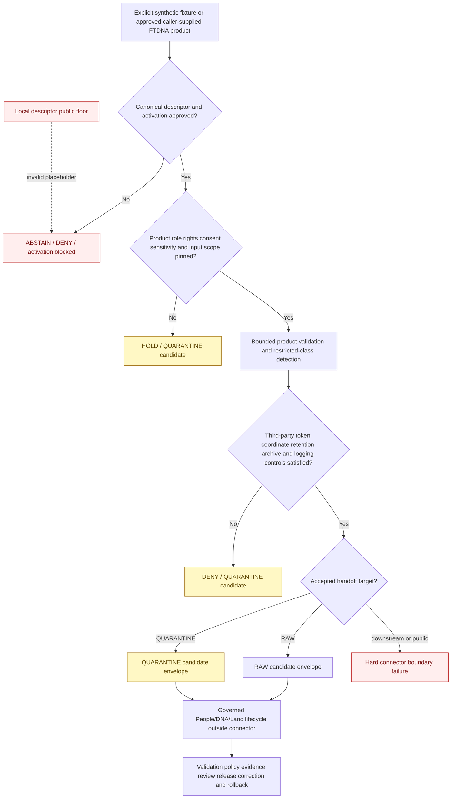

<!-- [KFM_META_BLOCK_V2]
doc_id: kfm://doc/connectors-ftdna-readme
title: connectors/ftDNA/ — FamilyTreeDNA Connector Lane
type: readme
version: v0.2
status: draft
owners: OWNER_TBD — Connector steward · FTDNA source steward · People/DNA/Land steward · Consent steward · Rights-holder representative · Privacy/sensitivity reviewer · Security reviewer · Packaging steward · Validation steward · Docs steward
created: 2026-06-18
updated: 2026-07-11
policy_label: restricted-doctrine; source-admission; greenfield; consent-required; default-deny; manual-input-first; no-network-default; no-account-default; no-secrets; no-third-party-assumption; no-live-tests-approved; raw-or-quarantine-candidate-only; no-publication
proposed_path: connectors/ftDNA/README.md
truth_posture: CONFIRMED greenfield connector scaffold / executable connector behavior ABSENT / package installation and supported import UNPROVED / canonical source identity and product roles UNRESOLVED / package-local public sensitivity placeholder INVALID / consent runtime UNBOUND / source NOT ACTIVATED / executable tests ABSENT / live testing NOT APPROVED / CI UNKNOWN
related:
  - ../README.md
  - pyproject.toml
  - src/README.md
  - src/ftDNA/README.md
  - src/ftDNA/__init__.py
  - src/ftDNA/fetch.py
  - src/ftDNA/descriptor.yaml
  - tests/README.md
  - ../../docs/sources/catalog/ftdna/README.md
  - ../../docs/sources/catalog/ftdna/autosomal-raw-data.md
  - ../../docs/sources/catalog/ftdna/dna-matches.md
  - ../../docs/sources/catalog/ftdna/dna-segments.md
  - ../../docs/sources/catalog/ftdna/haplogroup-data.md
  - ../../docs/sources/catalog/ftDNA.md
  - ../../docs/domains/people-dna-land/README.md
  - ../../docs/domains/people-dna-land/SOURCE_REGISTRY.md
  - ../../docs/domains/people-dna-land/SOURCE_FAMILIES.md
  - ../../docs/domains/people-dna-land/SENSITIVITY_PROFILE.md
  - ../../docs/domains/people-dna-land/CONSENT_MODEL.md
  - ../../data/registry/sources/people-dna-land/README.md
  - ../../data/raw/people-dna-land/
  - ../../data/quarantine/people-dna-land/
  - ../../schemas/contracts/v1/source/
  - ../../schemas/contracts/v1/consent/README.md
  - ../../policy/consent/people/README.md
  - ../../policy/sensitivity/people/
  - ../../policy/rights/
  - ../../release/
tags: [kfm, connectors, ftdna, familytreedna, dna, genealogy, people-dna-land, consent, revocation, third-party, source-admission, synthetic-fixtures, quarantine, governance]
notes:
  - "Repository inspection confirms a greenfield scaffold: this README, a placeholder pyproject.toml, a source-root README, a package directory containing an expanded README plus empty __init__.py, one-line fetch.py, and placeholder descriptor.yaml, and a README-only test lane."
  - "No configuration model, product dispatcher, supplied-input adapter, vendor client, parser, consent adapter, privacy classifier, tokenization integration, handoff builder, executable tests, source activation, live access, or passing CI evidence is proved."
  - "The package-local descriptor sets role and rights to TBD and sensitivity_floor to public. The public value conflicts with People/DNA/Land and FTDNA doctrine and is an unsafe placeholder, not source authority or a public-safe default."
  - "The lowercase docs/sources/catalog/ftdna/ family and four product pages exist, while docs/sources/catalog/ftDNA.md remains a stale mixed-case umbrella stub. Naming, casing, source ID, package import, registry, and migration posture remain unresolved."
  - "Raw genotype, DNA match, and DNA segment products remain default-deny/highest-sensitivity. Match data implicates third parties, and segment coordinates remain re-identifying even when kit identifiers are tokenized."
  - "Consent is an independent, revocable gate and never establishes rights, sensitivity clearance, evidence closure, identity truth, release approval, or publication eligibility."
[/KFM_META_BLOCK_V2] -->

<a id="top"></a>

# FamilyTreeDNA Connector Lane

> Evidence-grounded parent boundary for a possible FamilyTreeDNA / FTDNA source-admission connector. The current lane is a greenfield documentation-and-placeholder scaffold. It does **not** provide an approved vendor integration, supported installable package, account access, parser, consent validator, DNA interpretation engine, lifecycle writer, or publication path.

<p>
  
  
  
  
  
  
  
  
</p>

`connectors/ftDNA/`

> [!IMPORTANT]
> **Confirmed state:** this connector lane contains documentation, incomplete package metadata, a package-shaped placeholder scaffold, and a README-only test lane. No implemented configuration, product dispatch, supplied-input reader, vendor client, parser, consent integration, privacy classifier, tokenization integration, handoff contract, executable test, source activation, live account path, or passing CI result is confirmed. Treat all proposed interfaces, filenames, commands, result names, product keys, and lifecycle targets below as requirements—not current behavior.

> [!CAUTION]
> `src/ftDNA/descriptor.yaml` contains `role: TBD`, `rights: TBD`, and `sensitivity_floor: public`. FTDNA and People/DNA/Land doctrine classify raw genotype, DNA match, DNA segment, living-person, and related material as denied or restricted by default. **The local `public` value is an unsafe placeholder. It must not activate the source, supply runtime defaults, authorize RAW admission, lower sensitivity, or become an accepted test expectation.**

**Quick jumps:** [Purpose](#purpose) · [Verified repository state](#verified-repository-state) · [Evidence ledger](#evidence-ledger) · [Connector authority boundary](#connector-authority-boundary) · [Blocking drift](#blocking-drift) · [Connector invariants](#connector-invariants) · [Source identity casing and catalog alignment](#source-identity-casing-and-catalog-alignment) · [Product decomposition](#product-decomposition) · [Source-role boundary](#source-role-boundary) · [Access and input posture](#access-and-input-posture) · [Consent revocation and third-party boundary](#consent-revocation-and-third-party-boundary) · [Sensitive-data and secret boundary](#sensitive-data-and-secret-boundary) · [Admission input contract](#admission-input-contract) · [Metadata preservation](#metadata-preservation) · [Finite outcomes](#finite-outcomes) · [Lifecycle and handoff boundary](#lifecycle-and-handoff-boundary) · [Repository responsibility map](#repository-responsibility-map) · [Proposed implementation shape](#proposed-implementation-shape) · [Packaging source-root and test relationship](#packaging-source-root-and-test-relationship) · [No-network no-account and live-test posture](#no-network-no-account-and-live-test-posture) · [Implementation sequence](#implementation-sequence) · [Activation gates](#activation-gates) · [Review and rollback](#review-and-rollback) · [Definition of done](#definition-of-done) · [Verification backlog](#verification-backlog)

---

## Purpose

`connectors/ftDNA/` is the parent connector lane for a possible source-specific FTDNA admission adapter.

When implementation and authority exist, this lane may coordinate:

- reviewed package metadata and a narrow Python import surface;
- one explicitly admitted FTDNA product at a time;
- explicit caller-supplied synthetic fixtures or approved file/stream inputs;
- bounded source-shape parsing and connector-local validation;
- required external SourceDescriptor, activation, rights, consent, and sensitivity references;
- preservation of source, product, format/version, checksum, caveat, consent-reference, rights-reference, and import metadata;
- detection of unsupported products, third-party fields, segment-coordinate risk, role conflicts, schema drift, incomplete capture, unsafe logging, and invalid lifecycle targets;
- finite blocked, denied, abstained, held, error, RAW-candidate, or QUARANTINE-candidate results under accepted contracts;
- offline, synthetic, negative-first connector tests.

This lane must never become:

- person, kit, kinship, paternity, maternity, ancestry, ethnicity, migration, haplogroup, or relationship truth;
- a DNA match, segment, triangulation, medical, or health interpretation engine;
- a FamilyTreeDNA account client, browser-automation layer, scraper, credential collector, or session manager by default;
- source-registry, consent, rights, sensitivity, identity, key-management, policy, evidence, catalog, release, or publication authority;
- a store for real genetic exports, consent credentials, token maps, account material, private family records, or restricted payloads;
- a writer to WORK, PROCESSED, CATALOG, TRIPLET, PROOF, RECEIPT, RELEASE, PUBLISHED, public API, map, graph, report, search, or generated-answer surfaces.

[Back to top ↑](#top)

---

## Verified repository state

The following scaffold is confirmed on the repository's default branch at the time of this update:

```text
connectors/ftDNA/
├── README.md                         # this connector-parent contract
├── pyproject.toml                    # project name + version 0.0.0 only
├── src/
│   ├── README.md                     # v0.2 source-root contract
│   └── ftDNA/
│       ├── README.md                 # v0.2 package contract
│       ├── __init__.py               # empty file
│       ├── descriptor.yaml           # role/rights TBD; unsafe public floor
│       └── fetch.py                  # one-line greenfield placeholder
└── tests/
    └── README.md                     # v0.2 documentation-only test contract
```

### Current maturity

| Surface | Confirmed content | Maturity |
|---|---|---:|
| `README.md` | This connector-parent boundary. | **DOCUMENTED** |
| `pyproject.toml` | Project name `kfm-connector-ftDNA` and version `0.0.0`. | **INCOMPLETE** |
| `src/README.md` | Evidence-grounded source-root contract. | **DOCUMENTED** |
| `src/ftDNA/README.md` | Evidence-grounded package contract. | **DOCUMENTED** |
| `src/ftDNA/__init__.py` | Empty file. | **IMPORT-SHAPED / BEHAVIOR ABSENT** |
| `src/ftDNA/fetch.py` | Comment-only greenfield placeholder. | **PLACEHOLDER / NON-EXECUTABLE** |
| `src/ftDNA/descriptor.yaml` | `name: ftDNA`, `role: TBD`, `rights: TBD`, `sensitivity_floor: public`. | **PLACEHOLDER / UNSAFE DEFAULT** |
| `tests/README.md` | Connector-local test contract. | **DOCUMENTED** |
| Executable tests and fixtures | None confirmed. | **ABSENT** |
| Build backend and `src/` package discovery | None confirmed. | **ABSENT** |
| Supported Python versions and dependencies | None confirmed. | **ABSENT** |
| Stable distribution/import API | None confirmed. | **ABSENT / OPEN DECISION** |
| Product parsers or supplied-input reader | None confirmed. | **ABSENT** |
| Vendor client or account integration | None confirmed or approved. | **ABSENT / NOT APPROVED** |
| Consent/revocation integration | Doctrine exists; schema and runtime binding absent. | **PROPOSED / UNBOUND** |
| Third-party/tokenization integration | Product docs propose controls; implementation absent. | **PROPOSED / UNBOUND** |
| Accepted product-specific SourceDescriptors | None found or verified. | **ABSENT / BLOCKED** |
| Source activation | No approved activation evidence found. | **NOT ACTIVATED** |
| Live tests | None confirmed or approved. | **ABSENT / NOT APPROVED** |
| CI and coverage evidence | None confirmed. | **UNKNOWN / ABSENT** |

> [!CAUTION]
> A connector directory, empty initializer, placeholder fetcher, local YAML file, source catalog page, or detailed README does not prove installability, import safety, vendor compatibility, consent enforcement, parser behavior, source activation, test coverage, or release readiness.

[Back to top ↑](#top)

---

## Evidence ledger

| Evidence | Status | What it supports | What it does not support |
|---|---:|---|---|
| `connectors/ftDNA/README.md` | **CONFIRMED** | The parent connector lane and governance boundary exist. | Executable connector behavior. |
| `pyproject.toml` | **CONFIRMED placeholder** | Distribution name and version were scaffolded. | Build/install behavior, discovery, dependencies, supported Python, entry points, or test configuration. |
| `src/README.md` | **CONFIRMED v0.2** | Source-code placement, invariants, product separation, consent, third-party, packaging, and handoff requirements are documented. | Implemented enforcement. |
| `src/ftDNA/README.md` | **CONFIRMED v0.2** | Package-level product, role, access, privacy, consent-reference, packaging, testing, and finite-outcome requirements are documented. | Parsers, clients, tokenization, consent validation, or candidate envelopes. |
| `src/ftDNA/__init__.py` | **CONFIRMED empty** | A package namespace was scaffolded. | Stable API, supported import name, or import safety. |
| `src/ftDNA/fetch.py` | **CONFIRMED placeholder** | A future source-input responsibility was anticipated. | Approved network access, account access, supplied-input handling, parsing, retries, or persistence. |
| `src/ftDNA/descriptor.yaml` | **CONFIRMED unsafe placeholder** | Local scaffold metadata exists. | Canonical descriptor authority, resolved role/rights, safe sensitivity, or activation. |
| `tests/README.md` | **CONFIRMED v0.2** | Synthetic-only, no-network, no-account, negative-first, product-specific, privacy, archive, and handoff test requirements are documented. | Executable tests, accepted live-test variables, passing results, or CI enforcement. |
| `docs/sources/catalog/ftdna/README.md` | **CONFIRMED draft family profile** | FTDNA is documented as a proposed DTC-vendor family with default-deny, rights, consent, revocation, and vendor-risk requirements. | Accepted admission, current vendor terms, or runtime behavior. |
| Lowercase FTDNA product pages | **CONFIRMED draft profiles** | Autosomal raw, DNA matches, DNA segments, and haplogroup data have distinct proposed sensitivity and gate postures. | Accepted formats, current export schemas, or activated parsers. |
| `docs/sources/catalog/ftDNA.md` | **CONFIRMED stale mixed-case stub** | Naming and documentation drift exists. | Accurate product inventory; it incorrectly says product pages are absent. |
| People/DNA/Land source and sensitivity docs | **CONFIRMED doctrine** | Living-person, raw-kit, DNA-segment, relationship, and private-join material is denied or restricted by default; source roles must not collapse. | Connector implementation or FTDNA activation. |
| People/DNA/Land consent docs | **CONFIRMED doctrine / PROPOSED implementation** | Consent is purpose-bound, revocable, independently evaluated, and never publishes data. | A binding connector consent API or runtime. |
| `schemas/contracts/v1/consent/README.md` | **CONFIRMED compatibility placeholder** | Consent-schema placement remains unresolved. | A usable ConsentSidecar schema or validator. |
| `data/registry/sources/people-dna-land/README.md` | **CONFIRMED registry documentation** | A possible descriptor lane exists, with topology still unresolved. | An FTDNA descriptor or activation record. |
| Connector-specific CI | **ABSENT / UNKNOWN** | CI requirements may be documented. | Merge-gate enforcement, coverage, or passing status. |

[Back to top ↑](#top)

---

## Connector authority boundary

```text
THIS CONNECTOR LANE MAY EVENTUALLY:
  organize reviewed package metadata and source code
  expose a narrow side-effect-free Python API
  require external descriptor and activation evidence
  dispatch one explicitly admitted FTDNA product
  read an explicit synthetic or approved supplied input under bounds
  preserve source product role rights consent-reference sensitivity and import metadata
  detect unsupported products third-party fields coordinate risk drift incompleteness and unsafe targets
  return finite connector outcomes
  prepare accepted RAW-or-QUARANTINE candidate envelopes
  host connector-local offline synthetic tests

THIS CONNECTOR LANE MUST NOT:
  establish person kit family or relationship truth
  interpret genotype match segment haplogroup or triangulation data
  automate vendor accounts or capture credentials by default
  mint or authoritatively validate consent
  own rights sensitivity identity policy keys evidence catalog release or publication
  store real genetic exports or private account material in source control
  write lifecycle stores or public carriers
  claim anonymization secure erasure release readiness or production safety without evidence
```

A parsed vendor record remains source-attributed input. A token is not identity truth or consent. A consent allow does not clear rights, sensitivity, evidence, identity, or release. A candidate envelope is not persisted RAW data. A generalized or aggregated artifact is not published until the release gate independently closes.

[Back to top ↑](#top)

---

## Blocking drift

Executable work must expose unresolved blockers rather than hide them behind permissive defaults or mocks.

| Blocker | Confirmed gap or conflict | Required connector posture |
|---|---|---|
| Naming and casing | `ftDNA`, `ftdna`, `FTDNA`, `FamilyTreeDNA`, and `Family Tree DNA` coexist. | Block stable distribution, import, source-ID, command, fixture, and lifecycle naming until an accepted decision exists. |
| Catalog alignment | Lowercase product pages exist while mixed-case `ftDNA.md` says they do not. | Reconcile or mark compatibility/migration status before treating catalog inventory as authoritative. |
| Packaging | No build backend, package discovery, Python support, dependencies, entry points, or stable API. | Do not claim installability or supported import behavior. |
| Package-local descriptor | Role and rights are `TBD`; sensitivity floor is `public`. | Reject as activation or classification authority; require external accepted product descriptors. |
| Source registry topology | Subtype-first, short-slug, and domain-first People/DNA/Land patterns coexist. | Select one authoritative descriptor path and use pointers/migration notes elsewhere. |
| Product descriptors | No accepted product-specific SourceDescriptors or activation decisions are proved. | Block real-input paths and live behavior. |
| Product source roles | Family and product docs contain `candidate`, `observed`, and `modeled` tensions. | Require product-specific accepted roles; prohibit family-wide defaults and role upgrades. |
| Product formats | Current export formats, versions, fields, delimiters, genome builds, nomenclature, and stable keys are unverified. | No best-effort parser or current-vendor compatibility claim. |
| Access method | No approved automated pull, account workflow, API, export process, or endpoint exists. | Manual supplied-input first; network/account paths disabled. |
| Rights and terms | Current permitted use, attribution, redistribution, automation, retention, and deletion posture is unverified. | Fail closed and prohibit live activation. |
| Consent schema/runtime | Schema path is compatibility-only; runtime enforcement is unproved. | Carry externally evaluated references only after a contract is selected; do not claim consent validation. |
| Third-party consent | Match and segment data concerns people other than the uploader. | Deny or quarantine absent accepted multi-party/third-party policy. |
| Tokenization/key custody | No binding token contract, tenant boundary, key custody, rotation, migration, or incident-response architecture. | Block tokenization-dependent processing and prohibit local keys. |
| Segment coordinates | Coordinates remain re-identifying after kit-ID tokenization. | Preserve default-deny/T4 behavior and refuse triangulation or public paths. |
| Haplogroup posture | Object family and T2/T1 transitions are inferred and unratified. | Hold or return product-not-admitted until an accepted decision exists. |
| Intake route | Restricted-RAW versus quarantine-first handling remains unresolved. | Do not hard-code a permissive RAW route. |
| Handoff contract | No binding connector-result or RAW/QUARANTINE envelope is selected. | Return no authoritative candidate shape until contracts are accepted; always reject direct writes. |
| Restricted storage | Temporary-file, cache, retention, deletion, cleanup, and incident-response behavior is unproved. | No hidden persistence; no real-input processing. |
| Fixtures | No executable fixture set or accepted shared convention exists. | Synthetic documentation-only examples until fixture governance is approved. |
| Tests | Test lane contains only documentation. | Do not claim import, privacy, consent, parser, or boundary coverage. |
| Live tests | No access method, account architecture, variable, marker, endpoint, or approval exists. | No live-test implementation or command. |
| CI | No connector-specific workflow or passing run is confirmed. | No passing badge or merge-enforcement claim. |

These blockers are safety requirements, not inconveniences to bypass for a green demonstration.

[Back to top ↑](#top)

---

## Connector invariants

Every future file and behavior under this connector must preserve these invariants:

1. **No side effects on import.** Import performs no network access, account discovery, secret reads, filesystem writes, logging configuration, environment mutation, cache initialization, registry mutation, policy evaluation, consent evaluation, or source activation.
2. **No live behavior by default.** Synthetic fixtures or explicit approved caller-supplied inputs are the only default execution paths.
3. **Manual-input-first.** A placeholder named `fetch.py` does not establish a vendor-client architecture.
4. **One product at a time.** Product identity is explicit and closed; no filename, extension, first-row, provider-label, or column-guess dispatch.
5. **Descriptor-driven activation.** Connector code consumes accepted source authority; it never creates or infers it.
6. **Source role remains fixed.** Parsing cannot upgrade vendor measurements, calculations, or candidates into confirmed observations, identity, or relationship truth.
7. **Consent remains external and independent.** The connector does not mint consent, infer authorization, or treat consent as rights, sensitivity, evidence, identity, or release approval.
8. **Uploader authority is not third-party authority.** Permission for one subject does not authorize matches, relatives, contacts, shared segments, or shared-match networks.
9. **Rights, sensitivity, consent, identity, evidence, and release are separate gates.** Clearing one never clears another.
10. **No sensitive logging.** Genotype values, kit IDs, names, contacts, match metrics, segment coordinates, fine haplogroups, consent material, credentials, and payload excerpts stay out of logs and errors.
11. **No connector-owned secrets.** Passwords, API keys, cookies, sessions, browser state, salts, HMAC keys, token maps, and reversible identity mappings remain external.
12. **No interpretation.** The connector may preserve source values and flags; it does not infer ancestry, ethnicity, migration, kinship, paternity, maternity, medical meaning, triangulation, or canonical identity.
13. **No publication transform.** Redaction, generalization, aggregation, differential privacy, evidence closure, release, correction, and rollback remain downstream.
14. **Finite outcomes only.** Every operation ends in a bounded, reviewable result; no silent partial success or best-effort acceptance.
15. **RAW or QUARANTINE candidate only.** Connector code does not persist lifecycle stores.
16. **No false anonymization claim.** Hashes, tokens, pseudonyms, generalized labels, or removed columns do not automatically make genetic data public-safe.
17. **No false secure-erasure claim.** The connector may minimize retention and request cleanup but cannot promise memory or filesystem erasure beyond proven runtime and storage controls.
18. **No public path.** Public clients never consume connector, registry, RAW, WORK, QUARANTINE, package, test, or consent internals directly.

[Back to top ↑](#top)

---

## Source identity, casing, and catalog alignment

Repository naming is not coherent enough to define a stable API or lifecycle identity.

| Surface | Current value | Status |
|---|---|---:|
| Connector directory | `connectors/ftDNA/` | **CONFIRMED** |
| Source package directory | `src/ftDNA/` | **CONFIRMED** |
| Distribution placeholder | `kfm-connector-ftDNA` | **CONFIRMED placeholder** |
| Package-local descriptor name | `ftDNA` | **CONFIRMED placeholder** |
| Lowercase source catalog family | `docs/sources/catalog/ftdna/` | **CONFIRMED draft family** |
| Mixed-case source catalog umbrella | `docs/sources/catalog/ftDNA.md` | **CONFIRMED stale stub** |
| Proposed source ID | `ftdna` | **PROPOSED / NOT ADMITTED** |
| Human display variants | `FamilyTreeDNA`, `Family Tree DNA`, `FTDNA`, `ftDNA` | **UNRESOLVED** |
| Supported Python import name | None accepted | **OPEN DECISION** |
| RAW/QUARANTINE child-lane spelling | None accepted | **OPEN DECISION** |

Before defining imports, commands, configuration prefixes, descriptor IDs, fixture paths, source-registry records, or lifecycle child directories:

- choose one canonical source ID;
- choose one human display name;
- choose one distribution name and one Python import name;
- decide whether existing mixed-case paths are canonical, compatibility, or migration surfaces;
- reconcile the stale mixed-case catalog umbrella with the lowercase family and product pages;
- align `pyproject.toml`, package directories, docs, descriptors, tests, fixtures, workflows, and lifecycle references;
- preserve redirects or migration notes for renamed documentation paths;
- test packaging and imports on supported case-sensitive and case-insensitive environments;
- prohibit silent alias packages and duplicate descriptors until migration and authority semantics are reviewed.

This README does not select a winner by convenience.

[Back to top ↑](#top)

---

## Product decomposition

A provider name does not create one safe data shape or one activation decision. Every product requires independent scope, role, rights, consent, sensitivity, retention, parser, fixture, test, and activation review.

| Product profile | Current documented posture | Minimum future connector behavior | Forbidden shortcut |
|---|---|---|---|
| Autosomal raw data | Raw genotype/array-call material; default-deny/T4; no public path for the raw asset. | Require explicit product descriptor, subject authority, consent, rights, format/version, checksum, strict bounds, and accepted restricted-RAW or quarantine handling. | Treating a user-owned file as ordinary CSV, public-safe, or releasable after simple field removal. |
| DNA matches | Default-deny/T4; rows can identify third parties and vendor-computed relationship signals. | Detect third-party fields; block plaintext normalized identities; require accepted third-party and tokenization policy before processing beyond quarantine inspection. | Assuming uploader consent covers matches, shared matches, names, contacts, kit IDs, or relationship metrics. |
| DNA segments | Default-deny/T4; chromosome/start/end intervals remain re-identifying and enable triangulation. | Classify as highest-sensitivity; retain only under approved restricted handling; deny public and ordinary analytic paths. | Claiming tokenized kit IDs make segment coordinates anonymous or building a triangulation service. |
| Y-DNA / mtDNA haplogroups | Product scope, object family, and proposed T2/T1 transition remain inferred and unratified. | Hold activation pending accepted object and tier decisions; preserve source label and granularity only under reviewer controls. | Treating coarse labels as automatically public or fine subclades, SNPs, and STRs as harmless. |
| Unknown or combined export | Scope, subjects, roles, fields, versions, and sensitivity are unresolved. | Reject or quarantine with an actionable unsupported-product result. | Best-effort parsing, implicit splitting, or umbrella FTDNA admission. |

No product inherits another product's descriptor, role, authority, consent, rights, retention, tokenization, parser, fixture, test, activation, or release posture.

[Back to top ↑](#top)

---

## Source-role boundary

The repository does not yet establish one consistent source-role assignment for every FTDNA product:

- family documentation proposes `candidate` at admission;
- People/DNA/Land documentation permits `observed` for measurements and `modeled` for relationship hypotheses;
- the DNA Matches profile emphasizes that vendor-computed similarity is not an observed event;
- source-role doctrine requires roles to remain fixed after admission and forbids promotion-based upgrades.

Future connector behavior must therefore:

- require a product-specific accepted SourceDescriptor;
- preserve the exact assigned source role and role authority;
- reject absent, ambiguous, umbrella, or incompatible roles;
- never upgrade or downcast a role during parsing, validation, handoff, or downstream promotion;
- distinguish source measurements, vendor calculations, displayed predictions, relationship hypotheses, and reviewer conclusions;
- preserve source confidence, thresholds, algorithm/version references, status, and uncertainty where supplied;
- keep kinship, paternity, maternity, ancestry, and relationship outputs as hypotheses or candidates until governed downstream review closes;
- require a reviewed descriptor revision or correction record for any role correction;
- prohibit a generic `ftdna -> observed`, `ftdna -> candidate`, or `ftdna -> modeled` constant.

An FTDNA match is not confirmed kinship. A segment is not a family-tree edge. A haplogroup is not ethnicity, migration history, or personal identity. Promotion cannot change those facts.

[Back to top ↑](#top)

---

## Access and input posture

### Current safe posture

No implemented client or approved automated access method exists. Current source documentation points toward user-initiated or caller-supplied intake rather than a vendor pull.

```text
network access: disabled
vendor account access: disabled
browser or session automation: forbidden
credential discovery: forbidden
background refresh or polling: forbidden
input: explicit synthetic fixture or approved caller-supplied file/stream/archive member
persistence: none by default
output: finite blocked/held/error result or accepted RAW/QUARANTINE candidate
```

`src/ftDNA/fetch.py` is a placeholder filename, not an architecture decision or evidence that fetching is permitted.

### Prohibited access behavior

- guessed endpoints, hidden APIs, or undocumented account interfaces;
- automated login, browser control, cookie import, session reuse, password handling, or MFA bypass;
- provider-wide crawling, scraping, or background account synchronization;
- implicit environment-variable credential reads;
- account discovery from home directories, browser profiles, keychains, password stores, or configuration files;
- background refresh, polling, scheduled retrieval, or telemetry upload;
- treating a vendor URL, account ownership, file possession, or download availability as source activation or consent;
- importing real source files during package import, test collection, documentation build, or module discovery;
- hidden persistence, caches, temporary archives, retry queues, or fallback network behavior.

Any future automated access requires a separately approved source surface, current terms review, account/security architecture, consent analysis, retention controls, rate/size limits, error handling, live-test policy, and rollback plan. Manual supplied-input behavior remains the default design direction until then.

[Back to top ↑](#top)

---

## Consent, revocation, and third-party boundary

> [!IMPORTANT]
> Consent is one independent gate. It does not establish source rights, sensitivity clearance, identity truth, evidence closure, or release approval.

### Connector consent boundary

The consent schema path is currently a compatibility placeholder, and runtime enforcement is not proved. Connector code must not claim to issue, authoritatively validate, or revoke a `ConsentSidecar`, credential, signature, status-list entry, DUO/GA4GH scope, or consent decision.

A future connector may consume an **externally evaluated** consent decision or opaque reference through an accepted contract. It may verify that the required reference is present and structurally compatible with the selected connector envelope, but consent authority remains outside the connector.

| Consent condition | Required connector posture |
|---|---|
| Consent reference absent where required | `DENY`, `ABSTAIN`, or QUARANTINE candidate; never implicit allow. |
| Consent cannot be verified by the owning runtime | `ABSTAIN` or `HOLD`; no sensitive parsing path. |
| Consent expired, revoked, suspended, or disputed | `DENY` or `HOLD`; preserve a bounded cleanup/revocation signal reference if the contract supports it. |
| Purpose, audience, product, subject, retention, or scope mismatch | `DENY`. |
| Vendor participation or vendor consent exists but KFM consent is absent | `DENY` or `ABSTAIN`. |
| KFM consent is valid but rights or sensitivity remains unresolved | Continue to block; consent clears only its own gate. |
| Valid consent and all connector preconditions pass | Continue to product validation; publication remains unavailable. |

### Third-party rule

Match and segment exports can contain identifiers, display names, contact information, predicted relationships, shared-centimorgan metrics, shared-match networks, and genetic evidence concerning people other than the uploader.

The connector must never assume:

- the uploader owns third-party data;
- vendor participation authorizes KFM ingestion;
- a shared biological or family relationship grants consent;
- a pseudonym, hash, or token grants permission;
- HMAC tokenization eliminates genetic re-identification, rights, or consent concerns;
- a third party is deceased or non-living because the uploader is authorized;
- consent for autosomal raw data automatically covers matches, segments, or haplogroups.

Absent an accepted multi-party or third-party policy, match and segment products remain denied or quarantine-only.

### Revocation boundary

Connector code may preserve an externally evaluated consent reference and return a revocation-affected outcome. It must not independently:

- issue, amend, suspend, or revoke consent;
- modify a status list;
- create authority-store tombstones;
- invalidate public caches;
- enumerate or delete downstream derivatives;
- rewrite evidence, catalog, or release state;
- claim deletion or secure erasure completed.

Those actions belong to governed consent, lifecycle, storage, release, and incident-response systems with reviewable receipts.

[Back to top ↑](#top)

---

## Sensitive-data and secret boundary

Any future implementation must assume inputs can contain highly identifying genetic, living-person, family, account, and third-party material.

### Data that must not appear in routine logs, errors, metrics, or fixtures

- raw genotype rows, rsID/chromosome/position/genotype combinations, or real call values;
- vendor kit IDs, account IDs, profile IDs, or export identifiers;
- subject names, match display names, aliases, contacts, email addresses, or family notes;
- predicted relationships, shared-match networks, and identifiable shared-centimorgan values;
- chromosome segment start/end coordinates tied to a subject or match;
- fine Y-DNA or mtDNA subclades, STR strings, SNP details, or vendor test identifiers;
- filenames or archive members containing real personal names or account context;
- consent credential bodies, signatures, status-list indexes, revocation tokens, or private review notes;
- source payload excerpts attached for debugging;
- passwords, API keys, bearer tokens, cookies, sessions, browser profiles, keychain material, salts, HMAC keys, or reversible token maps.

### Required future controls

- no payload logging by default;
- errors contain bounded reason codes, safe counts, opaque references, and approved digests only;
- no `repr`, validation error, traceback, assertion diff, or serialization path exposes full records;
- no telemetry labels contain kit IDs, names, relationship metrics, segment coordinates, haplogroups, or source rows;
- no implicit temporary files, caches, or extracted archives;
- any caller-approved temporary storage is explicit, restricted, time-bounded, and cleanup-aware;
- archive extraction enforces member-count, byte-size, path, symlink, hardlink, compression-ratio, nesting, and traversal limits;
- file, row, column, line, time, memory, and processing limits prevent unreviewed bulk ingestion;
- unknown encodings, delimiters, schemas, fields, archive members, or version changes fail closed;
- source bytes remain inert data and are never executed, imported as code, rendered as active HTML, or evaluated as formulas;
- secrets, keys, token maps, credentials, and account sessions remain outside the connector;
- a digest, token, pseudonym, coarse label, or removed field is never described as anonymization by default;
- source-side withholding, suppression, pseudonyms, caveats, and uncertainty remain preserved;
- no attempt reconstructs withheld, redacted, tokenized, or obscured identities.

### Tokenization boundary

Product documentation proposes tenant-scoped HMAC tokens for some DNA kit identifiers. The connector currently has no accepted tokenization contract or key-management integration.

Before tokenization code is added:

- select a binding token and consent-manifest contract;
- assign key custody, tenant isolation, and authorized callers;
- define rotation, revocation, collision, replay, migration, and incident-response behavior;
- ensure plaintext identifiers cannot reach logs or ordinary normalized output;
- prove tokens cannot become public stable identifiers;
- account separately for segment-coordinate re-identification;
- use synthetic fixtures and negative tests;
- document rollback and breach response.

Do not create a local salt, hard-code a key, derive a key from configuration text, or store a reversible mapping in this connector.

[Back to top ↑](#top)

---

## Admission input contract

Once binding contracts exist, a real or fixture-backed connector operation should require explicit values equivalent to:

- canonical product-specific SourceDescriptor reference;
- SourceActivationDecision or accepted equivalent;
- exact admitted product key;
- canonical source ID and source-family identity;
- caller-supplied file, byte stream, archive member, or synthetic fixture reference;
- uploader/data-subject authority or authorization reference;
- externally evaluated consent decision/reference and revocation state;
- current rights/terms snapshot reference;
- sensitivity/restricted-handling reference;
- source/export format version and schema fingerprint where known;
- original filename or member label as untrusted metadata, not dispatch authority;
- expected checksum/digest and bounded byte size;
- file, archive, member, row, column, line, decompression, time, memory, and processing limits;
- retention and cleanup instructions owned by orchestration/runtime;
- external tokenization capability reference where an accepted product contract requires one;
- intended domain route;
- intended lifecycle target of QUARANTINE or, only when every admission gate closes, RAW.

Required behavior:

- reject missing or ambiguous source, product, subject, authority, role, format, version, or lifecycle identity;
- reject missing descriptor or activation evidence for real input;
- reject unknown, mixed, combined, unsupported, or non-admitted products;
- reject product/role/authority mismatches;
- reject real sensitive input when consent, rights, storage, or third-party posture is unresolved;
- never dispatch from filename, extension, first row, provider label, or URL alone;
- never activate every FTDNA product through one provider-wide switch;
- keep synthetic/test configuration unable to fall through to live access;
- document no endpoint, environment-variable name, account workflow, credential convention, marker, or live command as accepted until implementation and review establish it.

Field names and envelope shapes remain unaccepted until source, consent, connector-result, and handoff contracts are selected.

[Back to top ↑](#top)

---

## Metadata preservation

Every non-error candidate should preserve, where applicable and permitted by the accepted product contract:

### Source and admission minimum

- canonical KFM source ID and descriptor reference;
- exact product identity;
- source family and display name from the accepted descriptor;
- source role and role authority;
- activation decision reference;
- uploader/subject authority reference;
- externally evaluated consent decision/reference and state;
- rights/terms snapshot reference;
- sensitivity/restricted-handling reference;
- source-format/export version and schema fingerprint;
- original file/archive/member identity as a safe label;
- import or retrieval timestamp supplied by orchestration;
- checksum/digest under restricted handling;
- connector/parser version;
- intended lifecycle target;
- drift, incomplete, sensitive, third-party, revoked, quarantined, and review flags.

### Capture and completeness minimum

- expected and received files or archive members;
- byte size and bounded-limit result;
- row/record count where safe;
- accepted, rejected, held, and unresolved counts;
- required-field presence;
- duplicate source-key count where a product key is defined;
- checksum verification result;
- truncation, interruption, malformed-row, unsupported-column, and partial-capture state;
- unknown-column and schema-drift evidence without copying sensitive values.

### Product-specific preservation boundaries

| Product | Preserve | Do not infer or emit |
|---|---|---|
| Autosomal raw | Verified format/version metadata, row structure, source fields, safe counts, checksum, caveats, and restricted classification. | Medical meaning, ancestry, identity, kinship, public genotype output, or ordinary normalized rows without an accepted restricted contract. |
| DNA matches | Product/version metadata, field inventory, third-party presence, safe counts, source caveats, and blocked/tokenization-required state. | Plaintext match identities, confirmed relationship, consent coverage, social graph, or public match metrics. |
| DNA segments | Product/version metadata, coordinate-field presence, genome-build reference when verified, safe counts, source caveats, and highest-sensitivity state. | Triangulation, relationship truth, anonymous-coordinate claims, or public/reviewer output outside an approved restricted agreement. |
| Haplogroups | Source label, test/product context, nomenclature/version context, granularity, caveats, and review state. | Public tier, accepted taxonomy, ancestral identity, ethnicity, migration history, or `HaplogroupAssertion` authority before ratification. |

Unknown source fields may be preserved only through an accepted restricted passthrough contract. They must not be silently dropped, publicly surfaced, or guessed into KFM semantics.

[Back to top ↑](#top)

---

## Finite outcomes

Future connector APIs and tests should use a small accepted result vocabulary. Exact names remain unbound until a connector-result contract is selected.

| Condition | Required safe behavior |
|---|---|
| Connector behavior not implemented | Clear unavailable/not-implemented result; never false success. |
| Build or supported import contract absent | Do not claim package readiness or import coverage. |
| Canonical source ID missing | Activation blocked. |
| SourceDescriptor missing | Activation blocked. |
| Package-local `sensitivity_floor: public` encountered | Hard placeholder-validation failure. |
| Activation decision missing | `ABSTAIN` or activation-blocked result. |
| Product identity missing or unknown | Validation failure or QUARANTINE candidate. |
| Mixed or combined export | Reject or hold for product decomposition. |
| Source role missing or conflicted | Activation block; no permissive default. |
| Rights or current terms unresolved | `DENY`, `ABSTAIN`, or QUARANTINE candidate. |
| Consent contract/runtime unbound | Activation block for real sensitive input. |
| Consent missing, unverifiable, expired, revoked, suspended, disputed, or out of scope | `DENY`, `ABSTAIN`, or `HOLD`. |
| Uploader authority absent or ambiguous | `DENY` or QUARANTINE candidate. |
| Match data contains third-party fields | Deny/quarantine absent accepted third-party and tokenization policy. |
| Segment coordinate evidence present | Highest-sensitivity classification; no public or ordinary analytic output. |
| Haplogroup supplied before object/tier decision | `HOLD` or product-not-admitted. |
| Network or account access requested under default configuration | Bounded disabled outcome. |
| Credential, cookie, browser profile, keychain, session, or hidden environment access attempted | Hard security failure. |
| File/archive exceeds bounds or contains unsafe paths/members | Reject or quarantine. |
| Checksum mismatch or incomplete capture | Incomplete-capture quarantine. |
| Format, schema, field, delimiter, encoding, genome build, nomenclature, or version drift | Reviewable drift result; no best-effort acceptance. |
| Sensitive value enters a log, error, metric, snapshot, or ordinary output | Hard privacy failure. |
| Source role upgraded or relationship treated as confirmed | Hard semantic-boundary failure. |
| Local salt, key, token map, or reversible mapping created | Hard security-boundary failure. |
| Intended target beyond RAW or QUARANTINE | Hard authority-boundary failure. |
| Direct lifecycle or public write attempted | Hard failure. |
| Kinship, paternity, maternity, ancestry, ethnicity, migration, triangulation, medical, legal, or identity determination requested | Refuse and route to governed specialist/reviewer processes. |

Every error must be deterministic, finite, actionable, safe to log, and free of sensitive source content.

[Back to top ↑](#top)

---

## Lifecycle and handoff boundary

The connector participates only at the source-admission edge and performs no lifecycle write by itself.



The diagram defines responsibility boundaries. It does not prove package installation, parsing, consent evaluation, tokenization, source persistence, RAW storage, quarantine storage, downstream validation, redaction, aggregation, evidence closure, release, or cleanup.

KFM lifecycle discipline remains:

```text
RAW -> WORK / QUARANTINE -> PROCESSED -> CATALOG / TRIPLET -> PUBLISHED
```

The connector may eventually construct an accepted candidate envelope. It must not persist source payloads or perform later transitions.

[Back to top ↑](#top)

---

## Repository responsibility map

| Surface | Responsibility | Must not do |
|---|---|---|
| `connectors/ftDNA/` | Parent coordination, source-specific boundaries, package/test orientation, and activation prerequisites. | Store data, establish source/consent authority, interpret DNA, or publish. |
| `connectors/ftDNA/pyproject.toml` | Build and dependency metadata after review. | Encode source activation, secrets, consent, sensitivity, or policy defaults. |
| `connectors/ftDNA/src/` | Organize the possible source package and source-code constraints. | Store payloads, descriptors as authority, policy, evidence, release records, or public artifacts. |
| `connectors/ftDNA/src/<package>/` | Explicit input validation, source-shape parsing, local checks, finite outcomes, and candidate envelopes. | Interpret DNA, resolve identity, own consent, manage keys, persist lifecycle data, or publish. |
| `connectors/ftDNA/tests/` | Connector-local offline synthetic and boundary tests. | Use real genetic data, prove kinship, or become policy/release authority. |
| Source registry | Canonical source identity, role, rights, cadence, sensitivity, product decomposition, and activation. | Store vendor payloads or infer claims. |
| Consent runtime | Evaluate scoped consent and revocation. | Publish data or replace rights/sensitivity/evidence/release gates. |
| Key/tokenization system | Custody, rotation, tenant isolation, and token services where accepted. | Turn tokens into public identities or erase genetic-coordinate risk. |
| People/DNA/Land pipelines | Downstream normalization, object candidates, restricted processing, and domain validation. | Inherit activation or consent from connector adjacency. |
| Policy and validators | Decide rights, sensitivity, consent obligations, allowed transforms, and release prerequisites. | Fetch vendor data or infer product role from filenames. |
| Evidence and catalog surfaces | Close provenance, citation, review, and catalog requirements. | Treat connector output as proof automatically. |
| Release surfaces | Approve public-safe derivatives, corrections, withdrawal, supersession, and rollback. | Treat RAW, quarantine, tokenization, redaction, or aggregation as release by themselves. |

[Back to top ↑](#top)

---

## Proposed implementation shape

The confirmed connector structure is minimal:

```text
connectors/ftDNA/
├── README.md
├── pyproject.toml
├── src/
│   ├── README.md
│   └── ftDNA/
│       ├── README.md
│       ├── __init__.py
│       ├── descriptor.yaml
│       └── fetch.py
└── tests/
    └── README.md
```

A future **manual-input-first** implementation might use a structure like:

```text
connectors/ftDNA/
├── README.md
├── pyproject.toml
├── src/
│   ├── README.md
│   └── <accepted_import_name>/
│       ├── README.md
│       ├── __init__.py
│       ├── config.py
│       ├── products.py
│       ├── inputs.py
│       ├── parse/
│       │   ├── __init__.py
│       │   ├── autosomal_raw.py
│       │   ├── dna_matches.py
│       │   ├── dna_segments.py
│       │   └── haplogroups.py
│       ├── validate.py
│       ├── consent_refs.py
│       ├── privacy.py
│       ├── handoff.py
│       └── errors.py
└── tests/
    ├── README.md
    ├── fixtures/
    ├── test_build_and_import.py
    ├── test_configuration.py
    ├── test_descriptor_and_activation.py
    ├── test_product_dispatch.py
    ├── test_supplied_inputs.py
    ├── test_archive_and_resource_limits.py
    ├── test_source_roles.py
    ├── test_consent_references.py
    ├── test_third_party_boundaries.py
    ├── test_sensitive_logging.py
    ├── test_autosomal_raw.py
    ├── test_dna_matches.py
    ├── test_dna_segments.py
    ├── test_haplogroups.py
    ├── test_handoff_boundaries.py
    └── test_errors_and_drift.py
```

This tree is **PROPOSED**, not implementation evidence. Do not create it mechanically. Every module and test must correspond to an accepted responsibility, contract, product descriptor, owner, synthetic fixture set, negative cases, and reviewed sensitivity posture.

A network client should not be added merely because `fetch.py` exists. Automated vendor access requires independent source activation, current terms review, account/security architecture, consent analysis, restricted storage, retention controls, logging protections, live-test approval, and rollback planning.

[Back to top ↑](#top)

---

## Packaging, source-root, and test relationship

### Packaging

The current `pyproject.toml` is insufficient to build, install, or publish a supported package.

Before installability or supported import is claimed:

- resolve distribution and import naming/casing;
- declare a build backend and `src/` package discovery;
- declare supported Python versions;
- declare runtime and development dependencies;
- define versioning beyond `0.0.0`;
- define package-data policy and prevent automatic authority-loading from local YAML;
- define a narrow public API exported by `__init__.py`;
- add clean-environment build, wheel, installation, and import tests;
- verify artifacts exclude real fixtures, source payloads, credentials, consent records, token maps, keys, and canonical registry data;
- prove imports have no network, secret, filesystem, logging, environment, cache, policy, consent, or activation side effects.

### Source root and package

`src/README.md` governs placement and cross-package constraints. `src/ftDNA/README.md` governs package-level responsibilities and product behavior. Neither establishes source activation or executable maturity.

The package-local descriptor must not be loaded automatically. It should be removed, converted to an unmistakable non-authoritative pointer/fixture, or validated as an invalid placeholder according to a reviewed packaging decision.

### Tests

`tests/README.md` documents a future offline synthetic test lane. It currently contains no executable tests or fixtures.

No test dependency, command, marker, environment-variable convention, CI job, coverage result, or passing status is confirmed. A future command such as:

```bash
python -m pytest connectors/ftDNA/tests
```

remains **PROPOSED** until packaging, dependencies, fixtures, tests, and the repository-standard runner exist and are demonstrated.

A zero-test, all-skipped, collection-only, or documentation-only result is not coverage evidence.

[Back to top ↑](#top)

---

## No-network, no-account, and live-test posture

> [!CAUTION]
> Default execution and tests must require no internet, FamilyTreeDNA account, browser automation, cookie, session, password, API key, token, private export, keychain, tenant salt, HMAC key, or credential-bearing environment variable.

Required defaults once code exists:

- block network access during import, test collection, fixture setup, and default execution;
- fail unapproved socket, HTTP, DNS, browser, or subprocess attempts;
- prevent environment-variable or filesystem fallback to live configuration;
- prevent home-directory, browser-profile, keychain, or config-file account discovery;
- keep supplied-input readers independent of vendor access;
- prevent fixture configuration from falling through to live behavior;
- prohibit automatic fixture refresh and background polling;
- prohibit retention of private response bodies;
- keep live source payloads out of CI artifacts and logs;
- keep parser, descriptor, role, privacy, and handoff tests fully offline.

### Live tests

No live test is approved. Earlier `KFM_ALLOW_LIVE_FTDNA_TESTS` examples were illustrative only and are not accepted by this connector contract.

Do not add a live-test variable, marker, account workflow, endpoint constant, credential mode, command, or CI job until all of the following are independently approved:

- exact product and access method;
- current vendor terms and permitted automation;
- account and credential architecture;
- product-specific SourceDescriptor and activation decision;
- uploader/data-subject authority;
- third-party/multi-party handling;
- consent runtime and revocation behavior;
- restricted storage, retention, deletion, and incident response;
- logging and artifact controls;
- test isolation and cleanup;
- source, rights, privacy, security, and CI reviewer sign-off.

Any future live smoke test must remain separate from the default suite, narrowly scoped, non-persistent, skipped unless explicitly invoked under accepted policy, and incapable of creating lifecycle or public artifacts. Passing it would prove only the approved interaction under the tested conditions.

[Back to top ↑](#top)

---

## Implementation sequence

Implement in dependency order:

1. **Resolve identity and documentation drift**
   - choose canonical display name, source ID, connector path posture, distribution name, and import name;
   - reconcile lowercase product docs with the stale mixed-case umbrella;
   - align parent, source-root, package, test, registry, and catalog documentation.
2. **Resolve source registry topology and descriptor authority**
   - choose the canonical descriptor lane;
   - create product-specific descriptors and activation decisions;
   - remove, neutralize, or unmistakably mark package-local YAML as non-authoritative;
   - make the unsafe public floor impossible to consume.
3. **Resolve product roles and scope**
   - independently define raw, match, segment, haplogroup, and unsupported products;
   - pin roles, authority, formats, versions, exclusions, stable identifiers, caveats, and drift behavior;
   - reject unknown and mixed products.
4. **Resolve rights, access, retention, and storage**
   - review current terms, permitted use, attribution, redistribution, uploader/export authority, automation, retention, deletion, and vendor-risk posture;
   - decide manual-input-only versus separately approved automation;
   - define restricted-RAW versus quarantine-first behavior, temporary storage, cleanup, and incident response.
5. **Resolve consent and third-party handling**
   - select binding consent contract and runtime;
   - define uploader authority, multi-party/third-party behavior, revocation, dispute, scope, retention, and cleanup signals;
   - keep consent authority outside the connector.
6. **Resolve tokenization and coordinate risk**
   - accept or reject token architecture;
   - assign key custody, tenant boundaries, rotation, migration, and incident response;
   - keep segment-coordinate and triangulation paths default-deny.
7. **Complete packaging**
   - add build backend, discovery, Python support, dependencies, versioning, package-data policy, and narrow API;
   - prove clean build/install/import behavior.
8. **Select connector-result and handoff contracts**
   - define finite outcomes;
   - settle restricted-RAW versus quarantine-first handling;
   - prohibit connector persistence and direct downstream writes.
9. **Approve fixture governance**
   - define synthetic-generation rules and fixture metadata;
   - create the smallest negative-first fixture set;
   - prohibit real genetic, third-party, account, credential, and consent data.
10. **Implement import safety and explicit configuration**
    - no network, account, secret, cache, policy, consent, or activation side effects;
    - bounded limits and no live fallback.
11. **Implement one fixture-only product slice**
    - start with the least ambiguous accepted product;
    - preserve source metadata and fail closed on sensitive values, drift, and incompleteness;
    - add executable tests before any real input path.
12. **Implement supplied-input reading and product parsers**
    - explicit files and streams only;
    - bounded archives and deterministic parsing;
    - no account automation.
13. **Integrate external consent and token references only after contracts exist**
    - no local consent or key authority;
    - negative tests for every failure state.
14. **Add accepted candidate handoff**
    - only after storage, lifecycle, rights, consent, sensitivity, and cleanup reviews;
    - reject direct lifecycle and public writes.
15. **Integrate CI last**
    - prove clean local offline build and test commands first;
    - retain reviewable, sensitive-data-free run evidence;
    - do not upgrade badges, maturity, or activation claims prematurely.
16. **Consider live smoke testing only after explicit approval**
    - isolate it from the default suite;
    - keep it narrow, non-persistent, and independently reviewed.

[Back to top ↑](#top)

---

## Activation gates

No real FTDNA input or live behavior should run until all applicable gates close:

- [ ] Canonical display name, source ID, distribution name, Python import name, and lifecycle child-lane spelling are accepted.
- [ ] Lowercase family/product docs and mixed-case umbrella documentation are reconciled.
- [ ] Canonical source-registry topology is accepted.
- [ ] Product-specific SourceDescriptors and activation decisions exist.
- [ ] Package-local descriptor authority is removed or explicitly neutralized.
- [ ] The unsafe `sensitivity_floor: public` placeholder cannot affect runtime, package data, tests, or admission.
- [ ] Product-specific source roles and role authorities are accepted and covered by anti-collapse tests.
- [ ] Autosomal raw, matches, segments, and haplogroups have independent scope, format/version, and exclusion decisions.
- [ ] Current source terms, permitted use, attribution, redistribution, uploader/export authority, automation, retention, deletion, and vendor-risk posture are reviewed.
- [ ] Manual upload/supplied-input behavior and prohibited account-access behavior are documented.
- [ ] Binding source, connector-result, and RAW/QUARANTINE handoff contracts are selected.
- [ ] Binding consent contract, consent runtime, and revocation behavior are selected and tested.
- [ ] Uploader authority and third-party/multi-party consent posture are accepted.
- [ ] Tokenization contract, tenant boundary, key custody, rotation, migration, and incident response are accepted before tokenization code exists.
- [ ] Segment-coordinate and triangulation restrictions are explicit and tested.
- [ ] Haplogroup object and tier posture is ratified before product activation.
- [ ] Restricted-RAW versus quarantine-first routing is accepted.
- [ ] Temporary-file, cache, logging, metrics, retention, deletion, cleanup, and incident-response controls are defined.
- [ ] File, archive, size, row, column, line, time, memory, decompression, and processing limits are defined.
- [ ] Packaging metadata and clean build/install/import behavior are verified from a fresh environment.
- [ ] Synthetic no-network fixtures and executable tests pass.
- [ ] No real genetic, living-person, third-party, account, credential, key, token-map, or consent data is committed.
- [ ] Connector, consent, policy, pipeline, identity, tokenization, evidence, catalog, and release responsibilities remain separate.
- [ ] Revocation, correction, derivative invalidation, rollback, cache invalidation, payload cleanup, and security-incident procedures are documented.
- [ ] CI evidence is reviewable before activation or maturity claims are upgraded.

Until then, this connector remains a documentation-plus-placeholder scaffold and real/live behavior remains inactive.

[Back to top ↑](#top)

---

## Review and rollback

Review every connector change as a high-sensitivity, consent-adjacent, third-party-data, identity, security, packaging, and lifecycle-boundary change.

A reviewer should confirm:

- implementation claims match the actual tree, package metadata, tests, and run evidence;
- import and test collection remain side-effect free;
- source and activation authority remain external;
- naming and casing decisions are explicit and migration-safe;
- package-local YAML cannot activate or classify the source;
- the `public` sensitivity placeholder is rejected;
- product identity and source roles are explicit and closed;
- relationship outputs remain hypotheses or candidates;
- consent, rights, sensitivity, identity, evidence, and release remain independent;
- uploader consent is not applied to third parties;
- genotype values, match identifiers, segment coordinates, fine haplogroups, credentials, keys, and consent bodies cannot leak through logs, errors, fixtures, metrics, package data, or ordinary output;
- connector code does not own salts, keys, token maps, credentials, sessions, browser state, or consent credentials;
- no parser claims anonymization, ancestry, kinship, medical interpretation, or public safety;
- output stops at finite results and accepted RAW/QUARANTINE candidates;
- no public client consumes connector, package, registry, RAW, WORK, or QUARANTINE material directly;
- live testing remains absent unless separately approved;
- no documentation or API suggests genetic, family, medical, legal, identity, or publication authority.

Rollback is required if a change:

- claims implementation, installation, activation, consent validation, rights/privacy clearance, test coverage, live compatibility, or CI without evidence;
- adds import-time or default network, account, secret, filesystem, logging, environment, cache, registry, policy, consent, or activation behavior;
- uses package-local descriptor YAML as canonical authority;
- accepts `sensitivity_floor: public` as valid;
- introduces umbrella FTDNA activation or filename/column-based product guessing;
- performs account login, scraping, cookie/session access, or hidden credential discovery;
- weakens consent, third-party, revocation, role, rights, sensitivity, retention, no-log, no-persistence, or no-public-path controls;
- stores or logs genetic values, kit IDs, names, contacts, match metrics, segment coordinates, fine haplogroups, consent material, source payloads, or account artifacts;
- creates local token keys, salts, reversible mappings, or unreviewed pseudonyms;
- treats tokenization as anonymization or segment coordinates as non-identifying;
- emits match, segment, haplogroup, ancestry, kinship, paternity, maternity, medical, migration, ethnicity, or triangulation conclusions;
- writes directly beyond an accepted RAW/QUARANTINE candidate boundary;
- emits public claims, maps, reports, graphs, search payloads, or generated answers;
- introduces an unapproved live-test variable, marker, endpoint, account workflow, or CI job.

Rollback procedure:

1. Revert the unsafe or misleading connector, package, test, fixture, or configuration change.
2. Restore the last verified no-network, no-account, no-secret, no-persistence, and no-public-write posture.
3. Remove or quarantine unapproved payloads, fixtures, logs, snapshots, artifacts, caches, package data, credentials, keys, token maps, or sensitive material and follow repository incident-response/history-remediation procedures.
4. Revoke or rotate exposed credentials or tokenization material through the owning security system.
5. Move legitimate consent, policy, key-management, pipeline, identity, lifecycle, evidence, catalog, or release work to its correct responsibility lane.
6. Repair descriptors, activation decisions, package metadata, imports, product mappings, configuration, workflows, test fixtures, documentation links, and generated templates.
7. Record source, role, consent, rights, privacy, security, schema, packaging, casing, test, or path drift in the appropriate register.
8. Trigger governed revocation, correction, invalidation, cleanup, and rollback for every affected downstream artifact.
9. Re-run the last verified clean offline build and test commands when they exist.
10. Correct README badges and maturity claims to match evidence.

[Back to top ↑](#top)

---

## Definition of done

This connector lane is not complete merely because its boundaries are documented.

- [x] The current parent, source-root, package, and test scaffold is documented accurately.
- [x] Empty `__init__.py`, placeholder `fetch.py`, placeholder `descriptor.yaml`, and incomplete `pyproject.toml` are distinguished from implementation.
- [x] The local `public` sensitivity floor is identified as unsafe.
- [x] Source identity, casing, catalog, descriptor, role, and registry drift is visible.
- [x] Product-specific raw, match, segment, haplogroup, and unknown-export boundaries are explicit.
- [x] Third-party consent and segment-coordinate re-identification risk is explicit.
- [x] Consent is separated from rights, sensitivity, identity, evidence, and release.
- [x] No-network, no-account, no-secret, no-log, no-persistence, and no-publication defaults are explicit.
- [x] RAW/QUARANTINE-candidate-only connector authority is explicit.
- [x] Connector, package, tests, registry, consent, policy, pipeline, key-management, evidence, catalog, and release responsibilities are separated.
- [x] The illustrative live-test variable is not treated as an accepted convention.
- [ ] Canonical source identity, package/import name, and path migration posture are accepted.
- [ ] Lowercase and mixed-case source catalog surfaces are reconciled.
- [ ] Product-specific SourceDescriptors and activation decisions exist.
- [ ] Package-local descriptor is removed, neutralized, or converted to a reviewed non-authoritative pointer.
- [ ] Current source terms, permitted access, retention, deletion, and vendor-risk rules are reviewed.
- [ ] Product roles, authorities, formats, versions, exclusions, stable identifiers, and drift behavior are accepted.
- [ ] Consent schema/runtime, third-party handling, and revocation behavior are accepted.
- [ ] Tokenization/key-management architecture is accepted where required.
- [ ] Haplogroup object and tier posture is ratified.
- [ ] Restricted intake, RAW/QUARANTINE handoff, retention, logging, and cleanup contracts are accepted.
- [ ] Build metadata and a stable side-effect-free import API exist.
- [ ] Configuration, supplied-input, product dispatch, parser, validation, privacy, finite error, and handoff code exists.
- [ ] Synthetic fixture governance and fixture files exist.
- [ ] Executable build, import, descriptor, role, consent, third-party, product, privacy, archive, error, and handoff tests exist and pass.
- [ ] The default suite proves no network, account, secret, or direct lifecycle/public access.
- [ ] A clean repository-standard build/test command is documented and reproducible.
- [ ] CI wiring and passing evidence exist.
- [ ] Any live smoke test is separately approved, isolated, non-persistent, reversible, and excluded from default execution.
- [ ] No connector API creates identity, kinship, ancestry, triangulation, medical, legal, or public-release conclusions.

[Back to top ↑](#top)

---

## Verification backlog

| Item | Status | Needed evidence |
|---|---:|---|
| Confirm the complete connector tree, including empty or generated files not visible to code search. | **NEEDS CONTINUOUS VERIFICATION** | Repository tree inspection. |
| Resolve `ftDNA` versus `ftdna` casing across connector, package, distribution, docs, descriptors, source ID, tests, fixtures, and lifecycle paths. | **CONFLICTED** | Naming ADR or migration decision with redirects and import tests. |
| Reconcile `docs/sources/catalog/ftDNA.md` with the lowercase family and four product pages. | **CONFIRMED DRIFT / NEEDS CORRECTION** | Catalog cleanup and backlink review. |
| Resolve canonical source-registry topology. | **CONFLICTED / NEEDS VERIFICATION** | Registry ADR or migration note across subtype-first, short-slug, and domain-first lanes. |
| Create and approve product-specific SourceDescriptors and activation decisions. | **BLOCKED** | Source, rights, consent, sensitivity, and steward review. |
| Remove or neutralize package-local descriptor authority. | **BLOCKED** | Packaging and source-authority decision. |
| Remove or safely replace `sensitivity_floor: public`. | **CRITICAL BLOCKER** | Privacy/sensitivity review and descriptor update. |
| Resolve source roles for raw genotype, matches, segments, and haplogroups. | **CONFLICTED / BLOCKED** | Product descriptors, doctrine reconciliation, and anti-collapse tests. |
| Confirm current source product/export formats, genome builds, nomenclature, and version identifiers. | **NEEDS VERIFICATION** | Current source documentation and approved synthetic schema fixtures. |
| Confirm permitted access method and whether vendor automation is prohibited or separately allowed. | **NEEDS VERIFICATION** | Current terms, rights, security, consent, account-access, and retention review. |
| Confirm uploader/data-subject authority evidence. | **NEEDS VERIFICATION** | Consent/rights contract and review workflow. |
| Select binding consent schema and runtime. | **BLOCKED** | Accepted schema home, policy runtime, signature/status behavior, fixtures, and tests. |
| Resolve multi-party/third-party consent for match and segment products. | **BLOCKED** | Consent ADR, rights-holder review, privacy policy, and negative tests. |
| Select or reject HMAC DNAKitToken architecture. | **OPEN DECISION** | Token contract, key custody, tenant model, rotation, revocation, migration, and incident response. |
| Confirm segment-coordinate and triangulation restrictions. | **NEEDS VERIFICATION / DEFAULT DENY** | Sensitivity policy, research-agreement model, and tests. |
| Ratify or reject haplogroup object family and T2/T1 posture. | **ADR-CLASS / BLOCKED** | Domain, sensitivity, consent, evidence, and release decision. |
| Resolve quarantine-first versus restricted-RAW-first intake. | **CONFLICTED** | Handoff contract, storage/security review, and lifecycle tests. |
| Confirm restricted storage, temporary-file, cache, retention, deletion, revocation, and cleanup behavior. | **NEEDS VERIFICATION** | Storage contract, runbook, incident-response plan, and tests. |
| Complete `pyproject.toml` and select build backend, discovery, Python versions, dependencies, distribution name, and import name. | **OPEN DECISION** | Packaging review and clean build/install evidence. |
| Define the narrow public package API. | **OPEN DECISION** | Connector contract and import tests. |
| Decide whether `fetch.py` is removed, renamed, or retained for supplied-input behavior. | **OPEN DECISION** | Access architecture and migration review. |
| Select connector-result and RAW/QUARANTINE envelope contracts. | **NEEDS VERIFICATION** | Contracts, schemas, validators, and tests. |
| Confirm fixture authority, metadata convention, and synthetic-generation rules. | **NEEDS VERIFICATION** | Fixture-root decision, privacy review, and reproducibility evidence. |
| Add executable negative-first test modules. | **ABSENT / BLOCKED BY IMPLEMENTATION** | Implemented package slices, fixtures, and reviewed contracts. |
| Confirm no-network and no-account guard mechanism. | **NEEDS VERIFICATION** | Test configuration and passing evidence. |
| Confirm executable local build/test commands. | **NEEDS VERIFICATION** | Package/test configuration and clean output. |
| Remove or ratify every remaining `KFM_ALLOW_LIVE_FTDNA_TESTS` reference. | **NOT APPROVED** | Test, security, source, consent, and CI decision. |
| Define a live-test policy only if a real need is approved. | **NOT APPROVED** | Source, rights, security, privacy, consent, retention, and CI review. |
| Confirm CI integration and connector-boundary enforcement. | **UNKNOWN** | Workflow configuration, branch policy, and successful runs. |
| Confirm no generated template recreates the unsafe descriptor, mixed-case drift, real-data fixtures, or an unapproved live client/test path. | **NEEDS VERIFICATION** | Repository-wide template and skeleton review. |

---

## Maintainer note

Build the smallest safe adapter, not the broadest DNA integration. Resolve source identity, product roles, rights, consent, third-party handling, sensitivity, storage, package naming, and test authority before adding behavior. Prefer synthetic or explicitly supplied inputs; keep network and account access off; reject the local public-sensitivity placeholder; preserve source meaning without inferring relationships; keep keys and consent authority external; route unresolved or high-risk material to denial or quarantine; and stop every connector path before identity interpretation, lifecycle persistence, evidence closure, release, or publication.

[Back to top ↑](#top)
