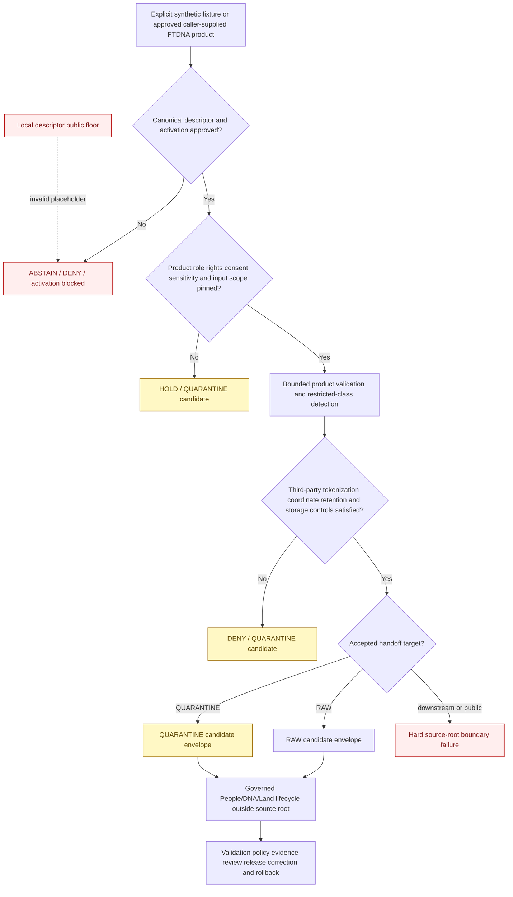

<!-- [KFM_META_BLOCK_V2]
doc_id: kfm://doc/connectors-ftdna-src-readme
title: connectors/ftDNA/src/ — FamilyTreeDNA Connector Source Root
type: readme
version: v0.2
status: draft
owners: OWNER_TBD — Connector steward · FTDNA source steward · People/DNA/Land steward · Consent steward · Rights-holder representative · Privacy/sensitivity reviewer · Security reviewer · Packaging steward · Validation steward · Docs steward
created: 2026-06-18
updated: 2026-07-11
policy_label: restricted-doctrine; source-root; greenfield; consent-required; default-deny; manual-input-first; no-network-default; no-account-default; no-secrets; no-third-party-assumption; raw-or-quarantine-candidate-only; no-publication
proposed_path: connectors/ftDNA/src/README.md
truth_posture: CONFIRMED source root with README plus placeholder ftDNA package scaffold / supported import and installation UNPROVED / canonical source identity and package casing UNRESOLVED / local descriptor unsafe and non-authoritative / consent runtime UNBOUND / source NOT ACTIVATED / executable tests and CI ABSENT or UNKNOWN
related:
  - ../README.md
  - ../pyproject.toml
  - ../tests/README.md
  - ftDNA/README.md
  - ftDNA/__init__.py
  - ftDNA/fetch.py
  - ftDNA/descriptor.yaml
  - ../../../docs/sources/catalog/ftdna/README.md
  - ../../../docs/sources/catalog/ftdna/autosomal-raw-data.md
  - ../../../docs/sources/catalog/ftdna/dna-matches.md
  - ../../../docs/sources/catalog/ftdna/dna-segments.md
  - ../../../docs/sources/catalog/ftdna/haplogroup-data.md
  - ../../../docs/sources/catalog/ftDNA.md
  - ../../../docs/domains/people-dna-land/README.md
  - ../../../docs/domains/people-dna-land/SOURCE_REGISTRY.md
  - ../../../docs/domains/people-dna-land/SOURCE_FAMILIES.md
  - ../../../docs/domains/people-dna-land/SENSITIVITY_PROFILE.md
  - ../../../docs/domains/people-dna-land/CONSENT_MODEL.md
  - ../../../data/registry/sources/people-dna-land/README.md
  - ../../../data/raw/people-dna-land/
  - ../../../data/quarantine/people-dna-land/
  - ../../../schemas/contracts/v1/source/
  - ../../../schemas/contracts/v1/consent/README.md
  - ../../../policy/consent/people/README.md
  - ../../../policy/sensitivity/people/
  - ../../../policy/rights/
  - ../../../release/
tags: [kfm, connectors, ftdna, familytreedna, source-root, python, people-dna-land, dna, consent, revocation, third-party, source-admission, quarantine, governance]
notes:
  - "Repository inspection confirms that connectors/ftDNA/src/ contains this README and one package directory named ftDNA. That package contains an expanded README, an empty __init__.py, a one-line fetch.py placeholder, and a placeholder descriptor.yaml."
  - "The adjacent pyproject.toml records only project name kfm-connector-ftDNA and version 0.0.0. No build backend, package discovery, supported Python version, dependencies, entry points, test configuration, install evidence, or stable import API is proved."
  - "The package-local descriptor has role and rights set to TBD and sensitivity_floor set to public. The public value conflicts with People/DNA/Land and FTDNA doctrine and is an unsafe placeholder, not source authority or a public-safe default."
  - "The lowercase docs/sources/catalog/ftdna/ family and four product pages exist, while docs/sources/catalog/ftDNA.md remains a stale mixed-case umbrella stub. Naming, casing, source ID, package import, registry, and migration posture remain unresolved."
  - "No accepted SourceDescriptor, SourceActivationDecision, vendor access method, consent contract, third-party handling decision, tokenization contract, restricted-storage contract, executable test suite, or passing CI evidence is proved."
  - "Raw genotype, DNA match, and DNA segment products remain default-deny/highest-sensitivity. Match data implicates third parties, and segment coordinates remain re-identifying even when kit identifiers are tokenized."
[/KFM_META_BLOCK_V2] -->

<a id="top"></a>

# FamilyTreeDNA Connector Source Root

> Evidence-grounded source-code boundary for a possible FamilyTreeDNA / FTDNA connector package. The current root is a greenfield scaffold, not an operational integration. It does **not** prove installability, supported imports, vendor access, consent validation, parser behavior, genetic interpretation, RAW persistence, or publication capability.

<p>
  
  
  
  
  
  
  
  
</p>

`connectors/ftDNA/src/`

> [!IMPORTANT]
> **Confirmed state:** this source root contains this README and one package-shaped directory, `ftDNA/`. The package directory contains an expanded README, an empty `__init__.py`, a one-line `fetch.py` placeholder, and a placeholder `descriptor.yaml`. No configuration model, product dispatcher, supplied-input adapter, vendor client, parser, consent integration, privacy classifier, tokenization integration, handoff builder, finite error contract, executable package test, or passing CI evidence is confirmed.

> [!CAUTION]
> `ftDNA/descriptor.yaml` contains `sensitivity_floor: public`. FTDNA and People/DNA/Land doctrine treat raw genotype, match, segment, living-person, and related material as denied or restricted by default. **The local `public` value is an unsafe placeholder. Source-root or package code must not load it as authority, use it as a permissive default, or encode it as an accepted test result.**

**Quick jumps:** [Purpose](#purpose) · [Verified repository state](#verified-repository-state) · [Evidence ledger](#evidence-ledger) · [Source-root authority boundary](#source-root-authority-boundary) · [Blocking drift](#blocking-drift) · [Source-root invariants](#source-root-invariants) · [Placement contract](#placement-contract) · [Naming casing and import identity](#naming-casing-and-import-identity) · [Product decomposition](#product-decomposition) · [Source-role boundary](#source-role-boundary) · [Access and input posture](#access-and-input-posture) · [Consent revocation and third-party boundary](#consent-revocation-and-third-party-boundary) · [Sensitive-data and secret boundary](#sensitive-data-and-secret-boundary) · [Packaging and import contract](#packaging-and-import-contract) · [Proposed source tree](#proposed-source-tree) · [Lifecycle and handoff boundary](#lifecycle-and-handoff-boundary) · [Testing relationship](#testing-relationship) · [Responsibility separation](#responsibility-separation) · [Implementation sequence](#implementation-sequence) · [Activation gates](#activation-gates) · [Review and rollback](#review-and-rollback) · [Definition of done](#definition-of-done) · [Verification backlog](#verification-backlog)

---

## Purpose

`connectors/ftDNA/src/` is the source-code root for the possible FTDNA connector implementation. Its purpose is to contain a narrow package that can validate explicit caller-supplied inputs and prepare governed source-admission candidates without becoming a genetic-data platform or authority surface.

When implementation exists, code below this root may:

- expose a small, side-effect-free Python API;
- accept explicit configuration from a caller rather than discovering secrets or accounts;
- require an accepted SourceDescriptor and activation decision before consequential behavior;
- dispatch one explicitly identified FTDNA product at a time;
- read a caller-supplied synthetic fixture, approved file, byte stream, or archive member under strict bounds;
- preserve source, product, format/version, rights, consent-reference, sensitivity, checksum, and import metadata;
- detect unsupported products, malformed input, third-party fields, coordinate-level genetic risk, role conflicts, schema drift, incomplete capture, and unsafe lifecycle targets;
- return finite blocked, denied, abstained, held, error, RAW-candidate, or QUARANTINE-candidate results under an accepted contract;
- remain deterministic and testable without network access, vendor accounts, browser state, credentials, or real genetic data.

This source root must never become:

- person, kit, kinship, paternity, maternity, ancestry, migration, ethnicity, haplogroup, or relationship truth;
- a DNA match, segment, triangulation, or medical interpretation engine;
- a FamilyTreeDNA account client, browser automation layer, scraper, credential collector, or session manager by default;
- source-registry, consent, rights, sensitivity, key-management, policy, evidence, catalog, release, or publication authority;
- a store for raw exports, real fixtures, token maps, consent credentials, or restricted source payloads;
- a writer to WORK, PROCESSED, CATALOG, TRIPLET, PROOF, RECEIPT, RELEASE, PUBLISHED, public API, map, graph, report, search, or generated-answer surfaces.

[Back to top ↑](#top)

---

## Verified repository state

The following scaffold is confirmed on the repository's default branch at the time of this update:

```text
connectors/ftDNA/
├── README.md
├── pyproject.toml
├── src/
│   ├── README.md                       # this source-root contract
│   └── ftDNA/
│       ├── README.md                   # expanded package contract
│       ├── __init__.py                 # empty file
│       ├── descriptor.yaml             # placeholder; unsafe public floor
│       └── fetch.py                    # one-line greenfield placeholder
└── tests/
    └── README.md                       # documentation only
```

### Current maturity

| Surface | Confirmed content | Maturity |
|---|---|---:|
| `src/README.md` | This source-root boundary. | **DOCUMENTED** |
| `src/ftDNA/README.md` | Evidence-grounded package contract. | **DOCUMENTED** |
| `src/ftDNA/__init__.py` | Empty file. | **IMPORT-SHAPED / BEHAVIOR ABSENT** |
| `src/ftDNA/fetch.py` | Comment-only greenfield placeholder. | **PLACEHOLDER / NON-EXECUTABLE** |
| `src/ftDNA/descriptor.yaml` | `name: ftDNA`, `role: TBD`, `rights: TBD`, `sensitivity_floor: public`. | **PLACEHOLDER / UNSAFE DEFAULT** |
| `pyproject.toml` | Project name `kfm-connector-ftDNA` and version `0.0.0` only. | **INCOMPLETE** |
| Build backend | None confirmed. | **ABSENT** |
| `src/` package discovery | None confirmed. | **ABSENT** |
| Supported Python versions | None confirmed. | **ABSENT** |
| Runtime or development dependencies | None confirmed. | **ABSENT** |
| Console scripts or entry points | None confirmed. | **ABSENT** |
| Stable public import API | None confirmed. | **ABSENT** |
| Product-specific parsers | None confirmed. | **ABSENT** |
| Consent/revocation integration | Doctrine exists; implementation and schema binding absent. | **PROPOSED / UNBOUND** |
| Third-party/tokenization integration | Product docs propose controls; package implementation absent. | **PROPOSED / UNBOUND** |
| Connector-local executable tests | None confirmed. | **ABSENT** |
| Accepted FTDNA SourceDescriptor | None found or verified. | **ABSENT / NEEDS VERIFICATION** |
| Source activation | No approved activation evidence found. | **NOT ACTIVATED** |
| Passing CI evidence | None confirmed. | **UNKNOWN / ABSENT** |

> [!CAUTION]
> An empty initializer and a `src/` directory can make this connector look installable. They do not prove that a build succeeds, imports are supported, package casing works across filesystems, runtime behavior is safe, tests pass, or the source is activated.

[Back to top ↑](#top)

---

## Evidence ledger

| Evidence | Status | What it supports | What it does not support |
|---|---:|---|---|
| `connectors/ftDNA/src/README.md` | **CONFIRMED** | A source-root documentation boundary exists. | Executable behavior or installability. |
| `connectors/ftDNA/src/ftDNA/README.md` | **CONFIRMED v0.2** | Package-level default-deny, manual-input-first, consent, privacy, product, packaging, testing, and handoff requirements are documented. | Implemented modules or passing enforcement. |
| `src/ftDNA/__init__.py` | **CONFIRMED empty** | A package namespace was scaffolded. | A stable API, supported import name, or import safety. |
| `src/ftDNA/fetch.py` | **CONFIRMED placeholder** | A future input responsibility was anticipated. | Approved network access, account access, manual upload handling, parsing, or retries. |
| `src/ftDNA/descriptor.yaml` | **CONFIRMED placeholder** | Package-local metadata was anticipated. | Canonical source authority, resolved role/rights, safe sensitivity, or activation. |
| `connectors/ftDNA/pyproject.toml` | **CONFIRMED placeholder** | Project name and version are recorded. | Build backend, package discovery, dependencies, Python support, installation, or tests. |
| `connectors/ftDNA/tests/README.md` | **CONFIRMED v0.1 documentation** | No-network, consent, rights, negative-state, and lifecycle-boundary intentions are documented. | Executable tests, accepted live-test variables, or passing results. |
| `connectors/ftDNA/README.md` | **CONFIRMED v0.1 parent contract** | Connector-level source-admission intent exists. | Current package inventory; it predates the verified product catalog and package audit. |
| `docs/sources/catalog/ftdna/README.md` | **CONFIRMED draft family profile** | FTDNA is a proposed DTC-vendor family with default-deny, rights, consent, revocation, and vendor-risk requirements. | Accepted source admission or current vendor behavior. |
| Lowercase FTDNA product pages | **CONFIRMED draft profiles** | Autosomal raw, DNA matches, DNA segments, and haplogroup data have materially different risk and gate postures. | Accepted export formats or activated parsers. |
| `docs/sources/catalog/ftDNA.md` | **CONFIRMED stale mixed-case stub** | A compatibility or migration problem exists. | Accurate current product inventory. |
| People/DNA/Land source and sensitivity docs | **CONFIRMED doctrine** | Living-person, raw-kit, DNA-segment, relationship, and private-join material is denied or restricted by default; source roles must not collapse. | Package enforcement or FTDNA activation. |
| People/DNA/Land consent model | **CONFIRMED doctrine / PROPOSED runtime** | Consent is explicit, purpose-bound, revocable, independent, and never publishes data. | A binding connector-side consent API. |
| `schemas/contracts/v1/consent/README.md` | **CONFIRMED compatibility placeholder** | Consent schema placement remains unresolved. | A usable consent schema or verifier. |
| `data/registry/sources/people-dna-land/README.md` | **CONFIRMED registry documentation** | A likely source-descriptor lane exists, while registry topology remains unsettled. | An FTDNA descriptor or activation decision. |

[Back to top ↑](#top)

---

## Source-root authority boundary

```text
THIS SOURCE ROOT MAY EVENTUALLY CONTAIN:
  one reviewed Python package
  side-effect-free configuration and types
  explicit product dispatch
  bounded caller-supplied input readers
  deterministic source-shaped parsers
  connector-local validation and sensitive-class detection
  finite redacted errors
  RAW-or-QUARANTINE candidate envelope builders
  package-local documentation

THIS SOURCE ROOT MUST NOT CONTAIN OR BECOME:
  canonical SourceDescriptor records
  SourceActivationDecision authority
  consent grants, signatures, status lists, or revocation authority
  rights, sensitivity, retention, redaction, aggregation, or release policy
  key-management, tenant salts, HMAC secrets, reversible token maps, or account credentials
  raw vendor exports, real genetic data, private fixtures, caches, or account snapshots
  identity, kinship, ancestry, triangulation, haplogroup, medical, legal, or land truth
  lifecycle stores, proof packs, catalog records, release manifests, or public outputs
```

The source root organizes possible implementation code. It does not make the implementation admissible, the source activated, the payload safe, the consent valid, the relationship true, or the output publishable.

[Back to top ↑](#top)

---

## Blocking drift

Implementation must not hide unresolved repository and governance conflicts behind plausible defaults.

| Blocker | Confirmed conflict or gap | Required source-root posture |
|---|---|---|
| Connector and package casing | `connectors/ftDNA/`, `src/ftDNA/`, `kfm-connector-ftDNA`, lowercase `ftdna/` catalog docs, and mixed-case `ftDNA.md` coexist. | Do not expose a stable import or command until a naming and migration decision is accepted. |
| Display and source identity | `ftDNA`, `FTDNA`, `FamilyTreeDNA`, and `Family Tree DNA` all appear. Proposed source ID `ftdna` is not admitted. | Require one canonical source ID and one display name; preserve aliases as documented compatibility metadata only. |
| Parent documentation | The parent connector README predates the verified lowercase product family and still says no source catalog was found. | Treat it as stale follow-up work, not source evidence. |
| Catalog topology | Detailed lowercase family/product pages coexist with a stale mixed-case umbrella stub. | Reconcile through correction or migration; do not route runtime behavior from filename casing. |
| Descriptor authority | Package-local YAML exists while canonical descriptor authority belongs in a governed registry. | Never auto-load local YAML as source authority or activation. |
| Sensitivity | Local YAML says `public`; domain and product doctrine says default-deny/T4 for major DNA classes. | Reject the local value as a placeholder and fail closed. |
| Source roles | Documentation contains `candidate`, `observed` measurement, and `modeled` relationship language. | Require product-specific accepted descriptors; never use one family-wide role constant. |
| Product scope | Raw genotype, match list, segment data, and haplogroup data differ materially. | No umbrella FTDNA parser or activation; dispatch by one admitted product. |
| Access method | `fetch.py` exists only as a comment; no vendor endpoint, account method, or automated access permission is approved. | Manual supplied-input first; network and account access remain disabled. |
| Consent contract | Consent doctrine exists, but schema placement and runtime integration remain unresolved. | Consume only externally evaluated references after a contract is selected; do not claim consent verification. |
| Third-party data | Match and segment products concern people other than the uploader. | Uploader consent must not be inherited by third parties; quarantine or deny absent an accepted policy. |
| Tokenization | HMAC/DNAKitToken concepts are proposed; key custody and contracts are absent. | Do not create salts, keys, token maps, or pseudonymization code locally. |
| Segment coordinates | Genetic intervals remain re-identifying even when kit IDs are tokenized. | Keep default-deny; no anonymous-coordinate claim or triangulation path. |
| Haplogroups | Object family and T2/T1 posture remain inferred/proposed. | Hold product activation pending an accepted domain and sensitivity decision. |
| Registry topology | Subtype-first, short-slug, and domain-first People/DNA/Land registry lanes coexist. | Maintain one authoritative descriptor; no divergent copies. |
| Intake destination | RAW-first versus quarantine-first handling for sensitive vendor exports is unresolved. | Require an accepted handoff contract before persistence; default to no persistence. |
| Packaging | No build backend, discovery, dependencies, Python versions, API, or package-data decision exists. | Do not claim installation or supported import. |
| Tests | Only a v0.1 README exists; illustrative live-test variables are not accepted. | Do not claim coverage, a runnable command, or live testing. |
| CI | No connector-specific passing run is confirmed. | Do not upgrade maturity or activation claims. |

[Back to top ↑](#top)

---

## Source-root invariants

Any future code below this root must preserve all of these invariants:

1. **Source code only.** Payloads, credentials, consent bodies, canonical descriptors, policy, evidence, release records, and lifecycle data stay outside this root.
2. **No import side effects.** Import performs no network access, account discovery, secret reads, filesystem writes, logging configuration, environment mutation, cache initialization, registry mutation, policy evaluation, consent evaluation, or activation.
3. **No live behavior by default.** Synthetic fixtures or explicit approved caller-supplied inputs are the only default execution paths.
4. **Manual-input-first.** A placeholder named `fetch.py` does not establish a network-client architecture.
5. **One product at a time.** Product identity is explicit and closed; no filename-only, extension-only, or column-guess dispatch.
6. **Descriptor-driven activation.** Code consumes accepted source authority; it never creates or infers it.
7. **Source role is fixed.** Parsing cannot upgrade a vendor measurement, computation, or candidate into confirmed observation, identity, or relationship truth.
8. **Consent is external and independent.** Code does not mint consent, infer authorization, or treat a consent allow as rights, sensitivity, evidence, or release approval.
9. **Third-party consent is not implied.** Upload authority for one person does not authorize records about matches, relatives, contacts, or shared segments.
10. **Rights, sensitivity, consent, identity, and release are separate gates.** Clearing one never clears another.
11. **No sensitive logging.** Raw genotype values, kit IDs, names, contacts, relationship metrics, segment coordinates, fine haplogroups, consent material, and payload excerpts stay out of logs and errors.
12. **No root-owned secrets.** Salts, HMAC keys, token maps, passwords, cookies, sessions, API keys, and account exports remain external.
13. **No interpretation.** Code may preserve source values and flags; it does not infer ancestry, kinship, paternity, maternity, medical meaning, migration history, ethnicity, or canonical identity.
14. **No publication transform.** Redaction, generalization, aggregation, differential privacy, evidence closure, release, correction, and rollback remain downstream.
15. **Finite outcomes only.** Every operation terminates with a bounded, reviewable result; no ambiguous partial success or best-effort acceptance.
16. **RAW or QUARANTINE candidate only.** Source-root code does not write lifecycle stores.
17. **No false anonymization claim.** Hashing, tokenization, pseudonyms, or coarse labels do not automatically make genetic data public-safe.
18. **No false secure-erasure claim.** Code may minimize retention and request cleanup but must not promise memory or filesystem erasure beyond proved runtime and storage controls.

[Back to top ↑](#top)

---

## Placement contract

### Allowed below `src/`

Future accepted source-code content may include:

- the reviewed import package;
- package-level README files;
- side-effect-free configuration and typed result models;
- closed product definitions and dispatch;
- bounded supplied-input readers;
- deterministic parsers for synthetic or approved source-shaped data;
- connector-local validation, checksum, completeness, schema-drift, and restricted-class detection;
- finite redacted errors;
- handoff-candidate builders that target only accepted RAW or QUARANTINE contracts;
- tiny non-sensitive package resources only when packaging review approves them;
- source-code tests only if the repository standard explicitly colocates them, which is not the current documented posture.

### Forbidden below `src/`

| Do not place here | Correct authority or handling |
|---|---|
| Canonical SourceDescriptors or activation decisions | Accepted source registry and activation workflow. |
| Consent grants, credentials, signatures, status lists, or revocation records | Governed consent and receipt systems. |
| Rights, sensitivity, retention, redaction, aggregation, or release rules | `policy/` and release authority. |
| JSON Schema or semantic contract authority | `schemas/` and `contracts/`. |
| Raw genotype files, match lists, segment exports, haplogroup exports, account exports, or vendor snapshots | Approved restricted lifecycle storage or quarantine, never source control. |
| Real living-person, third-party, genetic, person-parcel, or culturally sensitive fixtures | Governed fixture authority only after review; default is synthetic. |
| Passwords, API keys, tokens, cookies, browser profiles, session state, salts, HMAC keys, or token maps | Secret/key-management systems. |
| Temporary source caches or extracted archives | Explicit restricted runtime storage with retention and cleanup controls. |
| Source registry, consent, policy, proof, catalog, receipt, release, or public data | Owning responsibility roots. |
| Identity graphs, family trees, triangulation matrices, relationship conclusions, reports, maps, or generated answers | Governed downstream domain, evidence, policy, review, and release systems. |

[Back to top ↑](#top)

---

## Naming, casing, and import identity

Repository naming is not coherent enough to define a stable Python API.

| Surface | Current value | Status |
|---|---|---:|
| Connector directory | `connectors/ftDNA/` | **CONFIRMED** |
| Source package directory | `src/ftDNA/` | **CONFIRMED** |
| Project name | `kfm-connector-ftDNA` | **CONFIRMED placeholder** |
| Package-local descriptor name | `ftDNA` | **CONFIRMED placeholder** |
| Lowercase catalog family | `docs/sources/catalog/ftdna/` | **CONFIRMED draft family** |
| Mixed-case catalog umbrella | `docs/sources/catalog/ftDNA.md` | **CONFIRMED stale stub** |
| Proposed source ID | `ftdna` | **PROPOSED / NOT ADMITTED** |
| Display variants | `FamilyTreeDNA`, `Family Tree DNA`, `FTDNA`, `ftDNA` | **UNRESOLVED** |
| Supported Python import name | None accepted | **OPEN DECISION** |

Before defining imports, commands, entry points, configuration prefixes, descriptor IDs, fixture paths, or lifecycle child directories:

- choose one canonical source ID;
- choose one human display name;
- choose one Python import name and casing;
- decide whether existing mixed-case paths remain canonical, compatibility, or migration surfaces;
- align `pyproject.toml`, package directories, docs, descriptors, tests, fixtures, workflows, and source catalog references;
- preserve redirects or migration notes for renamed documentation surfaces;
- test build and import behavior on case-sensitive and case-insensitive supported environments;
- prohibit silent alias packages until migration and authority semantics are reviewed.

This README does not select a winner by convenience.

[Back to top ↑](#top)

---

## Product decomposition

An FTDNA source family does not create one safe data shape. Every product requires an independent admission decision.

| Product profile | Current documented posture | Minimum source-root implementation behavior | Forbidden shortcut |
|---|---|---|---|
| Autosomal raw data | Raw genotype/array-call material; T4/default-deny; no public path for the raw asset. | Require explicit product descriptor, subject authority, consent, rights, format/version, checksum, strict bounds, and accepted restricted-RAW or quarantine handling. | Treating a user-owned file as ordinary CSV, public-safe, or releasable after simple field removal. |
| DNA matches | T4/default-deny; rows can identify third parties and vendor-computed relationship signals. | Detect third-party fields; block plaintext normalized identities; require accepted third-party and tokenization policy before processing beyond quarantine inspection. | Assuming uploader consent covers matches, shared matches, names, contacts, kit IDs, or relationship metrics. |
| DNA segments | T4/default-deny; chromosome/start/end intervals remain re-identifying and enable triangulation. | Classify as highest-sensitivity; retain only under approved restricted handling; deny public and ordinary analytic paths. | Claiming tokenized kit IDs make segment coordinates anonymous or building a triangulation service. |
| Y-DNA / mtDNA haplogroups | Product scope, object family, and T2/T1 transition remain inferred/proposed. | Hold activation pending accepted object and tier decisions; preserve source label and granularity only under reviewer controls. | Treating coarse labels as automatically public or fine subclades, SNPs, and STRs as harmless. |
| Unknown or combined export | Scope, subjects, roles, fields, versions, and sensitivity are unresolved. | Reject or quarantine with an actionable unsupported-product result. | Best-effort parsing, implicit splitting, or umbrella FTDNA admission. |

No product inherits another product's role, consent, rights, retention, tokenization, parser, fixture, test, activation, or release posture.

[Back to top ↑](#top)

---

## Source-role boundary

The repository does not yet establish one consistent source-role assignment for every FTDNA product:

- family documentation proposes `candidate` at admission;
- People/DNA/Land documentation allows `observed` for measurements and `modeled` for relationship hypotheses;
- the DNA Matches profile emphasizes that vendor-computed similarity is not an observed event;
- source-role doctrine requires roles to remain fixed after admission.

Future source-root code must therefore:

- require a product-specific accepted SourceDescriptor;
- preserve the exact assigned role and role authority;
- reject absent, ambiguous, umbrella, or incompatible roles;
- never upgrade or downcast a role during parsing, validation, handoff, or downstream promotion;
- distinguish source measurements, vendor calculations, displayed predictions, relationship hypotheses, and reviewer conclusions;
- preserve source confidence, thresholds, algorithm/version references, status, and uncertainty where supplied;
- keep kinship, paternity, maternity, ancestry, and relationship outputs as hypotheses or candidates until governed downstream review closes;
- require a reviewed descriptor revision or correction record for a role correction;
- prohibit a generic `ftdna -> observed`, `ftdna -> candidate`, or `ftdna -> modeled` constant.

[Back to top ↑](#top)

---

## Access and input posture

### Current safe posture

The package has no implemented client and no approved automated access method. Current source documentation points toward user-initiated or caller-supplied intake rather than a vendor pull.

```text
network access: disabled
vendor account access: disabled
browser or session automation: forbidden
credential discovery: forbidden
background refresh or polling: forbidden
input: explicit synthetic fixture or approved caller-supplied file/stream/archive member
persistence: none by default
output: finite blocked/held/error result or accepted RAW/QUARANTINE candidate
```

`ftDNA/fetch.py` is a placeholder filename, not an architecture decision.

### Future explicit input contract

After binding contracts are selected, a source-root API should require values equivalent to:

- canonical source descriptor reference;
- source activation decision reference;
- exact admitted product key;
- source ID and source-family identity;
- caller-supplied file, stream, archive member, or synthetic fixture;
- uploader/data-subject authority or authorization reference;
- externally evaluated consent decision/reference and revocation state;
- current rights/terms snapshot reference;
- sensitivity/restricted-handling reference;
- source/export format version and schema fingerprint where known;
- original filename or member label as untrusted metadata, not dispatch authority;
- expected checksum/digest and bounded byte size;
- file, archive, member, row, column, time, memory, and processing limits;
- retention and cleanup instructions owned by orchestration/runtime;
- external tokenization capability reference where a selected contract requires one;
- intended domain route;
- intended lifecycle target of QUARANTINE or, only when all admission gates close, RAW.

### Prohibited access behavior

- guessed endpoints or hidden APIs;
- automated login, browser control, cookie import, session reuse, or password handling;
- provider-wide crawling or scraping;
- implicit environment-variable credential reads;
- account discovery from home directories, browser profiles, keychains, or config files;
- background refresh, polling, scheduled retrieval, or telemetry upload;
- treating a vendor URL, account ownership, or file possession as consent or source activation;
- importing real source files during package import, test collection, or documentation build;
- hidden persistence, caches, temporary archives, or fallback network behavior.

[Back to top ↑](#top)

---

## Consent, revocation, and third-party boundary

> [!IMPORTANT]
> Consent is one independent gate. It does not establish source rights, sensitivity clearance, identity truth, evidence closure, or release approval.

### Source-root consent boundary

The consent schema path is currently a compatibility placeholder, and runtime consent enforcement is not proved. Source-root code must not claim to validate or issue a `ConsentSidecar`, consent credential, signature, status-list entry, DUO/GA4GH scope, or revocation decision.

A future package may consume an **externally evaluated** consent decision or opaque reference through an accepted connector contract. It may check that the required reference is present and structurally compatible with that contract, but consent authority remains outside the connector.

| Consent condition | Required package posture |
|---|---|
| Consent reference absent where required | `DENY`, `ABSTAIN`, or QUARANTINE candidate; never implicit allow. |
| Consent cannot be verified by the owning runtime | `ABSTAIN` or `HOLD`; no sensitive parsing path. |
| Consent expired, revoked, suspended, or disputed | `DENY` or `HOLD`; preserve a bounded cleanup/revocation signal reference if the contract supports it. |
| Purpose, audience, product, subject, retention, or scope mismatch | `DENY`. |
| Vendor participation or vendor consent exists but KFM consent is absent | `DENY` or `ABSTAIN`. |
| KFM consent is valid but rights or sensitivity remains unresolved | Continue to block; consent clears only its own gate. |
| Valid consent and all source-root preconditions pass | Continue to product validation; publication remains unavailable. |

### Third-party rule

Match and segment exports can contain identifiers, display names, contact information, predicted relationships, shared-centimorgan metrics, shared-match networks, and genetic evidence concerning people other than the uploader.

Source-root code must never assume:

- the uploader owns third-party data;
- vendor participation authorizes KFM ingestion;
- a shared biological or family relationship grants consent;
- a pseudonym, hash, or token grants permission;
- HMAC tokenization eliminates genetic re-identification, rights, or consent concerns;
- a third party is deceased or non-living because the uploader is authorized;
- a consent grant for one product automatically covers another product.

Absent an accepted multi-party or third-party policy, match and segment products remain denied or quarantine-only.

### Revocation boundary

Source-root code may preserve an evaluated consent reference and return a revocation-affected outcome. It must not independently:

- issue, amend, suspend, or revoke consent;
- modify status lists;
- create authority-store tombstones;
- invalidate public caches;
- enumerate or delete downstream derivatives;
- rewrite evidence, catalog, or release state;
- claim deletion or secure erasure completed.

[Back to top ↑](#top)

---

## Sensitive-data and secret boundary

Any future implementation must assume that input may contain uniquely identifying genetic and living-person material.

### Data forbidden from routine logs, errors, metrics, snapshots, and test names

- raw genotype rows or calls;
- rsID/chromosome/position/genotype combinations copied from real inputs;
- vendor kit, account, project, or group IDs;
- subject names, match names, contacts, email addresses, or family notes;
- predicted relationships and shared-match networks;
- shared-centimorgan values tied to identifiable people;
- chromosome segment start/end coordinates tied to a person or match;
- fine Y-DNA or mtDNA subclades, STR strings, SNP details, or vendor test identifiers;
- uploaded filenames containing personal names;
- account metadata, browser state, or session identifiers;
- consent credential bodies, signatures, status-list indexes, or private review notes;
- raw payload excerpts included for debugging.

### Required implementation controls

- no payload logging by default;
- errors contain only bounded reason codes, safe counts, opaque references, and approved digests;
- no `repr`, exception, dataclass, or validation path that serializes full records;
- no telemetry labels containing source values or genetic identifiers;
- no implicit temporary files or caches;
- any caller-approved temporary storage is explicit, restricted, time-bounded, and cleanup-aware;
- archive extraction enforces path, member-count, byte-size, compression-ratio, nesting, and traversal limits;
- file and row processing is bounded to prevent unreviewed bulk ingestion;
- unknown encodings, delimiters, schemas, columns, formula-like cells, or archive members fail closed;
- source bytes are data only and are never executed, imported as code, or evaluated as formulas;
- secrets, salts, keys, token maps, credentials, cookies, and sessions remain outside the source package;
- a digest or token is never described as anonymization or public-safe transformation;
- source-side withholding, pseudonyms, suppression, and caveats remain preserved;
- code never attempts to reconstruct redacted, withheld, obscured, or tokenized identity.

### Tokenization boundary

FTDNA product documentation proposes tenant-scoped HMAC tokens for kit identifiers. No binding token contract or key-management integration is present.

Before tokenization-related code is allowed below this root:

- select the binding token and consent-manifest contract;
- assign key custody and tenant boundaries;
- define rotation, revocation, replay, collision, export, migration, and incident-response behavior;
- prove plaintext identifiers cannot reach logs or ordinary normalized output;
- prove tokens cannot become public stable identifiers;
- treat segment-coordinate re-identification as a separate unsolved risk;
- use synthetic fixtures and negative tests;
- document rollback and credential/key exposure response.

Do not create a local salt, hard-code a key, derive a key from package configuration text, or store a reversible identity map below `src/`.

[Back to top ↑](#top)

---

## Packaging and import contract

The current `pyproject.toml` is insufficient to build, install, test, or publish a supported package.

Before this source root is called installable or importable in a supported sense:

- resolve the canonical source, project, distribution, and Python import names;
- declare a build backend;
- declare package discovery for the `src/` layout;
- declare supported Python versions;
- declare runtime, optional, and development dependencies;
- define versioning policy beyond `0.0.0`;
- define whether package data exists and prohibit automatic authority loading from `descriptor.yaml`;
- define a narrow public API exported by `__init__.py`;
- add clean-environment build, wheel, installation, and import tests;
- verify installation excludes secrets, source payloads, real fixtures, canonical registry data, and consent credentials;
- ensure imports perform no network, secret, filesystem, logging, environment, cache, policy, consent, registry, or activation side effects;
- ensure optional product parsers do not import sensitive or heavyweight dependencies until explicitly invoked;
- define exception and result stability only after the connector-result contract is accepted;
- test package casing and imports on supported case-sensitive and case-insensitive environments;
- document uninstall behavior without claiming secure deletion of runtime data.

The package-local descriptor must not be auto-imported. It should be removed, converted into an unmistakable non-authoritative fixture/pointer, or validated as a blocked placeholder according to an accepted packaging decision.

[Back to top ↑](#top)

---

## Proposed source tree

The confirmed source tree is minimal:

```text
src/
├── README.md
└── ftDNA/
    ├── README.md
    ├── __init__.py        # empty
    ├── descriptor.yaml    # unsafe placeholder; not authority
    └── fetch.py           # one-line placeholder
```

A future **manual-input-first** tree might resemble:

```text
src/
├── README.md
└── <accepted_import_name>/
    ├── README.md
    ├── __init__.py
    ├── config.py
    ├── products.py
    ├── inputs.py
    ├── parse/
    │   ├── __init__.py
    │   ├── autosomal_raw.py
    │   ├── dna_matches.py
    │   ├── dna_segments.py
    │   └── haplogroups.py
    ├── validate.py
    ├── consent_refs.py
    ├── privacy.py
    ├── handoff.py
    └── errors.py
```

This is **PROPOSED**, not an instruction to generate files mechanically. A module should exist only when its responsibility, owner, contract, product scope, fixtures, tests, sensitivity posture, and rollback behavior are accepted.

| Future module | Responsibility | Must not become |
|---|---|---|
| `config.py` | Explicit side-effect-free configuration and bounded limits. | Secret discovery, activation authority, or live fallback. |
| `products.py` | Closed product keys and product-specific required metadata. | SourceDescriptor authority or guessed vendor schema. |
| `inputs.py` | Read explicit caller-supplied files/streams under bounds. | Vendor account client, browser automation, persistent cache, or lifecycle writer. |
| `parse/*` | Deterministic source-shape parsing with original semantics preserved. | DNA interpretation, identity resolution, tokenization authority, or public normalization. |
| `validate.py` | Connector-local product, version, completeness, checksum, role, and drift checks. | Consent, legal, sensitivity, relationship, or release authority. |
| `consent_refs.py` | Carry opaque consent references and delegate to an external runtime through a selected contract. | Grant issuance, signature verification authority, status-list ownership, or consent decisions. |
| `privacy.py` | Detect restricted classes, enforce no-log behavior, and return bounded blocking flags. | Public redaction policy, anonymization certification, or key management. |
| `handoff.py` | Build accepted finite results and RAW/QUARANTINE candidates. | Direct persistence, downstream promotion, or publication. |
| `errors.py` | Small deterministic redacted error taxonomy. | Sensitive values, payload excerpts, or unbounded exception detail. |

A network client should not be added merely because `fetch.py` exists. Automated access requires separate source activation, current terms review, account/security architecture, consent analysis, retention controls, and live-test approval.

[Back to top ↑](#top)

---

## Lifecycle and handoff boundary

The source root participates only at the source-admission edge and performs no lifecycle write by itself.



The diagram defines responsibility boundaries. It does not prove parsing, consent evaluation, tokenization, source persistence, RAW storage, quarantine storage, downstream validation, redaction, aggregation, evidence closure, release, or cleanup.

KFM lifecycle discipline remains:

```text
RAW -> WORK / QUARANTINE -> PROCESSED -> CATALOG / TRIPLET -> PUBLISHED
```

Source-root code may eventually construct an accepted candidate envelope. It must not persist source payloads or perform later transitions.

[Back to top ↑](#top)

---

## Testing relationship

Connector-local tests belong under `connectors/ftDNA/tests/`. That directory currently contains only a v0.1 README.

No test dependency, executable test module, fixture set, collection configuration, accepted command, live-test marker, environment-variable convention, CI job, coverage result, or passing status is confirmed.

> [!CAUTION]
> `KFM_ALLOW_LIVE_FTDNA_TESTS` appears in the existing test README as an illustrative convention. It is **not accepted** by this source-root contract. No live-test flag, endpoint, credential mode, account, browser workflow, or command is approved.

Future tests should prove at least:

### Build and import safety

- clean build, wheel creation, installation, and import from a fresh environment;
- resolved distribution and import casing;
- import performs no network, account discovery, secret reads, filesystem writes, logging mutation, environment mutation, cache initialization, registry mutation, policy evaluation, consent evaluation, or activation;
- `__init__.py` exposes only the reviewed public API;
- local descriptor YAML cannot activate or classify the source.

### Descriptor, role, and product configuration

- missing descriptor and activation block real input;
- `sensitivity_floor: public` is rejected as a placeholder;
- unknown or conflicting source roles fail closed;
- roles cannot be upgraded during parsing or handoff;
- product dispatch is explicit and closed;
- mixed or umbrella exports are rejected or quarantined;
- fixture configuration cannot fall through to live behavior.

### Consent, rights, revocation, and third parties

- absent, unverifiable, expired, revoked, suspended, disputed, or scope-mismatched consent fails closed;
- valid consent does not bypass rights, sensitivity, identity, evidence, or release gates;
- uploader consent does not authorize third-party match or segment rows;
- consent-runtime failure produces finite deny/abstain behavior;
- no consent bodies, status details, signatures, or private notes enter logs.

### Product behavior

- autosomal raw remains T4/restricted and cannot produce a public candidate;
- DNA match input detects third-party fields and cannot emit plaintext normalized identities;
- DNA segment input remains re-identification-sensitive even with tokenized kit IDs;
- triangulation requests are refused;
- haplogroup input is held until object/tier posture is accepted;
- unknown, mixed, drifted, partial, duplicate, malformed, oversized, or unsafe-archive inputs close safely;
- source fields, caveats, versions, counts, checksums, and safe metadata remain inspectable.

### Privacy and lifecycle boundaries

- raw values never appear in logs, errors, metrics, snapshots, test names, or ordinary output;
- no real genotype, kit, match, segment, living-person, contact, fine-haplogroup, account, credential, or consent data appears in committed fixtures;
- file and archive limits are enforced;
- no local salts, keys, token maps, cookies, sessions, or credentials are created or read;
- only accepted finite outcomes and RAW/QUARANTINE candidates are possible;
- every attempted WORK, PROCESSED, CATALOG, TRIPLET, PROOF, RECEIPT, RELEASE, PUBLISHED, API, map, graph, report, search, or generated-answer write fails.

Fixtures must be synthetic, minimized, purpose-specific, clearly labeled, and designed so they cannot correspond to real genetic profiles or identifiable people.

A future command such as:

```bash
python -m pytest connectors/ftDNA/tests
```

remains **PROPOSED** until packaging, dependencies, tests, fixtures, and the repository-standard runner exist and are demonstrated.

[Back to top ↑](#top)

---

## Responsibility separation

| Surface | Responsibility | Must not do |
|---|---|---|
| `connectors/ftDNA/src/` | Organize the possible source package and document source-code boundaries. | Store data, establish authority, or publish. |
| `connectors/ftDNA/src/<package>/` | Explicit input validation, source-shape parsing, local checks, finite outcomes, candidate envelopes. | Interpret DNA, resolve identity, own consent, manage keys, persist lifecycle data, or publish. |
| `connectors/ftDNA/pyproject.toml` | Build and dependency metadata after review. | Encode source activation, secrets, consent, or policy defaults. |
| `connectors/ftDNA/tests/` | Connector-local no-network and boundary tests. | Use real genetic data, prove kinship, or become policy/release authority. |
| Source registry | Canonical source identity, role, rights, cadence, sensitivity, and activation. | Store vendor payloads or infer claims. |
| Consent runtime | Evaluate scoped consent and revocation. | Publish data or replace rights/sensitivity/release gates. |
| Key/tokenization system | Custody, rotation, tenant isolation, and token services where accepted. | Turn tokens into public identities or erase genetic-coordinate risk. |
| People/DNA/Land pipelines | Downstream normalization, object candidates, restricted processing, and domain validation. | Inherit activation or consent from package adjacency. |
| Policy and validators | Decide rights, sensitivity, consent obligations, allowed transforms, and release prerequisites. | Fetch vendor data or infer product role from filenames. |
| Evidence and catalog surfaces | Close provenance, citation, review, and catalog requirements. | Treat connector output as proof automatically. |
| Release surfaces | Approve public-safe derivatives, corrections, withdrawal, supersession, and rollback. | Treat RAW, quarantine, tokenization, redaction, or aggregation as release by themselves. |

An importable module is not activation. A parsed record is not identity or relationship truth. A token is not consent. A consent allow is not publication. A generalized or aggregated artifact is not released until the release gate closes.

[Back to top ↑](#top)

---

## Implementation sequence

Implement in dependency order:

1. **Resolve identity and documentation drift**
   - choose canonical display name, source ID, connector path posture, project/distribution name, and import name;
   - reconcile lowercase product docs with the stale mixed-case umbrella;
   - align parent, source-root, package, test, registry, and catalog documentation.
2. **Resolve source registry topology and descriptor authority**
   - choose the canonical descriptor lane;
   - create product-specific descriptors and activation decisions;
   - remove, neutralize, or unmistakably mark the package-local descriptor as non-authoritative;
   - make the unsafe public floor impossible to consume.
3. **Resolve product roles and scope**
   - independently define raw genotype, match, segment, and haplogroup products;
   - pin product roles, authorities, formats, versions, exclusions, stable source identifiers, and drift behavior;
   - reject unknown or mixed products.
4. **Resolve rights, access, and retention**
   - review current source terms, permitted use, attribution, redistribution, uploader/export authority, retention, deletion, and vendor-risk posture;
   - keep automated vendor access disabled unless separately approved.
5. **Resolve consent and third-party handling**
   - select binding consent contract and runtime;
   - define uploader authority, third-party/multi-party posture, revocation, disputes, retention, and cleanup signals;
   - keep consent authority outside the package.
6. **Resolve tokenization and segment-coordinate posture**
   - accept or reject the proposed token model;
   - assign key custody, tenant isolation, rotation, migration, and incident response;
   - preserve default-deny for segment coordinates and triangulation.
7. **Resolve packaging**
   - select build backend, package discovery, Python support, dependencies, versioning, package data, public API, and casing migration;
   - establish clean build/install/import tests.
8. **Select connector-result and handoff contracts**
   - define finite outcomes;
   - settle restricted-RAW versus quarantine-first handling;
   - prohibit source-root persistence and direct downstream writes.
9. **Implement import safety and explicit configuration**
   - no network, account, secret, cache, policy, consent, or activation side effects;
   - bounded limits and no live fallback.
10. **Implement one fixture-only product slice**
    - start with the least ambiguous accepted product and synthetic data;
    - preserve source metadata and fail closed on sensitive values, drift, and incompleteness;
    - add executable tests before any real input path.
11. **Implement supplied-input reading and product parsers**
    - explicit files/streams only;
    - bounded archives and deterministic parsing;
    - no account automation.
12. **Integrate external consent and token references only after contracts exist**
    - no local consent or key authority;
    - negative tests for every failure state.
13. **Add accepted candidate handoff**
    - only after storage, lifecycle, rights, consent, sensitivity, and cleanup reviews;
    - reject direct lifecycle and public writes.
14. **Add CI last**
    - prove a clean local no-network command first;
    - retain reviewable run evidence;
    - do not upgrade badges, maturity, or activation claims before evidence exists.

[Back to top ↑](#top)

---

## Activation gates

No real FTDNA input or live behavior should run until all applicable gates close:

- [ ] Canonical display name, source ID, project/distribution name, and Python import name are accepted.
- [ ] Lowercase family/product docs and mixed-case umbrella documentation are reconciled.
- [ ] Canonical source-registry topology is accepted.
- [ ] Product-specific SourceDescriptors and activation decisions exist.
- [ ] Package-local descriptor authority is removed or explicitly neutralized.
- [ ] The unsafe `sensitivity_floor: public` placeholder cannot affect runtime, package data, or tests.
- [ ] Product-specific source roles and role authorities are accepted and covered by anti-collapse tests.
- [ ] Autosomal raw, matches, segments, and haplogroups have independent scope, format/version, and exclusion decisions.
- [ ] Current source terms, permitted use, attribution, redistribution, uploader/export authority, retention, deletion, and vendor-risk posture are reviewed.
- [ ] Manual upload/supplied-input behavior and prohibited account-access behavior are documented.
- [ ] Binding source, connector-result, and RAW/QUARANTINE handoff contracts are selected.
- [ ] Binding consent contract, consent runtime, and revocation behavior are selected and tested.
- [ ] Uploader authority and third-party/multi-party consent posture are accepted.
- [ ] Tokenization contract, tenant boundary, key custody, rotation, migration, and incident response are accepted before tokenization code exists.
- [ ] Segment-coordinate and triangulation restrictions are explicit and tested.
- [ ] Haplogroup object and tier posture is ratified before product activation.
- [ ] Restricted-RAW versus quarantine-first routing is accepted.
- [ ] Temporary-file, cache, logging, metrics, retention, deletion, cleanup, and incident-response controls are defined.
- [ ] Archive, size, row, column, time, memory, decompression, and processing limits are defined.
- [ ] Packaging metadata and clean build/install/import behavior are verified from a clean environment.
- [ ] Synthetic no-network fixtures and executable tests pass.
- [ ] No real genetic, living-person, third-party, account, credential, key, token-map, or consent data is committed.
- [ ] Connector, consent, policy, pipeline, identity, tokenization, evidence, catalog, and release responsibilities remain separate.
- [ ] Revocation, correction, derivative invalidation, rollback, cache invalidation, payload cleanup, and security incident procedures are documented.
- [ ] CI evidence is reviewable before activation or maturity claims are upgraded.

Until then, this source root remains a documentation-plus-placeholder scaffold and real/live behavior remains inactive.

[Back to top ↑](#top)

---

## Review and rollback

Review every change below `connectors/ftDNA/src/` as a high-sensitivity, consent-adjacent, third-party-data, identity, security, packaging, and lifecycle-boundary change.

A reviewer should confirm:

- implementation claims match the actual tree, package metadata, and test evidence;
- import remains side-effect free;
- source authority and activation remain external;
- naming and casing decisions are explicit and migration-safe;
- package-local YAML cannot activate or classify the source;
- the `public` sensitivity placeholder is rejected;
- product identity is explicit and closed;
- source roles remain fixed and relationship claims remain hypotheses or candidates;
- consent, rights, sensitivity, identity, evidence, and release remain independent;
- uploader consent is not applied to third parties;
- match identifiers, genotype values, and segment coordinates cannot leak through logs, errors, fixtures, metrics, package data, or ordinary output;
- source-root code does not own keys, salts, token maps, credentials, sessions, browser state, or consent credentials;
- no parser claims de-identification, ancestry, kinship, medical interpretation, or public safety;
- source-root output stops at finite results and accepted RAW/QUARANTINE candidates;
- no public client consumes source package, registry, RAW, WORK, or QUARANTINE material directly;
- no documentation or API suggests genetic, family, medical, legal, title, identity, or publication authority.

Rollback is required if a change:

- claims implementation, installation, activation, consent validation, rights clearance, privacy clearance, test coverage, or CI without evidence;
- adds import-time network, account, secret, filesystem, logging, environment, cache, registry, policy, consent, or activation behavior;
- uses package-local descriptor YAML as canonical authority;
- accepts `sensitivity_floor: public` as valid;
- introduces umbrella FTDNA activation or filename/column-based product guessing;
- performs account login, scraping, cookie/session access, or hidden credential discovery;
- weakens consent, third-party, revocation, role, rights, sensitivity, retention, logging, no-public-path, or no-persistence controls;
- stores or logs genetic values, kit IDs, names, contacts, segment coordinates, fine haplogroups, consent bodies, source payloads, or account artifacts;
- creates local token keys, salts, reversible mappings, or unreviewed pseudonyms;
- treats tokenization as anonymization or segment coordinates as non-identifying;
- emits match, segment, haplogroup, ancestry, kinship, paternity, maternity, medical, or triangulation conclusions;
- writes directly beyond an accepted RAW/QUARANTINE candidate boundary;
- emits public claims, maps, reports, graphs, search payloads, or generated answers.

Rollback procedure:

1. Revert the unsafe or misleading source-root change.
2. Restore the last verified no-network, no-account, no-secret, no-persistence, and no-public-write posture.
3. Remove or quarantine unapproved payloads, fixtures, logs, caches, package data, credentials, token maps, keys, or sensitive artifacts and follow repository incident-response/history-remediation procedures.
4. Revoke or rotate exposed credentials or tokenization material through the owning security system.
5. Move legitimate consent, policy, key-management, pipeline, identity, lifecycle, evidence, catalog, or release work to its correct responsibility lane.
6. Repair descriptors, activation decisions, package metadata, imports, product mappings, configuration, workflows, test fixtures, documentation links, and generated templates.
7. Record source, role, consent, rights, privacy, security, schema, packaging, casing, or path drift in the appropriate register.
8. Trigger governed revocation, correction, invalidation, cleanup, and rollback for every downstream artifact affected by the change.
9. Re-run the last verified clean no-network build and test commands when they exist.
10. Correct README badges and maturity claims to match evidence.

[Back to top ↑](#top)

---

## Definition of done

This source root is not complete merely because its boundary is documented.

- [x] The current source-root and package scaffold is documented accurately.
- [x] Empty `__init__.py`, placeholder `fetch.py`, placeholder `descriptor.yaml`, and incomplete `pyproject.toml` are distinguished from implementation.
- [x] The local `public` sensitivity floor is identified as unsafe.
- [x] Source identity, casing, catalog, descriptor, role, and registry drift is visible.
- [x] Product-specific raw, match, segment, and haplogroup boundaries are explicit.
- [x] Third-party consent and segment-coordinate re-identification risk is explicit.
- [x] Consent is separated from rights, sensitivity, identity, evidence, and release.
- [x] No-network, no-account, no-secret, no-log, no-persistence, and no-publication defaults are explicit.
- [x] RAW/QUARANTINE-candidate-only source-code authority is explicit.
- [x] Source-root, package, registry, consent, policy, pipeline, key-management, evidence, catalog, and release responsibilities are separated.
- [ ] Canonical source identity, package/import name, and path migration posture are accepted.
- [ ] Parent connector and test READMEs are aligned with this source-root and package contract.
- [ ] Product-specific SourceDescriptors and activation decisions exist.
- [ ] Package-local descriptor is removed, neutralized, or converted to a reviewed non-authoritative pointer.
- [ ] Current source terms, permitted access, retention, deletion, and vendor-risk rules are reviewed.
- [ ] Product roles, authorities, formats, versions, and exclusions are accepted.
- [ ] Consent schema/runtime, third-party handling, and revocation behavior are accepted.
- [ ] Tokenization/key-management architecture is accepted where required.
- [ ] Haplogroup object and tier posture is ratified.
- [ ] Restricted intake, RAW/QUARANTINE handoff, retention, logging, and cleanup contracts are accepted.
- [ ] Build metadata and a stable side-effect-free import API exist.
- [ ] Configuration, supplied-input, product dispatch, parser, validation, privacy, finite error, and handoff code exists.
- [ ] Synthetic no-network fixtures and executable tests exist and pass.
- [ ] CI wiring and passing evidence exists.
- [ ] No source-root API creates identity, kinship, ancestry, triangulation, medical, legal, title, or public-release conclusions.

[Back to top ↑](#top)

---

## Verification backlog

| Item | Status | Needed evidence |
|---|---:|---|
| Confirm the complete source-root and package inventory, including empty or generated files not visible to code search. | **NEEDS CONTINUOUS VERIFICATION** | Repository tree inspection. |
| Resolve `ftDNA` versus `ftdna` casing across connector, source root, package, project, docs, descriptor, source ID, and lifecycle paths. | **CONFLICTED** | Naming ADR or migration decision with redirects and import tests. |
| Reconcile `docs/sources/catalog/ftDNA.md` with the lowercase family and four product pages. | **CONFIRMED DRIFT / NEEDS CORRECTION** | Catalog cleanup and backlink review. |
| Update the parent connector README, which predates the verified source catalog and package scaffold. | **NEEDS FOLLOW-UP** | Documentation reconciliation. |
| Update the connector test README and remove or ratify illustrative live-test variables. | **NEEDS FOLLOW-UP / NOT APPROVED** | Test, security, consent, source, and CI review. |
| Resolve canonical source-registry topology. | **CONFLICTED / NEEDS VERIFICATION** | Registry ADR or migration note across subtype-first, short-slug, and domain-first lanes. |
| Create and approve product-specific SourceDescriptors and activation decisions. | **BLOCKED** | Source, rights, consent, sensitivity, and steward review. |
| Remove or neutralize package-local descriptor authority. | **BLOCKED** | Packaging and source-authority decision. |
| Replace `sensitivity_floor: public` with a safe non-authoritative posture or remove the field/file. | **CRITICAL BLOCKER** | Privacy/sensitivity review and descriptor update. |
| Resolve source roles for raw genotype, matches, segments, and haplogroups. | **CONFLICTED / BLOCKED** | Product descriptors, doctrine reconciliation, and anti-collapse tests. |
| Confirm current source product/export formats and version identifiers. | **NEEDS VERIFICATION** | Current source documentation, approved synthetic schema fixtures, and source-steward review. |
| Confirm permitted access method; decide whether automated vendor access is prohibited or separately allowed. | **NEEDS VERIFICATION** | Current terms, rights, security, consent, account-access, and retention review. |
| Confirm uploader/data-subject authority evidence. | **NEEDS VERIFICATION** | Consent/rights contract and review workflow. |
| Select binding consent schema and runtime. | **BLOCKED** | Accepted schema home, policy runtime, signature/status behavior, fixtures, and tests. |
| Resolve multi-party/third-party consent for match and segment products. | **BLOCKED** | Consent ADR, rights-holder review, privacy policy, and negative tests. |
| Select or reject HMAC DNAKitToken architecture. | **OPEN DECISION** | Token contract, key custody, tenant model, rotation, revocation, migration, and incident-response design. |
| Confirm segment-coordinate and triangulation restrictions. | **NEEDS VERIFICATION / DEFAULT DENY** | Sensitivity policy, research-agreement model, and tests. |
| Ratify or reject haplogroup object family and T2/T1 posture. | **ADR-CLASS / BLOCKED** | Domain, sensitivity, consent, evidence, and release decision. |
| Resolve quarantine-first versus RAW-first source-intake flow. | **CONFLICTED** | Handoff contract, storage/security review, and lifecycle tests. |
| Confirm restricted storage, temporary-file, cache, retention, deletion, revocation, and cleanup behavior. | **NEEDS VERIFICATION** | Storage contract, runbook, incident-response plan, and tests. |
| Complete `pyproject.toml` and select import name, build backend, dependencies, package discovery, and Python versions. | **OPEN DECISION** | Packaging review and clean build/install evidence. |
| Define the narrow public package API. | **OPEN DECISION** | Connector contract and import tests. |
| Decide whether `fetch.py` is removed, renamed, or retained for supplied-input behavior. | **OPEN DECISION** | Access architecture and migration review. |
| Select connector-result and RAW/QUARANTINE envelope contracts. | **NEEDS VERIFICATION** | Contracts, schemas, validators, and tests. |
| Confirm fixture authority and safe synthetic-generation rules. | **NEEDS VERIFICATION** | Fixture-root decision, privacy review, and reproducibility evidence. |
| Confirm no-network guard and executable local build/test commands. | **NEEDS VERIFICATION** | Package/test configuration and clean run output. |
| Confirm CI integration and source-root boundary enforcement. | **UNKNOWN** | Workflow configuration, branch policy, and successful runs. |
| Confirm no generated template recreates the unsafe public descriptor, mixed-case drift, or an unapproved live client. | **NEEDS VERIFICATION** | Repository-wide template/skeleton search and correction review. |

---

## Maintainer note

Keep this source root small, explicit, and difficult to misuse. Resolve source identity, product roles, rights, consent, third-party handling, sensitivity, storage, package naming, and test authority before adding behavior. Prefer synthetic or explicitly supplied inputs; keep network and account access off; reject the local public-sensitivity placeholder; preserve source meaning without inferring relationships; keep keys and consent authority external; route unresolved or high-risk material to denial or quarantine; and stop every source-code path before interpretation, lifecycle persistence, evidence closure, release, or publication.

[Back to top ↑](#top)
