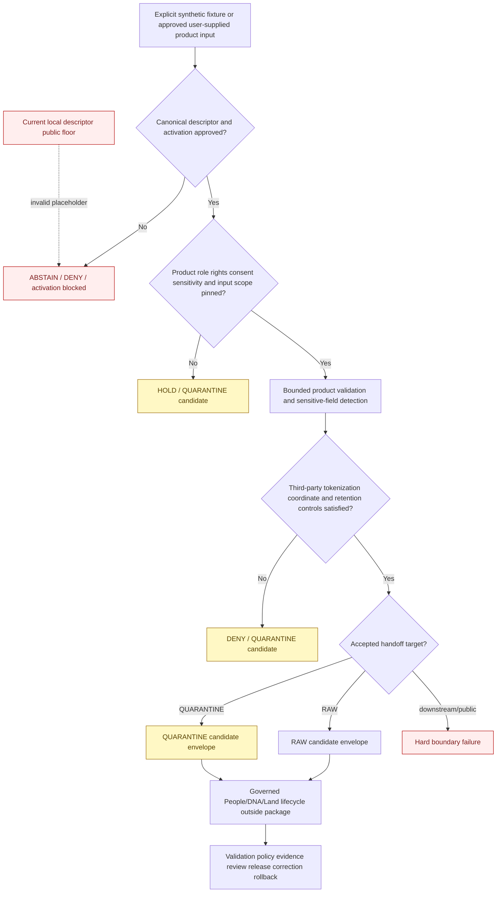

<!-- [KFM_META_BLOCK_V2]
doc_id: kfm://doc/connectors-ftdna-src-package-readme
title: connectors/ftDNA/src/ftDNA/ — FamilyTreeDNA Connector Package Scaffold
type: readme
version: v0.2
status: draft
owners: OWNER_TBD — Connector steward · FTDNA source steward · People/DNA/Land steward · Consent steward · Rights-holder representative · Privacy/sensitivity reviewer · Security reviewer · Validation steward · Docs steward
created: 2026-06-18
updated: 2026-07-11
policy_label: restricted-doctrine; source-admission; greenfield; consent-required; default-deny; manual-input-first; no-network-default; no-account-default; no-secrets; no-third-party-assumption; raw-or-quarantine-candidate-only; no-publication
proposed_path: connectors/ftDNA/src/ftDNA/README.md
truth_posture: CONFIRMED package scaffold with empty __init__.py plus placeholder fetch.py and descriptor.yaml / executable package behavior ABSENT / packaging incomplete / canonical source identity and descriptor UNRESOLVED / consent schema and runtime UNBOUND / source NOT ACTIVATED / tests and CI ABSENT or UNKNOWN
related:
  - ../../README.md
  - ../README.md
  - ../../pyproject.toml
  - ../../tests/README.md
  - __init__.py
  - fetch.py
  - descriptor.yaml
  - ../../../../docs/sources/catalog/ftdna/README.md
  - ../../../../docs/sources/catalog/ftdna/autosomal-raw-data.md
  - ../../../../docs/sources/catalog/ftdna/dna-matches.md
  - ../../../../docs/sources/catalog/ftdna/dna-segments.md
  - ../../../../docs/sources/catalog/ftdna/haplogroup-data.md
  - ../../../../docs/sources/catalog/ftDNA.md
  - ../../../../docs/domains/people-dna-land/README.md
  - ../../../../docs/domains/people-dna-land/SOURCE_REGISTRY.md
  - ../../../../docs/domains/people-dna-land/SOURCE_FAMILIES.md
  - ../../../../docs/domains/people-dna-land/SENSITIVITY_PROFILE.md
  - ../../../../docs/domains/people-dna-land/CONSENT_MODEL.md
  - ../../../../data/registry/sources/people-dna-land/README.md
  - ../../../../data/raw/people-dna-land/
  - ../../../../data/quarantine/people-dna-land/
  - ../../../../schemas/contracts/v1/source/
  - ../../../../schemas/contracts/v1/consent/README.md
  - ../../../../policy/consent/people/README.md
  - ../../../../policy/sensitivity/people/
  - ../../../../policy/rights/
  - ../../../../release/
tags: [kfm, connectors, ftdna, familytreedna, python-package, people-dna-land, dna, consent, revocation, third-party, source-admission, quarantine, governance]
notes:
  - "Repository inspection confirms the package scaffold contains this README, an empty __init__.py, a one-line fetch.py placeholder, and a placeholder descriptor.yaml; no parser, client, configuration, consent, privacy, handoff, or error implementation is proved."
  - "The project metadata contains only project name kfm-connector-ftDNA and version 0.0.0; no build backend, package discovery, supported Python version, dependencies, entry points, test configuration, or install evidence is present."
  - "The package-local descriptor has role and rights set to TBD and sensitivity_floor set to public. That public value conflicts with People/DNA/Land and FTDNA source doctrine and must be treated as an unsafe placeholder, never as an allow or public-safe decision."
  - "The lowercase docs/sources/catalog/ftdna/ family and four product pages exist, while the mixed-case docs/sources/catalog/ftDNA.md umbrella remains a stale stub that says product pages are absent."
  - "FTDNA remains a proposed vendor admission by analogy; no accepted SourceDescriptor, activation decision, current access method, rights snapshot, consent contract, or live-test approval is proved."
  - "Raw genotype, match-list, and segment products are default-deny/highest-sensitivity; DNA matches implicate third parties, and segment coordinates remain re-identifying even when kit identifiers are tokenized."
[/KFM_META_BLOCK_V2] -->

<a id="top"></a>

# FamilyTreeDNA Connector Package Scaffold

> Evidence-grounded package boundary for a possible FamilyTreeDNA / FTDNA source-admission adapter. The package is currently a behaviorless scaffold. It does **not** provide an approved vendor client, account integration, parser, consent validator, privacy transform, DNA interpretation engine, RAW writer, or public-data path.

<p>
  
  
  
  
  
  
  
</p>

`connectors/ftDNA/src/ftDNA/`

> [!IMPORTANT]
> **Confirmed state:** this package directory contains this README, an empty `__init__.py`, a one-line `fetch.py` placeholder, and a placeholder `descriptor.yaml`. No implemented configuration model, product dispatcher, vendor client, upload reader, parser, consent adapter, privacy classifier, tokenization service, handoff builder, error taxonomy, executable package tests, or passing CI evidence is confirmed. The adjacent `pyproject.toml` is incomplete. Treat all module layouts, interfaces, fields, outcome names, and commands below as future requirements or proposals—not current behavior.

> [!CAUTION]
> The package-local `descriptor.yaml` contains `sensitivity_floor: public` while FTDNA and People/DNA/Land doctrine classify raw genotype, DNA match, DNA segment, living-person, and related material as denied or restricted by default. **The local `public` value is an unsafe placeholder. It must not be loaded as authority, used as a default, or asserted in tests as an accepted result.**

**Quick jumps:** [Purpose](#purpose) · [Verified repository state](#verified-repository-state) · [Evidence ledger](#evidence-ledger) · [Package authority boundary](#package-authority-boundary) · [Blocking drift](#blocking-drift) · [Package invariants](#package-invariants) · [Source identity and casing](#source-identity-and-casing) · [Product-specific admission](#product-specific-admission) · [Source-role boundary](#source-role-boundary) · [Access and input posture](#access-and-input-posture) · [Consent revocation and third-party data](#consent-revocation-and-third-party-data) · [Sensitive-data handling](#sensitive-data-handling) · [Parsing and metadata preservation](#parsing-and-metadata-preservation) · [Finite outcomes](#finite-outcomes) · [Lifecycle and handoff boundary](#lifecycle-and-handoff-boundary) · [Proposed implementation shape](#proposed-implementation-shape) · [Packaging and import contract](#packaging-and-import-contract) · [Testing relationship](#testing-relationship) · [Implementation sequence](#implementation-sequence) · [Activation gates](#activation-gates) · [Review and rollback](#review-and-rollback) · [Definition of done](#definition-of-done) · [Verification backlog](#verification-backlog)

---

## Purpose

`connectors/ftDNA/src/ftDNA/` is reserved for a narrow, source-specific Python package that may eventually prepare governed FTDNA source-admission candidates.

When implementation exists, the package may:

- validate explicit, side-effect-free configuration supplied by a caller;
- require an accepted SourceDescriptor and activation decision before consequential behavior;
- accept one explicitly declared FTDNA product and one caller-supplied input stream, file reference, or synthetic fixture;
- verify bounded file, archive, checksum, schema-fingerprint, and product-scope preconditions;
- preserve source identity, product identity, export/version context, rights references, consent-decision references, sensitivity state, and retrieval/import metadata;
- detect unsupported products, malformed input, third-party fields, segment-coordinate risk, role ambiguity, rights uncertainty, consent uncertainty, schema drift, and incomplete capture;
- return a finite blocked, denied, abstained, held, error, RAW-candidate, or QUARANTINE-candidate result under an accepted contract;
- remain deterministic and testable with no network, no account, no browser session, no credentials, and no real genetic data.

The package must never become:

- person identity, kit identity, kinship, paternity, maternity, ancestry, or relationship truth;
- DNA match, segment, haplogroup, or triangulation interpretation authority;
- a vendor-account automation, scraping, browser-session, or credential-capture tool;
- consent, rights, sensitivity, retention, redaction, aggregation, or release authority;
- a key-management, tenant-salt, HMAC-reversal, or identity-resolution service;
- a public API, report, map, graph, search index, generated-answer, or publication surface;
- a writer to WORK, PROCESSED, CATALOG, TRIPLET, PROOF, RECEIPT, RELEASE, or PUBLISHED authority roots.

[Back to top ↑](#top)

---

## Verified repository state

The following scaffold is confirmed on the repository's default branch at the time of this update:

```text
connectors/ftDNA/
├── README.md
├── pyproject.toml
├── src/
│   ├── README.md
│   └── ftDNA/
│       ├── README.md              # this package contract
│       ├── __init__.py            # empty file
│       ├── descriptor.yaml        # placeholder: role/rights TBD; unsafe public floor
│       └── fetch.py               # one-line greenfield placeholder
└── tests/
    └── README.md                  # documentation only
```

### Current maturity

| Surface | Confirmed content | Maturity |
|---|---|---:|
| `src/ftDNA/README.md` | This package boundary. | **DOCUMENTED** |
| `src/ftDNA/__init__.py` | Empty file. | **IMPORT-SHAPED / BEHAVIOR ABSENT** |
| `src/ftDNA/fetch.py` | Comment-only greenfield placeholder. | **PLACEHOLDER / NON-EXECUTABLE** |
| `src/ftDNA/descriptor.yaml` | `name: ftDNA`, `role: TBD`, `rights: TBD`, `sensitivity_floor: public`. | **PLACEHOLDER / UNSAFE DEFAULT** |
| `pyproject.toml` | Project name and version `0.0.0` only. | **INCOMPLETE** |
| Build backend and package discovery | None confirmed. | **ABSENT** |
| Supported Python version and dependencies | None confirmed. | **ABSENT** |
| Public package API | None confirmed. | **ABSENT** |
| Product parsers | None confirmed. | **ABSENT** |
| Consent/revocation integration | Doctrine exists; package implementation absent. | **PROPOSED / UNBOUND** |
| Tokenization/key integration | Source docs propose controls; package implementation absent. | **PROPOSED / UNBOUND** |
| Connector-local executable tests | None confirmed. | **ABSENT** |
| Accepted SourceDescriptor | None found or verified. | **ABSENT / NEEDS VERIFICATION** |
| Source activation | No approved activation evidence found. | **NOT ACTIVATED** |
| Passing CI evidence | None confirmed. | **UNKNOWN / ABSENT** |

> [!CAUTION]
> An empty `__init__.py` can make a directory look package-shaped, but it does not prove installation, supported imports, runtime behavior, safety, or source activation. Do not describe this package as implemented, operational, consent-validating, or test-covered until executable artifacts and clean-run evidence exist.

[Back to top ↑](#top)

---

## Evidence ledger

| Evidence | Status | What it supports | What it does not support |
|---|---:|---|---|
| `connectors/ftDNA/src/ftDNA/README.md` | **CONFIRMED** | A package-level documentation boundary exists. | Executable behavior. |
| `__init__.py` | **CONFIRMED empty** | A possible import namespace was scaffolded. | A stable API, installability, or import safety tests. |
| `fetch.py` | **CONFIRMED placeholder** | A future source-input responsibility was anticipated. | Network access, manual-upload handling, authentication, parsing, or retries. |
| `descriptor.yaml` | **CONFIRMED placeholder** | Package-local metadata was anticipated. | Canonical source authority, resolved role/rights, safe sensitivity, or activation. |
| `../../pyproject.toml` | **CONFIRMED placeholder** | The project name `kfm-connector-ftDNA` and version `0.0.0` are recorded. | Build/install behavior, dependencies, entry points, or test runner. |
| `../../tests/README.md` | **CONFIRMED documentation** | No-network, consent, rights, and negative-state test expectations are described. | Executable tests, accepted live-test flags, or passing results. |
| `docs/sources/catalog/ftdna/README.md` | **CONFIRMED draft family profile** | FTDNA is a proposed DTC-vendor source family with default-deny, consent, rights, revocation, and product distinctions. | Accepted admission, current vendor facts, or runtime interfaces. |
| Four lowercase FTDNA product pages | **CONFIRMED draft product profiles** | Autosomal raw, DNA matches, DNA segments, and haplogroup products have distinct proposed risk and gate postures. | Accepted formats, current export behavior, or activated parsers. |
| `docs/sources/catalog/ftDNA.md` | **CONFIRMED stale stub** | A mixed-case umbrella path exists. | Current product inventory; it incorrectly says product pages are absent. |
| `docs/domains/people-dna-land/SOURCE_REGISTRY.md` | **CONFIRMED doctrine** | DNA vendor data is highest-sensitivity, consent-aware, role-preserving, and denied by default. | A completed FTDNA descriptor or final role choice. |
| `docs/domains/people-dna-land/SENSITIVITY_PROFILE.md` | **CONFIRMED doctrine** | Raw kit IDs and DNA segments are not public; T4 is the default for DNA/genomic classes. | Implemented package enforcement. |
| `docs/domains/people-dna-land/CONSENT_MODEL.md` | **CONFIRMED doctrine / PROPOSED implementation** | Consent is explicit, purpose-bound, revocable, checked independently, and never publishes data. | A binding package API or live consent runtime. |
| `schemas/contracts/v1/consent/README.md` | **CONFIRMED compatibility placeholder** | Consent schema placement remains unresolved. | Any usable consent-sidecar schema. |
| `data/registry/sources/people-dna-land/README.md` | **CONFIRMED registry documentation** | A likely source-descriptor lane exists, with topology still unresolved. | An FTDNA descriptor or activation record. |

[Back to top ↑](#top)

---

## Package authority boundary

```text
THIS PACKAGE MAY EVENTUALLY:
  validate explicit package configuration
  require descriptor and activation references
  accept one declared product and one supplied input
  parse synthetic or explicitly approved source-shaped material
  preserve source and governance references
  detect sensitive fields, unsupported scope, drift, and incomplete input
  return finite source-admission outcomes
  prepare RAW-or-QUARANTINE handoff candidates

THIS PACKAGE MUST NOT:
  self-activate an FTDNA source
  treat package-local YAML as canonical source authority
  infer consent from upload possession or vendor access
  infer third-party consent from the uploader's consent
  read browser cookies, sessions, passwords, API tokens, or account exports implicitly
  scrape or automate a vendor account by default
  store or log raw genotype, kit IDs, names, segment coordinates, or narratives
  create or reverse tenant salts, HMAC identities, or token maps
  infer kinship, ancestry, triangulation, or canonical person identity
  classify material as public-safe
  publish, release, catalog, graph, render, or answer from source material
  write beyond an accepted RAW-or-QUARANTINE handoff boundary
```

The package may report what a specifically admitted source product contains and why it is blocked, held, or eligible for a bounded source-admission handoff. It cannot decide that genetic material is true, consent-valid, rights-cleared, de-identified, public-safe, or publishable.

[Back to top ↑](#top)

---

## Blocking drift

Implementation must not encode unresolved placeholders or contradictory documentation as facts.

| Blocker | Confirmed conflict or gap | Required package posture |
|---|---|---|
| Source admission | FTDNA is proposed by analogy and is not proved as an accepted source. | Live and real-data behavior remains activation-blocked. |
| Casing and identity | `ftDNA`, `ftdna`, `FamilyTreeDNA`, `Family Tree DNA`, mixed-case catalog paths, and project/import names coexist. | Resolve canonical display name, source ID, package name, and import name before API publication. |
| Catalog authority | Lowercase product pages exist; mixed-case `ftDNA.md` remains a stale stub. | Use reviewed source profiles; do not treat the stub as current product inventory. |
| Descriptor authority | Package-local YAML and multiple registry topologies exist; no accepted FTDNA descriptor was found. | Consume one external canonical descriptor reference; never self-activate from local YAML. |
| Unsafe local sensitivity | `descriptor.yaml` says `sensitivity_floor: public`. | Validation must reject or ignore it as a placeholder; no permissive fallback. |
| Source role | Family, product, and domain docs describe `candidate`, `observed`, and `modeled` possibilities differently. | Require a product-specific accepted descriptor; never infer or upgrade role in code. |
| Product scope | Four product profiles have materially different privacy and semantics. | No umbrella parser or umbrella activation. Closed product dispatch is required. |
| Access method | Source doctrine proposes user-initiated/manual intake; no approved endpoint, auth method, or vendor client exists. | Supplied-input only by default; no network/account path. |
| Consent shape | Consent doctrine exists, but the consent schema path is a compatibility placeholder. | Do not claim sidecar validation; require an externally validated decision/reference once a contract is selected. |
| Consent runtime | Policy and render-gate implementation remain unproved. | Missing, expired, revoked, disputed, unreachable, or ambiguous consent fails closed. |
| Third-party data | Match and segment products concern people other than the uploader. | Uploader consent cannot clear third-party rows; deny or quarantine unless an accepted multi-party policy says otherwise. |
| Tokenization | HMAC kit-token controls are proposed, but key management and package integration are absent. | No plaintext normalized output and no tokenization claims until contracts and key custody are approved. |
| Segment coordinates | Coordinates remain re-identifying even after kit-tokenization. | No public path, no triangulation, and no de-identification claim. |
| Haplogroup posture | T2/T1 handling and `HaplogroupAssertion` are inferred/proposed. | Product activation blocked pending ADR or equivalent accepted decision. |
| Intake destination | Source docs contain both quarantine-first language and a RAW-first lifecycle diagram. | Default to blocked/quarantine candidate until the pre-RAW/RAW contract is accepted. |
| Packaging | `pyproject.toml` lacks build and discovery configuration. | Do not claim installability or a stable import surface. |
| Tests | Test lane is README-only and contains unverified command/flag examples. | Do not claim coverage or recognize a live-test flag as accepted. |
| Handoff | No binding connector-result or RAW/QUARANTINE envelope is confirmed. | Return no invented authoritative shape; select the contract before implementation. |
| Retention and deletion | No package-level retention, temporary-file, revocation, or secure-cleanup contract exists. | No implicit persistence or caching; caller-controlled restricted storage only after review. |

These blockers are package requirements, not details to hide behind permissive defaults.

[Back to top ↑](#top)

---

## Package invariants

Any future implementation must preserve all of these invariants:

1. **No side effects on import.** Import performs no network access, account discovery, secret reads, filesystem writes, logging configuration, environment mutation, cache initialization, registry mutation, policy evaluation, or source activation.
2. **No live behavior by default.** A supplied synthetic fixture or explicitly approved input is the only default execution path.
3. **One product at a time.** Product identity is explicit and closed; no filename-only or column-guess routing.
4. **Descriptor-driven activation.** The package consumes source authority; it does not create it.
5. **Source role is fixed.** Parsing cannot upgrade `candidate` or `modeled` material to `observed`, or turn a vendor inference into a confirmed relationship.
6. **Consent is external and independent.** The package does not mint grants, infer authorization, or treat consent as release approval.
7. **Third-party consent is not implied.** A subject's upload authority does not authorize match-list or segment data about other people.
8. **Rights, sensitivity, and consent remain separate gates.** Clearing one never clears the others.
9. **No sensitive logging.** Raw rows, kit IDs, names, contact details, genotypes, segment coordinates, fine haplogroups, narratives, and source payload fragments stay out of logs and exceptions.
10. **No package-owned identity secrets.** Tenant salts, HMAC keys, token maps, passwords, cookies, sessions, and vendor credentials are external to this package.
11. **No interpretation.** The package may preserve source values and flags; it does not infer ancestry, kinship, triangulation, medical meaning, or canonical identity.
12. **No publication transform.** Redaction, generalization, aggregation, differential privacy, release, and rollback remain downstream governed responsibilities.
13. **Finite outcomes only.** Every operation terminates with a bounded, reviewable result; no ambiguous partial success.
14. **RAW or QUARANTINE candidate only.** The package does not write lifecycle stores or public carriers.
15. **No false secure-erasure claim.** The package may minimize retention and request cleanup, but it must not promise memory or filesystem erasure beyond what the accepted runtime and storage controls prove.

[Back to top ↑](#top)

---

## Source identity and casing

Repository naming is not yet coherent enough to define a stable package API.

| Surface | Current value | Status |
|---|---|---:|
| Connector directory | `connectors/ftDNA/` | **CONFIRMED path** |
| Python package directory | `src/ftDNA/` | **CONFIRMED path** |
| Project metadata name | `kfm-connector-ftDNA` | **CONFIRMED placeholder** |
| Package-local descriptor name | `ftDNA` | **CONFIRMED placeholder** |
| Lowercase catalog family | `docs/sources/catalog/ftdna/` | **CONFIRMED draft family** |
| Mixed-case umbrella stub | `docs/sources/catalog/ftDNA.md` | **CONFIRMED stale stub** |
| Proposed source ID | `ftdna` | **PROPOSED / NOT ADMITTED** |
| Display-name variants | `FamilyTreeDNA`, `Family Tree DNA`, `FTDNA`, `ftDNA` | **UNRESOLVED** |

Before exposing imports, command names, entry points, configuration keys, descriptor IDs, or lifecycle folders:

- select one canonical source ID;
- select one human display name;
- select one Python import name and casing;
- decide whether existing mixed-case paths are canonical, compatibility, or migration targets;
- align project metadata, docs links, descriptors, tests, fixtures, and source-catalog references;
- preserve redirects or migration notes for any renamed surface;
- test imports on the repository's supported filesystems and environments.

Do not solve this by adding aliases in code before authority and migration behavior are reviewed.

[Back to top ↑](#top)

---

## Product-specific admission

The package must dispatch by an explicit admitted product. The identifiers below are descriptive documentation labels, not accepted runtime enum values.

| Product profile | Repository posture | Minimum package behavior | Forbidden shortcut |
|---|---|---|---|
| Autosomal raw data | Raw genotype/array-call material; T4 default; no public release path for the raw asset. | Require explicit product descriptor, subject authority, consent, rights, restricted handling, checksum, format version, and quarantine/restricted-RAW decision. | Treating a user-owned file as public-safe, ordinary CSV, or publishable after simple redaction. |
| DNA matches | T4; each row can identify third parties and relationship inferences. | Detect third-party fields; block plaintext normalized output; require an accepted third-party and tokenization policy before any processing beyond quarantine inspection. | Assuming uploader consent covers matches, shared-match networks, names, contacts, or kit IDs. |
| DNA segments | T4; chromosome/start/end coordinates are re-identifying and can enable triangulation. | Classify as highest-sensitivity; preserve only under approved restricted handling; deny public and ordinary analytic paths. | Claiming tokenized kit IDs make segment coordinates anonymous; building a triangulation service. |
| Y-DNA / mtDNA haplogroup data | Product, object family, and T2/T1 transition remain inferred/proposed. | Hold activation pending ADR or equivalent acceptance; preserve source label and granularity only under reviewer controls. | Treating coarse labels as automatically public or fine subclades/STR/SNP details as harmless. |
| Unknown or combined export | Scope, roles, subjects, and fields are unresolved. | Reject or quarantine with an actionable unsupported-product outcome. | Best-effort parsing, auto-splitting, or accepting a mixed file under umbrella FTDNA activation. |

Each product requires its own review of source role, authority, format/version, rights, consent, sensitivity, retention, allowed transforms, stable identity, fixtures, tests, and activation.

[Back to top ↑](#top)

---

## Source-role boundary

Repository documentation does not yet establish one consistent source-role assignment for every FTDNA product:

- the family profile proposes `candidate` at admission and contains language about later observation status;
- the domain source registry allows `observed` for measurements, `modeled` for relationship hypotheses, and `candidate` before review;
- the DNA Matches profile states that vendor-computed similarity must not be treated as an observed event;
- source-role doctrine says a role is fixed at admission and cannot be upgraded by promotion.

The package therefore must:

- require a product-specific accepted SourceDescriptor;
- preserve the exact assigned role and role authority;
- reject an absent, ambiguous, or incompatible role;
- never upgrade a role during parsing, validation, promotion, or handoff;
- keep source measurement, vendor computation, relationship hypothesis, and reviewer conclusion distinct;
- preserve source status, confidence, thresholds, algorithm/version references, and uncertainty where supplied;
- treat kinship and relationship outputs as hypotheses or candidates until governed downstream review closes;
- require a new reviewed descriptor or correction record for a role correction.

No generic `ftdna -> observed` or `ftdna -> candidate` constant is safe until the product descriptors are accepted.

[Back to top ↑](#top)

---

## Access and input posture

### Current safe posture

The source family documentation proposes user-initiated/manual intake and explicitly does not establish an automated vendor pull. The current package has no client and no approved access method.

Until source, rights, security, and activation reviews say otherwise:

```text
network access: disabled
vendor account access: disabled
browser/session automation: forbidden
credential discovery: forbidden
input source: explicit caller-supplied synthetic fixture or approved file/stream reference
persistence: none by default
output: finite blocked/held/error result or RAW/QUARANTINE candidate under a selected contract
```

The one-line `fetch.py` file is a placeholder name, not evidence that fetching is approved or implemented.

### Future explicit input contract

Once binding contracts are selected, an operation should require explicit values equivalent to:

- canonical source descriptor reference;
- source activation decision reference;
- exact admitted product key;
- source family and source ID;
- caller-supplied file, byte stream, archive member, or synthetic fixture reference;
- uploader/data-subject authority or authorization reference;
- externally validated consent decision/reference and revocation status;
- rights/terms snapshot reference;
- sensitivity/restricted-handling reference;
- export or source-format version, when known;
- original source filename label without trusting it for dispatch;
- expected checksum/digest and size;
- bounded file, archive, row, field, and processing limits;
- retention and cleanup instructions owned by the caller/runtime;
- tokenization capability reference where an accepted product contract requires one;
- intended domain route;
- intended lifecycle target of QUARANTINE or, only when fully admitted, RAW.

Field names and object shapes remain unaccepted until the connector and consent contracts are selected.

### Prohibited access behavior

- guessed endpoints;
- automated login, browser control, cookie import, session reuse, or password handling;
- provider-wide crawling;
- hidden API or HTML scraping by default;
- implicit environment-variable credential reads;
- account discovery from home directories or browser profiles;
- background refresh, polling, or scheduled retrieval;
- accepting a vendor URL as proof of user authority or consent;
- importing real source files during package import or test collection.

[Back to top ↑](#top)

---

## Consent revocation and third-party data

> [!IMPORTANT]
> Consent is one independent gate. It does not establish source rights, sensitivity clearance, evidence closure, identity truth, or release approval.

### Package consent boundary

Because the consent schema path is currently a compatibility placeholder and runtime enforcement is not proved, this package must not claim to validate a `ConsentSidecar`, signature, status list, GA4GH/DUO scope, or revocation endpoint.

A future package may consume an **externally evaluated** consent decision or reference through an accepted interface. It may validate that the required reference is present and structurally compatible with the selected connector contract, but consent authority remains in the governed consent runtime.

Required fail-closed behavior:

| Consent condition | Package posture |
|---|---|
| Consent reference absent where required | `DENY`, `ABSTAIN`, or QUARANTINE candidate; never implicit allow. |
| Consent cannot be verified | `ABSTAIN` or `HOLD`; no sensitive parsing path. |
| Consent expired, revoked, suspended, or disputed | `DENY` or `HOLD`; emit a bounded revocation/cleanup signal reference if the contract supports it. |
| Purpose, audience, product, subject, retention, or scope mismatch | `DENY`. |
| Vendor consent exists but KFM consent is absent | `DENY` or `ABSTAIN`. |
| KFM consent is valid but rights or sensitivity is unresolved | Continue to block; consent clears only its own gate. |
| Valid consent and all package preconditions pass | The package may continue to product validation; publication remains independently unavailable. |

### Third-party rule

DNA match and segment files can contain identifiers, names, contact data, relatedness metrics, and genetic evidence concerning people other than the uploader.

The package must never assume:

- the uploader owns third-party data;
- vendor participation authorizes KFM ingestion;
- a shared family relationship grants consent;
- pseudonymization grants permission;
- HMAC-tokenization eliminates consent, rights, or genetic re-identification concerns;
- a third party is non-living merely because the uploader is authorized.

Absent an accepted multi-party or third-party handling policy, match and segment products remain denied or quarantine-only.

### Revocation boundary

The package may preserve a consent-decision reference and return a revocation-affected outcome. It must not independently:

- issue or revoke consent;
- modify status lists;
- create tombstones in authority stores;
- invalidate public caches;
- enumerate or delete downstream derivatives;
- claim that deletion or secure erasure completed.

Those actions belong to consent, lifecycle, release, storage, and incident-response systems with reviewable receipts.

[Back to top ↑](#top)

---

## Sensitive-data handling

Any future implementation must assume the input can contain highly identifying genetic and living-person material.

### Data that must not appear in routine logs or errors

- raw genotype rows or genotype calls;
- rsID/chromosome/position/genotype combinations copied from real inputs;
- vendor kit IDs or account IDs;
- subject names, match display names, contacts, email addresses, or family notes;
- predicted relationships and shared-match networks;
- shared-centimorgan values tied to identifiable people;
- chromosome segment start/end coordinates tied to a subject or match;
- fine Y-DNA or mtDNA subclades, STR strings, SNP details, or vendor test identifiers;
- source narratives, comments, uploaded filenames containing personal names, or account metadata;
- consent credential bodies, signatures, status-list indexes, or private review notes;
- raw payload excerpts included for debugging.

### Required future controls

- no payload logging by default;
- errors contain only bounded reason codes, safe counts, opaque references, and approved digests;
- no `repr` or exception path that serializes full records;
- no telemetry labels containing kit IDs, names, segment coordinates, haplogroups, or source rows;
- no implicit temporary files or caches;
- any caller-approved temporary storage is explicit, restricted, time-bounded, and cleanup-aware;
- archive extraction enforces member-count, size, path, compression, and traversal limits;
- file and row processing is bounded to prevent unreviewed bulk ingestion;
- unknown encodings, delimiters, schemas, columns, or archive members fail closed;
- source bytes are treated as data only—never executed, imported as code, or interpreted as formulas;
- secrets, salts, keys, token maps, credentials, and account sessions remain outside the package;
- a digest or token is not described as anonymization or public-safe transformation;
- source-side withholding, suppression, pseudonyms, and caveats remain preserved;
- no attempt is made to reconstruct redacted, withheld, obscured, or tokenized identities.

### Tokenization boundary

The source profiles propose tenant-scoped HMAC tokens for DNA kit identifiers. This package currently has no tokenization contract or key-management integration.

Before tokenization code is added:

- select the binding token and consent-manifest contract;
- assign key custody and tenant boundaries;
- define rotation, revocation, collision, replay, and migration behavior;
- ensure plaintext identifiers cannot reach logs or ordinary normalized output;
- prove that tokens are not exposed as public stable identifiers;
- account separately for segment-coordinate re-identification;
- add synthetic fixtures and negative tests;
- document rollback and incident response.

Do not create a local salt, hard-code a key, derive a key from configuration text, or store a reversible mapping in this package.

[Back to top ↑](#top)

---

## Parsing and metadata preservation

Parsers must preserve source meaning without producing interpretation or public-safe claims.

Every non-error candidate should preserve, where applicable and permitted:

### Source and governance minimum

- canonical KFM source ID and descriptor reference;
- exact product identity;
- source family/display name as supplied by the accepted descriptor;
- source role and role authority;
- activation decision reference;
- uploader/subject authority reference;
- consent decision/reference and evaluated state;
- rights/terms snapshot reference;
- sensitivity/restricted-handling reference;
- source-format/export version and schema fingerprint;
- original file/archive/member identity as a safe label;
- import/retrieval timestamp supplied by orchestration;
- content checksum/digest under restricted handling;
- connector/parser version;
- intended lifecycle target;
- drift, incomplete, sensitive, third-party, revoked, quarantined, and review flags.

### Capture and completeness minimum

- expected and received files or archive members;
- byte size and bounded-limit result;
- row/record count where safe;
- accepted, rejected, held, and unresolved counts;
- required-field presence;
- duplicate source-key count where a source key is defined;
- checksum verification result;
- truncation, interruption, malformed-row, and unsupported-column state;
- unknown-column and schema-drift evidence without copying sensitive values.

### Product-specific preservation boundaries

| Product | Preserve | Do not infer or emit |
|---|---|---|
| Autosomal raw | Verified format/version metadata, row structure, source fields, counts, checksum, and restricted classification. | Medical meaning, ancestry, identity, kinship, public genotype output, or ordinary normalized rows without an accepted restricted contract. |
| DNA matches | Product/version metadata, field inventory, third-party presence, safe counts, source caveats, and blocked/tokenization-required state. | Plaintext match identities, confirmed relationship, consent coverage, social graph, or public match metrics. |
| DNA segments | Product/version metadata, coordinate-field presence, chromosome-build reference when verified, safe counts, and highest-sensitivity state. | Triangulation, relationship truth, anonymous-coordinate claims, or public/reviewer output outside an approved research agreement. |
| Haplogroups | Source label, test/product context, nomenclature/version context, granularity, and review state. | Public tier, accepted taxonomy, ancestral identity, ethnicity, migration history, or `HaplogroupAssertion` authority before ratification. |

Unknown source fields must be preserved only through an accepted restricted passthrough contract. They must not be silently dropped, publicly surfaced, or guessed into KFM fields.

[Back to top ↑](#top)

---

## Finite outcomes

Future package APIs and tests should require a small, explicit result set. Names below are descriptive proposals until a binding contract is selected.

| Condition | Required safe behavior |
|---|---|
| Package behavior not implemented | Return or raise a clear unavailable/not-implemented result; never report successful validation. |
| Canonical source ID or descriptor missing | Activation blocked. |
| Package-local `sensitivity_floor: public` encountered | Hard placeholder-validation failure. |
| Activation decision missing | `ABSTAIN` or activation-blocked result. |
| Product identity missing or unknown | Validation failure or QUARANTINE candidate. |
| Combined/umbrella export supplied | Reject or hold for product decomposition. |
| Source role missing or conflicted | Activation block; no permissive default. |
| Rights or current terms unresolved | `DENY`, `ABSTAIN`, or QUARANTINE candidate. |
| Consent contract not selected | Activation block for real sensitive inputs. |
| Consent missing, unverifiable, expired, revoked, suspended, disputed, or out of scope | `DENY`, `ABSTAIN`, or `HOLD`. |
| Uploader authority absent or ambiguous | `DENY` or QUARANTINE candidate. |
| DNA matches contain third-party fields | Deny or quarantine unless an accepted third-party/tokenization contract and decision explicitly permit processing. |
| DNA segments contain coordinate-level evidence | T4/restricted classification; no public or ordinary analytic output. |
| Haplogroup product supplied before tier/object ADR | `HOLD` or product-not-admitted result. |
| Network or account access requested under default configuration | Bounded disabled outcome. |
| Credential, cookie, session, browser-profile, or hidden environment access requested | Hard failure. |
| File/archive exceeds limits or contains unsafe paths | Reject or quarantine. |
| Checksum mismatch or incomplete capture | Incomplete-capture quarantine. |
| Format, schema, field, type, delimiter, encoding, or version drift | Reviewable drift outcome; no best-effort acceptance. |
| Sensitive value would enter a log, exception, metric, or ordinary output | Hard privacy failure. |
| Source role would be upgraded or relationship treated as confirmed | Hard semantic-boundary failure. |
| Tokenization capability or key custody missing where required | Block processing beyond quarantine inspection. |
| Intended target is beyond RAW or QUARANTINE | Hard authority-boundary failure. |
| Direct lifecycle/public write attempted | Hard failure. |
| Kinship, paternity, ancestry, triangulation, medical, legal, or public-identity determination requested | Refuse and direct callers to governed specialist/reviewer processes. |

Errors must be deterministic, finite, actionable, safe to log, and free of sensitive source values.

[Back to top ↑](#top)

---

## Lifecycle and handoff boundary

The package participates only at the source-admission edge.



The diagram defines responsibility boundaries. It does not prove parsing, consent evaluation, tokenization, handoff, RAW storage, quarantine storage, downstream validation, redaction, aggregation, evidence closure, or release.

KFM lifecycle discipline remains:

```text
RAW -> WORK / QUARANTINE -> PROCESSED -> CATALOG / TRIPLET -> PUBLISHED
```

The package may eventually construct an accepted candidate envelope. It does not persist the source payload or perform later lifecycle transitions.

[Back to top ↑](#top)

---

## Proposed implementation shape

The confirmed package files are minimal:

```text
ftDNA/
├── README.md
├── __init__.py        # empty
├── descriptor.yaml    # placeholder, not authority
└── fetch.py           # one-line placeholder
```

A future **manual-input-first** package might use a structure like:

```text
ftDNA/
├── README.md
├── __init__.py
├── config.py
├── products.py
├── inputs.py
├── parse/
│   ├── __init__.py
│   ├── autosomal_raw.py
│   ├── dna_matches.py
│   ├── dna_segments.py
│   └── haplogroups.py
├── validate.py
├── consent_refs.py
├── privacy.py
├── handoff.py
└── errors.py
```

This tree is **PROPOSED**, not implementation evidence. Do not create it mechanically. A module should exist only when its responsibility, contract, owner, fixtures, tests, and sensitivity posture are accepted.

Potential responsibility split:

| Future module | Responsibility | Must not become |
|---|---|---|
| `config.py` | Side-effect-free explicit configuration and bounded limits. | Environment/secret discovery, activation authority, or hidden live fallback. |
| `products.py` | Closed product keys and product-specific required metadata. | SourceDescriptor authority or guessed vendor schema. |
| `inputs.py` | Read an explicit caller-supplied stream/file under bounds. | Vendor client, account browser, persistent cache, or lifecycle writer. |
| `parse/*` | Deterministic fixture/source-shape parsing with original semantics preserved. | DNA interpretation, identity resolution, tokenization authority, or public normalization. |
| `validate.py` | Connector-local product, version, completeness, checksum, role, and drift checks. | Consent, legal, sensitivity, relationship, or release authority. |
| `consent_refs.py` | Carry or validate references against a selected connector contract and delegate to an external consent runtime. | Grant issuance, signature/status-list authority, or independent consent decision-making. |
| `privacy.py` | Detect restricted classes, enforce no-log behavior, and return bounded blocking flags. | Public redaction policy, de-identification certification, or key management. |
| `handoff.py` | Build accepted finite results and RAW/QUARANTINE candidates. | Direct storage writes, downstream promotion, or publication. |
| `errors.py` | Small deterministic redacted error taxonomy. | Sensitive values, full payload excerpts, or unbounded exception detail. |

A network client or automated `fetch.py` implementation should not be added unless source activation, permitted access, account/security handling, current terms, consent, retention, and live-test policy are independently approved. The existing placeholder filename does not require that architecture.

[Back to top ↑](#top)

---

## Packaging and import contract

The current project metadata is not sufficient to install or publish a package.

Before this package is called installable or importable in a supported sense:

- resolve the canonical Python import name and casing;
- declare a build backend;
- declare package discovery for the `src/` layout;
- declare supported Python version(s);
- declare runtime and development dependencies;
- define versioning policy beyond `0.0.0`;
- define whether package data exists and prohibit automatic authority-loading from `descriptor.yaml`;
- define the narrow public API exported from `__init__.py`;
- add clean-environment build and import tests;
- verify installation does not include secrets, source payloads, real fixtures, or canonical registry data;
- ensure imported modules perform no network, secret, filesystem, logging, environment, cache, policy, or activation side effects;
- ensure optional product parsers do not import heavyweight or sensitive dependencies until invoked;
- keep errors and types stable only after the connector-result contract is accepted.

The package-local descriptor must not be imported automatically. It should be removed, converted to an explicit non-authoritative fixture/pointer, or validated as a placeholder according to a reviewed packaging decision.

[Back to top ↑](#top)

---

## Testing relationship

Connector-local tests belong under `connectors/ftDNA/tests/`, but that directory currently contains documentation only.

No test dependency, test module, fixture set, collection configuration, accepted local command, live-test marker, environment-variable convention, CI job, coverage result, or passing status is confirmed.

> [!CAUTION]
> `KFM_ALLOW_LIVE_FTDNA_TESTS` appears in the existing test README as an illustrative convention. It is **not** accepted by this package contract. No live-test flag, endpoint, credential mode, account, or command is approved.

Future tests should prove:

### Import and packaging

- clean build and install from a fresh environment;
- resolved package/import casing;
- import performs no network, secret reads, file writes, logging mutation, environment mutation, cache initialization, registry mutation, or activation;
- `__init__.py` exposes only the reviewed public API;
- local descriptor YAML cannot auto-activate the source.

### Descriptor, role, and configuration

- missing descriptor and activation block real input;
- `sensitivity_floor: public` is rejected as a placeholder;
- unknown or conflicting source roles fail closed;
- roles cannot be upgraded during parsing or handoff;
- product dispatch is explicit and closed;
- fixture configuration cannot fall through to live behavior.

### Consent, rights, and revocation

- absent, unverifiable, expired, revoked, suspended, disputed, or scope-mismatched consent fails closed;
- valid consent does not bypass rights, sensitivity, or release gates;
- uploader consent does not authorize third-party match/segment rows;
- consent runtime failure produces finite deny/abstain behavior;
- no consent bodies, status-list details, signatures, or private notes enter logs.

### Product behavior

- autosomal raw input remains T4/restricted and cannot produce a public candidate;
- DNA match input detects third-party fields and cannot emit plaintext normalized identities;
- DNA segment input remains re-identification-sensitive even with tokenized kit IDs;
- triangulation requests are refused;
- haplogroup input is held until tier/object posture is accepted;
- unknown, mixed, drifted, partial, duplicate, or malformed exports close safely;
- source fields, caveats, versions, counts, and safe metadata remain inspectable.

### Privacy and boundaries

- raw values never appear in logs, errors, metrics, snapshots, test names, or ordinary output;
- no real genotype, kit, match, segment, living-person, contact, fine-haplogroup, credential, or vendor-account data appears in committed fixtures;
- archive and file limits are enforced;
- no local salts, keys, token maps, cookies, sessions, or credentials are created or read;
- only accepted finite outcomes and RAW/QUARANTINE candidates are possible;
- every attempted WORK, PROCESSED, CATALOG, TRIPLET, PROOF, RECEIPT, RELEASE, PUBLISHED, API, map, graph, report, or generated-answer write fails.

Fixtures must be synthetic, minimized, purpose-specific, clearly labeled, and constructed so they cannot correspond to real genetic profiles or people. A future command such as:

```bash
python -m pytest connectors/ftDNA/tests
```

remains **PROPOSED** until packaging, dependencies, tests, fixtures, and the repository-standard runner are implemented and demonstrated.

[Back to top ↑](#top)

---

## Implementation sequence

Implement in dependency order:

1. **Resolve identity and documentation drift**
   - choose canonical display name, source ID, connector path posture, project name, and import name;
   - reconcile lowercase product docs with the stale mixed-case umbrella stub;
   - update parent/source/test READMEs to the accepted naming decision.
2. **Resolve source authority**
   - choose the canonical SourceDescriptor topology;
   - create and review product-specific descriptors and activation decisions;
   - remove or neutralize the local `public` sensitivity placeholder;
   - prohibit package-local self-activation.
3. **Resolve product roles and scope**
   - decide roles for raw genotype, matches, segments, and haplogroups;
   - settle vendor measurement versus inference semantics;
   - accept exact product keys, formats, versions, and exclusions.
4. **Resolve rights, access, and retention**
   - review current source terms, permitted use, attribution, export authority, retention, deletion, and account-access posture;
   - retain manual supplied-input behavior as the default;
   - decide whether any automated vendor access is allowed at all.
5. **Resolve consent and third-party handling**
   - select the binding consent contract and runtime;
   - define uploader authority, multi-party/third-party posture, revocation, retention, cleanup, and failure behavior;
   - accept or reject the proposed kit-token model and assign external key custody.
6. **Resolve sensitivity and lifecycle routing**
   - select restricted-RAW versus quarantine behavior;
   - define pre-RAW/RAW handoff, child-lane naming, storage, access, logging, temporary-file, deletion, and incident-response controls;
   - keep raw genetic and segment material off every public path.
7. **Complete package metadata**
   - choose build backend, package discovery, Python versions, dependencies, versioning, public imports, and installation tests.
8. **Implement the smallest fixture-only slice**
   - explicit product dispatch;
   - bounded supplied-input reader;
   - one parser using synthetic data;
   - metadata preservation, no-log controls, and finite errors;
   - no network or real source files.
9. **Add consent-reference and privacy integration**
   - delegate to accepted external runtime;
   - detect restricted classes and block safely;
   - do not add tokenization until key-management contracts and tests exist.
10. **Add handoff integration**
    - only after a binding connector-result and RAW/QUARANTINE envelope exists;
    - reject direct lifecycle writes.
11. **Expand products independently**
    - each additional product receives its own descriptor, role, rights, consent, sensitivity, parser, fixtures, tests, and activation.
12. **Add CI last**
    - prove a clean local no-network run first;
    - retain reviewable run evidence;
    - upgrade badges and maturity claims only after evidence exists.
13. **Consider live access last—or never**
    - only after source, rights, consent, security, retention, incident-response, and account-access review;
    - isolate from default tests and ordinary package behavior;
    - do not treat a smoke test as source admission or release approval.

[Back to top ↑](#top)

---

## Activation gates

No real FTDNA material or live/account behavior should be processed until all applicable gates close:

- [ ] Canonical source display name, source ID, connector path posture, project name, and Python import name are accepted.
- [ ] Lowercase family/product docs and mixed-case umbrella documentation are reconciled.
- [ ] Canonical source-registry topology is accepted.
- [ ] Product-specific SourceDescriptors and activation decisions exist.
- [ ] Package-local descriptor authority is removed or explicitly neutralized.
- [ ] The unsafe `sensitivity_floor: public` placeholder cannot affect runtime or tests.
- [ ] Product-specific source roles and role authorities are accepted and anti-collapse tests exist.
- [ ] Autosomal raw, matches, segments, and haplogroups have independent scope, format/version, and exclusion decisions.
- [ ] Current source terms, permitted use, attribution, redistribution, export authority, retention, and deletion posture are reviewed.
- [ ] Manual upload/supplied-input behavior and any prohibited account-access behavior are documented.
- [ ] Binding source, connector-result, and RAW/QUARANTINE handoff contracts are selected.
- [ ] Binding consent contract, consent runtime, and revocation behavior are selected and tested.
- [ ] Uploader authority and third-party/multi-party consent posture are accepted.
- [ ] Tokenization contract, tenant boundary, key custody, rotation, migration, and incident response are accepted before tokenization code exists.
- [ ] Segment-coordinate and triangulation restrictions are explicit and tested.
- [ ] Haplogroup object/tier posture is ratified before product activation.
- [ ] Restricted-RAW versus QUARANTINE routing is accepted.
- [ ] Temporary-file, cache, logging, metrics, retention, deletion, and cleanup controls are defined.
- [ ] Archive, size, row, time, memory, and processing limits are defined.
- [ ] Packaging metadata and clean import behavior are verified from a clean environment.
- [ ] Synthetic no-network fixtures and executable tests pass.
- [ ] No real genetic, living-person, third-party, account, credential, or consent data is committed.
- [ ] Connector, consent, policy, pipeline, identity, tokenization, evidence, catalog, and release responsibilities remain separate.
- [ ] Revocation, correction, derivative invalidation, rollback, cache invalidation, and incident-response procedures are documented.
- [ ] CI evidence is reviewable before activation or maturity claims are upgraded.

Until then, this package remains a documentation-plus-placeholder scaffold and real/live behavior remains inactive.

[Back to top ↑](#top)

---

## Review and rollback

Review every package change as a high-sensitivity, consent-adjacent, third-party-data, identity, security, packaging, and lifecycle-boundary change.

A reviewer should confirm:

- implementation claims match the actual tree and test evidence;
- import remains side-effect free;
- source authority and activation remain external;
- naming/casing decisions are explicit and migration-safe;
- package-local YAML cannot activate or classify the source;
- the `public` sensitivity placeholder is rejected;
- product identity is explicit and closed;
- source roles remain fixed and relationship claims remain hypotheses/candidates;
- consent, rights, and sensitivity remain independent;
- uploader consent is not applied to third parties;
- match identifiers and segment coordinates cannot leak through logs, errors, fixtures, metrics, or ordinary output;
- the package does not own keys, salts, token maps, credentials, sessions, or browser state;
- no parser claims de-identification, ancestry, kinship, or public safety;
- output stops at finite results and accepted RAW/QUARANTINE candidates;
- no public client consumes package, registry, RAW, WORK, or QUARANTINE material directly;
- no documentation suggests genetic, medical, family, legal, or identity determination authority.

Rollback is required if a change:

- claims implementation, activation, consent validation, rights clearance, privacy clearance, test coverage, or CI without evidence;
- adds import-time network, secret, filesystem, logging, environment, cache, registry, policy, or activation behavior;
- uses the package-local descriptor as canonical authority;
- accepts `sensitivity_floor: public` as valid;
- introduces broad FTDNA or provider-wide activation;
- performs account login, scraping, cookie/session access, or hidden credential discovery;
- weakens consent, third-party, revocation, role, rights, sensitivity, retention, logging, or no-public-path controls;
- stores or logs genetic values, kit IDs, names, contacts, segment coordinates, fine haplogroups, consent bodies, or source payload excerpts;
- creates local token keys, salts, reversible identity maps, or unreviewed pseudonyms;
- treats tokenization as anonymization or segment coordinates as non-identifying;
- emits match, segment, haplogroup, ancestry, kinship, or triangulation conclusions;
- writes directly beyond an accepted RAW/QUARANTINE candidate boundary;
- emits public claims, maps, reports, graphs, search payloads, or generated answers.

Rollback procedure:

1. Revert the unsafe or misleading package change.
2. Restore the last verified no-network, no-account, no-secret, no-persistence, and no-public-write posture.
3. Remove or quarantine unapproved payloads, fixtures, logs, caches, credentials, token maps, keys, or sensitive artifacts and follow repository incident-response/history-remediation procedures.
4. Revoke or rotate any exposed credentials or tokenization material through the owning security system.
5. Move legitimate consent, policy, key management, pipeline, identity, lifecycle, evidence, catalog, or release work to its correct responsibility lane.
6. Repair descriptors, activation decisions, package metadata, imports, product mappings, configuration, workflows, test fixtures, documentation links, and generated templates.
7. Record source, role, consent, rights, privacy, security, schema, packaging, or path drift in the appropriate register.
8. Trigger governed revocation, correction, invalidation, cleanup, and rollback for any downstream artifact affected by the change.
9. Re-run the last verified clean no-network test command when one exists.
10. Correct README badges and maturity claims to match evidence.

[Back to top ↑](#top)

---

## Definition of done

This package is not complete merely because its boundary is documented.

- [x] The current package scaffold is documented accurately.
- [x] Empty `__init__.py`, placeholder `fetch.py`, and placeholder `descriptor.yaml` are distinguished from implementation.
- [x] Incomplete project metadata is explicit.
- [x] The local `public` sensitivity floor is identified as unsafe.
- [x] Source identity, casing, catalog, descriptor, role, and registry drift are visible.
- [x] Product-specific raw, match, segment, and haplogroup boundaries are explicit.
- [x] Third-party consent and segment-coordinate re-identification risks are explicit.
- [x] Consent is separated from rights, sensitivity, evidence, and release.
- [x] No-network, no-account, no-secret, no-log, and no-publication defaults are explicit.
- [x] RAW/QUARANTINE-candidate-only authority is explicit.
- [ ] Canonical source identity, package/import name, and path migration posture are accepted.
- [ ] Product-specific SourceDescriptors and activation decisions exist.
- [ ] Package-local descriptor is removed, neutralized, or converted to a reviewed non-authoritative pointer.
- [ ] Current source terms, access, retention, and deletion rules are reviewed.
- [ ] Product roles, authority, formats, versions, and exclusions are accepted.
- [ ] Consent schema/runtime, third-party handling, and revocation behavior are accepted.
- [ ] Tokenization/key-management architecture is accepted where required.
- [ ] Haplogroup object and tier posture is ratified.
- [ ] Restricted intake, RAW/QUARANTINE handoff, retention, logging, and cleanup contracts are accepted.
- [ ] Build metadata and a stable side-effect-free import API exist.
- [ ] Configuration, supplied-input, product dispatch, parser, validation, privacy, finite error, and handoff code exists.
- [ ] Synthetic no-network fixtures and executable tests exist and pass.
- [ ] CI wiring and passing evidence exist.
- [ ] No package API creates identity, kinship, ancestry, triangulation, medical, legal, or public-release conclusions.

[Back to top ↑](#top)

---

## Verification backlog

| Item | Status | Needed evidence |
|---|---:|---|
| Confirm the complete package file inventory, including any empty generated files not visible to code search. | **NEEDS CONTINUOUS VERIFICATION** | Repository tree inspection. |
| Resolve `ftDNA` versus `ftdna` casing across connector, package, project, docs, descriptor, source ID, and lifecycle paths. | **CONFLICTED** | Naming ADR or migration decision with redirects and tests. |
| Reconcile `docs/sources/catalog/ftDNA.md` with the lowercase family and four product pages. | **CONFIRMED DRIFT / NEEDS CORRECTION** | Catalog cleanup and backlink review. |
| Resolve canonical source-registry topology. | **CONFLICTED / NEEDS VERIFICATION** | Registry ADR or migration note across subtype-first/domain-first lanes. |
| Create and approve product-specific SourceDescriptors and activation decisions. | **BLOCKED** | Source, rights, consent, sensitivity, and steward review. |
| Remove or neutralize package-local descriptor authority. | **BLOCKED** | Packaging/source-authority decision. |
| Replace `sensitivity_floor: public` with a safe non-authoritative posture or remove the field/file. | **CRITICAL BLOCKER** | Privacy/sensitivity review and descriptor update. |
| Resolve source roles for raw genotype, matches, segments, and haplogroups. | **CONFLICTED / BLOCKED** | Product descriptors, role doctrine reconciliation, and anti-collapse tests. |
| Confirm current source product/export formats and version identifiers. | **NEEDS VERIFICATION** | Current source documentation, approved synthetic schema fixtures, and source-steward review. |
| Confirm permitted access method; decide whether automated vendor access is prohibited or separately allowed. | **NEEDS VERIFICATION** | Current terms, rights, security, consent, and account-access review. |
| Confirm uploader/data-subject authority evidence. | **NEEDS VERIFICATION** | Consent/rights contract and review workflow. |
| Select binding consent schema and runtime. | **BLOCKED** | Accepted schema home, policy runtime, signatures/status behavior, fixtures, and tests. |
| Resolve multi-party/third-party consent for match and segment products. | **BLOCKED** | Consent ADR, rights-holder review, privacy policy, and negative tests. |
| Select or reject HMAC DNAKitToken architecture. | **OPEN DECISION** | Token contract, key custody, tenant model, rotation, revocation, migration, and incident-response design. |
| Confirm segment-coordinate and triangulation restrictions. | **NEEDS VERIFICATION / DEFAULT DENY** | Sensitivity policy, research-agreement model, and tests. |
| Ratify or reject haplogroup object family and T2/T1 posture. | **ADR-CLASS / BLOCKED** | Domain, sensitivity, consent, and release decision. |
| Resolve quarantine-first versus RAW-first source-intake flow. | **CONFLICTED** | Admission/handoff contract, storage/security review, and lifecycle tests. |
| Confirm restricted storage, temporary-file, cache, retention, deletion, revocation, and secure-cleanup behavior. | **NEEDS VERIFICATION** | Storage contract, runbook, incident-response plan, and tests. |
| Complete `pyproject.toml` and select import name, build backend, dependencies, and Python versions. | **OPEN DECISION** | Packaging review and clean build/install evidence. |
| Define narrow public package API. | **OPEN DECISION** | Connector contract and import tests. |
| Decide whether `fetch.py` is removed, renamed, or retained for supplied-input behavior. | **OPEN DECISION** | Access architecture and migration review. |
| Select connector-result and RAW/QUARANTINE envelope contracts. | **NEEDS VERIFICATION** | Contracts, schemas, validators, and tests. |
| Confirm fixture authority and safe synthetic-generation rules. | **NEEDS VERIFICATION** | Fixture-root decision, privacy review, and reproducibility evidence. |
| Replace illustrative live-test environment variables with an accepted policy—or remove them. | **NOT APPROVED** | Test, security, source, consent, and CI review. |
| Confirm no-network guard and executable local test command. | **NEEDS VERIFICATION** | Package/test configuration and clean run output. |
| Confirm CI integration and boundary enforcement. | **UNKNOWN** | Workflow configuration, branch policy, and successful runs. |
| Confirm parent connector, source-root, and test READMEs are aligned with this package contract. | **NEEDS FOLLOW-UP** | Documentation reconciliation. |
| Confirm no generated template recreates the unsafe public descriptor or unapproved live client. | **NEEDS VERIFICATION** | Repository-wide template/skeleton search and correction review. |

---

## Maintainer note

Build the smallest safe adapter, not the broadest DNA integration. Resolve source identity, product roles, rights, consent, third-party handling, sensitivity, storage, and package naming before adding behavior. Prefer explicit user-supplied synthetic or approved inputs; keep network and account access off; reject the local public-sensitivity placeholder; preserve source meaning without inferring relationships; keep keys and consent authority external; route unresolved or high-risk material to denial or quarantine; and stop every package path before interpretation, evidence closure, release, or publication.

[Back to top ↑](#top)
