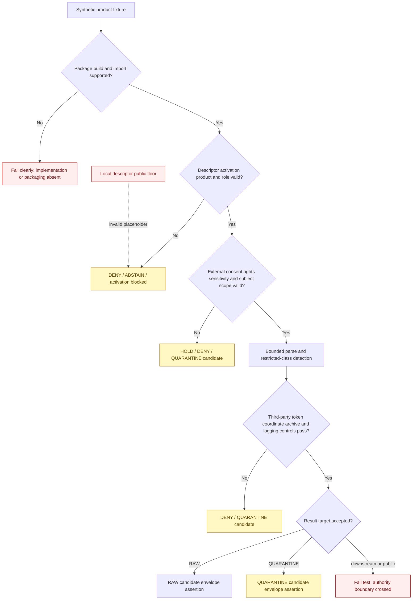

<!-- [KFM_META_BLOCK_V2]
doc_id: kfm://doc/connectors-ftdna-tests-readme
title: connectors/ftDNA/tests/ — FamilyTreeDNA Connector Test Lane
type: readme
version: v0.2
status: draft
owners: OWNER_TBD — Connector steward · FTDNA source steward · People/DNA/Land steward · Consent steward · Rights-holder representative · Privacy/sensitivity reviewer · Security reviewer · Packaging steward · Validation steward · Docs steward
created: 2026-06-18
updated: 2026-07-11
policy_label: restricted-doctrine; connector-local-tests; greenfield; consent-required; default-deny; synthetic-fixtures-only; no-network-default; no-account-default; no-secrets; no-third-party-assumption; no-live-tests-approved; raw-or-quarantine-candidate-only; no-publication
proposed_path: connectors/ftDNA/tests/README.md
truth_posture: CONFIRMED README-only test lane / executable tests ABSENT / fixtures ABSENT / package importability UNPROVED / package-local public sensitivity placeholder INVALID / consent runtime UNBOUND / source NOT ACTIVATED / live testing NOT APPROVED / CI UNKNOWN
related:
  - ../README.md
  - ../pyproject.toml
  - ../src/README.md
  - ../src/ftDNA/README.md
  - ../src/ftDNA/__init__.py
  - ../src/ftDNA/fetch.py
  - ../src/ftDNA/descriptor.yaml
  - ../../../docs/sources/catalog/ftdna/README.md
  - ../../../docs/sources/catalog/ftdna/autosomal-raw-data.md
  - ../../../docs/sources/catalog/ftdna/dna-matches.md
  - ../../../docs/sources/catalog/ftdna/dna-segments.md
  - ../../../docs/sources/catalog/ftdna/haplogroup-data.md
  - ../../../docs/sources/catalog/ftDNA.md
  - ../../../docs/domains/people-dna-land/README.md
  - ../../../docs/domains/people-dna-land/SOURCE_REGISTRY.md
  - ../../../docs/domains/people-dna-land/SOURCE_FAMILIES.md
  - ../../../docs/domains/people-dna-land/SENSITIVITY_PROFILE.md
  - ../../../docs/domains/people-dna-land/CONSENT_MODEL.md
  - ../../../data/registry/sources/people-dna-land/README.md
  - ../../../data/raw/people-dna-land/
  - ../../../data/quarantine/people-dna-land/
  - ../../../schemas/contracts/v1/source/
  - ../../../schemas/contracts/v1/consent/README.md
  - ../../../policy/consent/people/README.md
  - ../../../policy/sensitivity/people/
  - ../../../policy/rights/
  - ../../../release/
tags: [kfm, connectors, ftdna, familytreedna, tests, dna, people-dna-land, consent, revocation, third-party, synthetic-fixtures, no-network, no-account, quarantine, governance]
notes:
  - "Repository inspection confirms that connectors/ftDNA/tests/ contains this README only; no executable test modules, local fixtures, conftest.py, live-test directory, package test configuration, coverage result, or passing CI evidence is proved."
  - "The adjacent source package is itself a placeholder scaffold: empty __init__.py, one-line fetch.py, placeholder descriptor.yaml, and incomplete pyproject.toml. Tests must not report implementation success while the target behavior is absent."
  - "The package-local descriptor sets role and rights to TBD and sensitivity_floor to public. The public value conflicts with People/DNA/Land and FTDNA doctrine and must be rejected as an unsafe placeholder in future tests."
  - "Raw genotype, DNA match, and DNA segment products are default-deny/highest-sensitivity. Match data implicates third parties, and segment coordinates remain re-identifying even when kit identifiers are tokenized."
  - "The existing KFM_ALLOW_LIVE_FTDNA_TESTS examples were illustrative only. This revision removes them as an implied convention; no live-test variable, marker, endpoint, account, credential mode, or command is approved."
[/KFM_META_BLOCK_V2] -->

<a id="top"></a>

# FamilyTreeDNA Connector Test Lane

> Evidence-grounded contract for connector-local tests beneath `connectors/ftDNA/`. The lane is currently documentation-only. Future tests must prove restraint, default denial, import safety, product separation, consent-reference handling, third-party protection, sensitive-data non-disclosure, and RAW-or-QUARANTINE handoff boundaries without using real genetic data or live vendor accounts.

<p>
  
  
  
  
  
  
  
</p>

`connectors/ftDNA/tests/`

> [!IMPORTANT]
> **Confirmed state:** this directory contains this README only. No executable tests, fixture files, `conftest.py`, test dependency, package build configuration, collection configuration, live-test directory, CI job, coverage report, or passing result is confirmed. The adjacent package is not yet a supported installable implementation. Treat all proposed test filenames, fixture shapes, commands, markers, outcomes, and coverage claims below as requirements—not current evidence.

> [!CAUTION]
> `../src/ftDNA/descriptor.yaml` contains `sensitivity_floor: public`. That value is an unsafe greenfield placeholder. A future suite must reject it; it must never become the expected sensitivity of real FTDNA-originated material, an activation signal, or a public-safe result.

**Quick jumps:** [Purpose](#purpose) · [Verified repository state](#verified-repository-state) · [Evidence ledger](#evidence-ledger) · [Test authority boundary](#test-authority-boundary) · [Blocking drift](#blocking-drift) · [Test invariants](#test-invariants) · [Allowed test inputs](#allowed-test-inputs) · [Forbidden test material](#forbidden-test-material) · [Proposed test architecture](#proposed-test-architecture) · [Fixture contract](#fixture-contract) · [Build and import tests](#build-and-import-tests) · [Descriptor activation and role tests](#descriptor-activation-and-role-tests) · [Consent revocation and third-party tests](#consent-revocation-and-third-party-tests) · [Product-specific test matrices](#product-specific-test-matrices) · [Sensitive logging and secret tests](#sensitive-logging-and-secret-tests) · [File archive and resource-bound tests](#file-archive-and-resource-bound-tests) · [Finite outcomes](#finite-outcomes) · [Lifecycle and handoff boundary](#lifecycle-and-handoff-boundary) · [No-network no-account and live-test posture](#no-network-no-account-and-live-test-posture) · [Execution posture](#execution-posture) · [Responsibility separation](#responsibility-separation) · [Implementation sequence](#implementation-sequence) · [Acceptance gates](#acceptance-gates) · [Review and rollback](#review-and-rollback) · [Definition of done](#definition-of-done) · [Verification backlog](#verification-backlog)

---

## Purpose

This directory is reserved for connector-local tests of the possible FamilyTreeDNA / FTDNA source-admission package.

Future tests may prove that source-root and package code:

- builds and imports without network, account, secret, filesystem, logging, environment, cache, registry, policy, consent, or activation side effects;
- requires explicit configuration rather than discovering accounts, browser state, credentials, files, or environment variables;
- consumes only an explicitly identified product and an explicit synthetic fixture or approved caller-supplied input;
- requires an accepted SourceDescriptor and activation decision before any real-input path;
- rejects the package-local `public` sensitivity placeholder;
- preserves product-specific source role, role authority, format/version, caveats, rights references, consent references, sensitivity state, and safe import metadata;
- keeps autosomal raw, match, segment, haplogroup, and unknown/combined exports distinct;
- treats uploader authority and third-party authority as different questions;
- fails closed on missing, revoked, expired, disputed, unverifiable, or scope-mismatched consent references;
- avoids exposing genotype values, kit IDs, names, contacts, relationship metrics, segment coordinates, fine haplogroups, consent material, or source rows through logs and errors;
- enforces file, archive, member, row, column, time, memory, decompression, and processing bounds;
- returns only finite blocked, denied, abstained, held, error, RAW-candidate, or QUARANTINE-candidate outcomes under an accepted contract;
- refuses every direct downstream or public write.

This lane must not claim to prove:

- person or kit identity;
- kinship, paternity, maternity, ancestry, ethnicity, migration, medical, or relationship truth;
- that a match or segment is correctly interpreted;
- third-party consent;
- source rights or current vendor-term clearance;
- sensitivity clearance or anonymization;
- source activation;
- EvidenceBundle closure, release readiness, or publication eligibility;
- successful deletion, secure erasure, cache invalidation, or downstream revocation;
- live vendor access, account compatibility, endpoint health, or production readiness.

[Back to top ↑](#top)

---

## Verified repository state

The following scaffold is confirmed on the repository's default branch at the time of this update:

```text
connectors/ftDNA/
├── README.md
├── pyproject.toml
├── src/
│   ├── README.md
│   └── ftDNA/
│       ├── README.md
│       ├── __init__.py              # empty
│       ├── descriptor.yaml          # role/rights TBD; unsafe public floor
│       └── fetch.py                 # one-line greenfield placeholder
└── tests/
    └── README.md                    # this test contract
```

### Current maturity

| Surface | Confirmed content | Maturity |
|---|---|---:|
| `tests/README.md` | This connector-local test contract. | **DOCUMENTED** |
| Executable test modules | None confirmed. | **ABSENT** |
| Local fixtures | None confirmed. | **ABSENT** |
| `conftest.py` or test configuration | None confirmed. | **ABSENT** |
| Live-test directory | None confirmed. | **ABSENT / NOT APPROVED** |
| `src/ftDNA/__init__.py` | Empty file. | **IMPORT-SHAPED / BEHAVIOR ABSENT** |
| `src/ftDNA/fetch.py` | Comment-only placeholder. | **PLACEHOLDER / NON-EXECUTABLE** |
| `src/ftDNA/descriptor.yaml` | `role: TBD`, `rights: TBD`, `sensitivity_floor: public`. | **PLACEHOLDER / UNSAFE DEFAULT** |
| `pyproject.toml` | Project name `kfm-connector-ftDNA` and version `0.0.0` only. | **INCOMPLETE** |
| Build backend and package discovery | None confirmed. | **ABSENT** |
| Supported Python versions and dependencies | None confirmed. | **ABSENT** |
| Stable public import API | None confirmed. | **ABSENT** |
| Product parsers | None confirmed. | **ABSENT** |
| Consent/revocation integration | Doctrine exists; package binding absent. | **PROPOSED / UNBOUND** |
| Tokenization/key integration | Product documentation proposes controls; implementation absent. | **PROPOSED / UNBOUND** |
| Accepted SourceDescriptor and activation decision | None found or verified. | **ABSENT / NOT ACTIVATED** |
| Test runner and local command | None confirmed. | **UNKNOWN / UNPROVED** |
| CI and coverage evidence | None confirmed. | **UNKNOWN / ABSENT** |

> [!CAUTION]
> A README-only test directory cannot establish coverage. An empty initializer cannot establish import safety. A placeholder fetcher cannot establish access. A placeholder descriptor cannot establish role, rights, sensitivity, or activation. Do not report this connector tested, consent-validating, privacy-safe, installable, activated, or release-ready until executable evidence supports those claims.

[Back to top ↑](#top)

---

## Evidence ledger

| Evidence | Status | What it supports | What it does not support |
|---|---:|---|---|
| `connectors/ftDNA/tests/README.md` | **CONFIRMED** | The local test lane and its governance boundary exist. | Executable tests or passing results. |
| Current repository search for this test path | **CONFIRMED for inspected state** | Only this README was found below the test lane. | Permanent absence or future files. |
| `../src/README.md` | **CONFIRMED v0.2** | Source-root placement, default-deny, manual-input-first, packaging, consent, third-party, and handoff requirements are documented. | Implemented enforcement. |
| `../src/ftDNA/README.md` | **CONFIRMED v0.2** | Product boundaries, unsafe descriptor handling, import contract, sensitive-data controls, and finite outcomes are documented. | Parser, client, consent, tokenization, or handoff behavior. |
| `../src/ftDNA/__init__.py` | **CONFIRMED empty** | A package-shaped namespace exists. | Supported import or stable API. |
| `../src/ftDNA/fetch.py` | **CONFIRMED placeholder** | A future input responsibility was anticipated. | Network, account, upload, parsing, or retry behavior. |
| `../src/ftDNA/descriptor.yaml` | **CONFIRMED unsafe placeholder** | Local scaffold metadata exists. | Canonical descriptor authority, valid role/rights, safe sensitivity, or activation. |
| `../pyproject.toml` | **CONFIRMED placeholder** | Project name and version are recorded. | Build, install, dependencies, test runner, or package discovery. |
| Lowercase FTDNA family and product pages | **CONFIRMED draft profiles** | Product-specific default-deny, third-party, segment-coordinate, and haplogroup issues are documented. | Accepted formats, current vendor behavior, or activated parsers. |
| `docs/sources/catalog/ftDNA.md` | **CONFIRMED stale mixed-case stub** | Naming and catalog drift exists. | Accurate product inventory. |
| People/DNA/Land source, sensitivity, and consent docs | **CONFIRMED doctrine / PROPOSED implementation** | DNA material fails closed; consent is independent and revocable; source roles must not collapse. | Package-level consent evaluation or policy enforcement. |
| `schemas/contracts/v1/consent/README.md` | **CONFIRMED compatibility placeholder** | Consent schema placement is unresolved. | A binding consent schema or validator. |
| Connector-specific CI | **ABSENT / UNKNOWN** | CI requirements may be specified. | Merge-gate enforcement or passing status. |

[Back to top ↑](#top)

---

## Test authority boundary

Connector-local tests may prove only behavior at the FTDNA package and source-admission edge.

```text
TESTS MAY PROVE:
  package build and import safety
  explicit configuration behavior
  no-network no-account no-secret defaults
  descriptor and activation preconditions
  rejection of unsafe local descriptor placeholders
  closed product dispatch
  source-role and authority preservation
  bounded supplied-input handling
  schema/version/checksum/completeness checks
  presence and compatibility checks for external consent references
  fail-closed third-party and revocation behavior
  sensitive-value non-disclosure in logs and errors
  finite connector outcomes
  RAW-or-QUARANTINE candidate boundaries

TESTS MUST NOT CLAIM:
  person or kit identity truth
  kinship paternity maternity ancestry ethnicity or migration truth
  medical or genetic interpretation truth
  third-party consent
  source-rights clearance
  privacy anonymization or de-identification certification
  token reversibility safety
  source activation authority
  evidence catalog or release closure
  publication eligibility
  vendor endpoint or account support
  secure deletion or downstream revocation completion
```

Domain-wide consent, sensitivity, identity, relationship, evidence, catalog, release, correction, rollback, and public-surface tests belong in their accepted responsibility lanes. This directory must not become a parallel policy, domain, integration, or release test root.

[Back to top ↑](#top)

---

## Blocking drift

Executable tests must expose unresolved blockers rather than mock them into success.

| Blocker | Confirmed gap or conflict | Required test posture |
|---|---|---|
| Naming and casing | `ftDNA`, `ftdna`, `FTDNA`, `FamilyTreeDNA`, and `Family Tree DNA` coexist. | Block stable import/API claims until a naming and migration decision exists. |
| Catalog drift | Lowercase product pages exist; mixed-case `ftDNA.md` says product pages are absent. | Test documentation links only after reconciliation; do not encode stale inventory as truth. |
| Packaging | No build backend, discovery, Python support, dependencies, or stable import API. | Do not claim collection or import coverage until clean build/install tests exist. |
| Local descriptor authority | `role` and `rights` are `TBD`; `sensitivity_floor` is `public`. | Reject the file as an activation or sensitivity authority; require an accepted external descriptor. |
| Source registry topology | Multiple People/DNA/Land registry shapes remain unresolved. | Require one accepted descriptor reference; never choose a path by convenience. |
| Product descriptors | No product-specific accepted SourceDescriptors or activation decisions are proved. | Block real-input tests and activation paths. |
| Product source roles | Family and product docs contain candidate/observed/modeled tensions. | Require product-specific accepted roles; test anti-collapse and reject umbrella defaults. |
| Consent schema/runtime | Consent schema path is compatibility-only; runtime enforcement is unproved. | Test only external decision/reference handling; do not claim consent validation. |
| Third-party consent | Match and segment records concern people other than the uploader. | Deny or quarantine absent accepted multi-party/third-party policy. |
| Tokenization/key custody | No binding token contract, tenant boundary, key custody, rotation, or incident-response architecture. | Block tokenization-dependent processing; never create local keys in tests. |
| Segment coordinates | Coordinates remain re-identifying after kit-ID tokenization. | Preserve T4/default-deny behavior and refuse triangulation/public paths. |
| Haplogroup posture | Object family and T2/T1 transitions are inferred and unratified. | Hold or return product-not-admitted until an accepted decision exists. |
| Intake route | Restricted-RAW versus quarantine-first behavior is unresolved. | Do not hard-code a permissive RAW result; parameterize only after contract acceptance. |
| Handoff contract | No binding connector-result or RAW/QUARANTINE envelope is selected. | Test result shapes only after authority is selected; reject direct writes now. |
| Fixtures | No local fixture set or accepted fixture convention exists. | Use documentation-only examples until synthetic fixture governance is approved. |
| Live tests | No live access method, account architecture, marker, variable, or approval exists. | No live-test implementation or command. |
| CI | No connector-specific workflow or passing run is confirmed. | Do not display passing badges or claim merge enforcement. |

These blockers are part of the safety contract. Tests must not bypass them merely to produce a green run.

[Back to top ↑](#top)

---

## Test invariants

Every future test and fixture in this lane must preserve the following invariants:

1. **Synthetic by default.** Default tests use no real genetic, person, account, consent, credential, or third-party data.
2. **No network.** Import, collection, fixture loading, and the default suite perform no external requests.
3. **No account access.** No login, browser automation, cookie import, session reuse, account discovery, or vendor profile access.
4. **No secret reads.** Tests do not require passwords, API keys, tokens, keychains, browser profiles, salts, HMAC keys, or hidden environment configuration.
5. **No persistence by default.** Tests use framework-managed temporary locations only and do not create durable source caches or lifecycle records.
6. **No local descriptor authority.** Package-local YAML cannot activate, classify, or authorize the source.
7. **Unsafe placeholder rejection.** `sensitivity_floor: public` is a hard invalid-placeholder case.
8. **One product at a time.** Product identity is explicit; unknown and mixed exports fail closed.
9. **Source role remains fixed.** Tests reject role upgrades and relationship-truth promotion.
10. **Consent remains external.** Tests may verify required references and finite reactions to evaluated states; they do not mint or authoritatively validate consent.
11. **Uploader authority is not third-party authority.** Match and segment cases remain blocked absent an accepted policy.
12. **Tokenization is not anonymization.** Tests never treat hashes or tokens as public-safe by themselves.
13. **Segment coordinates remain identifying.** Kit-ID tokenization does not clear coordinate-level risk.
14. **No sensitive logging.** Synthetic canaries must not appear in logs, errors, metrics, tracebacks, snapshots, or ordinary outputs.
15. **Input is bounded.** Files, archives, encodings, members, rows, columns, decompression, time, and memory have explicit limits.
16. **Source bytes are data only.** No formula, macro, code, path, archive member, or content is executed.
17. **Finite outcomes only.** No silent partial success, best-effort parsing, or implicit fallback.
18. **Candidate boundary only.** The suite accepts only finite results and RAW/QUARANTINE candidates under an approved contract.
19. **No downstream writes.** Every direct WORK, PROCESSED, CATALOG, TRIPLET, PROOF, RECEIPT, RELEASE, PUBLISHED, API, map, graph, report, search, or generated-answer write fails.
20. **No live-test convention by implication.** An environment variable appearing in documentation is not approval for live access.

[Back to top ↑](#top)

---

## Allowed test inputs

Default tests may use:

- synthetic, purpose-built FTDNA-shaped text or byte fixtures;
- synthetic product metadata and source-descriptor references that cannot activate a real source;
- synthetic externally evaluated consent states such as missing, valid-for-test, expired, revoked, suspended, disputed, product-mismatched, subject-mismatched, purpose-mismatched, audience-mismatched, and retention-expired;
- synthetic third-party markers and privacy canary strings;
- invalid package-local descriptor copies designed to prove placeholder rejection;
- mocked or disabled transport objects that never reach a network;
- bounded in-memory streams and test-framework temporary directories;
- synthetic archives containing safe members and intentionally invalid traversal, compression, member-count, or size cases;
- generated rows that do not derive from any person, kit, account, family, or source export;
- accepted schemas or contracts only after their authority is verified.

Any non-synthetic source-shaped material requires separate documented approval covering provenance, rights, consent, third parties, sensitivity, retention, access control, fixture storage, review, deletion, and incident response. Such material must not enter the default suite by convenience.

[Back to top ↑](#top)

---

## Forbidden test material

Do not place, generate, fetch, or persist the following in this lane:

| Forbidden material | Reason / required handling |
|---|---|
| Real genotype calls, raw DNA files, match exports, segment exports, chromosome-browser exports, or haplogroup exports | Use synthetic fixtures only; real data requires a separately governed restricted workflow. |
| Real kit IDs, account IDs, names, aliases, email addresses, contacts, notes, or family-tree identifiers | Living-person and third-party exposure. |
| Real chromosome/start/end segment tuples tied to a person or match | Re-identifying genetic evidence. |
| Real STR strings, SNP calls, fine subclades, or vendor test identifiers | Highly identifying genetic data. |
| Real shared-centimorgan values or predicted relationships tied to people | Relationship and re-identification risk. |
| Real consent credentials, signatures, status-list entries, revocation tokens, or private review notes | Consent and credential material belongs in governed systems. |
| Passwords, API keys, bearer tokens, cookies, sessions, browser profiles, keychain data, salts, HMAC keys, or token maps | Secrets and key material must never be committed or discovered by tests. |
| Vendor-account exports copied into fixtures after superficial redaction | Renaming fields does not make genetic data synthetic. |
| Automatically refreshed live-response snapshots | Creates uncontrolled access, retention, drift, and privacy risk. |
| Production SourceDescriptors or activation decisions copied as test authority | Use synthetic invalid or non-activating references; canonical records remain external. |
| Canonical consent, sensitivity, rights, or release policy | Tests reference accepted authority; they do not define or duplicate it. |
| Public claims, relationship conclusions, family graphs, triangulation matrices, catalog records, proofs, release manifests, rollback cards, maps, reports, or generated answers | Outside connector-local authority. |

[Back to top ↑](#top)

---

## Proposed test architecture

The structure below is a **PROPOSED implementation map**. None of these files is confirmed to exist.

```text
connectors/ftDNA/tests/
├── README.md
├── fixtures/
│   ├── README.md
│   ├── common/
│   ├── autosomal_raw/
│   ├── dna_matches/
│   ├── dna_segments/
│   ├── haplogroups/
│   ├── drift/
│   └── invalid/
├── test_build_and_import.py
├── test_configuration.py
├── test_descriptor_and_activation.py
├── test_product_dispatch.py
├── test_supplied_inputs.py
├── test_archive_and_resource_limits.py
├── test_source_roles.py
├── test_consent_references.py
├── test_third_party_boundaries.py
├── test_sensitive_logging.py
├── test_autosomal_raw.py
├── test_dna_matches.py
├── test_dna_segments.py
├── test_haplogroups.py
├── test_handoff_boundaries.py
├── test_errors_and_drift.py
└── live/
    └── README.md                    # only after explicit approval
```

Do not create this tree mechanically. A test module should be added only with the corresponding implementation, accepted contract, synthetic fixtures, owner, negative cases, and review evidence.

### Test-class contract

| Test class | Required proof | Must not imply |
|---|---|---|
| Build and import | Clean build/install/import with no side effects and resolved casing. | Activation, vendor compatibility, or useful parser behavior. |
| Configuration | Explicit defaults, bounded limits, no live fallback. | Approved account or endpoint configuration. |
| Descriptor and activation | Missing or unsafe authority blocks real input. | Package-local YAML is canonical. |
| Product dispatch | Exact admitted product required; mixed/unknown inputs fail. | One umbrella parser is safe. |
| Source roles | Product role and authority are preserved and cannot be upgraded. | Vendor output is confirmed relationship truth. |
| Consent references | External states produce finite fail-closed behavior. | Package is consent authority. |
| Third-party boundary | Uploader consent does not authorize matches or relatives. | Tokenization clears third-party concerns. |
| Supplied-input handling | Bounded explicit files/streams only. | Vendor-account automation is approved. |
| Product parsers | Synthetic source shape is handled deterministically. | Real export compatibility or current vendor schema support. |
| Sensitive logging | No sensitive canary leaks through logs/errors/metrics. | Full-system confidentiality or secure erasure. |
| Archive/resource safety | Unsafe paths, expansion, size, and malformed structures close safely. | Arbitrary untrusted input is risk-free. |
| Handoff boundary | Only accepted finite outcomes and candidate targets are possible. | RAW storage, quarantine storage, or downstream promotion exists. |
| Optional live smoke | A separately approved narrow interaction works under reviewed scope. | Broad access, terms compliance, product coverage, or release readiness. |

[Back to top ↑](#top)

---

## Fixture contract

Synthetic fixtures are the only accepted default evidence source for this test lane.

A future fixture manifest may use a shape similar to the following, pending fixture-standard approval:

```yaml
fixture_id: ftdna-synthetic-dna-matches-001
fixture_status: synthetic
product_key: dna_matches
source_family: ftdna
contains_real_person_data: false
contains_real_genetic_data: false
contains_real_third_party_data: false
contains_credentials: false
fixture_sensitivity: synthetic-nonpersonal
expected_real_product_posture: default-deny
source_role_under_test: candidate
consent_state_under_test: missing
rights_state_under_test: unresolved
supports_tests:
  - explicit_product_dispatch
  - third_party_detection
  - consent_fail_closed
  - no_sensitive_logging
review_state: draft
```

Fixture rules:

1. Generate fixtures independently; do not derive them from a real export.
2. Use invented product labels, names, kit-like values, account-like values, and relationship values that cannot be mistaken for real identities.
3. Keep each fixture minimal and tied to named tests.
4. Separate valid-shape, invalid-shape, drift, third-party, consent, role, archive, logging, and boundary cases.
5. Record whether every field is synthetic, omitted, generalized, or intentionally malformed.
6. Do not use production descriptors, credentials, consent records, or activation decisions as fixture authority.
7. Do not encode the package-local `public` sensitivity floor as an accepted state.
8. Do not label tokens, hashes, pseudonyms, or coarse genetic labels anonymous without an accepted authority decision.
9. Use synthetic canaries to test leakage, then assert their complete absence from logs, errors, metrics, snapshots, and ordinary outputs.
10. Avoid fixtures whose combined values could plausibly reconstruct a real person, kit, match network, or genetic profile.
11. Preserve source-shape fields only when required for the behavior under test; do not build broad pseudo-exports.
12. Promote a fixture to a shared repository authority only after multi-consumer need, sensitivity review, provenance review, and reproducibility review.

[Back to top ↑](#top)

---

## Build and import tests

Before the suite can claim import coverage, packaging must exist and be testable from a clean environment.

Required future tests:

- build an sdist or wheel using the accepted repository toolchain;
- install the distribution into a clean environment;
- verify the accepted distribution name and Python import name independently;
- test supported case-sensitive and case-insensitive environments where relevant;
- verify package discovery for the `src/` layout;
- import the reviewed public API with network blocked and secrets unavailable;
- assert that import performs no filesystem writes, temporary-file creation, cache initialization, logging configuration, environment mutation, registry mutation, policy evaluation, consent evaluation, account discovery, or activation;
- assert that optional product dependencies are not imported until required;
- assert that `descriptor.yaml` is not automatically loaded as source authority;
- assert that the unsafe `public` floor causes validation failure when explicitly inspected;
- assert that package build artifacts exclude real fixtures, source payloads, credentials, consent records, token maps, keys, and canonical registry data;
- assert that `__init__.py` exposes only the reviewed API;
- assert that import and test collection do not open real source files.

A successful import test proves only import behavior under the tested environment. It does not prove source activation, product support, vendor compatibility, privacy clearance, or release readiness.

[Back to top ↑](#top)

---

## Descriptor, activation, and role tests

Future tests must enforce external authority and product-specific roles.

### Descriptor and activation cases

- missing SourceDescriptor reference blocks real-input behavior;
- missing activation decision returns an activation-blocked or abstained outcome;
- package-local YAML cannot activate the source;
- `role: TBD` and `rights: TBD` are invalid for activation;
- `sensitivity_floor: public` is rejected as a placeholder;
- ambiguous registry path does not trigger fallback selection;
- unknown source ID, display name, or casing does not auto-resolve;
- a family-level descriptor cannot activate every product;
- an admitted product cannot inherit another product's access, consent, rights, retention, parser, or release posture;
- a fixture descriptor is explicitly non-activating;
- descriptor or activation references never appear with private content in logs.

### Source-role cases

- product role is required and explicit;
- absent, ambiguous, umbrella, or incompatible role fails closed;
- a vendor measurement, computation, displayed prediction, relationship hypothesis, and reviewer conclusion remain distinguishable;
- parsing cannot change `candidate` to `observed`;
- promotion or handoff cannot change `modeled` to `observed`;
- an aggregate derivative does not rewrite the underlying source role;
- role correction requires a reviewed external descriptor revision or correction record;
- generic `ftdna -> observed`, `ftdna -> candidate`, or `ftdna -> modeled` defaults are rejected;
- kinship, paternity, maternity, ancestry, or relationship language remains candidate/hypothesis language when present at all.

[Back to top ↑](#top)

---

## Consent, revocation, and third-party tests

The package may eventually consume an externally evaluated consent state. Connector-local tests must not pretend the package is the consent authority.

### Consent-state matrix

| External consent state | Required package behavior |
|---|---|
| Reference absent where required | `DENY`, `ABSTAIN`, or QUARANTINE candidate. |
| Reference malformed or contract-incompatible | Validation failure or `ABSTAIN`. |
| Owning runtime unavailable or unverifiable | `ABSTAIN` or `HOLD`; no sensitive parsing path. |
| Expired | `DENY`. |
| Revoked | `DENY` or `HOLD`; preserve only a bounded cleanup/revocation signal reference if supported. |
| Suspended | `HOLD` or `DENY`. |
| Disputed | `HOLD`; no consequential processing. |
| Purpose mismatch | `DENY`. |
| Audience mismatch | `DENY`. |
| Product mismatch | `DENY`. |
| Subject mismatch | `DENY`. |
| Retention expired | `DENY` and bounded cleanup signal where supported. |
| Vendor consent exists but KFM consent is absent | `DENY` or `ABSTAIN`. |
| Consent valid but rights unresolved | Continue to block. |
| Consent valid but sensitivity unresolved | Continue to block. |
| Consent valid and all package preconditions pass | Continue to product validation only; no publication result. |

### Third-party cases

- uploader authority does not authorize match rows about other people;
- uploader consent does not authorize shared-match networks;
- vendor participation does not authorize KFM ingestion;
- family relationship does not establish permission;
- pseudonymization or tokenization does not establish consent;
- a third party is not presumed deceased or non-living;
- consent for autosomal raw data does not automatically cover matches, segments, or haplogroups;
- match and segment products remain denied or quarantine-only until an accepted third-party/multi-party policy exists;
- no plaintext names, kit IDs, contacts, predicted relationships, or match networks survive into ordinary output;
- no consent credential body, signature, status-list detail, private note, or revocation token appears in logs or snapshots.

### Revocation boundary cases

Tests must prove the package does not independently:

- issue, amend, suspend, or revoke consent;
- modify a status list;
- create authority-store tombstones;
- invalidate public caches;
- enumerate or delete downstream derivatives;
- rewrite evidence, catalog, or release state;
- claim deletion or secure erasure completed.

[Back to top ↑](#top)

---

## Product-specific test matrices

Each product class requires independent tests. No umbrella FTDNA success case is sufficient.

### Autosomal raw data

| Case | Required proof |
|---|---|
| Explicit product key | Parser cannot activate through filename or column guessing. |
| Subject/uploader authority absent | Deny or quarantine. |
| Consent or rights absent | Deny, abstain, or quarantine. |
| Product classified for public candidate | Hard failure; raw asset remains default-deny/restricted. |
| Format/version absent | Drift or not-admitted result. |
| Unknown markers or columns | Reviewable drift; no silent drop or public passthrough. |
| Genotype row appears in logs/errors | Hard privacy failure. |
| Medical or ancestry inference requested | Refuse. |
| Checksum or completeness failure | Incomplete-capture quarantine. |
| Safe metadata result | Product/version, counts, checksum, role, caveats, and restricted state only under an accepted contract. |

### DNA matches

| Case | Required proof |
|---|---|
| Third-party fields detected | Default deny/quarantine path. |
| Plaintext kit IDs, names, contacts, or shared-match graph emitted | Hard privacy failure. |
| Uploader consent applied to matches | Hard consent-boundary failure. |
| Tokenization capability absent where required | Block processing beyond quarantine inspection. |
| Local key or salt created | Hard security failure. |
| Relationship prediction emitted as confirmed kinship | Hard semantic failure. |
| Shared-centimorgan values tied to identifiable parties logged | Hard privacy failure. |
| Match-network construction requested | Refuse absent independently accepted downstream contract. |
| Aggregate/public result assumed safe | Fail; requires downstream policy, transform, review, and release. |

### DNA segments

| Case | Required proof |
|---|---|
| Chromosome/start/end fields present | Highest-sensitivity/re-identification flag. |
| Kit IDs tokenized | Segment coordinates remain restricted; tokenization is insufficient. |
| Genome build absent or ambiguous | Hold or quarantine. |
| Triangulation requested | Refuse. |
| Coordinate tuples logged or emitted | Hard privacy failure. |
| Public or ordinary analytic candidate requested | Hard boundary failure. |
| Named research agreement absent | No T3/restricted analytic path. |
| Coordinate-level aggregation preserves re-identification detail | Reject. |
| Cross-vendor lookup or match requested | Refuse. |

### Y-DNA and mtDNA haplogroups

| Case | Required proof |
|---|---|
| Object/tier posture unratified | `HOLD` or product-not-admitted. |
| Fine subclade, SNP, or STR detail treated as harmless | Validation failure. |
| Coarse label treated as automatically public | Validation failure. |
| Ancestry, ethnicity, migration, or family-origin conclusion generated | Refuse. |
| Product/test family or nomenclature version missing | Drift or review result. |
| Public candidate requested before accepted transform/review/release path | Hard boundary failure. |
| Y-DNA sex-associated inference exposed without approved handling | Restrict or hold. |

### Unknown or combined export

- unknown product returns unsupported/not-admitted or quarantine result;
- combined export is not auto-split;
- best-effort parsing is prohibited;
- product identity is not inferred from filename, extension, first row, or provider label alone;
- mixed subject, consent, role, format, or sensitivity scope fails closed;
- one product's parser cannot silently consume another product's fields.

[Back to top ↑](#top)

---

## Sensitive logging and secret tests

Tests must use synthetic canaries to prove that sensitive classes do not leak.

Future leakage tests should cover:

- application logs;
- warning logs;
- exception messages;
- tracebacks;
- structured error objects;
- metrics labels and values;
- tracing attributes;
- snapshots and golden files;
- pytest parameter IDs and test names;
- assertion diffs;
- temporary filenames;
- cache keys;
- serialized result objects;
- CLI output, if a CLI is ever approved.

Synthetic canaries should represent:

- kit-like identifiers;
- account-like identifiers;
- invented names and contacts;
- genotype-like values;
- segment-coordinate tuples;
- shared-centimorgan-like metrics;
- fine haplogroup-like labels;
- consent-token-like strings;
- key- or salt-like strings;
- source filenames containing invented personal names.

Required assertions:

- canaries never appear outside explicitly restricted in-memory fixture fields;
- errors contain bounded reason codes, safe counts, opaque references, and approved digests only;
- `repr`, dataclass serialization, model validation, logging adapters, and exception chaining cannot expose full records;
- source payload excerpts are not attached for debugging;
- no hidden telemetry or crash-report upload occurs;
- no key, salt, token map, credential, cookie, session, browser state, or keychain access is attempted;
- a digest or token is never labeled anonymous or public-safe by the package.

[Back to top ↑](#top)

---

## File, archive, and resource-bound tests

Supplied-input handling must be bounded before any real input path is considered.

Required negative cases include:

- file larger than accepted byte limit;
- row or record count above limit;
- column count above limit;
- line length above limit;
- unsupported encoding or undecodable input;
- unexpected delimiter or mixed delimiters;
- embedded NUL or malformed Unicode;
- unexpected compression format;
- archive member count above limit;
- compressed-to-expanded ratio above limit;
- archive traversal such as `../` or absolute paths;
- symlink, hardlink, device, or special-file archive members;
- duplicate or conflicting archive member names;
- nested archives when not explicitly allowed;
- checksum mismatch;
- truncated or interrupted stream;
- parser timeout or processing-budget exhaustion;
- memory-budget exhaustion behavior;
- formula-like, macro-like, HTML, script, or code-like cell content;
- path or filename used as dispatch authority;
- unknown fields silently dropped;
- partial success returned after one member fails.

Source bytes must remain inert data. Tests should prove that no content is executed, imported, rendered as active HTML, evaluated as a formula, or used to construct an uncontrolled path.

[Back to top ↑](#top)

---

## Finite outcomes

Future package APIs and tests should use a small accepted result vocabulary. Exact names remain unbound until a connector-result contract is selected.

| Condition | Required safe behavior |
|---|---|
| Package behavior absent | Clear unavailable/not-implemented result; never false success. |
| Build or import contract absent | Collection/import coverage cannot be claimed. |
| Canonical source ID missing | Activation blocked. |
| SourceDescriptor missing | Activation blocked. |
| Package-local `sensitivity_floor: public` encountered | Hard placeholder-validation failure. |
| Activation decision missing | `ABSTAIN` or activation-blocked result. |
| Product identity missing or unknown | Validation failure or QUARANTINE candidate. |
| Mixed/combined export | Reject or hold for product decomposition. |
| Source role missing or conflicted | Activation block; no permissive default. |
| Rights or current terms unresolved | `DENY`, `ABSTAIN`, or QUARANTINE candidate. |
| Consent contract/runtime unbound | Activation block for real sensitive input. |
| Consent missing, unverifiable, expired, revoked, suspended, disputed, or out of scope | `DENY`, `ABSTAIN`, or `HOLD`. |
| Uploader authority absent or ambiguous | `DENY` or QUARANTINE candidate. |
| Match data contains third-party fields | Deny/quarantine absent accepted third-party and tokenization policy. |
| Segment coordinate evidence present | Highest-sensitivity classification; no public or ordinary analytic output. |
| Haplogroup supplied before object/tier decision | `HOLD` or product-not-admitted. |
| Network or account access requested under default configuration | Bounded disabled outcome. |
| Credential, cookie, browser profile, keychain, session, or hidden environment access attempted | Hard security failure. |
| File/archive exceeds bounds or has unsafe paths | Reject or quarantine. |
| Checksum mismatch or incomplete capture | Incomplete-capture quarantine. |
| Format, schema, field, delimiter, encoding, or version drift | Reviewable drift result; no best-effort acceptance. |
| Sensitive value enters a log, error, metric, snapshot, or ordinary output | Hard privacy failure. |
| Source role upgraded or relationship treated as confirmed | Hard semantic-boundary failure. |
| Local salt, key, token map, or reversible mapping created | Hard security-boundary failure. |
| Intended target beyond RAW or QUARANTINE | Hard authority-boundary failure. |
| Direct lifecycle or public write attempted | Hard failure. |
| Kinship, paternity, maternity, ancestry, ethnicity, migration, triangulation, medical, legal, or identity determination requested | Refuse and route to governed specialist/reviewer processes. |

Every error must be deterministic, finite, actionable, safe to log, and free of sensitive source content.

[Back to top ↑](#top)

---

## Lifecycle and handoff boundary

The test lane performs no source admission and no lifecycle writes. It verifies that the future package remains at the source-admission edge.



The diagram is a future test contract. It is not evidence that any package, parser, consent adapter, tokenization service, handoff envelope, RAW store, quarantine store, or downstream pipeline exists.

KFM lifecycle discipline remains:

```text
RAW -> WORK / QUARANTINE -> PROCESSED -> CATALOG / TRIPLET -> PUBLISHED
```

A passing connector-local suite must not create or mutate any of those stores. It may assert the shape of an accepted candidate envelope only after the governing contract exists.

[Back to top ↑](#top)

---

## No-network, no-account, and live-test posture

> [!CAUTION]
> Default tests must require no internet, FamilyTreeDNA account, browser automation, cookie, session, password, API key, token, private export, keychain, tenant salt, HMAC key, or credential-bearing environment variable.

Required default controls once tests exist:

- block all network access during import, collection, fixture setup, and execution;
- fail any unapproved socket, HTTP, DNS, browser, or subprocess attempt;
- prevent environment-variable or filesystem fallback to live configuration;
- prevent home-directory, browser-profile, keychain, or config-file account discovery;
- keep supplied-input readers independent of vendor access;
- prevent fixture configuration from falling through to live behavior;
- prohibit automatic fixture refresh;
- prohibit retention of private response bodies;
- keep live source payloads out of CI artifacts and logs;
- make parser, descriptor, role, privacy, and handoff tests fully offline.

### Live tests

No live test is approved. The existing `KFM_ALLOW_LIVE_FTDNA_TESTS` examples are removed from this contract as an implied convention.

Do not add a live-test variable, marker, account workflow, endpoint constant, credential mode, command, or CI job until all of the following are independently approved:

- exact product and access method;
- current vendor terms and permitted automation;
- account and credential architecture;
- source-specific descriptor and activation decision;
- uploader/data-subject authority;
- third-party/multi-party handling;
- consent runtime and revocation behavior;
- restricted storage, retention, deletion, and incident response;
- logging and artifact controls;
- test isolation and cleanup;
- source, rights, privacy, security, and CI reviewer sign-off.

A future live smoke test must remain separate from the default suite, narrowly scoped, non-persistent, skipped unless explicitly invoked under accepted policy, and incapable of creating lifecycle or public artifacts. Passing it would prove only the approved interaction under the tested conditions.

[Back to top ↑](#top)

---

## Execution posture

No test command is currently confirmed runnable because:

- no executable test modules exist;
- no fixture set exists;
- package build and discovery are not configured;
- a stable import name is unresolved;
- test dependencies are not declared;
- no repository-standard connector test command is identified;
- no CI job or passing run exists.

A possible future command is:

```bash
python -m pytest connectors/ftDNA/tests
```

This command is **PROPOSED**, not current verification evidence. Replace it with the accepted repository-standard command only after packaging, dependencies, fixtures, tests, and clean execution exist.

The following do not prove coverage:

- successful collection with zero tests;
- an all-skipped run;
- tests that exercise only README examples;
- tests that monkeypatch every unresolved authority gate into success;
- tests run against a local uncommitted package shape;
- a live smoke test with no default offline suite;
- a CI badge without reviewable workflow and run evidence.

[Back to top ↑](#top)

---

## Responsibility separation

| Surface | Testing responsibility | Must not become |
|---|---|---|
| `connectors/ftDNA/tests/` | Connector-local build, import, configuration, product, parser, privacy, error, and candidate-boundary tests. | Domain truth, policy, consent authority, release testing, or public validation. |
| `connectors/ftDNA/src/` | Source-code boundary and package organization. | Test-data store or authority root. |
| `connectors/ftDNA/src/<package>/` | Explicit input handling, source-shape parsing, local checks, finite results, candidate envelopes. | Identity, kinship, consent, key management, persistence, or publication. |
| `connectors/ftDNA/pyproject.toml` | Build and test dependencies after review. | Source activation, secrets, policy, or consent defaults. |
| Source registry | Source ID, role, rights, cadence, sensitivity, and activation. | Fixture or payload storage. |
| Consent runtime | Consent and revocation evaluation. | Publication or rights/sensitivity replacement. |
| Key/tokenization system | Key custody, tenant isolation, rotation, and token services where accepted. | Public identity or de-identification guarantee. |
| People/DNA/Land pipelines | Downstream restricted processing and domain candidates. | Connector activation or consent inference. |
| Policy and validators | Rights, sensitivity, consent obligations, transforms, and release prerequisites. | Vendor data access. |
| Evidence and catalog | Provenance, review, citation, and catalog closure. | Automatic acceptance of connector output. |
| Release surfaces | Public-safe derivative approval, correction, withdrawal, and rollback. | Treating parsing, tokenization, aggregation, or redaction as publication. |

A passing connector suite is not source activation. A parsed record is not identity or relationship truth. A token is not consent. A consent allow is not rights clearance or publication. A candidate envelope is not a persisted or released artifact.

[Back to top ↑](#top)

---

## Implementation sequence

Build the test lane in dependency order:

1. **Resolve naming and documentation drift**
   - choose canonical display name, source ID, distribution name, and import name;
   - reconcile lowercase product docs and the mixed-case umbrella;
   - align parent, source-root, package, and test READMEs.
2. **Resolve source authority**
   - select canonical registry topology;
   - create product-specific SourceDescriptors and activation decisions;
   - remove or neutralize package-local descriptor authority;
   - make the unsafe public floor impossible to consume.
3. **Resolve product roles and scope**
   - independently define raw, match, segment, haplogroup, and unsupported products;
   - pin roles, authority, formats, versions, exclusions, and drift behavior.
4. **Resolve rights, access, retention, and storage**
   - review current terms and permitted access;
   - decide manual-input-only versus separately approved automation;
   - define restricted-RAW versus quarantine-first behavior, retention, cleanup, and incident response.
5. **Resolve consent and third-party handling**
   - select binding consent contract and runtime;
   - define uploader authority, multi-party/third-party behavior, revocation, dispute, and cleanup signals.
6. **Resolve tokenization and coordinate risk**
   - accept or reject token architecture;
   - assign key custody and tenant boundaries;
   - keep segment-coordinate and triangulation paths default-deny.
7. **Complete packaging**
   - add build backend, discovery, Python support, dependencies, versioning, and narrow API;
   - prove clean build/install/import behavior.
8. **Approve fixture governance**
   - define synthetic-generation rules and fixture metadata;
   - create the smallest negative-first fixture set;
   - prohibit real genetic and third-party data.
9. **Add foundational tests first**
   - import safety;
   - unsafe descriptor rejection;
   - explicit configuration;
   - product dispatch;
   - no-network/no-account/no-secret controls;
   - finite errors and no-log behavior.
10. **Add product tests one product at a time**
    - begin only with an accepted product contract;
    - add positive-shape and negative-state cases together.
11. **Add handoff tests**
    - only after connector-result and RAW/QUARANTINE contracts are accepted;
    - reject every direct lifecycle/public write.
12. **Integrate CI last**
    - prove the clean local offline command first;
    - retain reviewable run evidence;
    - do not upgrade badges, maturity, or activation claims prematurely.
13. **Consider live smoke testing only after explicit approval**
    - isolate it from the default suite;
    - keep it narrow, non-persistent, and independently reviewed.

[Back to top ↑](#top)

---

## Acceptance gates

### Required for every test or fixture change

- [ ] Claims match the repository tree and executable evidence.
- [ ] No real genetic, living-person, third-party, account, credential, key, token-map, consent, or restricted source data is committed.
- [ ] Fixtures are synthetic, minimized, purpose-specific, and documented.
- [ ] Default tests perform no network or account access.
- [ ] Tests do not discover secrets or live configuration.
- [ ] Package-local YAML cannot activate or classify the source.
- [ ] `sensitivity_floor: public` is rejected.
- [ ] Product identity is explicit and closed.
- [ ] Source roles cannot be upgraded.
- [ ] Consent, rights, sensitivity, identity, evidence, and release remain independent.
- [ ] Uploader consent is not applied to third parties.
- [ ] Tokenization is not described as anonymization.
- [ ] Segment-coordinate risk remains explicit.
- [ ] Sensitive canaries do not leak through logs, errors, metrics, snapshots, or ordinary output.
- [ ] Input bounds and archive protections are exercised where applicable.
- [ ] Tests accept only finite outcomes and RAW/QUARANTINE candidates under approved contracts.
- [ ] Direct downstream and public writes fail.
- [ ] README maturity claims match the suite.

### Required before claiming the suite runs

- [ ] Distribution and import naming is resolved.
- [ ] Build backend and package discovery are configured.
- [ ] Supported Python versions and dependencies are declared.
- [ ] Executable tests and synthetic fixtures exist.
- [ ] The documented command succeeds from a clean environment.
- [ ] Network and account access are blocked by default.
- [ ] Zero-test, all-skipped, and collection-only runs are rejected as coverage evidence.
- [ ] Run output or CI evidence is reviewable and free of sensitive data.

### Required before any live smoke test

- [ ] Product-specific SourceDescriptor and activation decision are approved.
- [ ] Exact access method and current vendor terms are reviewed.
- [ ] Account, credential, and browser/session architecture is security-reviewed.
- [ ] Uploader authority and third-party/multi-party posture are approved.
- [ ] Consent, revocation, retention, cleanup, and incident-response behavior is approved.
- [ ] Restricted storage and artifact handling is approved.
- [ ] Logging, tracing, CI artifact, and failure-output controls are tested.
- [ ] Live execution is isolated from default CI and cannot retain source payloads.
- [ ] A specific marker/command/variable is approved and documented; none is inherited from this README.
- [ ] Rollback and credential-revocation procedures exist.

[Back to top ↑](#top)

---

## Review and rollback

Review every change in this lane as a high-sensitivity, consent-adjacent, third-party-data, security, packaging, and lifecycle-boundary change.

A reviewer should confirm:

- test claims match actual implementation and packaging;
- import and collection remain side-effect free;
- source and activation authority remain external;
- naming/casing and migration decisions are explicit;
- package-local YAML cannot activate or classify the source;
- the unsafe public floor is rejected;
- product-specific scope and roles remain explicit;
- relationship outputs remain hypotheses/candidates;
- consent, rights, sensitivity, identity, evidence, and release remain independent;
- third-party records are not authorized by uploader consent;
- no genetic values, identifiers, coordinates, fine haplogroups, credentials, or consent bodies leak;
- no test creates or reads local salts, keys, token maps, cookies, sessions, or account state;
- no parser or test claims anonymization, de-identification, kinship, ancestry, or medical interpretation;
- default tests remain no-network and no-account;
- output stops at finite results and accepted candidate envelopes;
- no public client or downstream store is touched;
- live testing remains absent unless separately approved.

Rollback is required if a change:

- claims implementation, import safety, consent validation, rights/privacy clearance, test coverage, activation, or CI without evidence;
- adds network, account, browser, secret, filesystem, logging, environment, cache, registry, policy, consent, or activation side effects;
- accepts the local descriptor or public floor;
- introduces umbrella product activation or best-effort parsing;
- uses real genetic, third-party, account, credential, consent, key, or token-map data;
- weakens third-party, revocation, source-role, sensitivity, retention, no-log, no-persistence, or no-public-path controls;
- stores or logs genotype values, kit IDs, names, contacts, match metrics, segment coordinates, fine haplogroups, consent material, or source payloads;
- creates local keys, salts, reversible mappings, or unreviewed pseudonyms;
- treats tokenization as anonymization;
- emits kinship, ancestry, paternity, maternity, medical, migration, ethnicity, or triangulation conclusions;
- writes directly beyond an accepted candidate boundary;
- introduces an unapproved live-test variable, marker, account workflow, endpoint, or CI job.

Rollback procedure:

1. Revert the unsafe or misleading test, fixture, or configuration change.
2. Restore the last verified no-network, no-account, no-secret, no-persistence, and no-public-write posture.
3. Remove or quarantine unapproved fixtures, logs, snapshots, artifacts, caches, credentials, keys, token maps, or source material and follow repository incident-response/history-remediation procedures.
4. Revoke or rotate exposed credentials or tokenization material through the owning security system.
5. Move legitimate consent, policy, key-management, domain, lifecycle, evidence, catalog, or release tests to the correct responsibility lane.
6. Repair descriptors, package metadata, imports, product mappings, fixture references, CI configuration, documentation links, and generated templates.
7. Record source, role, consent, rights, privacy, security, schema, packaging, casing, test, or path drift in the appropriate register.
8. Trigger governed revocation, correction, invalidation, cleanup, and rollback for affected downstream artifacts.
9. Re-run the last verified clean offline build and test commands when they exist.
10. Correct README badges and maturity claims to match evidence.

[Back to top ↑](#top)

---

## Definition of done

This test lane is not complete merely because its contract is documented.

- [x] The README-only test-lane state is explicit.
- [x] The adjacent placeholder package and incomplete packaging are explicit.
- [x] The unsafe `sensitivity_floor: public` value is identified as an invalid test expectation.
- [x] No-network, no-account, no-secret, synthetic-only, no-persistence, and no-publication defaults are explicit.
- [x] Product-specific raw, match, segment, haplogroup, and unknown-export test boundaries are explicit.
- [x] Third-party consent and segment-coordinate re-identification risks are explicit.
- [x] Consent is separated from rights, sensitivity, identity, evidence, and release.
- [x] Sensitive logging, archive safety, finite outcomes, and lifecycle boundaries are explicit.
- [x] The illustrative live-test variable is no longer treated as an accepted convention.
- [ ] Canonical source ID, distribution name, package/import casing, and migration posture are accepted.
- [ ] Parent connector and catalog documentation are reconciled.
- [ ] Product-specific SourceDescriptors and activation decisions exist.
- [ ] Package-local descriptor is removed, neutralized, or converted to a reviewed non-authoritative pointer.
- [ ] Current source terms, permitted access, retention, deletion, and vendor-risk posture are reviewed.
- [ ] Product roles, authorities, formats, versions, exclusions, and drift behavior are accepted.
- [ ] Consent schema/runtime, third-party handling, and revocation behavior are accepted.
- [ ] Tokenization/key-management architecture is accepted where required.
- [ ] Haplogroup object and tier posture is ratified.
- [ ] Restricted intake, RAW/QUARANTINE handoff, retention, logging, and cleanup contracts are accepted.
- [ ] Build metadata and a stable side-effect-free import API exist.
- [ ] Synthetic fixture governance and fixture files exist.
- [ ] Executable build, import, descriptor, role, consent, third-party, product, privacy, archive, error, and handoff tests exist.
- [ ] The default suite proves no network, account, secret, or direct lifecycle/public access.
- [ ] A clean repository-standard command is documented and reproducible.
- [ ] CI wiring and passing evidence exist.
- [ ] Any live smoke test is separately approved, isolated, non-persistent, reversible, and excluded from default execution.
- [ ] No test proves or emits identity, kinship, ancestry, medical, triangulation, legal, or public-release conclusions.

[Back to top ↑](#top)

---

## Verification backlog

| Item | Status | Needed evidence |
|---|---:|---|
| Confirm `README.md` remains the only file in this lane until executable work begins. | **NEEDS CONTINUOUS VERIFICATION** | Repository tree inspection. |
| Resolve `ftDNA` versus `ftdna` casing across connector, package, distribution, docs, descriptors, source ID, tests, fixtures, and lifecycle paths. | **CONFLICTED** | Naming ADR or migration decision with redirects and import tests. |
| Reconcile `docs/sources/catalog/ftDNA.md` with the lowercase family and four product pages. | **CONFIRMED DRIFT / NEEDS CORRECTION** | Catalog cleanup and backlink review. |
| Update the parent connector README to match the verified package and product catalog. | **NEEDS FOLLOW-UP** | Documentation reconciliation. |
| Resolve canonical source-registry topology. | **CONFLICTED / NEEDS VERIFICATION** | Registry ADR or migration note. |
| Create and approve product-specific SourceDescriptors and activation decisions. | **BLOCKED** | Source, rights, consent, sensitivity, and steward review. |
| Remove or neutralize package-local descriptor authority. | **BLOCKED** | Packaging and source-authority decision. |
| Remove or safely replace `sensitivity_floor: public`. | **CRITICAL BLOCKER** | Privacy/sensitivity review and descriptor update. |
| Resolve source roles for raw genotype, matches, segments, and haplogroups. | **CONFLICTED / BLOCKED** | Product descriptors, doctrine reconciliation, and anti-collapse tests. |
| Confirm current source product/export formats and version identifiers. | **NEEDS VERIFICATION** | Current source documentation and approved synthetic schema fixtures. |
| Confirm permitted access method and whether vendor automation is prohibited or separately allowed. | **NEEDS VERIFICATION** | Current terms, rights, security, consent, account-access, and retention review. |
| Confirm uploader/data-subject authority evidence. | **NEEDS VERIFICATION** | Consent/rights contract and review workflow. |
| Select binding consent schema and runtime. | **BLOCKED** | Accepted schema home, policy runtime, signature/status behavior, fixtures, and tests. |
| Resolve multi-party/third-party consent for match and segment products. | **BLOCKED** | Consent ADR, rights-holder review, privacy policy, and negative tests. |
| Select or reject HMAC DNAKitToken architecture. | **OPEN DECISION** | Token contract, key custody, tenant model, rotation, revocation, migration, and incident response. |
| Confirm segment-coordinate and triangulation restrictions. | **NEEDS VERIFICATION / DEFAULT DENY** | Sensitivity policy, research-agreement model, and tests. |
| Ratify or reject haplogroup object family and T2/T1 posture. | **ADR-CLASS / BLOCKED** | Domain, sensitivity, consent, evidence, and release decision. |
| Resolve quarantine-first versus restricted-RAW-first intake. | **CONFLICTED** | Handoff contract, storage/security review, and lifecycle tests. |
| Confirm restricted storage, temporary-file, cache, retention, deletion, revocation, and cleanup behavior. | **NEEDS VERIFICATION** | Storage contract, runbook, incident-response plan, and tests. |
| Complete `pyproject.toml` and select build backend, discovery, Python versions, dependencies, and import name. | **OPEN DECISION** | Packaging review and clean build/install evidence. |
| Define the narrow public package API. | **OPEN DECISION** | Connector contract and import tests. |
| Decide whether `fetch.py` is removed, renamed, or retained for supplied-input behavior. | **OPEN DECISION** | Access architecture and migration review. |
| Select connector-result and RAW/QUARANTINE envelope contracts. | **NEEDS VERIFICATION** | Contracts, schemas, validators, and tests. |
| Confirm fixture authority, metadata convention, and synthetic-generation rules. | **NEEDS VERIFICATION** | Fixture-root decision, privacy review, and reproducibility evidence. |
| Add executable negative-first test modules. | **ABSENT / BLOCKED BY IMPLEMENTATION** | Implemented package slices, fixtures, and reviewed contracts. |
| Confirm no-network and no-account guard mechanism. | **NEEDS VERIFICATION** | Test configuration and passing evidence. |
| Confirm executable local build/test commands. | **NEEDS VERIFICATION** | Package/test configuration and clean output. |
| Remove or ratify every remaining `KFM_ALLOW_LIVE_FTDNA_TESTS` reference. | **NOT APPROVED** | Test, security, source, consent, and CI decision. |
| Define a live-test policy only if a real need is approved. | **NOT APPROVED** | Source, rights, security, privacy, consent, retention, and CI review. |
| Confirm CI integration and boundary enforcement. | **UNKNOWN** | Workflow configuration, branch policy, and successful runs. |
| Confirm no generated template recreates the unsafe descriptor, mixed-case drift, real-data fixtures, or an unapproved live client/test path. | **NEEDS VERIFICATION** | Repository-wide template and skeleton review. |

---

## Maintainer note

The first useful FTDNA test suite should prove that the connector refuses unsafe work. It should fail clearly while packaging, descriptors, roles, consent, third-party handling, tokenization, restricted storage, and handoff contracts remain unresolved. Build with synthetic data, keep network and accounts off, reject the local public-sensitivity placeholder, prevent every sensitive leak, preserve product and source-role boundaries, and stop every execution path before identity interpretation, lifecycle persistence, evidence closure, release, or publication.

[Back to top ↑](#top)
