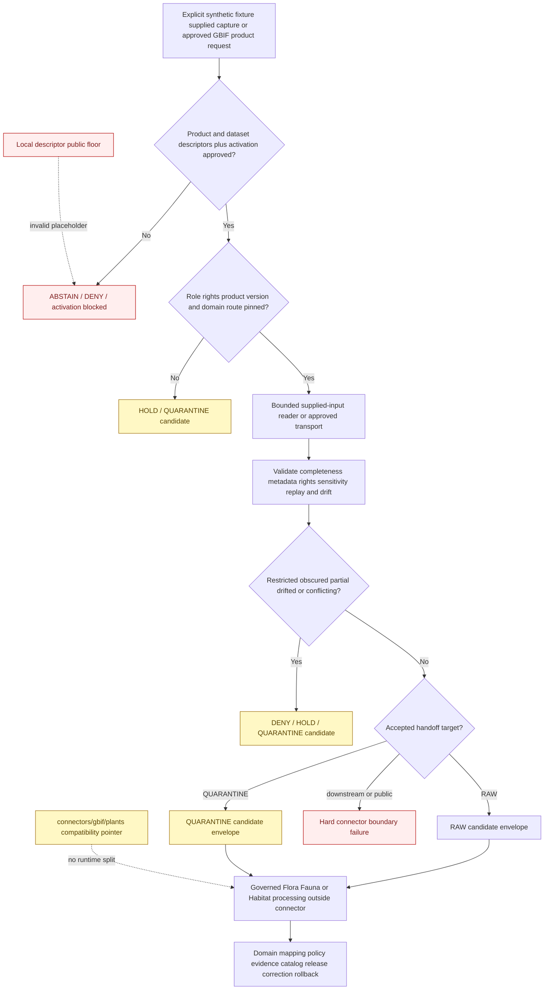

<!-- [KFM_META_BLOCK_V2]
doc_id: kfm://doc/connectors-gbif-readme
title: connectors/gbif/ — GBIF Connector Lane
type: readme
version: v0.2
status: draft
owners: OWNER_TBD — Connector steward · GBIF source steward · Biodiversity steward · Flora steward · Fauna steward · Habitat steward · Taxonomy steward · Rights reviewer · Privacy/sensitivity reviewer · Security reviewer · Packaging steward · Validation steward · Docs steward
created: 2026-06-18
updated: 2026-07-11
policy_label: public-doctrine; source-admission; greenfield; source-first; per-dataset-rights; geoprivacy-gated; product-specific-roles; no-live-by-default; no-secrets; no-persistence-default; plants-child-compatibility-only; raw-or-quarantine-candidate-only; no-publication
proposed_path: connectors/gbif/README.md
truth_posture: CONFIRMED greenfield connector scaffold / executable connector behavior ABSENT / supported installation and import UNPROVED / package-local public sensitivity placeholder INVALID / product and dataset descriptors UNRESOLVED / source NOT ACTIVATED / executable tests ABSENT / live testing NOT APPROVED / CI UNKNOWN
related:
  - ../README.md
  - pyproject.toml
  - plants/README.md
  - src/README.md
  - src/gbif/README.md
  - src/gbif/__init__.py
  - src/gbif/fetch.py
  - src/gbif/descriptor.yaml
  - tests/README.md
  - ../flora/README.md
  - ../../docs/sources/catalog/gbif/README.md
  - ../../docs/sources/catalog/gbif/occurrence-api.md
  - ../../docs/sources/catalog/gbif/async-download.md
  - ../../docs/sources/catalog/gbif/dataset-metadata.md
  - ../../docs/sources/catalog/gbif/backbone-taxonomy.md
  - ../../docs/sources/catalog/gbif.md
  - ../../docs/domains/fauna/README.md
  - ../../docs/domains/flora/README.md
  - ../../docs/domains/flora/CANONICAL_PATHS.md
  - ../../docs/domains/habitat/README.md
  - ../../data/registry/sources/
  - ../../data/raw/fauna/
  - ../../data/raw/flora/
  - ../../data/raw/habitat/
  - ../../data/quarantine/fauna/
  - ../../data/quarantine/flora/
  - ../../data/quarantine/habitat/
  - ../../schemas/contracts/v1/source/
  - ../../policy/sensitivity/
  - ../../policy/rights/
  - ../../release/
tags: [kfm, connectors, gbif, biodiversity, darwin-core, dwca, occurrence, specimen, taxonomy, backbone, flora, fauna, habitat, rights, geoprivacy, source-admission, raw, quarantine, governance]
notes:
  - "Repository inspection confirms a greenfield scaffold: this README, a placeholder pyproject.toml, a README-only plants compatibility child, a source-root README, a package directory containing an expanded README plus empty __init__.py, one-line fetch.py, and placeholder descriptor.yaml, and a README-only test lane."
  - "No configuration model, product dispatcher, HTTP transport, async-job worker, dataset-metadata reader, Darwin Core or DwC-A parser, Backbone resolver, rights adapter, sensitivity detector, handoff builder, executable test, source activation, live access, or passing CI evidence is proved."
  - "The package-local descriptor sets role and rights to TBD and sensitivity_floor to public. GBIF rights are dataset-specific and occurrence sensitivity can be elevated, so the public value is an unsafe placeholder rather than source authority or a public-safe default."
  - "Occurrence API, async download, dataset metadata, Backbone Taxonomy, aggregate products, modeled assets, and unsupported or mixed products are distinct source surfaces with different role, rights, replay, versioning, completeness, and validation requirements."
  - "The plants child is a documentation-only compatibility pointer. Shared GBIF source access and connector-local testing remain in the parent lane; Flora-, Fauna-, and Habitat-specific interpretation remains downstream."
  - "No accepted product-specific or dataset-scoped SourceDescriptor, SourceActivationDecision, current access contract, fixture suite, live-test approval, or CI evidence is proved."
[/KFM_META_BLOCK_V2] -->

<a id="top"></a>

# GBIF Connector Lane

> Evidence-grounded parent boundary for a possible Global Biodiversity Information Facility source-admission connector. The current lane is a greenfield documentation-and-placeholder scaffold. It does **not** provide an approved GBIF client, supported installable package, current endpoint integration, Darwin Core parser, rights decision engine, taxonomy authority, sensitivity transform, lifecycle writer, or publication path.

<p>
  
  
  
  
  
  
  
  
</p>

`connectors/gbif/`

> [!IMPORTANT]
> **Confirmed state:** this connector lane contains documentation, incomplete package metadata, one package-shaped placeholder scaffold, a README-only connector test lane, and a README-only plant-consumer compatibility child. No implemented configuration model, product dispatcher, supplied-input reader, HTTP client, async-download worker, dataset-metadata reader, Darwin Core or DwC-A parser, Backbone resolver, rights adapter, sensitivity detector, handoff contract, executable test, source activation, live account path, or passing CI result is confirmed. Treat every proposed interface, filename, command, product key, result name, endpoint, and lifecycle target below as a requirement—not current behavior.

> [!CAUTION]
> `src/gbif/descriptor.yaml` contains `role: TBD`, `rights: TBD`, and `sensitivity_floor: public`. GBIF records inherit rights from originating datasets and may carry restricted-use, obscured, rare-species, culturally sensitive, private-location, or precise-location concerns. **The local `public` value is an unsafe placeholder. It must not activate the source, supply runtime defaults, authorize RAW admission, lower record sensitivity, be inherited by Flora/Fauna/Habitat candidates, or become an accepted test expectation.**

**Quick jumps:** [Purpose](#purpose) · [Verified repository state](#verified-repository-state) · [Evidence ledger](#evidence-ledger) · [Connector authority boundary](#connector-authority-boundary) · [Blocking drift](#blocking-drift) · [Connector invariants](#connector-invariants) · [Placement and shared source-first package](#placement-and-shared-source-first-package) · [Product decomposition](#product-decomposition) · [Source-role boundary](#source-role-boundary) · [Access and input posture](#access-and-input-posture) · [Configuration and secret boundary](#configuration-and-secret-boundary) · [Rights license and citation](#rights-license-and-citation) · [Sensitivity and geoprivacy](#sensitivity-and-geoprivacy) · [Taxonomic anchoring and drift](#taxonomic-anchoring-and-drift) · [Temporal replay and correction boundaries](#temporal-replay-and-correction-boundaries) · [Darwin Core and metadata preservation](#darwin-core-and-metadata-preservation) · [Transport pagination jobs and archive bounds](#transport-pagination-jobs-and-archive-bounds) · [Cross-domain routing](#cross-domain-routing) · [Finite outcomes](#finite-outcomes) · [Lifecycle and handoff boundary](#lifecycle-and-handoff-boundary) · [Repository responsibility map](#repository-responsibility-map) · [Proposed implementation shape](#proposed-implementation-shape) · [Packaging source-root and test relationship](#packaging-source-root-and-test-relationship) · [No-network and live-test posture](#no-network-and-live-test-posture) · [Implementation sequence](#implementation-sequence) · [Activation gates](#activation-gates) · [Review and rollback](#review-and-rollback) · [Definition of done](#definition-of-done) · [Verification backlog](#verification-backlog)

---

## Purpose

`connectors/gbif/` is the parent source-first lane for one possible shared GBIF source-admission adapter used by multiple downstream biodiversity domains.

When implementation and authority exist, this lane may coordinate:

- reviewed package metadata and a narrow side-effect-free Python API;
- one explicitly admitted GBIF product and dataset scope at a time;
- synthetic fixtures, supplied source captures, supplied metadata, supplied Backbone records, or supplied DwC-A archives by default;
- separately approved live transport only after source, rights, security, retention, logging, testing, and rollback review;
- bounded occurrence-API pagination, async-job polling, archive retrieval, parsing, retries, redirects, memory, and execution time;
- preservation of dataset, publisher, institution, license, citation, DOI, source-role, taxonomic-version, temporal, spatial, uncertainty, obscuration, restriction, and completeness metadata;
- detection of unsupported products, unknown rights, additional restrictions, replay gaps, failed jobs, unsafe archives, product-role conflicts, taxonomy drift, sensitive records, partial captures, and unsafe lifecycle targets;
- finite blocked, denied, abstained, held, error, RAW-candidate, or QUARANTINE-candidate results under accepted contracts;
- offline, synthetic, negative-first connector tests shared across Flora, Fauna, and Habitat consumers.

This lane must never become:

- canonical occurrence, specimen, population, current-presence, absence, range, conservation-status, habitat, or taxonomic truth;
- a final taxonomy tie-breaker for GBIF, ITIS, USDA PLANTS, NatureServe, state, institutional, or local sources;
- a mechanism for recovering withheld, obscured, rounded, or sensitive locations;
- a plant-only, animal-only, or habitat-only fork of GBIF transport or source identity;
- source-registry, rights, sensitivity, policy, evidence, catalog, release, or publication authority;
- a store for source payloads, private datasets, credentials, restricted records, caches, temporary archives, or lifecycle data;
- a direct writer to WORK, PROCESSED, CATALOG, TRIPLET, PROOF, RECEIPT, RELEASE, PUBLISHED, public API, map, graph, report, search, or generated-answer surfaces.

[Back to top ↑](#top)

---

## Verified repository state

The following scaffold is confirmed on the repository's default branch at the time of this update:

```text
connectors/gbif/
├── README.md                         # this connector-parent contract
├── pyproject.toml                    # project name + version 0.0.0 only
├── plants/
│   └── README.md                     # v0.2 documentation-only compatibility pointer
├── src/
│   ├── README.md                     # v0.2 source-root contract
│   └── gbif/
│       ├── README.md                 # v0.2 package contract
│       ├── __init__.py               # empty file
│       ├── descriptor.yaml           # role/rights TBD; unsafe public floor
│       └── fetch.py                  # one-line greenfield placeholder
└── tests/
    └── README.md                     # v0.2 documentation-only test contract
```

### Current maturity

| Surface | Confirmed content | Maturity |
|---|---|---:|
| `README.md` | This connector-parent boundary. | **DOCUMENTED** |
| `pyproject.toml` | Project name `kfm-connector-gbif` and version `0.0.0`. | **INCOMPLETE** |
| `plants/README.md` | Plant-consumer compatibility pointer. | **DOCUMENTED / NONCANONICAL IMPLEMENTATION PATH** |
| `src/README.md` | Evidence-grounded source-root contract. | **DOCUMENTED** |
| `src/gbif/README.md` | Evidence-grounded package contract. | **DOCUMENTED** |
| `src/gbif/__init__.py` | Empty file. | **IMPORT-SHAPED / BEHAVIOR ABSENT** |
| `src/gbif/fetch.py` | Comment-only greenfield placeholder. | **PLACEHOLDER / NON-EXECUTABLE** |
| `src/gbif/descriptor.yaml` | `name: gbif`, `role: TBD`, `rights: TBD`, `sensitivity_floor: public`. | **PLACEHOLDER / UNSAFE DEFAULT** |
| `tests/README.md` | Connector-local test contract. | **DOCUMENTED** |
| Executable tests and fixtures | None confirmed. | **ABSENT** |
| Build backend and `src/` package discovery | None confirmed. | **ABSENT** |
| Supported Python versions and dependencies | None confirmed. | **ABSENT** |
| Stable distribution/import API | None confirmed. | **ABSENT / OPEN DECISION** |
| Product dispatcher | None confirmed. | **ABSENT** |
| Occurrence API transport | None confirmed. | **ABSENT** |
| Async-download worker | None confirmed. | **ABSENT** |
| Dataset metadata and rights handling | Documentation exists; implementation absent. | **PROPOSED / UNBOUND** |
| Darwin Core and DwC-A parsing | None confirmed. | **ABSENT** |
| Backbone-version handling | Documentation exists; implementation absent. | **PROPOSED / UNBOUND** |
| Sensitivity and geoprivacy detection | Doctrine exists; implementation absent. | **PROPOSED / UNBOUND** |
| Accepted product/dataset SourceDescriptors | None found or verified. | **ABSENT / BLOCKED** |
| Source activation | No approved activation evidence found. | **NOT ACTIVATED** |
| Live tests | None confirmed or approved. | **ABSENT / NOT APPROVED** |
| CI and coverage evidence | None confirmed. | **UNKNOWN / ABSENT** |

> [!CAUTION]
> A connector directory, source catalog, compatibility pointer, empty initializer, placeholder fetcher, local YAML file, or detailed README does not prove installation, import safety, endpoint compatibility, rights enforcement, archive safety, taxonomy replayability, sensitivity handling, source activation, test coverage, or release readiness.

[Back to top ↑](#top)

---

## Evidence ledger

| Evidence | Status | What it supports | What it does not support |
|---|---:|---|---|
| `connectors/gbif/README.md` | **CONFIRMED** | The parent connector lane and governance boundary exist. | Executable connector behavior. |
| `pyproject.toml` | **CONFIRMED placeholder** | Distribution name and version were scaffolded. | Build/install behavior, discovery, dependencies, supported Python, entry points, or test configuration. |
| `src/README.md` | **CONFIRMED v0.2** | Source-code placement, product separation, rights, geoprivacy, taxonomy, transport, packaging, and handoff requirements are documented. | Implemented enforcement. |
| `src/gbif/README.md` | **CONFIRMED v0.2** | Package-level product, role, rights, replay, archive, sensitivity, and finite-outcome requirements are documented. | Client, parser, metadata, Backbone, or handoff behavior. |
| `src/gbif/__init__.py` | **CONFIRMED empty** | A package namespace was scaffolded. | Stable API, supported import, or import safety. |
| `src/gbif/fetch.py` | **CONFIRMED placeholder** | A future source-input responsibility was anticipated. | Approved network access, retries, pagination, jobs, downloads, parsing, or persistence. |
| `src/gbif/descriptor.yaml` | **CONFIRMED unsafe placeholder** | Package-local metadata was anticipated. | Canonical descriptor authority, resolved roles/rights, safe sensitivity, or activation. |
| `tests/README.md` | **CONFIRMED v0.2** | Offline, synthetic, product-specific, rights, replay, archive, geoprivacy, and handoff test requirements are documented. | Executable tests, accepted live-test variables, passing results, or CI enforcement. |
| `plants/README.md` | **CONFIRMED v0.2 compatibility pointer** | Plant-specific source access must remain shared in the parent GBIF lane under the current posture. | Implemented plant filtering or active Flora ingest. |
| GBIF source-family and product pages | **CONFIRMED draft documentation** | Occurrence API, async download, dataset metadata, and Backbone are distinct products with different trust, replay, role, and rights properties. | Current endpoint compatibility or accepted runtime contracts. |
| `docs/sources/catalog/gbif.md` | **CONFIRMED draft source profile** | GBIF is documented as an occurrence aggregator and taxonomic crosswalk with per-dataset rights and sensitivity gates. | Source activation or implemented policy. |
| Flora canonical-path documentation | **CONFIRMED doctrine-derived register** | `connectors/gbif/` is the shared source connector; domain interpretation belongs downstream. | Final taxonomy authority ordering or active Flora routes. |
| Current connector tree inspection | **CONFIRMED for inspected state** | The lane contains documentation, placeholders, and an empty initializer only. | Permanent absence of future files. |

[Back to top ↑](#top)

---

## Connector authority boundary

```text
THIS CONNECTOR MAY EVENTUALLY:
  validate explicit configuration
  require accepted product and dataset descriptors
  consume synthetic or explicitly supplied source captures
  use separately approved bounded transport
  preserve source, rights, citation, taxonomy, time, geometry, and completeness metadata
  detect restricted, obscured, partial, drifted, or conflicting source states
  return finite blocked or candidate outcomes
  construct accepted RAW or QUARANTINE candidate envelopes

THIS CONNECTOR MUST NOT:
  decide final taxonomy or biodiversity truth
  infer current presence or biological absence
  convert specimens, aggregates, or models into observations
  recover obscured or withheld locations
  decide legal rights sufficiency or public safety
  define source descriptors, policy, schemas, evidence, or release authority
  fork transport by Flora, Fauna, or Habitat consumer domain
  persist source payloads or lifecycle stores
  publish maps, reports, graphs, searches, APIs, or generated answers
```

An importable package is not activation. A parsed record is not biodiversity truth. A source taxon key is not canonical taxonomy. A public license is not public safety. A candidate envelope is not lifecycle persistence, evidence closure, or release.

[Back to top ↑](#top)

---

## Blocking drift

Executable work must expose unresolved blockers rather than hide them behind permissive defaults, aliases, fixtures, or mocks.

| Blocker | Confirmed gap or conflict | Required connector posture |
|---|---|---|
| Packaging | No build backend, discovery, Python support, dependencies, entry points, or stable API. | Do not claim installability or supported imports. |
| Package-local descriptor | Role and rights are `TBD`; sensitivity floor is `public`. | Reject as activation, role, rights, or sensitivity authority. |
| Source registry topology | Canonical GBIF product/dataset descriptor placement remains unresolved. | Require one accepted descriptor reference; do not choose a path by convenience. |
| Product descriptors | No accepted product- or dataset-specific SourceDescriptors or activation decisions are proved. | Block real-input and live paths. |
| Product identity | API, async download, metadata, Backbone, aggregate, modeled, and mixed surfaces differ materially. | Require exact closed product dispatch; no umbrella parser or provider-wide activation. |
| Product source roles | Observations, specimens, metadata, taxonomy, aggregates, and models use different roles. | Require product/dataset-specific roles; reject family-wide defaults and role upgrades. |
| Per-dataset rights | GBIF aggregates independently licensed and sometimes additionally restricted datasets. | Preserve actual source granularity; unknown or conflicting rights fail closed. |
| Occurrence API replay | Synchronous responses can change and do not inherently carry a Download DOI. | Preserve query, pagination, retrieval, response, and dataset evidence; never claim DOI-equivalent replay. |
| Async download | Authentication, predicates, polling, terminal states, DOI, checksum, retention, and archive behavior are unimplemented. | Synthetic or supplied job/archive paths first; no live submission. |
| Dataset metadata | License, citation, publisher, DOI, restriction, and update semantics are unimplemented. | No release-bound result without complete source context. |
| Darwin Core / DwC-A | Field, encoding, delimiter, archive, extension-table, and version behavior is unverified. | No best-effort parsing; make schema and archive drift visible. |
| Backbone version | Snapshot discovery, rotation, taxon-key stability, and correction behavior are unimplemented. | Require explicit version context; never silently use latest. |
| Taxonomy authority order | GBIF, ITIS, USDA PLANTS, NatureServe, state, institutional, and local authorities can disagree. | Preserve disagreement; no connector-local tie-breaker. |
| Sensitive records | Rare, protected, obscured, steward-controlled, cultural, private, or precise-location records require policy. | Preserve restrictions and fail closed; no public transform here. |
| Join-induced sensitivity | Public records can become harmful when joined with roads, parcels, access, ownership, infrastructure, or cultural-use context. | Do not perform cross-source joins in the connector. |
| `plants/` child | Child path is documentation-only and noncanonical for implementation. | Keep implementation, descriptors, activation, tests, fixtures, credentials, and writes in shared parent or owning downstream lanes. |
| Handoff contract | No binding connector-result or RAW/QUARANTINE envelope is selected. | Do not invent an authoritative envelope or write lifecycle stores. |
| Fixtures | No executable fixture set or accepted shared convention exists. | Use documentation examples until synthetic fixture governance is approved. |
| Tests | Test lane contains documentation only. | Do not claim import, rights, sensitivity, replay, archive, parser, or boundary coverage. |
| Live tests | No access method, marker, variable, credential mode, endpoint, or approval exists. | No live-test implementation or command. |
| CI | No connector-specific workflow or passing run is confirmed. | No passing badge or merge-enforcement claim. |

These blockers are safety and evidence requirements, not inconveniences to bypass for a green demonstration.

[Back to top ↑](#top)

---

## Connector invariants

Every future file and behavior under this connector must preserve these invariants:

1. **No side effects on import.** Import performs no network access, DNS, account discovery, secret reads, filesystem writes, logging configuration, environment mutation, cache initialization, registry mutation, policy evaluation, or source activation.
2. **No live behavior by default.** Synthetic fixtures or explicit supplied captures are the default paths until live access is independently approved.
3. **One product at a time.** Product identity is explicit and closed; no URL-, filename-, extension-, content-type-, first-row-, provider-label-, or field-guess dispatch.
4. **Descriptor-driven activation.** Connector code consumes accepted source authority; it never creates, infers, or self-activates it.
5. **Product roles remain fixed.** Parsing cannot upgrade administrative taxonomy, aggregate counts, or modeled ranges into observed occurrences.
6. **Per-dataset rights remain attached.** A provider-wide license assumption is forbidden.
7. **Rights, sensitivity, source role, evidence, and release remain separate gates.** Clearing one never clears another.
8. **Source obscuration remains intact.** The connector never reverses, enriches, or guesses withheld coordinates or fields.
9. **No sensitive logging.** Exact sensitive coordinates, restricted fields, collector contacts, credentials, private predicates, and payload excerpts stay out of logs and errors.
10. **No connector-owned credentials.** Passwords, tokens, sessions, cookies, API keys, account files, and keychain access remain external.
11. **No taxonomy sovereignty.** The connector preserves taxonomic evidence and versions but does not decide the final KFM taxon.
12. **No biological absence inference.** Empty or filtered results do not prove absence or survey non-detection.
13. **No current-presence inference from specimens.** Historical collection evidence retains its event date and `basisOfRecord` meaning.
14. **No cross-source joins.** Taxonomy, conservation status, parcel, access, infrastructure, cultural-use, and ownership joins are downstream responsibilities.
15. **No publication transform.** Redaction, generalization, aggregation, evidence closure, release, correction, and rollback remain downstream.
16. **Finite outcomes only.** Every operation ends in a bounded, reviewable result; no silent partial success or best-effort acceptance.
17. **RAW or QUARANTINE candidate only.** Connector code does not persist lifecycle stores.
18. **No false replayability claim.** A query hash, response digest, or cached page does not equal a citable GBIF Download DOI.
19. **No false public-safety claim.** Public availability, a license string, coordinate rounding, field removal, or a taxon name does not automatically make a record safe to release.
20. **No consumer-domain fork.** Flora, Fauna, and Habitat consume lineage-preserving candidates from one shared GBIF source package.
21. **No false secure-erasure claim.** Code may minimize retention and request cleanup but must not promise memory or filesystem erasure beyond proved runtime and storage controls.
22. **No public path from connector internals.** Public clients never consume connector, registry, RAW, WORK, QUARANTINE, package, test, or source-account internals directly.

[Back to top ↑](#top)

---

## Placement and shared source-first package

The current repository posture supports one source-first GBIF connector and package plus a documentation-only plant-consumer pointer.

| Surface | Current role | Must not become |
|---|---|---|
| `connectors/gbif/` | Parent source-specific coordination, product boundaries, package/test orientation, and activation prerequisites. | Domain truth store, policy engine, lifecycle store, or publisher. |
| `connectors/gbif/src/gbif/` | Shared package boundary for provider-level products and source semantics. | Flora-, Fauna-, or Habitat-specific fork or final taxonomy authority. |
| `connectors/gbif/tests/` | Shared connector-local offline tests when implemented. | Plant-only transport suite or domain/policy/release test root. |
| `connectors/gbif/plants/` | Compatibility pointer and plant-consumer warning surface. | Client, parser, descriptor, activation, credential, fixture, test, cache, or lifecycle authority. |
| Flora/Fauna/Habitat packages and pipelines | Downstream source-to-domain mapping, crosswalks, validation, sensitivity routing, joins, and derivatives. | Duplicate GBIF source downloads or inherit activation from package adjacency. |

Plant relevance, animal relevance, or habitat relevance identifies downstream consumers; it does not create a second source identity, transport, credential scope, descriptor, test lane, or RAW capture.

Any proposal to split provider behavior by consumer domain requires an accepted ADR or migration decision covering:

- package and ownership boundaries;
- product dispatch and shared code;
- descriptors and activation;
- credential and transport ownership;
- fixtures and tests;
- RAW/QUARANTINE routing;
- data migration and lineage;
- backlinks and compatibility paths;
- correction, rollback, and deprecation.

[Back to top ↑](#top)

---

## Product decomposition

GBIF is one source family with multiple materially different products. The labels below are descriptive documentation terms, not accepted runtime enum values.

| Product surface | Source meaning | Minimum future connector behavior | Forbidden shortcut |
|---|---|---|---|
| Synchronous occurrence API | Query-time, paginated occurrence search; mutable over time and not inherently DOI-pinned. | Preserve normalized query, retrieval time, pagination evidence, response digests, product identity, and dataset-metadata references. | Treating a current API response as replay-stable publication evidence. |
| Asynchronous occurrence download | Predicate-defined bulk subset with job lifecycle, downloadable archive, and download citation identity when supplied. | Preserve request digest, job states, Download DOI or citation identity, checksum, size, archive structure, dataset composition, and completion evidence. | Treating job submission as capture completion or ignoring failed/partial terminal states. |
| Dataset metadata | Publisher, institution, license, citation, DOI, rights holder, restrictions, update, and provenance context. | Consume or retrieve metadata before release-bound admission; preserve conflicts and missing fields. | Treating metadata as an occurrence or assuming one license covers every row. |
| Backbone Taxonomy | Versioned administrative taxonomic anchor and international crosswalk. | Preserve concept identity, snapshot/version, taxon keys, accepted-name references, status, and drift. | Emitting Backbone rows as occurrences or silently resolving against latest. |
| Aggregate occurrence product | Roll-up over a named spatial and temporal unit. | Preserve aggregation unit, time window, method, counts, source composition, and role. | Downscaling an aggregate into point or site-level truth. |
| Modeled range or suitability asset | Model-derived geographic context hosted or referenced through a GBIF-related surface. | Preserve modeled role, model identity, run/version reference, uncertainty, and source asset identity. | Upgrading a model to observed presence. |
| Unknown or combined surface | Product identity, rights, roles, formats, and replay guarantees are unresolved. | Reject, hold, or quarantine with an actionable unsupported-product result. | Best-effort parsing, auto-splitting, or provider-wide activation. |

Every product requires independent review of source role, authority, access method, rights, sensitivity, versioning, completeness, fixtures, tests, and activation.

[Back to top ↑](#top)

---

## Source-role boundary

The provider family may be described as an aggregator, but KFM's canonical source-role value must be assigned to the specific admitted artifact.

| Artifact | Expected role posture | Required distinction |
|---|---|---|
| Preserved specimen record | Usually `observed`, subject to an accepted descriptor. | Collection evidence at collection time, not current presence. |
| Field or community observation | Usually `observed`, subject to an accepted descriptor and source caveats. | Preserve identification confidence, verification state, and source quality. |
| Dataset metadata | `administrative`. | Describes a dataset; not occurrence evidence. |
| Backbone Taxonomy | `administrative`. | Taxonomic anchor/crosswalk with no event or locality. |
| Aggregated counts or cells | `aggregate`. | Aggregation unit and time scope are mandatory. |
| Modeled range or suitability | `modeled`. | Model/run evidence and uncertainty remain attached. |
| Unresolved record or product | Blocked or candidate under an accepted contract. | No permissive default. |

Future connector behavior must:

- require accepted product- and dataset-specific SourceDescriptors;
- preserve the exact assigned role and role authority;
- reject absent, ambiguous, umbrella, or incompatible roles;
- never upgrade or downcast roles during parsing, validation, handoff, or downstream promotion;
- distinguish source observation, specimen, administrative metadata, taxonomic anchor, aggregate, and model output;
- preserve `basisOfRecord`, occurrence status, identification qualifiers, source caveats, aggregation scope, and model references where supplied;
- require a reviewed descriptor revision or correction record for any role correction;
- prohibit a generic `gbif -> observed` constant.

A Backbone row is not an occurrence. An aggregate cell is not a point record. A modeled range is not an observation. A specimen is not proof of current presence.

[Back to top ↑](#top)

---

## Access and input posture

### Current safe posture

The package has no implemented client and no approved live access contract.

```text
network access: disabled
GBIF account access: disabled
credential discovery: forbidden
background polling or download jobs: forbidden
input: explicit synthetic fixture, supplied response, supplied metadata, Backbone metadata, or supplied archive
persistence: none by default
output: finite blocked/held/error result or accepted RAW/QUARANTINE candidate
```

`src/gbif/fetch.py` is a placeholder filename, not an architecture decision or evidence that fetching is implemented or permitted.

### Future access modes

A reviewed implementation may support separately activated modes such as:

- supplied occurrence-API response;
- supplied DwC-A archive;
- supplied dataset-metadata document;
- supplied Backbone snapshot metadata;
- approved synchronous API transport;
- approved asynchronous download transport;
- approved metadata and Backbone lookup transport.

Each live mode requires explicit product identity, SourceDescriptor, activation, host allowlisting, current terms review, credential architecture where needed, limits, retention, logging controls, fixtures, tests, and rollback.

### Prohibited access behavior

- guessed or undocumented endpoints;
- implicit environment-variable credential reads;
- home-directory, browser, keychain, or config-file account discovery;
- provider-wide crawling;
- unbounded pagination or polling;
- hidden retries or fallback to another product surface;
- automatic fixture refresh;
- accepting a URL, DOI, dataset key, or provider label as activation evidence;
- treating HTTP success as rights, sensitivity, completeness, or publication approval;
- importing source data during package import, test collection, or documentation build;
- hidden persistence, caches, retry queues, or temporary archives.

[Back to top ↑](#top)

---

## Configuration and secret boundary

Once binding contracts are selected, a connector operation should require explicit values equivalent to:

- canonical source descriptor reference;
- SourceActivationDecision reference;
- exact product key;
- source family and source ID;
- access mode: supplied fixture/capture or separately approved live transport;
- request, query, or predicate specification plus normalized digest where applicable;
- dataset allowlist or explicit dataset scope;
- domain route candidates such as Flora, Fauna, Habitat, or another accepted consumer;
- source role and role authority from the accepted descriptor;
- rights, license, citation, and additional-restriction requirements;
- sensitivity and restricted-record handling reference;
- Backbone concept and snapshot/version reference where applicable;
- expected content type, format, encoding, compression, and schema/version;
- expected checksum, content length, page count, record count, or archive manifest where known;
- timeout, retry, redirect, rate-limit, pagination, polling, job-duration, download-size, archive, row, memory, and processing limits;
- an external credential-provider reference for approved modes, never raw credentials in configuration;
- temporary-storage and cleanup instructions owned by orchestration/runtime;
- intended lifecycle target of QUARANTINE or, only when every admission gate closes, RAW.

Required behavior:

- reject missing or ambiguous product, source, role, dataset, rights, version, or lifecycle identity;
- reject missing descriptor or activation evidence for live or real-input paths;
- reject unknown, mixed, unsupported, or non-admitted products;
- reject product/role/authority mismatches;
- reject release-bound candidates with missing dataset citation or rights context;
- keep synthetic and test configuration unable to fall through to live access;
- never dispatch from URL, filename, extension, first row, content type, or provider label alone;
- document no endpoint, environment-variable name, credential convention, marker, or live command as accepted until implementation and review establish it.

Secrets, tokens, account state, and credentials remain outside this connector. The package may accept an opaque credential-provider capability only after the access mode is approved.

[Back to top ↑](#top)

---

## Rights, license, and citation

GBIF aggregates records from many originating datasets. Rights must remain attached at the actual source granularity.

Future connector behavior should preserve, where supplied:

- dataset key, title, publisher, and publishing organization;
- originating institution and collection;
- rights holder;
- raw license value and normalized license interpretation;
- citation and attribution text;
- dataset DOI or citation identifier;
- GBIF Download DOI for a bulk subset;
- source references and distribution identity;
- additional use restrictions, embargoes, withholding, or restricted-use notes;
- rights-review state and external policy-decision reference;
- retrieval time and terms snapshot reference when required by the accepted descriptor.

Connector posture:

| Rights condition | Required behavior |
|---|---|
| License and citation complete | Preserve them; continue only when descriptor and policy references permit. |
| Attribution required | Preserve exact source attribution and dataset citation. |
| Share-alike or derivative conditions present | Flag for downstream release review; do not interpret compatibility locally. |
| Additional dataset-specific restrictions present | Preserve and elevate them; generic license parsing cannot override them. |
| License missing, unknown, conflicting, or unparseable | `DENY`, `ABSTAIN`, `HOLD`, or QUARANTINE candidate. |
| Dataset identity or publisher missing | No release-bound candidate. |
| Per-record and dataset-level rights disagree | Preserve both and route to review. |
| Rights state changed after capture | Emit drift/correction reference; never silently rewrite prior evidence. |
| Public availability presented as publication permission | Hard authority failure. |

Connector code may parse and carry rights metadata. It does not decide legal sufficiency, fair use, redistribution, derivative compatibility, or public release.

[Back to top ↑](#top)

---

## Sensitivity and geoprivacy

Public availability does not make every GBIF record safe to redistribute, combine, or publish.

### Sensitive or restricted classes

- rare, imperiled, protected, or steward-controlled taxa;
- nest, den, roost, hibernaculum, spawning, breeding, collection, seed-source, or small-population locations;
- records already obscured, rounded, generalized, withheld, embargoed, or marked sensitive upstream;
- culturally or sovereignty-sensitive plant, animal, habitat, or traditional-use knowledge;
- collector, observer, contact, permit, landowner, or private-property context;
- exact locations joined with parcels, roads, trails, access points, infrastructure, ownership, or harvesting/use information;
- records whose sensitivity state cannot be evaluated;
- products where individually ordinary fields combine into actionable location intelligence.

### Required connector posture

1. Preserve upstream obscuration, uncertainty, withholding, and precision exactly as received.
2. Never attempt to recover exact coordinates from an obscured or withheld record.
3. Route unresolved sensitivity to denial, abstention, hold, or quarantine.
4. Keep exact sensitive geometry out of source control, fixtures, package data, logs, errors, metrics, and ordinary outputs.
5. Emit restricted/sensitive flags and external policy references; do not perform public redaction or generalization locally.
6. Never rely on map styling, hidden layers, client filters, opacity, or zoom thresholds as sensitivity controls.
7. Recalculate sensitivity downstream after joins.
8. Preserve cultural, sovereignty, stewardship, and source-specific restrictions even when ordinary metadata is public.
9. Keep generated summaries, vector indexes, embeddings, and AI responses subordinate to the same restrictions.
10. Require correction and rollback support for released derivatives whose sensitivity posture later changes.

Hashing, rounding, coordinate removal, a public license, or a public endpoint does not by itself establish anonymization or public safety.

[Back to top ↑](#top)

---

## Taxonomic anchoring and drift

This connector preserves taxonomic evidence; it does not choose final domain taxonomy.

Repository documentation currently identifies several relevant authority surfaces:

- GBIF Backbone as a versioned international crosswalk;
- ITIS as a U.S.-oriented taxonomic anchor in existing biodiversity doctrine;
- USDA PLANTS as a proposed Flora-specific taxonomic backbone;
- NatureServe, state authorities, herbaria, museums, and local accepted sources as additional evidence;
- domain-level crosswalk and tie-breaker policy as downstream responsibilities.

Required posture:

- preserve source `scientificName`, verbatim names, taxon keys, accepted-name references, rank, status, and issue flags where supplied;
- preserve the exact Backbone concept and snapshot/version context used during resolution;
- keep GBIF, ITIS, USDA PLANTS, NatureServe, state, institutional, and local identifiers independently inspectable;
- do not silently replace source names with a preferred domain name;
- do not discard synonyms, unresolved names, higher-rank matches, or disagreement evidence;
- treat taxon merges, splits, synonym changes, rank changes, and deprecations as taxonomy drift;
- require downstream `TaxonCrosswalk` or `FloraTaxonCrosswalk` evidence for canonical identity;
- abstain or route to review when no accepted anchor resolves;
- never resolve against “latest Backbone” when a replayable snapshot is required;
- never implement a Flora/Fauna/Habitat tie-breaker policy inside the shared connector.

A taxon key without its applicable Backbone version is incomplete replay evidence.

[Back to top ↑](#top)

---

## Temporal, replay, and correction boundaries

Keep these time and replay concepts distinct:

| Concept | Meaning | Connector guardrail |
|---|---|---|
| Event or collection time | When an organism was observed, collected, or sampled. | Preserve source precision and uncertainty; do not replace with retrieval time. |
| Identification time | When a record was identified or reidentified. | Reidentification is not a new biological event. |
| Source-record modification time | When the upstream record changed. | Preserve separately from event time. |
| Dataset publication/update time | When the dataset or distribution changed. | Preserve for staleness and version review. |
| API retrieval time | When a synchronous response was obtained. | Required; API results can change between calls. |
| Async job submission/completion time | When a bulk request entered and left the source job lifecycle. | Preserve both; submission does not equal successful capture. |
| Download DOI or subset identity | Citation identity for a completed bulk subset when supplied. | Preserve independently from Backbone DOI and dataset citations. |
| Backbone snapshot/version time | Taxonomic frame used for resolution. | Version drift is taxonomy drift, not occurrence time. |
| KFM release time | When a downstream derivative was released. | Outside connector authority. |
| Correction/supersession time | When source or KFM evidence was corrected or replaced. | Never silently overwrite prior evidence. |

### Synchronous API replay posture

A synchronous API response is not inherently replay-stable. Future capture metadata should include:

- normalized request/query specification and digest;
- retrieval timestamp;
- requested and received page ranges;
- response and page digests;
- ETag or Last-Modified when supplied;
- total, count, and end-of-records indicators where supplied;
- duplicate, gap, partial, retry, and ordering evidence;
- dataset composition and metadata references;
- Backbone snapshot/version context;
- explicit product/source-surface identity.

A cached response or digest documents what KFM received. It does not mint a GBIF Download DOI or independently authorize publication.

### Correction posture

- upstream record changes produce new source states rather than silent mutation;
- dataset withdrawal or license change remains visible;
- Backbone rotation does not invalidate prior receipts by rewriting them;
- material changes to coordinates, taxon identity, rights, sensitivity, or dataset membership trigger downstream review and possible invalidation;
- connector code may emit correction or drift references but does not update released artifacts itself.

[Back to top ↑](#top)

---

## Darwin Core and metadata preservation

Parsers must preserve source meaning before downstream normalization.

### Source and product minimum

- canonical source ID and SourceDescriptor reference;
- product surface and access mode;
- SourceActivationDecision reference;
- source role and role authority;
- dataset key, title, publisher, institution, collection, and citation identity;
- download key and GBIF Download DOI where applicable;
- Backbone concept and snapshot/version reference;
- request/query/predicate identity and digest where applicable;
- retrieval/import timestamp, checksum, and connector/parser version;
- license, attribution, rights-holder, restriction, and review state;
- intended domain route and lifecycle target;
- drift, partial, restricted, obscured, quarantined, and review flags.

### Occurrence and specimen minimum

Preserve where supplied and permitted:

- source occurrence identifier;
- `basisOfRecord` or equivalent source class;
- institution, collection, and catalog identifiers;
- event/collection date and temporal precision;
- scientific name, verbatim name, taxon keys, accepted-name reference, rank, and taxonomic status;
- identification qualifier, confidence, verification status, issues, and source caveats;
- occurrence status, establishment means, life stage, sex, behavior, and cultivation/captive qualifiers without inference;
- individual count or quantity with units and semantics;
- locality and jurisdiction fields;
- decimal coordinates, geodetic datum, coordinate uncertainty, precision, georeference remarks, and issue flags;
- source-obscured, withheld, generalized, restricted, or embargoed status;
- collector/observer fields only under accepted privacy handling;
- source field names, code values, null/unknown semantics, and unsupported-field evidence.

### Dataset and capture minimum

- dataset metadata retrieval state;
- expected and received pages, files, archive members, extension tables, rows, or records where available;
- accepted, rejected, quarantined, duplicate, and unresolved counts;
- archive manifest and extraction state;
- checksum and content-size verification;
- partial, truncated, interrupted, stale, or superseded state;
- unknown field, type, encoding, delimiter, code-list, schema, and taxonomic-version drift evidence.

Unknown fields may be preserved only through an accepted restricted passthrough contract. They must not be silently dropped, guessed into KFM semantics, or exposed publicly.

[Back to top ↑](#top)

---

## Transport, pagination, jobs, and archive bounds

Any future transport or supplied-input reader must be bounded and replaceable.

### HTTP and transport controls

- explicit host and scheme allowlist;
- explicit connect, read, total, and idle timeouts;
- bounded retries with documented retryable conditions;
- bounded redirects with host revalidation;
- response-size and decompression limits;
- content-type, encoding, and compression validation;
- rate-limit and backoff handling without infinite waits;
- redacted request and response errors;
- no credential values in URLs, logs, exceptions, metrics, or receipts;
- injectable transport for offline tests;
- no automatic persistence of response bodies.

### Occurrence API pagination controls

- explicit page size and maximum pages/records;
- stable normalized query across pages;
- expected offset or cursor progression;
- duplicate occurrence-ID detection;
- gap and inconsistent-total detection;
- end-of-records validation where supplied;
- page digest and retrieval evidence;
- no partial success when required pages fail;
- bounded recovery from rate limits and transient errors;
- drift outcome when pagination semantics change.

### Async-job controls

- explicit predicate and product descriptor;
- bounded submission and polling duration;
- bounded poll frequency and retry count;
- explicit terminal-state vocabulary under an accepted contract;
- no assumption that a job key means success;
- Download DOI or citation identity, size, checksum, and completion metadata required before capture success;
- failed, cancelled, expired, inaccessible, or inconsistent jobs return finite outcomes;
- no background daemon or unbounded polling in the package;
- credentials remain external and scoped to the approved action.

### DwC-A and archive controls

Required negative handling includes:

- archive larger than accepted byte limit;
- expanded size or compression ratio above limit;
- excessive member count or nesting;
- traversal paths, absolute paths, symlinks, hardlinks, devices, or special files;
- duplicate or conflicting member names;
- missing or malformed metadata/manifest files;
- unexpected delimiter, quote, escape, encoding, line ending, or field count;
- missing core table or broken extension-table references;
- checksum mismatch or truncated stream;
- unsupported archive or compression format;
- unknown required fields or incompatible schema version;
- formula-like, script-like, HTML, macro-like, or executable content treated as active material;
- partial required-table success after another required table fails.

Source bytes remain inert data. The connector must never execute archive contents, formulas, macros, scripts, HTML, or imported code.

[Back to top ↑](#top)

---

## Cross-domain routing

One governed GBIF source capture may support multiple downstream domains through lineage-preserving projections.

| Consumer | Potential downstream use | Connector boundary |
|---|---|---|
| Flora | Plant occurrence, specimen, rare-plant, taxon-crosswalk, range, and survey candidates. | No final plant identity, current-presence, rare-location release, or USDA/ITIS/GBIF tie-breaker. |
| Fauna | Animal occurrence, specimen, restricted occurrence, taxon-crosswalk, and modeled-range candidates. | No conservation-status authority, sensitive-site release, or biological-population truth. |
| Habitat | Habitat-associated occurrence context and model inputs. | No habitat truth, suitability determination, or model authority. |
| Cross-domain workflows | Shared source provenance, dataset rights, taxonomic references, and source-role evidence. | No duplicate downloads, hidden joins, or consumer-specific source activation. |

Routing requirements:

- source capture occurs once under accepted source and dataset scope;
- every downstream candidate preserves the same capture, dataset, rights, role, version, and checksum lineage;
- consumer-domain mapping happens after source admission through accepted contracts and pipelines;
- the connector does not join parcels, access, infrastructure, ownership, cultural-use, regulatory, or conservation-status sources;
- join-induced sensitivity is recalculated downstream;
- one domain's acceptance does not activate or release another domain's derivative;
- the `plants/` pointer cannot trigger a separate plant-only download or RAW capture.

[Back to top ↑](#top)

---

## Finite outcomes

Future connector APIs and tests should use a small accepted result vocabulary. Exact names remain unbound until a connector-result contract is selected.

| Condition | Required safe behavior |
|---|---|
| Connector behavior absent | Clear unavailable/not-implemented result; never false success. |
| Build or supported import contract absent | Do not claim package readiness or import coverage. |
| Canonical source or product descriptor missing | Activation blocked. |
| Package-local `sensitivity_floor: public` encountered | Hard placeholder-validation failure. |
| Activation decision missing | `ABSTAIN` or activation-blocked result. |
| Product identity missing, unknown, or mixed | Validation failure, `HOLD`, or QUARANTINE candidate. |
| Source role missing or conflicted | Activation block; no permissive default. |
| Dataset identity, publisher, citation, or rights context missing | Hold or quarantine; no release-bound candidate. |
| License or additional terms unknown or conflicting | `DENY`, `ABSTAIN`, `HOLD`, or QUARANTINE candidate. |
| Network requested under default configuration | Bounded disabled outcome. |
| Credential discovery or unsafe credential handling attempted | Hard security failure. |
| API pagination incomplete, duplicated, or inconsistent | Incomplete-capture quarantine. |
| API response lacks replay evidence required by contract | `ABSTAIN`, `HOLD`, or non-release-bound candidate. |
| Async job not terminal-successful or download metadata incomplete | Finite failed/incomplete outcome. |
| Download checksum or content-size mismatch | Incomplete-capture quarantine. |
| Archive unsafe, malformed, oversized, or structurally incomplete | Reject or quarantine. |
| Dataset metadata unavailable | Rights/provenance block. |
| Backbone snapshot/version absent where anchoring occurs | Taxonomy-review or quarantine outcome. |
| Taxon key/name/rank/version drift | Reviewable taxonomy-drift result; no silent rewrite. |
| Sensitive, obscured, or restricted record detected | Restrict, hold, deny, or quarantine; never public-safe by default. |
| Attempt to recover exact withheld geometry | Hard sensitivity-boundary failure. |
| Aggregate emitted as point occurrence | Hard source-role failure. |
| Modeled asset emitted as observed occurrence | Hard source-role failure. |
| Specimen emitted as current presence | Hard temporal/semantic failure. |
| Empty result interpreted as biological absence | Hard evidence-boundary failure. |
| Sensitive value enters log, error, metric, snapshot, or ordinary output | Hard privacy failure. |
| Intended target beyond RAW or QUARANTINE | Hard authority-boundary failure. |
| Direct lifecycle or public write attempted | Hard failure. |
| Taxonomic, conservation-status, absence, range, legal, safety, or release determination requested | Refuse and route to governed domain/reviewer processes. |
| Runtime behavior added under `plants/` | Hard placement-boundary failure. |

Every error must be deterministic, finite, actionable, safe to log, and free of unnecessary source content.

[Back to top ↑](#top)

---

## Lifecycle and handoff boundary

The connector participates only at the source-admission edge and performs no lifecycle write by itself.



The diagram defines responsibility boundaries. It does not prove transport, parsing, rights evaluation, sensitivity policy, taxonomy resolution, RAW storage, quarantine storage, domain pipelines, evidence closure, release, or cleanup.

KFM lifecycle discipline remains:

```text
RAW -> WORK / QUARANTINE -> PROCESSED -> CATALOG / TRIPLET -> PUBLISHED
```

The connector may eventually construct an accepted candidate envelope. It must not persist source payloads or perform later transitions.

[Back to top ↑](#top)

---

## Repository responsibility map

| Surface | Responsibility | Must not do |
|---|---|---|
| `connectors/gbif/` | Parent coordination, source-specific boundaries, package/test orientation, product decomposition, and activation prerequisites. | Store data, establish authority, decide domain truth, or publish. |
| `connectors/gbif/pyproject.toml` | Build and dependency metadata after review. | Encode activation, rights, sensitivity, credentials, or policy defaults. |
| `connectors/gbif/src/` | Organize the shared source package and source-code constraints. | Store payloads, descriptors as authority, policy, evidence, release records, or public artifacts. |
| `connectors/gbif/src/gbif/` | Explicit configuration, supplied input or approved transport, product dispatch, parsing, metadata preservation, local checks, finite outcomes, and candidate envelopes. | Decide final taxonomy, own policy, persist lifecycle data, or publish. |
| `connectors/gbif/tests/` | Shared offline connector tests for packaging, products, rights, replay, parsing, sensitivity, drift, and handoff boundaries. | Use real sensitive records by default, decide domain truth, or become release authority. |
| `connectors/gbif/plants/` | Compatibility pointer and plant-consumer warnings. | Fetch, parse, activate, test runtime behavior, store data, or publish. |
| Source registry | Canonical source/product/dataset identity, roles, rights, access, cadence, sensitivity, and activation. | Store payloads or infer domain truth. |
| Rights and sensitivity policy | Decide permitted use, restrictions, geoprivacy, obligations, and allowed transforms. | Fetch or parse source material. |
| Taxonomy and domain authority | Resolve GBIF, ITIS, USDA PLANTS, NatureServe, state, institutional, and local crosswalks. | Control source transport or activation. |
| Flora/Fauna/Habitat packages and pipelines | Downstream source-to-domain mapping, validation, joins, restricted processing, and derivatives. | Duplicate source capture or inherit activation from connector adjacency. |
| Domain tests | Prove domain mapping, crosswalks, object contracts, sensitive derivatives, and domain semantics. | Duplicate connector transport or source activation tests. |
| Evidence and catalog surfaces | Close provenance, citations, taxonomy versions, rights, transformations, and review. | Treat connector output as proof automatically. |
| Release surfaces | Approve publication, correction, supersession, withdrawal, and rollback. | Treat RAW, quarantine, rights metadata, redaction, or aggregation as release by themselves. |

[Back to top ↑](#top)

---

## Proposed implementation shape

The confirmed connector structure is minimal:

```text
connectors/gbif/
├── README.md
├── pyproject.toml
├── plants/
│   └── README.md
├── src/
│   ├── README.md
│   └── gbif/
│       ├── README.md
│       ├── __init__.py
│       ├── descriptor.yaml
│       └── fetch.py
└── tests/
    └── README.md
```

A future shared product-oriented implementation might use a structure like:

```text
connectors/gbif/
├── README.md
├── pyproject.toml
├── plants/
│   └── README.md                       # compatibility pointer only
├── src/
│   ├── README.md
│   └── gbif/
│       ├── README.md
│       ├── __init__.py
│       ├── config.py
│       ├── products.py
│       ├── transport.py
│       ├── occurrence_api.py
│       ├── async_download.py
│       ├── dataset_metadata.py
│       ├── backbone.py
│       ├── dwc.py
│       ├── dwca.py
│       ├── rights_refs.py
│       ├── sensitivity_flags.py
│       ├── validate.py
│       ├── handoff.py
│       └── errors.py
└── tests/
    ├── README.md
    ├── fixtures/
    ├── test_build_and_import.py
    ├── test_configuration.py
    ├── test_descriptor_and_activation.py
    ├── test_product_dispatch.py
    ├── test_source_roles.py
    ├── test_rights_and_citation.py
    ├── test_occurrence_api.py
    ├── test_async_download.py
    ├── test_dataset_metadata.py
    ├── test_backbone.py
    ├── test_dwc.py
    ├── test_dwca.py
    ├── test_sensitive_records.py
    ├── test_semantic_boundaries.py
    ├── test_transport_and_resource_limits.py
    ├── test_sensitive_logging.py
    ├── test_handoff_boundaries.py
    └── test_errors_and_drift.py
```

This tree is **PROPOSED**, not implementation evidence. Do not create it mechanically. Every module and test must correspond to an accepted responsibility, product or dataset descriptor, contract, owner, synthetic fixture set, negative cases, and reviewed rights/sensitivity posture.

A network client should not be added merely because `fetch.py` exists. Automated access requires independent source activation, current terms review, account/security architecture, credential handling, rights and sensitivity analysis, bounded transport, retention controls, live-test approval, and rollback planning.

[Back to top ↑](#top)

---

## Packaging, source-root, and test relationship

### Packaging

The current `pyproject.toml` is insufficient to build, install, or publish a supported package.

Before installability or supported import is claimed:

- declare a build backend and `src/` package discovery;
- declare supported Python versions;
- declare runtime and development dependencies;
- define versioning beyond `0.0.0`;
- define package-data policy and prevent automatic authority-loading from local YAML;
- define a narrow public API exported by `src/gbif/__init__.py`;
- add clean-environment source-distribution, wheel, installation, and import tests;
- verify artifacts exclude real fixtures, source payloads, credentials, restricted records, caches, and canonical registry data;
- prove imports have no network, DNS, secret, filesystem, logging, environment, cache, policy, registry, or activation side effects;
- keep optional transport and parser dependencies unloaded until required;
- keep source-catalog documentation out of runtime authority.

The package-local descriptor must not be loaded automatically. It should be removed, converted into an unmistakable non-authoritative pointer or invalid fixture, or guarded by a reviewed packaging decision that makes runtime consumption impossible.

### Source root and package

`src/README.md` governs placement and cross-package constraints. `src/gbif/README.md` governs package-level responsibilities and product behavior. Neither establishes source activation or executable maturity.

### Connector tests

`tests/README.md` governs connector-local offline tests. The lane currently contains documentation only.

No test dependency, executable test module, fixture set, collection configuration, accepted local command, live-test marker, environment-variable convention, CI job, coverage result, or passing status is confirmed.

> [!CAUTION]
> `KFM_ALLOW_LIVE_GBIF_TESTS` appeared in the earlier test README as an illustrative convention. It is **not accepted** by the current connector, source-root, package, or test contracts. No live-test variable, marker, credential mode, account, endpoint, command, or CI job is approved.

A future command such as:

```bash
python -m pytest connectors/gbif/tests
```

remains **PROPOSED** until packaging, dependencies, tests, fixtures, and the repository-standard runner exist and are demonstrated from a clean environment.

A zero-test, all-skipped, or collection-only run is not proof of connector coverage.

[Back to top ↑](#top)

---

## No-network and live-test posture

> [!CAUTION]
> Default tests and default package behavior must require no internet, DNS, GBIF account, credential, token, cookie, session, API key, private dataset, restricted source row, sensitive exact coordinate, keychain, browser profile, or credential-bearing environment variable.

Required default controls once code and tests exist:

- block all network access during import, collection, fixture setup, and default execution;
- fail any unapproved DNS, socket, HTTP, browser, subprocess, or external-tool attempt;
- prevent environment-variable or filesystem fallback to live configuration;
- prevent home-directory, browser-profile, keychain, account-file, or config-file credential discovery;
- keep supplied-input readers independent of live transport;
- prevent fixture configuration from falling through to live behavior;
- prohibit automatic fixture refresh;
- prohibit retention of live response bodies or archives;
- keep source payloads out of CI artifacts and logs;
- make parser, rights, taxonomy, sensitivity, pagination, archive, and handoff tests fully offline.

### Live tests

No live test is approved.

Do not add a live-test variable, marker, endpoint constant, account workflow, credential mode, command, or CI job until all of the following are independently approved:

- exact product and access method;
- current source terms and permitted automation;
- product- and dataset-specific descriptors and activation decisions;
- host allowlisting, authentication, rate limits, retries, pagination or job behavior;
- rights, citation, restricted-use, and dataset-scope handling;
- sensitive and obscured-record handling;
- temporary storage, retention, deletion, and incident response;
- logging, tracing, and CI artifact controls;
- fixture and replay strategy;
- test isolation and cleanup;
- source, rights, privacy, security, taxonomy, domain, and CI reviewer sign-off.

A future live smoke test must remain separate from the default suite, narrowly scoped, non-persistent, skipped unless explicitly invoked under accepted policy, and incapable of creating lifecycle or public artifacts. Passing it would prove only the approved interaction under the tested conditions.

[Back to top ↑](#top)

---

## Implementation sequence

Implement in dependency order:

1. **Reconcile documentation**
   - align parent, source-root, package, plants-pointer, and test READMEs;
   - keep `plants/` documentation-only unless an ADR says otherwise.
2. **Resolve source registry and descriptor authority**
   - select canonical descriptor topology;
   - create product- and dataset-scoped descriptors and activation decisions;
   - remove or neutralize package-local descriptor authority;
   - make the unsafe public floor impossible to consume.
3. **Define product identities and roles**
   - independently specify API, async download, metadata, Backbone, aggregate, modeled, and unsupported products;
   - pin roles, authority, version, rights, sensitivity, and completeness requirements.
4. **Resolve rights and restricted-use posture**
   - define per-dataset license, citation, attribution, and additional-restriction requirements;
   - select external rights-decision interfaces.
5. **Resolve taxonomy and sensitivity boundaries**
   - define Backbone snapshot/version behavior;
   - preserve GBIF, ITIS, USDA PLANTS, NatureServe, state, institutional, and local disagreements;
   - define restricted/obscured-record flags and downstream handoff.
6. **Complete packaging**
   - add build backend, discovery, Python support, dependencies, versioning, package-data policy, and narrow API;
   - prove clean build/install/import behavior.
7. **Select connector-result and handoff contracts**
   - define finite outcomes;
   - settle RAW versus QUARANTINE candidate requirements;
   - prohibit connector persistence and direct downstream writes.
8. **Approve fixture governance**
   - create synthetic API pages, metadata documents, Backbone versions, Darwin Core rows, and DwC-A archives;
   - include negative rights, sensitivity, pagination, job, archive, logging, and drift cases;
   - prohibit real sensitive or restricted source rows.
9. **Implement import safety and explicit configuration**
   - no network, secrets, cache, registry, policy, or activation side effects;
   - bounded limits and no live fallback.
10. **Implement supplied-input product slices first**
    - dataset metadata;
    - Backbone metadata/version handling;
    - small synthetic occurrence pages;
    - synthetic DwC-A archive parsing.
11. **Add transport only after offline behavior passes**
    - bounded synchronous API transport;
    - bounded async job/download transport;
    - external credential provider where approved.
12. **Add rights, sensitivity, and drift references**
    - preserve external decisions and source signals;
    - do not implement policy or public transforms locally.
13. **Add accepted candidate handoff**
    - only after storage, lifecycle, rights, sensitivity, and cleanup review;
    - reject direct lifecycle and public writes.
14. **Integrate CI last**
    - prove clean local offline build and test commands first;
    - retain reviewable, sensitive-data-free run evidence;
    - do not upgrade badges, maturity, or activation claims prematurely.
15. **Consider live smoke testing only after explicit approval**
    - isolate it from the default suite;
    - keep it narrow, non-persistent, and independently reviewed.

[Back to top ↑](#top)

---

## Activation gates

No real GBIF input or live behavior should run until all applicable gates close:

- [ ] Parent, source-root, package, plants-pointer, and test documentation are aligned.
- [ ] Canonical GBIF source ID and source-registry topology are accepted.
- [ ] Product-specific and dataset-scoped SourceDescriptors exist where required.
- [ ] SourceActivationDecisions exist for every enabled product and scope.
- [ ] Package-local descriptor authority is removed or explicitly neutralized.
- [ ] The unsafe `sensitivity_floor: public` placeholder cannot affect runtime, package data, tests, or admission.
- [ ] Product-specific source roles and role authorities are accepted and covered by anti-collapse tests.
- [ ] Occurrence API, async download, dataset metadata, Backbone, aggregate, and modeled surfaces have independent contracts.
- [ ] Current source endpoints/access methods, terms, authentication needs, rate limits, and automation permissions are reviewed.
- [ ] Per-dataset rights, citation, attribution, additional restrictions, and conflict handling are accepted.
- [ ] Backbone concept/snapshot identity, rotation, taxon-key drift, and correction behavior are accepted.
- [ ] Taxonomy authority ordering and crosswalk responsibility remain downstream and documented.
- [ ] Rare, protected, obscured, steward-controlled, cultural, and exact-location handling is accepted and tested.
- [ ] Join-induced sensitivity and cross-domain routing contracts are accepted.
- [ ] Binding connector-result and RAW/QUARANTINE handoff contracts are selected.
- [ ] Temporary-file, cache, logging, metrics, retention, deletion, cleanup, and incident-response controls are defined.
- [ ] HTTP, pagination, polling, retry, redirect, download-size, archive, row, time, memory, and decompression limits are defined.
- [ ] Packaging metadata and clean build/install/import behavior are verified from a fresh environment.
- [ ] Synthetic no-network fixtures and executable tests pass.
- [ ] No credentials, private datasets, restricted locations, or real sensitive records are committed.
- [ ] Connector, source registry, rights, sensitivity, taxonomy, domain pipeline, evidence, catalog, and release responsibilities remain separate.
- [ ] Correction, derivative invalidation, withdrawal, rollback, cache invalidation, payload cleanup, and incident procedures are documented.
- [ ] CI evidence is reviewable before activation or maturity claims are upgraded.

Until then, this connector remains a documentation-plus-placeholder scaffold and real/live behavior remains inactive.

[Back to top ↑](#top)

---

## Review and rollback

Review every connector change as a source-role, per-dataset-rights, taxonomy-version, geoprivacy, archive-security, packaging, cross-domain-routing, and lifecycle-boundary change.

A reviewer should confirm:

- implementation claims match the actual tree, package metadata, tests, and run evidence;
- imports and test collection remain side-effect free;
- source and activation authority remain external;
- package-local YAML cannot activate or classify the source;
- the unsafe public floor is rejected;
- product identity and source roles are explicit and closed;
- API, async download, metadata, Backbone, aggregate, and modeled surfaces remain distinct;
- dataset-level rights, citation, institution, and restrictions remain attached;
- synchronous API replay limits remain visible;
- Backbone snapshot/version and taxonomy disagreements remain visible;
- source obscuration and coordinate uncertainty remain intact;
- specimens are not current-presence claims and empty results are not absence claims;
- no sensitive coordinates, collector contacts, credentials, predicates, or payload excerpts leak through logs or errors;
- no connector code decides public redaction, final taxonomy, or release;
- output stops at finite results and accepted RAW/QUARANTINE candidates;
- the plants child remains documentation-only under the current posture;
- no domain duplicates source transport or capture;
- live testing remains absent unless separately approved.

Rollback is required if a change:

- claims implementation, installation, activation, rights clearance, sensitivity clearance, test coverage, live compatibility, or CI without evidence;
- adds import-time or default network, secret, filesystem, logging, environment, cache, registry, policy, or activation behavior;
- uses package-local descriptor YAML as canonical authority;
- accepts `sensitivity_floor: public` as valid;
- introduces provider-wide or consumer-domain-wide activation;
- flattens product roles or dataset rights;
- silently resolves taxonomy against the latest Backbone;
- treats API responses as DOI-pinned evidence;
- weakens pagination, polling, checksum, archive, or partial-capture controls;
- reconstructs or exposes sensitive locations;
- turns specimens into current presence, aggregates/models into observations, or empty results into absence;
- stores or logs sensitive coordinates, private fields, credentials, source rows, or restricted metadata;
- writes directly beyond an accepted RAW/QUARANTINE candidate boundary;
- emits public claims, maps, reports, graphs, search payloads, or generated answers;
- creates a duplicate plant-specific package, descriptor, fixture, test, activation, or capture path.

Rollback procedure:

1. Revert the unsafe or misleading connector, package, test, fixture, or configuration change.
2. Restore the last verified no-network, no-secret, no-persistence, and no-public-write posture.
3. Remove or quarantine unapproved payloads, fixtures, logs, snapshots, artifacts, caches, package data, credentials, sensitive locations, or restricted records and assess repository-history exposure.
4. Revoke or rotate exposed credentials through the owning security system.
5. Move legitimate rights, sensitivity, taxonomy, domain, lifecycle, evidence, catalog, or release work to its correct responsibility lane.
6. Repair descriptors, activation decisions, package metadata, product mappings, configuration, workflows, test fixtures, documentation links, and generated templates.
7. Record source-role, rights, taxonomy, sensitivity, schema, packaging, test, routing, or path drift in the appropriate register.
8. Trigger governed correction, invalidation, withdrawal, cleanup, and rollback for every affected downstream artifact.
9. Re-run the last verified clean offline build and test commands when they exist.
10. Correct README badges and maturity claims to match evidence.

[Back to top ↑](#top)

---

## Definition of done

This connector lane is not complete merely because its boundaries are documented.

- [x] The current parent, source-root, package, plants-pointer, and test scaffold is documented accurately.
- [x] Empty `__init__.py`, placeholder `fetch.py`, placeholder `descriptor.yaml`, and incomplete `pyproject.toml` are distinguished from implementation.
- [x] The local `public` sensitivity floor is identified as unsafe.
- [x] Shared source-first placement and the plant compatibility pointer are explicit.
- [x] Occurrence API, async download, dataset metadata, Backbone, aggregate, modeled, and unsupported products are separated.
- [x] Product-specific source-role boundaries are explicit.
- [x] Per-dataset rights, citation, and restriction preservation is explicit.
- [x] Rare/sensitive location, obscuration, and join-induced sensitivity boundaries are explicit.
- [x] Taxonomy anchoring, version, replay, and drift boundaries are explicit.
- [x] Pagination, job, archive, and completeness requirements are explicit.
- [x] Cross-domain one-capture/multi-consumer routing is explicit.
- [x] RAW/QUARANTINE-candidate-only connector authority is explicit.
- [x] The illustrative live-test variable is not treated as an accepted convention.
- [x] Connector, package, tests, registry, policy, taxonomy, domain, evidence, catalog, and release responsibilities are separated.
- [ ] Canonical source-registry topology and product/dataset descriptors are accepted.
- [ ] Package-local descriptor is removed, neutralized, or converted to a reviewed non-authoritative pointer.
- [ ] Current access methods, endpoints, terms, credentials, rates, and automation permissions are reviewed.
- [ ] Product roles, authority, formats, versions, stable identifiers, and drift behavior are accepted.
- [ ] Rights, restricted-use, sensitivity, and geoprivacy decision interfaces are accepted.
- [ ] Backbone snapshot/version and taxon-correction behavior is accepted.
- [ ] Taxonomy authority ordering and domain crosswalk contracts are accepted.
- [ ] Build metadata and a stable side-effect-free import API exist.
- [ ] Configuration, product dispatch, transport, metadata, DwC/DwC-A, Backbone, validation, finite error, and handoff code exists.
- [ ] Synthetic fixture governance and fixture files exist.
- [ ] Executable build, import, descriptor, product, role, rights, API, async-job, metadata, Backbone, Darwin Core, archive, sensitivity, logging, drift, and handoff tests exist and pass.
- [ ] The default suite proves no network, secret, live-source, or direct lifecycle/public access.
- [ ] A clean repository-standard build/test command is documented and reproducible.
- [ ] CI wiring and passing evidence exist.
- [ ] Any live smoke test is separately approved, isolated, non-persistent, reversible, and excluded from default execution.
- [ ] No connector API creates canonical biodiversity truth, public-safety decisions, taxonomy conclusions, absence claims, or release artifacts.

[Back to top ↑](#top)

---

## Verification backlog

| Item | Status | Needed evidence |
|---|---:|---|
| Confirm the complete connector tree, including empty or generated files not visible to code search. | **NEEDS CONTINUOUS VERIFICATION** | Repository tree inspection. |
| Reconcile any sibling README statements that still describe the parent as an earlier draft. | **NEEDS FOLLOW-UP** | Documentation consistency pass. |
| Confirm the plants child remains documentation-only or ratify a different disposition. | **OPEN DECISION** | ADR or accepted migration decision. |
| Resolve canonical source-registry topology. | **CONFLICTED / NEEDS VERIFICATION** | Registry ADR or migration note. |
| Create and approve product-specific and dataset-scoped SourceDescriptors. | **BLOCKED** | Source, role, rights, sensitivity, and steward review. |
| Create SourceActivationDecisions for every enabled product and scope. | **BLOCKED** | Accepted descriptors and activation workflow. |
| Remove or neutralize package-local descriptor authority. | **BLOCKED** | Packaging and source-authority decision. |
| Remove or safely replace `sensitivity_floor: public`. | **CRITICAL BLOCKER** | Rights/sensitivity review and descriptor update. |
| Resolve source roles for API, async downloads, metadata, Backbone, aggregates, and modeled assets. | **NEEDS VERIFICATION / BLOCKED** | Product descriptors, role review, fixtures, and anti-collapse tests. |
| Confirm current occurrence-API surface, pagination semantics, limits, and replay behavior. | **NEEDS VERIFICATION** | Current source documentation, terms, source review, and transport tests. |
| Confirm current async-download access, authentication, predicate, job-state, polling, DOI, checksum, and retention behavior. | **NEEDS VERIFICATION** | Current source documentation, security review, fixtures, and tests. |
| Confirm current dataset-metadata fields, licenses, citations, restrictions, and update semantics. | **NEEDS VERIFICATION** | Pinned source docs, rights policy, fixtures, and parser tests. |
| Confirm current Darwin Core and DwC-A versions, fields, encodings, archive structure, extension tables, and drift behavior. | **NEEDS VERIFICATION** | Pinned source docs, synthetic archives, parser tests, and archive tests. |
| Confirm GBIF Download DOI, dataset DOI/citation, and Backbone concept/snapshot preservation. | **NEEDS VERIFICATION** | Handoff contract, receipts, fixtures, and evidence tests. |
| Confirm Backbone snapshot discovery, taxon-key stability, synonym, merge, split, deprecation, and rotation behavior. | **NEEDS VERIFICATION** | Versioned fixtures, taxonomy tests, and correction contract. |
| Resolve GBIF, ITIS, USDA PLANTS, NatureServe, state, institutional, and local authority ordering. | **OPEN / ADR-CLASS** | Domain taxonomy decision and crosswalk contract. |
| Confirm rare, protected, obscured, steward-controlled, cultural, and exact-location handling. | **NEEDS VERIFICATION / DEFAULT DENY** | Policy, negative fixtures, reviewer decisions, and release tests. |
| Confirm join-induced sensitivity for parcels, roads, trails, access, facilities, ownership, infrastructure, and cultural-use context. | **NEEDS VERIFICATION / DEFAULT DENY** | Cross-lane policy, tests, receipts, and review workflow. |
| Complete `pyproject.toml` and select build backend, discovery, Python versions, dependencies, and package-data policy. | **OPEN DECISION** | Packaging review and clean build/install evidence. |
| Define the narrow public package API. | **OPEN DECISION** | Connector contract and import tests. |
| Decide whether `fetch.py` is removed, renamed, or retained as a transport facade. | **OPEN DECISION** | Access architecture and migration review. |
| Select connector-result and RAW/QUARANTINE envelope contracts. | **NEEDS VERIFICATION** | Contracts, schemas, validators, and tests. |
| Confirm one-source-capture/multi-domain projection without duplicate consumer downloads. | **NEEDS VERIFICATION** | Routing contract, lineage tests, and lifecycle design. |
| Confirm fixture authority, metadata convention, and safe synthetic-generation rules. | **NEEDS VERIFICATION** | Fixture-root decision, sensitivity review, and reproducibility evidence. |
| Add executable negative-first test modules. | **ABSENT / BLOCKED BY IMPLEMENTATION** | Implemented package slices, fixtures, and reviewed contracts. |
| Confirm no-network, no-DNS, and no-secret guard mechanisms. | **NEEDS VERIFICATION** | Test configuration and passing evidence. |
| Confirm executable local build/test commands. | **NEEDS VERIFICATION** | Package/test configuration and clean output. |
| Remove or ratify every remaining `KFM_ALLOW_LIVE_GBIF_TESTS` reference. | **NOT APPROVED** | Test, security, source, rights, sensitivity, and CI decision. |
| Define a live-test policy only if a real need is approved. | **NOT APPROVED** | Source, rights, security, privacy, retention, and CI review. |
| Confirm CI integration and connector-boundary enforcement. | **UNKNOWN** | Workflow configuration, branch policy, and successful runs. |
| Confirm no generated template recreates the unsafe descriptor, real-data fixtures, a plant-specific runtime fork, or an unapproved live client/test path. | **NEEDS VERIFICATION** | Repository-wide template and skeleton review. |

---

## Maintainer note

Build the smallest safe shared adapter, not the broadest biodiversity integration. Resolve source identity, product and dataset roles, per-dataset rights, replay evidence, taxonomy versions, geoprivacy, storage, packaging, fixtures, and test authority before adding behavior. Prefer synthetic or explicitly supplied inputs; keep network and secrets off; reject the local public-sensitivity placeholder; preserve source meaning, rights, obscuration, and version context; prevent duplicate consumer-domain source captures; route unresolved cases to denial, abstention, hold, or quarantine; and stop every connector path before domain truth, lifecycle persistence, evidence closure, release, or publication.

[Back to top ↑](#top)
