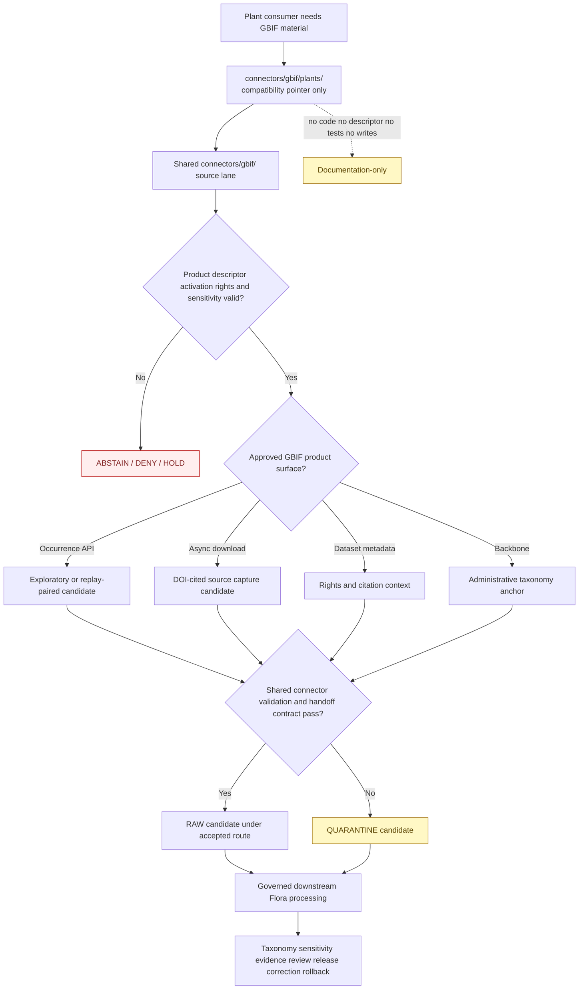

<!-- [KFM_META_BLOCK_V2]
doc_id: kfm://doc/connectors-gbif-plants-readme
title: connectors/gbif/plants/ — GBIF Plants Compatibility Pointer
type: readme
version: v0.2
status: draft
owners: OWNER_TBD — Connector steward · GBIF source steward · Flora steward · Biodiversity steward · Taxonomy steward · Rights reviewer · Privacy/sensitivity reviewer · Validation steward · Docs steward
created: 2026-06-18
updated: 2026-07-11
policy_label: public-doctrine; compatibility-pointer; documentation-only; noncanonical-implementation-path; shared-source-connector; flora-consumer; per-dataset-rights; rare-plant-deny-default; sensitive-joins-fail-closed; no-code; no-descriptor; no-activation; no-publication
proposed_path: connectors/gbif/plants/README.md
truth_posture: CONFIRMED README-only child path / shared GBIF connector and package are the current safe implementation boundary / plant-specific runtime split NOT RATIFIED / parent implementation remains greenfield / no child activation, tests, payloads, or publication authority
related:
  - ../README.md
  - ../pyproject.toml
  - ../src/README.md
  - ../src/gbif/README.md
  - ../src/gbif/__init__.py
  - ../src/gbif/fetch.py
  - ../src/gbif/descriptor.yaml
  - ../tests/README.md
  - ../../../connectors/flora/README.md
  - ../../../docs/sources/catalog/gbif/README.md
  - ../../../docs/sources/catalog/gbif/occurrence-api.md
  - ../../../docs/sources/catalog/gbif/async-download.md
  - ../../../docs/sources/catalog/gbif/dataset-metadata.md
  - ../../../docs/sources/catalog/gbif/backbone-taxonomy.md
  - ../../../docs/sources/catalog/gbif.md
  - ../../../docs/domains/flora/README.md
  - ../../../docs/domains/flora/CANONICAL_PATHS.md
  - ../../../docs/domains/flora/SOURCE_INTAKE.md
  - ../../../docs/domains/flora/SOURCE_FAMILIES.md
  - ../../../docs/domains/flora/SENSITIVITY.md
  - ../../../data/registry/sources/flora/README.md
  - ../../../data/registry/sources/
  - ../../../data/raw/flora/README.md
  - ../../../data/quarantine/flora/
  - ../../../tests/domains/flora/README.md
  - ../../../fixtures/domains/flora/
  - ../../../schemas/contracts/v1/source/
  - ../../../policy/domains/flora/
  - ../../../policy/sensitivity/flora/
  - ../../../policy/rights/
  - ../../../release/
tags: [kfm, connectors, gbif, plants, flora, compatibility, source-first, biodiversity, occurrence, specimen, taxonomy, darwin-core, rights, geoprivacy, rare-plants, raw, quarantine, governance]
notes:
  - "Repository inspection confirms that connectors/gbif/plants/ contains this README only; no package metadata, Python module, client, parser, descriptor, fixture, test, credential configuration, activation record, source payload, cache, lifecycle writer, or CI evidence is proved below this path."
  - "The repository has one shared GBIF package-shaped scaffold at connectors/gbif/src/gbif/ and one connector-local test lane at connectors/gbif/tests/. The plant child must not become a duplicate implementation, activation, credential, fixture, or test authority."
  - "Flora canonical-path doctrine names connectors/gbif/ as the GBIF source connector and keeps domain-scoped connector hierarchies unratified. The current safe posture is source-first access in the shared GBIF lane and Flora-specific interpretation downstream."
  - "The parent package-local descriptor has role and rights set to TBD and sensitivity_floor set to public. That public value is an unsafe placeholder and must never be inherited by plant records, used as activation authority, or treated as a public-safe default."
  - "GBIF occurrence aggregation, dataset metadata, async downloads, and the taxonomic backbone are distinct products with distinct roles. Plant filtering does not collapse them into one source role or one rights decision."
  - "Rare, protected, steward-controlled, obscured, or culturally sensitive plant locations fail closed. Source obscuration, coordinate uncertainty, dataset-level rights, citation, and taxonomic versioning must remain attached downstream."
[/KFM_META_BLOCK_V2] -->

<a id="top"></a>

# GBIF Plants Compatibility Pointer

> Documentation-only plant-consumer pointer beneath the shared GBIF connector. Under the current repository posture, all GBIF source access, product dispatch, metadata retrieval, parsing, and connector-local testing belong to the shared `connectors/gbif/` lane. Plant-specific object mapping, taxonomy reconciliation, sensitivity handling, and publication decisions belong downstream in governed Flora responsibility lanes.

<p>
  
  
  
  
  
  
  
</p>

`connectors/gbif/plants/`

> [!IMPORTANT]
> **Confirmed state:** this directory contains this README only. No child package, client, plant filter, parser, configuration file, SourceDescriptor, activation decision, credential mode, fixture set, test suite, source payload, cache, RAW writer, watcher, or passing CI evidence is confirmed here. The shared parent GBIF package is itself a greenfield scaffold, so this pointer must not imply operational plant ingestion.

> [!CAUTION]
> `../src/gbif/descriptor.yaml` contains `role: TBD`, `rights: TBD`, and `sensitivity_floor: public`. GBIF and Flora doctrine require per-artifact source roles, per-dataset rights, and fail-closed treatment of sensitive plant occurrences. **The local `public` value is an unsafe placeholder. It must not be inherited by this child, used to activate GBIF plants, or encoded as an accepted public-safety result.**

**Quick jumps:** [Purpose](#purpose) · [Placement decision](#placement-decision) · [Verified repository state](#verified-repository-state) · [Evidence ledger](#evidence-ledger) · [Compatibility responsibilities](#compatibility-responsibilities) · [Forbidden responsibilities](#forbidden-responsibilities) · [Shared GBIF product surfaces](#shared-gbif-product-surfaces) · [Plant-facing source semantics](#plant-facing-source-semantics) · [Source-role anti-collapse](#source-role-anti-collapse) · [Rights license and citation posture](#rights-license-and-citation-posture) · [Sensitivity and geoprivacy posture](#sensitivity-and-geoprivacy-posture) · [Taxonomic anchoring and drift](#taxonomic-anchoring-and-drift) · [Temporal spatial and completeness boundaries](#temporal-spatial-and-completeness-boundaries) · [Metadata preservation](#metadata-preservation) · [Flora routing and responsibility separation](#flora-routing-and-responsibility-separation) · [Finite compatibility outcomes](#finite-compatibility-outcomes) · [Lifecycle boundary](#lifecycle-boundary) · [Child-path policy](#child-path-policy) · [Migration and deprecation](#migration-and-deprecation) · [Review and rollback](#review-and-rollback) · [Definition of done](#definition-of-done) · [Verification backlog](#verification-backlog)

---

## Purpose

This README prevents a plant-consumer grouping from becoming a second GBIF connector implementation.

It may:

- redirect plant-specific connector references to the shared GBIF parent lane;
- explain how shared GBIF products can later support Flora consumers;
- preserve plant-specific source-role, taxonomy, specimen, rights, geoprivacy, rare-plant, and join-sensitivity warnings;
- identify the downstream Flora object families and responsibility roots that take over after source admission;
- document path drift, stale backlinks, migration work, and deprecation choices;
- keep occurrence, specimen, aggregate, modeled-range, dataset-metadata, and taxonomic-backbone meanings distinct;
- prevent source filtering from becoming domain truth, taxonomic authority, sensitivity clearance, or publication approval.

It does **not** host source access, define a plant-only GBIF product, activate GBIF, assign source roles, create taxon truth, map source records into canonical Flora objects, generalize sensitive geometry, close evidence, or publish plant claims.

[Back to top ↑](#top)

---

## Placement decision

The current repository evidence supports one shared, source-first GBIF connector boundary.

| Question | Current safe decision | Evidence posture |
|---|---|---:|
| Where does GBIF source access belong? | `connectors/gbif/` and its reviewed package under `connectors/gbif/src/gbif/`. | The Flora path register names `connectors/gbif/`; a shared package scaffold exists there. |
| Is `connectors/gbif/plants/` a canonical implementation package? | **No.** It is documentation-only under the current posture. | This path is README-only; no ADR ratifies a plant implementation split. |
| May this child own a plant-specific SourceDescriptor or activation decision? | **No.** Source authority remains in the accepted registry and parent connector workflow. | Duplicate descriptors would fragment source identity, rights, cadence, and rollback. |
| May this child own a client, query builder, async-download worker, metadata fetcher, or Backbone resolver? | **No.** Shared GBIF product behavior belongs in the parent package. | The products are provider-level surfaces reused by Flora, Fauna, and Habitat. |
| May this child own connector-local fixtures or tests? | **No.** Shared connector tests belong at `connectors/gbif/tests/`; Flora interpretation tests belong in Flora test lanes. | A plant child suite would duplicate product, rights, and transport behavior. |
| Where does plant-specific interpretation belong? | Flora contracts, schemas, packages, pipelines, policies, tests, fixtures, and lifecycle lanes after admission. | Source access and domain interpretation are separate responsibilities. |
| Can this decision change? | Yes, only through an accepted ADR or migration decision. | A change must address ownership, package layout, descriptors, credentials, tests, fixtures, activation, data migration, backlinks, rollback, and deprecation. |

> [!CAUTION]
> A directory name, generated skeleton, plant-only query, or plant-heavy dataset does not establish a separate connector authority. Consumer scope is not source identity.

[Back to top ↑](#top)

---

## Verified repository state

The following scaffold is confirmed on the repository's default branch at the time of this update:

```text
connectors/gbif/
├── README.md                         # parent GBIF connector contract
├── pyproject.toml                    # project name + version 0.0.0 only
├── plants/
│   └── README.md                     # this compatibility pointer
├── src/
│   ├── README.md                     # source-root contract
│   └── gbif/
│       ├── README.md                 # package contract
│       ├── __init__.py               # empty file
│       ├── descriptor.yaml           # role/rights TBD; unsafe public floor
│       └── fetch.py                  # one-line greenfield placeholder
└── tests/
    └── README.md                     # documentation-only test contract
```

### Current maturity

| Surface | Confirmed content | Maturity |
|---|---|---:|
| `plants/README.md` | This compatibility and plant-consumer coordination contract. | **DOCUMENTED / NONCANONICAL IMPLEMENTATION PATH** |
| Other files below `plants/` | None found in current repository search. | **ABSENT / NEEDS CONTINUOUS VERIFICATION** |
| Child implementation code | None confirmed. | **ABSENT / FORBIDDEN UNDER CURRENT POSTURE** |
| Child package metadata | None confirmed. | **ABSENT** |
| Child descriptor or activation state | None confirmed. | **ABSENT / FORBIDDEN** |
| Child fixtures or tests | None confirmed. | **ABSENT / FORBIDDEN** |
| Parent `pyproject.toml` | Distribution name and version `0.0.0` only. | **INCOMPLETE** |
| Parent `src/gbif/__init__.py` | Empty file. | **IMPORT-SHAPED / BEHAVIOR ABSENT** |
| Parent `src/gbif/fetch.py` | Comment-only placeholder. | **PLACEHOLDER / NON-EXECUTABLE** |
| Parent `src/gbif/descriptor.yaml` | `role: TBD`, `rights: TBD`, `sensitivity_floor: public`. | **PLACEHOLDER / UNSAFE DEFAULT** |
| Parent package parsers and product dispatch | None confirmed. | **ABSENT** |
| Parent executable tests and fixtures | None confirmed. | **ABSENT** |
| Accepted GBIF SourceDescriptors and activation decisions | None found or verified in this update. | **ABSENT / NOT ACTIVATED** |
| Live access and CI evidence | None confirmed. | **NOT APPROVED / UNKNOWN** |

> [!IMPORTANT]
> A source catalog page, package-shaped directory, empty initializer, placeholder fetcher, or compatibility pointer does not prove endpoint support, current schema compatibility, rights clearance, sensitivity clearance, test coverage, activation, or release readiness.

[Back to top ↑](#top)

---

## Evidence ledger

| Evidence | Status | What it supports | What it does not support |
|---|---:|---|---|
| `connectors/gbif/plants/README.md` and current path search | **CONFIRMED for inspected state** | The plant child exists and contains this README only. | Permanent absence of future files or ratified child authority. |
| `docs/domains/flora/CANONICAL_PATHS.md` | **CONFIRMED doctrine-derived register** | GBIF is represented by `connectors/gbif/`; connectors are source-first and stop at RAW/QUARANTINE. | Operational GBIF implementation or final resolution of every path conflict. |
| `connectors/flora/README.md` | **CONFIRMED v0.2 compatibility posture** | Flora-scoped connector implementation is noncanonical under the current safe posture; source access belongs in source/source-family lanes. | Maturity or activation of any source connector. |
| `connectors/gbif/README.md` | **CONFIRMED parent documentation** | One shared GBIF connector boundary is documented for Flora, Fauna, and Habitat. | Executable source access or accepted plant filtering. |
| `connectors/gbif/src/README.md` and `src/gbif/README.md` | **CONFIRMED package documentation** | The shared source-root and package locations exist. | Implemented client, parser, product dispatch, or handoff behavior. |
| Parent `__init__.py`, `fetch.py`, `descriptor.yaml`, and `pyproject.toml` | **CONFIRMED placeholders** | A greenfield package scaffold exists. | Installability, role, rights, safe sensitivity, activation, or network behavior. |
| `connectors/gbif/tests/README.md` | **CONFIRMED documentation** | Shared connector test intentions are documented. | Executable tests, accepted live-test variables, or passing results. |
| `docs/sources/catalog/gbif/README.md` | **CONFIRMED draft family profile** | GBIF occurrence aggregation and taxonomic Backbone roles, per-dataset rights, sensitivity, and product distinctions are documented. | Current endpoints, activated products, or parser compatibility. |
| GBIF product pages | **CONFIRMED draft profiles** | Occurrence API, async download, dataset metadata, and Backbone Taxonomy have distinct trust, rights, citation, version, and lifecycle postures. | Accepted runtime implementations or current source behavior. |
| Flora source, taxonomy, and sensitivity docs | **CONFIRMED doctrine / PROPOSED realization** | Plant occurrences, specimens, taxa, crosswalks, rare plants, and sensitive joins have separate downstream meanings and controls. | Connector-local plant code or release approval. |

[Back to top ↑](#top)

---

## Compatibility responsibilities

This path may contain only compact, reviewable compatibility material such as:

- this README;
- redirects to the shared parent connector, source-root, package, and test lane;
- a backlink inventory for historical `connectors/gbif/plants/` references;
- migration or deprecation notes;
- a plant-consumer map explaining downstream Flora responsibilities;
- documented source-role and sensitivity warnings that prevent misuse;
- an ADR reference if the project's connector-placement posture changes;
- a tombstone notice if this child is later removed.

Compatibility material must remain non-executable, non-authoritative, and free of source payloads, secrets, exact sensitive locations, or canonical data shapes.

[Back to top ↑](#top)

---

## Forbidden responsibilities

Do not add or retain the following below `connectors/gbif/plants/` under the current posture:

| Forbidden responsibility | Correct home or handling |
|---|---|
| GBIF HTTP client, query builder, download poller, metadata client, retry logic, rate-limit logic, or Backbone resolver | Shared parent package under `connectors/gbif/src/gbif/` after review. |
| Plant-only parser, Darwin Core normalizer, taxon mapper, or occurrence filter | Shared source-shape parsing in the parent; Flora interpretation downstream. |
| `pyproject.toml`, package namespace, entry point, or dependency set | Parent GBIF package only. |
| SourceDescriptor, activation decision, role assignment, endpoint, cadence, rights, or sensitivity authority | Accepted source registry and activation workflow. |
| Credentials, API keys, cookies, sessions, account state, download keys, or secret-bearing environment configuration | Approved secret/account systems; never source control. |
| Connector-local fixtures or tests | `connectors/gbif/tests/` for shared behavior; Flora test/fixture lanes for downstream semantics. |
| RAW payloads, DwC-A archives, API responses, dataset snapshots, or taxonomic mirrors | Approved lifecycle storage or quarantine. |
| Rare-plant exact geometry, obscured source coordinates, steward-only records, or cultural knowledge | Restricted lifecycle and policy-governed review paths. |
| Taxonomic truth, accepted-name authority, synonym collapse, or FloraTaxon identity | Flora taxonomy contracts/packages and accepted authority decisions. |
| Redaction, coordinate generalization, aggregation, or public-safe transformation logic | Policy and downstream transformation pipelines with receipts. |
| Processed Flora objects, catalog records, graph/triplet projections, proof, release manifests, maps, reports, or generated answers | Owning lifecycle, evidence, catalog, release, application, or governed-AI roots. |

Any discovered executable or sensitive material below this path is migration or rollback work, not evidence that the child became canonical.

[Back to top ↑](#top)

---

## Shared GBIF product surfaces

Plant filtering is a consumer concern applied to shared GBIF products. It does not create a new upstream product family.

| Shared GBIF surface | Current documented posture | Plant-consumer implication | Must not happen here |
|---|---|---|---|
| Occurrence API | Synchronous, exploratory, and not replay-stable enough to stand alone as publication evidence. | May support preview, watcher, or bounded candidate workflows after parent implementation and activation. | A plant child must not own a second API client or claim publication-class evidence from a live query. |
| Async download | Bulk, DOI-cited, replayable source capture with a Darwin Core archive. | Preferred documented source surface for reproducible release-bound occurrence subsets, subject to rights and sensitivity gates. | This child must not submit jobs, poll downloads, retain archives, or mint a plant-specific activation switch. |
| Dataset metadata | Per-dataset publisher, license, citation, DOI, and rights context. | Every plant record retains originating-dataset obligations; GBIF-wide availability is not a blanket license. | Plant filtering must not discard dataset identity or replace per-dataset rights with a generic GBIF label. |
| Backbone Taxonomy | Versioned `administrative` taxonomic anchor and international crosswalk, not occurrence evidence. | Preserve taxon keys and Backbone snapshot references for downstream crosswalk review. | The child must not emit Backbone rows as plant occurrences or declare the Backbone final Flora taxonomy. |

A product implementation belongs once in the shared GBIF package. Consumer-specific filters, requests, and domain mappings must remain explicit inputs or downstream transforms rather than forked connector code.

[Back to top ↑](#top)

---

## Plant-facing source semantics

GBIF plant material is heterogeneous. The source artifact, dataset, `basisOfRecord`, source role, time, rights, and sensitivity determine what a record can support.

| Source-shaped material | Source-side meaning | Potential downstream Flora candidate | Connector/child boundary |
|---|---|---|---|
| Preserved herbarium specimen | Source-attributed specimen or collection evidence at a stated collection event and institution. | `SpecimenRecord` and occurrence evidence under downstream validation. | Not proof of current presence, extant population, abundance, legal status, or complete range. |
| Human or machine observation record | Source-attributed occurrence assertion with identification, time, geometry, uncertainty, and dataset context. | `FloraOccurrence` candidate. | Not taxonomic authority, conservation-status authority, native/wild proof, or absence evidence. |
| Event or survey record | A sampling event carrying method, effort, time, and linked observations where supplied. | `BotanicalSurvey`, `PhenologyObservation`, or occurrence candidates after downstream mapping. | Detection/non-detection and completeness cannot be inferred when effort or protocol is missing. |
| GBIF Backbone taxon record | Administrative reference hierarchy and synonym/crosswalk context. | `PlantTaxon` or `FloraTaxonCrosswalk` candidate after authority reconciliation. | Never occurrence evidence or proof that a plant is present in Kansas. |
| Aggregated occurrence cell/count | Roll-up over an explicit spatial and temporal unit. | Aggregate context under a named aggregation contract. | Never a point observation, site-level population, or exact locality. |
| Modeled range or suitability asset hosted through a GBIF-related surface | Model-derived geographic context. | `RangePolygon` or modeled habitat/range candidate. | Never upgraded to observed occurrence. Model identity and run evidence remain required. |
| Rare, protected, obscured, or steward-controlled record | Restricted occurrence evidence with elevated exposure risk. | `RarePlantRecord` or restricted occurrence candidate. | Exact geometry, withheld fields, or source-obscured values cannot be exposed or reconstructed. |
| Dataset metadata only | Publisher, license, citation, DOI, update, and provenance context. | Source-admission and evidence metadata. | Not an occurrence, specimen, taxon, or plant-status claim. |

The shared connector preserves source meaning. Flora pipelines decide domain object mapping only after accepted contracts, schemas, policy, and review exist.

[Back to top ↑](#top)

---

## Source-role anti-collapse

Source role is assigned by the accepted product/dataset descriptor and remains fixed. A plant-only filter cannot change it.

| Forbidden collapse | Required posture |
|---|---|
| GBIF Backbone taxonomy → plant occurrence | Reject. Administrative taxonomy has no occurrence event or locality. |
| Herbarium specimen → current plant presence | Preserve collection date and specimen status; current presence requires current evidence. |
| Community or field observation → regulatory conservation status | Preserve observation role; status requires separately admitted regulatory or stewardship evidence. |
| GBIF occurrence → accepted canonical plant identity | Preserve source identification and taxon references; downstream crosswalk and review remain required. |
| Aggregate cell/count → exact-site observation | Preserve aggregation unit and time scope; never downscale. |
| Modeled range → observed range | Preserve `modeled` role and model evidence; never upgrade by promotion. |
| Dataset metadata → evidence that every row is reusable | Evaluate rights and restrictions at the actual dataset/record granularity. |
| Source-obscured coordinate → recoverable exact location | Preserve obscuration; do not reverse, infer, or enrich to exact geometry. |
| Taxonomic rename → occurrence gain/loss | Track taxonomy drift separately from record, population, or presence drift. |
| Absence from a GBIF result → biological absence | Abstain unless a governed survey/completeness contract supports non-detection. |
| Public availability → public-safe joined product | Recalculate sensitivity after every material join. |

> [!IMPORTANT]
> A parsed record is still source evidence. A taxon key is not a Flora identity decision. A specimen is not a living population. A map point is not a release decision.

[Back to top ↑](#top)

---

## Rights, license, and citation posture

GBIF aggregates records from many upstream datasets. Rights do not collapse to one provider-wide decision.

Required downstream-preserved context includes, where supplied and applicable:

- GBIF dataset key and dataset title;
- publisher and originating institution;
- collection and institution codes;
- rights holder;
- record- or dataset-level license;
- citation and attribution text;
- dataset DOI or citation identifier;
- GBIF Download DOI for an async subset;
- source URL or distribution identity;
- retrieval/import time and checksum;
- source restrictions, withholding, embargo, or usage notes;
- Backbone concept and snapshot/version references;
- transformation and review references when a derivative is later created.

The current source documentation proposes the following fail-closed posture:

| Rights condition | Required handling |
|---|---|
| `CC0` | May be admitted subject to source, integrity, sensitivity, and activation gates; preserve provenance by convention. |
| `CC-BY` | Attribution and dataset citation must remain attached. |
| `CC-BY-SA` | Derivative/share-alike compatibility requires release review. |
| Other, unknown, missing, or unparseable license | Quarantine, deny, or hold for rights review. |
| Additional dataset-specific restrictions | Preserve and enforce them; a parsed license string does not override special terms. |
| Citation or originating-dataset identity missing | Do not produce a release-bound candidate. |

This child neither evaluates licenses nor authorizes use. It records that the shared connector and downstream gates must retain rights at the source's actual granularity.

[Back to top ↑](#top)

---

## Sensitivity and geoprivacy posture

Plant occurrence sensitivity is evaluated from the record, taxon, source restrictions, geometry, joins, and intended use—not from the fact that GBIF is publicly reachable.

### Fail-closed classes

- rare, threatened, imperiled, protected, or steward-controlled plant occurrences;
- exact locality of small populations, collection sites, seed sources, or culturally sensitive plants;
- records already obscured, rounded, withheld, generalized, or marked sensitive upstream;
- collector, observer, contact, landowner, permit, or private-property context;
- precise locations joined with parcels, roads, trails, access points, facilities, ownership, or harvest/use information;
- source records whose sensitivity status cannot be evaluated;
- outputs where a combination of individually ordinary fields creates actionable location intelligence.

### Required posture

1. Preserve upstream obscuration, uncertainty, withholding, and precision exactly as received.
2. Never attempt to recover an exact coordinate from an obscured source record.
3. Route unresolved sensitivity to denial, abstention, hold, or quarantine.
4. Keep exact sensitive geometry out of documentation, fixtures, logs, errors, metrics, and public artifacts.
5. Apply generalization, masking, aggregation, or denial only downstream through accepted policy and receipt-bearing transforms.
6. Never rely on map styling, hidden layers, CSS, client filters, or zoom thresholds as a sensitivity control.
7. Recalculate sensitivity after joins; a public taxon list plus public occurrence plus access data can become a harmful exact-location product.
8. Preserve cultural, sovereignty, stewardship, and source-specific restrictions even when ordinary taxonomic metadata is public.
9. Keep generated summaries, search indexes, vector embeddings, and AI responses subordinate to the same location restrictions.
10. Require correction and rollback support for every released derivative whose sensitivity posture later changes.

[Back to top ↑](#top)

---

## Taxonomic anchoring and drift

This child does not decide plant taxonomy.

Repository documentation currently contains multiple relevant postures:

- GBIF source documentation uses ITIS as the first-line U.S. anchor and the GBIF Backbone as the international second-line anchor/crosswalk;
- Flora path documentation identifies USDA PLANTS as a proposed plant taxonomic backbone and keeps the USDA-PLANTS-versus-GBIF authority relationship open;
- local, state, NatureServe, herbarium, and accepted Flora authority sources may carry names, statuses, or concepts that disagree with GBIF;
- the GBIF Backbone is versioned, and taxon keys are meaningful only with the corresponding snapshot/version context.

Required safe posture:

- preserve source `scientificName`, taxon keys, accepted-name references, rank, status, and verbatim values where supplied;
- preserve the exact Backbone concept/version or snapshot reference used during resolution;
- keep GBIF, ITIS, USDA PLANTS, NatureServe, and local authority identifiers independently inspectable;
- do not silently replace source names with a preferred Flora name;
- do not discard synonyms, unresolved names, higher-rank matches, or disagreement evidence;
- treat taxon merges, splits, synonym changes, and rank changes as taxonomy drift, not automatic occurrence correction;
- require downstream `FloraTaxonCrosswalk` evidence for canonical plant identity;
- abstain or route to review when no accepted anchor resolves;
- never create a plant-specific Backbone mirror or tie-breaker policy below this compatibility path.

[Back to top ↑](#top)

---

## Temporal, spatial, and completeness boundaries

### Time

Keep these meanings distinct where material:

| Time kind | Meaning | Guardrail |
|---|---|---|
| Event or collection time | When the plant was observed, collected, sampled, or recorded by the source. | Does not become retrieval or release time. |
| Identification or record-update time | When identification or source metadata changed, if supplied. | A later identification date does not imply a new biological occurrence. |
| Dataset publication/update time | When the upstream dataset or distribution was issued or revised. | Preserve independently from the biological event. |
| Retrieval time | When KFM obtained the source material. | Required for provenance and staleness review. |
| Backbone/version time | Taxonomic frame used for resolution. | A version change is taxonomy drift, not occurrence time. |
| Downstream release time | When a governed derivative was released. | Outside connector and child authority. |
| Correction/supersession time | When source or KFM records were corrected, withdrawn, or replaced. | Never overwrite prior evidence silently. |

A historical specimen or old observation must not be presented as current presence merely because it was retrieved recently.

### Space

Preserve, where supplied and permitted:

- source geometry and coordinate fields;
- coordinate reference system and datum metadata;
- coordinate uncertainty, precision, rounding, georeferencing basis, and issue flags;
- country, state/province, county, locality, and other source geography;
- source-obscured or withheld status;
- original versus transformed geometry state;
- geometry checksum/fingerprint where the accepted contract requires it.

The connector must not silently geocode, snap, average, repair, or canonicalize a plant locality. Downstream transforms require explicit evidence and review.

### Completeness

GBIF is an aggregator, not a complete census of plants.

- an empty query does not prove absence;
- one dataset does not prove complete geographic, temporal, taxonomic, or institutional coverage;
- a specimen collection does not prove systematic sampling;
- a filtered or partial download does not prove the excluded set is empty;
- a record count is meaningful only with query/download scope, dataset composition, time, and completeness evidence;
- non-detection requires an accepted survey/effort contract, not merely a missing occurrence.

[Back to top ↑](#top)

---

## Metadata preservation

When the shared connector is eventually implemented, plant-relevant source candidates should retain the following where supplied, permitted, and defined by accepted contracts.

### Source and product minimum

- canonical source ID and SourceDescriptor reference;
- product surface: occurrence API, async download, dataset metadata, or Backbone Taxonomy;
- SourceActivationDecision reference;
- source role and role authority;
- dataset key, title, publisher, originating institution, and dataset DOI/citation;
- download key and GBIF Download DOI where applicable;
- Backbone concept and snapshot/version reference;
- API/download request identity and query/predicate digest where applicable;
- retrieval/import timestamp, checksum, and connector/parser version;
- license, attribution, rights-holder, restriction, and review state;
- intended domain route and lifecycle target;
- drift, incomplete, sensitive, obscured, quarantined, and review flags.

### Occurrence/specimen minimum

- source occurrence or record identifier;
- `basisOfRecord` or equivalent source class;
- institution, collection, and catalog identifiers;
- event/collection date and source temporal precision;
- scientific name and verbatim taxonomic values;
- taxon key, accepted-name reference, rank, and taxonomic status where supplied;
- identification qualifiers, confidence, issues, and source caveats;
- occurrence status and establishment/native/cultivation qualifiers where supplied, without inference;
- source geometry, coordinate uncertainty, precision, georeferencing basis, and obscuration state;
- locality and jurisdiction fields where permitted;
- source field names, code values, null/unknown semantics, and unsupported-field evidence.

### Capture and completeness minimum

- request/download scope;
- expected and received pages, files, archive members, rows, or records where available;
- accepted, rejected, quarantined, duplicate, and unresolved counts;
- archive membership and extraction status;
- checksum and content-size verification;
- partial, truncated, interrupted, or stale state;
- unknown field, schema, code-list, and taxonomic-version drift evidence.

Unknown source fields must not be silently dropped, guessed into Flora semantics, or exposed publicly. Restricted passthrough requires an accepted contract.

[Back to top ↑](#top)

---

## Flora routing and responsibility separation

Plant relevance does not move source access into this child. It determines which downstream consumers may receive governed candidates.

| Surface | Responsibility | Must not do |
|---|---|---|
| `connectors/gbif/plants/` | Compatibility pointer, plant-consumer warnings, migration notes, and navigation. | Fetch, parse, activate, store, test runtime behavior, or publish. |
| `connectors/gbif/` | Parent GBIF source-admission boundary and product coordination. | Decide Flora taxonomic truth, rare-plant release, or canonical domain objects. |
| `connectors/gbif/src/gbif/` | Future shared client/input, product dispatch, source-shape parsing, metadata preservation, local validation, finite outcomes, and candidate envelopes. | Fork by consumer domain, own policy, or publish. |
| `connectors/gbif/tests/` | Shared offline connector tests for transport, product surfaces, rights metadata, parsing, drift, and handoff boundaries. | Prove Flora occurrence truth or use real sensitive locations by default. |
| Flora contracts and schemas | Define `PlantTaxon`, `FloraTaxonCrosswalk`, `SpecimenRecord`, `FloraOccurrence`, `RarePlantRecord`, surveys, ranges, and related shapes. | Fetch source data or activate GBIF. |
| Flora packages and pipelines | Downstream taxon reconciliation, source-to-domain mapping, identity, temporal handling, geometry review, sensitivity routing, and derivative creation. | Rewrite source evidence invisibly or inherit activation from connector adjacency. |
| Flora policy and sensitivity lanes | Decide rare-plant, exact-location, join-induced, cultural, and public-safe transform posture. | Fetch or parse source payloads. |
| Source registry | Canonical source/product identity, role, rights, access, cadence, sensitivity, and activation. | Store GBIF payloads or decide domain truth. |
| Data lifecycle lanes | Store immutable source captures, quarantine, work, processed candidates, catalog/proof, and released derivatives under their own gates. | Treat directory presence as promotion. |
| Evidence/catalog surfaces | Close citation, provenance, taxonomy-version, rights, transformation, and review requirements. | Treat connector output as proof automatically. |
| Release surfaces | Approve publication, correction, supersession, withdrawal, and rollback. | Treat a public source, redaction, or aggregation as release by itself. |

One parent GBIF source capture may support multiple downstream domains through lineage-preserving projections. This child must not trigger duplicate source downloads or independent plant-only RAW captures by convenience.

[Back to top ↑](#top)

---

## Finite compatibility outcomes

This documentation path should make placement decisions deterministic.

| Request or condition | Required outcome |
|---|---|
| Add GBIF client or fetch code under `plants/` | Reject and route to the shared parent package. |
| Add a plant-specific descriptor or activation file | Reject; use the accepted source registry and product descriptors. |
| Add plant-only connector tests or fixtures here | Reject; route shared behavior to parent tests and Flora semantics to Flora tests. |
| Use parent `sensitivity_floor: public` for plant records | Hard documentation/configuration failure. |
| Treat all GBIF plant rows as one source role | Reject; require artifact/product/dataset-specific role. |
| Treat Backbone taxonomy as occurrence evidence | Hard source-role boundary failure. |
| Treat specimen evidence as current presence | Abstain or route to temporal review. |
| Rights, citation, publisher, or dataset identity missing | Hold, deny, abstain, or quarantine in the parent connector workflow. |
| Sensitive or obscured plant locality encountered | Preserve restriction and route to governed sensitivity handling; no exact public path. |
| Taxonomic authority disagreement | Preserve competing identifiers and route to Flora crosswalk review. |
| Plant filter requested before shared product implementation exists | Documentation-only response; do not claim runtime support. |
| Direct RAW, QUARANTINE, processed, catalog, or public write requested from this child | Refuse; this path performs no lifecycle action. |
| New organism-group implementation child proposed | Require an accepted ADR and migration plan before file creation. |

[Back to top ↑](#top)

---

## Lifecycle boundary

This child performs no source admission and no lifecycle transition.



The diagram defines responsibility boundaries. It does not prove source access, product dispatch, parsing, rights evaluation, sensitive-location handling, RAW storage, Flora mapping, taxonomic reconciliation, evidence closure, or release.

KFM lifecycle discipline remains:

```text
RAW -> WORK / QUARANTINE -> PROCESSED -> CATALOG / TRIPLET -> PUBLISHED
```

This child is outside that transition chain. It points to the responsible lanes.

[Back to top ↑](#top)

---

## Child-path policy

Under the current posture:

1. Keep `connectors/gbif/plants/` README-only.
2. Do not add child package metadata, source code, tests, fixtures, descriptors, activation state, credentials, caches, payloads, or lifecycle writers.
3. Do not create additional taxon-group or consumer-domain implementation children beneath `connectors/gbif/` without an accepted ADR.
4. Put shared GBIF product behavior in the parent package.
5. Put domain-neutral connector tests in the parent test lane.
6. Put Flora-specific object mapping, taxonomy, sensitivity, and release tests in Flora responsibility lanes.
7. Preserve this pointer only while backlinks, generated skeletons, or contributor navigation still need it.
8. Mark any historical path as compatibility-only rather than letting documentation imply active behavior.
9. Treat an accepted placement change as a migration project, not an opportunistic file addition.

[Back to top ↑](#top)

---

## Migration and deprecation

### Migration triggers

Start a migration review if:

- code, package metadata, descriptors, tests, fixtures, or credentials appear below this path;
- a generated template recreates a plant-specific GBIF implementation;
- documentation links describe this child as runnable or activated;
- a second client or parser diverges from the parent package;
- plant-only source captures duplicate a shared GBIF retrieval;
- an ADR explicitly ratifies a product or consumer subpackage architecture.

### Migration procedure

1. Inventory every backlink and generated reference to `connectors/gbif/plants/`.
2. Classify each reference as navigation, compatibility, implementation, test, fixture, descriptor, activation, or lifecycle usage.
3. Move shared connector behavior to `connectors/gbif/src/gbif/`.
4. Move shared connector tests and synthetic fixtures to the accepted parent test/fixture lanes.
5. Move Flora object, taxonomy, sensitivity, and release behavior to the appropriate Flora responsibility roots.
6. Reconcile any duplicate descriptors, source IDs, credentials, caches, and activation decisions.
7. Preserve source history, checksums, receipts, and rollback targets for any data migration.
8. Replace backlinks with the accepted parent or downstream path.
9. Choose one end state:
   - retained compatibility pointer;
   - tombstone with replacement links;
   - removal after backlink cleanup;
   - ADR-ratified plant subpackage with explicit authority and migration rules.
10. Verify generated templates no longer recreate the deprecated structure.

No code migration is required today because no child code is confirmed. The immediate task is preventing future divergence.

[Back to top ↑](#top)

---

## Review and rollback

Review every change to this path as a connector-placement, source-role, rights, taxonomy, geoprivacy, rare-plant, and lifecycle-boundary change.

A reviewer should confirm:

- the path remains documentation-only unless an accepted ADR says otherwise;
- implementation claims match the actual repository tree;
- the shared parent connector remains the single GBIF source-access boundary;
- package-local YAML cannot activate or classify plant records;
- the unsafe `public` sensitivity floor is rejected;
- occurrence, specimen, aggregate, modeled, metadata, and Backbone roles remain distinct;
- per-dataset rights, citation, and publisher identity are not collapsed;
- source obscuration, coordinate uncertainty, and sensitive-location restrictions remain intact;
- taxonomic disagreement and version drift remain visible;
- specimen records are not presented as current presence;
- absence is not inferred from missing GBIF records;
- plant-specific processing remains downstream;
- no child file writes to lifecycle or public surfaces;
- no exact sensitive plant data appears in docs, fixtures, logs, or examples.

Rollback is required if a change:

- adds executable connector behavior here without an accepted placement decision;
- duplicates parent client, parser, descriptor, activation, credential, fixture, or test behavior;
- treats the local descriptor or `public` floor as authority;
- flattens GBIF product roles or plant source meanings;
- removes dataset-level rights, citation, source institution, uncertainty, or Backbone-version context;
- reconstructs or exposes sensitive plant locations;
- treats taxonomic drift as occurrence change;
- turns specimen evidence into current-presence claims;
- creates direct downstream or public writes;
- claims activation, coverage, rights clearance, sensitivity clearance, or CI without evidence.

Rollback procedure:

1. Revert the unsafe or misleading child-path change.
2. Restore the README-only compatibility posture.
3. Remove or quarantine unapproved code, descriptors, credentials, fixtures, caches, payloads, or sensitive records and assess repository-history exposure.
4. Move legitimate shared connector work to the parent GBIF package/test lanes.
5. Move legitimate Flora semantics, policy, pipeline, test, fixture, evidence, catalog, or release work to its proper responsibility root.
6. Repair source roles, rights metadata, taxonomic references, geometry restrictions, backlinks, and generated templates.
7. Record placement, taxonomy, rights, sensitivity, or lifecycle drift in the appropriate register.
8. Trigger governed correction, invalidation, withdrawal, or rollback for any downstream artifact affected by the change.
9. Correct README badges and maturity claims to match repository evidence.

[Back to top ↑](#top)

---

## Definition of done

This compatibility path is not a completed connector implementation.

- [x] README-only child state is explicit.
- [x] Shared parent GBIF implementation and test boundaries are identified.
- [x] Child code, descriptors, activation, credentials, tests, fixtures, payloads, and lifecycle writes are prohibited under the current posture.
- [x] The parent package's unsafe `sensitivity_floor: public` placeholder is identified.
- [x] Occurrence API, async download, dataset metadata, and Backbone Taxonomy are separated.
- [x] Plant occurrence, specimen, taxonomy, aggregate, modeled-range, rare-plant, and metadata meanings are separated.
- [x] Per-dataset rights and citation requirements are explicit.
- [x] Rare-plant, geoprivacy, obscuration, cultural, and join-induced sensitivity boundaries are explicit.
- [x] Taxonomic authority and version drift remain downstream review concerns.
- [x] This child performs no lifecycle transition or publication.
- [ ] Parent GBIF connector, source-root, package, and test READMEs are updated to the same verified v0.2 posture.
- [ ] Package-local descriptor authority is removed or neutralized.
- [ ] The unsafe public sensitivity placeholder is removed or safely replaced.
- [ ] Canonical GBIF product descriptors, source roles, rights, access methods, and activation decisions are accepted.
- [ ] Shared product implementation and executable connector tests exist and pass.
- [ ] Flora taxonomy authority order and crosswalk policy are accepted.
- [ ] Rare-plant and exact-location policy is executable and tested.
- [ ] Parent-to-Flora handoff and cross-domain routing contracts are accepted.
- [ ] Backlinks and generated templates are inventoried and corrected.
- [ ] The child path receives an explicit retained-pointer, tombstone, removal, or ADR-ratified end state.

[Back to top ↑](#top)

---

## Verification backlog

| Item | Status | Needed evidence |
|---|---:|---|
| Confirm `README.md` remains the only file below `connectors/gbif/plants/`. | **NEEDS CONTINUOUS VERIFICATION** | Repository tree inspection. |
| Ratify the child path's final disposition: retained pointer, tombstone, removal, or approved subpackage. | **OPEN DECISION** | ADR or accepted migration decision. |
| Update the parent GBIF README, source-root README, package README, and test README to verified scaffold state. | **NEEDS FOLLOW-UP** | Documentation reconciliation. |
| Remove or neutralize package-local descriptor authority. | **BLOCKED** | Source-authority and packaging decision. |
| Remove or safely replace `sensitivity_floor: public`. | **CRITICAL BLOCKER** | Rights/sensitivity review and descriptor update. |
| Confirm canonical GBIF source ID and product-specific SourceDescriptors. | **NEEDS VERIFICATION** | Accepted registry entries and schemas. |
| Resolve product source roles for API occurrences, downloads, dataset metadata, Backbone, aggregates, and modeled assets. | **NEEDS VERIFICATION** | Product descriptors, role review, fixtures, and anti-collapse tests. |
| Confirm current Occurrence API, async-download, metadata, and Backbone access surfaces. | **NEEDS VERIFICATION** | Current source documentation, terms, and source-steward review. |
| Confirm current Darwin Core/DwC-A shapes, fields, archive structure, pagination, job states, checksums, and drift behavior. | **NEEDS VERIFICATION** | Pinned source docs, synthetic fixtures, parser tests, and transport tests. |
| Confirm per-dataset license parsing, restricted-use handling, attribution, and DOI propagation. | **NEEDS VERIFICATION** | Rights policy, metadata tests, and release review. |
| Confirm GBIF Download DOI, dataset DOI/citation, and Backbone snapshot preservation. | **NEEDS VERIFICATION** | Handoff contract, receipts, fixtures, and evidence tests. |
| Resolve ITIS, USDA PLANTS, GBIF Backbone, NatureServe, and local Flora authority ordering. | **OPEN / ADR-CLASS** | Flora taxonomy authority decision and crosswalk contract. |
| Confirm taxon-key stability, synonym, merge, split, deprecation, and Backbone-rotation handling. | **NEEDS VERIFICATION** | Versioned fixtures, taxonomy drift tests, and correction policy. |
| Confirm occurrence-versus-specimen, event, aggregate, and modeled-range mapping. | **NEEDS VERIFICATION** | Flora contracts, schemas, pipelines, and domain tests. |
| Confirm rare-plant, steward-controlled, obscured, culturally sensitive, and exact-location handling. | **NEEDS VERIFICATION / DEFAULT DENY** | Policy, negative fixtures, reviewer decisions, and release tests. |
| Confirm join-induced sensitivity for parcels, roads, trails, access, facilities, landowners, and cultural-use context. | **NEEDS VERIFICATION / DEFAULT DENY** | Cross-lane policy, tests, receipts, and review workflow. |
| Confirm parent GBIF connector package, build backend, dependencies, public API, and import safety. | **ABSENT / OPEN DECISION** | Completed package metadata and clean build/install/import evidence. |
| Confirm connector-result and RAW/QUARANTINE handoff contracts. | **NEEDS VERIFICATION** | Contracts, schemas, validators, and tests. |
| Confirm one-source-capture/multi-domain projection behavior without duplicate plant downloads. | **NEEDS VERIFICATION** | Routing contract, lineage tests, and lifecycle design. |
| Confirm shared fixture authority and safe synthetic plant-occurrence generation. | **NEEDS VERIFICATION** | Fixture policy, sensitivity review, and reproducibility evidence. |
| Confirm executable no-network connector tests and domain-level Flora tests. | **ABSENT / UNKNOWN** | Test modules, fixtures, commands, and passing output. |
| Remove or ratify illustrative live-test environment-variable conventions in the parent test README. | **NOT APPROVED** | Source, security, rights, test, and CI decision. |
| Confirm CI integration and connector/path boundary enforcement. | **UNKNOWN** | Workflow configuration, branch policy, and successful runs. |
| Inventory backlinks, skeletons, and generated templates that treat this child as an implementation home. | **NEEDS VERIFICATION** | Repository-wide search and migration manifest. |

---

## Maintainer note

Keep GBIF source access shared and plant interpretation downstream. This child exists to prevent path ambiguity, not to create a second connector. Preserve per-dataset rights, source institutions, Darwin Core meaning, source roles, taxonomic versions, uncertainty, and obscuration. Treat rare and sensitive plant locations as deny-by-default, treat specimen records as historical evidence rather than current presence, keep taxonomy distinct from occurrence, and route every unresolved case through the parent GBIF connector and governed Flora lanes before evidence closure, release, or publication.

[Back to top ↑](#top)
