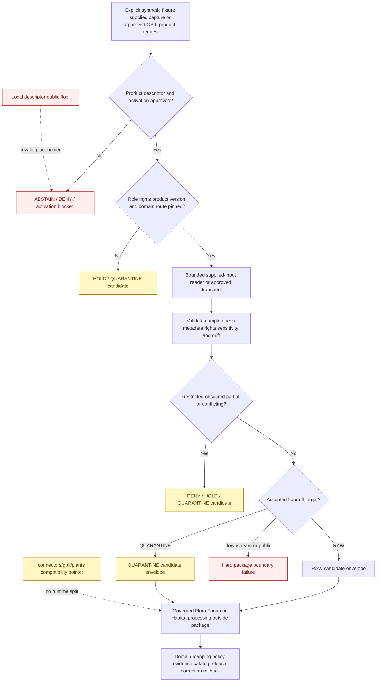

<!-- [KFM_META_BLOCK_V2]
doc_id: kfm://doc/connectors-gbif-src-package-readme
title: connectors/gbif/src/gbif/ — GBIF Connector Package Scaffold
type: readme
version: v0.2
status: draft
owners: OWNER_TBD — Connector steward · GBIF source steward · Biodiversity steward · Flora steward · Fauna steward · Habitat steward · Taxonomy steward · Rights reviewer · Privacy/sensitivity reviewer · Security reviewer · Packaging steward · Validation steward · Docs steward
created: 2026-06-18
updated: 2026-07-11
policy_label: public-doctrine; source-admission; greenfield; per-dataset-rights; geoprivacy-gated; product-specific-roles; no-live-by-default; no-secrets; raw-or-quarantine-candidate-only; no-publication
proposed_path: connectors/gbif/src/gbif/README.md
truth_posture: CONFIRMED package scaffold with empty __init__.py plus placeholder fetch.py and descriptor.yaml / executable package behavior ABSENT / packaging incomplete / package-local public sensitivity placeholder INVALID / product-specific descriptors and roles UNRESOLVED / source NOT ACTIVATED / tests ABSENT / live testing NOT APPROVED / CI UNKNOWN
related:
  - ../../README.md
  - ../README.md
  - ../../pyproject.toml
  - ../../plants/README.md
  - ../../tests/README.md
  - __init__.py
  - fetch.py
  - descriptor.yaml
  - ../../../../docs/sources/catalog/gbif/README.md
  - ../../../../docs/sources/catalog/gbif/occurrence-api.md
  - ../../../../docs/sources/catalog/gbif/async-download.md
  - ../../../../docs/sources/catalog/gbif/dataset-metadata.md
  - ../../../../docs/sources/catalog/gbif/backbone-taxonomy.md
  - ../../../../docs/sources/catalog/gbif.md
  - ../../../../docs/domains/fauna/README.md
  - ../../../../docs/domains/flora/README.md
  - ../../../../docs/domains/flora/CANONICAL_PATHS.md
  - ../../../../docs/domains/habitat/README.md
  - ../../../../data/registry/sources/
  - ../../../../data/raw/fauna/
  - ../../../../data/raw/flora/
  - ../../../../data/raw/habitat/
  - ../../../../data/quarantine/fauna/
  - ../../../../data/quarantine/flora/
  - ../../../../data/quarantine/habitat/
  - ../../../../schemas/contracts/v1/source/
  - ../../../../policy/sensitivity/
  - ../../../../policy/rights/
  - ../../../../release/
tags: [kfm, connectors, gbif, python-package, biodiversity, darwin-core, dwca, occurrence, specimen, taxonomy, backbone, rights, geoprivacy, source-admission, raw, quarantine, governance]
notes:
  - "Repository inspection confirms this package contains this README, an empty __init__.py, a one-line fetch.py placeholder, and a placeholder descriptor.yaml; no client, product dispatcher, parser, rights adapter, sensitivity classifier, handoff builder, or error implementation is proved."
  - "The project metadata contains only project name kfm-connector-gbif and version 0.0.0; no build backend, package discovery, supported Python version, dependencies, entry points, test configuration, install evidence, or stable import API is present."
  - "The package-local descriptor has role and rights set to TBD and sensitivity_floor set to public. GBIF rights are dataset-specific and occurrence sensitivity can be elevated, so the public value is an unsafe placeholder, never an activation or public-safe decision."
  - "Occurrence API, async download, dataset metadata, Backbone Taxonomy, aggregate products, and modeled assets are distinct product surfaces with distinct replay, role, rights, versioning, and validation requirements."
  - "The plants child is a documentation-only compatibility pointer. Shared GBIF source access and product behavior remain in this package; Flora-, Fauna-, and Habitat-specific interpretation remains downstream."
  - "No accepted product-specific SourceDescriptor, SourceActivationDecision, current access contract, executable fixture suite, live-test approval, or passing CI evidence is proved."
[/KFM_META_BLOCK_V2] -->

<a id="top"></a>

# GBIF Connector Package Scaffold

> Evidence-grounded package boundary for a possible Global Biodiversity Information Facility source-admission adapter. The current package is a behaviorless scaffold. It does **not** provide an approved GBIF client, download worker, Darwin Core parser, rights decision engine, taxonomy authority, sensitivity transform, lifecycle writer, or publication path.

<p>
  
  
  
  
  
  
  
</p>

`connectors/gbif/src/gbif/`

> [!IMPORTANT]
> **Confirmed state:** this package contains this README, an empty `__init__.py`, a one-line `fetch.py` placeholder, and a placeholder `descriptor.yaml`. No implemented configuration model, product dispatcher, HTTP client, async-job worker, dataset-metadata reader, DwC-A reader, occurrence parser, Backbone resolver, rights adapter, sensitivity detector, handoff builder, error taxonomy, executable package tests, or passing CI evidence is confirmed. The adjacent `pyproject.toml` is incomplete. Treat every proposed module, interface, product key, outcome, command, and lifecycle target below as a future requirement—not current behavior.

> [!CAUTION]
> `descriptor.yaml` contains `role: TBD`, `rights: TBD`, and `sensitivity_floor: public`. GBIF records inherit rights from originating datasets, can carry restricted-use conditions, and can expose rare or otherwise sensitive locations. **The local `public` value is an unsafe placeholder. It must not be loaded as source authority, used as a permissive runtime default, inherited by plant or animal records, or asserted in tests as a valid public-safety result.**

**Quick jumps:** [Purpose](#purpose) · [Verified repository state](#verified-repository-state) · [Evidence ledger](#evidence-ledger) · [Package authority boundary](#package-authority-boundary) · [Blocking drift](#blocking-drift) · [Package invariants](#package-invariants) · [Product decomposition](#product-decomposition) · [Source-role boundary](#source-role-boundary) · [Access and input posture](#access-and-input-posture) · [Configuration contract](#configuration-contract) · [Rights license and citation](#rights-license-and-citation) · [Sensitivity and geoprivacy](#sensitivity-and-geoprivacy) · [Taxonomic anchoring and drift](#taxonomic-anchoring-and-drift) · [Temporal replay and correction boundaries](#temporal-replay-and-correction-boundaries) · [Darwin Core and metadata preservation](#darwin-core-and-metadata-preservation) · [Transport pagination jobs and archive bounds](#transport-pagination-jobs-and-archive-bounds) · [Finite outcomes](#finite-outcomes) · [Lifecycle and handoff boundary](#lifecycle-and-handoff-boundary) · [Proposed implementation shape](#proposed-implementation-shape) · [Packaging and import contract](#packaging-and-import-contract) · [Testing relationship](#testing-relationship) · [Implementation sequence](#implementation-sequence) · [Activation gates](#activation-gates) · [Review and rollback](#review-and-rollback) · [Definition of done](#definition-of-done) · [Verification backlog](#verification-backlog)

---

## Purpose

`connectors/gbif/src/gbif/` is reserved for one shared, source-first Python package that may eventually prepare governed GBIF source-admission candidates for multiple downstream domains.

When implementation exists, this package may:

- expose a small, side-effect-free Python API;
- validate explicit configuration supplied by a caller;
- require accepted product-specific SourceDescriptors and activation decisions before consequential behavior;
- distinguish synchronous occurrence search, asynchronous occurrence downloads, dataset metadata, Backbone Taxonomy, aggregate products, and modeled assets;
- accept an explicit synthetic fixture, supplied response, supplied archive, or separately approved live transport;
- preserve dataset, publisher, institution, license, citation, DOI, source-role, taxonomic-version, temporal, spatial, uncertainty, and completeness metadata;
- enforce bounded requests, pagination, polling, downloads, archive extraction, parsing, retries, and memory use;
- detect unknown rights, restricted-use datasets, sensitive or obscured records, product-role conflicts, schema drift, taxonomy drift, partial capture, and unsafe lifecycle targets;
- return finite blocked, denied, abstained, held, error, RAW-candidate, or QUARANTINE-candidate results under accepted contracts;
- remain fully testable with synthetic fixtures and no network.

This package must never become:

- canonical occurrence, specimen, population, absence, range, conservation-status, or habitat truth;
- final taxonomic authority for Flora, Fauna, or Habitat;
- a mechanism for recovering withheld or obscured locations;
- source-registry, rights, sensitivity, policy, evidence, catalog, release, or publication authority;
- a plant-only, animal-only, or habitat-only fork of GBIF source access;
- a store for source payloads, credentials, private datasets, restricted locations, or lifecycle records;
- a writer to WORK, PROCESSED, CATALOG, TRIPLET, PROOF, RECEIPT, RELEASE, PUBLISHED, API, map, graph, report, search, or generated-answer surfaces.

[Back to top ↑](#top)

---

## Verified repository state

The following scaffold is confirmed on the repository's default branch at the time of this update:

```text
connectors/gbif/
├── README.md
├── pyproject.toml
├── plants/
│   └── README.md                     # documentation-only compatibility pointer
├── src/
│   ├── README.md
│   └── gbif/
│       ├── README.md                 # this package contract
│       ├── __init__.py               # empty file
│       ├── descriptor.yaml           # role/rights TBD; unsafe public floor
│       └── fetch.py                  # one-line greenfield placeholder
└── tests/
    └── README.md                     # documentation only
```

### Current maturity

| Surface | Confirmed content | Maturity |
|---|---|---:|
| `src/gbif/README.md` | This package boundary. | **DOCUMENTED** |
| `src/gbif/__init__.py` | Empty file. | **IMPORT-SHAPED / BEHAVIOR ABSENT** |
| `src/gbif/fetch.py` | Comment-only greenfield placeholder. | **PLACEHOLDER / NON-EXECUTABLE** |
| `src/gbif/descriptor.yaml` | `name: gbif`, `role: TBD`, `rights: TBD`, `sensitivity_floor: public`. | **PLACEHOLDER / UNSAFE DEFAULT** |
| `pyproject.toml` | Project name `kfm-connector-gbif` and version `0.0.0` only. | **INCOMPLETE** |
| Build backend and package discovery | None confirmed. | **ABSENT** |
| Supported Python versions and dependencies | None confirmed. | **ABSENT** |
| Stable public package API | None confirmed. | **ABSENT** |
| Product dispatcher | None confirmed. | **ABSENT** |
| Occurrence API transport | None confirmed. | **ABSENT** |
| Async-download worker | None confirmed. | **ABSENT** |
| Dataset metadata and license handling | Documentation exists; implementation absent. | **PROPOSED / UNBOUND** |
| DwC/DwC-A parsing | None confirmed. | **ABSENT** |
| Backbone version handling | Documentation exists; implementation absent. | **PROPOSED / UNBOUND** |
| Sensitivity/geoprivacy detection | Doctrine exists; implementation absent. | **PROPOSED / UNBOUND** |
| Connector-local executable tests | None confirmed. | **ABSENT** |
| Accepted product-specific SourceDescriptors | None found or verified. | **ABSENT / NEEDS VERIFICATION** |
| Source activation | No approved activation evidence found. | **NOT ACTIVATED** |
| Live tests | None confirmed or approved. | **ABSENT / NOT APPROVED** |
| Passing CI evidence | None confirmed. | **UNKNOWN / ABSENT** |

> [!CAUTION]
> An empty initializer and a source-catalog profile can make this package look mature. They do not prove installation, supported imports, endpoint compatibility, license enforcement, archive safety, taxonomy replayability, sensitivity handling, activation, or test coverage.

[Back to top ↑](#top)

---

## Evidence ledger

| Evidence | Status | What it supports | What it does not support |
|---|---:|---|---|
| `connectors/gbif/src/gbif/README.md` | **CONFIRMED** | A package-level governance boundary exists. | Executable behavior. |
| `__init__.py` | **CONFIRMED empty** | A possible package namespace was scaffolded. | A stable API, installability, or import safety. |
| `fetch.py` | **CONFIRMED placeholder** | A future source-input responsibility was anticipated. | Approved network access, retries, pagination, jobs, downloads, or persistence. |
| `descriptor.yaml` | **CONFIRMED unsafe placeholder** | Package-local metadata was anticipated. | Canonical source authority, resolved roles/rights, safe sensitivity, or activation. |
| `../../pyproject.toml` | **CONFIRMED placeholder** | Distribution name and version are recorded. | Build/install behavior, dependencies, Python support, discovery, or tests. |
| `../../plants/README.md` | **CONFIRMED v0.2 compatibility pointer** | Plant-specific source access must remain shared in this parent package under the current posture. | Implemented plant filtering or active Flora ingest. |
| `../../tests/README.md` | **CONFIRMED documentation** | No-network, rights, provenance, version, and boundary-test intentions exist. | Executable tests, accepted live-test variables, or passing results. |
| GBIF source-family and product pages | **CONFIRMED draft documentation** | Occurrence API, async download, dataset metadata, and Backbone are distinct products with different trust and replay properties. | Current endpoint compatibility or accepted runtime contracts. |
| `docs/sources/catalog/gbif.md` | **CONFIRMED draft source profile** | GBIF is an occurrence aggregator and taxonomic crosswalk with per-dataset rights and sensitivity gates. | Source activation or implemented policy. |
| Flora canonical-path documentation | **CONFIRMED doctrine-derived register** | `connectors/gbif/` is the shared source connector; domain interpretation belongs downstream. | Final taxonomy authority ordering or active Flora routes. |
| Package-local file inventory | **CONFIRMED for inspected state** | The package contains only documentation, an empty initializer, and placeholders. | Permanent absence of future files. |

[Back to top ↑](#top)

---

## Package authority boundary

```text
THIS PACKAGE MAY EVENTUALLY:
  validate explicit configuration
  dispatch an accepted GBIF product
  perform bounded approved transport or consume supplied fixtures
  parse source-shaped GBIF / Darwin Core material
  preserve product, dataset, rights, citation, version, and uncertainty metadata
  detect restricted, obscured, incomplete, drifted, or unsafe inputs
  return finite outcomes and RAW / QUARANTINE candidate envelopes

THIS PACKAGE MUST NOT:
  assign canonical biodiversity truth
  decide final taxonomy or conservation status
  recover exact sensitive locations
  create source or activation authority
  make rights or public-safety decisions
  perform Flora / Fauna / Habitat domain interpretation
  publish, release, catalog, prove, or directly persist lifecycle records
```

The package ends at the source-admission edge. It may preserve evidence needed by downstream systems, but it cannot substitute for those systems.

[Back to top ↑](#top)

---

## Blocking drift

Executable work must expose unresolved blockers rather than hide them behind permissive defaults.

| Blocker | Confirmed gap or conflict | Required package posture |
|---|---|---|
| Packaging | No build backend, discovery, Python support, dependencies, entry points, or stable public API. | Do not claim installability or supported import behavior. |
| Local descriptor | Role and rights are `TBD`; sensitivity floor is `public`. | Reject as authority; require accepted external product descriptors. |
| Product identity | Occurrence API, async download, metadata, Backbone, aggregates, and modeled assets differ materially. | Require explicit closed product dispatch; no umbrella parser. |
| Product source roles | Occurrences, specimens, metadata, taxonomy, aggregates, and modeled assets use different roles. | Require product/dataset-specific roles; reject family-wide defaults and role upgrades. |
| Per-dataset rights | GBIF aggregates independently licensed and sometimes additionally restricted datasets. | Preserve rights at actual dataset/record granularity; unknown or conflicting rights fail closed. |
| Occurrence API replay | Synchronous results can change and do not inherently supply a download DOI. | Preserve query, pagination, retrieval, and response evidence; do not claim publication-grade replayability. |
| Async download | Credential, predicate, polling, terminal-state, retention, checksum, and archive behavior is unimplemented. | No live job submission; fixture/supplied-archive tests first. |
| Dataset metadata | License, citation, publisher, DOI, restrictions, and update semantics are unimplemented. | No release-bound candidate without complete source context. |
| DwC / DwC-A | Field, encoding, delimiter, archive, extension-table, and version behavior is unverified. | No best-effort parsing; schema and archive drift must be visible. |
| Backbone version | Concept identity, snapshot/version discovery, rotation, taxon-key stability, and correction behavior are unimplemented. | Require explicit version context; never silently resolve against “latest.” |
| Taxonomy authority order | GBIF, ITIS, USDA PLANTS, NatureServe, and local authorities can disagree. | Preserve all source identifiers; keep tie-breaking downstream. |
| Sensitive records | Rare, protected, obscured, steward-controlled, nest/den/roost, cultural, or private-location records require policy. | Preserve restrictions and fail closed; no exact-location release transform here. |
| Join-induced sensitivity | Public metadata can become harmful when joined with roads, parcels, access, ownership, or cultural-use context. | Do not perform cross-source joins in the connector. |
| Handoff contract | No binding connector-result or RAW/QUARANTINE envelope is selected. | Do not invent an authoritative envelope or write lifecycle stores. |
| Tests | Test lane contains documentation only. | Do not claim parser, rights, sensitivity, replay, or boundary coverage. |
| Live tests | No marker, variable, credentials, endpoint contract, or approval exists. | No live-test implementation or command. |
| CI | No connector-specific workflow or passing run is confirmed. | No passing badge or merge-enforcement claim. |

These blockers are safety and evidence requirements, not inconveniences to mock away.

[Back to top ↑](#top)

---

## Package invariants

Any future implementation must preserve all of these invariants:

1. **No side effects on import.** Import performs no network access, DNS, secret reads, filesystem writes, logging configuration, environment mutation, cache initialization, registry mutation, policy evaluation, or source activation.
2. **No live behavior by default.** Synthetic fixtures or explicit supplied captures are the default paths until live access is independently approved.
3. **One product at a time.** Product identity is explicit and closed; no URL-, filename-, content-type-, or field-guess dispatch.
4. **Descriptor-driven activation.** The package consumes accepted source authority; it does not create it.
5. **Product roles remain fixed.** Parsing cannot upgrade administrative taxonomy, aggregate counts, or modeled ranges into observed occurrences.
6. **Per-dataset rights remain attached.** A provider-wide license assumption is forbidden.
7. **Rights, sensitivity, source role, evidence, and release remain separate gates.** Clearing one never clears another.
8. **Source obscuration remains intact.** The package never reverses, enriches, or guesses withheld coordinates or fields.
9. **No sensitive logging.** Exact sensitive coordinates, source rows, collector contact data, restricted fields, credentials, predicates containing private geometry, and payload excerpts stay out of logs and errors.
10. **No connector-owned credentials.** Passwords, tokens, account sessions, cookies, API keys, or keychain access remain external.
11. **No taxonomy sovereignty.** The package preserves taxonomic evidence and versions but does not decide the final KFM taxon.
12. **No biological absence inference.** Empty or filtered results do not prove absence or survey non-detection.
13. **No current-presence inference from specimens.** Historical collection evidence retains its event date and basis.
14. **No cross-source joins.** Taxonomy, status, parcel, access, infrastructure, and cultural joins are downstream responsibilities.
15. **No publication transform.** Redaction, generalization, aggregation, evidence closure, release, correction, and rollback remain downstream.
16. **Finite outcomes only.** Every operation ends in a bounded, reviewable result; no silent partial success.
17. **RAW or QUARANTINE candidate only.** The package does not persist lifecycle stores.
18. **No false replayability claim.** A query hash or response digest does not equal a citable GBIF Download DOI.
19. **No false public-safety claim.** Public availability, a license string, coordinate rounding, or a taxon name does not automatically make a record safe to release.
20. **No consumer-domain fork.** Flora, Fauna, and Habitat consume lineage-preserving candidates from one shared GBIF source package.

[Back to top ↑](#top)

---

## Product decomposition

GBIF is one source family with multiple materially different products. The labels below are descriptive documentation terms, not accepted runtime enum values.

| Product surface | Source meaning | Minimum future package behavior | Forbidden shortcut |
|---|---|---|---|
| Synchronous occurrence API | Query-time, paginated occurrence search; mutable over time and not inherently DOI-pinned. | Preserve normalized query, retrieval time, pagination evidence, response digest, product identity, and dataset metadata references. | Treating a current API response as replay-stable publication evidence. |
| Asynchronous occurrence download | Predicate-defined bulk subset with job lifecycle, downloadable archive, and download citation identity when supplied. | Preserve request/predicate digest, job state, download identity/DOI, checksum, content size, archive structure, dataset composition, and completion evidence. | Treating job submission as capture completion or ignoring failed/partial terminal states. |
| Dataset metadata | Publisher, institution, license, citation, DOI, rights holder, restrictions, update, and provenance context. | Fetch or consume metadata before release-bound admission; preserve conflicts and missing fields. | Treating metadata as an occurrence or assuming one license covers every record. |
| Backbone Taxonomy | Versioned administrative taxonomic anchor/crosswalk. | Preserve concept identity, snapshot/version, taxon keys, accepted-name references, status, and drift. | Emitting Backbone rows as occurrences or silently resolving against the latest version. |
| Aggregate occurrence product | Roll-up over a named geometry and time scope. | Preserve aggregation unit, time window, method, counts, source composition, and role. | Downscaling an aggregate into point or site-level truth. |
| Modeled range or suitability asset | Model-derived geographic context hosted or referenced through a GBIF-related surface. | Preserve modeled role, model identity, run/version reference, uncertainty, and source asset identity. | Upgrading a range model to observed presence. |
| Unknown or combined surface | Product identity, rights, roles, formats, and replay guarantees are unresolved. | Reject, hold, or quarantine with an actionable unsupported-product result. | Best-effort parsing or provider-wide activation. |

Every product requires independent review of source role, authority, access method, rights, sensitivity, versioning, completeness, fixtures, tests, and activation.

[Back to top ↑](#top)

---

## Source-role boundary

The provider family may be described as an aggregator, but KFM's canonical source-role value must be assigned to the specific admitted artifact.

| Artifact | Expected role posture | Required distinction |
|---|---|---|
| Preserved specimen record | Usually `observed`, subject to accepted descriptor. | A collection event is evidence at its collection time, not current presence. |
| Field or community observation | Usually `observed`, subject to accepted descriptor and source caveats. | Preserve identification confidence, verification state, and source quality. |
| Dataset metadata | `administrative`. | Metadata describes a dataset; it is not occurrence evidence. |
| Backbone Taxonomy | `administrative`. | Taxonomic anchor/crosswalk; no event or locality. |
| Aggregated counts or cells | `aggregate`. | Aggregation unit and time scope are mandatory. |
| Modeled range/suitability | `modeled`. | Model/run evidence and uncertainty remain attached. |
| Unresolved record/product | Blocked or candidate under an accepted contract. | No permissive default. |

Future code must:

- require accepted product- and dataset-specific SourceDescriptors;
- preserve the exact assigned role and role authority;
- reject absent, ambiguous, umbrella, or incompatible roles;
- never upgrade or downcast roles during parsing, validation, handoff, or promotion;
- distinguish source observation, specimen, administrative metadata, taxonomic anchor, aggregate, and model output;
- preserve `basisOfRecord`, occurrence status, identification qualifiers, source caveats, aggregation scope, and model references where supplied;
- require a reviewed descriptor revision or correction record for any role correction.

No generic `gbif -> observed` constant is safe.

[Back to top ↑](#top)

---

## Access and input posture

### Current safe posture

The package has no implemented client and no approved live access contract.

```text
network access: disabled
GBIF account access: disabled
credential discovery: forbidden
background polling or download jobs: forbidden
input: explicit synthetic fixture, supplied response, or supplied archive
persistence: none by default
output: finite blocked/held/error result or accepted RAW/QUARANTINE candidate
```

`fetch.py` is a placeholder filename, not proof that fetching is implemented or approved.

### Future access modes

A reviewed implementation may support separately activated modes such as:

- supplied occurrence-API response;
- supplied DwC-A archive;
- supplied dataset-metadata document;
- supplied Backbone snapshot metadata;
- approved synchronous API transport;
- approved asynchronous download transport;
- approved metadata and Backbone lookup transport.

Each live mode requires explicit product identity, source activation, host allowlisting, current terms review, credential architecture where needed, limits, retention, logging controls, fixtures, tests, and rollback.

### Prohibited access behavior

- guessed or undocumented endpoints;
- implicit environment-variable credential reads;
- home-directory, browser, keychain, or config-file account discovery;
- provider-wide crawling;
- unbounded pagination or polling;
- hidden retries or fallback to a different product surface;
- automatic fixture refresh;
- accepting a URL, DOI, dataset key, or provider label as activation evidence;
- treating HTTP success as rights, sensitivity, completeness, or publication approval;
- importing source data during package import, test collection, or documentation build;
- hidden persistence, caches, retry queues, or temporary archives.

[Back to top ↑](#top)

---

## Configuration contract

Once binding contracts are selected, a package operation should require explicit values equivalent to:

- canonical source descriptor reference;
- SourceActivationDecision reference;
- exact product key;
- source family and source ID;
- access mode: supplied fixture/capture or separately approved live transport;
- request/query/predicate specification and normalized digest where applicable;
- dataset allowlist or explicit dataset scope;
- domain route candidates: Flora, Fauna, Habitat, or another accepted consumer;
- source role and role authority from the accepted descriptor;
- rights/license/citation metadata requirements;
- sensitivity/restricted-record handling reference;
- Backbone concept and snapshot/version reference where applicable;
- expected content type, format, encoding, compression, and schema/version;
- expected checksum, content length, page count, record count, or archive manifest where known;
- timeout, retry, redirect, rate-limit, pagination, polling, job-duration, download-size, archive, row, memory, and processing limits;
- explicit credential-provider reference for approved modes, never raw credentials in config;
- temporary-storage and cleanup instructions owned by orchestration/runtime;
- intended lifecycle target of QUARANTINE or, only when every admission gate closes, RAW.

Required behavior:

- reject missing or ambiguous product, source, role, dataset, rights, version, or lifecycle identity;
- reject missing descriptor or activation evidence for live or real-input paths;
- reject unknown, mixed, unsupported, or non-admitted products;
- reject product/role/authority mismatches;
- reject release-bound candidates with missing dataset citation or rights context;
- keep synthetic/test configuration unable to fall through to live access;
- never dispatch from URL, filename, extension, first row, content type, or provider label alone;
- document no endpoint, variable, credential convention, marker, or live command as accepted until implementation and review establish it.

Field names and envelope shapes remain unaccepted until source, connector-result, and handoff contracts are selected.

[Back to top ↑](#top)

---

## Rights, license, and citation

GBIF aggregates records from many originating datasets. Rights must remain attached at the actual source granularity.

Future code should preserve, where supplied:

- dataset key, title, publisher, and publishing organization;
- originating institution and collection;
- rights holder;
- raw license value and normalized license interpretation;
- citation and attribution text;
- dataset DOI or citation identifier;
- GBIF Download DOI for a bulk subset;
- source references and distribution identity;
- additional use restrictions, embargoes, or withholding notes;
- rights-review state and policy reference;
- retrieval time and terms snapshot reference where required by the accepted descriptor.

Package posture:

| Rights condition | Required package behavior |
|---|---|
| License and citation complete | Preserve them; continue only if descriptor and policy references permit. |
| Attribution required | Preserve exact source attribution and dataset citation. |
| Share-alike or derivative conditions present | Flag for downstream release review; do not interpret compatibility locally. |
| Additional dataset-specific restrictions present | Preserve and elevate them; generic license parsing cannot override them. |
| License missing, unknown, conflicting, or unparseable | `DENY`, `ABSTAIN`, `HOLD`, or QUARANTINE candidate. |
| Dataset identity or publisher missing | No release-bound candidate. |
| Per-record and dataset-level rights disagree | Preserve both and route to review. |

The package may parse and carry rights metadata. It does not decide legal sufficiency, fair use, redistribution, derivative compatibility, or public release.

[Back to top ↑](#top)

---

## Sensitivity and geoprivacy

Public availability does not make every GBIF record safe to redistribute or join.

### Sensitive or restricted classes

- rare, imperiled, protected, or steward-controlled taxa;
- nest, den, roost, hibernaculum, spawning, breeding, collection, seed-source, or small-population locations;
- records already obscured, rounded, generalized, withheld, embargoed, or marked sensitive upstream;
- culturally or sovereignty-sensitive plant, animal, or habitat knowledge;
- collector, observer, contact, permit, landowner, or private-property context;
- exact locations joined with parcels, roads, trails, access points, infrastructure, ownership, or harvesting/use information;
- records whose sensitivity cannot be evaluated;
- combinations of ordinary fields that create actionable location intelligence.

### Required package posture

1. Preserve source obscuration, uncertainty, withholding, precision, and restriction markers.
2. Never reconstruct, reverse-geocode, snap, enrich, or guess an exact sensitive coordinate.
3. Preserve source geometry separately from any downstream transformed geometry.
4. Route unresolved sensitivity to denial, abstention, hold, or quarantine.
5. Keep sensitive coordinates and fields out of logs, errors, metrics, fixtures, examples, and ordinary result objects.
6. Do not perform public redaction, generalization, masking, aggregation, or differential privacy inside the connector.
7. Do not rely on map styling, zoom thresholds, hidden layers, CSS, or client filters as protection.
8. Recalculate sensitivity downstream after material joins.
9. Keep generated summaries, embeddings, search indexes, and AI outputs subject to the same location restrictions.
10. Preserve correction and rollback references when a source restriction or taxon sensitivity changes.

The package may detect and flag sensitive classes. It cannot certify a record as public-safe.

[Back to top ↑](#top)

---

## Taxonomic anchoring and drift

The package preserves taxonomic evidence; it does not decide final taxonomy.

Repository documentation currently distinguishes:

- ITIS as a proposed first-line U.S. anchor in some biodiversity workflows;
- the GBIF Backbone as a versioned international crosswalk/second-line anchor;
- USDA PLANTS as a proposed plant authority in Flora documentation;
- NatureServe, state, herbarium, and local authorities that may disagree with GBIF;
- source-supplied identifications that must remain inspectable even after reconciliation.

Future package behavior should:

- preserve source `scientificName`, verbatim name, rank, taxonomic status, identification qualifier, and identification references where supplied;
- preserve GBIF taxon keys, accepted-name keys, parent keys, and source taxon identifiers where supplied;
- preserve the Backbone concept identity and the exact snapshot/version used;
- distinguish taxon lookup from occurrence parsing;
- preserve synonyms, unresolved names, higher-rank matches, and disagreement evidence;
- emit reviewable drift when names, keys, ranks, parents, synonym status, or accepted concepts change;
- keep prior snapshot references immutable and inspectable;
- abstain or hold when no accepted anchor resolves;
- leave GBIF-versus-ITIS, USDA PLANTS, NatureServe, and local tie-breaking downstream.

### Anti-collapse rules

- Backbone taxonomy is `administrative`, not occurrence evidence.
- A taxon key without version context is not replayable taxonomic evidence.
- A taxonomic rename is not a new occurrence or disappearance.
- A synonym merge does not silently merge occurrence identities.
- A plant-only or animal-only filter does not create a new taxonomy authority.
- A current Backbone resolution must not overwrite the historical resolution used by an earlier capture.

[Back to top ↑](#top)

---

## Temporal, replay, and correction boundaries

Keep these time and replay concepts distinct:

| Concept | Meaning | Package guardrail |
|---|---|---|
| Event or collection time | When an organism was observed, collected, or sampled. | Preserve source precision and uncertainty; do not replace with retrieval time. |
| Identification time | When a record was identified or reidentified. | A reidentification is not a new biological event. |
| Source-record modification time | When the upstream record changed. | Preserve separately from event time. |
| Dataset publication/update time | When the dataset or distribution changed. | Preserve for staleness and version review. |
| API retrieval time | When a synchronous response was obtained. | Required; API results can change between calls. |
| Async job submission/completion time | When a bulk request entered and left the source job lifecycle. | Preserve both; submission does not equal successful capture. |
| Download DOI or subset identity | Citation identity for a completed bulk subset when supplied. | Preserve independently from the Backbone DOI and dataset citations. |
| Backbone snapshot/version time | Taxonomic frame used for resolution. | Version drift is taxonomy drift, not occurrence time. |
| KFM release time | When a downstream derivative was released. | Outside package authority. |
| Correction/supersession time | When source or KFM evidence was corrected or replaced. | Never silently overwrite prior evidence. |

### Synchronous API replay posture

A synchronous API response is not inherently replay-stable. Future capture metadata should include:

- normalized request/query specification and digest;
- retrieval timestamp;
- requested and received page ranges;
- response and page digests;
- ETag or Last-Modified when supplied;
- total/count/end-of-records indicators where supplied;
- duplicate, gap, partial, and retry evidence;
- dataset composition and metadata references;
- Backbone snapshot/version context;
- explicit `source_surface` or equivalent product identity.

A cached response or digest is evidence of what KFM received. It does not mint a GBIF Download DOI or independently authorize publication.

### Correction posture

- upstream record changes produce new source states rather than silent mutation;
- dataset withdrawal or license change must remain visible;
- Backbone rotation must not invalidate prior receipts by rewriting them;
- material changes to coordinates, taxon identity, rights, sensitivity, or dataset membership must trigger downstream review and possible invalidation;
- the package may emit correction/drift references but does not update released artifacts itself.

[Back to top ↑](#top)

---

## Darwin Core and metadata preservation

Parsers must preserve source meaning before downstream normalization.

### Source and product minimum

- canonical source ID and SourceDescriptor reference;
- product surface and access mode;
- SourceActivationDecision reference;
- source role and role authority;
- dataset key, title, publisher, institution, collection, and citation identity;
- download key and GBIF Download DOI where applicable;
- Backbone concept and snapshot/version reference;
- request/query/predicate identity and digest where applicable;
- retrieval/import timestamp, checksum, and connector/parser version;
- license, attribution, rights-holder, restriction, and review state;
- intended domain route and lifecycle target;
- drift, partial, restricted, obscured, quarantined, and review flags.

### Occurrence and specimen minimum

Preserve where supplied and permitted:

- source occurrence identifier;
- `basisOfRecord` or equivalent source class;
- institution, collection, and catalog identifiers;
- event/collection date and temporal precision;
- scientific name, verbatim name, taxon keys, accepted-name reference, rank, and taxonomic status;
- identification qualifier, confidence, verification status, issues, and source caveats;
- occurrence status, establishment means, life stage, sex, behavior, and cultivation/captive qualifiers without inference;
- individual count or quantity with units and semantics;
- locality and jurisdiction fields;
- decimal coordinates, geodetic datum, coordinate uncertainty, precision, georeference remarks, and issue flags;
- source-obscured, withheld, generalized, or restricted status;
- collector/observer fields only under accepted privacy handling;
- source field names, code values, null/unknown semantics, and unsupported-field evidence.

### Dataset and capture minimum

- dataset metadata retrieval state;
- expected and received pages, files, archive members, extension tables, rows, or records where available;
- accepted, rejected, quarantined, duplicate, and unresolved counts;
- archive manifest and extraction state;
- checksum and content-size verification;
- partial, truncated, interrupted, stale, or superseded state;
- unknown field, type, encoding, delimiter, code-list, schema, and taxonomic-version drift evidence.

Unknown fields may be preserved only through an accepted restricted passthrough contract. They must not be silently dropped, guessed into KFM semantics, or exposed publicly.

[Back to top ↑](#top)

---

## Transport, pagination, jobs, and archive bounds

Any future transport or supplied-input reader must be bounded and replaceable.

### HTTP and transport controls

- explicit host and scheme allowlist;
- explicit connect, read, total, and idle timeouts;
- bounded retries with documented retryable conditions;
- bounded redirects with host revalidation;
- response-size and decompression limits;
- content-type, encoding, and compression validation;
- rate-limit and backoff handling without infinite waits;
- redacted request and response errors;
- no credential values in URLs, logs, exceptions, metrics, or receipts;
- injectable transport for offline tests;
- no automatic persistence of response bodies.

### Occurrence API pagination controls

- explicit page size and maximum pages/records;
- stable normalized query across pages;
- expected offset/cursor progression;
- duplicate occurrence-ID detection;
- gap and inconsistent-total detection;
- end-of-records validation where supplied;
- page digest and retrieval evidence;
- no partial success when required pages fail;
- bounded recovery from rate limits and transient errors;
- drift outcome when pagination semantics change.

### Async-job controls

- explicit predicate and product descriptor;
- bounded submission and polling duration;
- bounded poll frequency and retry count;
- explicit terminal-state vocabulary under an accepted contract;
- no assumption that a job key means success;
- download identity, citation/DOI, size, checksum, and completion metadata required before capture success;
- failed, cancelled, expired, inaccessible, or inconsistent jobs return finite outcomes;
- no background daemon or unbounded polling in the package;
- credentials remain external and scoped to the approved action.

### DwC-A and archive controls

Required negative handling includes:

- archive larger than accepted byte limit;
- expanded size or compression ratio above limit;
- excessive member count or nesting;
- traversal paths, absolute paths, symlinks, hardlinks, devices, or special files;
- duplicate or conflicting member names;
- missing or malformed metadata/manifest files;
- unexpected delimiter, quote, escape, encoding, line ending, or field count;
- missing core table or broken extension-table references;
- checksum mismatch or truncated stream;
- unsupported archive or compression format;
- unknown required fields or incompatible schema version;
- formula-like, script-like, HTML, or executable content treated as active material;
- partial table success after another required table fails.

Source bytes remain inert data. The package must never execute archive contents, formulas, macros, scripts, or imported code.

[Back to top ↑](#top)

---

## Finite outcomes

Future package APIs and tests should use a small accepted result vocabulary. Exact names remain unbound until a connector-result contract is selected.

| Condition | Required safe behavior |
|---|---|
| Package behavior absent | Clear unavailable/not-implemented result; never false success. |
| Build or supported import contract absent | Do not claim package readiness or import coverage. |
| Canonical source or product descriptor missing | Activation blocked. |
| Package-local `sensitivity_floor: public` encountered | Hard placeholder-validation failure. |
| Activation decision missing | `ABSTAIN` or activation-blocked result. |
| Product identity missing, unknown, or mixed | Validation failure, `HOLD`, or QUARANTINE candidate. |
| Source role missing or conflicted | Activation block; no permissive default. |
| Dataset identity, publisher, citation, or rights context missing | Hold or quarantine; no release-bound candidate. |
| License or additional terms unknown/conflicting | `DENY`, `ABSTAIN`, `HOLD`, or QUARANTINE candidate. |
| Network requested under default configuration | Bounded disabled outcome. |
| Credential discovery or unsafe credential handling attempted | Hard security failure. |
| API pagination incomplete, duplicated, or inconsistent | Incomplete-capture quarantine. |
| API response lacks replay evidence required by the contract | `ABSTAIN`, `HOLD`, or non-release-bound candidate. |
| Async job not terminal-successful or download metadata incomplete | Finite failed/incomplete outcome. |
| Download checksum or content-size mismatch | Incomplete-capture quarantine. |
| Archive unsafe, malformed, oversized, or structurally incomplete | Reject or quarantine. |
| Dataset metadata unavailable | Rights/provenance block. |
| Backbone snapshot/version absent where anchoring occurs | Taxonomy-review or quarantine outcome. |
| Taxon key/name/rank/version drift | Reviewable taxonomy-drift result; no silent rewrite. |
| Sensitive, obscured, or restricted record detected | Restrict, hold, deny, or quarantine; never public-safe by default. |
| Attempt to recover exact withheld geometry | Hard sensitivity-boundary failure. |
| Aggregate emitted as point occurrence | Hard source-role failure. |
| Modeled asset emitted as observed occurrence | Hard source-role failure. |
| Specimen emitted as current presence | Hard temporal/semantic failure. |
| Empty result interpreted as biological absence | Hard evidence-boundary failure. |
| Sensitive value enters log, error, metric, snapshot, or ordinary output | Hard privacy failure. |
| Intended target beyond RAW or QUARANTINE | Hard authority-boundary failure. |
| Direct lifecycle or public write attempted | Hard failure. |
| Taxonomic, conservation-status, absence, range, legal, safety, or release determination requested | Refuse and route to governed domain/reviewer processes. |

Every error must be deterministic, finite, actionable, safe to log, and free of unnecessary source content.

[Back to top ↑](#top)

---

## Lifecycle and handoff boundary

The package participates only at the source-admission edge and performs no lifecycle write by itself.



The diagram defines responsibility boundaries. It does not prove transport, parsing, rights evaluation, sensitivity policy, taxonomy resolution, RAW storage, quarantine storage, domain pipelines, evidence closure, release, or cleanup.

KFM lifecycle discipline remains:

```text
RAW -> WORK / QUARANTINE -> PROCESSED -> CATALOG / TRIPLET -> PUBLISHED
```

The package may eventually construct an accepted candidate envelope. It must not persist source payloads or perform later transitions.

[Back to top ↑](#top)

---

## Proposed implementation shape

The confirmed package files are minimal:

```text
gbif/
├── README.md
├── __init__.py        # empty
├── descriptor.yaml    # placeholder, not authority
└── fetch.py           # one-line placeholder
```

A future shared product-oriented package might use a structure like:

```text
gbif/
├── README.md
├── __init__.py
├── config.py
├── products.py
├── transport.py
├── occurrence_api.py
├── async_download.py
├── dataset_metadata.py
├── backbone.py
├── dwc.py
├── dwca.py
├── rights_refs.py
├── sensitivity_flags.py
├── validate.py
├── handoff.py
└── errors.py
```

This tree is **PROPOSED**, not implementation evidence. Do not create it mechanically. A module should exist only when its responsibility, contract, product descriptor, owner, fixtures, tests, and review posture are accepted.

| Future module | Responsibility | Must not become |
|---|---|---|
| `config.py` | Explicit side-effect-free configuration and bounded limits. | Secret discovery, activation authority, or live fallback. |
| `products.py` | Closed product identifiers and product-specific requirements. | SourceDescriptor authority or consumer-domain routing policy. |
| `transport.py` | Replaceable bounded HTTP/download transport. | Parsing policy, rights decisions, or hidden credentials. |
| `occurrence_api.py` | Query normalization, bounded pagination, response capture metadata. | Publication evidence authority or biological absence logic. |
| `async_download.py` | Bounded job lifecycle and archive retrieval under approved access. | Background daemon, unbounded polling, or release authority. |
| `dataset_metadata.py` | Preserve dataset, publisher, license, citation, DOI, and restrictions. | Legal decision engine. |
| `backbone.py` | Preserve Backbone concept/snapshot identity and taxonomic drift. | Final taxonomic tie-breaker. |
| `dwc.py` | Deterministic Darwin Core field parsing and source-shape preservation. | Canonical domain-object mapping. |
| `dwca.py` | Bounded archive/manifest/table reading. | Arbitrary archive extraction or lifecycle storage. |
| `rights_refs.py` | Carry rights metadata and external decision references. | Policy or legal authority. |
| `sensitivity_flags.py` | Detect and preserve restricted, obscured, uncertain, or sensitive source signals. | Public redaction/generalization or safety certification. |
| `validate.py` | Product, role, completeness, checksum, pagination, schema, archive, and drift checks. | Domain truth, taxonomy authority, or release authority. |
| `handoff.py` | Build accepted finite results and RAW/QUARANTINE candidates. | Direct persistence, promotion, or publication. |
| `errors.py` | Small deterministic redacted error taxonomy. | Payload excerpts or unbounded exception detail. |

Do not create separate Flora, Fauna, or Habitat clients beneath this package. Consumer-domain adaptation belongs downstream.

[Back to top ↑](#top)

---

## Packaging and import contract

The current project metadata is insufficient to build, install, or publish a supported package.

Before this package is called installable or importable in a supported sense:

- declare a build backend;
- declare package discovery for the `src/` layout;
- declare supported Python versions;
- declare runtime and development dependencies;
- define versioning beyond `0.0.0`;
- define optional dependency groups for transport, archive, or tabular features where appropriate;
- define package-data policy and prohibit automatic authority-loading from `descriptor.yaml`;
- define the narrow public API exported from `__init__.py`;
- add clean-environment build, wheel, installation, and import tests;
- verify build artifacts exclude source payloads, real fixtures, credentials, private geometry, canonical descriptors, and lifecycle records;
- ensure imports perform no network, DNS, secret, filesystem, logging, environment, cache, registry, policy, or activation side effects;
- ensure optional product dependencies are imported only when required;
- ensure package errors and result types become stable only after connector contracts are accepted;
- test supported filesystems and environments for package-name and path consistency.

The package-local descriptor must not be imported automatically. It should be removed, converted to an unmistakable non-authoritative pointer/fixture, or validated as a rejected placeholder according to a reviewed packaging decision.

[Back to top ↑](#top)

---

## Testing relationship

Connector-local tests belong under `connectors/gbif/tests/`, but that directory currently contains documentation only.

No test dependency, executable test module, fixture set, collection configuration, accepted local command, live-test marker, environment-variable convention, CI job, coverage result, or passing status is confirmed.

> [!CAUTION]
> `KFM_ALLOW_LIVE_GBIF_TESTS` appears in the existing test README as an illustrative convention. It is **not accepted** by this package contract. No live-test flag, endpoint, credential mode, account, command, or CI job is approved.

Future tests should prove at least:

### Build and import safety

- clean build/install/import from a fresh environment;
- import performs no network, secret reads, file writes, logging mutation, environment mutation, cache initialization, registry mutation, policy evaluation, or activation;
- `descriptor.yaml` is not loaded as authority;
- the unsafe `public` floor is rejected;
- package artifacts contain no source payloads, credentials, private geometry, or canonical registry data.

### Product and role behavior

- explicit product dispatch;
- unknown and mixed products fail closed;
- Backbone and dataset metadata cannot become occurrence records;
- aggregates cannot become points;
- modeled assets cannot become observed;
- specimens cannot become current-presence claims;
- empty results cannot become absence claims.

### Rights and provenance

- missing dataset identity, publisher, license, citation, or restrictions fails closed;
- per-dataset rights remain attached;
- generic licenses cannot erase special restrictions;
- Download DOI, dataset citation, and Backbone version remain distinct;
- rights metadata never becomes a package-level legal conclusion.

### Transport and completeness

- no-network default;
- bounded API pagination with duplicate/gap/partial detection;
- bounded async polling and terminal-state handling;
- checksum, content-size, content-type, encoding, and redirect validation;
- archive traversal, zip-bomb, member-count, nested-archive, malformed-manifest, broken-table-reference, and partial-table failures;
- no partial success after required capture failure.

### Taxonomy and sensitivity

- Backbone snapshot/version is required where anchoring occurs;
- taxon drift is visible and prior versions remain inspectable;
- source-obscured coordinates remain obscured;
- restricted and sensitive records fail closed;
- exact-location recovery attempts fail;
- sensitive canaries never appear in logs, errors, metrics, snapshots, or ordinary outputs;
- join-induced sensitivity is not evaluated by connector-side cross-source joins.

### Handoff boundaries

- only accepted finite outcomes and RAW/QUARANTINE candidates are possible;
- every attempted WORK, PROCESSED, CATALOG, TRIPLET, PROOF, RECEIPT, RELEASE, PUBLISHED, API, map, graph, report, search, or generated-answer write fails;
- the `plants/` compatibility path cannot create a second package, descriptor, fixture, test, or activation path.

Fixtures must be synthetic, minimized, purpose-specific, clearly labeled, and free of real sensitive locations, collector contact data, restricted dataset rows, credentials, or private source material.

A future command such as:

```bash
python -m pytest connectors/gbif/tests
```

remains **PROPOSED** until packaging, dependencies, tests, fixtures, and the repository-standard runner exist and are demonstrated.

[Back to top ↑](#top)

---

## Implementation sequence

Implement in dependency order:

1. **Reconcile package documentation**
   - align parent, source-root, package, plants-pointer, and test READMEs;
   - keep the plant child documentation-only unless an ADR says otherwise.
2. **Resolve source registry and descriptor authority**
   - select canonical descriptor topology;
   - create product- and dataset-scoped descriptors where required;
   - remove or neutralize package-local descriptor authority;
   - make the unsafe public floor impossible to consume.
3. **Define product identities and roles**
   - independently specify occurrence API, async download, metadata, Backbone, aggregate, modeled, and unsupported products;
   - pin source roles, authority, version, rights, sensitivity, and completeness requirements.
4. **Resolve rights and restricted-use posture**
   - define per-dataset license/citation requirements;
   - preserve additional restrictions;
   - select external rights-decision interfaces.
5. **Resolve taxonomy and sensitivity boundaries**
   - define Backbone snapshot/version behavior;
   - preserve ITIS/USDA/NatureServe/local disagreements;
   - define restricted/obscured-record flags and downstream handoff.
6. **Complete packaging**
   - add build backend, discovery, Python support, dependencies, versioning, package-data policy, and narrow API;
   - prove clean build/install/import behavior.
7. **Select connector-result and handoff contracts**
   - define finite outcomes;
   - settle RAW versus QUARANTINE candidate requirements;
   - prohibit package persistence and direct downstream writes.
8. **Approve fixture governance**
   - create synthetic API pages, metadata documents, Backbone versions, and DwC-A archives;
   - include negative rights, sensitivity, pagination, archive, and drift cases;
   - prohibit real sensitive or restricted source rows.
9. **Implement import safety and explicit configuration**
   - no network, secrets, cache, registry, policy, or activation side effects;
   - bounded limits and no live fallback.
10. **Implement supplied-input product slices first**
    - dataset metadata;
    - Backbone metadata/version handling;
    - small synthetic occurrence pages;
    - synthetic DwC-A archive parsing.
11. **Add transport only after offline behavior passes**
    - bounded synchronous API transport;
    - bounded async job/download transport;
    - external credential provider where approved.
12. **Add rights, sensitivity, and drift references**
    - preserve external decisions and source signals;
    - do not implement policy or public transforms locally.
13. **Add accepted candidate handoff**
    - only after storage, lifecycle, rights, sensitivity, and cleanup review;
    - reject direct lifecycle and public writes.
14. **Integrate CI last**
    - prove clean local offline build and test commands first;
    - retain reviewable, sensitive-data-free run evidence;
    - do not upgrade badges, maturity, or activation claims prematurely.
15. **Consider live smoke testing only after explicit approval**
    - isolate it from the default suite;
    - keep it narrow, non-persistent, and independently reviewed.

[Back to top ↑](#top)

---

## Activation gates

No real GBIF input or live behavior should run until all applicable gates close:

- [ ] Parent, source-root, package, plants-pointer, and test documentation are aligned.
- [ ] Canonical GBIF source ID and source-registry topology are accepted.
- [ ] Product-specific and dataset-scoped SourceDescriptors exist where required.
- [ ] SourceActivationDecisions exist for each enabled product/scope.
- [ ] Package-local descriptor authority is removed or explicitly neutralized.
- [ ] The unsafe `sensitivity_floor: public` placeholder cannot affect runtime, package data, tests, or admission.
- [ ] Product-specific source roles and role authorities are accepted and covered by anti-collapse tests.
- [ ] Occurrence API, async download, dataset metadata, Backbone, aggregate, and modeled surfaces have independent contracts.
- [ ] Current source endpoints/access methods, terms, authentication needs, rate limits, and automation permissions are reviewed.
- [ ] Per-dataset rights, citation, attribution, additional restrictions, and conflict handling are accepted.
- [ ] Backbone concept/snapshot identity, rotation, taxon-key drift, and correction behavior are accepted.
- [ ] Taxonomy authority ordering and crosswalk responsibility remain downstream and documented.
- [ ] Rare, protected, obscured, steward-controlled, cultural, and exact-location handling is accepted and tested.
- [ ] Join-induced sensitivity and cross-domain routing contracts are accepted.
- [ ] Binding connector-result and RAW/QUARANTINE handoff contracts are selected.
- [ ] Temporary-file, cache, logging, metrics, retention, deletion, cleanup, and incident-response controls are defined.
- [ ] HTTP, pagination, polling, retry, redirect, download-size, archive, row, time, memory, and decompression limits are defined.
- [ ] Packaging metadata and clean build/install/import behavior are verified from a fresh environment.
- [ ] Synthetic no-network fixtures and executable tests pass.
- [ ] No credentials, private datasets, restricted locations, or real sensitive records are committed.
- [ ] Connector, source registry, rights, sensitivity, taxonomy, domain pipeline, evidence, catalog, and release responsibilities remain separate.
- [ ] Correction, derivative invalidation, withdrawal, rollback, cache invalidation, payload cleanup, and incident procedures are documented.
- [ ] CI evidence is reviewable before activation or maturity claims are upgraded.

Until then, this package remains a documentation-plus-placeholder scaffold and real/live behavior remains inactive.

[Back to top ↑](#top)

---

## Review and rollback

Review every package change as a source-role, per-dataset-rights, taxonomy-version, geoprivacy, archive-security, packaging, and lifecycle-boundary change.

A reviewer should confirm:

- implementation claims match the actual tree, package metadata, tests, and run evidence;
- imports remain side-effect free;
- source and activation authority remain external;
- package-local YAML cannot activate or classify the source;
- the unsafe public floor is rejected;
- product identity and source roles are explicit and closed;
- API, async download, metadata, Backbone, aggregate, and modeled surfaces remain distinct;
- dataset-level rights, citation, institution, and restrictions remain attached;
- synchronous API replay limits remain visible;
- Backbone snapshot/version and taxonomy disagreements remain visible;
- source obscuration and coordinate uncertainty remain intact;
- specimens are not current-presence claims and empty results are not absence claims;
- no sensitive coordinates, collector contacts, credentials, predicates, or payload excerpts leak through logs or errors;
- no connector code decides public redaction, final taxonomy, or release;
- output stops at finite results and accepted RAW/QUARANTINE candidates;
- the plants child remains documentation-only under the current posture;
- live testing remains absent unless separately approved.

Rollback is required if a change:

- claims implementation, installation, activation, rights clearance, sensitivity clearance, test coverage, live compatibility, or CI without evidence;
- adds import-time or default network, secret, filesystem, logging, environment, cache, registry, policy, or activation behavior;
- uses package-local descriptor YAML as canonical authority;
- accepts `sensitivity_floor: public` as valid;
- introduces provider-wide or consumer-domain-wide activation;
- flattens product roles or dataset rights;
- silently resolves taxonomy against the latest Backbone;
- treats API responses as DOI-pinned evidence;
- weakens pagination, polling, checksum, archive, or partial-capture controls;
- reconstructs or exposes sensitive locations;
- turns specimens into current presence, aggregates/models into observations, or empty results into absence;
- stores or logs sensitive coordinates, private fields, credentials, source rows, or restricted metadata;
- writes directly beyond an accepted RAW/QUARANTINE candidate boundary;
- emits public claims, maps, reports, graphs, search payloads, or generated answers;
- creates a duplicate plant-specific package, descriptor, fixture, test, or activation path.

Rollback procedure:

1. Revert the unsafe or misleading package change.
2. Restore the last verified no-network, no-secret, no-persistence, and no-public-write posture.
3. Remove or quarantine unapproved payloads, fixtures, logs, caches, package data, credentials, sensitive locations, or restricted records and assess repository-history exposure.
4. Revoke or rotate exposed credentials through the owning security system.
5. Move legitimate rights, sensitivity, taxonomy, domain, lifecycle, evidence, catalog, or release work to its correct responsibility lane.
6. Repair descriptors, activation decisions, package metadata, product mappings, configuration, workflows, test fixtures, documentation links, and generated templates.
7. Record source-role, rights, taxonomy, sensitivity, schema, packaging, test, or path drift in the appropriate register.
8. Trigger governed correction, invalidation, withdrawal, cleanup, and rollback for every affected downstream artifact.
9. Re-run the last verified clean offline build and test commands when they exist.
10. Correct README badges and maturity claims to match evidence.

[Back to top ↑](#top)

---

## Definition of done

This package is not complete merely because its boundary is documented.

- [x] The current package scaffold is documented accurately.
- [x] Empty `__init__.py`, placeholder `fetch.py`, placeholder `descriptor.yaml`, and incomplete `pyproject.toml` are distinguished from implementation.
- [x] The local `public` sensitivity floor is identified as unsafe.
- [x] Shared source-first package placement and the plant compatibility pointer are explicit.
- [x] Occurrence API, async download, dataset metadata, Backbone, aggregate, modeled, and unsupported products are separated.
- [x] Product-specific source-role boundaries are explicit.
- [x] Per-dataset rights, citation, and restriction preservation is explicit.
- [x] Rare/sensitive location, obscuration, and join-induced sensitivity boundaries are explicit.
- [x] Taxonomy anchoring, version, replay, and drift boundaries are explicit.
- [x] Pagination, job, archive, and completeness requirements are explicit.
- [x] RAW/QUARANTINE-candidate-only package authority is explicit.
- [ ] Parent connector, source-root, and test READMEs are updated to the same verified v0.2 posture.
- [ ] Canonical source-registry topology and product descriptors are accepted.
- [ ] Package-local descriptor is removed, neutralized, or converted to a reviewed non-authoritative pointer.
- [ ] Current access methods, endpoints, terms, credentials, rates, and automation permissions are reviewed.
- [ ] Product roles, authority, formats, versions, stable identifiers, and drift behavior are accepted.
- [ ] Rights, restricted-use, sensitivity, and geoprivacy decision interfaces are accepted.
- [ ] Backbone snapshot/version and taxon-correction behavior is accepted.
- [ ] Taxonomy authority ordering and domain crosswalk contracts are accepted.
- [ ] Build metadata and a stable side-effect-free import API exist.
- [ ] Configuration, product dispatch, transport, metadata, DwC/DwC-A, Backbone, validation, finite error, and handoff code exists.
- [ ] Synthetic fixture governance and fixture files exist.
- [ ] Executable build, import, product, rights, pagination, async-job, archive, taxonomy, sensitivity, logging, drift, and handoff tests exist and pass.
- [ ] A clean repository-standard build/test command is documented and reproducible.
- [ ] CI wiring and passing evidence exist.
- [ ] Any live smoke test is separately approved, isolated, non-persistent, reversible, and excluded from default execution.
- [ ] No package API creates canonical biodiversity truth, public-safety decisions, taxonomy conclusions, absence claims, or release artifacts.

[Back to top ↑](#top)

---

## Verification backlog

| Item | Status | Needed evidence |
|---|---:|---|
| Confirm the complete package inventory, including empty or generated files not visible to code search. | **NEEDS CONTINUOUS VERIFICATION** | Repository tree inspection. |
| Update parent GBIF connector, source-root, and test READMEs to verified scaffold state. | **NEEDS FOLLOW-UP** | Documentation reconciliation. |
| Confirm the plants child remains documentation-only or ratify a different disposition. | **OPEN DECISION** | ADR or accepted migration decision. |
| Resolve canonical source-registry topology. | **CONFLICTED / NEEDS VERIFICATION** | Registry ADR or migration note. |
| Create and approve product-specific and dataset-scoped SourceDescriptors. | **BLOCKED** | Source, role, rights, sensitivity, and steward review. |
| Create SourceActivationDecisions for every enabled product/scope. | **BLOCKED** | Accepted descriptors and activation workflow. |
| Remove or neutralize package-local descriptor authority. | **BLOCKED** | Packaging and source-authority decision. |
| Remove or safely replace `sensitivity_floor: public`. | **CRITICAL BLOCKER** | Rights/sensitivity review and descriptor update. |
| Resolve source roles for occurrence API, async downloads, metadata, Backbone, aggregates, and modeled assets. | **NEEDS VERIFICATION / BLOCKED** | Product descriptors, role review, fixtures, and anti-collapse tests. |
| Confirm current occurrence API surface, pagination semantics, limits, and replay behavior. | **NEEDS VERIFICATION** | Current source documentation, terms, source review, and transport tests. |
| Confirm current async-download access, authentication, predicate, job-state, polling, DOI, checksum, and retention behavior. | **NEEDS VERIFICATION** | Current source documentation, security review, fixtures, and tests. |
| Confirm current dataset-metadata fields, licenses, citations, restrictions, and update semantics. | **NEEDS VERIFICATION** | Pinned source docs, rights policy, fixtures, and parser tests. |
| Confirm current DwC and DwC-A versions, fields, encodings, archive structure, extension tables, and drift behavior. | **NEEDS VERIFICATION** | Pinned source docs, synthetic archives, parser tests, and archive tests. |
| Confirm GBIF Download DOI, dataset DOI/citation, and Backbone concept/snapshot preservation. | **NEEDS VERIFICATION** | Handoff contract, receipts, fixtures, and evidence tests. |
| Confirm Backbone snapshot discovery, taxon-key stability, synonym, merge, split, deprecation, and rotation behavior. | **NEEDS VERIFICATION** | Versioned fixtures, taxonomy tests, and correction contract. |
| Resolve GBIF, ITIS, USDA PLANTS, NatureServe, and local authority ordering. | **OPEN / ADR-CLASS** | Domain taxonomy decision and crosswalk contract. |
| Confirm rare, protected, obscured, steward-controlled, cultural, and exact-location handling. | **NEEDS VERIFICATION / DEFAULT DENY** | Policy, negative fixtures, reviewer decisions, and release tests. |
| Confirm join-induced sensitivity for parcels, roads, trails, access, facilities, ownership, and cultural-use context. | **NEEDS VERIFICATION / DEFAULT DENY** | Cross-lane policy, tests, receipts, and review workflow. |
| Complete `pyproject.toml` and select build backend, discovery, Python versions, and dependencies. | **OPEN DECISION** | Packaging review and clean build/install evidence. |
| Define the narrow public package API. | **OPEN DECISION** | Connector contract and import tests. |
| Decide whether `fetch.py` is removed, renamed, or retained as a transport facade. | **OPEN DECISION** | Product architecture and migration review. |
| Select connector-result and RAW/QUARANTINE envelope contracts. | **NEEDS VERIFICATION** | Contracts, schemas, validators, and tests. |
| Confirm shared fixture authority and safe synthetic GBIF/DwC-A generation. | **NEEDS VERIFICATION** | Fixture policy, sensitivity review, and reproducibility evidence. |
| Add executable negative-first package tests. | **ABSENT / BLOCKED BY IMPLEMENTATION** | Implemented package slices, fixtures, and reviewed contracts. |
| Remove or ratify illustrative `KFM_ALLOW_LIVE_GBIF_TESTS` conventions. | **NOT APPROVED** | Source, security, rights, test, and CI decision. |
| Define a live-test policy only if a real need is approved. | **NOT APPROVED** | Source, rights, security, sensitivity, retention, and CI review. |
| Confirm no-network guard and executable local build/test commands. | **NEEDS VERIFICATION** | Package/test configuration and clean output. |
| Confirm CI integration and package-boundary enforcement. | **UNKNOWN** | Workflow configuration, branch policy, and successful runs. |
| Confirm no generated template recreates the unsafe descriptor, consumer-domain fork, real-data fixture, or unapproved live client. | **NEEDS VERIFICATION** | Repository-wide template and skeleton review. |

---

## Maintainer note

Build one shared, explicit, product-aware GBIF adapter—not a generic fetcher and not a collection of consumer-domain forks. Resolve descriptors, roles, rights, access, replay, Backbone versioning, taxonomy drift, sensitivity, storage, packaging, and tests before adding live behavior. Preserve originating datasets, citations, restrictions, Darwin Core meaning, uncertainty, and obscuration; keep API results distinct from DOI-pinned downloads; keep taxonomy distinct from occurrence; route sensitive or incomplete material to denial or quarantine; and stop every package path before domain truth, lifecycle persistence, evidence closure, release, or publication.

[Back to top ↑](#top)
