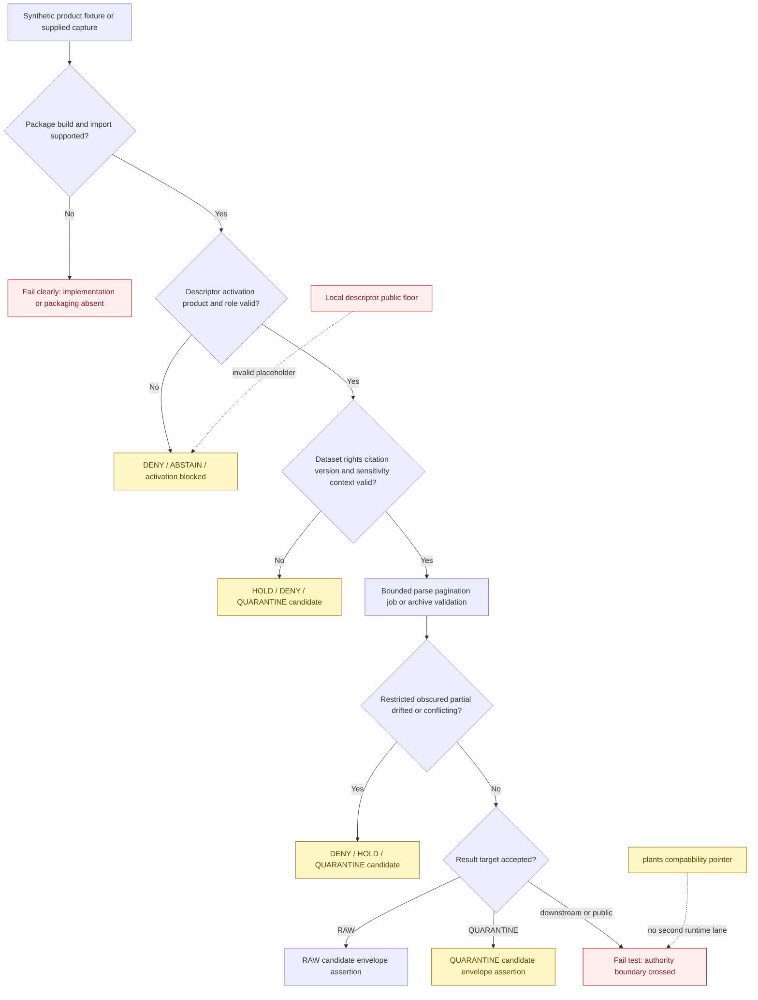

<!-- [KFM_META_BLOCK_V2]
doc_id: kfm://doc/connectors-gbif-tests-readme
title: connectors/gbif/tests/ — GBIF Connector Test Lane
type: readme
version: v0.2
status: draft
owners: OWNER_TBD — Connector steward · GBIF source steward · Biodiversity steward · Flora steward · Fauna steward · Habitat steward · Taxonomy steward · Rights reviewer · Privacy/sensitivity reviewer · Security reviewer · Packaging steward · Validation steward · Docs steward
created: 2026-06-18
updated: 2026-07-11
policy_label: public-doctrine; connector-local-tests; greenfield; per-dataset-rights; geoprivacy-gated; product-specific-roles; synthetic-fixtures-only; no-network-default; no-secrets; no-live-tests-approved; raw-or-quarantine-candidate-only; no-publication
proposed_path: connectors/gbif/tests/README.md
truth_posture: CONFIRMED README-only test lane / executable tests ABSENT / fixtures ABSENT / package importability UNPROVED / package-local public sensitivity placeholder INVALID / product descriptors and activation ABSENT / plants child COMPATIBILITY-ONLY / live testing NOT APPROVED / CI UNKNOWN
related:
  - ../README.md
  - ../pyproject.toml
  - ../src/README.md
  - ../src/gbif/README.md
  - ../src/gbif/__init__.py
  - ../src/gbif/fetch.py
  - ../src/gbif/descriptor.yaml
  - ../plants/README.md
  - ../../../docs/sources/catalog/gbif/README.md
  - ../../../docs/sources/catalog/gbif/occurrence-api.md
  - ../../../docs/sources/catalog/gbif/async-download.md
  - ../../../docs/sources/catalog/gbif/dataset-metadata.md
  - ../../../docs/sources/catalog/gbif/backbone-taxonomy.md
  - ../../../docs/sources/catalog/gbif.md
  - ../../../docs/domains/fauna/README.md
  - ../../../docs/domains/flora/README.md
  - ../../../docs/domains/flora/CANONICAL_PATHS.md
  - ../../../docs/domains/habitat/README.md
  - ../../../data/registry/sources/
  - ../../../data/raw/fauna/
  - ../../../data/raw/flora/
  - ../../../data/raw/habitat/
  - ../../../data/quarantine/fauna/
  - ../../../data/quarantine/flora/
  - ../../../data/quarantine/habitat/
  - ../../../schemas/contracts/v1/source/
  - ../../../policy/sensitivity/
  - ../../../policy/rights/
  - ../../../release/
tags: [kfm, connectors, gbif, tests, biodiversity, darwin-core, dwca, occurrence, specimen, taxonomy, backbone, rights, geoprivacy, synthetic-fixtures, no-network, raw, quarantine, governance]
notes:
  - "Repository inspection confirms that connectors/gbif/tests/ contains this README only; no executable test modules, fixture files, conftest.py, live-test directory, package test configuration, coverage result, or passing CI evidence is proved."
  - "The adjacent package remains a greenfield scaffold: empty __init__.py, one-line fetch.py, placeholder descriptor.yaml, incomplete pyproject.toml, and no implemented transport, product dispatcher, parser, rights adapter, sensitivity detector, or handoff builder."
  - "The package-local descriptor sets role and rights to TBD and sensitivity_floor to public. GBIF rights are dataset-specific and occurrence sensitivity can be elevated, so future tests must reject the public value as an unsafe placeholder."
  - "Occurrence API, async download, dataset metadata, Backbone Taxonomy, aggregate products, modeled assets, and unsupported/mixed products require independent test matrices and must not collapse into one provider-wide success case."
  - "The plants child is a documentation-only compatibility pointer. Shared connector behavior and tests remain in the parent GBIF lanes; Flora-, Fauna-, and Habitat-specific interpretation remains downstream."
  - "The prior KFM_ALLOW_LIVE_GBIF_TESTS examples were illustrative only. This revision removes them as an implied convention; no live-test variable, marker, endpoint, credential mode, account, command, or CI job is approved."
[/KFM_META_BLOCK_V2] -->

<a id="top"></a>

# GBIF Connector Test Lane

> Evidence-grounded contract for connector-local tests beneath `connectors/gbif/`. The lane is currently documentation-only. Future tests must prove source-admission restraint, product separation, per-dataset rights preservation, replay limits, taxonomy-version handling, geoprivacy, bounded transport and archives, and RAW-or-QUARANTINE handoff boundaries without relying on live downloads or real sensitive locations.

<p>
  
  
  
  
  
  
  
  
</p>

`connectors/gbif/tests/`

> [!IMPORTANT]
> **Confirmed state:** this directory contains this README only. No executable test module, local fixture, `conftest.py`, test dependency, package build configuration, collection configuration, live-test directory, CI job, coverage report, or passing result is confirmed. The adjacent GBIF package is not yet a supported installable implementation. Treat all proposed test filenames, fixture shapes, result names, commands, markers, and coverage statements below as requirements—not current evidence.

> [!CAUTION]
> `../src/gbif/descriptor.yaml` contains `role: TBD`, `rights: TBD`, and `sensitivity_floor: public`. GBIF records inherit rights from originating datasets and may carry rare-species, obscured, culturally sensitive, private-location, or additional-use restrictions. **A future suite must reject the local `public` value. It must never become an activation signal, provider-wide sensitivity default, RAW-admission decision, or accepted public-safety result.**

**Quick jumps:** [Purpose](#purpose) · [Verified repository state](#verified-repository-state) · [Evidence ledger](#evidence-ledger) · [Test authority boundary](#test-authority-boundary) · [Blocking drift](#blocking-drift) · [Test invariants](#test-invariants) · [Allowed test inputs](#allowed-test-inputs) · [Forbidden test material](#forbidden-test-material) · [Proposed test architecture](#proposed-test-architecture) · [Fixture contract](#fixture-contract) · [Build and import tests](#build-and-import-tests) · [Descriptor activation and product-role tests](#descriptor-activation-and-product-role-tests) · [Product dispatch tests](#product-dispatch-tests) · [Rights license and citation tests](#rights-license-and-citation-tests) · [Occurrence API pagination and replay tests](#occurrence-api-pagination-and-replay-tests) · [Async-download lifecycle tests](#async-download-lifecycle-tests) · [Dataset-metadata tests](#dataset-metadata-tests) · [Backbone taxonomy and drift tests](#backbone-taxonomy-and-drift-tests) · [Darwin Core and DwC-A tests](#darwin-core-and-dwc-a-tests) · [Sensitivity geoprivacy and obscuration tests](#sensitivity-geoprivacy-and-obscuration-tests) · [Semantic anti-collapse tests](#semantic-anti-collapse-tests) · [Sensitive logging and secret tests](#sensitive-logging-and-secret-tests) · [Transport archive and resource-bound tests](#transport-archive-and-resource-bound-tests) · [Finite outcomes](#finite-outcomes) · [Lifecycle and handoff boundary](#lifecycle-and-handoff-boundary) · [No-network and live-test posture](#no-network-and-live-test-posture) · [Execution posture](#execution-posture) · [Responsibility separation](#responsibility-separation) · [Implementation sequence](#implementation-sequence) · [Acceptance gates](#acceptance-gates) · [Review and rollback](#review-and-rollback) · [Definition of done](#definition-of-done) · [Verification backlog](#verification-backlog)

---

## Purpose

This directory is reserved for connector-local tests of the possible shared GBIF source-admission package.

Future tests may prove that connector and package code:

- builds, installs, and imports without network, DNS, secret, filesystem, logging, environment, cache, registry, policy, or activation side effects;
- requires explicit configuration rather than discovering credentials, accounts, source files, or live endpoints;
- requires accepted product- and dataset-specific SourceDescriptors and activation decisions before real-input or live paths;
- dispatches one explicit product at a time;
- keeps synchronous occurrence API, asynchronous occurrence download, dataset metadata, Backbone Taxonomy, aggregate, modeled, and unsupported products distinct;
- preserves product-specific source role and role authority;
- preserves dataset, publisher, institution, license, citation, DOI, restrictions, taxonomic version, temporal, spatial, uncertainty, obscuration, and completeness metadata;
- fails closed on missing rights, additional restrictions, replay gaps, partial pagination, failed jobs, unsafe archives, taxonomy drift, sensitive records, and unresolved lifecycle targets;
- enforces bounded requests, retries, pagination, polling, downloads, archive extraction, rows, memory, and execution time;
- prevents specimens from becoming current-presence claims, aggregates or models from becoming observations, and empty results from becoming absence claims;
- returns only finite blocked, denied, abstained, held, error, RAW-candidate, or QUARANTINE-candidate outcomes under an accepted contract;
- refuses every direct downstream or public write;
- keeps the `plants/` child documentation-only unless an accepted ADR explicitly changes that posture.

This lane must not claim to prove:

- canonical occurrence, specimen, population, range, habitat, conservation-status, or taxonomic truth;
- biological absence or survey non-detection;
- legal sufficiency of a license or permitted use;
- public safety, anonymization, or successful geoprivacy transformation;
- final taxonomy authority or tie-breaking among GBIF, ITIS, USDA PLANTS, NatureServe, state, institutional, or local sources;
- SourceActivationDecision authority;
- EvidenceBundle, catalog, release, correction, or rollback closure;
- current endpoint health, vendor compatibility, production capacity, or live-source reliability;
- secure deletion, memory erasure, cache invalidation, or downstream revocation completion.

[Back to top ↑](#top)

---

## Verified repository state

The following scaffold is confirmed on the repository's default branch at the time of this update:

```text
connectors/gbif/
├── README.md                         # parent connector contract; earlier draft
├── pyproject.toml                    # project name + version 0.0.0 only
├── plants/
│   └── README.md                     # v0.2 compatibility pointer
├── src/
│   ├── README.md                     # v0.2 source-root contract
│   └── gbif/
│       ├── README.md                 # v0.2 package contract
│       ├── __init__.py               # empty file
│       ├── descriptor.yaml           # role/rights TBD; unsafe public floor
│       └── fetch.py                  # one-line greenfield placeholder
└── tests/
    └── README.md                     # this test contract
```

### Current maturity

| Surface | Confirmed content | Maturity |
|---|---|---:|
| `tests/README.md` | This connector-local test contract. | **DOCUMENTED** |
| Executable test modules | None confirmed. | **ABSENT** |
| Local fixtures | None confirmed. | **ABSENT** |
| `conftest.py` or collection configuration | None confirmed. | **ABSENT** |
| Live-test directory | None confirmed. | **ABSENT / NOT APPROVED** |
| `src/gbif/__init__.py` | Empty file. | **IMPORT-SHAPED / BEHAVIOR ABSENT** |
| `src/gbif/fetch.py` | Comment-only placeholder. | **PLACEHOLDER / NON-EXECUTABLE** |
| `src/gbif/descriptor.yaml` | `role: TBD`, `rights: TBD`, `sensitivity_floor: public`. | **PLACEHOLDER / UNSAFE DEFAULT** |
| `pyproject.toml` | Project name `kfm-connector-gbif` and version `0.0.0` only. | **INCOMPLETE** |
| Build backend and package discovery | None confirmed. | **ABSENT** |
| Supported Python versions and dependencies | None confirmed. | **ABSENT** |
| Stable public import API | None confirmed. | **ABSENT** |
| Product dispatcher | None confirmed. | **ABSENT** |
| Occurrence API transport | None confirmed. | **ABSENT** |
| Async-download worker | None confirmed. | **ABSENT** |
| Dataset metadata and rights handling | Documentation exists; implementation absent. | **PROPOSED / UNBOUND** |
| Darwin Core and DwC-A parsing | None confirmed. | **ABSENT** |
| Backbone-version handling | Documentation exists; implementation absent. | **PROPOSED / UNBOUND** |
| Sensitivity and geoprivacy detection | Doctrine exists; implementation absent. | **PROPOSED / UNBOUND** |
| Accepted product/dataset descriptors and activation decisions | None found or verified. | **ABSENT / NOT ACTIVATED** |
| Test runner and local command | None confirmed. | **UNKNOWN / UNPROVED** |
| CI and coverage evidence | None confirmed. | **UNKNOWN / ABSENT** |

> [!CAUTION]
> A README-only test directory cannot establish coverage. An empty initializer cannot establish import safety. A placeholder fetcher cannot establish endpoint support. A source catalog cannot establish current format compatibility. A local YAML file cannot establish role, rights, sensitivity, or activation. Do not report this connector tested, installable, rights-enforcing, geoprivacy-safe, taxonomy-replayable, activated, or release-ready until executable evidence supports those claims.

[Back to top ↑](#top)

---

## Evidence ledger

| Evidence | Status | What it supports | What it does not support |
|---|---:|---|---|
| `connectors/gbif/tests/README.md` | **CONFIRMED** | The connector-local test lane and its governance boundary exist. | Executable tests or passing results. |
| Current repository search for `connectors/gbif/tests/` | **CONFIRMED for inspected state** | Only this README is found in the test lane. | Permanent absence or future files. |
| `../src/README.md` | **CONFIRMED v0.2** | Source-root placement, product separation, rights, geoprivacy, taxonomy, transport, packaging, and handoff requirements are documented. | Implemented enforcement. |
| `../src/gbif/README.md` | **CONFIRMED v0.2** | Package-level product, role, rights, replay, archive, sensitivity, and finite-outcome requirements are documented. | Client, parser, metadata, Backbone, or handoff behavior. |
| `../src/gbif/__init__.py` | **CONFIRMED empty** | A package-shaped namespace exists. | Supported import or stable API. |
| `../src/gbif/fetch.py` | **CONFIRMED placeholder** | A future source-input responsibility was anticipated. | Network, pagination, async jobs, downloads, retries, or persistence. |
| `../src/gbif/descriptor.yaml` | **CONFIRMED unsafe placeholder** | Local scaffold metadata exists. | Canonical descriptor authority, valid role/rights, safe sensitivity, or activation. |
| `../pyproject.toml` | **CONFIRMED placeholder** | Distribution name and version are recorded. | Build, install, dependencies, test runner, or package discovery. |
| `../plants/README.md` | **CONFIRMED v0.2 compatibility pointer** | Plant-specific source access and connector tests remain shared in the parent GBIF lanes. | Active Flora ingest or plant-specific runtime behavior. |
| GBIF source-family and product pages | **CONFIRMED draft documentation** | Occurrence API, async download, dataset metadata, and Backbone are distinct products with different trust, replay, role, and rights postures. | Current endpoint compatibility or accepted parser contracts. |
| `docs/sources/catalog/gbif.md` | **CONFIRMED draft source profile** | GBIF is treated as an occurrence aggregator and taxonomic crosswalk with per-dataset rights and sensitivity gates. | Activated source or executable policy. |
| Flora/Fauna/Habitat documentation | **CONFIRMED doctrine-oriented context** | Domain interpretation, taxon crosswalks, rare-record handling, and public derivatives remain downstream. | Connector implementation or final cross-domain routing. |
| Connector-specific CI | **ABSENT / UNKNOWN** | CI requirements may be documented. | Merge-gate enforcement or passing status. |

[Back to top ↑](#top)

---

## Test authority boundary

Connector-local tests may prove only behavior at the GBIF package and source-admission edge.

```text
TESTS MAY PROVE:
  build and import safety
  explicit configuration and closed product dispatch
  external descriptor and activation preconditions
  product-specific source-role preservation
  per-dataset rights/citation metadata preservation
  synchronous API pagination and replay evidence
  async job/download completeness behavior
  dataset-metadata parsing
  Backbone version and taxonomy-drift preservation
  deterministic Darwin Core and DwC-A parsing of synthetic inputs
  restricted/obscured-record detection and fail-closed outcomes
  bounded transport, polling, downloads, archives, rows, memory, and time
  finite redacted errors
  RAW-or-QUARANTINE candidate-boundary behavior
  refusal of direct downstream or public writes

TESTS MUST NOT CLAIM:
  biological occurrence, current presence, absence, population, or range truth
  canonical taxonomy or final authority ordering
  conservation-status authority
  legal rights clearance
  public safety or anonymization
  successful redaction/generalization
  source activation authority
  EvidenceBundle, proof, catalog, or release closure
  production endpoint compatibility
  live-source reliability or capacity
  secure deletion, downstream invalidation, or rollback completion
```

Domain-wide taxonomy, rare-species sensitivity, habitat, Flora, Fauna, evidence, catalog, release, correction, rollback, and public-surface tests belong in their accepted responsibility lanes. This directory must not become a parallel domain, policy, integration, or release test root.

[Back to top ↑](#top)

---

## Blocking drift

Executable tests must expose unresolved blockers rather than mock them into success.

| Blocker | Confirmed gap or conflict | Required test posture |
|---|---|---|
| Packaging | No build backend, discovery, Python support, dependencies, entry points, or stable API. | Do not claim collection or import coverage until clean build/install tests exist. |
| Local descriptor authority | `role` and `rights` are `TBD`; `sensitivity_floor` is `public`. | Reject the file as activation, role, rights, or sensitivity authority. |
| Source registry topology | Canonical GBIF product/dataset descriptor placement is unresolved. | Require one accepted descriptor reference; never select a path by convenience. |
| Product descriptors | No accepted product- or dataset-specific SourceDescriptors or activation decisions are proved. | Block real-input and live tests. |
| Product identity | API, async download, metadata, Backbone, aggregate, modeled, and mixed surfaces differ materially. | Require exact closed product dispatch; reject umbrella success cases. |
| Product source roles | Observations, specimens, metadata, taxonomy, aggregates, and models use different roles. | Require product/dataset-specific roles and anti-collapse tests. |
| Per-dataset rights | GBIF aggregates independently licensed and sometimes additionally restricted datasets. | Preserve actual source granularity; unknown or conflicting rights fail closed. |
| Occurrence API replay | Synchronous responses can change and do not inherently carry a Download DOI. | Test query, pagination, retrieval, response, and dataset evidence; never claim DOI-equivalent replay. |
| Async download | Authentication, predicates, polling, terminal states, DOI, checksum, retention, and archive behavior are unimplemented. | Synthetic/supplied job and archive cases only; no live submission. |
| Dataset metadata | License, citation, publisher, DOI, restriction, and update semantics are unimplemented. | No release-bound result without complete context. |
| Darwin Core / DwC-A | Field, encoding, delimiter, archive, extension-table, and version behavior is unverified. | No best-effort parsing; make schema/archive drift visible. |
| Backbone version | Snapshot discovery, rotation, taxon-key stability, and correction behavior are unimplemented. | Require explicit version context; never silently use latest. |
| Taxonomy authority order | GBIF, ITIS, USDA PLANTS, NatureServe, state, institutional, and local authorities can disagree. | Preserve disagreement; no connector-local tie-breaker. |
| Sensitive records | Rare, protected, obscured, steward-controlled, cultural, or precise-location records require policy. | Preserve restrictions and fail closed; no public transform here. |
| Join-induced sensitivity | Public records can become harmful when joined with roads, parcels, access, ownership, infrastructure, or cultural-use context. | Do not perform cross-source joins in connector tests. |
| `plants/` child | Child path is documentation-only and noncanonical for implementation. | Test that no second package, descriptor, fixture, test, activation, or lifecycle path is created there. |
| Handoff contract | No binding connector-result or RAW/QUARANTINE envelope is selected. | Test result shapes only after authority is accepted; reject direct writes now. |
| Fixtures | No local fixture set or accepted fixture convention exists. | Use documentation examples until synthetic fixture governance is approved. |
| Live tests | No access method, marker, variable, credential mode, endpoint, or approval exists. | No live-test implementation or command. |
| CI | No connector-specific workflow or passing run is confirmed. | No passing badge or merge-enforcement claim. |

These blockers are part of the safety contract. Tests must not bypass them merely to produce a green run.

[Back to top ↑](#top)

---

## Test invariants

Every future test and fixture in this lane must preserve the following invariants:

1. **Synthetic by default.** Default tests use no real sensitive location, restricted dataset row, credential, private source record, or living-person contact data.
2. **No network.** Import, collection, fixture loading, and the default suite perform no DNS, socket, HTTP, browser, or external process access.
3. **No credential discovery.** Tests do not require passwords, tokens, cookies, sessions, API keys, keychains, browser profiles, account files, or hidden environment configuration.
4. **No persistence by default.** Tests use framework-managed temporary locations and create no durable source cache, download staging area, retry queue, or lifecycle record.
5. **No local descriptor authority.** Package-local YAML cannot activate, classify, or authorize the source.
6. **Unsafe placeholder rejection.** `sensitivity_floor: public` is a hard invalid-placeholder case.
7. **One product at a time.** Product identity is explicit; unknown and mixed inputs fail closed.
8. **Dataset identity remains explicit.** A provider-wide success case cannot replace dataset-level rights and provenance tests.
9. **Source role remains fixed.** Tests reject role upgrades and semantic collapse.
10. **Per-dataset rights remain attached.** One license string cannot authorize every record or downstream derivative.
11. **Rights, sensitivity, source role, evidence, and release remain independent.** Clearing one never clears another.
12. **Obscuration remains intact.** Tests never reverse, enrich, infer, or reconstruct withheld coordinates or fields.
13. **Taxonomy remains versioned evidence.** Tests preserve Backbone snapshot context and authority disagreements.
14. **API replay limits remain visible.** A query hash or response digest is not a Download DOI.
15. **Specimens are temporal evidence.** A collection record does not establish current presence.
16. **Empty results are not absence.** Missing records do not establish biological non-detection.
17. **Aggregates and models retain their roles.** Neither becomes a point observation.
18. **No sensitive logging.** Exact coordinates, collector contacts, restricted fields, private predicates, credentials, and payload excerpts stay out of logs and errors.
19. **Input is bounded.** Requests, pages, jobs, files, archives, rows, fields, decompression, time, and memory have explicit limits.
20. **Source bytes are inert.** No formula, macro, script, HTML, archive member, path, or payload is executed.
21. **No silent partial success.** Missing pages, failed required tables, incomplete jobs, and checksum failures produce finite incomplete outcomes.
22. **Candidate boundary only.** The suite accepts only finite results and RAW/QUARANTINE candidates under approved contracts.
23. **No downstream writes.** Every direct WORK, PROCESSED, CATALOG, TRIPLET, PROOF, RECEIPT, RELEASE, PUBLISHED, API, map, graph, report, search, or generated-answer write fails.
24. **No consumer-domain fork.** Flora, Fauna, and Habitat tests consume one shared connector behavior rather than duplicate transports.
25. **No live-test convention by implication.** An environment variable or command shown in old documentation is not approval for live access.

[Back to top ↑](#top)

---

## Allowed test inputs

Default tests may use:

- synthetic occurrence-API response pages with invented record and dataset identifiers;
- synthetic async-job state sequences and supplied archive metadata;
- synthetic dataset-metadata documents with complete, missing, conflicting, or restricted rights states;
- synthetic Backbone concept and snapshot/version records;
- synthetic Darwin Core rows and bounded DwC-A-style archives;
- synthetic specimen, observation, aggregate, modeled, metadata, and taxonomy records;
- synthetic restricted, obscured, withheld, generalized, and sensitivity-unknown flags;
- invented coordinate canaries that do not correspond to real rare or protected locations;
- invalid package-local descriptor copies designed to prove placeholder rejection;
- mocked, disabled, or injectable transports that cannot reach a network;
- bounded in-memory streams and framework-managed temporary directories;
- synthetic archives containing safe members and intentionally invalid traversal, expansion, manifest, extension-table, encoding, delimiter, or checksum cases;
- accepted schemas or contracts only after their authority is verified.

Any non-synthetic source-shaped material requires separate documented approval covering provenance, rights, restrictions, sensitivity, location risk, collector or observer privacy, retention, access control, fixture storage, review, deletion, incident response, and repository-history exposure. Such material must not enter the default suite by convenience.

[Back to top ↑](#top)

---

## Forbidden test material

Do not place, generate, fetch, or persist the following in this lane:

| Forbidden material | Reason / required handling |
|---|---|
| Real credentials, tokens, cookies, sessions, API keys, account files, keychain data, or private endpoint configuration | Secrets and account material remain in approved external systems. |
| Real private, restricted-use, embargoed, or unpublished datasets | Use synthetic fixtures; restricted source material requires a separately governed workflow. |
| Real exact locations of rare, protected, obscured, culturally sensitive, or steward-controlled taxa | Exposure risk; use invented coordinates and synthetic flags. |
| Real collector, observer, permit-holder, landowner, or contact information | Personal and private-context exposure. |
| Automatically refreshed live API or download snapshots | Creates uncontrolled access, retention, drift, and rights risk. |
| Bulk source exports copied into fixtures after superficial redaction | Renaming or deleting fields does not make a source export synthetic. |
| Production SourceDescriptors or activation decisions copied as test authority | Use synthetic invalid or non-activating references; canonical records remain external. |
| Canonical rights, sensitivity, taxonomy, or release policy copied into fixtures | Tests reference accepted authority; they do not define or duplicate it. |
| Exact private query geometries, predicates, or dataset allowlists from consequential projects | Use invented scopes and safe canaries. |
| Public claims, canonical taxon crosswalks, range conclusions, absence conclusions, catalog records, proofs, release manifests, rollback cards, maps, reports, or generated answers | Outside connector-local test authority. |

[Back to top ↑](#top)

---

## Proposed test architecture

The structure below is a **PROPOSED implementation map**. None of these files is confirmed to exist.

```text
connectors/gbif/tests/
├── README.md
├── fixtures/
│   ├── README.md
│   ├── common/
│   ├── occurrence_api/
│   ├── async_download/
│   ├── dataset_metadata/
│   ├── backbone/
│   ├── dwc/
│   ├── dwca/
│   ├── sensitive/
│   ├── drift/
│   └── invalid/
├── test_build_and_import.py
├── test_configuration.py
├── test_descriptor_and_activation.py
├── test_product_dispatch.py
├── test_source_roles.py
├── test_rights_and_citation.py
├── test_occurrence_api.py
├── test_async_download.py
├── test_dataset_metadata.py
├── test_backbone.py
├── test_dwc.py
├── test_dwca.py
├── test_sensitive_records.py
├── test_semantic_boundaries.py
├── test_transport_and_resource_limits.py
├── test_sensitive_logging.py
├── test_handoff_boundaries.py
├── test_errors_and_drift.py
└── live/
    └── README.md                    # only after explicit approval
```

Do not create this tree mechanically. A test module should be added only with corresponding implementation, accepted contracts, product/dataset descriptors, synthetic fixtures, negative cases, ownership, and review evidence.

### Test-class contract

| Test class | Required proof | Must not imply |
|---|---|---|
| Build and import | Clean build/install/import with no side effects. | Activation, endpoint compatibility, or useful parser behavior. |
| Configuration | Explicit defaults, bounded limits, no live fallback. | Approved credential or endpoint configuration. |
| Descriptor and activation | Missing or unsafe authority blocks consequential paths. | Package-local YAML is canonical. |
| Product dispatch | Exact admitted product required; mixed/unknown inputs fail. | One umbrella parser is safe. |
| Source roles | Product/dataset roles remain fixed and cannot be upgraded. | GBIF provider identity determines one role. |
| Rights and citation | Dataset-level rights and restrictions remain attached and unresolved states fail closed. | Legal sufficiency or release approval. |
| Occurrence API | Pagination, query identity, partial-capture, and replay limits are explicit. | API responses are DOI-pinned publication evidence. |
| Async download | Job completion, citation identity, checksum, size, and archive completeness are required. | Current live workflow or production credentials work. |
| Dataset metadata | Publisher, institution, license, citation, DOI, restrictions, and update state are preserved. | Metadata is occurrence evidence. |
| Backbone | Snapshot/version and taxonomy drift are preserved. | Package is final taxonomy authority. |
| Darwin Core / DwC-A | Synthetic source shapes parse deterministically under bounds. | Current source exports are fully supported. |
| Sensitive records | Obscuration and restrictions remain intact; unresolved cases fail closed. | Public redaction or de-identification is complete. |
| Semantic boundaries | Specimen/current, aggregate/point, model/observation, and empty/absence collapses fail. | Domain validation or biological truth is complete. |
| Sensitive logging | Canaries do not leak through logs, errors, metrics, or snapshots. | Full-system confidentiality or secure erasure. |
| Handoff boundary | Only accepted finite outcomes and candidate targets are possible. | RAW storage, quarantine storage, or downstream promotion exists. |
| Optional live smoke | A separately approved narrow interaction works under reviewed scope. | Broad product support, rights compliance, production readiness, or release eligibility. |

[Back to top ↑](#top)

---

## Fixture contract

Synthetic fixtures are the only accepted default evidence source for this test lane.

A future fixture manifest may use a shape similar to the following, pending fixture-standard approval:

```yaml
fixture_id: gbif-synthetic-occurrence-api-001
fixture_status: synthetic
product_key: occurrence_api
source_family: gbif
contains_real_source_data: false
contains_real_sensitive_location: false
contains_real_person_data: false
contains_credentials: false
source_role_under_test: observed
rights_state_under_test: missing_citation
sensitivity_state_under_test: obscured
replay_state_under_test: mutable_api_without_download_doi
expected_real_product_posture: rights-and-sensitivity-gated
supports_tests:
  - explicit_product_dispatch
  - pagination_completeness
  - rights_fail_closed
  - obscuration_preservation
  - no_sensitive_logging
review_state: draft
```

Fixture rules:

1. Generate fixtures independently; do not derive them from a real GBIF response, archive, dataset export, or sensitive-location record.
2. Use invented occurrence IDs, dataset keys, DOIs, institution codes, taxon keys, names, coordinates, and citations that cannot be mistaken for real consequential records.
3. Keep each fixture minimal and tied to named tests.
4. Separate valid-shape, invalid-shape, rights, pagination, job, archive, taxonomy, sensitivity, logging, and boundary cases.
5. Record whether every field is synthetic, omitted, generalized, obscured, restricted, or intentionally malformed.
6. Do not use production descriptors, activation decisions, credentials, policies, or real dataset allowlists as fixture authority.
7. Do not encode the package-local `public` sensitivity floor as an accepted state.
8. Do not label a public license, removed coordinate, rounded point, hash, or token as proof of public safety.
9. Use synthetic canaries to test leakage, then assert complete absence from logs, errors, metrics, snapshots, test names, and ordinary outputs.
10. Keep API fixtures separate from DOI-backed download fixtures so replay class remains inspectable.
11. Preserve source-shape fields only when required for the behavior under test; do not build broad pseudo-exports.
12. Promote a fixture to a shared repository authority only after multi-consumer need, rights review, sensitivity review, provenance review, and reproducibility review.

[Back to top ↑](#top)

---

## Build and import tests

Before the suite can claim import coverage, packaging must exist and be testable from a clean environment.

Required future tests:

- build a source distribution and wheel using the accepted repository toolchain;
- install the distribution into a clean environment;
- verify the accepted distribution and import names;
- verify package discovery for the `src/` layout;
- import the reviewed public API with network and DNS blocked and secrets unavailable;
- assert that import performs no filesystem write, temporary-file creation, cache initialization, logging configuration, environment mutation, registry mutation, policy evaluation, account discovery, or activation;
- assert that optional transport and parsing dependencies are not imported until needed;
- assert that `descriptor.yaml` is not automatically loaded as authority;
- assert that explicitly inspecting the local `public` floor produces a placeholder-validation failure;
- assert that built artifacts exclude real fixtures, source payloads, credentials, restricted records, private coordinates, caches, and canonical registry data;
- assert that `__init__.py` exposes only the reviewed API;
- assert that the `plants/` compatibility path is not installed as a second runtime package;
- reject zero-test, all-skipped, or collection-only runs as evidence of build or import coverage.

[Back to top ↑](#top)

---

## Descriptor, activation, and product-role tests

Future tests must demonstrate that authority remains external and product-specific.

| Case | Required proof |
|---|---|
| Canonical source descriptor absent | Activation blocked. |
| Product-specific descriptor absent | Product path blocked. |
| Dataset-scoped descriptor required but absent | Affected dataset held or quarantined. |
| Activation decision absent | `ABSTAIN` or activation-blocked outcome. |
| Local descriptor supplied as authority | Hard validation failure. |
| Local `sensitivity_floor: public` encountered | Hard invalid-placeholder failure. |
| Role missing, `TBD`, ambiguous, umbrella, or incompatible | Activation blocked. |
| Role changed during parsing or handoff | Hard anti-collapse failure. |
| Provider-wide activation enables every product | Hard configuration failure. |
| Dataset rights or restrictions conflict with provider default | Preserve dataset state and fail closed. |
| Descriptor correction needed | Require a reviewed new descriptor or correction record; no in-place role rewrite. |

Product-role tests must preserve at least these distinctions when accepted descriptors exist:

- specimen or field occurrence: usually `observed`, with source caveats and temporal scope;
- dataset metadata: `administrative`;
- Backbone Taxonomy: `administrative`;
- aggregate cells or counts: `aggregate`, with spatial and temporal unit;
- modeled range or suitability assets: `modeled`, with model/run evidence;
- unresolved product or record: blocked, held, quarantined, or candidate under an accepted contract.

No generic `gbif -> observed` test constant is acceptable.

[Back to top ↑](#top)

---

## Product dispatch tests

Product identity must be explicit and closed.

Required cases:

- synchronous API input cannot be dispatched as async download;
- async archive cannot be dispatched as a current API page;
- dataset metadata cannot be parsed as occurrence evidence;
- Backbone records cannot be parsed as occurrence rows;
- aggregate products cannot enter point-occurrence parsers;
- modeled assets cannot enter observed-occurrence parsers;
- unknown products return unsupported, held, or quarantine outcomes;
- mixed or combined products are not auto-split;
- product identity is not inferred from filename, URL, extension, content type, first row, provider label, or one field alone;
- one product's activation does not activate sibling products;
- synthetic configuration cannot fall through to live transport;
- the `plants/` path cannot create a second product dispatcher.

[Back to top ↑](#top)

---

## Rights, license, and citation tests

Rights tests verify preservation and fail-closed behavior, not legal conclusions.

Required cases:

| Condition | Required test behavior |
|---|---|
| Dataset identity, publisher, or institution missing | Hold or quarantine; no release-bound candidate. |
| License value missing or unparseable | Deny, abstain, hold, or quarantine. |
| Citation or attribution required but missing | No release-bound candidate. |
| Dataset DOI/citation present | Preserve exactly under the accepted contract. |
| GBIF Download DOI present | Preserve separately from dataset citations and Backbone identity. |
| Per-record and dataset-level rights disagree | Preserve both and route to review. |
| Additional use restriction present | Preserve and elevate; generic license parsing cannot override it. |
| Share-alike or derivative condition present | Flag for downstream release review; package makes no compatibility decision. |
| Provider-wide license assumed for every row | Hard rights-boundary failure. |
| Rights state changed after earlier capture | Emit drift/correction signal; never silently overwrite prior evidence. |
| Public availability used as public-release permission | Hard authority failure. |

Synthetic fixtures should cover complete, missing, conflicting, malformed, additional-restriction, and changed-rights states without using real restricted datasets.

[Back to top ↑](#top)

---

## Occurrence API pagination and replay tests

Synchronous occurrence responses are mutable source captures, not automatically replay-stable publication evidence.

Required future tests:

- normalize and preserve the explicit request/query specification and digest;
- preserve retrieval time and product/source-surface identity;
- enforce page-size, maximum-page, maximum-record, timeout, and memory limits;
- preserve requested and received page ranges;
- verify expected offset or cursor progression under the selected contract;
- detect duplicate occurrence identifiers across pages;
- detect gaps, inconsistent totals, changed end-of-records indicators, or unstable page progression;
- reject silent partial success when a required page fails;
- preserve page and response digests without copying sensitive payload values into logs;
- preserve ETag or Last-Modified when supplied without requiring them when the accepted contract does not;
- preserve dataset composition and dataset-metadata references;
- preserve Backbone snapshot/version context when taxonomic anchoring occurs;
- distinguish a response digest from a GBIF Download DOI;
- return a non-release-bound, hold, or abstain result when replay evidence required by contract is absent;
- prove that an empty API result does not become a biological-absence claim;
- prove that a later retrieval cannot silently rewrite the earlier capture;
- keep private or sensitive query geometry out of logs, metrics, test IDs, and ordinary errors.

[Back to top ↑](#top)

---

## Async-download lifecycle tests

Async-download tests must model a bounded job and capture lifecycle without contacting a live service.

Required cases:

- explicit product descriptor and predicate/request identity are required;
- job submission acknowledgement is not capture success;
- polling duration, interval, retries, and total attempts are bounded;
- terminal-state vocabulary is explicit under an accepted contract rather than guessed from prose;
- successful terminal state still requires citation/download identity, content size, checksum, and completion metadata;
- failed, cancelled, expired, inaccessible, inconsistent, or unknown states produce finite outcomes;
- poll responses that regress or conflict are surfaced as drift;
- missing Download DOI or equivalent citation identity produces a hold or non-release-bound result when required;
- download-size or checksum mismatch produces incomplete-capture quarantine;
- interrupted download cannot be reported complete;
- archive retrieval cannot begin through hidden fallback after a failed job;
- credentials remain external and scoped to the approved action;
- no background daemon or unbounded polling is started by package import or tests;
- captured job and download metadata remain distinct from Backbone and dataset citation identities;
- no async fixture or test creates durable download staging outside framework-managed temporary storage.

[Back to top ↑](#top)

---

## Dataset-metadata tests

Dataset metadata is administrative source context, not occurrence evidence.

Future tests should preserve and validate, where required by accepted contracts:

- dataset key and title;
- publisher and publishing organization;
- originating institution and collection;
- rights holder;
- raw and normalized license values;
- citation and attribution text;
- dataset DOI or citation identifier;
- source distribution identity;
- additional restrictions, embargoes, withholding, or restricted-use notes;
- dataset publication and update times;
- metadata retrieval time and digest;
- metadata completeness, conflict, and stale-state flags.

Negative cases must prove:

- metadata rows cannot become occurrence or specimen records;
- one metadata document cannot authorize unrelated datasets;
- missing publisher, citation, or rights context blocks release-bound candidates;
- conflicting metadata versions remain inspectable;
- metadata refresh does not silently mutate earlier evidence;
- a parsed license string does not erase additional restrictions.

[Back to top ↑](#top)

---

## Backbone taxonomy and drift tests

Backbone tests preserve versioned administrative taxonomy evidence without becoming final domain authority.

Required cases:

- Backbone product identity is explicit;
- Backbone role remains `administrative` under the accepted descriptor;
- Backbone records cannot enter occurrence or specimen outputs;
- concept identity and exact snapshot/version context are preserved separately;
- a taxon key without required snapshot/version context is incomplete replay evidence;
- silent resolution against “latest” is rejected when replayability requires a pinned version;
- synonyms, accepted-name changes, merges, splits, rank changes, deprecations, and unresolved names produce reviewable taxonomy-drift outcomes;
- earlier receipts remain bound to their original snapshot rather than being rewritten;
- GBIF, ITIS, USDA PLANTS, NatureServe, state, institutional, and local identifiers remain independently inspectable;
- disagreement does not trigger an implicit tie-breaker inside the connector;
- taxonomic rename is not counted as a new biological occurrence;
- no test claims that a taxon key alone establishes canonical Flora, Fauna, or Habitat identity.

[Back to top ↑](#top)

---

## Darwin Core and DwC-A tests

Parsers must preserve source meaning before downstream normalization.

### Darwin Core row cases

Future tests should verify preservation, where supplied and permitted, of:

- source occurrence identifier;
- `basisOfRecord` or equivalent source class;
- institution, collection, and catalog identifiers;
- event or collection date and temporal precision;
- scientific name, verbatim name, taxon keys, accepted-name reference, rank, and taxonomic status;
- identification qualifier, confidence, verification state, issue flags, and source caveats;
- occurrence status, establishment means, life stage, sex, behavior, and cultivation/captive qualifiers without inference;
- individual count or quantity with units and semantics;
- locality and jurisdiction fields;
- coordinates, geodetic datum, coordinate uncertainty, precision, georeference remarks, and issue flags;
- obscured, withheld, generalized, restricted, or embargoed source state;
- collector or observer fields only under accepted privacy handling;
- source field names, code values, null/unknown semantics, and unsupported-field evidence.

### DwC-A and archive cases

Required negative cases include:

- archive larger than accepted byte limit;
- expanded size or compression ratio above limit;
- excessive member count or nested archives;
- traversal paths, absolute paths, symlinks, hardlinks, devices, or special files;
- duplicate or conflicting member names;
- missing or malformed archive metadata or manifest required by the selected contract;
- missing core table or broken extension-table references;
- unexpected delimiter, quote, escape, encoding, line ending, or field count;
- checksum mismatch or truncated stream;
- unsupported archive/compression format;
- unknown required fields or incompatible schema version;
- partial required-table success after another required table fails;
- formula-like, script-like, HTML, macro-like, or executable content treated as active material.

Source bytes must remain inert. No archive content, formula, macro, script, HTML, or imported code may execute.

[Back to top ↑](#top)

---

## Sensitivity, geoprivacy, and obscuration tests

Public availability does not make every biodiversity record safe to redistribute, join, or release.

Synthetic negative cases should cover:

- rare, imperiled, protected, or steward-controlled taxa;
- exact nest, den, roost, hibernaculum, spawning, breeding, collection, seed-source, or small-population locations;
- already obscured, rounded, generalized, withheld, embargoed, or marked-sensitive records;
- culturally or sovereignty-sensitive plant, animal, habitat, or traditional-use context;
- collector, observer, permit-holder, landowner, contact, or private-property fields;
- records with unknown sensitivity state;
- source rows that become more sensitive when combined with roads, trails, parcels, access points, infrastructure, ownership, or harvest/use context.

Required assertions:

- upstream obscuration, uncertainty, withholding, and precision remain attached;
- exact coordinates cannot be reconstructed, guessed, snapped, averaged, enriched, or inferred;
- unresolved sensitivity produces deny, abstain, hold, or quarantine behavior;
- exact sensitive geometry never enters logs, errors, metrics, snapshots, test names, package data, or ordinary output;
- public redaction, generalization, masking, or aggregation is not performed as connector authority;
- map styling, client filters, opacity, hidden layers, and zoom thresholds are rejected as sensitivity controls;
- a public license, rounded coordinate, removed field, hash, or token does not establish public safety;
- join-induced sensitivity remains a downstream policy concern and is not evaluated through real cross-source joins in this lane;
- generated summaries, indexes, embeddings, and AI outputs cannot bypass source restrictions.

[Back to top ↑](#top)

---

## Semantic anti-collapse tests

The connector must preserve source meaning rather than promoting records into domain truth.

| Forbidden collapse | Required test behavior |
|---|---|
| Backbone taxonomy → occurrence | Hard source-role failure. |
| Dataset metadata → occurrence | Hard source-role failure. |
| Herbarium or museum specimen → current presence | Hard temporal/semantic failure. |
| Field observation → regulatory conservation status | Preserve observation role; status requires separate authority. |
| Aggregate count/cell → exact point occurrence | Hard aggregation-scope failure. |
| Modeled range/suitability → observed presence | Hard source-role failure. |
| Empty or filtered result → biological absence | Hard evidence-boundary failure. |
| Public source record → public-safe joined product | Continue to require sensitivity and release gates. |
| Taxonomic rename → occurrence gain or loss | Preserve as taxonomy drift. |
| Source taxon key → canonical domain identity | Require downstream crosswalk/review. |
| One product's activation → every GBIF product activated | Hard configuration failure. |
| `plants/` consumer pointer → separate source connector | Hard placement-boundary failure. |

[Back to top ↑](#top)

---

## Sensitive logging and secret tests

Tests must use synthetic canaries to prove that protected classes do not leak.

Future leakage tests should cover:

- application and warning logs;
- exception messages and tracebacks;
- structured error objects;
- metrics labels and values;
- tracing attributes;
- snapshots and golden files;
- pytest parameter IDs and test names;
- assertion diffs;
- temporary filenames and cache keys;
- serialized result objects;
- CLI output, if a CLI is ever approved;
- CI artifacts and failure summaries.

Synthetic canaries should represent:

- exact sensitive coordinate pairs;
- invented private query geometries or predicates;
- collector and observer contact-like strings;
- restricted-field values;
- credential-, token-, cookie-, and session-like strings;
- dataset keys and DOIs marked private for the fixture;
- source rows containing invented rare-taxon context;
- filenames containing invented personal or location names.

Required assertions:

- canaries never appear outside explicitly restricted in-memory fixture fields;
- errors contain bounded reason codes, safe counts, opaque references, and approved digests only;
- `repr`, model validation, serialization, logging adapters, and exception chaining cannot expose full records;
- source payload excerpts are not attached for debugging;
- no hidden telemetry or crash-report upload occurs;
- no credential, token, cookie, session, browser, keychain, or account-file discovery is attempted;
- a digest, redaction flag, rounded coordinate, or token is never labeled anonymous or public-safe by the package.

[Back to top ↑](#top)

---

## Transport, archive, and resource-bound tests

Supplied-input and future transport behavior must be bounded before any real-input path is considered.

### Transport controls

Required negative cases include:

- host or scheme outside the accepted allowlist;
- connect, read, total, or idle timeout;
- retry count above the accepted limit;
- redirect chain above limit or redirect to a disallowed host;
- response body above size limit;
- unsupported content type, encoding, or compression;
- malformed rate-limit metadata;
- infinite or excessive backoff request;
- credential value placed in URL, log, exception, metric, or receipt;
- transport not injectable for offline tests;
- automatic persistence of a response body;
- hidden fallback from supplied input to live transport.

### Pagination and job controls

Required negative cases include:

- page or record count above limit;
- duplicate IDs across pages;
- gaps or inconsistent totals;
- query mutation between pages;
- required page failure followed by false success;
- unbounded polling or background daemon creation;
- unknown, regressed, or inconsistent job state;
- missing citation identity, checksum, size, or completion evidence;
- expired, failed, cancelled, inaccessible, or partial job result;
- retry or poll budget exhaustion.

### File and archive controls

Required negative cases include:

- file or archive larger than accepted byte limit;
- row, field, column, or line length above limit;
- unsupported or undecodable encoding;
- embedded NUL or malformed Unicode;
- excessive compression ratio or expanded size;
- excessive members or nesting;
- traversal, absolute paths, links, devices, or special files;
- conflicting member names;
- malformed archive metadata;
- missing required core or extension tables;
- checksum mismatch or truncated stream;
- parser timeout or memory-budget exhaustion;
- unknown fields silently dropped;
- partial success returned after one required component fails.

[Back to top ↑](#top)

---

## Finite outcomes

Future package APIs and tests should use a small accepted result vocabulary. Exact names remain unbound until a connector-result contract is selected.

| Condition | Required safe behavior |
|---|---|
| Package behavior absent | Clear unavailable/not-implemented result; never false success. |
| Build or supported import contract absent | Collection/import coverage cannot be claimed. |
| Canonical source or product descriptor missing | Activation blocked. |
| Package-local `sensitivity_floor: public` encountered | Hard placeholder-validation failure. |
| Activation decision missing | `ABSTAIN` or activation-blocked result. |
| Product identity missing, unknown, or mixed | Validation failure, `HOLD`, or QUARANTINE candidate. |
| Source role missing or conflicted | Activation block; no permissive default. |
| Dataset identity, publisher, citation, or rights context missing | Hold or quarantine; no release-bound candidate. |
| License or additional terms unknown or conflicting | `DENY`, `ABSTAIN`, `HOLD`, or QUARANTINE candidate. |
| Network requested under default configuration | Bounded disabled outcome. |
| Credential discovery or unsafe credential handling attempted | Hard security failure. |
| API pagination incomplete, duplicated, or inconsistent | Incomplete-capture quarantine. |
| API response lacks replay evidence required by contract | `ABSTAIN`, `HOLD`, or non-release-bound candidate. |
| Async job not terminal-successful or download metadata incomplete | Finite failed/incomplete outcome. |
| Download checksum or content-size mismatch | Incomplete-capture quarantine. |
| Archive unsafe, malformed, oversized, or structurally incomplete | Reject or quarantine. |
| Dataset metadata unavailable | Rights/provenance block. |
| Backbone snapshot/version absent where anchoring occurs | Taxonomy-review or quarantine outcome. |
| Taxon key/name/rank/version drift | Reviewable taxonomy-drift result; no silent rewrite. |
| Sensitive, obscured, or restricted record detected | Restrict, hold, deny, or quarantine; never public-safe by default. |
| Attempt to recover exact withheld geometry | Hard sensitivity-boundary failure. |
| Aggregate emitted as point occurrence | Hard source-role failure. |
| Modeled asset emitted as observed occurrence | Hard source-role failure. |
| Specimen emitted as current presence | Hard temporal/semantic failure. |
| Empty result interpreted as biological absence | Hard evidence-boundary failure. |
| Sensitive value enters log, error, metric, snapshot, or ordinary output | Hard privacy failure. |
| Intended target beyond RAW or QUARANTINE | Hard authority-boundary failure. |
| Direct lifecycle or public write attempted | Hard failure. |
| Taxonomic, conservation-status, absence, range, legal, safety, or release determination requested | Refuse and route to governed domain/reviewer processes. |

Every error must be deterministic, finite, actionable, safe to log, and free of unnecessary source content.

[Back to top ↑](#top)

---

## Lifecycle and handoff boundary

The test lane performs no source admission and no lifecycle writes. It verifies that future package code remains at the source-admission edge.



The diagram is a future test contract. It is not evidence that any package, transport, parser, rights adapter, sensitivity detector, taxonomy resolver, handoff envelope, RAW store, quarantine store, or downstream pipeline exists.

KFM lifecycle discipline remains:

```text
RAW -> WORK / QUARANTINE -> PROCESSED -> CATALOG / TRIPLET -> PUBLISHED
```

A passing connector-local suite must not create or mutate any of those stores. It may assert an accepted candidate-envelope shape only after the governing contract exists.

[Back to top ↑](#top)

---

## No-network and live-test posture

> [!CAUTION]
> Default tests must require no internet, DNS, GBIF account, credential, token, cookie, session, API key, private dataset, restricted source row, sensitive exact coordinate, keychain, browser profile, or credential-bearing environment variable.

Required default controls once tests exist:

- block all network access during import, collection, fixture setup, and execution;
- fail any unapproved DNS, socket, HTTP, browser, subprocess, or external-tool attempt;
- prevent environment-variable or filesystem fallback to live configuration;
- prevent home-directory, browser-profile, keychain, account-file, or config-file credential discovery;
- keep supplied-input readers independent of live transport;
- prevent fixture configuration from falling through to live behavior;
- prohibit automatic fixture refresh;
- prohibit retention of live response bodies or archives;
- keep source payloads out of CI artifacts and logs;
- make parser, rights, taxonomy, sensitivity, pagination, archive, and handoff tests fully offline.

### Live tests

No live test is approved. The earlier `KFM_ALLOW_LIVE_GBIF_TESTS` examples are removed from this contract as an implied convention.

Do not add a live-test variable, marker, endpoint constant, account workflow, credential mode, command, or CI job until all of the following are independently approved:

- exact product and access method;
- current source terms and permitted automation;
- product- and dataset-specific descriptors and activation decisions;
- host allowlisting, authentication, rate limits, retries, pagination or job behavior;
- rights, citation, restricted-use, and dataset-scope handling;
- sensitive and obscured-record handling;
- temporary storage, retention, deletion, and incident response;
- logging, tracing, and CI artifact controls;
- fixture and replay strategy;
- test isolation and cleanup;
- source, rights, privacy, security, taxonomy, domain, and CI reviewer sign-off.

A future live smoke test must remain separate from the default suite, narrowly scoped, non-persistent, skipped unless explicitly invoked under accepted policy, and incapable of creating lifecycle or public artifacts. Passing it would prove only the approved interaction under the tested conditions.

[Back to top ↑](#top)

---

## Execution posture

No test command is currently confirmed runnable because:

- no executable tests or fixtures are confirmed;
- no build backend or package discovery is configured;
- no supported Python version or test dependency is declared;
- no stable import API is accepted;
- no connector-specific CI job or passing run is confirmed.

A future command such as:

```bash
python -m pytest connectors/gbif/tests
```

is **PROPOSED**, not current verification evidence. Replace it with the repository-standard command after packaging, dependencies, fixtures, tests, and runner integration exist and have been demonstrated from a clean environment.

A zero-test, all-skipped, or collection-only run is not proof of connector coverage. A live-source skip is not proof that live behavior is safe.

[Back to top ↑](#top)

---

## Responsibility separation

| Surface | Responsibility | Must not do |
|---|---|---|
| `connectors/gbif/tests/` | Shared connector-local offline tests for packaging, product surfaces, rights metadata, replay, parsing, sensitivity flags, drift, and handoff boundaries. | Use real sensitive records, decide domain truth, define policy, or publish. |
| `connectors/gbif/src/` | Organize the shared source package and source-code boundaries. | Store data, establish authority, fork by consumer domain, or publish. |
| `connectors/gbif/src/gbif/` | Explicit configuration, supplied input or approved transport, product dispatch, parsing, metadata preservation, finite outcomes, and candidate envelopes. | Decide final taxonomy, own policy, persist lifecycle data, or publish. |
| `connectors/gbif/plants/` | Compatibility pointer and plant-consumer warnings. | Host runtime code, descriptors, activation, fixtures, tests, or data. |
| Source registry | Canonical source/product/dataset identity, roles, rights, access, cadence, sensitivity, and activation. | Store payloads or infer domain truth. |
| Rights and sensitivity policy | Decide permitted use, restrictions, geoprivacy, obligations, and allowed transforms. | Fetch or parse source material. |
| Taxonomy and domain authority | Resolve GBIF, ITIS, USDA PLANTS, NatureServe, state, institutional, and local crosswalks. | Control source transport or activation. |
| Flora/Fauna/Habitat tests | Prove domain mapping, taxonomy crosswalks, sensitive derivatives, object contracts, and domain semantics. | Duplicate connector transport or source activation tests. |
| Domain packages and pipelines | Downstream source-to-domain mapping, validation, joins, restricted processing, and derivatives. | Duplicate source capture or inherit activation from connector adjacency. |
| Evidence and catalog tests | Prove citation, provenance, taxonomy-version, transformation, and review closure. | Treat connector output as proof automatically. |
| Release tests | Prove publication, correction, supersession, withdrawal, and rollback behavior. | Treat RAW, quarantine, rights metadata, redaction, or aggregation as release by themselves. |

An importable package is not activation. A parsed record is not biodiversity truth. A source taxon key is not canonical taxonomy. A public license is not public safety. A candidate envelope is not lifecycle persistence or release.

[Back to top ↑](#top)

---

## Implementation sequence

Build the test lane in dependency order:

1. **Reconcile documentation**
   - align parent, source-root, package, plants-pointer, and test READMEs;
   - keep `plants/` documentation-only unless an ADR says otherwise.
2. **Resolve source registry and descriptor authority**
   - select canonical descriptor topology;
   - create product- and dataset-scoped descriptors and activation decisions;
   - remove or neutralize package-local descriptor authority;
   - make the unsafe public floor impossible to consume.
3. **Define product identities and roles**
   - independently specify API, async download, metadata, Backbone, aggregate, modeled, and unsupported products;
   - pin roles, authority, version, rights, sensitivity, and completeness requirements.
4. **Resolve rights and restricted-use posture**
   - define per-dataset license, citation, attribution, and additional-restriction requirements;
   - select external rights-decision interfaces.
5. **Resolve taxonomy and sensitivity boundaries**
   - define Backbone snapshot/version behavior;
   - preserve authority disagreements;
   - define restricted/obscured-record flags and downstream handoff.
6. **Complete packaging**
   - add build backend, discovery, Python support, dependencies, versioning, package-data policy, and narrow API;
   - prove clean build/install/import behavior.
7. **Approve fixture governance**
   - create synthetic API pages, metadata documents, Backbone versions, Darwin Core rows, and DwC-A archives;
   - include negative rights, sensitivity, pagination, job, archive, logging, and drift cases;
   - prohibit real sensitive or restricted source rows.
8. **Add foundational tests first**
   - build and import safety;
   - unsafe descriptor rejection;
   - explicit configuration and product dispatch;
   - no-network/no-secret controls;
   - finite redacted errors and no-log behavior.
9. **Add product tests one product at a time**
   - start only with an accepted product contract;
   - add positive-shape and negative-state cases together;
   - keep rights, replay, role, and sensitivity tests product-specific.
10. **Add handoff tests**
    - only after connector-result and RAW/QUARANTINE contracts are accepted;
    - reject every direct lifecycle and public write.
11. **Integrate CI last**
    - prove clean local offline build and test commands first;
    - retain reviewable, sensitive-data-free run evidence;
    - do not upgrade badges, maturity, or activation claims prematurely.
12. **Consider live smoke testing only after explicit approval**
    - isolate it from the default suite;
    - keep it narrow, non-persistent, and independently reviewed.

[Back to top ↑](#top)

---

## Acceptance gates

### Required for every test or fixture change

- [ ] Claims match the repository tree and executable evidence.
- [ ] No credential, private dataset, restricted row, real sensitive location, private contact, or consequential query scope is committed.
- [ ] Fixtures are synthetic, minimized, purpose-specific, and documented.
- [ ] Default tests perform no network, DNS, account, credential, or live-source access.
- [ ] Package-local YAML cannot activate or classify the source.
- [ ] `sensitivity_floor: public` is rejected.
- [ ] Product identity is explicit and closed.
- [ ] Dataset identity and rights context remain explicit.
- [ ] Source roles cannot be upgraded.
- [ ] Rights, sensitivity, source role, evidence, and release remain independent.
- [ ] API replay limits remain visible.
- [ ] Download DOI, dataset citations, and Backbone version identities remain distinct.
- [ ] Obscuration and coordinate uncertainty remain intact.
- [ ] Specimens do not become current presence; empty results do not become absence.
- [ ] Aggregates and models do not become observations.
- [ ] Sensitive canaries do not leak through logs, errors, metrics, snapshots, or ordinary output.
- [ ] Pagination, job, archive, and resource bounds are exercised where applicable.
- [ ] Tests accept only finite outcomes and RAW/QUARANTINE candidates under approved contracts.
- [ ] Direct downstream and public writes fail.
- [ ] The `plants/` child remains documentation-only under the current posture.
- [ ] README maturity claims match the suite.

### Required before claiming the suite runs

- [ ] Build backend and `src/` package discovery are configured.
- [ ] Supported Python versions and dependencies are declared.
- [ ] A narrow public import API is accepted.
- [ ] Executable tests and synthetic fixtures exist.
- [ ] The documented command succeeds from a clean environment.
- [ ] Network and credential access are blocked by default.
- [ ] Zero-test, all-skipped, and collection-only runs are rejected as coverage evidence.
- [ ] Run output or CI evidence is reviewable and free of sensitive data.

### Required before any live smoke test

- [ ] Product- and dataset-specific SourceDescriptors and activation decisions are approved.
- [ ] Exact access method, current endpoints, terms, authentication, rate limits, and automation are reviewed.
- [ ] Rights, citation, restricted-use, and dataset-scope behavior is approved.
- [ ] Sensitive and obscured-record handling is approved.
- [ ] Temporary storage, retention, cleanup, and incident-response behavior is approved.
- [ ] Logging, tracing, CI artifact, and failure-output controls are tested.
- [ ] Live execution is isolated from default CI and cannot retain source payloads.
- [ ] A specific marker, command, or variable is approved and documented; none is inherited from this README.
- [ ] Rollback and credential-revocation procedures exist.

[Back to top ↑](#top)

---

## Review and rollback

Review every change in this lane as a source-role, per-dataset-rights, taxonomy-version, geoprivacy, archive-security, packaging, and lifecycle-boundary change.

A reviewer should confirm:

- test claims match actual implementation and packaging;
- import and collection remain side-effect free;
- source and activation authority remain external;
- package-local YAML cannot activate or classify the source;
- the unsafe public floor is rejected;
- product-specific scope and source roles remain explicit;
- dataset-level rights, citation, institution, and restrictions remain attached;
- synchronous API replay limits remain visible;
- async job and archive completeness cannot be bypassed;
- Backbone snapshot/version and taxonomy disagreements remain visible;
- source obscuration and coordinate uncertainty remain intact;
- specimens are not current-presence claims and empty results are not absence claims;
- no sensitive coordinates, collector contacts, credentials, predicates, or payload excerpts leak;
- no test decides public redaction, final taxonomy, legal sufficiency, or release;
- default tests remain no-network and no-secret;
- output stops at finite results and accepted candidate envelopes;
- no public client or downstream store is touched;
- the plants child remains documentation-only;
- live testing remains absent unless separately approved.

Rollback is required if a change:

- claims implementation, import safety, rights clearance, sensitivity clearance, test coverage, activation, live compatibility, or CI without evidence;
- adds network, DNS, secret, filesystem, logging, environment, cache, registry, policy, or activation side effects;
- accepts the local descriptor or public floor;
- introduces umbrella product activation or best-effort parsing;
- uses real credentials, restricted datasets, sensitive locations, private contacts, or source payloads;
- weakens rights, source-role, replay, taxonomy-version, geoprivacy, archive, no-log, no-persistence, or no-public-path controls;
- reconstructs or exposes obscured locations;
- treats API responses as DOI-pinned evidence;
- turns specimens into current presence, aggregates/models into observations, or empty results into absence;
- stores or logs sensitive coordinates, credentials, private predicates, or restricted metadata;
- writes directly beyond an accepted candidate boundary;
- creates a duplicate plant-specific package, descriptor, fixture, test, or activation path;
- introduces an unapproved live-test variable, marker, endpoint, credential workflow, or CI job.

Rollback procedure:

1. Revert the unsafe or misleading test, fixture, or configuration change.
2. Restore the last verified no-network, no-secret, no-persistence, and no-public-write posture.
3. Remove or quarantine unapproved fixtures, logs, snapshots, artifacts, caches, credentials, sensitive locations, restricted records, or source material and follow repository incident-response/history-remediation procedures.
4. Revoke or rotate exposed credentials through the owning security system.
5. Move legitimate rights, sensitivity, taxonomy, domain, lifecycle, evidence, catalog, or release tests to the correct responsibility lane.
6. Repair descriptors, package metadata, product mappings, fixture references, CI configuration, documentation links, and generated templates.
7. Record source-role, rights, taxonomy, sensitivity, schema, packaging, test, or path drift in the appropriate register.
8. Trigger governed correction, invalidation, withdrawal, cleanup, and rollback for affected downstream artifacts.
9. Re-run the last verified clean offline build and test commands when they exist.
10. Correct README badges and maturity claims to match evidence.

[Back to top ↑](#top)

---

## Definition of done

This test lane is not complete merely because its contract is documented.

- [x] The README-only test-lane state is explicit.
- [x] The adjacent placeholder package and incomplete packaging are explicit.
- [x] The unsafe `sensitivity_floor: public` value is identified as an invalid test expectation.
- [x] No-network, no-secret, synthetic-only, no-persistence, and no-publication defaults are explicit.
- [x] API, async download, dataset metadata, Backbone, aggregate, modeled, and unsupported product test boundaries are explicit.
- [x] Product-specific source roles and per-dataset rights requirements are explicit.
- [x] API replay, Download DOI, dataset citation, and Backbone-version identities are separated.
- [x] Rare/sensitive location, obscuration, and join-induced sensitivity boundaries are explicit.
- [x] Specimen/current, empty/absence, aggregate/point, model/observation, metadata/occurrence, and Backbone/occurrence anti-collapse tests are defined.
- [x] Sensitive logging, pagination, job, archive, resource, finite-outcome, and lifecycle boundaries are explicit.
- [x] The illustrative live-test variable is no longer treated as an accepted convention.
- [x] The plants child is treated as a compatibility pointer rather than a second runtime/test lane.
- [ ] Parent GBIF connector README is aligned with the verified v0.2 source-root, package, plants, and test posture.
- [ ] Canonical source-registry topology and product/dataset descriptors are accepted.
- [ ] Package-local descriptor is removed, neutralized, or converted to a reviewed non-authoritative pointer.
- [ ] Current access methods, endpoints, terms, credentials, rates, and automation permissions are reviewed.
- [ ] Product roles, authorities, formats, versions, stable identifiers, and drift behavior are accepted.
- [ ] Rights, restricted-use, sensitivity, and geoprivacy decision interfaces are accepted.
- [ ] Backbone snapshot/version and taxon-correction behavior is accepted.
- [ ] Taxonomy authority ordering and domain crosswalk contracts are accepted.
- [ ] Build metadata and a stable side-effect-free import API exist.
- [ ] Synthetic fixture governance and fixture files exist.
- [ ] Executable build, import, descriptor, product, role, rights, API, async-job, metadata, Backbone, Darwin Core, archive, sensitivity, logging, drift, and handoff tests exist.
- [ ] The default suite proves no network, secret, live-source, or direct lifecycle/public access.
- [ ] A clean repository-standard build/test command is documented and reproducible.
- [ ] CI wiring and passing evidence exist.
- [ ] Any live smoke test is separately approved, isolated, non-persistent, reversible, and excluded from default execution.
- [ ] No test proves or emits canonical biodiversity truth, public-safety decisions, taxonomy conclusions, absence claims, or release artifacts.

[Back to top ↑](#top)

---

## Verification backlog

| Item | Status | Needed evidence |
|---|---:|---|
| Confirm `README.md` remains the only file in this lane until executable work begins. | **NEEDS CONTINUOUS VERIFICATION** | Repository tree inspection. |
| Update the parent GBIF connector README to the same verified v0.2 posture. | **NEEDS FOLLOW-UP** | Documentation reconciliation. |
| Confirm the plants child remains documentation-only or ratify a different disposition. | **OPEN DECISION** | ADR or accepted migration decision. |
| Resolve canonical source-registry topology. | **CONFLICTED / NEEDS VERIFICATION** | Registry ADR or migration note. |
| Create and approve product-specific and dataset-scoped SourceDescriptors. | **BLOCKED** | Source, role, rights, sensitivity, and steward review. |
| Create SourceActivationDecisions for every enabled product and scope. | **BLOCKED** | Accepted descriptors and activation workflow. |
| Remove or neutralize package-local descriptor authority. | **BLOCKED** | Packaging and source-authority decision. |
| Remove or safely replace `sensitivity_floor: public`. | **CRITICAL BLOCKER** | Rights/sensitivity review and descriptor update. |
| Resolve source roles for API, async downloads, metadata, Backbone, aggregates, and modeled assets. | **NEEDS VERIFICATION / BLOCKED** | Product descriptors, role review, fixtures, and anti-collapse tests. |
| Confirm current occurrence-API surface, pagination semantics, limits, and replay behavior. | **NEEDS VERIFICATION** | Current source documentation, terms, source review, and transport tests. |
| Confirm current async-download access, authentication, predicate, job-state, polling, DOI, checksum, and retention behavior. | **NEEDS VERIFICATION** | Current source documentation, security review, fixtures, and tests. |
| Confirm current dataset-metadata fields, licenses, citations, restrictions, and update semantics. | **NEEDS VERIFICATION** | Pinned source docs, rights policy, fixtures, and parser tests. |
| Confirm current Darwin Core and DwC-A versions, fields, encodings, archive structure, extension tables, and drift behavior. | **NEEDS VERIFICATION** | Pinned source docs, synthetic archives, parser tests, and archive tests. |
| Confirm GBIF Download DOI, dataset DOI/citation, and Backbone concept/snapshot preservation. | **NEEDS VERIFICATION** | Handoff contract, receipts, fixtures, and evidence tests. |
| Confirm Backbone snapshot discovery, taxon-key stability, synonym, merge, split, deprecation, and rotation behavior. | **NEEDS VERIFICATION** | Versioned fixtures, taxonomy tests, and correction contract. |
| Resolve GBIF, ITIS, USDA PLANTS, NatureServe, state, institutional, and local authority ordering. | **OPEN / ADR-CLASS** | Domain taxonomy decision and crosswalk contract. |
| Confirm rare, protected, obscured, steward-controlled, cultural, and exact-location handling. | **NEEDS VERIFICATION / DEFAULT DENY** | Policy, negative fixtures, reviewer decisions, and release tests. |
| Confirm join-induced sensitivity for parcels, roads, trails, access, facilities, ownership, infrastructure, and cultural-use context. | **NEEDS VERIFICATION / DEFAULT DENY** | Cross-lane policy, tests, receipts, and review workflow. |
| Complete `pyproject.toml` and select build backend, discovery, Python versions, dependencies, and package-data policy. | **OPEN DECISION** | Packaging review and clean build/install evidence. |
| Define the narrow public package API. | **OPEN DECISION** | Connector contract and import tests. |
| Decide whether `fetch.py` is removed, renamed, or retained as a transport facade. | **OPEN DECISION** | Access architecture and migration review. |
| Select connector-result and RAW/QUARANTINE envelope contracts. | **NEEDS VERIFICATION** | Contracts, schemas, validators, and tests. |
| Confirm fixture authority, metadata convention, and safe synthetic-generation rules. | **NEEDS VERIFICATION** | Fixture-root decision, sensitivity review, and reproducibility evidence. |
| Add executable negative-first test modules. | **ABSENT / BLOCKED BY IMPLEMENTATION** | Implemented package slices, fixtures, and reviewed contracts. |
| Confirm no-network, no-DNS, and no-secret guard mechanisms. | **NEEDS VERIFICATION** | Test configuration and passing evidence. |
| Confirm executable local build/test commands. | **NEEDS VERIFICATION** | Package/test configuration and clean output. |
| Remove or ratify every remaining `KFM_ALLOW_LIVE_GBIF_TESTS` reference. | **NOT APPROVED** | Test, security, source, rights, sensitivity, and CI decision. |
| Define a live-test policy only if a real need is approved. | **NOT APPROVED** | Source, rights, security, privacy, retention, and CI review. |
| Confirm CI integration and connector-boundary enforcement. | **UNKNOWN** | Workflow configuration, branch policy, and successful runs. |
| Confirm no generated template recreates the unsafe descriptor, real-data fixtures, a plant-specific runtime fork, or an unapproved live client/test path. | **NEEDS VERIFICATION** | Repository-wide template and skeleton review. |

---

## Maintainer note

The first useful GBIF test suite should prove that the connector refuses unsafe or under-specified work. It should fail clearly while packaging, product descriptors, source roles, per-dataset rights, replay evidence, taxonomy versions, sensitivity, archive safety, and handoff contracts remain unresolved. Build with synthetic inputs, keep network and secrets off, reject the local public-sensitivity placeholder, preserve source meaning and obscuration, prevent every sensitive leak, keep the plant child documentation-only, and stop every execution path before domain truth, lifecycle persistence, evidence closure, release, or publication.

[Back to top ↑](#top)
