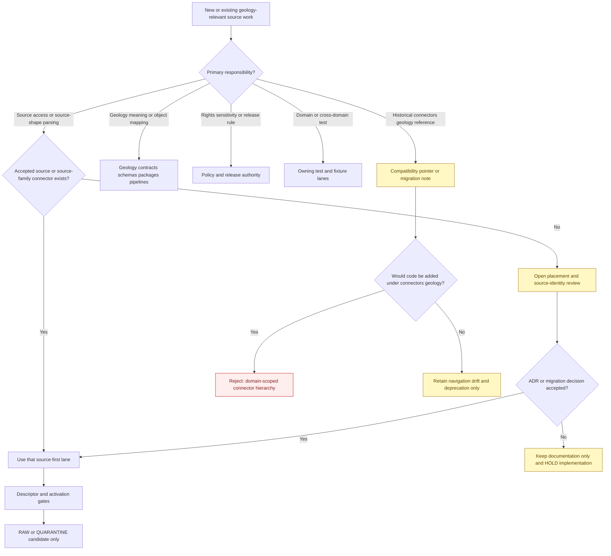
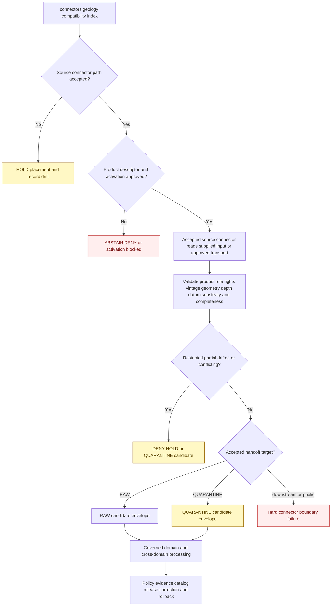

<!-- [KFM_META_BLOCK_V2]
doc_id: kfm://doc/connectors-geology-readme
title: connectors/geology/ — Geology Connector Compatibility Index
type: readme
version: v0.2
status: draft
owners: OWNER_TBD — Connector steward · Source steward · Geology steward · Hydrology steward · Environment steward · Natural-resources steward · Rights reviewer · Privacy/sensitivity reviewer · Security reviewer · Validation steward · Docs steward
created: 2026-06-18
updated: 2026-07-11
policy_label: public-doctrine; compatibility-index; documentation-only; noncanonical-implementation-path; source-first-connectors; path-conflict; product-specific-roles; rights-gated; sensitive-subsurface-locations; one-capture-multi-domain; no-code; no-descriptor; no-activation; no-publication
proposed_path: connectors/geology/README.md
truth_posture: CONFIRMED documentation-only domain-scoped directory with one KGS compatibility child / source-first connector doctrine rejects connectors/geology as a runtime source hierarchy / source connector paths remain mixed and conflicted / no connector activation, lifecycle authority, or publication authority
related:
  - ../README.md
  - kgs/README.md
  - ../kgs/README.md
  - ../ksgs/README.md
  - ../ksgs/pyproject.toml
  - ../ksgs/src/README.md
  - ../ksgs/src/ksgs/README.md
  - ../ksgs/tests/README.md
  - ../kgs_surficial/README.md
  - ../kgs_bedrock/README.md
  - ../kgs_oil_gas_wells/README.md
  - ../kgs_kdhe_wwc5/README.md
  - ../kgs_las/README.md
  - ../kcc_oil_gas_reg/README.md
  - ../usgs/README.md
  - ../usgs_ngmdb/README.md
  - ../usgs_mrds/README.md
  - ../usgs-earthquake/README.md
  - ../kansas/README.md
  - ../../docs/domains/geology/README.md
  - ../../docs/domains/geology/CANONICAL_PATHS.md
  - ../../docs/domains/geology/SOURCES.md
  - ../../docs/domains/geology/SOURCE_REGISTRY.md
  - ../../docs/domains/geology/DATA_LIFECYCLE.md
  - ../../docs/domains/hydrology/README.md
  - ../../docs/domains/environment/README.md
  - ../../docs/sources/catalog/kansas/ksgs.md
  - ../../docs/sources/catalog/kansas/kcc-oil-gas-reg.md
  - ../../docs/sources/catalog/usgs/README.md
  - ../../docs/sources/catalog/usgs/usgs-ngmdb.md
  - ../../docs/sources/catalog/usgs/usgs-mrds.md
  - ../../data/registry/sources/
  - ../../data/registry/geology/
  - ../../data/raw/geology/README.md
  - ../../data/quarantine/geology/
  - ../../tests/domains/geology/
  - ../../fixtures/domains/geology/README.md
  - ../../schemas/contracts/v1/source/
  - ../../policy/domains/geology/
  - ../../policy/sensitivity/
  - ../../policy/rights/
  - ../../release/
tags: [kfm, connectors, geology, natural-resources, compatibility, source-first, kgs, ksgs, kcc, usgs, ngmdb, mrds, wells, boreholes, geologic-maps, mineral-resources, rights, sensitivity, raw, quarantine, governance]
notes:
  - "Repository inspection confirms that connectors/geology/ is documentation-only in the inspected state: this parent README plus the KGS compatibility child README; no package metadata, source tree, importable module, descriptor, fixture, executable test, credential configuration, activation record, payload, cache, lifecycle writer, or CI evidence is proved below this domain-scoped directory."
  - "Geology canonical-path doctrine explicitly organizes connectors by source at connectors/<source_id>/ and rejects a connectors/geology/<source> implementation hierarchy. This directory is therefore a compatibility, navigation, and drift-index surface unless an accepted ADR changes that rule."
  - "The live source topology is mixed: KGS appears through connectors/kgs/, a documentation/package-shaped connectors/ksgs/ scaffold, multiple top-level kgs_* product pointers, and a catalog-proposed connectors/kansas/kgs/ path that was not found in the inspected tree; USGS uses both a family lane and compound product lanes; KCC uses a top-level compatibility path while its source profile proposes a Kansas-family lane."
  - "This index reports those conflicts without selecting a canonical path by convenience. Every active source and product still requires an accepted SourceDescriptor, source role, rights review, sensitivity posture, access contract, fixture set, tests, and SourceActivationDecision."
  - "Geologic maps, wells, logs, production totals, mineral occurrences, regulatory filings, interpreted surfaces, seismic events, and carrier portals are materially different evidence classes. Source roles, scale, vintage, depth, datum, geometry uncertainty, aggregation scope, and interpretation lineage must not collapse."
  - "Exact wells, boreholes, samples, mineral targets, private-property context, infrastructure-adjacent locations, PLSS-derived coordinates, and culturally sensitive sites fail closed. This directory performs no source admission, redaction, lifecycle transition, evidence closure, release, or publication."
[/KFM_META_BLOCK_V2] -->

<a id="top"></a>

# Geology Connector Compatibility Index

> Documentation-only compatibility and navigation surface for geology-relevant source connectors. Under the current repository posture, source access belongs in one explicitly accepted source or source-family lane beneath `connectors/`; Geology interpretation belongs downstream in the Geology responsibility lanes. This directory is not a runtime connector family.

<p>
  
  
  
  
  
  
  
</p>

`connectors/geology/`

> [!IMPORTANT]
> **Confirmed inspected state:** this directory contains this README and the `kgs/README.md` compatibility child. No connector package, client, parser, product dispatcher, source tree, package metadata, SourceDescriptor, activation decision, credential mode, fixture set, executable test suite, source payload, cache, RAW writer, watcher, or passing CI evidence is confirmed beneath `connectors/geology/`.

> [!CAUTION]
> **Placement rule:** Geology canonical-path doctrine states that connectors are organized by source, not by consumer domain. A source used primarily by Geology does not therefore belong at `connectors/geology/<source>/`. The current KGS child remains documentation-only, and no new source child should be created here without an accepted ADR and migration plan.

**Quick jumps:** [Purpose](#purpose) · [Placement decision](#placement-decision) · [Verified repository state](#verified-repository-state) · [Evidence ledger](#evidence-ledger) · [Compatibility responsibilities](#compatibility-responsibilities) · [Forbidden responsibilities](#forbidden-responsibilities) · [Source-first connector navigation](#source-first-connector-navigation) · [Unresolved connector-path drift](#unresolved-connector-path-drift) · [Geology source semantics](#geology-source-semantics) · [Source-role anti-collapse](#source-role-anti-collapse) · [Rights terms and attribution](#rights-terms-and-attribution) · [Sensitivity subsurface locations and geoprivacy](#sensitivity-subsurface-locations-and-geoprivacy) · [Geometry scale depth datum and uncertainty](#geometry-scale-depth-datum-and-uncertainty) · [Temporal vintage and completeness boundaries](#temporal-vintage-and-completeness-boundaries) · [Metadata preservation](#metadata-preservation) · [Join-induced sensitivity and cross-domain routing](#join-induced-sensitivity-and-cross-domain-routing) · [Repository responsibility map](#repository-responsibility-map) · [Placement decision flow](#placement-decision-flow) · [Admission and lifecycle boundary](#admission-and-lifecycle-boundary) · [Finite compatibility outcomes](#finite-compatibility-outcomes) · [Child-path policy](#child-path-policy) · [Migration and deprecation](#migration-and-deprecation) · [Review and rollback](#review-and-rollback) · [Definition of done](#definition-of-done) · [Verification backlog](#verification-backlog)

---

## Purpose

This README prevents `connectors/geology/` from hardening into a second connector hierarchy organized by the domain that consumes data rather than the source that supplies it.

It may:

- explain the source-first connector placement rule for geology-relevant sources;
- redirect historical, generated, or proposed domain-scoped connector references to reviewed source or source-family lanes;
- index KGS, KCC, USGS, NGMDB, MRDS, earthquake, map, well, log, mineral, and other geology-relevant connector documentation;
- expose unresolved path, slug, package, product, registry, and source-role conflicts;
- preserve source-role, rights, disclaimer, vintage, scale, geometry, depth, datum, uncertainty, aggregation, interpretation, and sensitivity warnings;
- identify the Geology, Hydrology, Environment, Hazards, Infrastructure, Soil, and cross-domain responsibility lanes that take over after source admission;
- prevent duplicate source capture when one source serves more than one domain;
- document migration, deprecation, rollback, backlink, and template-cleanup work;
- prevent connector output from being mistaken for geology truth, operational status, regulatory authority, engineering guidance, evidence closure, or public release.

It does **not**:

- host source clients, parsers, package code, product dispatch, credentials, tests, fixtures, descriptors, or activation state;
- choose canonical connector paths when repository evidence is conflicted;
- assign source roles, rights, sensitivity, cadence, freshness, or release class;
- fetch or store KGS, KCC, USGS, NGMDB, MRDS, LAS, WWC5, seismic, map, well, or mineral-resource material;
- define canonical geology object identity, stratigraphic interpretation, borehole identity, mineral occurrence truth, reserve estimates, regulatory conclusions, or hazard status;
- perform cross-source joins, geometry repair, public redaction, evidence closure, release, correction, or publication.

[Back to top ↑](#top)

---

## Placement decision

Current doctrine and repository evidence support a firm parent-directory decision even though several source-specific paths remain unresolved.

| Question | Current safe decision | Evidence posture |
|---|---|---:|
| Is `connectors/geology/` a canonical runtime connector-family root? | **No.** Treat it as a documentation-only compatibility and navigation index. | Geology canonical-path doctrine uses `connectors/<source_id>/` and explicitly says connectors are organized by source rather than domain. |
| May source implementations be added under `connectors/geology/<source>/`? | **No, absent an accepted ADR.** | Domain placement duplicates source identity, credentials, activation, fixtures, tests, lineage, and rollback across consumers. |
| What is the status of `connectors/geology/kgs/`? | Documentation-only compatibility pointer. | The child is README-only and its v0.2 contract prohibits implementation. |
| Where should geology-relevant source access live? | In one reviewed source or source-family lane under `connectors/`. | Examples include USGS-family/product lanes and the unresolved KGS/KCC source-family candidates. |
| Where should geology-specific interpretation live? | In Geology contracts, schemas, packages, pipelines, policies, tests, fixtures, lifecycle, evidence, catalog, and release lanes after admission. | Source access and domain interpretation are separate responsibilities. |
| May one source be fetched independently for Geology and Hydrology? | **No by convenience.** Capture once under the accepted source identity, then project lineage-preserving candidates to each domain. | Duplicate capture fragments rights, corrections, checksums, activation, and rollback. |
| Can this parent-directory decision change? | Yes, only through an accepted ADR or migration decision. | A change must cover ownership, code, descriptors, credentials, tests, fixtures, source IDs, data lineage, backlinks, compatibility paths, correction, and rollback. |

> [!CAUTION]
> A topic-heavy source, generated skeleton, historical link, product-specific README, package-shaped directory, or source catalog proposal does not establish a canonical implementation home. Directory presence is evidence of presence, not authority.

[Back to top ↑](#top)

---

## Verified repository state

The following relationship is confirmed or directly evidenced on the repository's default branch at the time of this update:

```text
connectors/
├── geology/
│   ├── README.md                         # this compatibility index
│   └── kgs/
│       └── README.md                     # README-only compatibility pointer
├── kgs/
│   └── README.md                         # top-level compatibility lane
├── ksgs/
│   ├── README.md                         # slug-compatibility lane
│   ├── pyproject.toml                    # project name + version 0.0.0 only
│   ├── src/
│   │   ├── README.md                     # source-layout documentation
│   │   └── ksgs/
│   │       └── README.md                 # package documentation; modules unproved
│   └── tests/
│       └── README.md                     # documentation-only test boundary
├── kgs_surficial/
│   └── README.md                         # compatibility product path
├── kgs_bedrock/
│   └── README.md                         # compatibility product path
├── kgs_oil_gas_wells/
│   └── README.md                         # compatibility product path
├── kgs_kdhe_wwc5/
│   └── README.md                         # compatibility joint-program path
├── kgs_las/
│   └── README.md                         # compatibility product path
├── kcc_oil_gas_reg/
│   └── README.md                         # top-level regulatory compatibility path
├── usgs/
│   └── README.md                         # USGS family coordination lane
├── usgs_ngmdb/
│   └── README.md                         # draft compound NGMDB lane
├── usgs_mrds/
│   └── README.md                         # draft compound MRDS lane
└── usgs-earthquake/
    └── README.md                         # source/product lane; maturity separately governed
```

The KGS source catalog proposes `connectors/kansas/kgs/`, and the KCC source profile proposes `connectors/kansas/kcc-oil-gas-reg/`. Those proposals do not by themselves prove that the child paths exist, contain implementation, or are activated. The updated KGS child specifically records that `connectors/kansas/kgs/` was not present in its inspected tree.

### Current maturity

| Surface | Confirmed content | Maturity |
|---|---|---:|
| `connectors/geology/README.md` | This compatibility and navigation contract. | **DOCUMENTED / NONCANONICAL IMPLEMENTATION PATH** |
| `connectors/geology/kgs/README.md` | KGS placement-conflict and safety pointer. | **DOCUMENTED / README-ONLY** |
| Other content below `connectors/geology/` | None found in the inspected search. | **ABSENT / NEEDS CONTINUOUS VERIFICATION** |
| Runtime code below `connectors/geology/` | None confirmed. | **ABSENT / FORBIDDEN UNDER CURRENT POSTURE** |
| Descriptors, activation, credentials, fixtures, or tests below `connectors/geology/` | None confirmed. | **ABSENT / FORBIDDEN** |
| KGS source connector topology | Multiple compatibility/proposed paths with no accepted winner. | **CRITICAL PATH CONFLICT** |
| `connectors/ksgs/` implementation | Incomplete package metadata and documentation-only source/test trees. | **GREENFIELD / NONCANONICAL / EXECUTABLE BEHAVIOR UNPROVED** |
| USGS family and product lanes | Source-first documentation exists in family, sibling, and compound forms. | **MIXED DRAFT / PATH CONVENTION UNRESOLVED** |
| KCC oil/gas regulatory path | Top-level compatibility README; Kansas-family target named by source profile. | **DOCUMENTED / MIGRATION UNVERIFIED** |
| Product-specific SourceDescriptors and activation decisions | None established by this directory. | **EXTERNAL / NEEDS VERIFICATION** |
| Connector execution or CI authority owned here | None. | **FORBIDDEN** |
| Publication authority owned here | None. | **FORBIDDEN** |

[Back to top ↑](#top)

---

## Evidence ledger

| Evidence | Status | What it supports | What it does not support |
|---|---:|---|---|
| `connectors/README.md` | **CONFIRMED root contract** | Connectors are source-admission implementation lanes and normally use `connectors/<source-or-product>/`; they stop at RAW, QUARANTINE, or approved receipt/candidate boundaries. | A single settled naming pattern for every existing source. |
| `docs/domains/geology/CANONICAL_PATHS.md` | **CONFIRMED doctrine-derived register** | Geology connectors are organized by source, not under a `connectors/geology/` domain lane. | Which conflicted KGS, KCC, or USGS path is the final canonical source lane. |
| `connectors/geology/README.md` and current path search | **CONFIRMED for inspected state** | The parent is documentation-only and has one KGS README child. | Permanent absence of future compatibility material. |
| `connectors/geology/kgs/README.md` v0.2 | **CONFIRMED** | The KGS child is inert; KGS path/slug/product conflicts and safety boundaries are documented. | An accepted KGS source path or executable connector. |
| `connectors/kgs/README.md` | **CONFIRMED compatibility documentation** | A top-level KGS compatibility path exists. | Canonical KGS authority or implementation. |
| `connectors/ksgs/` documentation and placeholder `pyproject.toml` | **CONFIRMED scaffold** | A `ksgs` package-shaped lane was anticipated. | Installability, package modules, tests, source activation, or canonicality. |
| Top-level `connectors/kgs_*` READMEs | **CONFIRMED compatibility/product documentation** | KGS product boundaries were anticipated. | Independent product connector authority, code, activation, or release readiness. |
| `docs/sources/catalog/kansas/ksgs.md` | **CONFIRMED draft source profile** | KGS is a multi-product Kansas publisher; the catalog proposes `connectors/kansas/kgs/` and preserves `ksgs`/`kgs` drift. | Live child presence, current endpoints, rights clearance, or activation. |
| `connectors/kcc_oil_gas_reg/README.md` | **CONFIRMED compatibility documentation** | KCC records are regulatory and must remain separate from KGS geology/production evidence; a Kansas-family target is proposed. | Live canonical KCC implementation or source activation. |
| `connectors/usgs/README.md` | **CONFIRMED family documentation** | USGS is a multi-product source family with product-specific roles, rights, cadence, and activation. | Ratified placement of every USGS product lane. |
| `connectors/usgs_ngmdb/README.md` | **CONFIRMED draft compound lane** | NGMDB preserves map identity, scale, vintage, publisher, distribution, and interpretation lineage. | Canonical connector-home convention or executable parser. |
| `connectors/usgs_mrds/README.md` | **CONFIRMED draft compound lane** | MRDS is a historical, heterogeneous compilation with record identity and location uncertainty requirements. | Current site truth, active status, or executable connector. |
| Geology fixtures and lifecycle documentation | **CONFIRMED documentation surfaces** | Domain testing, source-role, lifecycle, and fixture responsibilities exist outside this index. | Executable enforcement, fixture safety, or passing CI unless separately proved. |

[Back to top ↑](#top)

---

## Compatibility responsibilities

This directory may contain only documentation needed to prevent domain-scoped connector drift.

Allowed responsibilities:

- parent-level navigation to source or source-family connector documentation;
- compatibility notices for historical `connectors/geology/...` references;
- migration inventories, tombstone plans, backlink maps, and deprecation notes;
- summaries of unresolved source-path, slug, package, product, and registry conflicts;
- source-role anti-collapse warnings shared across geology-relevant sources;
- rights, disclaimer, sensitivity, geometry, scale, depth, datum, vintage, uncertainty, and completeness warnings;
- one-capture/multi-domain routing guidance;
- pointers to Geology contracts, schemas, packages, pipelines, policies, tests, fixtures, lifecycle stores, evidence, catalog, and release lanes;
- correction of documentation that treats connector output as geology truth or public release.

Every compatibility statement must distinguish:

```text
CONFIRMED repository evidence
PROPOSED placement or product design
CONFLICTED path or role posture
NEEDS VERIFICATION implementation or governance state
```

[Back to top ↑](#top)

---

## Forbidden responsibilities

Do not place or implement the following beneath `connectors/geology/`:

| Forbidden content or behavior | Correct responsibility or handling |
|---|---|
| Source clients, fetchers, scrapers, API adapters, database readers, map-service readers, archive downloaders, or watchers | One accepted source or source-family connector lane. |
| Python, JavaScript, shell, SQL, notebook, package, or build configuration | The reviewed source connector's implementation package. |
| SourceDescriptors or SourceActivationDecisions | Accepted source registry and activation workflow. |
| Endpoint, account, token, cookie, key, session, browser, or credential configuration | External security and credential-management systems plus the accepted source connector. |
| Connector-local fixtures or tests | The accepted source connector's test lane; domain interpretation fixtures/tests remain in Geology responsibility roots. |
| KGS, KCC, USGS, NGMDB, MRDS, LAS, WWC5, map, well, production, mineral, or earthquake payloads | Governed RAW, QUARANTINE, or approved fixture storage. |
| Caches, extracted archives, retry queues, temporary downloads, or database mirrors | Explicit restricted runtime storage with retention and cleanup controls. |
| Canonical geology, hydrology, environment, hazard, infrastructure, or soil objects | Domain contracts, schemas, packages, pipelines, and review. |
| Rights, sensitivity, geoprivacy, exact-location, attribution, disclaimer, or release rules | `policy/`, source registry, and release authority. |
| Crosswalk or conflation decisions | Downstream domain or cross-domain pipelines with confidence and lineage. |
| RAW, WORK, QUARANTINE, PROCESSED, CATALOG, TRIPLET, PROOF, RECEIPT, RELEASE, PUBLISHED, API, map, report, graph, search, or generated-answer writers | Owning lifecycle, evidence, release, and application surfaces. |
| Public operational, engineering, drilling, excavation, water-supply, reserve, legal, regulatory-status, hazard, or safety guidance | Governed specialist and public-product processes after evidence and release gates. |

A compatibility child must not become a convenient place to bypass unresolved source placement.

[Back to top ↑](#top)

---

## Source-first connector navigation

The table below is a navigation and conflict index. Presence of a README does not prove implementation, activation, rights clearance, current endpoint support, test coverage, or release readiness.

| Source or product family | Current connector documentation | Source meaning and primary caution | Placement posture |
|---|---|---|---|
| Kansas Geological Survey family | `../kgs/`, `../ksgs/`, `kgs/`, top-level `../kgs_*` paths; catalog proposes `connectors/kansas/kgs/` | Multi-product maps, wells, production, WWC5, LAS, tops, and Geoportal material; roles and sensitivity vary by product. | **CRITICAL CONFLICT / ADR REQUIRED** |
| KGS surficial geology | `../kgs_surficial/` | Vintage- and scale-specific compiled geologic/geomorphic context. | **COMPATIBILITY PATH** |
| KGS bedrock geology | `../kgs_bedrock/` | Bedrock unit/map context with nomenclature, scale, geometry, and vintage. | **COMPATIBILITY PATH** |
| KGS oil/gas wells | `../kgs_oil_gas_wells/` | Well observations and source records; not KCC permits or regulatory findings. | **COMPATIBILITY PATH** |
| KGS/KDHE WWC5 | `../kgs_kdhe_wwc5/` | Joint-program well-completion evidence with private-well and PLSS uncertainty risks. | **COMPATIBILITY / JOINT-PROGRAM GOVERNANCE OPEN** |
| KGS LAS and well tops | `../kgs_las/` | Depth-indexed measurements plus separate interpreted picks; logs and interpretations must not collapse. | **COMPATIBILITY PATH** |
| Kansas Corporation Commission oil/gas regulatory records | `../kcc_oil_gas_reg/`; source profile proposes a Kansas-family child | Regulatory permits, filings, compliance, enforcement, plugging, and related records; not geology or production truth. | **COMPATIBILITY / MIGRATION UNVERIFIED** |
| USGS family | `../usgs/` | Multi-product federal source family spanning geology, hydrology, terrain, hazards, and names. | **SOURCE-FAMILY COORDINATION / PRODUCT PLACEMENT MIXED** |
| USGS NGMDB | `../usgs_ngmdb/` | Geologic-map index/distribution and interpreted map evidence; scale, author, publisher, vintage, and format are load-bearing. | **DRAFT COMPOUND LANE / ADR-CLASS** |
| USGS MRDS | `../usgs_mrds/` | Historical mineral-resource compilation; administrative/candidate posture dominates unless stronger provenance exists. | **DRAFT COMPOUND LANE / ADR-CLASS** |
| USGS earthquake products | `../usgs-earthquake/` | Seismic event observations and related products; not public alerting, structural damage, or site-safety authority. | **SOURCE/PRODUCT LANE / MATURITY SEPARATELY GOVERNED** |
| USGS carrier portals | USGS family and product pages | Discovery or distribution surfaces such as catalogs and map portals; carrier identity does not determine product role. | **PRODUCT DESCRIPTOR REQUIRED** |

> [!IMPORTANT]
> Source-first does not mean that every current top-level path is canonical. It means the accepted implementation must be organized around the upstream source or source family, not duplicated beneath `connectors/geology/` because Geology is a consumer.

[Back to top ↑](#top)

---

## Unresolved connector-path drift

The current repository contains several incompatible connector-placement patterns. This index records them; it does not normalize them by renaming files or blessing the most complete-looking scaffold.

| Drift area | Confirmed conflict | Required posture |
|---|---|---|
| Domain-scoped Geology root | `connectors/geology/` and `connectors/geology/kgs/` exist, while Geology path doctrine says connectors use source-first homes. | Keep this directory inert; no new source children. |
| KGS source identity | `kgs`, `ksgs`, catalog slug `ksgs`, proposed Kansas-family `kgs`, and product-specific `kgs_*` paths coexist. | Resolve through ADR/migration; no silent aliases. |
| KGS implementation location | Geology doctrine names `connectors/kgs/`; the source catalog proposes `connectors/kansas/kgs/`; the live `connectors/ksgs/` scaffold is noncanonical. | Select one source connector, one package, and one test lane through accepted governance. |
| KCC location and spelling | Top-level snake-case `kcc_oil_gas_reg` exists; the source profile proposes Kansas-family kebab-case `kcc-oil-gas-reg`. | Preserve compatibility; do not infer canonicality from profile prose alone without live migration evidence. |
| USGS family/product topology | `connectors/usgs/`, sibling `usgs-earthquake`, and compound underscore paths `usgs_ngmdb` and `usgs_mrds` coexist. | Keep product boundaries explicit; settle path convention separately. |
| Product roots | KGS product paths exist as top-level compatibility lanes. | Do not activate them independently unless an ADR defines product packages and migration. |
| Source-role vocabulary | KGS docs use `context`; NGMDB docs use `interpreted`; repository-wide machine-role doctrine elsewhere uses seven canonical classes. | Treat `context` and `interpreted` as descriptive until an accepted role decision maps or rejects them. |
| Registry topology | Geology-related registry documentation appears in more than one path pattern. | Do not choose descriptor authority by adjacency; require accepted registry references. |
| RAW and quarantine slugs | Product/source slugs may differ across connector, catalog, package, and lifecycle examples. | Source-ID migration must preserve aliases, checksums, receipts, corrections, and lineage. |

A migration should freeze losing paths before moving code or data. Code growth is not a governance decision.

[Back to top ↑](#top)

---

## Geology source semantics

Geology-relevant sources represent different evidence classes. A shared consumer domain does not make those classes interchangeable.

| Source material | Source meaning | Appropriate downstream use | Must not become |
|---|---|---|---|
| Geologic-map bibliographic index | Administrative metadata about publications, map sheets, authors, publishers, series, scales, and distributions. | Discovery, citation, source inventory, and map selection. | Geologic-unit occurrence or site condition. |
| Compiled surficial or bedrock map | Vintage- and scale-specific interpreted geologic context. | Map-unit evidence with author, method, scale, geometry, and lineage. | Surveyed parcel truth, engineering-site condition, or current hazard determination. |
| Raster scan, GeoPDF, tile, or map image | Carrier for a published interpretation. | Visual/reference source with format and georeferencing evidence. | Automatically extracted complete vector topology or canonical unit boundaries. |
| Borehole or well header | Source-attributed administrative or observed well identity and location context. | Borehole/well candidate with stable keys, geometry source, depth, status, and dates. | Permit, current operating status, water availability, or engineering suitability without separate evidence. |
| Water-well completion record | Historical construction/completion evidence, sometimes with PLSS-derived location. | Hydrology/Geology candidate with uncertainty and joint-program provenance. | Current groundwater level, yield, potability, ownership, or legal-access conclusion. |
| LAS or other digital well-log curve | Depth-indexed measurement or instrument output with units, nulls, tool/run context, and depth reference. | Restricted subsurface measurement candidate. | Lithology, formation top, reserve estimate, engineering conclusion, or canonical stratigraphy. |
| Well top or structural pick | Interpretation tied to a well, interpreter, method, datum, depth, and version. | Modeled/interpreted candidate with confidence and source lineage. | Raw observation or universally accepted formation boundary. |
| Oil/gas production table | Aggregate or reporting-period record at a named well, lease, field, county, or product scope. | Aggregated production context with revision and period. | Instantaneous rate, reserve, resource estimate, landowner entitlement, or unrelated well fact. |
| KCC permit, filing, compliance, or enforcement record | Regulatory evidence from the competent regulator. | Regulatory-status candidate under explicit temporal and filing scope. | Subsurface geology, hydrocarbon occurrence, production measurement, or KGS observation. |
| MRDS mineral-resource record | Historical compilation with variable provenance, precision, maintenance state, and status. | Administrative/candidate mineral-occurrence context with uncertainty. | Current mine status, legal mineral right, reserve, economic viability, or exact sensitive target. |
| Earthquake catalog record | Source-attributed seismic event observation and measurement. | Event candidate with magnitude type, time, depth, uncertainty, and revision lineage. | Public alert, damage determination, fault attribution, site safety, or future forecast by connector inference. |
| Geoportal, catalog, index, or map-service layer | Access or distribution surface containing distinct products. | Product discovery and bounded retrieval after descriptor review. | One umbrella source role, license, sensitivity class, or activation decision. |
| Derived interpolation, resource surface, susceptibility layer, or model | Model output with method, training/input evidence, run/version, and uncertainty. | `modeled` context under a ModelRun-equivalent contract. | Observation merely because it is distributed by an authoritative publisher. |

[Back to top ↑](#top)

---

## Source-role anti-collapse

Source role is assigned to an admitted artifact by an accepted SourceDescriptor and remains fixed through parsing and promotion.

The repository-wide seven-class role vocabulary documented elsewhere is:

```text
observed | regulatory | modeled | aggregate | administrative | candidate | synthetic
```

Some geology source documentation also uses descriptive terms such as `context` and `interpreted`. Until an accepted ADR or descriptor mapping resolves those terms:

- do not emit `context` or `interpreted` as canonical machine roles merely because prose uses them;
- do not flatten every KGS, USGS, NGMDB, MRDS, KCC, or portal product to `observed`;
- do not invent a Geology-only role enum inside a connector;
- preserve the descriptive source intent and route role resolution to the source registry;
- reject product/role/authority mismatches rather than guessing.

### Anti-collapse matrix

| Forbidden collapse | Required posture |
|---|---|
| Geologic-map interpretation → observed site condition | Preserve map scale, vintage, method, author, uncertainty, and interpreted/model posture. |
| NGMDB bibliographic row → geologic occurrence | Preserve `administrative` metadata meaning. |
| KGS well record → KCC permit or compliance finding | Reject; publishers and roles are distinct. |
| KCC regulatory filing → geology, reservoir, production, or resource truth | Preserve regulatory scope only. |
| Production aggregate → single-well, parcel, operator, landowner, reserve, or current-rate fact | Preserve aggregation unit and reporting period; never downscale. |
| LAS curve → lithology, top, reserve, or engineering conclusion | Preserve measurements; interpretation is downstream. |
| Interpreted top or structural surface → raw observation | Preserve method, interpreter, confidence, datum, and version under `modeled` or accepted role. |
| MRDS historical record → current active mine or confirmed deposit | Preserve maintenance, provenance, status, precision, and candidate/administrative posture. |
| Earthquake event → public warning, damage, or fault-causation conclusion | Preserve event evidence; downstream hazard products require separate authority and release. |
| Carrier portal → content authority | Dispatch by exact product/resource descriptor, not portal identity. |
| Public source access → public-safe derivative | Continue through rights, sensitivity, evidence, and release gates. |
| Missing record → absence of a unit, well, mineral occurrence, fault, event, or resource | Abstain unless an accepted completeness or survey contract supports non-detection. |
| Lifecycle promotion → source-role upgrade | Role remains fixed; promotion cannot change evidence meaning. |

> [!IMPORTANT]
> A map polygon is not a parcel survey. A well ID is not a permit. A permit is not a geologic observation. A log curve is not a formation interpretation. A production total is not a reserve estimate. A mineral record is not a current mine. A connector candidate is not a released claim.

[Back to top ↑](#top)

---

## Rights, terms, and attribution

Rights and use constraints must be evaluated at the actual source, product, dataset, publication, layer, table, archive, map sheet, or record granularity.

Required context to preserve where supplied and applicable:

- publisher, joint publisher, program, institution, and source family;
- product, dataset, map sheet, publication, service, layer, table, archive, file, or distribution identity;
- source URI and access surface;
- raw license, terms, disclaimer, and use-constraint text;
- normalized rights interpretation from an external authority;
- rights holder and attribution/citation requirements;
- redistribution, derivative, commercial-use, access, embargo, or account restrictions;
- terms snapshot or review reference;
- retrieval time, product version, map vintage, and source update state;
- rights conflict, missing-rights, stale-terms, or review-required state.

| Rights condition | Required handling |
|---|---|
| Product-specific terms and citation are complete | Preserve exactly; continue only if descriptor and external rights decision permit. |
| Attribution or disclaimer is required | Carry exact text and source reference through every candidate. |
| Joint-program record | Preserve all publishers and the program identity; path naming does not decide ownership. |
| Additional source restriction exists | Preserve and elevate it; generic public-access assumptions cannot override it. |
| Terms are missing, stale, conflicting, or unparseable | `DENY`, `ABSTAIN`, `HOLD`, or QUARANTINE candidate. |
| Redistribution is barred or unclear | No release-bound candidate. |
| Public record carries disclaimers | Preserve disclaimers as governance metadata; public availability is not unrestricted reuse. |
| Rights change after capture | Preserve prior evidence and emit correction/drift signals; never silently rewrite provenance. |

This index does not parse licenses or make legal decisions. It records that source connectors and downstream release gates must retain obligations without collapsing them to a provider-wide default.

[Back to top ↑](#top)

---

## Sensitivity, subsurface locations, and geoprivacy

Geology and natural-resource sources can expose actionable subsurface, resource, infrastructure, private-land, or culturally sensitive information. A public portal or public license does not make every record safe to redistribute, join, or publish.

### Fail-closed classes

- exact private water-well locations;
- exact boreholes, cores, samples, test holes, mine workings, prospects, mineral targets, well logs, or small-site locations;
- landowner, driller, operator, permit-holder, royalty, lease, contact, or private-property context;
- active production, pipeline, injection, utility, or infrastructure-adjacent locations where precision increases harm;
- culturally sensitive geology, quarry, spring, cave, mineral, fossil, burial, sacred-site, or traditional-use context;
- source records already generalized, withheld, rounded, obscured, restricted, embargoed, or marked uncertain;
- locations inferred from PLSS township/range/section, quarter-section, legal description, parcel centroid, map centroid, or geocoding;
- joins with parcels, ownership, roads, trails, access points, facilities, pipelines, utilities, cultural knowledge, or living-person data;
- records whose rights, sensitivity, positional accuracy, source role, or intended-use posture cannot be evaluated.

### Required posture

1. Preserve source geometry and the exact source statement about how it was created.
2. Preserve upstream withholding, obscuration, rounding, generalization, and uncertainty.
3. Never recover withheld coordinates from legal descriptions, nearby records, imagery, map services, joins, or machine inference.
4. Route unresolved sensitivity to denial, abstention, hold, or quarantine.
5. Keep exact sensitive geometry and private context out of this directory, documentation examples, committed fixtures, logs, errors, metrics, test names, snapshots, embeddings, indexes, and generated output.
6. Apply redaction, deterministic generalization, masking, aggregation, or denial only downstream under accepted policy and receipt-bearing transforms.
7. Never use map styling, hidden layers, opacity, client filtering, browser authentication, or zoom thresholds as the sensitivity control.
8. Recalculate sensitivity after every material join.
9. Preserve cultural, sovereignty, stewardship, source-specific, and joint-program restrictions even when ordinary metadata is public.
10. Require correction, withdrawal, invalidation, and rollback support for every released derivative whose sensitivity posture later changes.

Hashing an identifier, deleting a field, rounding a coordinate, or displaying a generalized map does not by itself establish anonymization or public safety.

[Back to top ↑](#top)

---

## Geometry, scale, depth, datum, and uncertainty

Geometry and subsurface reference metadata are part of source meaning, not optional formatting.

Preserve where supplied and applicable:

- source geometry and geometry type;
- coordinate order and axis conventions;
- CRS and EPSG or other authority identifier;
- horizontal datum;
- vertical datum, elevation reference, and sign convention;
- map, compilation, survey, display, or service scale;
- raster or service resolution;
- coordinate precision, accuracy, and uncertainty;
- geometry source such as surveyed, reported, source-provided, geocoded, PLSS-derived, centroid, generalized, interpreted, modeled, or unknown;
- source locality and legal-description fields;
- depth units, depth reference, measured depth, true vertical depth, and sampling interval where relevant;
- well-log null values and curve units;
- map-unit topology, geometry validity, and source issue flags;
- original versus transformed geometry lineage and digests;
- disagreements among KGS, KCC, USGS, county, parcel, or other source geometries.

Connector code must not silently:

- snap, average, repair, geocode, reproject, densify, simplify, merge, split, conflate, or canonicalize source geometry;
- treat a map centroid as a feature location;
- treat a PLSS centroid as a surveyed wellhead;
- treat a small-scale polygon as site-level precision;
- convert measured depth and true vertical depth without an accepted transform contract;
- assign a vertical datum or unit by convenience;
- discard geometry disagreements or uncertainty.

### PLSS-derived coordinates

A future accepted source connector must preserve, when a coordinate comes from a legal description:

- the original township/range/section or finer legal description;
- the derivation method and software/version where known;
- section, quarter-section, quarter-quarter, or finer resolution;
- representative-point method;
- estimated uncertainty and units;
- whether the source or KFM derived the coordinate;
- original and transformed geometry references under restricted handling;
- review state and conflicts with source-supplied coordinates.

[Back to top ↑](#top)

---

## Temporal, vintage, and completeness boundaries

### Time and vintage

Keep these concepts distinct where material:

| Time kind | Meaning | Guardrail |
|---|---|---|
| Observation or collection time | When a measurement, sample, event, log run, map observation, or field record occurred. | Do not replace with retrieval time. |
| Well completion or construction time | When a well was completed or documented. | Does not prove current status, condition, use, yield, or water quality. |
| Permit, filing, compliance, or enforcement effective time | When a regulatory record applied. | Preserve temporal scope and supersession; do not infer geology. |
| Production reporting period | Month, quarter, year, or other interval summarized. | Preserve aggregation period; do not present as instantaneous rate. |
| Map or publication vintage | Edition, compilation, survey, revision, or publication version. | Do not label an old map current because it was recently downloaded. |
| Identification or interpretation time | When a unit, top, lithology, structure, occurrence, or model interpretation was assigned or revised. | An interpretation update is not a new observation. |
| Dataset or service update time | When the upstream product changed. | Preserve separately from source-event time. |
| Retrieval time | When KFM obtained the source material. | Required for provenance and staleness review. |
| Downstream release time | When a governed derivative was published. | Outside connector authority. |
| Correction or supersession time | When source or KFM evidence was corrected, withdrawn, or replaced. | Never silently overwrite prior evidence. |

### Completeness

Geology source products are not interchangeable complete censuses.

- one map sheet does not represent statewide current geology;
- one scale does not answer every spatial question;
- one portal layer does not represent every product from a publisher;
- one well database does not prove all wells are represented, active, or accurately located;
- one LAS archive does not prove every curve, run, well, top, or interval is present;
- one production table does not represent every well, lease, field, product, reserve, or reporting period;
- one MRDS extract does not prove current mineral status or complete occurrence coverage;
- one earthquake query does not prove an area had no seismic event outside the query limits;
- a missing record does not prove absence;
- a record count is meaningful only with product, query, layer, table, archive, geography, time range, version, and completeness evidence;
- partial pages, files, archive members, tables, layers, map sheets, or service responses require incomplete-capture outcomes;
- corrected, withdrawn, deprecated, or superseded records must remain traceable.

[Back to top ↑](#top)

---

## Metadata preservation

A future accepted source connector should preserve the following where supplied, permitted, and defined by accepted contracts.

### Source and admission minimum

- canonical source ID and product-specific SourceDescriptor reference;
- SourceActivationDecision reference;
- publisher, joint publisher, program, institution, and source family;
- exact product key and source surface;
- source role and role authority;
- source URI, endpoint, service, layer, table, archive, file, publication, map sheet, or distribution identity;
- rights, attribution, disclaimer, restriction, and external review references;
- sensitivity and restricted-handling references;
- source publication/update time, retrieval time, product version, and vintage;
- connector/parser version;
- content type, encoding, compression, schema, code-list, and format version;
- checksum/digest and content size;
- intended downstream domain routes;
- intended lifecycle target;
- partial, stale, corrected, superseded, sensitive, quarantined, and review flags.

### Product-specific minimum

- map title, author, publisher, series, year, edition, scale, unit legend/version, and distribution format;
- map, publication, dataset, record, layer, well, API, WWC5, permit, filing, MRDS, event, sample, core, or archive stable identifier;
- well/borehole geometry source, legal description, PLSS derivation, uncertainty, status, completion dates, depth references, and datums;
- LAS curve mnemonic, description, units, null value, start/stop/step, tool/run context, and checksum;
- interpreted top or surface source, interpreter, method, depth, datum, confidence, and version;
- aggregate scope, unit, reporting period, method, revision, and source composition;
- mineral-resource source attribution, maintenance state, location precision, status vocabulary, and candidate flags;
- earthquake event time, update time, magnitude type, depth, uncertainty, event identifier, review state, and revision lineage;
- source-native field names, code values, null/unknown semantics, and unsupported-field evidence;
- expected and received pages, files, archive members, rows, tables, records, or layers;
- accepted, rejected, quarantined, duplicate, and unresolved counts.

Unknown fields must not be silently dropped, guessed into Geology semantics, or exposed publicly. Restricted passthrough requires an accepted contract.

[Back to top ↑](#top)

---

## Join-induced sensitivity and cross-domain routing

A source record can become more sensitive or misleading when combined with other records. This directory neither performs nor authorizes those joins.

### High-risk joins

- well or borehole locations × parcels, landowners, addresses, access roads, or ownership;
- mineral occurrences × trails, property boundaries, extraction access, or cultural-use context;
- production or injection records × operators, private business information, pipelines, utilities, or critical infrastructure;
- WWC5 records × living-person, household, water-quality, medical, or private-well context;
- geologic maps × archaeology, burial, cave, fossil, sacred-site, or Indigenous knowledge;
- seismic events × infrastructure vulnerability, emergency response, or current public-safety status;
- regulatory records × geology observations without explicit authority and temporal separation;
- modeled susceptibility × property-level risk or legal/insurance decisions.

Required posture:

1. Evaluate the joined product, not only each source in isolation.
2. Recalculate sensitivity, rights, precision, aggregation, and release class after joins.
3. Preserve every source role, authority, timestamp, version, and disagreement.
4. Keep joins downstream under explicit contracts and review.
5. Route unresolved joins to denial, abstention, hold, or quarantine.
6. Do not infer a person's, property's, operator's, tribe's, community's, or facility's status from adjacency alone.

### One-capture rule

Capture a source product once under the accepted source identity. Route lineage-preserving candidates to Geology, Hydrology, Environment, Hazards, Infrastructure, Soil, or other approved consumers. Do not fetch or persist the same source independently for each domain merely because the downstream mappings differ.

[Back to top ↑](#top)

---

## Repository responsibility map

| Surface | Responsibility | Must not do |
|---|---|---|
| `connectors/geology/` | Compatibility index, navigation, placement conflicts, shared safety warnings, migration, and deprecation. | Fetch, parse, activate, store, test runtime behavior, or publish. |
| `connectors/geology/kgs/` | KGS-specific compatibility pointer and path-conflict documentation. | Become a KGS package, descriptor, fixture, test, credential, or lifecycle lane. |
| Accepted source connector | Product dispatch, supplied input or approved transport, source-shape parsing, metadata preservation, finite outcomes, and RAW/QUARANTINE candidate envelopes. | Decide final domain truth, own policy, or publish. |
| Source registry | Canonical source/product identity, role, rights, access, cadence, sensitivity, and activation. | Store source payloads or decide Geology truth. |
| Geology docs, contracts, and schemas | Define Geology meaning, object families, path discipline, and machine shapes. | Fetch source data or activate connectors. |
| Geology packages and pipelines | Map source evidence into geologic units, boreholes, logs, structures, mineral/resource candidates, and governed derivatives. | Duplicate source capture or silently rewrite evidence. |
| Hydrology packages and pipelines | Map water-well and groundwater-related evidence into hydrologic candidates and crosswalks. | Treat completion records as current water measurements or duplicate transport. |
| Environment, Hazards, Infrastructure, Soil, and cross-domain lanes | Handle produced-water, contamination, seismic, infrastructure, soil-parent-material, land, and other cross-domain meaning. | Collapse source authorities or bypass sensitivity and join review. |
| Connector-local tests | Prove source client, parser, metadata, finite error, and RAW/QUARANTINE boundaries offline. | Prove domain truth or use real sensitive locations by default. |
| Geology domain tests and fixtures | Prove object mapping, source-role anti-collapse, geometry/depth/datum rules, sensitivity, and domain semantics. | Duplicate connector transport or source activation. |
| Rights and sensitivity policy | Decide permitted use, restrictions, exact-location treatment, disclaimers, joins, transforms, and release prerequisites. | Fetch or parse source payloads. |
| Data lifecycle lanes | Store immutable source captures, quarantine, work, processed candidates, catalog/proof, and released derivatives under their own gates. | Treat directory presence as promotion. |
| Evidence and catalog surfaces | Close provenance, citations, versions, transforms, rights, review, and correction requirements. | Treat connector output as proof automatically. |
| Release surfaces | Approve publication, correction, supersession, withdrawal, and rollback. | Treat public-source availability, RAW, quarantine, redaction, or aggregation as release. |

[Back to top ↑](#top)

---

## Placement decision flow



The flow chooses a responsibility and placement. It does not activate a source or establish that any current connector path is production-ready.

[Back to top ↑](#top)

---

## Admission and lifecycle boundary

This compatibility index performs no source admission and no lifecycle transition.



KFM lifecycle discipline remains:

```text
RAW -> WORK / QUARANTINE -> PROCESSED -> CATALOG / TRIPLET -> PUBLISHED
```

This directory never constructs or persists even a candidate envelope. It only documents the boundaries that accepted source connectors and downstream stages must obey.

[Back to top ↑](#top)

---

## Finite compatibility outcomes

This documentation path should make placement and authority decisions deterministic.

| Request or condition | Required outcome |
|---|---|
| Add source code, package metadata, client, parser, watcher, or fetcher beneath `connectors/geology/` | Reject and route to a reviewed source-first connector. |
| Add SourceDescriptor or activation state here | Reject and route to the accepted source registry. |
| Add credentials, endpoint configuration, source payloads, maps, LAS files, tables, archives, or caches here | Reject and route to security/runtime/lifecycle ownership. |
| Add connector-local fixtures or executable tests here | Reject; use the accepted source connector test lane. |
| Create another `connectors/geology/<source>/` child | Reject absent an accepted ADR. |
| Treat `connectors/geology/kgs/` as implementation authority | Hard placement failure. |
| Declare a conflicted KGS, KCC, or USGS path canonical without accepted evidence | `HOLD`; record path drift. |
| Use `kgs` and `ksgs` as silent aliases | Reject; require identity and migration rules. |
| Treat top-level `kgs_*` paths as independent active connectors by directory presence | Reject; require product/package decision. |
| Product identity missing, mixed, or inferred from a carrier portal | Unsupported, `HOLD`, or QUARANTINE candidate in the owning source connector. |
| Source role absent, conflicted, or inferred from descriptive prose | Activation blocked; no permissive default. |
| Machine role `context` or `interpreted` inferred without accepted mapping | Hold for role resolution. |
| Rights, citation, attribution, disclaimer, or redistribution state unresolved | `DENY`, `ABSTAIN`, `HOLD`, or QUARANTINE candidate. |
| Exact sensitive well, borehole, sample, target, private, or cultural location present | Restrict, hold, deny, or quarantine; never public-safe by default. |
| PLSS-derived coordinate loses derivation or uncertainty | Hard geometry/provenance failure. |
| KGS observation emitted as KCC regulatory finding | Hard source-role failure. |
| KCC filing emitted as geology or production truth | Hard authority failure. |
| Production aggregate emitted as well-, parcel-, landowner-, reserve-, or current-rate truth | Hard aggregation failure. |
| LAS curve or interpreted top emitted as canonical geology or engineering advice | Hard semantic boundary failure. |
| Map compilation emitted as surveyed site condition | Hard scale/interpretation failure. |
| MRDS record emitted as current mine or legal mineral right | Hard temporal/authority failure. |
| Empty or missing source result interpreted as absence | Hard evidence-boundary failure. |
| Attempt to reconstruct withheld geometry | Hard sensitivity-boundary failure. |
| Attempted target beyond RAW or QUARANTINE in a source connector | Hard connector authority failure. |
| Direct lifecycle or public write attempted from this directory | Hard failure. |
| Public engineering, drilling, excavation, water-supply, reserve, legal, regulatory-status, hazard, or safety determination requested | Refuse and route to governed specialist/reviewer processes. |

[Back to top ↑](#top)

---

## Child-path policy

Under the current posture, `connectors/geology/` may contain compatibility documentation only.

The existing `kgs/` child should remain a one-file pointer unless an additional file is required for a formal migration, tombstone, backlink inventory, or accepted ADR implementation plan.

Do not add beneath this parent or any child:

- source code or package metadata;
- descriptors or activation records;
- endpoint or credential configuration;
- fixtures or executable tests;
- payloads, maps, logs, databases, archives, or caches;
- generated lifecycle data;
- watchers or schedules;
- product subdirectories;
- public artifacts.

Any proposal to ratify a domain-scoped implementation hierarchy must include:

1. an accepted ADR superseding the source-first connector rule;
2. a source-identity and slug model that prevents duplicate authority;
3. package, ownership, and credential boundaries;
4. migration of competing source-specific paths;
5. descriptor and activation migration;
6. fixture and test migration;
7. RAW/QUARANTINE lineage migration;
8. backlink, command, workflow, and template updates;
9. correction, withdrawal, rollback, and deprecation plans;
10. proof that multi-domain consumers do not trigger duplicate source capture.

[Back to top ↑](#top)

---

## Migration and deprecation

The repository should resolve geology-related connector topology deliberately rather than allowing the path with the most code or documentation to win accidentally.

### Migration inventory

A future review should inventory:

- every backlink to `connectors/geology/` and `connectors/geology/kgs/`;
- every backlink to `connectors/kgs/`, `connectors/ksgs/`, proposed `connectors/kansas/kgs/`, and all top-level `connectors/kgs_*` paths;
- every backlink to `connectors/kcc_oil_gas_reg/` and proposed Kansas-family KCC paths;
- USGS family, sibling-product, nested-product, and compound underscore references;
- source IDs, distribution names, Python import names, commands, environment variables, fixtures, tests, workflows, and CI labels using competing slugs;
- SourceDescriptors, activation decisions, registry entries, RAW/QUARANTINE paths, receipts, caches, evidence, catalog items, and release artifacts using old names;
- generated skeletons and templates that recreate domain-scoped or duplicate product connector paths;
- documentation that treats a proposed path as present, canonical, implemented, or activated;
- data lineage and correction references affected by source-ID or package migrations.

### Migration sequence

1. Accept a connector-path and source-identity ADR for each conflicted source family.
2. Select one source connector package and one connector-local test lane per source/product architecture.
3. Define product boundaries and product-specific descriptors.
4. Freeze losing paths against new runtime behavior.
5. Add negative placement tests before moving implementation.
6. Move or recreate code only after fixtures, contracts, and lineage plans exist.
7. Migrate descriptors and activation decisions without changing source meaning or role.
8. Preserve historical source IDs, checksums, receipts, aliases, and correction links through explicit supersession records.
9. Update backlinks, commands, workflows, fixtures, CI, lifecycle routes, and templates.
10. Verify that no duplicate source capture, active credential, cache, watcher, or schedule remains.
11. Choose an end state for each losing path:
    - retained compatibility pointer;
    - tombstone with replacement link;
    - removal after backlink cleanup;
    - documented historical alias with no runtime behavior.
12. Choose an end state for `connectors/geology/` itself:
    - retained compatibility/navigation index;
    - tombstone after all domain-scoped references are removed;
    - removal after backlink cleanup;
    - ADR-ratified grouping with explicit non-duplicating authority rules.

No code migration is required from this parent today because no parent runtime code is confirmed. The immediate task is preventing future divergence.

[Back to top ↑](#top)

---

## Review and rollback

Review every change to this directory as a connector-placement, source-identity, source-role, rights, sensitivity, geometry, subsurface-data, cross-domain-routing, and lifecycle-boundary change.

A reviewer should confirm:

- the directory remains documentation-only unless an accepted ADR says otherwise;
- implementation claims match the actual repository tree;
- source-first placement remains the default;
- no conflicted KGS, KCC, or USGS path is described as canonical without accepted evidence;
- source ID, connector slug, distribution name, import name, registry path, and lifecycle path conflicts remain visible;
- map, well, log, top, production, mineral, regulatory, earthquake, metadata, and carrier products remain distinct;
- observed, regulatory, modeled, aggregate, administrative, candidate, and synthetic roles are not collapsed;
- descriptive `context` and `interpreted` language is not silently emitted as machine role;
- rights, attribution, disclaimers, joint publishers, and product restrictions remain attached;
- exact sensitive wells, boreholes, samples, mineral targets, private locations, infrastructure, and cultural sites remain protected;
- PLSS derivation, map scale, vintage, depth, datum, geometry source, and uncertainty remain visible;
- one source capture serves multiple domains without duplicate transport;
- no child file writes to lifecycle, evidence, release, or public surfaces;
- no sensitive or consequential source data appears in docs, examples, fixtures, logs, or generated output;
- no documentation suggests engineering, drilling, excavation, water-supply, reserve, legal, regulatory-status, hazard, or safety authority.

Rollback is required if a change:

- adds executable connector behavior under this directory without an accepted placement decision;
- duplicates clients, parsers, descriptors, activation, credentials, fixtures, tests, caches, watchers, schedules, or source capture;
- creates a new domain-scoped source child;
- declares one conflicted source path canonical without an ADR or migration record;
- silently aliases source IDs or slugs;
- flattens products, roles, rights, disclaimers, scale, vintage, depth, datum, or uncertainty;
- treats source observations as regulatory authority or regulatory records as geology truth;
- reconstructs, exposes, or over-precisely joins sensitive locations;
- turns aggregates, models, interpretations, indexes, or carrier surfaces into observations;
- creates direct downstream or public writes;
- claims activation, implementation, coverage, rights clearance, sensitivity clearance, test status, or CI without evidence.

Rollback procedure:

1. Revert the unsafe or misleading parent or child documentation change.
2. Restore the documentation-only compatibility posture.
3. Remove or quarantine unapproved code, descriptors, credentials, fixtures, caches, payloads, maps, archives, logs, or sensitive records and assess repository-history exposure.
4. Revoke or rotate exposed credentials through the owning security system.
5. Move legitimate source-connector work to the path selected by accepted governance.
6. Move legitimate Geology, Hydrology, Environment, Hazards, Infrastructure, Soil, policy, test, fixture, evidence, catalog, or release work to its owning responsibility root.
7. Repair source IDs, roles, rights metadata, disclaimers, geometry/uncertainty, depths, datums, backlinks, workflows, lifecycle routes, and generated templates.
8. Record placement, slug, role, rights, sensitivity, schema, routing, or lifecycle drift in the appropriate register.
9. Trigger governed correction, invalidation, withdrawal, cleanup, and rollback for every affected downstream artifact.
10. Correct README badges and maturity claims to match evidence.

[Back to top ↑](#top)

---

## Definition of done

This compatibility index is not a completed connector implementation.

- [x] The current parent and KGS child documentation-only state is explicit.
- [x] Domain-scoped connector implementation is prohibited under the current source-first doctrine.
- [x] The source-first placement decision is separated from unresolved source-specific path choices.
- [x] KGS, KCC, USGS, NGMDB, MRDS, earthquake, and top-level product path patterns are visible.
- [x] KGS `kgs`/`ksgs`/Kansas-family/product-path conflict is explicit.
- [x] USGS family/sibling/compound-lane drift is explicit.
- [x] Source-role and descriptive-role vocabulary conflicts are explicit.
- [x] Geologic maps, wells, logs, tops, production, mineral records, regulatory filings, seismic events, and carrier portals are separated.
- [x] Rights, attribution, disclaimer, joint-program, and product-level restrictions are explicit.
- [x] Sensitive subsurface, private, infrastructure, cultural, and join-induced location risks fail closed.
- [x] PLSS derivation, map scale, vintage, geometry, depth, datum, aggregation, and uncertainty boundaries are explicit.
- [x] One-source-capture/multi-domain routing is explicit.
- [x] This directory performs no source admission, lifecycle transition, evidence closure, release, or publication.
- [ ] A source-path and slug ADR is accepted for every conflicted source family.
- [ ] Canonical source IDs, connector paths, distribution names, import names, and lifecycle slugs are accepted.
- [ ] Losing paths receive retained-pointer, tombstone, removal, or historical-alias decisions.
- [ ] Product-specific SourceDescriptors and SourceActivationDecisions exist for active products.
- [ ] Source roles and the `context`/`interpreted` vocabulary issue are resolved.
- [ ] Current source surfaces, access methods, schemas, terms, cadence, stable keys, corrections, and withdrawals are reviewed.
- [ ] Rights, disclaimer, sensitivity, PLSS uncertainty, exact-location, and join policies are executable and tested.
- [ ] Joint-program descriptor, publisher, citation, and rights rules are accepted.
- [ ] Each accepted source connector has one package, synthetic fixture authority, connector test lane, and no-network build/test command.
- [ ] Connector-result and RAW/QUARANTINE handoff contracts are accepted.
- [ ] Cross-domain routing and downstream invalidation are tested.
- [ ] CI wiring and placement-boundary enforcement exist.
- [ ] Backlinks and generated templates are inventoried and corrected.
- [ ] This directory receives an explicit retained-index, tombstone, removal, or ADR-ratified end state.
- [ ] No connector API creates canonical geology, hydrology, resource, regulatory, engineering, legal, hazard, safety, or public-release conclusions.

[Back to top ↑](#top)

---

## Verification backlog

| Item | Status | Needed evidence |
|---|---:|---|
| Confirm the complete `connectors/geology/` inventory, including empty or generated files not visible to code search. | **NEEDS CONTINUOUS VERIFICATION** | Repository tree inspection. |
| Confirm `kgs/README.md` remains the only child content under this directory. | **NEEDS CONTINUOUS VERIFICATION** | Repository tree and generated-file inspection. |
| Ratify this parent directory's final disposition. | **OPEN DECISION** | Retained index, tombstone, removal, or accepted ADR. |
| Resolve `connectors/kgs/` versus proposed `connectors/kansas/kgs/` versus live `connectors/ksgs/`. | **CRITICAL PATH CONFLICT** | Accepted source-path and package migration ADR. |
| Resolve canonical KGS source ID and `kgs` versus `ksgs` slug. | **CONFLICTED** | Source-identity ADR aligned with registry, package, lifecycle, and citations. |
| Decide the disposition of all top-level `connectors/kgs_*` product paths. | **OPEN DECISION** | Migration inventory and product-package architecture. |
| Confirm the canonical KCC oil/gas regulatory connector path and migrate the top-level compatibility path if required. | **NEEDS VERIFICATION** | Source profile, live tree, ADR/migration record, and tests. |
| Resolve USGS family, nested-product, sibling-product, and compound underscore connector conventions. | **ADR-CLASS / NEEDS VERIFICATION** | Connector-path convention and migration plan. |
| Resolve canonical source-registry topology for geology-relevant sources. | **CONFLICTED / NEEDS VERIFICATION** | Registry ADR and accepted descriptor references. |
| Create and approve product-specific SourceDescriptors. | **BLOCKED** | Source, role, rights, sensitivity, cadence, identity, and steward review. |
| Create SourceActivationDecisions for every enabled product and scope. | **BLOCKED** | Accepted descriptors and activation workflow. |
| Resolve the canonical role mapping for descriptive `context` and `interpreted` terminology. | **CONFLICTED / BLOCKED** | Source-role doctrine review and descriptor decisions. |
| Confirm current KGS map, well, production, WWC5, LAS, tops, and Geoportal source surfaces. | **NEEDS VERIFICATION** | Current source documentation, terms, source-steward review, and approved synthetic fixtures. |
| Confirm current KCC permits, filings, plugging, UIC, compliance, enforcement, and reporting surfaces. | **NEEDS VERIFICATION** | Current source documentation, regulatory steward review, and fixtures. |
| Confirm current NGMDB index, map, distribution, service, scale, and vintage behavior. | **NEEDS VERIFICATION** | Current source docs, map fixtures, transport tests, and product descriptor. |
| Confirm current MRDS distribution, maintenance/disposition state, schema, stable keys, and status semantics. | **NEEDS VERIFICATION** | Current source docs, historical fixtures, parser tests, and product descriptor. |
| Confirm current earthquake product boundaries, revisions, event identifiers, magnitude/depth uncertainty, and downstream alert separation. | **NEEDS VERIFICATION** | Source docs, descriptor, synthetic fixtures, and tests. |
| Confirm access methods, authentication, host allowlists, rate limits, pagination, archives, databases, map services, and file formats. | **NEEDS VERIFICATION** | Security/transport review and negative tests. |
| Confirm product schemas, code lists, null semantics, stable identifiers, corrections, withdrawals, and versioning. | **NEEDS VERIFICATION** | Pinned source docs, fixtures, parsers, and drift tests. |
| Confirm rights, attribution, redistribution, disclaimers, and product-specific restrictions. | **NEEDS VERIFICATION / DEFAULT DENY** | Rights policy, current terms snapshots, and negative tests. |
| Confirm sensitive well, borehole, sample, mineral-target, private-location, infrastructure, and cultural handling. | **NEEDS VERIFICATION / DEFAULT DENY** | Sensitivity policy, negative fixtures, transforms, receipts, and release tests. |
| Confirm PLSS derivation, resolution, coordinate uncertainty, CRS, horizontal/vertical datum, map scale, depth, and unit conventions. | **NEEDS VERIFICATION** | Product documentation, geometry/depth contracts, fixtures, and tests. |
| Confirm joint-program identity and governance for WWC5, KDHE, KDA-DWR/WIMAS-adjacent relationships, and other shared programs. | **OPEN / ADR-CLASS** | Descriptor, publisher, citation, rights, and responsibility decision. |
| Confirm KGS-to-KCC, KGS-to-USGS, KGS-to-KDHE, KGS-to-KDA-DWR, NGMDB-to-MRDS, and local crosswalk behavior without authority collapse. | **NEEDS VERIFICATION** | Crosswalk contracts, confidence rules, lineage tests, and reviewer decisions. |
| Define synthetic fixture authority and safe generation rules for geology connectors. | **NEEDS VERIFICATION** | Fixture policy, rights/sensitivity review, and reproducibility evidence. |
| Add executable negative-first tests to each accepted source connector. | **ABSENT / BLOCKED BY IMPLEMENTATION** | Accepted packages, descriptors, contracts, fixtures, and runner. |
| Select connector-result and RAW/QUARANTINE envelope contracts. | **NEEDS VERIFICATION** | Contracts, schemas, validators, and tests. |
| Confirm one-source-capture/multi-domain projection without duplicate downloads or credentials. | **NEEDS VERIFICATION** | Routing contract, lineage tests, and lifecycle design. |
| Confirm correction, derivative invalidation, cache cleanup, withdrawal, and rollback behavior. | **NEEDS VERIFICATION** | Runbooks, receipts, dependency graph, and tests. |
| Confirm CI integration and placement-boundary enforcement. | **UNKNOWN** | Workflow configuration, branch policy, and successful runs. |
| Inventory backlinks, skeletons, and generated templates that recreate domain-scoped or competing source paths. | **NEEDS VERIFICATION** | Repository-wide search and migration manifest. |

---

## Maintainer note

Keep geology source access singular, source-first, and product-specific. This directory exists to prevent path ambiguity, not to create another connector family. Preserve source identity, product roles, rights, disclaimers, map scale, vintage, geometry source, PLSS uncertainty, depth, datum, aggregation, interpretation lineage, joint-program provenance, and source disagreements. Treat exact wells, boreholes, samples, mineral targets, logs, private locations, infrastructure-adjacent locations, culturally sensitive sites, and harmful joins as fail-closed. Keep observations separate from regulatory authority, aggregates and interpretations separate from observations, carrier portals separate from product identity, and one source capture reusable by multiple governed domains. Stop every connector path before domain truth, lifecycle persistence beyond candidate handoff, evidence closure, release, or publication.

[Back to top ↑](#top)
