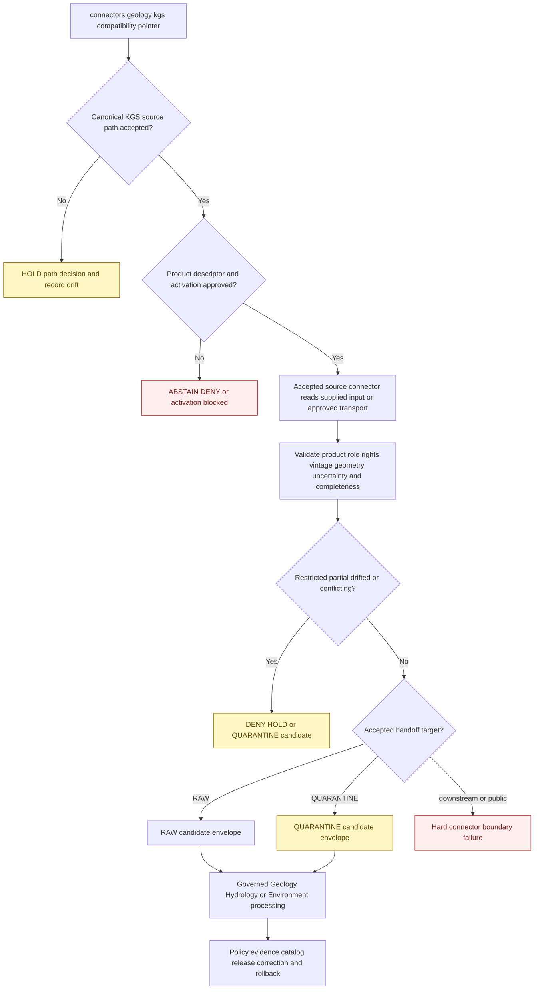

<!-- [KFM_META_BLOCK_V2]
doc_id: kfm://doc/connectors-geology-kgs-readme
title: connectors/geology/kgs/ — KGS Geology Compatibility Pointer
type: readme
version: v0.2
status: draft
owners: OWNER_TBD — Connector steward · KGS source steward · Geology steward · Hydrology steward · Environment steward · Rights reviewer · Privacy/sensitivity reviewer · Security reviewer · Validation steward · Docs steward
created: 2026-06-18
updated: 2026-07-11
policy_label: public-doctrine; compatibility-pointer; documentation-only; noncanonical-implementation-path; source-first-connectors; path-and-slug-conflict; product-specific-roles; rights-gated; sensitive-well-locations; no-code; no-descriptor; no-activation; no-publication
proposed_path: connectors/geology/kgs/README.md
truth_posture: CONFIRMED README-only domain-scoped child / source-first connector doctrine rejects connectors/geology/kgs as implementation home / KGS canonical source path CONFLICTED among connectors/kgs, proposed connectors/kansas/kgs, and live connectors/ksgs scaffold / executable connector behavior ABSENT / product descriptors and activation ABSENT / tests and CI ABSENT or UNKNOWN
related:
  - ../README.md
  - ../../README.md
  - ../../kgs/README.md
  - ../../ksgs/README.md
  - ../../ksgs/pyproject.toml
  - ../../ksgs/src/README.md
  - ../../ksgs/src/ksgs/README.md
  - ../../ksgs/tests/README.md
  - ../../kansas/README.md
  - ../../kgs_surficial/README.md
  - ../../kgs_bedrock/README.md
  - ../../kgs_oil_gas_wells/README.md
  - ../../kgs_kdhe_wwc5/README.md
  - ../../kgs_las/README.md
  - ../../../docs/sources/catalog/kansas/ksgs.md
  - ../../../docs/sources/catalog/kansas/kcc-oil-gas-reg.md
  - ../../../docs/domains/geology/README.md
  - ../../../docs/domains/geology/CANONICAL_PATHS.md
  - ../../../docs/domains/geology/SOURCES.md
  - ../../../docs/domains/geology/DATA_LIFECYCLE.md
  - ../../../docs/domains/hydrology/README.md
  - ../../../docs/domains/environment/README.md
  - ../../../data/registry/sources/
  - ../../../data/raw/geology/
  - ../../../data/raw/hydrology/
  - ../../../data/quarantine/geology/
  - ../../../data/quarantine/hydrology/
  - ../../../schemas/contracts/v1/source/
  - ../../../policy/sensitivity/
  - ../../../policy/rights/
  - ../../../release/
tags: [kfm, connectors, geology, kansas, kgs, ksgs, compatibility, source-first, surficial, bedrock, oil-gas, wwc5, las, geoportal, wells, rights, sensitivity, raw, quarantine, governance]
notes:
  - "Repository inspection confirms connectors/geology/kgs/ contains this README only; no package metadata, source tree, importable module, client, parser, descriptor, fixture, test, credential configuration, activation record, payload, cache, lifecycle writer, or CI evidence is proved below this path."
  - "Geology canonical-path doctrine explicitly organizes connectors by source at connectors/<source_id>/ and says a KGS connector does not belong under connectors/geology/kgs/."
  - "Repository placement is materially conflicted: Geology CANONICAL_PATHS names connectors/kgs/; the KGS source catalog proposes connectors/kansas/kgs/; that proposed child is absent; and the live connectors/ksgs/ path contains only a greenfield documentation/package scaffold whose own READMEs classify it as noncanonical."
  - "Top-level KGS product-specific README paths also exist for surficial geology, bedrock, oil-and-gas wells, WWC5, and LAS. Their presence does not establish canonical placement, implementation maturity, product activation, rights clearance, or publication readiness."
  - "KGS sub-products require independent SourceDescriptors, source roles, rights, cadence, sensitivity, geometry/uncertainty, fixtures, tests, and activation decisions. KGS observations must not collapse into KCC regulatory records, production aggregates, interpreted surfaces, or public operational claims."
  - "Exact borehole, sample, well-log, private-well, and other sensitive locations fail closed; PLSS-derived coordinates must retain their derivation and uncertainty; this compatibility path performs no redaction, lifecycle transition, or publication."
[/KFM_META_BLOCK_V2] -->

<a id="top"></a>

# KGS Geology Compatibility Pointer

> Documentation-only compatibility and path-conflict surface for historical or generated references to `connectors/geology/kgs/`. Under the current repository posture, KGS source access must live in one explicitly accepted **source-first** connector lane—not beneath a consumer-domain hierarchy. This path performs no fetching, parsing, activation, storage, testing, lifecycle handoff, or publication.

<p>
  
  
  
  
  
  
  
  
</p>

`connectors/geology/kgs/`

> [!IMPORTANT]
> **Confirmed state:** this directory contains this README only. No child package, client, product dispatcher, map-service adapter, well-record reader, WWC5 reader, LAS parser, configuration file, SourceDescriptor, activation decision, credential mode, fixture set, test suite, source payload, cache, RAW writer, watcher, or passing CI evidence is confirmed here.

> [!CAUTION]
> **Canonical placement is unresolved.** Geology canonical-path doctrine says connectors are source-first and names `connectors/kgs/`; the KGS source catalog proposes `connectors/kansas/kgs/`; that proposed child is not present; and the live `connectors/ksgs/` scaffold is explicitly documented as noncanonical and contains no executable implementation. **Do not select a winner by convenience, and do not add runtime behavior under this domain-scoped path.**

**Quick jumps:** [Purpose](#purpose) · [Placement decision](#placement-decision) · [Verified repository state](#verified-repository-state) · [Evidence ledger](#evidence-ledger) · [Compatibility responsibilities](#compatibility-responsibilities) · [Forbidden responsibilities](#forbidden-responsibilities) · [Path slug and package conflict](#path-slug-and-package-conflict) · [KGS product decomposition](#kgs-product-decomposition) · [Source-role anti-collapse](#source-role-anti-collapse) · [Rights terms and attribution](#rights-terms-and-attribution) · [Sensitivity geometry and uncertainty](#sensitivity-geometry-and-uncertainty) · [Temporal spatial and completeness boundaries](#temporal-spatial-and-completeness-boundaries) · [Metadata preservation](#metadata-preservation) · [Cross-domain routing and responsibility separation](#cross-domain-routing-and-responsibility-separation) · [Finite compatibility outcomes](#finite-compatibility-outcomes) · [Lifecycle boundary](#lifecycle-boundary) · [Child-path policy](#child-path-policy) · [Migration and deprecation](#migration-and-deprecation) · [Review and rollback](#review-and-rollback) · [Definition of done](#definition-of-done) · [Verification backlog](#verification-backlog)

---

## Purpose

This README prevents a domain-scoped KGS path from hardening into a second or fourth connector authority.

It may:

- redirect KGS implementation work away from `connectors/geology/kgs/`;
- explain the unresolved relationship among `connectors/kgs/`, `connectors/ksgs/`, proposed `connectors/kansas/kgs/`, and the top-level `connectors/kgs_*` product paths;
- preserve KGS product, source-role, rights, disclaimer, vintage, geometry, depth, datum, positional-uncertainty, and sensitivity warnings;
- identify the Geology, Hydrology, and Environment responsibility lanes that take over after source admission;
- record path drift, slug drift, migration work, correction needs, and deprecation choices;
- prevent KGS observations from becoming KCC regulatory findings, production aggregates from becoming well-level facts, interpreted tops or surfaces from becoming raw observations, and public source access from becoming publication permission;
- prevent sensitive well, borehole, sample, or private-land locations from being exposed through documentation, fixtures, logs, joins, maps, or generated output.

It does **not**:

- host a KGS implementation package;
- choose the canonical KGS connector path or slug;
- activate KGS or any KGS sub-product;
- assign source roles, rights, sensitivity, cadence, or release class;
- fetch a live source, parse a payload, manage credentials, stage downloads, or cache responses;
- define canonical KGS, Geology, Hydrology, KCC, KDHE, KDA-DWR, or USGS identities;
- map source records into canonical domain objects;
- perform public redaction, geometry generalization, evidence closure, release, or publication.

[Back to top ↑](#top)

---

## Placement decision

The current repository evidence supports one firm decision and leaves the final source path unresolved:

> **`connectors/geology/kgs/` is not an implementation home.**

| Question | Current safe decision | Evidence posture |
|---|---|---:|
| Is `connectors/geology/kgs/` a canonical connector package? | **No.** Treat it as a documentation-only compatibility pointer. | Geology path doctrine organizes connectors by source and explicitly rejects a `geology/` connector segment. |
| Where must KGS source access ultimately live? | In one accepted source-first or source-family connector lane after an ADR or migration decision. | Current repository and doctrine disagree on the exact lane. |
| Is `connectors/kgs/` canonical? | **Not established.** Geology path doctrine names it, but its own README classifies it as compatibility-only. | Conflicted documentation. |
| Is `connectors/kansas/kgs/` canonical? | **Proposed by the KGS source catalog, but absent from the inspected tree.** | Catalog assertion without live child path. |
| Is `connectors/ksgs/` canonical or operational? | **No.** It is the only implementation-shaped live scaffold, but its own docs label it noncanonical; its package and tests are documentation-only. | Confirmed scaffold, no executable behavior. |
| May this child own a KGS SourceDescriptor, client, parser, fixtures, or tests? | **No.** Use the accepted registry, source connector, connector-test, and domain-test lanes after placement is resolved. | Duplicate authority would fragment identity, rights, credentials, activation, lineage, and rollback. |
| May the top-level `kgs_*` product paths become independent implementations? | **No, not without an accepted migration or ADR.** | They are currently compatibility README paths. |
| Can the decision change? | Yes, through an accepted ADR or migration decision. | The change must cover naming, ownership, descriptors, code, credentials, tests, data lineage, backlinks, and rollback. |

> [!CAUTION]
> A source catalog statement, generated skeleton, directory name, source-heavy consumer domain, product-specific README, or incomplete `pyproject.toml` is not sufficient authority to create or activate a connector.

[Back to top ↑](#top)

---

## Verified repository state

The following relationship is confirmed on the repository's default branch at the time of this update:

```text
connectors/
├── geology/
│   ├── README.md                         # earlier coordination draft
│   └── kgs/
│       └── README.md                     # this compatibility pointer
├── kgs/
│   └── README.md                         # top-level compatibility README
├── ksgs/
│   ├── README.md                         # slug-compatibility README
│   ├── pyproject.toml                    # project name + version 0.0.0 only
│   ├── src/
│   │   ├── README.md                     # source-layout documentation
│   │   └── ksgs/
│   │       └── README.md                 # package-boundary documentation only
│   └── tests/
│       └── README.md                     # test-boundary documentation only
├── kansas/
│   └── README.md                         # Kansas family README; kgs child proposed
├── kgs_surficial/
│   └── README.md                         # compatibility product path
├── kgs_bedrock/
│   └── README.md                         # compatibility product path
├── kgs_oil_gas_wells/
│   └── README.md                         # compatibility product path
├── kgs_kdhe_wwc5/
│   └── README.md                         # compatibility joint-program path
└── kgs_las/
    └── README.md                         # compatibility product path
```

The KGS source catalog proposes this path, but it is not present in the inspected tree:

```text
connectors/kansas/kgs/
```

### Current maturity

| Surface | Confirmed content | Maturity |
|---|---|---:|
| `connectors/geology/kgs/README.md` | This compatibility and path-conflict contract. | **DOCUMENTED / NONCANONICAL IMPLEMENTATION PATH** |
| Other files below `connectors/geology/kgs/` | None found in current repository search. | **ABSENT / NEEDS CONTINUOUS VERIFICATION** |
| Runtime code below this child | None confirmed. | **ABSENT / FORBIDDEN UNDER CURRENT POSTURE** |
| Child descriptor, activation, credentials, fixtures, or tests | None confirmed. | **ABSENT / FORBIDDEN** |
| `connectors/kgs/` | README-only top-level compatibility lane. | **DOCUMENTED / NONCANONICAL** |
| `connectors/ksgs/pyproject.toml` | Distribution name `kfm-connector-ksgs` and version `0.0.0` only. | **INCOMPLETE** |
| `connectors/ksgs/src/ksgs/` | Package README only; no package modules found by current search. | **DOCUMENTATION-ONLY SCAFFOLD** |
| `connectors/ksgs/tests/` | Test README only. | **DOCUMENTATION-ONLY / EXECUTABLE TESTS ABSENT** |
| `connectors/kansas/kgs/` | Proposed by catalog, absent from inspected tree. | **PROPOSED / NOT PRESENT** |
| Top-level `kgs_*` product paths | README compatibility paths. | **MIXED DOCUMENTATION / NO IMPLEMENTATION EVIDENCE** |
| Product-specific SourceDescriptors | None found or verified during this update. | **ABSENT / BLOCKED** |
| SourceActivationDecisions | None found or verified. | **NOT ACTIVATED** |
| Current live endpoints and access methods | Not verified. | **UNKNOWN / NOT APPROVED** |
| Passing connector tests or CI | None confirmed. | **ABSENT / UNKNOWN** |
| Publication authority owned by this child | None. | **FORBIDDEN** |

> [!IMPORTANT]
> A package-shaped directory or product README does not prove installation, import safety, source compatibility, rights clearance, sensitivity clearance, activation, executable test coverage, or release readiness.

[Back to top ↑](#top)

---

## Evidence ledger

| Evidence | Status | What it supports | What it does not support |
|---|---:|---|---|
| `connectors/geology/kgs/README.md` and current path search | **CONFIRMED for inspected state** | This child exists and contains this README only. | Permanent absence of future files or ratified authority. |
| `docs/domains/geology/CANONICAL_PATHS.md` | **CONFIRMED doctrine-derived register** | Connectors are source-first, not domain-scoped; it names `connectors/kgs/` as the expected KGS form. | Final resolution of the live KGS path conflict. |
| `docs/sources/catalog/kansas/ksgs.md` | **CONFIRMED draft source profile** | KGS products, roles, rights, sensitivity, and proposed `connectors/kansas/kgs/` placement are documented. | Presence of that path, activation, current source behavior, or accepted descriptors. |
| `connectors/kgs/README.md` | **CONFIRMED documentation** | A top-level KGS compatibility lane exists. | Canonicality or executable behavior. |
| `connectors/ksgs/` scaffold | **CONFIRMED live scaffold** | A `ksgs` distribution placeholder plus source/test documentation exists. | Installability, package modules, active parsers, tests, or canonicality. |
| `connectors/kansas/README.md` | **CONFIRMED family documentation** | A Kansas source-family pattern is documented and a KGS child is proposed. | Presence or implementation of `connectors/kansas/kgs/`. |
| Top-level `connectors/kgs_*` READMEs | **CONFIRMED compatibility paths** | Product-specific names and safety concerns have documentation surfaces. | Independent activation, code, tests, or canonical product packages. |
| Geology and Hydrology domain documentation | **CONFIRMED doctrine and domain context** | KGS material can feed multiple domains after source admission. | Permission to duplicate source access by consumer domain. |
| KGS SourceDescriptor and activation evidence | **NOT FETCHED OR VERIFIED in this update** | Descriptor and activation work remains unresolved. | Proof that no record exists elsewhere or may be added later. |
| Connector-specific CI | **ABSENT / UNKNOWN** | CI requirements may be documented. | Merge enforcement or passing status. |

### Evidence conclusion

The evidence does **not** support a canonical runtime home at `connectors/geology/kgs/`, nor does it support declaring any competing KGS path operational. The only safe current use of this child is compatibility, navigation, and migration documentation.

[Back to top ↑](#top)

---

## Compatibility responsibilities

This child may contain only documentation that helps the repository converge on one source authority.

Allowed responsibilities:

- a minimal compatibility pointer;
- path and slug conflict documentation;
- migration inventories and backlink notes;
- product-boundary and source-role warnings;
- links to the KGS source catalog, Geology and Hydrology doctrine, candidate source lanes, and downstream responsibility roots;
- notes about rights, attribution, disclaimers, sensitivity, geometry uncertainty, map scale, depth reference, and product vintage;
- deprecation, tombstone, removal, or ADR-ratified end-state planning;
- rollback instructions for accidental implementation or sensitive-data placement.

A future documentation addition should be made only when it materially helps migration, prevents authority drift, or preserves a source-safety boundary.

[Back to top ↑](#top)

---

## Forbidden responsibilities

Do not place or authorize the following beneath `connectors/geology/kgs/`:

| Forbidden content or behavior | Correct handling |
|---|---|
| Python, JavaScript, shell, SQL, or other connector implementation | Put it in the single accepted KGS source package after placement is resolved. |
| Package metadata, build configuration, entry points, or dependencies | Accepted source connector package root. |
| HTTP, map-service, download, archive, database, or file-system clients | Accepted source connector transport layer after access review. |
| Parsers, normalizers, crosswalks, geometry repair, well-log readers, or product dispatch | Accepted source connector or downstream domain package according to responsibility. |
| SourceDescriptors or SourceActivationDecisions | Canonical source registry and activation workflow. |
| Credentials, tokens, cookies, sessions, account files, API keys, or endpoint secrets | Approved secret and credential systems. |
| Source payloads, downloads, map archives, well records, LAS files, or metadata snapshots | Governed lifecycle storage or quarantine. |
| Fixtures and connector tests | Accepted connector test lane; use synthetic fixtures by default. |
| Domain-object mapping, taxonomy/stratigraphy tie-breaking, resource interpretation, or cross-source joins | Geology, Hydrology, Environment, or cross-domain packages and pipelines. |
| Rights, sensitivity, redaction, generalization, or release policy | `policy/` and release authority. |
| RAW, QUARANTINE, WORK, PROCESSED, CATALOG, TRIPLET, PROOF, RECEIPT, RELEASE, or PUBLISHED writes | Owning lifecycle and release systems. |
| Public maps, engineering advice, drilling guidance, water-supply advice, safety determinations, reports, search payloads, or generated answers | Governed downstream applications using released artifacts only. |

> [!CAUTION]
> This child must not become a quiet place to put code while the path conflict remains unresolved. That would create a fourth KGS implementation authority.

[Back to top ↑](#top)

---

## Path, slug, and package conflict

The repository currently contains multiple incompatible signals.

| Surface | Current evidence | Status and safe interpretation |
|---|---|---|
| `connectors/geology/kgs/` | README-only domain-scoped child. | **NONCANONICAL implementation path.** Keep inert. |
| `connectors/kgs/` | README-only compatibility lane. Geology path doctrine uses this source-first spelling. | **CONFLICTED / NOT OPERATIONAL.** Do not promote by documentation alone. |
| `connectors/ksgs/` | Live `pyproject.toml`, source README, package README, and test README; no modules or executable tests found. Its own docs call it slug compatibility. | **GREENFIELD SCAFFOLD / NONCANONICAL BY ITS OWN CONTRACT.** |
| `connectors/kansas/kgs/` | Proposed by the KGS source catalog and Kansas family docs. | **NOT PRESENT in inspected tree.** |
| `connectors/kansas/` | Parent family README exists and treats Kansas-specific sources as family children. | **DOCUMENTED family proposal; child inventory incomplete.** |
| `connectors/kgs_surficial/` | README compatibility path. | Product-specific path conflict; not implementation evidence. |
| `connectors/kgs_bedrock/` | README compatibility path. | Product-specific path conflict; not implementation evidence. |
| `connectors/kgs_oil_gas_wells/` | README compatibility path. | Product-specific path conflict; not implementation evidence. |
| `connectors/kgs_kdhe_wwc5/` | README compatibility joint-program path. | Product and publisher identity require an ADR/descriptor decision. |
| `connectors/kgs_las/` | README compatibility path. | Product-specific path conflict; not implementation evidence. |
| `docs/sources/catalog/kansas/ksgs.md` | Preserves `ksgs` document slug while using `kgs` connector slug. | **OPEN naming conflict.** |
| Distribution placeholder | `kfm-connector-ksgs`. | **Unratified distribution name.** |
| Python import name | No executable package or accepted API. | **OPEN DECISION.** |

### Required resolution

Before any KGS runtime implementation, descriptor, tests, fixture path, environment prefix, command, lifecycle child lane, or CI job is accepted:

1. choose one canonical source ID;
2. choose one display name and abbreviation;
3. choose one connector path;
4. choose one distribution name and Python import name;
5. decide whether Kansas-family grouping is authoritative or documentary;
6. decide whether product-specific paths are subpackages, descriptor-only products, compatibility pointers, or removals;
7. define migration redirects and tombstones;
8. align source catalog, registry, packages, tests, fixtures, workflows, RAW/QUARANTINE paths, and generated templates;
9. record the decision in an ADR or equivalent accepted migration record;
10. test the migration on case-sensitive and case-insensitive environments where relevant.

This README does not choose `kgs`, `ksgs`, or `kansas/kgs` by convenience.

[Back to top ↑](#top)

---

## KGS product decomposition

KGS is a publisher family, not one homogeneous source shape. Every product requires an independent descriptor, role, rights review, access contract, version strategy, sensitivity posture, fixture set, tests, and activation decision.

| Product or surface | Source meaning | Minimum future source-connector behavior | Forbidden shortcut |
|---|---|---|---|
| Surficial geology and geologic maps | Vintage-specific mapped geologic and geomorphic context. | Preserve map/product identity, legend and unit codes, scale, compilation method, vintage, CRS/datum, geometry, uncertainty, source role, and rights. | Treating a small-scale compiled map as surveyed parcel- or site-level truth. |
| Bedrock geology | Vintage-specific bedrock map and unit context. | Preserve map sheet or service identity, unit nomenclature/version, scale, geometry, provenance, and crosswalk evidence. | Silently replacing source units with a canonical stratigraphic interpretation. |
| Oil and gas well records | Source-attributed well headers, locations, completion or production-related observations. | Preserve well/API identifiers, source dates, geometry source, depth/datum, status fields, product scope, and caveats. | Treating a KGS well record as a KCC permit, authorization, compliance, or enforcement finding. |
| Oil and gas production totals | Aggregated production over an explicit well, lease, field, county, product, and reporting period. | Preserve aggregation unit, period, method, totals, revisions, source composition, and `aggregate` role. | Downscaling totals into a single well, tract, landowner, reserve, or current-rate claim. |
| WWC5 water-well records | Joint-program well-completion evidence with source and positional caveats. | Preserve KGS/KDHE program identity, WWC5 record ID, completion time, construction fields, legal description, coordinate derivation, uncertainty, disclaimers, and rights. | Treating PLSS-derived coordinates as surveyed points or the record as proof of current water availability or quality. |
| LAS digital well logs | Depth-indexed source measurements and log metadata. | Preserve well identity, curve mnemonic, units, null values, depth reference, sampling interval, tool/run context, checksum, and source provenance. | Interpreting curves, lithology, reserves, or formation tops inside the connector. |
| Well tops and interpreted subsurface picks | Source or expert interpretations tied to wells and versions. | Preserve interpreter/source, method, pick depth, datum, confidence, version, and relationship to underlying logs. | Treating an interpreted top or derived surface as a raw observation. |
| KGS Geoportal resources | Provider portal containing distinct datasets, services, maps, and metadata. | Treat every resource as a separately identified and reviewed product; preserve service/layer identity and version. | One umbrella `geoportal` activation or automatic trust of every layer. |
| Unknown or combined KGS export | Product, role, rights, fields, versions, and sensitivity unresolved. | Reject, hold, or quarantine with an actionable unsupported-product outcome. | Best-effort parsing, auto-splitting, or provider-wide admission. |

No product inherits another product's descriptor, source role, license, cadence, parser, sensitivity, stable key, fixture, test, activation, or release posture.

[Back to top ↑](#top)

---

## Source-role anti-collapse

Source role is assigned by an accepted product-specific SourceDescriptor and remains fixed. A path, filename, portal layer, or promotion stage cannot change it.

### Role vocabulary conflict

The KGS source catalog uses `context` as descriptive shorthand for some maps, while repository-wide source-role doctrine elsewhere uses a seven-class enum:

```text
observed | regulatory | modeled | aggregate | administrative | candidate | synthetic
```

Until an accepted descriptor or ADR resolves that vocabulary drift:

- do not emit `context` as a canonical machine role merely because the catalog prose uses it;
- do not map all KGS products to `observed`;
- do not invent a connector-local role enum;
- preserve the source catalog's descriptive intent and route the machine-role decision to the source registry.

### Anti-collapse matrix

| Forbidden collapse | Required posture |
|---|---|
| KGS well record → KCC regulatory authorization | Reject. KCC regulatory evidence is a separate source and role. |
| KGS observation → permit, compliance, enforcement, liability, or legal finding | Reject and preserve source meaning. |
| Production aggregate → well-level or landowner-level fact | Preserve aggregation unit and reporting period; never downscale. |
| Resource estimate or reserve → production observation | Keep estimate, reserve, production, and observation classes distinct. |
| LAS curve → lithology, formation top, reserve, or engineering conclusion | Preserve source measurements only; interpretation is downstream. |
| Interpreted well top or structural surface → raw observation | Preserve `modeled` or accepted interpretation role and method/version evidence. |
| Surficial or bedrock map → surveyed site condition | Preserve scale, compilation method, geometry uncertainty, and map vintage. |
| WWC5 completion record → current groundwater level, yield, potability, or availability | Preserve completion evidence; current conditions require separate measurements and authority. |
| Administrative roster or index → observed event | Preserve `administrative` role. |
| Candidate batch → accepted source truth | Keep in quarantine or governed pre-admission state. |
| Missing KGS record → geologic, hydrologic, or well absence | Abstain unless an accepted completeness or survey contract supports non-detection. |
| Source promotion → source-role upgrade | Role is fixed; promotion never changes source meaning. |
| Public website access → public-safe derivative | Continue through rights, sensitivity, evidence, and release gates. |

> [!IMPORTANT]
> A well identifier is not a permit. A log curve is not a formation interpretation. A map polygon is not a parcel survey. A production total is not a reserve estimate. A connector candidate is not a released claim.

[Back to top ↑](#top)

---

## Rights, terms, and attribution

KGS rights and use constraints must be resolved **per product or resource**. This child does not evaluate or authorize them.

Required context to preserve where supplied:

- publisher and joint publisher or program;
- product, dataset, map sheet, service, layer, table, archive, or publication identity;
- source URI or distribution identity;
- raw license or terms value;
- normalized rights interpretation from an external decision system;
- rights holder;
- required attribution and citation text;
- upstream disclaimer and use-constraint text;
- redistribution, derivative, commercial-use, or access restrictions;
- terms snapshot or review reference;
- retrieval time and source version/vintage;
- rights conflict, missing-rights, or review-required state.

| Rights condition | Required handling |
|---|---|
| Product-specific terms and citation complete | Preserve them; continue only if descriptor and external rights decision permit. |
| Attribution or disclaimer required | Carry exact text and source reference through every candidate. |
| Joint-program record | Preserve all responsible publishers and program identity; do not assign ownership by path name. |
| Additional product or portal restriction present | Preserve and elevate it; generic public-access assumptions cannot override it. |
| Terms missing, stale, conflicting, or unparseable | `DENY`, `ABSTAIN`, `HOLD`, or QUARANTINE candidate. |
| Redistribution barred or unclear | No release-bound candidate. |
| Public record with disclaimers | Preserve disclaimers as governance metadata; public availability is not unrestricted reuse. |
| Rights changed after capture | Preserve the prior state and emit correction/drift signals; never silently rewrite provenance. |

The connector may eventually parse and carry rights metadata. Legal sufficiency, fair use, redistribution, derivative compatibility, and public release remain external decisions.

[Back to top ↑](#top)

---

## Sensitivity, geometry, and uncertainty

KGS products can expose precise subsurface, resource, infrastructure-adjacent, private-land, and private-well information. Public availability or a public license does not make every record safe to redistribute or join.

### Fail-closed classes

- exact private water-well locations;
- exact borehole, sample, core, test-hole, well-log, and small-site locations;
- landowner, driller, operator, contact, permit-holder, or private-property context;
- active production or infrastructure-adjacent locations where precision increases harm;
- sensitive resource occurrences, exploratory targets, or culturally sensitive sites;
- source records already generalized, withheld, rounded, restricted, or marked uncertain;
- coordinates inferred from PLSS township/range/section or quarter-section descriptions;
- joins with parcels, ownership, access roads, trails, facilities, pipelines, utility corridors, or cultural-use information;
- records whose rights, sensitivity, positional accuracy, or intended-use status cannot be evaluated.

### Required posture

1. Preserve source geometry and the exact source statement about how it was created.
2. Preserve CRS, horizontal datum, vertical datum, units, scale, resolution, and precision.
3. Preserve `geometry_source` or equivalent provenance such as surveyed, reported, geocoded, PLSS-derived, centroid, generalized, or unknown.
4. Preserve coordinate uncertainty and PLSS resolution; never present inferred coordinates as surveyed precision.
5. Never recover or infer withheld coordinates from nearby fields, maps, legal descriptions, joins, or source services.
6. Route unresolved sensitivity to denial, abstention, hold, or quarantine.
7. Keep exact sensitive geometry and private context out of this README, fixtures, logs, errors, metrics, test names, examples, and generated output.
8. Apply redaction, deterministic generalization, masking, aggregation, or denial only downstream through accepted policy and receipt-bearing transforms.
9. Never rely on map styling, hidden layers, opacity, client filters, authentication in the browser, or zoom thresholds as the sensitivity control.
10. Recalculate sensitivity after every material join.
11. Preserve source obscuration and uncertainty through downstream transformations.
12. Require correction and rollback support for released derivatives whose rights, sensitivity, or positional accuracy later changes.

### PLSS-derived coordinates

When a well location is derived from township/range/section or another legal description, future source candidates must preserve:

- the original legal description;
- the derivation method and software/version if known;
- section, quarter-section, quarter-quarter, or finer resolution;
- the representative point method;
- estimated uncertainty and units;
- whether the source supplied or KFM derived the coordinate;
- the original and transformed geometry digests under restricted handling;
- review state and any conflict with source coordinates.

A PLSS centroid is not a surveyed wellhead.

[Back to top ↑](#top)

---

## Temporal, spatial, and completeness boundaries

### Time

Keep these concepts distinct where material:

| Time kind | Meaning | Guardrail |
|---|---|---|
| Observation or collection time | When a measurement, sample, map observation, log run, or well event occurred. | Do not replace with retrieval time. |
| Well completion or construction time | When a well was completed or documented. | Does not prove current well condition or use. |
| Production reporting period | The month, quarter, year, or other interval summarized. | Preserve aggregation period; never present as an instantaneous rate without evidence. |
| Map or publication vintage | The edition, compilation, survey, or publication version. | Do not label an old map current by convenience. |
| Identification or interpretation time | When a unit, top, lithology, or structural interpretation was assigned or revised. | An interpretation update is not a new observation. |
| Dataset or service update time | When the upstream product changed. | Preserve separately from source-event time. |
| Retrieval time | When KFM obtained the source material. | Required for provenance and staleness review. |
| Downstream release time | When a governed derivative was published. | Outside connector authority. |
| Correction or supersession time | When source or KFM evidence was corrected, withdrawn, or replaced. | Never silently overwrite prior evidence. |

### Space, scale, and depth

Preserve where supplied and applicable:

- source geometry and geometry type;
- source CRS and coordinate order;
- horizontal and vertical datums;
- map scale, compilation scale, raster resolution, or service resolution;
- coordinate precision and uncertainty;
- source locality and legal-description fields;
- PLSS derivation state;
- depth units and depth reference;
- measured depth versus true vertical depth where relevant;
- elevation reference and vertical sign convention;
- source-obscured, generalized, withheld, or transformed state;
- topology, validity, and geometry issue flags;
- original versus transformed geometry lineage.

The connector must not silently snap, average, repair, geocode, reproject, merge, split, conflate, or canonicalize KGS geometry as source truth.

### Completeness

KGS products are not interchangeable complete censuses.

- one portal layer does not represent every KGS product;
- one map sheet does not represent statewide current geology;
- one production table does not represent every well, reserve, or reporting period;
- a WWC5 record set does not establish that all wells are represented or active;
- a LAS archive does not establish that all curves, runs, wells, or tops are present;
- a missing record does not prove absence;
- record counts are meaningful only with product, query, service, layer, table, vintage, geography, time range, and completeness evidence;
- partial pages, files, archive members, tables, map sheets, or service layers must produce incomplete-capture outcomes;
- corrected, withdrawn, or superseded source records must remain traceable.

[Back to top ↑](#top)

---

## Metadata preservation

When an accepted KGS connector is eventually implemented, source candidates should preserve the following where supplied, permitted, and defined by accepted contracts.

### Source and admission minimum

- canonical source ID and product-specific SourceDescriptor reference;
- SourceActivationDecision reference;
- publisher, joint publisher, and program identity;
- exact product key and source surface;
- source role and role authority;
- source URI, service, layer, table, archive, file, publication, or map-sheet identity;
- rights, attribution, disclaimer, and external review references;
- sensitivity and restricted-handling references;
- source publication/update time, retrieval time, and product vintage;
- connector/parser version;
- content type, encoding, compression, schema, and code-list version;
- checksum/digest and content size;
- intended downstream domain route;
- intended lifecycle target;
- partial, stale, corrected, superseded, sensitive, quarantined, and review flags.

### Map and geologic-unit minimum

- map or publication ID;
- map title, sheet, edition, author/compilation authority, and vintage;
- unit code, name, rank/class, description, and legend/version;
- source scale and resolution;
- geometry, CRS, datum, precision, and uncertainty;
- map-unit hierarchy or parent relationships as source assertions;
- compilation method and source caveats;
- USGS NGMDB or GeMS crosswalk references where supplied;
- disagreement and unresolved-unit evidence.

### Well and WWC5 minimum

- KGS, API, WWC5, operator, lease, field, or other source identifiers as applicable;
- record type and product scope;
- well status as source-reported, with status date and authority;
- completion, construction, drilling, plugging, or report dates as distinct fields;
- legal description and PLSS resolution;
- coordinate source, CRS, datum, precision, and uncertainty;
- surface elevation and vertical datum;
- total depth, completion depth, screened interval, casing, and units where supplied;
- source caveats, disclaimers, missing values, and revisions;
- joint-program publisher and responsibility evidence;
- conflicts with KCC, KDHE, KDA-DWR, USGS, county, or local records without silent resolution.

### LAS and interpreted-top minimum

- well and log/run identifiers;
- file/archive/member identity and checksum;
- LAS version and wrap mode where applicable;
- curve mnemonic, description, units, null value, sampling interval, and depth index;
- start, stop, step, and depth reference;
- tool, service company, run date, and calibration context where supplied;
- parsing warnings and unsupported sections;
- well-top identity, interpreter/source, pick method, depth, datum, confidence, and version;
- relationship between interpreted picks and underlying curves;
- modeled/interpretive role and model or method reference.

### Production and aggregate minimum

- product/commodity;
- reporting period;
- aggregation unit and geography;
- field, lease, county, well, or table scope;
- measurement units and conversion basis;
- gross/net or other source semantics;
- expected and received records;
- corrections, revisions, late reports, and suppressed values;
- source composition and duplicate handling;
- aggregate role and prohibition on disaggregation.

### Capture and completeness minimum

- expected and received pages, files, services, layers, tables, archive members, rows, or features;
- accepted, rejected, quarantined, duplicate, and unresolved counts;
- pagination or continuation evidence;
- archive manifest and extraction state;
- checksum and content-size verification;
- partial, truncated, interrupted, stale, superseded, or inaccessible state;
- unknown fields, code lists, schemas, service versions, and product drift evidence.

Unknown fields may be preserved only through an accepted restricted passthrough contract. They must not be silently dropped, guessed into KFM semantics, or exposed publicly.

[Back to top ↑](#top)

---

## Cross-domain routing and responsibility separation

KGS relevance to Geology, Hydrology, or Environment does not move source access into this child. One governed source capture may support multiple downstream consumers through lineage-preserving projections.

| Surface | Responsibility | Must not do |
|---|---|---|
| `connectors/geology/kgs/` | Compatibility pointer, placement conflict, safety warnings, migration notes, and navigation. | Fetch, parse, activate, store, test runtime behavior, or publish. |
| Accepted KGS source connector | Product dispatch, supplied input or approved transport, source-shape parsing, metadata preservation, finite outcomes, and RAW/QUARANTINE candidate envelopes. | Decide final domain truth, own policy, or publish. |
| Candidate compatibility paths (`connectors/kgs/`, `connectors/ksgs/`, `connectors/kgs_*`) | Migration and compatibility only until explicitly ratified. | Compete as parallel active authorities. |
| Source registry | Canonical source/product identity, role, rights, access, cadence, sensitivity, and activation. | Store source payloads or decide domain truth. |
| Geology contracts, schemas, packages, and pipelines | Map KGS evidence into geologic units, boreholes, logs, resource and structural candidates; perform domain validation. | Fetch KGS independently or inherit activation from path adjacency. |
| Hydrology contracts, schemas, packages, and pipelines | Map WWC5 and groundwater-related evidence into hydrologic candidates and crosswalks. | Treat completion records as current water measurements or duplicate source capture. |
| Environment or cross-domain lanes | Handle produced-water, contamination, infrastructure, land, and other cross-domain context under explicit contracts. | Collapse KGS evidence into KCC/KDHE authority or bypass sensitivity review. |
| Rights and sensitivity policy | Decide permitted use, restrictions, exact-location treatment, disclaimers, allowed transforms, and release prerequisites. | Fetch or parse source payloads. |
| Evidence and catalog surfaces | Close provenance, citations, source versions, geometry transforms, rights, review, and correction requirements. | Treat connector output as proof automatically. |
| Release surfaces | Approve publication, correction, supersession, withdrawal, and rollback. | Treat public-source availability, RAW, quarantine, redaction, or aggregation as release by itself. |

### One-capture rule

Do not independently download or ingest the same KGS product once for Geology and again for Hydrology merely because both consume it. Capture once under the accepted source identity, preserve product lineage, and route governed candidates to each domain.

[Back to top ↑](#top)

---

## Finite compatibility outcomes

This documentation path should make placement and safety decisions deterministic.

| Request or condition | Required outcome |
|---|---|
| Add KGS client, parser, package, watcher, or fetch code under this child | Reject and route to the future accepted source connector. |
| Add a child SourceDescriptor or activation file | Reject; use the accepted source registry and activation workflow. |
| Add child fixtures or executable connector tests | Reject; use the accepted connector-test lane. |
| Add KGS source payloads, LAS files, maps, tables, or caches | Reject and route to governed lifecycle storage or quarantine. |
| Declare `connectors/kgs/`, `connectors/ksgs/`, or `connectors/kansas/kgs/` canonical without ADR/migration evidence | `HOLD`; record path drift. |
| Use `ksgs` and `kgs` as silent aliases | Reject; require explicit migration and identity rules. |
| Unknown or mixed KGS product | Unsupported, `HOLD`, or QUARANTINE candidate. |
| Product-specific descriptor missing | Activation blocked. |
| Source role missing, invalid, or conflicted | Activation blocked; no permissive default. |
| Machine role `context` inferred from catalog prose | Hold for enum/descriptor resolution. |
| Rights, citation, attribution, disclaimer, or redistribution state unresolved | `DENY`, `ABSTAIN`, `HOLD`, or QUARANTINE candidate. |
| Exact sensitive well, borehole, sample, or private location present | Restrict, hold, deny, or quarantine; never public-safe by default. |
| PLSS-derived coordinate loses derivation or uncertainty | Hard geometry/provenance failure. |
| KGS observation emitted as KCC regulatory finding | Hard source-role failure. |
| Production aggregate emitted as well- or landowner-level truth | Hard aggregation failure. |
| LAS curve or interpreted top emitted as canonical geology or engineering advice | Hard semantic boundary failure. |
| Specimen, well, or map record treated as current operational condition without supporting evidence | Hard temporal/evidence failure. |
| Empty or missing source result interpreted as absence | Hard evidence-boundary failure. |
| Attempt to reconstruct withheld geometry | Hard sensitivity-boundary failure. |
| Attempted target beyond RAW or QUARANTINE | Hard authority-boundary failure. |
| Direct lifecycle or public write attempted | Hard failure. |
| Public engineering, drilling, water-supply, hazard, reserve, legal, or safety determination requested | Refuse and route to governed specialist/reviewer processes. |

Every future connector error must be deterministic, finite, actionable, safe to log, and free of unnecessary source or private content.

[Back to top ↑](#top)

---

## Lifecycle boundary

This compatibility path performs no source admission and no lifecycle transition.



The diagram defines responsibility boundaries. It does not prove an accepted KGS package, product parser, rights decision, sensitivity policy, RAW store, quarantine store, downstream pipeline, evidence closure, or release implementation.

KFM lifecycle discipline remains:

```text
RAW -> WORK / QUARANTINE -> PROCESSED -> CATALOG / TRIPLET -> PUBLISHED
```

This child never constructs or persists even a candidate envelope. It only points to the boundary that a future accepted connector must obey.

[Back to top ↑](#top)

---

## Child-path policy

Under the current posture, `connectors/geology/kgs/` should remain a one-file compatibility path.

Do not add:

- source code;
- package metadata;
- descriptors;
- activation records;
- endpoint configuration;
- credentials;
- fixtures;
- tests;
- payloads;
- caches;
- generated data;
- lifecycle writers;
- product subdirectories;
- public artifacts.

A second documentation file is justified only when needed for a formal migration, tombstone, backlink inventory, or accepted ADR implementation plan. It must not introduce runtime authority.

Any proposal to ratify this child as an implementation path must include:

1. an accepted ADR superseding source-first placement doctrine for this source;
2. a single-source identity and slug decision;
3. ownership and code-boundary definitions;
4. migration of competing KGS paths;
5. SourceDescriptor and activation migration;
6. credential and endpoint ownership;
7. fixture and test migration;
8. RAW/QUARANTINE lineage migration;
9. backlink and generated-template updates;
10. correction, rollback, and deprecation plans.

[Back to top ↑](#top)

---

## Migration and deprecation

The repository should resolve the KGS connector topology deliberately rather than letting one path win through accidental code growth.

### Migration inventory

A future migration review should inventory:

- every backlink to `connectors/geology/kgs/`;
- every backlink to `connectors/kgs/`, `connectors/ksgs/`, and `connectors/kansas/kgs/`;
- all `connectors/kgs_*` product references;
- distribution, import, environment, command, fixture, test, and workflow names using `kgs` or `ksgs`;
- SourceDescriptors, activation records, registry entries, RAW/QUARANTINE paths, receipts, caches, and release artifacts using either slug;
- generated skeletons and templates that recreate domain-scoped or product-root connector paths;
- documentation that treats a proposed path as present or canonical;
- data lineage that would be affected by a source-ID or package-name migration.

### Migration sequence

1. Accept a source-path and slug ADR.
2. Select one source connector package and one connector test lane.
3. Define product boundaries and product-specific descriptors.
4. Freeze all losing paths against new runtime behavior.
5. Move or recreate implementation only after tests and lineage plans exist.
6. Migrate descriptors and activation decisions without changing source meaning.
7. Preserve old source IDs, checksums, receipts, and correction links through explicit aliases or supersession records.
8. Update backlinks, commands, CI, fixture references, and templates.
9. Validate that no duplicate source capture or active credentials remain.
10. Choose an end state for each losing path:
    - retained compatibility pointer;
    - tombstone with replacement link;
    - removal after backlink cleanup;
    - documented historical alias with no runtime behavior.

No code migration is required from this child today because no child code is confirmed. The immediate task is preventing future divergence.

[Back to top ↑](#top)

---

## Review and rollback

Review every change to this path as a connector-placement, source-identity, product-role, rights, sensitivity, geometry, subsurface-data, cross-domain-routing, and lifecycle-boundary change.

A reviewer should confirm:

- the path remains documentation-only unless an accepted ADR says otherwise;
- implementation claims match the actual repository tree;
- no candidate path is described as canonical without accepted evidence;
- source ID, connector slug, distribution name, and import name conflicts remain visible;
- KGS products remain independently described;
- observed, aggregate, administrative, modeled, candidate, and any unresolved `context` usage are not collapsed;
- KGS observations are not presented as KCC regulatory findings;
- per-product rights, attribution, disclaimers, and restrictions remain attached;
- exact sensitive well, borehole, sample, log, and private locations remain protected;
- PLSS derivation, scale, datum, depth, and uncertainty remain visible;
- map, well, log, production, WWC5, and Geoportal semantics remain distinct;
- one source capture serves multiple domains without duplicate transport;
- no child file writes to lifecycle or public surfaces;
- no sensitive data appears in docs, examples, fixtures, logs, or generated output;
- no documentation suggests engineering, drilling, water-supply, hazard, reserve, legal, or safety authority.

Rollback is required if a change:

- adds executable connector behavior here without an accepted placement decision;
- duplicates clients, parsers, descriptors, activation, credentials, fixtures, tests, caches, or source capture;
- declares one conflicted KGS path canonical without an ADR;
- silently aliases `kgs` and `ksgs`;
- flattens KGS product roles or rights;
- treats KGS evidence as KCC regulatory authority;
- loses scale, vintage, datum, depth, PLSS derivation, geometry uncertainty, or disclaimer context;
- reconstructs or exposes sensitive locations;
- turns aggregates, models, interpreted tops, or map compilations into raw observations;
- creates direct downstream or public writes;
- claims activation, implementation, coverage, rights clearance, sensitivity clearance, or CI without evidence.

Rollback procedure:

1. Revert the unsafe or misleading child-path change.
2. Restore the README-only compatibility posture.
3. Remove or quarantine unapproved code, descriptors, credentials, fixtures, caches, payloads, maps, logs, or sensitive records and assess repository-history exposure.
4. Revoke or rotate exposed credentials through the owning security system.
5. Move legitimate source-connector work to the path selected by the accepted ADR.
6. Move legitimate Geology, Hydrology, Environment, policy, test, fixture, evidence, catalog, or release work to its proper responsibility root.
7. Repair source IDs, roles, rights metadata, disclaimers, geometry/uncertainty, backlinks, workflows, and generated templates.
8. Record placement, slug, role, rights, sensitivity, schema, routing, or lifecycle drift in the appropriate register.
9. Trigger governed correction, invalidation, withdrawal, cleanup, and rollback for every affected downstream artifact.
10. Correct README badges and maturity claims to match repository evidence.

[Back to top ↑](#top)

---

## Definition of done

This compatibility path is not a completed connector implementation.

- [x] README-only child state is explicit.
- [x] Domain-scoped connector implementation is prohibited under the current source-first doctrine.
- [x] The `connectors/kgs/`, `connectors/ksgs/`, and proposed `connectors/kansas/kgs/` conflict is explicit.
- [x] Top-level KGS product compatibility paths are visible.
- [x] No path is selected as canonical by convenience.
- [x] KGS product decomposition is explicit.
- [x] Source-role and machine-role vocabulary conflicts are explicit.
- [x] KGS observation versus KCC regulatory authority is explicit.
- [x] Per-product rights, attribution, disclaimer, and restrictions are explicit.
- [x] Sensitive wells, boreholes, samples, private locations, and join-induced sensitivity fail closed.
- [x] PLSS derivation, scale, geometry, depth, datum, vintage, and uncertainty boundaries are explicit.
- [x] One-capture/multi-domain routing is explicit.
- [x] This child performs no lifecycle transition or publication.
- [ ] Parent `connectors/geology/README.md` is updated to the same verified source-first compatibility posture.
- [ ] A KGS source-path and slug ADR is accepted.
- [ ] One canonical source ID, connector path, distribution name, and import name are accepted.
- [ ] Losing KGS paths receive retained-pointer, tombstone, removal, or historical-alias decisions.
- [ ] Product-specific SourceDescriptors and SourceActivationDecisions exist.
- [ ] Source roles and the `context` vocabulary issue are resolved.
- [ ] Current source surfaces, access methods, schemas, terms, cadence, stable keys, and correction behavior are reviewed.
- [ ] Rights, disclaimer, sensitivity, PLSS uncertainty, and exact-location policies are executable and tested.
- [ ] Joint-program descriptor and citation rules are accepted for WWC5, KDHE, KDA-DWR, and related programs.
- [ ] One accepted package, synthetic fixture authority, connector test lane, and no-network build/test command exist.
- [ ] Connector-result and RAW/QUARANTINE handoff contracts are accepted.
- [ ] Cross-domain routing and downstream invalidation are tested.
- [ ] CI wiring and passing evidence exist.
- [ ] Backlinks and generated templates are inventoried and corrected.
- [ ] No connector API creates canonical geology, hydrology, resource, regulatory, engineering, legal, safety, or public-release conclusions.

[Back to top ↑](#top)

---

## Verification backlog

| Item | Status | Needed evidence |
|---|---:|---|
| Confirm `README.md` remains the only file below `connectors/geology/kgs/`. | **NEEDS CONTINUOUS VERIFICATION** | Repository tree inspection. |
| Update `connectors/geology/README.md` from its earlier coordination draft to source-first compatibility posture. | **NEEDS FOLLOW-UP** | Documentation reconciliation. |
| Resolve `connectors/kgs/` versus proposed `connectors/kansas/kgs/` versus live `connectors/ksgs/`. | **CRITICAL PATH CONFLICT** | Accepted ADR or migration decision. |
| Resolve canonical source ID and `kgs` versus `ksgs` slug. | **CONFLICTED** | Source-identity ADR aligned with registry, package, lifecycle, and citations. |
| Decide the disposition of `connectors/kgs_surficial/`, `connectors/kgs_bedrock/`, `connectors/kgs_oil_gas_wells/`, `connectors/kgs_kdhe_wwc5/`, and `connectors/kgs_las/`. | **OPEN DECISION** | Migration inventory and product-package decision. |
| Confirm complete live inventories of `connectors/kgs/`, `connectors/ksgs/`, and `connectors/kansas/`. | **NEEDS VERIFICATION** | Repository tree inspection, including empty/generated files. |
| Create and approve product-specific SourceDescriptors. | **BLOCKED** | Source, role, rights, sensitivity, cadence, identity, and steward review. |
| Create SourceActivationDecisions for every enabled product and scope. | **BLOCKED** | Accepted descriptors and activation workflow. |
| Resolve the source-role enum conflict created by `context` shorthand in the KGS catalog. | **CONFLICTED / BLOCKED** | Source-role doctrine review and descriptor decisions. |
| Confirm current KGS map, well, production, WWC5, LAS, tops, and Geoportal source surfaces. | **NEEDS VERIFICATION** | Current source documentation, terms, source-steward review, and approved synthetic fixtures. |
| Confirm access methods, authentication, host allowlists, rate limits, pagination, archive, database, and service behavior. | **NEEDS VERIFICATION** | Security and transport review plus tests. |
| Confirm current product schemas, code lists, stable identifiers, null semantics, corrections, withdrawals, and versioning. | **NEEDS VERIFICATION** | Pinned source docs, fixtures, parsers, and drift tests. |
| Confirm rights, attribution, redistribution, disclaimers, and product-specific restrictions. | **NEEDS VERIFICATION / DEFAULT DENY** | Rights policy, current terms snapshot, and negative tests. |
| Confirm sensitive well, borehole, sample, private-location, and infrastructure-adjacent handling. | **NEEDS VERIFICATION / DEFAULT DENY** | Sensitivity policy, negative fixtures, transforms, receipts, and release tests. |
| Confirm PLSS derivation, resolution, coordinate uncertainty, CRS, horizontal/vertical datum, scale, and depth conventions. | **NEEDS VERIFICATION** | Product documentation, geometry contract, fixtures, and tests. |
| Confirm joint-program identity and governance for WWC5 with KDHE and WIMAS/KDA-DWR-adjacent relationships. | **OPEN / ADR-CLASS** | Descriptor, publisher, citation, rights, and responsibility decision. |
| Confirm KGS-to-KCC, KGS-to-USGS, KGS-to-KDHE, KGS-to-KDA-DWR, and local crosswalk behavior without authority collapse. | **NEEDS VERIFICATION** | Crosswalk contracts, confidence rules, lineage tests, and reviewer decisions. |
| Complete packaging in the accepted connector lane. | **ABSENT / OPEN DECISION** | Build backend, package discovery, Python support, dependencies, narrow API, and clean build/install evidence. |
| Define synthetic fixture authority and safe generation rules. | **NEEDS VERIFICATION** | Fixture policy, sensitivity review, and reproducibility evidence. |
| Add executable negative-first connector tests. | **ABSENT / BLOCKED BY IMPLEMENTATION** | Accepted package, descriptors, contracts, fixtures, and test runner. |
| Select connector-result and RAW/QUARANTINE envelope contracts. | **NEEDS VERIFICATION** | Contracts, schemas, validators, and tests. |
| Confirm one-source-capture/multi-domain projection without duplicate KGS downloads. | **NEEDS VERIFICATION** | Routing contract, lineage tests, and lifecycle design. |
| Confirm correction, derivative invalidation, cache cleanup, withdrawal, and rollback behavior. | **NEEDS VERIFICATION** | Runbooks, receipts, dependency graph, and tests. |
| Confirm CI integration and placement-boundary enforcement. | **UNKNOWN** | Workflow configuration, branch policy, and successful runs. |
| Inventory backlinks, skeletons, and generated templates that recreate domain-scoped or competing KGS paths. | **NEEDS VERIFICATION** | Repository-wide search and migration manifest. |
| Ratify this child path's final disposition. | **OPEN DECISION** | Retained pointer, tombstone, removal, or ADR-ratified implementation decision. |

---

## Maintainer note

Keep KGS source access singular and source-first. This child exists to prevent path ambiguity, not to create another connector. Preserve product identity, source roles, rights, disclaimers, map scale, vintage, geometry source, PLSS uncertainty, depth and datum, joint-program provenance, and source disagreements. Treat exact wells, boreholes, samples, logs, private locations, and harmful joins as fail-closed. Keep KGS observations separate from KCC regulatory authority, keep aggregates and interpretations distinct from observations, route one source capture to multiple governed domains, and stop every path before domain truth, lifecycle persistence, evidence closure, release, or publication.

[Back to top ↑](#top)
