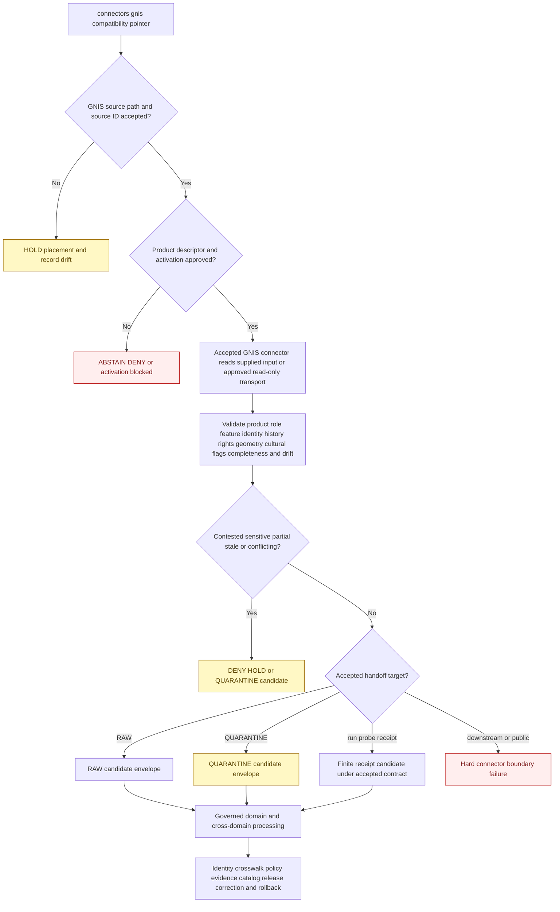

<!-- [KFM_META_BLOCK_V2]
doc_id: kfm://doc/connectors-gnis-readme
title: connectors/gnis/ — GNIS Compatibility Pointer
type: readme
version: v0.2
status: draft
owners: OWNER_TBD — Connector steward · USGS source steward · GNIS/BGN product steward · Spatial Foundation steward · Settlements/Infrastructure steward · Tribal-sovereignty reviewer · Cultural-sensitivity reviewer · Rights reviewer · Privacy reviewer · Security reviewer · Validation steward · Docs steward
created: 2026-06-18
updated: 2026-07-11
policy_label: public-doctrine; compatibility-pointer; documentation-only; path-conflict; usgs-product; administrative-names; candidate-contested-identity; append-only-name-history; tribal-sovereignty-aware; harmful-name-default-hidden; join-sensitive; no-code; no-descriptor; no-activation; no-publication
proposed_path: connectors/gnis/README.md
truth_posture: CONFIRMED README-only standalone path / exact implementation home CONFLICTED among connectors/gnis, a USGS product sublane, and proposed connectors/usgs/gnis_pull / shared USGS package and tests remain documentation-plus-placeholder scaffolds / GNIS-specific implementation, accepted descriptor, activation, fixtures, tests, live access, and CI evidence ABSENT or UNPROVED
related:
  - ../README.md
  - ../usgs/README.md
  - ../usgs/pyproject.toml
  - ../usgs/src/README.md
  - ../usgs/src/usgs/README.md
  - ../usgs/tests/README.md
  - ../../docs/sources/catalog/usgs/gnis-names.md
  - ../../docs/sources/catalog/usgs/README.md
  - ../../docs/sources/catalog/familysearch/places-authorities.md
  - ../../docs/domains/settlements-infrastructure/README.md
  - ../../docs/domains/settlements-infrastructure/FILE_SYSTEM_PLAN.md
  - ../../docs/domains/spatial-foundation/README.md
  - ../../docs/domains/roads-rail-trade/README.md
  - ../../docs/domains/people-dna-land/README.md
  - ../../data/registry/sources/
  - ../../data/raw/settlements-infrastructure/README.md
  - ../../data/raw/settlement/README.md
  - ../../data/quarantine/settlements-infrastructure/
  - ../../schemas/contracts/v1/source/
  - ../../schemas/contracts/v1/spatial/
  - ../../schemas/contracts/v1/settlements/
  - ../../policy/sources/usgs/
  - ../../policy/sensitivity/cultural/
  - ../../policy/rights/
  - ../../release/
tags: [kfm, connectors, gnis, usgs, bgn, geographic-names, place-names, toponymy, administrative, candidate, name-history, tribal-sovereignty, cultural-sensitivity, settlements, spatial-foundation, raw, quarantine, governance]
notes:
  - "Repository inspection confirms that connectors/gnis/ contains this README only; no package metadata, source tree, importable module, client, parser, descriptor, fixture, test, credential configuration, activation record, payload, cache, lifecycle writer, or CI evidence is proved below this path."
  - "GNIS placement is unresolved. The live standalone path is README-only; the USGS family README says GNIS needs a product-specific USGS sublane after a placement decision; the GNIS source page proposes connectors/usgs/gnis_pull/; and the shared USGS package/test roots contain documentation plus placeholder packaging rather than proved GNIS behavior."
  - "The GNIS source page itself contains identity and documentation drift: gnis-names, usgs-gnis, and gnis_pull forms coexist, and an older scaffold is appended after the expanded product page. This pointer reports that drift but does not normalize it by convenience."
  - "GNIS is administrative federal naming evidence, not observation of present feature existence, boundary geometry, legal jurisdiction, municipal status, sole cultural-name authority, or Tribal-authority substitute. Contested identity may require candidate treatment under an accepted descriptor."
  - "Name history is append-only. Renames, variants, BGN decisions, historically harmful attestations, Tribal-authoritative names, and source disagreements remain independently inspectable; default public display and release decisions remain downstream."
  - "A GNIS point is not feature extent. Exact culturally sensitive, archaeology-adjacent, sacred, living-person-linked, private, or otherwise harmful location products fail closed; this path performs no join, redaction, lifecycle transition, or publication."
[/KFM_META_BLOCK_V2] -->

<a id="top"></a>

# GNIS Compatibility Pointer

> Documentation-only compatibility, navigation, and path-conflict surface for the U.S. Geological Survey Geographic Names Information System. The current standalone path performs no source access, parsing, activation, storage, testing, lifecycle handoff, identity resolution, cultural-policy decision, or publication.

<p>
  
  
  
  
  
  
  
  
</p>

`connectors/gnis/`

> [!IMPORTANT]
> **Confirmed inspected state:** this directory contains this README only. No child package, client, download reader, query adapter, feature parser, name-history reconciler, BGN-decision watcher, configuration file, SourceDescriptor, SourceActivationDecision, credential mode, fixture set, executable test suite, source payload, cache, RAW writer, receipt writer, or passing CI evidence is confirmed here.

> [!CAUTION]
> **The exact GNIS implementation home is unresolved.** The live standalone path is README-only. The USGS family contract says GNIS should use a product-specific USGS lane after placement review. The GNIS product page proposes `connectors/usgs/gnis_pull/`, but no such live path or implementation was found in this inspection. The shared USGS package and test surfaces are documentation-plus-placeholder scaffolds. **Do not choose a path by convenience and do not add runtime behavior here without an accepted placement and migration decision.**

**Quick jumps:** [Purpose](#purpose) · [Placement decision](#placement-decision) · [Verified repository state](#verified-repository-state) · [Evidence ledger](#evidence-ledger) · [Compatibility responsibilities](#compatibility-responsibilities) · [Forbidden responsibilities](#forbidden-responsibilities) · [Path source-id and package drift](#path-source-id-and-package-drift) · [GNIS product and surface decomposition](#gnis-product-and-surface-decomposition) · [Source-role boundary](#source-role-boundary) · [Name authority and sovereignty boundary](#name-authority-and-sovereignty-boundary) · [Append-only name history](#append-only-name-history) · [Identity feature classes and geometry](#identity-feature-classes-and-geometry) · [Rights attribution and source terms](#rights-attribution-and-source-terms) · [Cultural privacy and join sensitivity](#cultural-privacy-and-join-sensitivity) · [Temporal freshness and correction boundaries](#temporal-freshness-and-correction-boundaries) · [Metadata preservation](#metadata-preservation) · [Access transport and input posture](#access-transport-and-input-posture) · [Cross-domain routing and one-capture rule](#cross-domain-routing-and-one-capture-rule) · [Testing relationship](#testing-relationship) · [Finite compatibility outcomes](#finite-compatibility-outcomes) · [Lifecycle boundary](#lifecycle-boundary) · [Child-path policy](#child-path-policy) · [Migration and deprecation](#migration-and-deprecation) · [Review and rollback](#review-and-rollback) · [Definition of done](#definition-of-done) · [Verification backlog](#verification-backlog)

---

## Purpose

This README prevents a documentation-only GNIS path from becoming a second or conflicting USGS product implementation by directory momentum.

It may:

- redirect GNIS implementation work to the source/product path selected by an accepted placement decision;
- explain the unresolved relationship among `connectors/gnis/`, `connectors/usgs/`, the shared `connectors/usgs/src/usgs/` package, and proposed `connectors/usgs/gnis_pull/`;
- preserve GNIS source-role, feature-identity, name-history, BGN-decision, coordinate, rights, cultural-sensitivity, sovereignty, and join warnings;
- identify Settlements/Infrastructure, Spatial Foundation, People/DNA/Land, Roads/Rail/Trade, Archaeology, Hydrology, and other downstream responsibility lanes;
- expose source-ID, connector-path, package, registry, RAW-lane, and domain-slug drift;
- prevent federal administrative names from becoming sole cultural authority, observed existence, boundaries, legal jurisdiction, settlement status, or publication permission;
- prevent historically harmful names, culturally sensitive sites, Tribal-name disagreements, or living-person joins from being surfaced by connector convenience;
- document migration, deprecation, correction, rollback, backlink, and generated-template work.

It does **not**:

- host a GNIS implementation package or product subpackage;
- choose the canonical connector path, source ID, distribution name, import name, registry path, or RAW slug;
- activate GNIS or any download, query, history, or BGN-decision surface;
- assign final source roles, cultural flags, rights, sensitivity, cadence, freshness, or release class;
- fetch a live source, parse a file, manage credentials, poll for decisions, stage downloads, or cache responses;
- decide the preferred name for a place when federal, Tribal, state, local, historical, language, or community authorities disagree;
- create canonical Place, Settlement, Municipality, CensusPlace, feature-extent, boundary, or person-place truth;
- perform cross-source joins, public redaction, evidence closure, release, correction, or publication.

[Back to top ↑](#top)

---

## Placement decision

Current evidence supports one safe decision while leaving the final product path open:

> **`connectors/gnis/` is a documentation-only compatibility pointer under the current posture.**

| Question | Current safe decision | Evidence posture |
|---|---|---:|
| Is `connectors/gnis/` an operational or canonical connector package? | **No.** It is README-only and contains no proved implementation or authority. | Confirmed inspected state. |
| Does source-first placement automatically make this flat path canonical? | **No.** The repository permits several source/product patterns, but GNIS documentation points toward the USGS family and no path decision is accepted. | Connector-pattern and USGS-family drift. |
| Where should GNIS source access ultimately live? | In one accepted GNIS product lane and one shared or dedicated package after source-identity and placement review. | Exact path remains conflicted. |
| Is `connectors/usgs/gnis_pull/` canonical? | **No.** It is a proposed path in the product page and was not found as a live implementation. | Proposed documentation only. |
| Is the shared `connectors/usgs/src/usgs/` package operational for GNIS? | **No evidence.** Package documentation exists, but no GNIS module, parser, client, fixture, or test was found. | Documentation/placeholder maturity. |
| May this standalone path own a SourceDescriptor, activation decision, client, fixtures, or tests? | **No under the current posture.** Use the accepted registry, source connector, and shared connector-test lanes after placement is resolved. | Avoid duplicate source identity and authority. |
| May downstream domains fetch GNIS independently? | **No by convenience.** Capture once under the accepted GNIS source identity and route lineage-preserving candidates. | One-capture rule. |
| Can the decision change? | Yes, only through an accepted ADR or migration decision. | Must cover naming, ownership, package boundaries, descriptors, credentials, tests, lifecycle paths, history, backlinks, and rollback. |

> [!CAUTION]
> A source catalog diagram, historical link, generated skeleton, product nickname, flat directory, family directory, or package-shaped README does not establish implementation authority or activation.

[Back to top ↑](#top)

---

## Verified repository state

The following relationship is confirmed or directly evidenced on the repository's default branch at the time of this update:

```text
connectors/
├── gnis/
│   └── README.md                         # this compatibility pointer
└── usgs/
    ├── README.md                         # USGS family coordination contract
    ├── pyproject.toml                    # project name + version 0.0.0 only
    ├── src/
    │   ├── README.md                     # source-root documentation
    │   └── usgs/
    │       └── README.md                 # package documentation; modules unproved
    └── tests/
        └── README.md                     # test-boundary documentation; tests unproved
```

The GNIS product page proposes, but the current search did not find, this product path:

```text
connectors/usgs/gnis_pull/
```

The expected source-registry surface `data/registry/sources/usgs/` is referenced by documentation, but no `README.md` or accepted GNIS descriptor was found there during this inspection. Repository search for `usgs-gnis` and `gnis_feature_id` returned documentation references rather than executable GNIS connector, descriptor, or test evidence.

### Current maturity

| Surface | Confirmed content | Maturity |
|---|---|---:|
| `connectors/gnis/README.md` | This compatibility, authority-boundary, and migration contract. | **DOCUMENTED / NON-OPERATIONAL** |
| Other files below `connectors/gnis/` | None found in current repository search. | **ABSENT / NEEDS CONTINUOUS VERIFICATION** |
| Standalone package metadata, code, fixtures, or tests | None confirmed. | **ABSENT / FORBIDDEN UNDER CURRENT POSTURE** |
| `connectors/usgs/README.md` | USGS multi-product coordination contract; GNIS product placement remains future work. | **DOCUMENTED / PLACEMENT UNRESOLVED** |
| `connectors/usgs/pyproject.toml` | Distribution name `kfm-connector-usgs`, version `0.0.0`. | **INCOMPLETE PLACEHOLDER** |
| `connectors/usgs/src/README.md` | Source-root responsibilities and no-side-effect requirements. | **DOCUMENTED** |
| `connectors/usgs/src/usgs/README.md` | Shared package boundary; actual modules unproved. | **DOCUMENTED / IMPLEMENTATION UNPROVED** |
| `connectors/usgs/tests/README.md` | Shared offline test expectations. | **DOCUMENTED / EXECUTABLE TESTS UNPROVED** |
| GNIS-specific product module or dispatcher | None found. | **ABSENT / UNPROVED** |
| Accepted GNIS SourceDescriptor | None found or verified. | **ABSENT / BLOCKED** |
| GNIS SourceActivationDecision | None found or verified. | **NOT ACTIVATED** |
| Current endpoint, file-format, query, cadence, and watcher contract | Product-page proposals only. | **NEEDS VERIFICATION** |
| Live tests or credentials | None confirmed or approved. | **ABSENT / NOT APPROVED** |
| Passing CI evidence | None confirmed for GNIS. | **UNKNOWN / ABSENT** |

> [!IMPORTANT]
> A rich source page, source-root README, placeholder `pyproject.toml`, or test contract can make a connector look mature. None proves supported installation, import behavior, current GNIS compatibility, rights handling, cultural-policy enforcement, activation, test coverage, or release readiness.

[Back to top ↑](#top)

---

## Evidence ledger

| Evidence | Status | What it supports | What it does not support |
|---|---:|---|---|
| `connectors/gnis/README.md` and current path search | **CONFIRMED for inspected state** | Standalone GNIS path exists and contains this README only. | Permanent absence of future files or canonical status. |
| `docs/sources/catalog/usgs/gnis-names.md` | **CONFIRMED draft product documentation** | GNIS is treated as a USGS administrative names product with stable feature IDs, point geometry, append-only history, cultural controls, and multiple downstream consumers. | Current endpoints, accepted descriptors, implementation, activation, or test coverage. |
| GNIS product-page connector reference | **CONFIRMED proposal** | A `connectors/usgs/gnis_pull/` product path was contemplated. | Live path, accepted naming, or executable behavior. |
| GNIS product-page duplicated blocks and mixed names | **CONFIRMED documentation drift** | `gnis-names`, `usgs-gnis`, `gnis_pull`, and older appended scaffold content coexist. | A resolved source ID or connector contract. |
| `connectors/usgs/README.md` | **CONFIRMED family documentation** | GNIS belongs to the USGS product family and needs product-specific placement, role, rights, cadence, and activation. | A canonical GNIS child path or working integration. |
| `connectors/usgs/pyproject.toml` | **CONFIRMED placeholder** | A shared USGS distribution name and version were scaffolded. | Build backend, discovery, dependencies, installability, or GNIS support. |
| `connectors/usgs/src/README.md` and `src/usgs/README.md` | **CONFIRMED package documentation** | Shared USGS source-code and package boundaries exist. | Python modules, supported imports, client behavior, or GNIS parsing. |
| `connectors/usgs/tests/README.md` | **CONFIRMED test documentation** | Offline, descriptor-gated, role-preserving test intentions exist. | Test files, fixtures, passing results, or GNIS coverage. |
| `data/raw/settlements-infrastructure/README.md` | **CONFIRMED RAW-domain documentation** | `settlements-infrastructure` is documented as the working parent RAW domain lane. | A GNIS child capture, connector activation, or accepted source slug. |
| `data/raw/settlement/README.md` | **CONFIRMED compatibility documentation** | Singular `settlement` remains a compatibility RAW path. | Canonical lifecycle placement. |
| Repository searches for `usgs-gnis`, `gnis_feature_id`, and `gnis_pull` | **CONFIRMED search result posture** | References are concentrated in documentation; no GNIS-specific code or descriptor was surfaced. | A complete filesystem inventory, especially empty/generated/unindexed files. |

[Back to top ↑](#top)

---

## Compatibility responsibilities

This path may contain only responsibilities that prevent ambiguity and unsafe implementation drift:

- a concise redirect to the product path selected by accepted governance;
- path, source-ID, package-name, registry-slug, RAW-slug, and domain-slug conflict documentation;
- migration inventories, backlink maps, tombstone plans, and deprecation notes;
- GNIS source-role and name-authority anti-collapse warnings;
- append-only name-history and BGN-decision preservation requirements;
- cultural-sensitivity, Tribal-sovereignty, historically harmful name, living-person join, and archaeology-adjacent warnings;
- feature-ID, feature-class, point-versus-extent, coordinate-accuracy, and boundary warnings;
- one-source-capture/multi-domain routing guidance;
- pointers to the accepted source registry, connector package, connector tests, domain contracts, policies, evidence, catalog, and release surfaces;
- corrections to documentation or generated templates that treat a proposed path as active or canonical.

Every compatibility statement must distinguish:

```text
CONFIRMED repository evidence
PROPOSED product or placement design
CONFLICTED path, identity, role, or lifecycle posture
NEEDS VERIFICATION implementation, source, or governance state
```

[Back to top ↑](#top)

---

## Forbidden responsibilities

Do not place or implement the following beneath `connectors/gnis/` under the current posture:

| Forbidden content or behavior | Correct responsibility or handling |
|---|---|
| Source clients, fetchers, scrapers, download readers, query adapters, or watchers | The GNIS product lane selected by accepted placement review. |
| Python, JavaScript, shell, SQL, notebook, package, build, or deployment configuration | The reviewed source connector implementation package. |
| SourceDescriptors or SourceActivationDecisions | Accepted source registry and activation workflow. |
| Endpoint URLs, account state, tokens, cookies, keys, sessions, browser profiles, or credential configuration | External security/credential systems and approved runtime configuration. |
| GNIS source payloads, national/state downloads, query responses, BGN decision exports, or caches | Governed RAW, QUARANTINE, temporary runtime, or approved fixture storage. |
| Connector-local fixtures or executable tests | The accepted GNIS/USGS connector test lane. |
| Tribal, cultural, harmful-name, living-person, archaeology, rights, or release policy | `policy/`, sovereignty review, domain governance, and release authority. |
| Canonical Place, Settlement, Municipality, CensusPlace, boundary, or person-place objects | Domain contracts, schemas, packages, pipelines, and review. |
| Name tie-breakers, feature conflation, boundary assignment, or current-existence conclusions | Downstream identity/crosswalk workflows with evidence and review. |
| Public maps, default labels, search indexes, graph edges, reports, stories, API payloads, embeddings, or generated answers | Governed downstream and released application surfaces. |
| RAW, WORK, QUARANTINE, PROCESSED, CATALOG, TRIPLET, PROOF, RECEIPT, RELEASE, or PUBLISHED writers | Owning lifecycle, evidence, and release systems. |

A compatibility path is not a shortcut around unresolved product placement or cultural authority.

[Back to top ↑](#top)

---

## Path, source-ID, and package drift

GNIS naming and placement are not yet coherent across repository surfaces.

| Surface | Observed form | Current posture |
|---|---|---:|
| Live standalone connector path | `connectors/gnis/` | README-only compatibility pointer. |
| USGS family product placement | Product-specific USGS sublane after placement decision | Directional, not a selected path. |
| Product-page connector proposal | `connectors/usgs/gnis_pull/` | Proposed and not found live. |
| Product-page filename | `docs/sources/catalog/usgs/gnis-names.md` | Live documentation path. |
| Product short ID in catalog prose | `usgs-gnis` | Proposed identity form. |
| Display names | `GNIS`, `USGS GNIS`, `USGS Geographic Names Information System` | Human labels, not package/source IDs. |
| Shared distribution | `kfm-connector-usgs` | Placeholder distribution, not GNIS activation. |
| Shared Python package | `usgs` | Documented namespace; GNIS module absent/unproved. |
| Product implementation name | `gnis_pull` | Proposed filename/path concept, not accepted API. |
| RAW examples | `settlements/usgs/gnis`, `settlements-infrastructure`, `settlement`, `gnis-gazetteers` | Conflicted/proposed lifecycle naming. |
| Registry examples | `data/registry/sources/usgs/`, domain-scoped registry variants | Authority topology unresolved. |

Before executable GNIS work:

1. choose one canonical source ID;
2. choose one connector path and product key;
3. choose whether implementation is a shared USGS module, nested product package, or dedicated flat connector;
4. choose distribution and import names;
5. select canonical registry and lifecycle slugs;
6. define stable aliases and supersession rules for losing names;
7. align documentation, descriptors, tests, fixtures, commands, CI, receipts, RAW/QUARANTINE paths, and generated templates;
8. repair the duplicated/stale sections in the GNIS source product page;
9. record the decision in an accepted ADR or migration record;
10. test the migration on case-sensitive and case-insensitive environments where relevant.

This README does not map `gnis`, `usgs-gnis`, and `gnis_pull` to one another silently.

[Back to top ↑](#top)

---

## GNIS product and surface decomposition

GNIS is not one undifferentiated payload or meaning. Every activated surface requires explicit identity, format, rights, cadence, completeness, fixtures, tests, and review.

| Product or surface | Source meaning | Minimum future connector behavior | Forbidden shortcut |
|---|---|---|---|
| Official feature record | Federal administrative record keyed by GNIS feature ID, with current name, feature class, point, and jurisdictional context. | Preserve stable feature ID, current attestation, feature class, point provenance, source version, and role. | Treating the record as observation of current existence, legal status, or feature extent. |
| Name variants | USGS-recorded alternate forms associated with a feature identity. | Preserve verbatim spelling, language/script tags when known, source status, and relationship to the current attestation. | Choosing a preferred cultural or local name inside the connector. |
| Historical name attestations | Prior federal administrative names and rename history. | Append new attestations; preserve validity, BGN decision references, cultural flags, and revision lineage. | Overwriting or deleting prior names to make history appear timeless. |
| Contested or ambiguous identity | Cases where federal, Tribal, historical, local, or multi-feature identity remains unresolved. | Preserve disagreement and return candidate/hold/review posture under an accepted descriptor. | Promoting contested identity into unqualified administrative truth. |
| BGN decision metadata | Administrative decision evidence for additions, changes, removals, or other name actions. | Preserve decision identity, effective date, affected feature IDs, source reference, and relationship to attestations. | Treating a decision record as geometry, current physical existence, or sole cultural authority. |
| Tabular download | Bulk distribution carrier for feature records. | Preserve distribution identity, release/update time, checksum, size, row counts, schema/encoding, and completeness. | Treating successful download as activation or release approval. |
| Query interface response | Query-time carrier whose completeness and replay properties depend on request scope and source behavior. | Preserve normalized request, retrieval time, response digest, pagination/limits, and partial state. | Treating one query as a complete national snapshot or biological/settlement absence evidence. |
| Feature-class vocabulary | Administrative classification list used by GNIS records. | Preserve source labels, vocabulary version, unknown values, and drift. | Mapping a class directly to a canonical domain object or legal status without review. |
| Unknown or combined export | Product identity, schema, history, role, or completeness unresolved. | Reject, hold, or quarantine with an actionable unsupported-product outcome. | Best-effort parsing, auto-splitting, or provider-wide admission. |

No surface inherits another surface's parser, completeness claim, stable-key rule, history behavior, test coverage, activation, or release posture by provider adjacency.

[Back to top ↑](#top)

---

## Source-role boundary

GNIS is primarily **administrative** federal naming evidence. An accepted descriptor must bind the machine role for each admitted record class.

| Record class | Expected role posture | Required distinction |
|---|---|---|
| Current official feature record | `administrative` | Federal naming record, not observed current existence or legal boundary. |
| Recorded variant | `administrative` with variant state | Alternative recorded form, not automatically preferred, current, or culturally authoritative. |
| Historical federal attestation | `administrative` with explicit historical validity | Rename history, not current default display. |
| Contested or unresolved identity | `candidate` or hold/review posture under accepted doctrine | Disagreement remains visible; no silent federal primacy. |
| BGN decision metadata | `administrative` | Governance evidence, not geometry or physical observation. |
| Synthetic test record | `synthetic` | Test-only evidence, never a real place claim. |

Future connector behavior must:

- require an accepted product/record SourceDescriptor and activation decision;
- preserve assigned role and authority exactly;
- reject absent, umbrella, ambiguous, or incompatible roles;
- never upgrade an administrative record to `observed` because a point is present;
- never relabel GNIS as `regulatory` because it is federal;
- never treat candidate identity as resolved through parsing or promotion;
- preserve variant, historical, contested, removed, or superseded state;
- require descriptor revision or correction evidence for a role change.

### Anti-collapse matrix

| Forbidden collapse | Required posture |
|---|---|
| GNIS record → observation that a feature presently exists | Preserve administrative role; present existence needs current evidence. |
| GNIS point → feature extent or boundary | Preserve representative point; use independently admitted geometry sources downstream. |
| GNIS name → legal municipality, jurisdiction, incorporation, reservation, ownership, or access status | Preserve name evidence only; legal and territorial authority is separate. |
| Federal name → sole or universally preferred name | Preserve Tribal, state, local, historical, language, and community authorities when in evidence. |
| Variant name → current official name | Preserve variant status and source relationship. |
| Historical name → default display name | Default downstream display uses current approved posture; historical surfacing requires policy/context. |
| BGN decision → physical feature creation, destruction, or movement | Preserve decision scope; physical state requires separate evidence. |
| Feature class → canonical domain object | Treat class as source vocabulary, not final object typing. |
| Bare name → stable identity | Require GNIS feature ID plus geographic/contextual disambiguation. |
| Missing GNIS record → absence of a place or feature | Abstain unless an accepted completeness contract supports the claim. |
| Public federal record → public-safe joined product | Continue through sensitivity, sovereignty, privacy, evidence, and release gates. |
| Lifecycle promotion → source-role upgrade | Role remains fixed; promotion never changes source meaning. |

> [!IMPORTANT]
> A federal name is not a boundary. A point is not an extent. A feature class is not legal status. A historical attestation is not a default label. A connector candidate is not a released place claim.

[Back to top ↑](#top)

---

## Name authority and sovereignty boundary

GNIS is an important U.S. federal administrative names carrier. It is not the sole authority over what a place is called, what a name means, or which name should be primary in every context.

Parallel authority can include:

- Tribal nations and Tribal-language authorities;
- state and local naming or legal records;
- municipal charters, ordinances, annexation, and incorporation records;
- historical maps, gazetteers, newspapers, archives, deeds, and scholarship;
- community, language, and local-use attestations;
- Census/TIGER administrative geography;
- hydrologic, transportation, facility, archaeological, and land-management authorities;
- FamilySearch and other place-authority systems used for historical/genealogical reconciliation.

Required posture:

1. Preserve GNIS as federal administrative evidence, not universal cultural truth.
2. Preserve every known parallel authority with source, time, language, jurisdiction, and review context.
3. Never silently substitute GNIS for a Tribal-authoritative name in a Tribal-governed context.
4. Never let repository path or source-family placement decide naming primacy.
5. Keep disagreements and contested identity visible and reversible.
6. Require downstream sovereignty/cultural review for consequential name selection or display.
7. Do not infer that absence of a known parallel authority means no such authority exists.
8. Do not auto-create Tribal reconciliation records through string similarity, spatial proximity, or language guessing.
9. Preserve source-native scripts, diacritics, capitalization, and language tags where available.
10. Keep public UI label selection, search ranking, aliasing, and historical surfacing outside connector authority.

[Back to top ↑](#top)

---

## Append-only name history

Name history must remain inspectable rather than being rewritten into a timeless current-name row.

Future accepted source handling should preserve, where supplied or established by an accepted contract:

- GNIS feature ID stable across attestations;
- current name and current-attestation identity;
- variant names and variant state;
- prior official names;
- attestation sequence or version;
- valid/effective start and end times;
- source publication and retrieval times;
- BGN decision identifier, date, and source reference when applicable;
- relationship to the previous attestation;
- correction, removal, supersession, or withdrawal state;
- cultural flag and review state;
- Tribal/parallel-authority reconciliation reference when known;
- source and normalized digests.

Required behavior:

- a rename creates a new attestation rather than overwriting the old one;
- a corrected spelling does not erase the prior source state;
- a removed or superseded name remains traceable under restricted and policy-aware handling;
- a taxonomy/classification change remains separate from a name change;
- source history and downstream display policy remain separate concerns;
- historically harmful attestations remain available only under the accepted restricted/scholarship posture, not default public display;
- public caches, indexes, labels, and generated answers must be invalidated or corrected downstream when the approved current-name posture changes;
- the connector may emit history/correction signals but cannot rewrite released artifacts.

[Back to top ↑](#top)

---

## Identity, feature classes, and geometry

### Stable identity

A name string is not a unique identifier. Many features share names, names change, and one historical name may refer to multiple candidate features.

A future candidate should preserve:

- GNIS feature ID;
- product/source ID and descriptor reference;
- current and historical attestation IDs;
- feature class and vocabulary version;
- state, county, and other source jurisdiction fields;
- source record URI or distribution identity;
- source version/update state;
- identity-collision and contested-identity flags;
- crosswalk references rather than silent merges.

Downstream user-facing or AI references should include enough disambiguation—at minimum stable feature ID and relevant geography—when a bare name is ambiguous.

### Point is not extent

GNIS generally supplies a point even when the named feature is spatially extended. The point may be representative, historical, approximate, or unsuitable as a boundary proxy.

Required posture:

- preserve source latitude/longitude exactly as received under permitted handling;
- preserve coordinate order, CRS, datum, precision, source, and accuracy/uncertainty metadata where available;
- preserve whether coordinates are primary, source-supplied, transformed, corrected, generalized, or unknown;
- never derive a polygon, jurisdiction, ownership, service area, watershed, stream reach, road extent, reservation extent, archaeological boundary, or facility footprint from the GNIS point;
- never silently snap or average GNIS coordinates with another source;
- keep source geometries independently inspectable when GNIS disagrees with TIGER, NHD/WBD, 3DEP, local GIS, HIFLD, transportation, archival, or Tribal sources;
- require downstream crosswalks and confidence-bearing decisions for extent or identity reconciliation;
- treat changed coordinates as source drift/correction, not an invisible repair.

### Feature-class vocabulary

Feature classes are source classifications, not canonical KFM object types.

Future handling must:

- pin or preserve the vocabulary/version used by the source;
- retain verbatim class labels;
- reject or quarantine unknown required classes rather than guessing;
- preserve additions, removals, renames, and deprecations as vocabulary drift;
- avoid mapping classes such as populated place, civil, church, school, cemetery, mine, locale, building, stream, reservoir, summit, or park directly into legal, operational, cultural, or current-status conclusions.

[Back to top ↑](#top)

---

## Rights, attribution, and source terms

The GNIS product profile proposes an open/public federal-record posture for the underlying source, but this compatibility path does not establish legal sufficiency, current terms, attribution, disclaimer, or downstream-use permission.

A future accepted connector should preserve, where supplied and applicable:

- publisher and responsible USGS/BGN program identity;
- product and distribution identity;
- raw rights or terms value;
- current terms/disclaimer snapshot reference;
- required attribution and citation text;
- source URL or distribution reference;
- access restrictions or automation conditions;
- source release/update date;
- retrieval time;
- checksum, content size, and source version;
- rights-review state and external decision reference.

| Rights condition | Required handling |
|---|---|
| Current source terms and citation complete | Preserve them; continue only when descriptor and external rights decision permit. |
| Disclaimer or attribution required | Carry the exact text and source reference through candidates. |
| Terms absent, stale, conflicting, or unparseable | `DENY`, `ABSTAIN`, `HOLD`, or QUARANTINE candidate. |
| Query and bulk-download terms differ | Preserve product-specific terms; one surface does not authorize another. |
| Downstream dataset adds third-party records | Re-evaluate rights at the joined product level. |
| Public availability used as release approval | Hard authority failure. |
| Rights change after capture | Preserve the previous state and emit correction/drift evidence; never rewrite history silently. |

The connector may parse and carry rights metadata. Legal conclusions, redistribution approval, disclaimer sufficiency, and public release remain external decisions.

[Back to top ↑](#top)

---

## Cultural, privacy, and join sensitivity

The underlying name record may be low sensitivity in isolation, while the place, history, or joined product can be highly sensitive.

### Fail-closed classes

- Tribal-authoritative names, sacred places, culturally significant sites, or sovereignty-governed context;
- historically harmful, derogatory, discriminatory, or otherwise harmful prior names;
- archaeological sites, burial places, caves, ceremonial areas, cultural landscapes, or sites where added visibility increases harm;
- living-person residence, birth, household, school, workplace, medical, land, genealogy, or movement joins;
- exact locations of private, protected, critical, restricted, or infrastructure-sensitive facilities;
- cemetery, church, school, mine, locale, or other feature records when joined to living people, vulnerable communities, access, ownership, or harmful targeting context;
- coordinates or feature identities already withheld, generalized, disputed, or marked sensitive by another authority;
- records whose sensitivity, authority, intended use, or cultural context cannot be evaluated;
- search, map, graph, embedding, or generated-answer products that make ordinary records newly actionable.

### Required posture

1. Preserve source and downstream cultural flags; never clear them by parsing or promotion.
2. Preserve Tribal authority as parallel authority, not a variant subordinated automatically to GNIS.
3. Default downstream display to the accepted current-name posture, not harmful historical names.
4. Surface harmful historical attestations only under an explicit approved scholarship/context workflow.
5. Keep exact sensitive locations and harmful names out of README examples, ordinary fixtures, logs, errors, metrics, test names, screenshots, search indexes, and generated output.
6. Deny or generalize precise living-person place joins by default under the owning privacy policy.
7. Do not infer private residence, ethnicity, religion, Tribal affiliation, burial, ownership, or community membership from a GNIS feature or adjacency.
8. Never rely on map styling, hidden layers, opacity, client filters, zoom levels, or search ranking as the only sensitivity control.
9. Recalculate sensitivity, rights, precision, and release class after every material join.
10. Keep public redaction, generalization, suppression, label selection, and release outside connector authority.
11. Require correction, withdrawal, cache invalidation, and rollback support when approved naming or sensitivity posture changes.
12. Treat absence of a cultural flag as unknown unless the accepted policy says the record was evaluated.

Hashing a feature ID, omitting a name field, rounding a point, or labeling a record public does not by itself establish safety or respectful use.

[Back to top ↑](#top)

---

## Temporal, freshness, and correction boundaries

Keep these time concepts distinct where material:

| Time kind | Meaning | Guardrail |
|---|---|---|
| Name-attestation valid/effective time | When a federal name attestation applies under source history. | Does not equal retrieval or public-release time. |
| BGN decision time | When an addition, change, removal, or decision was issued. | Decision time does not prove physical feature change. |
| Feature observation or construction time | When a feature physically existed, was observed, built, destroyed, or altered, when known from another source. | GNIS does not supply current observation merely by naming the feature. |
| Source-record modification time | When GNIS changed a record. | Preserve separately from name-effective and physical-event time. |
| Distribution publication/update time | When a tabular release or query surface changed. | Required for replay and staleness review. |
| Retrieval time | When KFM obtained the material. | A recent retrieval does not make an old attestation current. |
| Downstream release time | When a governed derivative was published. | Outside connector authority. |
| Correction/supersession time | When source or KFM evidence was corrected, withdrawn, or replaced. | Never silently overwrite prior evidence. |

Freshness posture:

- GNIS editorial cadence and BGN-driven changes are irregular;
- a proposed weekly content-hash poll is not an accepted schedule;
- a proposed BGN-decision watcher is not implemented evidence;
- current endpoint, file, and release cadence must be verified before activation;
- missing `valid_to` does not prove a feature or name remains physically current;
- record, name, coordinate, feature-class, and authority changes must produce inspectable drift/correction outcomes;
- downstream products depending on changed names or coordinates must be invalidated or reviewed through governed workflows.

[Back to top ↑](#top)

---

## Metadata preservation

When an accepted GNIS connector is eventually implemented, candidates should preserve the following where supplied, permitted, and defined by accepted contracts.

### Source and admission minimum

- canonical source ID and product-specific SourceDescriptor reference;
- SourceActivationDecision reference;
- publisher, program, and product identity;
- exact product surface: bulk download, query response, BGN decision, vocabulary, or another accepted surface;
- source role and role authority;
- source URL, distribution, file, query, or decision identity;
- source release/update time and retrieval time;
- connector/parser version;
- content type, encoding, delimiter, compression, schema, and feature-class vocabulary version;
- checksum/digest and content size;
- rights, attribution, disclaimer, restriction, and review references;
- cultural, sovereignty, privacy, and restricted-handling references;
- intended downstream domain routes;
- intended lifecycle target;
- partial, stale, corrected, superseded, contested, sensitive, quarantined, and review flags.

### Feature and name minimum

- GNIS feature ID;
- current official name under the source record;
- variant names, verbatim forms, language/script tags, and variant status where supplied;
- historical names and attestation sequence;
- feature class and source vocabulary version;
- state, county, and other source administrative fields;
- BGN decision reference and effective date where applicable;
- prior-attestation and revision relationships;
- candidate/contested disposition;
- known parallel-authority references without inventing absence;
- cultural flags and review state;
- source-native field names, code values, null/unknown semantics, and unsupported-field evidence.

### Geometry minimum

- source latitude and longitude;
- geometry type;
- coordinate order;
- CRS and datum;
- precision, accuracy, uncertainty, and coordinate-source metadata where supplied;
- original, corrected, transformed, or generalized state;
- source and transformed geometry digests under accepted restricted handling;
- disagreement flags for crosswalk sources;
- explicit warning that the point is not feature extent or jurisdictional boundary.

### Capture and completeness minimum

- request/query or download identity and normalized digest;
- expected and received pages, files, rows, records, fields, or decisions where known;
- accepted, rejected, quarantined, duplicate, and unresolved counts;
- duplicate feature-ID and conflicting-attestation evidence;
- checksum and content-size verification;
- partial, truncated, interrupted, stale, or superseded state;
- unknown field, encoding, type, code-list, schema, and vocabulary drift evidence.

Unknown fields may be preserved only through an accepted restricted passthrough contract. They must not be silently dropped, guessed into KFM semantics, or exposed publicly.

[Back to top ↑](#top)

---

## Access, transport, and input posture

### Current safe posture

No GNIS-specific client or approved live access contract is confirmed.

```text
network access: disabled
account or credential access: disabled
endpoint discovery: forbidden
background polling or BGN watcher: forbidden
input: documentation only; future synthetic fixture or explicitly supplied capture
persistence: none
output from this path: none
```

### Future supplied-input-first modes

After contracts and placement are accepted, implementation may support separately reviewed modes such as:

- supplied synthetic feature records;
- supplied synthetic name-history chains;
- supplied tabular download files;
- supplied query-response documents;
- supplied BGN decision metadata;
- approved read-only bulk download;
- approved bounded query access;
- approved content-hash or decision watcher.

Every real/live mode requires exact product identity, accepted descriptor and activation, current source documentation, host allowlisting, terms review, format/version pinning, rate and size limits, retention/cleanup controls, synthetic fixtures, tests, logging review, and rollback.

### Prohibited access behavior

- guessed, stale, or undocumented endpoints;
- implicit environment-variable credential reads;
- home-directory, browser, keychain, or config-file discovery;
- unbounded national queries, pagination, downloads, retries, or polling;
- hidden fallback from supplied input to live access;
- automatic fixture refresh from the live source;
- treating a URL, feature ID, file name, or successful HTTP status as activation evidence;
- treating download success as completeness, rights, sensitivity, cultural review, or release approval;
- importing source data during package import, test collection, or documentation build;
- hidden persistence, caches, retry queues, or temporary downloads;
- copying full source rows into logs or exceptions.

### Bounded input requirements

Future readers and transports must define and test:

- maximum file/response size;
- maximum rows, pages, fields, variants, attestations, and history depth;
- connect, read, total, and idle timeouts;
- bounded retries and redirects with host revalidation;
- content type, encoding, delimiter, quote, escape, line-ending, and compression handling;
- duplicate feature IDs and conflicting current attestations;
- stable request/query identity across pagination;
- partial-file, partial-page, truncated-stream, checksum, and count reconciliation;
- feature-class vocabulary drift;
- malformed Unicode, control characters, bidirectional text, and unsafe spreadsheet/formula-like values treated as inert data;
- memory, CPU, and execution-time limits;
- safe, redacted finite errors.

Source text and files remain inert data. The connector must never execute formulas, macros, scripts, HTML, links, or embedded code.

[Back to top ↑](#top)

---

## Cross-domain routing and one-capture rule

GNIS is foundational across several domains, but source access remains singular.

| Consumer | Appropriate downstream responsibility | Must not do |
|---|---|---|
| Settlements / Infrastructure | Place-name and settlement-identity reconciliation, municipal/legal-status joins, historic townsite candidates, domain object mapping. | Treat GNIS as incorporation, annexation, boundary, facility-status, or current-settlement truth. |
| Spatial Foundation | Named-feature anchors, point search, crosswalks to extents and base geography. | Convert representative points into extents or boundaries. |
| People / DNA / Land | Historical place-of-birth/residence reconciliation under privacy and genealogy rules. | Publish precise living-person residence or infer identity/affiliation. |
| Roads / Rail / Trade | Named-place navigation context and route/place crosswalks. | Treat GNIS as route membership, access, operational status, or legal destination authority. |
| Archaeology and cultural lanes | Historical/cultural name evidence under sovereignty and site-sensitivity policy. | Highlight sensitive sites or choose culturally primary names without review. |
| Hydrology | Name crosswalks for streams, reservoirs, springs, lakes, and related features. | Use a GNIS point as hydrologic geometry, flow, current condition, or jurisdiction. |
| FamilySearch/historical place authorities | Historical name and place reconciliation under rights/privacy rules. | Merge place identities or histories automatically. |
| Search, graph, map, and AI products | Released labels and aliases backed by evidence, policy, and correction paths. | Read connector/RAW internals or surface harmful/restricted names by default. |

### One-capture rule

Capture a GNIS product once under the accepted source ID. Route lineage-preserving candidates to approved consumers. Do not independently download or persist GNIS once for Settlements, again for Spatial Foundation, and again for People/DNA/Land merely because their downstream mappings differ.

Crosswalks to TIGER, NHD/WBD, 3DEP, local GIS, Tribal authorities, archives, FamilySearch, transportation, facilities, or historical gazetteers remain downstream, confidence-bearing, reversible, and source-attributed.

[Back to top ↑](#top)

---

## Testing relationship

Connector-local GNIS tests should live in the product/shared USGS test lane selected by the placement decision. `connectors/usgs/tests/` currently documents expectations but executable GNIS tests and fixtures were not found.

Future tests should prove at least:

### Build and import safety

- clean build/install/import under the accepted package layout;
- import performs no network, DNS, secret reads, filesystem writes, logging mutation, environment mutation, cache initialization, registry mutation, policy evaluation, watcher startup, or activation;
- no GNIS source data loads at import or test collection;
- the standalone compatibility path cannot create a second package or activation lane.

### Descriptor, activation, and path behavior

- missing or conflicting source IDs, descriptors, activation decisions, product keys, and lifecycle targets fail closed;
- `gnis`, `usgs-gnis`, and `gnis_pull` are not silent aliases;
- flat and nested paths cannot both activate the source;
- synthetic configuration cannot fall through to live access;
- no source page or package README is treated as descriptor authority.

### Role, identity, and history behavior

- official, variant, historical, contested, decision, query, and download surfaces remain distinct;
- administrative records cannot become observed or regulatory;
- candidate identity cannot become resolved by parsing;
- rename history is append-only;
- duplicate feature IDs, conflicting current attestations, cycles, and broken revision links fail visibly;
- bare names cannot serve as stable identifiers;
- feature-class drift remains visible.

### Geometry and completeness behavior

- points cannot become feature extents or boundaries;
- coordinate source, CRS, datum, precision, and uncertainty remain attached;
- missing or changed coordinates produce finite review outcomes;
- partial files/pages, count mismatches, duplicate IDs, and truncated streams cannot report complete success;
- empty results cannot become place/feature absence claims.

### Cultural, sovereignty, privacy, and logging behavior

- Tribal-authoritative names are not subordinated automatically;
- harmful historical names are not emitted in default/public outputs;
- precise living-person joins and sensitive-site joins fail closed;
- cultural flags persist through candidate transformations;
- exact sensitive coordinates, harmful names, person-like data, private queries, source rows, and credential-like canaries do not leak through logs, errors, metrics, snapshots, test IDs, temporary paths, serialization, or CI artifacts;
- no test claims final cultural authority, anonymization, public safety, or successful release.

### Lifecycle boundary behavior

- only accepted finite outcomes and RAW/QUARANTINE/receipt candidates are possible under governing contracts;
- every attempted WORK, PROCESSED, CATALOG, TRIPLET, PROOF, RELEASE, PUBLISHED, API, map, report, graph, search, embedding, or generated-answer write fails;
- fixtures are synthetic, minimized, purpose-specific, and contain no real harmful historical-name examples, sensitive cultural sites, living-person joins, restricted coordinates, or credentials by default.

No local command, marker, live-test variable, endpoint constant, credential mode, CI job, coverage result, or passing status is currently accepted for GNIS. A zero-test, all-skipped, or collection-only run is not proof of coverage.

[Back to top ↑](#top)

---

## Finite compatibility outcomes

This documentation path should make placement and authority decisions deterministic.

| Request or condition | Required outcome |
|---|---|
| Add GNIS client, parser, package, watcher, or fetch code under this standalone path | Reject and route to the product lane selected by accepted governance. |
| Add a standalone SourceDescriptor or activation file | Reject; use the accepted source registry and activation workflow. |
| Add source payloads, national/state downloads, query responses, decision exports, or caches | Reject and route to governed lifecycle/runtime storage. |
| Add standalone fixtures or executable connector tests | Reject; use the selected GNIS/USGS connector test lane. |
| Declare `connectors/gnis/` or `connectors/usgs/gnis_pull/` canonical without accepted evidence | `HOLD`; record path drift. |
| Use `gnis`, `usgs-gnis`, and `gnis_pull` as silent aliases | Reject; require identity and migration rules. |
| Product/surface identity missing, mixed, or inferred from file name | Unsupported, `HOLD`, or QUARANTINE candidate in the owning connector. |
| Accepted SourceDescriptor missing | Activation blocked. |
| Source role missing, invalid, or conflicted | Activation blocked; no permissive default. |
| Administrative record emitted as observed existence or regulatory status | Hard source-role failure. |
| Contested identity emitted as settled federal/cultural truth | Hard authority and candidate-boundary failure. |
| Rename overwrites prior attestation | Hard history/provenance failure. |
| Harmful historical name enters default display, log, fixture, or ordinary output | Hard cultural-sensitivity failure. |
| Tribal authority is silently replaced by GNIS | Hard sovereignty/authority failure. |
| Bare name used as stable identity | Hard identity failure. |
| GNIS point emitted as boundary, extent, parcel, watershed, route, reservation, or facility footprint | Hard geometry failure. |
| Coordinate source, datum, precision, or uncertainty is lost | Geometry/provenance failure. |
| Feature class emitted as legal/current domain status | Hard semantic failure. |
| Rights, citation, disclaimer, or terms unresolved | `DENY`, `ABSTAIN`, `HOLD`, or QUARANTINE candidate. |
| Sensitive site or precise living-person join present | Restrict, deny, hold, generalize downstream, or quarantine; never public-safe by default. |
| Partial file/query, duplicate identity, conflicting current attestation, or checksum mismatch | Incomplete-capture quarantine or finite failure. |
| Empty or missing result interpreted as absence | Hard evidence-boundary failure. |
| Attempted target beyond accepted RAW, QUARANTINE, or run/probe receipt contract | Hard authority-boundary failure. |
| Direct lifecycle or public write attempted | Hard failure. |
| Preferred-name, legal-boundary, cultural-authority, residence, archaeology, safety, navigation, or public-release determination requested | Refuse and route to governed domain/reviewer processes. |

Every future error must be deterministic, finite, actionable, safe to log, and free of unnecessary source, harmful-name, cultural, private, or precise-location content.

[Back to top ↑](#top)

---

## Lifecycle boundary

This compatibility path performs no source admission and no lifecycle transition.



The diagram defines responsibility boundaries. It does not prove an accepted GNIS package, endpoint, parser, descriptor, cultural policy, RAW store, quarantine store, receipt store, downstream pipeline, evidence closure, or release implementation.

KFM lifecycle discipline remains:

```text
RAW -> WORK / QUARANTINE -> PROCESSED -> CATALOG / TRIPLET -> PUBLISHED
```

This standalone path never constructs or persists even a candidate envelope or receipt. It only documents the boundary that a future accepted connector must obey.

[Back to top ↑](#top)

---

## Child-path policy

Under the current posture, `connectors/gnis/` should remain a one-file compatibility path.

Do not add:

- source code;
- package metadata;
- descriptors;
- activation records;
- endpoint configuration;
- credentials;
- fixtures;
- tests;
- payloads;
- caches;
- generated data;
- watchers;
- lifecycle or receipt writers;
- source subdirectories;
- public artifacts.

A second documentation file is justified only for a formal migration, tombstone, backlink inventory, or accepted ADR implementation plan. It must not introduce runtime authority.

Any proposal to ratify this standalone path as the implementation home must include:

1. an accepted connector-placement and source-identity decision;
2. a single product key and source ID;
3. ownership and code-boundary definitions;
4. resolution of the proposed USGS nested product path;
5. SourceDescriptor and activation migration;
6. package/distribution/import naming;
7. credential, endpoint, watcher, and transport ownership;
8. fixture and test migration;
9. RAW/QUARANTINE/receipt lineage migration;
10. name-history, cultural-policy, correction, backlink, template, rollback, and deprecation plans.

[Back to top ↑](#top)

---

## Migration and deprecation

The repository should resolve GNIS topology deliberately rather than letting a path win through accidental code growth.

### Migration inventory

A future review should inventory:

- every backlink to `connectors/gnis/`;
- every reference to `connectors/usgs/gnis_pull/` or another GNIS sublane;
- all uses of `gnis`, `usgs-gnis`, `gnis-names`, `gnis_pull`, and related source/product keys;
- distribution, import, command, environment, fixture, test, workflow, watcher, and cache names;
- SourceDescriptors, activation records, registry entries, RAW/QUARANTINE/receipt paths, corrections, proofs, catalogs, releases, and public artifacts using any GNIS slug;
- singular `settlement`, plural `settlements`, `settlements-infrastructure`, and `spatial-foundation` lifecycle references;
- generated skeletons and templates that recreate competing connector paths;
- duplicated and stale sections in the GNIS product page;
- data lineage and name-history references that a source-ID migration would affect.

### Migration sequence

1. Accept a GNIS source-path and source-ID decision.
2. Select one connector product lane, one implementation package, and one connector test lane.
3. Define bulk, query, decision, vocabulary, and unsupported product surfaces.
4. Freeze losing paths against new runtime behavior.
5. Create or move implementation only after descriptors, fixtures, tests, and lineage plans exist.
6. Migrate descriptors and activation without changing source roles or name-history identity.
7. Preserve old source IDs, feature references, checksums, receipts, attestations, and corrections through explicit aliases or supersession records.
8. Update backlinks, commands, CI, fixture references, registry entries, RAW/QUARANTINE paths, and generated templates.
9. Validate that no duplicate source capture, watcher, cache, or active credential path remains.
10. Choose an end state for each losing path:
    - retained compatibility pointer;
    - tombstone with replacement link;
    - removal after backlink cleanup;
    - documented historical alias with no runtime behavior;
    - ADR-ratified implementation path.

No code migration is required from this standalone path today because no code is confirmed. The immediate task is preventing future divergence and unsafe authority claims.

[Back to top ↑](#top)

---

## Review and rollback

Review every change to this path as a connector-placement, source-identity, federal/Tribal authority, name-history, cultural-sensitivity, privacy, geometry, cross-domain-routing, and lifecycle-boundary change.

A reviewer should confirm:

- the path remains documentation-only unless an accepted decision says otherwise;
- implementation and maturity claims match the actual repository tree;
- no flat or nested product path is described as canonical without accepted evidence;
- source ID, product key, connector path, distribution name, import name, registry slug, and RAW slug conflicts remain visible;
- GNIS product surfaces remain distinct;
- administrative, candidate, and synthetic roles are not collapsed;
- GNIS is not presented as observed existence, legal boundary, municipal status, or sole naming authority;
- Tribal and other parallel authorities remain independently inspectable;
- name history is append-only and harmful historical names remain policy-gated;
- feature IDs, classes, point geometry, coordinate source, accuracy, and uncertainty remain visible;
- bare names are not used as identity;
- point geometry is not used as extent;
- sensitive sites and living-person joins fail closed;
- one source capture serves multiple domains without duplicate transport;
- no standalone file writes to lifecycle, receipt, or public surfaces;
- no real harmful-name example, sensitive cultural site, private person-place join, credential, or source payload appears in docs, fixtures, logs, or generated output.

Rollback is required if a change:

- adds executable behavior here without an accepted placement decision;
- duplicates a client, parser, descriptor, activation, watcher, credential, fixture, test, cache, or source capture;
- declares a GNIS path or slug canonical without accepted evidence;
- silently aliases `gnis`, `usgs-gnis`, and `gnis_pull`;
- flattens product surfaces or source roles;
- presents GNIS as sole or universally preferred name authority;
- loses name history, BGN decision, variant, contested, cultural, or Tribal reconciliation context;
- surfaces harmful historical names by default;
- exposes sensitive sites or precise living-person joins;
- loses coordinate provenance, accuracy, datum, or point-versus-extent warning;
- creates direct downstream, receipt-store, or public writes;
- claims activation, implementation, rights clearance, cultural-policy clearance, test coverage, live compatibility, or CI without evidence.

Rollback procedure:

1. Revert the unsafe or misleading standalone-path change.
2. Restore the README-only compatibility posture.
3. Remove or quarantine unapproved code, descriptors, credentials, fixtures, caches, payloads, logs, sensitive coordinates, harmful-name examples, person-place joins, or generated artifacts and assess repository-history exposure.
4. Revoke or rotate exposed credentials through the owning security system.
5. Move legitimate source-connector work to the path selected by accepted governance.
6. Move legitimate identity, history, cultural-policy, domain, test, fixture, evidence, catalog, or release work to its proper responsibility root.
7. Repair source IDs, roles, history links, rights metadata, cultural flags, coordinate provenance, backlinks, workflows, and generated templates.
8. Record placement, identity, authority, history, sensitivity, privacy, schema, routing, or lifecycle drift in the appropriate register.
9. Trigger governed correction, invalidation, withdrawal, cache cleanup, and rollback for every affected downstream artifact.
10. Correct README badges and maturity claims to match evidence.

[Back to top ↑](#top)

---

## Definition of done

This compatibility path is not a completed connector implementation.

- [x] README-only standalone state is explicit.
- [x] The flat-versus-USGS-product placement conflict is explicit.
- [x] `gnis`, `usgs-gnis`, `gnis-names`, and `gnis_pull` identity drift is explicit.
- [x] No path is selected as canonical by convenience.
- [x] Shared USGS package and test maturity is distinguished from GNIS implementation.
- [x] Official records, variants, historical attestations, contested identity, BGN decisions, downloads, queries, and vocabularies are separated.
- [x] Administrative and candidate source-role boundaries are explicit.
- [x] GNIS observation, boundary, legal-status, and sole-authority anti-collapse rules are explicit.
- [x] Federal, Tribal, state, local, historical, language, and community authority boundaries are explicit.
- [x] Append-only name history and harmful-name default-hidden posture are explicit.
- [x] Stable feature identity and bare-name collision risks are explicit.
- [x] Point-versus-extent, coordinate provenance, and uncertainty boundaries are explicit.
- [x] Living-person, archaeology, cultural, sacred-site, private, and join-induced sensitivity fail closed.
- [x] One-source-capture/multi-domain routing is explicit.
- [x] This path performs no source admission, lifecycle transition, receipt persistence, evidence closure, release, or publication.
- [ ] A GNIS source-path, product-key, and source-ID decision is accepted.
- [ ] One canonical connector path, package, distribution name, import name, registry path, and lifecycle slug are accepted.
- [ ] Losing paths and aliases receive retained-pointer, tombstone, removal, or historical-alias decisions.
- [ ] The GNIS source product page's duplicate/stale blocks and naming drift are repaired.
- [ ] Product-specific SourceDescriptors and SourceActivationDecisions exist.
- [ ] Current download/query/BGN surfaces, formats, endpoints, terms, limits, cadence, and correction behavior are reviewed.
- [ ] Feature-class vocabulary, stable-key, name-history, BGN-decision, language-tag, and coordinate-source contracts are accepted.
- [ ] Tribal-authority reconciliation, harmful-name, living-person join, archaeology, and sensitive-site policies are executable and tested.
- [ ] Rights, attribution, disclaimer, and downstream-use decisions are current and testable.
- [ ] One accepted package, synthetic fixture authority, connector test lane, and no-network build/test command exist.
- [ ] Connector-result and RAW/QUARANTINE/receipt candidate contracts are accepted.
- [ ] Cross-domain routing, correction, downstream invalidation, and cache cleanup are tested.
- [ ] CI wiring and placement-boundary enforcement exist.
- [ ] Backlinks and generated templates are inventoried and corrected.
- [ ] No connector API creates preferred-name, cultural-authority, boundary, legal-status, present-existence, residence, archaeology, navigation, safety, or public-release conclusions.

[Back to top ↑](#top)

---

## Verification backlog

| Item | Status | Needed evidence |
|---|---:|---|
| Confirm `README.md` remains the only file below `connectors/gnis/`. | **NEEDS CONTINUOUS VERIFICATION** | Repository tree and generated-file inspection. |
| Ratify this standalone path's final disposition. | **OPEN DECISION** | Retained pointer, tombstone, removal, or accepted implementation ADR. |
| Resolve `connectors/gnis/` versus a USGS product sublane versus proposed `connectors/usgs/gnis_pull/`. | **CRITICAL PATH CONFLICT** | Accepted connector-placement and migration decision. |
| Resolve canonical source ID and product key across `gnis`, `usgs-gnis`, `gnis-names`, and `gnis_pull`. | **CONFLICTED** | Source-identity ADR aligned with registry, package, lifecycle, and citations. |
| Repair duplicate meta/content blocks and stale path statements in the GNIS source product page. | **NEEDS FOLLOW-UP** | Documentation reconciliation and link validation. |
| Confirm complete live inventory of the shared USGS package and tests, including empty/generated files. | **NEEDS VERIFICATION** | Repository tree inspection and packaging review. |
| Complete shared or dedicated packaging for the accepted GNIS path. | **ABSENT / OPEN DECISION** | Build backend, package discovery, Python support, dependencies, narrow API, and clean build/install evidence. |
| Create and approve GNIS product/surface SourceDescriptors. | **BLOCKED** | Source, role, rights, culture, privacy, cadence, identity, and steward review. |
| Create SourceActivationDecisions for every enabled product surface and scope. | **BLOCKED** | Accepted descriptors and activation workflow. |
| Confirm current GNIS bulk-download and query surfaces, endpoints, formats, authentication needs, automation permission, and limits. | **NEEDS VERIFICATION** | Current source documentation, terms, source-steward review, and transport tests. |
| Confirm BGN decision surfaces, decision identifiers, effective dates, and watcher feasibility. | **NEEDS VERIFICATION** | Current BGN/USGS documentation, accepted access contract, fixtures, and tests. |
| Confirm editorial cadence, content-hash behavior, freshness expectations, and no-op semantics. | **NEEDS VERIFICATION** | Observed source history, watcher design, and receipt contract. |
| Confirm stable feature-ID behavior across renames, removals, merges, splits, and corrections. | **NEEDS VERIFICATION** | Pinned source docs, versioned fixtures, parser tests, and correction contract. |
| Confirm full feature-class vocabulary and vocabulary-version drift handling. | **NEEDS VERIFICATION** | Current source vocabulary, schema/contract, fixtures, and tests. |
| Confirm variant, historical, multilingual, script, diacritic, and BCP-47 preservation. | **NEEDS VERIFICATION** | Source fields, identity/history contracts, fixtures, and tests. |
| Confirm coordinate-source, CRS, datum, precision, accuracy, uncertainty, and correction fields. | **NEEDS VERIFICATION** | Source documentation, geometry contract, fixtures, and tests. |
| Confirm point-to-extent crosswalk rules for TIGER, NHD/WBD, 3DEP, local GIS, transportation, and other authorities. | **NEEDS VERIFICATION** | Crosswalk contracts, confidence rules, lineage tests, and reviewer decisions. |
| Accept append-only NameAttestation/NameHistory contracts and BGN-decision references. | **BLOCKED / ADR-CLASS** | Contracts, schemas, validators, migration behavior, and tests. |
| Accept Tribal-authority reconciliation and sovereignty-review posture. | **DEFAULT HOLD / ADR-CLASS** | Tribal consultation, policy, contract, review workflow, and negative tests. |
| Accept historically harmful name surfacing and default-hidden rules. | **DEFAULT DENY / ADR-CLASS** | Cultural policy, scholarship workflow, fixtures, UI/release tests, and correction path. |
| Confirm living-person residence/birth joins and genealogy generalization rules. | **DEFAULT DENY / NEEDS VERIFICATION** | Privacy policy, consent/authority boundaries, tests, and release review. |
| Confirm archaeology, sacred-site, burial, cultural-landscape, and sensitive-feature handling. | **DEFAULT DENY / NEEDS VERIFICATION** | Cultural/archaeology policy, steward decisions, negative fixtures, and release tests. |
| Confirm rights, attribution, federal-source disclaimer, terms snapshots, and query/download differences. | **NEEDS VERIFICATION** | Current terms, external rights decision, fixtures, and tests. |
| Resolve canonical registry topology for USGS/GNIS descriptors. | **CONFLICTED / NEEDS VERIFICATION** | Registry ADR and accepted descriptor references. |
| Resolve RAW/QUARANTINE slugs across `settlement`, `settlements`, `settlements-infrastructure`, `spatial-foundation`, and source/product IDs. | **CONFLICTED / NEEDS VERIFICATION** | Lifecycle-path ADR, migration aliases, and lineage tests. |
| Define synthetic fixture authority and safe generation rules. | **NEEDS VERIFICATION** | Fixture policy, cultural/privacy review, and reproducibility evidence. |
| Add executable negative-first GNIS connector tests. | **ABSENT / BLOCKED BY IMPLEMENTATION** | Accepted package, descriptors, contracts, fixtures, and runner. |
| Select connector-result and RAW/QUARANTINE/run-receipt candidate contracts. | **NEEDS VERIFICATION** | Contracts, schemas, validators, and tests. |
| Confirm one-source-capture/multi-domain projection without duplicate downloads, watchers, caches, or credentials. | **NEEDS VERIFICATION** | Routing contract, lineage tests, and lifecycle design. |
| Confirm correction, search-index invalidation, label-cache cleanup, generated-answer invalidation, withdrawal, and rollback behavior. | **NEEDS VERIFICATION** | Runbooks, dependency graph, receipts, correction records, and tests. |
| Confirm CI integration and path/authority boundary enforcement. | **UNKNOWN** | Workflow configuration, branch policy, and successful runs. |
| Inventory backlinks, skeletons, and generated templates that recreate competing GNIS paths or unsafe defaults. | **NEEDS VERIFICATION** | Repository-wide search and migration manifest. |

---

## Maintainer note

Keep GNIS source access singular, product-specific, and reversible. This standalone path exists to prevent ambiguity, not to create another connector. Preserve stable feature IDs, source roles, variants, append-only attestations, BGN decisions, language forms, cultural flags, parallel authorities, rights, source versions, coordinate provenance, accuracy, uncertainty, and disagreements. Treat federal administrative naming as one authority rather than universal cultural truth. Treat points as representative coordinates rather than extents. Treat harmful historical names, Tribal contexts, archaeology-adjacent sites, living-person joins, private locations, and harmful cross-source products as fail-closed. Capture once, route lineage-preserving candidates to governed domains, and stop every connector path before preferred-name selection, domain truth, lifecycle persistence beyond accepted candidate/receipt handoff, evidence closure, release, or publication.

[Back to top ↑](#top)
