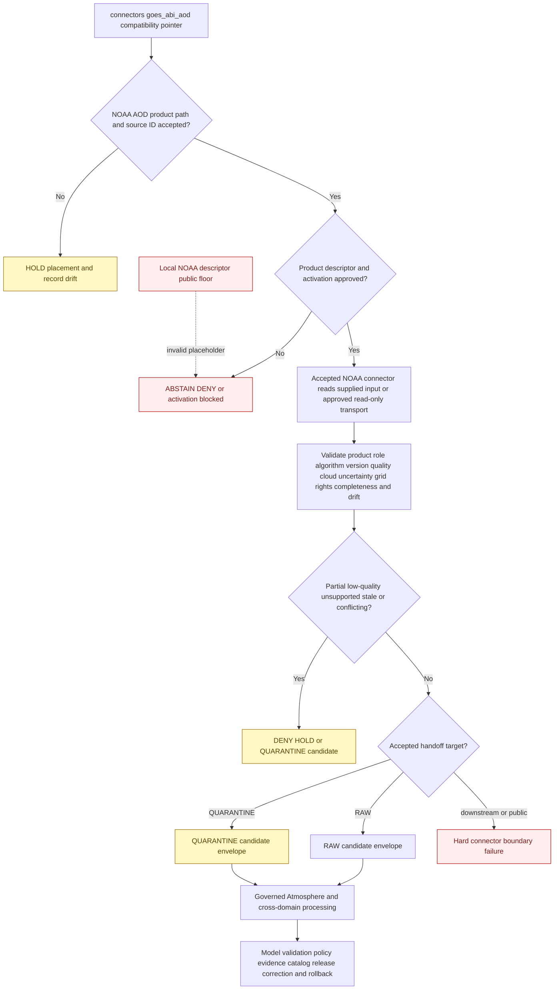

<!-- [KFM_META_BLOCK_V2]
doc_id: kfm://doc/connectors-goes-abi-aod-readme
title: connectors/goes_abi_aod/ — GOES ABI AOD Compatibility Pointer
type: readme
version: v0.2
status: draft
owners: OWNER_TBD — Connector steward · NOAA source steward · GOES/ABI product steward · Atmosphere steward · Hazards steward · Remote-sensing steward · Rights reviewer · Public-safety reviewer · Security reviewer · Validation steward · Docs steward
created: 2026-06-18
updated: 2026-07-11
policy_label: public-doctrine; compatibility-pointer; documentation-only; noncanonical-standalone-path; noaa-family; satellite-retrieval; modeled-default; radiance-retrieval-split; quality-gated; cloud-screened; aod-is-not-pm25; not-smoke-detection; not-alert-authority; no-code; no-descriptor; no-activation; no-publication
proposed_path: connectors/goes_abi_aod/README.md
truth_posture: CONFIRMED README-only standalone path / canonical NOAA family exists at connectors/noaa / exact GOES ABI AOD product-lane placement UNRESOLVED / shared NOAA package is placeholder-only / local NOAA descriptor is non-authoritative and unsafe / AOD-specific implementation, accepted descriptors, activation, fixtures, executable tests, live access, and CI evidence ABSENT or UNPROVED
related:
  - ../README.md
  - ../noaa/README.md
  - ../noaa/pyproject.toml
  - ../noaa/src/README.md
  - ../noaa/src/noaa/README.md
  - ../noaa/src/noaa/__init__.py
  - ../noaa/src/noaa/fetch.py
  - ../noaa/src/noaa/descriptor.yaml
  - ../noaa/tests/README.md
  - ../noaa/uscrn/README.md
  - ../../docs/sources/catalog/noaa/goes-abi-aod.md
  - ../../docs/sources/catalog/noaa/README.md
  - ../../docs/sources/catalog/noaa/IDENTITY.md
  - ../../docs/sources/catalog/noaa/RIGHTS-AND-SENSITIVITY-MAP.md
  - ../../docs/domains/atmosphere/README.md
  - ../../docs/domains/atmosphere/PIPELINE.md
  - ../../docs/domains/atmosphere/DATA_LIFECYCLE.md
  - ../../docs/domains/atmosphere/OBJECT_FAMILY_MAP.md
  - ../../docs/architecture/smoke-atmosphere-hazards.md
  - ../../contracts/domains/atmosphere/AODRaster.md
  - ../../schemas/contracts/v1/domains/atmosphere/AODRaster.schema.json
  - ../../data/raw/atmosphere/README.md
  - ../../data/raw/atmosphere/modeled/README.md
  - ../../data/raw/atmosphere/observed/goes-abi/README.md
  - ../../data/processed/atmosphere/aod/README.md
  - ../../data/quarantine/atmosphere/
  - ../../data/registry/sources/
  - ../../policy/domains/atmosphere/
  - ../../policy/sensitivity/
  - ../../policy/rights/
  - ../../release/
tags: [kfm, connectors, noaa, goes, abi, aod, aerosol-optical-depth, satellite-retrieval, remote-sensing-mask, atmosphere, smoke-context, modeled, quality, cloud-screen, fixed-grid, raw, quarantine, governance]
notes:
  - >-
    Repository inspection confirms that connectors/goes_abi_aod/ contains this README only; no package metadata, source tree, importable module, client, parser, SourceDescriptor, fixture, executable test, credential configuration, activation record, payload, cache, lifecycle writer, or CI evidence is proved below this standalone path.
  - >-
    NOAA has a canonical family lane at connectors/noaa/, but the exact GOES ABI AOD product placement is unresolved. The source product page leaves the flat standalone path versus a nested NOAA product lane open, and no nested GOES ABI AOD implementation was found.
  - >-
    The shared NOAA scaffold is greenfield: pyproject.toml contains only a project name and version 0.0.0; the package README is blank; __init__.py is empty; fetch.py is a one-line placeholder; descriptor.yaml sets role and rights to TBD and sensitivity_floor to public; and the test lane contains documentation rather than proved executable coverage.
  - >-
    The local NOAA descriptor is not source authority. Its public sensitivity floor is unsafe as an activation or release default because product rights, quality, cloud screening, source role, public-safety misuse, and join-induced risk remain unresolved.
  - >-
    Repository data-lane documentation distinguishes observed GOES ABI sensor/radiance captures from the modeled AOD retrieval. The observed GOES ABI RAW lane explicitly excludes AOD retrievals; the modeled Atmosphere RAW index has no confirmed AOD child; a processed AOD documentation lane exists but does not prove captured or processed AOD data.
  - >-
    The dominant semantic boundary is AOD is not PM2.5. AOD is also not AQI, smoke detection, surface concentration, exposure, visibility truth, air-quality advice, emergency guidance, or current hazard authority.
[/KFM_META_BLOCK_V2] -->

<a id="top"></a>

# GOES ABI AOD Compatibility Pointer

> Documentation-only compatibility, placement, and safety surface for a possible NOAA GOES Advanced Baseline Imager Aerosol Optical Depth source connector. This standalone path performs no source access, parsing, activation, retrieval modeling, storage, testing, lifecycle handoff, public-health interpretation, or publication.

<p>
  
  
  
  
  
  
  
  
</p>

`connectors/goes_abi_aod/`

> [!IMPORTANT]
> **Confirmed inspected state:** this directory contains this README only. No product package, client, object-store reader, download adapter, manifest reader, raster parser, quality-flag decoder, cloud-screen implementation, projection helper, configuration file, SourceDescriptor, SourceActivationDecision, credential mode, fixture set, executable test suite, source payload, cache, RAW writer, receipt writer, or passing CI evidence is confirmed here.

> [!CAUTION]
> **Placement and authority remain unresolved.** `connectors/noaa/` is the documented canonical NOAA family lane. The GOES ABI AOD source page leaves the existing flat path versus a nested NOAA product lane open. The shared NOAA package is still placeholder-only. **Do not add runtime behavior here and do not declare a nested replacement path canonical until an accepted placement and migration decision exists.**

> [!CAUTION]
> `../noaa/src/noaa/descriptor.yaml` contains `role: TBD`, `rights: TBD`, and `sensitivity_floor: public`. That file is a greenfield placeholder, not a SourceDescriptor. **The public floor must not activate GOES ABI AOD, authorize RAW admission, bypass quality or cloud review, lower joined-product sensitivity, or become an accepted public-safety test result.**

**Quick jumps:** [Purpose](#purpose) · [Placement decision](#placement-decision) · [Verified repository state](#verified-repository-state) · [Evidence ledger](#evidence-ledger) · [Compatibility responsibilities](#compatibility-responsibilities) · [Forbidden responsibilities](#forbidden-responsibilities) · [Blocking drift](#blocking-drift) · [Connector invariants](#connector-invariants) · [Product and surface decomposition](#product-and-surface-decomposition) · [Source-role boundary](#source-role-boundary) · [Semantic anti-collapse](#semantic-anti-collapse) · [Identity and version boundary](#identity-and-version-boundary) · [Access configuration and secret boundary](#access-configuration-and-secret-boundary) · [Rights terms and attribution](#rights-terms-and-attribution) · [Quality cloud and uncertainty](#quality-cloud-and-uncertainty) · [Geometry projection and raster support](#geometry-projection-and-raster-support) · [Temporal freshness and reprocessing](#temporal-freshness-and-reprocessing) · [Metadata preservation](#metadata-preservation) · [Cross-domain routing and one-capture rule](#cross-domain-routing-and-one-capture-rule) · [Testing relationship](#testing-relationship) · [Finite compatibility outcomes](#finite-compatibility-outcomes) · [Lifecycle boundary](#lifecycle-boundary) · [Child-path policy](#child-path-policy) · [Migration and deprecation](#migration-and-deprecation) · [Review and rollback](#review-and-rollback) · [Definition of done](#definition-of-done) · [Verification backlog](#verification-backlog)

---

## Purpose

This README prevents a README-only flat product path from hardening into a second NOAA connector implementation through directory momentum.

It may:

- redirect implementation work to the NOAA product/package lane selected by accepted governance;
- explain the unresolved relationship among `connectors/goes_abi_aod/`, `connectors/noaa/`, a possible nested NOAA product lane, and the shared `connectors/noaa/src/noaa/` package;
- preserve the distinction between upstream ABI radiance/sensor captures and downstream AOD retrieval products;
- preserve product identity, platform, instrument, scan sector, algorithm/version, source times, fixed-grid support, quality flags, cloud state, uncertainty, rights, and correction warnings;
- expose source-role, knowledge-character, RAW-lane, package, source-ID, file-name, and lifecycle-path drift;
- prevent AOD from becoming PM2.5, AQI, smoke detection, exposure, visibility, advisory, alert, or surface-observation truth;
- prevent connector code from silently running a retrieval model, regional AOD-to-PM model, aggregation, reprojection, or public transform;
- identify the Atmosphere, Hazards, Agriculture, Biodiversity, Settlements, Roads, evidence, policy, catalog, and release lanes that take over after source admission;
- document migration, deprecation, correction, rollback, backlink, and generated-template work.

It does **not**:

- host a GOES ABI AOD implementation package;
- choose the canonical connector path, product key, source ID, distribution name, import name, registry path, or lifecycle slug;
- activate any GOES platform, ABI radiance surface, Level-2 retrieval surface, archive, object-store distribution, query interface, or watcher;
- run the ABI AOD retrieval algorithm or create a `ModelRunReceipt` as proof authority;
- assign final source roles, quality thresholds, rights, sensitivity, cadence, freshness, or release class;
- fetch a live source, discover endpoints, manage credentials, poll listings, stage downloads, or cache files;
- map source rasters into canonical `AODRaster`, `SmokeContext`, `PM25Observation`, health, exposure, or hazard truth;
- perform cross-source joins, regional AOD-to-PM calibration, public reprojection, aggregation, evidence closure, release, correction, or publication.

[Back to top ↑](#top)

---

## Placement decision

Current evidence supports one safe decision while leaving the final NOAA product path open:

> **`connectors/goes_abi_aod/` is a documentation-only compatibility pointer under the current posture.**

| Question | Current safe decision | Evidence posture |
|---|---|---:|
| Is this standalone path an operational connector package? | **No.** It is README-only and contains no proved implementation or authority. | Confirmed inspected state. |
| Is `connectors/noaa/` the NOAA family boundary? | **Yes as repository doctrine/documentation.** Product-specific implementation still requires an accepted product placement. | Parent NOAA README and source-family docs. |
| Where should executable GOES ABI AOD behavior live? | In one accepted NOAA product lane and one shared or dedicated package after placement review. | Exact product path remains unresolved. |
| Does the source page settle flat versus nested placement? | **No.** It records the question as open. | Product-page `OPEN-AOD-08`. |
| Is the shared NOAA package operational for AOD? | **No evidence.** The package is an empty/placeholder scaffold and has no confirmed AOD module. | Verified package files. |
| May this standalone path own a SourceDescriptor, activation decision, fixtures, or tests? | **No under the current posture.** Use the accepted registry, NOAA connector package, and connector-test lane after placement is resolved. | Duplicate authority would fragment source identity and lineage. |
| May Atmosphere and Hazards fetch the same AOD product independently? | **No by convenience.** Capture once under the accepted source identity and route lineage-preserving candidates. | One-capture rule. |
| Can the placement decision change? | Yes, only through an accepted ADR or migration decision. | Must cover naming, package ownership, descriptors, credentials, tests, lifecycle paths, aliases, correction, and rollback. |

A flat directory, a family directory, a product-page diagram, a generated module proposal, a placeholder `pyproject.toml`, or a detailed README does not establish implementation authority or activation.

[Back to top ↑](#top)

---

## Verified repository state

The following relationship is confirmed or directly evidenced on the repository default branch at the time of this update:

```text
connectors/
├── goes_abi_aod/
│   └── README.md                         # this compatibility pointer
└── noaa/
    ├── README.md                         # NOAA family contract
    ├── pyproject.toml                    # project name + version 0.0.0 only
    ├── src/
    │   ├── README.md                     # source-root documentation
    │   └── noaa/
    │       ├── README.md                 # blank file
    │       ├── __init__.py               # empty file
    │       ├── fetch.py                  # one-line greenfield placeholder
    │       └── descriptor.yaml           # role/rights TBD; unsafe public floor
    ├── tests/
    │   └── README.md                     # test guidance; executable suite unproved
    └── uscrn/
        └── README.md                     # nested product-lane precedent, not AOD placement proof
```

Relevant lifecycle and domain documentation currently includes:

```text
data/raw/atmosphere/
├── modeled/
│   ├── README.md                         # modeled role index; no confirmed AOD child
│   ├── cams/README.md
│   └── hrrr-smoke/README.md
└── observed/
    └── goes-abi/
        └── README.md                     # observed ABI radiance/sensor lane; AOD retrieval excluded

data/processed/atmosphere/aod/README.md   # processed AOD documentation; no payload proof
contracts/domains/atmosphere/AODRaster.md
schemas/contracts/v1/domains/atmosphere/AODRaster.schema.json
```

### Current maturity

| Surface | Confirmed content | Maturity |
|---|---|---:|
| `connectors/goes_abi_aod/README.md` | This compatibility, safety, and migration contract. | **DOCUMENTED / NON-OPERATIONAL** |
| Other files below the standalone path | None found in current repository search. | **ABSENT / NEEDS CONTINUOUS VERIFICATION** |
| Standalone package metadata, code, fixtures, or tests | None confirmed. | **ABSENT / FORBIDDEN UNDER CURRENT POSTURE** |
| `connectors/noaa/README.md` | NOAA family and product-boundary documentation. | **DOCUMENTED** |
| `connectors/noaa/pyproject.toml` | Distribution name `kfm-connector-noaa`, version `0.0.0`. | **INCOMPLETE PLACEHOLDER** |
| `connectors/noaa/src/noaa/README.md` | Blank file. | **PLACEHOLDER / NO PACKAGE CONTRACT** |
| `connectors/noaa/src/noaa/__init__.py` | Empty file. | **IMPORT-SHAPED / BEHAVIOR ABSENT** |
| `connectors/noaa/src/noaa/fetch.py` | One-line placeholder comment. | **NON-EXECUTABLE PLACEHOLDER** |
| `connectors/noaa/src/noaa/descriptor.yaml` | `role: TBD`, `rights: TBD`, `sensitivity_floor: public`. | **NON-AUTHORITATIVE / UNSAFE DEFAULT** |
| `connectors/noaa/tests/README.md` | Proposed shared offline test guidance. | **DOCUMENTED / EXECUTABLE TESTS UNPROVED** |
| GOES ABI AOD product module or dispatcher | None found. | **ABSENT / UNPROVED** |
| Accepted GOES ABI AOD SourceDescriptor | None found or verified. | **ABSENT / BLOCKED** |
| SourceActivationDecision | None found or verified. | **NOT ACTIVATED** |
| Observed ABI RAW lane | README exists for sensor/radiance-style captures and explicitly excludes AOD retrieval. | **DOCUMENTED / PAYLOADS UNKNOWN** |
| Modeled AOD RAW child | No `data/raw/atmosphere/modeled/aod/README.md` found. | **ABSENT / PLACEMENT UNRESOLVED** |
| Processed AOD lane | README, semantic contract, and scaffold schema exist. | **DOCUMENTED / DATA AND ENFORCEMENT UNPROVED** |
| Current endpoints, formats, product designators, cadence, and quality vocabularies | Product-page open questions only. | **NEEDS VERIFICATION** |
| Live tests, credentials, or approved watcher | None confirmed or approved. | **ABSENT / NOT APPROVED** |
| Passing CI evidence | None confirmed for this product. | **UNKNOWN / ABSENT** |

> [!CAUTION]
> README presence, a blank package file, a placeholder fetcher, a source catalog page, a RAW-lane README, a processed-lane README, or a schema scaffold does not prove source access, parsing, role enforcement, quality handling, data presence, activation, test coverage, or release readiness.

[Back to top ↑](#top)

---

## Evidence ledger

| Evidence | Status | What it supports | What it does not support |
|---|---:|---|---|
| This standalone path and current path search | **CONFIRMED for inspected state** | The flat connector path exists and contains this README only. | Permanent absence of future files or canonical status. |
| `docs/sources/catalog/noaa/goes-abi-aod.md` | **CONFIRMED draft product documentation** | Product semantics, modeled-default posture, ModelRunReceipt requirement, AOD-not-PM2.5 rule, quality/geometry expectations, and open placement questions. | Current endpoints, accepted descriptors, implementation, activation, or test coverage. |
| `connectors/noaa/README.md` | **CONFIRMED family documentation** | NOAA is a canonical family lane and products require independent roles and admission. | A selected AOD product path or working connector. |
| NOAA `pyproject.toml` and package files | **CONFIRMED placeholders** | A shared distribution/package shape was scaffolded. | Build backend, discovery, dependencies, installability, product modules, or AOD behavior. |
| NOAA local `descriptor.yaml` | **CONFIRMED placeholder** | A non-authoritative file exists. | Accepted role, rights, sensitivity, source identity, or activation. |
| `connectors/noaa/tests/README.md` | **CONFIRMED test documentation** | Offline, product-specific, source-role-aware testing intentions exist. | Test files, fixtures, passing results, or AOD coverage. |
| `data/raw/atmosphere/observed/goes-abi/README.md` | **CONFIRMED RAW documentation** | Upstream ABI sensor/radiance material may be observed; AOD retrieval is explicitly excluded. | Actual captures, a working connector, or a modeled AOD RAW path. |
| `data/raw/atmosphere/modeled/README.md` | **CONFIRMED role-index documentation** | Retrieval-like products belong under modeled governance and require model-run support. | A confirmed AOD child or AOD payloads. |
| `data/processed/atmosphere/aod/README.md` | **CONFIRMED processed-lane documentation** | AODRaster has a downstream processed boundary and strong anti-collapse rules. | Processed AOD data, validation, catalog closure, or release. |
| `contracts/domains/atmosphere/AODRaster.md` | **CONFIRMED semantic contract** | AODRaster meaning and remote-sensing proxy boundaries are documented. | Machine enforcement or connector behavior. |
| AODRaster schema | **CONFIRMED scaffold** | A paired schema file exists. | Useful field validation; the contract reports empty properties and permissive additional properties. |
| Repository searches for AOD connector/product identifiers | **CONFIRMED search posture** | References are concentrated in documentation and lane READMEs. | A complete filesystem inventory, especially empty/generated/unindexed files. |

[Back to top ↑](#top)

---

## Compatibility responsibilities

This standalone path may contain only responsibilities that prevent ambiguity and unsafe implementation drift:

- a concise redirect to the product path selected by accepted governance;
- path, product-key, source-ID, module-name, registry-slug, RAW-slug, and package conflict documentation;
- migration inventories, backlink maps, tombstone plans, and deprecation notes;
- explicit separation of ABI sensor/radiance inputs from AOD retrieval products;
- source-role and knowledge-character anti-collapse warnings;
- AOD-not-PM2.5, AOD-not-smoke, model-not-observation, and not-alert-authority warnings;
- algorithm/version, quality, cloud, uncertainty, fixed-grid, platform, time, and completeness warnings;
- one-source-capture/multi-domain routing guidance;
- pointers to accepted connector, registry, tests, contracts, schemas, lifecycle, policy, evidence, catalog, and release surfaces;
- corrections to documentation or generated templates that treat a proposed path as active, canonical, public-safe, or release-ready.

Every compatibility statement must distinguish:

```text
CONFIRMED repository evidence
PROPOSED product or placement design
CONFLICTED path, source-role, or lifecycle posture
NEEDS VERIFICATION implementation, source, or governance state
```

[Back to top ↑](#top)

---

## Forbidden responsibilities

Do not place or implement the following beneath `connectors/goes_abi_aod/` under the current posture:

| Forbidden content or behavior | Correct responsibility or handling |
|---|---|
| Source clients, object-store readers, downloaders, listing pollers, API adapters, or watchers | The GOES ABI AOD product lane selected by accepted NOAA placement review. |
| Python, JavaScript, shell, SQL, notebook, package, build, or deployment configuration | The reviewed NOAA connector implementation package. |
| SourceDescriptors or SourceActivationDecisions | Accepted source registry and activation workflow. |
| Endpoint URLs, credentials, account state, tokens, cookies, keys, sessions, or browser profiles | Approved external security/runtime configuration. |
| GOES radiance files, AOD products, QA bands, cloud masks, uncertainty rasters, metadata files, archives, listings, or caches | Governed RAW, QUARANTINE, temporary runtime, or approved fixture storage. |
| Connector-local fixtures or executable tests | The accepted NOAA/AOD connector test lane. |
| Retrieval algorithm implementation or AOD-to-PM calibration model | Downstream governed model/pipeline package with its own contracts, receipts, tests, and review. |
| Canonical `AODRaster`, `SmokeContext`, `PM25Observation`, exposure, health, visibility, or hazard objects | Domain contracts, schemas, packages, pipelines, and review. |
| Rights, quality-threshold, cloud-screen, public-safety, sensitivity, or release policy | `policy/`, source registry, domain governance, and release authority. |
| Public reprojection, aggregation, map styling, tiles, search indexes, graphs, reports, APIs, embeddings, or generated answers | Governed downstream and released application surfaces. |
| RAW, WORK, QUARANTINE, PROCESSED, CATALOG, TRIPLET, PROOF, RECEIPT, RELEASE, or PUBLISHED writers | Owning lifecycle, evidence, and release systems. |
| PM2.5, AQI, smoke detection, exposure, advisory, alert, evacuation, visibility, or health guidance | Official authorities and governed downstream products, never this compatibility path. |

A compatibility path is not a shortcut around unresolved NOAA product placement, source admission, or quality authority.

[Back to top ↑](#top)

---

## Blocking drift

Executable work must expose these blockers rather than mock them into success.

| Blocker | Confirmed gap or conflict | Required posture |
|---|---|---|
| Standalone versus family placement | Flat `connectors/goes_abi_aod/` exists; NOAA family lane exists; exact nested AOD path is not selected. | Keep standalone path inert; require accepted placement/migration decision. |
| Product and source naming | `goes_abi_aod`, `goes-abi-aod`, product-page collection names, possible NOAA module names, and candidate source product designators coexist. | Select one canonical source ID/product key and explicit aliases; no silent normalization. |
| Shared package maturity | NOAA package README is blank, initializer empty, fetcher placeholder, packaging incomplete. | Do not claim import, client, parser, or dispatcher support. |
| Local descriptor authority | `role` and `rights` are `TBD`; sensitivity floor is `public`. | Reject it as activation, role, rights, sensitivity, or release authority. |
| Radiance versus retrieval | Observed ABI RAW lane is for sensor/radiance captures; AOD product page treats retrieval as modeled. | Require distinct product descriptors and dispatch. |
| Atmosphere source-role wording | Some domain prose calls GOES/ABI AOD a satellite observation while product and RAW docs distinguish retrieval from observed radiance. | Bind machine role through accepted descriptor; no prose-based inference. |
| Knowledge character versus source role | `REMOTE_SENSING_MASK` describes domain meaning; it is not automatically a canonical source-role enum value. | Preserve both dimensions independently. |
| Modeled AOD RAW placement | Modeled RAW index exists but no confirmed AOD child is present. | Resolve lifecycle source slug before real capture. |
| Retrieval receipt | Product docs require `ModelRunReceipt`; source-produced Level-2 ingestion versus KFM re-retrieval handling is not bound. | Select receipt/provenance contract before activation. |
| Source surfaces | Candidate product designators, platforms, sectors, downloads, formats, and access methods remain open. | No guessed endpoint, parser, or provider-wide activation. |
| Algorithm/version identity | Identity and reprocessing behavior are proposed but unimplemented. | Preserve source algorithm/version; never overwrite across material reprocessing. |
| Quality vocabulary | DQF values, cloud masks, thresholds, uncertainty fields, coverage rules, and accepted exclusions are unverified. | Carry raw values; threshold decisions require accepted policy/config. |
| Geometry | Fixed-grid projection parameters, platform variants, transforms, shape, resolution, and limb rules are unverified. | Preserve native support; no silent reprojection or geometry guessing. |
| Rights and terms | Product docs propose an open federal-source posture but current product terms and required attribution are not accepted. | Fail closed; preserve product-specific terms snapshot. |
| Tests and fixtures | Shared test lane is documentation-only; no AOD fixture set is proved. | Synthetic/supplied-input tests only after fixture governance. |
| Live tests | An illustrative NOAA live-test variable appears in older test guidance but no convention is approved. | No live variable, marker, account, endpoint, or command by implication. |
| CI | No AOD-specific workflow or passing evidence is confirmed. | No coverage or readiness badge. |

These blockers are part of the safety and evidence contract. They must not be bypassed merely to produce a successful demo.

[Back to top ↑](#top)

---

## Connector invariants

Every future file and behavior for this product must preserve these invariants:

1. **No standalone implementation.** The flat path remains documentation-only unless an accepted migration decision explicitly changes it.
2. **No side effects on import.** Import performs no network, DNS, endpoint discovery, secret reads, filesystem writes, logging mutation, environment mutation, cache initialization, watcher startup, registry mutation, policy evaluation, or activation.
3. **No live behavior by default.** Synthetic fixtures and explicit supplied captures are the default paths until live access is independently approved.
4. **One exact product at a time.** Product identity is explicit and closed; no filename-, URL-, extension-, bucket-, content-type-, first-variable-, or provider-label dispatch.
5. **Descriptor-driven activation.** Connector code consumes accepted source authority; it does not create or infer it.
6. **Radiances and retrievals remain distinct.** Upstream ABI sensor/radiance material cannot silently enter the AOD retrieval parser or inherit its role.
7. **AOD remains modeled by default.** An accepted descriptor may refine the contract, but parsing cannot upgrade a retrieval to observed surface truth.
8. **Knowledge character and source role remain separate.** `REMOTE_SENSING_MASK` does not replace the machine source-role field.
9. **AOD is not PM2.5 or AQI.** No fixed multiplier, relabeling, unit rewrite, or display legend may imply otherwise.
10. **AOD is not smoke detection.** Elevated AOD may support context; smoke attribution requires independently admitted evidence and downstream review.
11. **AOD is not advisory or alert authority.** Connector output cannot become health, exposure, visibility, evacuation, or life-safety guidance.
12. **Quality is first-class.** DQF, cloud, missing/fill, uncertainty, coverage, geometry, and source QA state remain attached.
13. **No connector-owned threshold policy.** Code evaluates accepted configuration and reports results; it does not invent public quality thresholds.
14. **Algorithm and version remain identity-bearing.** Material reprocessing never silently overwrites an earlier source state.
15. **Native grid remains inspectable.** Projection, shape, transform, resolution, footprint, coordinate support, and platform context are preserved.
16. **No connector-side public transform.** Reprojection, resampling, aggregation, regional calibration, smoke composition, and public rendering are downstream governed operations.
17. **Rights and public safety remain separate gates.** Open access or a public license does not establish scientific validity, safe interpretation, or release approval.
18. **No sensitive logging.** Credentials, private scopes, source payload excerpts, large metadata blocks, internal paths, and joined sensitive details stay out of logs and errors.
19. **Input is bounded.** Listings, files, responses, retries, redirects, pages, arrays, dimensions, metadata, decompression, memory, and execution time have explicit limits.
20. **No silent partial success.** Truncated files, missing required QA/support variables, checksum failures, incomplete listings, and partial scenes produce finite incomplete outcomes.
21. **One source capture serves multiple domains.** Atmosphere and Hazards do not duplicate retrieval, downloads, credentials, caches, or correction state.
22. **Finite outcomes only.** Every operation terminates in a bounded, reviewable result.
23. **RAW or QUARANTINE candidate only.** Connector code does not persist later lifecycle stages.
24. **No false secure-erasure claim.** Code may minimize retention and request cleanup but does not promise erasure beyond proved runtime/storage controls.
25. **No public path from connector internals.** Public clients do not read connector, package, registry, RAW, QUARANTINE, cache, or source-account internals.

[Back to top ↑](#top)

---

## Product and surface decomposition

GOES ABI AOD is not one undifferentiated product or meaning. Every admitted surface requires explicit identity, role, format, rights, cadence, quality, completeness, fixtures, tests, and activation.

| Product or surface | Source meaning | Minimum future connector behavior | Forbidden shortcut |
|---|---|---|---|
| ABI Level-1-style radiance or sensor capture | Upstream observed sensor/radiance evidence used by retrieval products. | Preserve platform, instrument, band/channel, scan identity, times, native grid, QA, source version, and digest under a separate descriptor. | Treating radiance capture as an AOD raster or PM2.5 observation. |
| Source-produced AOD retrieval | NOAA-produced aerosol optical depth retrieval derived from radiances by a versioned algorithm. | Preserve exact product designator, platform, sector/scan mode, algorithm/version, source processing metadata, quality, uncertainty, grid, and modeled role. | Relabeling as direct surface observation or rerunning the model implicitly. |
| Quality/DQF asset | Source quality classification associated with retrieval pixels or scenes. | Preserve vocabulary/version, raw values, missing state, relationship to the data asset, and accepted evaluation reference. | Dropping QA or converting unknown values to good. |
| Cloud/validity mask | Pixel-level support describing cloud or retrieval validity. | Preserve source mask identity, values, version, and relationship to data/uncertainty assets. | Treating masked pixels as zero AOD or silently filling gaps. |
| Uncertainty/support asset | Retrieval uncertainty, error estimate, coverage, surface/geometry support, or related source layer. | Preserve units/semantics, grid alignment, checksum, and linkage to the retrieval asset. | Treating uncertainty as optional decoration. |
| Spatial/temporal composite | Aggregate over explicit pixels, geometry, scans, or time windows. | Preserve aggregation unit, method, inputs, period, coverage, role, and AggregationReceipt reference. | Presenting aggregate values as source pixels or instantaneous observations. |
| KFM re-retrieval from radiances | A new KFM model run over admitted upstream radiance evidence. | Live in a separately accepted downstream model pipeline with its own model code, version, parameters, tests, receipt, and output identity. | Running retrieval inside a fetcher or overwriting source-produced AOD. |
| AOD-to-PM regional calibration | Separate modeled surface estimate using AOD plus meteorology, monitors, vertical structure, and calibration. | Require a separate model/product descriptor, calibration receipt, validation, uncertainty, domain contract, and release review. | Fixed AOD-to-PM multiplier or inheritance of the AOD receipt as PM proof. |
| Smoke-context composition | Downstream cross-source product combining AOD with smoke-specific or fire-specific evidence. | Preserve every source role and disagreement; issue its own evidence and model/composition receipts. | Calling AOD alone smoke detection. |
| Synthetic test fixture | Invented safe source-shaped material used to exercise parser and boundary behavior. | Carry `synthetic` status and never resemble a consequential real event/location. | Treating fixture success as live product compatibility. |
| Unknown or combined export | Product identity, source role, algorithm, QA, grid, or completeness unresolved. | Reject, hold, or quarantine with an actionable unsupported-product result. | Best-effort parsing, auto-splitting, or NOAA-wide admission. |

No surface inherits another surface's descriptor, role, parser, quality threshold, stable-key rule, fixture, test coverage, activation, or release posture by provider adjacency.

[Back to top ↑](#top)

---

## Source-role boundary

The machine source role is bound by an accepted product-specific SourceDescriptor. The current product documentation expects the AOD retrieval to be `modeled`, while upstream ABI radiance/sensor capture can be `observed` under a separate product identity.

| Record or asset class | Expected role posture | Required distinction |
|---|---|---|
| ABI radiance/sensor capture | `observed` under a separate descriptor | Source sensor evidence, not the AOD retrieval and not surface aerosol concentration. |
| Source-produced AOD retrieval | `modeled` by default, subject to accepted descriptor | Retrieval-derived column property, not direct surface observation. |
| DQF/cloud/uncertainty/support assets | Support assets bound to the associated product role | Quality evidence, not independent atmospheric truth. |
| Spatial or temporal composite | `aggregate` | Aggregation unit, time window, coverage, and method are mandatory. |
| Low-quality or unresolved item | `candidate`, hold, or quarantine posture under accepted doctrine | Cannot become accepted merely through parsing. |
| Synthetic fixture | `synthetic` | Test-only evidence, never a real atmospheric claim. |

Future connector behavior must:

- require accepted product-specific descriptors and activation decisions;
- preserve assigned role and authority exactly;
- reject absent, umbrella, ambiguous, or incompatible roles;
- never infer role from the NOAA family, path, filename, variable name, product acronym, or RAW directory alone;
- never convert a `REMOTE_SENSING_MASK` knowledge character into a made-up source-role value;
- never reclassify a retrieval as `observed` because a pixel has coordinates or a scan time;
- never reclassify a source-produced retrieval as a KFM model run without an explicit separate process;
- require descriptor revision or correction evidence for a role change.

### Role drift that must remain visible

Repository documentation currently uses several overlapping terms:

```text
machine source roles: observed | regulatory | modeled | aggregate | administrative | candidate | synthetic
product-page shorthand: observation | authority | context
knowledge characters: REMOTE_SENSING_MASK | ATMOSPHERIC_MODEL_FIELD | OBSERVED_SENSOR
```

Do not map those terms silently. An accepted role/knowledge-character contract must decide which fields carry each concept and how legacy prose is reconciled.

[Back to top ↑](#top)

---

## Semantic anti-collapse

| Forbidden collapse | Required posture |
|---|---|
| AOD retrieval → PM2.5 concentration | Hard semantic failure; a separate calibrated model with independent evidence is required. |
| AOD retrieval → AQI | Hard semantic and units failure. |
| AOD retrieval → smoke detection | Preserve aerosol-column context only; require smoke-specific evidence downstream. |
| AOD retrieval → surface aerosol observation | Preserve modeled retrieval role and vertical-column meaning. |
| AOD pixel → human exposure or health effect | Refuse; exposure requires independent concentration, time/activity, population, and health evidence. |
| AOD raster → visibility truth | Preserve as aerosol-opacity evidence; visibility requires separate meteorological/observational support. |
| AOD raster → advisory or alert | Hard not-alert-authority failure; redirect to official sources downstream. |
| ABI radiance → AOD without model provenance | Hard derivation failure. |
| DQF/cloud mask → optional metadata | Reject; quality/support state remains required. |
| Cloud/missing pixel → zero aerosol | Hard missing-data failure. |
| Composite → source pixel or instantaneous scan | Preserve aggregate role, method, time window, and coverage. |
| Source-produced retrieval → KFM re-retrieval | Preserve distinct producer, algorithm, run, parameters, and item identity. |
| Product platform or algorithm transition → in-place overwrite | Emit a new source state/item and correction/supersession linkage. |
| Public NOAA access → scientifically valid/public-safe derivative | Continue through role, quality, rights, evidence, policy, and release gates. |
| Missing AOD retrieval → aerosol absence | Abstain; cloud, geometry, quality, source coverage, or retrieval failure may explain absence. |
| Lifecycle promotion → source-role upgrade | Role remains fixed; promotion cannot change evidence meaning. |

> [!IMPORTANT]
> AOD is a column retrieval, not breathing-height concentration. A quality flag is not decoration. A missing pixel is not clean air. A contextual layer is not smoke detection. A connector candidate is not a released air-quality claim.

[Back to top ↑](#top)

---

## Identity and version boundary

A future accepted connector must use explicit source-native and KFM admission identity. It must not derive identity from one filename or timestamp alone.

### Minimum identity dimensions

Preserve or require, where the accepted product supplies them:

- canonical source ID and product key;
- publisher/program and source product designator;
- satellite/platform identity;
- instrument identity;
- product level and retrieval type;
- sector, scene, scan mode, or coverage mode;
- scan start/end or source observation time;
- source file/product creation time;
- retrieval algorithm identity and version;
- source processing system/version when supplied;
- native grid/projection identity;
- file/object/distribution identity;
- checksum/digest and content size;
- source correction, reprocessing, replacement, or supersession state.

The source page names candidate product designators and platform distinctions as open questions. Those examples are not accepted dispatch values until the SourceDescriptor and current source documentation pin them.

### Required identity behavior

- reject missing or mixed product identity;
- reject filename-only, extension-only, directory-only, or URL-only dispatch;
- reject one NOAA-wide AOD activation covering unknown product variants;
- preserve GOES platform distinctions until an accepted contract decides collection grouping;
- preserve scan-sector and fixed-grid differences;
- treat algorithm/version changes as identity-bearing unless an accepted correction contract explicitly proves otherwise;
- preserve old IDs and checksums through aliases or supersession references during migration;
- detect duplicate native identities with conflicting checksums or metadata;
- keep source object identity separate from downstream `AODRaster` object identity.

[Back to top ↑](#top)

---

## Access, configuration, and secret boundary

### Current safe posture

No GOES ABI AOD-specific client or approved live access contract is confirmed.

```text
network access: disabled
endpoint or object-store discovery: forbidden
account or credential access: disabled
background listing poller or watcher: forbidden
input: documentation only; future synthetic fixture or explicitly supplied capture
persistence: none
output from this standalone path: none
```

### Future supplied-input-first modes

After placement, contracts, and source admission are accepted, implementation may support separately reviewed modes such as:

- supplied synthetic metadata and small raster/array fixtures;
- supplied source product metadata;
- supplied AOD data plus aligned QA/cloud/uncertainty assets;
- supplied source listing/manifest snapshot;
- approved read-only product download;
- approved bounded source listing or object-store enumeration;
- approved material-change watcher that returns finite metadata to orchestration.

Every real/live mode requires exact product identity, accepted descriptor and activation, current source documentation, host/container allowlisting, terms review, format/version pinning, rate/size limits, temporary-storage rules, cleanup controls, synthetic fixtures, negative tests, logging review, correction behavior, and rollback.

### Explicit configuration requirements

A future operation should require values equivalent to:

- canonical source descriptor reference;
- SourceActivationDecision reference;
- exact product key and source role;
- access mode: supplied capture or separately approved read-only transport;
- source surface/distribution identity;
- platform, instrument, sector/scan mode, and accepted product designator;
- expected format, encoding, compression/container, dimensions, and variable inventory;
- expected algorithm and version policy;
- expected projection/grid support;
- required QA, cloud, uncertainty, and ancillary asset rules;
- expected checksum, content length, file/object count, or manifest where known;
- connect, read, total, idle, retry, redirect, listing, download, memory, and execution limits;
- external credential-provider reference only if a reviewed mode needs one;
- temporary-storage and cleanup instructions owned by orchestration/runtime;
- intended lifecycle target of QUARANTINE or, only when every admission gate closes, RAW.

Required behavior:

- reject missing or ambiguous product, role, platform, algorithm, grid, rights, quality, or lifecycle identity;
- reject missing descriptor or activation evidence for real-input/live paths;
- reject unknown, mixed, unsupported, or non-admitted product variants;
- reject product/role/algorithm/grid mismatches;
- keep synthetic configuration unable to fall through to live access;
- never dispatch from filename, URL, extension, first variable, content type, source directory, or NOAA label alone;
- document no endpoint, environment-variable name, credential convention, marker, or live command as accepted until implementation and review establish it.

Secrets, tokens, account state, and credentials remain outside this connector. Publicly readable source data does not justify implicit network or endpoint behavior.

### Prohibited access behavior

- guessed, stale, or undocumented endpoints;
- implicit environment-variable credential reads;
- home-directory, browser, keychain, cloud-CLI, profile, or config-file discovery;
- provider-wide or bucket-wide crawling;
- unbounded listings, pagination, downloads, retries, redirects, or polling;
- hidden fallback from supplied input to live access;
- automatic fixture refresh from live source data;
- accepting a URL, filename, product acronym, bucket, or HTTP success as activation evidence;
- treating download success as completeness, role, rights, quality, or release approval;
- importing source data during package import, test collection, or documentation build;
- hidden persistence, caches, retry queues, temporary archives, or background daemons;
- copying full metadata, source arrays, URLs with credentials, or binary excerpts into logs and exceptions.

[Back to top ↑](#top)

---

## Rights, terms, and attribution

The product page proposes a generally open U.S. government-source posture but leaves product-specific rights and current terms unverified. This compatibility path does not establish legal sufficiency, attribution, disclaimer, automation permission, or downstream-use permission.

A future accepted connector should preserve, where supplied and applicable:

- publisher and responsible NOAA/NESDIS/STAR program identity;
- product, distribution, collection, file, object, or service identity;
- raw rights or terms value;
- current terms/disclaimer snapshot reference;
- required attribution and citation text;
- source URL or distribution reference;
- access, redistribution, automation, or rate restrictions;
- source release/update date and product version;
- retrieval time;
- checksum, content size, and source version;
- rights-review state and external decision reference.

| Rights condition | Required handling |
|---|---|
| Current product terms and citation complete | Preserve them; continue only when descriptor and external rights decision permit. |
| Disclaimer or attribution required | Carry exact text and source reference through candidates. |
| Terms absent, stale, conflicting, or unparseable | `DENY`, `ABSTAIN`, `HOLD`, or QUARANTINE candidate. |
| Product variants or access surfaces differ | Preserve surface-specific terms; one surface does not authorize another. |
| Downstream product adds third-party monitor, weather, population, or hazard data | Re-evaluate rights at the joined-product level. |
| Public availability used as release approval | Hard authority failure. |
| Rights change after capture | Preserve the prior state and emit correction/drift evidence; never rewrite history silently. |

The connector may parse and carry rights metadata. Legal conclusions, redistribution approval, disclaimer sufficiency, and public release remain external decisions.

[Back to top ↑](#top)

---

## Quality, cloud, and uncertainty

Quality/support data is part of the source evidence. It cannot be discarded to simplify rendering or modeling.

### Minimum quality dimensions

Preserve, where supplied by the accepted product:

- source data-quality flag values and vocabulary/version;
- cloud, validity, or retrieval mask values;
- retrieval uncertainty/error estimates;
- missing, fill, no-data, saturated, invalid, or not-produced states;
- source valid range, scale, offset, and units/dimensionless semantics;
- surface-type, brightness, snow/ice, water/glint, or related support state;
- solar zenith, view zenith, relative geometry, or source geometry support;
- limb/edge/coverage state;
- usable-pixel or coverage counts/rates;
- source quality summary and algorithm caveats;
- alignment between data, QA, cloud, and uncertainty arrays;
- source version and correction state.

### Required connector posture

1. Preserve raw QA/support values and source vocabulary before normalization.
2. Reject missing required QA, cloud, uncertainty, or grid support when the descriptor requires them.
3. Never map unknown or unmapped quality values to good.
4. Never treat cloud, missing, invalid, or outside-domain pixels as zero AOD.
5. Never hide low coverage through spatial interpolation at the connector edge.
6. Keep threshold policy external; evaluate only accepted configuration and return finite findings.
7. Preserve disagreement between product-level and pixel-level quality summaries.
8. Detect misaligned dimensions, grids, transforms, or timestamps across support assets.
9. Preserve quality and uncertainty into candidate envelopes and downstream references.
10. Route unresolved quality, cloud, or uncertainty to denial, abstention, hold, or quarantine.

### Threshold boundary

The product documentation discusses cloud and quality thresholds, but no accepted threshold is confirmed. A connector must not hard-code a public-use threshold from prose. A future descriptor/policy/configuration must define:

- the source vocabulary/version;
- required quality classes;
- product-specific versus use-specific thresholds;
- minimum valid coverage;
- allowed masks and exclusions;
- treatment of unknown values;
- correction behavior when the source changes the vocabulary;
- which decisions are connector validation versus downstream release policy.

[Back to top ↑](#top)

---

## Geometry, projection, and raster support

GOES ABI products use source-native raster/grid support that must remain inspectable. This README does not select a projection code, transform, resolution, or public target grid.

Future source candidates should preserve, where supplied:

- platform-specific native grid/projection identity;
- complete grid-mapping/projection parameters;
- raster dimensions and coordinate order;
- shape, affine/transform, geolocation arrays, or equivalent support;
- source footprint and domain/sector;
- pixel resolution and variation across the view where relevant;
- horizontal datum/ellipsoid/satellite height and sweep-axis metadata where supplied;
- source coordinate variables and units;
- limb, space, outside-domain, invalid, or coverage mask state;
- alignment among AOD, QA, cloud, and uncertainty assets;
- native and transformed geometry digests under accepted contracts;
- platform/grid/version disagreement flags.

Required posture:

- preserve native support rather than replacing it with a guessed EPSG code;
- reject missing or inconsistent required grid-mapping metadata;
- never infer Kansas coverage from file naming alone;
- never silently reproject, resample, clip, smooth, gap-fill, mosaic, or aggregate at the connector edge;
- treat any supplied transformed derivative as a separate asset with explicit provenance;
- keep source and transformed grids independently inspectable;
- route public reprojection, tiling, and visual generalization to downstream governed pipelines;
- require a TransformReceipt or equivalent downstream evidence for material reprojection/resampling;
- preserve source nodata and mask behavior through any later transform;
- surface edge/limb and viewing-geometry limitations rather than hiding them in styling.

[Back to top ↑](#top)

---

## Temporal, freshness, and reprocessing

Keep these time concepts distinct where material:

| Time kind | Meaning | Guardrail |
|---|---|---|
| Scan start/end or source observation time | When ABI acquired the radiance evidence for the product. | Do not replace with file creation or retrieval time. |
| Source product creation/processing time | When the source generated the AOD product. | Does not equal KFM retrieval or release time. |
| Source algorithm run/version state | Retrieval implementation and source processing context. | Material reprocessing creates a new source state. |
| Valid/coverage time | Instant or interval represented by a scan or composite. | Composite windows must remain explicit. |
| Distribution publication/update time | When the source distribution changed. | Required for replay and staleness review. |
| KFM retrieval/import time | When KFM obtained the product. | A recent fetch does not make an old scan current. |
| KFM model-run time | When KFM runs a separately accepted re-retrieval or calibration model. | Not created by ordinary source ingestion. |
| Downstream release time | When a governed derivative was published. | Outside connector authority. |
| Correction/supersession time | When source or KFM evidence was corrected, withdrawn, replaced, or reprocessed. | Never silently overwrite prior evidence. |

Freshness posture:

- nominal sub-hourly descriptions in source documentation are not an accepted operational cadence;
- current platform, sector, product, distribution, and publication cadence must be verified before activation;
- source time, product creation time, retrieval time, and release time remain separately visible;
- missing expected files or scenes does not automatically prove a source outage or clean atmosphere;
- delayed source products remain delayed evidence, not current-state truth;
- reprocessing under a new algorithm/version creates a new source state/item and correction lineage;
- downstream products depending on changed AOD, QA, geometry, or algorithm state require governed invalidation/review;
- stale-state decisions belong to accepted policy and release workflows, not a connector guess.

[Back to top ↑](#top)

---

## Metadata preservation

When an accepted GOES ABI AOD connector is eventually implemented, candidates should preserve the following where supplied, permitted, and defined by accepted contracts.

### Source and admission minimum

- canonical source ID and product-specific SourceDescriptor reference;
- SourceActivationDecision reference;
- publisher, program, product family, and product designator;
- exact product surface and access mode;
- platform and instrument identity;
- source role, role authority, and knowledge character;
- source URL, distribution, collection, object, file, or listing identity;
- source release/update time, source observation time, and KFM retrieval time;
- connector/parser version;
- content type, encoding, compression/container, schema, format, and source vocabulary versions;
- checksum/digest and content size;
- rights, attribution, disclaimer, restriction, and external review references;
- quality, cloud, uncertainty, and public-safety handling references;
- intended downstream domain routes;
- intended lifecycle target;
- partial, stale, corrected, superseded, sensitive, quarantined, and review flags.

### Product and algorithm minimum

- source-native product identifier/designator;
- product level and retrieval type;
- satellite/platform and instrument;
- sector, scene, scan mode, or coverage mode;
- scan start, scan end, source processing, and product creation times;
- retrieval algorithm name/identifier and version;
- source processing-system version where supplied;
- source correction/reprocessing state;
- producer/authority attribution;
- relationship to upstream radiance/sensor products where supplied;
- accepted ModelRunReceipt or source-retrieval-provenance reference under the binding contract.

### Raster and quality minimum

- native grid/projection parameters;
- shape, transform, coordinate variables, footprint, and resolution;
- source value semantics, units/dimensionless state, scale, offset, valid range, fill and no-data values;
- DQF/quality values and vocabulary version;
- cloud/validity mask values and vocabulary version;
- uncertainty/error values and semantics;
- surface/view/solar/limb/coverage support where supplied;
- alignment and checksum evidence for every required data/support asset;
- usable, invalid, masked, missing, duplicate, and unresolved counts;
- source-native variable and attribute names, code values, null/unknown semantics, and unsupported-field evidence.

### Capture and completeness minimum

- request/listing/download identity and normalized digest;
- expected and received files, objects, variables, dimensions, arrays, scenes, or sectors where known;
- accepted, rejected, quarantined, duplicate, and unresolved counts;
- duplicate native-ID and conflicting-checksum evidence;
- checksum and content-size verification;
- partial, truncated, interrupted, stale, or superseded state;
- unknown field, type, encoding, dimension, code-list, schema, format, and quality-vocabulary drift evidence.

Unknown fields may be preserved only through an accepted restricted passthrough contract. They must not be silently dropped, guessed into KFM semantics, or exposed publicly.

[Back to top ↑](#top)

---

## Cross-domain routing and one-capture rule

GOES ABI AOD is primarily Atmosphere source evidence and may support several downstream consumers. Source access remains singular.

| Consumer | Appropriate downstream responsibility | Must not do |
|---|---|---|
| Atmosphere | AODRaster mapping, remote-sensing quality review, model/observation comparisons, domain validation, public-safe raster candidates. | Treat AOD as PM2.5, AQI, ground observation, exposure, or advice. |
| Hazards | Smoke-context composition with independently admitted smoke/fire/advisory evidence. | Treat AOD alone as smoke detection, fire confirmation, warning, or life-safety authority. |
| Agriculture | Smoke/aerosol/weather context for governed crop or field analysis. | Infer crop damage, yield, field exposure, or operational action from AOD alone. |
| Biodiversity | Aerosol/smoke context for governed stress analysis. | Expose sensitive species locations or infer ecological harm from AOD alone. |
| Settlements / Roads | Regional context for released exposure or routing research products. | Produce property/person exposure, route closure, visibility, or safety guidance. |
| Research/modeling | AOD-to-PM or fusion models under separate contracts and receipts. | Inherit connector activation or treat source retrieval provenance as model validation. |
| Search, map, graph, and AI products | Released labels, layers, and explanations backed by evidence, caveats, policy, and correction paths. | Read connector/RAW internals or emit PM2.5/smoke/advisory claims from AOD by convenience. |

### One-capture rule

Capture each admitted source product once under the accepted source ID. Route lineage-preserving candidates to approved consumers. Do not independently download or persist the same GOES ABI AOD product once for Atmosphere, again for Hazards, and again for research merely because downstream mappings differ.

Crosswalks to HMS, VIIRS/FIRMS, AirNow/AQS, AERONET or other validation references, weather/model fields, population, infrastructure, agriculture, or biodiversity remain downstream, confidence-bearing, reversible, and source-attributed.

[Back to top ↑](#top)

---

## Testing relationship

Connector-local GOES ABI AOD tests should live in the NOAA product/shared test lane selected by the placement decision. `connectors/noaa/tests/` currently documents expectations, but executable AOD tests and fixtures were not found.

### Fixture contract

Default fixtures must be synthetic, minimized, purpose-specific, and independently created. They must not be copied from a live consequential scene by superficial redaction.

Safe fixture families should include:

- synthetic source metadata and product identities;
- tiny invented raster arrays with aligned QA/cloud/uncertainty arrays;
- invented platform/sector/algorithm/version combinations;
- valid and invalid grid/projection metadata;
- complete and incomplete source manifests;
- duplicate IDs with same and conflicting checksums;
- unknown quality values and vocabulary drift;
- masked, missing, invalid, cloud-affected, low-coverage, and support-misalignment cases;
- role-mismatch cases for radiance, retrieval, aggregate, candidate, and synthetic products;
- source reprocessing and correction/supersession sequences;
- safe log canaries for URLs, credentials, internal paths, and payload excerpts.

Do not commit real credentials, private endpoints, source-account state, large live products, automatically refreshed snapshots, real public-health incidents tied to people, sensitive cross-domain joins, or production activation records.

### Required future test classes

#### Build and import safety

- clean build/install/import under the accepted package layout;
- import performs no network, DNS, endpoint discovery, secret reads, filesystem writes, logging mutation, environment mutation, cache initialization, watcher startup, registry mutation, policy evaluation, or activation;
- no source files or listings load at import or test collection;
- the standalone compatibility path cannot create a second package or activation lane;
- local placeholder YAML cannot activate or classify the product;
- `sensitivity_floor: public` is rejected as an unsafe placeholder.

#### Descriptor, activation, and path behavior

- missing or conflicting source IDs, descriptors, activation decisions, product keys, roles, and lifecycle targets fail closed;
- flat and nested product paths cannot both activate the source;
- `goes_abi_aod` and `goes-abi-aod` are not silent aliases without an accepted migration map;
- synthetic configuration cannot fall through to live access;
- product pages, package READMEs, filenames, buckets, and URLs are not descriptor authority.

#### Product, role, and semantic behavior

- radiance/sensor, AOD retrieval, QA, cloud, uncertainty, aggregate, re-retrieval, calibration, and unknown surfaces remain distinct;
- observed radiance cannot become modeled AOD without explicit derivation evidence;
- AOD cannot become observed surface property, PM2.5, AQI, smoke detection, exposure, visibility, advisory, or alert;
- aggregate/composite output preserves method, scope, window, and role;
- missing pixels cannot become zero or absence;
- candidate/unknown products cannot become accepted through parsing.

#### Identity, time, and reprocessing behavior

- product, platform, instrument, sector, scan, algorithm, version, and source state remain explicit;
- filename-only dispatch fails;
- duplicate native IDs and conflicting checksums fail visibly;
- scan/source time, product creation time, retrieval time, model-run time, and release time remain separate;
- algorithm/version reprocessing creates new identity and correction links rather than overwrite.

#### Quality, cloud, geometry, and completeness behavior

- required QA/cloud/uncertainty assets cannot be omitted;
- unknown quality values never become good;
- masked or missing values never become zero;
- data/support dimensions and grids must align;
- native projection parameters, shape, transform, resolution, footprint, and nodata semantics remain attached;
- partial files/listings, count mismatches, truncated streams, checksum failures, and missing required variables cannot report complete success;
- connector tests do not perform public reprojection, aggregation, or interpolation.

#### Rights, logging, lifecycle, and public-safety behavior

- missing, stale, conflicting, or unparseable terms fail closed;
- source terms and attribution remain product-surface-specific;
- credentials, private scopes, source arrays, metadata dumps, and payload excerpts do not leak through logs, errors, metrics, snapshots, test IDs, paths, serialization, or CI artifacts;
- only accepted finite outcomes and RAW/QUARANTINE candidate envelopes are possible under governing contracts;
- every attempted WORK, PROCESSED, CATALOG, TRIPLET, PROOF, RECEIPT-store, RELEASE, PUBLISHED, API, map, report, graph, search, embedding, or generated-answer write fails;
- no test claims public health validity, smoke attribution, alert authority, anonymization, release readiness, or live product support.

### Live-test posture

No live test is approved. `KFM_ALLOW_LIVE_NOAA_TESTS` appears in older test guidance as an illustrative convention. It is **not accepted** by this standalone product contract.

Do not add a live-test variable, marker, endpoint constant, account workflow, credential mode, command, watcher, or CI job until product identity, source terms, descriptors, activation, access method, limits, quality handling, temporary storage, logging, fixtures, cleanup, incident response, and reviewer approval are all accepted.

A zero-test, all-skipped, collection-only, or documentation-only run is not proof of connector coverage.

[Back to top ↑](#top)

---

## Finite compatibility outcomes

This documentation path should make placement and authority decisions deterministic.

| Request or condition | Required outcome |
|---|---|
| Add AOD client, parser, package, watcher, or fetch code under this standalone path | Reject and route to the NOAA product lane selected by accepted governance. |
| Add a standalone SourceDescriptor or activation file | Reject; use the accepted source registry and activation workflow. |
| Add source products, QA/cloud/uncertainty files, listings, archives, or caches | Reject and route to governed lifecycle/runtime storage. |
| Add standalone fixtures or executable connector tests | Reject; use the selected NOAA/AOD connector test lane. |
| Declare the flat path or an uncreated nested path canonical without accepted evidence | `HOLD`; record placement drift. |
| Use flat, kebab-case, module, and product-designator forms as silent aliases | Reject; require identity and migration rules. |
| Package-local descriptor or public floor encountered as authority | Hard placeholder-validation failure. |
| Product/surface identity missing, mixed, or inferred from file name/URL | Unsupported, `HOLD`, or QUARANTINE candidate in the owning connector. |
| Accepted SourceDescriptor missing | Activation blocked. |
| Source role missing, invalid, or conflicted | Activation blocked; no permissive default. |
| Radiance emitted as AOD without derivation evidence | Hard provenance failure. |
| AOD retrieval emitted as observed surface property | Hard source-role failure. |
| AOD emitted as PM2.5, AQI, smoke detection, exposure, visibility, advisory, or alert | Hard semantic/public-safety failure. |
| Fixed AOD-to-PM conversion attempted | Refuse; require separate calibrated model product and receipt. |
| Required algorithm/version provenance missing | Hold or quarantine; no accepted retrieval candidate. |
| Required DQF/cloud/uncertainty asset missing or misaligned | Incomplete/invalid capture quarantine. |
| Unknown quality value treated as good | Hard quality-boundary failure. |
| Cloud/missing/invalid pixel treated as zero | Hard missing-data failure. |
| Native grid/projection support missing or inconsistent | Geometry/provenance failure. |
| Silent reprojection, resampling, mosaic, smoothing, gap-fill, or aggregation attempted | Hard connector-authority failure. |
| Duplicate native identity with conflicting checksum or metadata | Hold/quarantine and drift outcome. |
| Algorithm/version transition overwrites prior state | Hard identity/correction failure. |
| Rights, citation, disclaimer, or terms unresolved | `DENY`, `ABSTAIN`, `HOLD`, or QUARANTINE candidate. |
| Partial listing/file, truncated stream, missing variable, or checksum mismatch | Incomplete-capture quarantine or finite failure. |
| Empty or missing result interpreted as clean air or aerosol absence | Hard evidence-boundary failure. |
| Attempted target beyond accepted RAW or QUARANTINE candidate contract | Hard authority-boundary failure. |
| Direct lifecycle, receipt-store, or public write attempted | Hard failure. |
| PM2.5, smoke, exposure, visibility, health, alert, navigation, or public-release determination requested | Refuse and route to governed domain/reviewer/official-authority processes. |

Every future error must be deterministic, finite, actionable, safe to log, and free of unnecessary source arrays, credentials, private scopes, public-health claims, or joined sensitive content.

[Back to top ↑](#top)

---

## Lifecycle boundary

This compatibility path performs no source admission and no lifecycle transition.



The diagram defines responsibility boundaries. It does not prove an accepted AOD package, source endpoint, parser, descriptor, quality vocabulary, cloud policy, RAW store, quarantine store, model pipeline, evidence closure, or release implementation.

KFM lifecycle discipline remains:

```text
RAW -> WORK / QUARANTINE -> PROCESSED -> CATALOG / TRIPLET -> PUBLISHED
```

This standalone path never constructs or persists even a candidate envelope or receipt. It only documents the boundary that a future accepted connector must obey.

[Back to top ↑](#top)

---

## Child-path policy

Under the current posture, `connectors/goes_abi_aod/` should remain a one-file compatibility path.

Do not add:

- source code;
- package metadata;
- descriptors;
- activation records;
- endpoint or object-store configuration;
- credentials;
- fixtures;
- tests;
- source products or metadata snapshots;
- QA/cloud/uncertainty assets;
- caches;
- generated data;
- watchers;
- lifecycle or receipt writers;
- source subdirectories;
- public artifacts.

A second documentation file is justified only for a formal migration, tombstone, backlink inventory, or accepted ADR implementation plan. It must not introduce runtime authority.

Any proposal to ratify this standalone path as the implementation home must include:

1. an accepted NOAA product-placement and source-identity decision;
2. a single product key and source ID;
3. ownership and code-boundary definitions;
4. resolution of the shared NOAA package and any nested product lane;
5. SourceDescriptor and activation migration;
6. package/distribution/import naming;
7. endpoint, watcher, transport, temporary-storage, and credential ownership;
8. fixture and test migration;
9. RAW/QUARANTINE lineage migration, including observed radiance versus modeled AOD separation;
10. algorithm/version, quality, cloud, geometry, correction, backlink, template, rollback, and deprecation plans.

[Back to top ↑](#top)

---

## Migration and deprecation

The repository should resolve GOES ABI AOD topology deliberately rather than letting a path win through accidental code growth.

### Migration inventory

A future review should inventory:

- every backlink to `connectors/goes_abi_aod/`;
- every proposed or existing nested NOAA AOD product path;
- all uses of `goes_abi_aod`, `goes-abi-aod`, GOES/ABI product designators, collection IDs, and module names;
- distribution, import, command, environment, fixture, test, workflow, watcher, cache, and endpoint names;
- SourceDescriptors, activation records, registry entries, RAW/QUARANTINE paths, receipts, proofs, catalogs, releases, and public artifacts using any AOD slug;
- observed GOES ABI radiance references and modeled AOD retrieval references;
- processed AOD and AODRaster identity dependencies;
- generated skeletons and templates that recreate competing connector paths or unsafe descriptor defaults;
- documentation that treats a proposed access surface, product designator, cadence, or threshold as accepted;
- data lineage and correction references that a source-ID or algorithm-version migration would affect.

### Migration sequence

1. Accept a NOAA AOD source-path and source-ID decision.
2. Select one connector product lane, one implementation package, and one connector test lane.
3. Define radiance, source-produced AOD, QA/cloud/uncertainty, aggregate, re-retrieval, calibration, and unsupported surfaces.
4. Freeze losing paths against new runtime behavior.
5. Create or move implementation only after descriptors, fixtures, tests, and lineage plans exist.
6. Migrate descriptors and activation without changing source roles or product identity.
7. Preserve old source IDs, native product IDs, checksums, receipts, model-run references, and corrections through explicit aliases or supersession records.
8. Update backlinks, commands, CI, fixture references, registry entries, RAW/QUARANTINE paths, package data, and generated templates.
9. Validate that no duplicate source capture, watcher, cache, temporary storage, or active credential path remains.
10. Choose an end state for each losing path:
    - retained compatibility pointer;
    - tombstone with replacement link;
    - removal after backlink cleanup;
    - documented historical alias with no runtime behavior;
    - ADR-ratified implementation path.

No code migration is required from this standalone path today because no code is confirmed. The immediate task is preventing future divergence and unsafe source-role or public-safety claims.

[Back to top ↑](#top)

---

## Review and rollback

Review every change to this path as a connector-placement, product-identity, source-role, algorithm-version, quality, cloud, raster-geometry, rights, public-safety, cross-domain-routing, and lifecycle-boundary change.

A reviewer should confirm:

- the path remains documentation-only unless an accepted decision says otherwise;
- implementation and maturity claims match the actual repository tree;
- no flat or nested product path is described as canonical without accepted evidence;
- source ID, product key, connector path, distribution name, import name, registry slug, and RAW slug conflicts remain visible;
- radiance/sensor and AOD retrieval products remain distinct;
- modeled, observed, aggregate, candidate, and synthetic roles are not collapsed;
- `REMOTE_SENSING_MASK` is not treated as a source-role shortcut;
- AOD is not presented as PM2.5, AQI, smoke detection, exposure, visibility, health guidance, advisory, or alert;
- source-produced retrieval and KFM re-retrieval remain independently inspectable;
- algorithm/version, platform, sector, scan, source-time, product-time, and correction context remain visible;
- QA, cloud, uncertainty, missing-data, and coverage state remain attached;
- native grid/projection support remains visible and no silent public transform occurs;
- per-product rights, attribution, disclaimers, and restrictions remain attached;
- one source capture serves multiple domains without duplicate transport;
- no standalone file writes to lifecycle, receipt, or public surfaces;
- no credentials, private scopes, large source arrays, misleading PM/smoke examples, or joined sensitive content appears in docs, fixtures, logs, or generated output.

Rollback is required if a change:

- adds executable behavior here without an accepted placement decision;
- duplicates a client, parser, descriptor, activation, watcher, credential, fixture, test, cache, or source capture;
- declares an AOD path, source ID, product designator, or package canonical without accepted evidence;
- silently aliases flat, kebab-case, module, and native-product identifiers;
- uses package-local YAML as source authority or accepts the public floor;
- flattens product surfaces, source roles, or knowledge characters;
- presents AOD as observed surface truth, PM2.5, AQI, smoke detection, exposure, visibility, health, advisory, or alert information;
- loses algorithm/version, quality, cloud, uncertainty, grid, time, platform, or correction context;
- silently overwrites reprocessed source states;
- hard-codes unaccepted quality/cloud thresholds;
- creates direct downstream, receipt-store, or public writes;
- claims activation, implementation, rights clearance, quality clearance, test coverage, live compatibility, or CI without evidence.

Rollback procedure:

1. Revert the unsafe or misleading standalone-path change.
2. Restore the README-only compatibility posture.
3. Remove or quarantine unapproved code, descriptors, credentials, fixtures, caches, source products, QA assets, logs, misleading derived values, or generated artifacts and assess repository-history exposure.
4. Revoke or rotate exposed credentials through the owning security system.
5. Move legitimate source-connector work to the path selected by accepted governance.
6. Move legitimate retrieval/model, quality-policy, domain, test, fixture, evidence, catalog, or release work to its proper responsibility root.
7. Repair source IDs, roles, product mappings, algorithm/version lineage, rights metadata, quality state, grid support, backlinks, workflows, and generated templates.
8. Record placement, identity, role, quality, schema, routing, rights, public-safety, or lifecycle drift in the appropriate register.
9. Trigger governed correction, invalidation, withdrawal, cache cleanup, and rollback for every affected downstream artifact.
10. Correct README badges and maturity claims to match evidence.

[Back to top ↑](#top)

---

## Definition of done

This compatibility path is not a completed connector implementation.

- [x] README-only standalone state is explicit.
- [x] The flat-versus-NOAA-product placement conflict is explicit.
- [x] No product path is selected as canonical by convenience.
- [x] Shared NOAA package and test maturity is distinguished from AOD implementation.
- [x] Package-local descriptor authority and unsafe public floor are rejected.
- [x] ABI radiance/sensor capture and AOD retrieval are separated.
- [x] Modeled, observed, aggregate, candidate, synthetic, and knowledge-character boundaries are explicit.
- [x] Source-produced retrieval and KFM re-retrieval are separated.
- [x] AOD-not-PM2.5, AOD-not-AQI, AOD-not-smoke, model-not-observation, and not-alert-authority boundaries are explicit.
- [x] Algorithm/version, quality, cloud, uncertainty, native-grid, platform, time, and completeness boundaries are explicit.
- [x] Rights, attribution, terms, and public-safety gates remain external and fail closed.
- [x] One-source-capture/multi-domain routing is explicit.
- [x] This path performs no source admission, lifecycle transition, receipt persistence, evidence closure, release, or publication.
- [ ] A GOES ABI AOD source-path, product-key, and source-ID decision is accepted.
- [ ] One canonical connector path, package, distribution name, import name, registry path, and lifecycle slug are accepted.
- [ ] Losing paths and aliases receive retained-pointer, tombstone, removal, or historical-alias decisions.
- [ ] The shared NOAA package has an accepted package contract, build metadata, and side-effect-free import API.
- [ ] Package-local descriptor authority is removed or neutralized, and the unsafe public floor cannot affect runtime or tests.
- [ ] Product-specific SourceDescriptors and SourceActivationDecisions exist.
- [ ] Current source products, platforms, access surfaces, formats, terms, limits, cadence, and correction behavior are reviewed.
- [ ] Radiance, retrieval, QA/cloud/uncertainty, aggregate, re-retrieval, and calibration contracts are accepted.
- [ ] Source role and knowledge-character mapping are accepted.
- [ ] Algorithm/version, native identity, platform grouping, and reprocessing rules are accepted.
- [ ] Quality vocabulary, cloud/validity masks, uncertainty semantics, and threshold ownership are accepted.
- [ ] Native fixed-grid projection, coordinate support, resolution, alignment, and transform contracts are accepted.
- [ ] Rights, attribution, disclaimer, and downstream-use decisions are current and testable.
- [ ] A modeled AOD RAW source lane or accepted equivalent is established without misusing the observed radiance lane.
- [ ] One synthetic fixture authority, connector test lane, and no-network build/test command exist.
- [ ] Connector-result and RAW/QUARANTINE candidate contracts are accepted.
- [ ] Cross-domain routing, correction, downstream invalidation, and cache cleanup are tested.
- [ ] CI wiring and placement/source-role boundary enforcement exist.
- [ ] Backlinks and generated templates are inventoried and corrected.
- [ ] No connector API creates PM2.5, AQI, smoke, exposure, visibility, health, advisory, alert, or public-release conclusions.

[Back to top ↑](#top)

---

## Verification backlog

| Item | Status | Needed evidence |
|---|---:|---|
| Confirm `README.md` remains the only file below `connectors/goes_abi_aod/`. | **NEEDS CONTINUOUS VERIFICATION** | Repository tree and generated-file inspection. |
| Ratify this standalone path's final disposition. | **OPEN DECISION** | Retained pointer, tombstone, removal, or accepted implementation ADR. |
| Resolve the flat path versus a nested NOAA product lane and shared-package module. | **CRITICAL PATH CONFLICT** | Accepted connector-placement and migration decision. |
| Resolve canonical source ID and product key across underscore, kebab-case, module, collection, and native-product forms. | **CONFLICTED** | Source-identity ADR aligned with registry, package, lifecycle, and citations. |
| Confirm complete live inventory of the shared NOAA package and tests, including empty/generated files. | **NEEDS VERIFICATION** | Repository tree inspection and packaging review. |
| Complete shared or dedicated packaging for the accepted AOD path. | **ABSENT / OPEN DECISION** | Build backend, package discovery, Python support, dependencies, narrow API, and clean build/install evidence. |
| Remove or neutralize package-local descriptor authority. | **BLOCKED** | Packaging and source-authority decision. |
| Remove or safely replace `sensitivity_floor: public`. | **CRITICAL BLOCKER** | Rights/public-safety/sensitivity review and descriptor update. |
| Create and approve product-specific SourceDescriptors for radiance and AOD surfaces. | **BLOCKED** | Source, role, rights, quality, cadence, identity, and steward review. |
| Create SourceActivationDecisions for every enabled product surface and scope. | **BLOCKED** | Accepted descriptors and activation workflow. |
| Confirm current source-produced AOD product designators, platforms, sectors, and distributions. | **NEEDS VERIFICATION** | Current NOAA source documentation, source-steward review, fixtures, and transport tests. |
| Confirm current access methods, endpoints/object stores, authentication needs, automation permission, rate limits, and listing behavior. | **NEEDS VERIFICATION** | Current terms, security/transport review, and negative tests. |
| Confirm source file/container formats, dimensions, variables, attributes, encodings, compression, checksums, and drift behavior. | **NEEDS VERIFICATION** | Pinned source docs, synthetic fixtures, parsers, and format tests. |
| Confirm stable native identity and duplicate/collision behavior. | **NEEDS VERIFICATION** | Source docs, manifests, versioned fixtures, and correction contract. |
| Confirm retrieval algorithm identity/version and source reprocessing behavior. | **NEEDS VERIFICATION** | Product documentation, source metadata, fixtures, and drift tests. |
| Decide how source-produced Level-2 retrieval provenance maps to ModelRunReceipt or an equivalent accepted contract. | **BLOCKED / ADR-CLASS** | Receipt/provenance contract, examples, validators, and tests. |
| Confirm DQF/quality vocabulary, cloud/validity masks, unknown values, and version drift. | **NEEDS VERIFICATION** | Current source vocabulary, fixtures, and parser tests. |
| Confirm uncertainty, error, coverage, surface, solar/view geometry, limb, and support semantics. | **NEEDS VERIFICATION** | Source docs, raster contract, fixtures, and tests. |
| Accept threshold ownership for cloud fraction, valid coverage, and quality classes. | **OPEN / POLICY-CLASS** | Descriptor/config/policy split and negative tests. |
| Confirm native fixed-grid projection parameters, shape, transform, coordinate support, resolution, and platform differences. | **NEEDS VERIFICATION** | Source docs, geometry contract, fixtures, and tests. |
| Resolve modeled AOD RAW placement and source slug. | **CONFLICTED / BLOCKED** | Lifecycle-path decision, child-lane contract, aliases, and lineage tests. |
| Confirm observed ABI radiance versus modeled AOD routing with no role leakage. | **NEEDS VERIFICATION** | Product dispatch contract, descriptors, fixtures, and anti-collapse tests. |
| Confirm current rights, attribution, disclaimer, automation terms, and product-specific restrictions. | **NEEDS VERIFICATION / DEFAULT DENY** | Current terms snapshot, external rights decision, fixtures, and tests. |
| Define synthetic fixture authority and safe generation rules. | **NEEDS VERIFICATION** | Fixture policy, public-safety review, and reproducibility evidence. |
| Add executable negative-first GOES ABI AOD connector tests. | **ABSENT / BLOCKED BY IMPLEMENTATION** | Accepted package, descriptors, contracts, fixtures, and runner. |
| Remove or ratify every `KFM_ALLOW_LIVE_NOAA_TESTS` reference. | **NOT APPROVED** | Test, security, source, rights, public-safety, and CI decision. |
| Select connector-result and RAW/QUARANTINE candidate contracts. | **NEEDS VERIFICATION** | Contracts, schemas, validators, and tests. |
| Confirm one-source-capture/multi-domain projection without duplicate downloads, watchers, caches, or credentials. | **NEEDS VERIFICATION** | Routing contract, lineage tests, and lifecycle design. |
| Confirm correction, catalog/graph/tile/search/AI invalidation, cache cleanup, withdrawal, and rollback behavior. | **NEEDS VERIFICATION** | Runbooks, dependency graph, receipts, correction records, and tests. |
| Confirm CI integration and path/source-role/public-safety boundary enforcement. | **UNKNOWN** | Workflow configuration, branch policy, and successful runs. |
| Inventory backlinks, skeletons, and generated templates that recreate competing AOD paths or unsafe defaults. | **NEEDS VERIFICATION** | Repository-wide search and migration manifest. |

---

## Maintainer note

Keep GOES ABI AOD source access singular, product-specific, quality-aware, and reversible. This standalone path exists to prevent ambiguity, not to create another connector. Preserve the distinction between observed ABI radiances and modeled AOD retrievals; preserve native product identity, platform, instrument, algorithm/version, scan/source/product times, fixed-grid support, QA, cloud, uncertainty, rights, corrections, and disagreements. Treat AOD as column-retrieval evidence rather than PM2.5, AQI, smoke detection, surface concentration, exposure, visibility truth, health advice, or alert authority. Capture once, route lineage-preserving candidates to governed domains, and stop every connector path before model reinterpretation, domain truth, lifecycle persistence beyond accepted RAW/QUARANTINE candidate handoff, evidence closure, release, or publication.

[Back to top ↑](#top)
