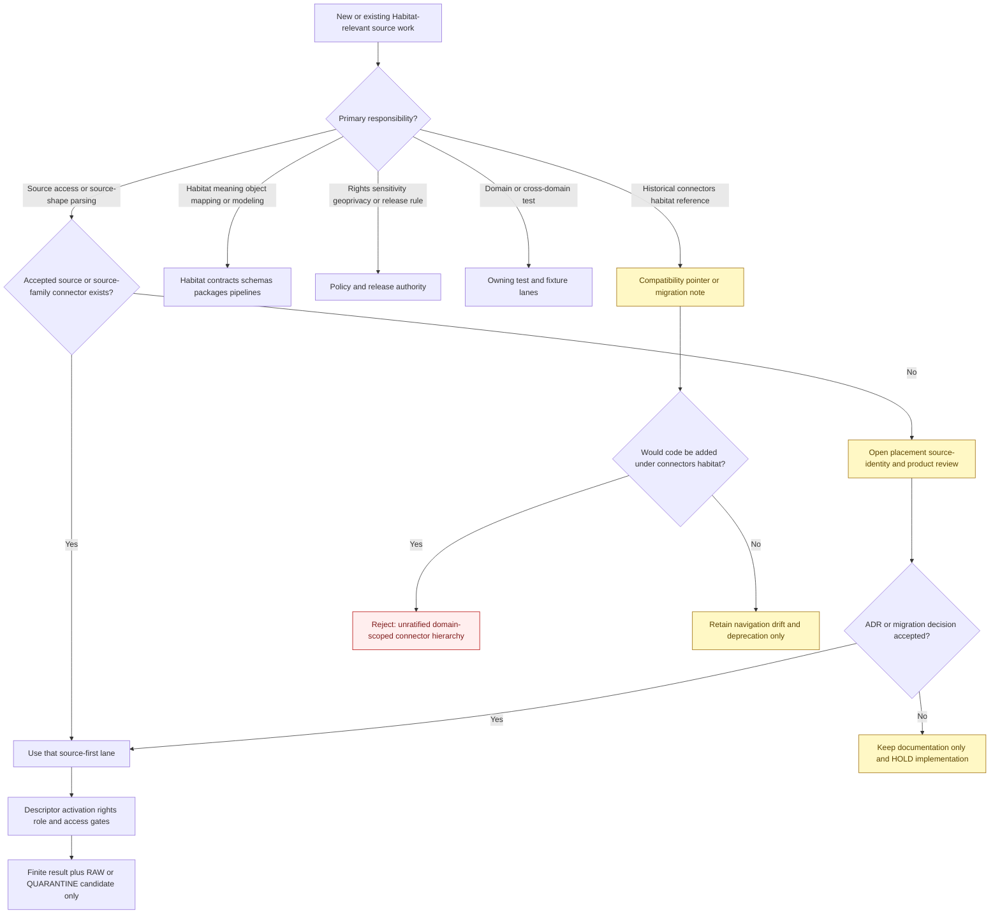
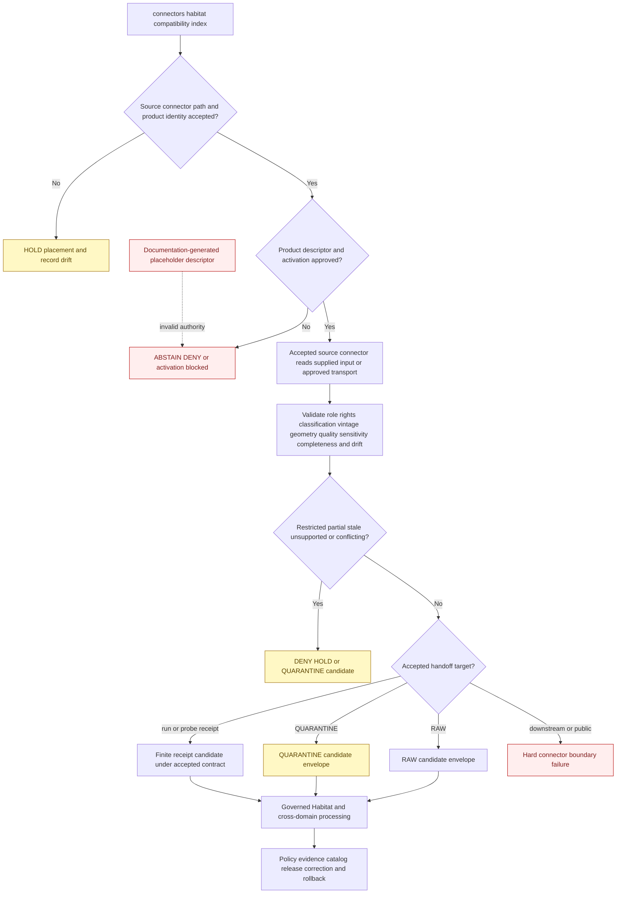

<!-- [KFM_META_BLOCK_V2]
doc_id: kfm://doc/connectors-habitat-readme
title: connectors/habitat/ — Habitat Connector Compatibility Index
type: readme
version: v0.2
status: draft
owners: OWNER_TBD — Connector steward · Source steward · Habitat steward · Flora steward · Fauna steward · Wetlands steward · Land-cover steward · Rights reviewer · Privacy/sensitivity reviewer · Security reviewer · Validation steward · Docs steward
created: 2026-06-18
updated: 2026-07-11
policy_label: public-doctrine; compatibility-index; documentation-only; noncanonical-implementation-path; source-first-connectors; source-role-conflict; native-classification-preservation; rare-species-joins-fail-closed; one-capture-multi-domain; no-code; no-descriptor; no-activation; no-publication
proposed_path: connectors/habitat/README.md
truth_posture: INSPECTED README-only domain-scoped path / source-first connector placement is the current safe posture / exact product homes and machine roles remain mixed or conflicted / Habitat registry YAMLs inspected are generated placeholders rather than accepted SourceDescriptors / no runtime, activation, lifecycle, or publication authority here
related:
  - ../README.md
  - ../nlcd/README.md
  - ../usgs/README.md
  - ../usgs/nlcd/README.md
  - ../usgs/padus/README.md
  - ../usfws/README.md
  - ../usfws/nwi/README.md
  - ../usfws-ecos/README.md
  - ../usfws_ecos/README.md
  - ../lf/README.md
  - ../natureserve/README.md
  - ../natureserve/explorer/README.md
  - ../gbif/README.md
  - ../inaturalist/README.md
  - ../fauna/inaturalist/README.md
  - ../idigbio/README.md
  - ../kdwp/README.md
  - ../kansas/kdwp/README.md
  - ../../docs/domains/habitat/README.md
  - ../../docs/domains/habitat/CANONICAL_PATHS.md
  - ../../docs/domains/habitat/FILE_SYSTEM_PLAN.md
  - ../../docs/domains/habitat/HABITAT_SOURCE_LEDGER.md
  - ../../docs/domains/habitat/SOURCE_REGISTRY.md
  - ../../docs/domains/habitat/SOURCE_FAMILIES.md
  - ../../docs/domains/habitat/MODEL_VS_OBSERVATION.md
  - ../../docs/domains/habitat/DATA_LIFECYCLE.md
  - ../../docs/domains/habitat/SENSITIVITY.md
  - ../../docs/domains/fauna/README.md
  - ../../docs/domains/flora/README.md
  - ../../docs/architecture/ecology-cross-domain.md
  - ../../data/registry/sources/habitat/README.md
  - ../../data/registry/habitat/README.md
  - ../../data/registry/habitat/sources/README.md
  - ../../data/raw/habitat/README.md
  - ../../data/quarantine/habitat/README.md
  - ../../data/processed/habitat/README.md
  - ../../tests/domains/habitat/
  - ../../fixtures/domains/habitat/README.md
  - ../../policy/domains/habitat/
  - ../../policy/sensitivity/
  - ../../policy/rights/
  - ../../release/
tags: [kfm, connectors, habitat, compatibility, source-first, land-cover, wetlands, ecological-systems, critical-habitat, natureserve, occurrence-context, stewardship, ecoregions, geoprivacy, sensitive-joins, raw, quarantine, governance]
notes:
  - "Repository search and direct probes confirm this standalone path has this README and no pyproject.toml, src/README.md, or tests/README.md; no connector package, client, parser, descriptor, activation record, credential configuration, fixture, executable test, payload, cache, lifecycle writer, or CI evidence is proved below connectors/habitat/."
  - "Habitat path doctrine and the live connector tree favor source- or source-family placement such as USGS, USFWS, NatureServe, GBIF, iNaturalist, iDigBio, LANDFIRE, and Kansas-family lanes. The Habitat file-system plan still records domain-scoped versus source-rooted connector layout as unresolved, so this directory remains compatibility-only unless an accepted ADR changes the posture."
  - "The source topology is materially conflicted: NLCD exists in flat and USGS-nested paths; LANDFIRE has a live lf compatibility path while the named landfire replacement was not found; USFWS ECOS and KDWP have multiple path and spelling forms; iNaturalist has source-first and fauna-scoped paths. This index reports the conflicts without selecting a canonical implementation by convenience."
  - "Several Habitat registry YAML files exist, but inspected NLCD, NWI, GAP/LANDFIRE, NatureServe, USFWS ECOS, and critical-habitat files are seven-line PROPOSED placeholders generated from documentation inventories. They are not accepted SourceDescriptors and cannot activate a source, assign rights, establish sensitivity, or authorize RAW admission."
  - "Habitat documentation also conflicts on machine roles: canonical doctrine names observed, regulatory, modeled, aggregate, administrative, candidate, and synthetic, while source ledgers use authority, model, context, and occurrence-context; NLCD and NWI roles vary across docs. Connector code must fail closed until accepted product-level descriptors resolve those conflicts."
  - "Habitat owns landscape interpretation, not species occurrence truth. Exact rare-species, rare-plant, nest, den, roost, hibernaculum, spawning, cultural, private-land, stewardship, or infrastructure-adjacent joins fail closed. Regulatory critical habitat, modeled habitat, land-cover classes, wetland inventory, specimens, occurrences, stewardship overlays, and public maps remain distinct evidence classes."
[/KFM_META_BLOCK_V2] -->

<a id="top"></a>

# Habitat Connector Compatibility Index

> Documentation-only compatibility and navigation surface for Habitat-relevant source connectors. Under the current safe repository posture, source access belongs in one reviewed upstream source or source-family lane beneath `connectors/`; Habitat interpretation belongs downstream in Habitat responsibility lanes. This directory is not a runtime connector family.

<p>
  
  
  
  
  
  
  
</p>

`connectors/habitat/`

> [!IMPORTANT]
> **Inspected state:** repository search surfaced this README as the only file in the standalone Habitat connector path. Direct probes found no `pyproject.toml`, `src/README.md`, or `tests/README.md`. No source client, parser, package, SourceDescriptor, SourceActivationDecision, credential mode, fixture set, executable test suite, source payload, cache, RAW writer, receipt writer, watcher, or passing CI evidence is confirmed beneath `connectors/habitat/`.

> [!CAUTION]
> **Placement rule:** Habitat consumes many source families, but a consumer domain does not automatically become a connector hierarchy. Existing Habitat-relevant connector work is organized in source or source-family lanes elsewhere under `connectors/`, and the Habitat file-system plan leaves domain-scoped versus source-rooted connector layout unresolved. Do not add runtime behavior or new source children here without an accepted ADR and migration plan.

> [!CAUTION]
> **Registry placeholders are not admission authority.** The inspected Habitat YAML files under `data/registry/sources/habitat/` contain `status: PROPOSED` and a note that they were generated from documentation inventory. They do not supply an accepted role, rights decision, sensitivity classification, cadence, access contract, or activation decision.

**Quick jumps:** [Purpose](#purpose) · [Placement decision](#placement-decision) · [Verified repository state](#verified-repository-state) · [Evidence ledger](#evidence-ledger) · [Compatibility responsibilities](#compatibility-responsibilities) · [Forbidden responsibilities](#forbidden-responsibilities) · [Source-first connector navigation](#source-first-connector-navigation) · [Unresolved connector-path and registry drift](#unresolved-connector-path-and-registry-drift) · [Habitat source semantics](#habitat-source-semantics) · [Source-role boundary](#source-role-boundary) · [Anti-collapse matrix](#anti-collapse-matrix) · [Native classifications and crosswalks](#native-classifications-and-crosswalks) · [Rights terms and attribution](#rights-terms-and-attribution) · [Sensitivity geoprivacy and join-induced risk](#sensitivity-geoprivacy-and-join-induced-risk) · [Geometry scale quality and uncertainty](#geometry-scale-quality-and-uncertainty) · [Temporal freshness and completeness](#temporal-freshness-and-completeness) · [Registry and activation boundary](#registry-and-activation-boundary) · [Access transport and secret boundary](#access-transport-and-secret-boundary) · [Metadata preservation](#metadata-preservation) · [Cross-domain routing and one-capture rule](#cross-domain-routing-and-one-capture-rule) · [Repository responsibility map](#repository-responsibility-map) · [Testing relationship](#testing-relationship) · [Placement decision flow](#placement-decision-flow) · [Admission and lifecycle boundary](#admission-and-lifecycle-boundary) · [Finite compatibility outcomes](#finite-compatibility-outcomes) · [Child-path policy](#child-path-policy) · [Migration and deprecation](#migration-and-deprecation) · [Review and rollback](#review-and-rollback) · [Definition of done](#definition-of-done) · [Verification backlog](#verification-backlog)

---

## Purpose

This README prevents `connectors/habitat/` from hardening into a second connector hierarchy organized by the domain that consumes data rather than the source that supplies it.

It may:

- explain the current source-first connector posture;
- redirect historical, generated, or proposed Habitat-scoped connector references to reviewed source or source-family lanes;
- index NLCD, NWI, GAP/LANDFIRE, USFWS ECOS, NatureServe, GBIF, iNaturalist, iDigBio, PAD-US, KDWP, ecoregion, remote-sensing, and field-survey connector documentation;
- expose unresolved path, source-ID, product, registry, source-role, rights, classification, and lifecycle conflicts;
- preserve model-versus-observation, regulatory-versus-modeled, native-classification, geometry, vintage, uncertainty, rights, and sensitivity warnings;
- identify the Habitat, Fauna, Flora, Soil, Hydrology, Hazards, Agriculture, Spatial Foundation, evidence, policy, catalog, and release lanes that take over after source admission;
- prevent duplicate source capture when one source supports multiple domains;
- document migration, deprecation, correction, rollback, backlink, and generated-template work;
- prevent connector output from being mistaken for habitat truth, species presence, legal wetland status, restoration success, management advice, evidence closure, or public release.

It does **not**:

- host source clients, parsers, package code, product dispatch, credentials, fixtures, tests, descriptors, or activation state;
- choose canonical connector paths or source IDs when repository evidence is conflicted;
- assign source roles, rights, sensitivity, cadence, freshness, quality thresholds, or release classes;
- fetch or store land-cover, wetland, vegetation, critical-habitat, occurrence, specimen, stewardship, ecoregion, survey, or model material;
- define canonical HabitatPatch, EcologicalSystem, SuitabilityModel, Corridor, RestorationOpportunity, or StewardshipZone truth;
- perform cross-source joins, class crosswalks, model fitting, geometry transforms, public redaction, evidence closure, release, correction, or publication.

[Back to top ↑](#top)

---

## Placement decision

Current doctrine and repository evidence support one safe parent-directory decision even though several source-specific connector paths remain unresolved.

| Question | Current safe decision | Evidence posture |
|---|---|---:|
| Is `connectors/habitat/` a canonical runtime connector-family root? | **No under the current posture.** Treat it as a documentation-only compatibility and navigation index. | Repository search found a README-only path; live Habitat-relevant work is source-oriented. |
| May source implementations be added under `connectors/habitat/<source>/`? | **No, absent an accepted ADR.** | A domain-scoped implementation would duplicate source identity, credentials, activation, fixtures, tests, corrections, and rollback across consumers. |
| Where should Habitat-relevant source access live? | In one reviewed source or source-family lane under `connectors/`. | Examples include USGS, USFWS, NatureServe, GBIF, iNaturalist, iDigBio, LANDFIRE, and Kansas-family lanes. |
| Where should Habitat-specific interpretation live? | In Habitat contracts, schemas, packages, pipelines, policies, tests, fixtures, lifecycle, evidence, catalog, and release lanes after admission. | Source access and domain interpretation are separate responsibilities. |
| May Fauna, Flora, and Habitat fetch the same biodiversity source independently? | **No by convenience.** Capture once under the accepted source identity and route lineage-preserving candidates. | Duplicate capture fragments rights, geoprivacy, checksums, corrections, and rollback. |
| Do current source connector READMEs prove activation or production readiness? | **No.** | Most are draft, compatibility, or documentation-first lanes whose implementation maturity is separately governed. |
| Can this parent-directory decision change? | Yes, only through an accepted ADR or migration decision. | A change must cover ownership, code, descriptors, credentials, tests, fixtures, source IDs, data lineage, backlinks, correction, and rollback. |

> [!CAUTION]
> A generated skeleton, a topic-heavy source, a RAW child lane, a placeholder descriptor, a detailed source page, or a directory that looks package-shaped does not establish connector authority. Directory presence is evidence of presence, not admission or canonicality.

[Back to top ↑](#top)

---

## Verified repository state

The following relationship is confirmed or directly evidenced on the repository's default branch at the time of this update:

```text
connectors/
├── habitat/
│   └── README.md                         # this compatibility index
├── nlcd/
│   └── README.md                         # flat NLCD path candidate
├── usgs/
│   ├── README.md                         # USGS family coordination
│   ├── nlcd/README.md                    # nested NLCD path candidate
│   └── padus/README.md                   # PAD-US product lane candidate
├── usfws/
│   ├── README.md                         # USFWS coordination lane
│   └── nwi/README.md                     # NWI nested lane candidate
├── usfws-ecos/README.md                  # ECOS path candidate
├── usfws_ecos/README.md                  # alternate ECOS spelling/path
├── lf/README.md                          # LANDFIRE short-code compatibility path
├── natureserve/
│   ├── README.md                         # NatureServe family lane
│   └── explorer/README.md                # service-specific lane
├── gbif/README.md                        # shared biodiversity source lane
├── inaturalist/README.md                 # source-first observation lane
├── fauna/inaturalist/README.md           # noncanonical domain-scoped pointer
├── idigbio/
│   ├── README.md
│   └── specimens/README.md
├── kdwp/README.md                        # top-level Kansas source candidate
└── kansas/kdwp/README.md                 # Kansas-family candidate
```

The listing is an evidence-backed navigation sample, not a complete connector inventory. It does not prove that any listed connector is activated, rights-cleared, endpoint-current, test-covered, or release-ready.

Relevant Habitat lifecycle and governance documentation also exists:

```text
data/registry/sources/habitat/
├── README.md
├── ecoregions/README.md
├── nlcd.yaml                             # inspected PROPOSED inventory placeholder
├── nwi.yaml                              # inspected PROPOSED inventory placeholder
├── gap_landfire.yaml                     # inspected PROPOSED inventory placeholder
├── natureserve.yaml                      # inspected PROPOSED inventory placeholder
├── usfws_ecos.yaml                       # inspected PROPOSED inventory placeholder
└── usfws-critical-habitat.source.yaml    # second inspected critical-habitat placeholder

data/raw/habitat/
├── README.md
├── ecoregions/README.md
├── gap-landfire/README.md
├── kdwp/README.md
├── natureserve/README.md
├── nlcd/README.md
├── nwi/README.md
├── occurrence-context/README.md
├── pad-us/README.md
└── usfws-ecos/README.md
```

The registry and RAW trees above document intended boundaries. They do not prove accepted descriptors, activation decisions, source payloads, connector execution, receipts, validation, or release.

### Current maturity

| Surface | Confirmed content | Maturity |
|---|---|---:|
| `connectors/habitat/README.md` | This compatibility and navigation contract. | **DOCUMENTED / NON-OPERATIONAL** |
| Other files below `connectors/habitat/` | No `pyproject.toml`, source-root README, or test-root README found; no other file surfaced in repository search. | **ABSENT / NEEDS CONTINUOUS VERIFICATION** |
| Connector code, fixtures, tests, credentials, or activation below this path | None confirmed. | **ABSENT / FORBIDDEN UNDER CURRENT POSTURE** |
| Habitat-relevant source connector lanes | Multiple source and source-family paths are documented. | **MIXED DRAFT / COMPATIBILITY / PATH-CONFLICTED** |
| `data/registry/sources/habitat/README.md` | Registry boundary and topology warnings. | **DOCUMENTED / TOPOLOGY CONFLICTED** |
| Inspected Habitat registry YAMLs | Seven-line `status: PROPOSED` inventory placeholders. | **PLACEHOLDER / NOT SOURCE AUTHORITY** |
| Habitat RAW child lanes | Nine source-family README lanes. | **DOCUMENTED / PAYLOADS AND ACTIVATION UNKNOWN** |
| Habitat contracts, schemas, policies, pipelines, fixtures, and tests | Multiple files and READMEs exist elsewhere in the repository. | **DOWNSTREAM GOVERNANCE EXISTS / ENFORCEMENT MIXED OR UNVERIFIED** |
| Source activation owned by this directory | None. | **FORBIDDEN** |
| Publication authority owned by this directory | None. | **FORBIDDEN** |

[Back to top ↑](#top)

---

## Evidence ledger

| Evidence | Status | What it supports | What it does not support |
|---|---:|---|---|
| `connectors/habitat/README.md`, repository search, and direct common-path probes | **CONFIRMED for inspected state** | The standalone Habitat connector path is documentation-only in the inspected branch. | Permanent absence of future files or an immutable path decision. |
| `docs/domains/habitat/CANONICAL_PATHS.md` | **CONFIRMED doctrine-derived path register** | Habitat is a domain segment; connectors are shown as upstream source lanes such as USGS, NRCS, GBIF, and Kansas sources; connector output stops before downstream promotion. | Activation or maturity of any connector. |
| `docs/domains/habitat/FILE_SYSTEM_PLAN.md` | **CONFIRMED unresolved placement record** | `connectors/habitat/` versus `connectors/<source>/` is explicitly unresolved. | Permission to build both layouts in parallel. |
| `connectors/nlcd/` and `connectors/usgs/nlcd/` | **CONFIRMED path conflict** | Two NLCD connector documentation candidates exist. | A canonical NLCD package, accepted role, or active source. |
| `connectors/usfws/nwi/` | **CONFIRMED draft source/product lane** | NWI geometry and classification boundaries are documented. | Legal wetland or jurisdictional authority, active access, or tests. |
| `connectors/lf/` and missing `connectors/landfire/` fetch | **CONFIRMED compatibility drift** | The live short-code path points toward a full-name candidate not found in the inspected branch. | A ratified LANDFIRE implementation home. |
| NatureServe, GBIF, iNaturalist, iDigBio, USFWS ECOS, PAD-US, and KDWP connector READMEs | **CONFIRMED source/source-family documentation** | Habitat-relevant source access is represented outside `connectors/habitat/`. | Rights clearance, activation, endpoint health, or production readiness. |
| `data/registry/sources/habitat/README.md` | **CONFIRMED registry doctrine** | Source admission is deny-by-default; source-role, rights, sensitivity, and activation must be explicit; registry topology is unresolved. | That current YAMLs satisfy the SourceDescriptor contract. |
| Inspected `nlcd.yaml`, `nwi.yaml`, `gap_landfire.yaml`, `natureserve.yaml`, `usfws_ecos.yaml`, and `usfws-critical-habitat.source.yaml` | **CONFIRMED placeholders** | Inventory files were generated from documentation plans. | Accepted identity, role, rights, sensitivity, cadence, access, or activation. |
| `data/raw/habitat/README.md` and source-family children | **CONFIRMED lifecycle documentation** | RAW source-family boundaries and anti-collapse expectations are documented. | Source payloads, admission, checksums, receipts, or successful ingest. |
| Habitat source ledger and domain README | **CONFIRMED doctrinal conflict** | Habitat source families and intended semantics are documented, including role and sensitivity concerns. | A conflict-free machine-role assignment: `authority`, `model`, `context`, and `occurrence-context` still appear beside the seven-role enum. |
| Habitat contracts, policies, processed lanes, and validators | **CONFIRMED downstream surfaces** | Habitat interpretation, policy, and lifecycle responsibilities have homes outside connectors. | That connectors may perform those downstream responsibilities. |

[Back to top ↑](#top)

---

## Compatibility responsibilities

This path may contain only responsibilities that prevent ambiguity and unsafe implementation drift:

- a concise redirect to the source/product path selected by accepted governance;
- path, source-ID, product-key, distribution-name, import-name, registry-slug, RAW-slug, and role-conflict documentation;
- migration inventories, backlink maps, tombstone plans, and deprecation notes;
- source-role anti-collapse warnings shared across Habitat-relevant sources;
- native classification, version, scale, geometry, uncertainty, rights, and sensitivity warnings;
- rare-species, rare-plant, cultural, private-land, stewardship, infrastructure, and harmful-join warnings;
- one-source-capture/multi-domain routing guidance;
- pointers to Habitat contracts, schemas, packages, pipelines, policies, tests, fixtures, lifecycle stores, evidence, catalog, and release lanes;
- correction of documentation or generated templates that treat connector output as Habitat truth or public release.

Every compatibility statement must distinguish:

```text
CONFIRMED repository evidence
PROPOSED placement or product design
CONFLICTED path, role, registry, or lifecycle posture
NEEDS VERIFICATION implementation or governance state
```

[Back to top ↑](#top)

---

## Forbidden responsibilities

Do not place or implement the following beneath `connectors/habitat/`:

| Forbidden content or behavior | Correct responsibility or handling |
|---|---|
| Source clients, fetchers, scrapers, API adapters, object-store readers, archive downloaders, database readers, or watchers | One accepted source or source-family connector lane. |
| Python, JavaScript, shell, SQL, notebook, package, build, deployment, or runtime configuration | The reviewed source connector's implementation package. |
| SourceDescriptors or SourceActivationDecisions | Accepted source registry and activation workflow. |
| Endpoint, account, token, cookie, key, session, browser, cloud-profile, or credential configuration | External security and credential-management systems plus the accepted source connector. |
| Connector-local fixtures or executable tests | The accepted source connector's test lane; Habitat interpretation tests remain under Habitat responsibility roots. |
| Land-cover, wetland, vegetation, critical-habitat, occurrence, specimen, stewardship, survey, ecoregion, raster, vector, table, archive, or service payloads | Governed RAW, QUARANTINE, restricted runtime, or approved fixture storage. |
| Caches, extracted archives, retry queues, temporary downloads, database mirrors, or model workspaces | Explicit restricted runtime storage with retention and cleanup controls. |
| HabitatPatch, EcologicalSystem, SuitabilityModel, ConnectivityEdge, Corridor, RestorationOpportunity, or StewardshipZone objects | Habitat contracts, schemas, packages, pipelines, and review. |
| Class crosswalks, habitat associations, suitability fitting, connectivity analysis, restoration prioritization, or source conflation | Downstream Habitat or cross-domain pipelines with confidence, receipts, and lineage. |
| Rights, sensitivity, geoprivacy, quality-threshold, source-role, attribution, management, or release rules | `policy/`, source registry, domain governance, and release authority. |
| RAW, WORK, QUARANTINE, PROCESSED, CATALOG, TRIPLET, PROOF, RECEIPT, RELEASE, PUBLISHED, API, map, report, graph, search, embedding, or generated-answer writers | Owning lifecycle, evidence, release, and application surfaces. |
| Public land-management, restoration, legal-wetland, critical-habitat, species-presence, access, conservation-priority, hazard, or safety guidance | Governed specialist and public-product processes after evidence and release gates. |

A compatibility directory is not a shortcut around unresolved source placement, rights, roles, or sensitivity.

[Back to top ↑](#top)

---

## Source-first connector navigation

The table below is a navigation and conflict index. Presence of a README does not prove implementation, activation, rights clearance, current endpoint support, test coverage, or release readiness.

| Source or product family | Current connector documentation | Source meaning and primary caution | Placement posture |
|---|---|---|---|
| NLCD / MRLC land cover | `../nlcd/`, `../usgs/nlcd/` | Versioned classifier-assigned land-cover and related rasters; native class maps, epochs, nodata, confidence, and sub-products must remain distinct. | **CRITICAL PATH AND ROLE CONFLICT / ADR REQUIRED** |
| USFWS NWI wetlands | `../usfws/nwi/` | Wetland inventory geometry and classifications; not a jurisdictional determination, parcel truth, floodplain truth, or complete hydrologic truth. | **DRAFT NESTED LANE / PRODUCT DOCTRINE INCOMPLETE** |
| GAP / LANDFIRE | `../lf/`; full-name `../landfire/` candidate not found in current fetch | Vegetation, ecological-system, fuel, disturbance, and related products with mixed modeled/aggregate/observed semantics. | **SHORT-CODE COMPATIBILITY / REPLACEMENT PATH ABSENT / ADR REQUIRED** |
| USFWS ECOS / critical habitat | `../usfws-ecos/`, `../usfws_ecos/`, USFWS nested product paths | Regulatory designation and related administrative/context products; not modeled suitability, species occurrence, or public legal advice. | **MULTIPLE PATH FORMS / PRODUCT-SPECIFIC DESCRIPTORS REQUIRED** |
| NatureServe | `../natureserve/`, `../natureserve/explorer/` | Ecological-system, conservation-status, provider, and controlled biodiversity products; public classes and sensitive heritage records must remain separate. | **SOURCE-FAMILY LANE / PLACEMENT AND RIGHTS NEED REVIEW** |
| GBIF | `../gbif/` | Occurrence, specimen, metadata, taxonomy, aggregate, and modeled surfaces; occurrence evidence is foreign-owned context for Habitat. | **SHARED SOURCE-FIRST LANE / PRODUCT ROLES REQUIRED** |
| iNaturalist | `../inaturalist/`, `../fauna/inaturalist/` | Community observations, obscured coordinates, annotations, taxa, and quality grades; not habitat truth or complete survey evidence. | **SOURCE-FIRST LANE PLUS NONCANONICAL DOMAIN POINTER** |
| iDigBio | `../idigbio/`, `../idigbio/specimens/` | Specimen and media records, portal downloads, and summary counts; historical specimen evidence is not current presence or habitat suitability. | **SOURCE-FIRST FAMILY / PRODUCT SEPARATION REQUIRED** |
| PAD-US | `../usgs/padus/` | Administrative stewardship/protected-area inventory context; not habitat condition, ownership, access permission, cadastral truth, or legal management advice. | **DRAFT PRODUCT LANE / SOURCE-FAMILY ATTRIBUTION NEEDS REVIEW** |
| KDWP | `../kdwp/`, `../kansas/kdwp/`, `../kdwp_ert/`, Kansas-family variants | State regulatory, administrative, survey, review, and sensitive-location products may differ materially. | **CRITICAL PATH AND PRODUCT DECOMPOSITION CONFLICT** |
| Ecoregions and context fabric | No single accepted connector home confirmed in this update | EPA ecoregions, WBD/HUC, PLSS, and other context products may support stratification but do not become HabitatPatch truth. | **PLACEMENT AND SOURCE OWNERSHIP OPEN** |
| Field surveys and steward datasets | Source-specific lane required | Direct observations, local datasets, and reviewed models need explicit publisher, role, rights, precision, and stewardship. | **NO UMBRELLA HABITAT CONNECTOR** |

> [!IMPORTANT]
> Source-first does not mean that every current top-level path is canonical. It means the accepted implementation must be organized around the upstream source or source family, not duplicated beneath `connectors/habitat/` because Habitat is a consumer.

[Back to top ↑](#top)

---

## Unresolved connector-path and registry drift

The current repository contains incompatible connector, identity, registry, and lifecycle patterns. This index records them; it does not normalize them by renaming files or blessing the most complete-looking scaffold.

| Drift area | Confirmed conflict | Required posture |
|---|---|---|
| Domain-scoped Habitat root | `connectors/habitat/` exists while live source access is represented in source/source-family lanes. | Keep this directory inert; no new source children without ADR. |
| NLCD placement | Flat `connectors/nlcd/` and nested `connectors/usgs/nlcd/` both exist; documentation also discusses MRLC ownership. | Select one product/source home and migration map; no parallel activation. |
| NLCD role | Habitat docs describe observed remote sensing that may feed models; NLCD connector docs call the classified product uniformly modeled. | Require product-level accepted descriptors; do not infer from prose. |
| NWI role | Habitat docs use regulatory/observed or authority labels; the NWI connector explicitly denies jurisdictional authority. | Separate inventory, administrative, observational, and legal/regulatory meanings; no umbrella role. |
| LANDFIRE identity | Live `connectors/lf/` is compatibility-only; `connectors/landfire/` is named as a candidate but was not found. | Freeze `lf`; accept an ADR before creating or activating a replacement. |
| USFWS ECOS placement | Hyphenated, underscored, family-nested, and product-specific ECOS paths coexist. | Select one source family/product architecture; preserve old aliases explicitly. |
| iNaturalist placement | Source-first `connectors/inaturalist/` coexists with `connectors/fauna/inaturalist/`. | Keep the fauna child pointer-only; no second implementation. |
| KDWP placement | Top-level, Kansas-family, ERT, and Flora-oriented KDWP paths coexist. | Decompose products and choose source/product homes through migration governance. |
| Source-role vocabulary | Canonical seven-role vocabulary coexists with `authority`, `model`, `context`, and `occurrence-context`. | Treat noncanonical terms as descriptive until accepted mapping or rejection. |
| Habitat registry topology | `data/registry/sources/habitat/`, `data/registry/habitat/`, and `data/registry/habitat/sources/` coexist. | Maintain one authoritative descriptor record; other paths become pointers or are migrated. |
| Placeholder descriptor naming | `usfws_ecos.yaml` and `usfws-critical-habitat.source.yaml` both exist as documentation-generated placeholders. | Do not infer one source or one role; ratify product identity and remove divergent placeholders. |
| RAW/source slugs | Examples use `gap-landfire`, `pad-us`, `usfws-ecos`, `occurrence-context`, provider names, and domain-scoped routing. | Source-ID migration must preserve checksums, receipts, corrections, aliases, and lineage. |
| Schema/contract paths | Habitat docs record segmented versus flat schema and contract paths. | Do not let connector code choose schema authority by adjacency. |

Code growth is not a governance decision. Freeze losing paths before moving implementation, descriptors, credentials, fixtures, or data.

[Back to top ↑](#top)

---

## Habitat source semantics

Habitat-relevant sources represent different evidence classes. A shared consumer domain does not make those classes interchangeable.

| Source material | Source meaning | Appropriate downstream use | Must not become |
|---|---|---|---|
| Land-cover classification raster | Versioned source classification derived from sensor inputs and algorithms, with native classes, epoch, resolution, confidence, and nodata. | Land-cover context, patch derivation input, change analysis under explicit method and receipts. | Direct field observation, ecological-system truth, legal land use, or habitat suitability by class label alone. |
| Wetland inventory polygon | Source-attributed inventory geometry and classification at a stated vintage and scale. | Wetland/riparian context and downstream crosswalk candidate. | Jurisdictional wetland determination, hydrologic function, parcel boundary, water right, or legal advice. |
| GAP/LANDFIRE ecological-system or vegetation product | Product-specific modeled, aggregate, or source-classification evidence. | Ecological-system context, vegetation/fuels input, modeled habitat analysis. | Direct observation, regulatory designation, species presence, or timeless vegetation truth. |
| USFWS critical-habitat designation | Regulatory designation evidence from the issuing authority with species, unit, effective, revision, and legal-scope context. | Regulatory overlay candidate and evidence for designated units. | Modeled suitability, actual occupancy, occurrence point, legal interpretation, or universal habitat quality. |
| NatureServe ecological-system class | Source-attributed classification or conservation context with provider and methodology. | Ecological-system mapping, crosswalk, status context, steward review. | Species occurrence, unrestricted heritage record, or sole habitat authority. |
| Biodiversity occurrence record | Source-attributed observation/specimen evidence owned by Fauna or Flora, often with geoprivacy and rights constraints. | Downstream habitat association or model input after policy and precision review. | HabitatPatch, complete survey, absence, critical habitat, or public exact-location claim. |
| Specimen record | Historical physical-evidence record with collection time, institution, locality, identification, and uncertainty. | Historical occurrence context and model input under provenance. | Current presence, current habitat condition, complete range, or land-management instruction. |
| PAD-US or stewardship inventory | Administrative stewardship, protected-area, manager, designation, or access-context record by vintage. | StewardshipZone context and downstream overlay. | Habitat condition, ownership, cadastral boundary, public access permission, or ecological protection effectiveness. |
| Ecoregion, watershed, PLSS, or context fabric | Administrative, aggregate, or framework geography owned by its source/domain. | Stratification, indexing, filtering, sampling, and cross-domain context. | Habitat patch, ecological condition, survey completeness, or source-role shortcut. |
| Remote-sensing vegetation index | Sensor-derived or modeled signal with product, algorithm, time window, cloud/quality, resolution, and uncertainty. | Vegetation condition/change context and model input. | Species occurrence, habitat quality, restoration success, or direct field measurement without accepted role. |
| Field survey | Direct survey evidence with method, effort, observer/steward, precision, time, rights, and detection limits. | Observed habitat condition or validation input within stated scope. | Complete absence, statewide truth, public exact sensitive location, or model authority beyond survey scope. |
| Suitability, connectivity, corridor, or restoration model | Downstream model output with inputs, algorithm, run, parameters, validation, uncertainty, and intended use. | Habitat analysis and release candidates under model governance. | Observation, regulatory designation, required management action, engineering advice, or guaranteed restoration outcome. |

[Back to top ↑](#top)

---

## Source-role boundary

New machine records must use only the accepted repository source-role vocabulary:

```text
observed | regulatory | modeled | aggregate | administrative | candidate | synthetic
```

Habitat documentation also contains descriptive or legacy labels such as:

```text
authority | model | context | occurrence-context | observation
```

Those terms must not be copied into machine records or mapped silently. Until accepted descriptors or an ADR resolve them:

- do not treat `authority` as automatically `regulatory`;
- do not treat `context` as automatically `administrative` or `aggregate`;
- do not treat `occurrence-context` as a new source-role enum;
- do not convert `model` to `modeled` without product identity and review;
- do not flatten NLCD, NWI, LANDFIRE, NatureServe, KDWP, or remote-sensing products to a family-wide role;
- do not assign role from provider, URL, filename, raster appearance, layer title, or consumer domain;
- require an accepted product-level SourceDescriptor and SourceActivationDecision;
- preserve the assigned role through parsing and promotion;
- require descriptor revision and correction evidence for any role change.

Knowledge characters, domain object types, regulatory authority, and source role are separate dimensions. A `REMOTE_SENSING_MASK`, `HabitatPatch`, `CriticalHabitatUnit`, or `StewardshipZone` label does not replace the source-role field.

[Back to top ↑](#top)

---

## Anti-collapse matrix

| Forbidden collapse | Required posture |
|---|---|
| NLCD class → observed field condition | Preserve algorithm, class map, epoch, confidence, and role conflict until descriptor resolution. |
| NWI polygon → legal or jurisdictional wetland | Preserve inventory scope, class system, vintage, scale, and non-jurisdictional caveat. |
| Critical-habitat designation → modeled suitability or species occurrence | Preserve regulatory scope and issuing authority; occupancy and suitability require separate evidence. |
| Modeled habitat → regulatory critical habitat | Keep models, designations, and occurrences in separate objects and layers. |
| Occurrence point → HabitatPatch or complete habitat | Treat occurrence as foreign-owned evidence; habitat association is downstream and confidence-bearing. |
| Specimen record → current presence | Preserve collection time, institution, identification, locality uncertainty, and historical scope. |
| PAD-US boundary → habitat condition, ownership, or access | Preserve administrative stewardship meaning and vintage. |
| Ecoregion or watershed → habitat patch | Preserve framework/context meaning; patch derivation requires separate method and evidence. |
| Native class crosswalk → source classification replacement | Preserve every native label and version; crosswalk is advisory and reversible. |
| Raster pixel → parcel/site truth | Preserve resolution, scale, footprint, accuracy, transform history, and intended use. |
| Suitability score → observed occupancy | Preserve model identity, run, training/validation evidence, uncertainty, and threshold policy. |
| Connectivity corridor → legal access or required route | Preserve modeled/ecological meaning; no property, access, or management conclusion. |
| Restoration opportunity → instruction or guaranteed success | Preserve candidate/model status, assumptions, uncertainty, stewardship, and reviewer scope. |
| Missing record or empty query → habitat or species absence | Abstain unless an accepted completeness, survey-effort, or non-detection contract supports the claim. |
| Public source availability → public-safe joined product | Continue through rights, sensitivity, evidence, redaction/generalization, and release gates. |
| Lifecycle promotion → source-role upgrade | Source role remains fixed; promotion cannot change evidence meaning. |
| Connector candidate → released Habitat claim | Connector output is not processed truth, evidence closure, release, or publication. |

> [!IMPORTANT]
> A class is not a field survey. An inventory polygon is not a legal determination. A designation is not occupancy. An occurrence is not habitat. A model is not observation. A stewardship boundary is not habitat condition. A candidate is not a released claim.

[Back to top ↑](#top)

---

## Native classifications and crosswalks

Habitat sources carry classification systems that are part of source identity and evidence. Preserve them before any downstream mapping:

- NLCD product, epoch, class code, class label, class-map version, confidence, impervious/canopy semantics, change-product lineage, and nodata;
- NWI/Cowardin system, class code, modifier, source vintage, scale, geometry source, and mapping caveats;
- GAP and LANDFIRE product family, ecological-system or vegetation class, source hierarchy, model/version, raster/vector form, and native confidence;
- NatureServe ecological-system, conservation-rank, provider, methodology, record sensitivity, and controlled/public split;
- USFWS designation, unit, species/taxon reference, effective/supersession state, legal citation, geometry vintage, and source scope;
- PAD-US designation type, manager, owner type where permitted, GAP status, access caveat, and inventory version;
- KDWP source vocabulary, regulatory/administrative/survey product identity, state review state, and sensitivity;
- ecoregion, HUC/WBD, PLSS, local, survey, and stewardship vocabularies with their own authorities and versions.

Crosswalks must:

1. preserve both source and target values;
2. name source and target vocabulary versions;
3. record method, actor, time, confidence, known loss, unsupported values, and review state;
4. remain reversible;
5. emit a TransformReceipt, MappingReceipt, or accepted equivalent when consequential;
6. create a new downstream artifact rather than mutating the RAW source;
7. never imply that classification equivalence is ecological, legal, spatial, or temporal equivalence;
8. invalidate dependent derivatives when a source vocabulary or mapping changes.

[Back to top ↑](#top)

---

## Rights, terms, and attribution

Rights and use constraints must be evaluated at the actual source, product, dataset, service, layer, table, archive, file, institution, provider, or record granularity.

Required context to preserve where supplied and applicable:

- publisher, provider, institution, program, joint publisher, and source family;
- exact product, dataset, service, layer, table, archive, file, release, or distribution identity;
- source URI and access surface;
- raw license, terms, disclaimer, citation, and use-constraint text;
- normalized rights interpretation from an external authority;
- rights holder and attribution requirements;
- redistribution, derivative, commercial-use, automation, access, embargo, account, or sharing restrictions;
- record-level or provider-level restrictions where they differ;
- terms snapshot or review reference;
- retrieval time, product version, and correction state;
- permitted fixture, test, cache, model-training, redistribution, and public-display uses.

| Rights condition | Required handling |
|---|---|
| Current product terms and attribution complete | Preserve them; continue only when descriptor and external rights decision permit. |
| Different products or providers carry different rights | Keep rights attached at their actual granularity; no family-wide license assumption. |
| Controlled NatureServe, heritage, local survey, or steward data | Restrict, deny, hold, or quarantine according to the accepted access and sensitivity decision. |
| Terms absent, stale, conflicting, or unparseable | `DENY`, `ABSTAIN`, `HOLD`, or QUARANTINE candidate. |
| Publicly downloadable source used as release approval | Hard authority failure. |
| Joined product adds new source obligations | Re-evaluate rights, attribution, retention, and release at the joined-product level. |
| Rights change after capture | Preserve prior state and emit drift/correction evidence; never rewrite history silently. |

A connector may parse and carry rights metadata. Legal conclusions, redistribution approval, disclaimer sufficiency, and public release remain external decisions.

[Back to top ↑](#top)

---

## Sensitivity, geoprivacy, and join-induced risk

A low-risk source can become sensitive or harmful when combined with other data. This directory neither performs nor authorizes those joins.

### Fail-closed classes

- rare, threatened, endangered, protected, or culturally sensitive species and plant locations;
- nests, dens, roosts, hibernacula, spawning sites, breeding sites, refugia, caves, colonies, and seasonal concentration areas;
- Natural Heritage, NatureServe, KDWP, Tribal, local, or steward-controlled records;
- exact critical-habitat or habitat-association joins that expose underlying occurrences beyond approved precision;
- private land, landowner, address, access-road, gate, trail, easement, parcel, or stewardship joins;
- archaeology, burial, sacred-place, cultural-landscape, Indigenous-knowledge, or culturally governed context;
- critical infrastructure, water-supply, utility, facility, operational, or vulnerability joins;
- restoration, acquisition, conservation-priority, enforcement, inspection, or management candidates whose disclosure creates targeting or speculation risk;
- living-person, household, worker, researcher, collector, observer, or contact joins;
- map, search, graph, embedding, download, or generated-answer products that make ordinary records newly actionable.

### Required posture

1. Preserve source obscuration, generalization, withheld fields, uncertainty, and sensitivity flags.
2. Never reconstruct exact coordinates from obscured records, metadata, neighboring records, identifiers, or joins.
3. Evaluate the joined product, not only each input source.
4. Recalculate sensitivity, rights, precision, aggregation, and release class after every material join.
5. Preserve every source role, authority, timestamp, version, disagreement, and transformation.
6. Keep cross-source joins downstream under explicit contracts and review.
7. Route unresolved joins to denial, abstention, hold, or quarantine.
8. Keep public redaction, generalization, suppression, delayed release, label selection, and release outside connector authority.
9. Require RedactionReceipt, TransformReceipt, review evidence, correction path, and rollback support for released generalized derivatives where applicable.
10. Never rely on map styling, hidden layers, opacity, client filters, zoom levels, hashing, rounding, search ranking, or omitted labels as the only sensitivity control.
11. Treat absence of a sensitivity flag as unknown unless policy confirms evaluation.
12. Do not infer property, ownership, access, management intent, species presence, community identity, or cultural significance from adjacency alone.

[Back to top ↑](#top)

---

## Geometry, scale, quality, and uncertainty

Habitat source geometry must remain source-attributed and inspectable.

Preserve where supplied and applicable:

- source geometry type, extent, footprint, topology, coordinate order, CRS, datum, units, scale, nominal resolution, minimum mapping unit, and accuracy;
- raster shape, transform, grid, pixel alignment, nodata, masks, overviews, resampling state, class support, and valid-pixel footprint;
- vector geometry validity, multipart state, slivers, gaps, overlaps, topology warnings, simplification, and source precision;
- source versus derived geometry state;
- point, representative point, line, polygon, raster, service tile, and aggregate geometry meaning;
- geometry source, method, model, survey, digitization, or compilation process;
- uncertainty surface, confidence, quality flags, survey effort, detection limits, and known omissions;
- original and transformed geometry digests under accepted contracts;
- disagreement flags when NLCD, NWI, LANDFIRE, NatureServe, PAD-US, local GIS, hydrology, soil, or survey geometries differ.

Required posture:

- never turn a raster class into parcel-level or site-level truth;
- never use NWI as a parcel, hydrologic, legal, or jurisdictional boundary;
- never silently snap, merge, average, dissolve, repair, simplify, reproject, resample, smooth, gap-fill, mosaic, or aggregate at the connector edge;
- treat any transformed derivative as a separate asset with explicit provenance;
- preserve native and transformed geometry independently;
- require downstream transform evidence for material geometry changes;
- keep scale and resolution visible in every consequential claim;
- route missing, inconsistent, corrupt, or unsupported geometry/quality state to finite failure or quarantine;
- never map unknown quality, class, or nodata values to a favorable condition.

[Back to top ↑](#top)

---

## Temporal, freshness, and completeness

Keep these time concepts distinct where material:

| Time kind | Meaning | Guardrail |
|---|---|---|
| Observation, collection, or survey time | When sensor, field, specimen, occurrence, or survey evidence was produced. | Do not replace with retrieval time. |
| Designation or regulatory effective time | When a critical-habitat, protected-area, wetland, or state record applied. | Preserve scope and supersession; do not infer current physical condition. |
| Product epoch or map vintage | Release year, imagery period, classification epoch, edition, or compilation date. | A recent download does not make an old product current. |
| Model run and valid time | When a suitability, vegetation, connectivity, or other model ran and what period it represents. | Model run time is not observation time. |
| Aggregate window | Spatial or temporal period summarized. | Preserve aggregation unit; never downscale to a record or site. |
| Source publication/update time | When the provider changed a product or record. | Required for replay, freshness, and correction. |
| Retrieval time | When KFM obtained the source material. | Required provenance; not evidence of current condition. |
| Downstream release time | When a governed derivative was published. | Outside connector authority. |
| Correction or supersession time | When source or KFM evidence was corrected, withdrawn, replaced, or reprocessed. | Never silently overwrite prior evidence. |

Completeness rules:

- one source, product, epoch, tile, service layer, map sheet, survey, provider, or query does not represent complete Habitat coverage;
- one land-cover class system does not replace another;
- one occurrence or specimen does not establish habitat or range completeness;
- one regulatory designation does not prove occupancy or all suitable habitat;
- one inventory does not prove every wetland, stewardship parcel, or ecological system is represented;
- partial pages, tiles, archives, files, bands, variables, layers, geometries, rows, or service responses require incomplete-capture outcomes;
- expected and received counts are meaningful only with exact product, query, geography, time, version, and scope;
- missing results do not prove absence;
- corrected, withdrawn, deprecated, or superseded records remain traceable;
- source role, class map, geometry, quality, and rights drift must trigger review and downstream invalidation where material.

[Back to top ↑](#top)

---

## Registry and activation boundary

The Habitat registry surfaces are admission-control documentation and machine-record candidates, not source payloads or public truth.

### Current inspected state

The inspected YAML files for NLCD, NWI, GAP/LANDFIRE, NatureServe, USFWS ECOS, and critical habitat contain only:

```yaml
status: PROPOSED
source_doc: <documentation path>
path: <registry path>
notes:
  - Placeholder created from docs/domains markdown inventory.
```

Those files must not:

- activate a connector;
- assign a canonical source ID or product key;
- establish rights, attribution, sensitivity, cadence, endpoint, or automation permission;
- resolve source-role conflicts;
- authorize RAW admission;
- become successful fixture expectations;
- be copied into runtime configuration by adjacency;
- authorize public release.

### Required future authority

Every real source product requires, at minimum:

- one canonical source ID and exact product key;
- one accepted SourceDescriptor reference;
- one SourceActivationDecision for each enabled scope and mode;
- publisher, provider, product, source surface, and steward identity;
- canonical machine role and role authority;
- rights, terms, attribution, sensitivity, precision, cadence, freshness, and correction decisions;
- access mode, host/surface allowlist, authentication posture, transport limits, and automation permission;
- schema/format/classification versions and stable-key rules;
- intended domain routes and lifecycle target;
- fixture authority, tests, incident response, cleanup, and rollback.

No umbrella `habitat-all`, `USGS-all`, `USFWS-all`, `biodiversity-all`, or provider-wide activation is safe. Product-specific descriptors must remain independent.

### Registry topology

`data/registry/sources/habitat/`, `data/registry/habitat/`, and `data/registry/habitat/sources/` coexist. Until an accepted registry topology decision:

- maintain one authoritative record per source/product;
- use pointers, aliases, or migration records for the other paths;
- prohibit divergent copies;
- preserve historical IDs, checksums, receipts, corrections, and release references through explicit supersession;
- do not let path adjacency decide authority.

[Back to top ↑](#top)

---

## Access, transport, and secret boundary

### Current safe posture

This compatibility directory has no runtime access mode.

```text
network access: disabled
account or credential access: disabled
endpoint discovery: forbidden
background polling or watchers: forbidden
input: documentation only
persistence: none
output from this path: none
```

### Future accepted source connectors

Each accepted source/product connector must independently define and test:

- supplied-input and separately reviewed read-only live modes;
- exact product and source-surface identity;
- host, bucket, service, layer, database, archive, or distribution allowlists;
- authentication and credential-provider references, if required;
- connect, read, total, idle, retry, redirect, pagination, listing, download, memory, and execution limits;
- file, archive, table, row, feature, tile, band, variable, page, record, and geometry limits;
- content types, encodings, delimiters, compression, archive formats, and checksum requirements;
- stable ordering, duplicate, gap, partial, and count reconciliation;
- rate limits, backoff, no-op, freshness, correction, and source-drift behavior;
- temporary storage, retention, cleanup, quarantine, and incident response;
- finite, redacted, actionable errors.

### Prohibited access behavior

- guessed, stale, undocumented, or provider-wide endpoints;
- implicit environment-variable credential reads;
- home-directory, browser, keychain, cloud-CLI, profile, or config-file discovery;
- unbounded downloads, listings, queries, pages, retries, redirects, polling, or archives;
- hidden fallback from supplied input to live access;
- automatic fixture refresh from live sources;
- treating a URL, filename, layer title, source acronym, file extension, or HTTP success as activation evidence;
- treating download success as completeness, rights, role, sensitivity, or release approval;
- importing source data during package import, test collection, or documentation build;
- hidden persistence, caches, retry queues, temporary archives, or background daemons;
- logging credentials, private scopes, source rows, precise sensitive geometry, controlled classifications, or payload excerpts.

Source files and text remain inert data. A connector must never execute formulas, macros, scripts, HTML, links, notebooks, or embedded code.

[Back to top ↑](#top)

---

## Metadata preservation

When an accepted Habitat-relevant source connector is implemented, candidates should preserve the following where supplied, permitted, and defined by accepted contracts.

### Source and admission minimum

- canonical source ID and product-specific SourceDescriptor reference;
- SourceActivationDecision reference;
- publisher, provider, institution, program, source family, and exact product key;
- source role, role authority, and any separately governed knowledge character;
- exact source surface: endpoint, service, layer, database, archive, file, table, distribution, object, or query;
- source publication/update time, observation/effective/model time, and retrieval time;
- connector/parser version;
- content type, encoding, compression/container, schema, format, class-system, and vocabulary versions;
- checksum/digest, content size, and expected/received inventory;
- rights, attribution, disclaimer, restriction, sensitivity, and external review references;
- intended domain routes and lifecycle target;
- partial, stale, corrected, superseded, sensitive, quarantined, and review flags.

### Classification and product minimum

- native product, sub-product, edition, epoch, release, model, algorithm, or processing-system identity;
- native class codes, labels, hierarchy, version, null/unknown semantics, and unsupported values;
- regulatory unit, designation, species/taxon reference, effective/supersession state, and citation where applicable;
- survey, provider, dataset, institution, occurrence, specimen, stewardship, ecoregion, or local stable keys;
- aggregate unit, method, spatial/temporal window, and source composition;
- model inputs, parameters, run/version, training/validation evidence, uncertainty, and intended use;
- crosswalk source/target vocabularies, method, confidence, loss, and review state.

### Geometry, quality, and sensitivity minimum

- source geometry, CRS, datum, units, scale, resolution, minimum mapping unit, precision, and accuracy;
- raster shape, transform, coordinate support, footprint, nodata, masks, class support, and valid-pixel counts;
- vector topology, geometry validity, source scale, simplification, transform, and uncertainty;
- source versus derived/generalized geometry state and digests;
- quality flags, confidence, survey effort, detection limits, coverage, omissions, and support assets;
- geoprivacy, obscuration, withheld, restricted, cultural, private, infrastructure, and join-risk indicators;
- source disagreement and crosswalk flags.

### Capture and completeness minimum

- normalized request, query, manifest, package, listing, or download identity and digest;
- expected and received files, pages, rows, records, features, tiles, bands, variables, layers, archive members, or services where known;
- accepted, rejected, quarantined, duplicate, masked, missing, and unresolved counts;
- duplicate stable-key and conflicting-checksum evidence;
- partial, truncated, interrupted, stale, or superseded state;
- unknown field, type, encoding, dimension, class, vocabulary, schema, format, geometry, and rights drift evidence.

Unknown fields may be preserved only through an accepted restricted passthrough contract. They must not be silently dropped, guessed into Habitat semantics, or exposed publicly.

[Back to top ↑](#top)

---

## Cross-domain routing and one-capture rule

Habitat is a major consumer and producer of cross-domain context, but source access remains singular.

| Consumer or owner | Appropriate downstream responsibility | Must not do |
|---|---|---|
| Habitat | Map source evidence into HabitatPatch, EcologicalSystem, SuitabilityModel, ConnectivityEdge, Corridor, RestorationOpportunity, and StewardshipZone candidates. | Fetch duplicate copies by source/domain or treat source records as final Habitat truth. |
| Fauna | Own animal occurrence, range, taxonomy, status, and sensitive-location evidence. | Transfer exact occurrence truth into Habitat or let Habitat publish restricted geometry. |
| Flora | Own plant occurrence, specimen, taxonomy, status, rare-plant, and planting evidence. | Convert vegetation/specimen context into Habitat-owned occurrence truth. |
| Soil | Own soil units, components, horizons, properties, and substrate evidence. | Duplicate soil connector access or convert soil classes directly into habitat truth. |
| Hydrology | Own water, wetland hydrology, watershed, stream, flood, and groundwater evidence. | Treat NWI or a Habitat overlay as hydrologic or jurisdictional truth. |
| Hazards | Own hazard events, warnings, impacts, and life-safety context. | Turn habitat stress context into alerting or operational guidance. |
| Agriculture | Own crop, field, practice, yield, and agricultural management evidence. | Treat Habitat restoration/suitability candidates as instructions or crop truth. |
| Spatial Foundation | Own base geography, terrain, boundaries, and coordinate frameworks. | Let a Habitat source silently become canonical base geometry. |
| Search, graph, map, and AI products | Use released Habitat labels, layers, and explanations backed by evidence, policy, and correction paths. | Read connector/RAW internals or expose sensitive joins by convenience. |

### One-capture rule

Capture each admitted source product once under its accepted source identity. Route lineage-preserving candidates to approved consumers. Do not independently download GBIF, iNaturalist, iDigBio, NatureServe, NLCD, NWI, LANDFIRE, PAD-US, USFWS ECOS, or KDWP once for Habitat and again for Fauna, Flora, Hydrology, or another domain merely because downstream mappings differ.

Crosswalks and joins remain downstream, confidence-bearing, reversible, source-attributed, and policy-reviewed. One capture may produce multiple domain candidates without duplicating credentials, caches, checksums, corrections, or source-role decisions.

[Back to top ↑](#top)

---

## Repository responsibility map

| Surface | Responsibility | Must not do |
|---|---|---|
| `connectors/habitat/` | Compatibility index, navigation, placement conflicts, shared safety warnings, migration, and deprecation. | Fetch, parse, activate, store, test runtime behavior, or publish. |
| Accepted source connector | Product dispatch, supplied input or approved transport, source-shape parsing, metadata preservation, finite outcomes, and RAW/QUARANTINE candidate envelopes. | Decide final Habitat truth, own policy, or publish. |
| Source registry | Canonical source/product identity, role, rights, access, cadence, sensitivity, and activation. | Store source payloads or prove Habitat claims. |
| Habitat docs, contracts, and schemas | Define Habitat meaning, object families, path discipline, and machine shapes. | Fetch source data or activate connectors. |
| Habitat packages and pipelines | Map source evidence into patches, systems, scores, models, connectivity, corridors, restoration candidates, and stewardship zones. | Duplicate source capture or silently rewrite evidence. |
| Fauna and Flora packages/pipelines | Own occurrence, taxonomy, status, and sensitive-location evidence. | Delegate occurrence truth to Habitat. |
| Soil, Hydrology, Hazards, Agriculture, and Spatial lanes | Own their domain evidence and governed relations. | Collapse authority or bypass cross-domain review. |
| Connector-local tests | Prove source client, parser, metadata, finite error, and RAW/QUARANTINE boundaries offline. | Prove Habitat truth or use real sensitive locations by default. |
| Habitat domain tests and fixtures | Prove object mapping, role anti-collapse, class/geometry/model rules, sensitivity, and domain semantics. | Duplicate connector transport or source activation. |
| Habitat RAW and QUARANTINE | Preserve immutable admitted source captures or held material. | Serve public clients or imply validation/promotion. |
| Rights and sensitivity policy | Decide permitted use, restrictions, exact-location treatment, joins, transforms, disclaimers, and release prerequisites. | Fetch or parse source payloads. |
| Evidence and catalog surfaces | Close provenance, citations, versions, transforms, rights, review, uncertainty, and correction requirements. | Treat connector output as proof automatically. |
| Release surfaces | Approve publication, correction, supersession, withdrawal, invalidation, and rollback. | Treat public-source availability, RAW, quarantine, redaction, or aggregation as release. |

[Back to top ↑](#top)

---

## Testing relationship

No connector-local Habitat test lane exists beneath this compatibility directory. Source connector tests belong with the source/product connector selected by placement governance; Habitat interpretation tests belong under Habitat test and fixture responsibility roots.

Future placement tests should prove that `connectors/habitat/` cannot gain:

- package metadata or importable code;
- SourceDescriptors or activation state;
- credentials or endpoints;
- source payloads or caches;
- connector fixtures or executable tests;
- watchers, background jobs, or lifecycle writers;
- public-output behavior.

Future source connector tests should prove, as applicable:

### Build and import safety

- clean build/install/import under the accepted source package;
- import performs no network, DNS, endpoint discovery, secret reads, filesystem writes, logging mutation, environment mutation, cache initialization, watcher startup, registry mutation, policy evaluation, or activation;
- no source payload loads at import or test collection;
- domain-scoped and source-scoped paths cannot both activate the same product.

### Descriptor, role, and product behavior

- generated placeholder YAML cannot activate or classify a source;
- missing or conflicting source IDs, descriptors, activation decisions, roles, rights, and lifecycle targets fail closed;
- provider-wide and domain-wide activation is rejected;
- NLCD, NWI, LANDFIRE, ECOS, NatureServe, occurrence, specimen, stewardship, ecoregion, survey, aggregate, and model products remain distinct;
- noncanonical role terms are not accepted silently;
- source role cannot change through parsing or promotion.

### Classification, geometry, time, and completeness

- native classes, class-map versions, epochs, designations, stable keys, and null semantics remain attached;
- unknown classes never become a favorable or common class by default;
- native geometry, scale, CRS, datum, resolution, nodata, uncertainty, and quality remain attached;
- material transforms are not performed by connector tests as public operations;
- partial pages/files/tiles/layers, count mismatches, truncated archives, checksum failures, and missing required support cannot report complete success;
- empty results cannot become habitat or species absence claims;
- corrections and source-version changes produce explicit drift and supersession evidence.

### Sensitivity, rights, logging, and lifecycle

- sensitive occurrences, specimens, heritage records, cultural sites, private-land details, and harmful joins fail closed;
- source obscuration cannot be reversed;
- real sensitive coordinates, controlled records, credentials, private scopes, source rows, payload excerpts, and person-like data do not leak through logs, errors, metrics, snapshots, test IDs, paths, serialization, or CI artifacts;
- fixtures are synthetic, minimized, purpose-specific, and independently created;
- only accepted finite outcomes and RAW/QUARANTINE candidate envelopes are possible under governing contracts;
- every attempted WORK, PROCESSED, CATALOG, TRIPLET, PROOF, RECEIPT-store, RELEASE, PUBLISHED, API, map, report, graph, search, embedding, or generated-answer write fails.

No command, marker, live-test variable, endpoint constant, credential mode, CI job, coverage result, or passing status is accepted for this compatibility directory. A zero-test, all-skipped, collection-only, or documentation-only run is not proof of coverage.

[Back to top ↑](#top)

---

## Placement decision flow



The flow chooses a responsibility and placement. It does not activate a source or establish that any current connector path is production-ready.

[Back to top ↑](#top)

---

## Admission and lifecycle boundary

This compatibility index performs no source admission and no lifecycle transition.



KFM lifecycle discipline remains:

```text
RAW -> WORK / QUARANTINE -> PROCESSED -> CATALOG / TRIPLET -> PUBLISHED
```

This directory never constructs or persists even a candidate envelope or receipt. It only documents the boundaries accepted source connectors and downstream stages must obey.

[Back to top ↑](#top)

---

## Finite compatibility outcomes

This documentation path should make placement and authority decisions deterministic.

| Request or condition | Required outcome |
|---|---|
| Add source code, package metadata, client, parser, watcher, or fetcher beneath `connectors/habitat/` | Reject and route to a reviewed source-first connector. |
| Add SourceDescriptor or activation state here | Reject and route to the accepted source registry. |
| Add credentials, endpoints, source payloads, rasters, vectors, tables, archives, databases, or caches here | Reject and route to security/runtime/lifecycle ownership. |
| Add connector-local fixtures or executable tests here | Reject; use the accepted source connector test lane. |
| Create `connectors/habitat/<source>/` without accepted placement governance | Reject or `HOLD`. |
| Declare a conflicted NLCD, LANDFIRE, USFWS ECOS, iNaturalist, or KDWP path canonical without accepted evidence | `HOLD`; record path drift. |
| Use flat, nested, hyphenated, underscored, family, and product forms as silent aliases | Reject; require source-identity and migration rules. |
| Use a documentation-generated YAML placeholder as SourceDescriptor authority | Hard placeholder-validation failure. |
| Product identity missing, mixed, or inferred from provider, URL, filename, layer title, or appearance | Unsupported, `HOLD`, or QUARANTINE candidate in the owning connector. |
| Source role absent, conflicted, or inferred from descriptive prose | Activation blocked; no permissive default. |
| `authority`, `model`, `context`, or `occurrence-context` emitted as canonical machine role without accepted mapping | Hold for role resolution. |
| NLCD product emitted as direct field observation without descriptor support | Hard source-role and semantic failure. |
| NWI emitted as jurisdictional, legal, parcel, floodplain, or hydrologic truth | Hard authority failure. |
| Critical habitat emitted as suitability, occupancy, occurrence, or universal habitat quality | Hard regulatory/model/occurrence collapse. |
| Modeled habitat emitted as regulatory critical habitat or observed species presence | Hard source-role failure. |
| Occurrence or specimen emitted as HabitatPatch or current habitat truth | Hard ownership and semantic failure. |
| PAD-US emitted as habitat condition, ownership, access permission, or ecological effectiveness | Hard administrative-boundary failure. |
| Native classification or version is lost | Hard source-shape and provenance failure. |
| Unknown class, quality value, nodata, or missing geometry is treated as favorable or absent | Hard data-quality failure. |
| Material reprojection, resampling, simplification, merge, smoothing, gap-fill, crosswalk, or aggregation occurs at the compatibility edge | Hard authority-boundary failure. |
| Rights, citation, attribution, disclaimer, or terms unresolved | `DENY`, `ABSTAIN`, `HOLD`, or QUARANTINE candidate. |
| Exact sensitive occurrence, heritage, cultural, private, or infrastructure-adjacent location is present | Restrict, deny, hold, generalize downstream, or quarantine; never public-safe by default. |
| Partial file/query/tile/layer, duplicate identity, count mismatch, or checksum failure | Incomplete-capture quarantine or finite failure. |
| Empty or missing result interpreted as habitat/species absence | Hard evidence-boundary failure. |
| Attempted target beyond accepted RAW, QUARANTINE, or run/probe receipt contract | Hard authority-boundary failure. |
| Direct lifecycle or public write attempted | Hard failure. |
| Habitat quality, restoration, management, access, legal wetland, conservation-priority, species-presence, hazard, or public-release determination requested from connector evidence alone | Refuse and route to governed domain/reviewer processes. |

Every future connector error must be deterministic, finite, actionable, safe to log, and free of unnecessary source, restricted, private, cultural, precise-location, or credential content.

[Back to top ↑](#top)

---

## Child-path policy

Under the current posture, `connectors/habitat/` should remain a one-file compatibility and navigation path.

Do not add:

- source code;
- package metadata;
- descriptors;
- activation records;
- endpoint or service configuration;
- credentials;
- fixtures;
- tests;
- source payloads or metadata snapshots;
- caches;
- generated data;
- watchers;
- model code;
- lifecycle or receipt writers;
- source subdirectories;
- public artifacts.

A second documentation file is justified only for a formal migration, tombstone, backlink inventory, or accepted ADR implementation plan. It must not introduce runtime authority.

Any proposal to ratify this directory as an implementation home must include:

1. an accepted connector-placement and source-identity ADR;
2. clear reasons a domain-scoped connector family is safer than source-first placement;
3. ownership and code-boundary definitions;
4. migration of every affected source and product path;
5. SourceDescriptor and activation migration;
6. package, distribution, import, command, and environment naming;
7. endpoint, watcher, temporary-storage, and credential ownership;
8. fixture and test migration;
9. RAW/QUARANTINE/receipt lineage migration;
10. source-role, rights, sensitivity, native-classification, geometry, correction, backlink, template, rollback, and deprecation plans.

[Back to top ↑](#top)

---

## Migration and deprecation

The repository should resolve Habitat connector topology deliberately rather than letting a path win through accidental code growth.

### Migration inventory

A future review should inventory:

- every backlink to `connectors/habitat/` and any historical Habitat-scoped child;
- every Habitat-relevant source connector and product path;
- flat, nested, family, hyphenated, underscored, short-code, and package/module identifiers;
- distribution, import, command, environment, fixture, test, workflow, watcher, cache, and endpoint names;
- SourceDescriptors, activation records, registry entries, RAW/QUARANTINE/receipt paths, proofs, catalogs, releases, and public artifacts using each source slug;
- Habitat registry placeholders and duplicate domain-first/subtype-first registry records;
- native source IDs, product IDs, class maps, model versions, checksums, and correction links;
- generated skeletons and templates that recreate domain-scoped or competing source paths;
- documentation that treats a proposed path, role, endpoint, cadence, class map, rights state, sensitivity tier, or threshold as accepted;
- data lineage and downstream derivatives affected by path, source-ID, role, or vocabulary migration.

### Migration sequence

1. Accept connector-placement and source-identity decisions for every conflicted family.
2. Select one connector lane, one implementation package, and one connector test lane per source/product architecture.
3. Define exact product surfaces and machine roles.
4. Freeze losing paths against new runtime behavior.
5. Create or move implementation only after descriptors, fixtures, tests, and lineage plans exist.
6. Migrate descriptors and activation without changing source meaning or sensitivity.
7. Preserve old IDs, checksums, receipts, corrections, class maps, model runs, and release references through explicit aliases or supersession.
8. Update backlinks, commands, CI, fixture references, registry entries, RAW/QUARANTINE paths, package data, and generated templates.
9. Validate that no duplicate source capture, watcher, cache, temporary storage, credential path, or activation remains.
10. Choose an end state for each losing path:
    - retained compatibility pointer;
    - tombstone with replacement link;
    - removal after backlink cleanup;
    - documented historical alias with no runtime behavior;
    - ADR-ratified implementation path.

No code migration is required from `connectors/habitat/` today because no code is confirmed. The immediate task is preventing future divergence and unsafe role, rights, or sensitivity claims.

[Back to top ↑](#top)

---

## Review and rollback

Review every change to this path as a connector-placement, source-identity, product-role, native-classification, rights, sensitivity, geometry, model/observation, cross-domain-routing, and lifecycle-boundary change.

A reviewer should confirm:

- the path remains documentation-only unless an accepted decision says otherwise;
- implementation and maturity claims match the actual repository tree;
- no source, product, flat, nested, or family path is described as canonical without accepted evidence;
- source IDs, product keys, connector paths, distribution names, import names, registry slugs, and RAW slugs remain explicit;
- placeholder registry YAMLs are not treated as descriptors or activation;
- machine-role conflicts remain visible and fail closed;
- NLCD, NWI, LANDFIRE, critical habitat, NatureServe, occurrence, specimen, stewardship, ecoregion, survey, aggregate, and model semantics remain distinct;
- native classifications, versions, scale, geometry, quality, uncertainty, and null semantics remain visible;
- Habitat does not absorb Fauna or Flora occurrence truth;
- exact sensitive locations and harmful joins fail closed;
- source obscuration is preserved;
- one source capture serves multiple domains without duplicate transport;
- no standalone file writes to lifecycle, receipt, or public surfaces;
- no credentials, private scopes, source payloads, controlled data, precise sensitive coordinates, person-like data, or misleading management examples appear in docs, fixtures, logs, or generated output.

Rollback is required if a change:

- adds executable behavior here without an accepted placement decision;
- duplicates a client, parser, descriptor, activation, watcher, credential, fixture, test, cache, or source capture;
- declares a Habitat, source, product, registry, or lifecycle path canonical without accepted evidence;
- silently aliases conflicting source or product identifiers;
- uses a placeholder YAML as source authority;
- flattens source products, roles, classifications, or knowledge characters;
- presents inventory, model, occurrence, specimen, regulatory, stewardship, or context evidence as another class;
- loses native class, vintage, scale, geometry, quality, uncertainty, rights, or correction context;
- reconstructs or exposes sensitive locations;
- creates direct downstream, receipt-store, or public writes;
- claims activation, implementation, rights clearance, sensitivity clearance, test coverage, live compatibility, or CI without evidence.

Rollback procedure:

1. Revert the unsafe or misleading compatibility-path change.
2. Restore the README-only compatibility posture.
3. Remove or quarantine unapproved code, descriptors, credentials, fixtures, caches, payloads, logs, sensitive coordinates, controlled records, misleading derived values, or generated artifacts and assess repository-history exposure.
4. Revoke or rotate exposed credentials through the owning security system.
5. Move legitimate source-connector work to the path selected by accepted governance.
6. Move legitimate Habitat, cross-domain, model, policy, test, fixture, evidence, catalog, or release work to its proper responsibility root.
7. Repair source IDs, roles, native classifications, rights metadata, sensitivity state, geometry/quality context, backlinks, workflows, and generated templates.
8. Record placement, identity, role, rights, sensitivity, schema, classification, routing, or lifecycle drift in the appropriate register.
9. Trigger governed correction, invalidation, withdrawal, cache cleanup, and rollback for every affected downstream artifact.
10. Correct README badges and maturity claims to match repository evidence.

[Back to top ↑](#top)

---

## Definition of done

This compatibility index is not a completed connector implementation.

- [x] The inspected README-only standalone state is explicit.
- [x] The current source-first implementation posture is explicit.
- [x] Domain-scoped connector implementation is prohibited absent an accepted ADR.
- [x] NLCD, NWI, LANDFIRE, USFWS ECOS, NatureServe, GBIF, iNaturalist, iDigBio, PAD-US, KDWP, and context-source navigation is visible.
- [x] NLCD, LANDFIRE, USFWS ECOS, iNaturalist, KDWP, and registry path drift is explicit.
- [x] Documentation-generated registry placeholders are distinguished from accepted SourceDescriptors.
- [x] Canonical and descriptive source-role vocabulary conflicts are explicit.
- [x] Land cover, wetlands, ecological systems, critical habitat, occurrences, specimens, stewardship, ecoregions, surveys, aggregates, and models are separated.
- [x] Regulatory critical habitat, modeled habitat, occurrence evidence, and public map products are not collapsed.
- [x] Native classifications, versions, scale, geometry, quality, uncertainty, and temporal boundaries are explicit.
- [x] Rights, attribution, geoprivacy, rare-species, cultural, private-land, infrastructure, and join-induced sensitivity fail closed.
- [x] Habitat does not own Fauna or Flora occurrence truth.
- [x] One-source-capture/multi-domain routing is explicit.
- [x] This path performs no source admission, lifecycle transition, receipt persistence, evidence closure, release, or publication.
- [ ] This directory receives an explicit retained-index, tombstone, removal, or ADR-ratified end state.
- [ ] Connector placement and source IDs are accepted for every conflicted source family.
- [ ] One canonical connector path, package, distribution name, import name, registry path, and lifecycle slug exist for each activated product.
- [ ] Losing paths receive retained-pointer, tombstone, removal, or historical-alias decisions.
- [ ] Placeholder registry files are replaced by accepted descriptors or removed through migration.
- [ ] Registry topology is resolved without divergent descriptor copies.
- [ ] Machine source roles and descriptive `authority`/`model`/`context` terminology are reconciled.
- [ ] Product-specific SourceDescriptors and SourceActivationDecisions exist for active products.
- [ ] Current source surfaces, formats, terms, limits, cadence, stable keys, corrections, and withdrawals are reviewed.
- [ ] Native classification, crosswalk, geometry, quality, completeness, and correction contracts are accepted.
- [ ] Rights, sensitivity, geoprivacy, exact-location, and harmful-join policies are executable and tested.
- [ ] Each accepted source connector has one package, synthetic fixture authority, connector test lane, and no-network build/test command.
- [ ] Connector-result and RAW/QUARANTINE/run-receipt candidate contracts are accepted.
- [ ] Cross-domain routing, correction, downstream invalidation, and cache cleanup are tested.
- [ ] CI wiring and placement/source-role/sensitivity boundary enforcement exist.
- [ ] Backlinks and generated templates are inventoried and corrected.
- [ ] No connector API creates habitat quality, species presence, legal wetland, critical-habitat interpretation, restoration instruction, management, access, hazard, safety, or public-release conclusions.

[Back to top ↑](#top)

---

## Verification backlog

| Item | Status | Needed evidence |
|---|---:|---|
| Confirm `README.md` remains the only file below `connectors/habitat/`, including empty or generated files not surfaced by search. | **NEEDS CONTINUOUS VERIFICATION** | Repository tree and generated-file inspection. |
| Ratify this directory's final disposition. | **OPEN DECISION** | Retained compatibility index, tombstone, removal, or accepted implementation ADR. |
| Resolve `connectors/habitat/` versus source-rooted connector layout. | **ADR-CLASS / BLOCKING** | Connector-placement decision and migration plan. |
| Resolve flat `connectors/nlcd/` versus nested `connectors/usgs/nlcd/` and MRLC identity. | **CRITICAL PATH CONFLICT** | Product/source identity ADR and migration. |
| Resolve NLCD machine role across observed-versus-modeled documentation. | **CONFLICTED / BLOCKED** | Product-level descriptor, source-method review, fixtures, and tests. |
| Resolve NWI role and legal/jurisdictional boundary. | **CONFLICTED / BLOCKED** | Product doctrine, descriptor, legal-scope review, and negative tests. |
| Resolve live `connectors/lf/` versus absent/full-name LANDFIRE path. | **CRITICAL PATH CONFLICT** | LANDFIRE placement ADR, path creation or tombstone decision, and migration plan. |
| Resolve USFWS ECOS hyphenated, underscored, family, and product-specific paths. | **CRITICAL PATH CONFLICT** | Source-family/product architecture and migration manifest. |
| Resolve source-first versus fauna-scoped iNaturalist paths. | **OPEN MIGRATION** | Retained-pointer/tombstone decision and backlink cleanup. |
| Resolve KDWP top-level, Kansas-family, ERT, Flora, and product paths. | **CRITICAL PATH AND PRODUCT CONFLICT** | Product decomposition, source IDs, package/test ownership, and migration ADR. |
| Confirm accepted connector homes for PAD-US, ecoregions, remote-sensing indices, and local field surveys. | **NEEDS VERIFICATION** | Source catalog, path decisions, descriptors, and tests. |
| Resolve canonical machine roles for `authority`, `model`, `context`, and `occurrence-context` source prose. | **CONFLICTED / BLOCKED** | Source-role doctrine and product descriptors. |
| Resolve Habitat registry topology across subtype-first and domain-first paths. | **CRITICAL REGISTRY CONFLICT** | Registry ADR, authoritative-record decision, aliases, and migration. |
| Replace or remove documentation-generated registry YAML placeholders. | **BLOCKED** | Accepted SourceDescriptors or explicit tombstone/removal records. |
| Resolve duplicate critical-habitat placeholder identities. | **CONFLICTED** | Product identity and descriptor decision. |
| Confirm current source access methods, endpoints, object stores, services, archives, authentication, automation permission, rate limits, and pagination/listing behavior. | **NEEDS VERIFICATION** | Current source docs, terms, security/transport review, and negative tests. |
| Confirm product schemas, native vocabularies, stable identifiers, null semantics, corrections, withdrawals, and versioning. | **NEEDS VERIFICATION** | Pinned source docs, fixtures, parsers, and drift tests. |
| Confirm NLCD, NWI, GAP/LANDFIRE, NatureServe, PAD-US, KDWP, ecoregion, and local classification preservation. | **NEEDS VERIFICATION** | Product contracts, class-map inventories, fixtures, and tests. |
| Confirm rights, attribution, redistribution, disclaimers, automation, retention, and product-specific restrictions. | **NEEDS VERIFICATION / DEFAULT DENY** | Current terms snapshots, external rights decisions, fixtures, and tests. |
| Confirm rare-species, rare-plant, heritage, cultural, private-land, stewardship, infrastructure, and living-person handling. | **NEEDS VERIFICATION / DEFAULT DENY** | Sensitivity policy, negative fixtures, transform receipts, and release tests. |
| Confirm geometry, CRS, datum, scale, resolution, topology, nodata, quality, uncertainty, and transform rules. | **NEEDS VERIFICATION** | Geometry/raster contracts, fixtures, and tests. |
| Confirm occurrence/specimen-to-habitat association without ownership or source-role collapse. | **NEEDS VERIFICATION** | Cross-domain contracts, confidence rules, lineage tests, and steward review. |
| Define synthetic fixture authority and safe generation rules for Habitat-relevant connectors. | **NEEDS VERIFICATION** | Fixture policy, rights/sensitivity review, and reproducibility evidence. |
| Add executable negative-first tests to each accepted source connector. | **ABSENT OR MIXED / BLOCKED BY IMPLEMENTATION** | Accepted packages, descriptors, contracts, fixtures, and runners. |
| Select connector-result and RAW/QUARANTINE/run-receipt candidate contracts. | **NEEDS VERIFICATION** | Contracts, schemas, validators, and tests. |
| Confirm one-source-capture/multi-domain projection without duplicate downloads, watchers, caches, descriptors, or credentials. | **NEEDS VERIFICATION** | Routing contract, lineage tests, and lifecycle design. |
| Confirm correction, graph/map/search/AI invalidation, cache cleanup, withdrawal, and rollback behavior. | **NEEDS VERIFICATION** | Runbooks, dependency graph, receipts, correction records, and tests. |
| Confirm CI integration and placement/source-role/sensitivity boundary enforcement. | **UNKNOWN** | Workflow configuration, branch policy, and successful runs. |
| Inventory backlinks, skeletons, and generated templates that recreate domain-scoped or competing source paths and unsafe placeholder descriptors. | **NEEDS VERIFICATION** | Repository-wide search and migration manifest. |

---

## Maintainer note

Keep Habitat source access singular, source-first, product-specific, native-classification-preserving, and reversible. This directory exists to prevent path ambiguity, not to create another connector family. Preserve source identity, machine role, provider, product, rights, class system, version, scale, geometry, quality, uncertainty, time, sensitivity, and disagreements. Keep regulatory designations separate from modeled habitat; inventories separate from legal determinations; occurrences and specimens separate from Habitat truth; stewardship context separate from habitat condition; crosswalks separate from source classifications; and candidate envelopes separate from released claims. Treat exact rare-species, rare-plant, nest, den, roost, hibernaculum, spawning, cultural, private, stewardship, and infrastructure-adjacent joins as fail-closed. Capture once, route lineage-preserving candidates to governed domains, and stop every connector path before Habitat interpretation, lifecycle persistence beyond accepted candidate handoff, evidence closure, release, or publication.

[Back to top ↑](#top)
