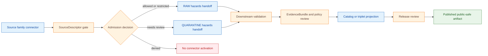

<!-- [KFM_META_BLOCK_V2]
doc_id: kfm://doc/connectors-hazards-readme
title: connectors/hazards/ — Hazards Connector Coordination Lane
type: readme
version: v0.2
status: draft
owners: OWNER_TBD — Connector steward · Source steward · Hazards steward · Release safety reviewer · Validation steward · Docs steward
created: 2026-06-18
updated: 2026-06-19
policy_label: public-doctrine; not-life-safety; rights-and-sensitivity-gated; no-publication
proposed_path: connectors/hazards/README.md
truth_posture: CONFIRMED path exists / PROPOSED connector-family contract / CANONICALITY NEEDS VERIFICATION
related:
  - ../README.md
  - ../../docs/domains/hazards/README.md
  - ../../docs/domains/hazards/SOURCE_REGISTRY.md
  - ../../docs/domains/hazards/SOURCES.md
  - ../../docs/domains/hazards/SOURCE_ROLE_MATRIX.md
  - ../../docs/domains/hazards/DATA_LIFECYCLE.md
  - ../../docs/runbooks/hazards/SOURCE_REFRESH_RUNBOOK.md
  - ../../docs/sources/SOURCE_DESCRIPTOR_STANDARD.md
  - ../../data/registry/sources/hazards/
  - ../../data/raw/hazards/
  - ../../data/quarantine/hazards/
  - ../../fixtures/
  - ../../schemas/contracts/v1/source/
  - ../../policy/domains/hazards/
  - ../../policy/sensitivity/
  - ../../policy/rights/
  - ../../release/
tags: [kfm, connectors, hazards, source-admission, noaa, fema, usgs, kansas, boundary, raw, quarantine, governance]
notes:
  - "v0.2 applies the KFM Markdown authoring standard supplied on 2026-06-19: impact block, repo fit, inputs/exclusions, evidence ledger, diagram, validation, rollback, and no-loss preservation."
  - "Hazards source-registry docs define the hazards registry as an admission/control surface, not a public safety service, truth store, bibliography, or publication authority."
  - "Visible hazards docs describe connectors as authority-clustered under source families such as noaa/, fema/, usgs/, nasa/, and kansas/; connectors/hazards/ should coordinate boundaries, not replace source-family homes."
  - "Hazards connector output may enter RAW or QUARANTINE handoff only; downstream validation, EvidenceBundle closure, catalog/triplet projection, release review, publication, correction, and rollback remain outside this folder."
  - "Implementation files, source activation, SourceDescriptor records, fixtures, tests, CI wiring, source inventory, boundary controls, and public-release classes remain NEEDS VERIFICATION."
[/KFM_META_BLOCK_V2] -->

<a id="top"></a>

# Hazards Connector Coordination Lane

> Coordination surface for hazards-related source-admission connectors. It is **not** a public safety, current-conditions, forecast, release, or publication authority.

<p>
  
  
  
  
  
</p>

> [!IMPORTANT]
> **Status:** `experimental` directory README · **Owner:** `OWNER_TBD`  
> **Path:** `connectors/hazards/README.md`  
> **Truth posture:** `CONFIRMED` file exists · `PROPOSED` connector-family contract · `NEEDS VERIFICATION` canonical implementation home  
> **Boundary:** source-admission coordination only; no public claims, no release decisions, no direct publication.

**Quick jumps:** [Scope](#scope) · [Repo fit](#repo-fit) · [Accepted inputs](#accepted-inputs) · [Exclusions](#exclusions) · [Directory map](#directory-map) · [Evidence ledger](#evidence-ledger) · [Lifecycle diagram](#lifecycle-diagram) · [Validation](#validation) · [Rollback](#rollback) · [Verification backlog](#verification-backlog)

---

## Scope

`connectors/hazards/` is a proposed coordination lane for hazards-related source-admission connectors.

It may document connector-family boundaries, compatibility routing, source-admission expectations, safe fixture rules, and links to source-specific connector homes.

It must not become a current-conditions service, public safety service, forecast authority, hazard truth store, source descriptor authority, schema authority, policy authority, catalog/triplet authority, proof authority, release authority, pipeline authority, or publication authority.

[Back to top ↑](#top)

---

## Repo fit

| Surface | Role | Status |
|---|---|---:|
| `connectors/hazards/` | Coordination or compatibility surface for hazards connector boundaries. | **PROPOSED / NEEDS VERIFICATION** |
| `docs/domains/hazards/SOURCE_REGISTRY.md` | Human-facing source admission and authority-control surface for the hazards domain. | **CONFIRMED** |
| `data/registry/sources/hazards/` | Machine-readable source descriptor home referenced by hazards doctrine. | **PROPOSED / NEEDS VERIFICATION** |
| `data/raw/hazards/` | RAW landing target for admitted hazards source material. | **PROPOSED / NEEDS VERIFICATION** |
| `data/quarantine/hazards/` | Quarantine target for unresolved source-role, rights, schema, freshness, or boundary questions. | **PROPOSED / NEEDS VERIFICATION** |
| `release/` | Release and publication controls. | **Out of scope for this connector** |

> [!NOTE]
> The hazards registry describes connector organization as authority-clustered under source-family folders such as `noaa/`, `fema/`, `usgs/`, `nasa/`, and `kansas/`. This README therefore treats `connectors/hazards/` as a coordination lane unless a Directory Rules update, ADR, migration note, or repo convention confirms it as an implementation home.

[Back to top ↑](#top)

---

## Accepted inputs

Material belongs in this connector coordination lane only when it helps maintain or review hazards source admission.

Accepted content:

- connector-family README and navigation notes;
- compatibility notes for hazards-related connector paths;
- source-admission expectations for hazard source families;
- fixture rules for connector-local tests;
- pointers to SourceDescriptor homes and source registries;
- validation expectations for connector output envelopes;
- review checklists for source-role, rights, sensitivity, cadence, freshness, and release-boundary handling.

Any source-specific implementation should remain in the authority-clustered connector home unless placement has been reviewed.

---

## Exclusions

This folder must not contain or imply authority over:

- public release decisions;
- published hazard claims;
- current-condition or forecast authority;
- direct writes to `PROCESSED`, `CATALOG`, `TRIPLET`, `PUBLISHED`, proof, receipt, or release stores;
- source descriptor authority records;
- policy or schema authority;
- operational guidance intended to replace official source channels;
- generated summaries presented as authoritative hazard truth.

Redirect those responsibilities to the appropriate registry, policy, schema, validation, release, or domain documentation surface.

[Back to top ↑](#top)

---

## Directory map

Current-session evidence confirms this README file. Full child inventory remains **NEEDS VERIFICATION**.

```text
connectors/
└── hazards/
    └── README.md        # CONFIRMED — this coordination README
```

Expected adjacent authority-clustered homes named by hazards registry doctrine include:

```text
connectors/
├── noaa/                # NEEDS VERIFICATION in current inventory
├── fema/                # NEEDS VERIFICATION in current inventory
├── usgs/                # NEEDS VERIFICATION in current inventory
├── nasa/                # NEEDS VERIFICATION in current inventory
└── kansas/              # NEEDS VERIFICATION in current inventory
```

[Back to top ↑](#top)

---

## Evidence ledger

| Source | Status | Supports | Limits |
|---|---:|---|---|
| `connectors/hazards/README.md` | **CONFIRMED** | Target file exists and was previously a v0.1 coordination README. | Does not prove implementation files, tests, or CI. |
| `docs/domains/hazards/SOURCE_REGISTRY.md` | **CONFIRMED** | Hazards source registry is an admission/control surface and not a public safety service, truth store, bibliography, or publication authority. | Does not prove connector implementation maturity. |
| Uploaded KFM Markdown Authoring Agent prompt | **CONFIRMED user-supplied instruction** | README-like docs should include KFM meta, impact block, repo fit, inputs, exclusions, quick links, diagrams where useful, evidence ledger, verification, and rollback. | Does not by itself prove repo implementation behavior. |
| `connectors/hazards/` child tree | **NEEDS VERIFICATION** | Target path exists. | Child connectors, tests, package layout, CI, and fixture strategy remain unverified. |

---

## Lifecycle diagram

This diagram is doctrine-aligned and implementation-light. It shows responsibility boundaries, not confirmed runtime wiring.



[Back to top ↑](#top)

---

## Admission posture

Expected behavior for hazards connector work:

- no live source access unless explicitly enabled and reviewed;
- no source fetch without a SourceDescriptor and activation decision;
- no implicit publication from retrieved source material;
- no conversion of source rows into confirmed hazard truth;
- no loss of source product, publisher, retrieval, rights, vintage, geometry, uncertainty, source role, validity window, review, or release-class metadata;
- unclear rights, source role, time validity, hazard meaning, location sensitivity, or schema drift routes to quarantine or abstention.

---

## Validation

Connector-local validation should check that:

- source metadata is preserved;
- SourceDescriptor references are required for activation;
- product, publisher, issuing authority, rights, citation, retrieval, geometry, uncertainty, source-role, validity window, review, and vintage fields are explicit where available;
- malformed or incomplete responses fail closed;
- hazard records remain source-admission candidates until downstream validation;
- no connector run writes directly to processed, catalog, triplet, published, proof, receipt, or release stores;
- fixture data is synthetic, minimized, redacted, or approved for committed use.

Root-level validation, policy-as-code, release review, EvidenceBundle closure, public caveats, official-source routing, and rollback remain outside this connector family.

[Back to top ↑](#top)

---

## Definition of done

This connector-family README is ready for first review when:

- [ ] Hazards source registry and source role matrix are linked and current enough for review.
- [ ] Source-specific connector homes are inventoried without creating duplicate authority.
- [ ] SourceDescriptor homes and source IDs are verified for active hazards sources.
- [ ] Live source access is disabled by default for connector code.
- [ ] Product, publisher, issuing authority, rights, citation, source role, geometry, uncertainty, validity window, review, and vintage metadata are preserved in parser output.
- [ ] Connector output is limited to RAW or QUARANTINE handoff.
- [ ] No public claims are created by connector code.
- [ ] Tests cover no-network, malformed, incomplete, rights-unclear, product-scope-unclear, time-validity-unclear, schema-drift, and boundary cases.

---

## Rollback

Rollback is required if this README is used to justify a parallel connector authority, direct publication path, current-condition authority, unsupported source activation, or bypass of `SourceDescriptor`, policy, validation, review, release, or rollback gates.

Rollback target:

```text
commit d08dcfbfefe4d11c0b00e8cc7289feca2c37a8f8
```

Rollback should restore the previous v0.1 coordination README unless a follow-up ADR or migration note ratifies a better placement model.

---

## Verification backlog

| Item | Status | Needed evidence |
|---|---:|---|
| Confirm actual hazards connector inventory below this path. | **NEEDS VERIFICATION** | Repo tree or mounted workspace. |
| Confirm canonicality of `connectors/hazards/`. | **NEEDS VERIFICATION** | Directory Rules, ADR, migration note, or repo convention. |
| Confirm relationship to authority-clustered connector homes. | **NEEDS VERIFICATION** | Repo tree and migration note. |
| Confirm source descriptor homes and source IDs. | **NEEDS VERIFICATION** | Source registry entries and accepted schemas. |
| Confirm source-specific access and parsing scope. | **NEEDS VERIFICATION** | Source steward review and connector implementation. |
| Confirm rights, sensitivity, and release-review posture. | **NEEDS VERIFICATION** | Rights review, sensitivity review, and release review. |
| Confirm fixture strategy and CI wiring. | **NEEDS VERIFICATION** | Fixture registry, workflow files, and test logs. |

---

## Maintainer note

This README deliberately preserves the strongest v0.1 boundaries while making the file more repo-native and reviewable. Keep `connectors/hazards/` narrow until canonical placement is resolved.

[Back to top ↑](#top)
