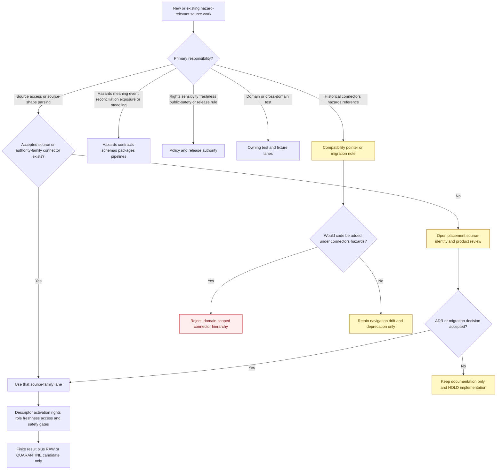
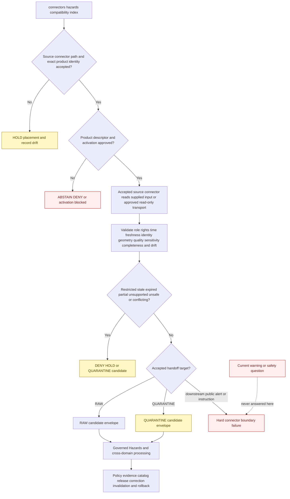

<!-- [KFM_META_BLOCK_V2]
doc_id: kfm://doc/connectors-hazards-readme
title: connectors/hazards/ — Hazards Connector Compatibility Index
type: readme
version: v0.3
status: draft
owners: OWNER_TBD — Connector steward · Source steward · Hazards steward · Hydrology steward · Atmosphere steward · Geology steward · Public-safety reviewer · Rights reviewer · Privacy/sensitivity reviewer · Security reviewer · Validation steward · Release steward · Docs steward
created: 2026-06-18
updated: 2026-07-11
policy_label: public-doctrine; compatibility-index; documentation-only; noncanonical-implementation-path; source-family-first; not-alert-authority; not-life-safety; freshness-bound; source-role-preserving; sensitive-joins-fail-closed; one-capture-multi-domain; no-code; no-descriptor; no-activation; no-publication
proposed_path: connectors/hazards/README.md
truth_posture: INSPECTED README-only domain-scoped path / per-source or authority-family connector placement is the confirmed repository rule / exact product homes, source IDs, source roles, registry topology, live access, and executable enforcement remain mixed, conflicted, absent, or unproved / no runtime, activation, lifecycle, alerting, or publication authority here
related:
  - ../README.md
  - ../noaa/README.md
  - ../noaa-storm-events/README.md
  - ../noaa_storm_events/README.md
  - ../nws/README.md
  - ../nws-api/README.md
  - ../noaa-hms-smoke/README.md
  - ../hms_smoke/README.md
  - ../hrrr_smoke/README.md
  - ../fema/README.md
  - ../fema/nfhl/README.md
  - ../fema-nfhl/README.md
  - ../fema-openfema/README.md
  - ../usgs/README.md
  - ../usgs-earthquake/README.md
  - ../nasa/README.md
  - ../nasa-firms/README.md
  - ../viirs_hotspot/README.md
  - ../drought-monitor/README.md
  - ../state-emergency-context/README.md
  - ../../docs/domains/hazards/README.md
  - ../../docs/domains/hazards/CANONICAL_PATHS.md
  - ../../docs/domains/hazards/SOURCE_REGISTRY.md
  - ../../docs/domains/hazards/SOURCES.md
  - ../../docs/domains/hazards/SOURCE_ROLE_MATRIX.md
  - ../../docs/domains/hazards/DATA_LIFECYCLE.md
  - ../../docs/domains/hazards/PUBLICATION_AND_BOUNDARY.md
  - ../../docs/domains/hazards/PRESERVATION_MATRIX.md
  - ../../docs/architecture/hazards-trust-membrane.md
  - ../../docs/architecture/source-roles.md
  - ../../data/registry/sources/hazards/README.md
  - ../../data/registry/hazards/README.md
  - ../../data/registry/hazards/sources/README.md
  - ../../data/raw/hazards/README.md
  - ../../data/quarantine/hazards/README.md
  - ../../data/processed/hazards/README.md
  - ../../tests/domains/hazards/README.md
  - ../../fixtures/domains/hazards/README.md
  - ../../policy/domains/hazards/
  - ../../policy/sensitivity/
  - ../../policy/rights/
  - ../../release/
tags: [kfm, connectors, hazards, compatibility, source-family-first, noaa, nws, fema, usgs, nasa, storm-events, earthquake, wildfire, smoke, flood, drought, emergency-context, freshness, source-role, raw, quarantine, not-alert-authority, governance]
notes:
  - >-
    Repository search and direct common-path probes confirm that connectors/hazards/ exposes this README while pyproject.toml, src/README.md, and tests/README.md are absent. No package, client, parser, descriptor, activation record, credential configuration, fixture, executable connector test, source payload, cache, watcher, lifecycle writer, or CI evidence is proved below this domain-scoped path.
  - >-
    Hazards canonical-path doctrine explicitly places connectors per source or authority family, not per consumer domain. Source access is represented in NOAA, NWS, FEMA, USGS, NASA, drought-monitor, state-context, and other source/product lanes outside connectors/hazards/. This path is therefore a documentation-only compatibility index unless an accepted ADR explicitly changes placement doctrine.
  - >-
    Connector topology is materially conflicted: Storm Events has hyphenated and underscored sibling paths plus a possible NOAA-nested home; NWS has broad and API-specific siblings beside the NOAA family; HMS has NOAA-prefixed and standalone underscore paths; FEMA has parent, nested, and flat compatibility paths; USGS Earthquake and NASA FIRMS have standalone paths beside family lanes; and several other hazard products remain outside ratified family placement.
  - >-
    Hazards registry topology is also conflicted across data/registry/sources/hazards/, data/registry/hazards/, and data/registry/hazards/sources/. The subtype-first registry README currently documents a README-only confirmed shape, while the domain-first paths are compatibility/routing surfaces. No product-specific accepted SourceDescriptor or SourceActivationDecision was confirmed by this update.
  - >-
    KFM Hazards is permanently not an emergency alert authority. Warnings, watches, advisories, detections, forecasts, declarations, and near-real-time feeds may be preserved as source evidence or context only. Connector behavior must not issue instructions, decide safety, replace official channels, or make stale operational material appear current.
  - >-
    The dominant anti-collapse boundaries are: warning is not KFM alert; declaration is not observed event; regulatory flood zone is not observed inundation; detection is not confirmed fire; smoke polygon is not PM2.5; forecast or model is not observation; aggregate indicator is not site truth; source role is fixed at admission; and connector output is not release.
[/KFM_META_BLOCK_V2] -->

<a id="top"></a>

# Hazards Connector Compatibility Index

> Documentation-only compatibility, navigation, and safety surface for source connectors that may feed the Hazards domain. Source access belongs in one reviewed upstream source or authority-family lane under `connectors/`; Hazards interpretation belongs downstream. This directory is not a runtime connector family and is never an emergency-alert authority.

<p>
  
  
  
  
  
  
  
</p>

`connectors/hazards/`

> [!IMPORTANT]
> **Inspected state:** repository search surfaced this README as the only file in the standalone Hazards connector path. Direct probes found no `pyproject.toml`, `src/README.md`, or `tests/README.md`. No source client, parser, package, SourceDescriptor, SourceActivationDecision, endpoint or credential mode, fixture set, executable connector suite, source payload, cache, watcher, RAW writer, receipt writer, or passing CI evidence is confirmed beneath `connectors/hazards/`.

> [!WARNING]
> **KFM Hazards is not an emergency alert system.** This directory must never issue warnings, recommend evacuation or sheltering, decide route safety, provide medical or public-safety instructions, claim that an area is safe, or replace NWS, NOAA, FEMA, USGS, state, tribal, county, municipal, fire, law-enforcement, or emergency-management channels. Operational material is evidence or context only and remains freshness-bound.

> [!CAUTION]
> **Placement rule:** Hazards is a consumer domain, not a connector authority. Current Hazards doctrine places connector implementation per source or authority family. Do not add runtime behavior or source children beneath this path without an accepted ADR, migration plan, source-identity decision, and complete safety review.

**Quick jumps:** [Purpose](#purpose) · [Placement decision](#placement-decision) · [Verified repository state](#verified-repository-state) · [Evidence ledger](#evidence-ledger) · [Compatibility responsibilities](#compatibility-responsibilities) · [Forbidden responsibilities](#forbidden-responsibilities) · [Source-family connector navigation](#source-family-connector-navigation) · [Unresolved connector-path and registry drift](#unresolved-connector-path-and-registry-drift) · [Hazards source semantics](#hazards-source-semantics) · [Source-role and knowledge-character boundary](#source-role-and-knowledge-character-boundary) · [Life-safety and official-source boundary](#life-safety-and-official-source-boundary) · [Anti-collapse matrix](#anti-collapse-matrix) · [Identity version correction and supersession](#identity-version-correction-and-supersession) · [Rights terms and attribution](#rights-terms-and-attribution) · [Sensitivity security and join-induced risk](#sensitivity-security-and-join-induced-risk) · [Geometry scale quality and uncertainty](#geometry-scale-quality-and-uncertainty) · [Temporal freshness and completeness](#temporal-freshness-and-completeness) · [Registry and activation boundary](#registry-and-activation-boundary) · [Access transport and secret boundary](#access-transport-and-secret-boundary) · [Metadata preservation](#metadata-preservation) · [Cross-domain routing and one-capture rule](#cross-domain-routing-and-one-capture-rule) · [Repository responsibility map](#repository-responsibility-map) · [Testing relationship](#testing-relationship) · [Placement decision flow](#placement-decision-flow) · [Admission and lifecycle boundary](#admission-and-lifecycle-boundary) · [Finite compatibility outcomes](#finite-compatibility-outcomes) · [Child-path policy](#child-path-policy) · [Migration and deprecation](#migration-and-deprecation) · [Review and rollback](#review-and-rollback) · [Definition of done](#definition-of-done) · [Verification backlog](#verification-backlog)

---

## Purpose

This README prevents `connectors/hazards/` from hardening into a parallel connector hierarchy organized around the domain that consumes source evidence rather than the authority that supplies it.

It may:

- explain the repository's per-source or authority-family connector posture;
- redirect historical, generated, or proposed Hazards-scoped connector references to reviewed source homes;
- index source connectors that may admit historical events, warnings, declarations, regulatory hazard layers, earthquake records, detections, smoke products, models, drought classifications, and state emergency context;
- expose path, product, source-ID, registry, role, freshness, rights, sensitivity, and lifecycle conflicts;
- preserve the permanent not-for-life-safety and official-source-referral boundary;
- distinguish operational context, historical events, regulatory areas, detections, observations, models, aggregates, administrative actions, candidates, and synthetic material;
- prevent duplicate source capture when one source supports Hazards, Hydrology, Atmosphere, Geology, Infrastructure, Roads, Agriculture, Habitat, or other domains;
- document migration, deprecation, correction, rollback, backlink, and generated-template work;
- prevent connector output from being mistaken for current conditions, event confirmation, regulatory interpretation, exposure truth, public safety advice, evidence closure, or release.

It does **not**:

- host source clients, parsers, product dispatch, package code, credentials, fixtures, tests, descriptors, activation state, or source data;
- choose a canonical connector path or source ID when repository evidence is conflicted;
- assign source roles, rights, sensitivity, freshness thresholds, cadence, public-use class, or release status;
- fetch or persist warnings, storm events, declarations, NFHL layers, earthquake products, fire detections, smoke polygons, model fields, drought classifications, emergency reports, or exposure data;
- define canonical `HazardEvent`, `WarningContext`, `FloodContext`, `WildfireDetection`, `SmokeContext`, `EarthquakeEvent`, `DroughtIndicator`, `ExposureSummary`, or other Hazards truth;
- perform event merging, source conflation, model execution, exposure joins, geometry transforms, public redaction, evidence closure, release, correction, or publication;
- answer whether a person should evacuate, shelter, travel, return, enter, consume water, use a road, approach a fire, or take any other life-safety action.

[Back to top ↑](#top)

---

## Placement decision

Current doctrine and repository evidence support one safe parent-directory decision even though several source-specific paths remain unresolved.

| Question | Current safe decision | Evidence posture |
|---|---|---:|
| Is `connectors/hazards/` a canonical runtime connector-family root? | **No.** Treat it as a documentation-only compatibility and navigation index. | Hazards canonical-path doctrine says connectors are per source, not per domain; the inspected path exposes documentation only. |
| May source implementations be added under `connectors/hazards/<source>/`? | **No, absent an accepted ADR.** | A domain-scoped implementation would duplicate source identity, credentials, activation, tests, corrections, freshness state, and rollback across consumers. |
| Where should hazard-relevant source access live? | In one reviewed source, authority-family, or product lane under `connectors/`. | Examples include NOAA, NWS, FEMA, USGS, NASA, drought-monitor, and state-source lanes. |
| Where should Hazards interpretation live? | In Hazards contracts, schemas, packages, pipelines, policies, tests, fixtures, lifecycle, evidence, catalog, and release lanes after admission. | Source access and domain interpretation are separate responsibilities. |
| May Hazards and an adjacent domain fetch the same source independently? | **No by convenience.** Capture once under the accepted source identity and route lineage-preserving candidates. | Duplicate capture fragments rights, source roles, timestamps, checksums, corrections, and stale-state handling. |
| Do current source connector READMEs prove activation or production readiness? | **No.** | Many are draft, compatibility, README-only, placeholder, or placement-conflicted lanes. |
| May a current feed be exposed because its connector fetched successfully? | **No.** | Fetch success is not freshness, quality, evidence, policy, release, or alert authority. |
| Can this parent-directory decision change? | Yes, only through an accepted ADR or migration decision. | A change must cover ownership, code, descriptors, credentials, tests, source IDs, data lineage, safety, correction, and rollback. |

> [!CAUTION]
> Directory presence is evidence of presence, not authority. A detailed README, generated skeleton, source catalog page, watcher, RAW child directory, or package-shaped path does not establish connector activation, current-source reliability, public safety, or release readiness.

[Back to top ↑](#top)

---

## Verified repository state

The following relationship is confirmed or directly evidenced on the repository's default branch at the time of this update:

```text
connectors/
├── hazards/
│   └── README.md                         # this compatibility index
├── noaa/
│   └── README.md                         # NOAA family lane
├── noaa-storm-events/README.md           # hyphenated Storm Events candidate
├── noaa_storm_events/README.md           # underscore compatibility candidate
├── nws/README.md                         # broad NWS candidate
├── nws-api/README.md                     # API-specific NWS candidate
├── noaa-hms-smoke/README.md              # NOAA-prefixed HMS candidate
├── hms_smoke/README.md                   # standalone underscore HMS candidate
├── hrrr_smoke/README.md                  # standalone HRRR-Smoke candidate
├── fema/
│   ├── README.md                         # shared FEMA family contract
│   └── nfhl/README.md                    # preferred nested NFHL documentation
├── fema-nfhl/README.md                   # flat NFHL compatibility path
├── fema-openfema/README.md               # flat OpenFEMA compatibility path
├── usgs/README.md                        # USGS family lane
├── usgs-earthquake/README.md             # standalone earthquake candidate
├── nasa/README.md                        # NASA family candidate
├── nasa-firms/README.md                  # standalone FIRMS candidate
├── viirs_hotspot/README.md               # hotspot product candidate
├── drought-monitor/README.md             # drought classification source lane
└── state-emergency-context/README.md      # state context source candidate
```

The listing is a navigation sample, not a complete connector inventory. It does not prove that any listed connector is activated, endpoint-current, rights-cleared, freshness-tested, safe for public use, or covered by CI.

Relevant Hazards registry and lifecycle documentation also exists:

```text
data/registry/
├── sources/hazards/README.md              # subtype-first source-registry lane
└── hazards/
    ├── README.md                          # domain-first compatibility/routing parent
    └── sources/README.md                  # domain-first source-registry lane

data/raw/hazards/
├── README.md
├── fema/README.md
├── firms/README.md
└── nfhl/README.md

tests/domains/hazards/README.md            # domain test index; executable tests unproved
fixtures/domains/hazards/README.md         # synthetic fixture index; payload use unproved
```

The registry and RAW trees document intended boundaries. They do not prove accepted product descriptors, source activation, payload presence, complete captures, receipts, executable validation, release, or public correctness.

### Current maturity

| Surface | Confirmed content | Maturity |
|---|---|---:|
| `connectors/hazards/README.md` | This compatibility, placement, and safety contract. | **DOCUMENTED / NON-OPERATIONAL** |
| Other files below `connectors/hazards/` | No package metadata, source-root README, or test-root README found; no other file surfaced in repository search. | **ABSENT / NEEDS CONTINUOUS VERIFICATION** |
| Connector code, fixtures, tests, credentials, or activation below this path | None confirmed. | **ABSENT / FORBIDDEN UNDER CURRENT POSTURE** |
| Hazard-relevant source connector lanes | Multiple source, authority-family, and product paths are documented. | **MIXED DRAFT / COMPATIBILITY / PATH-CONFLICTED** |
| `data/registry/sources/hazards/` | Registry boundary README; current confirmed shape documented as README-only. | **DOCUMENTED / PRODUCT DESCRIPTORS UNCONFIRMED** |
| Domain-first Hazards registry paths | Parent and `sources/` READMEs exist. | **DOCUMENTED / TOPOLOGY CONFLICTED** |
| Hazards RAW child lanes | FEMA, FIRMS, and NFHL README lanes. | **DOCUMENTED / PAYLOADS AND ACTIVATION UNKNOWN** |
| Hazards domain tests and fixtures | Parent and child documentation exists. | **DOCUMENTED / EXECUTABLE ENFORCEMENT AND PAYLOAD USE UNVERIFIED** |
| Source activation owned by this directory | None. | **FORBIDDEN** |
| Alert authority owned by this directory | None. | **PERMANENTLY FORBIDDEN** |
| Publication authority owned by this directory | None. | **FORBIDDEN** |

[Back to top ↑](#top)

---

## Evidence ledger

| Evidence | Status | What it supports | What it does not support |
|---|---:|---|---|
| `connectors/hazards/README.md`, repository search, and direct common-path probes | **CONFIRMED for inspected state** | The domain-scoped connector path is documentation-only in the inspected branch. | Permanent absence of empty, generated, or future files. |
| `docs/domains/hazards/CANONICAL_PATHS.md` | **CONFIRMED doctrine-derived path register** | Connectors are per source, not per domain; connector output stops before downstream promotion; not-alert posture is mandatory. | Activation or maturity of any source connector. |
| `docs/domains/hazards/README.md` | **CONFIRMED Hazards doctrine** | Domain ownership, seven source roles, temporal discipline, anti-collapse rules, cross-domain ownership, and not-for-life-safety boundary. | Connector implementation or endpoint health. |
| `docs/domains/hazards/SOURCE_REGISTRY.md` | **CONFIRMED admission doctrine** | Authority-family connector organization, product-level descriptors, rights/freshness gates, and official-source boundary. | Accepted descriptors or current activation. |
| `connectors/noaa-storm-events/` and `connectors/noaa_storm_events/` | **CONFIRMED path conflict** | Hyphenated and underscored Storm Events paths coexist beside the NOAA family. | A canonical package, source ID, or active historical-event feed. |
| `connectors/nws/`, `connectors/nws-api/`, and `connectors/noaa/` | **CONFIRMED path and scope conflict** | Broad NWS, API-specific NWS, and NOAA-family boundaries coexist. | Accepted product decomposition or active operational-context feed. |
| FEMA parent, nested NFHL, and flat compatibility paths | **CONFIRMED mixed topology** | FEMA product roles and preferred shared-family architecture are documented. | Activated declarations, NFHL, or OpenFEMA source surfaces. |
| `connectors/usgs-earthquake/` and `connectors/usgs/` | **CONFIRMED standalone-versus-family conflict** | Earthquake sub-product and snapshot boundaries are documented. | A canonical earthquake package or live feed. |
| NASA family, FIRMS, and VIIRS paths | **CONFIRMED proposed family/product topology** | Detection semantics and source-family placement questions are documented. | Confirmed-fire truth, activated endpoints, or ratified NASA connector architecture. |
| HMS and HRRR connector READMEs | **CONFIRMED product documentation** | Smoke polygons, fire detections, and modeled forecast fields require distinct semantics. | PM2.5 truth, exposure, active source access, or public safety. |
| Drought Monitor and state-emergency-context READMEs | **CONFIRMED source-lane documentation** | Weekly classifications and administrative context require bounded semantics. | Local-condition truth, emergency authority, or implementation maturity. |
| Three Hazards registry READMEs | **CONFIRMED topology conflict** | Subtype-first and domain-first registry paths coexist and warn against divergent descriptor copies. | A settled canonical registry topology. |
| `data/raw/hazards/README.md` and child READMEs | **CONFIRMED lifecycle documentation** | FEMA, FIRMS, and NFHL RAW boundaries and anti-collapse rules are documented. | Payloads, checksums, activation, receipts, or successful ingest. |
| Hazards tests and fixture READMEs | **CONFIRMED documentation surfaces** | No-network, synthetic, negative-path, role, freshness, and life-safety test intentions exist. | Executable test modules, CI coverage, pass rates, or release approval. |

[Back to top ↑](#top)

---

## Compatibility responsibilities

This path may contain only responsibilities that prevent ambiguity, unsafe code placement, and life-safety drift:

- a concise redirect to the source/product path selected by accepted governance;
- path, source-ID, product-key, distribution-name, import-name, registry-slug, RAW-slug, and role-conflict documentation;
- migration inventories, backlink maps, tombstone plans, alias maps, and deprecation notes;
- source-role and knowledge-character anti-collapse warnings shared across hazard sources;
- not-for-life-safety, official-source-referral, freshness, expiry, stale-state, and correction warnings;
- product identity, native classification, version, geometry, quality, uncertainty, rights, and sensitivity warnings;
- one-source-capture/multi-domain routing guidance;
- pointers to source connectors, source registries, Hazards contracts, schemas, packages, pipelines, policies, tests, fixtures, lifecycle stores, evidence, catalog, and release lanes;
- correction of documentation or generated templates that treat connector output as current hazard truth, alert authority, evidence closure, or public release.

Every compatibility statement must distinguish:

```text
CONFIRMED repository evidence
PROPOSED placement or product design
CONFLICTED path, role, registry, or lifecycle posture
NEEDS VERIFICATION implementation, source, freshness, or governance state
```

[Back to top ↑](#top)

---

## Forbidden responsibilities

Do not place or implement the following beneath `connectors/hazards/`:

| Forbidden content or behavior | Correct responsibility or handling |
|---|---|
| Source clients, fetchers, scrapers, feed consumers, API adapters, object-store readers, archive downloaders, database readers, or watchers | One accepted source, authority-family, or product connector lane. |
| Python, JavaScript, shell, SQL, notebook, package, build, deployment, or runtime configuration | The reviewed source connector's implementation package. |
| SourceDescriptors or SourceActivationDecisions | Accepted source registry and activation workflow. |
| Endpoint, account, token, cookie, key, session, certificate, browser, cloud-profile, or credential configuration | External security and credential-management systems plus the accepted source connector. |
| Connector-local fixtures or executable tests | The accepted source connector's test lane; Hazards interpretation tests remain under Hazards test roots. |
| Warning, watch, advisory, event, declaration, regulatory, earthquake, fire, smoke, drought, model, exposure, infrastructure, table, raster, vector, archive, or service payloads | Governed RAW, QUARANTINE, restricted runtime, or approved fixture storage. |
| Caches, extracted archives, retry queues, temporary downloads, database mirrors, message queues, or model workspaces | Explicit restricted runtime storage with retention and cleanup controls. |
| `HazardEvent`, `WarningContext`, `DisasterDeclaration`, `FloodContext`, `WildfireDetection`, `SmokeContext`, `EarthquakeEvent`, `DroughtIndicator`, `ExposureSummary`, or other canonical objects | Hazards contracts, schemas, packages, pipelines, and review. |
| Event conflation, incident confirmation, exposure joins, risk scoring, model execution, resilience analysis, or source reconciliation | Downstream domain or cross-domain pipelines with receipts, confidence, evidence, and lineage. |
| Rights, sensitivity, freshness thresholds, source-role, attribution, quality, public-safety, or release rules | `policy/`, source registry, domain governance, and release authority. |
| RAW, WORK, QUARANTINE, PROCESSED, CATALOG, TRIPLET, PROOF, RECEIPT, RELEASE, PUBLISHED, API, map, report, graph, search, embedding, or generated-answer writers | Owning lifecycle, evidence, release, and application surfaces. |
| Public warnings, alerts, evacuation guidance, shelter advice, route safety, health advice, legal flood interpretation, confirmed-fire statements, or all-clear messages | Official authorities and governed downstream public products; never this compatibility path. |

A compatibility directory is not a shortcut around source placement, role, freshness, rights, sensitivity, evidence, or release gates.

[Back to top ↑](#top)

---

## Source-family connector navigation

The table below is a navigation and conflict index. Presence of a README does not prove implementation, activation, rights clearance, current endpoint support, freshness correctness, test coverage, or release readiness.

| Source or product family | Current connector documentation | Source meaning and primary caution | Placement posture |
|---|---|---|---|
| NOAA/NCEI Storm Events | `../noaa/`, `../noaa-storm-events/`, `../noaa_storm_events/` | Historical event records with file vintage, correction, narrative, casualty, damage, and geometry context; not current alerts or direct measurements of every field. | **CRITICAL HYPHEN / UNDERSCORE / NESTED PATH CONFLICT** |
| NWS messages, forecasts, and observations | `../noaa/`, `../nws/`, `../nws-api/` | Warnings, watches, advisories, forecasts, observations, and aggregates are distinct products; operational messages are context only and expiry-bound. | **BROAD / API / FAMILY PLACEMENT CONFLICT** |
| FEMA declarations and OpenFEMA | `../fema/`, `../fema-openfema/` | Administrative declarations and table-specific administrative or aggregate products; declaration is not observed event or damage truth. | **SHARED FAMILY PREFERRED / FLAT COMPATIBILITY REMAINS** |
| FEMA NFHL / MSC | `../fema/`, `../fema/nfhl/`, `../fema-nfhl/` | Regulatory flood-hazard mapping; not observed inundation, current flood depth, evacuation zone, or legal advice. | **NESTED PREFERRED / FLAT COMPATIBILITY PATH** |
| USGS Earthquake Catalog | `../usgs/`, `../usgs-earthquake/` | Event origins, updates, magnitude estimates, ShakeMap, PAGER, focal mechanisms, and DYFI have distinct roles and update lineages. | **STANDALONE VERSUS FAMILY PLACEMENT CONFLICT** |
| NASA FIRMS / VIIRS detections | `../nasa/`, `../nasa-firms/`, `../viirs_hotspot/` | Remote-sensing hotspot detections with confidence, satellite, acquisition, product, and revision context; not confirmed wildfire or public alert. | **PROPOSED NASA FAMILY / PRODUCT PATHS NEED ADR** |
| NOAA HMS fire and smoke | `../noaa/`, `../noaa-hms-smoke/`, `../hms_smoke/` | Fire points and analyst-curated smoke polygons are separate; smoke density is qualitative and not PM2.5 or exposure. | **NOAA-PREFIXED VERSUS STANDALONE PATH CONFLICT** |
| NOAA HRRR-Smoke | `../noaa/`, `../hrrr_smoke/` | Modeled forecast fields with run, lead, valid time, grid, variable, and uncertainty; model is not observation or measured PM2.5. | **STANDALONE PRODUCT VERSUS NOAA FAMILY OPEN** |
| U.S. Drought Monitor and related indicators | `../drought-monitor/` | Weekly expert-synthesis classifications and aggregates; not raw observation, forecast, crop-loss determination, water restriction, or site truth. | **PRODUCT LANE BEYOND CORE FAMILY ROOTS / NEEDS RATIFICATION** |
| State and local emergency context | `../state-emergency-context/` plus authority-specific Kansas/local lanes when accepted | Declarations, proclamations, status reports, and administrative context; not observed impact, official warning replacement, or precise hazard footprint. | **UMBRELLA PRODUCT IDENTITY AND AUTHORITY HOMES OPEN** |
| Hydrology observations used as flood context | USGS/FEMA/Hydrology source connectors, not a Hazards duplicate | Gauges, forecasts, watersheds, and water records remain Hydrology-owned evidence. | **CROSS-DOMAIN OWNER / ONE CAPTURE REQUIRED** |
| Infrastructure and transportation exposure context | Source connectors owned by Infrastructure and Roads lanes | Facilities, lifelines, closures, and routes remain source/domain-owned and may be highly sensitive. | **NO HAZARDS-SCOPED DUPLICATE CONNECTOR** |

> [!IMPORTANT]
> Source-family-first does not mean that every existing top-level product path is canonical. It means the accepted implementation must be organized around the upstream source and exact product, not duplicated beneath `connectors/hazards/` because Hazards is a consumer.

[Back to top ↑](#top)

---

## Unresolved connector-path and registry drift

The current repository contains incompatible connector, identity, registry, and lifecycle patterns. This index records them; it does not normalize them by blessing the most complete-looking scaffold.

| Drift area | Confirmed conflict | Required posture |
|---|---|---|
| Domain-scoped Hazards root | `connectors/hazards/` exists while source access is represented in source/authority-family lanes. | Keep this directory inert; no source children without ADR. |
| Storm Events placement | NOAA parent, hyphenated product path, underscored product path, and possible nested placement coexist. | Select one product home and migration map; no parallel activation. |
| NWS placement and scope | NOAA parent, broad `nws`, and API-specific `nws-api` lanes coexist. | Decompose exact products and select one ownership architecture. |
| FEMA topology | Parent/shared package, nested NFHL, and flat NFHL/OpenFEMA compatibility paths coexist. | Preserve the shared family architecture and migrate aliases explicitly. |
| USGS Earthquake placement | Standalone `usgs-earthquake` coexists with the USGS family. | Select nested or standalone product placement by ADR; no duplicate feed or event store. |
| NASA/FIRMS placement | NASA family and standalone FIRMS/VIIRS paths coexist; NASA family ratification remains open. | Require source-family/product identity decision before activation. |
| HMS placement | `noaa-hms-smoke` and `hms_smoke` coexist; NOAA parent also exists. | Select one product lane; preserve fire-point and smoke-polygon separation. |
| HRRR-Smoke placement | Standalone underscore product path coexists with NOAA family doctrine. | Select one product lane and package/test ownership. |
| Drought placement | Product-specific connector exists outside the core authority-family spine. | Ratify or migrate; preserve weekly product identity and supersession. |
| State emergency context | Generic state-context lane may overlap Kansas, state-agency, local, tribal, or product-specific source homes. | Require exact authority and product descriptors; no umbrella activation. |
| Source-role vocabulary | Canonical seven-role vocabulary coexists with `operational_warning`, `regulatory_context`, `remote_sensing_detection`, and other use labels. | Treat use labels as knowledge characters, not machine roles. |
| Hazards registry topology | `data/registry/sources/hazards/`, `data/registry/hazards/`, and `data/registry/hazards/sources/` coexist. | Maintain one authoritative descriptor record; other paths become pointers or migrate. |
| RAW/source slugs | `fema`, `nfhl`, `firms`, provider names, product names, hyphenated and underscored IDs coexist. | Source-ID migration must preserve checksums, receipts, corrections, aliases, and lineage. |
| Schema/contract paths | Hazards documentation contains flat and `domains/`-segmented contract/schema forms. | Connector code must consume accepted contracts explicitly and never choose authority by adjacency. |
| Life-safety flag placement | Downstream docs disagree on the exact object that carries the permanent not-alert posture. | Connector preserves source/time/referral metadata; policy/schema ADR selects downstream field placement. |

Code growth is not a governance decision. Freeze losing paths before moving implementation, descriptors, credentials, fixtures, watchers, or data.

[Back to top ↑](#top)

---

## Hazards source semantics

Hazard-relevant sources represent different evidence classes. A shared consumer domain does not make those classes interchangeable.

| Source material | Source meaning | Appropriate downstream use | Must not become |
|---|---|---|---|
| Historical storm-event record | Retrospective source-attributed event record with event/episode IDs, vintage, correction state, narrative, geometry, casualty, damage, and magnitude fields. | Historical event candidate, timeline context, source comparison. | Current warning, forecast, flood footprint, direct measurement of every scalar, or complete impact record. |
| Warning, watch, advisory, or alert message | Official issuing-authority message with identifier, status, event type, issue/effective/expiry times, zones/geometry, and source link. | Time-bound `WarningContext` or `AdvisoryContext`, historical archive, official-source referral. | KFM-issued alert, life-safety instruction, current state after expiry, or confirmed impact. |
| Weather forecast | Modeled forecast product with issue/cycle, lead, valid time, grid/zone, variables, and uncertainty. | Forecast context and downstream model comparison. | Observation, guaranteed condition, warning authority, or route-safety decision. |
| FEMA or state declaration | Administrative or regulatory action with declaration/action ID, authority, jurisdiction, incident type, dates, amendments, and legal scope. | `DisasterDeclaration` or administrative context. | Observed event, damage measurement, impact footprint, entitlement decision, or proof that a hazard occurred everywhere declared. |
| NFHL flood-hazard layer | Regulatory map unit with version, effective date, zone, source authority, datum, geometry, and caveats. | `FloodContext` regulatory overlay candidate. | Observed inundation, current flood depth, model forecast, parcel determination, evacuation zone, or legal advice. |
| Earthquake origin record | Source event snapshot with event ID, origin/update time, location, depth, magnitude, uncertainty, and revision state. | `EarthquakeEvent` observed source candidate and historical seismic context. | Final immutable truth, alert instruction, measured impact, or loss estimate. |
| ShakeMap, PAGER, focal mechanism, or related earthquake derivative | Product-specific modeled or analytical derivative with model/method, version, inputs, update, geometry, and uncertainty. | Modeled ground-motion, impact, or mechanism context. | Direct observation, measured loss, final event truth, or emergency direction. |
| DYFI or crowdsourced earthquake report | Aggregated public report context with report counts, intensity interpretation, geography, and uncertainty. | Crowdsourced context and validation input. | Instrumented ground motion, person-level evidence, or complete damage survey. |
| FIRMS/VIIRS/HMS fire point | Remote-sensing or analyst-supported detection with satellite/sensor, acquisition time, confidence, footprint/point, product, and caveats. | `WildfireDetection` candidate and cross-source composition input. | Confirmed ignition, fire perimeter, active operational status, evacuation trigger, or ground-truth incident. |
| HMS smoke polygon | Analyst-curated qualitative plume boundary with issue time, density class, source files, geometry, and provenance. | `SmokeContext` candidate and source comparison. | PM2.5 concentration, exposure, health advice, visibility guarantee, forecast, or alert. |
| HRRR-Smoke or other model field | Modeled forecast with model run, lead, valid time, grid, variable, units, version, and uncertainty. | Modeled smoke/meteorological context. | Observation, measured concentration, confirmed plume, public advisory, or all-clear. |
| Drought classification or indicator | Weekly/monthly expert synthesis, modeled indicator, or aggregate classification with release, valid period, geography, method, and supersession. | `DroughtIndicator`, historical comparison, resilience context. | Raw observation, forecast, field/parcel truth, crop loss, water-right condition, restriction, or declaration. |
| State/local emergency status record | Administrative situation, proclamation, status, resource, or jurisdiction record with authority and dates. | Administrative context and source referral. | Observed event extent, current warning, legal conclusion, response instruction, or public all-clear. |
| Exposure or resilience model | Downstream joined model/aggregate with inputs, method, run, geography, uncertainty, and sensitivity controls. | Public-safe summary candidate after cross-domain review. | Person-, facility-, route-, parcel-, or infrastructure-level truth; emergency instruction; guaranteed impact. |

[Back to top ↑](#top)

---

## Source-role and knowledge-character boundary

New machine records must use only the accepted repository source-role vocabulary:

```text
observed | regulatory | modeled | aggregate | administrative | candidate | synthetic
```

Hazards documentation also uses descriptive knowledge/use labels such as:

```text
historical_event_record
operational_warning
operational_watch
operational_advisory
administrative_declaration
regulatory_context
scientific_observation
remote_sensing_detection
modeled_derivative
resilience_analysis
unknown_unclassified
```

Those labels must not be copied into the canonical source-role field or mapped silently. Until accepted product descriptors or an ADR resolve each case:

- do not treat `operational` as an eighth source role;
- do not treat `warning`, `watch`, or `advisory` as automatically `regulatory`, `observed`, or `administrative`;
- do not treat `remote_sensing_detection` as confirmed `observed` event truth;
- do not treat `regulatory_context` as observed condition;
- do not convert descriptive `model` or `forecast` labels without exact product identity and review;
- do not flatten NOAA, NWS, FEMA, USGS, NASA, drought, state, or local products to a family-wide role;
- do not assign role from provider, URL, filename, feed name, map appearance, recency, consumer domain, or HTTP status;
- require an accepted product-level SourceDescriptor and SourceActivationDecision;
- preserve the assigned role through parsing, normalization, aggregation, cataloging, rendering, and release;
- require descriptor revision, impact analysis, correction evidence, and downstream invalidation for any role change.

Knowledge character, object family, issuing authority, legal effect, freshness state, confirmation state, and source role are separate dimensions. A `WarningContext`, `WildfireDetection`, `FloodContext`, or `HazardEvent` label does not replace the source-role field.

[Back to top ↑](#top)

---

## Life-safety and official-source boundary

The not-for-life-safety boundary is permanent. It applies before source access, during admission, and after every downstream transform.

### Connector responsibilities

A future accepted source connector may preserve, where supplied:

- official issuing authority and source program;
- source message, event, declaration, product, or record identifier;
- official source URL or durable source reference;
- issue, effective, onset, expiry, end, cancellation, update, and retrieval times;
- message status, replacement, cancellation, correction, and supersession links;
- source zones, jurisdictions, geometry, and precision caveats;
- severity, urgency, certainty, category, class, confidence, or source quality values without reinterpretation;
- source-provided instructions as inert source text only when rights, sensitivity, retention, and downstream policy permit;
- explicit context-only, not-alert-authority, freshness, and review flags under accepted contracts.

A connector must not:

- generate, rewrite, prioritize, rank, simplify, translate, or summarize instructions as actionable guidance;
- decide whether a warning should be shown, hidden, escalated, downgraded, or treated as current for the public;
- answer whether a person should evacuate, shelter, travel, cross a road, enter a building, return home, approach a hazard, or ignore an official message;
- infer an all-clear from an expired, missing, cancelled, inaccessible, or empty feed;
- merge conflicting official messages into a new KFM instruction;
- present KFM as the issuing authority;
- bypass official-source links, release policy, freshness gates, correction paths, or rollback.

### Downstream requirements

Any released Hazards context that references operational material requires, under the owning downstream contracts:

- permanent not-for-life-safety framing;
- official-source referral;
- visible source, issue, expiry, retrieval, and freshness state;
- stale/expired handling that cannot masquerade as current;
- evidence, policy, release, correction, and rollback support;
- finite outcomes that allow `ABSTAIN` or `DENY` rather than unsafe answers.

This compatibility path neither creates nor approves those public carriers.

[Back to top ↑](#top)

---

## Anti-collapse matrix

| Forbidden collapse | Required posture |
|---|---|
| NWS warning/watch/advisory → KFM alert or instruction | Preserve official authority, message type, status, issue/effective/expiry, source link, and context-only boundary. |
| Expired or cancelled message → current warning state | Preserve lifecycle state; route current-use claims to denial, abstention, hold, or downstream stale treatment. |
| Missing/empty operational feed → safe conditions or all-clear | Treat absence as unknown; never infer safety. |
| Storm Events record → current warning or direct measurement | Preserve historical file vintage, table type, event/episode identity, corrections, narrative, and source limitations. |
| FEMA/state declaration → observed event, damage, or impact extent | Preserve administrative/regulatory scope and authority; require independent event and impact evidence. |
| NFHL zone → observed inundation, forecast flood, parcel determination, or evacuation zone | Preserve regulatory role, map vintage, datum, zone attributes, scale, and Hydrology ownership. |
| FIRMS/VIIRS/HMS point → confirmed wildfire, ignition, perimeter, or emergency status | Preserve detection/candidate semantics, sensor/product, confidence, time, footprint, and disposition. |
| HMS smoke polygon or density → PM2.5, exposure, visibility, or health guidance | Preserve qualitative plume meaning, issue time, density class, geometry, and analyst/source provenance. |
| HRRR/AOD/model field → observation or measured concentration | Preserve model/retrieval role, run/version, valid time, grid, inputs, uncertainty, and downstream model receipt requirements. |
| Earthquake origin snapshot → immutable final event | Preserve update sequence, source status, uncertainty, corrections, and supersession. |
| PAGER/ShakeMap/focal product → direct observation or measured loss | Preserve modeled/analytical product identity, method, version, update, and uncertainty. |
| DYFI report → instrumented ground motion or person-level truth | Preserve crowdsourced aggregation, report method, geography, uncertainty, and privacy limits. |
| Drought class → forecast, raw measurement, field/parcel truth, crop loss, restriction, or declaration | Preserve weekly release, valid period, geography, method, aggregation, indicator inputs, and supersession. |
| State emergency record → precise hazard footprint or official KFM status | Preserve administrative jurisdiction and dates; do not infer physical extent or issue instructions. |
| Exposure summary → person, household, facility, route, or critical-asset truth | Preserve aggregation, generalization, sensitivity, input roles, model method, and uncertainty. |
| Source geometry → canonical event or impact geometry | Preserve source support and disagreements; reconciliation is downstream and confidence-bearing. |
| Public source availability → public-safe product | Continue through rights, sensitivity, freshness, evidence, policy, release, correction, and rollback gates. |
| Lifecycle promotion → source-role upgrade or event confirmation | Source role and confirmation state remain explicit; promotion cannot change evidence meaning. |
| Connector candidate → released Hazards claim | Connector output is not processed truth, evidence closure, release, alert, or publication. |

> [!IMPORTANT]
> A message is not an instruction from KFM. A declaration is not an event observation. A regulatory zone is not an inundation. A detection is not confirmation. A smoke polygon is not concentration. A model is not observation. An aggregate is not a site. A candidate is not a released claim.

[Back to top ↑](#top)

---

## Identity, version, correction, and supersession

Hazards sources frequently revise the same apparent object. Identity and correction state are therefore load-bearing.

Future accepted source handling should preserve, where supplied and applicable:

- canonical source ID, exact product key, native record/event/message ID, and product-specific stable key;
- authority, provider, endpoint/surface, collection, table, file, layer, service, or feed identity;
- source version, file vintage, table vintage, schema version, class/vocabulary version, algorithm/model version, and map revision;
- event origin, issue, effective, expiry, update, cancellation, correction, replacement, amendment, supersession, and withdrawal state;
- source-native relationships among parent events, episodes, messages, declarations, units, products, sub-products, reports, and model runs;
- normalized request/query identity and content digest;
- duplicate native IDs, same-ID/different-digest conflicts, merged/split IDs, and source-side re-identification;
- previous-state, replacement-state, and correction references;
- downstream dependency and invalidation signals without rewriting released artifacts locally.

### Product examples

| Product | Identity and version requirement |
|---|---|
| Storm Events | Preserve event ID, episode ID, table type, file vintage, creation/correction state, and source row identity. |
| NWS messages | Preserve message/alert ID, sender, status, message type, references, sent/effective/onset/expiry/end times, cancellation and replacement links. |
| FEMA declarations | Preserve declaration number, amendment/version, incident type, designation scope, dates, and source table identity. |
| NFHL | Preserve `DFIRM_ID`, `VERSION_ID`, `EFFECTIVE_DATE`, regulatory attributes, source distribution, datum, and map revision. |
| USGS earthquake | Preserve event ID, origin time, update time, product status, immutable fetched snapshot digest, and sub-product versions. |
| FIRMS/VIIRS/HMS | Preserve satellite/sensor, product, acquisition/issue time, confidence or density vocabulary, source file/service identity, and revision state. |
| HRRR-Smoke | Preserve model name/version, run/cycle, forecast hour, valid time, variable, level, grid, and source-file identity. |
| Drought Monitor | Preserve release date/week, valid period, geography, class system, source release identity, correction, and supersession. |
| State/local context | Preserve issuing authority, record ID, action/status type, jurisdiction, issue/effective/end dates, update, and withdrawal state. |

Required behavior:

- never overwrite earlier source states silently;
- never let a newer retrieval time replace source event or valid time;
- never let one provider's ID silently merge with another provider's event;
- never treat a corrected source record as proof that earlier downstream artifacts were corrected;
- emit finite drift/correction findings for material changes;
- route downstream invalidation, correction notices, cache cleanup, withdrawal, and rollback to owning systems.

[Back to top ↑](#top)

---

## Rights, terms, and attribution

Rights and use constraints must be evaluated at the actual source, product, endpoint, feed, table, layer, file, archive, institution, or record granularity.

Required context to preserve where supplied and applicable:

- publisher, issuing authority, provider, program, institution, joint publisher, and source family;
- exact product, feed, message family, table, service, layer, archive, file, release, or distribution identity;
- source URI and access surface;
- raw license, terms, disclaimer, citation, attribution, and use-constraint text;
- normalized rights interpretation from an external authority;
- rights holder and required attribution;
- redistribution, derivative, commercial-use, automation, scraping, rate, account, embargo, retention, or sharing restrictions;
- record-level, provider-level, or jurisdiction-specific restrictions where they differ;
- terms snapshot or review reference;
- retrieval time, product version, correction state, and withdrawal state;
- permitted fixture, test, cache, model-training, redistribution, and public-display uses.

| Rights condition | Required handling |
|---|---|
| Current product terms and attribution complete | Preserve them; continue only when descriptor and external rights decision permit. |
| Products or endpoints carry different rights | Keep rights attached at actual granularity; no provider-wide permissive assumption. |
| Local, state, tribal, emergency-management, controlled, or restricted source | Restrict, deny, hold, or quarantine according to accepted access and sensitivity decisions. |
| Terms absent, stale, conflicting, or unparseable | `DENY`, `ABSTAIN`, `HOLD`, or QUARANTINE candidate. |
| Publicly reachable source used as release approval | Hard authority failure. |
| Joined product adds new obligations | Re-evaluate rights, attribution, retention, model use, and release at the joined-product level. |
| Rights change after capture | Preserve prior state and emit drift/correction evidence; never rewrite history silently. |

A connector may parse and carry rights metadata. Legal conclusions, redistribution approval, disclaimer sufficiency, records-law interpretation, and public release remain external decisions.

[Back to top ↑](#top)

---

## Sensitivity, security, and join-induced risk

A public hazard source can become sensitive, misleading, or operationally dangerous when combined with other data. This directory neither performs nor authorizes those joins.

### Fail-closed classes

- names, contact information, narratives, addresses, precise casualty details, medical details, or person-level impact records;
- exact shelters, staging areas, command posts, responder positions, temporary facilities, evacuation pickup points, or response operations;
- precise critical infrastructure, water, energy, communications, healthcare, transportation, hazardous-material, security, or continuity dependencies;
- facility vulnerabilities, outage details, access controls, gate locations, private routes, alternate routes, or operational weaknesses;
- precise households, vulnerable populations, schools, care facilities, incarcerated populations, unhoused populations, tribal communities, or culturally governed places;
- private land, parcels, ownership, access roads, easements, addresses, or landowner joins;
- active fire, law-enforcement, emergency, utility, hazardous-material, or security operations whose disclosure creates risk;
- archaeology, burial, sacred-place, cultural-landscape, Indigenous-knowledge, or sovereign/tribal context;
- unreleased damage estimates, claims, assistance records, insurance records, grant records, or program eligibility information;
- map, search, graph, embedding, download, route, report, or generated-answer products that make ordinary records newly actionable;
- combinations that expose a sensitive location even when every input is individually public.

### Required posture

1. Preserve source redaction, withholding, aggregation, access, precision, and sensitivity flags.
2. Never reconstruct exact locations, identities, routes, facilities, or operations from obscured records or joins.
3. Evaluate the joined product, not only each input source.
4. Recalculate sensitivity, rights, precision, freshness, aggregation, and release class after every material join.
5. Preserve source role, authority, timestamp, version, disagreement, and transformation for every input.
6. Keep cross-source joins downstream under explicit contracts, least privilege, audit, and review.
7. Route unresolved joins to denial, abstention, hold, or quarantine.
8. Keep public redaction, generalization, suppression, delayed release, aggregation, label selection, and release outside connector authority.
9. Require RedactionReceipt, TransformReceipt, review evidence, correction path, and rollback support for released generalized derivatives where applicable.
10. Never rely on map styling, hidden layers, opacity, zoom levels, client filters, hashing, rounding, search ranking, or omitted labels as the only control.
11. Treat absence of a sensitivity flag as unknown unless policy confirms evaluation.
12. Do not infer identity, occupancy, vulnerability, ownership, access, damage, compliance, eligibility, safety, or operational status from proximity alone.

[Back to top ↑](#top)

---

## Geometry, scale, quality, and uncertainty

Hazard source geometry must remain source-attributed and inspectable.

Preserve where supplied and applicable:

- source geometry type, extent, footprint, coordinate order, CRS, datum, units, scale, nominal resolution, precision, and accuracy;
- source versus derived, representative, generalized, modeled, regulatory, jurisdictional, detection, or aggregate geometry state;
- message zones and polygons, declaration jurisdictions, regulatory map units, event points, sensor footprints, smoke polygons, model grids, drought polygons, and exposure summaries as distinct supports;
- raster shape, transform, grid, pixel alignment, nodata, masks, quality bands, confidence, and valid-pixel footprint;
- vector topology, multipart state, slivers, gaps, overlaps, simplification, repair, and source precision;
- magnitude, depth, location, perimeter, confidence, severity, density, class, scale, and source quality uncertainty;
- source geometry, method, survey, model, analyst, sensor, digitization, or compilation process;
- original and transformed geometry digests under accepted contracts;
- disagreement flags when NWS, FEMA, USGS, NASA, NOAA, state/local, Hydrology, Infrastructure, Roads, or other source geometries differ.

Required posture:

- warning polygons and zones are source coverage/context, not guaranteed impact footprints;
- declaration jurisdictions are administrative scope, not physical hazard extent;
- NFHL polygons are regulatory context, not observed water extent;
- detection points or pixels are not fire perimeters or confirmed incidents;
- smoke polygons and density classes are qualitative source products, not concentration surfaces;
- model grids are not observations at every point;
- drought polygons and classes are aggregate/synthesis products, not parcel or field truth;
- exposure polygons are downstream derivatives, not source geometry;
- never silently snap, merge, average, dissolve, repair, simplify, reproject, resample, smooth, gap-fill, mosaic, interpolate, or aggregate at the connector edge;
- treat any transformed derivative as a separate asset with explicit provenance;
- preserve native and transformed geometry independently;
- require downstream transform evidence for material geometry changes;
- keep scale, resolution, quality, uncertainty, and intended use visible in consequential claims;
- route missing, inconsistent, corrupt, unsupported, or conflicting geometry/quality state to finite failure or quarantine;
- never map unknown quality, confidence, class, nodata, or missing values to a favorable condition.

[Back to top ↑](#top)

---

## Temporal, freshness, and completeness

Keep these time concepts distinct where material:

| Time kind | Meaning | Guardrail |
|---|---|---|
| Event or origin time | When the physical event or source event record says the event occurred. | Do not replace with issue, update, retrieval, or release time. |
| Observation or acquisition time | When a sensor, report, survey, or detection was produced. | Does not prove current status after the stated support window. |
| Issue or sent time | When an authority issued a message or product. | Does not equal onset, expiry, or retrieval. |
| Effective, onset, expiry, or end time | When a warning, watch, advisory, declaration, or status applies. | Expired/cancelled context cannot appear current. |
| Forecast/model run time | When a model initialized or ran. | Must remain distinct from forecast valid time. |
| Valid time or interval | Period represented by a forecast, model, smoke product, drought product, or aggregate. | Outside-valid-window use requires explicit stale/historical posture. |
| Regulatory effective/map vintage | When a map, designation, or regulation applies. | Does not prove current physical condition. |
| Product release/file vintage | Source edition, file creation, weekly issue, publication, or compilation date. | Recent retrieval does not make an old product current. |
| Source update/correction time | When the provider revised, corrected, cancelled, replaced, or superseded a record. | Preserve prior states and dependency impact. |
| Retrieval time | When KFM obtained the source material. | Required provenance; not event or valid time. |
| Downstream release time | When a governed derivative was published. | Outside connector authority. |
| Downstream correction/withdrawal time | When a released artifact was corrected, superseded, withdrawn, or rolled back. | Never inferred from a source update alone. |

### Freshness rules

- operational or near-real-time descriptions in documentation are not accepted cadence contracts;
- current endpoints, update behavior, latency, cancellation, expiry, retry, correction, and outage semantics require product-level review before activation;
- stale, expired, cancelled, superseded, inaccessible, partial, or delayed records remain explicit;
- source time, issue time, valid time, retrieval time, release time, and correction time remain separately visible;
- source silence, empty results, missing pages, API failure, or unavailable products do not prove safe conditions or event absence;
- warning/watch/advisory products need deterministic freshness state and official-source referral;
- watcher or polling cadence does not create event truth or alert authority;
- downstream products depending on corrected messages, events, maps, detections, models, or classifications require governed invalidation/review.

### Completeness rules

- one source family, feed, endpoint, file, product, query, jurisdiction, time window, or map does not represent complete Hazards coverage;
- one warning product does not describe all hazards or all affected people;
- one declaration does not prove all impacts or all qualifying places;
- one regulatory map does not prove observed conditions;
- one sensor detection does not prove a complete fire perimeter or incident inventory;
- one earthquake snapshot may be revised;
- one weekly drought release does not establish fine-scale conditions;
- partial pages, files, archives, tables, layers, events, messages, products, tiles, bands, variables, geometries, or service responses require incomplete-capture outcomes;
- expected and received counts are meaningful only with exact product, query, geography, time, version, and scope;
- missing results do not prove absence, safety, no impact, no damage, no outage, or no need for official guidance;
- corrected, withdrawn, cancelled, deprecated, expired, and superseded records remain traceable.

[Back to top ↑](#top)

---

## Registry and activation boundary

The Hazards registry surfaces are admission-control documentation and machine-record candidates, not source payloads, evidence closure, current guidance, or public truth.

### Current inspected state

Three registry patterns coexist:

```text
data/registry/sources/hazards/          # subtype-first lane named by Hazards source doctrine
data/registry/hazards/                  # domain-first compatibility/routing parent
data/registry/hazards/sources/          # domain-first source-registry lane
```

The subtype-first registry README documents its current confirmed shape as README-only and presents product children as proposed. The domain-first READMEs explicitly warn against divergent copies. This update did not confirm an accepted product-specific SourceDescriptor or SourceActivationDecision for the source families indexed here.

### Required future authority

Every real source product requires, at minimum:

- one canonical source ID and exact product key;
- one accepted SourceDescriptor reference;
- one SourceActivationDecision for each enabled scope, endpoint, access mode, and product variant;
- publisher, issuing authority, provider, source surface, and steward identity;
- canonical machine role, role authority, knowledge/use character, and confirmation state;
- rights, terms, attribution, sensitivity, precision, cadence, freshness, correction, and official-referral decisions;
- access mode, host/surface allowlist, authentication posture, transport limits, and automation permission;
- schema, format, vocabulary, quality, stable-key, pagination/listing, and version rules;
- source-time, valid-time, expiry, stale-state, cancellation, correction, and supersession contracts;
- intended domain routes and lifecycle target;
- fixture authority, executable tests, incident response, cleanup, correction, and rollback.

No umbrella `hazards-all`, `NOAA-all`, `NWS-all`, `FEMA-all`, `USGS-all`, `NASA-all`, `state-emergency-all`, or provider-wide activation is safe. Product-specific descriptors remain independent.

### Registry topology

Until an accepted registry topology decision:

- maintain one authoritative descriptor record per source/product;
- use pointers, aliases, compatibility records, or migration records for other paths;
- prohibit divergent role, rights, freshness, endpoint, or activation copies;
- preserve historical source IDs, checksums, receipts, corrections, releases, and aliases through explicit supersession;
- do not let path adjacency or file completeness decide authority;
- treat documentation-only registry rows as inactive until validated against the accepted SourceDescriptor contract.

[Back to top ↑](#top)

---

## Access, transport, and secret boundary

### Current safe posture

This compatibility directory has no runtime access mode.

```text
network access: disabled
account or credential access: disabled
endpoint discovery: forbidden
background polling or watchers: forbidden
input: documentation only
persistence: none
output from this path: none
```

### Future accepted source connectors

Each accepted source/product connector must independently define and test:

- supplied-input and separately reviewed read-only live modes;
- exact product, endpoint, feed, query, file, table, layer, archive, or service identity;
- host, bucket, service, database, archive, or distribution allowlists;
- authentication, certificate, API-key, and credential-provider references, if required;
- connect, read, total, idle, retry, redirect, pagination, listing, polling, download, memory, and execution limits;
- file, archive, table, row, event, message, feature, tile, band, variable, page, product, geometry, and text limits;
- content types, encodings, delimiters, compression, archive formats, checksums, signatures, and expected inventory;
- stable ordering, duplicate, gap, partial, count, cancellation, correction, and supersession reconciliation;
- source rate limits, backoff, no-op, freshness, outage, correction, and drift behavior;
- temporary storage, retention, cleanup, quarantine, incident response, and credential rotation;
- finite, redacted, actionable errors.

### Prohibited access behavior

- guessed, stale, undocumented, or provider-wide endpoints;
- implicit environment-variable credential reads without accepted configuration;
- home-directory, browser, keychain, cloud-CLI, profile, certificate-store, or config-file discovery;
- unbounded downloads, listings, queries, pages, retries, redirects, polling, archives, messages, or text fields;
- hidden fallback from supplied input to live access;
- automatic fixture refresh from live or consequential sources;
- treating a URL, filename, layer title, feed label, source acronym, file extension, timestamp, or HTTP success as activation evidence;
- treating download success as completeness, freshness, rights, role, sensitivity, event confirmation, or release approval;
- importing source data during package import, test collection, or documentation build;
- hidden persistence, caches, retry queues, temporary archives, message queues, or background daemons;
- logging credentials, query secrets, private scopes, source rows, narratives, exact sensitive geometry, operational details, or payload excerpts.

Source files, source text, CAP/XML, HTML, documents, spreadsheets, archives, and media remain inert data. A connector must never execute formulas, macros, scripts, links, notebooks, embedded code, or source-provided instructions.

[Back to top ↑](#top)

---

## Metadata preservation

When an accepted hazard-relevant source connector is implemented, candidates should preserve the following where supplied, permitted, and defined by accepted contracts.

### Source and admission minimum

- canonical source ID and product-specific SourceDescriptor reference;
- SourceActivationDecision reference;
- issuing authority, publisher, provider, institution, program, source family, and exact product key;
- source role, role authority, knowledge/use character, confirmation state, and context-only state;
- exact source surface: endpoint, feed, API, service, layer, database, archive, file, table, distribution, object, or query;
- source publication/update time, event/observed/issue/effective/expiry/valid time, and retrieval time;
- connector/parser version;
- content type, encoding, compression/container, schema, format, class system, code-list, and vocabulary versions;
- checksum/digest, content size, and expected/received inventory;
- rights, attribution, disclaimer, restriction, sensitivity, official-source referral, and external review references;
- intended domain routes and lifecycle target;
- partial, stale, expired, cancelled, corrected, superseded, withdrawn, sensitive, quarantined, and review flags.

### Product and identity minimum

- native message, event, episode, declaration, unit, product, sub-product, file, table, layer, feature, station, model-run, or source-record ID;
- source status, action, message type, event type, category, class, severity, urgency, certainty, confidence, density, quality, and null/unknown semantics;
- source references among replacements, cancellations, parent/child products, amendments, updates, episodes, event products, and model runs;
- regulatory authority, effective state, map revision, zone/unit fields, datum, citation, and scope;
- model/retrieval identity, version, run/cycle, lead, valid time, inputs, parameters, grid, variable, level, uncertainty, and intended use;
- aggregate unit, method, spatial/temporal window, source composition, suppression, and limitations;
- administrative jurisdiction, authority, action type, effective/end state, and source scope.

### Geometry, quality, and sensitivity minimum

- source geometry, CRS, datum, units, scale, resolution, precision, accuracy, and intended support;
- source versus derived, regulatory, jurisdictional, detection, modeled, aggregate, representative, or generalized geometry state;
- raster shape, transform, coordinate support, footprint, nodata, masks, quality bands, and valid-pixel counts;
- vector topology, geometry validity, source scale, simplification, transform, and uncertainty;
- quality flags, confidence, magnitude/depth errors, report counts, analyst state, survey effort, coverage, omissions, and support assets;
- sensitivity, redaction, withheld, restricted, operational-security, cultural, private, infrastructure, casualty, and join-risk indicators;
- source disagreement and conflation flags.

### Capture and completeness minimum

- normalized request, query, manifest, package, listing, polling, or download identity and digest;
- expected and received files, pages, rows, events, messages, records, features, tiles, bands, variables, layers, archive members, products, or services where known;
- accepted, rejected, quarantined, duplicate, cancelled, superseded, missing, and unresolved counts;
- duplicate stable-key and conflicting-checksum evidence;
- partial, truncated, interrupted, stale, expired, corrected, cancelled, or superseded state;
- unknown field, type, encoding, dimension, class, vocabulary, schema, format, geometry, quality, rights, and freshness drift evidence.

Unknown fields may be preserved only through an accepted restricted passthrough contract. They must not be silently dropped, guessed into Hazards semantics, or exposed publicly.

[Back to top ↑](#top)

---

## Cross-domain routing and one-capture rule

Hazards is a major consumer of cross-domain evidence, but source access remains singular.

| Consumer or owner | Appropriate downstream responsibility | Must not do |
|---|---|---|
| Hazards | Map released or governed source evidence into events, contexts, detections, timelines, impact areas, exposure summaries, and resilience candidates. | Fetch duplicate copies by domain or treat source records as final hazard truth. |
| Hydrology | Own gauges, water observations, NHD/WBD identity, flood models, and NFHL regulatory source meaning where assigned. | Let Hazards duplicate water feeds or convert regulatory zones into observed flooding. |
| Atmosphere / Air | Own air observations, smoke/forecast models, weather observations, advisories as context, and aerosol products. | Let Hazards duplicate atmospheric source capture or convert models/detections to observations. |
| Geology | Own geologic and seismic context beyond Hazards event use. | Duplicate USGS earthquake capture or silently rewrite event/product roles. |
| Settlements / Infrastructure | Own facilities, lifelines, dependencies, critical assets, and sensitive infrastructure evidence. | Expose precise assets or let Hazards become infrastructure truth. |
| Roads / Rail / Trade | Own closures, restrictions, routes, bridges, crossings, and transport status. | Turn hazard context into route-safety or navigation instructions. |
| Agriculture | Own fields, crops, practices, yield, losses, and agricultural management evidence. | Turn drought/heat/fire context into field truth or instructions. |
| Habitat / Flora / Fauna | Own ecological objects, occurrences, sensitive locations, and habitat interpretation. | Expose sensitive locations through hazard joins or duplicate source connectors. |
| Search, graph, map, and AI products | Use released Hazards labels, layers, and explanations backed by evidence, policy, freshness, disclaimer, and correction paths. | Read connector/RAW internals or issue actionable safety guidance. |

### One-capture rule

Capture each admitted source product once under its accepted source identity. Route lineage-preserving candidates to approved consumers. Do not independently download NWS, NOAA Storm Events, FEMA, NFHL, USGS Earthquake, FIRMS, VIIRS, HMS, HRRR-Smoke, drought, or state emergency records once for Hazards and again for Atmosphere, Hydrology, Geology, Infrastructure, Agriculture, Habitat, or another domain merely because downstream mappings differ.

Crosswalks, event reconciliation, exposure joins, confirmation, aggregation, modeling, and public summaries remain downstream, confidence-bearing, reversible, source-attributed, and policy-reviewed. One capture may produce multiple domain candidates without duplicating credentials, caches, checksums, corrections, or source-role decisions.

[Back to top ↑](#top)

---

## Repository responsibility map

| Surface | Responsibility | Must not do |
|---|---|---|
| `connectors/hazards/` | Compatibility index, navigation, placement conflicts, shared safety warnings, migration, and deprecation. | Fetch, parse, activate, store, test runtime behavior, issue alerts, or publish. |
| Accepted source connector | Product dispatch, supplied input or approved transport, source-shape parsing, metadata preservation, finite outcomes, and RAW/QUARANTINE candidate envelopes. | Decide final Hazards truth, own policy, issue guidance, or publish. |
| Source registry | Canonical source/product identity, role, rights, access, cadence, freshness, sensitivity, and activation. | Store source payloads, prove hazard claims, or issue alerts. |
| Hazards docs, contracts, and schemas | Define domain meaning, object families, temporal and life-safety boundaries, path discipline, and machine shapes. | Fetch source data or activate connectors. |
| Hazards packages and pipelines | Map source evidence into domain objects, event relationships, models, exposure summaries, and release candidates. | Duplicate source capture or silently rewrite evidence. |
| Adjacent domain packages/pipelines | Own water, atmosphere, geology, infrastructure, roads, agriculture, biodiversity, and other domain evidence. | Delegate their truth to Hazards. |
| Connector-local tests | Prove source client, parser, metadata, finite error, freshness, and RAW/QUARANTINE boundaries offline. | Prove hazard truth, use real consequential feeds by default, or approve release. |
| Hazards domain tests and fixtures | Prove object mapping, role anti-collapse, freshness, life-safety denial, evidence, policy, release, correction, and UI membrane behavior. | Duplicate connector transport or source activation. |
| Hazards RAW and QUARANTINE | Preserve immutable admitted source captures or held material. | Serve public clients or imply validation/promotion/current guidance. |
| Rights, sensitivity, freshness, and release policy | Decide permitted use, restrictions, exact-location treatment, stale state, disclaimers, official referral, and release prerequisites. | Fetch or parse source payloads. |
| Evidence and catalog surfaces | Close provenance, citations, versions, transforms, rights, review, uncertainty, freshness, and correction requirements. | Treat connector output as proof automatically. |
| Release surfaces | Approve publication, correction, supersession, withdrawal, invalidation, and rollback. | Treat source recency, public availability, RAW, quarantine, redaction, or aggregation as release. |
| Governed API and UI | Serve released, policy-filtered, evidence-backed, disclaimer-visible finite outcomes. | Read connector/RAW internals or replace official alert channels. |

[Back to top ↑](#top)

---

## Testing relationship

No connector-local Hazards test lane exists beneath this compatibility directory. Source connector tests belong with the source/product connector selected by placement governance; Hazards interpretation tests belong under Hazards test and fixture responsibility roots.

Repository documentation confirms:

- `tests/domains/hazards/README.md` is a draft parent index for source-role, freshness, life-safety, resolver, drawer, Focus Mode, layer-manifest, release, correction, and rollback checks;
- its documented commands are proposed and do not prove executable modules or passing results;
- `fixtures/domains/hazards/README.md` indexes synthetic fixture families but explicitly says fixtures are not implementation, evidence, policy, or release proof;
- no `connectors/hazards/tests/README.md` was found.

Future placement tests should prove that `connectors/hazards/` cannot gain:

- package metadata or importable code;
- SourceDescriptors or activation state;
- credentials or endpoints;
- source payloads or caches;
- connector fixtures or executable tests;
- watchers, background jobs, or lifecycle writers;
- current-guidance or public-output behavior.

Future source connector tests should prove, as applicable:

### Build and import safety

- clean build/install/import under the accepted source package;
- import performs no network, DNS, endpoint discovery, secret reads, filesystem writes, logging mutation, environment mutation, cache initialization, watcher startup, registry mutation, policy evaluation, or activation;
- no source payload, feed, message, or listing loads at import or test collection;
- domain-scoped and source-scoped paths cannot both activate the same product.

### Descriptor, role, and product behavior

- missing or conflicting source IDs, descriptors, activation decisions, product keys, roles, rights, freshness contracts, and lifecycle targets fail closed;
- provider-wide and domain-wide activation is rejected;
- Storm Events, NWS message types, forecasts, observations, declarations, NFHL, earthquake origins, earthquake derivatives, detections, smoke polygons, model fields, drought products, and emergency context remain distinct;
- knowledge/use labels are not accepted silently as canonical machine roles;
- source role cannot change through parsing or promotion;
- context-only and not-alert-authority state remains explicit.

### Identity, time, freshness, and correction

- native IDs, update relationships, versions, map vintages, model runs, release weeks, and null semantics remain attached;
- event, observed, issue, effective, onset, expiry, valid, source, retrieval, release, correction, cancellation, and supersession times remain distinct;
- expired/cancelled operational context cannot appear current;
- missing or failed feeds cannot produce all-clear or absence conclusions;
- changed event/message/product versions create drift, correction, and invalidation findings rather than overwrite.

### Geometry, quality, and completeness

- source geometry, CRS, datum, scale, resolution, footprint, confidence, uncertainty, quality, nodata, and support remain attached;
- warning zones, declaration jurisdictions, regulatory polygons, detections, smoke polygons, model grids, and aggregates cannot masquerade as one another;
- unknown values never become favorable/default-safe values;
- partial pages/files/tiles/layers, count mismatches, truncated archives, checksum failures, and missing required support cannot report complete success;
- empty results cannot become no-event, no-impact, no-fire, no-flood, no-warning, or safe-condition claims.

### Sensitivity, rights, logging, lifecycle, and life safety

- casualty, person, exact-location, infrastructure, operational, cultural, private, and harmful joins fail closed;
- source redaction and withholding cannot be reversed;
- real consequential messages, sensitive coordinates, controlled records, credentials, private scopes, source rows, narratives, and payload excerpts do not leak through logs, errors, metrics, snapshots, test IDs, paths, serialization, or CI artifacts;
- fixtures are synthetic, minimized, purpose-specific, and independently created;
- only accepted finite outcomes and RAW/QUARANTINE candidate envelopes are possible under governing contracts;
- every attempted WORK, PROCESSED, CATALOG, TRIPLET, PROOF, RECEIPT-store, RELEASE, PUBLISHED, API, map, report, graph, search, embedding, generated-answer, alert, or instruction write fails;
- actionable emergency prompts produce downstream denial/referral behavior, never connector answers.

No command, marker, live-test variable, endpoint constant, credential mode, watcher, CI job, coverage result, or passing status is accepted for this compatibility directory. A zero-test, all-skipped, collection-only, documentation-only, or fixture-only run is not proof of connector coverage or source readiness.

[Back to top ↑](#top)

---

## Placement decision flow



The flow chooses a responsibility and placement. It does not activate a source, validate current conditions, or establish that any current connector path is production-ready.

[Back to top ↑](#top)

---

## Admission and lifecycle boundary

This compatibility index performs no source admission and no lifecycle transition.



KFM lifecycle discipline remains:

```text
RAW -> WORK / QUARANTINE -> PROCESSED -> CATALOG / TRIPLET -> PUBLISHED
```

This directory never constructs or persists even a candidate envelope or receipt. It only documents the boundaries accepted source connectors and downstream stages must obey.

[Back to top ↑](#top)

---

## Finite compatibility outcomes

This documentation path should make placement and authority decisions deterministic.

| Request or condition | Required outcome |
|---|---|
| Add source code, package metadata, client, parser, watcher, or fetcher beneath `connectors/hazards/` | Reject and route to a reviewed source-family connector. |
| Add SourceDescriptor or activation state here | Reject and route to the accepted source registry. |
| Add credentials, endpoints, feeds, messages, events, rasters, vectors, tables, archives, databases, models, or caches here | Reject and route to security/runtime/lifecycle ownership. |
| Add connector-local fixtures or executable tests here | Reject; use the accepted source connector test lane. |
| Create `connectors/hazards/<source>/` without accepted placement governance | Reject or `HOLD`. |
| Declare a conflicted NOAA, NWS, FEMA, USGS, NASA, HMS, drought, or state path canonical without evidence | `HOLD`; record path drift. |
| Use hyphenated, underscored, nested, flat, family, and product forms as silent aliases | Reject; require source-identity and migration rules. |
| Product identity missing, mixed, or inferred from provider, URL, filename, feed, layer title, timestamp, or appearance | Unsupported, `HOLD`, or QUARANTINE candidate in the owning connector. |
| Source role absent, conflicted, or inferred from descriptive prose | Activation blocked; no permissive default. |
| Knowledge/use character emitted as canonical role | Hold for role resolution. |
| Warning/watch/advisory emitted as KFM alert, instruction, or current state after expiry | Hard life-safety and freshness failure. |
| Missing or failed feed interpreted as all-clear or safe conditions | Hard evidence and life-safety failure. |
| Storm Events record emitted as current warning or direct scalar measurement | Hard historical/product-boundary failure. |
| Declaration emitted as observed event, damage, or complete impact extent | Hard administrative/event collapse. |
| NFHL emitted as observed inundation, current depth, parcel determination, or evacuation zone | Hard regulatory/observation/legal-boundary failure. |
| Detection emitted as confirmed wildfire, ignition, perimeter, or emergency status | Hard confirmation-state failure. |
| HMS density emitted as PM2.5, exposure, visibility, or health guidance | Hard smoke/concentration/public-safety failure. |
| Model or forecast emitted as observation or measured concentration | Hard source-role failure. |
| Earthquake modeled derivative emitted as direct observation or measured loss | Hard product-role failure. |
| Drought class emitted as field truth, crop loss, water restriction, forecast, or direct measurement | Hard aggregate/model/observation failure. |
| State emergency record emitted as precise impact footprint or KFM status instruction | Hard administrative and alert-authority failure. |
| Native identity, update, version, issue/expiry, correction, class, geometry, quality, or uncertainty is lost | Hard source-shape and provenance failure. |
| Unknown class, quality, confidence, nodata, missing geometry, or missing time is treated as favorable or safe | Hard data-quality failure. |
| Material conflation, snapping, reprojection, resampling, merge, interpolation, crosswalk, exposure join, or aggregation occurs at the compatibility edge | Hard authority-boundary failure. |
| Rights, citation, attribution, disclaimer, official source, or terms unresolved | `DENY`, `ABSTAIN`, `HOLD`, or QUARANTINE candidate. |
| Exact sensitive casualty, infrastructure, operational, cultural, private, or vulnerable-population detail is present | Restrict, deny, hold, generalize downstream, or quarantine; never public-safe by default. |
| Partial file/query/feed/layer, duplicate identity, count mismatch, or checksum failure | Incomplete-capture quarantine or finite failure. |
| Empty or missing result interpreted as event absence, no impact, or safety | Hard evidence-boundary failure. |
| Attempted target beyond accepted RAW or QUARANTINE candidate contract | Hard authority-boundary failure. |
| Direct lifecycle, receipt-store, alert, instruction, or public write attempted | Hard failure. |
| Evacuation, sheltering, route safety, return, medical, all-clear, legal flood, confirmed fire, or public-release determination requested from connector evidence alone | Refuse and route to official authority or governed downstream review. |

Every future connector error must be deterministic, finite, actionable, safe to log, and free of unnecessary source, restricted, private, cultural, operational, precise-location, casualty, or credential content.

[Back to top ↑](#top)

---

## Child-path policy

Under the current posture, `connectors/hazards/` should remain a one-file compatibility and navigation path.

Do not add:

- source code;
- package metadata;
- descriptors;
- activation records;
- endpoint or feed configuration;
- credentials;
- fixtures;
- tests;
- source payloads or metadata snapshots;
- caches;
- generated data;
- watchers;
- model code;
- lifecycle or receipt writers;
- source subdirectories;
- public artifacts;
- alert or instruction templates.

A second documentation file is justified only for a formal migration, tombstone, backlink inventory, or accepted ADR implementation plan. It must not introduce runtime or alerting authority.

Any proposal to ratify this directory as an implementation home must include:

1. an accepted connector-placement and source-identity ADR;
2. clear reasons a domain-scoped connector family is safer than per-source placement;
3. ownership and code-boundary definitions;
4. migration of every affected source and product path;
5. SourceDescriptor and activation migration;
6. package, distribution, import, command, and environment naming;
7. endpoint, watcher, temporary-storage, queue, cache, and credential ownership;
8. fixture and test migration;
9. RAW/QUARANTINE lineage migration;
10. source-role, freshness, rights, sensitivity, life-safety, geometry, correction, backlink, template, rollback, and deprecation plans.

[Back to top ↑](#top)

---

## Migration and deprecation

The repository should resolve Hazards connector topology deliberately rather than letting a path win through accidental code growth.

### Migration inventory

A future review should inventory:

- every backlink to `connectors/hazards/` and any historical Hazards-scoped child;
- every hazard-relevant source connector and product path;
- flat, nested, family, hyphenated, underscored, short-code, and package/module identifiers;
- distribution, import, command, environment, fixture, test, workflow, watcher, queue, cache, endpoint, and credential names;
- SourceDescriptors, activation records, registry entries, RAW/QUARANTINE paths, receipts, proofs, catalogs, releases, and public artifacts using each source slug;
- all three Hazards registry topologies and any duplicate descriptor instances;
- native source IDs, event IDs, message IDs, product IDs, map vintages, model versions, checksums, corrections, cancellations, and supersession links;
- generated skeletons and templates that recreate domain-scoped or competing source paths;
- documentation that treats a proposed path, role, endpoint, cadence, freshness threshold, class, rights state, sensitivity tier, or current feed as accepted;
- data lineage and downstream derivatives affected by path, source-ID, role, freshness, or vocabulary migration.

### Migration sequence

1. Accept connector-placement and source-identity decisions for every conflicted family.
2. Select one connector lane, one implementation package, and one connector test lane per source/product architecture.
3. Define exact product surfaces, machine roles, knowledge characters, confirmation states, and freshness contracts.
4. Freeze losing paths against new runtime behavior.
5. Create or move implementation only after descriptors, fixtures, tests, security, and lineage plans exist.
6. Migrate descriptors and activation without changing source meaning, timestamps, rights, or sensitivity.
7. Preserve old IDs, checksums, receipts, corrections, cancellations, supersession, map/model versions, and release references through explicit aliases or supersession.
8. Update backlinks, commands, CI, fixture references, registry entries, RAW/QUARANTINE paths, package data, official-source links, and generated templates.
9. Validate that no duplicate source capture, watcher, polling loop, queue, cache, temporary storage, credential path, or activation remains.
10. Choose an end state for each losing path:
    - retained compatibility pointer;
    - tombstone with replacement link;
    - removal after backlink cleanup;
    - documented historical alias with no runtime behavior;
    - ADR-ratified implementation path.

No code migration is required from `connectors/hazards/` today because no code is confirmed. The immediate task is preventing future divergence, unsafe current-state claims, and alert-authority drift.

[Back to top ↑](#top)

---

## Review and rollback

Review every change to this path as a connector-placement, source-identity, product-role, freshness, life-safety, rights, sensitivity, geometry, model/observation, cross-domain-routing, and lifecycle-boundary change.

A reviewer should confirm:

- the path remains documentation-only unless an accepted decision says otherwise;
- implementation and maturity claims match the actual repository tree;
- no source, product, flat, nested, or family path is described as canonical without accepted evidence;
- source IDs, product keys, connector paths, distribution names, import names, registry slugs, and RAW slugs remain explicit;
- registry topology conflicts remain visible and no divergent descriptors are created;
- machine-role and knowledge-character distinctions remain visible and fail closed;
- warnings, watches, advisories, historical events, declarations, regulatory layers, detections, observations, models, aggregates, candidates, and synthetic material remain distinct;
- event/message/product versions, issue/effective/expiry/valid times, correction, cancellation, and supersession remain visible;
- KFM is never presented as alert authority or official-source substitute;
- missing or stale feeds never produce safety or all-clear conclusions;
- source geometry, scale, quality, uncertainty, and disagreement remain visible;
- Hydrology, Atmosphere, Geology, Infrastructure, Roads, Agriculture, Habitat, Flora, and Fauna ownership is preserved;
- exact sensitive locations and harmful joins fail closed;
- one source capture serves multiple domains without duplicate transport;
- no standalone file writes to lifecycle, receipt, alert, instruction, or public surfaces;
- no credentials, private scopes, consequential source payloads, narratives, controlled data, precise sensitive coordinates, operational details, or misleading safety examples appear in docs, fixtures, logs, or generated output.

Rollback is required if a change:

- adds executable behavior here without an accepted placement decision;
- duplicates a client, parser, descriptor, activation, watcher, credential, fixture, test, cache, queue, or source capture;
- declares a Hazards, source, product, registry, or lifecycle path canonical without accepted evidence;
- silently aliases conflicting source or product identifiers;
- flattens source products, roles, knowledge characters, confirmation states, or temporal states;
- presents a warning as KFM instruction, a stale message as current, a declaration as event, a regulatory layer as observation, a detection as confirmation, or a model as observation;
- loses native ID, version, issue/expiry, correction, geometry, quality, uncertainty, rights, sensitivity, official-source, or freshness context;
- reconstructs or exposes sensitive people, facilities, routes, operations, cultural locations, or critical infrastructure;
- creates direct downstream, receipt-store, alert, instruction, or public writes;
- claims activation, implementation, rights clearance, sensitivity clearance, freshness correctness, test coverage, live compatibility, current conditions, or CI without evidence.

Rollback procedure:

1. Revert the unsafe or misleading compatibility-path change.
2. Restore the README-only compatibility posture.
3. Remove or quarantine unapproved code, descriptors, credentials, fixtures, caches, queues, payloads, logs, sensitive details, operational records, misleading derived values, or generated artifacts and assess repository-history exposure.
4. Revoke or rotate exposed credentials through the owning security system.
5. Move legitimate source-connector work to the path selected by accepted governance.
6. Move legitimate Hazards, cross-domain, model, policy, test, fixture, evidence, catalog, release, or public-surface work to its proper responsibility root.
7. Repair source IDs, roles, knowledge characters, timestamps, freshness, official-source links, rights metadata, sensitivity state, geometry/quality context, backlinks, workflows, and generated templates.
8. Record placement, identity, role, freshness, safety, rights, sensitivity, schema, routing, or lifecycle drift in the appropriate register.
9. Trigger governed correction, invalidation, withdrawal, cache cleanup, public notice, and rollback for every affected downstream artifact.
10. Correct README badges and maturity claims to match repository evidence.

[Back to top ↑](#top)

---

## Definition of done

This compatibility index is not a completed connector implementation.

- [x] The inspected documentation-only standalone state is explicit.
- [x] Per-source or authority-family connector placement is explicit.
- [x] Domain-scoped connector implementation is prohibited absent an accepted ADR.
- [x] NOAA, NWS, FEMA, USGS, NASA, HMS, HRRR-Smoke, drought, and state-context navigation is visible.
- [x] Storm Events, NWS, FEMA, earthquake, NASA/FIRMS, HMS, registry, and source-ID drift is explicit.
- [x] Canonical source-role and descriptive knowledge-character vocabularies are separated.
- [x] Historical events, operational messages, declarations, regulatory areas, detections, observations, models, aggregates, administrative context, candidates, and synthetic material are separated.
- [x] The permanent not-alert-authority and official-source boundary is explicit.
- [x] Event/message/product identity, correction, cancellation, supersession, and temporal boundaries are explicit.
- [x] Geometry, scale, quality, uncertainty, rights, attribution, freshness, and completeness boundaries are explicit.
- [x] Casualty, infrastructure, operational, cultural, private, vulnerable-population, and join-induced sensitivity fail closed.
- [x] Hydrology, Atmosphere, Geology, Infrastructure, Roads, Agriculture, Habitat, Flora, and Fauna ownership is preserved.
- [x] One-source-capture/multi-domain routing is explicit.
- [x] This path performs no source admission, lifecycle transition, receipt persistence, alerting, evidence closure, release, or publication.
- [ ] This directory receives an explicit retained-index, tombstone, removal, or ADR-ratified end state.
- [ ] Connector placement and source IDs are accepted for every conflicted source family and product.
- [ ] One canonical connector path, package, distribution name, import name, registry path, and lifecycle slug exist for each activated product.
- [ ] Losing paths receive retained-pointer, tombstone, removal, or historical-alias decisions.
- [ ] Hazards registry topology is resolved without divergent descriptor copies.
- [ ] Product-specific SourceDescriptors and SourceActivationDecisions exist for active products.
- [ ] Canonical machine roles and operational/context knowledge-character mappings are accepted.
- [ ] Current source surfaces, endpoints, formats, terms, limits, cadence, stable keys, expiry, corrections, cancellations, and withdrawals are reviewed.
- [ ] Product identity, version, geometry, quality, completeness, stale-state, and correction contracts are accepted.
- [ ] Rights, sensitivity, operational-security, exact-location, critical-infrastructure, casualty, and harmful-join policies are executable and tested.
- [ ] Not-for-life-safety framing, official-source referral, and finite denial/abstention behavior are executable and tested downstream.
- [ ] Each accepted source connector has one package, synthetic fixture authority, connector test lane, and no-network build/test command.
- [ ] Connector-result and RAW/QUARANTINE candidate contracts are accepted.
- [ ] Cross-domain routing, correction, downstream invalidation, public notice, and cache cleanup are tested.
- [ ] CI wiring and placement/source-role/freshness/life-safety boundary enforcement exist.
- [ ] Backlinks and generated templates are inventoried and corrected.
- [ ] No connector API creates current warning, safety, evacuation, shelter, route, all-clear, confirmed-fire, observed-flood, damage, exposure, health, legal, or public-release conclusions.

[Back to top ↑](#top)

---

## Verification backlog

| Item | Status | Needed evidence |
|---|---:|---|
| Confirm `README.md` remains the only file below `connectors/hazards/`, including empty or generated files not surfaced by search. | **NEEDS CONTINUOUS VERIFICATION** | Repository tree and generated-file inspection. |
| Ratify this directory's final disposition. | **OPEN DECISION** | Retained compatibility index, tombstone, removal, or accepted implementation ADR. |
| Enforce per-source connector placement and prohibit domain-scoped children. | **DOCTRINE CONFIRMED / ENFORCEMENT UNKNOWN** | Placement validator, CODEOWNERS, CI, and migration rules. |
| Resolve NOAA Storm Events family, hyphenated, underscored, and nested paths. | **CRITICAL PATH CONFLICT** | Product/source identity ADR and migration manifest. |
| Resolve NOAA parent versus `nws` versus `nws-api` placement and product decomposition. | **CRITICAL PATH AND SCOPE CONFLICT** | Source-family architecture, descriptors, package/test ownership, and aliases. |
| Resolve NOAA HMS parent, `noaa-hms-smoke`, and `hms_smoke` paths. | **CRITICAL PATH CONFLICT** | Product placement ADR, fire/smoke decomposition, and migration. |
| Resolve HRRR-Smoke standalone versus NOAA-family placement. | **OPEN MIGRATION** | Product placement, package/test ownership, and source ID. |
| Complete FEMA shared-family migration and flat compatibility disposition. | **OPEN MIGRATION** | Descriptor/package/test inventory, aliases, backlinks, and tombstone decisions. |
| Resolve standalone USGS Earthquake versus USGS-family placement. | **CRITICAL PATH CONFLICT** | USGS product architecture, source ID, snapshot contract, and migration. |
| Resolve NASA family, FIRMS, and VIIRS product placement. | **ADR-CLASS / BLOCKING** | NASA family ratification, product IDs, package/test ownership, and migration. |
| Ratify or migrate Drought Monitor connector placement. | **NEEDS VERIFICATION** | Source-family decision, descriptors, access review, fixtures, and tests. |
| Decompose state/local emergency context into exact authority and product homes. | **NEEDS VERIFICATION / SAFETY BLOCKER** | Authority inventory, source IDs, rights, freshness, official-referral, and tests. |
| Resolve canonical source roles for operational warning/watch/advisory products. | **CONFLICTED / BLOCKED** | Product-level descriptors and source-role/knowledge-character ADR. |
| Resolve Hazards registry topology across subtype-first and domain-first paths. | **CRITICAL REGISTRY CONFLICT** | Registry ADR, authoritative-record decision, aliases, and migration. |
| Confirm accepted product-specific SourceDescriptors and activation decisions. | **NOT CONFIRMED** | Registry records, schema validation, review, and activation evidence. |
| Resolve flat versus `domains/` Hazards contract/schema path drift without parallel authority. | **CONFLICTED / OUTSIDE CONNECTOR** | Accepted schema/contract ADR and migration. |
| Confirm current source access methods, endpoints, feeds, archives, authentication, automation permission, rate limits, pagination/listing, polling, and outage behavior. | **NEEDS VERIFICATION** | Current source docs, terms, security/transport review, and negative tests. |
| Confirm source schemas, native vocabularies, stable identifiers, null semantics, corrections, cancellations, withdrawals, and versioning. | **NEEDS VERIFICATION** | Pinned source docs, fixtures, parsers, and drift tests. |
| Confirm warning/watch/advisory issue/effective/onset/expiry/cancellation behavior. | **NEEDS VERIFICATION / LIFE-SAFETY BLOCKER** | Product docs, fixtures, freshness validators, and official-source review. |
| Confirm Storm Events event/episode/table/file-vintage/correction handling. | **NEEDS VERIFICATION** | Product docs, manifests, fixtures, parser tests, and correction tests. |
| Confirm FEMA declaration amendment, table admission, NFHL version/datum, and role separation. | **NEEDS VERIFICATION** | Product descriptors, fixtures, package tests, and Hydrology review. |
| Confirm USGS earthquake event snapshot, sub-product, correction, and supersession behavior. | **NEEDS VERIFICATION** | Product docs, immutable fixtures, parser tests, and Geology review. |
| Confirm FIRMS/VIIRS/HMS detection confidence, product identity, revision, and confirmation-state handling. | **NEEDS VERIFICATION** | Source docs, fixtures, product tests, and Hazards/Atmosphere review. |
| Confirm HMS smoke density, geometry, analyst provenance, and non-PM2.5 handling. | **NEEDS VERIFICATION** | Product docs, fixtures, parser tests, and Atmosphere review. |
| Confirm HRRR-Smoke run/cycle/lead/valid-time/grid/variable/model-version handling. | **NEEDS VERIFICATION** | Product docs, model fixtures, parser tests, and receipt contract. |
| Confirm Drought Monitor release, valid period, class system, geometry, correction, and supersession. | **NEEDS VERIFICATION** | Source docs, fixtures, parser tests, and cross-domain review. |
| Confirm rights, attribution, redistribution, disclaimers, automation, retention, and product-specific restrictions. | **NEEDS VERIFICATION / DEFAULT DENY** | Current terms snapshots, external rights decisions, fixtures, and tests. |
| Confirm casualty, person, critical-infrastructure, operational, cultural, tribal, private-land, route, and vulnerable-population handling. | **NEEDS VERIFICATION / DEFAULT DENY** | Sensitivity/security policy, negative fixtures, transform receipts, and release tests. |
| Confirm geometry, CRS, datum, scale, resolution, topology, nodata, confidence, quality, uncertainty, and transform rules. | **NEEDS VERIFICATION** | Geometry/raster contracts, fixtures, and tests. |
| Confirm one-source-capture/multi-domain projection without duplicate downloads, watchers, queues, caches, descriptors, or credentials. | **NEEDS VERIFICATION** | Routing contract, lineage tests, and lifecycle design. |
| Define synthetic fixture authority and safe generation rules for hazard source connectors. | **NEEDS VERIFICATION** | Fixture policy, rights/sensitivity review, and reproducibility evidence. |
| Add executable negative-first tests to each accepted source connector. | **ABSENT OR MIXED / BLOCKED BY IMPLEMENTATION** | Accepted packages, descriptors, contracts, fixtures, and runners. |
| Verify domain test and fixture READMEs correspond to executable checks and CI. | **DOCUMENTED / EXECUTION UNKNOWN** | Test inventory, runner, CI workflow, logs, and pass rates. |
| Select connector-result and RAW/QUARANTINE candidate contracts. | **NEEDS VERIFICATION** | Contracts, schemas, validators, and tests. |
| Confirm permanent not-alert framing and official-source referral across release, API, UI, exports, and AI. | **DOCTRINE CONFIRMED / ENFORCEMENT UNKNOWN** | Schemas, policy, routes, fixtures, tests, and release manifests. |
| Confirm correction, graph/map/search/AI invalidation, cache cleanup, public notice, withdrawal, and rollback behavior. | **NEEDS VERIFICATION** | Runbooks, dependency graph, receipts, correction records, and tests. |
| Confirm CI integration and placement/source-role/freshness/life-safety boundary enforcement. | **UNKNOWN** | Workflow configuration, branch policy, and successful runs. |
| Inventory backlinks, skeletons, and generated templates that recreate domain-scoped or competing source paths and unsafe assumptions. | **NEEDS VERIFICATION** | Repository-wide search and migration manifest. |

---

## Maintainer note

Keep Hazards source access singular, source-family-first, product-specific, freshness-aware, not-for-life-safety, and reversible. This directory exists to prevent path ambiguity and alert-authority drift, not to create another connector family. Preserve source identity, issuing authority, machine role, knowledge character, confirmation state, native IDs, product version, event/issue/effective/expiry/valid times, geometry, quality, uncertainty, rights, sensitivity, corrections, cancellations, supersession, official-source links, and disagreements. Keep warnings separate from KFM instructions; declarations separate from observations; NFHL separate from inundation; detections separate from confirmed incidents; smoke polygons separate from concentration; models separate from observations; drought classes separate from site truth; and connector candidates separate from released claims. Capture once, route lineage-preserving candidates to governed domains, and stop every connector path before Hazards interpretation, lifecycle persistence beyond accepted candidate handoff, evidence closure, alerting, release, or publication.

[Back to top ↑](#top)
