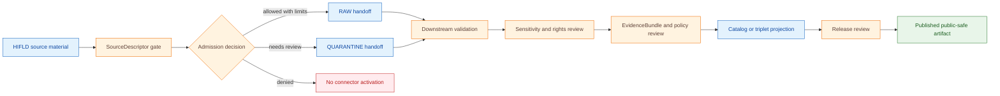

<!-- [KFM_META_BLOCK_V2]
doc_id: kfm://doc/connectors-hifld-readme
title: connectors/hifld/ — HIFLD Connector Coordination Lane
type: readme
version: v0.1
status: draft
owners: OWNER_TBD — Connector steward · Source steward · Infrastructure steward · Hazards steward · Settlements/Infrastructure steward · Roads/Rail/Trade steward · Sensitivity reviewer · Validation steward · Docs steward
created: 2026-06-19
updated: 2026-06-19
policy_label: restricted-doctrine; infrastructure-sensitivity-gated; rights-gated; no-publication
proposed_path: connectors/hifld/README.md
truth_posture: CONFIRMED path exists / PROPOSED connector-family contract / CANONICALITY NEEDS VERIFICATION
related:
  - ../README.md
  - ../../docs/sources/catalog/hifld/README.md
  - ../../docs/sources/catalog/hifld/hifld.md
  - ../../docs/sources/catalog/README.md
  - ../../docs/sources/catalog/RIGHTS-AND-SENSITIVITY-MAP.md
  - ../../docs/domains/hazards/SOURCE_REGISTRY.md
  - ../../docs/domains/settlements-infrastructure/SOURCE_REGISTRY.md
  - ../../docs/domains/roads-rail-trade/SOURCE_REGISTRY.md
  - ../../docs/sources/SOURCE_DESCRIPTOR_STANDARD.md
  - ../../data/registry/sources/
  - ../../data/raw/infrastructure/
  - ../../data/quarantine/infrastructure/
  - ../../data/raw/hazards/
  - ../../data/quarantine/hazards/
  - ../../fixtures/
  - ../../schemas/contracts/v1/source/
  - ../../policy/sensitivity/
  - ../../policy/rights/
  - ../../release/
tags: [kfm, connectors, hifld, infrastructure, source-admission, sensitivity, rights, raw, quarantine, governance]
notes:
  - "This README fills a previously blank connector README for the HIFLD lane."
  - "The HIFLD source-family docs identify the family as PROPOSED beyond Directory Rules §7.3 and ADR-pending; this connector must not claim canonical-family authority until ratified."
  - "HIFLD source material is infrastructure-sensitive; connector output may enter RAW or QUARANTINE handoff only."
  - "Downstream validation, EvidenceBundle closure, catalog/triplet projection, redaction/generalization, release review, publication, correction, and rollback remain outside this folder."
  - "Implementation files, source activation, SourceDescriptor records, fixtures, tests, CI wiring, source inventory, sensitivity transforms, and public-release classes remain NEEDS VERIFICATION."
[/KFM_META_BLOCK_V2] -->

<a id="top"></a>

# HIFLD Connector Coordination Lane

> Coordination surface for HIFLD source-admission work. It is **not** a canonical source-family authority, infrastructure truth store, release path, or publication surface.

<p>
  
  
  
  
  
</p>

> [!IMPORTANT]
> **Status:** `experimental` directory README · **Owner:** `OWNER_TBD`  
> **Path:** `connectors/hifld/README.md`  
> **Truth posture:** `CONFIRMED` file exists · `PROPOSED` connector-family contract · `NEEDS VERIFICATION` canonical implementation home  
> **Boundary:** source-admission coordination only; no public claims, no release decisions, no direct publication.

**Quick jumps:** [Scope](#scope) · [Repo fit](#repo-fit) · [Accepted inputs](#accepted-inputs) · [Exclusions](#exclusions) · [Directory map](#directory-map) · [Evidence ledger](#evidence-ledger) · [Lifecycle diagram](#lifecycle-diagram) · [Admission posture](#admission-posture) · [Validation](#validation) · [Rollback](#rollback) · [Verification backlog](#verification-backlog)

---

## Scope

`connectors/hifld/` is a proposed coordination lane for HIFLD source-admission work.

It may document connector-family boundaries, compatibility routing, source-admission expectations, safe fixture rules, and links to HIFLD source catalog documentation.

It must not become a canonical source-family authority, infrastructure truth store, source descriptor authority, schema authority, policy authority, catalog/triplet authority, proof authority, release authority, pipeline authority, or publication authority.

[Back to top ↑](#top)

---

## Repo fit

| Surface | Role | Status |
|---|---|---:|
| `connectors/hifld/` | Coordination or compatibility surface for HIFLD connector boundaries. | **PROPOSED / NEEDS VERIFICATION** |
| `docs/sources/catalog/hifld/README.md` | Human-facing HIFLD source-family documentation. | **CONFIRMED** |
| `docs/sources/catalog/hifld/hifld.md` | Product-page documentation for HIFLD infrastructure layers. | **CONFIRMED** |
| `data/registry/sources/` | Machine-readable SourceDescriptor home. | **NEEDS VERIFICATION** for HIFLD descriptor presence |
| `data/raw/infrastructure/` | Candidate RAW landing target when source admission is approved. | **PROPOSED / NEEDS VERIFICATION** |
| `data/quarantine/infrastructure/` | Quarantine target for unresolved role, rights, sensitivity, schema, or canonicality questions. | **PROPOSED / NEEDS VERIFICATION** |
| `release/` | Release and publication controls. | **Out of scope for this connector** |

> [!WARNING]
> The HIFLD source-family docs state that HIFLD is not one of the canonical source families enumerated by Directory Rules §7.3 and that canonical-family promotion is ADR-class. Treat this connector as a scaffold or compatibility lane until that decision is resolved.

[Back to top ↑](#top)

---

## Accepted inputs

Material belongs in this connector coordination lane only when it helps maintain or review HIFLD source admission.

Accepted content:

- connector-family README and navigation notes;
- compatibility notes for HIFLD connector placement;
- source-admission expectations for HIFLD-derived material;
- safe fixture rules for connector-local tests;
- pointers to SourceDescriptor homes and source-catalog docs;
- validation expectations for connector output envelopes;
- review checklists for source role, rights, sensitivity, cadence, freshness, redaction/generalization, and release-boundary handling.

Any product-specific implementation should remain bounded by a reviewed SourceDescriptor, steward activation, and policy review before it can write anything beyond RAW or QUARANTINE.

---

## Exclusions

This folder must not contain or imply authority over:

- public release decisions;
- published infrastructure claims;
- precise sensitive-location publication;
- direct writes to `PROCESSED`, `CATALOG`, `TRIPLET`, `PUBLISHED`, proof, receipt, or release stores;
- SourceDescriptor authority records;
- policy or schema authority;
- generated summaries presented as authoritative infrastructure truth;
- source activation without rights, sensitivity, cadence, role, and review checks.

Redirect those responsibilities to the appropriate registry, policy, schema, validation, release, or domain documentation surface.

[Back to top ↑](#top)

---

## Directory map

Current-session evidence confirms this README file. Full child inventory remains **NEEDS VERIFICATION**.

```text
connectors/
└── hifld/
    └── README.md        # CONFIRMED — this coordination README
```

Expected downstream responsibility roots are not connector-owned:

```text
data/registry/sources/        # SourceDescriptor authority; HIFLD descriptor NEEDS VERIFICATION
data/raw/infrastructure/      # PROPOSED raw handoff target
data/quarantine/infrastructure/ # PROPOSED quarantine handoff target
policy/sensitivity/           # sensitivity decisions
policy/rights/                 # rights decisions
release/                       # release decisions
```

[Back to top ↑](#top)

---

## Evidence ledger

| Source | Status | Supports | Limits |
|---|---:|---|---|
| `connectors/hifld/README.md` | **CONFIRMED** | Target file exists and was blank before this update. | Does not prove implementation files, tests, or CI. |
| `docs/sources/catalog/hifld/README.md` | **CONFIRMED** | HIFLD family is draft/PROPOSED beyond Directory Rules §7.3; family promotion is ADR-class; HIFLD is cross-domain and sensitivity-gated. | Does not prove connector implementation maturity or active SourceDescriptor. |
| `docs/sources/catalog/hifld/hifld.md` | **CONFIRMED** | HIFLD product-page scaffold describes infrastructure-layer intake, cross-domain use, and deny-default sensitivity posture. | Does not authorize publication or reveal current source access method. |
| Uploaded KFM Markdown Authoring Agent prompt | **CONFIRMED user-supplied instruction** | README-like docs should include meta block, impact block, repo fit, inputs, exclusions, quick links, diagrams where useful, evidence ledger, verification, and rollback. | Does not prove repo implementation behavior. |
| `connectors/hifld/` child tree | **NEEDS VERIFICATION** | Target path exists. | Child files, tests, package layout, fixtures, and workflows remain unverified. |

---

## Lifecycle diagram

This diagram is doctrine-aligned and implementation-light. It shows responsibility boundaries, not confirmed runtime wiring.



[Back to top ↑](#top)

---

## Admission posture

Expected behavior for HIFLD connector work:

- no live source access unless explicitly enabled and reviewed;
- no source fetch without a SourceDescriptor and activation decision;
- no implicit publication from retrieved source material;
- no conversion of source rows into confirmed infrastructure truth;
- no exposure of precise sensitive infrastructure locations from connector code;
- no loss of source product, publisher, retrieval, rights, vintage, geometry, uncertainty, source role, sensitivity, review, or release-class metadata;
- unclear rights, source role, product scope, canonicality, location sensitivity, or schema drift routes to quarantine or abstention.

---

## Validation

Connector-local validation should check that:

- source metadata is preserved;
- SourceDescriptor references are required for activation;
- product, publisher, rights, citation, retrieval, geometry, uncertainty, source-role, sensitivity, review, and vintage fields are explicit where available;
- malformed or incomplete responses fail closed;
- HIFLD records remain source-admission candidates until downstream validation;
- no connector run writes directly to processed, catalog, triplet, published, proof, receipt, or release stores;
- fixture data is synthetic, minimized, redacted, generalized, or approved for committed use.

Root-level validation, policy-as-code, redaction/generalization, sensitivity review, release review, EvidenceBundle closure, public caveats, and rollback remain outside this connector family.

[Back to top ↑](#top)

---

## Definition of done

This connector-family README is ready for first review when:

- [ ] HIFLD source-family docs are linked and current enough for review.
- [ ] Canonicality decision for HIFLD source family is resolved or tracked by ADR/open question.
- [ ] SourceDescriptor home and HIFLD source ID are verified.
- [ ] Live source access is disabled by default for connector code.
- [ ] Product, publisher, rights, citation, source role, geometry, uncertainty, sensitivity, review, and vintage metadata are preserved in parser output.
- [ ] Connector output is limited to RAW or QUARANTINE handoff.
- [ ] Sensitive infrastructure publication is impossible from connector code.
- [ ] No public claims are created by connector code.
- [ ] Tests cover no-network, malformed, incomplete, rights-unclear, product-scope-unclear, canonicality-unclear, schema-drift, and sensitivity-boundary cases.

---

## Rollback

Rollback is required if this README is used to justify canonical-family promotion, direct publication, source activation, precise sensitive-location exposure, or bypass of `SourceDescriptor`, policy, validation, review, release, or rollback gates.

Rollback target:

```text
commit prior to this file creation/update: SHA_TBD_AFTER_GIT_HISTORY_CHECK
```

Because the file was blank before this update, a safe rollback is to restore the blank placeholder or replace this document with a shorter compatibility-only README until an ADR resolves HIFLD canonicality.

---

## Verification backlog

| Item | Status | Needed evidence |
|---|---:|---|
| Confirm actual HIFLD connector inventory below this path. | **NEEDS VERIFICATION** | Repo tree or mounted workspace. |
| Confirm canonicality of `connectors/hifld/`. | **NEEDS VERIFICATION** | Directory Rules, ADR, migration note, or repo convention. |
| Confirm HIFLD source descriptor home and source ID. | **NEEDS VERIFICATION** | Source registry entry and accepted schema. |
| Confirm source-specific access and parsing scope. | **NEEDS VERIFICATION** | Source steward review and connector implementation. |
| Confirm rights, sensitivity, and release-review posture. | **NEEDS VERIFICATION** | Rights review, sensitivity review, and release review. |
| Confirm redaction/generalization transforms. | **NEEDS VERIFICATION** | Policy decision, transform receipt, and validator output. |
| Confirm fixture strategy and CI wiring. | **NEEDS VERIFICATION** | Fixture registry, workflow files, and test logs. |

---

## Maintainer note

Keep this connector family narrow. HIFLD is infrastructure-sensitive and canonicality-pending; this folder should coordinate source admission without becoming a source registry, infrastructure truth store, release path, or public exposure surface.

[Back to top ↑](#top)
