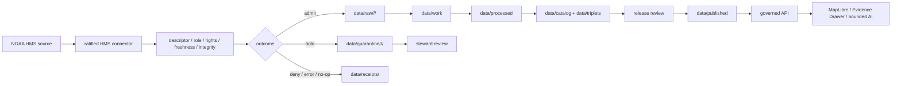

<!-- [KFM_META_BLOCK_V2]
doc_id: kfm://doc/connectors-hms-smoke-readme
title: connectors/hms_smoke/ — NOAA HMS Smoke Compatibility and Reconciliation Lane
type: readme
version: v0.2
status: draft
owners: OWNER_TBD — Connector steward · Source steward · NOAA steward · Hazards steward · Atmosphere/Air steward · Public-safety reviewer · Rights reviewer · Validation steward · Docs steward
created: 2026-06-19
updated: 2026-07-11
policy_label: public-doctrine; compatibility-index; documentation-only; noncanonical-implementation-path; source-family-first; not-alert-authority; not-life-safety; rights-and-sensitivity-gated; no-code; no-descriptor; no-activation; no-publication
related:
  - ../README.md
  - ../hazards/README.md
  - ../noaa/README.md
  - ../noaa-hms-smoke/README.md
  - ../noaa/src/README.md
  - ../noaa/tests/README.md
  - ../../docs/doctrine/directory-rules.md
  - ../../docs/sources/catalog/noaa/hms-fire-smoke.md
  - ../../docs/sources/catalog/noaa/README.md
  - ../../docs/domains/hazards/README.md
  - ../../docs/domains/atmosphere/README.md
  - ../../tools/ingest/firms_hms_watch/README.md
  - ../../pipeline_specs/hazards/noaa_hms_smoke.yaml
  - ../../data/raw/atmosphere/observed/hms/README.md
  - ../../data/registry/sources/
  - ../../data/raw/
  - ../../data/quarantine/
  - ../../data/receipts/
  - ../../data/proofs/
  - ../../policy/rights/
  - ../../policy/sensitivity/
  - ../../release/
tags: [kfm, connectors, hms-smoke, noaa, hms, smoke, fire, atmosphere, hazards, compatibility, source-family-first, analyst-augmented, raw, quarantine, not-life-safety, governance]
notes:
  - "At inspected base commit 39a42953022a4e13e029f9a41faa320e6f9179f1, repository search surfaced only README.md beneath the exact connectors/hms_smoke/ path."
  - "The repository also contains the canonical NOAA family lane connectors/noaa/ and a draft sibling connectors/noaa-hms-smoke/; this underscore path must not become a third implementation authority."
  - "The NOAA source-root README proposes a future hms_smoke product module, but no module, parser, package wiring, executable connector test, source activation, or CI result was verified by this update."
  - "pipeline_specs/hazards/noaa_hms_smoke.yaml is a PROPOSED placeholder, and tools/ingest/firms_hms_watch/ currently documents a proposed watcher boundary rather than a confirmed executable."
  - "HMS is multi-component: fire detections and smoke polygons must remain source-role-separated; smoke density is qualitative and must not become PM2.5, exposure, or KFM alert authority."
[/KFM_META_BLOCK_V2] -->

<a id="top"></a>

# NOAA HMS Smoke Compatibility and Reconciliation Lane

> Documentation-only compatibility surface for the historical underscore path `connectors/hms_smoke/`. It redirects HMS connector work toward one reviewed NOAA source-family implementation home and prevents this path from becoming parallel source, runtime, policy, lifecycle, or publication authority.

<p>
  
  
  
  
  
  
</p>

`connectors/hms_smoke/`

> [!IMPORTANT]
> **Inspected state:** at base commit `39a42953022a4e13e029f9a41faa320e6f9179f1`, repository search surfaced this README as the only file beneath the exact `connectors/hms_smoke/` path. No package metadata, source module, client, parser, fixture, connector-local test, credential configuration, SourceDescriptor, activation record, source payload, watcher executable, lifecycle writer, receipt writer, or passing CI evidence was confirmed beneath this path.

> [!WARNING]
> **KFM is not an alert, exposure, or life-safety authority.** HMS fire detections and smoke polygons may be admitted as source evidence or context only. This path must never issue warnings, recommend evacuation or sheltering, derive PM2.5 or AQI, confirm a ground fire, state that an area is safe, or replace official NOAA, NWS, AirNow, public-health, fire, or emergency-management channels.

> [!CAUTION]
> **Placement rule:** the repository identifies `connectors/noaa/` as the canonical NOAA family lane while also containing `connectors/noaa-hms-smoke/` as a draft sibling. Until an accepted ADR or migration decision resolves the product home, this underscore path is a compatibility and reconciliation surface only. Do not add runtime behavior here.

**Quick jumps:** [Purpose](#purpose) · [Placement decision](#placement-decision) · [Verified repository state](#verified-repository-state) · [Authority boundary](#authority-boundary) · [Product and source-role boundary](#product-and-source-role-boundary) · [Anti-collapse rules](#anti-collapse-rules) · [Metadata and freshness](#metadata-and-freshness) · [Registry, access, and lifecycle](#registry-access-and-lifecycle) · [Cross-domain routing](#cross-domain-routing) · [Migration options](#migration-options) · [Testing and definition of done](#testing-and-definition-of-done) · [Verification backlog](#verification-backlog) · [Review and rollback](#review-and-rollback)

---

## Purpose

This README prevents `connectors/hms_smoke/` from hardening into a third HMS connector implementation home beside the NOAA family lane and the hyphenated HMS sibling.

It may:

- explain why the underscore path exists and how it should be interpreted;
- redirect maintainers to the NOAA source-family lane, HMS product page, draft product sibling, tests, watcher documentation, RAW lane, and governing responsibility roots;
- preserve HMS component-split, source-role, provenance, freshness, rights, uncertainty, and not-life-safety boundaries;
- record path, source-ID, registry, activation, pipeline, watcher, fixture, test, and CI verification gaps;
- support a reviewed migration, deprecation, redirect, backlink, correction, or rollback plan.

It does **not**:

- host connector code, clients, parsers, product dispatch, package metadata, credentials, fixtures, tests, source data, or lifecycle writers;
- choose a canonical HMS product path or source ID while repository evidence remains conflicted;
- activate NOAA HMS access, define endpoint configuration, fetch source material, or assign authoritative source roles;
- close receipts, EvidenceBundles, proofs, catalogs, triplets, releases, corrections, or rollback records;
- publish maps, tiles, PMTiles, reports, dashboards, exports, public API payloads, or AI answers.

[Back to top ↑](#top)

---

## Placement decision

| Question | Current safe decision | Evidence posture |
|---|---|---:|
| Is `connectors/hms_smoke/` a canonical runtime connector lane? | **No.** Treat it as documentation-only compatibility and reconciliation. | The exact path exposes only this README; the NOAA family README identifies `connectors/noaa/` as canonical. |
| Where should HMS source implementation live? | Under one reviewed NOAA family or product lane selected by ADR or migration decision. | `connectors/noaa/` is the family boundary; `connectors/noaa-hms-smoke/` exists as a draft sibling. |
| Does the hyphenated sibling settle placement? | **No.** It is repository-present but self-described as draft and placement-pending. | Presence is not canonicality. |
| Does `connectors/noaa/src/README.md` prove an HMS module exists? | **No.** It proposes a possible `noaa/products/hms_smoke.py` shape and marks implementation depth unverified. | Documentation is not module or runtime proof. |
| May code, tests, fixtures, credentials, or data be added here? | **No, absent an accepted ADR and migration plan.** | A third implementation home would duplicate authority and fragment lineage. |
| Can this decision change? | Yes, through a governed ADR or migration covering code, descriptors, IDs, tests, lifecycle lineage, redirects, deprecation, and rollback. | Reversible change is required. |

Directory presence, a detailed README, a product page, a pipeline placeholder, a watcher plan, or a RAW-lane README proves only that documentation surfaces exist. None proves source activation, parser correctness, policy approval, or publication readiness.

[Back to top ↑](#top)

---

## Verified repository state

```text
connectors/
├── noaa/
│   ├── README.md                         # NOAA family lane
│   ├── src/README.md                     # proposed implementation source-root contract
│   └── tests/README.md                   # no-network connector-test contract
├── noaa-hms-smoke/
│   └── README.md                         # draft HMS product sibling; placement unresolved
├── hms_smoke/
│   └── README.md                         # this compatibility lane; exact search found no other file
└── hazards/
    └── README.md                         # hazards compatibility index; source-family-first rule

pipeline_specs/hazards/noaa_hms_smoke.yaml  # PROPOSED placeholder only
tools/ingest/firms_hms_watch/README.md       # proposed watcher boundary; executable unproved
data/raw/atmosphere/observed/hms/README.md   # RAW-lane contract; payloads unproved
```

| Surface | Status | What it proves | What it does not prove |
|---|---:|---|---|
| `connectors/hms_smoke/README.md` | **CONFIRMED** | This compatibility path exists. | No implementation, activation, tests, or runtime. |
| Additional files under exact path | **UNKNOWN / not observed** | Repository search returned only this README. | Search-bounded absence is not a complete recursive-tree proof. |
| `connectors/noaa/README.md` | **CONFIRMED repository doctrine** | NOAA is organized as a source-family connector lane; products are multi-role. | Does not ratify the final HMS product subpath. |
| `connectors/noaa-hms-smoke/README.md` | **CONFIRMED draft documentation** | A hyphenated HMS product candidate exists and preserves connector boundaries. | Does not prove canonicality or implementation. |
| `connectors/noaa/src/README.md` | **CONFIRMED proposed contract** | A NOAA source-root design exists and names a possible HMS module. | No actual module was verified. |
| `connectors/noaa/tests/README.md` | **CONFIRMED proposed test contract** | No-network and product-specific test expectations exist. | No test files, runner, CI wiring, or passing result was verified. |
| HMS pipeline YAML | **CONFIRMED placeholder** | The file records `status: PROPOSED`. | No executable pipeline or schedule. |
| FIRMS/HMS watcher README | **CONFIRMED draft documentation** | A review-signal-only boundary is described. | No executable, thresholds, cadence, or run evidence. |
| HMS RAW-lane README | **CONFIRMED RAW documentation** | A no-public-path RAW observed-component boundary exists. | No payload, descriptor, receipt, validation, or release evidence. |
| Accepted SourceDescriptor and activation decision | **NEEDS VERIFICATION** | Targeted searches did not surface a ratified record. | Absence is not claimed beyond inspected searches and paths. |
| Live source access, credentials, parser behavior, emitted artifacts, and CI | **UNKNOWN** | None was verified in this update. | No operational claim is justified. |

### Evidence basis

- `connectors/README.md` defines connectors as source-admission implementation roots with bounded lifecycle handoffs.
- `connectors/hazards/README.md` states that hazard-relevant source access is source-family-first and explicitly records NOAA-prefixed versus underscore HMS path drift.
- `connectors/noaa/README.md` identifies the NOAA family lane and requires product-specific source roles.
- `docs/sources/catalog/noaa/hms-fire-smoke.md` documents the multi-component HMS product, analyst-augmentation burden, and dominant anti-collapse rules.
- The NOAA source-root, NOAA tests, HMS pipeline, FIRMS/HMS watcher, and HMS RAW READMEs are design or boundary documents, not implementation proof.

[Back to top ↑](#top)

---

## Authority boundary

This path should remain useful without becoming authoritative.

### It may

1. Redirect product meaning to `docs/sources/catalog/noaa/hms-fire-smoke.md`.
2. Redirect family connector behavior to `connectors/noaa/`.
3. Link to `connectors/noaa-hms-smoke/` while clearly marking its placement unresolved.
4. Point future code and tests toward the ratified NOAA source-root and test-root conventions.
5. Point descriptors and activation state to `data/registry/sources/`.
6. Point captured material to approved RAW or QUARANTINE lanes.
7. Point watcher logic to `tools/` and pipeline specifications to `pipeline_specs/`.
8. Preserve backlinks, deprecation state, correction notes, and rollback instructions during migration.

### It must not own

| Forbidden here | Owning responsibility root or reviewed lane |
|---|---|
| HMS or NOAA source doctrine | `docs/sources/catalog/noaa/` |
| Importable connector code | Ratified path under `connectors/noaa/` or another ADR-approved home |
| SourceDescriptor and activation records | `data/registry/sources/` |
| Source data, payloads, caches, or downloads | Approved `data/raw/` or `data/quarantine/` lanes |
| Rights, sensitivity, life-safety, or release policy | `policy/`, `policy/rights/`, `policy/sensitivity/`, `release/` |
| Normalization, smoke-event construction, or source joins | `pipelines/` and domain packages after admission |
| Schemas and semantic contracts | `schemas/` and `contracts/` |
| Connector tests and fixtures | Ratified test lane and `fixtures/` |
| Watcher executables | `tools/` after placement and review |
| Catalogs, triplets, receipts, proofs, releases, corrections, or rollback | Their owning lifecycle and release roots |
| Public maps, APIs, UI, reports, graphs, search, or AI | Released artifacts and governed interfaces only |
| Credentials, tokens, private URLs, or session material | Never in repository plaintext |

[Back to top ↑](#top)

---

## Product and source-role boundary

The HMS product page documents multiple component types with different epistemic roles. Accepted enum values and field names remain subject to authoritative descriptors and contracts.

| HMS component | Documented default posture | Preserve | Must not become |
|---|---|---|---|
| Fire detection point | Observation of an analyst-confirmed satellite signal | Product, satellite/method fields, acquisition time, geometry, issue context, analyst provenance, uncertainty | Ground-confirmed active fire, ignition cause, containment state, evacuation trigger, or alert |
| Smoke polygon | Modeled or interpretive analyst-drawn boundary | Geometry, start/end time, issue time, density class, source inputs, analyst-pass context, uncertainty, version/file identity | Surface concentration, PM2.5, AQI, exposure, health guidance, or advisory |
| Aggregate or re-projected derivative | Aggregate | Inputs, transform, area/time scope, receipt, digest, limitations | Per-place observation or independent source truth |
| Unresolved admission | Candidate | Original source identity, disposition, quarantine reason, review state | Publishable record |
| Public-safe derivative | Downstream released artifact only | EvidenceBundle, policy decision, review state, release manifest, correction and rollback lineage | Connector output or source truth |

Source-role assignment is fixed at governed admission and may be corrected only through an auditable correction process. This README cannot assign or change it.

[Back to top ↑](#top)

---

## Anti-collapse rules

| Collapse to prevent | Required posture |
|---|---|
| Smoke polygon → smoke is present at ground level | Keep the polygon as visible-plume context with explicit ground-level limitation. |
| Density class → PM2.5 or AQI | Preserve source categories; deny numeric conversion without a separately governed model and receipts. |
| Smoke polygon → exposure or health advice | Deny and refer users to official authorities. |
| Fire point → confirmed active wildfire | Preserve it as a satellite signal with analyst review and uncertainty. |
| Analyst review → independent ground observation | Record exposed review metadata; do not invent analyst identity, method, or internal parameters. |
| HMS source material → KFM alert | Deny warning, evacuation, sheltering, route-safety, medical, or emergency-action language. |
| Successful fetch → current or publishable truth | Require freshness, integrity, role, rights, policy, validation, evidence, review, and release closure. |
| Watcher signal → event confirmation or publication | Keep watcher output review-signal-only. |
| RAW presence → processed or published eligibility | Preserve every governed lifecycle gate. |
| Map, tile, summary, graph, or AI output → sovereign truth | Resolve claims to released evidence or abstain. |

[Back to top ↑](#top)

---

## Metadata and freshness

A ratified HMS connector should preserve, where exposed and accepted by governing contracts:

- source family, product, component type, source surface, file/service identifier, descriptor reference, and original format;
- acquisition/observation time, smoke start/end time, issue/update time, retrieval time, timezone, expiry/review time, and correction/supersession markers;
- fire-point geometry, satellite/method fields, source categories, radiative fields when present, and quality/uncertainty flags;
- smoke geometry, CRS/projection, density class, native field names, geometry validity, and spatial precision;
- content length, component-file identity, checksum/digest, response status, request fingerprint, connector/parser version, and file vintage;
- analyst-augmented pass or issue identifiers actually exposed by the source, without fabricated internal details;
- rights, citation, attribution, permitted use, access class, sensitivity, not-life-safety limitation, and review state;
- domain-routing hints, quarantine reason, finite connector outcome, and correction links.

Freshness rules:

- stale, missing, conflicting, future-dated, timezone-ambiguous, or unsupported timestamps fail closed;
- a successful download does not prove current conditions;
- historical and current products must not be silently mixed;
- geometry, density-distribution, issue-time, file-list, or schema changes are review signals, not automatic truth corrections;
- empty products are not proof of no fire or no smoke;
- source outage, partial response, malformed package, changed projection, or schema drift routes to finite error or quarantine outcomes.

Do not manufacture precision, roles, concentrations, ground confirmation, exposure, or life-safety meaning.

[Back to top ↑](#top)

---

## Registry, access, and lifecycle

A live HMS connector must not run solely because a README, product page, pipeline placeholder, watcher plan, or RAW directory exists.

Before activation, verify:

- canonical connector path, package/import identity, stable source ID, aliases, and component identities;
- accepted SourceDescriptor, activation state, owner, review state, endpoint/access method, cadence, geography, and product scope;
- role mapping for fire points, smoke polygons, aggregates, and unresolved candidates;
- rights, citation, attribution, sensitivity, not-life-safety, and public-use posture;
- bounded requests, timeout, retry, file-list/pagination behavior, rate limits, user agent, and no-network defaults;
- approved RAW and QUARANTINE handoff interfaces;
- receipt, correction, supersession, withdrawal, and rollback expectations.

Access rules:

- no credentials, tokens, cookies, private URLs, or secrets in code, fixtures, logs, screenshots, docs, commits, or PR text;
- no network calls at import time or hidden activation through defaults;
- no unbounded downloads, silent pagination, uncontrolled archive crawling, or automatic fixture refresh;
- no source-side mutation or direct browser access as the normal public path;
- no fallback from a failed governed connector to an ungoverned direct request;
- any future live smoke test is isolated, opt-in, rate-limited, steward-approved, and skipped by default.

This directory performs no fetch and writes no lifecycle data. A ratified flow remains:



```text
RAW -> WORK / QUARANTINE -> PROCESSED -> CATALOG / TRIPLET -> PUBLISHED
```

Promotion is a governed state transition, not a copy, rename, successful fetch, connector return value, watcher signal, commit, PR, or merge.

[Back to top ↑](#top)

---

## Cross-domain routing

HMS supports both Hazards and Atmosphere/Air. Cross-domain use must not cause duplicate capture or duplicate source authority.

1. Capture once under one accepted source identity and connector implementation.
2. Preserve component-level source roles before domain routing.
3. Route lineage-preserving RAW or QUARANTINE candidates to appropriate domain lanes.
4. Keep Hazards and Atmosphere interpretations separate from source admission.
5. Treat FIRMS, HRRR-Smoke, GOES AOD, AirNow, CAP, NWS, monitor, and exposure joins as downstream governed operations with receipts and validation.
6. Do not let a consumer domain silently refetch HMS under a second source ID.
7. Preserve one correction and supersession lineage across every downstream derivative.

[Back to top ↑](#top)

---

## Migration options

Acceptable future resolutions include:

1. **Nested NOAA product lane:** move HMS implementation beneath `connectors/noaa/` and retain sibling READMEs as deprecated redirects.
2. **Hyphenated product sibling:** ratify `connectors/noaa-hms-smoke/` through ADR or migration while keeping `connectors/noaa/` as family authority.
3. **Family source-root module:** implement HMS inside the accepted NOAA package with product-lane docs linking to the module and tests.
4. **Documentation-only compatibility:** keep this underscore path as a redirect until references migrate, then retire it with a deprecation record.
5. **Retirement:** remove parallel siblings after reviewed consolidation while preserving history, backlinks, replacement paths, correction notes, and rollback.

A migration must cover canonical path, import name, SourceDescriptor, IDs and aliases, code, tests, fixtures, pipeline specs, watcher references, RAW links, docs, compatibility redirects, deprecation date, lineage, validation, correction, and rollback.

Do not infer the winner from naming convenience or file count.

[Back to top ↑](#top)

---

## Testing and definition of done

Tests belong in the ratified NOAA connector test lane or repository test authority, not here.

Minimum HMS checks:

- import safety and no-network defaults;
- missing or inactive SourceDescriptor and unresolved source-ID mapping;
- fire-point versus smoke-polygon split;
- qualitative density without numeric concentration conversion;
- analyst provenance without fabricated internal fields;
- valid, empty, malformed, partial, oversized, stale, future-dated, corrected, and changed-schema products;
- missing component files, projection drift, invalid geometry, timezone ambiguity, and duplicate identifiers;
- rights, citation, attribution, sensitivity, and public-use uncertainty;
- bounded timeout, retry, rate-limit, forbidden, not-found, partial-download, and outage behavior;
- RAW versus QUARANTINE handoff;
- refusal to emit PM2.5, AQI, exposure, health, alert, ground-fire, processed, catalog, triplet, proof, release, tile, API, UI, or AI output;
- safe logs, secret redaction, and deterministic fixture behavior.

Fixture rules:

1. Prefer synthetic, minimal, purpose-specific fixtures.
2. Mark fixtures synthetic, minimized, redacted, generalized, or approved.
3. Preserve only fields needed to test component, role, time, geometry, density, rights, and review behavior.
4. Never auto-refresh committed fixtures from live HMS sources.
5. Do not place fixtures beneath `connectors/hms_smoke/`.

### Definition of done

- [x] The exact path and inspected one-file inventory are bounded to a pinned base commit.
- [x] The NOAA family lane, draft hyphenated sibling, proposed source-root, test-root, pipeline placeholder, watcher boundary, and RAW lane are distinguished.
- [x] Stale statements about a previously blank file and an unresolved rollback SHA are removed.
- [x] Fire/smoke separation, analyst provenance, qualitative density, not-PM2.5, not-ground-fire, and not-alert boundaries are preserved.
- [x] This path is explicitly documentation-only and forbidden for runtime implementation.
- [ ] An ADR or migration selects the canonical HMS implementation path.
- [ ] Source ID, SourceDescriptor, activation, access method, rights, cadence, product scope, and component roles are verified.
- [ ] Ratified implementation and tests prove no-network defaults, role preservation, freshness, rights/sensitivity gates, RAW/QUARANTINE-only output, and release blocking.
- [ ] Pipeline and watcher placeholders are implemented with receipts/tests or remain clearly proposed.
- [ ] Backlinks, redirects, deprecation, correction, and rollback are recorded for every affected HMS path.

The exact runner, commands, package manager, live-test flag, and CI workflow remain **NEEDS VERIFICATION**.

[Back to top ↑](#top)

---

## Verification backlog

| Item | Status | Needed evidence |
|---|---:|---|
| Confirm complete child inventory under exact `connectors/hms_smoke/`. | **NEEDS VERIFICATION** | Non-truncated recursive tree at current ref. |
| Select canonical HMS connector path and import name. | **NEEDS VERIFICATION / ADR-class** | Accepted ADR or migration record. |
| Decide whether the hyphenated sibling remains, moves, or redirects. | **NEEDS VERIFICATION** | Migration plan and repository diff. |
| Confirm actual NOAA package and HMS module. | **UNKNOWN** | Package metadata, module files, imports, and tests. |
| Confirm source ID, aliases, SourceDescriptor, and activation state. | **NEEDS VERIFICATION** | Registry record and schema validation. |
| Confirm current source surfaces, formats, endpoint behavior, cadence, limits, and terms. | **NEEDS VERIFICATION** | Source-steward review against current official source documentation. |
| Confirm rights, citation, attribution, reuse, archive, and derived-product rules. | **NEEDS VERIFICATION** | Reviewed rights record and policy decision. |
| Confirm component-role mapping and analyst-pass provenance fields. | **NEEDS VERIFICATION** | Accepted contracts, descriptor, parser tests, and receipt schema. |
| Confirm RAW and QUARANTINE targets for every component and route. | **NEEDS VERIFICATION** | Intake contract and lifecycle configuration. |
| Confirm watcher executable, cadence, thresholds, and receipts. | **UNKNOWN** | Code, tests, config, and run evidence. |
| Confirm pipeline implementation beyond placeholder YAML. | **UNKNOWN** | Pipeline code/spec validation and run evidence. |
| Confirm fixtures, test runner, CI wiring, and passing checks. | **UNKNOWN** | Fixture manifest, package config, workflows, and check results. |
| Confirm correction, withdrawal, supersession, cache invalidation, and rollback. | **NEEDS VERIFICATION** | Release manifests, corrections, and rollback artifacts. |

[Back to top ↑](#top)

---

## Review and rollback

Before merge, rollback means closing the draft pull request and abandoning the scoped branch.

After merge, create a transparent revert of the commit that introduced this v0.2 compatibility contract and rerun applicable documentation validation. Do not rewrite shared history.

Rollback or correction is required if this README is used to justify:

- runtime code, credentials, tests, fixtures, data, pipeline execution, or watcher execution beneath `connectors/hms_smoke/`;
- treating this path or the hyphenated sibling as canonical without an accepted decision;
- source activation without descriptor, rights, source-role, freshness, sensitivity, and steward review;
- collapsing fire detections and smoke polygons;
- converting density to PM2.5, AQI, exposure, health, or advisory claims;
- confirming ground fire from satellite detections alone;
- issuing KFM life-safety guidance;
- bypassing RAW/QUARANTINE, evidence, policy, validation, review, release, correction, or rollback controls;
- direct use of connector, watcher, or RAW material by public API, maps, tiles, reports, graphs, search, vector indexes, or AI.

---

## Maintainer note

Keep this lane narrow and temporary. Its value is preventing ambiguous historical references from becoming parallel authority. HMS can support important smoke and fire context, but its component split, source role, analyst augmentation, time, rights, uncertainty, public-safety limitation, evidence, release, correction, and rollback state must remain visible from admission through every downstream use.

<p align="right"><a href="#top">Back to top</a></p>
