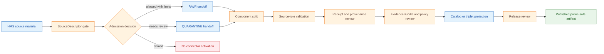

<!-- [KFM_META_BLOCK_V2]
doc_id: kfm://doc/connectors-hms-smoke-readme
title: connectors/hms_smoke/ — NOAA HMS Smoke Connector Lane
type: readme
version: v0.1
status: draft
owners: OWNER_TBD — Connector steward · Source steward · NOAA steward · Hazards steward · Atmosphere/Air steward · Validation steward · Docs steward
created: 2026-06-19
updated: 2026-06-19
policy_label: public-doctrine; not-life-safety; modeled-product; rights-and-sensitivity-gated; no-publication
proposed_path: connectors/hms_smoke/README.md
truth_posture: CONFIRMED path exists / PROPOSED connector-lane contract / CANONICALITY NEEDS VERIFICATION
related:
  - ../README.md
  - ../../docs/sources/catalog/noaa/hms-fire-smoke.md
  - ../../docs/sources/catalog/noaa/hrrr-smoke.md
  - ../../docs/sources/catalog/noaa/goes-abi-aod.md
  - ../../docs/sources/catalog/noaa/README.md
  - ../../docs/domains/hazards/README.md
  - ../../docs/domains/atmosphere/README.md
  - ../../docs/domains/hazards/SOURCE_REGISTRY.md
  - ../../docs/runbooks/atmosphere/SOURCE_REFRESH_RUNBOOK.md
  - ../../data/registry/sources/
  - ../../data/raw/hazards/
  - ../../data/quarantine/hazards/
  - ../../data/raw/atmosphere/
  - ../../data/quarantine/atmosphere/
  - ../../fixtures/
  - ../../schemas/contracts/v1/source/
  - ../../policy/sensitivity/
  - ../../policy/rights/
  - ../../release/
tags: [kfm, connectors, hms-smoke, noaa, hms, smoke, fire, atmosphere, hazards, source-admission, modeled, raw, quarantine, governance]
notes:
  - "This README fills a previously blank connector README for the HMS smoke lane."
  - "The NOAA HMS source-catalog page describes HMS as a multi-component product: fire detection points and smoke polygons must not be collapsed into one source role."
  - "Dominant anti-collapse: HMS smoke polygon is not surface smoke concentration; smoke density class is not PM2.5; HMS is not a KFM-issued alert or public safety surface."
  - "Connector output may enter RAW or QUARANTINE handoff only; downstream validation, receipt closure, EvidenceBundle closure, catalog/triplet projection, release review, publication, correction, and rollback remain outside this folder."
  - "Implementation files, source activation, SourceDescriptor records, fixtures, tests, CI wiring, access method, analyst-pass provenance, and public-release classes remain NEEDS VERIFICATION."
[/KFM_META_BLOCK_V2] -->

<a id="top"></a>

# NOAA HMS Smoke Connector Lane

> Source-admission surface for NOAA HMS smoke context material. It is **not** a public safety, current-conditions, exposure, PM2.5, release, or publication authority.

<p>
  
  
  
  
  
</p>

> [!IMPORTANT]
> **Status:** `experimental` directory README · **Owner:** `OWNER_TBD`  
> **Path:** `connectors/hms_smoke/README.md`  
> **Truth posture:** `CONFIRMED` file exists · `PROPOSED` connector-lane contract · `NEEDS VERIFICATION` canonical implementation home  
> **Boundary:** source-admission only; no public claims, no direct publication, no exposure or public-safety interpretation.

**Quick jumps:** [Scope](#scope) · [Repo fit](#repo-fit) · [Accepted inputs](#accepted-inputs) · [Exclusions](#exclusions) · [Directory map](#directory-map) · [Evidence ledger](#evidence-ledger) · [Lifecycle diagram](#lifecycle-diagram) · [Admission posture](#admission-posture) · [Anti-collapse rules](#anti-collapse-rules) · [Validation](#validation) · [Rollback](#rollback) · [Verification backlog](#verification-backlog)

---

## Scope

`connectors/hms_smoke/` is a proposed connector lane for NOAA HMS smoke-context source admission.

It may contain connector-local documentation, compatibility notes, safe fixture rules, parser expectations, source-admission envelopes, and validation expectations for HMS smoke-shaped material.

It must not become smoke truth, surface-exposure truth, PM2.5 truth, air-quality authority, public safety authority, source descriptor authority, schema authority, policy authority, catalog/triplet authority, proof authority, release authority, pipeline authority, or publication authority.

[Back to top ↑](#top)

---

## Repo fit

| Surface | Role | Status |
|---|---|---:|
| `connectors/hms_smoke/` | Product-specific connector lane for HMS smoke source-admission work. | **PROPOSED / NEEDS VERIFICATION** |
| `docs/sources/catalog/noaa/hms-fire-smoke.md` | Human-facing NOAA HMS Fire and Smoke product page. | **CONFIRMED** |
| `docs/sources/catalog/noaa/README.md` | NOAA source-family documentation. | **CONFIRMED via related source page** |
| `docs/domains/hazards/` | Hazards domain consumer surface. | **CONFIRMED via related source page** |
| `docs/domains/atmosphere/` | Atmosphere/Air domain consumer surface. | **CONFIRMED via related source page** |
| `data/raw/hazards/` and `data/raw/atmosphere/` | Candidate RAW handoff targets. | **PROPOSED / NEEDS VERIFICATION** |
| `data/quarantine/hazards/` and `data/quarantine/atmosphere/` | Quarantine targets for unresolved role, rights, quality, or boundary questions. | **PROPOSED / NEEDS VERIFICATION** |
| `release/` | Release and publication controls. | **Out of scope for this connector** |

> [!NOTE]
> The source page is under the NOAA family. The standalone `connectors/hms_smoke/` path exists, but canonicality remains **NEEDS VERIFICATION** until Directory Rules, an ADR, migration note, or current repo convention confirms whether product-specific connector lanes are canonical.

[Back to top ↑](#top)

---

## Accepted inputs

Material belongs here only when it supports governed HMS smoke source admission.

Accepted content:

- connector README and navigation notes;
- HMS smoke fixture rules;
- parser expectations for HMS smoke polygons and related metadata;
- SourceDescriptor-gate notes;
- receipt and provenance expectations for analyst-augmented material;
- validation notes for source-role separation;
- quarantine criteria for unclear role, rights, time, quality, or source-shape issues.

---

## Exclusions

This folder must not contain or imply authority over:

- public release decisions;
- published smoke, exposure, or air-quality claims;
- PM2.5, AQI, or health interpretation;
- direct writes to `PROCESSED`, `CATALOG`, `TRIPLET`, `PUBLISHED`, proof, receipt, or release stores;
- SourceDescriptor authority records;
- policy or schema authority;
- generated summaries presented as authoritative smoke truth;
- source activation without rights, role, quality, cadence, sensitivity, and review checks.

Redirect those responsibilities to the appropriate source registry, policy, schema, validation, release, or domain documentation surface.

[Back to top ↑](#top)

---

## Directory map

Current-session evidence confirms this README file. Full child inventory remains **NEEDS VERIFICATION**.

```text
connectors/
└── hms_smoke/
    └── README.md        # CONFIRMED — this connector-lane README
```

Expected downstream responsibility roots are not connector-owned:

```text
data/registry/sources/         # SourceDescriptor authority; HMS descriptor NEEDS VERIFICATION
data/raw/hazards/              # PROPOSED raw handoff target
data/quarantine/hazards/       # PROPOSED quarantine handoff target
data/raw/atmosphere/           # PROPOSED raw handoff target
data/quarantine/atmosphere/    # PROPOSED quarantine handoff target
policy/sensitivity/            # sensitivity decisions
policy/rights/                  # rights decisions
release/                        # release decisions
```

[Back to top ↑](#top)

---

## Evidence ledger

| Source | Status | Supports | Limits |
|---|---:|---|---|
| `connectors/hms_smoke/README.md` | **CONFIRMED** | Target file exists and was blank before this update. | Does not prove implementation files, tests, or CI. |
| `docs/sources/catalog/noaa/hms-fire-smoke.md` | **CONFIRMED** | HMS is a NOAA product page; fire detections and smoke polygons are distinct components; smoke polygons are interpretive boundaries; density classes are not concentration measurements; HMS is not a KFM alert surface. | Does not prove connector implementation maturity or current access method. |
| `docs/sources/catalog/noaa/goes-abi-aod.md` | **CONFIRMED related source** | Reinforces atmosphere anti-collapse posture: retrieval/model fields are not PM2.5 or surface observations. | Does not define HMS connector behavior. |
| `connectors/hms_smoke/` child tree | **NEEDS VERIFICATION** | Target path exists. | Child files, tests, package layout, fixtures, and workflows remain unverified. |

---

## Lifecycle diagram

This diagram is doctrine-aligned and implementation-light. It shows responsibility boundaries, not confirmed runtime wiring.



[Back to top ↑](#top)

---

## Admission posture

Expected behavior for HMS smoke connector work:

- no live source access unless explicitly enabled and reviewed;
- no source fetch without a SourceDescriptor and activation decision;
- no implicit publication from retrieved source material;
- no collapse of fire detections and smoke polygons into one source role;
- no conversion of smoke polygons into surface concentration, PM2.5, exposure, or public-advisory claims;
- no loss of source product, issuing family, retrieval, rights, vintage, geometry, density class, uncertainty, source role, analyst-pass provenance, review, or release-class metadata;
- unclear rights, source role, time validity, component identity, density-class meaning, geometry quality, or schema drift routes to quarantine or abstention.

---

## Anti-collapse rules

The source-catalog page identifies the controlling anti-collapse stack:

1. HMS fire detections and HMS smoke polygons are different components and must be role-tagged separately.
2. HMS smoke polygons are interpretive boundaries, not direct surface observations.
3. Smoke density classes are qualitative analyst categories, not concentration measurements.
4. HMS smoke is not PM2.5, AQI, exposure, or public safety guidance.
5. HMS-derived summaries, maps, tiles, model joins, and AI explanations are downstream carriers, not sovereign truth.

---

## Validation

Connector-local validation should check that:

- source metadata is preserved;
- SourceDescriptor references are required for activation;
- fire and smoke components remain separable where present;
- product, issuing family, rights, citation, retrieval, geometry, density class, uncertainty, source-role, analyst-pass provenance, review, and vintage fields are explicit where available;
- malformed or incomplete responses fail closed;
- HMS records remain source-admission candidates until downstream validation;
- no connector run writes directly to processed, catalog, triplet, published, proof, receipt, or release stores;
- fixture data is synthetic, minimized, redacted, generalized, or approved for committed use.

Root-level validation, policy-as-code, receipt closure, EvidenceBundle closure, release review, public caveats, and rollback remain outside this connector.

[Back to top ↑](#top)

---

## Definition of done

This connector-lane README is ready for first review when:

- [ ] HMS source-catalog docs are linked and current enough for review.
- [ ] Canonicality of the `connectors/hms_smoke/` path is confirmed or tracked.
- [ ] SourceDescriptor home and HMS source ID are verified.
- [ ] Live source access is disabled by default for connector code.
- [ ] Component split, source-role preservation, and anti-collapse checks are represented in tests.
- [ ] Product, rights, citation, source role, geometry, density class, uncertainty, analyst-pass provenance, review, and vintage metadata are preserved in parser output.
- [ ] Connector output is limited to RAW or QUARANTINE handoff.
- [ ] No public claims are created by connector code.
- [ ] Tests cover no-network, malformed, incomplete, rights-unclear, role-collapse, component-unclear, time-validity-unclear, schema-drift, and boundary cases.

---

## Rollback

Rollback is required if this README is used to justify direct publication, source activation, role collapse, PM2.5/exposure interpretation, or bypass of `SourceDescriptor`, receipt, policy, validation, review, release, or rollback gates.

Rollback target:

```text
commit prior to this file creation/update: SHA_TBD_AFTER_GIT_HISTORY_CHECK
```

Because the file was blank before this update, a safe rollback is to restore the blank placeholder or replace this document with a shorter compatibility-only README until canonical placement is resolved.

---

## Verification backlog

| Item | Status | Needed evidence |
|---|---:|---|
| Confirm actual HMS connector inventory below this path. | **NEEDS VERIFICATION** | Repo tree or mounted workspace. |
| Confirm canonicality of `connectors/hms_smoke/`. | **NEEDS VERIFICATION** | Directory Rules, ADR, migration note, or repo convention. |
| Confirm HMS source descriptor home and source ID. | **NEEDS VERIFICATION** | Source registry entry and accepted schema. |
| Confirm source access and parsing scope. | **NEEDS VERIFICATION** | Source steward review and connector implementation. |
| Confirm analyst-pass provenance fields. | **NEEDS VERIFICATION** | Source docs, parser tests, and receipt contract review. |
| Confirm rights, sensitivity, and release-review posture. | **NEEDS VERIFICATION** | Rights review, sensitivity review, and release review. |
| Confirm fixture strategy and CI wiring. | **NEEDS VERIFICATION** | Fixture registry, workflow files, and test logs. |

---

## Maintainer note

Keep this connector narrow. HMS smoke material can help create governed smoke context, but this folder must not become a concentration surface, exposure surface, current-conditions service, release path, or public truth surface.

[Back to top ↑](#top)
