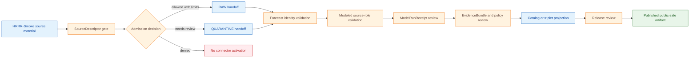

<!-- [KFM_META_BLOCK_V2]
doc_id: kfm://doc/connectors-hrrr-smoke-readme
title: connectors/hrrr_smoke/ — NOAA HRRR-Smoke Connector Lane
type: readme
version: v0.1
status: draft
owners: OWNER_TBD — Connector steward · Source steward · NOAA steward · Atmosphere/Air steward · Hazards steward · Validation steward · Docs steward
created: 2026-06-19
updated: 2026-06-19
policy_label: public-doctrine; modeled-forecast; not-life-safety; rights-and-sensitivity-gated; no-publication
proposed_path: connectors/hrrr_smoke/README.md
truth_posture: CONFIRMED path exists / PROPOSED connector-lane contract / CANONICALITY NEEDS VERIFICATION
related:
  - ../README.md
  - ../../docs/sources/catalog/noaa/hrrr-smoke.md
  - ../../docs/sources/catalog/noaa/hms-fire-smoke.md
  - ../../docs/sources/catalog/noaa/goes-abi-aod.md
  - ../../docs/sources/catalog/noaa/README.md
  - ../../docs/domains/atmosphere/README.md
  - ../../docs/domains/hazards/README.md
  - ../../docs/domains/hazards/SOURCE_REGISTRY.md
  - ../../docs/runbooks/atmosphere/SOURCE_REFRESH_RUNBOOK.md
  - ../../data/registry/sources/
  - ../../data/raw/atmosphere/
  - ../../data/quarantine/atmosphere/
  - ../../data/raw/hazards/
  - ../../data/quarantine/hazards/
  - ../../fixtures/
  - ../../schemas/contracts/v1/source/
  - ../../policy/sensitivity/
  - ../../policy/rights/
  - ../../release/
tags: [kfm, connectors, hrrr-smoke, noaa, hrrr, smoke, forecast, atmosphere, hazards, modeled, source-admission, raw, quarantine, governance]
notes:
  - "This README fills a previously blank connector README for the HRRR-Smoke lane."
  - "The NOAA HRRR-Smoke source-catalog page describes HRRR-Smoke as a numerical weather prediction / modeled forecast product with mandatory ModelRunReceipt discipline."
  - "Dominant anti-collapse: model fields are not observations; modeled surface PM2.5 is not a measured PM2.5 reading; HRRR-Smoke is not a KFM-issued advisory or public safety surface."
  - "Connector output may enter RAW or QUARANTINE handoff only; downstream validation, ModelRunReceipt closure, EvidenceBundle closure, catalog/triplet projection, release review, publication, correction, and rollback remain outside this folder."
  - "Implementation files, source activation, SourceDescriptor records, fixtures, tests, CI wiring, access method, cycle/lead-time identity handling, and public-release classes remain NEEDS VERIFICATION."
[/KFM_META_BLOCK_V2] -->

<a id="top"></a>

# NOAA HRRR-Smoke Connector Lane

> Source-admission surface for NOAA HRRR-Smoke forecast material. It is **not** an observation, measured PM2.5, exposure, public safety, release, or publication authority.

<p>
  
  
  
  
  
</p>

> [!IMPORTANT]
> **Status:** `experimental` directory README · **Owner:** `OWNER_TBD`  
> **Path:** `connectors/hrrr_smoke/README.md`  
> **Truth posture:** `CONFIRMED` file exists · `PROPOSED` connector-lane contract · `NEEDS VERIFICATION` canonical implementation home  
> **Boundary:** source-admission only; no public claims, no direct publication, no measured-concentration or public-safety interpretation.

**Quick jumps:** [Scope](#scope) · [Repo fit](#repo-fit) · [Accepted inputs](#accepted-inputs) · [Exclusions](#exclusions) · [Directory map](#directory-map) · [Evidence ledger](#evidence-ledger) · [Lifecycle diagram](#lifecycle-diagram) · [Admission posture](#admission-posture) · [Anti-collapse rules](#anti-collapse-rules) · [Validation](#validation) · [Rollback](#rollback) · [Verification backlog](#verification-backlog)

---

## Scope

`connectors/hrrr_smoke/` is a proposed connector lane for NOAA HRRR-Smoke forecast source admission.

It may contain connector-local documentation, compatibility notes, safe fixture rules, parser expectations, source-admission envelopes, and validation expectations for HRRR-Smoke-shaped forecast material.

It must not become smoke truth, observed-air-quality truth, measured PM2.5 truth, exposure truth, forecast authority, public safety authority, source descriptor authority, schema authority, policy authority, catalog/triplet authority, proof authority, release authority, pipeline authority, or publication authority.

[Back to top ↑](#top)

---

## Repo fit

| Surface | Role | Status |
|---|---|---:|
| `connectors/hrrr_smoke/` | Product-specific connector lane for HRRR-Smoke source-admission work. | **PROPOSED / NEEDS VERIFICATION** |
| `docs/sources/catalog/noaa/hrrr-smoke.md` | Human-facing NOAA HRRR-Smoke product page. | **CONFIRMED** |
| `docs/sources/catalog/noaa/README.md` | NOAA source-family documentation. | **CONFIRMED via related source page** |
| `docs/domains/atmosphere/` | Atmosphere/Air domain consumer surface. | **CONFIRMED via related source page** |
| `docs/domains/hazards/` | Hazards-adjacent consumer surface. | **CONFIRMED via related source page** |
| `data/raw/atmosphere/` and `data/raw/hazards/` | Candidate RAW handoff targets. | **PROPOSED / NEEDS VERIFICATION** |
| `data/quarantine/atmosphere/` and `data/quarantine/hazards/` | Quarantine targets for unresolved role, rights, forecast identity, quality, or boundary questions. | **PROPOSED / NEEDS VERIFICATION** |
| `release/` | Release and publication controls. | **Out of scope for this connector** |

> [!NOTE]
> The source page is under the NOAA family. The standalone `connectors/hrrr_smoke/` path exists, but canonicality remains **NEEDS VERIFICATION** until Directory Rules, an ADR, migration note, or current repo convention confirms whether product-specific connector lanes are canonical.

[Back to top ↑](#top)

---

## Accepted inputs

Material belongs here only when it supports governed HRRR-Smoke source admission.

Accepted content:

- connector README and navigation notes;
- HRRR-Smoke fixture rules;
- parser expectations for forecast cycle, lead time, valid time, model version, projection, and variable metadata;
- SourceDescriptor-gate notes;
- ModelRunReceipt and provenance expectations;
- validation notes for modeled source-role preservation;
- quarantine criteria for unclear role, rights, forecast identity, quality, or source-shape issues.

---

## Exclusions

This folder must not contain or imply authority over:

- public release decisions;
- published smoke, exposure, or air-quality claims;
- measured PM2.5 or AQI claims;
- direct writes to `PROCESSED`, `CATALOG`, `TRIPLET`, `PUBLISHED`, proof, receipt, or release stores;
- SourceDescriptor authority records;
- policy or schema authority;
- generated summaries presented as authoritative forecast or condition truth;
- source activation without rights, role, quality, cadence, sensitivity, and review checks.

Redirect those responsibilities to the appropriate source registry, policy, schema, validation, release, or domain documentation surface.

[Back to top ↑](#top)

---

## Directory map

Current-session evidence confirms this README file. Full child inventory remains **NEEDS VERIFICATION**.

```text
connectors/
└── hrrr_smoke/
    └── README.md        # CONFIRMED — this connector-lane README
```

Expected downstream responsibility roots are not connector-owned:

```text
data/registry/sources/         # SourceDescriptor authority; HRRR-Smoke descriptor NEEDS VERIFICATION
data/raw/atmosphere/           # PROPOSED raw handoff target
data/quarantine/atmosphere/    # PROPOSED quarantine handoff target
data/raw/hazards/              # PROPOSED raw handoff target
data/quarantine/hazards/       # PROPOSED quarantine handoff target
policy/sensitivity/            # sensitivity decisions
policy/rights/                  # rights decisions
release/                        # release decisions
```

[Back to top ↑](#top)

---

## Evidence ledger

| Source | Status | Supports | Limits |
|---|---:|---|---|
| `connectors/hrrr_smoke/README.md` | **CONFIRMED** | Target file exists and was blank before this update. | Does not prove implementation files, tests, or CI. |
| `docs/sources/catalog/noaa/hrrr-smoke.md` | **CONFIRMED** | HRRR-Smoke is a modeled forecast product; default source role is modeled; ModelRunReceipt is mandatory; forecast cycle and lead time are identity-bearing; model fields are not observations. | Does not prove connector implementation maturity or current access method. |
| `docs/sources/catalog/noaa/hms-fire-smoke.md` | **CONFIRMED related source** | Distinguishes analyst smoke context from modeled forecast smoke and reinforces anti-collapse discipline. | Does not define HRRR-Smoke connector behavior. |
| `docs/sources/catalog/noaa/goes-abi-aod.md` | **CONFIRMED related source** | Reinforces atmosphere anti-collapse posture for model/retrieval fields and PM2.5. | Does not define HRRR-Smoke connector behavior. |
| `connectors/hrrr_smoke/` child tree | **NEEDS VERIFICATION** | Target path exists. | Child files, tests, package layout, fixtures, and workflows remain unverified. |

---

## Lifecycle diagram

This diagram is doctrine-aligned and implementation-light. It shows responsibility boundaries, not confirmed runtime wiring.



[Back to top ↑](#top)

---

## Admission posture

Expected behavior for HRRR-Smoke connector work:

- no live source access unless explicitly enabled and reviewed;
- no source fetch without a SourceDescriptor and activation decision;
- no implicit publication from retrieved source material;
- no relabeling of modeled forecast fields as observations;
- no conversion of modeled PM2.5-like fields into measured PM2.5 readings, exposure findings, or public-advisory claims;
- no overwriting of forecast cycles or lead times as if they were interchangeable;
- no loss of source product, issuing family, retrieval, rights, model version, forecast cycle, lead time, valid time, geometry, uncertainty, source role, receipt, review, or release-class metadata;
- unclear rights, source role, forecast identity, model version, validity time, quality, geometry, or schema drift routes to quarantine or abstention.

---

## Anti-collapse rules

The source-catalog page identifies the controlling anti-collapse stack:

1. HRRR-Smoke is a modeled forecast, not an observation.
2. Forecast surface PM2.5-like fields are not measured PM2.5 readings.
3. Forecast cycle, lead time, and valid time are identity-bearing; cycles must not silently overwrite one another.
4. HRRR-Smoke is not HMS smoke detection and must not be re-tagged as observed smoke plume geometry.
5. HRRR-Smoke-derived summaries, maps, tiles, model joins, and AI explanations are downstream carriers, not sovereign truth.

---

## Validation

Connector-local validation should check that:

- source metadata is preserved;
- SourceDescriptor references are required for activation;
- forecast cycle, lead time, valid time, and model version are preserved as identity-bearing fields;
- product, issuing family, rights, citation, retrieval, geometry, uncertainty, source-role, ModelRunReceipt reference, review, and vintage fields are explicit where available;
- malformed or incomplete responses fail closed;
- HRRR-Smoke records remain source-admission candidates until downstream validation;
- no connector run writes directly to processed, catalog, triplet, published, proof, receipt, or release stores;
- fixture data is synthetic, minimized, redacted, generalized, or approved for committed use.

Root-level validation, policy-as-code, ModelRunReceipt closure, EvidenceBundle closure, release review, public caveats, and rollback remain outside this connector.

[Back to top ↑](#top)

---

## Definition of done

This connector-lane README is ready for first review when:

- [ ] HRRR-Smoke source-catalog docs are linked and current enough for review.
- [ ] Canonicality of the `connectors/hrrr_smoke/` path is confirmed or tracked.
- [ ] SourceDescriptor home and HRRR-Smoke source ID are verified.
- [ ] Live source access is disabled by default for connector code.
- [ ] Forecast cycle, lead time, valid time, model version, modeled source role, and anti-collapse checks are represented in tests.
- [ ] Product, rights, citation, source role, geometry, uncertainty, ModelRunReceipt reference, review, and vintage metadata are preserved in parser output.
- [ ] Connector output is limited to RAW or QUARANTINE handoff.
- [ ] No public claims are created by connector code.
- [ ] Tests cover no-network, malformed, incomplete, rights-unclear, model-as-observed, forecast-identity-unclear, cross-cycle-overwrite, time-validity-unclear, schema-drift, and boundary cases.

---

## Rollback

Rollback is required if this README is used to justify direct publication, source activation, model-as-observation relabeling, measured PM2.5/exposure interpretation, cross-cycle overwrite, or bypass of `SourceDescriptor`, ModelRunReceipt, policy, validation, review, release, or rollback gates.

Rollback target:

```text
commit prior to this file creation/update: SHA_TBD_AFTER_GIT_HISTORY_CHECK
```

Because the file was blank before this update, a safe rollback is to restore the blank placeholder or replace this document with a shorter compatibility-only README until canonical placement is resolved.

---

## Verification backlog

| Item | Status | Needed evidence |
|---|---:|---|
| Confirm actual HRRR-Smoke connector inventory below this path. | **NEEDS VERIFICATION** | Repo tree or mounted workspace. |
| Confirm canonicality of `connectors/hrrr_smoke/`. | **NEEDS VERIFICATION** | Directory Rules, ADR, migration note, or repo convention. |
| Confirm HRRR-Smoke source descriptor home and source ID. | **NEEDS VERIFICATION** | Source registry entry and accepted schema. |
| Confirm source access and parsing scope. | **NEEDS VERIFICATION** | Source steward review and connector implementation. |
| Confirm forecast-cycle and lead-time identity handling. | **NEEDS VERIFICATION** | Parser tests, identity contract, and receipt contract review. |
| Confirm rights, sensitivity, and release-review posture. | **NEEDS VERIFICATION** | Rights review, sensitivity review, and release review. |
| Confirm fixture strategy and CI wiring. | **NEEDS VERIFICATION** | Fixture registry, workflow files, and test logs. |

---

## Maintainer note

Keep this connector narrow. HRRR-Smoke material can support governed forecast context, but this folder must not become an observation surface, measured-concentration surface, exposure surface, current-conditions service, release path, or public truth surface.

[Back to top ↑](#top)
