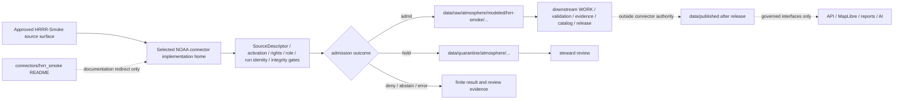

<!-- [KFM_META_BLOCK_V2]
doc_id: kfm://doc/connectors-hrrr-smoke-readme
title: connectors/hrrr_smoke/ — NOAA HRRR-Smoke Compatibility and Reconciliation Lane
type: readme
version: v0.2
status: draft
owners: OWNER_TBD — Connector steward · Source steward · NOAA steward · Atmosphere/Air steward · Hazards steward · Public-safety reviewer · Rights reviewer · Validation steward · Docs steward
created: 2026-06-19
updated: 2026-07-11
policy_label: public-doctrine; compatibility-index; documentation-only; noncanonical-implementation-path; source-family-first; modeled-forecast; not-observation; not-alert-authority; not-life-safety; rights-and-sensitivity-gated; no-code; no-descriptor; no-activation; no-publication
related:
  - ../README.md
  - ../hazards/README.md
  - ../noaa/README.md
  - ../noaa/src/README.md
  - ../noaa/tests/README.md
  - ../../docs/doctrine/directory-rules.md
  - ../../docs/sources/catalog/noaa/README.md
  - ../../docs/sources/catalog/noaa/hrrr-smoke.md
  - ../../docs/architecture/smoke-atmosphere-hazards.md
  - ../../docs/architecture/source-roles.md
  - ../../docs/domains/atmosphere/README.md
  - ../../docs/domains/atmosphere/CANONICAL_PATHS.md
  - ../../docs/domains/hazards/README.md
  - ../../data/registry/sources/atmosphere/README.md
  - ../../data/raw/atmosphere/modeled/hrrr-smoke/README.md
  - ../../data/raw/
  - ../../data/quarantine/
  - ../../data/receipts/
  - ../../data/proofs/
  - ../../policy/rights/
  - ../../policy/sensitivity/
  - ../../release/
tags: [kfm, connectors, hrrr-smoke, noaa, forecast, numerical-model, modeled, atmosphere, hazards, compatibility, source-family-first, model-run, forecast-cycle, lead-time, raw, quarantine, not-life-safety, governance]
notes:
  - "At inspected base commit 56fd8294cd8fd40f7d549fb57d88e4b56bf0eedc, the target README existed; exact-path search surfaced no other child file, and direct probes for pyproject.toml, src/README.md, and tests/README.md returned not found. Absence is bounded to those inspected searches and paths."
  - "Directory Rules places source-specific fetch and admission work under connectors/ and enumerates noaa/ in the source-family spine; the repository's NOAA parent README identifies connectors/noaa/ as the canonical family lane."
  - "No separate connectors/noaa-hrrr-smoke/ sibling or exact-named hrrr_smoke/hrrr-smoke pipeline specification surfaced in the inspected searches; this does not prove that no differently named implementation exists elsewhere."
  - "The NOAA source-root README proposes a possible noaa/products/hrrr_smoke.py module, but no module, parser, package wiring, executable connector test, source activation, payload, or runtime result was verified by this update."
  - "HRRR-Smoke is a modeled forecast: model fields are not observations; modeled PM2.5-like fields are not measured PM2.5; cycle, lead time, valid time, and model/physics version are identity-bearing; KFM is not an alert authority."
[/KFM_META_BLOCK_V2] -->

<a id="top"></a>

# NOAA HRRR-Smoke Compatibility and Reconciliation Lane

> Documentation-only compatibility surface for the historical underscore path `connectors/hrrr_smoke/`. It preserves HRRR-Smoke source-admission safeguards while directing any future runtime implementation toward one reviewed NOAA source-family home.

<p>
  
  
  
  
  
  
  
</p>

`connectors/hrrr_smoke/`

> [!IMPORTANT]
> **Inspected state:** at base commit `56fd8294cd8fd40f7d549fb57d88e4b56bf0eedc`, the target README existed. Repository search surfaced no other file beneath the exact `connectors/hrrr_smoke/` path, and direct reads of `pyproject.toml`, `src/README.md`, and `tests/README.md` at that path returned `Not Found`. This is a bounded inspection result, not proof that no differently named HRRR implementation exists elsewhere in the repository.

> [!WARNING]
> **HRRR-Smoke is modeled forecast context, not an observation or life-safety product.** This path must never present a model field as a measured PM2.5 reading, current ground condition, exposure determination, AQI value, health conclusion, emergency warning, evacuation recommendation, or official advisory. Public users must be directed to appropriate official monitoring, forecast, public-health, fire, and emergency-management channels.

> [!CAUTION]
> **Placement rule:** Directory Rules identify `connectors/` as source-specific fetch/admission code and enumerate `connectors/noaa/` in the source-family spine. The repository's NOAA parent README identifies that family lane as canonical, while Atmosphere path documentation leaves the exact product-lane convention unresolved. Until an accepted ADR or migration record selects an HRRR-Smoke implementation home, this underscore path is documentation-only. Do not add runtime behavior here.

**Quick jumps:** [Purpose](#purpose) · [Placement decision](#placement-decision) · [Verified repository state](#verified-repository-state) · [Authority boundary](#authority-boundary) · [Product and source-role boundary](#product-and-source-role-boundary) · [Forecast identity and time](#forecast-identity-and-time) · [Metadata and provenance](#metadata-and-provenance) · [Registry, access, and lifecycle](#registry-access-and-lifecycle) · [Anti-collapse rules](#anti-collapse-rules) · [Cross-domain routing](#cross-domain-routing) · [Migration options](#migration-options) · [Testing and definition of done](#testing-and-definition-of-done) · [Verification backlog](#verification-backlog) · [Review and rollback](#review-and-rollback)

---

## Purpose

This README prevents `connectors/hrrr_smoke/` from hardening into a parallel HRRR-Smoke runtime authority outside the canonical NOAA source-family boundary.

It may:

- explain how the historical underscore path should be interpreted;
- redirect maintainers toward the NOAA family lane, product documentation, test guidance, source registry, modeled RAW lane, and owning governance roots;
- preserve source-role, forecast-identity, temporal, provenance, rights, uncertainty, freshness, and not-life-safety rules;
- record path, source-ID, descriptor, activation, access, parser, pipeline, fixture, test, CI, correction, and rollback gaps;
- support a reviewed migration, deprecation, redirect, backlink, or retirement plan.

It does **not**:

- host connector code, clients, parsers, product dispatch, package metadata, credentials, fixtures, tests, source payloads, caches, watchers, pipeline logic, or lifecycle writers;
- choose a canonical product module, import path, source ID, endpoint, file format, or activation state while evidence remains incomplete;
- contact NOAA, activate a source, download a product, normalize a grid, derive a concentration, or assign release status;
- own `SourceDescriptor`, model-run receipt, policy, schema, EvidenceBundle, catalog, triplet, proof, release, correction, or rollback authority;
- publish maps, tiles, PMTiles, COGs, reports, dashboards, exports, public API payloads, alerts, or AI answers.

[Back to top ↑](#top)

---

## Placement decision

| Question | Current safe decision | Evidence posture |
|---|---|---:|
| Is `connectors/hrrr_smoke/` a canonical runtime connector lane? | **No.** Treat it as documentation-only compatibility and reconciliation. | Exact-path inspection surfaced this README and no verified implementation surface. |
| What is the owning responsibility root? | `connectors/` for source-specific fetch/admission behavior. | **CONFIRMED** by Directory Rules. |
| What is the owning source-family boundary? | The NOAA family under `connectors/noaa/`. | **CONFIRMED repository documentation**; exact product implementation path remains unresolved. |
| Does the absence of a `connectors/noaa-hrrr-smoke/` sibling make the underscore path canonical? | **No.** Absence of one candidate path does not ratify another. | Canonicality requires doctrine, ADR/migration, and implementation evidence. |
| Does `connectors/noaa/src/README.md` prove an HRRR-Smoke module exists? | **No.** It proposes `noaa/products/hrrr_smoke.py` as a possible future shape. | Documentation is not package, module, import, test, or runtime proof. |
| May code, tests, fixtures, credentials, or data be added here now? | **No, absent an accepted placement and migration decision.** | Parallel implementation would fragment source identity and lineage. |
| Can the decision change? | Yes, through a governed ADR or migration record covering ownership, source IDs, code, tests, data lineage, redirects, deprecation, correction, and rollback. | Reversible change is required. |

The current strongest placement evidence favors one NOAA family implementation. It does **not** settle whether the final product boundary is a module under `connectors/noaa/src/`, a nested product lane under `connectors/noaa/`, or another reviewed source-family structure.

[Back to top ↑](#top)

---

## Verified repository state

The following snapshot is bounded to the pinned base commit and inspected paths:

```text
connectors/
├── noaa/
│   ├── README.md                         # NOAA connector-family boundary
│   ├── src/README.md                     # proposed implementation source-root contract
│   └── tests/README.md                   # no-network connector-test contract
├── hrrr_smoke/
│   └── README.md                         # this compatibility lane; only exact-path file observed
└── hazards/README.md                     # source-family-first compatibility guidance

docs/sources/catalog/noaa/hrrr-smoke.md  # HRRR-Smoke product doctrine
docs/architecture/smoke-atmosphere-hazards.md
                                            # Atmosphere ↔ Hazards source-role seam
data/registry/sources/atmosphere/README.md
                                            # registry routing boundary; descriptor payloads unverified
data/raw/atmosphere/modeled/hrrr-smoke/README.md
                                            # modeled RAW boundary; payload presence unverified
```

| Surface | Status | What it supports | What it does not prove |
|---|---:|---|---|
| `connectors/hrrr_smoke/README.md` | **CONFIRMED** | The requested path and README exist. | Runtime implementation, canonicality, activation, or data. |
| `connectors/hrrr_smoke/pyproject.toml` | **Not found in direct probe** | No package metadata was observed at this exact common path. | No differently named package exists elsewhere. |
| `connectors/hrrr_smoke/src/README.md` | **Not found in direct probe** | No documented source subtree was observed at this exact common path. | No differently structured source tree exists elsewhere. |
| `connectors/hrrr_smoke/tests/README.md` | **Not found in direct probe** | No documented local tests subtree was observed at this exact common path. | No NOAA-family or repository tests cover HRRR-Smoke. |
| `connectors/noaa/README.md` | **CONFIRMED** | NOAA is documented as the canonical connector family and HRRR-Smoke as a product lane needing verification. | A concrete HRRR client/parser exists. |
| `connectors/noaa/src/README.md` | **CONFIRMED documentation** | A possible future `hrrr_smoke.py` product module and import-safe family structure are proposed. | The module, packaging, imports, endpoints, or parser exist. |
| `connectors/noaa/tests/README.md` | **CONFIRMED documentation** | No-network, descriptor, role, freshness, public-safety, and RAW/QUARANTINE test expectations are documented. | Executable tests or passing CI exist for HRRR-Smoke. |
| `docs/sources/catalog/noaa/hrrr-smoke.md` | **CONFIRMED draft product page** | Modeled source role, ModelRunReceipt burden, time/identity distinctions, and anti-collapse doctrine. | Current source access, terms, cadence, variables, or implementation. |
| `data/raw/atmosphere/modeled/hrrr-smoke/README.md` | **CONFIRMED RAW boundary documentation** | Modeled RAW placement, no-public-path rule, cycle/lead preservation, and downstream gate expectations. | A payload, run, descriptor, receipt, or validator exists. |
| `data/registry/sources/atmosphere/README.md` | **CONFIRMED registry boundary documentation** | Atmosphere descriptor routing and source-role controls. | A concrete HRRR-Smoke `SourceDescriptor` or activation decision exists. |
| Exact-named HRRR pipeline specification | **Not surfaced in inspected searches** | No `hrrr_smoke.yaml` or `hrrr-smoke.yaml` result was observed. | No differently named or differently placed pipeline specification exists. |
| Live source activation, payloads, receipts, emitted artifacts, runtime behavior | **UNKNOWN** | No evidence inspected. | Nothing should be inferred. |

[Back to top ↑](#top)

---

## Authority boundary

```text
THIS LANE MAY:
  document compatibility and placement status
  preserve HRRR-Smoke source-role and forecast-identity rules
  redirect maintainers to owning responsibility roots
  record verification gaps and migration requirements
  preserve correction, deprecation, and rollback guidance

THIS LANE MUST NOT:
  contain a source client, parser, package, credentials, fixtures, tests, or data
  define or activate a SourceDescriptor
  decide endpoints, cadence, product allowlists, variables, or rights
  relabel a modeled field as an observation
  overwrite forecast cycles or hide valid-time distinctions
  emit measured PM2.5, AQI, exposure, health, advisory, or life-safety claims
  write RAW, QUARANTINE, WORK, PROCESSED, CATALOG, TRIPLET, PUBLISHED,
  receipt, proof, registry, or release stores
  create public API, map, tile, report, graph, search, vector-index, or AI output
  bypass evidence, policy, validation, review, correction, or rollback gates
```

The KFM lifecycle remains:

```text
RAW -> WORK / QUARANTINE -> PROCESSED -> CATALOG / TRIPLET -> PUBLISHED
```

A successful source contact or file download would prove only that material was retrieved. It would not prove model quality, observational truth, measured concentration, evidence closure, policy approval, release, freshness, current conditions, or publication eligibility.

[Back to top ↑](#top)

---

## Product and source-role boundary

HRRR-Smoke is documented as a numerical-model forecast product. Its output must remain distinct from observations, retrievals, analyst products, aggregates, and official advisories.

| Material | Required source-role posture | Connector implication |
|---|---|---|
| HRRR-Smoke model field | `modeled` | Preserve run, cycle, lead, valid time, variable, grid, version, uncertainty/caveats, and source identity. |
| Lead-time zero / analysis-hour field | `modeled` | Do not relabel as observation merely because lead time is zero. |
| Spatial or temporal rollup | `aggregate` with an aggregation receipt | Preserve input modeled refs, geometry/time scope, and method; do not silently retain point/grid semantics. |
| Unreviewed or incomplete admission | `candidate` / quarantine | Publication is forbidden until disposition is resolved. |
| Ground or regulatory monitor reading | `observed` or `regulatory`, owned by its source lane | Never derive this role from HRRR-Smoke output. |
| HMS smoke polygon | analyst-augmented detection/context, owned by the HMS lane | Do not relabel HRRR forecast geometry as HMS-observed plume geometry. |
| GOES/ABI AOD or another satellite retrieval | retrieval/model-derived context, owned by its source lane | Do not collapse retrieval and forecast semantics. |
| Official advisory, warning, or AQI report | official-source context, owned by the issuing source and downstream domain | HRRR-Smoke does not become advisory authority. |
| Tutorial or synthetic HRRR-shaped fixture | `synthetic` / test-only | Carry a reality-boundary note and prevent lifecycle promotion. |

A validation match between a forecast and observations does not convert the forecast into an observation. It may support a validation record, model-evaluation artifact, or uncertainty statement while the source role remains `modeled`.

[Back to top ↑](#top)

---

## Forecast identity and time

Forecast identity is multi-dimensional. A single generic timestamp is insufficient.

| Dimension | Meaning | Required posture |
|---|---|---|
| Cycle / run time | When the model run was initialized or issued. | Preserve exactly as source-provided; do not infer from retrieval time. |
| Lead time / forecast hour | Offset from the cycle to the forecast validity. | Preserve units and sign; do not collapse distinct steps. |
| Valid time or interval | The time for which the forecast applies. | Keep distinct from cycle and retrieval; preserve interval semantics when present. |
| Retrieval time | When KFM obtained or referenced the product. | Never substitute for cycle or valid time. |
| Model / physics version | Version of the operational model or physics/configuration exposed by the source. | Identity-bearing when available; absent values remain missing, not invented. |
| Product / variable / level | Which forecast quantity and vertical/support context the asset carries. | Preserve native identifiers, units, and qualifiers. |
| Grid / projection / support | Spatial grid, CRS/projection, cell support, extent, and resolution. | Preserve source metadata and transformation lineage. |
| Correction / reissue / supersession | Source-side or KFM-side replacement relationship. | Create a new version or identity with explicit lineage; do not overwrite history in place. |

A **PROPOSED** deterministic identity basis, pending accepted contracts, is:

```text
source_id
+ product_id
+ model_or_physics_version
+ cycle_time
+ lead_time
+ variable
+ level_or_support
+ grid_id
+ source_content_digest
```

Identity rules:

1. Two cycles forecasting the same valid time are two distinct artifacts.
2. Two lead times from the same cycle are distinct unless the accepted product contract explicitly groups them without losing step identity.
3. A version or physics-suite change produces a new artifact lineage.
4. A correction or reissue must link to the prior artifact; it must not erase the as-issued forecast.
5. A public-facing “current” representation requires explicit freshness and valid-time evaluation downstream. When currentness cannot be established, return stale/abstain behavior rather than guessing.
6. A cycle, valid time, lead time, or version absent from source metadata must remain `UNKNOWN` or route to quarantine; connector code must not fabricate it from filenames unless a reviewed parser contract authorizes that derivation and records its basis.

[Back to top ↑](#top)

---

## Metadata and provenance

A future accepted connector should preserve source-native meaning before any downstream normalization.

| Metadata family | Preserve when available | Failure posture |
|---|---|---|
| Source identity | SourceDescriptor ref, source ID and aliases, publisher/operational steward, product family, source surface | Quarantine or deny when identity/activation is unresolved. |
| Request or download | Public source URL or item identifier, request fingerprint, response status, retrieval time, file/object identity | Do not log credentials, signed URLs, private query material, or oversized payload excerpts. |
| Model run | Model/product ID, cycle, run ID, exposed model/physics version, source-provided configuration identifiers | Missing load-bearing run identity routes to quarantine or abstention. |
| Forecast time | Lead time, valid time or interval, issue/update time, retrieval time, correction/supersession state | No timestamp collapse. |
| Variable semantics | Native variable name/code, level, units, accumulation/average semantics, qualifiers, missing-value conventions | Unknown units or support block interpretation and promotion. |
| Spatial support | Grid/projection/CRS, resolution, cell support, extent, geometry/raster metadata, transformation refs | Invalid or unknown support routes to review. |
| Quality and uncertainty | Source quality flags, missing-data flags, caveats, validation refs, uncertainty fields where exposed | Do not invent confidence or claim validation not supplied. |
| Integrity | Size, checksum/content digest, component-file manifest, archive/object version, connector version | Integrity failure routes to error/quarantine. |
| Rights and citation | Terms URL/ref, attribution/citation, redistribution posture, review state | Unclear rights fail closed. |
| Source role and domain routing | `modeled`, Atmosphere primary route, Hazards adjacency hint, aggregate/candidate disposition | Do not mutate role during routing. |
| Review and lifecycle | Admission outcome, quarantine reason, reviewer/steward refs, downstream receipt refs where accepted | Retrieval success is not evidence or release closure. |

### ModelRunReceipt boundary

The product doctrine requires `ModelRunReceipt` discipline. A connector may preserve or emit the source metadata needed to construct or resolve that receipt under accepted contracts. It must not fabricate unavailable model internals, analyst decisions, validation results, emissions inventories, boundary conditions, physics flags, uncertainty surfaces, or operational parameters.

If the accepted receipt contract requires information the source does not expose, the correct behavior is one of:

- preserve an explicit missing/unknown field and narrow the supported claim;
- quarantine for steward review;
- abstain from downstream interpretation;
- deny activation or promotion when the missing information is mandatory.

Receipt storage and closure belong to their owning receipt/evidence workflows, not to this compatibility README.

[Back to top ↑](#top)

---

## Registry, access, and lifecycle

Before any live source interaction, a ratified implementation must verify:

- canonical connector path and import/package identity;
- stable source ID and aliases;
- concrete `SourceDescriptor` and activation state;
- source role, product allowlist, geography/grid scope, cycle/lead scope, and variable allowlist;
- current access surface, endpoint behavior, formats, cadence, retention, correction behavior, and limits;
- rights, attribution, redistribution, archive, and derived-product posture;
- sensitivity and not-life-safety obligations;
- approved RAW and QUARANTINE handoff interfaces;
- network permission, timeout, retry, rate-limit, caching, and no-network test policy;
- credential handling outside the repository when credentials are ever required.

Expected access posture for an accepted implementation:

- network disabled unless an explicit runtime action enables it;
- imports and tests make no live calls;
- product-, cycle-, lead-, variable-, geography-, and size-bounded requests;
- finite timeouts and retries with no unbounded loops;
- explicit handling for forbidden, not-found, rate-limited, partial, stale, changed-format, and outage responses;
- no committed credentials, cookies, private URLs, signed URLs, bulk restricted extracts, or source payloads in logs and pull-request text;
- no implicit activation because a URL is publicly reachable.



Possible finite admission outcomes, **PROPOSED until matched to accepted repository contracts**:

- `ADMIT_RAW`
- `QUARANTINE`
- `ABSTAIN`
- `DENY`
- `ERROR`

This compatibility path produces none of those outcomes itself. It documents the boundary an accepted implementation must follow.

[Back to top ↑](#top)

---

## Anti-collapse rules

| Forbidden collapse | Why it fails | Required response |
|---|---|---|
| Model field → observation | The field is a prediction/analysis from a model, not a direct measurement. | Preserve `modeled`; deny relabeling. |
| Modeled PM2.5-like field → measured PM2.5 | Modeled quantity and monitor measurement have different evidence and support. | Keep units/support/source role visible; deny “reading” language. |
| Forecast → current condition | A forecast applies to a valid time and carries uncertainty; it does not establish what is happening now. | Require cycle/valid/freshness caveats or abstain. |
| Cycle time → valid time | Issue/run time and forecast validity are different. | Preserve both. |
| Retrieval time → cycle or valid time | KFM acquisition time is not source event time. | Preserve separately. |
| Later cycle → update of earlier cycle | Historical as-issued forecasts are distinct evidence artifacts. | New identity plus supersession/comparison link; no overwrite. |
| Grid cell → point exposure | Grid support and human exposure are not interchangeable. | Deny point/exposure claims without separately governed evidence. |
| HRRR-Smoke → HMS plume observation | Forecast model and analyst/satellite plume context are different products and source roles. | Keep separate; join only downstream with receipts. |
| HRRR-Smoke → AOD retrieval | Forecast and satellite retrieval are not interchangeable. | Preserve source family, algorithm/model, time, grid, and caveats. |
| HRRR-Smoke → AQI or advisory | KFM and the model are not issuing authorities for public-health or emergency action. | Deny advisory packaging; redirect to official sources. |
| Rendered layer / tile / summary → truth | Delivery artifacts are downstream carriers. | Resolve governed evidence and release state or abstain. |
| Validation score → observational role | Good hindcast/forecast performance does not change source character. | Keep modeled role and attach validation evidence separately. |

[Back to top ↑](#top)

---

## Cross-domain routing

HRRR-Smoke is primarily an Atmosphere/Air modeled source. Hazards may cite it as forecast smoke context, but Hazards does not become a second source-capture authority.

Routing rules:

1. Capture the source once under the accepted NOAA source identity.
2. Preserve `source_role: modeled` through every Atmosphere and Hazards projection.
3. Route lineage-preserving references or candidates across domains; do not independently fetch the same cycle for each consumer by convenience.
4. Keep ground monitors, public AQI reports, HMS polygons, GOES/ABI AOD, VIIRS/FIRMS detections, advisories, and HRRR-Smoke as separate source products with separate roles.
5. Perform comparisons, joins, fusion, calibration, validation, aggregation, and event composition downstream with explicit inputs, methods, receipts, uncertainty, and review.
6. Do not let a Hazards projection become a KFM-issued warning or life-safety instruction.
7. Do not let an Atmosphere projection become measured concentration, exposure, health, or regulatory truth.
8. Public maps, APIs, reports, dashboards, exports, and AI may consume only released public-safe derivatives through governed interfaces.

One source supporting multiple domains increases the need for one source ID, one correction lineage, one rights posture, one run identity, and one replayable capture history.

[Back to top ↑](#top)

---

## Migration options

An accepted decision should select exactly one implementation authority.

1. **NOAA family module — PROPOSED preferred direction.** Implement HRRR-Smoke under the ratified NOAA package/source root, with product-specific parsing and shared family gates. The exact module path remains subject to package verification.
2. **Nested NOAA product lane — PROPOSED alternative.** Create a reviewed product subdirectory under `connectors/noaa/` if repository conventions and an ADR/migration record select directory-based product lanes.
3. **Compatibility-only redirect — current posture.** Keep `connectors/hrrr_smoke/README.md` as a documentation pointer with no runtime files.
4. **Retirement.** Remove or archive the compatibility lane after all backlinks and aliases migrate, preserving a transparent migration record and rollback path.

A migration must:

- assign connector, source, Atmosphere, Hazards, rights, validation, and docs owners;
- select canonical path, package name, module/import name, and source ID aliases;
- confirm no competing active client/parser exists;
- move implementation with history preservation where practical;
- freeze new runtime writes to deprecated paths;
- update product docs, NOAA indexes, source registries, raw-lane backlinks, tests, fixtures, pipeline specs, runbooks, and CODEOWNERS where applicable;
- preserve cycle/run IDs, source references, content digests, correction lineage, receipts, and existing RAW references;
- add redirects or deprecation notices without creating an independently evolving mirror;
- validate no-network defaults, source-role preservation, lifecycle limits, and release blocking;
- record rollback to the prior branch/file state and prior canonical implementation target.

[Back to top ↑](#top)

---

## Testing and definition of done

Executable tests belong in the accepted NOAA connector test authority, currently documented at `connectors/noaa/tests/`, or another repository-standard location selected by implementation evidence. They do not belong beneath this compatibility path.

### Required test classes for a future implementation

- import safety and no-network defaults;
- explicit descriptor and activation gates;
- rights, attribution, terms, archive, and derived-use uncertainty;
- product/cycle/lead/valid-time/model-version identity preservation;
- cross-cycle overwrite denial;
- correction/reissue/supersession lineage;
- modeled-source-role preservation, including lead-time zero;
- variable, level, units, accumulation/average semantics, and missing-value handling;
- grid, projection, CRS, extent, cell support, and transformation lineage;
- valid, empty, malformed, partial, oversized, stale, future-valid, corrected, and changed-format products;
- bounded timeout, retry, rate-limit, forbidden, not-found, partial-download, and outage behavior;
- digest/component-manifest verification;
- RAW versus QUARANTINE admission outcomes;
- safe logs and secret/private-URL redaction;
- refusal to emit observed PM2.5, AQI, exposure, health, advisory, current-condition, alert, processed, catalog, triplet, proof, release, tile, API, UI, or AI authority.

Fixture rules:

1. Prefer synthetic, minimal, purpose-specific HRRR-shaped fixtures.
2. Mark each fixture `synthetic`, `minimized`, `redacted`, `generalized`, or `approved`.
3. Preserve only fields needed to test identity, time, variable, grid, role, rights, uncertainty, correction, and admission behavior.
4. Include negative fixtures for missing cycle, lead, valid time, model version, units, grid support, rights, citation, descriptor, digest, and role.
5. Include two cycles for the same valid time to prove they remain distinct.
6. Never auto-refresh committed fixtures from live NOAA products.
7. Never place fixtures beneath `connectors/hrrr_smoke/` while it remains documentation-only.

### Definition of done

- [x] The target path and bounded one-file/common-path inspection are pinned to a base commit.
- [x] NOAA family, source-root, test-root, product-page, smoke-seam, registry, and modeled RAW responsibilities are separated.
- [x] Stale claims about a previously blank file and an unresolved rollback SHA are removed.
- [x] Modeled role, cycle/lead/valid-time identity, cross-cycle preservation, not-measured-PM2.5, not-current-condition, and not-alert boundaries are preserved.
- [x] This underscore path is explicitly documentation-only and forbidden for runtime implementation without a governed placement decision.
- [ ] An ADR or migration record selects the canonical HRRR-Smoke connector path, package/import name, and owner set.
- [ ] Stable source ID, aliases, concrete SourceDescriptor, activation state, product allowlist, access method, rights, cadence, variables, grids, and correction behavior are verified.
- [ ] Accepted contracts settle identity, source role, ModelRunReceipt mapping, admission outcomes, RAW/QUARANTINE interfaces, and finite errors.
- [ ] Executable no-network tests and public-safe fixtures prove the required negative and lifecycle cases.
- [ ] Pipeline orchestration, CI, emitted receipts, replay evidence, correction, withdrawal, and rollback are verified.
- [ ] Backlinks, redirects, deprecation state, and raw/registry references are updated for the chosen path.

The exact test runner, package manager, live-test flag, workflow names, and required-check set remain **NEEDS VERIFICATION** until current repository configuration and CI runs prove them.

[Back to top ↑](#top)

---

## Verification backlog

| Item | Status | Needed evidence |
|---|---:|---|
| Confirm complete child inventory under exact `connectors/hrrr_smoke/`. | **NEEDS VERIFICATION** | Non-truncated recursive tree at the current ref. |
| Select canonical HRRR-Smoke connector path and import/package name. | **NEEDS VERIFICATION / ADR-class** | Accepted ADR or migration record plus repository diff. |
| Confirm no competing HRRR client/parser exists under another name. | **UNKNOWN** | Recursive code search, package metadata, imports, and tests. |
| Confirm stable source ID and aliases. | **NEEDS VERIFICATION** | Accepted SourceDescriptor and registry validation. |
| Confirm SourceDescriptor and activation state. | **NEEDS VERIFICATION** | Concrete registry record, schema validation, steward decision. |
| Confirm current source access surfaces, formats, cadence, limits, retention, corrections, and outage behavior. | **NEEDS VERIFICATION** | Current official source review and bounded source-steward test. |
| Confirm rights, attribution, redistribution, archive, caching, and derived-product posture. | **NEEDS VERIFICATION** | Reviewed rights record and policy decision. |
| Confirm product, variable, level, units, grid, projection, missing-value, and quality metadata. | **NEEDS VERIFICATION** | Source documentation, sample metadata, parser contract, fixtures, tests. |
| Confirm cycle, lead, valid-time, model-version, correction, and supersession identity rules. | **NEEDS VERIFICATION** | Accepted identity contract and deterministic tests. |
| Confirm ModelRunReceipt fields and missing-information behavior. | **NEEDS VERIFICATION** | Receipt contract/schema, source mapping, validation fixtures. |
| Confirm approved RAW and QUARANTINE routes. | **NEEDS VERIFICATION** | Admission contract, lifecycle configuration, integration tests. |
| Confirm pipeline specification and orchestration. | **UNKNOWN** | Reviewed spec/code, validator output, dry-run or run receipt. |
| Confirm fixture authority, test runner, live-test policy, and CI wiring. | **UNKNOWN** | Package config, fixture manifest, workflows, current check results. |
| Confirm downstream Atmosphere/Hazards projection and one-capture routing. | **NEEDS VERIFICATION** | Pipeline contracts, cross-domain tests, lineage receipts. |
| Confirm stale-state, currentness, correction, withdrawal, cache invalidation, and rollback behavior. | **NEEDS VERIFICATION** | Release manifests, correction notices, rollback artifacts, tests. |
| Confirm no public client reads connector, RAW, registry, or unreleased modeled material directly. | **NEEDS VERIFICATION** | API/UI code, access policy, tests, runtime evidence. |

[Back to top ↑](#top)

---

## Review and rollback

Before merge, rollback means closing the draft pull request and abandoning the scoped branch.

After merge, create a transparent revert of the commit that introduced this v0.2 compatibility contract and rerun applicable documentation, connector, Atmosphere, Hazards, citation, link, validation, policy-boundary, and rollback checks. Do not rewrite shared history.

Rollback or correction is required if this README is used to justify:

- runtime code, credentials, tests, fixtures, source payloads, caches, pipeline execution, or watcher execution beneath `connectors/hrrr_smoke/` without an accepted placement decision;
- treating this underscore path as canonical because another candidate path was not observed;
- source activation without descriptor, source-role, rights, forecast-identity, integrity, sensitivity, and steward review;
- relabeling modeled output as observation or measured PM2.5;
- hiding cycle, lead, valid-time, model-version, grid, unit, or correction distinctions;
- silently overwriting an earlier forecast cycle;
- creating AQI, exposure, health, current-condition, advisory, warning, or life-safety claims;
- bypassing RAW/QUARANTINE, evidence, policy, validation, review, release, correction, or rollback controls;
- direct use of connector, registry, RAW, unreleased forecast, or compatibility material by public API, maps, tiles, reports, graphs, search, vector indexes, or AI.

---

## Maintainer note

Keep this lane narrow and temporary. Its value is preventing an ambiguous historical path from becoming parallel implementation authority. HRRR-Smoke can support important forecast context, but its modeled character, cycle, lead time, valid time, version, grid support, units, uncertainty, rights, correction lineage, public-safety limitation, evidence state, and release state must remain visible from source admission through every downstream use.

<p align="right"><a href="#top">Back to top</a></p>
