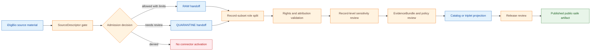

<!-- [KFM_META_BLOCK_V2]
doc_id: kfm://doc/connectors-idigbio-readme
title: connectors/idigbio/ — iDigBio Connector Coordination Lane
type: readme
version: v0.1
status: draft
owners: OWNER_TBD — Connector steward · Source steward · Flora steward · Fauna steward · Biodiversity steward · Sensitivity reviewer · Rights reviewer · Validation steward · Docs steward
created: 2026-06-19
updated: 2026-06-19
policy_label: public-doctrine; biodiversity-sensitivity-gated; rights-gated; no-publication
proposed_path: connectors/idigbio/README.md
truth_posture: CONFIRMED path exists / PROPOSED connector-family contract / CANONICALITY NEEDS VERIFICATION
related:
  - ../README.md
  - specimens/README.md
  - ../../docs/sources/catalog/idigbio/README.md
  - ../../docs/sources/catalog/idigbio/media-records.md
  - ../../docs/sources/catalog/gbif/README.md
  - ../../docs/domains/flora/README.md
  - ../../docs/domains/fauna/README.md
  - ../../docs/domains/habitat/SOURCE_REGISTRY.md
  - ../../docs/sources/SOURCE_DESCRIPTOR_STANDARD.md
  - ../../data/registry/sources/flora/
  - ../../data/registry/sources/fauna/
  - ../../data/raw/flora/
  - ../../data/quarantine/flora/
  - ../../data/raw/fauna/
  - ../../data/quarantine/fauna/
  - ../../fixtures/
  - ../../schemas/contracts/v1/source/
  - ../../policy/sensitivity/flora/
  - ../../policy/sensitivity/fauna/
  - ../../policy/rights/
  - ../../release/
tags: [kfm, connectors, idigbio, biodiversity, specimens, media, darwin-core, flora, fauna, source-admission, geoprivacy, rights, raw, quarantine, governance]
notes:
  - "This README fills a previously blank parent connector README for iDigBio source admission."
  - "The iDigBio source dossier positions iDigBio as a specimen-backed corroborative biodiversity source, not the canonical biodiversity aggregator."
  - "GBIF remains the canonical aggregator reference lane in the current KFM biodiversity posture; iDigBio corroborates and cross-checks, especially for specimen-backed evidence."
  - "Connector output may enter RAW or QUARANTINE handoff only; downstream validation, EvidenceBundle closure, redaction/generalization, catalog/triplet projection, release review, publication, correction, and rollback remain outside this folder."
  - "Implementation files, source activation, SourceDescriptor records, fixtures, tests, CI wiring, endpoint use, record-subset handling, and public-release classes remain NEEDS VERIFICATION."
[/KFM_META_BLOCK_V2] -->

<a id="top"></a>

# iDigBio Connector Coordination Lane

> Parent source-admission surface for iDigBio biodiversity material. It is **not** the canonical biodiversity aggregator, taxonomic authority, public occurrence layer, or publication path.

<p>
  
  
  
  
  
</p>

> [!IMPORTANT]
> **Status:** `experimental` directory README · **Owner:** `OWNER_TBD`  
> **Path:** `connectors/idigbio/README.md`  
> **Truth posture:** `CONFIRMED` file exists · `PROPOSED` connector-family contract · `NEEDS VERIFICATION` canonical implementation home  
> **Boundary:** source-admission coordination only; no public occurrence claims, no taxonomic authority, no direct publication.

**Quick jumps:** [Scope](#scope) · [Repo fit](#repo-fit) · [Accepted inputs](#accepted-inputs) · [Exclusions](#exclusions) · [Directory map](#directory-map) · [Evidence ledger](#evidence-ledger) · [Lifecycle diagram](#lifecycle-diagram) · [Admission posture](#admission-posture) · [Anti-collapse rules](#anti-collapse-rules) · [Validation](#validation) · [Rollback](#rollback) · [Verification backlog](#verification-backlog)

---

## Scope

`connectors/idigbio/` is the proposed parent connector coordination lane for iDigBio source admission.

It may contain family-level connector documentation, compatibility notes, safe fixture rules, SourceDescriptor-gate notes, sublane navigation, and validation expectations for iDigBio-shaped source material.

It must not become canonical biodiversity truth, taxonomic truth, species-presence truth, habitat truth, source descriptor authority, schema authority, policy authority, catalog/triplet authority, proof authority, release authority, pipeline authority, or publication authority.

[Back to top ↑](#top)

---

## Repo fit

| Surface | Role | Status |
|---|---|---:|
| `connectors/idigbio/` | Parent connector coordination lane for iDigBio source admission. | **PROPOSED / NEEDS VERIFICATION** |
| `connectors/idigbio/specimens/` | Nested specimen-record admission lane. | **CONFIRMED path exists / PROPOSED contract** |
| `docs/sources/catalog/idigbio/README.md` | Human-facing iDigBio source dossier. | **CONFIRMED** |
| `docs/sources/catalog/idigbio/media-records.md` | Media-record sibling source page. | **CONFIRMED by search result** |
| `docs/sources/catalog/gbif/README.md` | Canonical biodiversity aggregator reference lane. | **CONFIRMED by related iDigBio source dossier** |
| `data/registry/sources/flora/` and `data/registry/sources/fauna/` | Candidate SourceDescriptor registry homes. | **PROPOSED / NEEDS VERIFICATION** |
| `data/raw/flora/`, `data/raw/fauna/` | Candidate RAW handoff targets. | **PROPOSED / NEEDS VERIFICATION** |
| `data/quarantine/flora/`, `data/quarantine/fauna/` | Quarantine targets for unresolved role, rights, sensitivity, geometry, or dedupe questions. | **PROPOSED / NEEDS VERIFICATION** |
| `release/` | Release and publication controls. | **Out of scope for this connector** |

> [!NOTE]
> The iDigBio source dossier flags path-convention questions between flat dossiers and family-folder layouts. This connector family should therefore remain **CANONICALITY NEEDS VERIFICATION** until Directory Rules, an ADR, migration note, or repo convention confirms the implementation home.

[Back to top ↑](#top)

---

## Accepted inputs

Material belongs here only when it supports governed iDigBio source admission.

Accepted content:

- parent connector README and navigation notes;
- iDigBio connector-family compatibility notes;
- safe fixture rules and no-network test expectations;
- SourceDescriptor-gate notes;
- record-subset role mapping notes;
- rights, license, attribution, and recordset-provider preservation expectations;
- validation notes for Darwin Core / Audubon Core-shaped material;
- quarantine criteria for unresolved role, rights, geometry, sensitivity, taxonomic, or dedupe issues.

Source-subset detail may live in sublanes such as `specimens/` when that structure is confirmed or intentionally retained.

---

## Exclusions

This folder must not contain or imply authority over:

- public release decisions;
- published species occurrence, range, or habitat claims;
- taxonomic backbone decisions;
- conservation status decisions;
- precise sensitive-location publication;
- direct writes to `PROCESSED`, `CATALOG`, `TRIPLET`, `PUBLISHED`, proof, receipt, or release stores;
- SourceDescriptor authority records;
- policy or schema authority;
- generated summaries presented as authoritative biodiversity truth;
- source activation without rights, sensitivity, source-role, geometry, and review checks.

Redirect those responsibilities to the appropriate source registry, policy, schema, validation, release, or domain documentation surface.

[Back to top ↑](#top)

---

## Directory map

Current-session evidence confirms this parent README and the nested `specimens/README.md` lane. Full child inventory remains **NEEDS VERIFICATION**.

```text
connectors/
└── idigbio/
    ├── README.md              # CONFIRMED — this parent connector README
    └── specimens/
        └── README.md          # CONFIRMED — nested specimen admission README
```

Expected downstream responsibility roots are not connector-owned:

```text
data/registry/sources/flora/       # SourceDescriptor authority; iDigBio descriptor NEEDS VERIFICATION
data/registry/sources/fauna/       # SourceDescriptor authority; iDigBio descriptor NEEDS VERIFICATION
data/raw/flora/                    # PROPOSED raw handoff target
data/quarantine/flora/             # PROPOSED quarantine handoff target
data/raw/fauna/                    # PROPOSED raw handoff target
data/quarantine/fauna/             # PROPOSED quarantine handoff target
policy/sensitivity/flora/          # sensitivity decisions
policy/sensitivity/fauna/          # sensitivity decisions
policy/rights/                     # rights decisions
release/                           # release decisions
```

[Back to top ↑](#top)

---

## Evidence ledger

| Source | Status | Supports | Limits |
|---|---:|---|---|
| `connectors/idigbio/README.md` | **CONFIRMED** | Target file exists and was blank before this update. | Does not prove implementation files, tests, or CI. |
| `connectors/idigbio/specimens/README.md` | **CONFIRMED** | Nested specimen sublane exists and documents specimen-record admission boundaries. | Does not prove nested path canonicality or implementation maturity. |
| `docs/sources/catalog/idigbio/README.md` | **CONFIRMED** | iDigBio is positioned as specimen-backed corroborative biodiversity evidence rather than the canonical aggregator; connector work is pointed to `connectors/idigbio/`. | Does not prove active connector code or SourceDescriptor presence. |
| `docs/sources/catalog/idigbio/README.md` source-role section | **CONFIRMED** | iDigBio response subsets need distinct roles: specimen records, non-specimen observations, media, summaries, recordsets, and candidate records must not be flattened. | Does not prove parser implementation. |
| `docs/sources/catalog/idigbio/README.md` sensitivity section | **CONFIRMED** | Sensitivity is record-level; sensitive taxa/location classes require fail-closed handling, redaction/generalization, review, and policy decisions before publication. | Does not prove current policy-code enforcement. |
| `connectors/idigbio/` child tree | **NEEDS VERIFICATION** | Parent and specimen README paths exist. | Child files, tests, package layout, fixtures, and workflows remain unverified. |

---

## Lifecycle diagram

This diagram is doctrine-aligned and implementation-light. It shows responsibility boundaries, not confirmed runtime wiring.



[Back to top ↑](#top)

---

## Admission posture

Expected behavior for iDigBio connector-family work:

- no live source access unless explicitly enabled and reviewed;
- no source fetch without a SourceDescriptor and activation decision;
- no implicit publication from retrieved source material;
- no elevation of iDigBio above direct specimen publishers or GBIF canonical aggregator posture;
- no conversion of source rows into confirmed species-presence, range, habitat, or conservation-status claims;
- no publication of sensitive-location records from connector code;
- no loss of iDigBio UUID, occurrence ID, recordset, provider attribution, license, rights holder, basis of record, taxon fields, event date, geometry, uncertainty, source role, sensitivity, review, or release-class metadata;
- unclear rights, source role, taxonomic identity, geometry, date, recordset attribution, sensitivity, or schema drift routes to quarantine or abstention.

---

## Anti-collapse rules

The iDigBio source dossier identifies the controlling anti-collapse stack:

1. iDigBio is specimen-backed corroborative evidence, not the canonical biodiversity aggregator.
2. iDigBio records are not automatically taxonomic truth, range truth, habitat truth, or conservation-status truth.
3. Source role is record-subset dependent; specimen records, media records, aggregates, recordsets, and candidate records must not be flattened into one role.
4. Rights and license are record-level concerns and must not be collapsed into a single source-wide value.
5. Sensitive biodiversity records must fail closed until policy, review, and redaction/generalization requirements are satisfied.
6. Derived summaries, maps, tiles, model joins, and AI explanations are downstream carriers, not sovereign truth.

---

## Validation

Connector-local validation should check that:

- source metadata is preserved;
- SourceDescriptor references are required for activation;
- iDigBio UUID, occurrence ID, recordset, provider attribution, license, rights holder, basis of record, taxon fields, event date, geometry, uncertainty, source-role, sensitivity, review, and vintage fields are explicit where available;
- malformed or incomplete responses fail closed;
- records with unclear geometry, missing rights, missing attribution, unresolved source role, or unresolved sensitivity route to quarantine;
- iDigBio records remain source-admission candidates until downstream validation;
- no connector run writes directly to processed, catalog, triplet, published, proof, receipt, or release stores;
- fixture data is synthetic, minimized, redacted, generalized, or approved for committed use.

Root-level validation, policy-as-code, redaction/generalization, EvidenceBundle closure, release review, public caveats, and rollback remain outside this connector.

[Back to top ↑](#top)

---

## Definition of done

This connector-family README is ready for first review when:

- [ ] iDigBio source dossier is linked and current enough for review.
- [ ] Canonicality of `connectors/idigbio/` and its nested sublanes is confirmed or tracked.
- [ ] SourceDescriptor homes and iDigBio source IDs are verified.
- [ ] Live source access is disabled by default for connector code.
- [ ] Record-subset role handling and anti-collapse checks are represented in tests.
- [ ] UUID, occurrence ID, recordset, provider attribution, license, rights holder, basis of record, taxon fields, event date, geometry, uncertainty, source role, sensitivity, review, and vintage metadata are preserved in parser output.
- [ ] Connector output is limited to RAW or QUARANTINE handoff.
- [ ] Sensitive-location publication is impossible from connector code.
- [ ] No public claims are created by connector code.
- [ ] Tests cover no-network, malformed, incomplete, rights-unclear, attribution-unclear, role-collapse, taxon-unclear, geometry-unclear, sensitivity-unclear, schema-drift, and boundary cases.

---

## Rollback

Rollback is required if this README is used to justify direct publication, source activation, role collapse, taxonomic authority, species-presence authority, sensitive-location exposure, or bypass of `SourceDescriptor`, rights, sensitivity, policy, validation, review, release, or rollback gates.

Rollback target:

```text
commit prior to this file creation/update: SHA_TBD_AFTER_GIT_HISTORY_CHECK
```

Because the file was blank before this update, a safe rollback is to restore the blank placeholder or replace this document with a shorter compatibility-only README until canonical placement is resolved.

---

## Verification backlog

| Item | Status | Needed evidence |
|---|---:|---|
| Confirm actual iDigBio connector inventory below this path. | **NEEDS VERIFICATION** | Repo tree or mounted workspace. |
| Confirm canonicality of `connectors/idigbio/`. | **NEEDS VERIFICATION** | Directory Rules, ADR, migration note, or repo convention. |
| Confirm nested sublane convention for `specimens/`. | **NEEDS VERIFICATION** | Directory Rules, ADR, migration note, or repo convention. |
| Confirm iDigBio SourceDescriptor homes and source IDs. | **NEEDS VERIFICATION** | Source registry entries and accepted schemas. |
| Confirm source access and parsing scope. | **NEEDS VERIFICATION** | Source steward review and connector implementation. |
| Confirm record-subset source-role handling. | **NEEDS VERIFICATION** | Parser tests, source-role matrix, and SourceDescriptor review. |
| Confirm rights, license, attribution, and provider-recordset preservation. | **NEEDS VERIFICATION** | Rights review and fixture tests. |
| Confirm sensitive-location and rare-taxon handling. | **NEEDS VERIFICATION** | Sensitivity policy, redaction/generalization transform, and steward review. |
| Confirm fixture strategy and CI wiring. | **NEEDS VERIFICATION** | Fixture registry, workflow files, and test logs. |

---

## Maintainer note

Keep this connector family narrow. iDigBio material can corroborate biodiversity claims after review, but this folder must not become a taxonomic authority, species-presence authority, sensitive-location exposure path, release path, or public truth surface.

[Back to top ↑](#top)
