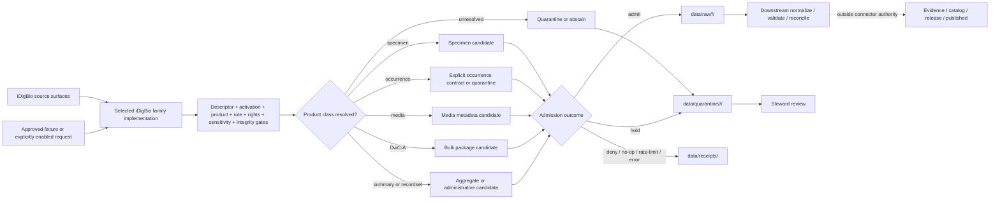

<!-- [KFM_META_BLOCK_V2]
doc_id: kfm://doc/connectors-idigbio-readme
title: connectors/idigbio/ — iDigBio Source-Family Coordination and Admission Contract
type: readme
version: v0.2
status: draft
owners: OWNER_TBD — Connector steward · Source steward · Flora steward · Fauna steward · Geology liaison · Habitat liaison · Biodiversity steward · Genetic-material reviewer · Sensitivity reviewer · Rights reviewer · Validation steward · Docs steward
created: 2026-06-19
updated: 2026-07-12
policy_label: public-doctrine; source-family; documentation-only-current-state; product-routing; record-subset-aware; rights-gated; biodiversity-sensitivity-gated; genetic-material-aware; raw-quarantine-receipts-only; no-publication
path: connectors/idigbio/README.md
truth_posture: CONFIRMED repository documentation / PROPOSED future family implementation / CONFLICTED product and documentation details / UNKNOWN runtime implementation
related:
  - ../README.md
  - specimens/README.md
  - ../../docs/doctrine/directory-rules.md
  - ../../docs/sources/catalog/idigbio/README.md
  - ../../docs/sources/catalog/idigbio/specimen-records.md
  - ../../docs/sources/catalog/idigbio/media-records.md
  - ../../docs/sources/catalog/idigbio/portal-dwca-downloads.md
  - ../../docs/sources/catalog/idigbio/summary-counts.md
  - ../../docs/sources/catalog/gbif/README.md
  - ../../docs/domains/flora/README.md
  - ../../docs/domains/fauna/README.md
  - ../../docs/domains/geology/README.md
  - ../../docs/domains/habitat/README.md
  - ../../pipelines/domains/flora/ingest/README.md
  - ../../data/registry/sources/
  - ../../data/raw/
  - ../../data/quarantine/
  - ../../data/receipts/
  - ../../data/proofs/
  - ../../policy/rights/
  - ../../policy/sensitivity/
  - ../../release/
tags: [kfm, connectors, idigbio, source-family, biodiversity, specimens, occurrence, media, dwca, summary-counts, darwin-core, audubon-core, flora, fauna, geology, habitat, source-admission, dedupe, replay, geoprivacy, rights, raw, quarantine, receipts, governance]
notes:
  - "At inspected base commit bed6f82b5093bcac880226603e4fc72540aad1fa, this README and specimens/README.md were present. Repository search surfaced no other exact-path connector child, and direct probes for pyproject.toml, src/README.md, and tests/README.md under connectors/idigbio/ returned Not Found. This is a bounded inspection, not proof that no differently named implementation exists elsewhere."
  - "connectors/idigbio/ is repository-present as the iDigBio source-family coordination lane. Directory Rules and connectors/README.md support source-family and nested-product patterns, but no accepted package layout, runtime client, parser, test authority, or source activation was verified."
  - "The source-family dossier and product pages define distinct specimen, media, bulk DwC-A, summary-count, recordset, and broader occurrence concerns. Those docs do not prove connector code, SourceDescriptor activation, payloads, receipts, pipelines, catalogs, or public artifacts."
  - "Current iDigBio documentation contains unresolved drift: several files reference an absent flat docs/sources/catalog/idigbio.md file and an absent docs/sources/catalog/idigbio/occurrence-search.md product page."
  - "The specimen product documentation is internally conflicted on whether LivingSpecimen belongs in its admitted basisOfRecord set. This family README preserves that conflict and requires fail-closed routing until an accepted descriptor, specification, or policy resolves it."
[/KFM_META_BLOCK_V2] -->

<a id="top"></a>

# iDigBio Source-Family Coordination and Admission Contract

> Family-level documentation and admission boundary for iDigBio material. The path is aligned with the repository's source-family pattern, but the inspected state is documentation-only: this README does not establish a client, parser, package, SourceDescriptor, activation decision, runtime, or publication path.

<p>
  
  
  
  
  
  
  
</p>

`connectors/idigbio/`

> [!IMPORTANT]
> **Inspected state:** at base commit `bed6f82b5093bcac880226603e4fc72540aad1fa`, this README and the nested `specimens/README.md` were present. No package metadata, documented family source subtree, or documented family test subtree was found at the common paths directly probed. No iDigBio client, parser, fixture authority, SourceDescriptor, activation decision, source payload, receipt, pipeline run, emitted artifact, or runtime result was verified.

> [!CAUTION]
> **Placement posture:** `connectors/` is the source-specific fetch and admission responsibility root. `connectors/idigbio/` is the repository-present source-family coordination path and should remain the single family boundary unless an accepted ADR or migration record says otherwise. That path presence does not, by itself, select a package layout or prove runtime implementation.

> [!WARNING]
> **Product routing is mandatory.** Specimen records, broader occurrence records, media metadata, portal DwC-A packages, summary counts, and recordset metadata have different vocabularies, source roles, rights, replay properties, and sensitivity risks. A missing product page or sublane is not permission to route material into the nearest available path.

> [!WARNING]
> **All iDigBio material is sensitivity-unevaluated at admission.** A public source can still contain precise rare-taxon locations, type-locality context, private or culturally sensitive places, material or genetic samples, provider restrictions, and media with embedded location metadata. Reachability is not activation, and retrieval is not publication.

**Quick jumps:** [Purpose](#purpose) · [Placement decision](#placement-decision) · [Verified repository state](#verified-repository-state) · [Authority boundary](#authority-boundary) · [Family product map](#family-product-map) · [Source roles and authority precedence](#source-roles-and-authority-precedence) · [Identity, attribution, and reconciliation](#identity-attribution-and-reconciliation) · [Rights, sensitivity, and public precision](#rights-sensitivity-and-public-precision) · [Time, geometry, and provenance](#time-geometry-and-provenance) · [Replay and evidence pairing](#replay-and-evidence-pairing) · [Registry, access, and lifecycle](#registry-access-and-lifecycle) · [Cross-domain routing](#cross-domain-routing) · [Implementation placement options](#implementation-placement-options) · [Testing and definition of done](#testing-and-definition-of-done) · [Verification backlog](#verification-backlog) · [Review and rollback](#review-and-rollback)

---

## Purpose

This README defines the present boundary of the repository's iDigBio source-family lane without upgrading documentation into implementation proof.

It may:

- coordinate product routing across iDigBio specimen, occurrence, media, bulk-download, summary, and recordset surfaces;
- preserve family-level source-role, identity, rights, attribution, sensitivity, time, geometry, replay, and lifecycle requirements;
- point maintainers to the governing source dossier, product pages, child connector documentation, source registry, policy roots, lifecycle roots, and release roots;
- describe the contract a future iDigBio family package, client, parser, or dispatcher must satisfy;
- record conflicts, missing files, verification gaps, and migration requirements before implementation or source activation;
- support reviewed creation, migration, deprecation, correction, withdrawal, and rollback work.

It does **not**:

- prove a client, parser, package, fixture suite, test runner, watcher, pipeline, source activation, or runtime exists;
- choose a final package/import name, source ID, product ID, endpoint, query shape, pagination strategy, cadence, or activation state;
- turn source-family documentation into a SourceDescriptor, machine contract, schema, policy decision, EvidenceBundle, release record, or public artifact;
- define accepted taxonomic identity, species presence, range, habitat, conservation status, geological age, genetic-data permission, or public-safe precision;
- publish occurrence points, media bytes, counts, maps, tiles, reports, exports, public API payloads, search indexes, graph projections, or AI answers.

[Back to top ↑](#top)

---

## Placement decision

| Question | Current safe decision | Evidence posture |
|---|---|---:|
| What is the owning responsibility root? | `connectors/`, because the concern is source-specific fetch, probe, packaging, and admission. | **CONFIRMED** by Directory Rules and `connectors/README.md`. |
| What is the source-family coordination path? | Retain `connectors/idigbio/` as the single repository-present family boundary. | **CONFIRMED path / draft authority contract**. |
| Is `connectors/idigbio/` a confirmed runtime package? | **No.** It is a documentation family lane with no verified package metadata, source subtree, test subtree, client, or parser. | **CONFIRMED README / UNKNOWN runtime**. |
| Is `connectors/idigbio/specimens/` a confirmed runtime product? | **No.** Its v0.2 README explicitly records a documentation-only current state. | **CONFIRMED child README / UNKNOWN runtime**. |
| Should sibling product directories be created now? | Not without an accepted family package decision, product map, SourceDescriptor and activation design, tests, fixtures, migration plan, and rollback path. | **NEEDS VERIFICATION**. |
| Does the source dossier settle the documentation layout? | No. The repository contains `docs/sources/catalog/idigbio/`, while current docs still reference an absent flat `docs/sources/catalog/idigbio.md`. | **CONFLICTED / drift signal**. |
| May missing occurrence documentation be inferred from the specimen lane? | **No.** The referenced `occurrence-search.md` page is absent; broader occurrence routing must fail closed or use an accepted replacement contract. | **CONFIRMED absence at pinned base / NEEDS VERIFICATION replacement**. |
| Can this placement change? | Yes, through an ADR or migration record that names package paths, product boundaries, aliases, tests, lineage, redirects, and rollback. | Reversible change required. |

The strongest current evidence supports one iDigBio family implementation with explicit product behavior. It does not settle whether that implementation should use a parent package with product modules, nested product packages, configuration-driven routing, or another reviewed structure.

[Back to top ↑](#top)

---

## Verified repository state

The following snapshot is bounded to base commit `bed6f82b5093bcac880226603e4fc72540aad1fa` and the paths and searches actually inspected:

```text
connectors/
├── README.md                         # connector-root authority and child README contract
└── idigbio/
    ├── README.md                     # this family coordination README
    └── specimens/
        └── README.md                 # v0.2 documentation-only specimen product sublane

docs/sources/catalog/idigbio/
├── README.md                         # family source dossier
├── specimen-records.md               # specimen product page
├── media-records.md                  # media metadata product page
├── portal-dwca-downloads.md          # bulk replay/citation product page
└── summary-counts.md                 # aggregate product scaffold

pipelines/domains/flora/ingest/README.md
                                        # downstream Flora ingest boundary; not connector proof
```

| Surface | Status | What it supports | What it does not prove |
|---|---:|---|---|
| `connectors/idigbio/README.md` | **CONFIRMED** | The requested source-family documentation path exists. | Runtime package, canonical imports, activation, payloads, tests, or CI. |
| `connectors/idigbio/specimens/README.md` | **CONFIRMED v0.2** | A documentation-only specimen sublane exists and records product-specific safeguards. | Product runtime, accepted filter, or canonicality. |
| `connectors/idigbio/pyproject.toml` | **Not found in direct probe** | No package metadata was observed at this common family path. | No differently named package exists elsewhere. |
| `connectors/idigbio/src/README.md` | **Not found in direct probe** | No documented family source subtree was observed at this common path. | No source modules exist under another shape. |
| `connectors/idigbio/tests/README.md` | **Not found in direct probe** | No documented family-local test subtree was observed at this common path. | No repository-level tests cover iDigBio. |
| Exact-path repository search | **Parent and specimen README surfaced** | These are the connector-family files found by the bounded search. | A complete recursive inventory or differently named implementation. |
| `docs/sources/catalog/idigbio/README.md` | **CONFIRMED draft dossier** | Family role, record-subset roles, rights, sensitivity, identity, and lifecycle doctrine. | Current endpoint behavior, accepted descriptor, or runtime enforcement. |
| `docs/sources/catalog/idigbio/specimen-records.md` | **CONFIRMED draft product page** | Specimen primacy, direct-source precedence, product filtering, type/material/fossil handling, and replay pairing. | Accepted implementation or resolution of its `LivingSpecimen` conflict. |
| `docs/sources/catalog/idigbio/media-records.md` | **CONFIRMED draft product page** | Audubon Core metadata, provider-hosted byte custody, per-media rights, and embedded-location risk. | Media client, cache, byte mirror, or rights clearance. |
| `docs/sources/catalog/idigbio/portal-dwca-downloads.md` | **CONFIRMED draft product page** | A bulk DwC-A surface is documented as the preferred replay/citation anchor. | A downloaded archive, checksum, package parser, or activated refresh workflow. |
| `docs/sources/catalog/idigbio/summary-counts.md` | **CONFIRMED scaffold** | An aggregate product concept exists. | Product scope, endpoint, cadence, collection identity, or catalog release. |
| `docs/sources/catalog/idigbio.md` | **Not found in direct probe** | The flat path referenced by several docs is absent at the pinned base. | That an ADR formally retired the flat convention. |
| `docs/sources/catalog/idigbio/occurrence-search.md` | **Not found in direct probe** | The broader occurrence product referenced by other pages is absent. | That no equivalent contract exists under another name. |
| Concrete SourceDescriptor, activation decision, source payload, receipt, pipeline run, catalog record, release, or public artifact | **UNKNOWN** | No accepted artifact was verified in this update. | Nothing should be inferred. |

The prior v0.1 parent README was introduced by commit `b1663d6e48369ea55998f0627b45b4515825c7f9`. That history proves the file was expanded from a one-line placeholder at that time; it does not justify continuing to describe the current file as blank or newly created.

[Back to top ↑](#top)

---

## Authority boundary

```text
THIS FAMILY LANE MAY:
  coordinate iDigBio product routing and family-level admission expectations
  preserve source-family, product, role, rights, sensitivity, time, and replay distinctions
  describe a future family client, parser, dispatcher, and package contract
  record conflicts, verification gaps, migration requirements, and deprecation posture
  point to bounded RAW / QUARANTINE / receipt handoff expectations
  preserve correction, withdrawal, cache invalidation, and rollback guidance

THIS FAMILY LANE MUST NOT:
  replace source-family or product doctrine under docs/sources/catalog
  contain or activate a SourceDescriptor as the authority record
  decide taxonomic truth, conservation status, sensitive-taxa lists, rights policy, or public precision
  collapse specimen, occurrence, media, aggregate, package, and recordset products into one role
  collapse direct institutional, iDigBio, and GBIF records into final canonical truth
  write WORK, PROCESSED, CATALOG, TRIPLET, PUBLISHED, proof, registry, or release stores
  mirror provider media bytes without reviewed custody and rights authority
  expose exact sensitive locations, genetic-material details, private/cultural-site context, or restricted recordsets
  create public API, map, tile, report, graph, search, vector-index, or AI output
  bypass evidence, policy, validation, review, correction, withdrawal, or rollback gates
```

A future family implementation may fetch, package, classify, and parse source material and emit bounded RAW, QUARANTINE, or receipt candidates. Retrieval success proves only that bytes or metadata were obtained. It does not prove accepted identity, species presence, canonical reconciliation, rights clearance, public-safe precision, evidence closure, or publication eligibility.

[Back to top ↑](#top)

---

## Family product map

The iDigBio family exposes or documents multiple surfaces. They must be routed explicitly because each has different semantics and proof burden.

| Product or surface | Repository documentation | Connector-path state | Source-role posture | Current safe behavior |
|---|---|---|---|---|
| Specimen-filtered records | `docs/sources/catalog/idigbio/specimen-records.md` | `specimens/README.md` exists; runtime unverified | `observed` / specimen-backed inside a corroborative family | Preserve voucher identity and direct-source precedence; fail closed on unresolved `LivingSpecimen` admission. |
| Broader occurrence search | Referenced as `occurrence-search.md`, but that file was not found | No dedicated connector sublane surfaced | Mixed `observed` and `candidate`, depending on `basisOfRecord` and quality | Do not route non-specimen records into `specimens/`; quarantine or abstain until a product contract exists. |
| Media metadata | `media-records.md` | No dedicated connector sublane surfaced | `observed` / media-attached metadata; counts may be `aggregate` | Preserve Audubon Core identity, `coreid`, `accessURI`, byte custody, per-media license, and EXIF risk. |
| Portal DwC-A package | `portal-dwca-downloads.md` | No dedicated connector sublane surfaced | Package is an administrative distribution; contained rows keep their record-level roles | Treat as a proposed replay/citation anchor only after descriptor, package, rights, and sensitivity checks. |
| Summary counts | `summary-counts.md` | No dedicated connector sublane surfaced | `aggregate` | Preserve query, aggregation unit, recordset scope, time, and coverage caveats; never turn counts into occurrence truth. |
| Recordset metadata | Described in the family dossier; no dedicated product page surfaced | No dedicated connector sublane surfaced | `administrative` | Preserve provider, recordset identity, rights, attribution, and coverage context; never treat a recordset as an occurrence. |

A product page is documentation, not an activation record. A connector sublane is a placement surface, not proof of code. A source response is evidence input, not publication.

[Back to top ↑](#top)

---

## Source roles and authority precedence

The family dossier and product docs distinguish **source family**, **product class**, **record subset**, and **evidence precedence**:

| Material | Required posture | Boundary |
|---|---|---|
| iDigBio specimen record | `observed` / specimen-backed within a corroborative source family | Strong vouchered evidence; not taxonomic, conservation, range, or habitat authority. |
| iDigBio non-specimen human or machine observation | `observed`, but a separate product and evidence class | Must not inherit specimen primacy or specimen-specific dedupe behavior. |
| iDigBio media metadata | `observed` / media-attached metadata | Describes a digital carrier; provider-hosted bytes and their rights remain separate. |
| iDigBio summary response | `aggregate` | Preserve aggregation unit and query support; no record-level occurrence inference. |
| iDigBio recordset metadata | `administrative` | Describes a provider bundle, not a biological occurrence. |
| DwC-A package manifest or archive | `administrative` distribution artifact | Contained records retain their own source roles and rights. |
| Incomplete, low-quality, rights-unclear, role-unclear, or sensitivity-unresolved record | `candidate` / quarantine | Promotion and public use are forbidden until governed disposition. |

Two authority rules must coexist without being collapsed:

1. GBIF is documented as KFM's canonical biodiversity **aggregator**.
2. For the same physical specimen, source proximity is documented as **direct institutional source > iDigBio > GBIF**.

The second rule does not erase the iDigBio or GBIF copies. It preserves them as corroborating EvidenceRefs with explicit source and conflict lineage. Neither rule allows connector code to decide accepted taxon identity, final occurrence truth, conservation status, or public release.

### Anti-collapse rules

1. Source family is not product class.
2. Product class is not record-level source role.
3. Specimen-backed evidence is not generic observation evidence.
4. Media metadata is not media-byte custody, and occurrence rights are not media rights.
5. Summary counts are not occurrences, distributions, abundance, completeness, or species-presence proof.
6. A DwC-A archive is not one homogeneous source role; its rows retain record-level meaning and rights.
7. GBIF's canonical-aggregator role does not make it the closest source to a physical specimen.
8. Direct-source precedence does not authorize destructive dedupe or loss of corroborating EvidenceRefs.
9. iDigBio does not pre-evaluate KFM sensitivity, public precision, cultural-site risk, or provider-specific downstream restrictions.
10. Search responses, caches, packages, receipts, catalogs, maps, and AI explanations are evidence carriers or derivatives, not sovereign truth.

[Back to top ↑](#top)

---

## Identity, attribution, and reconciliation

A future family implementation must preserve source-native identity before any downstream normalization or reconciliation.

Minimum family carriers, when supplied by the relevant product, include:

- iDigBio record or media UUID;
- provider `occurrenceID`, media identifier, or other stable provider GUID;
- recordset UUID and recordset/provider attribution;
- institution and collection codes and identifiers;
- catalog number and source object identifier;
- `basisOfRecord`, type status, and product/surface class;
- media `coreid`, `accessURI`, format/type, creator, rights holder, and per-media license;
- source modification marker, ETag/version, package identity, or archive checksum;
- event or collection date, source modification time, retrieval time, package snapshot time, and correction state;
- source taxon fields and any downstream backbone version used for reconciliation;
- geometry, verbatim locality, datum/CRS metadata, coordinate uncertainty, and source-native support;
- record-level license, rights holder, bibliographic citation, provider citation, and restrictions;
- request specification, normalized query digest, page/cursor state, response or package digest, connector version, and outcome.

### Reconciliation boundary

Repository documentation proposes specimen reconciliation using institution code plus catalog number, with additional coordinate, date, and name signals and direct-source precedence. Those are downstream reconciliation rules, not permission for the family connector to erase source records.

A safe future connector may emit:

- a normalized **dedupe-candidate key**;
- a product and source-role classification candidate;
- an `authority_precedence_hint` resolved from a reviewed source-authority register;
- a `shadow_candidate_ref` for a possible direct institutional counterpart;
- both or all source EvidenceRefs and the reason for the proposed relationship;
- a quarantine reason when identity cannot be resolved without unsafe guessing.

It must not emit final canonical occurrence identity, silently discard an aggregator copy, or merge observation-class records with specimen-class records solely through place, time, and taxon-name similarity. Final merge, shadowing, conflict preservation, correction, and withdrawal belong to downstream normalization and reconciliation with receipts, validation, and steward review.

[Back to top ↑](#top)

---

## Rights, sensitivity, and public precision

### Record- and product-level rights

A future implementation must preserve rights at the narrowest available level. It must not substitute a family-wide default when a record, media item, recordset, or package is missing or ambiguous.

| Rights state | Admission posture |
|---|---|
| Recognized public-use record license with required attribution available | Eligible for bounded RAW admission; all downstream obligations remain visible. |
| Share-alike record or media license | Eligible only when derivative obligations are preserved and accepted by policy. |
| NonCommercial or other restricted license | Quarantine or restricted review by default; no automatic public-layer path. |
| Missing, unrecognized, conflicting, or provider-revoked license | Quarantine or deny; do not infer a default. |
| Missing rights holder, bibliographic citation, recordset attribution, or provider attribution | Quarantine until attribution can be resolved. |
| Media metadata whose bytes are provider-hosted | Metadata admission does not grant byte mirroring, caching, model training, redistribution, or republication authority. |

Both per-record and recordset/provider attribution must remain inspectable. Media rights remain independent of occurrence rights. Provider restrictions can be stricter than a displayed Creative Commons token and must be preserved when known.

### Sensitivity posture

Every iDigBio record is **sensitivity-unevaluated at admission**. The connector does not know KFM's current rare-taxa lists, cultural or archaeological restrictions, private-property joins, steward corrections, consent posture, or release decisions.

Required fail-closed triggers include:

- listed, rare, protected, or steward-controlled taxa;
- precise locality on a sensitive site, private parcel, archaeological or cultural context, or restricted collection;
- unusually precise historical locality with weak provenance;
- type specimens requiring unresolved type-locality review;
- material samples containing tissue, DNA extract, eDNA, or other genetic material;
- fossil specimens whose geological context must be preserved and routed without false temporal collapse;
- media with EXIF or other embedded location metadata;
- provider, recordset, or media restrictions beyond the displayed license token;
- join-induced sensitivity created by combining specimen, land, habitat, infrastructure, archaeology, or person-related data.

The connector may preserve source geometry in a governed RAW or QUARANTINE context and attach review reasons. It may not approve a type-specimen exception, infer consent, strip or publish embedded metadata as a final transform, decide that genetic-material detail is public-safe, or choose public coordinate precision. Those decisions require policy, transform or redaction receipts, review records, and release authority in their owning roots.

[Back to top ↑](#top)

---

## Time, geometry, and provenance

Different products carry different time concepts. They must remain separate where material:

| Time concept | Meaning | Family connector posture |
|---|---|---|
| Collection or event time | When the specimen, sample, or observation was collected or made. | Preserve source value and precision; never substitute retrieval time. |
| Preparation, accession, or catalog time | When a physical object entered or changed in a collection. | Preserve separately when supplied. |
| Geological age | Stratigraphic or chronostratigraphic context of fossil material. | Preserve native geological-context fields; never encode as collection time. |
| Source modification or version time | When the provider or iDigBio changed a record. | Preserve modification markers, ETags, versions, and correction lineage. |
| Query or package snapshot time | When a search response or DwC-A snapshot was materialized. | Record in run evidence and package identity. |
| Media-link health time | When an external `accessURI` was last checked. | Preserve separately from media creation and occurrence event time. |
| Retrieval time | When KFM fetched or referenced bytes or metadata. | Record in run or probe evidence. |
| Release and correction time | Downstream KFM publication, supersession, or withdrawal events. | Outside connector authority. |

Geometry and spatial-support rules:

- preserve source coordinates, verbatim locality, datum/CRS metadata, and coordinate uncertainty;
- keep exact point, generalized point, county/HUC/grid support, and non-spatial aggregate scope distinct;
- validate finite numeric bounds without presenting the result as accepted geometry;
- do not use rounded coordinates as proof of identity when source uncertainty is larger than the rounding tolerance;
- treat media EXIF and embedded-location metadata as a separate sensitive geometry surface;
- never expose exact sensitive geometry in logs, fixtures, pull-request text, error messages, or public outputs;
- leave final normalization, georeferencing, generalization, redaction, and public precision to governed downstream transforms.

Provenance should preserve family and product identity, endpoint or distribution surface, query specification, page/cursor state, response/package digest, package manifest, recordset attribution, source identifiers, connector version, descriptor reference, activation decision, access outcome, retry/rate-limit state, and candidate reconciliation relationships.

[Back to top ↑](#top)

---

## Replay and evidence pairing

The repository's product pages describe complementary evidence surfaces rather than one interchangeable endpoint:

```text
Search API discovery or freshness probe
  + content-addressed response or approved fixture
  + explicit product and query identity
  + preferably a paired portal DwC-A snapshot for release-bearing evidence
  + recordset/provider attribution and per-record rights
  + downstream EvidenceBundle, policy, validation, review, and release
```

Current safe posture:

- synchronous search is discovery or candidate admission, not self-proving publication evidence;
- promotion-bearing use requires a replayable evidence anchor selected by accepted evidence and release contracts;
- the portal DwC-A product is documented as the preferred family replay/citation anchor, but no archive, checksum, package parser, or pairing implementation was verified here;
- media metadata does not make provider-hosted bytes replay-stable; custody, caching, mirroring, link health, and rights need separate decisions;
- summary counts require stable query scope, aggregation unit, recordset coverage, and retrieval time before they can support even aggregate claims;
- live re-fetch is not a substitute for preserving the as-used response or package;
- unchanged ETag, version, or content should produce a no-op receipt rather than duplicate RAW material;
- partial pagination, duplicate pages, rate limits, source outages, schema drift, withdrawn recordsets, or changed query semantics must produce finite, reviewable outcomes;
- fixtures must be synthetic, minimized, redacted, generalized, or explicitly approved and must never auto-refresh from the live service.

[Back to top ↑](#top)

---

## Registry, access, and lifecycle

Before any live interaction, a ratified family implementation must verify:

- canonical family package, import path, and product routing structure;
- stable family source ID, product or surface IDs, aliases, and correction policy;
- concrete SourceDescriptor records and activation decisions;
- accepted product map, including the missing broader occurrence contract;
- accepted specimen `basisOfRecord` set and explicit non-specimen routing;
- endpoint and distribution versions, query grammar, recordset scope, Kansas scope, pagination, sorting, limits, and bulk-request behavior;
- cadence, ETag/version semantics, correction/retraction behavior, link-health behavior, outage semantics, and rate limits;
- record-level and media-level rights, provider attribution, citation, recordset attribution, and package citation behavior;
- sensitive-taxa, type-specimen, material/genetic-sample, fossil, cultural/private-site, media EXIF, and join-induced sensitivity rules;
- direct-institution authority mappings and reconciliation-candidate contracts;
- approved RAW, QUARANTINE, and receipt handoff interfaces;
- no-network defaults, bounded timeouts and retries, safe logging, and fixture policy.

Expected access posture:

- imports and default tests make no live network calls;
- live access requires explicit runtime enablement and an allowed or restricted activation decision;
- requests are product-, geography-, recordset-, date-, page-, and size-bounded;
- pagination and bulk-package retrieval are finite and receipt-bearing;
- timeouts, retries, rate limits, forbidden/not-found responses, partial responses, stale links, and schema changes have finite outcomes;
- no credentials, signed URLs, private recordsets, exact sensitive locations, media bytes, or oversized payload excerpts appear in committed files or logs;
- a public endpoint's reachability is not source activation.



Possible family connector outcomes, **PROPOSED until matched to accepted contracts**:

- `ADMIT_RAW`
- `QUARANTINE`
- `NO_OP`
- `RATE_LIMITED`
- `ABSTAIN`
- `DENY`
- `ERROR`

This README produces none of those outcomes. It documents the boundary a future implementation must follow.

[Back to top ↑](#top)

---

## Cross-domain routing

One source capture can support multiple domain projections without creating multiple source truths.

1. Capture each iDigBio response or package once under one source-family and product identity.
2. Preserve record-level source role and product class independently of the consuming domain.
3. Route lineage-preserving candidates downstream:
   - Flora for botanical specimens, herbarium context, and plant-related material samples;
   - Fauna for zoological specimens and animal-related observations;
   - Geology for fossil geological context, without moving specimen identity into Geology;
   - Habitat only as cited occurrence or environmental context, never habitat truth;
   - Archaeology or cultural heritage only through restricted review when faunal, floral, site, or collection context is sensitive;
   - genetic-material context only through accepted rights and sensitivity policy.
4. Prefer registered direct institutional evidence when the same physical specimen is available from an approved direct source; retain iDigBio as corroboration.
5. Perform taxonomic resolution, identity reconciliation, georeferencing, generalization, aggregation, and cross-domain joins downstream with explicit methods, receipts, uncertainty, and review.
6. Do not fetch or store the same source record independently for each domain merely for convenience.
7. Public maps, APIs, reports, exports, search, and AI consume only released public-safe derivatives through governed interfaces.

One capture supporting multiple domains increases the need for one family identity, explicit product IDs, one provider and recordset attribution chain, one correction lineage, replayable response history, and domain projection receipts.

[Back to top ↑](#top)

---

## Implementation placement options

The repository evidence does not yet select a package structure. The following are alternatives, not current facts:

| Option | Shape | Advantages | Risks and required controls |
|---|---|---|---|
| Parent family package with product modules | A single package under an accepted `connectors/idigbio/` source root, with modules for search, specimens, media, DwC-A, summaries, and routing | One client, one authentication/network policy, one shared identity and receipt layer | Module paths, package metadata, imports, tests, and product IDs must be accepted and documented. |
| Nested product packages | Family root plus product-specific implementation directories | Clear product isolation and local tests | Can harden draft sublane names into parallel authorities; requires migration, aliases, and shared-client discipline. |
| Configuration-driven family dispatcher | One family client plus descriptor or pipeline-spec product configurations | Reduces duplicate code and keeps product differences inspectable | Product-specific invariants can be hidden in config; schema, tests, and review must prevent role collapse. |
| External shared biodiversity adapter | Shared code outside the family path used by multiple source families | Potential reuse for Darwin Core, rights, paging, and receipts | Must not erase source-family semantics or create a parallel connector/source authority. |

Current safe decision: keep this family lane and its specimen child documentation-only until an accepted package layout, SourceDescriptor design, product map, test authority, and reversible migration plan exist. An ADR is required if the change creates a parallel authority, moves or renames a canonical path, or bends Directory Rules; otherwise the package decision still requires explicit review and documentation.

[Back to top ↑](#top)

---

## Testing and definition of done

Executable tests belong in the accepted iDigBio family test authority or another repository-standard location selected by current implementation evidence. They do not belong in a guessed path merely because this README names them.

### Required test classes for a future implementation

- import safety and no-network defaults;
- explicit SourceDescriptor and activation gates;
- family and product ID stability, aliases, and correction behavior;
- endpoint, distribution, product, version, and bounded-query configuration;
- product routing for specimens, broader occurrences, media, DwC-A, summaries, and recordsets;
- unresolved product routing when `occurrence-search.md` or equivalent contract is absent;
- specimen admitted-set conflict resolution, including any approved `LivingSpecimen` behavior;
- non-specimen, generic, missing, malformed, and changed-vocabulary records;
- Darwin Core versus Audubon Core separation;
- record, recordset, package, and media license and attribution cases;
- provider-hosted media bytes, `accessURI` health, EXIF risk, and no-byte-mirroring defaults;
- sensitive taxon, sensitive site, historical uncertainty, type specimen, fossil, material sample, genetic material, cultural/private-site, and join-induced sensitivity cases;
- direct-institution precedence and reconciliation candidates without record loss;
- no cross-class dedupe against citizen-science or generic observation records;
- identifier, case, whitespace, punctuation, collection alias, and historical catalog-number normalization;
- collection/event, accession, modification, snapshot, media-health, retrieval, geological-age, release, and correction time separation;
- geometry bounds, datum/CRS, verbatim locality, uncertainty, aggregation support, embedded media location, and no-sensitive-log behavior;
- pagination, sorting, duplicate pages, partial pages, ETag/no-op, rate limit, timeout, retry, forbidden, not-found, outage, stale-link, and schema-drift behavior;
- response/package digest, package manifest, citation file, and replay-anchor pairing;
- RAW versus QUARANTINE versus receipt outcomes;
- refusal to write WORK, PROCESSED, CATALOG, TRIPLET, PUBLISHED, proof, registry, release, API, UI, map, tile, search, graph, or AI outputs.

### Fixture rules

1. Prefer synthetic, minimal, purpose-specific family and product fixtures.
2. Mark every fixture `synthetic`, `minimized`, `redacted`, `generalized`, or `approved`.
3. Preserve only fields needed to test identity, product class, source role, rights, attribution, time, geometry, uncertainty, sensitivity, reconciliation candidates, and replay behavior.
4. Include valid and invalid fixtures for every routed product and every denied or unresolved class.
5. Include paired direct-institution, iDigBio, and GBIF representations of one synthetic physical specimen to test precedence without data loss.
6. Include separate non-specimen observation records to prove no cross-class dedupe.
7. Include media metadata with synthetic `accessURI`, rights, and embedded-location-risk cases without real provider bytes.
8. Include a synthetic DwC-A package manifest and citation file without live or sensitive source records.
9. Include summary and recordset fixtures that prove aggregate and administrative roles cannot become occurrences.
10. Never auto-refresh committed fixtures from the live service.
11. Never place source payload fixtures in this family directory while it remains documentation-only.

### Definition of done

- [x] The target README and bounded common-path inspection are pinned to a base commit.
- [x] Connector-root, family, child-product, source-doc, registry, policy, lifecycle, evidence, and release responsibilities are separated.
- [x] Stale statements that the current README was blank and the unresolved rollback SHA placeholder are removed.
- [x] The repository-present product map and absent flat/occurrence documentation paths are visible.
- [x] The specimen `LivingSpecimen` conflict remains visible and fail-closed.
- [x] Source-role, direct-source precedence, record and media rights, sensitivity-unevaluated admission, replay pairing, cross-domain routing, and no-publication safeguards are preserved.
- [x] This family path is explicitly documentation-only in the inspected state without declaring it permanently deprecated.
- [ ] An accepted family package layout selects implementation and test homes.
- [ ] Stable family/product IDs, aliases, SourceDescriptor records, activation decisions, endpoint/distribution behavior, cadence, and rights are verified.
- [ ] The broader occurrence contract and specimen admitted set are accepted.
- [ ] Direct-institution authority mapping, reconciliation normalization, candidate relationship shapes, and correction behavior are accepted.
- [ ] Media custody, cache, EXIF, licensing, and byte-use policy are accepted.
- [ ] DwC-A package, citation, replay, and promotion-pairing behavior are accepted and tested.
- [ ] Summary-count and recordset aggregation semantics are accepted and tested.
- [ ] Sensitive-taxa, type-specimen, material/genetic, fossil, cultural/private-site, join-induced, and public-precision policies are accepted.
- [ ] Executable offline tests and public-safe fixtures prove all required negative and lifecycle cases.
- [ ] RAW, QUARANTINE, and receipt integrations, pipeline orchestration, substantive CI, correction, withdrawal, and rollback are verified.
- [ ] Stale flat-dossier and missing occurrence-product references are reconciled or recorded in the drift and verification registers.

The exact package manager, test runner, live-test flag, workflow names, required-check set, and implementation module names remain **NEEDS VERIFICATION**.

[Back to top ↑](#top)

---

## Verification backlog

| Item | Status | Needed evidence |
|---|---:|---|
| Confirm complete recursive inventory below `connectors/idigbio/`. | **NEEDS VERIFICATION** | Non-truncated tree at the current ref. |
| Confirm no differently named iDigBio client, parser, watcher, or package exists elsewhere. | **UNKNOWN** | Recursive code search, package metadata, imports, tests, workflows, and runtime evidence. |
| Select the canonical iDigBio family package and test layout. | **NEEDS VERIFICATION / ADR-class if paths move or parallelize authority** | Accepted ADR or package decision, repository diff, imports, and tests. |
| Reconcile family-folder source docs with stale flat `docs/sources/catalog/idigbio.md` references. | **NEEDS VERIFICATION / drift** | Docs index decision, ADR or migration record, redirects, and link validation. |
| Restore, replace, or formally retire the missing broader occurrence product contract. | **NEEDS VERIFICATION** | Accepted product map and source-doc change. |
| Resolve the specimen admitted `basisOfRecord` set, especially `LivingSpecimen`. | **CONFLICTED** | Accepted descriptor, specification, or policy resolving `OPEN-IDB-SPEC-01`. |
| Confirm stable family source ID, product IDs, aliases, SourceDescriptor records, and activation states. | **NEEDS VERIFICATION** | Registry entries, schema validation, and steward decisions. |
| Confirm current endpoints, distribution surfaces, query grammar, Kansas scope, recordset scope, pagination, limits, cadence, ETag/version, correction, and outage behavior. | **NEEDS VERIFICATION** | Current official-source review plus bounded source-steward tests. |
| Confirm record, recordset, package, and media license tokens, attribution, share-alike, NonCommercial, withdrawal, and revocation behavior. | **NEEDS VERIFICATION** | Reviewed rights records, policy decisions, fixtures, and tests. |
| Confirm media byte custody, mirroring/caching, EXIF stripping, link-health, training, and redistribution policy. | **NEEDS VERIFICATION** | Rights policy, custody contract, transform receipts, and tests. |
| Confirm sensitive-taxa union, type-specimen policy, material/genetic-sample policy, fossil-context mapping, cultural/private-site handling, and public precision. | **NEEDS VERIFICATION** | Policy bundles, review criteria, contracts, transforms, and tests. |
| Confirm direct-institution authority mapping, reconciliation normalization, and candidate relationship shape. | **NEEDS VERIFICATION** | Source-authority registry, accepted identity contract, and deterministic tests. |
| Confirm DwC-A package structure, citation-file custody, archive checksum, replay authority, and pairing enforcement. | **NEEDS VERIFICATION** | Package fixture, parser, EvidenceBundle contract, pairing receipt, replay test, and promotion gate. |
| Confirm summary-count aggregation unit, query support, coverage caveats, and catalog posture. | **NEEDS VERIFICATION** | Product contract, descriptor, aggregate fixtures, and tests. |
| Confirm approved RAW, QUARANTINE, and receipt targets for Flora, Fauna, Geology, Habitat, and restricted cross-domain consumers. | **NEEDS VERIFICATION** | Admission contract, lifecycle configuration, and integration tests. |
| Confirm fixture authority, test runner, live-test policy, CI wiring, and substantive check depth. | **UNKNOWN** | Package config, fixture manifest, workflows, job steps, and current logs. |
| Confirm correction, withdrawal, recordset or media-license revocation, cache invalidation, and rollback behavior. | **NEEDS VERIFICATION** | Correction notices, release manifests, rollback artifacts, and tests. |
| Confirm no public client reads connector, registry, RAW, QUARANTINE, or unreleased iDigBio material directly. | **NEEDS VERIFICATION** | API/UI code, access policy, tests, and runtime evidence. |

[Back to top ↑](#top)

---

## Review and rollback

Before merge, rollback means closing the draft pull request and abandoning the scoped branch.

After merge, create a transparent revert of the commit that introduced this v0.2 family contract and rerun applicable documentation, connector, Flora, Fauna, Geology, Habitat, rights, sensitivity, citation, link, validation, policy-boundary, and rollback checks. Do not rewrite shared history.

Concrete prior-state target: v0.1 blob `7ecda03a589016f02415c1861609376c2c044934` at base commit `bed6f82b5093bcac880226603e4fc72540aad1fa`.

Rollback or correction is required if this README is used to justify:

- runtime code, credentials, fixtures, tests, source payloads, caches, or media bytes under an unreviewed package layout;
- treating the family path or any child path as canonical runtime authority merely because it exists;
- activating iDigBio without a SourceDescriptor, activation decision, explicit product route, rights, role, sensitivity, integrity, and steward review;
- silently routing non-specimen records into `specimens/` because the broader occurrence page is missing;
- silently selecting `LivingSpecimen` admission while repository documentation remains conflicted;
- collapsing specimen, observation, media, package, summary, and recordset products into one role;
- collapsing direct institutional, iDigBio, and GBIF copies without preserving EvidenceRefs and authority precedence;
- treating iDigBio material as accepted taxonomy, species presence, range, habitat, conservation, fossil-age, or genetic-data truth;
- applying a source-wide license, losing provider or recordset attribution, inheriting occurrence rights onto media, or mirroring provider bytes without authority;
- releasing exact sensitive locations, type localities, genetic-material details, media embedded location, private or cultural-site context, or restricted recordsets without governed policy and review;
- bypassing RAW, QUARANTINE, receipt, evidence, policy, validation, review, release, correction, withdrawal, or rollback controls;
- direct use of connector, registry, RAW, QUARANTINE, or unreleased iDigBio material by public API, maps, tiles, reports, graphs, search, vector indexes, or AI.

---

## Maintainer note

Keep this family lane narrow, product-explicit, source-aware, and reversible. iDigBio can provide strong specimen-backed corroboration, broader occurrence candidates, media context, bulk replay anchors, and aggregate coverage signals, but each product's identity, vocabulary, source role, rights, provider attribution, sensitivity, time support, geometry support, replay state, reconciliation state, evidence state, and release state must remain visible from admission through every downstream use.

<p align="right"><a href="#top">Back to top</a></p>
