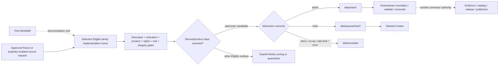

<!-- [KFM_META_BLOCK_V2]
doc_id: kfm://doc/connectors-idigbio-specimens-readme
title: connectors/idigbio/specimens/ — iDigBio Specimen Records Product Sublane
type: readme
version: v0.2
status: draft
owners: OWNER_TBD — Connector steward · Source steward · Flora steward · Fauna steward · Geology liaison · Biodiversity steward · Genetic-material reviewer · Sensitivity reviewer · Rights reviewer · Validation steward · Docs steward
created: 2026-06-19
updated: 2026-07-11
policy_label: public-doctrine; product-sublane; documentation-only-current-state; source-family-aligned; specimen-backed; rights-gated; biodiversity-sensitivity-gated; genetic-material-aware; raw-quarantine-receipts-only; no-publication
truth_posture: CONFIRMED repository documentation / PROPOSED future connector contract / CONFLICTED admitted-set detail / UNKNOWN runtime implementation
related:
  - ../../README.md
  - ../README.md
  - ../../../docs/doctrine/directory-rules.md
  - ../../../docs/sources/catalog/idigbio/README.md
  - ../../../docs/sources/catalog/idigbio/specimen-records.md
  - ../../../docs/sources/catalog/idigbio/media-records.md
  - ../../../docs/sources/catalog/idigbio/portal-dwca-downloads.md
  - ../../../docs/sources/catalog/idigbio/summary-counts.md
  - ../../../docs/sources/catalog/gbif/README.md
  - ../../../docs/domains/flora/README.md
  - ../../../docs/domains/fauna/README.md
  - ../../../docs/domains/geology/README.md
  - ../../../pipelines/domains/flora/ingest/README.md
  - ../../../data/registry/sources/
  - ../../../data/raw/
  - ../../../data/quarantine/
  - ../../../data/receipts/
  - ../../../data/proofs/
  - ../../../policy/rights/
  - ../../../policy/sensitivity/
  - ../../../release/
tags: [kfm, connectors, idigbio, specimens, darwin-core, preserved-specimen, fossil-specimen, material-sample, living-specimen, flora, fauna, geology, biodiversity, source-admission, dedupe, shadowing, geoprivacy, rights, raw, quarantine, receipts, governance]
notes:
  - "At inspected base commit ba8ba881db7782fda757e351ef3a39dbbc917e6a, the target README existed. Repository search surfaced no additional exact-path child, and direct probes for pyproject.toml, src/README.md, and tests/README.md beneath this product path returned Not Found. This is a bounded inspection, not proof that no differently named implementation exists elsewhere."
  - "connectors/idigbio/ is repository-present as the source-family coordination lane. Directory Rules and the connector-root README allow source-family and nested product patterns but do not yet ratify this exact nested implementation path."
  - "The iDigBio family and specimen product pages define specimen-backed corroborative use, direct-institution precedence, record-level rights, sensitivity gates, replay pairing, and cross-domain projection, but they do not prove connector code, SourceDescriptor activation, tests, payloads, receipts, or runtime behavior."
  - "The specimen product page is internally conflicted on the admitted basisOfRecord set: its opening rule names PreservedSpecimen, FossilSpecimen, and MaterialSample, while its detailed table also admits LivingSpecimen; OPEN-IDB-SPEC-01 explicitly leaves the set unresolved."
  - "The repository-present family-folder dossier supersedes neither the still-referenced flat docs/sources/catalog/idigbio.md path nor the missing occurrence-search.md page by implication; those references remain drift or verification items."
[/KFM_META_BLOCK_V2] -->

<a id="top"></a>

# iDigBio Specimen Records Product Sublane

> Documentation and admission contract for the specimen-backed slice of iDigBio under the repository-present `connectors/idigbio/` source family. The path is source-family-aligned but currently documentation-only; no runtime implementation is established by this README.

<p>
  
  
  
  
  
  
  
</p>

`connectors/idigbio/specimens/`

> [!IMPORTANT]
> **Inspected state:** at base commit `ba8ba881db7782fda757e351ef3a39dbbc917e6a`, this README was present. No package metadata, documented source subtree, or documented product-local test subtree was found at the common paths directly probed beneath this directory. No client, parser, fixture, SourceDescriptor, activation decision, source payload, receipt, emitted artifact, or runtime result was verified for this product lane.

> [!CAUTION]
> **Placement posture:** `connectors/` is the source-specific fetch/admission responsibility root, and `connectors/idigbio/` is the repository-present family lane. The connector-root contract describes nested product lanes as a live but unratified pattern. Until an ADR, migration note, accepted package layout, or current implementation evidence settles the product home, this sublane remains documentation-only. That is different from declaring the path permanently deprecated: future implementation may land here only after the source-family package decision is explicit and reversible.

> [!WARNING]
> **Do not encode the specimen filter from prose alone.** The repository's specimen product page conflicts on whether `LivingSpecimen` belongs in the admitted `basisOfRecord` set. The opening rule names `PreservedSpecimen`, `FossilSpecimen`, and `MaterialSample`; the detailed filter table also includes `LivingSpecimen`; `OPEN-IDB-SPEC-01` leaves the decision open. A connector must fail closed until an accepted descriptor, pipeline specification, or policy decision resolves that conflict.

**Quick jumps:** [Purpose](#purpose) · [Placement decision](#placement-decision) · [Verified repository state](#verified-repository-state) · [Authority boundary](#authority-boundary) · [Product scope](#product-scope) · [Source role and precedence](#source-role-and-precedence) · [Identity, dedupe, and shadowing](#identity-dedupe-and-shadowing) · [Rights, sensitivity, and genetic material](#rights-sensitivity-and-genetic-material) · [Time, geometry, and provenance](#time-geometry-and-provenance) · [Replay and evidence pairing](#replay-and-evidence-pairing) · [Registry, access, and lifecycle](#registry-access-and-lifecycle) · [Cross-domain routing](#cross-domain-routing) · [Testing and definition of done](#testing-and-definition-of-done) · [Verification backlog](#verification-backlog) · [Review and rollback](#review-and-rollback)

---

## Purpose

This README defines the present boundary of `connectors/idigbio/specimens/` without upgrading documentation into implementation proof.

It may:

- explain the specimen-record product boundary inside the iDigBio source family;
- preserve record-subset, source-role, rights, attribution, sensitivity, temporal, geometry, dedupe, and replay requirements;
- point maintainers to the parent connector family, specimen product page, bulk DwC-A surface, media surface, direct-source precedence rules, and owning governance roots;
- record conflicts and missing evidence that must be resolved before source activation;
- describe the contract a future source client or parser must satisfy if this path is selected as its implementation home;
- support a reviewed migration, redirect, deprecation, correction, or rollback plan.

It does **not**:

- prove a client, parser, package, fixture, test, descriptor, pipeline, watcher, or runtime exists;
- choose a final package/import name, source ID, query shape, admitted `basisOfRecord` set, pagination strategy, or source activation state;
- define taxonomic truth, conservation status, species presence, habitat truth, fossil age, genetic-data consent, or public-safe precision;
- own canonical dedupe decisions, SourceDescriptor records, schemas, policy, receipts, EvidenceBundles, catalog records, triplets, release decisions, corrections, or rollback artifacts;
- publish occurrence points, ranges, type-locality assertions, material-sample details, media, maps, tiles, reports, public API payloads, or AI answers.

[Back to top ↑](#top)

---

## Placement decision

| Question | Current safe decision | Evidence posture |
|---|---|---:|
| What is the owning responsibility root? | `connectors/`, because the responsibility is source-specific fetch and admission. | **CONFIRMED** by Directory Rules and `connectors/README.md`. |
| What is the owning source-family boundary? | `connectors/idigbio/`, which is repository-present as the parent coordination lane. | **CONFIRMED path / draft authority contract**. |
| Is `connectors/idigbio/specimens/` a confirmed runtime package? | **No.** It is a repository-present documentation sublane with no verified product-local runtime surface. | **CONFIRMED README / UNKNOWN runtime**. |
| Is the nested product shape structurally plausible? | Yes. The connector root recognizes family and nested product patterns. | **PROPOSED / NEEDS VERIFICATION** until ratified. |
| Should runtime code be added here now? | Not without a reviewed source-family package decision, descriptor/activation design, tests, fixtures, and migration/rollback plan. | **NEEDS VERIFICATION**. |
| Does the current family-folder source dossier settle all documentation paths? | No. Current files use `docs/sources/catalog/idigbio/`, while repository docs still reference an absent flat `docs/sources/catalog/idigbio.md` and an absent `occurrence-search.md`. | **CONFLICTED / drift signal**. |
| Can this decision change? | Yes, through an ADR or migration record that names the canonical implementation home, package/import names, source IDs, tests, lineage, redirects, and rollback. | Reversible change required. |

The strongest current evidence supports one iDigBio source-family implementation with product-specific behavior. It does not settle whether specimen behavior should become a module under a parent package, a nested directory package, a configuration-only product filter, or another reviewed family structure.

[Back to top ↑](#top)

---

## Verified repository state

The following snapshot is bounded to the pinned base commit and the paths/searches actually inspected:

```text
connectors/
├── README.md                         # connector-root authority and child README contract
└── idigbio/
    ├── README.md                     # parent family coordination README
    └── specimens/
        └── README.md                 # this product sublane; only exact-path file surfaced

docs/sources/catalog/idigbio/
├── README.md                         # family source dossier
├── specimen-records.md               # specimen product page
├── media-records.md                  # media product page
├── portal-dwca-downloads.md          # bulk, replay-oriented product page
└── summary-counts.md                 # aggregate product page

pipelines/domains/flora/ingest/README.md
                                        # Flora ingest boundary; not connector implementation proof
```

| Surface | Status | What it supports | What it does not prove |
|---|---:|---|---|
| `connectors/idigbio/specimens/README.md` | **CONFIRMED** | The requested product sublane exists as documentation. | Runtime code, canonicality, activation, payloads, or tests. |
| `connectors/idigbio/specimens/pyproject.toml` | **Not found in direct probe** | No package metadata was observed at this common path. | No differently named package exists elsewhere. |
| `connectors/idigbio/specimens/src/README.md` | **Not found in direct probe** | No documented product-local source subtree was observed at this common path. | No parent-family source module exists under another shape. |
| `connectors/idigbio/specimens/tests/README.md` | **Not found in direct probe** | No documented product-local test subtree was observed at this common path. | No repository or parent-family tests cover iDigBio. |
| `connectors/idigbio/README.md` | **CONFIRMED** | Parent family boundary, RAW/QUARANTINE posture, record-level rights/sensitivity, and sublane navigation. | A family package, client, parser, tests, or activation exists. |
| `connectors/idigbio/pyproject.toml`, `connectors/idigbio/src/README.md`, `connectors/idigbio/tests/README.md` | **Not found in direct probes** | Common family-package documentation paths were not observed. | No differently structured implementation exists. |
| `docs/sources/catalog/idigbio/README.md` | **CONFIRMED draft dossier** | Family role, record-subset roles, record-level rights, sensitivity, identifier, and lifecycle doctrine. | Current endpoint behavior, accepted descriptor, or runtime enforcement. |
| `docs/sources/catalog/idigbio/specimen-records.md` | **CONFIRMED draft product page** | Specimen primacy, direct-source shadowing, product filters, type/material-sample handling, replay pairing, and verification backlog. | An accepted implementation contract or conflict resolution. |
| `docs/sources/catalog/idigbio/portal-dwca-downloads.md` | **CONFIRMED draft product page** | A bulk DwC-A surface exists in repository documentation and is proposed as a stronger replay/citation anchor. | A downloaded archive, content digest, rights review, or release exists. |
| `docs/sources/catalog/idigbio.md` | **Not found in direct probe** | The flat path referenced by several docs is not present at the inspected base. | That an ADR has formally retired the flat convention. |
| `docs/sources/catalog/idigbio/occurrence-search.md` | **Not found in direct probe** | The broader occurrence product referenced by specimen docs is not present at the inspected base. | That no equivalent product contract exists under another name. |
| Concrete iDigBio SourceDescriptor, activation decision, source payload, receipt, pipeline run, public artifact | **UNKNOWN** | No accepted artifact was verified in this update. | Nothing should be inferred. |

The prior v0.1 README was introduced by commit `76189f9d565504d791769705e3b8b94c777554c2`. That history proves the file was expanded from a one-line placeholder at that time; it does not justify continuing to describe the current file as newly created or blank.

[Back to top ↑](#top)

---

## Authority boundary

```text
THIS SUBLANE MAY:
  document the specimen product boundary
  preserve source-family and record-subset rules
  describe a future product-specific client/parser contract
  record conflicts, verification gaps, and migration requirements
  point to RAW / QUARANTINE / receipt handoff expectations
  preserve correction, deprecation, and rollback guidance

THIS SUBLANE MUST NOT:
  define source-family doctrine or taxonomic authority
  contain or activate a SourceDescriptor as its authority record
  decide sensitive-taxa lists, rights policy, type-specimen exceptions, or DNA release
  collapse direct-institution, iDigBio, and GBIF records into final canonical truth
  emit accepted species presence, range, habitat, conservation, or geological-age claims
  write WORK, PROCESSED, CATALOG, TRIPLET, PUBLISHED, proof, registry, or release stores
  expose exact sensitive locations, genetic-material details, private-site context, or restricted media
  create public API, map, tile, report, graph, search, vector-index, or AI output
  bypass evidence, policy, validation, review, correction, or rollback gates
```

A future connector implementation may fetch or parse source material and create bounded RAW, QUARANTINE, and receipt handoff candidates. Retrieval success would prove only that bytes or metadata were obtained. It would not prove species presence, taxonomic acceptance, canonical dedupe, rights clearance, public-safe precision, evidence closure, or publication eligibility.

[Back to top ↑](#top)

---

## Product scope

The product page defines this sublane as a specimen-filtered slice of iDigBio's record-search surface. The final admitted set is not yet consistent across the repository documentation.

| `basisOfRecord` class | Current posture for this sublane | Required behavior before implementation |
|---|---|---|
| `PreservedSpecimen` | **PROPOSED admitted** | Preserve physical-voucher identity, institution/collection/catalog identifiers, recordset, provider, rights, event, geometry, uncertainty, and sensitivity state. |
| `FossilSpecimen` | **PROPOSED admitted** | Preserve specimen identity plus geological-context fields; do not turn collection date into fossil age. Route geology projection downstream. |
| `MaterialSample` | **PROPOSED admitted** | Preserve sample type and any genetic-material signal; require elevated sensitivity and rights review where applicable. |
| `LivingSpecimen` | **CONFLICTED** | One product-page table admits it, while the opening rule and family role table omit it. Hold until `OPEN-IDB-SPEC-01` is resolved. |
| `HumanObservation` / `MachineObservation` | Outside this specimen product | Do not silently ingest here. A broader occurrence contract is required; the referenced `occurrence-search.md` page is absent at the inspected base. |
| Generic `Occurrence` or unspecified class | Default hold | Quarantine or deny until the record's basis and product route are resolved. |
| Taxon, Event, Organism, media-only, recordset metadata, or aggregate response | Outside this product | Route to the appropriate family surface and preserve its distinct source role. |

The product filter is identity-bearing. A request that changes the admitted set, Kansas scope, recordset allowlist, date range, spatial filter, or quality threshold is a new request specification and must produce a distinct digest/receipt rather than silently changing prior behavior.

[Back to top ↑](#top)

---

## Source role and precedence

The source-family dossier and product page distinguish **source family**, **record subset**, and **evidence precedence**:

| Material | Required posture | Boundary |
|---|---|---|
| iDigBio specimen record | `observed` / specimen-backed within a corroborative aggregator | Vouchered evidence; not taxonomic, conservation, range, or habitat authority. |
| Direct institutional IPT record for the same physical specimen | Preferred primary evidence | Preserve iDigBio as a corroborating EvidenceRef; do not discard it. |
| GBIF record for the same physical specimen | Canonical-aggregator copy, lower specimen proximity than direct IPT or iDigBio | Preserve source role and evidence lineage; do not flatten aggregator roles. |
| iNaturalist or eBird observation | Separate observation class | Never dedupe against a specimen solely by coordinates/date/name. |
| iDigBio media metadata | Media-attached observation metadata | Media rights and custody remain separate from parent occurrence rights. |
| iDigBio summary count | `aggregate` | Preserve aggregation unit, query scope, time, and recordset coverage. |
| iDigBio recordset metadata | `administrative` | A recordset is not an occurrence. |
| Incomplete, low-quality, rights-unclear, or sensitivity-unresolved record | `candidate` / quarantine | Publication forbidden until disposition is governed. |

Two rules must coexist without confusion:

1. GBIF is documented as KFM's canonical biodiversity **aggregator**.
2. For the same physical specimen, source proximity is documented as **direct institutional source > iDigBio > GBIF**.

Neither rule allows connector code to decide accepted taxon identity, final occurrence truth, or public release.

[Back to top ↑](#top)

---

## Identity, dedupe, and shadowing

A future implementation should preserve source-native identity before any downstream canonicalization:

- iDigBio record UUID;
- provider `occurrenceID` or other stable provider GUID;
- recordset UUID and recordset/provider attribution;
- institution code and identifier;
- collection code and identifier;
- catalog number;
- `basisOfRecord` and type status;
- source ETag/version or modification marker;
- event/collection date, retrieval time, and correction/reissue state;
- source taxon fields and the taxonomic-backbone version used downstream;
- geometry, verbatim locality, coordinate uncertainty, and source-native spatial metadata;
- record-level license, rights holder, citation, and media references;
- response/request digests and connector version.

### Dedupe boundary

The repository documentation proposes an exact specimen key based on institution code plus catalog number, with a coordinate/date/name fallback and direct-source precedence. That is a downstream reconciliation rule, not permission for the connector to erase records.

A safe future connector may emit:

- a normalized **dedupe candidate key**;
- an `authority_precedence_hint` based on a reviewed source-authority register;
- a `shadow_candidate_ref` when a potential direct-source counterpart is known;
- both source EvidenceRefs and the reason for the proposed relationship.

It must not emit final canonical occurrence identity or silently discard the iDigBio copy. Final merge, shadowing, conflict preservation, and correction belong to downstream normalization/reconciliation with receipts, validation, and steward review.

Open implementation details include normalization of case, whitespace, punctuation, collection aliases, historical catalog-number formats, coordinate uncertainty, and institution-code mappings. Hard-coding the illustrative KU/KSU/FHSM table in connector code is forbidden until the source-authority registry owns that mapping.

[Back to top ↑](#top)

---

## Rights, sensitivity, and genetic material

### Record-level rights

A future implementation must preserve each record's license and provider attribution. It must not substitute a family-wide default when the record is missing or ambiguous.

| Rights state | Admission posture |
|---|---|
| Recognized public-use license with required attribution available | Eligible for bounded RAW admission; downstream obligations remain visible. |
| Share-alike license | Eligible only when the derivative obligation is preserved and policy accepts the downstream use. |
| NonCommercial / share-alike license | Quarantine or restricted review by default; no automatic public-layer path. |
| Missing, unrecognized, conflicting, or provider-revoked license | Quarantine or deny; do not infer iDigBio's default. |
| Missing rights holder, citation, or recordset attribution | Quarantine until attribution can be resolved. |

Both per-record rights holder and recordset/provider attribution must remain inspectable. Media licenses remain separate from occurrence licenses.

### Sensitivity posture

Every iDigBio record is **sensitivity-unevaluated at admission**. The connector does not know KFM's current sensitive-taxa lists, cultural-site restrictions, private-property joins, steward corrections, or release decisions.

Required fail-closed triggers include:

- listed, rare, protected, or steward-controlled taxa;
- precise locality on a sensitive site, private parcel, archaeological/cultural context, or restricted collection;
- unusually precise historic locality with weak provenance;
- type-specimen records requiring the unresolved type-locality exception policy;
- material samples that include tissue, DNA extract, eDNA, or other genetic material;
- source/provider restrictions beyond the displayed Creative Commons token;
- join-induced sensitivity created by combining specimen, land, habitat, infrastructure, or person-related data.

The connector may assign a review reason and preserve the source record in RAW or QUARANTINE. It may not generalize coordinates as a final public transform, approve a type-specimen exception, infer consent, or decide that genetic-material details are public-safe. Those operations require policy, transform/redaction receipts, review records, and release decisions in their owning roots.

[Back to top ↑](#top)

---

## Time, geometry, and provenance

Specimen records carry multiple time concepts that must remain distinct:

| Time concept | Meaning | Connector posture |
|---|---|---|
| Collection/event time | When the physical specimen or material sample was collected. | Preserve source value and precision; do not substitute retrieval time. |
| Preparation/accession/catalog time | When the object was prepared, accessioned, or cataloged, when supplied. | Preserve separately; do not collapse into collection date. |
| Geological age | Stratigraphic/chronostratigraphic context of fossil material. | Preserve native geological-context fields; never encode as collection time. |
| Source modification/version time | When provider/iDigBio changed the record. | Preserve ETag/version/modified fields and correction lineage. |
| Retrieval time | When KFM fetched or referenced the response. | Record in run/probe evidence. |
| Release/correction time | Downstream KFM publication and correction events. | Outside connector authority. |

Geometry posture:

- preserve source-native coordinates, verbatim locality, datum/CRS metadata, and uncertainty;
- validate finite numeric bounds without presenting the result as accepted geometry;
- keep point support distinct from county/HUC/generalized support;
- do not use rounded coordinates as proof of a match when source uncertainty is larger than the rounding tolerance;
- do not expose exact sensitive geometry in logs, fixtures, pull-request text, or error messages;
- leave final normalization, generalization, redaction, and public precision to downstream governed transforms.

Provenance should preserve the request/query specification, response digest, pagination/cursor state, endpoint/product surface, source identifiers, connector version, descriptor reference, activation decision, recordset attribution, and any candidate shadow relationship.

[Back to top ↑](#top)

---

## Replay and evidence pairing

The repository's specimen product page treats the synchronous search surface as non-deterministic and proposes a stronger promotion-bearing chain:

```text
iDigBio Search API specimen discovery
  + content-addressed cached response or approved fixture
  + preferably a paired portal DwC-A snapshot for citation/replay
  + provider/recordset attribution
  + request and response digests
  + downstream EvidenceBundle, policy, validation, review, and release
```

Current safe posture:

- API queries may discover or admit candidates only after descriptor activation;
- promotion-bearing use requires a replayable evidence anchor selected by the owning evidence/release contracts;
- a paired DwC-A snapshot is the documented preferred anchor, but no downloaded archive or pairing implementation was verified here;
- live re-fetch is not a substitute for preserving the as-used response;
- unchanged ETag/content should produce a no-op receipt rather than duplicate RAW material;
- partial pagination, rate limits, source outages, schema drift, or changed query semantics must produce finite reviewable outcomes;
- tests use synthetic, minimized, redacted, or explicitly approved fixtures and never auto-refresh from the live service.

[Back to top ↑](#top)

---

## Registry, access, and lifecycle

Before any live interaction, a ratified implementation must verify:

- canonical connector path, package/import name, and product boundary;
- stable source ID, product/surface ID, and aliases;
- concrete SourceDescriptor and activation decision;
- accepted `basisOfRecord` set and non-specimen routing behavior;
- endpoint version, query grammar, Kansas scope, recordset allowlist, pagination, sorting, and maximum result limits;
- cadence, ETag/version behavior, correction/retraction behavior, and outage/rate-limit semantics;
- record-level rights, provider attribution, citation, and media-license separation;
- sensitive-taxa, type-specimen, material-sample, cultural/private-site, and genetic-material review rules;
- direct-institution authority mapping and dedupe-candidate contract;
- approved RAW, QUARANTINE, and receipt handoff interfaces;
- no-network defaults, bounded timeouts/retries, safe logging, and fixture policy.

Expected access posture for an accepted implementation:

- imports and default tests make no live network calls;
- live access requires explicit runtime enablement and an allowed/restricted activation decision;
- requests are product-, geography-, recordset-, date-, page-, and size-bounded;
- pagination is finite and receipt-bearing;
- timeouts, retries, rate-limit handling, forbidden/not-found handling, partial responses, and schema changes have finite outcomes;
- no credentials, signed URLs, private recordsets, exact sensitive locations, or oversized payload excerpts appear in committed files or logs;
- a public endpoint's reachability is not source activation.



Possible connector outcomes, **PROPOSED until matched to accepted contracts**:

- `ADMIT_RAW`
- `QUARANTINE`
- `NO_OP`
- `RATE_LIMITED`
- `ABSTAIN`
- `DENY`
- `ERROR`

This README produces none of those outcomes. It documents the boundary a future implementation must follow.

[Back to top ↑](#top)

---

## Cross-domain routing

A specimen can support multiple domain projections without creating multiple source truths.

1. Capture the iDigBio source response once under one source/product identity.
2. Preserve the specimen-backed source role and source record independently of the consuming domain.
3. Route lineage-preserving candidates downstream:
   - Flora for botanical specimens and herbarium context;
   - Fauna for zoological specimens;
   - Geology for fossil geological context, without moving specimen identity into geology;
   - Habitat only as cited occurrence/context, not habitat truth;
   - sensitive cultural/archaeological co-location only through restricted review;
   - genetic-material context only through the accepted sensitivity and rights policy.
4. Prefer direct institutional evidence when the same physical specimen is available from a registered direct source; retain iDigBio as corroboration.
5. Perform taxonomic resolution, dedupe, conflict reconciliation, georeferencing, generalization, aggregation, and cross-domain joins downstream with explicit inputs, methods, receipts, uncertainty, and review.
6. Do not fetch the same record independently for each domain merely for convenience.
7. Public maps, APIs, reports, exports, search, and AI consume only released public-safe derivatives through governed interfaces.

One capture supporting multiple domains increases the need for one source identity, one provider/recordset attribution chain, one correction lineage, one replayable response history, and explicit domain projection receipts.

[Back to top ↑](#top)

---

## Testing and definition of done

Executable tests belong in the accepted iDigBio family test authority or another repository-standard location selected by implementation evidence. They do not belong beneath this documentation-only sublane until placement is ratified.

### Required test classes for a future implementation

- import safety and no-network defaults;
- explicit SourceDescriptor and activation gates;
- endpoint/product version and bounded-query configuration;
- admitted-set conflict resolution and `basisOfRecord` routing;
- `PreservedSpecimen`, `FossilSpecimen`, `MaterialSample`, and any approved `LivingSpecimen` behavior;
- non-specimen, generic, missing, malformed, and changed-vocabulary records;
- record-level license, rights holder, citation, recordset/provider attribution, share-alike, NonCommercial, missing, and unknown-license cases;
- sensitive taxon, sensitive site, historic uncertainty, type-specimen, material-sample, genetic-material, and join-induced sensitivity cases;
- direct-institution precedence and shadow-candidate preservation without record loss;
- no cross-class dedupe against eBird/iNaturalist-style observations;
- identifier, case/whitespace/punctuation, alias, and historical catalog-number normalization;
- collection/event, accession, modification, retrieval, geological-age, correction, and stale-state separation;
- geometry bounds, datum/CRS, verbatim locality, uncertainty, and no-sensitive-log behavior;
- pagination, sorting, duplicate pages, partial pages, ETag/no-op, rate limit, timeout, retry, forbidden, not-found, outage, and schema-drift behavior;
- request/response digest and replay-anchor pairing;
- RAW versus QUARANTINE versus receipt outcomes;
- refusal to write WORK, PROCESSED, CATALOG, TRIPLET, PUBLISHED, proof, registry, release, API, UI, map, tile, search, or AI outputs.

Fixture rules:

1. Prefer synthetic, minimal, purpose-specific specimen-shaped fixtures.
2. Mark every fixture `synthetic`, `minimized`, `redacted`, `generalized`, or `approved`.
3. Preserve only fields required to test product class, source role, identifiers, attribution, rights, time, geometry, uncertainty, sensitivity, dedupe candidate, and replay behavior.
4. Include valid and invalid records for every admitted and denied `basisOfRecord` class.
5. Include paired direct-institution/iDigBio/GBIF records for one synthetic physical specimen to test precedence without data loss.
6. Include separate observation-class records to prove no cross-class dedupe.
7. Include type-specimen and material-sample cases without real sensitive coordinates or genetic sequences.
8. Never auto-refresh committed fixtures from the live iDigBio service.
9. Never place source payload fixtures beneath `connectors/idigbio/specimens/` while it remains documentation-only.

### Definition of done

- [x] The target README and bounded common-path inspection are pinned to a base commit.
- [x] Connector-root, parent-family, product-doc, bulk-evidence, domain, pipeline, registry, policy, evidence, and release responsibilities are separated.
- [x] Stale statements that the current README was blank and the unresolved rollback SHA placeholder are removed.
- [x] The internal `LivingSpecimen` admitted-set conflict is visible and fail-closed.
- [x] Specimen primacy, direct-source precedence, record-level rights, sensitivity-unevaluated admission, replay pairing, fossil context, and genetic-material cautions are preserved.
- [x] This path is explicitly documentation-only in the inspected state without declaring it permanently deprecated.
- [ ] An ADR, migration note, or accepted family package layout selects the canonical iDigBio implementation and test homes.
- [ ] The admitted `basisOfRecord` set and non-specimen routing contract are accepted.
- [ ] Source ID, aliases, SourceDescriptor, activation, endpoint/query/pagination behavior, recordset scope, cadence, and rights are verified.
- [ ] Direct-institution authority mapping, dedupe normalization, shadow-candidate shape, and correction behavior are accepted.
- [ ] Sensitive-taxa, type-specimen, material-sample/genetic, fossil, cultural/private-site, and public-precision policies are accepted.
- [ ] Executable offline tests and public-safe fixtures prove all required negative and lifecycle cases.
- [ ] RAW/QUARANTINE/receipt integrations, replay evidence, pipeline orchestration, CI, correction, withdrawal, and rollback are verified.
- [ ] Stale flat-dossier and missing occurrence-product references are reconciled or recorded in the drift/verification registers.

The exact test runner, package manager, live-test flag, workflow names, required-check set, and implementation module names remain **NEEDS VERIFICATION**.

[Back to top ↑](#top)

---

## Verification backlog

| Item | Status | Needed evidence |
|---|---:|---|
| Confirm complete child inventory beneath `connectors/idigbio/specimens/`. | **NEEDS VERIFICATION** | Non-truncated recursive tree at the current ref. |
| Select the canonical iDigBio family and specimen implementation/package layout. | **NEEDS VERIFICATION / ADR-class if paths move** | Accepted ADR or migration record, package metadata, imports, and repository diff. |
| Confirm no differently named iDigBio client/parser exists elsewhere. | **UNKNOWN** | Recursive code search, package metadata, imports, tests, and runtime evidence. |
| Resolve the admitted `basisOfRecord` set, especially `LivingSpecimen`. | **CONFLICTED** | Accepted descriptor/spec/policy resolving `OPEN-IDB-SPEC-01`. |
| Define routing for non-specimen records while `occurrence-search.md` is absent. | **NEEDS VERIFICATION** | Accepted family product map or restored/replaced product page. |
| Reconcile family-folder source docs with stale flat `docs/sources/catalog/idigbio.md` references. | **NEEDS VERIFICATION / drift** | ADR, docs index decision, redirects, and link validation. |
| Confirm stable source ID, product/surface ID, aliases, SourceDescriptor, and activation. | **NEEDS VERIFICATION** | Registry records, schema validation, and steward decision. |
| Confirm current endpoint/version, query grammar, Kansas scope, recordset scope, pagination, sorting, limits, cadence, ETag, and correction behavior. | **NEEDS VERIFICATION** | Current official-source review plus bounded source-steward test. |
| Confirm record-level license tokens, missing-license behavior, provider attribution, citation, share-alike, and NonCommercial policy. | **NEEDS VERIFICATION** | Reviewed rights record, fixtures, policy decision, and tests. |
| Confirm sensitive-taxa union, public precision, type-specimen exception, private/cultural-site handling, and join-induced sensitivity. | **NEEDS VERIFICATION** | Policy bundles, review criteria, redaction/generalization contracts, and tests. |
| Confirm `MaterialSample` kind enumeration and genetic-material handling. | **NEEDS VERIFICATION** | Accepted contract/schema, rights/sensitivity decision, and fixtures. |
| Confirm fossil geological-context fields and Geology projection. | **NEEDS VERIFICATION** | Domain contracts, normalizer mapping, fixtures, and lineage tests. |
| Confirm direct-institution authority mapping and dedupe normalization. | **NEEDS VERIFICATION** | Source-authority registry, accepted identity contract, and deterministic tests. |
| Confirm replay-anchor requirement, cached-response authority, and DwC-A pairing behavior. | **NEEDS VERIFICATION** | Evidence contract, fixture manifest, pairing receipt, replay test, and promotion gate. |
| Confirm approved RAW, QUARANTINE, and receipt targets for Flora, Fauna, and Geology consumers. | **NEEDS VERIFICATION** | Admission contract, lifecycle configuration, and integration tests. |
| Confirm fixture authority, test runner, live-test policy, CI wiring, and substantive check depth. | **UNKNOWN** | Package config, fixture manifest, workflows, job steps, and current logs. |
| Confirm correction, withdrawal, provider-license revocation, cache invalidation, and rollback behavior. | **NEEDS VERIFICATION** | Correction notices, release manifests, rollback artifacts, and tests. |
| Confirm no public client reads connector, registry, RAW, QUARANTINE, or unreleased specimen material directly. | **NEEDS VERIFICATION** | API/UI code, access policy, tests, and runtime evidence. |

[Back to top ↑](#top)

---

## Review and rollback

Before merge, rollback means closing the draft pull request and abandoning the scoped branch.

After merge, create a transparent revert of the commit that introduced this v0.2 product-sublane contract and rerun applicable documentation, connector, Flora, Fauna, Geology, rights, sensitivity, citation, link, validation, policy-boundary, and rollback checks. Do not rewrite shared history.

Rollback or correction is required if this README is used to justify:

- runtime code, credentials, fixtures, tests, source payloads, or caches beneath this path without a reviewed placement decision;
- treating the nested path as canonical merely because it is source-family-aligned;
- activating iDigBio without a SourceDescriptor, activation decision, product filter, rights, role, sensitivity, integrity, and steward review;
- silently choosing `LivingSpecimen` admission while the repository evidence remains conflicted;
- routing non-specimen records into this product because the broader occurrence page is missing;
- collapsing direct institutional, iDigBio, and GBIF copies without preserving EvidenceRefs and authority precedence;
- treating specimen evidence as accepted taxonomic, species-presence, range, habitat, conservation, fossil-age, or genetic-data truth;
- applying a source-wide license, losing provider/recordset attribution, or exposing restricted media;
- releasing exact sensitive locations, type localities, genetic-material details, private/cultural-site context, or restricted recordsets without governed policy and review;
- bypassing RAW/QUARANTINE/receipt, evidence, policy, validation, review, release, correction, or rollback controls;
- direct use of connector, registry, RAW, QUARANTINE, or unreleased specimen material by public API, maps, tiles, reports, graphs, search, vector indexes, or AI.

---

## Maintainer note

Keep this sublane narrow, source-family-aware, and reversible. iDigBio specimen records can provide strong vouchered corroboration, especially when paired with a replayable evidence anchor, but their aggregator role, direct-source precedence, product class, rights, provider attribution, sensitivity, temporal support, geometry uncertainty, type/material/fossil context, dedupe state, evidence state, and release state must remain visible from admission through every downstream use.

<p align="right"><a href="#top">Back to top</a></p>
