<!-- [KFM_META_BLOCK_V2]
doc_id: kfm://doc/connectors-inaturalist-readme
title: connectors/inaturalist/ — iNaturalist Connector Coordination Lane
type: readme
version: v0.1
status: draft
owners: OWNER_TBD — Connector steward · Source steward · Fauna steward · Flora steward · Biodiversity steward · Sensitivity reviewer · Rights reviewer · Validation steward · Docs steward
created: 2026-06-19
updated: 2026-06-19
policy_label: public-doctrine; biodiversity-sensitivity-gated; rights-gated; no-publication
proposed_path: connectors/inaturalist/README.md
truth_posture: CONFIRMED path exists / PROPOSED connector-family contract / IMPLEMENTATION DEPTH NEEDS VERIFICATION
related:
  - ../README.md
  - ../../docs/sources/catalog/inaturalist/README.md
  - ../../docs/sources/catalog/gbif/README.md
  - ../../docs/sources/catalog/idigbio/README.md
  - ../../docs/sources/catalog/ebird/README.md
  - ../../docs/domains/fauna/README.md
  - ../../docs/domains/flora/README.md
  - ../../docs/sources/SOURCE_DESCRIPTOR_STANDARD.md
  - ../../data/registry/sources/fauna/
  - ../../data/registry/sources/flora/
  - ../../data/raw/fauna/
  - ../../data/quarantine/fauna/
  - ../../data/raw/flora/
  - ../../data/quarantine/flora/
  - ../../fixtures/
  - ../../schemas/contracts/v1/source/
  - ../../schemas/contracts/v1/biodiversity/
  - ../../policy/sensitivity/
  - ../../policy/rights/
  - ../../release/
tags: [kfm, connectors, inaturalist, biodiversity, fauna, flora, occurrence, community-observation, geoprivacy, rights, source-admission, raw, quarantine, governance]
notes:
  - "This README replaces a thin greenfield stub with a governed parent connector README."
  - "The iNaturalist source profile treats iNaturalist as a community-observation source family, useful as occurrence evidence but not legal-status, regulatory, taxonomic, or sensitive-location authority."
  - "Operational facts such as endpoint, auth posture, rate limits, and per-record rights handling remain NEEDS VERIFICATION before activation."
  - "Connector output may enter RAW or QUARANTINE handoff only; downstream validation, EvidenceBundle closure, redaction/generalization, catalog/triplet projection, release review, publication, correction, and rollback remain outside this folder."
  - "Implementation files, SourceDescriptor records, fixtures, tests, CI wiring, record-grade handling, and public-release classes remain NEEDS VERIFICATION."
[/KFM_META_BLOCK_V2] -->

<a id="top"></a>

# iNaturalist Connector Coordination Lane

> Parent source-admission surface for iNaturalist biodiversity observations. It is **not** a regulatory authority, taxonomic authority, sensitive-location authority, public occurrence layer, or publication path.

<p>
  
  
  
  
  
</p>

> [!IMPORTANT]
> **Status:** `experimental` directory README · **Owner:** `OWNER_TBD`  
> **Path:** `connectors/inaturalist/README.md`  
> **Truth posture:** `CONFIRMED` file exists · `PROPOSED` connector-family contract · `NEEDS VERIFICATION` implementation depth  
> **Boundary:** source-admission coordination only; no public claims, no direct publication, no authority over sensitive records.

**Quick jumps:** [Scope](#scope) · [Repo fit](#repo-fit) · [Accepted inputs](#accepted-inputs) · [Exclusions](#exclusions) · [Evidence ledger](#evidence-ledger) · [Lifecycle diagram](#lifecycle-diagram) · [Admission posture](#admission-posture) · [Validation](#validation) · [Rollback](#rollback) · [Verification backlog](#verification-backlog)

---

## Scope

`connectors/inaturalist/` is the parent connector coordination lane for iNaturalist source admission.

It may contain connector-family documentation, compatibility notes, no-network fixture rules, SourceDescriptor-gate notes, rights and geoprivacy validation expectations, and source-admission envelopes for iNaturalist-shaped observation material.

It must not become species-presence truth, taxonomic truth, legal/listed-status truth, sensitive-record authority, source descriptor authority, schema authority, policy authority, catalog/triplet authority, proof authority, release authority, pipeline authority, or publication authority.

[Back to top ↑](#top)

---

## Repo fit

| Surface | Role | Status |
|---|---|---:|
| `connectors/inaturalist/` | Parent connector coordination lane for iNaturalist source admission. | **CONFIRMED path / NEEDS VERIFICATION implementation depth** |
| `docs/sources/catalog/inaturalist/README.md` | Human-facing iNaturalist source catalog profile. | **CONFIRMED** |
| `docs/domains/fauna/` | Fauna-domain consumer surface for public-safe occurrence evidence. | **CONFIRMED via source profile** |
| `docs/domains/flora/` | Flora-domain consumer surface for public-safe occurrence evidence. | **CONFIRMED via source profile** |
| `data/registry/sources/fauna/` and `data/registry/sources/flora/` | Candidate SourceDescriptor registry homes. | **PROPOSED / NEEDS VERIFICATION** |
| `data/raw/fauna/`, `data/raw/flora/` | Candidate RAW handoff targets. | **PROPOSED / NEEDS VERIFICATION** |
| `data/quarantine/fauna/`, `data/quarantine/flora/` | Quarantine targets for unresolved rights, sensitivity, taxonomy, geometry, or grade questions. | **PROPOSED / NEEDS VERIFICATION** |
| `release/` | Release and publication controls. | **Out of scope for this connector** |

> [!NOTE]
> The source profile explicitly says endpoint, authentication, rate limits, per-record license handling, and rights posture remain **NEEDS VERIFICATION** before connector activation. This README preserves that boundary rather than filling in operational details from memory.

[Back to top ↑](#top)

---

## Accepted inputs

Material belongs here only when it supports governed iNaturalist source admission.

Accepted content:

- parent connector README and navigation notes;
- no-network fixture rules and test expectations;
- SourceDescriptor activation notes;
- parser expectations for observation records, licenses, geoprivacy state, observation grade, taxon fields, media links, and coordinates;
- rights, license, attribution, and geoprivacy preservation expectations;
- validation notes for `OccurrenceEvidenceObject`-shaped material;
- quarantine criteria for unresolved rights, taxonomy, grade, geometry, sensitivity, or source-shape issues.

---

## Exclusions

This folder must not contain or imply authority over:

- public release decisions;
- published species occurrence, range, habitat, or conservation-status claims;
- taxonomic backbone decisions;
- legal/listed-status decisions;
- exact sensitive-record release;
- direct writes to `PROCESSED`, `CATALOG`, `TRIPLET`, `PUBLISHED`, proof, receipt, or release stores;
- SourceDescriptor authority records;
- policy or schema authority;
- generated summaries presented as authoritative biodiversity truth;
- source activation without rights, sensitivity, source-role, observation-grade, geometry, taxonomy, and review checks.

Redirect those responsibilities to the appropriate source registry, policy, schema, validation, release, or domain documentation surface.

[Back to top ↑](#top)

---

## Directory map

Current-session evidence confirms this README file. Full child inventory remains **NEEDS VERIFICATION**.

```text
connectors/
└── inaturalist/
    └── README.md        # CONFIRMED — this parent connector README
```

---

## Evidence ledger

| Source | Status | Supports | Limits |
|---|---:|---|---|
| `connectors/inaturalist/README.md` | **CONFIRMED** | Target file exists and previously held a thin greenfield stub. | Does not prove endpoint, auth, rate-limit, parser, test, or CI implementation. |
| `docs/sources/catalog/inaturalist/README.md` | **CONFIRMED** | iNaturalist is a community-observation source family; useful as occurrence evidence; not legal/listed-status, regulatory, taxonomic, or sensitive-record authority. | Does not prove connector activation or implementation maturity. |
| iNaturalist source-profile rights section | **CONFIRMED** | Per-record license handling is required; unverified rights fail closed; endpoint, auth, rate limits, and terms remain NEEDS VERIFICATION. | Does not supply current external API values. |
| iNaturalist source-profile geoprivacy section | **CONFIRMED** | Source geoprivacy and KFM sensitivity policy stack additively; restricted records require governed handling before release. | Does not prove policy-code enforcement. |
| `connectors/inaturalist/` child tree | **NEEDS VERIFICATION** | Parent README path exists. | Child files, tests, package layout, fixtures, and workflows remain unverified. |

---

## Lifecycle diagram

This diagram is doctrine-aligned and implementation-light. It shows responsibility boundaries, not confirmed runtime wiring.

```mermaid
flowchart LR
  A[iNaturalist source material] --> B[SourceDescriptor gate]
  B --> C{Admission decision}
  C -->|allowed with limits| D[RAW handoff]
  C -->|needs review| Q[QUARANTINE handoff]
  C -->|denied| X[No connector activation]
  D --> E[Rights and license validation]
  Q --> E
  E --> F[Geoprivacy and sensitivity review]
  F --> G[Taxonomy and observation-grade validation]
  G --> H[EvidenceBundle and policy review]
  H --> I[Catalog or triplet projection]
  I --> R[Release review]
  R --> P[Published public-safe artifact]

  classDef gate fill:#fff3e0,stroke:#ef6c00,color:#5d4037;
  classDef stop fill:#ffebee,stroke:#c62828,color:#b71c1c;
  classDef work fill:#e3f2fd,stroke:#1565c0,color:#0d47a1;
  classDef pub fill:#e8f5e9,stroke:#2e7d32,color:#1b5e20;

  class B,C,E,F,G,H,R gate;
  class X stop;
  class A,D,Q,I work;
  class P pub;
```



[Back to top ↑](#top)

---

## Admission posture

Expected behavior for iNaturalist connector-family work:

- no live source access unless explicitly enabled and reviewed;
- no source fetch without a SourceDescriptor and activation decision;
- no implicit publication from retrieved source material;
- no elevation of iNaturalist into legal/listed-status, regulatory, taxonomic, or sensitive-record authority;
- no conversion of observation rows into confirmed species-presence, range, habitat, or conservation-status claims;
- no loss of observation ID, attribution where allowed, license, geoprivacy state, observation grade, taxon fields, event date, geometry, uncertainty, source role, sensitivity, review, or release-class metadata;
- unclear rights, source role, observation grade, taxonomic identity, geometry, date, geoprivacy, sensitivity, or schema drift routes to quarantine or abstention.

---

## Validation

Connector-local validation should check that:

- source metadata is preserved;
- SourceDescriptor references are required for activation;
- observation ID, source URL/identifier, license, attribution, geoprivacy state, observation grade, taxon fields, event date, geometry, uncertainty, source-role, sensitivity, review, and vintage fields are explicit where available;
- malformed or incomplete responses fail closed;
- records with unclear geometry, missing rights, missing attribution, unresolved source role, unresolved taxon, or unresolved sensitivity route to quarantine;
- iNaturalist records remain source-admission candidates until downstream validation;
- no connector run writes directly to processed, catalog, triplet, published, proof, receipt, or release stores;
- fixture data is synthetic, minimized, redacted, generalized, or approved for committed use.

Root-level validation, policy-as-code, redaction/generalization, EvidenceBundle closure, release review, public caveats, and rollback remain outside this connector.

[Back to top ↑](#top)

---

## Definition of done

This connector-family README is ready for first review when:

- [ ] iNaturalist source profile is linked and current enough for review.
- [ ] SourceDescriptor homes and iNaturalist source IDs are verified.
- [ ] Endpoint, auth posture, rate limits, and terms are verified by source steward review.
- [ ] Live source access is disabled by default for connector code.
- [ ] Per-record rights/license, geoprivacy, observation-grade, taxonomy, and anti-collapse checks are represented in tests.
- [ ] Observation ID, attribution, license, geoprivacy state, observation grade, taxon fields, event date, geometry, uncertainty, source role, sensitivity, review, and vintage metadata are preserved in parser output.
- [ ] Connector output is limited to RAW or QUARANTINE handoff.
- [ ] No public claims are created by connector code.
- [ ] Tests cover no-network, malformed, incomplete, rights-unclear, attribution-unclear, role-collapse, taxon-unclear, geoprivacy-unclear, geometry-unclear, sensitivity-unclear, schema-drift, and boundary cases.

---

## Rollback

Rollback is required if this README is used to justify direct publication, source activation, role collapse, taxonomic authority, legal/listed-status authority, species-presence authority, sensitive-record release, or bypass of `SourceDescriptor`, rights, sensitivity, policy, validation, review, release, or rollback gates.

Rollback target:

```text
commit prior to this update: SHA_TBD_AFTER_GIT_HISTORY_CHECK
```

Because the previous file was a thin greenfield stub, a safe rollback is to restore that stub or replace this document with a shorter compatibility-only README until source activation and connector implementation are verified.

---

## Verification backlog

| Item | Status | Needed evidence |
|---|---:|---|
| Confirm actual iNaturalist connector inventory below this path. | **NEEDS VERIFICATION** | Repo tree or mounted workspace. |
| Confirm iNaturalist SourceDescriptor homes and source IDs. | **NEEDS VERIFICATION** | Source registry entries and accepted schemas. |
| Confirm endpoint, auth posture, rate limits, and current source terms. | **NEEDS VERIFICATION** | Source steward review and current source documentation. |
| Confirm research-grade vs. non-research-grade admission policy. | **NEEDS VERIFICATION** | SourceDescriptor decision and domain-steward review. |
| Confirm per-record rights, license, attribution, and geoprivacy preservation. | **NEEDS VERIFICATION** | Parser tests, rights policy, and fixture tests. |
| Confirm sensitivity handling. | **NEEDS VERIFICATION** | Sensitivity policy, redaction/generalization transform, and steward review. |
| Confirm taxonomy anchoring and controlled-vocabulary resolution. | **NEEDS VERIFICATION** | Taxonomy registry, parser tests, and validation report. |
| Confirm fixture strategy and CI wiring. | **NEEDS VERIFICATION** | Fixture registry, workflow files, and test logs. |

---

## Maintainer note

The previous file asked maintainers to define endpoints, rate limits, descriptors, and ingest receipts. This README keeps that work visible while preventing the stub from implying source activation, public release, or implementation maturity. Keep this connector narrow until the SourceDescriptor, rights handling, sensitivity handling, fixtures, and tests are verified.

[Back to top ↑](#top)
