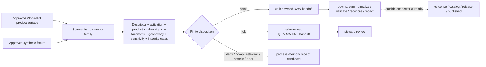

<!-- [KFM_META_BLOCK_V2]
doc_id: kfm://doc/connectors-inaturalist-readme
title: connectors/inaturalist/ — iNaturalist Source-Family Connector Contract
type: readme
version: v0.2
status: draft
owners: OWNER_TBD — Connector steward · Source steward · Python/package steward · Test steward · Fauna steward · Flora steward · Biodiversity/taxonomy steward · Rights reviewer · Sensitivity/geoprivacy reviewer · Validation steward · Docs steward
created: 2026-06-19
updated: 2026-07-12
policy_label: public-doctrine; source-family-connector; repository-present; implementation-placeholder; no-network-by-default; descriptor-and-activation-gated; product-explicit; rights-gated; geoprivacy-preserving; sensitivity-fail-closed; raw-quarantine-receipts-only; no-publication
path: connectors/inaturalist/README.md
truth_posture: CONFIRMED repository scaffold and current child contracts / PROPOSED family API, product routing, implementation sequence, and finite outcomes / CONFLICTED descriptor, registry, schema, and adjacent documentation details / UNKNOWN package installability, executable tests, activation, source access, runtime behavior, and public-client coupling
related:
  - ../README.md
  - ./pyproject.toml
  - ./observations/README.md
  - ./src/README.md
  - ./src/inaturalist/README.md
  - ./src/inaturalist/__init__.py
  - ./src/inaturalist/fetch.py
  - ./src/inaturalist/admit.py
  - ./src/inaturalist/descriptor.yaml
  - ./tests/README.md
  - ../fauna/inaturalist/README.md
  - ../../docs/doctrine/directory-rules.md
  - ../../docs/sources/catalog/inaturalist/README.md
  - ../../docs/sources/catalog/inaturalist/research-grade-observations.md
  - ../../docs/sources/catalog/inaturalist.md
  - ../../docs/domains/fauna/CANONICAL_PATHS.md
  - ../../contracts/domains/fauna/occurrence_evidence.md
  - ../../schemas/contracts/v1/domains/fauna/occurrence_evidence.schema.json
  - ../../schemas/contracts/v1/source/source_descriptor.schema.json
  - ../../schemas/contracts/v1/sources/source_descriptor.schema.json
  - ../../data/registry/sources/
  - ../../data/registry/fauna/sources/inaturalist.yaml
  - ../../data/raw/fauna/inaturalist/README.md
  - ../../pipeline_specs/flora/inaturalist_ingest.yaml
  - ../../policy/rights/flora/inaturalist_usage.md
  - ../../policy/rights/
  - ../../policy/sensitivity/
  - ../../data/receipts/
  - ../../data/proofs/
  - ../../release/
tags: [kfm, connectors, inaturalist, source-family, observations, research-grade, biodiversity, fauna, flora, occurrence-evidence, rights, taxonomy, geoprivacy, sensitivity, replay, raw, quarantine, receipts, no-network, fail-closed, governance]
notes:
  - "At inspected base commit 61fe6cb90249f8504609644d96ff03560b21910b, the source-first connector family, observation product README, package/source-root READMEs, test README, placeholder project metadata, empty package initializer, placeholder fetch/admit modules, and connector-local descriptor were present."
  - "The observation, Python package, and connector-test READMEs are v0.2 contracts on main; this parent README remained v0.1 and contained a stale one-file directory map plus receipt-store exclusions that conflicted with current connector-root doctrine."
  - "The parent pyproject.toml reserves kfm-connector-inaturalist version 0.0.0; no build backend, dependencies, package discovery, Python version, install command, or stable import API is verified."
  - "The connector-local descriptor.yaml and data/registry/fauna/sources/inaturalist.yaml are unresolved placeholders and are not accepted SourceDescriptor or activation authority."
  - "The rich singular SourceDescriptor schema identifies the plural schema path as canonical, while the plural schema is still a permissive empty scaffold. Treat descriptor validation as CONFLICTED until governance resolves it."
  - "This revision coordinates documentation and a safe implementation sequence only. It creates no executable connector behavior, endpoint choice, source activation, source payload, fixture, test, policy decision, or public artifact."
[/KFM_META_BLOCK_V2] -->

<a id="top"></a>

# iNaturalist Source-Family Connector Contract

> Parent contract for the source-first iNaturalist connector family. This lane may support bounded source retrieval, preservation, parsing, admission decisions, and RAW / QUARANTINE / process-memory receipt handoffs. It must not become biodiversity truth, policy authority, release authority, or a public client path.

<p>
  
  
  
  
  
  
  
  
</p>

`connectors/inaturalist/`

> [!IMPORTANT]
> **Inspected state:** at base commit `61fe6cb90249f8504609644d96ff03560b21910b`, this source-family lane contains coordinated v0.2 observation-product, package, and test contracts, but executable implementation remains a placeholder: project version `0.0.0`, empty `__init__.py`, one-line `fetch.py` and `admit.py`, and an unresolved local descriptor. No package build, import proof, accepted SourceDescriptor, activation decision, live source access, source payload, connector-local test collection, emitted source-run receipt, or runtime result was verified.

> [!CAUTION]
> **Never activate from connector-local placeholders.** `src/inaturalist/descriptor.yaml` carries `role: TBD`, `rights: TBD`, and `sensitivity_floor: public`; the fauna-scoped registry template also contains unresolved fields. Neither is SourceDescriptor or activation authority. Missing, conflicting, stale, or permissive authority fails closed.

> [!WARNING]
> **Source family is not product.** Every request, response, parsed record, admission decision, handoff candidate, and receipt must carry explicit source-family and product identity. The current promotion-track product is research-grade observation evidence with recognized normalized Creative Commons rights and controlled-taxonomy resolution. Casual or otherwise non-research-grade material must not be silently routed through it.

> [!WARNING]
> **Source geoprivacy is evidence, not a puzzle to solve.** Open, obscured, private, generalized, missing, and policy-restricted spatial states are distinct. Connector code must not deobscure, infer, back-fill, log, or publish exact restricted coordinates.

**Quick jumps:** [Purpose](#purpose) · [Placement and canonicality](#placement-and-canonicality) · [Current repository state](#current-repository-state) · [Family navigation](#family-navigation) · [Authority boundary](#authority-boundary) · [Source family and products](#source-family-and-products) · [Descriptor activation and registry](#descriptor-activation-and-registry) · [Source role and claim boundary](#source-role-and-claim-boundary) · [Identity rights and attribution](#identity-rights-and-attribution) · [Geoprivacy sensitivity and public precision](#geoprivacy-sensitivity-and-public-precision) · [Quality grade and taxonomy](#quality-grade-and-taxonomy) · [Time geometry and provenance](#time-geometry-and-provenance) · [Access admission and finite outcomes](#access-admission-and-finite-outcomes) · [Replay correction and withdrawal](#replay-correction-and-withdrawal) · [Cross-domain routing](#cross-domain-routing) · [Security logging and privacy](#security-logging-and-privacy) · [Testing and CI evidence](#testing-and-ci-evidence) · [Implementation sequence](#implementation-sequence) · [Definition of done](#definition-of-done) · [Verification backlog](#verification-backlog) · [Review and rollback](#review-and-rollback)

---

## Purpose

This README coordinates the iNaturalist source family so maintainers can implement it through small, reversible changes without mistaking documentation, placeholders, green workflows, or public endpoint reachability for an operational connector.

The family lane may eventually:

- dispatch explicitly approved iNaturalist products through one source-first implementation;
- construct deterministic, bounded request specifications from caller-supplied descriptor and activation inputs;
- invoke an injected transport only after explicit network enablement;
- preserve response identity and integrity before parsing;
- parse source-native observations without dropping record identity, grade, rights, taxonomy, time, geometry/support, uncertainty, geoprivacy, media references, or lineage;
- assemble finite admission outcomes from caller-supplied governance decisions;
- return candidate objects or write through explicit caller-owned RAW, QUARANTINE, and process-memory receipt interfaces;
- support deterministic replay, no-op detection, correction, deletion, and withdrawal;
- serve Fauna and Flora without creating domain-first connector duplicates.

This lane does **not**:

- define or approve iNaturalist source doctrine, product doctrine, SourceDescriptor, SourceActivationDecision, rights policy, taxonomy authority, sensitivity policy, public-precision profile, or release decision;
- choose a current endpoint, API version, authentication method, rate limit, cadence, source term, or credential source from memory;
- treat research-grade as KFM truth, canonical taxonomy, legal status, conservation status, public safety, or release approval;
- turn observations into accepted species presence, abundance, range, habitat, monitoring, specimen, voucher, or sensitive-site truth;
- write WORK, PROCESSED, CATALOG, TRIPLET, PUBLISHED, proof, registry, or release state;
- publish maps, tiles, reports, exports, public API payloads, search/index entries, graph edges, stories, or AI answers;
- expose connector internals or unreleased source material to normal public clients.

[Back to top ↑](#top)

---

## Placement and canonicality

| Question | Current safe decision | Evidence posture |
|---|---|---:|
| What is the owning root? | `connectors/`, because the primary responsibility is source-specific fetch and admission. | **CONFIRMED** by Directory Rules §4 Step 1 and §7.3. |
| What is the canonical source-family lane? | `connectors/inaturalist/`, organized by source rather than consumer domain. | **CONFIRMED path / draft family contract**. |
| What is `connectors/fauna/inaturalist/`? | A noncanonical compatibility pointer. No code, tests, descriptors, credentials, or runtime behavior may accumulate there. | **CONFIRMED compatibility contract**. |
| Where does product doctrine live? | `docs/sources/catalog/inaturalist/`, with `observations/` as the repository-present connector-side product documentation sublane. | **CONFIRMED docs / PROPOSED detailed product layout**. |
| Where does shared runtime code live? | The accepted package under `connectors/inaturalist/src/inaturalist/`. | **CONFIRMED reserved path / implementation placeholder**. |
| Where do connector-local tests live? | The existing `connectors/inaturalist/tests/` lane, unless a later reviewed migration changes test authority. | **CONFIRMED README / executable coverage UNKNOWN**. |
| Does this README ratify a package API or endpoint? | No. | **NEEDS VERIFICATION**. |
| Does any directory presence activate the source? | No. Activation requires an accepted descriptor and explicit activation decision. | **CONFIRMED boundary**. |

Directory Rules basis:

1. A source-specific fetcher/admitter belongs under `connectors/`.
2. Connector output is limited to RAW, QUARANTINE, and receipt handoffs.
3. Domain-specific semantics, schemas, policy, tests, lifecycle data, release state, and public clients remain in their responsibility roots.
4. This revision creates no root, no parallel schema/contract/policy/registry/release/proof/receipt home, and no lifecycle phase.
5. A future package move, product split, descriptor-home decision, or test-authority move must carry a migration record or ADR when it changes authority.

[Back to top ↑](#top)

---

## Current repository state

This snapshot is bounded to base commit `61fe6cb90249f8504609644d96ff03560b21910b`, the direct paths inspected, and the repository documents cited here.

```text
connectors/
├── README.md
├── fauna/
│   └── inaturalist/
│       └── README.md                         # noncanonical compatibility pointer
└── inaturalist/                              # canonical source-first family lane
    ├── README.md                             # this parent contract
    ├── pyproject.toml                        # project name + version 0.0.0 only
    ├── observations/
    │   └── README.md                         # v0.2 product contract
    ├── src/
    │   ├── README.md                         # v0.1 source-root contract; drift remains
    │   └── inaturalist/
    │       ├── README.md                     # v0.2 package contract
    │       ├── __init__.py                   # empty
    │       ├── fetch.py                      # one-line placeholder
    │       ├── admit.py                      # one-line placeholder
    │       └── descriptor.yaml               # unresolved local placeholder; not authority
    └── tests/
        └── README.md                         # v0.2 test contract; tests unverified

docs/sources/catalog/inaturalist/
├── README.md                                 # v2 source-family profile
└── research-grade-observations.md            # current promotion-track product

data/registry/fauna/sources/inaturalist.yaml   # PROPOSED legacy/drift-shaped template
data/registry/sources/README.md                # canonical registry responsibility
schemas/contracts/v1/source/source_descriptor.schema.json
schemas/contracts/v1/sources/source_descriptor.schema.json
contracts/domains/fauna/occurrence_evidence.md
schemas/contracts/v1/domains/fauna/occurrence_evidence.schema.json
data/raw/fauna/inaturalist/README.md
```

| Surface | Observed state | Safe conclusion |
|---|---|---|
| Parent README | v0.1 before this revision; blob `25bf26eb804b5c16835466fd093c91b7229d28f1`. | Parent documentation exists but was stale against current children. |
| `pyproject.toml` | `kfm-connector-inaturalist`, version `0.0.0`; no verified build backend, dependencies, discovery, Python constraint, or test config. | Distribution identity is reserved; package readiness is unknown. |
| `__init__.py` | Empty. | No stable public package surface is implemented. |
| `fetch.py` / `admit.py` | One-line placeholders. | Fetch and admission responsibility names are reserved; behavior is not implemented. |
| Connector-local `descriptor.yaml` | `role: TBD`, `rights: TBD`, `sensitivity_floor: public`. | Unsafe placeholder; never registry, policy, or activation authority. |
| Observation README | v0.2 source-product contract. | Product boundary is documented; product runtime is not proven. |
| Package README | v0.2 package contract. | API and module plan are documented; code is not proven. |
| Test README | v0.2 hermetic test contract. | Expected coverage is documented; executable collection is not proven. |
| Source-root README | v0.1 with incomplete inventory and older receipt-store exclusions. | Adjacent documentation drift remains; this PR does not silently rewrite it. |
| Fauna compatibility README | v0.2, source-first pointer. | Domain-first implementation is forbidden there. |
| Fauna-scoped registry YAML | PROPOSED template with unresolved role, rights, sensitivity, cadence, and access. | Not a schema-valid accepted descriptor or activation decision. |
| Flat `data/registry/sources/inaturalist.yaml` | Not found in direct probe. | No descriptor was observed at that exact path; alternate accepted paths remain possible. |
| Singular SourceDescriptor schema | Rich shape whose metadata calls the plural path canonical and itself legacy. | Migration intent is documented. |
| Plural SourceDescriptor schema | Permissive empty scaffold. | Canonical machine enforcement remains conflicted. |
| Live request, payload, source-run receipt, package build/import, connector test count, deployment | Not verified. | Do not infer operation. |

The v0.1 parent README was introduced by commit `2c239dce7ae3b52d892d7a23c6876edcbc300b22`, replacing a three-line greenfield stub. That history does not justify describing the current file as blank or newly created.

[Back to top ↑](#top)

---

## Family navigation

| Surface | Owns | Must not own |
|---|---|---|
| [`README.md`](./README.md) | Source-family placement, shared authority boundary, product dispatch posture, lifecycle handoff, implementation sequence, family backlog. | Product field mapping, package internals, executable test claims, descriptor authority, release. |
| [`observations/README.md`](./observations/README.md) | Observation-product scope, research-grade admission bar, rights/geoprivacy/taxonomy requirements, product-specific tests. | Parent package ownership, live activation, public occurrence truth. |
| [`src/README.md`](./src/README.md) | Source-layout boundary. | Second connector, policy/schema/release authority. |
| [`src/inaturalist/README.md`](./src/inaturalist/README.md) | Package API and internal design contract, import behavior, finite outcomes, dependency direction. | Source doctrine, activation, policy, public clients. |
| [`tests/README.md`](./tests/README.md) | Hermetic connector-test contract, synthetic fixtures, fake transport/sinks, evidence language. | Green-test-as-release approval, unmanaged live data, policy authority. |
| [`../fauna/inaturalist/README.md`](../fauna/inaturalist/README.md) | Compatibility pointer and fauna consumer context. | Any connector implementation or independent admission behavior. |
| [`docs/sources/catalog/inaturalist/`](../../docs/sources/catalog/inaturalist/README.md) | Source-family and product doctrine. | Executable connector mechanics. |
| [`data/registry/sources/`](../../data/registry/sources/README.md) | SourceDescriptor instances, controlled source vocabulary, supersession. | Connector code, raw payloads, policy decisions, secrets. |
| `policy/rights/`, `policy/sensitivity/` | Allow, deny, restrict, abstain decisions and public-safety posture. | Source transport mechanics. |
| `release/`, `data/proofs/`, `data/published/` | Review, proof closure, release decision, public-safe artifact, correction, rollback. | Source admission shortcuts. |

A child README may refine this parent contract but must not widen authority. When documents disagree, preserve the conflict and use the governing doctrine, accepted ADR, registry, contract, schema, policy, tests, and current implementation evidence in authority order.

[Back to top ↑](#top)

---

## Authority boundary

```text
FAMILY MAY:
  document source-family and product routing
  define pure connector types, protocols, constants, and deterministic helpers
  consume caller-supplied descriptor and activation decisions
  normalize explicit bounded request specifications
  invoke an injected transport only after explicit activation
  preserve source-native records and response integrity
  assemble finite connector decisions
  return candidates or use caller-owned RAW / QUARANTINE / receipt interfaces
  support replay, no-op, correction, deletion, and withdrawal lineage

FAMILY MUST NOT:
  auto-discover or approve SourceDescriptor records
  load connector-local descriptor.yaml as authority
  invent source role, product identity, rights, taxonomy, sensitivity, or public precision
  contact the network at import time or in default tests
  deobscure or infer exact coordinates
  silently upgrade casual/non-research-grade records
  collapse observations with specimens, surveys, telemetry, eDNA, models, or aggregates
  write WORK / PROCESSED / CATALOG / TRIPLET / PUBLISHED / proof / registry / release
  expose public API, UI, map, tile, report, story, search, graph, vector-index, or AI payloads
  treat connector/test receipts as EvidenceBundle, proof, review, catalog, or release closure
```

The safest default is **candidate construction with no write**. A write-capable adapter is permitted only after target contracts, caller ownership, permissions, idempotency, integrity, rollback, and tests are verified.

[Back to top ↑](#top)

---

## Source family and products

`inaturalist` identifies the source family. A product identifies the bounded record class and admission contract being requested.

| Product or material | Current posture | Connector consequence |
|---|---:|---|
| Research-grade observations with recognized normalized CC rights and controlled-taxonomy resolution | Current promotion-track product | May continue through all remaining descriptor, role, sensitivity, integrity, and review gates. |
| Casual or otherwise non-research-grade observations | `OPEN-INAT-01` unresolved | Candidate / quarantine only; do not inherit research-grade treatment. |
| Captive/cultivated or disputed-quality observations | NEEDS VERIFICATION | Preserve flags and route to reviewed disposition. |
| Observation media metadata | Separate rights surface | Preserve media references and rights separately; do not mirror bytes by default. |
| Derived density/richness products | Separate aggregate product | Require explicit aggregation unit, method, lineage, and `AggregationReceipt`; no record-level truth inheritance. |
| Modeled products derived from observations | Separate modeled product | Require model identity and `ModelRunReceipt`; never relabel as observed. |
| User/profile or recordset administration | Administrative material only when explicitly approved | Does not represent occurrence evidence. |

Every transport request and parsed batch must pin a product ID/version. Unknown product identity returns `ABSTAIN`, `DENY`, or `QUARANTINE`; it must never fall back to a permissive default.

[Back to top ↑](#top)

---

## Descriptor activation and registry

### Required preconditions

Before any live request or promotion-track fixture is treated as representative, the caller must supply or resolve:

- an accepted SourceDescriptor reference and validated descriptor content;
- a SourceActivationDecision with allowed/restricted scope;
- explicit source-family and product IDs and versions;
- approved geography, taxon, date, page, record, retry, timeout, and total-work bounds;
- rights and attribution posture;
- source-role decision;
- taxonomy crosswalk decision;
- source geoprivacy state handling;
- KFM sensitivity and review decisions;
- caller-owned RAW, QUARANTINE, and receipt interfaces;
- safe clock, transport, identifier, logging, and integrity dependencies.

### Known conflicts

| Conflict | Current posture | Safe behavior |
|---|---:|---|
| Connector-local `descriptor.yaml` vs. governed registry | Local file is unresolved and permissive. | Never auto-load; fail closed. |
| Fauna-scoped registry template vs. source-first family scope | Template is PROPOSED and fauna-only while iNaturalist spans Fauna and Flora. | Do not treat as family-wide authority; resolve through registry governance. |
| Singular vs. plural SourceDescriptor schemas | Rich singular schema calls plural path canonical; plural path is an empty scaffold. | Do not claim schema closure; use accepted validator/ADR before activation. |
| Source profile proposes biodiversity or domain-keyed descriptor homes | Exact accepted instance path remains unresolved. | Keep path `NEEDS VERIFICATION`; do not create a third parallel home. |
| Source IDs (`EXT-INAT`, `inat`, registry aliases) | Multiple identifiers serve different layers. | Preserve every namespace and define deterministic crosswalks; do not silently choose one global ID. |

Descriptor corrections produce a new descriptor and lineage/correction record. Do not mutate source-role, rights, sensitivity, or authority history in place.

[Back to top ↑](#top)

---

## Source role and claim boundary

| Material | Permitted source-role posture | Boundary |
|---|---|---|
| Research-grade iNaturalist observation | `observed` as community-observation evidence | Not regulatory, legal-status, canonical-taxonomy, range, habitat, abundance, or sensitive-site authority. |
| Non-research-grade record | `candidate` unless a separate accepted product says otherwise | Must not inherit research-grade admission or release posture. |
| Derived density/richness | `aggregate` with explicit unit and method | Aggregate cells do not prove individual occurrence, abundance, completeness, or exact location. |
| Model based on observations | `modeled` with model-run lineage | Must not be represented as observed material. |
| Source/profile/recordset metadata | `administrative` only when vocabulary permits | Does not represent an organism occurrence. |
| Rights-, taxonomy-, role-, geometry-, time-, or sensitivity-unresolved material | `candidate` / quarantine | No promotion-track or public use. |

Anti-collapse rules:

1. Source family is not product.
2. Product grade is not truth status.
3. Research-grade is not legal status, canonical taxonomy, public-safe geometry, or release approval.
4. Observation is not specimen, voucher, survey, telemetry, acoustic detection, eDNA sample, range polygon, population estimate, or habitat model.
5. Source geoprivacy is not KFM release approval.
6. Record rights are not family-wide rights.
7. Observation rights and media rights remain separate.
8. Aggregates and models do not inherit record-level identity or proof.
9. Connector/test receipts are process memory, not evidence or publication closure.
10. Maps, tiles, indexes, graphs, summaries, and generated language remain downstream carriers.

Preserve iNaturalist, GBIF, iDigBio, institutional, eBird, EDDMapS, and agency source identity. Do not destructively deduplicate records solely because taxon, place, and time appear similar.

[Back to top ↑](#top)

---

## Identity rights and attribution

Minimum carriers, when exposed by the approved product, include:

- source-family ID, product ID/version, and aliases;
- source record/observation ID and stable source reference;
- source record version or modification marker;
- quality grade and relevant quality flags;
- source taxon ID, names, rank, identification state, and controlled-taxonomy resolution references;
- observed/event time, source creation/update time, retrieval time, and run snapshot time;
- source geometry/support, positional accuracy or uncertainty, and geoprivacy state;
- original and normalized observation-license values;
- rights holder and minimized attribution fields where lawful and required;
- media-reference IDs and separate per-media rights;
- descriptor reference, activation-decision reference, request identity, page/cursor state, response digest, connector/parser version, outcome, and lineage.

Rights are evaluated at the narrowest available level:

| Rights state | Admission posture |
|---|---|
| Recognized CC observation license and required attribution available | Eligible for bounded RAW admission only after all other gates pass. |
| NonCommercial or ShareAlike terms | Preserve obligations; downstream use requires reviewed compatibility. |
| All-rights-reserved, missing, unrecognized, conflicting, or revoked | Quarantine or deny; never infer permission. |
| Required attribution missing or unsafe to expose | Quarantine until a lawful minimized citation path exists. |
| Media has separate rights | Preserve separately; observation license does not authorize media-byte mirroring, caching, redistribution, republication, or model training. |
| Rights change after capture or release | Trigger re-evaluation, correction/withdrawal, and cache invalidation. |

Do not put tokens, cookies, private profile fields, user contact details, oversized source bodies, or unnecessary personal data in committed files, logs, receipts, PRs, fixtures, or public artifacts.

[Back to top ↑](#top)

---

## Geoprivacy sensitivity and public precision

Every record remains sensitivity-unevaluated at source admission until governed KFM policy resolves taxon, site, source, rights, and join context.

The connector must preserve enough source state to distinguish:

- open coordinates;
- obscured coordinates;
- private coordinates;
- generalized, place-only, or administrative support;
- missing or invalid support;
- platform- or observer-applied restrictions;
- upstream state changes over time.

The connector must not:

- reconstruct exact coordinates;
- replace an obscured region with a centroid and call it exact;
- treat private geometry as missing data to repair;
- infer location from media, text, timestamps, nearby records, user history, or external joins;
- expose precise restricted geometry in errors, logs, metrics, fixtures, diffs, screenshots, or documentation.

KFM policy applies in addition to upstream geoprivacy. Fail-closed triggers include rare/protected taxa, nests/dens/roosts/hibernacula/spawning sites, private property, cultural or archaeological context, infrastructure joins, media location metadata, changed taxon or rights state, and join-induced re-identification risk.

The connector may preserve source geometry in governed RAW or QUARANTINE storage and attach review reasons. It does not create public-safe geometry. Deterministic generalization, named redaction profiles, `RedactionReceipt`, public precision, and release review are downstream responsibilities.

[Back to top ↑](#top)

---

## Quality grade and taxonomy

### Quality grade

- Preserve research-grade, casual/non-research-grade, and unknown states distinctly.
- Preserve source quality flags and the source facts needed to interpret them.
- Do not upgrade or downgrade a record through generated-language judgment.
- Keep captive/cultivated, duplicate, date/location-disputed, missing-media, and other flags explicit.
- Record source grade changes as source-state changes, not silent overwrites.

### Taxonomy

iNaturalist taxonomy is source taxonomy, not KFM canonical taxonomy. A future implementation must:

1. preserve source taxon ID, name, rank, and identification context;
2. retain source taxonomy/retrieval version where available;
3. resolve against an accepted KFM controlled vocabulary through a reviewed crosswalk;
4. preserve ITIS, GBIF Backbone, or other authority IDs and versions used;
5. surface disagreements rather than silently selecting a name;
6. quarantine or deny when the current product requires resolution and none exists;
7. keep taxonomic reconciliation separate from source observation identity.

`OPEN-INAT-02` remains unresolved for ITIS/GBIF tie-breaking. This family contract does not settle it.

[Back to top ↑](#top)

---

## Time geometry and provenance

Different times remain distinct:

| Time concept | Meaning | Connector posture |
|---|---|---|
| Observed/event time | When the organism/evidence was reported observed. | Preserve value, precision, timezone posture, and uncertainty. |
| Source creation/acceptance time | When the platform created/accepted the record. | Preserve separately when available. |
| Source modification time | When grade, identification, rights, geoprivacy, or record content changed. | Preserve version markers and lineage. |
| Retrieval time | When KFM fetched or referenced the source. | Record in process memory. |
| Query/run snapshot time | When a bounded response set was materialized. | Record with request digest and pagination state. |
| Release time | When a downstream public-safe derivative was released. | Outside connector authority. |
| Correction/withdrawal time | When KFM state was superseded, corrected, or withdrawn. | Outside connector authority but must remain linkable. |

Geometry/support rules:

- preserve source geometry/support and geoprivacy state;
- preserve positional accuracy/uncertainty where available;
- distinguish point, obscured region, place boundary, administrative support, generalized support, and missing geometry;
- validate finite numeric bounds without presenting geometry as admitted or public-safe;
- never equate map display precision with evidence precision;
- never expose exact restricted geometry through observability surfaces.

Provenance should preserve source family, product, endpoint/distribution identity, normalized request specification, page/cursor state, response digest, source record ID/version, descriptor reference, activation decision, connector/parser version, access outcome, retry/rate-limit state, and RAW/QUARANTINE/receipt references.

[Back to top ↑](#top)

---

## Access admission and finite outcomes

### Access posture

- live access is disabled unless explicitly enabled and descriptor/activation gated;
- importing the package performs no observable I/O or source activation;
- requests are product-, geography-, taxon-, date-, page-, record-, retry-, timeout-, and total-work bounded;
- pagination is finite and receipt-bearing;
- credentials and private query values never enter committed files or logs;
- public endpoint reachability is not activation;
- default tests use fakes and synthetic fixtures;
- committed fixtures never auto-refresh from the live service.

### Family flow



Proposed outcome vocabulary, pending accepted machine contracts:

| Outcome | Meaning |
|---|---|
| `ADMIT_RAW` | All supplied source, product, role, rights, taxonomy, sensitivity, integrity, and review gates permit bounded RAW handoff. |
| `QUARANTINE` | Material may be retained for review/remediation but is not promotion-track eligible. |
| `NO_OP` | Accepted source version/content/request result is unchanged. |
| `RATE_LIMITED` | Source throttled the request; bounded retry evidence remains visible. |
| `ABSTAIN` | Scope or support is insufficient for a safe connector decision. |
| `DENY` | Descriptor, activation, rights, sensitivity, product, or policy blocks the operation. |
| `ERROR` | Transport, parsing, integrity, storage, contract, or implementation failure occurred. |

Expected governance conditions should use stable outcome/reason codes, not only free-text exceptions. Errors must not leak credentials, private coordinates, raw bodies, or user context.

[Back to top ↑](#top)

---

## Replay correction and withdrawal

Live re-fetch is not replay. A promotion-bearing run needs a bounded pairing:

```text
accepted SourceDescriptor + SourceActivationDecision
  + source-family and product identity
  + normalized bounded request + page/cursor state
  + retrieval/snapshot time
  + content-addressed response, approved source reference, or synthetic fixture
  + response digest + connector/parser version
  + record identity, grade, role, rights, taxonomy, geometry, geoprivacy, sensitivity inputs
  + finite per-record and batch decisions
  + RAW / QUARANTINE / process-memory receipt references
```

Required behavior:

- unchanged source version, ETag, or digest produces `NO_OP` where supported;
- duplicate/partial pages and cursor loops become explicit finite outcomes;
- source deletion or withdrawal preserves prior lineage and opens governed correction/withdrawal work;
- grade, identification, license, geoprivacy, and taxonomy changes create new source-state lineage;
- failed handoff does not erase prior receipt or lineage information;
- connector receipts support audit and replay but do not close EvidenceBundle or release proof.

[Back to top ↑](#top)

---

## Cross-domain routing

Capture each source record once under one source-family and product identity, then route lineage-preserving candidates downstream.

| Consumer lane | Permitted use | Boundary |
|---|---|---|
| Fauna | Animal occurrence evidence. | Not conservation/legal status, abundance, range, habitat, or sensitive-site truth. |
| Flora | Plant occurrence evidence. | Not rare-plant authority, vegetation-community truth, or restoration truth. |
| Habitat | Cited public-safe occurrence context. | Never habitat truth or suitability proof by itself. |
| Agriculture | Reviewed taxonomic/invasive-species context. | Not crop condition, yield, or production truth. |
| Hazards | Separate mortality, disease, invasive, or event contracts when evidence/policy allow. | Not emergency or life-safety authority. |

Perform taxonomic reconciliation, identity matching, aggregation, public generalization, and domain projection downstream with explicit methods, uncertainty, receipts, and review. Do not independently fetch/store the same source record for each consumer domain merely for convenience.

Public maps, APIs, reports, exports, search, graphs, and AI use only released public-safe derivatives through governed interfaces.

[Back to top ↑](#top)

---

## Security logging and privacy

Use structured allowlists.

Safe by default:

- run ID;
- source-family and product IDs;
- connector/parser version;
- request/response digests and page ordinal;
- safe endpoint-family label, not secret-bearing URL text;
- response status class;
- record/outcome counts;
- duration and bounded retry count;
- stable outcome/reason codes;
- non-sensitive RAW/QUARANTINE/receipt references.

Forbidden by default:

- API keys, tokens, authorization headers, cookies, signed URLs, or private query values;
- raw response bodies or oversized excerpts;
- exact private, obscured, restricted, or sensitive coordinates;
- observer contact details, private profile/place context, or user history;
- media bytes, EXIF, or embedded location;
- unredacted exception locals;
- local descriptor contents presented as authority;
- public-safe claims not backed by release state.

Logging configuration belongs to the caller. Importing the package must not configure root loggers or emit log lines.

[Back to top ↑](#top)

---

## Testing and CI evidence

The family-level test contract lives at [`tests/README.md`](./tests/README.md). Before executable connector behavior can be claimed, substantive tests must prove:

- isolated build/install/import behavior and zero import side effects;
- no-network defaults and fail-fast socket protection;
- rejection of connector-local placeholders as authority;
- descriptor, activation, product, and bounded-scope requirements;
- research-grade versus casual/non-research-grade routing;
- quality-flag preservation;
- observation and media-rights variants;
- minimized attribution and no-private-user-field logging;
- source taxonomy preservation and controlled-taxonomy disagreement;
- open/obscured/private/generalized/missing/changed geoprivacy;
- sensitive taxon/site and join-induced sensitivity;
- refusal to deobscure or infer exact locations;
- time/support/uncertainty preservation;
- pagination, duplicate/partial pages, timeout, retry, rate limit, outage, deletion, withdrawal, and schema drift;
- response digest, record version, replay, and no-op;
- per-record mixed-batch outcomes;
- candidate-only default and RAW/QUARANTINE/receipt-only fake sinks;
- refusal to write or expose downstream/public authority surfaces.

A valid evidence statement names the commit, exact command, collected test count, result, covered assertions, skipped live tests, and environment limitations. Repository-level `make test`, a workflow name, or a green placeholder step does not prove the iNaturalist connector works.

No executable connector-local test collection was verified by this documentation revision.

[Back to top ↑](#top)

---

## Implementation sequence

Use one coherent capability per pull request. Do not jump directly to live network access.

| Step | Smallest useful change | Required proof | Rollback |
|---|---|---|---|
| 0 | Reconcile inventory; remove, migrate, or formally isolate local `descriptor.yaml`; resolve schema/registry posture. | Pinned inventory, governance decision, negative auto-load test. | Restore placeholder while keeping network disabled. |
| 1 | Complete package metadata and add import-side-effect tests only. | Isolated build/install/import report and no-network/no-secret assertions. | Revert packaging/import commit. |
| 2 | Add immutable IDs, request/product models, finite outcomes, reason codes, and deterministic query canonicalization. | Serialization and digest tests. | Revert pure-core files. |
| 3 | Add parser with synthetic observation fixtures. | Field-preservation, malformed-input, unknown-value, privacy, and no-sensitive-log tests. | Revert parser/fixtures. |
| 4 | Add pure validation/admission assembly using supplied decisions. | Product, grade, rights, taxonomy, geoprivacy, sensitivity, mixed-batch negative tests. | Revert decision modules. |
| 5 | Add candidate and receipt builders with in-memory caller-owned sinks. | Candidate-only default, idempotency, no-op, integrity, boundary, and failure tests. | Revert adapters. |
| 6 | Add injected fake transport and bounded fetch mechanics. | Timeout, retry, rate-limit, pagination, partial-response, cursor-loop, and drift tests. | Revert transport adapter. |
| 7 | Add replay, correction, deletion, and withdrawal behavior. | Prior-lineage and changed-source-state tests. | Revert replay capability. |
| 8 | Consider separately activated live transport. | Current official-source review, accepted descriptor/activation, rights/sensitivity approval, bounded run receipt, safe logs, disable switch. | Disable network and revert adapter. |
| 9 | Add or split another product only after product/module placement is accepted. | Product ID/version, contract, migration note if needed, and substantive tests. | Revert product module without changing family authority. |

Do not pre-create empty modules, tests, or fixtures to imply maturity. Update this README and affected child contracts when behavior materially changes.

[Back to top ↑](#top)

---

## Definition of done

### This documentation revision

- [x] Target, base commit, prior blob, and history are pinned.
- [x] Current parent, product, package, source-root, test, compatibility, registry, schema, and placeholder states are visible.
- [x] The stale one-file directory map is replaced by the current source-family tree.
- [x] Receipt support is reconciled with connector-root and child v0.2 doctrine.
- [x] Source-first placement and domain-first compatibility boundaries are explicit.
- [x] Descriptor, activation, product, source role, rights, taxonomy, geoprivacy, sensitivity, time, geometry, replay, lifecycle, test, and public-client boundaries are explicit.
- [x] Conflicts are surfaced rather than silently resolved.
- [x] No endpoint, credential, source payload, runtime behavior, executable test, policy decision, or public artifact is claimed.

### Operational family

- [ ] Owners and required reviewers are assigned.
- [ ] Complete recursive source/package/test/import inventory is recorded.
- [ ] Local `descriptor.yaml` is removed, migrated, or formally classified and cannot activate access.
- [ ] SourceDescriptor schema and registry-home conflicts are resolved.
- [ ] Stable source-family/product IDs, versions, aliases, and crosswalks are accepted.
- [ ] Package build backend, Python support, dependencies, discovery, import API, and version policy are accepted.
- [ ] Import-side-effect and no-network tests pass.
- [ ] Deterministic request, parser, validation, admission, outcome, handoff, receipt, and replay contracts are implemented.
- [ ] Rights, attribution, taxonomy, grade, geoprivacy, sensitivity, time, geometry, integrity, and mixed-batch cases fail closed.
- [ ] RAW/QUARANTINE/receipt interfaces are caller-owned, accepted, idempotent, and tested.
- [ ] Endpoint, auth, pagination, retry, rate limits, cadence, source terms, deletion, correction, and outage behavior are verified.
- [ ] Substantive CI reports exact test command/count/results and blocks empty collection.
- [ ] Live access remains separately activated, bounded, auditable, reversible, and disabled by default.
- [ ] Public clients are proven unable to import connector internals or read unreleased material.

[Back to top ↑](#top)

---

## Verification backlog

| Item | Status | Evidence required |
|---|---:|---|
| Complete recursive inventory under `connectors/inaturalist/` and repository-wide import/test search. | **NEEDS VERIFICATION** | Current tree, code search, import graph, and test collection. |
| Confirm package build backend, discovery, Python versions, dependencies, install command, and stable import API. | **NEEDS VERIFICATION** | Accepted `pyproject.toml`, build logs, isolated install/import tests. |
| Resolve connector-local `descriptor.yaml`. | **CONFLICTED / high priority** | Registry decision, migration/deletion/classification, negative auto-load test. |
| Resolve singular/plural SourceDescriptor schemas and validators. | **CONFLICTED** | Accepted schema/ADR, fixtures, validator output, migration record. |
| Reconcile fauna-scoped registry template with source-first family and current registry doctrine. | **NEEDS VERIFICATION / drift** | Registry inventory, accepted descriptor instance, validation report. |
| Confirm stable external/family/product IDs and aliases (`EXT-INAT`, `inat`, registry IDs). | **NEEDS VERIFICATION** | Source-catalog and registry decision. |
| Resolve non-research-grade product `OPEN-INAT-01`. | **OPEN** | Source, Fauna, Flora, rights, and sensitivity steward decision. |
| Resolve ITIS/GBIF tie-breaking `OPEN-INAT-02`. | **OPEN** | Biodiversity/taxonomy decision and deterministic fixtures/tests. |
| Resolve captive/cultivated and other quality-flag dispositions. | **NEEDS VERIFICATION** | Product contract and negative tests. |
| Verify current endpoint, API version, auth, query, pagination, limits, rate limits, cadence, source terms, outage, deletion, and correction behavior. | **NEEDS VERIFICATION** | Current official-source review and bounded governed tests. |
| Verify observation and media rights, attribution, caching, redistribution, training, revocation, and withdrawal. | **NEEDS VERIFICATION** | Rights review, source terms, policy fixtures, tests. |
| Confirm source geoprivacy mapping, sensitivity registers, public-precision profiles, media-location handling, and join-induced sensitivity. | **NEEDS VERIFICATION** | Policy bundles, redaction contracts, fixtures, reviewer evidence. |
| Confirm response/reference storage, request/response digest, record-version handling, no-op identity, replay, deletion, and withdrawal contracts. | **NEEDS VERIFICATION** | Receipt/replay contracts and integration tests. |
| Confirm approved RAW, QUARANTINE, and process-memory receipt interfaces for Fauna and Flora. | **NEEDS VERIFICATION** | Contracts, adapters, permissions, idempotency tests. |
| Confirm substantive connector, descriptor, rights, taxonomy, geoprivacy, sensitivity, and lifecycle CI. | **UNKNOWN** | Workflow definitions, job steps, test counts, logs, artifacts. |
| Reconcile `src/README.md` and any older adjacent README inventory/receipt language. | **NEEDS VERIFICATION / drift** | Focused documentation follow-up and link validation. |
| Confirm no public API/UI, map, tile, report, search, graph, vector index, or AI imports connector internals or reads unreleased observations. | **NEEDS VERIFICATION** | App/import graph, access policy, boundary tests, runtime evidence. |

[Back to top ↑](#top)

---

## Review and rollback

Before merge, rollback means closing the draft pull request and abandoning its scoped branch.

After merge, create a transparent revert of the commit introducing this v0.2 family contract and its paired generated receipt, then rerun applicable documentation, package/import, connector, descriptor, schema, rights, taxonomy, geoprivacy, sensitivity, receipt, validation, policy-boundary, citation, correction, and rollback checks. Do not rewrite shared history.

Concrete prior-state target: v0.1 blob `25bf26eb804b5c16835466fd093c91b7229d28f1` at base commit `61fe6cb90249f8504609644d96ff03560b21910b`.

Rollback or correction is required if this README is used to justify:

- claiming package readiness, executable tests, endpoint behavior, activation, payloads, or emitted receipts without evidence;
- auto-loading connector-local placeholders or treating `sensitivity_floor: public` as authority;
- creating a second iNaturalist connector under Fauna, Flora, or another consumer domain;
- routing non-research-grade records through the research-grade product without accepted governance;
- treating research-grade as truth, canonical taxonomy, legal status, species presence, habitat/range, or release approval;
- applying one family-wide rights grant or collapsing observation/media rights;
- deobscuring, inferring, logging, or publishing exact restricted locations;
- bypassing RAW, QUARANTINE, receipt, evidence, policy, validation, review, release, correction, withdrawal, or rollback controls;
- allowing public clients, maps, search, graphs, indexes, or AI to use connector internals or unreleased material directly.

Required reviewers are **NEEDS VERIFICATION** because role-specific CODEOWNERS coverage for this path was not established in this update. At minimum, review should cover connector/source ownership, Python packaging/testing, Fauna or Flora semantics, biodiversity/taxonomy, rights, sensitivity/geoprivacy, validation, and documentation.

---

## Maintainer note

Keep this lane source-first, product-explicit, no-network by default, descriptor/activation gated, rights-visible, geoprivacy-preserving, sensitivity-fail-closed, and reversible.

The family becomes credible when its repository evidence can show exact package behavior, test collection, descriptor authority, bounded source access, finite outcomes, replay, correction, and caller-owned handoffs. A polished README, a reachable endpoint, or a green placeholder workflow is not that evidence.

<p align="right"><a href="#top">Back to top</a></p>
