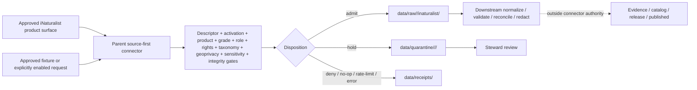

<!-- [KFM_META_BLOCK_V2]
doc_id: kfm://doc/connectors-inaturalist-observations-readme
title: connectors/inaturalist/observations/ — iNaturalist Observation Records Product Sublane
type: readme
version: v0.2
status: draft
owners: OWNER_TBD — Connector steward · Source steward · Fauna steward · Flora steward · Biodiversity steward · Taxonomy steward · Rights reviewer · Sensitivity/geoprivacy reviewer · Validation steward · Docs steward
created: 2026-06-19
updated: 2026-07-12
policy_label: public-doctrine; product-sublane; repository-present; parent-scaffold-backed; research-grade-default; rights-gated; geoprivacy-gated; sensitivity-fail-closed; raw-quarantine-receipts-only; no-publication
path: connectors/inaturalist/observations/README.md
truth_posture: CONFIRMED repository scaffold and doctrine / PROPOSED future observation-product implementation / CONFLICTED descriptor schema and documentation details / UNKNOWN activation and runtime behavior
related:
  - ../../README.md
  - ../README.md
  - ../pyproject.toml
  - ../src/README.md
  - ../src/inaturalist/README.md
  - ../tests/README.md
  - ../../fauna/inaturalist/README.md
  - ../../../docs/doctrine/directory-rules.md
  - ../../../docs/sources/catalog/inaturalist/README.md
  - ../../../docs/sources/catalog/inaturalist/research-grade-observations.md
  - ../../../docs/sources/catalog/inaturalist.md
  - ../../../docs/domains/fauna/CANONICAL_PATHS.md
  - ../../../contracts/domains/fauna/occurrence_evidence.md
  - ../../../schemas/contracts/v1/domains/fauna/occurrence_evidence.schema.json
  - ../../../schemas/contracts/v1/source/source_descriptor.schema.json
  - ../../../schemas/contracts/v1/sources/source_descriptor.schema.json
  - ../../../data/registry/sources/
  - ../../../data/registry/fauna/sources/inaturalist.yaml
  - ../../../data/raw/fauna/inaturalist/README.md
  - ../../../pipeline_specs/flora/inaturalist_ingest.yaml
  - ../../../policy/rights/flora/inaturalist_usage.md
  - ../../../data/receipts/
  - ../../../data/proofs/
  - ../../../release/
tags: [kfm, connectors, inaturalist, observations, research-grade, biodiversity, occurrence-evidence, fauna, flora, source-admission, rights, geoprivacy, sensitivity, taxonomy, raw, quarantine, receipts, governance]
notes:
  - "At inspected base commit c607263b6134049effd64140da7f7a85be8cd01f, this README, the source-first parent connector scaffold, its package placeholder, source-root and test READMEs, placeholder fetch/admit modules, connector-local descriptor placeholder, and adjacent source/product/domain/lifecycle documents were present."
  - "The parent package is reserved as kfm-connector-inaturalist version 0.0.0, but fetch.py and admit.py contain placeholder comments, __init__.py is empty, and no executable observation-product implementation or passing connector test was verified."
  - "The connector-local descriptor.yaml and data/registry/fauna/sources/inaturalist.yaml are placeholders with unresolved role, rights, sensitivity, cadence, and access fields; they are not accepted SourceDescriptor or activation authority."
  - "The connector-local descriptor's sensitivity_floor: public conflicts with the source profile's unknown-sensitivity fail-closed posture and must not authorize admission."
  - "The current promotion-track product doctrine is research-grade plus normalized Creative Commons license plus controlled-taxonomy resolution. Non-research-grade observations remain a separate unresolved product question."
[/KFM_META_BLOCK_V2] -->

<a id="top"></a>

# iNaturalist Observation Records Product Sublane

> Product-level documentation and admission boundary for iNaturalist observation records beneath the repository-present, source-first `connectors/inaturalist/` family. The parent family has a greenfield package scaffold, but this product sublane has no verified runtime implementation of its own and does not activate, publish, or certify biodiversity claims.

<p>
  
  
  
  
  
  
  
  
</p>

`connectors/inaturalist/observations/`

> [!IMPORTANT]
> **Inspected state:** at base commit `c607263b6134049effd64140da7f7a85be8cd01f`, this product README existed. The source-first parent has placeholder package metadata (`kfm-connector-inaturalist`, version `0.0.0`), an empty package initializer, one-line placeholder `fetch.py` and `admit.py` modules, a placeholder connector-local descriptor, and documentation-only source/test contracts. No live source access, accepted SourceDescriptor, activation decision, observation payload, executable observation parser, emitted connector receipt, passing connector-local test, or runtime result was verified.

> [!CAUTION]
> **Do not activate from placeholder descriptors.** `connectors/inaturalist/src/inaturalist/descriptor.yaml` still carries `role: TBD`, `rights: TBD`, and `sensitivity_floor: public`; `data/registry/fauna/sources/inaturalist.yaml` is also marked as a PROPOSED greenfield template with unresolved fields. The `public` sensitivity floor conflicts with the source profile's fail-closed rule for unknown sensitivity. Neither file is an accepted admission or activation record.

> [!WARNING]
> **Product routing is mandatory.** The current promotion-track product is research-grade observation evidence with a recognized normalized Creative Commons license and controlled-taxonomy resolution. Casual or otherwise non-research-grade records must not be silently admitted under this product. They remain candidate/quarantine material unless a separately reviewed product and source-role decision resolves `OPEN-INAT-01`.

> [!WARNING]
> **Upstream geoprivacy is evidence.** Open, obscured, private, generalized, missing, and policy-restricted spatial states are not interchangeable. Connector code must never deobscure, back-fill, or infer exact coordinates, and it cannot decide final public-safe geometry.

**Quick jumps:** [Purpose](#purpose) · [Placement decision](#placement-decision) · [Verified repository state](#verified-repository-state) · [Authority boundary](#authority-boundary) · [Product scope and admission bar](#product-scope-and-admission-bar) · [Source role and claim boundary](#source-role-and-claim-boundary) · [Identity rights and attribution](#identity-rights-and-attribution) · [Geoprivacy sensitivity and public precision](#geoprivacy-sensitivity-and-public-precision) · [Quality grade and taxonomy](#quality-grade-and-taxonomy) · [Time geometry and provenance](#time-geometry-and-provenance) · [Replay and evidence pairing](#replay-and-evidence-pairing) · [Registry access and lifecycle](#registry-access-and-lifecycle) · [Cross-domain routing](#cross-domain-routing) · [Testing and definition of done](#testing-and-definition-of-done) · [Verification backlog](#verification-backlog) · [Review and rollback](#review-and-rollback)

---

## Purpose

This README defines the present boundary of `connectors/inaturalist/observations/` without upgrading repository scaffolds or source doctrine into implementation proof.

It may:

- document the observation-record product boundary within the source-first iNaturalist connector family;
- preserve the research-grade admission bar and the unresolved casual-grade product question;
- preserve source role, observation identity, quality grade, rights, attribution, geoprivacy, sensitivity, taxonomy, time, geometry, replay, and lifecycle requirements;
- point maintainers to the parent package, source profile, research-grade product page, Fauna occurrence contract, RAW lane, source registry, policies, tests, and release controls;
- describe the contract a future parent-family dispatcher, parser, or product module must satisfy;
- record conflicts, placeholders, missing evidence, correction needs, and migration requirements;
- support reviewed implementation, deprecation, correction, withdrawal, and rollback.

It does **not**:

- prove an observation client, parser, package module, fixture corpus, test suite, SourceDescriptor, activation decision, pipeline, watcher, or runtime exists;
- choose a current API endpoint, authentication method, pagination strategy, rate limit, cadence, query scope, or live-test flag;
- turn iNaturalist observations into accepted species presence, abundance, range, habitat, conservation status, legal status, taxonomic truth, or sensitive-site truth;
- define policy, schemas, SourceDescriptor records, EvidenceBundles, public occurrence objects, RedactionReceipts, catalog records, release decisions, corrections, or rollback artifacts;
- publish exact or generalized occurrence geometry, media bytes, density layers, maps, tiles, reports, exports, public API payloads, indexes, graph edges, or AI answers.

[Back to top ↑](#top)

---

## Placement decision

| Question | Current safe decision | Evidence posture |
|---|---|---:|
| What is the owning responsibility root? | `connectors/`, because this concern is source-specific fetch, parsing, and admission. | **CONFIRMED** by Directory Rules §7.3 and `connectors/README.md`. |
| What is the canonical source-family path? | `connectors/inaturalist/`, organized by source rather than by consuming domain. | **CONFIRMED path / draft family contract**. |
| What is `connectors/fauna/inaturalist/`? | A noncanonical compatibility pointer; implementation is forbidden there. | **CONFIRMED documentation boundary**. |
| What is this observations path? | A repository-present product documentation sublane beneath the source family. | **CONFIRMED README / PROPOSED product placement**. |
| Is this path a runtime package? | **No verified product-local package.** Direct probes for `observations/pyproject.toml`, `observations/src/README.md`, and `observations/tests/README.md` returned Not Found. | **CONFIRMED bounded probes / UNKNOWN differently named code**. |
| Where should shared runtime code live? | In the accepted parent-family package and product modules selected by a reviewed package decision, not duplicated beneath every consumer domain. | **PROPOSED / NEEDS VERIFICATION**. |
| Does parent package presence prove operation? | No. The current package is version `0.0.0`; executable files inspected are placeholders. | **CONFIRMED scaffold / UNKNOWN runtime**. |
| May this decision change? | Yes, through an ADR or migration record that names package paths, product IDs, imports, tests, descriptor relationships, aliases, and rollback. | Reversible change required. |

The strongest current evidence supports one source-first iNaturalist implementation with explicit product routing. It does not settle whether observations become a parent-package module, configuration-driven product, nested package, or another reviewed structure.

[Back to top ↑](#top)

---

## Verified repository state

The snapshot below is bounded to base commit `c607263b6134049effd64140da7f7a85be8cd01f` and the paths and searches actually inspected.

```text
connectors/
├── README.md
├── fauna/
│   └── inaturalist/
│       └── README.md                         # noncanonical compatibility pointer
└── inaturalist/                              # canonical source-first family lane
    ├── README.md                             # parent family contract
    ├── pyproject.toml                        # placeholder project, version 0.0.0
    ├── observations/
    │   └── README.md                         # this product sublane
    ├── src/
    │   ├── README.md
    │   └── inaturalist/
    │       ├── README.md
    │       ├── __init__.py                   # empty
    │       ├── fetch.py                      # one-line greenfield placeholder
    │       ├── admit.py                      # one-line greenfield placeholder
    │       └── descriptor.yaml               # unresolved placeholder; not authority
    └── tests/
        └── README.md                         # test contract; executable tests unverified

docs/sources/catalog/inaturalist/
├── README.md                                 # source-family profile
└── research-grade-observations.md            # current product page

contracts/domains/fauna/occurrence_evidence.md
schemas/contracts/v1/domains/fauna/occurrence_evidence.schema.json
data/raw/fauna/inaturalist/README.md
data/registry/fauna/sources/inaturalist.yaml   # proposed legacy/drift-shaped template
pipeline_specs/flora/inaturalist_ingest.yaml  # proposed placeholder
policy/rights/flora/inaturalist_usage.md       # proposed scaffold
```

| Surface | Status | What it supports | What it does not prove |
|---|---:|---|---|
| `connectors/inaturalist/observations/README.md` | **CONFIRMED v0.1 before this revision** | The requested product documentation path exists. | Runtime code, product canonicality, activation, payloads, receipts, or tests. |
| `connectors/inaturalist/observations/pyproject.toml` | **Not found in direct probe** | No product-local package metadata was observed at this common path. | No differently named product implementation exists. |
| `connectors/inaturalist/observations/src/README.md` | **Not found in direct probe** | No documented product-local source subtree was observed at this common path. | Parent-family source modules do not cover observations. |
| `connectors/inaturalist/observations/tests/README.md` | **Not found in direct probe** | No documented product-local test subtree was observed at this common path. | No repository-level or family-level tests exist. |
| `connectors/inaturalist/pyproject.toml` | **CONFIRMED placeholder** | Reserves project name `kfm-connector-inaturalist` and version `0.0.0`. | Build backend, dependencies, package discovery, installability, or runtime readiness. |
| `connectors/inaturalist/src/inaturalist/__init__.py` | **CONFIRMED empty** | A package path is reserved. | Any implemented API or import behavior. |
| `fetch.py` and `admit.py` | **CONFIRMED placeholder comments** | Intended fetch/admission responsibilities are named. | Executable source access, parsing, admission, error handling, or receipts. |
| `connectors/inaturalist/src/inaturalist/descriptor.yaml` | **CONFIRMED unresolved placeholder / CONFLICTED** | A local descriptor-shaped scaffold exists. | SourceDescriptor authority or activation; `sensitivity_floor: public` conflicts with fail-closed source doctrine. |
| `data/registry/fauna/sources/inaturalist.yaml` | **CONFIRMED proposed template / path drift** | An older fauna-scoped registry template records intended fields. | Conformance to current SourceDescriptor schema, canonical placement, approval, or activation. |
| `data/registry/sources/inaturalist.yaml` | **Not found in direct probe** | The flat source-registry file cited by an umbrella stub was not observed. | No accepted descriptor exists elsewhere under a domain segment. |
| `connectors/inaturalist/tests/README.md` | **CONFIRMED documentation** | No-network, fixture-safe, fail-closed testing requirements are documented. | Executable test modules, coverage, or passing status. |
| `docs/sources/catalog/inaturalist/README.md` | **CONFIRMED draft profile** | Source roles, research-grade bar, rights, geoprivacy, sensitivity, taxonomy, lifecycle, and open questions are documented. | Current endpoint behavior or runtime enforcement. |
| `research-grade-observations.md` | **CONFIRMED draft product page** | Research-grade + normalized-CC + controlled-taxonomy admission posture is documented. | An activated product, parser, catalog item, or release. |
| `contracts/domains/fauna/occurrence_evidence.md` | **CONFIRMED v0.2 semantic contract** | Occurrence evidence is pre-publication and pre-sensitivity-split. | Field-level machine enforcement. |
| Fauna occurrence schema | **CONFIRMED permissive PROPOSED scaffold** | The intended schema home and contract reference are visible. | Required fields or meaningful validation; it currently declares no properties and allows additional properties. |
| SourceDescriptor schemas | **CONFLICTED scaffolds** | Singular path contains a richer proposed shape and points to a plural canonical path; plural path is an empty scaffold. | Settled canonical schema or substantive enforcement. |
| `data/raw/fauna/inaturalist/README.md` | **CONFIRMED RAW-lane contract** | Research-grade, rights, geoprivacy, sensitivity, taxonomy, and no-public-path handling are documented. | Any RAW payload or connector run exists. |
| Flora pipeline and rights files | **CONFIRMED PROPOSED placeholders** | Planned integration and rights-review surfaces exist. | Executable pipeline or reviewed rights policy. |
| Live source request, payload, connector receipt, accepted activation, passing connector CI, release artifact | **UNKNOWN / not verified** | No accepted artifact was observed in this update. | Nothing should be inferred. |

The prior v0.1 product README was introduced by commit `8891e721e985d61f3a5290eff4261d9424acdd73`. That history proves the file was expanded from a one-line placeholder at that time; it does not justify describing the current file as blank or newly created.

[Back to top ↑](#top)

---

## Authority boundary

```text
THIS PRODUCT SUBLANE MAY:
  document observation-product scope and admission expectations
  preserve quality-grade, rights, geoprivacy, sensitivity, taxonomy, time, and geometry distinctions
  describe a future parent-family observation parser or dispatcher contract
  record placeholder conflicts, verification gaps, migration needs, correction, and rollback posture
  point to bounded RAW / QUARANTINE / process-memory receipt handoffs

THIS PRODUCT SUBLANE MUST NOT:
  replace source-family or product doctrine under docs/sources/catalog
  contain or activate a SourceDescriptor as the authority record
  treat connector-local descriptor.yaml as registry or policy authority
  decide taxonomic truth, legal status, conservation status, sensitive-taxa lists, or public precision
  deobscure, back-fill, or infer exact private or obscured coordinates
  turn OccurrenceEvidence into OccurrencePublic without downstream policy and release gates
  write WORK, PROCESSED, CATALOG, TRIPLET, PUBLISHED, proof, registry, or release stores
  mirror or redistribute media bytes without reviewed per-media rights and custody authority
  expose exact sensitive geometry, observer-private fields, private-place context, or restricted records
  create public API, map, tile, report, graph, search, vector-index, or AI output
  bypass evidence, policy, validation, review, correction, withdrawal, or rollback gates
```

A future implementation may fetch, parse, classify, and package approved source material and emit bounded RAW, QUARANTINE, or process-memory receipt candidates. Retrieval success proves only that bytes or metadata were obtained. It does not prove accepted identity, species presence, rights clearance, public-safe precision, evidence closure, or publication eligibility.

[Back to top ↑](#top)

---

## Product scope and admission bar

The repository's current product doctrine defines the promotion-track observation slice narrowly.

| Condition | Current posture | Connector consequence |
|---|---:|---|
| Upstream quality grade is research-grade | **Required by current product doctrine** | May continue to the remaining admission gates. |
| Per-record license normalizes to a recognized Creative Commons variant | **Required** | Preserve original and normalized value; unknown or unrecognized rights fail closed. |
| Taxonomy resolves to an accepted controlled vocabulary | **Required** | Preserve source taxonomy and resolution evidence; unresolved taxonomy fails closed. |
| Source geoprivacy state is present | **Preserve as evidence** | Never infer away obscuration or private state. |
| KFM sensitivity is known and permitted for RAW admission | **Required for promotion-track routing** | Unknown or restricted sensitivity routes to quarantine, hold, or deny. |
| Record is casual / non-research-grade | **Not admitted under this product** | Candidate or quarantine only until a separate reviewed product resolves `OPEN-INAT-01`. |
| Record is captive/cultivated or has another unresolved quality flag | **NEEDS VERIFICATION** | Preserve the flag and route to reviewed disposition; do not silently treat as wild occurrence. |
| Record lacks required identity, time, geometry/support, rights, attribution, or source metadata | **Fail closed** | Quarantine, deny, or return finite error. |

This admission bar is a product decision, not a general claim that research-grade status makes an observation true, public-safe, taxonomically canonical, or suitable for every downstream use.

One admitted source record should map to one source-bound occurrence-evidence candidate before downstream reconciliation and sensitivity splitting. The connector must not emit a public occurrence object, public map point, final taxon assertion, or habitat/range claim.

[Back to top ↑](#top)

---

## Source role and claim boundary

The source family, product, record quality, and downstream claim role must remain separate.

| Material | Permitted source-role posture | Boundary |
|---|---|---|
| Research-grade iNaturalist observation | `observed` as community-observation evidence | Stronger than an unresolved candidate, but not regulatory, legal-status, taxonomic, range, habitat, or sensitive-site authority. |
| Non-research-grade record | `candidate` unless a separate accepted product says otherwise | Must not inherit research-grade admission or public-use posture. |
| Derived density or richness product | `aggregate` only with an explicit aggregation unit and `AggregationReceipt` | Aggregate cells do not prove individual occurrence, abundance, completeness, or exact location. |
| Modeled product derived from observations | `modeled` under its own ModelRunReceipt | Must not be relabeled as observed source material. |
| Source/profile/recordset metadata | `administrative` only where the accepted source-role vocabulary supports it | Does not represent a biological occurrence. |
| Rights-, taxonomy-, role-, geometry-, time-, or sensitivity-unresolved record | `candidate` / quarantine | No promotion or public use. |

Anti-collapse rules:

1. Source family is not product class.
2. Product quality grade is not truth status.
3. Research-grade is not legal status, canonical taxonomy, or public-safe geometry.
4. An observation is not a specimen record, voucher, monitoring survey, range polygon, population estimate, or habitat model.
5. Source geoprivacy is not KFM release approval.
6. Per-record license is not a source-wide license.
7. Media metadata and occurrence metadata do not share one automatic rights grant.
8. Derived aggregates do not inherit record-level geometry or proof.
9. Connector receipts are process memory, not EvidenceBundle closure or publication proof.
10. Maps, tiles, indexes, graphs, summaries, and AI explanations are downstream carriers, not sovereign truth.

Records from iNaturalist, GBIF, iDigBio, institutional collections, eBird, EDDMapS, and agency monitoring must retain source identity and evidence class. Do not destructively deduplicate an observation against a specimen or another observation solely by taxon, place, and time similarity.

[Back to top ↑](#top)

---

## Identity rights and attribution

A future observation parser must preserve source-native identity before normalization.

Minimum carriers, when supplied by the approved product surface, include:

- source family and product identity;
- iNaturalist observation identifier and stable source URL;
- source record version or modification marker when available;
- quality grade and relevant quality flags;
- source taxon identifier, names, rank, identification state, and controlled-taxonomy resolution references;
- observed/event time, source modification time, retrieval time, and run snapshot time;
- source geometry/support, positional accuracy or uncertainty where available, and geoprivacy status;
- original license token, normalized license token, rights holder or attribution fields where available, and redistribution restrictions;
- observer attribution only when permitted and necessary for citation;
- media-reference identifiers and per-media rights references where present;
- SourceDescriptor reference, activation decision reference, query/request identity, page/cursor state, response digest, connector version, and outcome.

### Rights posture

Rights are evaluated at the narrowest available level.

| Rights state | Admission posture |
|---|---|
| Recognized Creative Commons observation license with required attribution available | Eligible for bounded RAW admission after all other gates pass. |
| NonCommercial or ShareAlike license | Restricted obligations remain visible; downstream use requires reviewed policy compatibility. |
| All-rights-reserved, missing, unrecognized, conflicting, or revoked license | Quarantine or deny; do not infer permission. |
| Attribution required but source attribution is missing or unsafe to expose | Quarantine until a lawful, minimized citation path is resolved. |
| Media reference has separate rights | Preserve separate media rights; occurrence license does not authorize byte mirroring, caching, redistribution, republication, or model training. |
| Rights change after capture or release | Trigger correction, withdrawal, cache invalidation, and re-evaluation; never silently retain the prior public posture. |

Do not preserve user contact data, private profile fields, tokens, cookies, or oversized payload excerpts in committed files, logs, receipts, pull-request text, or public artifacts. Attribution should be sufficient for rights and citation obligations while minimizing unnecessary personal data.

[Back to top ↑](#top)

---

## Geoprivacy sensitivity and public precision

Every observation is sensitivity-unevaluated at connector admission until KFM policy resolves the record's taxon, site, source, rights, and join context.

### Upstream geoprivacy

The connector must preserve the upstream state exactly enough to distinguish:

- open coordinates;
- obscured coordinates;
- private coordinates;
- generalized or place-only support;
- missing or invalid support;
- platform- or observer-applied restriction;
- source state changes over time.

It must not:

- infer or reconstruct exact coordinates;
- replace obscured support with a centroid and call it exact;
- treat private geometry as missing data to be repaired;
- derive precise geometry from photos, descriptions, timestamps, nearby records, user history, or external joins;
- expose raw or restricted coordinates in exceptions, logs, fixtures, diffs, screenshots, or documentation.

### KFM sensitivity

KFM sensitivity rules apply in addition to source geoprivacy. Fail-closed triggers include:

- rare, listed, protected, SINC, steward-controlled, or otherwise sensitive taxa;
- nests, dens, roosts, hibernacula, spawning sites, colonies, breeding sites, or other sensitive-site classes;
- private-property, culturally sensitive, archaeological, infrastructure, or person-related joins that increase re-identification risk;
- unusually precise historical records with weak provenance;
- media with embedded location metadata;
- changed taxon rank, changed upstream geoprivacy, changed license, or changed sensitivity register state;
- unresolved public-precision, redaction-profile, or reviewer requirements.

The connector may preserve source geometry in governed RAW or QUARANTINE storage and attach review reasons. It may not decide final public precision or emit a release-grade generalized point. Public-safe geometry, deterministic generalization, redaction profiles, and `RedactionReceipt` belong to downstream policy, transform, review, and release workflows.

[Back to top ↑](#top)

---

## Quality grade and taxonomy

### Observation quality

The current product uses upstream research-grade as an admission prerequisite, but the connector must preserve the source grade and the facts used to interpret it rather than replacing them with a KFM truth label.

Required posture:

- preserve research-grade, casual/non-research-grade, and unknown states distinctly;
- preserve relevant quality flags when exposed by the approved product;
- do not upgrade a record because a photograph appears plausible;
- do not downgrade or reject solely through generated-language judgment;
- route captive/cultivated, duplicate, date/location disputed, missing-media, or otherwise flagged records according to an accepted product policy;
- record upstream grade changes as source-state changes, not silent overwrites.

### Taxonomy

iNaturalist taxonomy is a source taxonomy, not KFM's canonical taxonomic authority.

A future parser must:

1. preserve the source taxon ID, name, rank, and identification context;
2. retain the taxonomy version or retrieval context where available;
3. resolve against the accepted KFM controlled vocabulary under a reviewed crosswalk;
4. preserve ITIS, GBIF Backbone, or other authority references and versions used;
5. surface disagreement rather than silently selecting a name;
6. quarantine or deny when the current product requires resolution and no accepted resolution exists;
7. keep taxonomic reconciliation separate from source observation identity.

`OPEN-INAT-02` remains unresolved for ITIS/GBIF tie-breaking. This README does not settle it.

[Back to top ↑](#top)

---

## Time geometry and provenance

Different time concepts must remain separate where material.

| Time concept | Meaning | Connector posture |
|---|---|---|
| Observed/event time | When the organism or evidence was reported as observed. | Preserve source value, precision, and timezone posture; never substitute retrieval time. |
| Source creation/acceptance time | When the platform created or accepted the record. | Preserve separately when available. |
| Source update time | When source content, grade, identification, license, or geoprivacy changed. | Preserve version/modification markers and correction lineage. |
| Retrieval time | When KFM fetched or referenced the record. | Record in process-memory evidence. |
| Query/run snapshot time | When the bounded response set was materialized. | Record with query digest and page/cursor state. |
| Release time | When a downstream public-safe derivative was released. | Outside connector authority. |
| Correction/withdrawal time | When downstream KFM state was superseded, corrected, or withdrawn. | Outside connector authority but must remain linkable. |

Geometry and support rules:

- preserve source coordinate/support and geoprivacy state;
- preserve positional accuracy or uncertainty where available;
- distinguish point, obscured region, place boundary, administrative support, generalized support, and missing geometry;
- validate finite numeric bounds without presenting the result as accepted or public-safe geometry;
- do not use map display precision as evidence precision;
- do not infer exact coordinates from text, media, nearby records, timestamps, or joins;
- never expose exact sensitive geometry in logs, fixtures, pull requests, errors, screenshots, or public outputs;
- leave georeferencing, generalization, redaction, and public precision to governed downstream transforms.

Provenance should preserve source family, product, endpoint/distribution identity, normalized request specification, page/cursor state, response digest, source record ID/version, SourceDescriptor reference, activation decision, connector version, access outcome, retry/rate-limit state, and RAW/QUARANTINE/receipt output references.

[Back to top ↑](#top)

---

## Replay and evidence pairing

Live source access is not replay by itself. A future implementation needs a bounded, inspectable pairing:

```text
approved SourceDescriptor + activation decision
  + product identity and normalized query specification
  + page/cursor state and retrieval timestamp
  + content-addressed response, source reference, or approved fixture
  + response digest and connector version
  + record-level rights, source role, grade, taxonomy, geometry, and geoprivacy
  + RAW / QUARANTINE / process-memory receipt outcome
  + downstream EvidenceBundle, policy, validation, review, and release
```

Current safe posture:

- imports and default tests make no live network calls;
- committed fixtures never auto-refresh from the live service;
- live re-fetch is not a substitute for preserving the response or source reference actually used;
- request order, pagination, filtering, duplicate pages, partial responses, rate limits, timeouts, retries, source outages, changed schemas, changed grades, changed rights, and changed geoprivacy must produce finite, reviewable outcomes;
- unchanged source version, ETag, or content digest should produce a no-op receipt when supported rather than duplicate RAW material;
- source record deletion or withdrawal requires a preserved prior lineage reference and governed correction/withdrawal path;
- promotion-bearing claims require downstream EvidenceBundle closure; a connector receipt alone is insufficient.

No API endpoint, authentication scheme, pagination contract, rate-limit value, or cadence is ratified here. Those facts remain version-sensitive and require current source-steward verification before activation.

[Back to top ↑](#top)

---

## Registry access and lifecycle

Before any live interaction, an accepted implementation must verify:

- canonical family package, import path, and product routing;
- stable source-family and observation-product IDs and aliases;
- a schema-valid SourceDescriptor in the accepted registry home;
- an explicit SourceActivationDecision with allowed or restricted scope;
- the research-grade product contract and disposition of non-research-grade records;
- endpoint/version, authentication, query grammar, geography, taxa, date windows, sorting, pagination, limits, rate limits, and outage semantics;
- per-record and per-media rights, attribution, redistribution, license-change, and revocation behavior;
- source geoprivacy, KFM sensitivity, public precision, and no-sensitive-log requirements;
- taxonomy crosswalk and unresolved-name handling;
- approved RAW, QUARANTINE, and process-memory receipt interfaces;
- no-network defaults, bounded timeouts/retries, safe logging, and fixture policy.

Expected access posture:

- live access is disabled unless explicitly enabled and descriptor-gated;
- requests are product-, geography-, taxon-, date-, page-, and size-bounded;
- pagination is finite and receipt-bearing;
- credentials and private data never enter committed files or logs;
- public endpoint reachability is not activation;
- local placeholder descriptors cannot activate access.



Possible connector outcomes, **PROPOSED until matched to accepted contracts**:

- `ADMIT_RAW`
- `QUARANTINE`
- `NO_OP`
- `RATE_LIMITED`
- `ABSTAIN`
- `DENY`
- `ERROR`

This README emits none of those outcomes. The current placeholder modules do not prove any outcome is implemented.

[Back to top ↑](#top)

---

## Cross-domain routing

One source capture can support multiple domain projections without creating multiple source truths.

1. Capture each source record once under one source-family and product identity.
2. Preserve source role, quality grade, rights, taxonomy, geoprivacy, sensitivity, time, and geometry independently of the consuming domain.
3. Route lineage-preserving candidates downstream:
   - **Fauna** for animal occurrence evidence;
   - **Flora** for plant occurrence evidence;
   - **Habitat** only as cited, public-safe occurrence context, never habitat truth;
   - **Agriculture** only for reviewed taxonomic or invasive-species context, never crop condition or production truth;
   - **Hazards** only through separate mortality, disease, invasive, or event contracts when evidence and policy support them.
4. Keep specimen, observation, survey, telemetry, acoustic, eDNA, model, aggregate, and administrative evidence classes separate.
5. Perform taxonomy resolution, identity reconciliation, aggregation, generalization, and public projection downstream with explicit methods, receipts, uncertainty, and review.
6. Do not fetch or store the same source record independently for every domain merely for convenience.
7. Public maps, APIs, reports, exports, search, and AI consume only released public-safe derivatives through governed interfaces.

A single capture supporting Fauna and Flora increases the need for one source identity, explicit product IDs, one rights and geoprivacy lineage, deterministic record identity, and domain projection receipts.

[Back to top ↑](#top)

---

## Testing and definition of done

Executable tests belong in the accepted parent-family test authority or another repository-standard location selected by current implementation evidence. They do not belong in a guessed product-local path merely because this README names them.

### Required test classes for a future implementation

- package import and no-network defaults;
- SourceDescriptor and SourceActivationDecision requirements;
- rejection of connector-local placeholder descriptors as activation authority;
- research-grade product routing;
- casual/non-research-grade candidate or quarantine routing;
- captive/cultivated and other quality-flag disposition;
- recognized, unrecognized, missing, conflicting, NonCommercial, ShareAlike, all-rights-reserved, and revoked licenses;
- required/minimized attribution and no-private-user-field logging;
- source taxonomy preservation and controlled-taxonomy resolution;
- unresolved ITIS/GBIF disagreement and `OPEN-INAT-02`;
- open, obscured, private, generalized, missing, invalid, and changed geoprivacy;
- sensitive taxon/site, private-land, cultural-site, embedded-media-location, and join-induced sensitivity;
- refusal to deobscure or back-fill exact location;
- observed/source/retrieval/snapshot/release/correction time separation;
- point/support geometry, positional accuracy, bounds, uncertainty, and no-sensitive-log behavior;
- request normalization, pagination, duplicate/partial pages, no-op, timeout, retry, rate limit, forbidden, not-found, outage, deletion, withdrawal, and schema drift;
- content digest, source record version, connector version, and replay pairing;
- RAW versus QUARANTINE versus process-memory receipt outcomes;
- refusal to write WORK, PROCESSED, CATALOG, TRIPLET, PUBLISHED, proof, registry, release, API, UI, map, tile, search, graph, or AI outputs;
- no destructive dedupe across observation, specimen, survey, model, aggregate, or other evidence classes.

### Fixture rules

1. Prefer synthetic, minimal, purpose-specific observation fixtures.
2. Mark every fixture `synthetic`, `minimized`, `redacted`, `generalized`, or `approved`.
3. Preserve only fields needed to test identity, product, grade, source role, rights, attribution, taxonomy, time, geometry, geoprivacy, sensitivity, and replay.
4. Include valid and invalid fixtures for every admit, quarantine, deny, abstain, no-op, rate-limit, and error class.
5. Include paired research-grade and casual records to prove product separation.
6. Include open, obscured, private, and missing-location cases without real sensitive coordinates.
7. Include per-record and per-media license differences without real media bytes.
8. Include taxonomy agreement and disagreement cases with toy authority identifiers.
9. Include a synthetic record version change covering grade, identification, license, and geoprivacy changes.
10. Never auto-refresh committed fixtures from the live service.
11. Never place source payload fixtures beneath this product directory while it remains documentation-only.

### Definition of done

- [x] The target README and bounded repository inspection are pinned to a base commit.
- [x] Source-first connector placement and the noncanonical fauna compatibility path are explicit.
- [x] Parent package, module, descriptor, registry, pipeline, policy, schema, and test placeholder states are visible.
- [x] Stale statements that the current README was blank and the unresolved rollback SHA placeholder are removed.
- [x] Research-grade, per-record rights, taxonomy, geoprivacy, sensitivity, and no-publication boundaries are preserved.
- [x] Connector outputs are bounded to RAW, QUARANTINE, and process-memory receipts.
- [x] This product path is documented without presenting placeholder code as implemented runtime behavior.
- [ ] A reviewed package layout selects the observation implementation and test homes.
- [ ] Stable source/product IDs, aliases, SourceDescriptor, and activation state are accepted.
- [ ] Endpoint, authentication, query, pagination, rate-limit, cadence, correction, and outage behavior are verified.
- [ ] Per-record and per-media rights and attribution behavior are accepted and tested.
- [ ] `OPEN-INAT-01` and `OPEN-INAT-02` are resolved or explicitly retained by accepted governance.
- [ ] Source geoprivacy and KFM sensitivity/redaction behavior are implemented and tested.
- [ ] OccurrenceEvidence schema fields, fixtures, validators, and public/restricted split are substantive.
- [ ] RAW, QUARANTINE, and receipt integrations, downstream orchestration, correction, withdrawal, and rollback are verified.
- [ ] Substantive CI proves connector, descriptor, rights, taxonomy, geoprivacy, sensitivity, and lifecycle behavior.

The exact package manager behavior, test runner, live-test flag, workflow names, required-check set, implementation module names, and runtime environment remain **NEEDS VERIFICATION**.

[Back to top ↑](#top)

---

## Verification backlog

| Item | Status | Needed evidence |
|---|---:|---|
| Confirm complete recursive inventory below `connectors/inaturalist/`. | **NEEDS VERIFICATION** | Non-truncated tree at the current ref. |
| Confirm whether any differently named iNaturalist client, parser, watcher, or tests exist elsewhere. | **UNKNOWN** | Recursive code/import/workflow search and current test logs. |
| Select the canonical parent package and observation product/module layout. | **NEEDS VERIFICATION / ADR-class if paths move or parallelize authority** | Accepted package decision, repository diff, imports, and tests. |
| Remove, migrate, or formally classify connector-local `descriptor.yaml`. | **CONFLICTED** | Source-registry decision, migration note, and tests proving it cannot activate access. |
| Reconcile `data/registry/fauna/sources/inaturalist.yaml` with `data/registry/sources/<domain>/` doctrine. | **NEEDS VERIFICATION / drift** | Registry inventory, ADR/migration record, accepted SourceDescriptor, validator output. |
| Resolve singular versus plural SourceDescriptor schema paths and substantive shape. | **CONFLICTED** | Accepted ADR/schema, fixtures, validator, and migration record. |
| Replace the permissive Fauna occurrence schema scaffold with reviewed fields and negative fixtures. | **NEEDS VERIFICATION** | Schema PR, semantic review, fixtures, validators, and tests. |
| Reconcile flat `docs/sources/catalog/inaturalist.md` and folder-based source docs; replace or retire missing `inaturalist/inaturalist.md` references. | **NEEDS VERIFICATION / drift** | Source-catalog index decision, redirects, and link validation. |
| Resolve current API endpoint, version, authentication, query grammar, pagination, limits, rate limits, and cadence. | **NEEDS VERIFICATION** | Current official-source review and bounded source-steward tests. |
| Resolve per-record and per-media license normalization, attribution, redistribution, training, revocation, and withdrawal. | **NEEDS VERIFICATION** | Rights policy, source terms review, fixtures, and tests. |
| Resolve non-research-grade/casual observations (`OPEN-INAT-01`). | **OPEN / CONFLICTED product scope** | Source steward, Fauna/Flora stewards, accepted descriptor/product decision or ADR. |
| Resolve ITIS/GBIF tie-breaking (`OPEN-INAT-02`). | **OPEN** | Biodiversity/taxonomy steward decision and deterministic crosswalk tests. |
| Resolve captive/cultivated and other source quality flags. | **NEEDS VERIFICATION** | Product contract, fixtures, and disposition tests. |
| Confirm sensitive-taxa register, site classes, public-precision profiles, media EXIF handling, and join-induced sensitivity. | **NEEDS VERIFICATION** | Policy bundles, review criteria, RedactionReceipt contracts, and tests. |
| Confirm replay storage, response/reference digest, record-version handling, no-op logic, and source deletion/withdrawal behavior. | **NEEDS VERIFICATION** | Accepted receipt/replay contracts, fixtures, and integration tests. |
| Confirm approved RAW, QUARANTINE, and process-memory receipt targets for Fauna and Flora. | **NEEDS VERIFICATION** | Admission interfaces and integration tests. |
| Confirm substantive connector, descriptor, rights, taxonomy, geoprivacy, sensitivity, and lifecycle CI. | **UNKNOWN** | Workflow files, job steps, and current logs. |
| Confirm no public client reads connector, source registry, RAW, QUARANTINE, or unreleased observations directly. | **NEEDS VERIFICATION** | API/UI code, access policy, tests, and runtime evidence. |

[Back to top ↑](#top)

---

## Review and rollback

Before merge, rollback means closing the draft pull request and abandoning the scoped branch.

After merge, create a transparent revert of the commit that introduced this v0.2 product contract and its paired generated receipt, then rerun applicable documentation, connector, Fauna, Flora, rights, taxonomy, sensitivity/geoprivacy, source-descriptor, schema, citation, validation, policy-boundary, and rollback checks. Do not rewrite shared history.

Concrete prior-state target: v0.1 blob `c1de44cd9e50c84df4faa45075cde52d06df65c1` at base commit `c607263b6134049effd64140da7f7a85be8cd01f`.

Rollback or correction is required if this README is used to justify:

- live source access, credentials, package readiness, parsing, tests, activation, or receipt emission that has not been verified;
- activation from the connector-local placeholder descriptor or the fauna-scoped registry template;
- treating `sensitivity_floor: public` as authority despite unresolved sensitivity;
- routing casual/non-research-grade records through the research-grade product without a reviewed product decision;
- treating research-grade as species-presence, legal-status, taxonomic, public-safety, or public-geometry truth;
- deobscuring, inferring, back-filling, logging, or publishing private or obscured coordinates;
- applying one family-wide license, losing record/media rights, or exposing unnecessary observer data;
- collapsing observations with specimens, surveys, models, aggregates, or agency records;
- bypassing RAW, QUARANTINE, receipt, evidence, policy, validation, review, release, correction, withdrawal, or rollback controls;
- direct use of connector, registry, RAW, QUARANTINE, or unreleased observation material by public APIs, maps, tiles, reports, graphs, search, vector indexes, or AI.

Required reviewers are **NEEDS VERIFICATION** because current CODEOWNERS provides only the catch-all maintainer rule for this path. At minimum, review should cover connector/source ownership, Fauna or Flora domain semantics, taxonomy, rights, sensitivity/geoprivacy, validation, and documentation.

---

## Maintainer note

Keep this product lane source-first, grade-explicit, rights-visible, geoprivacy-preserving, sensitivity-fail-closed, and reversible. iNaturalist can provide useful community-observation evidence, but each record's product class, quality grade, source role, identity, rights, attribution, taxonomy, time, spatial support, geoprivacy, sensitivity, replay state, evidence state, and release state must remain visible from admission through every downstream use.

<p align="right"><a href="#top">Back to top</a></p>
