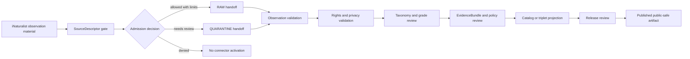

<!-- [KFM_META_BLOCK_V2]
doc_id: kfm://doc/connectors-inaturalist-observations-readme
title: connectors/inaturalist/observations/ — iNaturalist Observations Connector Lane
type: readme
version: v0.1
status: draft
owners: OWNER_TBD — Connector steward · Source steward · Fauna steward · Flora steward · Rights reviewer · Sensitivity reviewer · Validation steward · Docs steward
created: 2026-06-19
updated: 2026-06-19
policy_label: public-doctrine; observation-admission; rights-gated; sensitivity-gated; no-publication
proposed_path: connectors/inaturalist/observations/README.md
truth_posture: CONFIRMED path exists / PROPOSED observation-lane contract / CANONICALITY NEEDS VERIFICATION
related:
  - ../README.md
  - ../tests/README.md
  - ../src/README.md
  - ../src/inaturalist/README.md
  - ../../../docs/sources/catalog/inaturalist/README.md
  - ../../../docs/sources/catalog/gbif/README.md
  - ../../../docs/domains/fauna/README.md
  - ../../../docs/domains/flora/README.md
  - ../../../docs/sources/SOURCE_DESCRIPTOR_STANDARD.md
  - ../../../data/registry/sources/fauna/
  - ../../../data/registry/sources/flora/
  - ../../../data/raw/fauna/
  - ../../../data/quarantine/fauna/
  - ../../../data/raw/flora/
  - ../../../data/quarantine/flora/
  - ../../../fixtures/
  - ../../../schemas/contracts/v1/source/
  - ../../../schemas/contracts/v1/biodiversity/
  - ../../../policy/sensitivity/
  - ../../../policy/rights/
  - ../../../release/
tags: [kfm, connectors, inaturalist, observations, biodiversity, occurrence, community-observation, source-admission, rights, privacy, validation, raw, quarantine, governance]
notes:
  - "This README fills a previously blank observation-lane README for iNaturalist source admission."
  - "The parent connector README and iNaturalist source profile treat iNaturalist as community-observation occurrence evidence, not regulatory, taxonomic, restricted-record, release, or publication authority."
  - "Observation records require per-record rights, privacy-state, observation-grade, taxonomy, geometry, sensitivity, and source-role validation before downstream use."
  - "Connector output may enter RAW or QUARANTINE handoff only; downstream validation, EvidenceBundle closure, redaction/generalization, catalog/triplet projection, release review, publication, correction, and rollback remain outside this folder."
  - "Implementation files, source activation, SourceDescriptor records, fixtures, tests, CI wiring, endpoint use, observation-grade policy, and public-release classes remain NEEDS VERIFICATION."
[/KFM_META_BLOCK_V2] -->

<a id="top"></a>

# iNaturalist Observations Connector Lane

> Record-level source-admission lane for iNaturalist observation material. It is **not** a species-presence authority, taxonomic authority, legal-status authority, release path, or publication surface.

<p>
  
  
  
  
  
</p>

> [!IMPORTANT]
> **Status:** `experimental` observation-lane README · **Owner:** `OWNER_TBD`  
> **Path:** `connectors/inaturalist/observations/README.md`  
> **Truth posture:** `CONFIRMED` file exists · `PROPOSED` observation-lane contract · `NEEDS VERIFICATION` canonical implementation home  
> **Boundary:** observation admission only; no public claims, no direct publication, no source authority upgrade.

**Quick jumps:** [Scope](#scope) · [Repo fit](#repo-fit) · [Accepted inputs](#accepted-inputs) · [Exclusions](#exclusions) · [Evidence ledger](#evidence-ledger) · [Lifecycle diagram](#lifecycle-diagram) · [Admission posture](#admission-posture) · [Validation](#validation) · [Rollback](#rollback) · [Verification backlog](#verification-backlog)

---

## Scope

`connectors/inaturalist/observations/` is a proposed sublane for iNaturalist observation-record source admission.

It may document observation-specific parsing expectations, source-admission envelopes, fixture rules, quarantine conditions, observation-grade handling, rights/privacy metadata preservation, and validation requirements.

It must not become occurrence truth, species-presence truth, range truth, habitat truth, taxonomic truth, legal/listed-status truth, source descriptor authority, schema authority, policy authority, catalog/triplet authority, proof authority, release authority, pipeline authority, or publication authority.

[Back to top ↑](#top)

---

## Repo fit

| Surface | Role | Status |
|---|---|---:|
| `connectors/inaturalist/observations/` | Observation-record admission sublane. | **CONFIRMED path / NEEDS VERIFICATION implementation depth** |
| `connectors/inaturalist/README.md` | Parent connector coordination README. | **CONFIRMED** |
| `connectors/inaturalist/tests/README.md` | Connector-local test lane. | **CONFIRMED** |
| `connectors/inaturalist/src/` | Source-root package area. | **CONFIRMED README path / NEEDS VERIFICATION modules** |
| `docs/sources/catalog/inaturalist/README.md` | Human-facing iNaturalist source profile. | **CONFIRMED** |
| `data/registry/sources/fauna/` and `data/registry/sources/flora/` | Candidate SourceDescriptor registry homes. | **PROPOSED / NEEDS VERIFICATION** |
| `data/raw/fauna/`, `data/raw/flora/` | Candidate RAW handoff targets. | **PROPOSED / NEEDS VERIFICATION** |
| `data/quarantine/fauna/`, `data/quarantine/flora/` | Quarantine targets for unresolved rights, sensitivity, taxonomy, geometry, or grade questions. | **PROPOSED / NEEDS VERIFICATION** |
| `release/` | Release and publication controls. | **Out of scope for this connector lane** |

> [!NOTE]
> The parent connector README confirms the connector family, but this observation sublane remains **CANONICALITY NEEDS VERIFICATION** until Directory Rules, an ADR, migration note, or repo convention confirms product/sublane layout.

[Back to top ↑](#top)

---

## Accepted inputs

Accepted observation-lane content:

- observation-lane README and navigation notes;
- observation-shaped fixture rules;
- parser expectations for observation ID, source URL/identifier, license, attribution, privacy state, observation grade, taxon fields, event date, geometry, uncertainty, media references, and quality flags;
- SourceDescriptor-gate notes;
- validation notes for `OccurrenceEvidenceObject`-shaped material;
- quarantine criteria for unresolved rights, source role, observation grade, taxonomy, geometry, privacy state, sensitivity, or source-shape issues.

---

## Exclusions

This folder must not contain or imply authority over:

- public release decisions;
- published species occurrence, range, habitat, or conservation-status claims;
- taxonomic backbone decisions;
- legal/listed-status decisions;
- direct writes to `PROCESSED`, `CATALOG`, `TRIPLET`, `PUBLISHED`, proof, receipt, or release stores;
- SourceDescriptor authority records;
- policy or schema authority;
- generated summaries presented as authoritative biodiversity truth;
- source activation without rights, sensitivity, source-role, observation-grade, geometry, taxonomy, and review checks.

[Back to top ↑](#top)

---

## Evidence ledger

| Source | Status | Supports | Limits |
|---|---:|---|---|
| `connectors/inaturalist/observations/README.md` | **CONFIRMED** | Target file exists and was blank before this update. | Does not prove code, fixtures, tests, or CI. |
| `connectors/inaturalist/README.md` | **CONFIRMED** | Parent connector README defines source-admission-only boundary and verification backlog. | Does not prove this observation sublane is canonical. |
| `connectors/inaturalist/tests/README.md` | **CONFIRMED** | Test lane defines no-network, fixture-safe, fail-closed expectations. | Does not prove tests exist or pass. |
| `docs/sources/catalog/inaturalist/README.md` | **CONFIRMED** | Source profile treats iNaturalist as community-observation evidence and states rights/privacy/source-role constraints. | Does not prove connector activation or current endpoint details. |
| Observation-sublane child files | **NEEDS VERIFICATION** | This README provides proposed boundaries. | Parser files, fixtures, tests, and workflows remain unverified. |

---

## Lifecycle diagram



[Back to top ↑](#top)

---

## Admission posture

Expected behavior for iNaturalist observation-lane work:

- no live source access unless explicitly enabled and reviewed;
- no source fetch without a SourceDescriptor and activation decision;
- no implicit publication from retrieved source material;
- no elevation of iNaturalist observations into legal/listed-status, regulatory, taxonomic, or restricted-record authority;
- no conversion of observation rows into confirmed species-presence, range, habitat, or conservation-status claims;
- no loss of observation ID, source URL/identifier, attribution where allowed, license, privacy state, observation grade, taxon fields, event date, geometry, uncertainty, media references, source role, sensitivity, review, or release-class metadata;
- unclear rights, source role, observation grade, taxonomic identity, geometry, date, privacy state, sensitivity, or schema drift routes to quarantine or abstention.

---

## Validation

Observation-lane validation should check that:

- source metadata is preserved;
- SourceDescriptor references are required for activation;
- observation ID, source URL/identifier, license, attribution, privacy state, observation grade, taxon fields, event date, geometry, uncertainty, media references, source role, sensitivity, review, and vintage fields are explicit where available;
- malformed or incomplete observation records fail closed;
- records with unclear geometry, missing rights, missing attribution, unresolved source role, unresolved taxon, or unresolved sensitivity route to quarantine;
- observation records remain source-admission candidates until downstream validation;
- no connector run writes directly to processed, catalog, triplet, published, proof, receipt, or release stores;
- fixture data is synthetic, minimized, redacted, generalized, or approved for committed use.

Root-level validation, policy-as-code, redaction/generalization, EvidenceBundle closure, release review, public caveats, and rollback remain outside this observation lane.

[Back to top ↑](#top)

---

## Definition of done

This observation-lane README is ready for first review when:

- [ ] iNaturalist parent connector README and source profile are linked and current enough for review.
- [ ] Canonicality of `connectors/inaturalist/observations/` is confirmed or tracked.
- [ ] SourceDescriptor homes and iNaturalist source IDs are verified.
- [ ] Endpoint, auth posture, rate limits, and terms are verified by source steward review.
- [ ] Live source access is disabled by default for connector code.
- [ ] Observation-grade, per-record rights/license, privacy-state, taxonomy, geometry, and anti-collapse checks are represented in tests.
- [ ] Connector output is limited to RAW or QUARANTINE handoff.
- [ ] No public claims are created by connector code.

---

## Rollback

Rollback is required if this README is used to justify direct publication, source activation, role collapse, taxonomic authority, legal/listed-status authority, species-presence authority, restricted-record release, or bypass of `SourceDescriptor`, rights, sensitivity, policy, validation, review, release, or rollback gates.

Rollback target:

```text
commit prior to this update: SHA_TBD_AFTER_GIT_HISTORY_CHECK
```

Because the file was blank before this update, a safe rollback is to restore the blank placeholder or replace this document with a shorter compatibility-only README until observation-lane placement and implementation are verified.

---

## Verification backlog

| Item | Status | Needed evidence |
|---|---:|---|
| Confirm actual observation-lane files below this path. | **NEEDS VERIFICATION** | Repo tree or mounted workspace. |
| Confirm canonicality of `connectors/inaturalist/observations/`. | **NEEDS VERIFICATION** | Directory Rules, ADR, migration note, or repo convention. |
| Confirm iNaturalist SourceDescriptor homes and source IDs. | **NEEDS VERIFICATION** | Source registry entries and accepted schemas. |
| Confirm endpoint, auth posture, rate limits, and current source terms. | **NEEDS VERIFICATION** | Source steward review and current source documentation. |
| Confirm observation-grade admission policy. | **NEEDS VERIFICATION** | SourceDescriptor decision and domain-steward review. |
| Confirm rights, license, attribution, privacy-state, taxonomy, and geometry validation. | **NEEDS VERIFICATION** | Parser tests, rights policy, and fixture tests. |
| Confirm fixture strategy and CI wiring. | **NEEDS VERIFICATION** | Fixture registry, workflow files, and test logs. |

---

## Maintainer note

Keep this lane focused on observation-record admission. It should help parse, preserve, validate, and safely hand off source material; it must not decide truth, policy, release, or publication.

[Back to top ↑](#top)
