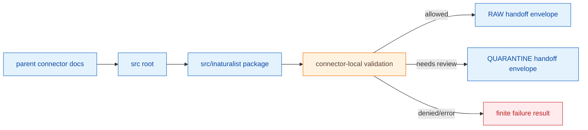

<!-- [KFM_META_BLOCK_V2]
doc_id: kfm://doc/connectors-inaturalist-src-readme
title: connectors/inaturalist/src/ — iNaturalist Connector Source Root
type: readme
version: v0.1
status: draft
owners: OWNER_TBD — Connector steward · Source steward · Test steward · Fauna steward · Flora steward · Rights reviewer · Sensitivity reviewer · Validation steward · Docs steward
created: 2026-06-19
updated: 2026-06-19
policy_label: public-doctrine; source-root; no-live-network-by-default; no-publication
proposed_path: connectors/inaturalist/src/README.md
truth_posture: CONFIRMED path exists / PROPOSED source-root contract / IMPLEMENTATION DEPTH NEEDS VERIFICATION
related:
  - ../README.md
  - tests/README.md
  - inaturalist/README.md
  - ../../../docs/sources/catalog/inaturalist/README.md
  - ../../../docs/domains/fauna/README.md
  - ../../../docs/domains/flora/README.md
  - ../../../docs/sources/SOURCE_DESCRIPTOR_STANDARD.md
  - ../../../data/registry/sources/fauna/
  - ../../../data/registry/sources/flora/
  - ../../../data/raw/fauna/
  - ../../../data/quarantine/fauna/
  - ../../../data/raw/flora/
  - ../../../data/quarantine/flora/
  - ../../../fixtures/
  - ../../../schemas/contracts/v1/source/
  - ../../../schemas/contracts/v1/biodiversity/
  - ../../../policy/sensitivity/
  - ../../../policy/rights/
  - ../../../release/
tags: [kfm, connectors, inaturalist, src-root, python-package, biodiversity, source-admission, rights, geoprivacy, validation, raw, quarantine, governance]
notes:
  - "This README fills a previously blank source-root README for the iNaturalist connector."
  - "The implementation package README lives at connectors/inaturalist/src/inaturalist/README.md; this file defines source-root boundaries and prevents parallel authority."
  - "The parent connector README and source profile treat iNaturalist as community-observation occurrence evidence, not regulatory, taxonomic, sensitive-record, release, or publication authority."
  - "Code under this source root must be no-network by default, SourceDescriptor-gated, rights-aware, geoprivacy-aware, and limited to RAW or QUARANTINE handoff envelopes."
  - "Packaging config, import path, module inventory, fixtures, tests, CI wiring, and current passing status remain NEEDS VERIFICATION."
[/KFM_META_BLOCK_V2] -->

<a id="top"></a>

# iNaturalist Connector Source Root

> Source-root README for `connectors/inaturalist/src/`. This folder organizes implementation package code; it is not itself a second connector, policy surface, schema surface, release path, or publication surface.

<p>
  
  
  
  
  
</p>

> [!IMPORTANT]
> **Status:** `experimental` source-root README · **Owner:** `OWNER_TBD`  
> **Path:** `connectors/inaturalist/src/README.md`  
> **Truth posture:** `CONFIRMED` file exists · `PROPOSED` source-root contract · `NEEDS VERIFICATION` implementation depth  
> **Boundary:** source root organizes package code only; it must not publish, promote, or make authoritative biodiversity claims.

**Quick jumps:** [Scope](#scope) · [Root responsibilities](#root-responsibilities) · [Forbidden responsibilities](#forbidden-responsibilities) · [Directory map](#directory-map) · [Evidence ledger](#evidence-ledger) · [Expected flow](#expected-flow) · [Validation](#validation) · [Testing contract](#testing-contract) · [Rollback](#rollback) · [Verification backlog](#verification-backlog)

---

## Scope

`connectors/inaturalist/src/` is the proposed Python source-layout root for the iNaturalist connector.

It may contain package directories, package-level README files, module code, and implementation-local documentation for source-admission helpers.

It must not become a second connector authority, policy authority, schema authority, release authority, catalog/triplet authority, public API authority, or publication authority.

[Back to top ↑](#top)

---

## Root responsibilities

The `src/` root is responsible for layout clarity only.

| Responsibility | Allowed here | Boundary |
|---|---|---|
| Package placement | House the implementation package under `src/inaturalist/`. | Do not scatter connector modules at `src/` root. |
| Import hygiene | Keep package code importable through the verified package name. | Import name and packaging config remain **NEEDS VERIFICATION**. |
| Documentation | Point readers to package internals and tests. | Do not duplicate policy, schemas, source descriptors, or release docs. |
| Source-admission boundary | Preserve package code as connector helper code only. | No direct public outputs or authority claims. |

---

## Forbidden responsibilities

Do not use this root to hold:

- credentials or secrets;
- live-access scripts that bypass SourceDescriptor gates;
- policy implementations treated as connector-local authority;
- schema authority files;
- release manifests;
- public map-layer code;
- direct catalog/triplet writers;
- generated biodiversity summaries presented as truth;
- ad hoc modules outside the package directory that create parallel implementation paths.

[Back to top ↑](#top)

---

## Directory map

Current-session evidence confirms this source-root README and the nested package README. Full child inventory remains **NEEDS VERIFICATION**.

```text
connectors/
└── inaturalist/
    └── src/
        ├── README.md              # CONFIRMED — this source-root README
        └── inaturalist/
            └── README.md          # CONFIRMED — package-internal README
```

Expected responsibility split:

```text
connectors/inaturalist/README.md              # parent connector boundary
connectors/inaturalist/tests/README.md        # connector-local tests
connectors/inaturalist/src/README.md          # source-root layout boundary
connectors/inaturalist/src/inaturalist/        # package implementation area
```

[Back to top ↑](#top)

---

## Evidence ledger

| Source | Status | Supports | Limits |
|---|---:|---|---|
| `connectors/inaturalist/src/README.md` | **CONFIRMED** | Target file exists and was blank before this update. | Does not prove package files or tests. |
| `connectors/inaturalist/src/inaturalist/README.md` | **CONFIRMED** | Package-internal README defines implementation-facing responsibilities and forbidden behaviors. | Does not prove actual modules exist. |
| `connectors/inaturalist/README.md` | **CONFIRMED** | Parent connector README defines source-admission-only boundary and verification backlog. | Does not prove implementation maturity. |
| `connectors/inaturalist/tests/README.md` | **CONFIRMED** | Test README defines no-network and fixture-safe expectations. | Does not prove tests exist or pass. |
| `docs/sources/catalog/inaturalist/README.md` | **CONFIRMED** | Source profile treats iNaturalist as community-observation evidence and states operational details remain verification items. | Does not supply current endpoint, auth, or rate-limit facts here. |
| Source-root child tree | **NEEDS VERIFICATION** | This README provides proposed boundaries. | Actual module inventory, packaging config, import name, and CI status are unverified. |

---

## Expected flow



[Back to top ↑](#top)

---

## Validation

Source-root validation should confirm that:

- package modules live under `src/inaturalist/`, not as parallel root files;
- import path and packaging config are documented once verified;
- no source-root file stores secrets, credentials, policy authority, schema authority, release logic, or public output logic;
- package code remains SourceDescriptor-gated and no-network by default;
- package output is limited to RAW or QUARANTINE handoff envelopes.

Root-level policy-as-code, redaction/generalization, EvidenceBundle closure, release review, catalog projection, public caveats, and rollback remain outside this source root.

---

## Testing contract

This source root is not ready until tests verify:

- package import behavior;
- no-network default behavior;
- SourceDescriptor-required activation;
- parser behavior with safe fixtures;
- rights, geoprivacy, taxonomy, geometry, and sensitivity validation;
- output-path denial for processed/catalog/triplet/published/proof/receipt/release stores;
- finite error outcomes for malformed or incomplete records.

See `../tests/README.md` and `inaturalist/README.md` for the test and package contracts.

---

## Rollback

Rollback is required if this README is used to imply package implementation, passing tests, packaging readiness, live access approval, source activation, or publication readiness that has not been verified.

Rollback target:

```text
commit prior to this update: SHA_TBD_AFTER_GIT_HISTORY_CHECK
```

Because the file was blank before this update, a safe rollback is to restore the blank placeholder until source-root inventory, packaging config, package modules, and tests are verified.

---

## Verification backlog

| Item | Status | Needed evidence |
|---|---:|---|
| Confirm actual files below `connectors/inaturalist/src/`. | **NEEDS VERIFICATION** | Repo tree or mounted workspace. |
| Confirm package import name. | **NEEDS VERIFICATION** | `pyproject.toml`, package metadata, or import tests. |
| Confirm source-root package layout. | **NEEDS VERIFICATION** | Repo tree and packaging config. |
| Confirm no-network default behavior. | **NEEDS VERIFICATION** | Test files and CI config. |
| Confirm SourceDescriptor gate implementation. | **NEEDS VERIFICATION** | Code and tests. |
| Confirm RAW/QUARANTINE handoff envelope shape. | **NEEDS VERIFICATION** | Contract, schema, or tests. |
| Confirm CI wiring and passing status. | **NEEDS VERIFICATION** | Workflow files and logs. |

---

## Maintainer note

Keep `src/` boring. It should organize package code clearly, not create a second authority path. The implementation package belongs under `src/inaturalist/`; source truth, policy, release, and publication live elsewhere.

[Back to top ↑](#top)
