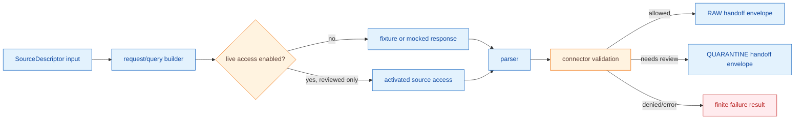

<!-- [KFM_META_BLOCK_V2]
doc_id: kfm://doc/connectors-inaturalist-src-inaturalist-readme
title: connectors/inaturalist/src/inaturalist/ — iNaturalist Connector Package Internals
type: readme
version: v0.1
status: draft
owners: OWNER_TBD — Connector steward · Source steward · Test steward · Fauna steward · Flora steward · Rights reviewer · Sensitivity reviewer · Validation steward · Docs steward
created: 2026-06-19
updated: 2026-06-19
policy_label: public-doctrine; package-internals; no-live-network-by-default; no-publication
proposed_path: connectors/inaturalist/src/inaturalist/README.md
truth_posture: CONFIRMED path exists / PROPOSED package contract / IMPLEMENTATION DEPTH NEEDS VERIFICATION
related:
  - ../../README.md
  - ../README.md
  - ../../tests/README.md
  - ../../../../docs/sources/catalog/inaturalist/README.md
  - ../../../../docs/domains/fauna/README.md
  - ../../../../docs/domains/flora/README.md
  - ../../../../docs/sources/SOURCE_DESCRIPTOR_STANDARD.md
  - ../../../../data/registry/sources/fauna/
  - ../../../../data/registry/sources/flora/
  - ../../../../data/raw/fauna/
  - ../../../../data/quarantine/fauna/
  - ../../../../data/raw/flora/
  - ../../../../data/quarantine/flora/
  - ../../../../fixtures/
  - ../../../../schemas/contracts/v1/source/
  - ../../../../schemas/contracts/v1/biodiversity/
  - ../../../../policy/sensitivity/
  - ../../../../policy/rights/
  - ../../../../release/
tags: [kfm, connectors, inaturalist, python-package, src, biodiversity, occurrence, source-admission, rights, geoprivacy, validation, raw, quarantine, governance]
notes:
  - "This README fills a previously blank package-internal README for the iNaturalist connector."
  - "The parent connector README and source profile treat iNaturalist as community-observation occurrence evidence, not regulatory, taxonomic, sensitive-record, release, or publication authority."
  - "Package code must be no-network by default, SourceDescriptor-gated, rights-aware, geoprivacy-aware, and limited to RAW or QUARANTINE handoff envelopes."
  - "Endpoint, auth posture, rate limits, parser implementation, fixtures, tests, CI wiring, and current passing status remain NEEDS VERIFICATION."
[/KFM_META_BLOCK_V2] -->

<a id="top"></a>

# iNaturalist Connector Package Internals

> Implementation-facing README for the Python package area under `connectors/inaturalist/src/inaturalist/`. This package must remain a source-admission helper, not a public biodiversity truth surface.

<p>
  
  
  
  
  
</p>

> [!IMPORTANT]
> **Status:** `experimental` package README · **Owner:** `OWNER_TBD`  
> **Path:** `connectors/inaturalist/src/inaturalist/README.md`  
> **Truth posture:** `CONFIRMED` file exists · `PROPOSED` package contract · `NEEDS VERIFICATION` implementation depth  
> **Boundary:** package code may prepare source-admission envelopes only; it must not publish, promote, or make authoritative biodiversity claims.

**Quick jumps:** [Scope](#scope) · [Package responsibilities](#package-responsibilities) · [Forbidden responsibilities](#forbidden-responsibilities) · [Expected modules](#expected-modules) · [Evidence ledger](#evidence-ledger) · [Data flow](#data-flow) · [Validation](#validation) · [Testing contract](#testing-contract) · [Rollback](#rollback) · [Verification backlog](#verification-backlog)

---

## Scope

`connectors/inaturalist/src/inaturalist/` is the proposed package-internal home for iNaturalist connector helpers.

It may contain code for request-shape construction, fixture-backed parsing, response normalization into source-admission envelopes, rights/geoprivacy metadata preservation, validation helpers, and safe handoff preparation.

It must not contain publication logic, release logic, policy authority, schema authority, direct catalog/triplet writers, public map-layer writers, or code that upgrades iNaturalist records into legal, regulatory, taxonomic, or sensitive-record authority.

[Back to top ↑](#top)

---

## Package responsibilities

Package code may perform these bounded tasks after test and steward review:

| Responsibility | Allowed package behavior | Required boundary |
|---|---|---|
| Request construction | Build deterministic request/query shapes from approved SourceDescriptor inputs. | No live request without explicit activation. |
| Response parsing | Parse fixture or approved source-shaped responses into internal records. | Preserve raw identifiers and source metadata. |
| Metadata preservation | Carry observation ID, source URL/identifier, license, attribution, geoprivacy state, grade, taxon fields, event date, geometry, uncertainty, and vintage where available. | Missing or unclear governed fields fail closed. |
| Admission envelope | Emit RAW or QUARANTINE handoff candidates. | No direct PROCESSED/CATALOG/TRIPLET/PUBLISHED writes. |
| Error handling | Return finite, inspectable outcomes. | No silent defaulting of rights, source role, sensitivity, taxonomy, or geometry. |

---

## Forbidden responsibilities

This package must not:

- require live network by default;
- store secrets or credentials;
- activate a source without an accepted SourceDescriptor;
- infer restricted coordinates, rights, taxonomic authority, or legal/listed status;
- collapse per-record rights into a source-wide allowance;
- treat upstream geoprivacy as missing data;
- write directly to `data/processed/`, `data/catalog/`, `data/published/`, proof, receipt, or release stores;
- produce public claims, public map layers, release manifests, or catalog/triplet authority;
- present generated summaries as authoritative biodiversity truth.

[Back to top ↑](#top)

---

## Expected modules

Actual module files are **NEEDS VERIFICATION**. If implemented, keep responsibilities narrow and testable.

| Proposed module | Purpose | Status |
|---|---|---:|
| `client.py` | Optional source client wrapper for activated, reviewed access. | **PROPOSED** |
| `models.py` | Internal typed structures for parsed connector records and envelopes. | **PROPOSED** |
| `parse.py` | Fixture-backed parser for source-shaped observation records. | **PROPOSED** |
| `rights.py` | License and attribution normalization helpers. | **PROPOSED** |
| `geoprivacy.py` | Preservation and classification helpers for upstream privacy state. | **PROPOSED** |
| `validate.py` | Connector-local fail-closed validation helpers. | **PROPOSED** |
| `handoff.py` | RAW/QUARANTINE handoff envelope builder. | **PROPOSED** |

Do not add broad orchestration, policy engines, release tooling, or public API code here without an ADR or migration note.

---

## Evidence ledger

| Source | Status | Supports | Limits |
|---|---:|---|---|
| `connectors/inaturalist/src/inaturalist/README.md` | **CONFIRMED** | Target file exists and was blank before this update. | Does not prove module files or tests. |
| `connectors/inaturalist/README.md` | **CONFIRMED** | Parent connector README defines source-admission-only boundary and verification backlog. | Does not prove implementation maturity. |
| `connectors/inaturalist/tests/README.md` | **CONFIRMED** | Test README defines no-network, fixture-safe, fail-closed expectations. | Does not prove tests exist or pass. |
| `docs/sources/catalog/inaturalist/README.md` | **CONFIRMED** | Source profile treats iNaturalist as community-observation evidence and states operational details remain verification items. | Does not supply current endpoint, auth, or rate-limit facts here. |
| Package implementation files | **NEEDS VERIFICATION** | This README provides proposed responsibilities. | Actual files, behavior, and CI status are unverified. |

---

## Data flow



[Back to top ↑](#top)

---

## Validation

Package-local validation should check that:

- a SourceDescriptor reference is present before activation;
- live network is disabled unless explicitly enabled and reviewed;
- source metadata is preserved;
- observation ID, source URL/identifier, license, attribution, geoprivacy state, observation grade, taxon fields, event date, geometry, uncertainty, source role, sensitivity, review, and vintage fields are explicit where available;
- malformed or incomplete records fail closed;
- unresolved rights, role, taxon, geometry, or sensitivity route to quarantine or rejection;
- package output is limited to RAW or QUARANTINE handoff envelopes.

Root-level policy-as-code, redaction/generalization, EvidenceBundle closure, release review, catalog projection, public caveats, and rollback remain outside this package.

---

## Testing contract

Package code is not ready until tests prove:

- no-network default behavior;
- fixture-safe parser coverage;
- SourceDescriptor-required activation;
- rights/license fail-closed behavior;
- geoprivacy preservation;
- observation-grade and source-role preservation;
- taxonomy and geometry validation;
- output-path denial for processed/catalog/triplet/published/proof/receipt/release stores;
- finite error outcomes for malformed or incomplete records.

See `../../tests/README.md` for the connector test-lane contract.

---

## Rollback

Rollback is required if this README is used to imply source activation, implemented modules, passing tests, live access approval, rights approval, sensitivity approval, or publication readiness that has not been verified.

Rollback target:

```text
commit prior to this update: SHA_TBD_AFTER_GIT_HISTORY_CHECK
```

Because the file was blank before this update, a safe rollback is to restore the blank placeholder until package files and tests are inventoried.

---

## Verification backlog

| Item | Status | Needed evidence |
|---|---:|---|
| Confirm actual module files below this path. | **NEEDS VERIFICATION** | Repo tree or mounted workspace. |
| Confirm package import name and packaging config. | **NEEDS VERIFICATION** | `pyproject.toml`, package metadata, or import tests. |
| Confirm no-network default behavior. | **NEEDS VERIFICATION** | Test files and CI config. |
| Confirm SourceDescriptor gate implementation. | **NEEDS VERIFICATION** | Code and tests. |
| Confirm parser, rights, geoprivacy, taxonomy, and geometry validators. | **NEEDS VERIFICATION** | Code, fixtures, and test logs. |
| Confirm RAW/QUARANTINE handoff envelope shape. | **NEEDS VERIFICATION** | Contract, schema, or tests. |
| Confirm CI wiring and passing status. | **NEEDS VERIFICATION** | Workflow files and logs. |

---

## Maintainer note

Keep this package small. Connector code prepares admissible source material for governed downstream review; it does not decide truth, policy, release, or publication.

[Back to top ↑](#top)
