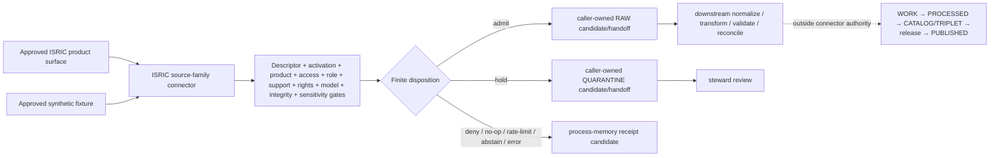

<!-- [KFM_META_BLOCK_V2]
doc_id: kfm://doc/connectors-isric-readme
title: connectors/isric/ — ISRIC Source-Family Connector Contract
type: readme
version: v0.2
status: draft
owners: OWNER_TBD — Connector steward · ISRIC source steward · Soil steward · Raster/geospatial steward · Modeling/receipt steward · Rights reviewer · Validation steward · Docs steward
created: 2026-06-19
updated: 2026-07-12
policy_label: public-doctrine; source-family-connector; repository-present; implementation-unverified; modeled-source; product-explicit; no-network-by-default; descriptor-and-activation-gated; rights-gated; support-type-preserving; raw-quarantine-receipt-candidates-only; no-publication
path: connectors/isric/README.md
truth_posture: CONFIRMED repository documentation and current child contract / PROPOSED family implementation, product dispatch, finite outcomes, and staged build / CONFLICTED path-ratification, descriptor, and model-support authority / UNKNOWN package, tests, activation, runtime, source access, and public-client coupling
related:
  - ../README.md
  - ./soilgrids/README.md
  - ../soil/README.md
  - ../../docs/doctrine/directory-rules.md
  - ../../docs/domains/soil/ARCHITECTURE.md
  - ../../docs/domains/soil/CANONICAL_PATHS.md
  - ../../docs/sources/catalog/isric/README.md
  - ../../docs/sources/catalog/isric/isric-soilgrids.md
  - ../../data/registry/sources/README.md
  - ../../data/registry/sources/soil/isric-soilgrids.yaml
  - ../../schemas/contracts/v1/source/source_descriptor.schema.json
  - ../../schemas/contracts/v1/sources/source_descriptor.schema.json
  - ../../schemas/contracts/v1/receipts/README.md
  - ../../tests/domains/soil/README.md
  - ../../data/raw/soil/README.md
  - ../../data/receipts/
  - ../../data/proofs/
  - ../../policy/rights/
  - ../../policy/sensitivity/
  - ../../release/
tags: [kfm, connectors, isric, soilgrids, soil, source-family, modeled, gridded-derivative-soil, raster, depth-bands, uncertainty, source-admission, raw, quarantine, receipts, no-network, fail-closed, governance]
notes:
  - "At inspected base commit a642470327f32b5b76d81ef4ed996d65de4f6ba0, this parent README and the v0.2 SoilGrids product contract were present; common parent package and test paths directly probed were absent."
  - "Directory Rules make connectors/ canonical but do not list an ordinary child below an existing canonical root as an automatic ADR trigger. The source-catalog claim that ISRIC requires canonical-family promotion by ADR is therefore CONFLICTED rather than silently accepted."
  - "The SoilGrids registry YAML is an eight-line PROPOSED placeholder and is not a complete SourceDescriptor or activation decision."
  - "A generic Soil ModelRunReceipt schema was not found at schemas/contracts/v1/receipts/model_run_receipt.schema.json. The family may preserve model-support candidates but cannot invent receipt closure."
  - "The SoilGrids child contract owns time-bounded product and access facts. This parent contract coordinates source-family authority, product dispatch, shared safeguards, implementation order, and rollback without duplicating current endpoint details."
  - "This revision creates documentation and a generated provenance receipt only. It activates no source, selects no production transport, creates no executable connector, and emits no soil data or public artifact."
[/KFM_META_BLOCK_V2] -->

<a id="top"></a>

# ISRIC Source-Family Connector Contract

> Parent contract for the repository-present, source-first ISRIC connector family. This lane may coordinate bounded source retrieval, preservation, parsing, admission decisions, and caller-owned RAW / QUARANTINE / process-memory receipt-candidate handoffs. It must not become observed soil truth, field-scale authority, policy authority, release authority, or a public client path.

<p>
  
  
  
  
  
  
  
  
</p>

`connectors/isric/`

> [!IMPORTANT]
> **Inspected state:** at base commit `a642470327f32b5b76d81ef4ed996d65de4f6ba0`, this family contains this parent README and the v0.2 [`soilgrids/`](./soilgrids/README.md) product contract. Direct probes found no parent `pyproject.toml`, `src/README.md`, or `tests/README.md`. No executable connector, package build, import proof, accepted SourceDescriptor, activation decision, fixture corpus, connector-local test collection, source payload, run receipt, or runtime result was verified.

> [!CAUTION]
> **Do not activate from repository placeholders.** [`data/registry/sources/soil/isric-soilgrids.yaml`](../../data/registry/sources/soil/isric-soilgrids.yaml) is a short `PROPOSED` inventory placeholder, not a complete SourceDescriptor or SourceActivationDecision. Directory presence, a product README, or a reachable public service cannot authorize source access.

> [!WARNING]
> **Path-ratification claims are conflicted.** The source-catalog family page says an ADR is required because `isric/` is absent from the illustrative Directory Rules connector list. Directory Rules §2.4 does not identify an ordinary child beneath an existing canonical root as an automatic ADR trigger. Treat the family path as repository-present with a draft contract; do not claim either canonical promotion or mandatory ADR closure until the governing interpretation is accepted.

> [!WARNING]
> **Source family, product, source role, support type, and downstream use are different.** `isric` identifies the family; SoilGrids identifies a product; `modeled` is the expected source role pending an accepted descriptor; `gridded_derivative_soil` is the expected support type or equivalent; “international-comparability context” describes downstream use. None authorizes observed, regulatory, field, parcel, suitability, or public-release claims.

**Quick jumps:** [Purpose](#purpose) · [Placement and current state](#placement-and-current-state) · [Family navigation](#family-navigation) · [Authority boundary](#authority-boundary) · [Source family and product register](#source-family-and-product-register) · [Descriptor activation and model support](#descriptor-activation-and-model-support) · [Source role support type and anti-collapse rules](#source-role-support-type-and-anti-collapse-rules) · [Identity and preservation](#identity-and-preservation) · [Access and work bounds](#access-and-work-bounds) · [Rights sensitivity and public precision](#rights-sensitivity-and-public-precision) · [Finite outcomes and lifecycle](#finite-outcomes-and-lifecycle) · [Cross-domain routing](#cross-domain-routing) · [Testing and CI evidence](#testing-and-ci-evidence) · [Implementation sequence](#implementation-sequence) · [Definition of done](#definition-of-done) · [Verification backlog](#verification-backlog) · [Review and rollback](#review-and-rollback)

---

## Purpose

This README coordinates the ISRIC source family so maintainers can implement product lanes through small, reversible changes without mistaking documentation, placeholders, public endpoint reachability, or green placeholder workflows for an operational connector.

The family lane may eventually:

- route explicitly approved ISRIC products through one source-first implementation boundary;
- require explicit source-family and product identities for every request, response, parsed asset, decision, handoff, and receipt candidate;
- construct deterministic, bounded request specifications from caller-supplied descriptor, activation, rights, model-support, and scope inputs;
- invoke injected transports only after explicit network enablement;
- preserve source package or response identity and integrity before parsing;
- preserve model/release, property, depth, statistic, units, uncertainty, CRS, resolution, spatial support, rights, and lineage;
- assemble finite admission outcomes from caller-supplied governance decisions;
- return candidates or use explicit caller-owned RAW, QUARANTINE, and process-memory receipt-candidate interfaces;
- support deterministic replay, no-op detection, correction, withdrawal, and downstream invalidation signals;
- serve Soil and approved downstream consumers without creating domain-first connector duplicates.

This lane does **not**:

- define or approve ISRIC source doctrine or product doctrine;
- create, discover, approve, or mutate SourceDescriptor or SourceActivationDecision authority;
- choose current endpoints, service versions, credentials, rate limits, query shapes, source terms, or production transports from memory;
- turn modeled global grids into observed soil measurements, authoritative U.S./Kansas baselines, pedons, horizons, parcel facts, field facts, management zones, regulatory determinations, or release-ready suitability claims;
- define Soil object meaning, machine schemas, rights policy, sensitivity policy, model-support authority, EvidenceBundle closure, catalog closure, release state, correction state, or rollback state;
- write WORK, PROCESSED, CATALOG, TRIPLET, PUBLISHED, proof, registry, or release stores;
- publish rasters, COGs, tiles, maps, reports, exports, public API payloads, search/index entries, graph edges, screenshots, or AI answers;
- expose connector internals or unreleased source material to ordinary public clients.

[Back to top ↑](#top)

---

## Placement and current state

### Placement decision

| Question | Current safe decision | Evidence posture |
|---|---|---:|
| What is the owning responsibility root? | `connectors/`, because the primary responsibility is source-specific fetch, preservation, parsing, and admission. | **CONFIRMED** by Directory Rules and [`connectors/README.md`](../README.md). |
| What is the repository-present family path? | `connectors/isric/`. | **CONFIRMED path / draft family contract**. |
| Is an ADR automatically required because `isric/` is absent from an illustrative connector tree? | Not established. Ordinary children of an existing canonical root are not listed as an automatic Directory Rules §2.4 trigger. | **CONFLICTED documentation / NEEDS VERIFICATION**. |
| What is the SoilGrids path? | A repository-present product documentation sublane beneath the ISRIC family. | **CONFIRMED README / PROPOSED runtime placement**. |
| Is the nested-product pattern ratified? | Not yet; the connector-root README treats nested product lanes as draft. | **PROPOSED / NEEDS VERIFICATION**. |
| What is `connectors/soil/`? | A draft coordination surface, not ISRIC or SoilGrids implementation authority. | **CONFIRMED README boundary**. |
| Does path presence activate a source? | No. | **CONFIRMED authority boundary**. |
| Does this revision move or ratify a path? | No. It updates the existing parent contract only. | **CONFIRMED scope**. |

This revision creates no new root, no new product lane, no parallel schema/contract/policy/registry/release/proof home, and no lifecycle phase. A later package move, product split, test-authority move, or descriptor/model-support authority decision must identify affected imports, tests, receipts, migrations, aliases, and rollback targets.

### Current repository snapshot

The snapshot below is bounded to base commit `a642470327f32b5b76d81ef4ed996d65de4f6ba0` and the named paths inspected for this revision.

```text
connectors/
├── README.md
├── soil/
│   └── README.md                              # draft coordination only
└── isric/
    ├── README.md                              # this parent family contract
    └── soilgrids/
        └── README.md                          # v0.2 product contract

docs/sources/catalog/isric/
├── README.md                                  # family profile; path-ratification claim is conflicted
└── isric-soilgrids.md                         # product profile

docs/domains/soil/
├── ARCHITECTURE.md
└── CANONICAL_PATHS.md

data/registry/sources/soil/
└── isric-soilgrids.yaml                       # eight-line PROPOSED placeholder

tests/domains/soil/
└── README.md                                  # domain test index; executable coverage unverified
```

| Surface | Observed state | Safe conclusion |
|---|---|---|
| Parent README | v0.1 before this revision; blob `b9a8773a56ad62f43ba2cbc18828a5a2af73fe46`. | Parent documentation exists but is stale against the merged child contract and connector-root receipt posture. |
| SoilGrids README | v0.2 product admission contract. | Product-specific boundaries and time-bounded official source facts are documented; runtime is not proven. |
| Parent `pyproject.toml` | Not found in direct probe. | No parent project metadata was observed at that common path. |
| Parent `src/README.md` | Not found in direct probe. | No documented parent source-root scaffold was observed at that common path. |
| Parent `tests/README.md` | Not found in direct probe. | No connector-local parent test-root contract was observed at that common path. |
| Registry YAML | Eight-line `PROPOSED` placeholder. | It is not a complete SourceDescriptor or activation decision. |
| Generic `schemas/contracts/v1/receipts/model_run_receipt.schema.json` | Not found in direct probe. | Generic Soil model-run receipt authority was not established at that path. |
| Soil domain architecture | Source-specific connectors, support-type separation, and RAW→PUBLISHED lifecycle are documented. | Does not prove executable ISRIC behavior. |
| Live request, source package, run receipt, package build/import, connector test count, deployment | Not verified. | Do not infer operation or readiness. |

Absence claims are deliberately narrow. Differently named, unindexed, generated, or external implementation remains **UNKNOWN**.

The v0.1 parent README was introduced by commit `bfe1f47386c8c226cad9777cff35c2ca495b0459`, expanding a blank placeholder. That history does not justify describing the current file as blank or newly created.

[Back to top ↑](#top)

---

## Family navigation

| Surface | Owns | Must not own |
|---|---|---|
| [`README.md`](./README.md) | Source-family placement, shared authority boundary, product registry, shared preservation rules, finite-outcome posture, implementation order, family backlog, and rollback. | Product-specific live-service details, executable-test claims, descriptor authority, model-support authority, or release. |
| [`soilgrids/README.md`](./soilgrids/README.md) | SoilGrids product identity, time-bounded official source surface, access choices, property/depth/statistic preservation, product tests, and product rollback. | Parent family authority, descriptor approval, policy, evidence closure, or public soil truth. |
| [`../soil/README.md`](../soil/README.md) | Draft cross-source Soil connector coordination. | ISRIC implementation, source-family doctrine, or product activation. |
| [`docs/sources/catalog/isric/`](../../docs/sources/catalog/isric/README.md) | Human-facing family and product doctrine. | Executable connector mechanics or activation. |
| [`docs/domains/soil/`](../../docs/domains/soil/ARCHITECTURE.md) | Soil object meaning, support-type separation, lifecycle context, and domain boundaries. | Source transport implementation. |
| [`data/registry/sources/`](../../data/registry/sources/README.md) | SourceDescriptor instances, source vocabulary, supersession, and admission authority. | Connector code, raw payloads, policy decisions, or secrets. |
| `policy/rights/`, `policy/sensitivity/` | Allow, deny, restrict, abstain, and review decisions. | Source transport mechanics. |
| `tests/domains/soil/` and future accepted connector tests | Enforceability proof at the owning scope. | Source activation or release approval merely because tests pass. |
| `data/receipts/`, `data/proofs/`, `release/`, `data/published/` | Process memory, proof closure, release decisions, public-safe artifacts, correction, withdrawal, and rollback. | Source-admission shortcuts. |

A child contract may narrow or specialize this parent contract but must not widen authority. Product-specific operational facts belong in the child and must be time-bounded. When documents disagree, preserve the conflict and apply governing doctrine, accepted ADRs, registry authority, contracts, schemas, policy, tests, and current implementation evidence in authority order.

[Back to top ↑](#top)

---

## Authority boundary

```text
FAMILY MAY:
  document source-family and product routing
  define pure connector types, protocols, constants, reason codes, and deterministic helpers
  consume caller-supplied descriptor and activation decisions
  normalize explicit, product-scoped, bounded request specifications
  invoke an injected transport only after explicit activation
  preserve source-native package/response identity and integrity
  preserve modeled role, Soil support type, units, uncertainty, geometry, and lineage
  assemble finite connector decisions
  return candidates or use caller-owned RAW / QUARANTINE / receipt-candidate interfaces
  support replay, no-op, correction, withdrawal, and invalidation lineage

FAMILY MUST NOT:
  auto-discover, approve, or mutate SourceDescriptor records
  treat the placeholder registry YAML as authority
  invent product identity, source role, support type, model/release identity, rights, units,
    conversion factors, CRS, uncertainty, source vintage, or public precision
  contact a live service at import time or in default tests
  silently fall back between distribution/access surfaces
  silently resample, reproject, mosaic, clip, aggregate, convert units, or collapse depth/statistic identity
  write WORK / PROCESSED / CATALOG / TRIPLET / PUBLISHED / proof / registry / release
  expose public API, UI, map, tile, report, search, graph, vector-index, screenshot, or AI payloads
  treat connector/test receipts as EvidenceBundle, proof, review, catalog, promotion, or release closure
```

The safest implementation default is **candidate construction with no write**. A write-capable adapter is permitted only after target contracts, caller ownership, permissions, idempotency, integrity, correction, rollback, and tests are verified.

[Back to top ↑](#top)

---

## Source family and product register

`isric` identifies the source family. A product identifies a bounded record or asset class, source release, distribution surface, and admission contract.

| Family/product material | Current posture | Connector consequence |
|---|---:|---|
| ISRIC family metadata | Source-family context | May identify publisher/family and route to an explicit product; does not represent a SoilProperty. |
| SoilGrids | Repository-present product contract | Follow [`soilgrids/README.md`](./soilgrids/README.md); preserve product/release/property/depth/statistic/access identity. |
| A future ISRIC product | Unregistered / `UNKNOWN` | `ABSTAIN`, `DENY`, or QUARANTINE until a reviewed product contract, IDs, rights, support type, tests, and migration/placement decision exist. |
| A transformed SoilGrids artifact | Downstream derivative | Requires explicit transform lineage and an owning downstream contract; must not inherit source identity as though unchanged. |
| An aggregate or analytical product derived from ISRIC | Separate derived product | Requires method, support, scale, uncertainty, evidence, review, and receipt lineage. |
| Administrative source/profile metadata | Administrative material only when explicitly approved | Does not represent soil evidence. |

Every request, response, parsed asset, per-asset decision, batch decision, handoff candidate, and receipt candidate must pin both source-family and product IDs/versions. Unknown product identity cannot fall back to SoilGrids or a permissive family default.

The product child owns current operational facts such as service status, distribution surfaces, property/depth/statistic vocabularies, native CRS documentation, file/package conventions, and time-sensitive source terms. The parent must not copy those details into a second independently aging authority.

[Back to top ↑](#top)

---

## Descriptor activation and model support

### Required preconditions

Before any live request or promotion-track fixture is treated as representative, the caller must supply or resolve:

- an accepted SourceDescriptor reference and schema-valid descriptor content;
- an explicit SourceActivationDecision with allowed or restricted scope;
- source-family and product IDs, versions, aliases, and selected distribution/access surface;
- bounded geographic, property, depth, statistic, asset, file, byte, pixel, retry, timeout, concurrency, and total-work scope;
- current rights, attribution, redistribution, modification, and distribution-surface posture;
- a source-role decision and Soil support-type decision;
- model/release support appropriate to the selected product state;
- integrity expectations, source-head/version posture, and explicit unknown-integrity disposition;
- KFM sensitivity and review decisions for the intended joins and downstream use;
- caller-owned RAW, QUARANTINE, and process-memory receipt-candidate interfaces;
- injected transport, clock, identifier, logger, temporary-storage, and cleanup dependencies.

Missing, stale, conflicting, permissive, or non-resolving inputs fail closed.

### Known conflicts

| Conflict | Current posture | Safe behavior |
|---|---:|---|
| Source-catalog ADR requirement vs. Directory Rules §2.4 | Ordinary child-path ADR requirement is not established. | Keep path posture **CONFLICTED / NEEDS VERIFICATION**; do not claim promotion, rejection, or ADR closure by prose. |
| Placeholder registry YAML vs. SourceDescriptor authority | Placeholder lacks the full authority record. | Never auto-load or infer missing fields; no activation or RAW write. |
| Family scope vs. product-specific descriptor | Product authority must remain explicit. | Do not use a family-level label to authorize every ISRIC product or distribution. |
| Generic ModelRunReceipt path absent | Generic Soil receipt authority was not found at the probed path. | Preserve a model-support reference candidate; QUARANTINE or `ABSTAIN` when closure is required. |
| Domain-specific model-receipt scaffolds | A domain-local scaffold cannot become cross-domain authority by import convenience. | Require an accepted generic or Soil-profiled semantic contract/schema/resolver. |
| Singular/plural SourceDescriptor schema posture | Adjacent repository documentation reports unresolved canonical enforcement. | Use the accepted validator/ADR when available; do not claim schema closure from either path alone. |
| Family/profile documentation vs. current product operations | Family pages may be older than product-level official checks. | Use the time-bounded child contract and reverify official sources before activation. |
| Multiple identifiers or aliases | Organization, family, product, release, property, and asset identifiers serve different layers. | Preserve namespaces and deterministic crosswalks; do not select one global ID silently. |

Descriptor, rights, role, support-type, and model-support corrections create new versioned authority or source-state lineage. Do not mutate accepted history in place.

[Back to top ↑](#top)

---

## Source role support type and anti-collapse rules

The Soil lane requires source-role and support-type separation. The expected ISRIC SoilGrids posture is `source_role = modeled` plus `gridded_derivative_soil` or an accepted equivalent support type, pending an accepted descriptor and vocabulary decision.

Family rules:

1. **Source family is not product.**
2. **Product is not source release or asset.**
3. **Source role is not support type.**
4. **Support type is not downstream use.**
5. **Modeled is not observed, regulatory, administrative, aggregate, or candidate.**
6. **International-comparability context is not a source-role enum and not field-scale authority.**
7. **A grid cell is not a pedon, horizon sample, parcel observation, management zone, or legal determination.**
8. **Property, depth interval, prediction statistic, units, conversion factor, nodata/mask convention, model/release, distribution surface, CRS, resolution, and uncertainty are identity-bearing.**
9. **Rendered imagery, bounded data subsets, complete packages, third-party copies, and query responses are distinct distribution surfaces.**
10. **Reprojection, resampling, mosaicking, clipping, unit conversion, aggregation, and COG/tile generation create derived artifacts with explicit lineage.**
11. **Cross-source soil products preserve every source's support type, scale, vintage, and resampling/aggregation method.**
12. **NRCS baselines, ISRIC modeled grids, station observations, satellite products, pedons, interpretations, and aggregates cannot masquerade as one surface.**
13. **Maps, tiles, STAC/DCAT/PROV records, joins, summaries, indexes, graphs, screenshots, and AI explanations remain downstream carriers.**
14. **A connector receipt is process memory, not evidence, model validation, catalog closure, or release approval.**

Unknown, missing, or conflicting role/support identity returns a finite hold, abstention, or denial. Generated language cannot supply the missing authority.

[Back to top ↑](#top)

---

## Identity and preservation

Minimum family-level carriers, when exposed by an approved product and distribution surface, include:

- source organization, source-family ID, aliases, and descriptor reference;
- product ID/version, source release/version marker, and rolling-release posture;
- distribution/access-surface ID and source package/response identity;
- property, depth interval, prediction statistic, units, conversion factors, nodata/mask semantics, and uncertainty identity;
- source role and Soil support type;
- source CRS/SRS definition, transform, cell size, resolution, extent, dimensions, spatial support, and package/tile membership;
- source URI or safe endpoint-family reference;
- source-native asset names and component relationships;
- response/package/component digests, ETag/Last-Modified posture, or explicit unknown-integrity decision;
- retrieval time, query/run snapshot time, source publication/modification time, and connector/parser version;
- rights/license, attribution, distribution-specific terms, and review references;
- activation, model-support, sensitivity, and intended-use references;
- request identity, work bounds, retry/rate-limit state, finite outcome, reason code, and RAW/QUARANTINE/receipt-candidate lineage.

Different time concepts remain separate:

| Time concept | Meaning | Connector posture |
|---|---|---|
| Source release/publication time | When ISRIC published or labeled the product state. | Preserve when available; do not substitute retrieval time. |
| Source modification/supersession time | When an asset, model, documentation state, or source marker changed. | Preserve version markers and lineage. |
| Retrieval time | When KFM fetched or referenced the source. | Record in process memory. |
| Request/run snapshot time | When a bounded set or package was materialized. | Pin request digest, selected scope, and package/page state. |
| Transform time | When downstream reprojection/resampling/conversion occurred. | Outside parent connector authority unless an accepted connector contract explicitly includes it. |
| Release time | When a downstream public-safe artifact was released. | Outside connector authority. |
| Correction/withdrawal time | When KFM state was superseded, corrected, or withdrawn. | Outside connector authority but must remain linkable. |

`latest` or another rolling alias is not an immutable KFM identity. Changed source markers or digests create new source-state lineage; unchanged accepted identity may produce `NO_OP`; prior states remain queryable.

[Back to top ↑](#top)

---

## Access and work bounds

Family defaults:

- importing any future package performs no network, DNS, filesystem write, secret read, descriptor discovery, clock read, UUID generation, logging setup, thread/process start, cache mutation, or source activation;
- ordinary tests are no-network and use synthetic, minimized fixtures;
- live access remains disabled until descriptor, activation, product, scope, rights, model-support, integrity, and network decisions are explicit;
- access-surface selection is an input, not a hidden fallback;
- each request is bounded by geography, property, depth, statistic, asset count, file count, bytes, pixels, area, timeout, retry, concurrency, and total work as applicable;
- family dispatch refuses unknown or unapproved products and surfaces;
- partial packages, changed digests, ambiguous CRS/axis order, missing components, source outages, and paused services produce finite outcomes;
- committed fixtures never refresh automatically from a live service;
- credentials, private query values, signed URLs, raw source bodies, local paths, and sensitive join context do not enter logs, receipts, PRs, or committed fixtures.

Product-specific service choices and status belong in the product contract. The parent must not silently choose, rank, or fall back among WMS, WCS, WebDAV, portal downloads, third-party distributions, REST, or future surfaces.

Live-source probes, if ever justified, must be separately activated, narrowly bounded, receipt-bearing, disabled by default, reversible, and unable to block ordinary unit-test success.

[Back to top ↑](#top)

---

## Rights sensitivity and public precision

### Rights

Family-level or product-profile license statements are evidence inputs, not permission to omit per-product and per-capture review. Before activation or redistribution, the source steward must record:

- exact product/release and distribution surface;
- license identifier, URL, and verification time;
- required attribution text and source/version references;
- redistribution, modification, caching, derivative, and commercial-use posture;
- notices required for transformed artifacts;
- re-evaluation behavior when terms or metadata change;
- correction, withdrawal, and cache-invalidation behavior.

Missing, unrecognized, conflicting, expired, or changed rights evidence routes to QUARANTINE, `ABSTAIN`, or `DENY`. Never infer permission.

### Sensitivity and public precision

ISRIC products may be coarse environmental data, but the connector does not declare a public-release class. Sensitivity and consequence can increase through:

- joins with rare-species, cultural, archaeological, private-land, infrastructure, or living-person material;
- farm, parcel, owner, management-zone, or operational targeting;
- unpublished or proprietary overlays;
- derived products that imply unsupported precision, suitability, erosion, hydrologic, agricultural, or regulatory fitness;
- time-series comparison that reveals protected activity or private operations.

The most restrictive joined posture wins. Public-safe geometry, generalization/redaction, derivative rights, EvidenceBundle closure, review, release, correction, and rollback remain downstream responsibilities.

[Back to top ↑](#top)

---

## Finite outcomes and lifecycle

Proposed family outcome vocabulary, pending accepted machine contracts:

| Outcome | Meaning |
|---|---|
| `ADMIT_RAW` | Supplied descriptor, activation, product, role, support type, rights, model support, integrity, scope, and review inputs allow a bounded RAW candidate or handoff. |
| `QUARANTINE` | Material may be retained for steward review or remediation but is not promotion-track eligible. |
| `NO_OP` | Accepted request/source/package identity is unchanged. |
| `RATE_LIMITED` | The selected source surface throttled the bounded request; retry evidence remains visible. |
| `ABSTAIN` | Scope, identity, support, authority, or evidence is insufficient for a safe decision. |
| `DENY` | Descriptor, activation, product, access, rights, model-support, sensitivity, policy, or work bounds block the operation. |
| `ERROR` | Transport, parsing, integrity, temporary storage, handoff, contract, or implementation failure occurred. |

Expected governance conditions should use stable reason codes rather than only free-text exceptions. Errors must not leak credentials, signed URLs, source bodies, exact sensitive join context, local paths, or user data.



Connector receipts are process memory. They do not establish ModelRunReceipt closure, EvidenceBundle closure, catalog/proof closure, review approval, promotion, release, correction, withdrawal, or publication.

[Back to top ↑](#top)

---

## Cross-domain routing

Capture a source asset once under one source-family, product, release, distribution, role, and support identity, then route lineage-preserving candidates downstream.

| Consumer lane | Permitted use | Boundary |
|---|---|---|
| Soil | Modeled gridded soil-property context with support and uncertainty preserved. | Not observed survey, pedon, parcel, field, suitability, erosion, or regulatory truth. |
| Agriculture | Reviewed coarse soil context for downstream analysis. | Not crop, yield, management, compliance, or farm decision authority. |
| Hydrology | Reviewed soil-property context for downstream models. | Not streamflow, groundwater, flood, infiltration, or runoff truth by itself. |
| Habitat / Flora / Fauna | Public-safe substrate context. | Never rare-location, habitat, occurrence, or ecological authority. |
| Geology | Parent-material context through explicit relations. | Does not replace lithology, stratigraphy, or borehole truth. |
| Hazards | Input to separately governed erosion/drought/landslide analysis where appropriate. | Not emergency, forecast, warning, or life-safety authority. |

Perform transformations, crosswalks, aggregation, public generalization, domain projection, and analytical interpretation downstream with explicit methods, uncertainty, receipts, evidence, policy, and review. Do not independently retrieve or store the same source asset for each consumer domain merely for convenience.

Public maps, APIs, reports, exports, search, graphs, and AI use only released public-safe derivatives through governed interfaces.

[Back to top ↑](#top)

---

## Testing and CI evidence

No executable ISRIC connector test collection was verified in this documentation revision. The owning Soil domain test index is [`tests/domains/soil/README.md`](../../tests/domains/soil/README.md); the accepted split between family-local and domain/cross-repository tests remains **NEEDS VERIFICATION**.

Before executable family behavior can be claimed, substantive hermetic tests must prove:

| Test class | Required assertion |
|---|---|
| Import safety | Import performs no I/O, discovery, activation, clock/ID generation, logging configuration, or thread/process work. |
| Descriptor/activation | Missing, placeholder, stale, or conflicting authority cannot activate access. |
| Family/product dispatch | Unknown product or distribution surface does not receive a permissive default. |
| Role/support separation | Modeled role, gridded support, and downstream context remain distinct. |
| Product identity | Product/release/property/depth/statistic/units/uncertainty identities are preserved. |
| Access selection | Disabled/paused/unapproved surfaces produce finite outcomes without fallback. |
| Work bounds | Geography, bytes, pixels, files, timeout, retry, concurrency, and total-work ceilings are enforced. |
| Integrity | Partial packages, missing members, changed digests, and ambiguous source state fail closed. |
| Rights | Missing or conflicting license/attribution evidence routes to hold or denial. |
| Model support | Missing or non-resolving model-support reference blocks promotion-track admission. |
| CRS/transforms | Source CRS is preserved; unapproved reprojection/resampling/conversion is denied. |
| Mixed batch | Each asset receives a finite disposition; one bad asset does not silently contaminate accepted assets. |
| Replay/correction | Changed source state creates lineage; unchanged state produces `NO_OP`; prior state remains queryable. |
| Logging/privacy | Secrets, signed URLs, bodies, local paths, and sensitive join context do not appear. |
| Handoff boundary | Fakes prove candidate-only default and RAW/QUARANTINE/receipt-candidate-only interfaces. |
| Public boundary | Connector code cannot write downstream or expose public API/map/search/graph/AI surfaces. |

A valid evidence statement names the commit, exact command, collected test count, result, covered assertions, skipped live tests, and environment limitations. Repository-level `make test`, a workflow name, or a green placeholder step does not prove that an ISRIC connector works.

[Back to top ↑](#top)

---

## Implementation sequence

Use one coherent capability per pull request. Do not begin with live access.

| Step | Smallest useful change | Required proof | Rollback |
|---|---|---|---|
| 0 | Reconcile family/product path posture, complete SourceDescriptor/activation authority, and decide generic versus Soil-profiled model-support authority. | Commit-pinned inventory, accepted decision, negative placeholder-auto-load test. | Restore documentation-only state; keep network disabled. |
| 1 | Accept the implementation layout and add minimal package metadata plus import-safety tests only. | Isolated build/install/import report and no-network/no-secret assertions. | Revert package/import files. |
| 2 | Add immutable family/product IDs, request types, finite outcomes, reason codes, and deterministic identity helpers. | Serialization, canonicalization, and digest tests. | Revert pure-core types/helpers. |
| 3 | Add one product parser using synthetic product fixtures, starting only after the child contract and source package shape are accepted. | Field-preservation, units, uncertainty, malformed-input, and privacy tests. | Revert parser/fixtures. |
| 4 | Add pure validation/admission assembly using supplied descriptor, activation, rights, model-support, sensitivity, integrity, and scope decisions. | Negative and mixed-batch tests; no hidden defaults or fallback. | Revert validation/admission modules. |
| 5 | Add candidate and receipt-candidate builders with in-memory caller-owned sinks. | Candidate-only default, idempotency, `NO_OP`, integrity, boundary, and handoff-failure tests. | Revert builders/adapters. |
| 6 | Add one bounded fake transport, then one separately reviewed live adapter for an accepted product surface. | Timeout, size/work, partial-package, retry, integrity, disable-switch, and safe-log tests. | Disable network and revert adapter. |
| 7 | Add replay, correction, withdrawal, and downstream-invalidation signals. | Prior-lineage, changed-source-state, and no-op tests. | Revert replay/correction capability. |
| 8 | Add another ISRIC product only after its product contract, IDs, support type, rights, implementation placement, fixtures, and tests are accepted. | Product-isolation and no-fallback tests; migration note if layout changes. | Revert product module without changing family authority. |
| 9 | Add transformations, catalog records, EvidenceBundles, public artifacts, and releases only in their owning roots. | Transform receipts, validation, catalog/proof/release closure, public-boundary tests. | Transparently revert the downstream release slice. |

Do not pre-create empty modules, tests, fixtures, credentials, source caches, or registry entries to imply maturity. Update this parent README and affected child contracts when behavior materially changes.

[Back to top ↑](#top)

---

## Definition of done

### This documentation revision

- [x] Target, base commit, prior blob, and introduction history are pinned.
- [x] Parent, SoilGrids child, connector-root, Soil-domain, source-profile, registry, receipt, and test-index evidence is reconciled.
- [x] Common parent package/test paths are reported with bounded absence language.
- [x] Stale claims that the parent is blank or newly created are removed.
- [x] The source-catalog ADR/path claim is surfaced as a conflict rather than silently adopted or overruled.
- [x] The placeholder registry YAML is separated from SourceDescriptor and activation authority.
- [x] Generic Soil ModelRunReceipt authority is not invented.
- [x] Parent and product responsibilities are separated so time-sensitive source details remain in the child.
- [x] Source family, product, role, support type, downstream use, rights, model support, time, geometry, uncertainty, distribution, and lifecycle boundaries are explicit.
- [x] RAW, QUARANTINE, and process-memory receipt-candidate support is reconciled with connector-root doctrine.
- [x] No endpoint is activated, no source is contacted, and no source data, code, test, fixture, policy, descriptor, schema, or public artifact is created.

### Operational family

- [ ] Owners and required reviewers are assigned.
- [ ] A complete recursive source/package/test/import inventory is recorded.
- [ ] Family/product path posture and test authority are accepted or covered by a migration note/ADR where truly required.
- [ ] A complete schema-valid SourceDescriptor and explicit activation decision are accepted.
- [ ] Source-family, product, release, distribution, property, depth, statistic, support-type, and identifier vocabularies are accepted.
- [ ] A generic or Soil-profiled model-support semantic contract, schema, resolver, and validation path are accepted.
- [ ] Package build backend, language/runtime support, dependencies, discovery, import API, and version policy are accepted.
- [ ] Import-side-effect and no-network tests pass.
- [ ] Deterministic request, dispatch, package, parser, validation, admission, outcome, handoff, receipt-candidate, and replay behavior is implemented.
- [ ] Rights, attribution, role, support type, units, depth, statistic, uncertainty, CRS, integrity, scope, and mixed-batch cases fail closed.
- [ ] RAW/QUARANTINE/receipt-candidate interfaces are caller-owned, accepted, idempotent, and tested.
- [ ] Current access surfaces, service versions, limits, source terms, outage behavior, correction behavior, and rolling-release semantics are verified per product.
- [ ] Substantive CI reports exact test command/count/result and blocks empty collection.
- [ ] Live access remains separately activated, bounded, auditable, reversible, and disabled by default.
- [ ] Public clients are proven unable to import connector internals or read unreleased material.

[Back to top ↑](#top)

---

## Verification backlog

| Item | Status | Evidence required |
|---|---:|---|
| Complete recursive inventory under `connectors/isric/` and repository-wide import/test search. | **NEEDS VERIFICATION** | Current tree, code search, import graph, package discovery, and test collection. |
| Resolve whether ordinary source-family/nested-product lanes require ratification and whether `OPEN-DSC-14` remains valid. | **CONFLICTED** | Directory Rules interpretation, connector-root convention, accepted ADR/migration decision. |
| Reconcile `docs/sources/catalog/isric/README.md` with the current path-ratification posture and repository evidence. | **NEEDS VERIFICATION / drift** | Focused documentation correction and review. |
| Replace, migrate, or retire the SoilGrids registry placeholder. | **NEEDS VERIFICATION / high priority** | Complete SourceDescriptor, schema validation, rights review, activation decision, supersession plan. |
| Resolve generic versus Soil-profiled ModelRunReceipt/model-support authority. | **CONFLICTED** | Semantic contract, schema home, fixtures, resolver, validator, migration note. |
| Resolve singular/plural SourceDescriptor schema authority and substantive validation. | **CONFLICTED** | Accepted ADR/schema, fixtures, validator output, migration record. |
| Confirm stable organization, family, product, release, distribution, property, depth, statistic, and support-type IDs. | **NEEDS VERIFICATION** | Source catalog + registry + contract decision. |
| Confirm implementation layout, package metadata, supported runtime/language, dependencies, install command, and public package API. | **NEEDS VERIFICATION** | Accepted package decision, isolated build/install/import evidence. |
| Confirm current official product/source surfaces before every activation review. | **NEEDS VERIFICATION / time-sensitive** | Official ISRIC documentation and bounded source preflight. |
| Confirm exact service/version, request shape, axis order, formats, limits, authentication, retry, timeout, and outage behavior per product. | **NEEDS VERIFICATION** | Official capabilities/docs plus bounded governed tests. |
| Confirm current license, attribution, redistribution/modification, caching, derivative, and distribution-specific terms. | **NEEDS VERIFICATION / time-sensitive** | Rights review against the captured product/release/surface. |
| Confirm source-release and rolling-alias identity strategy. | **NEEDS VERIFICATION** | Source headers/metadata, package digests, descriptor/source-head decision. |
| Confirm property, units, conversion, nodata/mask, uncertainty, CRS, and transform rules per product. | **NEEDS VERIFICATION** | Product docs, fixtures, parser/transform tests. |
| Confirm bounded transport choices, no-fallback behavior, package-integrity strategy, and temporary-storage cleanup. | **NEEDS VERIFICATION** | Accepted access contract, fake/live-bounded tests, receipts. |
| Confirm approved RAW, QUARANTINE, and receipt-candidate interfaces and sink ownership. | **NEEDS VERIFICATION** | Contracts, adapters, permissions, idempotency and failure tests. |
| Confirm downstream transform, STAC/DCAT/PROV, EvidenceBundle, release, correction, withdrawal, and rollback contracts. | **NEEDS VERIFICATION** | Owning-root contracts, schemas, validators, fixtures, release dry run. |
| Confirm substantive connector/Soil CI rather than placeholder workflow steps. | **UNKNOWN** | Workflow definitions, job steps, test counts, logs, artifacts. |
| Confirm no public API/UI, map, tile, report, search, graph, vector index, screenshot, or AI reads connector internals or unreleased rasters. | **NEEDS VERIFICATION** | App/import graph, access policy, boundary tests, runtime evidence. |

[Back to top ↑](#top)

---

## Review and rollback

Before merge, rollback means leaving or closing the draft pull request and abandoning its scoped branch. Closing or deleting remote objects requires explicit authorization.

After merge, create a transparent revert of the commit introducing this v0.2 parent contract and its paired generated receipt—or revert the eventual merge commit—then rerun applicable documentation, connector, descriptor, source, model-support, rights, Soil, receipt, validation, policy-boundary, citation, correction, and rollback checks. Do not rewrite shared history.

Concrete prior-state target:

```text
base commit: a642470327f32b5b76d81ef4ed996d65de4f6ba0
prior README blob: b9a8773a56ad62f43ba2cbc18828a5a2af73fe46
introduction commit: bfe1f47386c8c226cad9777cff35c2ca495b0459
```

Rollback or correction is required if this README is used to justify:

- claiming package readiness, executable tests, endpoint behavior, activation, payloads, or emitted receipts without evidence;
- treating the registry placeholder, family docs, product docs, directory presence, or public service reachability as activation authority;
- claiming an ADR either approved or rejected the ISRIC family/product path when it has not;
- treating a domain-specific or empty scaffold as generic Soil model-support authority;
- routing an unknown ISRIC product through SoilGrids or silently falling back between access surfaces;
- issuing unbounded source requests or hiding partial-package/integrity failures;
- collapsing family, product, release, role, support type, downstream use, property, depth, statistic, units, uncertainty, CRS, resolution, or distribution identity;
- relabeling modeled values as observations, pedons, horizons, parcel/field facts, management recommendations, regulatory determinations, or public-safe decision facts;
- silently resampling, reprojecting, converting, mosaicking, clipping, aggregating, or overwriting rolling-release state;
- applying a family-wide rights grant without product/release/distribution review;
- bypassing RAW, QUARANTINE, receipt, evidence, policy, validation, review, release, correction, withdrawal, or rollback controls;
- allowing public clients, maps, search, graphs, indexes, screenshots, or AI to use connector internals or unreleased material directly.

Required reviewers remain **NEEDS VERIFICATION** because role-specific CODEOWNERS coverage was not established. At minimum, review should cover connector/source ownership, Soil semantics, raster/geospatial handling, modeled-source provenance, rights, validation, and documentation.

---

## Maintainer note

Keep this lane source-first, product-explicit, no-network by default, descriptor/activation gated, modeled-role-preserving, support-type-preserving, uncertainty-visible, rights-aware, bounded, and reversible.

The family becomes credible only when repository evidence can show exact implementation behavior, substantive tests, accepted source/model authority, bounded access, finite outcomes, replay, correction, and caller-owned handoffs. A polished README, public service, or green placeholder workflow is not that evidence.

<p align="right"><a href="#top">Back to top</a></p>
