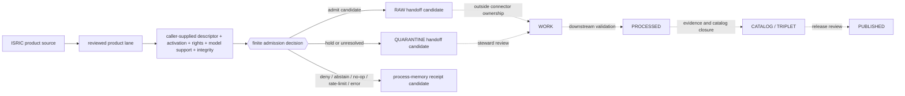

<!-- [KFM_META_BLOCK_V2]
doc_id: kfm://doc/connectors-isric-readme
title: connectors/isric/ — ISRIC Connector Family Admission Contract
type: readme
version: v0.2
status: draft
owners: OWNER_TBD — Connector steward · ISRIC source steward · Soil steward · Modeling/receipt steward · Rights reviewer · Validation steward · Docs steward
created: 2026-06-19
updated: 2026-07-12
policy_label: public; family-admission-contract; repository-present; implementation-unverified; modeled-source; descriptor-and-activation-gated; no-network-by-default; raw-quarantine-receipt-candidates-only; no-publication
path: connectors/isric/README.md
truth_posture: CONFIRMED repository documentation / PROPOSED family implementation / CONFLICTED path-ratification / UNKNOWN package, tests, activation, runtime, and public-client coupling
related:
  - ../README.md
  - soilgrids/README.md
  - ../soil/README.md
  - ../../docs/doctrine/directory-rules.md
  - ../../docs/domains/soil/ARCHITECTURE.md
  - ../../docs/domains/soil/CANONICAL_PATHS.md
  - ../../docs/sources/catalog/isric/README.md
  - ../../docs/sources/catalog/isric/isric-soilgrids.md
  - ../../data/registry/sources/README.md
  - ../../data/registry/sources/soil/isric-soilgrids.yaml
  - ../../schemas/contracts/v1/source/source_descriptor.schema.json
  - ../../schemas/contracts/v1/receipts/README.md
  - ../../tests/domains/soil/README.md
  - ../../data/raw/soil/README.md
  - ../../data/receipts/
  - ../../policy/rights/
  - ../../policy/sensitivity/
  - ../../release/
tags: [kfm, connectors, isric, soilgrids, soil, modeled-source, gridded-derivative-soil, source-admission, raw, quarantine, receipts, no-network, fail-closed, governance]
notes:
  - "At inspected base commit a642470327f32b5b76d81ef4ed996d65de4f6ba0, this family contains this README and the SoilGrids product README; common parent-local package and test paths directly probed were absent."
  - "Directory Rules make connectors/ a canonical responsibility root. Existing source-family prose says an ADR is automatically required for isric/, while Directory Rules §2.4 does not name ordinary children beneath an existing canonical root as an automatic ADR trigger. This remains CONFLICTED."
  - "Nested connector product lanes remain draft / NEEDS VERIFICATION under connectors/README.md; this README neither ratifies nor deprecates that pattern."
  - "The repository-present SoilGrids registry YAML is an eight-line PROPOSED placeholder, not a complete SourceDescriptor or activation decision."
  - "No generic Soil ModelRunReceipt schema was observed at schemas/contracts/v1/receipts/model_run_receipt.schema.json; product-specific modeled-source closure remains NEEDS VERIFICATION."
  - "Product-specific current facts, access surfaces, and source-status notes belong in soilgrids/README.md; this parent contract does not duplicate them."
  - "This revision changes documentation only. It does not activate a source, create connector code or fixtures, retrieve source material, emit a source receipt, or authorize a public claim."
[/KFM_META_BLOCK_V2] -->

<a id="top"></a>

# ISRIC connector family admission contract

> Family-level navigation and source-admission boundary for ISRIC soil products. This lane coordinates product contracts; it does not make modeled soil data observed truth, activate a source, own downstream lifecycle state, or publish anything.

<p>
  
  
  
  
  
  
  
</p>

`connectors/isric/`

> [!IMPORTANT]
> **Document lifecycle:** draft family admission contract  
> **Component maturity:** README surfaces are `CONFIRMED`; connector package, tests, activation, runtime, and CI are `UNKNOWN` or `NEEDS VERIFICATION`  
> **Owner:** `OWNER_TBD` — roles are named in the metadata block; people or teams must be assigned through repository governance  
> **Output boundary:** immutable candidates plus caller-owned RAW, QUARANTINE, or process-memory receipt-candidate handoffs only  
> **Public boundary:** no direct public API, UI, map, catalog, release, or publication behavior

> [!WARNING]
> **Placement is `CONFLICTED`, not settled.** [`connectors/`](../README.md) is the canonical source-admission responsibility root. This family path exists, but current source-family prose says an ADR is automatically required because `isric/` is absent from an illustrative family list, while Directory Rules §2.4 does not identify ordinary children beneath an existing canonical root as an automatic ADR trigger. This README records the conflict; it does not promote, move, deprecate, or ratify the family or nested-product pattern.

> [!CAUTION]
> **Do not activate from documentation or placeholders.** The repository-present SoilGrids registry YAML is not a complete `SourceDescriptor`, and path presence is not a `SourceActivationDecision`.

**Audience:** connector, source, Soil, modeling/receipt, rights, validation, and documentation stewards; implementers preparing small, reviewable ISRIC product-lane changes.

**Quick jumps:** [Scope](#scope) · [Repository fit](#repository-fit) · [Current repository snapshot](#current-repository-snapshot) · [Product index](#product-index) · [Accepted inputs](#accepted-inputs) · [Exclusions](#exclusions) · [Authority boundary](#authority-boundary) · [Directory map](#directory-map) · [Evidence ledger](#evidence-ledger) · [Lifecycle](#lifecycle) · [Admission posture](#admission-posture) · [Anti-collapse rules](#anti-collapse-rules) · [Conflict register](#conflict-register) · [Validation](#validation) · [Definition of done](#definition-of-done) · [Rollback](#rollback) · [Verification backlog](#verification-backlog)

---

## Scope

`connectors/isric/` is the repository-present family coordination lane for ISRIC source admission.

It may:

- orient maintainers to ISRIC product sublanes;
- preserve family-level source-role and modeled-source guardrails;
- state the shared descriptor, activation, rights, integrity, model-support, no-network, and output-boundary expectations that every child product lane inherits;
- index safe fixture and validation expectations without duplicating their owning roots;
- define how product lanes return immutable candidates or use caller-owned RAW, QUARANTINE, and receipt-candidate interfaces;
- record placement, source-role, receipt, and implementation conflicts without resolving them through prose.

It must not become ISRIC or SoilGrids source doctrine, Soil domain truth, a `SourceDescriptor` registry, an activation authority, a schema or policy home, a model-run authority, a downstream pipeline, a catalog/proof/release surface, or a public client.

[Back to top ↑](#top)

---

## Repository fit

| Surface | Responsibility | Current posture |
|---|---|---:|
| [`connectors/`](../README.md) | Canonical implementation root for source-specific fetch, probe, preservation, and admission. | **CONFIRMED** |
| `connectors/isric/` | Repository-present ISRIC family coordination lane. | **CONFIRMED path / PROPOSED implementation / CONFLICTED ratification** |
| [`connectors/isric/soilgrids/`](soilgrids/README.md) | Product-level SoilGrids admission contract. | **CONFIRMED README / PROPOSED implementation** |
| [`connectors/soil/`](../soil/README.md) | Draft cross-source Soil connector coordination lane. | **CONFIRMED README / NEEDS VERIFICATION placement** |
| [`docs/sources/catalog/isric/`](../../docs/sources/catalog/isric/README.md) | Human-facing ISRIC family and product doctrine. | **CONFIRMED docs / conflict noted below** |
| [`docs/domains/soil/`](../../docs/domains/soil/ARCHITECTURE.md) | Soil domain architecture and support-type boundaries. | **CONFIRMED docs** |
| [`data/registry/sources/`](../../data/registry/sources/README.md) | `SourceDescriptor` and source-admission authority surface. | **CONFIRMED responsibility / mixed implementation maturity** |
| [`data/raw/soil/`](../../data/raw/soil/README.md) | Caller-owned immutable RAW handoff surface. | **CONFIRMED README / payload presence unverified** |
| `data/quarantine/soil/` | Caller-owned hold surface for unresolved identity, rights, model, geometry, or integrity questions. | **NEEDS VERIFICATION for concrete product binding** |
| [`schemas/contracts/v1/receipts/`](../../schemas/contracts/v1/receipts/README.md) | Receipt machine-shape family; emitted instances belong elsewhere. | **CONFIRMED index / mixed schema maturity** |
| `policy/rights/`, `policy/sensitivity/` | Rights and sensitivity decisions. | **Outside connector ownership** |
| `release/` | Release, correction, withdrawal, and rollback decisions. | **Outside connector ownership** |

Directory Rules basis: the owning responsibility is source-specific admission, so this file remains under `connectors/`. No root, schema home, policy home, registry home, lifecycle phase, or release authority is added or changed.

[Back to top ↑](#top)

---

## Current repository snapshot

This snapshot is bounded to repository `bartytime4life/Kansas-Frontier-Matrix`, base commit `a642470327f32b5b76d81ef4ed996d65de4f6ba0`, and the named paths inspected for this revision.

| Evidence | Observed state | Safe conclusion |
|---|---|---|
| This parent README | Blob `b9a8773a56ad62f43ba2cbc18828a5a2af73fe46` at the pinned base. | Family documentation exists; runtime behavior is not proven. |
| SoilGrids child README | Blob `a78ad18f56c970fa90f9c7bfc0aaeea3edbeb9fe` at the pinned base. | A detailed product admission contract exists. |
| `connectors/isric/pyproject.toml` | Not found by direct path probe. | No parent-local package manifest was observed at that conventional path. |
| `connectors/isric/src/README.md` | Not found by direct path probe. | No parent-local source-root README was observed at that conventional path. |
| `connectors/isric/tests/README.md` | Not found by direct path probe. | No parent-local test-root README was observed at that conventional path. |
| SoilGrids registry YAML | Eight-line `PROPOSED` placeholder. | It is not a complete `SourceDescriptor` or activation decision. |
| Generic `schemas/contracts/v1/receipts/model_run_receipt.schema.json` | Not found by direct path probe. | Generic Soil modeled-source receipt authority was not established there. |
| Connector execution, source payloads, run receipts, tests, CI, deployment | Not verified. | Do not infer implementation, activation, or readiness. |

Absence claims are deliberately narrow. Differently named, unindexed, or externally generated implementation remains `UNKNOWN`.

[Back to top ↑](#top)

---

## Product index

| Product lane | Family role | Current contract | Parent requirement |
|---|---|---:|---|
| [`soilgrids/`](soilgrids/README.md) | Global modeled soil-property grid product. | **v0.2 product admission contract** | Preserve product, property, depth, statistic, units, uncertainty, projection, resolution, release, rights, and modeled-source lineage. |

Product-specific current facts, endpoint or distribution status, size/work planning signals, model/release identity, and source terms belong in the product README and source catalog. Do not copy them into this parent unless they are genuinely family-wide and independently reviewed.

A future product sublane must not be added to this index until its path, source profile, descriptor/activation posture, rights review, source role, support type, no-network behavior, finite outcomes, validation, and rollback are explicit.

[Back to top ↑](#top)

---

## Accepted inputs

This family lane may contain or coordinate:

| Accepted item | Required posture |
|---|---|
| Family README and product index | Navigation only; must not imply activation or canonical truth. |
| Product-lane README links | Each child states purpose, placement, inputs, exclusions, source role, anti-collapse rules, output boundary, validation, rollback, and definition of done. |
| Caller-supplied descriptor and activation references | Validated externally; never discovered, approved, or mutated by family code. |
| Family/product identity constants | Pure and versioned; no import-time I/O or hidden defaults. |
| Shared request or result protocols | Product-explicit, immutable, bounded, and subordinate to accepted contracts. |
| Candidate and handoff interfaces | Caller-owned; limited to immutable candidates, RAW, QUARANTINE, or process-memory receipt candidates. |
| No-network fixture references | Synthetic, minimized, deterministic, public-safe, and stored under the owning fixture/test roots. |
| Model-support reference candidates | Preserve unresolved modeled-source lineage without claiming receipt closure. |
| Validation and quarantine reason guidance | Finite, searchable, source-role-aware, and fail-closed. |

Product-specific fetchers, parsers, transport adapters, and fixtures belong in an accepted product implementation lane, not in the parent merely for convenience.

---

## Exclusions

This folder must not contain or imply authority over:

- source catalog doctrine or current source facts better owned by `docs/sources/catalog/isric/`;
- accepted `SourceDescriptor` records or `SourceActivationDecision` records;
- rights, sensitivity, admissibility, review, or release policy;
- Soil object meaning or JSON Schema authority;
- canonical `ModelRunReceipt`, `EvidenceBundle`, proof, catalog, triplet, release, correction, withdrawal, or rollback objects;
- WORK, PROCESSED, CATALOG, TRIPLET, or PUBLISHED writes;
- public API, UI, map, tile, search, graph, report, export, screenshot, or AI behavior;
- observed, regulatory, field, parcel, farm, suitability, erosion, hydrology, agriculture, or habitat claims inferred from modeled grids;
- live source activation from a README, URL, placeholder, or successful network probe;
- secrets, signed URLs, credentials, private query values, source payloads, or sensitive joined context in committed documentation or fixtures.

Redirect those responsibilities to their owning roots. Do not create a parallel home under `connectors/isric/`.

[Back to top ↑](#top)

---

## Authority boundary

```text
FAMILY LANE MAY:
  orient maintainers to reviewed ISRIC product lanes
  preserve family/product identity and modeled-source guardrails
  consume caller-supplied descriptor, activation, rights, and model-support decisions
  expose pure shared types or interfaces after placement is reviewed
  return immutable candidates or use caller-owned RAW / QUARANTINE / receipt-candidate interfaces
  record finite admit / hold / deny / abstain / no-op / rate-limit / error outcomes
  support replay, supersession, correction, withdrawal, and invalidation lineage

FAMILY LANE MUST NOT:
  auto-discover, approve, or mutate source authority
  treat placeholder registry files as activation
  invent source role, support type, model identity, rights, uncertainty, scale, or public precision
  contact a live service at import time or in ordinary tests
  silently select or fall back between product distribution surfaces
  write downstream lifecycle, proof, catalog, registry, release, or public stores
  claim a receipt, EvidenceBundle, review, or release gate passed without the owning artifact
  expose connector internals or unreleased material to ordinary public clients
```

The safest implementation default is pure candidate construction with no write. A write-capable adapter is permitted only after target contracts, caller ownership, permissions, idempotency, integrity, correction, rollback, and tests are verified.

[Back to top ↑](#top)

---

## Directory map

Current inspected documentation and adjacent authority surfaces:

```text
connectors/
├── README.md
├── soil/
│   └── README.md                         # draft cross-source coordination
└── isric/
    ├── README.md                         # this family contract
    └── soilgrids/
        └── README.md                     # product admission contract

docs/
├── domains/soil/
│   ├── ARCHITECTURE.md
│   └── CANONICAL_PATHS.md
└── sources/catalog/isric/
    ├── README.md                         # family source profile
    └── isric-soilgrids.md                # product source profile

data/
├── registry/sources/soil/
│   └── isric-soilgrids.yaml              # PROPOSED placeholder; not activation
├── raw/soil/
├── quarantine/soil/
└── receipts/

schemas/contracts/v1/
├── source/source_descriptor.schema.json  # current legacy-path schema surface
└── receipts/                             # mixed-maturity receipt schema family

policy/
├── rights/
└── sensitivity/

release/                                  # outside connector ownership
```

This map is not a complete recursive inventory. It names only the paths directly inspected or needed to explain the family boundary.

[Back to top ↑](#top)

---

## Evidence ledger

| Source | Status | Supports | Does not prove |
|---|---:|---|---|
| [`connectors/README.md`](../README.md) | **CONFIRMED** | `connectors/` is the source-admission root; outputs are restricted to RAW, QUARANTINE, and receipt handoffs; nested product lanes remain draft. | This family is implemented or activated. |
| [`docs/doctrine/directory-rules.md`](../../docs/doctrine/directory-rules.md) | **CONFIRMED doctrine** | Responsibility-root placement and §2.4 ADR triggers. | Whether this child path has been ratified by a later decision not inspected here. |
| This README at base `a642470327f32b5b76d81ef4ed996d65de4f6ba0` | **CONFIRMED** | Family README exists and establishes prior guardrails. | Package, parser, tests, CI, or runtime behavior. |
| [`soilgrids/README.md`](soilgrids/README.md) | **CONFIRMED** | Product contract, current product-level evidence boundary, and unresolved descriptor/model-support questions. | Connector implementation or successful source admission. |
| [`docs/sources/catalog/isric/README.md`](../../docs/sources/catalog/isric/README.md) | **CONFIRMED docs / CONFLICTED placement claim** | ISRIC family framing and source-role limits. | Automatic ADR necessity or activation. |
| [`data/registry/sources/soil/isric-soilgrids.yaml`](../../data/registry/sources/soil/isric-soilgrids.yaml) | **CONFIRMED placeholder** | A proposed registry path is recorded. | Complete descriptor, rights approval, or activation. |
| [`source_descriptor.schema.json`](../../schemas/contracts/v1/source/source_descriptor.schema.json) | **CONFIRMED schema surface / PROPOSED contract state** | The repository expects a much richer descriptor than the placeholder YAML. | A valid ISRIC descriptor instance exists. |
| [`schemas/contracts/v1/receipts/README.md`](../../schemas/contracts/v1/receipts/README.md) | **CONFIRMED index** | Receipt shape and emitted receipt authority are separate; the family has mixed maturity. | Generic Soil `ModelRunReceipt` authority. |
| [`tests/domains/soil/README.md`](../../tests/domains/soil/README.md) | **CONFIRMED test index** | Expected no-network, source-role-aware Soil testing posture. | Executable ISRIC or SoilGrids test coverage or pass results. |

[Back to top ↑](#top)

---

## Lifecycle



Connector documentation, successful retrieval, RAW handoff, or receipt creation is not publication. Promotion remains a governed state transition outside this family.

[Back to top ↑](#top)

---

## Admission posture

Every ISRIC product operation should:

- require an accepted descriptor and explicit activation decision supplied by the caller;
- require an explicit product, distribution surface, geographic scope, work budget, rights reference, model-support reference, integrity posture, and output target;
- perform no network, filesystem write, secret read, descriptor discovery, activation, clock read, identifier generation, cache mutation, or thread/process start at import time;
- keep ordinary tests deterministic and no-network;
- preserve product, release, property, depth, statistic, units, conversion, nodata, uncertainty, raster/package identity, projection, resolution, source URI, retrieval time, source role, support type, and lineage where applicable;
- use finite outcomes and searchable reason codes;
- route missing, stale, conflicting, or permissive inputs to `DENY`, `ABSTAIN`, QUARANTINE, or `ERROR` according to an accepted contract;
- avoid silent transport fallback, resampling, reprojection, mosaicking, unit conversion, depth collapse, statistic collapse, or uncertainty removal;
- avoid direct writes beyond caller-owned RAW, QUARANTINE, or process-memory receipt-candidate interfaces;
- preserve upstream correction and withdrawal without erasing prior KFM lineage.

[Back to top ↑](#top)

---

## Anti-collapse rules

1. **Source family is not product.**
2. **Product documentation is not source activation.**
3. **Modeled source role is not observed source role.**
4. **Soil support type is not downstream use or fitness for decision.**
5. **A grid cell is not a pedon, field sample, parcel observation, management zone, or regulatory determination.**
6. **Property, depth, statistic, units, conversion, model/release, resolution, projection, uncertainty, and source package are identity-bearing.**
7. **Distribution surfaces are not silently interchangeable.**
8. **Reprojection, resampling, mosaicking, clipping, aggregation, and unit conversion create derived artifacts with explicit lineage.**
9. **A connector receipt is process memory, not an `EvidenceBundle`, proof, review, catalog, or release decision.**
10. **Maps, COGs, tiles, catalogs, summaries, joins, graphs, and AI explanations remain downstream carriers, not sovereign truth.**
11. **The most restrictive rights or sensitivity posture from joined material wins.**
12. **A commit, pull request, merge, or GitHub release is not KFM `PUBLISHED`.**

[Back to top ↑](#top)

---

## Conflict register

| Conflict or gap | Current evidence | Required posture |
|---|---|---|
| Is an ADR automatically required for `connectors/isric/`? | Source-family docs say yes because the family is absent from an illustrative §7.3 list; Directory Rules §2.4 does not name ordinary children under an existing canonical root as an automatic trigger. | **CONFLICTED.** Do not promote or deprecate through this README; resolve through accepted doctrine, ADR, or migration decision. |
| Is the nested `isric/soilgrids/` product pattern canonical? | The path and README exist; `connectors/README.md` classifies nested product lanes as draft. | **NEEDS VERIFICATION.** Preserve current path; no move or duplicate lane. |
| Does the registry YAML activate SoilGrids? | It is an eight-line `PROPOSED` placeholder. | **No.** Require a schema-valid descriptor and explicit activation decision. |
| Is generic Soil modeled-source receipt authority established? | The generic path directly probed was absent; the receipt-family index does not list a generic `ModelRunReceipt`. | **NEEDS VERIFICATION.** Preserve a model-support reference candidate; quarantine or abstain when closure is required. |
| Does `connectors/soil/` own SoilGrids implementation? | Its README is a draft coordination lane and prefers source-specific product lanes. | **No current authority.** Keep links aligned; do not move implementation by convenience. |
| Are package, tests, fixtures, CI, or runtime present under other names? | Conventional parent-local paths were not found; no exhaustive recursive inventory or runtime evidence was inspected. | **UNKNOWN.** Verify before implementation claims. |

[Back to top ↑](#top)

---

## Validation

### Documentation checks for this contract

- KFM Meta Block v2 is present and preserves `doc_id` and `created`.
- One H1 is present.
- Quick-jump targets and relative links are reviewable.
- Callouts use GitHub-supported labels.
- Tables, lists, fenced blocks, and Mermaid source are structurally balanced.
- Current implementation claims are bounded to the pinned repository evidence.
- The placement conflict, descriptor placeholder, receipt gap, owner placeholder, and runtime unknowns remain visible.
- No source payload, credential, private URL, sensitive location, or rights-restricted material is included.
- No product-level current fact is duplicated without need.

### Future implementation checks

Before family or child code is relied on, verify that:

- imports and ordinary tests have no network or write side effects;
- source access requires a validated descriptor and explicit activation decision;
- rights, attribution, sensitivity, source role, model support, integrity, and work bounds fail closed;
- every product operation is explicit and bounded;
- finite outcomes cover admit, hold/quarantine, deny, abstain, no-op, skipped, rate-limited, and error cases as applicable;
- candidates and handoffs are deterministic and idempotent;
- no connector path writes WORK, PROCESSED, CATALOG, TRIPLET, PUBLISHED, proof, registry, release, API, UI, or map surfaces;
- modeled-source and support-type anti-collapse rules are covered by valid and invalid fixtures;
- correction, withdrawal, replay, invalidation, and rollback behavior is tested;
- CI scope and actual pass results are recorded without treating unrun checks as pass.

[Back to top ↑](#top)

---

## Definition of done

This family contract is ready to advance beyond draft only when:

- [ ] `OWNER_TBD` is replaced through repository governance.
- [ ] The family and nested-product placement conflict is resolved or formally tracked with an accepted decision path.
- [ ] A complete recursive family inventory is generated and reviewed.
- [ ] Every indexed product lane has a current README contract and no duplicate implementation home.
- [ ] A schema-valid `SourceDescriptor` and explicit activation decision exist for each activated product.
- [ ] Rights, attribution, sensitivity, source role, support type, model support, integrity, and public-release posture are reviewed.
- [ ] Package/import boundaries are verified and no import-time side effects exist.
- [ ] Default tests are deterministic, synthetic, minimized, and no-network.
- [ ] Output-boundary tests prove connector code cannot write downstream lifecycle, proof, catalog, registry, release, API, UI, or map surfaces.
- [ ] Success, failure, denial, abstention, no-op, skipped, rate-limit, quarantine, correction, and withdrawal receipts are covered where applicable.
- [ ] CI, validation, correction, and rollback behavior are verified and recorded.
- [ ] No connector output is represented as public or `PUBLISHED`.

[Back to top ↑](#top)

---

## Rollback

If this revision is used to justify source activation, path ratification, modeled-as-observed relabeling, downstream writes, public exposure, or bypass of descriptor, rights, model-support, policy, validation, review, release, correction, or rollback gates, revert it.

Concrete documentation rollback target:

```text
repository: bartytime4life/Kansas-Frontier-Matrix
base commit: a642470327f32b5b76d81ef4ed996d65de4f6ba0
path: connectors/isric/README.md
restore blob: b9a8773a56ad62f43ba2cbc18828a5a2af73fe46
```

Use a transparent revert commit or revert pull request and re-run applicable documentation and boundary checks. Revert the associated generated provenance receipt with the same change. Do not reset, force-push, or rewrite shared history.

[Back to top ↑](#top)

---

## Verification backlog

| Item | Status | Evidence needed |
|---|---:|---|
| Assign connector, source, Soil, receipt, rights, validation, and docs ownership. | **NEEDS VERIFICATION** | Accepted CODEOWNERS or stewardship record. |
| Resolve family-child and nested-product path ratification. | **CONFLICTED / NEEDS VERIFICATION** | Accepted Directory Rules clarification, ADR, or migration decision. |
| Reconcile stale automatic-ADR wording in source-family docs. | **NEEDS VERIFICATION** | Scoped source-doc revision after the authority decision. |
| Generate a complete recursive inventory of `connectors/isric/` and relevant imports. | **NEEDS VERIFICATION** | Pinned tree walk or mounted checkout. |
| Confirm package, module, fixture, and executable test homes. | **UNKNOWN** | Repo tree, package metadata, imports, fixtures, and tests. |
| Replace the SoilGrids registry placeholder with a reviewed descriptor and separate activation decision. | **NEEDS VERIFICATION** | Schema-valid records, validation output, rights review, and activation receipt. |
| Establish generic or Soil-profiled modeled-source support / `ModelRunReceipt` authority. | **NEEDS VERIFICATION** | Accepted contract, schema/profile, fixtures, validator, and tests. |
| Verify finite outcome and reason-code vocabulary. | **PROPOSED** | Accepted contract/schema and negative fixtures. |
| Verify no-network, no-side-effect, output-boundary, replay, correction, and rollback tests. | **NEEDS VERIFICATION** | Executable tests and trusted CI results. |
| Verify public-client isolation from connector and unreleased source material. | **NEEDS VERIFICATION** | Import graph, API/UI configuration, policy checks, and runtime evidence. |
| Recheck each product's source terms and operational status before activation. | **NEEDS VERIFICATION** | Current source-steward review recorded in product-specific evidence. |

[Back to top ↑](#top)

---

## Maintainer note

Keep this family narrow. The parent coordinates product admission contracts; it does not absorb product details, Soil domain semantics, source registry authority, model validation, policy, evidence closure, catalog closure, release, or public behavior. Where evidence is incomplete, preserve the candidate, quarantine, abstain, or deny—do not let fluent documentation turn uncertainty into implementation fact.

<p align="right"><a href="#top">Back to top</a></p>
