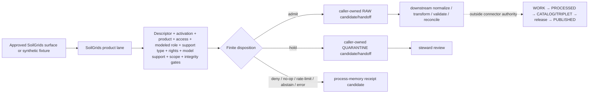

<!-- [KFM_META_BLOCK_V2]
doc_id: kfm://doc/connectors-isric-soilgrids-readme
title: connectors/isric/soilgrids/ — ISRIC SoilGrids Product Admission Contract
type: readme
version: v0.2
status: draft
owners: OWNER_TBD — Connector steward · ISRIC source steward · Soil steward · Modeling/receipt steward · Rights reviewer · Validation steward · Docs steward
created: 2026-06-19
updated: 2026-07-12
policy_label: public-doctrine; product-admission-contract; repository-present; implementation-unverified; modeled-source; gridded-derivative; no-network-by-default; descriptor-and-activation-gated; rights-gated; raw-quarantine-receipt-candidates-only; no-publication
path: connectors/isric/soilgrids/README.md
truth_posture: CONFIRMED repository documentation and current official source surfaces / PROPOSED connector implementation and finite outcomes / CONFLICTED path-ratification and ModelRunReceipt authority / UNKNOWN package, tests, activation, runtime, and public-client coupling
related:
  - ../../README.md
  - ../README.md
  - ../../soil/README.md
  - ../../../docs/doctrine/directory-rules.md
  - ../../../docs/domains/soil/ARCHITECTURE.md
  - ../../../docs/domains/soil/CANONICAL_PATHS.md
  - ../../../docs/sources/catalog/isric/README.md
  - ../../../docs/sources/catalog/isric/isric-soilgrids.md
  - ../../../data/registry/sources/README.md
  - ../../../data/registry/sources/soil/isric-soilgrids.yaml
  - ../../../schemas/contracts/v1/source/source_descriptor.schema.json
  - ../../../schemas/contracts/v1/receipts/README.md
  - ../../../tests/domains/soil/README.md
  - ../../../data/raw/soil/README.md
  - ../../../data/receipts/
  - ../../../policy/rights/
  - ../../../policy/sensitivity/
  - ../../../release/
tags: [kfm, connectors, isric, soilgrids, soil, modeled, gridded-derivative-soil, raster, depth-bands, prediction-quantiles, uncertainty, source-admission, raw, quarantine, receipts, no-network, fail-closed, governance]
notes:
  - "At inspected base commit 66c3a125942c1a4187a4a7bb3152285b5c9d93e2, the product lane and parent family contained README documentation, while common package and test paths directly probed beneath both lanes were absent."
  - "The registry path data/registry/sources/soil/isric-soilgrids.yaml exists only as an eight-line PROPOSED placeholder and is not an accepted SourceDescriptor or activation decision."
  - "No generic Soil ModelRunReceipt schema was found at schemas/contracts/v1/receipts/model_run_receipt.schema.json; a habitat-specific permissive scaffold does not establish Soil receipt authority."
  - "Directory Rules make connectors/ canonical, but do not clearly require an ADR merely to add a source-family child. Existing OPEN-DSC-14 language is therefore CONFLICTED; the nested product-lane pattern still needs review."
  - "Official ISRIC documentation was rechecked on 2026-07-12. It describes SoilGrids250m v2.0, six standard depths, quantified prediction surfaces, CC BY 4.0, WMS/WCS/WebDAV/GEE access, and a temporarily paused beta REST API."
  - "This revision defines a safe documentation contract only. It does not activate access, choose a production transport, create code or fixtures, emit source data, or authorize public claims."
[/KFM_META_BLOCK_V2] -->

<a id="top"></a>

# ISRIC SoilGrids Product Admission Contract

> Product-level contract for admitting ISRIC SoilGrids material through KFM's source membrane. The lane preserves model, raster, depth, statistic, units, uncertainty, rights, and lineage; it does not turn a global modeled grid into observed soil truth, field-scale authority, or a public product.

<p>
  
  
  
  
  
  
  
</p>

`connectors/isric/soilgrids/`

> [!IMPORTANT]
> **Inspected repository state:** at base commit `66c3a125942c1a4187a4a7bb3152285b5c9d93e2`, this path contains this README. Direct probes found no `pyproject.toml`, source-root README, or test-root README beneath the SoilGrids product lane, and no package/test roots at the parent ISRIC lane's common paths. The SoilGrids registry entry is a `PROPOSED` placeholder. No executable connector, accepted SourceDescriptor, activation decision, fixture corpus, connector-local test collection, source payload, run receipt, or runtime result was verified.

> [!CAUTION]
> **Do not activate from placeholders.** [`data/registry/sources/soil/isric-soilgrids.yaml`](../../../data/registry/sources/soil/isric-soilgrids.yaml) does not contain a complete SourceDescriptor. Documentation, directory presence, public endpoint reachability, or a source URL cannot replace a validated descriptor plus explicit activation decision.

> [!WARNING]
> **Modeled role and support type are separate.** An accepted use of SoilGrids is expected to carry `source_role = modeled` and a Soil support type equivalent to `gridded_derivative_soil`. “Context” may describe downstream use, but it is not a substitute source role. Neither label authorizes an observed, regulatory, parcel, field, suitability, or release claim.

> [!WARNING]
> **Current REST status is not a transport contract.** Official ISRIC documentation checked on 2026-07-12 says the beta SoilGrids REST API is temporarily paused and does not guarantee uptime. A future implementation must fail closed rather than silently fall back, and it must not select WCS, WebDAV, WMS, Google Earth Engine, or REST without an accepted access and rights decision.

**Quick jumps:** [Purpose](#purpose) · [Placement and current state](#placement-and-current-state) · [Authority boundary](#authority-boundary) · [Product identity](#product-identity) · [Official source surface](#official-source-surface) · [Admission inputs and outputs](#admission-inputs-and-outputs) · [Identity and preservation](#identity-and-preservation) · [Access contract](#access-contract) · [Rights and sensitivity](#rights-and-sensitivity) · [Descriptor and receipt conflicts](#descriptor-and-receipt-conflicts) · [Finite outcomes](#finite-outcomes) · [Lifecycle](#lifecycle) · [Testing](#testing) · [Implementation sequence](#implementation-sequence) · [Definition of done](#definition-of-done) · [Verification backlog](#verification-backlog) · [Review and rollback](#review-and-rollback)

---

## Purpose

This README makes the SoilGrids product boundary concrete enough for small, reversible implementation pull requests without upgrading source documentation or repository placeholders into runtime proof.

This lane may eventually:

- construct deterministic, bounded requests for an explicitly approved SoilGrids distribution surface;
- preserve source package and response identity before parsing;
- parse property × depth × prediction-statistic raster assets without flattening units or uncertainty;
- preserve source role, Soil support type, model/release identity, projection, spatial support, resolution, rights, attribution, and retrieval lineage;
- assemble finite admission outcomes from caller-supplied descriptor, activation, rights, model, integrity, and review decisions;
- return candidates, or use explicit caller-owned RAW, QUARANTINE, and process-memory receipt-candidate interfaces;
- support content-addressed replay, no-op detection, source correction, withdrawal, and downstream invalidation.

This lane does **not**:

- define or approve ISRIC or SoilGrids source doctrine;
- create, discover, approve, or mutate SourceDescriptor or SourceActivationDecision authority;
- choose a current endpoint, API version, authentication method, rate limit, geographic scope, property set, or production transport from memory;
- make SoilGrids an observed, authoritative U.S./Kansas, regulatory, field, parcel, agronomic, suitability, erosion, or hydrologic truth source;
- define Soil object meaning, machine schemas, rights policy, sensitivity policy, evidence closure, catalog closure, release state, correction state, or rollback state;
- write WORK, PROCESSED, CATALOG, TRIPLET, PUBLISHED, proof, registry, or release stores;
- publish COGs, tiles, maps, reports, exports, public API payloads, search/index entries, graph edges, screenshots, or AI answers;
- expose connector internals or unreleased raster material to ordinary public clients.

[Back to top ↑](#top)

---

## Placement and current state

### Placement decision

| Question | Current safe decision | Evidence posture |
|---|---|---:|
| What is the owning responsibility root? | `connectors/`, because the primary responsibility is source-specific fetch, preservation, parsing, and admission. | **CONFIRMED** by Directory Rules and [`connectors/README.md`](../../README.md). |
| What is the repository-present family path? | `connectors/isric/`. | **CONFIRMED path / draft family contract**. |
| What is this path? | A repository-present SoilGrids product documentation sublane beneath the ISRIC family. | **CONFIRMED README / PROPOSED runtime placement**. |
| Is an ADR automatically required because `isric/` is absent from the illustrative Directory Rules tree? | Not established. Directory Rules §2.4 does not name ordinary children beneath an existing canonical root as an ADR trigger. Existing `OPEN-DSC-14` language is therefore **CONFLICTED / NEEDS VERIFICATION**. | **CONFLICTED documentation**. |
| Is the nested-product pattern ratified? | Not yet. The connector-root README classifies nested product lanes as draft / `NEEDS VERIFICATION`. | **PROPOSED**. |
| What is `connectors/soil/`? | A draft coordination surface, not SoilGrids implementation authority. | **CONFIRMED README boundary**. |
| Does any path presence activate the source? | No. | **CONFIRMED boundary**. |

This revision neither promotes nor deprecates a connector pattern, moves a file, creates a new authority root, nor resolves an ADR-class issue. A later migration must name every affected package, descriptor, import, test, receipt, and rollback target.

### Current repository snapshot

The following snapshot is bounded to the pinned base commit and the named paths inspected in this update.

```text
connectors/
├── README.md
├── soil/
│   └── README.md                              # coordination only
└── isric/
    ├── README.md                              # draft family documentation
    └── soilgrids/
        └── README.md                          # this product contract

data/registry/sources/soil/
└── isric-soilgrids.yaml                       # eight-line PROPOSED placeholder

docs/sources/catalog/isric/
├── README.md                                  # family profile
└── isric-soilgrids.md                         # product profile

docs/domains/soil/
├── ARCHITECTURE.md
└── CANONICAL_PATHS.md

tests/domains/soil/
└── README.md                                  # domain test index; executable coverage unverified
```

| Surface | Observed state | Safe conclusion |
|---|---|---|
| This README | v0.1 before this revision; blob `50f3351388a47d51ec7fe3ed99747b625e7379af`. | Product documentation exists. |
| `connectors/isric/README.md` | v0.1 family README. | Parent navigation exists; package/runtime behavior is not proven. |
| Product-local `pyproject.toml`, `src/README.md`, `tests/README.md` | Not found in direct probes. | No package or test scaffold was observed at these common paths. |
| Parent-local `pyproject.toml`, `src/README.md`, `tests/README.md` | Not found in direct probes. | No parent package or test scaffold was observed at these common paths. |
| Registry YAML | Eight-line `PROPOSED` placeholder. | It is not a complete SourceDescriptor or activation decision. |
| Generic receipt path `schemas/contracts/v1/receipts/model_run_receipt.schema.json` | Not found in direct probe. | No generic receipt schema was observed there. |
| Habitat-specific ModelRunReceipt schema | Present but permissive and domain-specific. | It cannot be imported as Soil authority by convenience. |
| Soil test README | Documentation-only parent index. | Test expectations exist; executable SoilGrids coverage is not proven. |
| Live request, source package, connector receipt, build/import proof, deployment | Not verified. | Do not infer operation or readiness. |

Absence claims are deliberately narrow. Differently named or unindexed implementation remains **UNKNOWN**.

[Back to top ↑](#top)

---

## Authority boundary

```text
PRODUCT LANE MAY:
  document SoilGrids product and access boundaries
  define pure connector types, protocols, constants, and deterministic helpers
  consume caller-supplied descriptor and activation decisions
  construct bounded, product-explicit request specifications
  invoke an injected transport only after explicit activation
  preserve source package identity and integrity
  parse property × depth × prediction-statistic assets
  preserve modeled role and gridded-derivative support type
  assemble finite connector decisions
  return candidates or use caller-owned RAW / QUARANTINE / receipt-candidate interfaces
  support replay, no-op, correction, withdrawal, and invalidation lineage

PRODUCT LANE MUST NOT:
  auto-discover or approve descriptors
  treat the placeholder registry YAML as authority
  invent model/release identity, rights, units, scale factors, CRS, uncertainty, or public precision
  contact a live service at import time or in default tests
  silently switch access surfaces after a failure
  silently resample, reproject, mosaic, convert units, or collapse depth/statistic identity
  write downstream lifecycle, proof, registry, release, or public stores
  make a public API, UI, map, tile, search, graph, report, or AI payload
  treat connector/test receipts as EvidenceBundle, proof, review, catalog, or release closure
```

The safest implementation default is **candidate construction with no write**. A write-capable adapter is permitted only after target contracts, caller ownership, permissions, idempotency, integrity, correction, rollback, and tests are verified.

[Back to top ↑](#top)

---

## Product identity

### Source, product, role, and support type

| Concept | Value or posture | Status |
|---|---|---:|
| Source family | `isric` | Repository-present slug; family authority remains draft. |
| Product | SoilGrids250m version 2.0 documentation surface | **CONFIRMED current official documentation**; exact captured source release still must be pinned. |
| Source organization | ISRIC — World Soil Information | **CONFIRMED**. |
| Product character | Global machine-learning soil-property maps | **CONFIRMED**. |
| Spatial resolution | 250 m | **CONFIRMED current official documentation**. |
| Standard depths | `0–5`, `5–15`, `15–30`, `30–60`, `60–100`, `100–200 cm` | **CONFIRMED current official documentation**. |
| Prediction surfaces | `Q0.05`, `Q0.50`, `mean`, `Q0.95` | **CONFIRMED current official documentation**. |
| Expected KFM source role | `modeled` | **PROPOSED until accepted descriptor**. |
| Soil support type | `gridded_derivative_soil` or accepted equivalent | **PROPOSED vocabulary / CONFIRMED separation requirement**. |
| Downstream use | International-comparability or coarse contextual evidence | **CONFIRMED doctrine framing**; not a source-role enum. |
| License | CC BY 4.0 in current official documentation | **CONFIRMED source statement / reverify before activation**. |

### Anti-collapse rules

1. **Source family is not product.**
2. **Modeled role is not observed role.**
3. **Support type is not downstream use.**
4. **Research, visualization, or contextual usefulness is not field-scale authority.**
5. **A 250 m cell is not a pedon, horizon sample, parcel observation, management zone, or regulatory determination.**
6. **Property, depth interval, prediction statistic, units, conversion factor, nodata convention, source release, CRS, and resolution are identity-bearing.**
7. **Q0.50, mean, Q0.05, Q0.95, and the derived uncertainty ratio are not interchangeable.**
8. **WMS visualization, WCS subsets, WebDAV packages, Google Earth Engine copies, and REST responses are separate distribution surfaces.**
9. **Reprojection, resampling, mosaicking, clipping, unit conversion, and aggregation create derived artifacts with explicit lineage.**
10. **Maps, COGs, tiles, STAC records, summaries, joins, and AI explanations remain downstream carriers.**

[Back to top ↑](#top)

---

## Official source surface

Official references, rechecked on 2026-07-12:

- [SoilGrids documentation](https://docs.isric.org/globaldata/soilgrids/)
- [What is SoilGrids?](https://docs.isric.org/globaldata/soilgrids/SoilGrids_faqs.html)
- [SoilGrids layers](https://docs.isric.org/globaldata/soilgrids/SoilGrids_faqs_01.html)
- [SoilGrids access](https://docs.isric.org/globaldata/soilgrids/SoilGrids_faqs_02.html)

| Surface | Officially described use | Connector posture |
|---|---|---|
| WMS | Visualization and overview. | Never treat rendered pixels or a map response as the preferred source capture when a bounded data surface is required. |
| WCS | Obtain a bounded map subset for use in modelling pipelines. | Candidate for bounded retrieval after descriptor, activation, property, depth, statistic, CRS, extent, size, timeout, and integrity limits are explicit. |
| WebDAV | Download complete VRT/OVR/GeoTIFF map packages. | Candidate for package capture only with a reviewed byte/work budget, checksum plan, resumability, storage target, and rollback plan. |
| SoilGrids.org portal | Explore and download. | Human discovery surface; not an automation or activation record. |
| Google Earth Engine | Community-contributed distribution. | Separate distribution and terms surface; do not silently equate it with ISRIC-hosted files. |
| REST API v2.0 | Beta query service; official docs currently say it is temporarily paused. | Default `DENY` or `ABSTAIN` for production use until official restoration and a fresh source review; never silently fall back. |

Official access documentation currently describes each complete map as roughly 5 GB and a property across six depths and four prediction surfaces as roughly 120 GB. Treat those figures as planning signals, not immutable contract constants; every request still needs a bounded size/work decision.

[Back to top ↑](#top)

---

## Admission inputs and outputs

### Required caller-supplied inputs

A future connector operation should require an immutable request object carrying, at minimum:

| Input | Requirement |
|---|---|
| Descriptor | Accepted SourceDescriptor reference plus validated content. |
| Activation | Explicit SourceActivationDecision with allowed/restricted scope and network posture. |
| Source/product | Source-family ID, product ID, product/documentation version, and aliases. |
| Access surface | Explicit `wcs`, `webdav`, `wms`, `gee`, `rest`, fixture, or another accepted enum; no implicit fallback. |
| Product selection | Property code, depth interval, prediction statistic, and requested asset class. |
| Spatial scope | Bounding geometry/extent, target CRS if applicable, and maximum pixels/bytes/area. |
| Work bounds | Timeout, retry, pagination/file count, byte limit, concurrency, and total-work ceiling. |
| Rights | Current license/terms review reference and attribution requirements. |
| Model support | Accepted model-run evidence/profile reference appropriate to the captured release. |
| Integrity | Expected digest, ETag/Last-Modified posture, source version, or explicit unknown-integrity disposition. |
| Dependencies | Injected transport, clock, identifier factory, logger, and caller-owned candidate/handoff interfaces. |

Missing, stale, conflicting, or permissive inputs fail closed.

### Allowed outputs

A future operation may return:

- an immutable source-package or response candidate;
- parsed asset candidates;
- per-asset and batch admission decisions;
- a RAW handoff candidate;
- a QUARANTINE handoff candidate;
- a process-memory receipt candidate;
- a finite no-op, rate-limit, abstain, deny, or error result.

A future operation must not create:

- a processed SoilProperty record;
- an accepted ModelRunReceipt merely by parsing metadata;
- an EvidenceBundle or proof closure;
- a STAC/DCAT/PROV catalog record as canonical truth;
- a ReleaseManifest or public layer;
- a field-, parcel-, suitability-, erosion-, hydrology-, agriculture-, or habitat-authority claim.

[Back to top ↑](#top)

---

## Identity and preservation

### Source package identity

The official SoilGrids file model uses a `property_depthInterval_quantile` triplet and a VRT/OVR/GeoTIFF package. Preserve the source naming and package membership before normalization.

Minimum carriers, when exposed by the selected distribution surface:

- source-family ID and aliases;
- product ID and documentation/model version;
- distribution-surface ID;
- source release marker or explicit rolling-release state;
- property code and description;
- depth top, depth bottom, depth unit, and source depth token;
- prediction statistic (`Q0.05`, `Q0.50`, `mean`, `Q0.95`, or separately defined uncertainty layer);
- mapped unit, conventional unit, and conversion factor;
- source integer value semantics;
- nodata/mask convention;
- VRT, OVR, GeoTIFF tile, WCS coverage, REST response, or GEE asset identity;
- source URI or safe endpoint-family reference;
- source CRS/SRS definition, transform, cell size, extent, dimensions, and tile/package membership;
- response/package digest and component digests where obtainable;
- retrieval time and safe source headers;
- connector/parser version;
- descriptor, activation, rights, and model-support references;
- source role, Soil support type, finite outcome, reason code, and lineage references.

### Rolling release and correction

Official documentation says SoilGrids uses a rolling-release approach. Therefore:

- `latest` is an access alias, not an immutable KFM identity;
- each capture pins retrieval time, request/package identity, digests, and every upstream version marker available;
- a changed asset digest or source marker creates a new source state;
- an unchanged accepted digest may produce `NO_OP`;
- a corrected or withdrawn upstream map does not erase prior KFM lineage;
- downstream artifacts that depended on superseded source state require revalidation, correction, withdrawal, or rebuild decisions outside the connector;
- in-place mutation of an accepted descriptor, receipt, or source-state record is forbidden.

### Units and value conversion

Official maps store integer values and publish per-property conversion factors. A future parser must:

1. preserve the raw integer;
2. preserve mapped units;
3. preserve the conversion factor;
4. derive conventional units only through an explicit, deterministic transform;
5. retain both source and transformed value lineage;
6. reject or quarantine missing, zero, conflicting, or unknown conversion factors;
7. never convert a quantile or uncertainty ratio as though it were a mean measurement.

### Projection and spatial transforms

Current official documentation describes the native SoilGrids SRS as Interrupted Goode Homolosine on WGS84, with `ESRI:54052` and a pseudo `EPSG:152160` used in some software contexts. A future connector must preserve the source SRS definition rather than silently selecting whichever code a library accepts.

Reprojection, clipping, resampling, mosaicking, overview generation, or COG conversion belongs to a downstream transform step unless an accepted connector contract explicitly includes it. Every such transform needs input/output digests, method, parameters, resolution, resampling kernel, tolerance, actor/tool version, and rollback linkage.

[Back to top ↑](#top)

---

## Access contract

### Default posture

- Package import performs no network, DNS, filesystem write, secret read, descriptor discovery, clock read, UUID generation, logging setup, thread/process start, cache mutation, or activation.
- Ordinary tests are no-network and use synthetic, minimized fixtures.
- Live access is disabled until descriptor, activation, product, scope, rights, model-support, integrity, and network decisions are explicit.
- Access-surface selection is an input, not a hidden implementation fallback.
- A request that exceeds its byte, area, pixel, file, retry, timeout, or total-work bound returns a finite failure.
- Credentials, private query values, signed URLs, full raw bodies, and sensitive join context never enter logs or committed fixtures.

### Surface-specific rules

#### WMS

WMS may support human visualization checks. It must not become the default capture path for numeric source values when the selected operation requires analysis-grade raster data.

#### WCS

A WCS request must pin service/version, coverage, property, depth, statistic, CRS, extent, width/height or resolution, format, nodata posture, timeout, and size/work limits. Axis-order or CRS ambiguity fails closed.

#### WebDAV

A WebDAV package operation must name every requested VRT/OVR/tile component, expected package relationship, maximum bytes/files, resumability, temporary-storage policy, digest strategy, and cleanup/rollback behavior. “Download all SoilGrids” is not a valid bounded request.

#### Google Earth Engine

A GEE asset is a separate distribution copy. Its asset identity, ingestion date, bands, scale/projection behavior, terms, and divergence from ISRIC-hosted files must be reviewed independently.

#### REST

Until official documentation confirms restoration and an accepted activation decision allows it, REST operations return a finite unavailable/denied result. When later enabled, the connector must respect current official fair-use limits, bounded retries, and explicit no-uptime-guarantee handling.

[Back to top ↑](#top)

---

## Rights and sensitivity

### Rights

Current official ISRIC documentation states that SoilGrids products are provided under CC BY 4.0. Before activation or redistribution, the source steward must reverify the captured product/release and record:

- exact license identifier and URL;
- attribution text and required source/version references;
- redistribution and modification posture;
- separate terms for the selected access/distribution surface;
- any notice required for a transformed or derived artifact;
- re-evaluation behavior if terms or source metadata change.

A family-level statement is not permission to omit per-capture rights evidence.

### Sensitivity and public precision

SoilGrids is generally coarse global environmental data, but the connector does not declare a public-release class. Sensitivity can increase through:

- joins with rare-species, cultural, archaeology, private-land, infrastructure, or living-person material;
- field/farm targeting or owner-specific analysis;
- operational overlays;
- derived products that imply precision or decision fitness beyond the source support.

The most restrictive joined posture wins. Public-safe geometry, redaction/generalization, derivative licensing, EvidenceBundle closure, and release review remain downstream responsibilities.

[Back to top ↑](#top)

---

## Descriptor and receipt conflicts

### SourceDescriptor placeholder

The repository-present SoilGrids registry YAML is not a SourceDescriptor. It lacks the identity, source type/role, authority, publisher/steward, rights, sensitivity, cadence, access, citation, source-head, admissibility, public-release, review, release, and lifecycle content required by the richer source-descriptor contract.

Safe behavior:

- do not auto-load it;
- do not infer missing fields;
- do not use `status: PROPOSED` as activation;
- do not write source material to RAW merely because the path exists;
- route missing descriptor/activation support to `DENY`, `ABSTAIN`, or QUARANTINE according to an accepted finite contract.

### ModelRunReceipt authority

Source doctrine requires modeled-source lineage, but current repository evidence does not establish a generic Soil ModelRunReceipt schema:

- `schemas/contracts/v1/receipts/model_run_receipt.schema.json` was not found;
- the receipt-family README does not list one;
- a habitat-specific ModelRunReceipt schema exists as a permissive `PROPOSED` scaffold with no fields;
- domain-specific scaffolds cannot become cross-domain authority by import convenience.

Until a contract/schema/profile decision is accepted, the connector may preserve a **model-support reference candidate** and route unresolved modeled-source closure to QUARANTINE or `ABSTAIN`. It must not emit a canonical ModelRunReceipt or claim model-run closure.

Minimum future model-support content should address model ID/version, source release, training/input references as lawfully available, parameters or documented method reference, publication/run time, validation reference, uncertainty-surface references, and correction/supersession lineage. Exact shape remains **NEEDS VERIFICATION**.

[Back to top ↑](#top)

---

## Finite outcomes

The following vocabulary is **PROPOSED** pending an accepted machine contract.

| Outcome | Meaning |
|---|---|
| `ADMIT_RAW` | All supplied descriptor, activation, product, access, role, support-type, rights, model-support, scope, integrity, and review gates permit a bounded RAW candidate. |
| `QUARANTINE` | Material may be retained for review/remediation but is not promotion-track eligible. |
| `NO_OP` | The accepted bounded request/package resolves to unchanged source state. |
| `RATE_LIMITED` | The source throttled an enabled operation; bounded retry evidence remains visible. |
| `ABSTAIN` | Scope, source state, product identity, or governance support is insufficient for a safe decision. |
| `DENY` | Descriptor, activation, rights, access, source status, sensitivity, or policy blocks the operation. |
| `ERROR` | Transport, parsing, integrity, storage, contract, or implementation failure occurred. |

Illustrative stable reason-code families:

```text
descriptor_missing
activation_missing
activation_denied
product_unknown
access_surface_unapproved
rest_api_paused
request_unbounded
source_package_incomplete
property_unknown
depth_unknown
prediction_statistic_unknown
conversion_factor_missing
crs_unknown
resampling_unrecorded
rights_unverified
model_support_unresolved
content_unchanged
rate_limited
transport_error
integrity_mismatch
handoff_failed
```

Reason codes are not a substitute for evidence. Errors and receipts must not leak credentials, source bodies, private URLs, exact sensitive joins, or local filesystem details.

[Back to top ↑](#top)

---

## Lifecycle



Connector receipts are process memory. They do not establish EvidenceBundle, catalog, proof, review, promotion, release, correction, withdrawal, or publication closure.

[Back to top ↑](#top)

---

## Testing

The owning domain test index is [`tests/domains/soil/README.md`](../../../tests/domains/soil/README.md). No executable SoilGrids connector test collection was verified in this documentation revision.

Default tests must be hermetic and synthetic. Proposed coverage:

| Test class | Required assertion |
|---|---|
| Import safety | Import performs no I/O, discovery, activation, clock/ID generation, logging configuration, or thread/process work. |
| Descriptor/activation | Placeholder or missing authority cannot activate access. |
| Product routing | Unknown product/property/depth/statistic does not receive a permissive default. |
| Access status | Paused/disabled REST produces a finite result without fallback. |
| WCS bounds | Extent, CRS, dimensions/resolution, timeout, and byte/work budgets are enforced. |
| WebDAV bounds | VRT/OVR/tile package membership and maximum bytes/files are enforced. |
| Package integrity | Missing components, changed digests, partial downloads, and mismatched package members fail closed. |
| Filename parsing | `property_depthInterval_quantile` tokens are preserved exactly. |
| Depth handling | Six standard bands remain distinct; no surface/subsoil collapse. |
| Prediction handling | Q0.05, Q0.50, mean, Q0.95, and uncertainty ratio remain distinct. |
| Units | Raw integer, mapped unit, conversion factor, conventional unit, and transformed value lineage are retained. |
| CRS | Native SRS text/code is preserved; unknown or conflicting CRS fails closed. |
| Transform boundary | Reprojection/resampling is denied unless an explicit transform contract and receipt path are supplied. |
| Rolling release | Changed digest creates new lineage; unchanged digest produces `NO_OP`; prior state remains queryable. |
| Rights | Missing license/attribution evidence routes to QUARANTINE or `DENY`. |
| Model support | Missing or non-resolving model-support reference blocks promotion-track admission. |
| Logging/privacy | Secrets, source bodies, signed URLs, local paths, and sensitive join context do not appear. |
| Handoff boundary | Fakes prove candidate-only default and RAW/QUARANTINE/receipt-candidate-only interfaces. |
| Public boundary | Connector code cannot write downstream or expose public API/map/AI surfaces. |

A valid evidence statement names the commit, exact command, collected test count, result, covered assertions, skipped live tests, and environment limits. A green repository workflow or placeholder step does not prove that the SoilGrids connector works.

[Back to top ↑](#top)

---

## Implementation sequence

Use one coherent capability per pull request. Do not begin with live access.

| Step | Smallest useful change | Required proof | Rollback |
|---|---|---|---|
| 0 | Reconcile path posture, complete SourceDescriptor/activation authority, and decide the model-support contract/schema/profile. | Commit-pinned inventory, accepted decision, negative placeholder-auto-load test. | Restore documentation-only state; keep network disabled. |
| 1 | Add minimal package metadata and import-safety tests only. | Isolated build/install/import report; no-network/no-secret assertions. | Revert package/import files. |
| 2 | Add immutable request, source-package, parsed-asset, finite-outcome, and reason-code types plus deterministic identity helpers. | Serialization, canonicalization, and digest tests. | Revert pure-core types/helpers. |
| 3 | Add parser support for synthetic VRT/OVR/GeoTIFF package metadata and property/depth/statistic tokens. | Field-preservation, units, uncertainty, malformed-input, and privacy tests. | Revert parser and fixtures. |
| 4 | Add pure validation/admission assembly using supplied descriptor, activation, rights, model-support, and scope decisions. | Negative and mixed-batch tests; no hidden fallback. | Revert validation/admission module. |
| 5 | Add candidate and receipt-candidate builders with in-memory caller-owned sinks. | Candidate-only default, idempotency, `NO_OP`, integrity, boundary, and handoff-failure tests. | Revert builders/adapters. |
| 6 | Add one bounded fake transport and then a separately reviewed WCS or WebDAV adapter. | Timeout, size/work, partial-package, retry, integrity, and disable-switch tests. | Disable network and revert adapter. |
| 7 | Add replay, correction, withdrawal, and downstream-invalidation signals. | Prior-lineage, changed-source-state, and no-op tests. | Revert replay/correction capability. |
| 8 | Consider REST only after official restoration and fresh governance review. | Current official-source check, accepted activation, bounded fair-use behavior, run receipt, safe logs. | Disable REST adapter and revert. |
| 9 | Add downstream transform/catalog/public artifacts in their owning roots, never inside this connector lane. | Transform receipts, validation, EvidenceBundle/catalog/release closure, public-boundary tests. | Revert downstream release slice transparently. |

Do not pre-create empty modules, tests, fixtures, credentials, or source caches to imply maturity. Update this README and affected contracts when behavior materially changes.

[Back to top ↑](#top)

---

## Definition of done

### This documentation revision

- [x] Target, base commit, prior blob, and introduction history are pinned.
- [x] Parent, product, connector-root, Soil-domain, registry, receipt-schema, and test-index evidence is reconciled.
- [x] Common package/test paths are reported with bounded absence language.
- [x] The placeholder descriptor is separated from activation authority.
- [x] The path-ratification conflict is surfaced rather than silently settled.
- [x] Generic ModelRunReceipt authority is not invented from a habitat-specific scaffold.
- [x] Current official product, layer, access, license, projection, and REST-status documentation is linked and time-bounded.
- [x] Source role, support type, downstream use, product identity, access surface, rights, uncertainty, time, units, geometry, and lifecycle boundaries are distinct.
- [x] RAW, QUARANTINE, and process-memory receipt-candidate support is reconciled with connector-root doctrine.
- [x] No endpoint is activated, no source is contacted, and no source data, code, test, fixture, policy, descriptor, schema, or public artifact is created.

### Operational product lane

- [ ] Owners and required reviewers are assigned.
- [ ] A complete recursive source/package/test/import inventory is recorded.
- [ ] Product/family path posture is accepted or covered by a migration note/ADR where truly required.
- [ ] A complete schema-valid SourceDescriptor and explicit activation decision are accepted.
- [ ] Source-family, product, release, property, depth, statistic, support-type, and identifier vocabularies are accepted.
- [ ] A generic or Soil-profiled model-support contract/schema and resolver are accepted.
- [ ] Package build backend, Python support, dependencies, discovery, import API, and version policy are accepted.
- [ ] Import-side-effect and no-network tests pass.
- [ ] Deterministic request, package, parser, validation, admission, outcome, handoff, receipt-candidate, and replay behavior is implemented.
- [ ] Rights, attribution, role, support type, units, depth, statistic, uncertainty, CRS, integrity, and mixed-batch cases fail closed.
- [ ] RAW/QUARANTINE/receipt-candidate interfaces are caller-owned, accepted, idempotent, and tested.
- [ ] Current access surfaces, service versions, limits, source terms, outage behavior, correction behavior, and rolling-release semantics are verified.
- [ ] Substantive CI reports exact test command/count/result and blocks empty collection.
- [ ] Live access remains separately activated, bounded, auditable, reversible, and disabled by default.
- [ ] Public clients are proven unable to import connector internals or read unreleased material.

[Back to top ↑](#top)

---

## Verification backlog

| Item | Status | Evidence required |
|---|---:|---|
| Complete recursive inventory under `connectors/isric/` and repository-wide import/test search. | **NEEDS VERIFICATION** | Current tree, code search, import graph, package discovery, and test collection. |
| Resolve whether nested product lanes need ratification and whether `OPEN-DSC-14` is still valid. | **CONFLICTED** | Directory Rules interpretation, connector-root convention, accepted ADR/migration decision. |
| Replace or retire the eight-line registry placeholder with accepted authority. | **NEEDS VERIFICATION / high priority** | Complete SourceDescriptor, schema validation, rights review, activation decision, supersession plan. |
| Resolve generic versus domain-profiled ModelRunReceipt/model-support authority. | **CONFLICTED** | Semantic contract, schema home, fixtures, resolver, validator, migration note. |
| Confirm stable source-family, product, release, property, depth, statistic, and support-type IDs. | **NEEDS VERIFICATION** | Source catalog + registry + contract decision. |
| Confirm current official access surfaces and REST service status before every activation review. | **NEEDS VERIFICATION / time-sensitive** | Official ISRIC documentation and bounded source preflight. |
| Confirm exact service/version, request shape, axis order, formats, limits, auth, retry, and timeout behavior. | **NEEDS VERIFICATION** | Official capabilities/docs plus bounded governed tests. |
| Confirm current license, attribution wording, redistribution/modification requirements, and distribution-specific terms. | **NEEDS VERIFICATION / time-sensitive** | Rights review against the captured source surface. |
| Confirm captured source release/version and rolling-release identity strategy. | **NEEDS VERIFICATION** | Source headers/metadata, package digests, descriptor/source-head decision. |
| Confirm property list, mapped/conventional units, conversion factors, nodata, masks, and derived uncertainty convention. | **NEEDS VERIFICATION** | Current official layer docs, fixtures, parser tests. |
| Confirm native SRS representation and accepted CRS normalization rules. | **NEEDS VERIFICATION** | Official docs, CRS fixtures, transform contract/tests. |
| Confirm bounded WCS/WebDAV transport choice and package-integrity strategy. | **NEEDS VERIFICATION** | Accepted access ADR/contract, fake/live-bounded tests, receipts. |
| Confirm no silent fallback among WMS, WCS, WebDAV, GEE, REST, and portal surfaces. | **NEEDS VERIFICATION** | Transport tests and activation policy. |
| Confirm downstream transform, STAC/DCAT/PROV, EvidenceBundle, release, correction, and rollback contracts. | **NEEDS VERIFICATION** | Owning-root contracts, schemas, validators, fixtures, release dry run. |
| Confirm substantive connector/Soil CI rather than placeholder workflow steps. | **UNKNOWN** | Workflow definitions, job steps, test counts, logs, artifacts. |
| Confirm no public API/UI, map, tile, report, search, graph, vector index, or AI reads connector internals or unreleased rasters. | **NEEDS VERIFICATION** | App/import graph, access policy, boundary tests, runtime evidence. |

[Back to top ↑](#top)

---

## Review and rollback

Before merge, rollback means leaving or closing the draft pull request and abandoning its scoped branch. Closing or deleting remote objects requires explicit authorization.

After merge, create a transparent revert of the commit introducing this v0.2 contract and its paired generated receipt—or revert the eventual merge commit—then rerun applicable documentation, connector, descriptor, source, model-support, rights, Soil, receipt, validation, policy-boundary, citation, correction, and rollback checks. Do not rewrite shared history.

Concrete prior-state target:

```text
base commit: 66c3a125942c1a4187a4a7bb3152285b5c9d93e2
prior README blob: 50f3351388a47d51ec7fe3ed99747b625e7379af
introduction commit: 0cb80016dd88aa28a4cb04dc377be4656ab17f83
```

Rollback or correction is required if this README is used to justify:

- claiming package readiness, executable tests, endpoint behavior, activation, payloads, or emitted receipts without evidence;
- activating from the placeholder registry YAML;
- treating a habitat-specific empty schema as Soil ModelRunReceipt authority;
- claiming an ADR resolved the ISRIC/product path when it has not;
- enabling or falling back to the paused REST API without an accepted current decision;
- issuing unbounded WCS/WebDAV requests;
- treating WMS imagery, GEE copies, or portal downloads as equivalent source packages without lineage;
- collapsing modeled role, gridded support type, downstream context use, property, depth, statistic, unit, uncertainty, CRS, or source release;
- relabeling a 250 m model value as an observation, pedon, parcel, field, suitability, erosion, regulatory, or public-safe decision fact;
- silently resampling, reprojecting, converting, mosaicking, aggregating, or overwriting rolling-release state;
- bypassing RAW, QUARANTINE, receipt, evidence, policy, validation, review, release, correction, withdrawal, or rollback controls;
- allowing public clients, maps, search, graphs, indexes, or AI to use connector internals or unreleased material directly.

Required reviewers remain **NEEDS VERIFICATION** because role-specific CODEOWNERS coverage was not established. At minimum, review should cover connector/source ownership, Soil semantics, raster/geospatial handling, modeled-source provenance, rights, validation, and documentation.

---

## Maintainer note

Keep this lane source-first, product-explicit, no-network by default, descriptor/activation gated, modeled-role-preserving, support-type-preserving, uncertainty-visible, rights-aware, bounded, and reversible.

The connector becomes credible only when repository evidence can show exact package behavior, substantive tests, accepted source/model authority, bounded access, finite outcomes, replay, correction, and caller-owned handoffs. A polished README, a public service, or a green placeholder workflow is not that evidence.

<p align="right"><a href="#top">Back to top</a></p>
