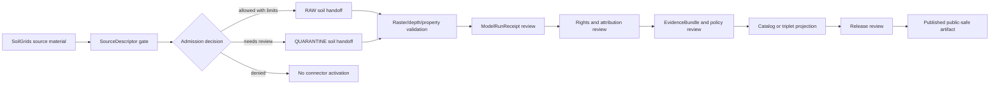

<!-- [KFM_META_BLOCK_V2]
doc_id: kfm://doc/connectors-isric-soilgrids-readme
title: connectors/isric/soilgrids/ — ISRIC SoilGrids Connector Lane
type: readme
version: v0.1
status: draft
owners: OWNER_TBD — Connector steward · Source steward · Soil steward · Modeling/receipt steward · Rights reviewer · Validation steward · Docs steward
created: 2026-06-19
updated: 2026-06-19
policy_label: public-doctrine; modeled-source; rights-gated; no-publication
proposed_path: connectors/isric/soilgrids/README.md
truth_posture: CONFIRMED path exists / PROPOSED product-lane contract / CANONICALITY NEEDS VERIFICATION
related:
  - ../../README.md
  - ../README.md
  - ../../../docs/sources/catalog/isric/README.md
  - ../../../docs/sources/catalog/isric/isric-soilgrids.md
  - ../../../docs/domains/soil/README.md
  - ../../../docs/sources/SOURCE_DESCRIPTOR_STANDARD.md
  - ../../../data/registry/sources/
  - ../../../data/raw/soil/
  - ../../../data/quarantine/soil/
  - ../../../fixtures/
  - ../../../schemas/contracts/v1/source/
  - ../../../schemas/contracts/v1/receipts/
  - ../../../policy/sensitivity/
  - ../../../policy/rights/
  - ../../../release/
tags: [kfm, connectors, isric, soilgrids, soil, modeled-source, raster, depth-bands, uncertainty, model-run-receipt, source-admission, raw, quarantine, governance]
notes:
  - "This README fills a previously blank product-lane README for ISRIC SoilGrids source admission."
  - "The ISRIC source-family docs mark ISRIC as PROPOSED beyond Directory Rules §7.3; canonical promotion requires ADR resolution."
  - "The SoilGrids product page treats SoilGrids as ML-predicted/modelled soil-property grids at 250 m with uncertainty, not observed soil truth."
  - "Connector output may enter RAW or QUARANTINE handoff only; downstream validation, ModelRunReceipt closure, EvidenceBundle closure, catalog/triplet projection, release review, publication, correction, and rollback remain outside this folder."
  - "Implementation files, source activation, SourceDescriptor records, fixtures, tests, CI wiring, endpoint use, model-version handling, depth/property identity, and public-release classes remain NEEDS VERIFICATION."
[/KFM_META_BLOCK_V2] -->

<a id="top"></a>

# ISRIC SoilGrids Connector Lane

> Product-specific source-admission lane for ISRIC SoilGrids. It is **not** observed soil truth, field-scale authority, NRCS replacement, release path, or publication surface.

<p>
  
  
  
  
  
</p>

> [!IMPORTANT]
> **Status:** `experimental` product-lane README · **Owner:** `OWNER_TBD`  
> **Path:** `connectors/isric/soilgrids/README.md`  
> **Truth posture:** `CONFIRMED` file exists · `PROPOSED` product-lane contract · `NEEDS VERIFICATION` canonical implementation home  
> **Boundary:** modeled source admission only; no public claims, no direct publication, no replacement for NRCS/Kansas soil baselines.

**Quick jumps:** [Scope](#scope) · [Repo fit](#repo-fit) · [Accepted inputs](#accepted-inputs) · [Exclusions](#exclusions) · [Evidence ledger](#evidence-ledger) · [Lifecycle diagram](#lifecycle-diagram) · [Admission posture](#admission-posture) · [Anti-collapse rules](#anti-collapse-rules) · [Validation](#validation) · [Rollback](#rollback) · [Verification backlog](#verification-backlog)

---

## Scope

`connectors/isric/soilgrids/` is a proposed product-specific connector lane for ISRIC SoilGrids source admission.

It may document SoilGrids-specific parsing expectations, source-admission envelopes, fixture rules, quarantine conditions, raster/depth-band identity, model-version and uncertainty metadata, rights attribution, and validation requirements.

It must not become observed soil truth, field-scale truth, regulatory truth, NRCS replacement, source descriptor authority, schema authority, policy authority, catalog/triplet authority, proof authority, release authority, pipeline authority, or publication authority.

[Back to top ↑](#top)

---

## Repo fit

| Surface | Role | Status |
|---|---|---:|
| `connectors/isric/soilgrids/` | SoilGrids product admission sublane. | **CONFIRMED path / NEEDS VERIFICATION implementation depth** |
| `connectors/isric/` | Parent ISRIC connector family lane. | **PROPOSED / NEEDS VERIFICATION** |
| `docs/sources/catalog/isric/README.md` | Human-facing ISRIC source-family profile. | **CONFIRMED** |
| `docs/sources/catalog/isric/isric-soilgrids.md` | Human-facing SoilGrids product page. | **CONFIRMED** |
| `docs/domains/soil/` | Soil-domain consumer surface. | **CONFIRMED via source page** |
| `data/registry/sources/` | Candidate SourceDescriptor registry home. | **PROPOSED / NEEDS VERIFICATION** |
| `data/raw/soil/` | Candidate RAW handoff target. | **PROPOSED / NEEDS VERIFICATION** |
| `data/quarantine/soil/` | Quarantine target for unresolved model, rights, geometry, depth, uncertainty, or source-role questions. | **PROPOSED / NEEDS VERIFICATION** |
| `release/` | Release and publication controls. | **Out of scope for this connector lane** |

> [!WARNING]
> The ISRIC source-family README states that `isric/` is not one of the canonical connector families enumerated by Directory Rules §7.3 and that promotion to canonical status requires an ADR. Treat this product lane as **PROPOSED** until that decision is resolved.

[Back to top ↑](#top)

---

## Accepted inputs

Accepted SoilGrids-lane content:

- product-lane README and navigation notes;
- SoilGrids-shaped fixture rules;
- parser expectations for product, property, depth band, model version, raster identity, geometry/projection, resolution, uncertainty surfaces, license, attribution, retrieval timestamp, and source URI;
- SourceDescriptor-gate notes;
- ModelRunReceipt requirements;
- validation notes for modeled-source discipline;
- quarantine criteria for unresolved rights, source role, model identity, depth/property identity, uncertainty, geometry/projection, resampling, or source-shape issues.

---

## Exclusions

This folder must not contain or imply authority over:

- public release decisions;
- published soil-property claims;
- parcel/field-scale agronomic decisions;
- regulatory or authoritative U.S./Kansas soil baselines;
- direct writes to `PROCESSED`, `CATALOG`, `TRIPLET`, `PUBLISHED`, proof, receipt, or release stores;
- SourceDescriptor authority records;
- policy or schema authority;
- generated summaries presented as observed soil truth;
- source activation without rights, model-version, source-role, resolution, uncertainty, and review checks.

Redirect those responsibilities to the appropriate source registry, policy, schema, validation, release, or domain documentation surface.

[Back to top ↑](#top)

---

## Evidence ledger

| Source | Status | Supports | Limits |
|---|---:|---|---|
| `connectors/isric/soilgrids/README.md` | **CONFIRMED** | Target file exists and was blank before this update. | Does not prove code, fixtures, tests, or CI. |
| `docs/sources/catalog/isric/README.md` | **CONFIRMED** | ISRIC is a proposed source family beyond Directory Rules §7.3; SoilGrids is modeled, international-comparability soil context, not authoritative U.S./Kansas baseline. | Does not prove connector activation or canonicality. |
| `docs/sources/catalog/isric/isric-soilgrids.md` | **CONFIRMED** | SoilGrids is modeled, 250 m, CC-BY-4.0 family-level, uncertainty-bearing, and requires modeled-source/ModelRunReceipt discipline. | Does not prove parser implementation or current endpoint details. |
| SoilGrids product-lane child files | **NEEDS VERIFICATION** | This README provides proposed boundaries. | Parser files, fixtures, tests, and workflows remain unverified. |

---

## Lifecycle diagram



[Back to top ↑](#top)

---

## Admission posture

Expected behavior for SoilGrids connector-lane work:

- no live source access unless explicitly enabled and reviewed;
- no source fetch without a SourceDescriptor and activation decision;
- no implicit publication from retrieved source material;
- no relabeling of modeled raster fields as observed soil measurements;
- no silent resampling, depth-band collapse, property-name collapse, uncertainty removal, or model-version overwrite;
- no conversion of SoilGrids fields into parcel/field-scale truth without downstream validation and caveats;
- no loss of product, property, depth band, model version, source URI, license, attribution, retrieval time, raster identity, projection, resolution, uncertainty, source role, receipt, review, or release-class metadata;
- unclear rights, source role, model identity, property identity, depth identity, uncertainty, projection, resolution, or schema drift routes to quarantine or abstention.

---

## Anti-collapse rules

The ISRIC and SoilGrids source docs identify the controlling anti-collapse stack:

1. SoilGrids is modeled, not observed.
2. SoilGrids is international comparability context, not the authoritative U.S./Kansas soil baseline.
3. A modeled SoilGrids value is not a site measurement, field measurement, or parcel-level decision fact.
4. Property, depth band, model version, resolution, and uncertainty are identity-bearing and must not be silently flattened.
5. Cross-source soil products must preserve source resolution and resampling/aggregation method.
6. Derived summaries, maps, tiles, model joins, and AI explanations are downstream carriers, not sovereign truth.

---

## Validation

SoilGrids-lane validation should check that:

- source metadata is preserved;
- SourceDescriptor references are required for activation;
- ModelRunReceipt reference is present for modeled-source admission;
- product, property, depth band, model version, source URI, license, attribution, retrieval time, raster identity, projection, resolution, uncertainty, source role, review, and vintage fields are explicit where available;
- malformed or incomplete product records fail closed;
- records with unclear model identity, missing uncertainty posture, unresolved rights, unresolved source role, or unresolved projection/resolution route to quarantine;
- SoilGrids records remain source-admission candidates until downstream validation;
- no connector run writes directly to processed, catalog, triplet, published, proof, receipt, or release stores;
- fixture data is synthetic, minimized, redacted, generalized, or approved for committed use.

Root-level validation, policy-as-code, ModelRunReceipt closure, EvidenceBundle closure, release review, public caveats, and rollback remain outside this product lane.

[Back to top ↑](#top)

---

## Definition of done

This SoilGrids-lane README is ready for first review when:

- [ ] ISRIC family README and SoilGrids product page are linked and current enough for review.
- [ ] Canonicality of `connectors/isric/soilgrids/` is confirmed or tracked by ADR/open question.
- [ ] SourceDescriptor home and SoilGrids source ID are verified.
- [ ] Endpoint, access method, model version, and source terms are verified by source steward review.
- [ ] Live source access is disabled by default for connector code.
- [ ] ModelRunReceipt, property/depth identity, resolution, projection, uncertainty, and anti-collapse checks are represented in tests.
- [ ] Connector output is limited to RAW or QUARANTINE handoff.
- [ ] No public soil-property claims are created by connector code.

---

## Rollback

Rollback is required if this README is used to justify canonical-family promotion, direct publication, source activation, model-as-observation relabeling, field-scale truth claims, silent resampling, or bypass of `SourceDescriptor`, ModelRunReceipt, rights, policy, validation, review, release, or rollback gates.

Rollback target:

```text
commit prior to this update: SHA_TBD_AFTER_GIT_HISTORY_CHECK
```

Because the file was blank before this update, a safe rollback is to restore the blank placeholder or replace this document with a shorter compatibility-only README until SoilGrids lane placement and implementation are verified.

---

## Verification backlog

| Item | Status | Needed evidence |
|---|---:|---|
| Confirm actual SoilGrids-lane files below this path. | **NEEDS VERIFICATION** | Repo tree or mounted workspace. |
| Confirm canonicality of `connectors/isric/soilgrids/`. | **NEEDS VERIFICATION** | Directory Rules, ADR, migration note, or repo convention. |
| Confirm ISRIC family canonicality decision. | **NEEDS VERIFICATION** | ADR or OPEN-DSC-14 resolution. |
| Confirm SoilGrids SourceDescriptor home and source ID. | **NEEDS VERIFICATION** | Source registry entry and accepted schema. |
| Confirm endpoint/access method and current source terms. | **NEEDS VERIFICATION** | Source steward review and current source documentation. |
| Confirm ModelRunReceipt handling. | **NEEDS VERIFICATION** | Receipt schema, connector code, fixtures, and tests. |
| Confirm property/depth/resolution/projection/uncertainty validation. | **NEEDS VERIFICATION** | Parser tests and validation report. |
| Confirm fixture strategy and CI wiring. | **NEEDS VERIFICATION** | Fixture registry, workflow files, and test logs. |

---

## Maintainer note

Keep this lane focused on modeled SoilGrids source admission. It should help parse, preserve, validate, and safely hand off source material; it must not decide truth, policy, release, or publication.

[Back to top ↑](#top)
