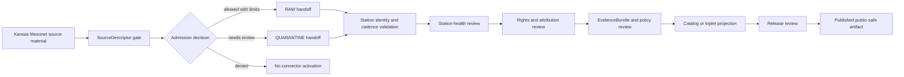

<!-- [KFM_META_BLOCK_V2]
doc_id: kfm://doc/connectors-kansas-mesonet-readme
title: connectors/kansas-mesonet/ — Kansas Mesonet Compatibility Connector Lane
type: readme
version: v0.1
status: draft
owners: OWNER_TBD — Connector steward · Kansas source steward · Soil steward · Agriculture steward · Weather/atmosphere steward · Hydrology steward · Rights reviewer · Validation steward · Docs steward
created: 2026-06-19
updated: 2026-06-19
policy_label: public-doctrine; compatibility-lane; noncanonical-path; observed-source; rights-gated; no-publication
proposed_path: connectors/kansas-mesonet/README.md
truth_posture: CONFIRMED path exists / NONCANONICAL compatibility README / CANONICAL HOME NEEDS VERIFICATION
related:
  - ../README.md
  - ../kansas/README.md
  - ../kansas/kansas-mesonet/README.md
  - ../../docs/sources/catalog/kansas/kansas-mesonet.md
  - ../../docs/sources/catalog/kansas/README.md
  - ../../docs/domains/soil/README.md
  - ../../docs/domains/agriculture/README.md
  - ../../docs/domains/weather-atmospheric/README.md
  - ../../docs/domains/hydrology/README.md
  - ../../docs/sources/SOURCE_DESCRIPTOR_STANDARD.md
  - ../../data/registry/sources/
  - ../../data/raw/soil/
  - ../../data/quarantine/soil/
  - ../../data/raw/weather-atmospheric/
  - ../../data/quarantine/weather-atmospheric/
  - ../../fixtures/
  - ../../schemas/contracts/v1/source/
  - ../../schemas/contracts/v1/sensors/
  - ../../policy/sensitivity/
  - ../../policy/rights/
  - ../../release/
tags: [kfm, connectors, kansas-mesonet, kansas, mesonet, soil, weather, agriculture, hydrology, observed-source, station-health, compatibility, raw, quarantine, governance]
notes:
  - "This README fills a previously blank top-level Kansas Mesonet connector README."
  - "The Kansas Mesonet source page explicitly corrects the earlier top-level connector path: `kansas-mesonet/` is not a Directory Rules §7.3 canonical connector family and should belong under the canonical `connectors/kansas/` lane."
  - "This file is therefore a compatibility/redirect-style governance README, not a new authority home."
  - "Kansas Mesonet is in-situ observed point-station data with native temporal cadence preserved and station-health metadata required before downstream analytics."
  - "Operator consent and current source terms remain rights gates; unknown rights default to denial/hold before activation."
  - "Connector output may enter RAW or QUARANTINE handoff only; downstream validation, EvidenceBundle closure, catalog/triplet projection, release review, publication, correction, and rollback remain outside this folder."
[/KFM_META_BLOCK_V2] -->

<a id="top"></a>

# Kansas Mesonet Compatibility Connector Lane

> Compatibility README for the existing top-level `connectors/kansas-mesonet/` path. This path is **not** the canonical connector family home; Kansas Mesonet belongs under the canonical `connectors/kansas/` source-family lane unless an ADR says otherwise.

<p>
  
  
  
  
  
</p>

> [!IMPORTANT]
> **Status:** compatibility / noncanonical-path README · **Owner:** `OWNER_TBD`  
> **Path:** `connectors/kansas-mesonet/README.md`  
> **Truth posture:** `CONFIRMED` file exists · `NONCANONICAL` per source-page path correction · `NEEDS VERIFICATION` canonical implementation home  
> **Boundary:** source-admission compatibility only; no public current-conditions service, no advisory surface, no direct publication, no canonical-family claim.

**Quick jumps:** [Scope](#scope) · [Repo fit](#repo-fit) · [Accepted inputs](#accepted-inputs) · [Exclusions](#exclusions) · [Evidence ledger](#evidence-ledger) · [Lifecycle diagram](#lifecycle-diagram) · [Admission posture](#admission-posture) · [Anti-collapse rules](#anti-collapse-rules) · [Validation](#validation) · [Rollback](#rollback) · [Verification backlog](#verification-backlog)

---

## Scope

`connectors/kansas-mesonet/` is retained here only as a compatibility lane because the path already exists.

The Kansas Mesonet source page states that the earlier top-level connector-family reference was incorrect and that the Mesonet adapter belongs under the confirmed `connectors/kansas/` family lane as `connectors/kansas/kansas-mesonet/`.

This file may document the compatibility boundary, migration intent, and source-admission rules. It must not become the canonical connector home unless an ADR or migration decision explicitly authorizes that exception.

[Back to top ↑](#top)

---

## Repo fit

| Surface | Role | Status |
|---|---|---:|
| `connectors/kansas-mesonet/` | Existing top-level compatibility path. | **CONFIRMED path / NONCANONICAL** |
| `connectors/kansas/` | Canonical Kansas connector family lane. | **CONFIRMED by source-page path correction** |
| `connectors/kansas/kansas-mesonet/` | Intended Mesonet adapter home according to source-page correction. | **PROPOSED / NEEDS VERIFICATION** |
| `docs/sources/catalog/kansas/kansas-mesonet.md` | Human-facing Kansas Mesonet product page. | **CONFIRMED** |
| `docs/domains/soil/`, `docs/domains/agriculture/`, `docs/domains/weather-atmospheric/`, `docs/domains/hydrology/` | Downstream domain consumers. | **CONFIRMED via source page** |
| `data/registry/sources/` | Candidate SourceDescriptor registry home. | **PROPOSED / NEEDS VERIFICATION** |
| `data/raw/soil/` and weather/atmosphere raw lanes | Candidate RAW handoff targets. | **PROPOSED / NEEDS VERIFICATION** |
| `data/quarantine/soil/` and weather/atmosphere quarantine lanes | Candidate quarantine handoff targets. | **PROPOSED / NEEDS VERIFICATION** |
| `release/` | Release and publication controls. | **Out of scope for this compatibility lane** |

[Back to top ↑](#top)

---

## Accepted inputs

Accepted content for this noncanonical compatibility path:

- README-level migration and compatibility notes;
- links to the canonical Kansas source-family lane;
- notes that prevent this top-level path from becoming a parallel authority;
- temporary fixture or test notes only if they are explicitly migration-bound;
- quarantine criteria for unresolved rights, station identity, station health, cadence, variable/depth identity, or source-shape issues.

New implementation code should prefer the canonical Kansas family lane unless an ADR says otherwise.

---

## Exclusions

This folder must not contain or imply authority over:

- canonical connector-family status;
- public current-conditions or advisory services;
- published station observations or derived analytics;
- direct writes to `PROCESSED`, `CATALOG`, `TRIPLET`, `PUBLISHED`, proof, receipt, or release stores;
- SourceDescriptor authority records;
- policy or schema authority;
- generated summaries presented as authoritative station truth;
- source activation without operator consent, source terms, station-health, cadence, variable/depth identity, and review checks.

Redirect implementation and source-family authority to the canonical `connectors/kansas/` lane once verified.

[Back to top ↑](#top)

---

## Evidence ledger

| Source | Status | Supports | Limits |
|---|---:|---|---|
| `connectors/kansas-mesonet/README.md` | **CONFIRMED** | Target file exists and was blank before this update. | Does not prove implementation files, tests, or CI. |
| `docs/sources/catalog/kansas/kansas-mesonet.md` | **CONFIRMED** | Kansas Mesonet is in-situ observed point-station data; native cadence is preserved; station-health metadata must precede downstream analytics; operator consent is a rights gate. | Does not prove connector activation or current source terms. |
| Kansas Mesonet source-page path correction | **CONFIRMED** | Top-level `connectors/kansas-mesonet/` is not a canonical family; intended adapter home is under `connectors/kansas/kansas-mesonet/`. | Does not prove canonical implementation files exist. |
| `connectors/kansas/` implementation status | **NEEDS VERIFICATION** | Source page identifies it as canonical family lane. | Actual Mesonet adapter files under that lane remain unverified in this update. |

---

## Lifecycle diagram



[Back to top ↑](#top)

---

## Admission posture

Expected behavior for Kansas Mesonet source-admission work:

- no live source access unless explicitly enabled and reviewed;
- no source fetch without a SourceDescriptor and activation decision;
- no activation until operator consent/current source terms are resolved;
- no implicit publication from retrieved source material;
- no relabeling of station observations as gridded/model output;
- no silent merging with SMAP, SoilGrids, SSURGO, gNATSGO, or other soil/weather products;
- no loss of station ID, station location, variable, sensor depth, cadence, timestamp, source URI, license/rights, station-health, source role, review, or release-class metadata;
- unclear rights, source role, station identity, station health, cadence, variable/depth identity, freshness, or schema drift routes to quarantine or abstention.

---

## Anti-collapse rules

The Kansas Mesonet source page identifies the controlling anti-collapse stack:

1. Kansas Mesonet is observed in-situ point-station data, not modeled raster data.
2. Kansas Mesonet is not the same as SMAP, SoilGrids, SSURGO, or gNATSGO; source roles and resolutions must stay separate.
3. Native cadence must be preserved; 5-minute, hourly, and daily values must not be silently collapsed.
4. Station-health metadata is a precondition before downstream analytics use the feed.
5. Operator consent/current source terms are activation gates, not courtesy notes.
6. Derived summaries, maps, tiles, joins, and AI explanations are downstream carriers, not sovereign truth.

---

## Validation

Compatibility-lane validation should check that:

- the path is not treated as canonical without ADR/migration evidence;
- source metadata is preserved;
- SourceDescriptor references are required for activation;
- operator consent/source-terms state is explicit before activation;
- station ID, station location, variable, depth, cadence, timestamp, source URI, rights, station-health, source role, review, and vintage fields are explicit where available;
- malformed or incomplete records fail closed;
- records with unclear rights, unresolved source role, unresolved station identity, missing station-health, or unresolved cadence/variable/depth identity route to quarantine;
- connector output is limited to RAW or QUARANTINE handoff;
- no connector run writes directly to processed, catalog, triplet, published, proof, receipt, or release stores.

Root-level validation, policy-as-code, EvidenceBundle closure, release review, public caveats, and rollback remain outside this compatibility lane.

[Back to top ↑](#top)

---

## Definition of done

This compatibility README is ready for first review when:

- [ ] Kansas Mesonet source page is linked and current enough for review.
- [ ] A migration or ADR decision resolves whether to remove this top-level path, keep it as a redirect, or move content under `connectors/kansas/kansas-mesonet/`.
- [ ] Canonical Mesonet implementation home is verified.
- [ ] SourceDescriptor home and Kansas Mesonet source ID are verified.
- [ ] Operator consent/current source terms are verified by source steward review.
- [ ] Live source access is disabled by default for connector code.
- [ ] Station identity, station-health, variable/depth identity, cadence, freshness, and anti-collapse checks are represented in tests.
- [ ] Connector output is limited to RAW or QUARANTINE handoff.
- [ ] No public current-conditions, advisory, or analytics claims are created by connector code.

---

## Rollback

Rollback is required if this README is used to justify canonical-family status, direct publication, source activation, current-conditions/advisory claims, station-observation-to-grid collapse, silent cadence collapse, or bypass of `SourceDescriptor`, operator consent, station-health, validation, review, release, or rollback gates.

Rollback target:

```text
commit prior to this update: SHA_TBD_AFTER_GIT_HISTORY_CHECK
```

Because the file was blank before this update, a safe rollback is to restore the blank placeholder or replace this document with a shorter redirect-only README until canonical placement is resolved.

---

## Verification backlog

| Item | Status | Needed evidence |
|---|---:|---|
| Confirm canonical Mesonet connector path. | **NEEDS VERIFICATION** | Directory Rules, ADR, migration note, or repo tree. |
| Confirm whether this top-level path should remain. | **NEEDS VERIFICATION** | ADR or migration decision. |
| Confirm SourceDescriptor home and Kansas Mesonet source ID. | **NEEDS VERIFICATION** | Source registry entry and accepted schema. |
| Confirm operator consent/current terms. | **NEEDS VERIFICATION** | Rights review and SourceDescriptor rights block. |
| Confirm station-health contract and tests. | **NEEDS VERIFICATION** | Sensor schema, connector tests, and station-health fixtures. |
| Confirm cadence/freshness handling. | **NEEDS VERIFICATION** | Parser tests and validation report. |
| Confirm fixture strategy and CI wiring. | **NEEDS VERIFICATION** | Fixture registry, workflow files, and test logs. |

---

## Maintainer note

Do not build new authority here. This existing path should either stay a clear compatibility pointer or be removed after migration. Implementation should converge under the canonical Kansas source-family lane unless an ADR says otherwise.

[Back to top ↑](#top)
