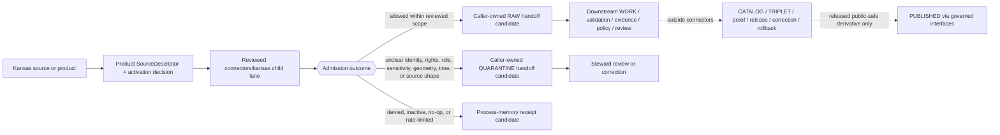

<!-- [KFM_META_BLOCK_V2]
doc_id: kfm://doc/connectors-kansas-readme
title: connectors/kansas/ — Kansas Source-Family Admission and Coordination Lane
type: readme
version: v0.2
status: draft
owners: OWNER_TBD — Connector steward · Kansas source steward · Domain stewards · Rights reviewer · Sensitivity reviewer · Validation steward · Docs steward
created: 2026-06-19
updated: 2026-07-12
policy_label: public-doctrine; kansas-family; mixed-child-topology; source-admission; rights-gated; sensitivity-gated; no-publication
current_path: connectors/kansas/README.md
truth_posture: CONFIRMED current path and directly inspected child README surfaces / CONFLICTED child-slug, compatibility-path, SourceDescriptor, and registry authority / PROPOSED family contract / UNKNOWN complete implementation, activation, and runtime depth
evidence_snapshot:
  repository: bartytime4life/Kansas-Frontier-Matrix
  base_ref: main
  base_commit: 786a30e9868b6fdf65416cd844c2b852999d2681
  prior_blob: b5d8f829019c79c4fef5666139cdc8d3177123b6
related:
  - ../README.md
  - mesonet/README.md
  - kbs_herbarium/README.md
  - kdwp/README.md
  - kdwp_ert/README.md
  - kdwp_flora/README.md
  - ../kansas_mesonet/README.md
  - ../ks-mesonet/README.md
  - ../kbs/README.md
  - ../ku_herbarium/README.md
  - ../kdwp/README.md
  - ../kdwp_ert/README.md
  - ../../CONTRIBUTING.md
  - ../../.github/CODEOWNERS
  - ../../docs/doctrine/directory-rules.md
  - ../../docs/sources/catalog/kansas/README.md
  - ../../docs/sources/catalog/kansas/kansas-mesonet.md
  - ../../docs/sources/catalog/kansas/kbs.md
  - ../../docs/sources/catalog/kansas/ku-herbarium.md
  - ../../docs/sources/catalog/kansas/kdwp.md
  - ../../docs/sources/catalog/kansas/ksgs.md
  - ../../docs/sources/SOURCE_DESCRIPTOR_STANDARD.md
  - ../../contracts/source/source_descriptor.md
  - ../../schemas/contracts/v1/source/source_descriptor.schema.json
  - ../../schemas/contracts/v1/sources/source_descriptor.schema.json
  - ../../data/registry/sources/README.md
  - ../../control_plane/source_authority_register.yaml
  - ../../policy/rights/
  - ../../policy/sensitivity/
  - ../../release/
tags: [kfm, connectors, kansas, source-family, source-admission, mesonet, kbs, kanu, kdwp, rights, sensitivity, raw, quarantine, governance]
notes:
  - "This revision removes stale historical language that described the current README as a blank-file replacement and replaces its rollback placeholder with the exact current base commit and prior blob."
  - "Directly indexed child README surfaces at the pinned base are `mesonet/`, `kbs_herbarium/`, `kdwp/`, `kdwp_ert/`, and `kdwp_flora/`. This is a bounded README inventory, not proof of a complete recursive implementation tree."
  - "Source-catalog and compatibility documents propose other child names, including `kgs/`, `kansas-mesonet/`, `kbs/`, and `ku-herbarium/`; direct probes of those README paths returned Not Found at the pinned base."
  - "The family lane is confirmed, but exact child-slug and sibling-versus-child decisions remain conflicted. This document records the live documentation topology without moving, deleting, recreating, or ratifying a path."
  - "SourceDescriptor authority is conflicted: the populated singular-path schema calls the plural path canonical while the plural path is an empty PROPOSED scaffold; the machine source-authority register is empty."
  - "Only this Markdown file is in scope. No connector code, descriptor, fixture, schema, policy, registry record, source activation, workflow, receipt, release object, path move, or public artifact is created."
[/KFM_META_BLOCK_V2] -->

<a id="top"></a>

# Kansas Source-Family Admission and Coordination Lane

> [!IMPORTANT]
> **Document lifecycle:** `draft`  
> **Component maturity:** family documentation contract; child implementation and runtime maturity are mixed or `UNKNOWN`  
> **Owner:** `OWNER_TBD`  
> **Truth posture:** `CONFIRMED` current parent path and directly inspected child README surfaces · `CONFLICTED` child slugs, compatibility topology, `SourceDescriptor` authority, and registry placement · `PROPOSED` family contract  
> **Boundary:** coordination of source-specific admission for Kansas state, university, and Kansas-focused institutional products. This folder does not activate a source, establish source or domain truth, decide rights or sensitivity, perform downstream promotion, serve public clients, or authorize release.

**Quick links:** [Purpose](#purpose) · [Authority level](#authority-level) · [Status](#status) · [What belongs here](#what-belongs-here) · [What does not belong here](#what-does-not-belong-here) · [Inputs](#inputs) · [Outputs](#outputs) · [Validation](#validation) · [Review burden](#review-burden) · [Related folders](#related-folders) · [ADRs](#adrs) · [Last reviewed](#last-reviewed) · [Evidence basis](#evidence-basis) · [Verified child inventory](#verified-child-readme-inventory) · [Path conflicts](#compatibility-and-path-conflict-register) · [Meaning boundaries](#family-wide-source-and-meaning-boundaries) · [Lifecycle](#lifecycle-boundary) · [Admission posture](#admission-posture) · [Sublane rules](#sublane-rules) · [Definition of done](#definition-of-done) · [Rollback](#rollback) · [Verification backlog](#verification-backlog)

---

<a id="scope"></a>

## Purpose

`connectors/kansas/` is the current Kansas source-family coordination lane inside the `connectors/` responsibility root.

It exists to keep Kansas-specific source access and admission work source-aware, product-specific, policy-aware, reviewable, and reversible. A child lane may retrieve, probe, parse, fingerprint, or preserve an explicitly admitted source product and prepare a caller-owned `RAW`, `QUARANTINE`, or process-memory receipt candidate.

This parent does not make every Kansas source one dataset, one source role, one legal authority, one domain, or one public product. It coordinates shared admission rules while requiring each child product to preserve its own identity, authority, access method, rights, sensitivity, time, geometry, uncertainty, limitations, correction state, and downstream domain ownership.

[Back to top](#top)

---

<a id="repo-fit"></a>

## Authority level

**Implementation-bearing source-family coordination lane with confirmed parent placement and unresolved child topology.**

| Concern | Status | Evidence-bounded determination |
|---|---:|---|
| Responsibility root | **CONFIRMED** | `connectors/` owns source-specific fetch, probe, preservation, and admission support. It does not own source doctrine, policy, schemas, proof closure, release, or public behavior. |
| Kansas family parent | **CONFIRMED** | `connectors/kansas/README.md` exists at the pinned base and is the current parent documentation surface for Kansas-focused source lanes. |
| Directly inspected child README set | **CONFIRMED / BOUNDED** | Indexed search and direct reads verify `mesonet/`, `kbs_herbarium/`, `kdwp/`, `kdwp_ert/`, and `kdwp_flora/`. This does not prove a complete recursive child or code inventory. |
| Exact child naming convention | **CONFLICTED / NEEDS VERIFICATION** | Current paths, source-catalog proposals, and top-level compatibility lanes disagree on several child slugs and on sibling-versus-child placement. |
| Parent-local package and test roots | **CONFIRMED exact paths absent** | Direct probes found no `connectors/kansas/pyproject.toml`, `connectors/kansas/src/README.md`, or `connectors/kansas/tests/README.md`. Differently named or child-local implementation may still exist. |
| Path-scoped agent instructions | **CONFIRMED exact paths absent** | Direct probes found no root, `connectors/`, or `connectors/kansas/` `AGENTS.md` at the pinned base. |
| Source identity and activation | **OUTSIDE THIS FOLDER** | Product-level descriptors, source authority, and activation state belong in governed registry and control-plane surfaces. |
| Rights and sensitivity | **OUTSIDE THIS FOLDER** | Binding decisions belong in `policy/rights/`, `policy/sensitivity/`, review records, and product-specific governance. |
| Promotion and publication | **NONE** | The parent and its children do not own `WORK`, `PROCESSED`, `CATALOG`, `TRIPLET`, `PUBLISHED`, proof closure, release, correction, withdrawal, or rollback decisions. |
| Runtime and deployment | **UNKNOWN** | No complete import graph, connector run, source interaction, emitted receipt, deployment, or public-client coupling was verified for this family. |

Directory Rules basis: the owning responsibility is external-source admission, so the parent belongs under `connectors/`. Kansas is a source-family segment inside that root, not a new repository root. Existing child and compatibility paths are recorded as evidence; their presence does not settle canonicality.

[Back to top](#top)

---

## Status

| Item | Status | Meaning |
|---|---:|---|
| This README | **DRAFT** | Reviewable family contract; not a source activation or KFM publication event. |
| Parent path | **CONFIRMED** | The requested file exists at the pinned repository snapshot. |
| Child README inventory | **CONFIRMED / BOUNDED** | Five child README lanes were directly indexed and read; complete recursive implementation inventory remains unverified. |
| Live network access | **DISABLED BY DEFAULT** | No child may contact a source merely because a directory or README exists. |
| Product-level `SourceDescriptor`s | **NOT VERIFIED** | No complete accepted descriptor and activation set was established for the family by this review. |
| `SourceDescriptor` schema authority | **CONFLICTED** | The populated singular-path schema declares the plural path canonical and itself legacy; the plural-path schema is an empty scaffold. |
| Machine source-authority entries | **NONE VERIFIED** | The inspected `control_plane/source_authority_register.yaml` contains `entries: []`. |
| Child placement and compatibility disposition | **CONFLICTED** | Several repository-present, absent, deleted, or proposed aliases require explicit migration or ADR decisions. |
| Rights, terms, and redistribution | **PRODUCT-SPECIFIC / NEEDS VERIFICATION** | Rights cannot be inherited from the Kansas family name or inferred from public visibility. |
| Sensitivity and public precision | **FAIL CLOSED** | Rare species, rare plants, private projects, source-obscured records, private land, cultural knowledge, infrastructure, and other sensitive material require product-specific controls. |
| Owner assignment | **UNKNOWN** | The inspected CODEOWNERS file provides only the repository-wide fallback for this path. |
| Public service or release authority | **NONE** | This README creates no public current-conditions feed, regulatory service, ecological review, occurrence layer, map release, API, or UI product. |

[Back to top](#top)

---

<a id="accepted-inputs"></a>

## What belongs here

Subject to an accepted child placement and product-level governance, this family may contain:

- family navigation, child indexes, migration notes, and compatibility pointers;
- product-specific source clients that remain inactive without an accepted descriptor and activation decision;
- parsers for verified source-native formats;
- source-head probes using supported versions, checksums, `ETag`, `Last-Modified`, release identifiers, or documented manual snapshots;
- preservation of source-native publisher, program, product, endpoint, package, record, and version identity;
- provenance and integrity helpers that preserve retrieval time, upstream identifiers, source role, rights, sensitivity, and limitations;
- safe no-network fixture guidance and pointers to canonical fixture/test homes;
- connector-local reason-code and handoff notes that do not redefine shared contracts;
- caller-owned `RAW`, `QUARANTINE`, or process-memory receipt-candidate handoff support;
- deprecation or redirect documentation for compatibility paths after a governed path decision.

Family placement does not replace product identity. A Kansas agency, university, archive, sensor network, herbarium, review tool, regulatory list, or research program still requires a product-specific admission record.

[Back to top](#top)

---

<a id="exclusions"></a>

## What does NOT belong here

This parent or any child must not contain or imply authority over:

- human-facing source-catalog doctrine as a substitute for `docs/sources/catalog/`;
- authoritative `SourceDescriptor` instances or activation decisions as a substitute for the governed registry/control plane;
- semantic contract or JSON Schema authority;
- rights, consent, sensitivity, geoprivacy, redaction, access-control, or release policy;
- authoritative taxonomy, legal status, regulatory interpretation, ecological clearance, station-health truth, or domain-object truth;
- source payloads outside an explicit caller-owned `RAW` or `QUARANTINE` handoff;
- direct writes to `data/work/`, `data/processed/`, `data/catalog/`, `data/triplets/`, `data/published/`, proof stores, or release-decision stores;
- public map tiles, dashboards, current-conditions APIs, alerts, normal UI payloads, or generated answers;
- credentials, tokens, private URLs, signed URLs, private project records, or exact sensitive locations in documentation, fixtures, logs, or examples;
- silent path migration, source-role upgrade, in-place correction, alias revival, or compatibility-path promotion;
- generated summaries presented as authoritative Kansas source or domain truth.

[Back to top](#top)

---

## Inputs

A child connector may interact with source material only when the requested product and mode resolve to:

1. an accepted product-level `SourceDescriptor`;
2. an explicit activation decision or equivalent reviewed state;
3. a supported access method, credential posture, rate-limit posture, and source-head strategy;
4. current rights, attribution, redistribution, automated-ingest, and terms-of-use review;
5. source-role and claim-scope mapping that does not depend on agency name alone;
6. sensitivity, geoprivacy, private-land, cultural, infrastructure, and public-precision controls where applicable;
7. source-native identity, time, geometry, uncertainty, quality, correction, withdrawal, and supersession semantics;
8. safe no-network positive and negative fixtures;
9. a caller-supplied `RAW`, `QUARANTINE`, or receipt-candidate sink that the child cannot silently widen;
10. a reviewed retry, idempotency, no-op, stale, denial, and source-drift posture.

Documentation-only fixtures may be considered without live activation only when they are synthetic, minimized, rights-safe, sensitivity-safe, clearly labeled, and unable to expose a real protected record or credential.

[Back to top](#top)

---

## Outputs

An allowed child output is limited to an auditable caller-owned handoff:

```text
Product SourceDescriptor + activation decision
  -> connectors/kansas/<current-reviewed-child>/
     -> RAW handoff candidate
     -> QUARANTINE handoff candidate
     -> process-memory receipt candidate
```

An output should preserve or resolve:

- source, product, descriptor, and run identity;
- retrieval or import time and source-head identity;
- content digest or equivalent integrity evidence;
- source role and claim-use limits;
- rights, attribution, redistribution, consent, and access posture;
- sensitivity, geometry precision, withholding, and source-obscuration state;
- source-native identifiers, time, quality, uncertainty, and version fields;
- upstream correction, withdrawal, supersession, and stale state;
- structured outcome and reason when the interaction is denied, held, skipped, rate-limited, unchanged, malformed, or quarantined.

The exact shared DTO, sink protocol, receipt class, and reason-code vocabulary remain `NEEDS VERIFICATION`. This README does not invent a second contract.

Retrieval success is not normalization, validation closure, evidence closure, release approval, or publication.

[Back to top](#top)

---

## Validation

Family and child validation should prove, at minimum, that:

- the current path is not treated as canonical merely because it exists;
- source and product identity are explicit and stable enough for replay;
- an accepted descriptor reference and activation decision are required for live operation;
- network access is disabled by default and no-network tests cover normal behavior;
- rights, consent, automated-ingest, attribution, redistribution, and sensitivity failures close safely;
- source role is preserved and never upgraded by parsing, aggregation, modeling, promotion, UI display, or generated explanation;
- source-native identifiers, time, geometry, CRS/datum, uncertainty, quality, cadence, version, and source-head evidence are preserved where applicable;
- mixed products are split or quarantined when one role or policy posture cannot safely represent them;
- stale, corrected, withdrawn, superseded, and no-op states are visible;
- fixtures are synthetic, minimized, redacted, generalized, or explicitly approved;
- output is limited to the caller-owned `RAW`, `QUARANTINE`, or receipt-candidate boundary;
- no child writes directly to later lifecycle, proof, release, API, or UI surfaces;
- migration tests prevent removed or compatibility aliases from silently becoming active implementation homes;
- docs, relative links, headings, metadata, and rollback targets remain coherent.

Passing generic repository checks proves only the behavior those checks execute. It does not prove source activation, endpoint health, legal sufficiency, rights clearance, sensitivity clearance, or release readiness.

[Back to top](#top)

---

## Review burden

Review roles depend on the child product, but the family baseline is:

- connector steward;
- Kansas source steward;
- the receiving domain steward or stewards;
- rights reviewer;
- sensitivity or geoprivacy reviewer where location or joined data can cause harm;
- cultural or sovereignty reviewer where culturally sensitive knowledge or tribal interests may be involved;
- taxonomy or identity steward for biological, archival, or crosswalk-heavy products;
- validation or test steward;
- docs steward;
- release steward only when downstream release behavior is proposed in a separate change.

The inspected `.github/CODEOWNERS` file supplies a repository-wide `@kfm/maintainers` fallback but no Kansas-family or connector-specific owner. Team existence, semantic ownership, reviewer availability, and separation-of-duty enforcement remain `NEEDS VERIFICATION`; this README does not invent usernames or request reviewers.

Additional review is required before:

- approving or changing a child path;
- moving or deleting a compatibility lane;
- activating a live source or automated ingest;
- accepting rights, terms, consent, redistribution, or attribution posture;
- changing machine source-role vocabulary or schema authority;
- exposing exact sensitive or source-obscured geometry;
- treating source output as legal, regulatory, advisory, current-conditions, or ecological-clearance truth;
- changing correction, withdrawal, supersession, retry, or stale-state behavior;
- publishing a derivative or connecting a public client.

[Back to top](#top)

---

## Related folders

| Surface | Relationship | Status at the pinned snapshot |
|---|---|---:|
| [`../README.md`](../README.md) | Connector-root admission boundary and child README contract. | **CONFIRMED file / current v0.3** |
| [`mesonet/README.md`](mesonet/README.md) | Repository-present Kansas Mesonet product lane. | **CONFIRMED v0.2 / final child slug CONFLICTED** |
| [`kbs_herbarium/README.md`](kbs_herbarium/README.md) | Repository-present KANU herbarium admission lane. | **CONFIRMED v0.2 / final adapter name CONFLICTED** |
| [`kdwp/README.md`](kdwp/README.md) | Repository-present KDWP source-family coordination lane. | **CONFIRMED v0.2 / product layout CONFLICTED** |
| [`kdwp_ert/README.md`](kdwp_ert/README.md) | Repository-present bounded ERT/stewardship-output lane. | **CONFIRMED v0.2 / sibling-versus-child CONFLICTED** |
| [`kdwp_flora/README.md`](kdwp_flora/README.md) | Repository-present KDWP Flora/status/range/stewardship lane. | **CONFIRMED v0.2 / placement and registry topology CONFLICTED** |
| [`../kansas_mesonet/README.md`](../kansas_mesonet/README.md) | Top-level underscore Mesonet compatibility path. | **CONFIRMED / NONCANONICAL** |
| [`../ks-mesonet/README.md`](../ks-mesonet/README.md) | Top-level short-name Mesonet compatibility path. | **CONFIRMED / NONCANONICAL** |
| `../kansas-mesonet/README.md` | Retired hyphenated Mesonet path. | **CONFIRMED exact path absent at pinned base; deletion recorded by Mesonet lane** |
| [`../kbs/README.md`](../kbs/README.md) | Top-level KBS compatibility lane. | **CONFIRMED / NONCANONICAL** |
| [`../ku_herbarium/README.md`](../ku_herbarium/README.md) | Top-level KU Herbarium compatibility lane. | **CONFIRMED / NONCANONICAL** |
| [`../kdwp/README.md`](../kdwp/README.md) | Top-level KDWP compatibility lane. | **CONFIRMED / NONCANONICAL** |
| [`../kdwp_ert/README.md`](../kdwp_ert/README.md) | Top-level ERT compatibility lane. | **CONFIRMED / NONCANONICAL** |
| `kgs/README.md` | KGS child path proposed by source documentation. | **CONFIRMED exact path absent at pinned base** |
| `kansas-mesonet/README.md` | Mesonet child slug proposed by older source documentation. | **CONFIRMED exact path absent at pinned base** |
| `kbs/README.md` | KBS child path proposed by source documentation. | **CONFIRMED exact path absent at pinned base** |
| `ku-herbarium/README.md` | KU Herbarium child path proposed by source documentation. | **CONFIRMED exact path absent at pinned base** |
| [`../../docs/sources/catalog/kansas/README.md`](../../docs/sources/catalog/kansas/README.md) | Expected Kansas family catalog orientation. | **CONFIRMED file path / content currently presents a KGS product entry, so family-index authority is CONFLICTED** |
| [`../../data/registry/sources/README.md`](../../data/registry/sources/README.md) | SourceDescriptor instance and admission-control responsibility. | **CONFIRMED file / implementation bundle and topology still PROPOSED** |
| [`../../schemas/contracts/v1/source/source_descriptor.schema.json`](../../schemas/contracts/v1/source/source_descriptor.schema.json) | Populated SourceDescriptor schema at a self-declared legacy path. | **CONFIRMED / authority CONFLICTED** |
| [`../../schemas/contracts/v1/sources/source_descriptor.schema.json`](../../schemas/contracts/v1/sources/source_descriptor.schema.json) | Nominal canonical-path schema scaffold. | **CONFIRMED / not enforceable** |
| [`../../control_plane/source_authority_register.yaml`](../../control_plane/source_authority_register.yaml) | Machine source-authority register. | **CONFIRMED file / `entries: []`** |
| [`../../policy/rights/`](../../policy/rights/) and [`../../policy/sensitivity/`](../../policy/sensitivity/) | Binding product-specific rights and sensitivity decisions. | **Outside connector ownership** |
| [`../../release/`](../../release/) | Promotion, release, correction, withdrawal, and rollback decisions. | **Outside connector ownership** |

This table is an inspected documentation map, not a complete recursive connector tree.

[Back to top](#top)

---

## ADRs

- Directory Rules govern the `connectors/` responsibility root, responsibility-first placement, the `RAW`/`QUARANTINE` output boundary, required README content, drift handling, and reversible migration.
- Repository documents repeatedly reference `ADR-0001` for schema-home authority, but the directly probed `docs/adr/ADR-0001-schema-home.md` path was not found at the pinned base.
- No accepted Kansas-child-path ADR was verified that resolves:
  - `mesonet/` versus `kansas-mesonet/`;
  - `kbs_herbarium/` versus `kbs/` or `ku-herbarium/`;
  - KDWP product siblings versus children below `kdwp/`;
  - top-level compatibility-path retirement or redirect rules;
  - a complete source-family versus product-lane naming convention;
  - one accepted `SourceDescriptor` schema path and machine role vocabulary;
  - one canonical source-registry partition for multi-domain Kansas products.
- This README update does not itself require an ADR: it changes one existing Markdown file, moves no path, creates no authority home, changes no lifecycle stage, and approves no public access path.
- Any later path migration must preserve Git history, links, descriptors, activation state, fixtures, tests, receipts, deprecation status, validation, and rollback.

[Back to top](#top)

---

## Last reviewed

| Field | Value |
|---|---|
| Review date | `2026-07-12` |
| Repository | `bartytime4life/Kansas-Frontier-Matrix` |
| Base ref | `main` |
| Pinned base commit | `786a30e9868b6fdf65416cd844c2b852999d2681` |
| Prior README blob | `b5d8f829019c79c4fef5666139cdc8d3177123b6` |
| README introduction commit | `7d340f1e1406264fe13232fecb7dc0d712b975ce` |
| Review scope | Target README and introduction history; connector-root contract; directly indexed Kansas child READMEs; selected top-level compatibility READMEs; stale/proposed child-path probes; Directory Rules; SourceDescriptor schemas and registry/control-plane surfaces; contribution guidance and CODEOWNERS; branch and open-PR search |
| Reviewer identity | `OWNER_TBD` — no semantic owner assignment made by this document |

[Back to top](#top)

---

<a id="evidence-ledger"></a>

## Evidence basis

| Evidence | What it supports | What it does not prove |
|---|---|---|
| Target blob `b5d8f829019c79c4fef5666139cdc8d3177123b6` at the pinned base | Exact editing baseline, stale child inventory, stale historical blank-file statement, and unresolved rollback placeholder. | Runtime, source activation, or family completeness. |
| Introduction commit `7d340f1e1406264fe13232fecb7dc0d712b975ce` | The v0.1 README expanded a blank placeholder; the blank state is historical lineage rather than the current rollback target. | That restoring a blank file is now the correct rollback. |
| Directory Rules and `connectors/README.md` | Responsibility-root placement, admission-only authority, allowed handoff boundary, child README contract, drift handling, and migration discipline. | Final child naming or source activation. |
| Indexed `kfm://doc/connectors-kansas...` results and direct child reads | The five child README surfaces listed in this document exist at the pinned base. | Complete recursive child code, tests, or fixtures. |
| Mesonet, KBS/KANU, and KDWP child contracts | Current product meanings, path conflicts, compatibility references, fail-closed posture, and unverified runtime state. | Accepted migration, source rights, or active connectors. |
| Direct probes of `kgs/`, `kansas-mesonet/`, `kbs/`, and `ku-herbarium/` child READMEs | Those exact proposed child README paths were absent at the pinned base. | Absence of differently named implementations. |
| Direct probes of parent-local `pyproject.toml`, `src/README.md`, and `tests/README.md` | Those exact conventional parent-local package/test paths were absent. | Absence of child-local or differently named code and tests. |
| Top-level compatibility READMEs | Repository-present compatibility lanes exist and should not become parallel source authority. | Their final migration or deletion disposition. |
| SourceDescriptor schemas and source-registry README | Schema, registry, role, and topology authority remain internally inconsistent or proposed. | A valid product descriptor or activation decision. |
| Empty machine source-authority register | No entry exists in that inspected register. | Absence from every other differently named registry or decision file. |
| Contribution guidance and CODEOWNERS | Small reversible changes, fail-closed validation, truth labels, and repository-wide owner fallback. | Connector-specific ownership or review enforcement. |

Absence claims are bounded to exact paths, indexed searches, and the pinned commit. This README does not assert that every repository file, import, workflow, artifact, or runtime path was recursively inspected.

[Back to top](#top)

---

<a id="directory-map"></a>

## Verified child README inventory

The following README-level child inventory is directly verified at the pinned base:

```text
connectors/kansas/
├── README.md
├── mesonet/
│   └── README.md
├── kbs_herbarium/
│   └── README.md
├── kdwp/
│   └── README.md
├── kdwp_ert/
│   └── README.md
└── kdwp_flora/
    └── README.md
```

| Child | Admission subject | Current documentation posture | Important unresolved boundary |
|---|---|---|---|
| `mesonet/` | Kansas Mesonet point-station observations and metadata. | **v0.2 product admission contract** | Final child slug, automated-ingest consent, duplicate registry identities, package/tests/runtime. |
| `kbs_herbarium/` | KANU specimen-backed herbarium material. | **v0.2 admission lane** | `kbs_herbarium` versus `kbs` versus `ku-herbarium`; KANU versus KBS NHI role separation. |
| `kdwp/` | KDWP source-family products across status, observations, ranges, habitat, and stewardship. | **v0.2 family admission lane** | Product inventory, machine role vocabulary, top-level compatibility package, child layout. |
| `kdwp_ert/` | Bounded ecological review or stewardship-review outputs. | **v0.2 bounded-review admission lane** | Sibling versus child placement, source-native request/result contract, rights/sensitivity and reuse limits. |
| `kdwp_flora/` | KDWP flora, listed-status, rank, range, observation, and stewardship context. | **v0.2 flora admission lane** | Sibling versus child placement, taxonomy/crosswalks, registry topology, sensitivity authority. |

README presence is not source activation, package maturity, fixture coverage, passing tests, rights clearance, sensitivity clearance, or release readiness.

[Back to top](#top)

---

## Compatibility and path conflict register

| Family or product | Repository-present current lane | Other present compatibility examples | Proposed or absent child path | Safe current posture |
|---|---|---|---|---|
| Kansas Mesonet | `connectors/kansas/mesonet/` | `connectors/kansas_mesonet/`, `connectors/ks-mesonet/`; retired `connectors/kansas-mesonet/` is absent | `connectors/kansas/kansas-mesonet/` | Keep current lane documentation-only until slug, registry identity, consent, package, and migration are accepted. Do not recreate the retired alias. |
| KBS / KANU Herbarium | `connectors/kansas/kbs_herbarium/` | `connectors/kbs/`, `connectors/ku_herbarium/` | `connectors/kansas/kbs/`, `connectors/kansas/ku-herbarium/` | Keep KANU specimens separate from KBS NHI authority material; do not rename or merge without a governed decision. |
| KDWP parent | `connectors/kansas/kdwp/` | `connectors/kdwp/` | Product children below `kdwp/` remain unresolved | Use the current Kansas parent for coordination; retain product identity and do not treat the top-level lane as canonical. |
| KDWP ERT | `connectors/kansas/kdwp_ert/` | `connectors/kdwp_ert/` | A possible child below `connectors/kansas/kdwp/` | Preserve bounded request/result meaning and fail closed; do not turn review output into reusable site or legal truth. |
| KDWP Flora | `connectors/kansas/kdwp_flora/` | No top-level `connectors/kdwp_flora/README.md` was found in the directly inspected set | A possible child below `connectors/kansas/kdwp/` | Preserve product/record classes, taxonomy uncertainty, and rare-plant controls; do not settle registry or sensitivity authority here. |
| KGS | No child README verified | Multiple KGS-related top-level or domain-oriented paths exist elsewhere in the repository, but this review did not normalize them | `connectors/kansas/kgs/` | Treat source-catalog placement language as proposed until a current child and migration decision are verified. |

A compatibility path may remain temporarily for links, deprecation, or migration, but it must not silently hold a second descriptor set, credential path, scheduler, source activation, policy decision, or release authority.

[Back to top](#top)

---

## Family-wide source and meaning boundaries

Kansas is a source-family qualifier, not a source role or claim type.

| Material class | Meaning to preserve | Must not become |
|---|---|---|
| Point-station observations | A measurement at a named station, variable/depth/height, time, quality state, and uncertainty. | Area-wide conditions, an alert, a forecast, or a model surface. |
| Specimen records | A preserved specimen record with collection, identification, event, rights, and locality context. | Current presence, abundance, legal status, or unrestricted exact rare-plant location. |
| Regulatory or listed-status material | A source-issued determination under a named jurisdiction, vocabulary, authority, and effective period. | A field observation, taxonomic backbone, or universal legal conclusion. |
| Conservation or stewardship ranks | A source-native rank with scope, vintage, authority, caveats, and disagreement handling. | Certain presence, public-location permission, or a silently harmonized global rank. |
| Range or distribution products | Spatial context at a stated scale, method, time, and uncertainty. | A point occurrence, complete distribution, or certain current occupancy. |
| Administrative or stewardship compilations | Programmatic records assembled for a bounded purpose. | Direct observation, legal clearance, or publication approval. |
| Ecological review outputs | Review evidence tied to a particular request, inputs, status, version, expiry, and limitations. | Reusable site truth, legal clearance, public occurrence layer, or KFM release decision. |
| Aggregates | Summaries over an explicit unit and period. | Per-record or per-place observation truth. |
| Models | Derived outputs tied to inputs, parameters, run identity, assumptions, and uncertainty. | Observed reality or regulatory determination. |
| Candidate or synthetic material | Unapproved or generated content with explicit reality and review boundaries. | Public claim evidence without promotion, review, and release closure. |

The exact machine source-role vocabulary remains conflicted. Until authority is resolved, child documentation should state human meaning precisely, preserve source-native fields, and mark machine mapping `NEEDS VERIFICATION` rather than guessing.

Cross-domain joins preserve source identity, role, rights, sensitivity, geometry, time, uncertainty, and ownership. They do not create a generic “Kansas truth” record.

[Back to top](#top)

---

<a id="lifecycle-diagram"></a>

## Lifecycle boundary



The family owns only coordination of source interaction and the bounded handoff. It does not own downstream promotion or public exposure.

[Back to top](#top)

---

<a id="admission-posture"></a>
<a id="anti-collapse-rules"></a>

## Admission posture

1. **Directory presence is not activation.** A README, source profile, registry placeholder, branch, commit, or pull request does not enable source interaction.
2. **Family identity is not product identity.** Every endpoint, archive, list, layer, request workflow, model, and export requires its own admitted identity.
3. **Agency identity is not source role.** Product and record meaning determine what a source may support.
4. **Source role cannot be upgraded.** Processing, cataloging, UI display, or generated language cannot turn an aggregate into an observation, a model into a measurement, or a review into clearance.
5. **Rights and sensitivity fail closed.** Public availability does not imply automated-ingest, redistribution, exact-location, or derived-publication permission.
6. **Source obscuration is preserved.** No child may reverse, sharpen, infer, or join around upstream geoprivacy or withholding.
7. **Mixed packages are split or quarantined.** One upstream archive cannot justify one all-purpose role or policy posture.
8. **Time and correction matter.** Preserve observed, effective, source, retrieval, revision, withdrawal, supersession, and stale states.
9. **No connector-side truth closure.** Retrieval and connector receipts prove process events, not source truth, evidence closure, policy approval, or release readiness.
10. **No direct public path.** Public clients use released artifacts and governed interfaces, never connector internals.
11. **No silent compatibility promotion.** Aliases remain redirects or documented migration surfaces unless an accepted decision changes their role.
12. **No downstream writes.** Children stop at caller-owned `RAW`, `QUARANTINE`, or receipt candidates.
13. **AI is interpretive only.** Generated explanations must resolve governed evidence and policy; they cannot replace them.
14. **Cite or abstain.** When product identity, authority, rights, sensitivity, or evidence cannot be resolved, narrow the claim, quarantine, deny, or abstain.

[Back to top](#top)

---

<a id="sublane-rules"></a>

## Sublane rules

When adding or revising a Kansas child lane:

1. Verify the current path, neighboring paths, source profile, Directory Rules, and accepted ADRs before proposing a destination.
2. Retain an existing requested path for a documentation-only correction when moving it is not authorized; label placement conflicts explicitly.
3. Do not create a new root-level source or product lane when a reviewed Kansas-family home exists, unless an ADR or migration plan authorizes the exception.
4. Give each materially different source product its own identity, descriptor, activation, rights, sensitivity, cadence, source-head, and claim-use limits.
5. Separate observations, regulatory determinations, administrative compilations, review outputs, ranges, aggregates, models, candidates, and synthetic content.
6. Preserve source-native identifiers, time, geometry, quality, uncertainty, rights, sensitivity, correction, withdrawal, and supersession.
7. Keep credentials and live network configuration outside documentation and committed fixtures.
8. Use no-network fixtures first; real source samples require rights and sensitivity review before repository inclusion.
9. Restrict connector output to caller-owned `RAW`, `QUARANTINE`, or receipt candidates.
10. Link canonical source, contract, schema, registry, policy, domain, test, and release surfaces without copying their authority into the connector.
11. Treat source-catalog paths as human orientation, not proof that a child connector exists or is active.
12. Require a migration note or ADR before moving, deleting, reviving, or consolidating child and compatibility paths.
13. Preserve backlinks, history, descriptors, activation state, fixtures, tests, receipts, deprecation state, and rollback during migration.
14. Record a concrete rollback target for every material README or implementation change.

[Back to top](#top)

---

## Definition of done

This parent README is reviewable as a documentation-only family contract when:

- [x] The current parent path, pinned base, prior blob, and introduction commit are recorded.
- [x] The directly verified child README inventory is visible and bounded.
- [x] Current child, absent proposed, deleted, and top-level compatibility examples are distinguished.
- [x] Historical “blank before this update” language and the unresolved rollback placeholder are removed.
- [x] Source-family, product, source-role, rights, sensitivity, lifecycle, public-client, correction, and rollback boundaries are explicit.
- [x] `SourceDescriptor`, registry, path, and compatibility conflicts are surfaced rather than resolved by convenience.
- [ ] A complete recursive inventory identifies every Kansas-family child file, package, test, fixture, workflow, scheduler, descriptor, registry entry, and runtime dependency.
- [ ] An accepted path convention and migration plan resolves current child slugs and top-level compatibility lanes.
- [ ] One enforceable `SourceDescriptor` schema home and machine role vocabulary are accepted.
- [ ] One governed source-registry partition and source-authority workflow are accepted for multi-domain Kansas products.
- [ ] Product-level descriptors, activation decisions, current rights, terms, access methods, cadence, and source heads are reviewed.
- [ ] No-network valid and invalid fixtures cover family-wide and product-specific failure modes.
- [ ] Child code proves it cannot write beyond the bounded handoff.
- [ ] Applicable CI and policy checks pass without bypass.
- [ ] Connector-specific ownership and required reviewers are assigned.

Documentation readiness does not imply source activation, runtime readiness, legal sufficiency, domain truth, or public release.

[Back to top](#top)

---

## Rollback

Rollback is required if this README is used to justify:

- unreviewed source access or activation;
- a child-path, compatibility, schema-home, registry-home, or source-role decision not supported by governing authority;
- a public current-conditions, regulatory, ecological-review, occurrence, range, habitat, archival, or other source product;
- rights, consent, sensitivity, geoprivacy, private-land, cultural, or infrastructure-policy bypass;
- exposure of credentials, private records, source-obscured data, or exact sensitive locations;
- source-role, product, identity, time, quality, geometry, uncertainty, correction, or supersession collapse;
- direct writes beyond the bounded connector handoff;
- public-client access to connector internals;
- treating retrieval, a receipt, a commit, a pull request, or generated text as evidence or release closure.

Before merge, rollback is to leave the review branch unmerged and abandon the proposed change. Closing a pull request or deleting its branch is a separate repository action.

After merge, restore prior README blob `b5d8f829019c79c4fef5666139cdc8d3177123b6` from base `786a30e9868b6fdf65416cd844c2b852999d2681` through a transparent revert commit or revert pull request, then re-run applicable documentation, link, connector-boundary, policy, and rollback checks. Do not reset, force-push, or rewrite shared history.

[Back to top](#top)

---

## Verification backlog

| Item | Status | Needed evidence |
|---|---:|---|
| Produce a complete recursive child inventory under `connectors/kansas/`. | **UNKNOWN** | Commit-pinned tree, import graph, package/test/fixture/workflow inspection, and generated inventory receipt. |
| Resolve Mesonet child slug and remaining aliases. | **CONFLICTED** | Accepted ADR or migration note, registry identity decision, link updates, tests, and rollback. |
| Resolve KBS/KANU child identity and separation. | **CONFLICTED** | Source-family/product decision, descriptors, taxonomy/identity review, migration plan, and tests. |
| Resolve KDWP parent/product child topology. | **CONFLICTED** | Product inventory, accepted path decision, compatibility disposition, descriptors, and path tests. |
| Verify KGS and other Kansas source-family child placement. | **NEEDS VERIFICATION** | Current tree, source profiles, migration notes, and product-level admission records. |
| Reconcile the Kansas catalog family README path whose current content presents a KGS product entry. | **CONFLICTED / NEEDS VERIFICATION** | Docs inventory, intended family index, history, links, and correction PR. |
| Resolve `SourceDescriptor` schema home and machine role vocabulary. | **CONFLICTED** | Accepted ADR/contract, one enforceable schema, migration plan, fixtures, and validator results. |
| Resolve source registry and source-authority workflow. | **CONFLICTED / NEEDS VERIFICATION** | Registry contract, partition rules, populated authority entries, activation records, and validation. |
| Verify product-level source IDs and activation state. | **NEEDS VERIFICATION** | Accepted descriptors and source-authority or activation records. |
| Verify current rights, terms, attribution, redistribution, automated-ingest, and credential requirements. | **NEEDS VERIFICATION** | Product-by-product source-steward and rights review. |
| Verify sensitivity, public precision, geoprivacy, private-land, cultural, and infrastructure controls. | **NEEDS VERIFICATION** | Policy decisions, transform profiles, review records, and negative tests. |
| Verify source-native identity, time, geometry, quality, uncertainty, correction, withdrawal, and supersession fields. | **NEEDS VERIFICATION** | Safe reviewed samples, contracts, schemas, fixtures, and tests. |
| Define the shared handoff envelope, sink protocol, reason codes, receipt class, retry, idempotency, no-op, stale, and replay behavior. | **NEEDS VERIFICATION** | Accepted contracts, schemas, policy, fixtures, and runtime tests. |
| Verify no-network fixture safety and repository rights. | **NEEDS VERIFICATION** | Fixture registry, rights/sensitivity review, and test evidence. |
| Verify CI wiring and trusted check results for the resulting branch or pull request. | **NEEDS VERIFICATION** | Workflow files and observed runs. |
| Assign Kansas-family and child-specific owners and reviewer roles. | **UNKNOWN** | CODEOWNERS or accepted ownership records. |

[Back to top](#top)

---

## Maintainer note

Keep `connectors/kansas/` narrow: it coordinates source admission; it does not accumulate Kansas truth.

The family is useful precisely because it can preserve institutional and product context while refusing to collapse station observations, specimens, regulatory lists, review outputs, ranges, aggregates, models, archives, and generated interpretations into one authority. Evidence, domain meaning, policy, review, release, correction, and rollback remain visible and live outside this folder.

[Back to top](#top)
