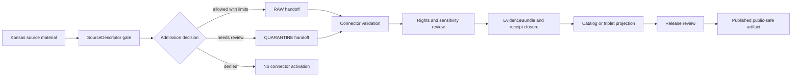

<!-- [KFM_META_BLOCK_V2]
doc_id: kfm://doc/connectors-kansas-readme
title: connectors/kansas/ — Kansas Source-Family Connector Lane
type: readme
version: v0.1
status: draft
owners: OWNER_TBD — Connector steward · Kansas source steward · Domain stewards · Rights reviewer · Sensitivity reviewer · Validation steward · Docs steward
created: 2026-06-19
updated: 2026-06-19
policy_label: public-doctrine; canonical-family; source-admission; rights-gated; sensitivity-gated; no-publication
proposed_path: connectors/kansas/README.md
truth_posture: CONFIRMED path exists / PROPOSED connector-family contract / CHILD INVENTORY NEEDS VERIFICATION
related:
  - ../README.md
  - ../kansas-mesonet/README.md
  - ../../docs/sources/catalog/kansas/README.md
  - ../../docs/sources/catalog/kansas/kansas-mesonet.md
  - ../../docs/sources/catalog/kansas/ksgs.md
  - ../../docs/sources/catalog/kansas/kdot.md
  - ../../docs/sources/catalog/kansas/kdwp.md
  - ../../docs/sources/catalog/kansas/kdhe.md
  - ../../docs/sources/catalog/kansas/kda.md
  - ../../docs/sources/catalog/kansas/kcc-oil-gas-reg.md
  - ../../docs/domains/geology/README.md
  - ../../docs/domains/hydrology/README.md
  - ../../docs/domains/soil/README.md
  - ../../docs/domains/agriculture/README.md
  - ../../docs/domains/weather-atmospheric/README.md
  - ../../docs/sources/SOURCE_DESCRIPTOR_STANDARD.md
  - ../../data/registry/sources/
  - ../../data/raw/
  - ../../data/quarantine/
  - ../../fixtures/
  - ../../schemas/contracts/v1/source/
  - ../../policy/sensitivity/
  - ../../policy/rights/
  - ../../release/
tags: [kfm, connectors, kansas, source-family, canonical-family, state-sources, source-admission, rights, sensitivity, raw, quarantine, governance]
notes:
  - "This README fills a previously blank canonical Kansas connector-family README."
  - "Multiple Kansas source catalog pages state or imply that Kansas source adapters belong under the canonical `connectors/kansas/` lane."
  - "The Kansas Mesonet source page explicitly corrected the earlier top-level `connectors/kansas-mesonet/` reference and says Mesonet belongs under `connectors/kansas/kansas-mesonet/`."
  - "KGS source docs state that `connectors/kansas/` is confirmed under Directory Rules §7.3 and that KGS connector work belongs under `connectors/kansas/kgs/`."
  - "This README coordinates source-admission boundaries only; SourceDescriptor authority, policy, schema, release, receipts, publication, correction, and rollback live outside this folder."
  - "Child connector inventory, implementation files, fixtures, tests, CI wiring, and current passing status remain NEEDS VERIFICATION."
[/KFM_META_BLOCK_V2] -->

<a id="top"></a>

# Kansas Source-Family Connector Lane

> Canonical source-family connector lane for Kansas state, university, and Kansas-specific institutional sources. This folder is for **source admission**, not source truth, policy authority, schema authority, release authority, or publication.

<p>
  
  
  
  
  
</p>

> [!IMPORTANT]
> **Status:** `draft` family README · **Owner:** `OWNER_TBD`  
> **Path:** `connectors/kansas/README.md`  
> **Truth posture:** `CONFIRMED` file exists · `PROPOSED` connector-family contract · `NEEDS VERIFICATION` child inventory and implementation depth  
> **Boundary:** source-admission coordination only; no direct publication, no canonical truth store, no policy/schema/source-descriptor authority.

**Quick jumps:** [Scope](#scope) · [Repo fit](#repo-fit) · [Accepted inputs](#accepted-inputs) · [Exclusions](#exclusions) · [Directory map](#directory-map) · [Evidence ledger](#evidence-ledger) · [Lifecycle diagram](#lifecycle-diagram) · [Admission posture](#admission-posture) · [Sublane rules](#sublane-rules) · [Validation](#validation) · [Rollback](#rollback) · [Verification backlog](#verification-backlog)

---

## Scope

`connectors/kansas/` is the canonical parent connector lane for Kansas-specific source families and products.

It may contain connector-local READMEs, source-family sublanes, product sublanes, fixture notes, source-admission adapters, parser helpers, validation helpers, and safe handoff code for Kansas source material.

It must not become a replacement for `SourceDescriptor` records, source authority registers, schema homes, policy homes, catalog/triplet stores, release manifests, proof stores, or public application surfaces.

[Back to top ↑](#top)

---

## Repo fit

| Surface | Role | Status |
|---|---|---:|
| `connectors/kansas/` | Canonical Kansas connector-family lane. | **CONFIRMED path / PROPOSED contract** |
| `connectors/kansas/kgs/` | KGS connector sublane named by KGS source docs. | **PROPOSED / NEEDS VERIFICATION** |
| `connectors/kansas/kansas-mesonet/` | Intended Kansas Mesonet adapter home named by Mesonet source-page correction. | **PROPOSED / NEEDS VERIFICATION** |
| `connectors/kansas-mesonet/` | Existing top-level compatibility path, not canonical. | **CONFIRMED path / NONCANONICAL compatibility** |
| `docs/sources/catalog/kansas/` | Human-facing Kansas source catalog folder. | **CONFIRMED by search/fetch** |
| `data/registry/sources/` | SourceDescriptor authority. | **Outside connector / NEEDS VERIFICATION for entries** |
| `data/raw/` and `data/quarantine/` | Candidate handoff roots. | **Outside connector / PROPOSED target families** |
| `policy/rights/` and `policy/sensitivity/` | Rights and sensitivity authority. | **Outside connector** |
| `release/` | Release and publication controls. | **Outside connector** |

> [!NOTE]
> Kansas source products span geology, hydrology, soil, agriculture, weather/atmosphere, ecology, transportation, archives, and regulatory context. This README coordinates connector placement and lifecycle boundaries only; each product still needs its own SourceDescriptor, rights review, sensitivity review, validation, and release decision.

[Back to top ↑](#top)

---

## Accepted inputs

Accepted content under this connector family:

- connector-family README and sublane navigation;
- product-specific connector READMEs;
- safe parser and normalization helpers;
- fixture rules and no-network test expectations;
- SourceDescriptor-gate notes;
- provenance and receipt-preservation helpers;
- RAW or QUARANTINE handoff builders;
- validation notes for source-role, rights, sensitivity, freshness, cadence, geometry, and identity fields.

---

## Exclusions

This folder must not contain or imply authority over:

- SourceDescriptor records as the authoritative source register;
- schema definitions as canonical contracts;
- policy decisions for rights, sensitivity, redaction, access, or release;
- catalog/triplet truth stores;
- public map tiles, public APIs, or normal UI surfaces;
- release manifests or publication approval;
- direct writes to `PROCESSED`, `CATALOG`, `TRIPLET`, `PUBLISHED`, proof, receipt, or release stores;
- generated summaries presented as authoritative Kansas source truth.

Redirect those responsibilities to the appropriate registry, schema, policy, validation, release, or domain root.

[Back to top ↑](#top)

---

## Directory map

Current-session evidence confirms this parent README. Child inventory remains **NEEDS VERIFICATION**.

```text
connectors/
└── kansas/
    └── README.md                  # CONFIRMED — this parent connector-family README
```

Known or proposed sublanes from source docs and recent README work:

```text
connectors/kansas/kgs/             # PROPOSED/NEEDS VERIFICATION — KGS sublane named by source docs
connectors/kansas/kansas-mesonet/  # PROPOSED/NEEDS VERIFICATION — intended Mesonet adapter home
connectors/kansas-mesonet/         # CONFIRMED but NONCANONICAL compatibility path
```

[Back to top ↑](#top)

---

## Evidence ledger

| Source | Status | Supports | Limits |
|---|---:|---|---|
| `connectors/kansas/README.md` | **CONFIRMED** | Target file exists and was blank before this update. | Does not prove child implementation files, tests, or CI. |
| `docs/sources/catalog/kansas/ksgs.md` / fetched Kansas catalog entry | **CONFIRMED** | KGS connector path under `connectors/kansas/kgs/` is described as correct; `connectors/kansas/` is stated as confirmed under Directory Rules §7.3. | Fetched file content appears to be a KGS catalog entry even though requested path was family README; family-wide maturity still needs verification. |
| `docs/sources/catalog/kansas/kansas-mesonet.md` | **CONFIRMED** | Top-level `connectors/kansas-mesonet/` was corrected as noncanonical; intended adapter belongs under `connectors/kansas/kansas-mesonet/`. | Does not prove intended adapter files exist. |
| `connectors/kansas-mesonet/README.md` | **CONFIRMED** | Existing top-level Mesonet path was documented as compatibility-only. | Does not prove migration decision. |
| Kansas connector child tree | **NEEDS VERIFICATION** | Parent README path exists. | Child files, fixtures, tests, package layout, workflows, and passing status remain unverified. |

---

## Lifecycle diagram



[Back to top ↑](#top)

---

## Admission posture

Expected behavior for Kansas connector-family work:

- no live source access unless explicitly enabled and reviewed;
- no source fetch without an accepted SourceDescriptor and activation decision;
- no implicit publication from retrieved source material;
- no source-role upgrade by connector code;
- no bypass of rights, sensitivity, consent, station-health, receipt, review, or release gates;
- no silent resolution, cadence, geometry, identity, or vintage collapse;
- no direct output to processed, catalog, triplet, published, proof, receipt, or release stores;
- unclear rights, sensitivity, source role, source identity, freshness, geometry, or schema drift routes to quarantine or abstention.

---

## Sublane rules

When adding or updating a Kansas sublane:

1. Keep the sublane under `connectors/kansas/` unless a governing ADR says otherwise.
2. Name the source/product clearly, but do not create a new root-level connector family for a product.
3. Link the human-facing source catalog page and the expected SourceDescriptor home.
4. Preserve source-role boundaries: observed, regulatory, administrative, modeled, aggregate, candidate, and synthetic roles must not be collapsed.
5. Preserve source-specific identity fields such as station IDs, well IDs, permit IDs, agency IDs, geometry, cadence, vintage, depth, model version, and uncertainty where applicable.
6. Use RAW or QUARANTINE handoff only.
7. Keep public release, policy, schema, catalog/triplet, and proof duties outside the connector.

---

## Validation

Kansas connector-family validation should check that:

- source metadata is preserved;
- SourceDescriptor references are required for activation;
- rights and sensitivity states are explicit before promotion-track use;
- product-specific identity fields are preserved;
- malformed or incomplete records fail closed;
- ambiguous placement, rights, sensitivity, role, geometry, cadence, or vintage routes to quarantine;
- child connector output is limited to RAW or QUARANTINE handoff;
- no connector run writes directly to processed, catalog, triplet, published, proof, receipt, or release stores;
- fixture data is synthetic, minimized, redacted, generalized, or approved for committed use.

Root-level policy-as-code, EvidenceBundle closure, release review, public caveats, and rollback remain outside this connector family.

[Back to top ↑](#top)

---

## Definition of done

This parent README is ready for first review when:

- [ ] Current Kansas connector child inventory is verified.
- [ ] Existing noncanonical product paths are either migrated, documented as compatibility, or tracked in an ADR/open item.
- [ ] SourceDescriptor homes and Kansas source IDs are verified.
- [ ] Rights and sensitivity gates are mapped for each active product sublane.
- [ ] Live source access is disabled by default for connector code.
- [ ] Source-role, identity, geometry, freshness, cadence, receipt, and anti-collapse checks are represented in tests.
- [ ] Connector output is limited to RAW or QUARANTINE handoff.
- [ ] No public claims are created by connector code.

---

## Rollback

Rollback is required if this README is used to justify source activation, source-role collapse, rights/sensitivity bypass, direct publication, public-client access to connector internals, or direct writes beyond RAW/QUARANTINE handoff.

Rollback target:

```text
commit prior to this update: SHA_TBD_AFTER_GIT_HISTORY_CHECK
```

Because the file was blank before this update, a safe rollback is to restore the blank placeholder until child inventory and sublane placement are verified.

---

## Verification backlog

| Item | Status | Needed evidence |
|---|---:|---|
| Confirm complete child inventory under `connectors/kansas/`. | **NEEDS VERIFICATION** | Repo tree or mounted workspace. |
| Confirm all Kansas sublane canonical paths. | **NEEDS VERIFICATION** | Directory Rules, ADRs, migration notes, or repo convention. |
| Confirm migration status for `connectors/kansas-mesonet/`. | **NEEDS VERIFICATION** | ADR or migration decision. |
| Confirm SourceDescriptor homes and source IDs. | **NEEDS VERIFICATION** | Source registry entries and accepted schemas. |
| Confirm rights and sensitivity handling for each active Kansas product. | **NEEDS VERIFICATION** | Rights review, sensitivity review, and policy references. |
| Confirm receipt requirements for station, model, regulatory, administrative, and aggregate products. | **NEEDS VERIFICATION** | Receipt schemas and connector tests. |
| Confirm fixture strategy and CI wiring. | **NEEDS VERIFICATION** | Fixture registry, workflow files, and test logs. |

---

## Maintainer note

Keep `connectors/kansas/` as an admission membrane, not a truth store. Kansas products can be authoritative within their lanes only after SourceDescriptor, rights, sensitivity, validation, receipt, review, release, correction, and rollback controls are satisfied outside the connector.

[Back to top ↑](#top)
