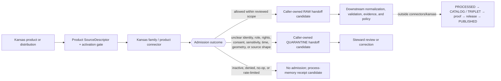

<!-- [KFM_META_BLOCK_V2]
doc_id: kfm://doc/connectors-kansas-readme
title: connectors/kansas/ — Kansas Source-Family Admission Coordination Lane
type: readme
version: v0.2
status: draft
owners: OWNER_TBD — Connector steward · Kansas source steward · Domain stewards · Rights reviewer · Sensitivity reviewer · Validation steward · Docs steward
created: 2026-06-19
updated: 2026-07-12
policy_label: public-doctrine; canonical-family; provisional-child-layout; source-admission; rights-gated; sensitivity-gated; no-publication
current_path: connectors/kansas/README.md
truth_posture: CONFIRMED current path and five direct child README lanes / CONFLICTED final child slugs, compatibility-path migration, Kansas catalog-family index content, and SourceDescriptor authority / PROPOSED family coordination contract / UNKNOWN runtime and activation depth
evidence_snapshot:
  repository: bartytime4life/Kansas-Frontier-Matrix
  base_ref: main
  base_commit: 786a30e9868b6fdf65416cd844c2b852999d2681
  prior_blob: b5d8f829019c79c4fef5666139cdc8d3177123b6
related:
  - ../README.md
  - kbs_herbarium/README.md
  - kdwp/README.md
  - kdwp_ert/README.md
  - kdwp_flora/README.md
  - mesonet/README.md
  - ../kgs/README.md
  - ../kbs/README.md
  - ../kdot/README.md
  - ../kcc_oil_gas_reg/README.md
  - ../kansas_mesonet/README.md
  - ../ks-mesonet/README.md
  - ../kansas_memory/README.md
  - ../kansas_state_archives/README.md
  - ../../CONTRIBUTING.md
  - ../../.github/CODEOWNERS
  - ../../docs/doctrine/directory-rules.md
  - ../../docs/sources/catalog/kansas/README.md
  - ../../docs/sources/SOURCE_DESCRIPTOR_STANDARD.md
  - ../../contracts/source/source_descriptor.md
  - ../../schemas/contracts/v1/source/source_descriptor.schema.json
  - ../../schemas/contracts/v1/sources/source_descriptor.schema.json
  - ../../data/registry/sources/README.md
  - ../../control_plane/source_authority_register.yaml
  - ../../policy/rights/
  - ../../policy/sensitivity/
  - ../../release/
tags: [kfm, connectors, kansas, source-family, source-admission, product-identity, rights, sensitivity, raw, quarantine, compatibility, governance]
notes:
  - "The existing parent path is verified under the connectors responsibility root. This revision coordinates the current Kansas-family documentation surfaces without moving, deleting, or ratifying a child implementation."
  - "Five direct child README lanes are confirmed at the pinned base: kbs_herbarium, kdwp, kdwp_ert, kdwp_flora, and mesonet. Their final slugs, product grouping, runtime depth, and source activation remain independently governed."
  - "Several top-level Kansas-specific connector paths declare themselves compatibility or noncanonical lanes and point toward absent or unresolved children under connectors/kansas/. This revision records representative conflicts but does not perform a migration."
  - "The exact path docs/sources/catalog/kansas/README.md currently contains a KGS source-catalog entry rather than a Kansas family index; it must not be treated as a complete current child inventory."
  - "SourceDescriptor authority remains conflicted: the populated singular-path schema declares itself legacy, the plural-path schema is an empty PROPOSED scaffold, narrative role vocabularies differ, and the machine source-authority register has no entries."
  - "Only this Markdown file is in scope. No connector code, descriptor, fixture, policy, schema, registry record, workflow, receipt, release object, source activation, path move, or public artifact is created."
[/KFM_META_BLOCK_V2] -->

<a id="top"></a>

# Kansas Source-Family Admission Coordination Lane

> [!IMPORTANT]
> **Document lifecycle:** `draft`  
> **Component maturity:** family coordination documentation; child connector runtimes `UNKNOWN`  
> **Owner:** `OWNER_TBD`  
> **Truth posture:** `CONFIRMED` current parent and five direct child README paths · `CONFLICTED` child naming, compatibility migration, catalog-family index content, and `SourceDescriptor` authority · `PROPOSED` family coordination contract  
> **Boundary:** source-family navigation and admission coordination for Kansas state, university, and Kansas-specific institutional products. This folder does not activate a source, make an institution authoritative for every claim, decide rights or sensitivity, publish a map, serve a public client, or authorize release.

**Quick links:** [Purpose](#purpose) · [Authority level](#authority-level) · [Status](#status) · [Current snapshot](#current-repository-snapshot-and-directory-map) · [Path drift](#path-and-compatibility-drift) · [What belongs here](#what-belongs-here) · [What does not belong here](#what-does-not-belong-here) · [Inputs](#inputs) · [Outputs](#outputs) · [Sublane rules](#family-and-sublane-rules) · [Anti-collapse](#source-family-and-product-anti-collapse-boundaries) · [Descriptor conflict](#sourcedescriptor-and-catalog-authority-conflicts) · [Lifecycle](#lifecycle-boundary) · [Validation](#validation) · [Review burden](#review-burden) · [Related folders](#related-folders) · [ADRs](#adrs) · [Last reviewed](#last-reviewed) · [Evidence basis](#evidence-basis) · [Definition of done](#definition-of-done) · [Rollback](#rollback) · [Verification backlog](#verification-backlog)

---

<a id="scope"></a>

## Purpose

`connectors/kansas/` is the current Kansas source-family coordination lane under the canonical `connectors/` responsibility root.

It exists to keep Kansas-specific source clients, product adapters, source-shape parsers, provenance capture, and governed admission handoffs discoverable without creating a new root for every agency, university, archive, station network, collection, regulatory program, or stewardship product.

A child lane may prepare source-native material for a caller-owned `RAW` or `QUARANTINE` handoff only after the exact product—not merely the institution—has an accepted `SourceDescriptor`, explicit activation state, rights review, sensitivity review, supported access method, and source-head identity.

This parent README coordinates family placement and shared admission rules. It does not make a source claim true, select a taxonomic or regulatory authority, define a machine contract, close an `EvidenceBundle`, approve release, or prove that any child runtime exists.

[Back to top](#top)

---

<a id="repo-fit"></a>

## Authority level

**Canonical family placement; provisional child topology.**

| Concern | Status | Evidence-bounded determination |
|---|---:|---|
| Responsibility root | **CONFIRMED** | Source-specific fetch, probe, preservation, and admission belong under `connectors/`. Connector work remains upstream of normalization, evidence closure, cataloging, release, and public delivery. |
| Kansas family placement | **CONFIRMED** | `connectors/kansas/README.md` exists, multiple Kansas source profiles identify the Kansas family lane, and current child READMEs link back to this parent. |
| Direct child README inventory | **CONFIRMED / BOUNDED** | Exact or indexed reads confirm five direct child README paths: `kbs_herbarium/`, `kdwp/`, `kdwp_ert/`, `kdwp_flora/`, and `mesonet/`. This is not a complete recursive code or file inventory. |
| Final child names and grouping | **CONFLICTED / NEEDS VERIFICATION** | Repository docs propose alternative slugs and parent/child groupings for KBS/KANU, KDWP products, Kansas Mesonet, KGS, KDOT, KCC, archives, and other Kansas sources. |
| Top-level compatibility paths | **CONFIRMED / NONCANONICAL IN NAMED READMES** | Representative top-level paths explicitly describe themselves as compatibility or noncanonical lanes. Their migration, redirect, deprecation, or removal is unresolved. |
| Child implementation depth | **UNKNOWN** | A README, placeholder, package note, or compatibility document does not prove an executable client, parser, fixture suite, tests, workflow, activation, emitted receipt, or runtime behavior. |
| Source identity and activation | **OUTSIDE THIS FOLDER** | Product descriptors, source-authority entries, review state, and activation decisions belong in governed registry and control-plane surfaces. |
| Policy and publication authority | **NONE** | Rights, sensitivity, consent, redaction, access, evidence closure, release, correction, withdrawal, and rollback are owned outside this family folder. |

The path itself is not the open question. The open questions are which products belong beneath it, which existing top-level lanes are compatibility-only, which child slug is final, and what evidence is required before any lane becomes active.

[Back to top](#top)

---

## Status

| Item | Status | Meaning |
|---|---:|---|
| This README | **DRAFT** | Reviewable family coordination contract; not source activation or KFM publication. |
| Parent path | **CONFIRMED** | `connectors/kansas/README.md` exists at the pinned base. |
| Direct child README paths | **CONFIRMED / FIVE** | The five paths listed in the current snapshot are present as documentation surfaces. |
| Complete recursive child inventory | **UNKNOWN** | Differently named code, fixtures, tests, generated files, and nested implementation are not ruled out by README-level inspection. |
| Canonical child-slug map | **CONFLICTED** | Current paths, source profiles, compatibility READMEs, and proposed children do not provide one accepted naming map. |
| Product-level `SourceDescriptor`s | **NOT ESTABLISHED FAMILY-WIDE** | The machine source-authority register is empty, and product-level descriptors/activation must be verified independently. |
| `SourceDescriptor` schema authority | **CONFLICTED** | The populated singular schema declares the plural path canonical and itself legacy; the plural schema is an empty permissive scaffold. |
| Kansas source catalog family index | **CONFLICTED** | The exact `docs/sources/catalog/kansas/README.md` path currently contains a KGS source-catalog entry rather than a family index. |
| Live source access | **DISABLED BY DEFAULT** | No child source may be contacted merely because a folder or README exists. |
| Public release | **DENY BY DEFAULT** | Connector output is not public; sensitive, private, unclear-rights, stale, mixed-role, or unsafe material fails closed. |
| Owner assignment | **UNKNOWN** | Current CODEOWNERS provides a repository-wide fallback but no Kansas-connector-specific owner. |

[Back to top](#top)

---

<a id="directory-map"></a>

## Current repository snapshot and directory map

The following is the **confirmed direct child README inventory** at repository `bartytime4life/Kansas-Frontier-Matrix`, base commit `786a30e9868b6fdf65416cd844c2b852999d2681`.

```text
connectors/kansas/
├── README.md
├── kbs_herbarium/
│   └── README.md
├── kdwp/
│   └── README.md
├── kdwp_ert/
│   └── README.md
├── kdwp_flora/
│   └── README.md
└── mesonet/
    └── README.md
```

This tree proves only those README paths. It does not prove that each folder contains implementation, that no other non-README child exists, or that the current slugs are final.

| Current child | Current documented meaning | Placement or maturity boundary |
|---|---|---|
| [`kbs_herbarium/`](kbs_herbarium/README.md) | KANU herbarium specimen admission lane. | Current path confirmed; future `kbs/` versus `ku-herbarium/` adapter name is conflicted; runtime unknown. |
| [`kdwp/`](kdwp/README.md) | KDWP institutional source-family coordination lane. | Parent placement confirmed; product layout, descriptor authority, and runtime depth unresolved. |
| [`kdwp_ert/`](kdwp_ert/README.md) | Bounded Ecological Review Tool or stewardship-review output lane. | Sibling-versus-child placement and machine role are conflicted; no legal-clearance or reusable-site-truth authority. |
| [`kdwp_flora/`](kdwp_flora/README.md) | KDWP flora, listed-species, rank, range, and stewardship-context lane. | Sibling-versus-child placement, Flora registry topology, role mapping, and runtime depth unresolved. |
| [`mesonet/`](mesonet/README.md) | Repository-present Kansas Mesonet product admission lane. | Final child slug is conflicted; automated ingest requires reviewed consent posture; package/tests/runtime unverified. |

The historical claim that this parent README is the only confirmed child surface is no longer true and is removed by this revision.

[Back to top](#top)

---

## Path and compatibility drift

The table below is representative, not exhaustive. It records exact compatibility README evidence and directly probed target README paths; it does not authorize a move.

| Existing or referenced surface | Current evidence | Safe posture |
|---|---|---|
| [`../kgs/`](../kgs/README.md) | README declares a noncanonical compatibility lane and names `connectors/kansas/kgs/` as canonical; the directly probed target README was absent. | Do not expand a second canonical KGS implementation. Resolve child creation/migration through an accepted path decision. |
| [`../kbs/`](../kbs/README.md) | README declares a noncanonical compatibility lane and names `connectors/kansas/kbs/`; that target README was absent, while `kbs_herbarium/` exists for KANU specimens. | Keep KBS Natural Heritage and KANU specimen roles distinct; do not infer that the current specimen slug resolves the umbrella KBS path. |
| [`../kdot/`](../kdot/README.md) | README declares a noncanonical compatibility lane and names `connectors/kansas/kdot/`; the directly probed target README was absent. | Retain compatibility-only posture until migration evidence exists. |
| [`../kcc_oil_gas_reg/`](../kcc_oil_gas_reg/README.md) | README declares a noncanonical compatibility lane and names `connectors/kansas/kcc-oil-gas-reg/`; the directly probed target README was absent. | Do not treat regulatory records as geology observations or expand the compatibility path as a second canon. |
| [`mesonet/`](mesonet/README.md), [`../kansas_mesonet/`](../kansas_mesonet/README.md), and [`../ks-mesonet/`](../ks-mesonet/README.md) | The nested `mesonet/` lane exists; two top-level aliases remain; the former `connectors/kansas-mesonet/` alias was deleted; the source-profile-named `connectors/kansas/kansas-mesonet/` README was absent. | Do not recreate the deleted alias. Resolve one final child slug and migration plan before substantive runtime expansion. |
| [`../kansas_memory/`](../kansas_memory/README.md) and [`../kansas_state_archives/`](../kansas_state_archives/README.md) | Both READMEs declare noncanonical compatibility posture and propose Kansas-family destinations whose final homes remain unverified. | Preserve archival rights, cultural sensitivity, and provenance; do not migrate by topic-name convenience. |
| [`../kdwp/`](../kdwp/README.md) and `../kdwp_ert/` | Top-level KDWP compatibility surfaces coexist with the current Kansas-family KDWP lanes. | Keep compatibility behavior transparent and prevent independent evolution as a second canonical implementation. |

Directory Rules require migration discipline, not silent normalization. A later move must preserve history, inbound references, descriptors, fixtures, tests, receipts, deprecation notices, validation, and rollback.

[Back to top](#top)

---

<a id="accepted-inputs"></a>

## What belongs here

Subject to accepted child placement and product-level governance, `connectors/kansas/` may contain:

- this family README and navigation;
- institution or source-family subfolders whose placement is accepted;
- product subfolders when the product cannot safely share one client, parser, role, cadence, rights posture, or sensitivity posture;
- opt-in source clients that remain inactive without an accepted descriptor and activation decision;
- parsers for verified source-native formats such as APIs, HTML tables, CSV, spreadsheets, archives, PDFs, GIS packages, Darwin Core Archives, OAI-PMH, IIIF, or other reviewed distributions;
- source-head probes using supported versions, checksums, signatures, `ETag`, `Last-Modified`, release identifiers, or documented manual snapshots;
- source-native identifier, citation, rights, limitation, and correction preservation;
- helpers that preserve product role without upgrading source meaning;
- geometry, precision, CRS/datum, uncertainty, withholding, and original-versus-public geometry intent;
- source, observed, effective, retrieval, review, expiry, correction, withdrawal, and supersession time where material;
- caller-owned `RAW` or `QUARANTINE` handoff builders;
- process-memory retrieval, denial, no-op, rate-limit, quarantine, admission, or handoff receipt candidates when an accepted receipt contract exists;
- links to small synthetic, minimized, redacted, generalized, or rights-reviewed no-network fixtures in the repository's accepted fixture/test home;
- migration-only compatibility adapters with an explicit source path, target path, owner, deprecation state, validation plan, and rollback target.

No item in this list is evidence that the corresponding implementation already exists.

[Back to top](#top)

---

<a id="exclusions"></a>

## What does not belong here

This family folder must not own or imply authority over:

- one all-purpose descriptor for “Kansas sources” or for a multi-product institution;
- source admission, activation, retirement, or release decisions;
- `SourceDescriptor` instances or machine source-authority entries;
- canonical object meaning, JSON Schema, source-role vocabulary, reason-code vocabulary, or receipt contracts;
- rights, terms, consent, sovereignty, cultural-sensitivity, rare-species, privacy, redaction, access, or public-precision policy;
- domain-owned taxonomy, legal status, station-health, hydrology, geology, transport, archive, specimen, habitat, flora, fauna, soil, agriculture, or atmosphere semantics;
- public exact locations for sensitive taxa, cultural places, private property records, critical facilities, wells, archaeological sites, or other restricted geometry;
- credentials, tokens, cookies, private URLs, signed URLs, account material, or secrets;
- direct writes to `WORK`, `PROCESSED`, `CATALOG`, `TRIPLET`, `PUBLISHED`, proof, or release stores;
- `EvidenceBundle`, catalog, proof-pack, release-manifest, correction, withdrawal, or rollback authority;
- public APIs, tiles, map layers, dashboards, alerts, advisories, ordinary UI payloads, or AI answers;
- emergency or life-safety authority;
- compatibility paths that evolve independently as parallel canonical implementations;
- generated language, derived maps, models, aggregates, screenshots, or summaries presented as sovereign source truth.

A reachable endpoint is not an admitted source. An admitted source is not validated evidence. Validated evidence is not a released public claim.

[Back to top](#top)

---

<a id="admission-posture"></a>

## Inputs

Every child connector operation requires product-specific, reviewable inputs:

| Input | Required posture |
|---|---|
| Product identity | Identify the exact publisher, program, product, distribution, and version. Agency or institution name alone is insufficient. |
| `SourceDescriptor` reference | Resolve to the accepted descriptor for that exact product and descriptor version. |
| Activation state | Explicitly permits the requested fixture-only, restricted, manual, or live mode. |
| Access surface | Reviewed endpoint, file, archive, request workflow, or service definition; credentials supplied only through approved secret handling. |
| Rights and consent state | Current terms, attribution, redistribution, downstream use, automated-ingest permission, account requirements, and review date. Unknown rights or consent fail closed. |
| Sensitivity state | Dataset- and record-level restrictions, including exact-location, rare-taxon, private-land, cultural, living-person, infrastructure, or steward-controlled material. |
| Source-role mapping | Product and record meaning mapped through the accepted machine vocabulary; never inferred from the institution name, directory slug, or file extension. |
| Source head | Upstream version, release date, checksum, signature, `ETag`, `Last-Modified`, or another reproducible identity signal. |
| Temporal context | Source, observation, effective, retrieval, review, expiry, correction, withdrawal, and supersession time where applicable. |
| Caller-owned handoff | Explicit `RAW` and `QUARANTINE` sinks or envelope interfaces; no implicit filesystem destination. |
| Execution mode | No-network by default. Live access is an explicit reviewed capability, not a README side effect. |

The exact field names, DTOs, reason codes, and machine enums remain contract-owned. This table records family-level obligations, not a substitute schema.

[Back to top](#top)

---

## Outputs

Permitted child connector outputs are narrow and caller-owned:

1. **A `RAW` handoff candidate** preserving the immutable or reproducibly referenced source payload, source head, product identity, retrieval time, checksum, descriptor reference, rights/sensitivity posture, and admission metadata.
2. **A `QUARANTINE` handoff candidate** with a structured reason when identity, role, rights, consent, sensitivity, source shape, geometry, time, freshness, source head, or activation is unresolved.
3. **A process-memory receipt candidate** for retrieval, probe, denial, skipped, no-op, rate-limit, quarantine, admission, or handoff behavior when the accepted receipt contract provides one.
4. **A deterministic operational failure** when the connector cannot safely produce one of the governed outcomes above.

The exact output envelope, sink protocol, idempotency key, reason-code vocabulary, receipt type, retry semantics, and storage path are **PROPOSED / NEEDS VERIFICATION** until accepted contracts and tests establish them.

A connector must not emit a processed domain record, `EvidenceBundle`, public geometry, catalog item, triplet, released layer, public answer, alert, advisory, or publication decision.

[Back to top](#top)

---

<a id="sublane-rules"></a>

## Family and sublane rules

When adding, revising, or migrating a Kansas child lane:

1. **Choose by responsibility.** Keep source-specific admission under `connectors/`; do not create a root-level agency or domain folder for convenience.
2. **Inspect before naming.** Check current paths, source profiles, compatibility READMEs, ADRs, registries, imports, fixtures, tests, workflows, and references before proposing a child slug.
3. **Do not ratify drift through prose.** An existing folder can be documented as current without becoming the final canonical path.
4. **Identify products, not just institutions.** One institution may issue regulatory lists, observations, models, aggregates, review outputs, archives, and administrative records that require separate descriptors or adapters.
5. **Set role at admission.** Do not infer role from publisher reputation, filename, endpoint, geometry, or downstream use.
6. **Split or quarantine mixed-role material.** A file combining status, observations, models, or administrative context must be mapped record-by-record or held until the contract can represent it safely.
7. **Preserve source-native identity and time.** Keep upstream IDs, versions, source heads, observation/effective/retrieval/correction time, and supersession lineage.
8. **Preserve spatial limits.** Original, restricted, generalized, and public geometry are distinct states; connector code does not mint public precision.
9. **Fail closed on rights, consent, and sensitivity.** Public availability does not automatically authorize automated ingest, redistribution, de-obscuration, or cross-dataset reconstruction.
10. **Default to no network.** Tests and fixtures are offline, deterministic, minimized, and safe.
11. **Bound outputs.** Child code may prepare `RAW`, `QUARANTINE`, and process-memory receipt candidates only.
12. **Keep compatibility temporary and transparent.** A compatibility lane must name its target, reason, deprecation posture, and migration/rollback plan; it must not become a second canon.
13. **Link authority surfaces.** Every substantive child README should point to the source profile, descriptor/activation surface, rights/sensitivity policy, domain contract, tests, and release boundary.
14. **Use migration discipline.** Moves and renames require history preservation, reference updates, compatibility handling, validation, and rollback; authority-changing moves require an ADR.

[Back to top](#top)

---

## Source-family and product anti-collapse boundaries

Kansas-first does not mean institution-first truth. The product and record class control what a source can support.

| Source or record class | Meaning to preserve | Must not become |
|---|---|---|
| Regulatory or legal-status product | A determination issued by the named Kansas authority for a bounded scope and effective period. | A field observation, timeless truth, or KFM-created legal decision. |
| Station, survey, monitoring, specimen, or event record | Observed evidence tied to method, identity, place, time, quality flags, and uncertainty. | Area-wide certainty, complete range, regulatory status, or unrestricted public precision. |
| Administrative, stewardship, or review output | A bounded program or review artifact with scope, inputs, status, version, limitations, expiry, and correction state. | Legal clearance, reusable site truth, public occurrence, or KFM release approval. |
| Archive, manuscript, image, map, or cultural record | A historical or cultural source object with provenance, rights, descriptive context, and possible community restrictions. | Unrestricted public reuse, present-day fact without temporal context, or inferred living-person truth. |
| Model, forecast, interpolation, range, or suitability surface | A derived output with model/run identity, inputs, scale, uncertainty, and limitations. | Direct observation, certain presence/absence, or regulatory determination. |
| Aggregate or summary | A value over an explicit spatial, temporal, or administrative unit. | A per-place or per-person assertion. |
| Mixed package | Multiple source roles or products bundled upstream. | One untyped all-purpose feed. Split mappings or quarantine are required. |
| Compatibility adapter | A temporary bridge from an old path or interface to an accepted target. | An independent canonical source implementation. |

Promotion cannot upgrade source role, remove uncertainty, erase effective dates, or transform a restricted original into an unrestricted truth object.

[Back to top](#top)

---

## `SourceDescriptor` and catalog authority conflicts

The current repository does not provide one enforceable, internally consistent family-wide descriptor and catalog authority.

| Surface | Current evidence | Consequence |
|---|---|---|
| Source Descriptor Standard | Draft narrative doctrine with proposed paths and human role vocabulary. | Useful for meaning, not sufficient machine conformance by itself. |
| `contracts/source/source_descriptor.md` | Draft semantic contract paired to the populated singular schema. | Describes meaning but does not resolve the declared canonical schema-path conflict. |
| Singular schema path | Populated Draft 2020-12 schema; its metadata names the plural path canonical and itself legacy. | Substantive field validation exists, but authority remains conflicted. |
| Plural schema path | Empty `PROPOSED` scaffold with unrestricted properties and no contract document. | Cannot enforce a Kansas product descriptor. |
| Machine source-authority register | File exists with `entries: []`. | No machine authority or activation entry was verified in the inspected register. |
| Kansas catalog family path | `docs/sources/catalog/kansas/README.md` currently contains a KGS source-catalog entry. | It cannot presently serve as a reliable complete Kansas family index. |
| Child and compatibility READMEs | Use overlapping human role words and multiple proposed slugs. | Do not copy prose tokens or paths into machine records without accepted authority. |
| Referenced schema-home ADR | Direct probe of `docs/adr/ADR-0001-schema-home.md` returned `Not Found`. | No inspected accepted ADR resolves the current schema-home conflict. |

> [!WARNING]
> Do not create or activate a Kansas product descriptor by copying a role, source ID, child slug, or registry path from this README. Resolve the governing contract, schema home, role vocabulary, registry placement, and activation workflow first; then update descriptors, fixtures, validators, child docs, and this parent together.

**Safe current posture:** preserve source-native human meaning, mark machine mappings `NEEDS VERIFICATION`, and quarantine or abstain when role, rights, consent, sensitivity, identity, time, geometry, or product boundaries cannot be represented without guessing.

[Back to top](#top)

---

<a id="lifecycle-diagram"></a>

## Lifecycle boundary



`connectors/kansas/` owns family navigation and source-admission implementation boundaries only. It does not own `WORK`, `PROCESSED`, `CATALOG`, `TRIPLET`, `PUBLISHED`, evidence closure, public rendering, release, correction, or rollback.

[Back to top](#top)

---

<a id="validation"></a>

## Validation

### Family-level documentation checks

Review this README and each substantive child for:

- one clear source-admission purpose and one explicit output boundary;
- current path and unresolved placement labeled separately;
- source family, product, distribution, and record class kept distinguishable;
- source role not inferred from publisher, path, or convenience;
- rights, consent, sensitivity, freshness, geometry, and source-head obligations visible;
- links to source profile, descriptor/activation, policy, domain, tests, and release surfaces where those paths are verified;
- no remote tracking badge, credential, private URL, source payload, exact sensitive locality, or private record;
- a concrete rollback target and bounded evidence snapshot;
- no claim that a commit, pull request, retrieved file, or connector receipt is evidence closure or publication.

### Child implementation checks

Before any child can be treated as active, tests and validators must cover at least:

- descriptor resolution and explicit activation;
- no-network default behavior;
- source-head, payload identity, checksum, and retrieval metadata preservation;
- product- and record-level role mapping without collapse;
- rights, terms, consent, attribution, redistribution, and account posture;
- source, observation, effective, retrieval, expiry, correction, withdrawal, and supersession time where applicable;
- geometry validity, CRS/datum, uncertainty, withholding, and original-versus-public separation;
- source-native identifiers, quality flags, limitations, and corrections;
- explicit quarantine or denial for unknown rights, missing consent, unresolved role, unsafe geometry, stale source head, malformed identity, source drift, or mixed-role packages;
- success, quarantine/hold, denied/inactive, no-op, skipped, rate-limited, stale, corrected, withdrawn, and operational-error outcomes as applicable;
- proof that connector code cannot write beyond caller-owned `RAW` or `QUARANTINE` handoff and process-memory receipt candidates;
- fixture safety: synthetic, minimized, redacted, generalized, or explicitly approved data only;
- refusal to use a compatibility path as an independent canonical implementation.

### Documentation checks for this file

This revision should verify:

- preserved `doc_id` and `created` date;
- one H1 and coherent heading hierarchy;
- balanced metadata, tables, callouts, links, and Mermaid fences;
- preserved legacy anchors where practical;
- final newline;
- pinned base commit, prior blob, and introduction commit;
- exactly one changed path: `connectors/kansas/README.md`.

Repository-wide executable maturity is not established by this README. Trusted CI results must be reported by workflow and scope; they do not prove source activation, rights approval, runtime correctness, or public-release readiness.

[Back to top](#top)

---

## Review burden

At minimum, substantive family-placement, child-migration, descriptor, activation, or source-product work should involve:

- connector steward;
- Kansas source steward;
- the owning domain steward or stewards for the exact product;
- rights reviewer;
- sensitivity/privacy/cultural reviewer where applicable;
- validation or test steward;
- docs steward.

Additional review may be required for taxonomy, archives/CARE, living-person records, rare species, private land, infrastructure, legal/regulatory meaning, or life-safety-adjacent products.

The inspected `.github/CODEOWNERS` file applies a repository-wide `@kfm/maintainers` fallback but does not assign a Kansas connector-family owner. Team existence, semantic ownership, and reviewer availability remain **NEEDS VERIFICATION**; this README does not invent accounts or request reviewers.

Governed review is required before:

- accepting a new canonical child slug;
- moving or retiring a compatibility lane;
- activating a live endpoint, archive, API, request workflow, or automated ingest;
- accepting or changing source-role, rights, consent, attribution, redistribution, or sensitivity posture;
- exposing generalized sensitive geometry;
- treating a regulatory, review, archive, specimen, observation, model, or aggregate product as support for a public claim;
- defining a family-wide tie-breaker among Kansas, federal, university, tribal, local, or international authorities;
- treating an ingest receipt as an `EvidenceBundle`, proof, or release decision.

[Back to top](#top)

---

## Related folders

| Surface | Relationship | Status in the pinned snapshot |
|---|---|---:|
| [`../README.md`](../README.md) | Connector-root source-admission boundary and required child README contract. | **CONFIRMED file** |
| [`kbs_herbarium/README.md`](kbs_herbarium/README.md) | Current KANU specimen child lane. | **CONFIRMED file / final slug CONFLICTED** |
| [`kdwp/README.md`](kdwp/README.md) | Current KDWP institutional coordination child. | **CONFIRMED file / product layout CONFLICTED** |
| [`kdwp_ert/README.md`](kdwp_ert/README.md) | Current bounded-review child lane. | **CONFIRMED file / placement and role CONFLICTED** |
| [`kdwp_flora/README.md`](kdwp_flora/README.md) | Current KDWP Flora child lane. | **CONFIRMED file / placement and registry topology CONFLICTED** |
| [`mesonet/README.md`](mesonet/README.md) | Current Kansas Mesonet child lane. | **CONFIRMED file / final slug and registry identity CONFLICTED** |
| Representative top-level compatibility READMEs | Existing KGS, KBS, KDOT, KCC, KDWP, Mesonet-alias, Kansas Memory, and Kansas State Archives path drift. | **CONFIRMED examples / migration unresolved** |
| [`../../docs/sources/catalog/kansas/README.md`](../../docs/sources/catalog/kansas/README.md) | Intended human-facing Kansas source-family index. | **CONFIRMED path / content currently KGS-specific and CONFLICTED** |
| [`../../docs/sources/SOURCE_DESCRIPTOR_STANDARD.md`](../../docs/sources/SOURCE_DESCRIPTOR_STANDARD.md) | Narrative source-admission doctrine. | **CONFIRMED file / draft** |
| [`../../contracts/source/source_descriptor.md`](../../contracts/source/source_descriptor.md) | `SourceDescriptor` semantic contract. | **CONFIRMED file / draft** |
| [`../../schemas/contracts/v1/source/source_descriptor.schema.json`](../../schemas/contracts/v1/source/source_descriptor.schema.json) | Populated schema at a self-declared legacy path. | **CONFIRMED file / authority CONFLICTED** |
| [`../../schemas/contracts/v1/sources/source_descriptor.schema.json`](../../schemas/contracts/v1/sources/source_descriptor.schema.json) | Nominal canonical-path scaffold. | **CONFIRMED file / not enforceable** |
| [`../../data/registry/sources/README.md`](../../data/registry/sources/README.md) | Source registry responsibility boundary. | **CONFIRMED file / instance topology and maturity NEEDS VERIFICATION** |
| [`../../control_plane/source_authority_register.yaml`](../../control_plane/source_authority_register.yaml) | Machine source-authority register. | **CONFIRMED file / currently empty** |
| [`../../policy/rights/`](../../policy/rights/) | Rights, consent, attribution, redistribution, and access authority. | **Outside connector / implementation depth NEEDS VERIFICATION** |
| [`../../policy/sensitivity/`](../../policy/sensitivity/) | Sensitivity, privacy, redaction, and public-precision authority. | **Outside connector / implementation depth NEEDS VERIFICATION** |
| [`../../release/`](../../release/) | Release, correction, withdrawal, and rollback decisions. | **Outside connector** |

[Back to top](#top)

---

## ADRs

- Directory Rules govern the `connectors/` responsibility root, family/source placement, the connector output boundary, the required folder-README contract, and migration discipline.
- No accepted path-specific ADR was verified that resolves the complete Kansas child map or the disposition of all top-level compatibility lanes.
- Repository documents reference `ADR-0001` for schema-home authority, but the directly probed `docs/adr/ADR-0001-schema-home.md` path was not found. The populated singular schema, empty plural schema, and conflicting narrative vocabularies leave descriptor authority **CONFLICTED / NEEDS VERIFICATION**.
- This README update does not itself trigger an ADR: it edits one existing Markdown file, moves no path, creates no parallel authority home, changes no schema or contract, alters no lifecycle phase, and approves no public path.
- A later change requires ADR or governed migration review when it:
  - creates, renames, merges, or retires a canonical Kansas child;
  - promotes a compatibility lane to canonical or removes a canonical lane;
  - changes schema-home, registry, policy, release, proof, or receipt authority;
  - changes the `RAW` / `QUARANTINE` connector boundary;
  - changes sensitive-location, rights, consent, or public-access posture.
- Any migration must preserve history, references, descriptors, fixtures, tests, receipts, deprecation state, validation, and rollback.

[Back to top](#top)

---

## Last reviewed

| Field | Value |
|---|---|
| Review date | `2026-07-12` |
| Repository | `bartytime4life/Kansas-Frontier-Matrix` |
| Base ref | `main` |
| Pinned base commit | `786a30e9868b6fdf65416cd844c2b852999d2681` |
| Prior README blob | `b5d8f829019c79c4fef5666139cdc8d3177123b6` |
| README introduction commit | `7d340f1e1406264fe13232fecb7dc0d712b975ce` |
| Direct child README blobs | `kbs_herbarium`: `6076e22d…`; `kdwp`: `bcfc17db…`; `kdwp_ert`: `0fa2396e…`; `kdwp_flora`: `19c9edd0…`; `mesonet`: `346fd5a5…` |
| Review scope | Target README/history; connector root; five direct child READMEs; representative top-level compatibility READMEs; exact proposed-child probes; Kansas catalog-family path; Directory Rules; Source Descriptor Standard and semantic contract; both schema paths; source registry and authority register; contribution guidance; CODEOWNERS; path-scoped instruction probes; branch and pull-request collision search |
| Reviewer identity | `OWNER_TBD` — no semantic owner assignment made by this document |

[Back to top](#top)

---

<a id="evidence-ledger"></a>

## Evidence basis

| Evidence | What it supports | What it does not prove |
|---|---|---|
| Target blob `b5d8f829019c79c4fef5666139cdc8d3177123b6` at the pinned base | Exact editing baseline, current parent path, stale child tree, stale “blank” language, and unresolved rollback placeholder. | Runtime, source activation, or child completeness. |
| Introduction commit `7d340f1e1406264fe13232fecb7dc0d712b975ce` | The v0.1 README replaced a one-line placeholder; “blank before this update” is historical residue. | That restoring a blank file is now the correct rollback. |
| `connectors/README.md` | Connector responsibility, output boundary, inspection path, required child README contract, validation expectations, and rollback discipline. | Which Kansas products are active or which child slug is canonical. |
| Direct child README reads and indexed path search | Five direct child documentation lanes exist and each records bounded source-admission concerns. | Complete recursive implementation, runtime behavior, or final placement. |
| Exact absent-child probes | The named `kgs/`, `kbs/`, `ku-herbarium/`, `kansas-mesonet/`, `kdot/`, and `kcc-oil-gas-reg/` README targets were not found at the pinned base. | Absence of differently named code or future migration intent. |
| Representative compatibility READMEs | Top-level Kansas-specific paths explicitly identify noncanonical or compatibility posture and proposed Kansas-family targets. | A completed migration, redirect behavior, or removal approval. |
| Kansas catalog-family path read | The exact family README path currently contains KGS-specific catalog content. | The intended future family index or the complete source catalog inventory. |
| Source Descriptor Standard, semantic contract, and both schema paths | Descriptor doctrine and machine-shape surfaces exist but disagree on canonical path and vocabulary maturity. | One accepted enforceable descriptor authority. |
| Empty source-authority register | No entries exist in that inspected machine register. | Absence of every source descriptor or activation record elsewhere in the repository. |
| Contribution guidance, CODEOWNERS, and repository templates | Small reversible changes, truth labels, review fields, and repository-wide fallback ownership. | Actual team existence, branch protection, reviewer availability, or enforcement completeness. |
| User-supplied repository documentation implementation prompt | Authorized an implementation-mode, scoped branch, remote verification, and draft pull request workflow. | Repository facts or source-product truth. |

Absence claims are bounded to exact paths, indexed searches, and the pinned commit. This README does not assert a complete recursive repository inventory.

[Back to top](#top)

---

## Definition of done

This README can be reviewed as a documentation-only family contract when:

- [x] The target path, base commit, prior blob, and introduction commit are recorded.
- [x] The five confirmed direct child README lanes are listed without claiming runtime maturity.
- [x] Representative compatibility paths and exact absent proposed-child README probes are visible.
- [x] Historical “blank before this update” language and the unresolved rollback placeholder are removed.
- [x] Remote badges and unsupported maturity signals are removed.
- [x] Family purpose, authority, status, inclusions, exclusions, inputs, outputs, sublane rules, validation, review burden, related folders, ADRs, evidence, and rollback are explicit.
- [x] Product-level identity, role, time, rights, consent, sensitivity, geometry, and no-network defaults are visible.
- [x] No source is activated, contacted, downloaded, parsed, or published by this documentation change.
- [ ] A complete recursive Kansas connector inventory is generated and reviewed.
- [ ] An accepted child-slug and compatibility-migration map resolves current path drift.
- [ ] The Kansas source catalog family index is repaired or superseded through its owning documentation workflow.
- [ ] The accepted `SourceDescriptor` contract, schema home, role vocabulary, registry topology, validator, and fixtures are resolved.
- [ ] Product-level descriptors, source-authority entries, activation states, rights, consent, cadence, source heads, and steward assignments are verified.
- [ ] Child package, fixture, test, workflow, and receipt implementation is verified.
- [ ] Output-boundary tests prove that child connectors cannot write beyond allowed handoff candidates.
- [ ] Applicable CI and policy checks pass without bypass.
- [ ] Kansas connector-family ownership and required reviewers are assigned.

Documentation readiness does not imply source activation, implementation readiness, evidence closure, or public release.

[Back to top](#top)

---

## Rollback

Rollback is required if this README is used to justify:

- an unreviewed source interaction or activation;
- a child-path or migration decision not supported by an accepted ADR or migration record;
- a source role, source ID, or descriptor copied from conflicting prose;
- rights, consent, sensitivity, privacy, cultural, or public-precision bypass;
- institution-wide authority that collapses product and record roles;
- direct public-client access to connector internals;
- direct writes beyond caller-owned `RAW` or `QUARANTINE` handoff;
- treating a connector receipt, Git commit, pull request, map, model, aggregate, or AI explanation as evidence closure or publication.

Before merge, rollback is to leave the review branch unmerged and abandon the proposed change. Closing a pull request or deleting its branch requires separate authorization.

After merge, restore prior README blob `b5d8f829019c79c4fef5666139cdc8d3177123b6` from base `786a30e9868b6fdf65416cd844c2b852999d2681` through a transparent revert commit or revert pull request, then re-run applicable documentation and connector-boundary validation. Do not reset, force-push, or rewrite shared history.

[Back to top](#top)

---

## Verification backlog

| Item | Status | Needed evidence |
|---|---:|---|
| Generate a complete recursive inventory under `connectors/kansas/`. | **UNKNOWN** | Pinned recursive tree plus import, package, fixture, test, and workflow inspection. |
| Resolve one accepted Kansas child-slug map. | **CONFLICTED** | Accepted ADR or migration record covering current children, proposed children, aliases, redirects, and deprecations. |
| Resolve KGS, KBS/KANU, KDOT, KCC, KDWP, Mesonet, archives, KHRI, and other top-level compatibility paths. | **NEEDS VERIFICATION** | Per-source migration decisions, dependency/reference maps, validation, and rollback targets. |
| Repair or replace the Kansas source catalog family index. | **CONFLICTED** | Docs-owner review showing the intended family inventory and the disposition of the KGS-specific content at the family README path. |
| Resolve `SourceDescriptor` schema home and role vocabulary. | **CONFLICTED** | Accepted ADR/contract, one enforceable schema, migration plan, fixtures, and validator results. |
| Confirm product-level source IDs, descriptors, authority entries, and activation states. | **NEEDS VERIFICATION** | Registry/control-plane records and successful validation. |
| Confirm current endpoints, access methods, terms, attribution, redistribution, consent, cadence, and source heads. | **NEEDS VERIFICATION** | Current authoritative source documentation and steward review for each product. |
| Confirm domain contracts and anti-collapse mappings. | **NEEDS VERIFICATION** | Domain steward review, contracts, schemas, crosswalks, and negative fixtures. |
| Verify sensitive geometry, privacy, cultural, living-person, private-land, and infrastructure handling. | **NEEDS VERIFICATION** | Policy, redaction/generalization contracts, review records, and tests. |
| Define family-wide output envelopes, sink protocols, reason codes, receipts, idempotency, retries, and no-op behavior. | **NEEDS VERIFICATION** | Accepted contracts, schemas, policies, fixtures, and runtime tests. |
| Verify no-network defaults and fixture safety. | **NEEDS VERIFICATION** | Test configuration, fixture registry, rights/sensitivity review, and observed test results. |
| Verify CI wiring and current check results for this change. | **NEEDS VERIFICATION** | Pull-request workflow runs and scoped check interpretation. |
| Assign connector-family owner and reviewers. | **UNKNOWN** | CODEOWNERS or accepted ownership records. |

[Back to top](#top)

---

## Maintainer note

Keep `connectors/kansas/` as a governed source-admission family, not a Kansas truth store. Kansas-first authority is always product-, role-, scope-, time-, rights-, and sensitivity-specific. Child connectors may preserve and hand off source material; evidence closure, policy enforcement, release approval, public delivery, correction, withdrawal, and rollback remain downstream.

[Back to top](#top)
