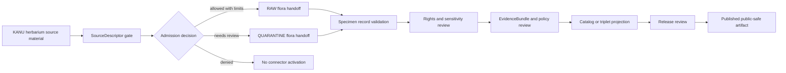

<!-- [KFM_META_BLOCK_V2]
doc_id: kfm://doc/connectors-kansas-kbs-herbarium-readme
title: connectors/kansas/kbs_herbarium/ — KBS/KANU Herbarium Connector Lane
type: readme
version: v0.1
status: draft
owners: OWNER_TBD — Connector steward · Kansas source steward · Flora steward · Biodiversity steward · Rights reviewer · Sensitivity reviewer · Validation steward · Docs steward
created: 2026-06-19
updated: 2026-06-19
policy_label: public-doctrine; kansas-family; specimen-admission; rights-gated; sensitivity-gated; no-publication
proposed_path: connectors/kansas/kbs_herbarium/README.md
truth_posture: CONFIRMED path exists / PROPOSED herbarium-lane contract / PLACEMENT NEEDS VERIFICATION
related:
  - ../README.md
  - ../../README.md
  - ../../../docs/sources/catalog/kansas/kbs.md
  - ../../../docs/sources/catalog/kansas/ku-herbarium.md
  - ../../../docs/sources/catalog/kansas/ku-nhm.md
  - ../../../docs/sources/catalog/kansas/kdwp.md
  - ../../../docs/sources/catalog/gbif/README.md
  - ../../../docs/sources/catalog/idigbio/README.md
  - ../../../docs/domains/flora/README.md
  - ../../../docs/domains/flora/OBJECT_FAMILIES.md
  - ../../../docs/domains/habitat/README.md
  - ../../../docs/standards/Darwin_Core.md
  - ../../../docs/sources/SOURCE_DESCRIPTOR_STANDARD.md
  - ../../../data/registry/sources/
  - ../../../data/raw/flora/
  - ../../../data/quarantine/flora/
  - ../../../fixtures/
  - ../../../schemas/contracts/v1/source/
  - ../../../schemas/contracts/v1/biodiversity/
  - ../../../policy/sensitivity/
  - ../../../policy/rights/
  - ../../../release/
tags: [kfm, connectors, kansas, kbs, kanu, herbarium, mcgregor-herbarium, flora, specimen, darwin-core, source-admission, rights, sensitivity, raw, quarantine, governance]
notes:
  - "This README fills a previously blank KBS/KANU herbarium connector README under the canonical Kansas connector family."
  - "The KBS source page identifies two different surfaces: KBS NHI as authority and KANU/McGregor Herbarium specimen records as observed specimen-backed flora evidence."
  - "The KBS source page says the KBS adapter belongs under `connectors/kansas/kbs/`; this requested `kbs_herbarium/` sublane is therefore marked PLACEMENT NEEDS VERIFICATION until path convention is ratified."
  - "Herbarium specimen records require per-record rights, taxonomy, geometry, sensitivity, source-role, and publication-review checks before downstream use."
  - "Connector output may enter RAW or QUARANTINE handoff only; downstream validation, EvidenceBundle closure, catalog/triplet projection, release review, publication, correction, and rollback remain outside this folder."
  - "Implementation files, source activation, SourceDescriptor records, fixtures, tests, CI wiring, endpoint use, DwC-A/IPT handling, and public-release classes remain NEEDS VERIFICATION."
[/KFM_META_BLOCK_V2] -->

<a id="top"></a>

# KBS / KANU Herbarium Connector Lane

> Source-admission lane for Kansas Biological Survey / KU R.L. McGregor Herbarium flora specimen material. It is **not** a taxonomic authority, conservation-status authority, public occurrence layer, release path, or publication surface.

<p>
  
  
  
  
  
</p>

> [!IMPORTANT]
> **Status:** `experimental` herbarium-lane README · **Owner:** `OWNER_TBD`  
> **Path:** `connectors/kansas/kbs_herbarium/README.md`  
> **Truth posture:** `CONFIRMED` file exists · `PROPOSED` herbarium-lane contract · `NEEDS VERIFICATION` placement and implementation depth  
> **Boundary:** specimen source-admission only; no public claims, no direct publication, no collapse with KBS NHI authority records.

**Quick jumps:** [Scope](#scope) · [Repo fit](#repo-fit) · [Accepted inputs](#accepted-inputs) · [Exclusions](#exclusions) · [Evidence ledger](#evidence-ledger) · [Lifecycle diagram](#lifecycle-diagram) · [Admission posture](#admission-posture) · [Anti-collapse rules](#anti-collapse-rules) · [Validation](#validation) · [Rollback](#rollback) · [Verification backlog](#verification-backlog)

---

## Scope

`connectors/kansas/kbs_herbarium/` is a proposed herbarium/specimen sublane under the canonical Kansas connector family.

It may document KANU / R.L. McGregor Herbarium specimen-admission expectations, safe fixture rules, Darwin Core Archive / IPT handling notes, SourceDescriptor-gate notes, provenance preservation, rights checks, sensitivity checks, and RAW/QUARANTINE handoff boundaries.

It must not become flora truth, taxonomic truth, conservation-status truth, natural-heritage authority, source descriptor authority, schema authority, policy authority, catalog/triplet authority, proof authority, release authority, pipeline authority, or publication authority.

[Back to top ↑](#top)

---

## Repo fit

| Surface | Role | Status |
|---|---|---:|
| `connectors/kansas/kbs_herbarium/` | Requested herbarium/specimen connector sublane. | **CONFIRMED path / PLACEMENT NEEDS VERIFICATION** |
| `connectors/kansas/` | Canonical Kansas connector-family lane. | **CONFIRMED** |
| `connectors/kansas/kbs/` | KBS adapter home named by the KBS source page. | **PROPOSED / NEEDS VERIFICATION** |
| `docs/sources/catalog/kansas/kbs.md` | Human-facing KBS/KANU source page. | **CONFIRMED** |
| `docs/domains/flora/` | Flora-domain consumer surface. | **CONFIRMED via source page** |
| `data/registry/sources/` | SourceDescriptor authority. | **Outside connector / NEEDS VERIFICATION for entries** |
| `data/raw/flora/` | Candidate RAW handoff target. | **PROPOSED / NEEDS VERIFICATION** |
| `data/quarantine/flora/` | Candidate quarantine target. | **PROPOSED / NEEDS VERIFICATION** |
| `release/` | Release and publication controls. | **Out of scope for this connector lane** |

> [!NOTE]
> The source page groups KBS NHI and KANU/McGregor Herbarium together but assigns different roles. This README is scoped to the herbarium/specimen side only. KBS NHI authority records need a separate role-preserving lane or descriptor path.

[Back to top ↑](#top)

---

## Accepted inputs

Accepted herbarium-lane content:

- connector README and navigation notes;
- KANU / McGregor Herbarium fixture rules;
- parser expectations for Darwin Core Archive / IPT-shaped specimen records;
- SourceDescriptor-gate notes;
- provenance preservation requirements for specimen-backed flora records;
- validation notes for occurrence evidence, collector/event metadata, taxonomic fields, geometry, rights, sensitivity, and source role;
- quarantine criteria for unresolved rights, source role, taxonomy, geometry, sensitivity, record identity, date, or source-shape issues.

---

## Exclusions

This folder must not contain or imply authority over:

- KBS NHI natural-heritage rankings;
- conservation-status or legal/listed-status decisions;
- public release decisions;
- published flora occurrence, range, habitat, or rarity claims;
- taxonomic backbone decisions;
- direct writes to `PROCESSED`, `CATALOG`, `TRIPLET`, `PUBLISHED`, proof, receipt, or release stores;
- SourceDescriptor authority records;
- policy or schema authority;
- generated summaries presented as authoritative flora truth;
- source activation without rights, sensitivity, source-role, taxonomy, geometry, and review checks.

[Back to top ↑](#top)

---

## Evidence ledger

| Source | Status | Supports | Limits |
|---|---:|---|---|
| `connectors/kansas/kbs_herbarium/README.md` | **CONFIRMED** | Target file exists and was blank before this update. | Does not prove code, fixtures, tests, or CI. |
| `connectors/kansas/README.md` | **CONFIRMED** | Kansas connector family is the canonical source-admission lane for Kansas source products. | Does not prove this child path is canonical. |
| `docs/sources/catalog/kansas/kbs.md` | **CONFIRMED** | KBS page separates KBS NHI authority records from KANU specimen-backed observed flora records, and states top-level `connectors/kbs/` was incorrect. | Does not prove `kbs_herbarium/` is the final sublane name. |
| `docs/domains/flora/OBJECT_FAMILIES.md` | **CONFIRMED by search result** | Flora object-family documentation exists and is relevant to herbarium/specimen records. | Not fetched in this update. |
| Herbarium-lane child files | **NEEDS VERIFICATION** | This README provides proposed boundaries. | Parser files, fixtures, tests, and workflows remain unverified. |

---

## Lifecycle diagram



[Back to top ↑](#top)

---

## Admission posture

Expected behavior for KBS/KANU herbarium connector work:

- no live source access unless explicitly enabled and reviewed;
- no source fetch without an accepted SourceDescriptor and activation decision;
- no implicit publication from retrieved source material;
- no collapse of KANU specimen records with KBS NHI authority rankings;
- no upgrade of specimen records into conservation-status, legal-status, taxonomic, range, habitat, or rarity authority;
- no loss of specimen identifier, institution/collection code, catalog number, occurrence ID, event date, collector/event metadata, taxon fields, geometry/uncertainty, license/rights, source role, sensitivity, review, or release-class metadata;
- unclear rights, source role, taxonomic identity, geometry, date, sensitivity, or schema drift routes to quarantine or abstention.

---

## Anti-collapse rules

The KBS source page identifies the controlling anti-collapse stack:

1. KBS NHI and KANU herbarium records have different source roles and must stay separate.
2. KANU specimen records are specimen-backed observed evidence, not natural-heritage ranking authority.
3. Specimen records are not automatically taxonomic truth, range truth, habitat truth, or conservation-status truth.
4. Rights and license must be preserved at the record or source-package level before downstream use.
5. Sensitivity and release review apply before any public-safe derivative can exist.
6. Derived summaries, maps, tiles, joins, and AI explanations are downstream carriers, not sovereign truth.

---

## Validation

Herbarium-lane validation should check that:

- source metadata is preserved;
- SourceDescriptor references are required for activation;
- specimen identifier, institution/collection code, catalog number, occurrence ID, event date, collector/event metadata, taxon fields, geometry/uncertainty, license/rights, source role, sensitivity, review, and vintage fields are explicit where available;
- malformed or incomplete specimen records fail closed;
- records with unclear geometry, missing rights, missing attribution, unresolved source role, unresolved taxon, or unresolved sensitivity route to quarantine;
- specimen records remain source-admission candidates until downstream validation;
- no connector run writes directly to processed, catalog, triplet, published, proof, receipt, or release stores;
- fixture data is synthetic, minimized, redacted, generalized, or approved for committed use.

Root-level validation, policy-as-code, EvidenceBundle closure, release review, public caveats, and rollback remain outside this herbarium lane.

[Back to top ↑](#top)

---

## Definition of done

This herbarium-lane README is ready for first review when:

- [ ] KBS/KANU source page is linked and current enough for review.
- [ ] Path placement is resolved: `kbs_herbarium/` versus `kbs/` sublane or another ratified convention.
- [ ] SourceDescriptor home and KANU/KBS source IDs are verified.
- [ ] Current access method, endpoint, package format, cadence, and source terms are verified by source steward review.
- [ ] Live source access is disabled by default for connector code.
- [ ] Specimen identity, source-role separation, rights, taxonomy, geometry, sensitivity, and anti-collapse checks are represented in tests.
- [ ] Connector output is limited to RAW or QUARANTINE handoff.
- [ ] No public flora claims are created by connector code.

---

## Rollback

Rollback is required if this README is used to justify direct publication, source activation, source-role collapse, conservation-status authority, taxonomic authority, species-presence authority, restricted-record release, or bypass of `SourceDescriptor`, rights, sensitivity, validation, review, release, or rollback gates.

Rollback target:

```text
commit prior to this update: SHA_TBD_AFTER_GIT_HISTORY_CHECK
```

Because the file was blank before this update, a safe rollback is to restore the blank placeholder or replace this document with a shorter compatibility-only README until herbarium-lane placement and implementation are verified.

---

## Verification backlog

| Item | Status | Needed evidence |
|---|---:|---|
| Confirm actual herbarium-lane files below this path. | **NEEDS VERIFICATION** | Repo tree or mounted workspace. |
| Confirm canonical child path for KBS/KANU work. | **NEEDS VERIFICATION** | Directory Rules, ADR, migration note, or repo convention. |
| Confirm separation between KBS NHI and KANU herbarium descriptors. | **NEEDS VERIFICATION** | Source registry entries and accepted schemas. |
| Confirm current access method, package format, cadence, and source terms. | **NEEDS VERIFICATION** | Source steward review and current source documentation. |
| Confirm specimen identity and Darwin Core mapping. | **NEEDS VERIFICATION** | Parser tests, fixtures, and validation report. |
| Confirm rights and sensitivity handling. | **NEEDS VERIFICATION** | Rights review, sensitivity review, and tests. |
| Confirm fixture strategy and CI wiring. | **NEEDS VERIFICATION** | Fixture registry, workflow files, and test logs. |

---

## Maintainer note

Keep this lane focused on herbarium specimen admission. KBS NHI authority records and KANU specimen records are related but not interchangeable; preserve that separation in descriptors, tests, validation, and downstream claims.

[Back to top ↑](#top)
