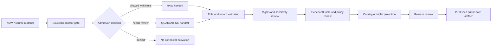

<!-- [KFM_META_BLOCK_V2]
doc_id: kfm://doc/connectors-kansas-kdwp-readme
title: connectors/kansas/kdwp/ — KDWP Connector Lane
type: readme
version: v0.1
status: draft
owners: OWNER_TBD — Connector steward · Kansas source steward · Fauna steward · Flora steward · Habitat steward · Rights reviewer · Sensitivity reviewer · Validation steward · Docs steward
created: 2026-06-19
updated: 2026-06-19
policy_label: public-doctrine; kansas-family; regulatory-and-observation-source; sensitivity-gated; rights-gated; no-publication
proposed_path: connectors/kansas/kdwp/README.md
truth_posture: CONFIRMED path exists / PROPOSED connector-lane contract / IMPLEMENTATION DEPTH NEEDS VERIFICATION
related:
  - ../README.md
  - ../../README.md
  - ../../../docs/sources/catalog/kansas/kdwp.md
  - ../../../docs/sources/catalog/kansas/kbs.md
  - ../../../docs/sources/catalog/kansas/ku-nhm.md
  - ../../../docs/sources/catalog/kansas/fhsu-sternberg.md
  - ../../../docs/domains/fauna/README.md
  - ../../../docs/domains/flora/README.md
  - ../../../docs/domains/habitat/README.md
  - ../../../docs/sources/SOURCE_DESCRIPTOR_STANDARD.md
  - ../../../docs/standards/SENSITIVITY_RUBRIC.md
  - ../../../data/registry/sources/
  - ../../../data/raw/fauna/
  - ../../../data/quarantine/fauna/
  - ../../../data/raw/flora/
  - ../../../data/quarantine/flora/
  - ../../../fixtures/
  - ../../../schemas/contracts/v1/source/
  - ../../../schemas/contracts/v1/biodiversity/
  - ../../../policy/sensitivity/
  - ../../../policy/rights/
  - ../../../release/
tags: [kfm, connectors, kansas, kdwp, wildlife, parks, sinc, fauna, flora, habitat, regulatory-source, observation-source, sensitivity, source-admission, raw, quarantine, governance]
notes:
  - "This README fills a previously blank KDWP connector README under the canonical Kansas connector family."
  - "The KDWP source page states that `connectors/kansas/kdwp/` was already the correct connector path under the canonical Kansas lane."
  - "KDWP material has at least two roles that must remain separate: KDWP-as-authority for Kansas regulatory/stewardship context and KDWP-as-observation for agency monitoring/survey records."
  - "KDWP SINC and listed-status context drive KFM sensitivity policy; connector code must fail closed before public-safe downstream use."
  - "Rights/current terms and stable access method remain NEEDS VERIFICATION before activation."
  - "Connector output may enter RAW or QUARANTINE handoff only; downstream validation, EvidenceBundle closure, policy review, catalog/triplet projection, release review, publication, correction, and rollback remain outside this folder."
[/KFM_META_BLOCK_V2] -->

<a id="top"></a>

# KDWP Connector Lane

> Source-admission lane for Kansas Department of Wildlife and Parks material. This folder is **not** a public wildlife map, advisory surface, regulatory decision engine, sensitivity-policy authority, release path, or publication surface.

<p>
  
  
  
  
  
</p>

> [!IMPORTANT]
> **Status:** `experimental` KDWP connector README · **Owner:** `OWNER_TBD`  
> **Path:** `connectors/kansas/kdwp/README.md`  
> **Truth posture:** `CONFIRMED` file exists · `PROPOSED` connector-lane contract · `NEEDS VERIFICATION` implementation depth  
> **Boundary:** source admission only; no public release, no source-role collapse, no bypass of rights or sensitivity gates.

**Quick jumps:** [Scope](#scope) · [Repo fit](#repo-fit) · [Accepted inputs](#accepted-inputs) · [Exclusions](#exclusions) · [Evidence ledger](#evidence-ledger) · [Lifecycle diagram](#lifecycle-diagram) · [Admission posture](#admission-posture) · [Anti-collapse rules](#anti-collapse-rules) · [Validation](#validation) · [Rollback](#rollback) · [Verification backlog](#verification-backlog)

---

## Scope

`connectors/kansas/kdwp/` is the connector lane for KDWP source-admission work under the canonical Kansas connector family.

It may document KDWP-specific source-admission adapters, fixture rules, parser expectations, role-separation rules, rights checks, sensitivity checks, provenance preservation, and RAW/QUARANTINE handoff boundaries.

It must not become regulatory truth, public occurrence truth, source descriptor authority, schema authority, policy authority, catalog/triplet authority, proof authority, release authority, pipeline authority, or publication authority.

[Back to top ↑](#top)

---

## Repo fit

| Surface | Role | Status |
|---|---|---:|
| `connectors/kansas/kdwp/` | KDWP connector lane under canonical Kansas source family. | **CONFIRMED path / NEEDS VERIFICATION implementation depth** |
| `connectors/kansas/` | Canonical Kansas connector-family lane. | **CONFIRMED** |
| `docs/sources/catalog/kansas/kdwp.md` | Human-facing KDWP source catalog profile. | **CONFIRMED** |
| `docs/domains/fauna/`, `docs/domains/flora/`, `docs/domains/habitat/` | Downstream domain consumers. | **CONFIRMED via source page** |
| `data/registry/sources/` | SourceDescriptor authority. | **Outside connector / NEEDS VERIFICATION for entries** |
| `data/raw/fauna/`, `data/raw/flora/` | Candidate RAW handoff targets. | **PROPOSED / NEEDS VERIFICATION** |
| `data/quarantine/fauna/`, `data/quarantine/flora/` | Candidate quarantine targets. | **PROPOSED / NEEDS VERIFICATION** |
| `policy/sensitivity/` and `policy/rights/` | Sensitivity and rights authority. | **Outside connector** |
| `release/` | Release and publication controls. | **Out of scope for this connector lane** |

> [!NOTE]
> The KDWP source profile states this connector path was already correct in v1: `connectors/kansas/kdwp/` sits under the canonical `connectors/kansas/` family lane. No path-correction item is needed for KDWP.

[Back to top ↑](#top)

---

## Accepted inputs

Accepted KDWP-lane content:

- connector README and navigation notes;
- KDWP source-shape fixture rules;
- parser expectations for regulatory/stewardship records and agency observation records;
- SourceDescriptor-gate notes;
- role-preservation rules for KDWP-as-authority and KDWP-as-observation;
- validation notes for taxon identity, status/rank fields, observation/event fields, geometry, date/vintage, source URI, rights, sensitivity, and provenance;
- quarantine criteria for unresolved rights, source role, taxon identity, status/rank meaning, geometry, sensitivity, date, or source-shape issues.

---

## Exclusions

This folder must not contain or imply authority over:

- public release decisions;
- public occurrence/range/status products;
- legal determinations outside the reviewed source descriptor and downstream policy flow;
- sensitivity-policy definitions;
- direct writes to `PROCESSED`, `CATALOG`, `TRIPLET`, `PUBLISHED`, proof, receipt, or release stores;
- SourceDescriptor authority records;
- policy or schema authority;
- generated summaries presented as authoritative wildlife or conservation truth;
- source activation without rights, sensitivity, source-role, taxonomy, geometry, freshness, and review checks.

[Back to top ↑](#top)

---

## Evidence ledger

| Source | Status | Supports | Limits |
|---|---:|---|---|
| `connectors/kansas/kdwp/README.md` | **CONFIRMED** | Target file exists and was blank before this update. | Does not prove code, fixtures, tests, or CI. |
| `connectors/kansas/README.md` | **CONFIRMED** | Kansas connector family is the canonical source-admission lane for Kansas source products. | Does not prove child implementation. |
| `docs/sources/catalog/kansas/kdwp.md` | **CONFIRMED** | KDWP is a Kansas-first authority; KDWP SINC/listed-status context drives KFM sensitivity; KDWP path under `connectors/kansas/kdwp/` is already correct. | Does not prove current access method, rights terms, or connector activation. |
| KDWP connector child files | **NEEDS VERIFICATION** | This README provides proposed boundaries. | Parser files, fixtures, tests, and workflows remain unverified. |

---

## Lifecycle diagram



[Back to top ↑](#top)

---

## Admission posture

Expected behavior for KDWP connector work:

- no live source access unless explicitly enabled and reviewed;
- no source fetch without an accepted SourceDescriptor and activation decision;
- no implicit publication from retrieved source material;
- no collapse of KDWP regulatory/stewardship context with KDWP observation records;
- no upgrade of observation records into regulatory authority, and no downgrade of regulatory fields into casual observations;
- no loss of source ID, source URI, status/rank field, taxon fields, event/observation fields, geometry/uncertainty, date/vintage, license/rights, source role, sensitivity, review, or release-class metadata;
- unclear rights, source role, taxon identity, status/rank meaning, geometry, date, sensitivity, freshness, or schema drift routes to quarantine or abstention.

---

## Anti-collapse rules

The KDWP source profile identifies the controlling anti-collapse stack:

1. KDWP-as-authority and KDWP-as-observation are distinct roles and must stay separate.
2. KDWP stewardship and listed-status context can inform sensitivity and regulatory context only through reviewed descriptors and downstream policy gates.
3. KDWP observation records are not automatically public occurrence, range, habitat, or status truth.
4. Rights and current terms must be verified before activation.
5. Restricted-source or sensitive-status context fails closed until redaction/generalization/release rules are satisfied.
6. Derived summaries, maps, tiles, joins, and AI explanations are downstream carriers, not sovereign truth.

---

## Validation

KDWP-lane validation should check that:

- source metadata is preserved;
- SourceDescriptor references are required for activation;
- source role is explicit and not inferred from convenience;
- taxon identity, status/rank fields, observation/event fields, geometry/uncertainty, date/vintage, source URI, license/rights, sensitivity, review, and release-class metadata are explicit where available;
- malformed or incomplete records fail closed;
- records with unclear geometry, missing rights, unresolved source role, unresolved taxon, unresolved status/rank meaning, or unresolved sensitivity route to quarantine;
- KDWP records remain source-admission candidates until downstream validation;
- no connector run writes directly to processed, catalog, triplet, published, proof, receipt, or release stores;
- fixture data is synthetic, minimized, redacted, generalized, or approved for committed use.

Root-level validation, policy-as-code, EvidenceBundle closure, release review, public caveats, and rollback remain outside this KDWP lane.

[Back to top ↑](#top)

---

## Definition of done

This KDWP connector README is ready for first review when:

- [ ] KDWP source catalog profile is linked and current enough for review.
- [ ] SourceDescriptor home and KDWP source IDs are verified.
- [ ] Current access method, package formats, cadence, and source terms are verified by source steward review.
- [ ] Live source access is disabled by default for connector code.
- [ ] Role separation, rights, taxonomy, geometry, sensitivity, freshness, and anti-collapse checks are represented in tests.
- [ ] Connector output is limited to RAW or QUARANTINE handoff.
- [ ] No public wildlife, status, range, or advisory claims are created by connector code.

---

## Rollback

Rollback is required if this README is used to justify direct publication, source activation, source-role collapse, policy bypass, regulatory truth claims outside the governed descriptor/policy flow, public occurrence release, or bypass of `SourceDescriptor`, rights, sensitivity, validation, review, release, or rollback gates.

Rollback target:

```text
commit prior to this update: SHA_TBD_AFTER_GIT_HISTORY_CHECK
```

Because the file was blank before this update, a safe rollback is to restore the blank placeholder or replace this document with a shorter compatibility-only README until KDWP implementation and tests are verified.

---

## Verification backlog

| Item | Status | Needed evidence |
|---|---:|---|
| Confirm actual KDWP connector files below this path. | **NEEDS VERIFICATION** | Repo tree or mounted workspace. |
| Confirm SourceDescriptor home and KDWP source IDs. | **NEEDS VERIFICATION** | Source registry entries and accepted schemas. |
| Confirm current access method, package formats, cadence, and source terms. | **NEEDS VERIFICATION** | Source steward review and current source documentation. |
| Confirm role separation between KDWP authority records and observations. | **NEEDS VERIFICATION** | SourceDescriptor entries, parser tests, and fixtures. |
| Confirm status/rank, taxon, geometry, freshness, and sensitivity validation. | **NEEDS VERIFICATION** | Parser tests and validation report. |
| Confirm rights handling and fixture safety. | **NEEDS VERIFICATION** | Rights review, fixture registry, and tests. |
| Confirm CI wiring and passing status. | **NEEDS VERIFICATION** | Workflow files and test logs. |

---

## Maintainer note

Keep this lane narrow. KDWP can be a controlling Kansas source for regulatory/stewardship context only through governed descriptors, rights checks, sensitivity checks, validation, policy review, release review, and rollback controls. Connector code should admit and preserve source material, not decide public truth.

[Back to top ↑](#top)
