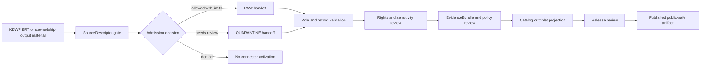

<!-- [KFM_META_BLOCK_V2]
doc_id: kfm://doc/connectors-kansas-kdwp-ert-readme
title: connectors/kansas/kdwp_ert/ — KDWP Ecological Review Tool Connector Lane
type: readme
version: v0.1
status: draft
owners: OWNER_TBD — Connector steward · Kansas source steward · Fauna steward · Flora steward · Habitat steward · Rights reviewer · Sensitivity reviewer · Validation steward · Docs steward
created: 2026-06-19
updated: 2026-06-19
policy_label: public-doctrine; kansas-family; stewardship-output; regulatory-administrative-source; rights-gated; sensitivity-gated; no-publication
proposed_path: connectors/kansas/kdwp_ert/README.md
truth_posture: CONFIRMED path exists / PROPOSED ERT-lane contract / PLACEMENT AND IMPLEMENTATION DEPTH NEEDS VERIFICATION
related:
  - ../README.md
  - ../kdwp/README.md
  - ../../README.md
  - ../../../docs/sources/catalog/kansas/kdwp.md
  - ../../../docs/domains/flora/SOURCES.md
  - ../../../docs/domains/flora/SOURCE_FAMILIES.md
  - ../../../docs/domains/flora/README.md
  - ../../../docs/domains/fauna/README.md
  - ../../../docs/domains/habitat/README.md
  - ../../../docs/sources/SOURCE_DESCRIPTOR_STANDARD.md
  - ../../../docs/standards/SENSITIVITY_RUBRIC.md
  - ../../../data/registry/sources/
  - ../../../data/raw/flora/
  - ../../../data/quarantine/flora/
  - ../../../data/raw/fauna/
  - ../../../data/quarantine/fauna/
  - ../../../fixtures/
  - ../../../schemas/contracts/v1/source/
  - ../../../schemas/contracts/v1/biodiversity/
  - ../../../policy/sensitivity/
  - ../../../policy/rights/
  - ../../../release/
tags: [kfm, connectors, kansas, kdwp, kdwp-ert, ecological-review-tool, flora, fauna, habitat, stewardship-output, regulatory-source, administrative-source, source-admission, raw, quarantine, governance]
notes:
  - "This README fills a previously blank KDWP ERT connector README under the canonical Kansas connector family."
  - "The parent KDWP source page confirms KDWP-as-authority and KDWP-as-observation must remain distinct roles."
  - "The Flora source registry names KDWP Ecological Review Tool / stewardship outputs as administrative/regulatory source material with rights and sensitivity gates."
  - "This requested `kdwp_ert/` sublane is marked PLACEMENT NEEDS VERIFICATION until repo convention confirms whether ERT should live under `kdwp/`, as its own sibling sublane, or as a product sublane."
  - "Connector output may enter RAW or QUARANTINE handoff only; downstream validation, EvidenceBundle closure, policy review, catalog/triplet projection, release review, publication, correction, and rollback remain outside this folder."
  - "Implementation files, source activation, SourceDescriptor records, fixtures, tests, CI wiring, access method, cadence, and public-release classes remain NEEDS VERIFICATION."
[/KFM_META_BLOCK_V2] -->

<a id="top"></a>

# KDWP Ecological Review Tool Connector Lane

> Source-admission lane for KDWP Ecological Review Tool / stewardship-output material. This folder is **not** a public review service, regulatory decision engine, sensitivity-policy authority, release path, or publication surface.

<p>
  
  
  
  
  
</p>

> [!IMPORTANT]
> **Status:** `experimental` KDWP ERT connector README · **Owner:** `OWNER_TBD`  
> **Path:** `connectors/kansas/kdwp_ert/README.md`  
> **Truth posture:** `CONFIRMED` file exists · `PROPOSED` ERT-lane contract · `NEEDS VERIFICATION` placement and implementation depth  
> **Boundary:** source admission only; no public release, no source-role collapse, no bypass of rights or sensitivity gates.

**Quick jumps:** [Scope](#scope) · [Repo fit](#repo-fit) · [Accepted inputs](#accepted-inputs) · [Exclusions](#exclusions) · [Evidence ledger](#evidence-ledger) · [Lifecycle diagram](#lifecycle-diagram) · [Admission posture](#admission-posture) · [Anti-collapse rules](#anti-collapse-rules) · [Validation](#validation) · [Rollback](#rollback) · [Verification backlog](#verification-backlog)

---

## Scope

`connectors/kansas/kdwp_ert/` is a proposed sublane for KDWP Ecological Review Tool / stewardship-output source-admission work.

It may document ERT-specific source-admission adapters, fixture rules, parser expectations, role-separation rules, rights checks, sensitivity checks, provenance preservation, and RAW/QUARANTINE handoff boundaries.

It must not become a public review service, regulatory truth engine, public occurrence truth, source descriptor authority, schema authority, policy authority, catalog/triplet authority, proof authority, release authority, pipeline authority, or publication authority.

[Back to top ↑](#top)

---

## Repo fit

| Surface | Role | Status |
|---|---|---:|
| `connectors/kansas/kdwp_ert/` | Requested KDWP ERT connector sublane. | **CONFIRMED path / PLACEMENT NEEDS VERIFICATION** |
| `connectors/kansas/kdwp/` | Parent KDWP connector lane. | **CONFIRMED README path / NEEDS VERIFICATION implementation depth** |
| `connectors/kansas/` | Canonical Kansas connector-family lane. | **CONFIRMED** |
| `docs/sources/catalog/kansas/kdwp.md` | Human-facing KDWP source catalog profile. | **CONFIRMED** |
| `docs/domains/flora/SOURCES.md` | Flora source registry naming KDWP ERT / stewardship outputs. | **CONFIRMED** |
| `data/registry/sources/` | SourceDescriptor authority. | **Outside connector / NEEDS VERIFICATION for entries** |
| `data/raw/flora/`, `data/raw/fauna/` | Candidate RAW handoff targets. | **PROPOSED / NEEDS VERIFICATION** |
| `data/quarantine/flora/`, `data/quarantine/fauna/` | Candidate quarantine targets. | **PROPOSED / NEEDS VERIFICATION** |
| `policy/sensitivity/` and `policy/rights/` | Sensitivity and rights authority. | **Outside connector** |
| `release/` | Release and publication controls. | **Out of scope for this connector lane** |

> [!NOTE]
> The broader KDWP connector path is confirmed by the KDWP source profile. This ERT-specific path is narrower and still needs a placement decision: sibling of `kdwp/`, child of `kdwp/`, or retained compatibility sublane.

[Back to top ↑](#top)

---

## Accepted inputs

Accepted KDWP ERT-lane content:

- connector README and navigation notes;
- ERT or stewardship-output fixture rules;
- parser expectations for regulatory, administrative, and review-output records;
- SourceDescriptor-gate notes;
- role-preservation rules for regulatory/admin source material;
- validation notes for taxon identity, status/rank fields, review context, geometry, date/vintage, source URI, rights, sensitivity, and provenance;
- quarantine criteria for unresolved rights, source role, taxon identity, status/rank meaning, geometry, sensitivity, date, or source-shape issues.

---

## Exclusions

This folder must not contain or imply authority over:

- public review decisions;
- public occurrence/range/status products;
- legal determinations outside the reviewed source descriptor and downstream policy flow;
- sensitivity-policy definitions;
- direct writes to `PROCESSED`, `CATALOG`, `TRIPLET`, `PUBLISHED`, proof, receipt, or release stores;
- SourceDescriptor authority records;
- policy or schema authority;
- generated summaries presented as authoritative wildlife, flora, habitat, or regulatory truth;
- source activation without rights, sensitivity, source-role, taxonomy, geometry, freshness, and review checks.

[Back to top ↑](#top)

---

## Evidence ledger

| Source | Status | Supports | Limits |
|---|---:|---|---|
| `connectors/kansas/kdwp_ert/README.md` | **CONFIRMED** | Target file exists and was blank before this update. | Does not prove code, fixtures, tests, or CI. |
| `connectors/kansas/kdwp/README.md` | **CONFIRMED** | Parent KDWP connector README preserves role split and source-admission-only boundary. | Does not prove ERT implementation or placement. |
| `docs/sources/catalog/kansas/kdwp.md` | **CONFIRMED** | KDWP is a Kansas-first authority; KDWP SINC/listed-status context drives KFM sensitivity; `connectors/kansas/kdwp/` is the correct KDWP family path. | Does not prove current ERT access method, rights terms, or connector activation. |
| `docs/domains/flora/SOURCES.md` | **CONFIRMED** | Names KDWP Ecological Review Tool / stewardship outputs as administrative/regulatory source material with rights and sensitivity gates. | Does not prove a connector exists or source is activated. |
| KDWP ERT connector child files | **NEEDS VERIFICATION** | This README provides proposed boundaries. | Parser files, fixtures, tests, and workflows remain unverified. |

---

## Lifecycle diagram



[Back to top ↑](#top)

---

## Admission posture

Expected behavior for KDWP ERT connector work:

- no live source access unless explicitly enabled and reviewed;
- no source fetch without an accepted SourceDescriptor and activation decision;
- no implicit publication from retrieved source material;
- no collapse of regulatory/admin review-output context with field observations;
- no conversion of review output into public occurrence, range, habitat, or status truth without downstream review;
- no loss of source ID, source URI, review context, status/rank field, taxon fields, geometry/uncertainty, date/vintage, license/rights, source role, sensitivity, review, or release-class metadata;
- unclear rights, source role, taxon identity, status/rank meaning, geometry, date, sensitivity, freshness, or schema drift routes to quarantine or abstention.

---

## Anti-collapse rules

The KDWP and Flora source docs identify the controlling anti-collapse stack:

1. KDWP ERT / stewardship outputs are regulatory/administrative source material, not public release decisions by themselves.
2. ERT-style material must not be merged with KDWP observation records without role-preserving descriptors.
3. Stewardship output may inform downstream review only through rights, sensitivity, validation, and release gates.
4. Rights and current terms must be verified before activation.
5. Restricted or sensitive-source context fails closed until approved redaction/generalization/release rules are satisfied.
6. Derived summaries, maps, tiles, joins, and AI explanations are downstream carriers, not sovereign truth.

---

## Validation

KDWP ERT-lane validation should check that:

- source metadata is preserved;
- SourceDescriptor references are required for activation;
- source role is explicit and not inferred from convenience;
- taxon identity, status/rank fields, review context, geometry/uncertainty, date/vintage, source URI, license/rights, sensitivity, review, and release-class metadata are explicit where available;
- malformed or incomplete records fail closed;
- records with unclear geometry, missing rights, unresolved source role, unresolved taxon, unresolved status/rank meaning, or unresolved sensitivity route to quarantine;
- ERT records remain source-admission candidates until downstream validation;
- no connector run writes directly to processed, catalog, triplet, published, proof, receipt, or release stores;
- fixture data is synthetic, minimized, redacted, generalized, or approved for committed use.

Root-level validation, policy-as-code, EvidenceBundle closure, release review, public caveats, and rollback remain outside this KDWP ERT lane.

[Back to top ↑](#top)

---

## Definition of done

This KDWP ERT connector README is ready for first review when:

- [ ] KDWP source catalog profile and Flora source registry are linked and current enough for review.
- [ ] Placement decision is made for `kdwp_ert/` versus `kdwp/ert/` or another ratified convention.
- [ ] SourceDescriptor home and KDWP ERT source IDs are verified.
- [ ] Current access method, package formats, cadence, and source terms are verified by source steward review.
- [ ] Live source access is disabled by default for connector code.
- [ ] Role separation, rights, taxonomy, geometry, sensitivity, freshness, and anti-collapse checks are represented in tests.
- [ ] Connector output is limited to RAW or QUARANTINE handoff.
- [ ] No public review, wildlife, flora, status, range, or advisory claims are created by connector code.

---

## Rollback

Rollback is required if this README is used to justify direct publication, source activation, source-role collapse, policy bypass, regulatory truth claims outside the governed descriptor/policy flow, public occurrence release, or bypass of `SourceDescriptor`, rights, sensitivity, validation, review, release, or rollback gates.

Rollback target:

```text
commit prior to this update: SHA_TBD_AFTER_GIT_HISTORY_CHECK
```

Because the file was blank before this update, a safe rollback is to restore the blank placeholder or replace this document with a shorter compatibility-only README until KDWP ERT placement, implementation, and tests are verified.

---

## Verification backlog

| Item | Status | Needed evidence |
|---|---:|---|
| Confirm actual KDWP ERT connector files below this path. | **NEEDS VERIFICATION** | Repo tree or mounted workspace. |
| Confirm canonical child path for ERT material. | **NEEDS VERIFICATION** | Directory Rules, ADR, migration note, or repo convention. |
| Confirm SourceDescriptor home and KDWP ERT source IDs. | **NEEDS VERIFICATION** | Source registry entries and accepted schemas. |
| Confirm current access method, package formats, cadence, and source terms. | **NEEDS VERIFICATION** | Source steward review and current source documentation. |
| Confirm role separation between ERT outputs and KDWP observations. | **NEEDS VERIFICATION** | SourceDescriptor entries, parser tests, and fixtures. |
| Confirm status/rank, taxon, geometry, freshness, and sensitivity validation. | **NEEDS VERIFICATION** | Parser tests and validation report. |
| Confirm rights handling and fixture safety. | **NEEDS VERIFICATION** | Rights review, fixture registry, and tests. |
| Confirm CI wiring and passing status. | **NEEDS VERIFICATION** | Workflow files and test logs. |

---

## Maintainer note

Keep this lane narrow. ERT-style material may be important regulatory/admin context, but connector code should admit and preserve source material only. Public meaning, policy enforcement, release approval, correction, and rollback live outside this folder.

[Back to top ↑](#top)
