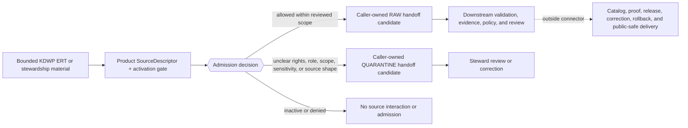

<!-- [KFM_META_BLOCK_V2]
doc_id: kfm://doc/connectors-kansas-kdwp-ert-readme
title: connectors/kansas/kdwp_ert/ — KDWP Ecological Review Tool Admission Lane
type: readme
version: v0.2
status: draft
owners: OWNER_TBD — Connector steward · Kansas source steward · Fauna steward · Flora steward · Habitat steward · Rights reviewer · Sensitivity reviewer · Validation steward · Docs steward
created: 2026-06-19
updated: 2026-07-12
policy_label: public-doctrine; kansas-family; provisional-product-layout; bounded-review-output; rights-gated; sensitivity-gated; no-publication
current_path: connectors/kansas/kdwp_ert/README.md
truth_posture: CONFIRMED current path and inspected repository evidence / CONFLICTED product placement and SourceDescriptor role authority / PROPOSED ERT admission contract / UNKNOWN runtime and source-access depth
evidence_snapshot:
  repository: bartytime4life/Kansas-Frontier-Matrix
  base_ref: main
  base_commit: d548dc3ee156d837ea595780b703eef398fa52ac
  prior_blob: 16ef4aa59d2baccd1d53be69508d213bebb7138b
related:
  - ../README.md
  - ../kdwp/README.md
  - ../kdwp_flora/README.md
  - ../../README.md
  - ../../kdwp/README.md
  - ../../kdwp_ert/README.md
  - ../../../CONTRIBUTING.md
  - ../../../.github/CODEOWNERS
  - ../../../docs/doctrine/directory-rules.md
  - ../../../docs/sources/catalog/kansas/kdwp.md
  - ../../../docs/sources/SOURCE_DESCRIPTOR_STANDARD.md
  - ../../../docs/domains/flora/SOURCES.md
  - ../../../docs/domains/fauna/SOURCES.md
  - ../../../docs/domains/habitat/README.md
  - ../../../contracts/source/source_descriptor.md
  - ../../../schemas/contracts/v1/source/source_descriptor.schema.json
  - ../../../schemas/contracts/v1/sources/source_descriptor.schema.json
  - ../../../data/registry/sources/README.md
  - ../../../control_plane/source_authority_register.yaml
  - ../../../policy/rights/
  - ../../../policy/sensitivity/
  - ../../../release/
tags: [kfm, connectors, kansas, kdwp, kdwp-ert, ecological-review-tool, stewardship-output, bounded-review, fauna, flora, habitat, source-admission, rights, sensitivity, raw, quarantine, governance]
notes:
  - "The current sibling path is verified under the Kansas connector family; this revision retains it without deciding whether ERT should remain a sibling, become a child of `kdwp/`, or be represented only by a compatibility redirect."
  - "The historical statement that this README was blank is removed. The current base commit and prior blob are the rollback target."
  - "ERT or stewardship outputs are bounded review evidence. Preserve request scope, review status, inputs, output version, expiry, and limitations; do not reinterpret them as legal clearance, reusable site truth, a public occurrence layer, or a KFM release decision."
  - "SourceDescriptor authority is conflicted: doctrine, domain source docs, the populated singular-path schema, and the empty plural-path scaffold do not provide one accepted role vocabulary or schema home."
  - "Only this Markdown file is in scope. No connector code, descriptor, fixture, policy, schema, workflow, receipt, release object, source activation, path move, or public artifact is created."
[/KFM_META_BLOCK_V2] -->

# KDWP Ecological Review Tool Admission Lane

> [!IMPORTANT]
> **Document lifecycle:** `draft`  
> **Component maturity:** documentation contract; connector runtime `UNKNOWN`  
> **Owner:** `OWNER_TBD`  
> **Truth posture:** `CONFIRMED` current path and inspected repository evidence · `CONFLICTED` product placement and `SourceDescriptor` role authority · `PROPOSED` ERT admission contract  
> **Boundary:** admission of bounded Kansas Department of Wildlife and Parks Ecological Review Tool or stewardship-output material only. This folder does not activate a source, operate a public review service, grant legal clearance, decide sensitivity, publish a map, or authorize release.

**Quick links:** [Purpose](#purpose) · [Authority level](#authority-level) · [Status](#status) · [What belongs here](#what-belongs-here) · [What does not belong here](#what-does-not-belong-here) · [Inputs](#inputs) · [Outputs](#outputs) · [Validation](#validation) · [Review burden](#review-burden) · [Related folders](#related-folders) · [ADRs](#adrs) · [Last reviewed](#last-reviewed) · [Evidence basis](#evidence-basis) · [ERT meaning boundaries](#ert-record-and-meaning-boundaries) · [Descriptor conflict](#sourcedescriptor-authority-conflict) · [Lifecycle](#lifecycle-boundary) · [Anti-collapse](#anti-collapse-and-sensitive-data-rules) · [Definition of done](#definition-of-done) · [Rollback](#rollback) · [Verification backlog](#verification-backlog)

---

## Purpose

`connectors/kansas/kdwp_ert/` is the current documentation lane for proposed source-admission work involving KDWP Ecological Review Tool or related stewardship-review outputs.

An implementation in this lane may retrieve or parse an explicitly admitted product, preserve source-native request and result context, record provenance and source-head evidence, and prepare a caller-owned `RAW` or `QUARANTINE` handoff. It may do so only after the exact product has an accepted `SourceDescriptor`, activation decision, rights review, sensitivity review, and supported access method.

The connector does not make the review output true, current, legally sufficient, reusable for another site, or safe to publish. It preserves enough source identity, scope, role, time, rights, sensitivity, limitations, and provenance for downstream KFM controls to decide what the material can support.

[Back to top](#top)

---

## Authority level

**Implementation-bearing connector location, with a confirmed responsibility root and unresolved product placement.**

| Concern | Status | Evidence-bounded determination |
|---|---:|---|
| Responsibility root | **CONFIRMED** | Source-specific fetch and admission belong under `connectors/`; connector output is bounded to caller-owned `RAW` or `QUARANTINE` handoff plus process-memory receipt candidates. |
| Kansas family placement | **CONFIRMED** | KDWP work belongs under `connectors/kansas/`; the KDWP source catalog records `connectors/kansas/kdwp/` as the correct institutional family lane. |
| Current ERT sibling path | **CONFIRMED** | `connectors/kansas/kdwp_ert/README.md` exists at the pinned base and remains the requested target. |
| Final ERT product home | **CONFLICTED / NEEDS VERIFICATION** | The repository contains this sibling lane, the parent `connectors/kansas/kdwp/` lane, and a noncanonical top-level `connectors/kdwp_ert/` compatibility lane. No accepted path-specific ADR was verified. |
| Common implementation files below this path | **CONFIRMED (exact paths absent)** | Direct probes found no `pyproject.toml`, `src/README.md`, or `tests/README.md` below this folder. This does not prove no differently named or unindexed implementation exists. |
| Connector runtime and source access | **UNKNOWN** | No client, parser, fixture execution, connector run, source endpoint, emitted receipt, or runtime log was verified for this lane. |
| Source identity and activation | **OUTSIDE THIS FOLDER** | Product descriptors and activation state belong in registry and control-plane surfaces. |
| Policy and publication authority | **NONE** | Rights, sensitivity, redaction, proof closure, release, correction, withdrawal, and rollback are owned outside the connector. |

This revision documents the current path and conflicts. It does not ratify the sibling layout, migrate the compatibility path, or create an operational ERT service.

[Back to top](#top)

---

## Status

| Item | Status | Meaning |
|---|---:|---|
| This README | **DRAFT** | Reviewable folder contract; not source activation or KFM publication. |
| Current path | **CONFIRMED** | The requested README exists in the current repository snapshot. |
| ERT product definition | **NEEDS VERIFICATION** | Project docs consistently describe a bounded review or stewardship-output family, but current official product documentation, fields, access, terms, and cadence were not accepted here. |
| Live source access | **DISABLED / NEEDS VERIFICATION** | No source may be contacted merely because this folder exists. |
| Product-level `SourceDescriptor` | **NOT VERIFIED** | No accepted ERT descriptor or machine source-authority entry was verified. |
| `SourceDescriptor` schema and role vocabulary | **CONFLICTED** | The populated singular-path schema self-identifies as legacy; the plural-path schema is an empty scaffold; narrative sources use differing role descriptions. |
| Rights and redistribution | **NEEDS VERIFICATION** | Unknown rights, terms, attribution, redistribution, or account requirements fail closed. |
| Sensitive-location posture | **DENY BY DEFAULT** | No exact rare-species, rare-plant, private-project, cultural, or sensitive-facility location becomes public through this connector. |
| Owner assignment | **UNKNOWN** | The inspected CODEOWNERS file provides only the repository-wide fallback for this path. |
| Public review or release service | **NONE** | This README creates neither an operational review service nor a public product. |

[Back to top](#top)

---

## What belongs here

Subject to an accepted product placement and product-level governance, this lane may contain:

- README-level product navigation and migration notes;
- opt-in source clients that remain inactive without an accepted descriptor and activation decision;
- parsers for verified source-native formats;
- source-head probes using a supported version, checksum, `ETag`, `Last-Modified`, release identifier, or documented manual snapshot;
- preservation of a source-native request, review, result, or package identifier when the source provides one;
- preservation of bounded request scope, review status, source inputs, output version, expiry, limitations, correction, withdrawal, or supersession context when present;
- explicit separation of review-tool output from KDWP observations, listed-status determinations, range products, habitat layers, and model outputs;
- preservation of taxon or natural-community references without silently choosing a taxonomy authority;
- geometry, precision, coordinate uncertainty, withholding state, and original-versus-public geometry intent;
- source, observed, valid or effective, retrieval, review, expiry, correction, and withdrawal time where material;
- caller-owned `RAW` or `QUARANTINE` handoff builders;
- process-memory retrieval, probe, denial, no-op, admission, or handoff receipt candidates when an accepted receipt contract exists;
- references to small synthetic, minimized, redacted, generalized, or rights-reviewed no-network fixtures in the repository's accepted fixture and test home;
- migration-only compatibility adapters whose purpose and sunset path are explicit.

No item in this list is evidence that the corresponding implementation already exists.

[Back to top](#top)

---

## What does not belong here

This folder must not own or imply authority over:

- an operational public Ecological Review Tool or public review workflow;
- a legal clearance or release decision created by KFM;
- a reusable site-level truth claim detached from the bounded request and source-issued limitations;
- an all-purpose descriptor for KDWP as an institution;
- source activation or product admission decisions;
- `SourceDescriptor` instances or source-authority registry entries;
- canonical object contracts, machine schemas, or source-role vocabulary decisions;
- rights, sensitivity, redaction, access, or public-precision policy;
- taxonomic-backbone or conservation-status tie-breaker decisions;
- field observations, public occurrence points, public range truth, or certain habitat occupancy inferred from a review result;
- public exact locations for sensitive taxa, nests, dens, roosts, hibernacula, spawning sites, rare plants, natural communities, sacred places, private properties, review requests, or sensitive facilities;
- requester contact details, credentials, tokens, cookies, private URLs, private correspondence, or unreviewed source payloads;
- emergency, hunting, fishing, closure, or life-safety advisory authority;
- direct writes to `WORK`, `PROCESSED`, `CATALOG`, `TRIPLET`, `PUBLISHED`, proof, or release stores;
- `EvidenceBundle`, proof-pack, catalog, release-manifest, correction, withdrawal, or rollback authority;
- public APIs, map layers, tiles, summaries, dashboards, or AI answers;
- independent evolution of `connectors/kdwp_ert/` or another compatibility path as a second canonical implementation;
- generated language presented as regulatory, ecological, occurrence, habitat, sensitivity, or release truth.

A retrieved review file is not an admitted source. An admitted source is not validated evidence. Validated evidence is not legal clearance or a released public claim.

[Back to top](#top)

---

## Inputs

A connector operation requires product-specific, reviewable inputs:

| Input | Required posture |
|---|---|
| Product identity | Identify the exact KDWP review or stewardship product and issuing program; do not use the agency name alone. |
| `SourceDescriptor` reference | Resolve to the accepted descriptor for the exact product and version. |
| Activation state | Explicitly allows the requested fixture-only, restricted, or live operation. |
| Access surface | Reviewed URL, file, archive, request workflow, or service definition; credentials supplied only through approved secret handling. |
| Bounded request scope | Preserve the source-defined scope and identifier when provided. Do not commit requester contact details or private project material as fixtures. |
| Review or result context | Preserve source-issued status, version, limitations, expiry, correction, withdrawal, or supersession context when present. |
| Input lineage | Preserve references to the source inputs or screening layers that the product exposes; do not imply KFM independently reproduced the review. |
| Rights state | Record current terms, attribution, redistribution, downstream-use, and access limits. Unknown rights fail closed. |
| Sensitivity state | Record dataset- and record-level sensitivity inputs, including exact-location, rare-taxon, private-land, cultural, or facility restrictions. |
| Source-role mapping | Map the product or record through the accepted machine vocabulary. Until authority is resolved, preserve human meaning and quarantine ambiguous mixed-role records. |
| Source head | Preserve upstream version, release date, checksum, `ETag`, `Last-Modified`, or another reproducible identity signal. |
| Temporal context | Preserve source, review, effective, expiry, retrieval, correction, withdrawal, and supersession time where applicable. |
| Caller-owned handoff | Supply explicit `RAW` and `QUARANTINE` sinks or envelope interfaces; no implicit filesystem destination. |

The exact field names, DTOs, and machine enums are **PROPOSED / NEEDS VERIFICATION**. The table records admission obligations, not a substitute schema.

[Back to top](#top)

---

## Outputs

Permitted connector outputs are narrow and caller-owned:

1. **A `RAW` handoff candidate** preserving the immutable or reproducibly referenced source payload, source head, product identity, bounded request or result context, retrieval time, checksum, descriptor reference, rights/sensitivity posture, and admission metadata.
2. **A `QUARANTINE` handoff candidate** with a structured reason when identity, role, rights, review status, source inputs, taxonomy, geometry, sensitivity, time, source shape, source head, or activation is unresolved.
3. **A process-memory receipt candidate** for retrieval, probe, denial, no-op, admission, or handoff behavior when the accepted receipt contract provides one.
4. **A deterministic operational failure** when the connector cannot safely produce one of the governed outcomes above.

The exact envelope, reason-code vocabulary, sink protocol, idempotency contract, receipt type, and retry semantics remain **PROPOSED / NEEDS VERIFICATION**. This README does not mint them.

The connector must not emit a processed domain record, public review result, legal clearance, `EvidenceBundle`, public geometry, catalog item, triplet, released layer, public answer, or publication decision.

[Back to top](#top)

---

## Validation

### Admission and record checks

Before implementation can be treated as active, tests and validators must cover at least:

- product-level descriptor resolution and explicit activation;
- no-network default behavior;
- source-head, payload, request, and result identity preservation;
- checksum or immutable-reference preservation;
- bounded request-to-result association without exposing private request material;
- review status, input lineage, output version, expiry, limitations, correction, withdrawal, and supersession preservation when provided;
- refusal to interpret a review result as KFM legal clearance, reusable site truth, occurrence truth, certain habitat occupancy, public sensitivity clearance, or release approval;
- source-role mapping without collapsing review output, observation, regulatory status, model, range, or habitat context;
- source, review, valid/effective, expiry, retrieval, correction, withdrawal, and supersession-time separation where applicable;
- taxon and natural-community identity preservation without silent authority resolution;
- geometry validity, precision, coordinate uncertainty, datum or CRS metadata, withholding state, and original-versus-public geometry separation;
- rights, attribution, redistribution, downstream-use, access, and terms-review state;
- rare-species, rare-plant, private-land, cultural-place, sensitive-facility, and exact-location negative cases;
- explicit quarantine for unknown rights, unresolved role, unresolved review status, missing limitations, unsafe geometry, stale source head, unrecognized source shape, or ambiguous mixed-role packages;
- proof that connector code cannot write beyond caller-owned `RAW` or `QUARANTINE` handoff and process-memory receipt candidates;
- fixture safety: no actual requester contact, private project record, credential, private URL, exact sensitive locality, or unclear-rights payload in the repository;
- refusal to treat the top-level compatibility path as an independent canonical implementation;
- success, quarantine or hold, denied or inactive, no-op, source-drift, stale, corrected or withdrawn, and operational-error paths as applicable to the accepted contract.

### `SourceDescriptor` authority gate

The current repository contains incompatible authority surfaces:

- the draft Source Descriptor Standard and Flora source docs use narrative roles such as `regulatory`, `administrative`, `modeled`, and `context` descriptions;
- the KDWP source catalog says ERT or stewardship output may be `context` or `model` depending on the output;
- the Flora source registry describes typical ERT roles as `administrative` and `regulatory`;
- the populated schema at `schemas/contracts/v1/source/source_descriptor.schema.json` declares the plural path canonical and itself legacy while using a different machine vocabulary;
- the nominal plural-path schema at `schemas/contracts/v1/sources/source_descriptor.schema.json` is an empty `PROPOSED` scaffold;
- the machine source-authority register currently has no entries.

> [!WARNING]
> Do not create or activate a KDWP ERT descriptor by copying a prose label into a machine record. Resolve schema-home and role-vocabulary authority through the governing contract and ADR process, then update descriptors, fixtures, validators, and this README together.

### Documentation checks for this file

Review should verify:

- one H1 and a coherent heading hierarchy;
- balanced KFM metadata, code fences, tables, callouts, and links;
- preserved `doc_id`, `created` date, stable prior anchors where practical, final newline, and prior-blob rollback target;
- no remote badge, tracking image, credential, private source URL, review record, private project material, sensitive locality, or rights-restricted payload;
- current-state claims remain bounded to the pinned repository evidence;
- the diff contains only `connectors/kansas/kdwp_ert/README.md`.

Repository-wide executable validation is not established by this README. The inspected `tools/validate_all.py` and pre-commit configuration are placeholders; trusted CI results must be reported by workflow and scope rather than generalized into runtime proof.

[Back to top](#top)

---

## Review burden

At minimum, substantive ERT connector, descriptor, activation, product-layout, or review-meaning work should involve:

- connector steward;
- Kansas source steward;
- Fauna steward for listed-status, animal-occurrence, mortality, disease, and sensitive-site material;
- Flora steward for rare-plant, listed-plant, and natural-community context;
- Habitat steward for habitat, natural-community, and stewardship layers;
- rights reviewer;
- sensitivity reviewer;
- validation or test steward;
- docs steward.

The inspected `.github/CODEOWNERS` file applies a repository-wide `@kfm/maintainers` fallback but does not assign a connector-specific or KDWP ERT-specific owner. Team existence, semantic ownership, and reviewer availability remain **NEEDS VERIFICATION**; this README does not invent usernames or request reviewers.

Additional governed review is required before:

- approving a live ERT product, endpoint, archive, or request workflow;
- accepting or changing rights, attribution, or redistribution posture;
- accepting a source-role machine mapping;
- changing sibling-versus-child placement or migrating a compatibility path;
- committing or exposing request geometry or review context;
- publishing any generalized ecological geometry derived from review material;
- treating a review output as support for a public claim;
- defining expiry, stale-state, correction, withdrawal, or supersession behavior;
- treating an ingest receipt as evidence closure or release proof.

[Back to top](#top)

---

## Related folders

| Surface | Relationship | Status in the pinned snapshot |
|---|---|---:|
| [`../README.md`](../README.md) | Kansas connector-family boundary and sublane rules. | **CONFIRMED file / child inventory stale** |
| [`../../README.md`](../../README.md) | Connector-root source-admission boundary. | **CONFIRMED file** |
| [`../kdwp/README.md`](../kdwp/README.md) | Parent KDWP source-family coordination lane. | **CONFIRMED file / current** |
| [`../kdwp_flora/README.md`](../kdwp_flora/README.md) | Flora/listed-species sibling lane. | **CONFIRMED file / placement unresolved** |
| [`../../kdwp/README.md`](../../kdwp/README.md) | Top-level KDWP compatibility package. | **CONFIRMED / NONCANONICAL** |
| [`../../kdwp_ert/README.md`](../../kdwp_ert/README.md) | Top-level ERT compatibility lane. | **CONFIRMED / NONCANONICAL** |
| [`../../../docs/sources/catalog/kansas/kdwp.md`](../../../docs/sources/catalog/kansas/kdwp.md) | Human-facing KDWP source-family and product doctrine. | **CONFIRMED file / draft** |
| [`../../../docs/domains/flora/SOURCES.md`](../../../docs/domains/flora/SOURCES.md) | Flora source-family and proposed role crosswalk. | **CONFIRMED file / draft** |
| [`../../../docs/sources/SOURCE_DESCRIPTOR_STANDARD.md`](../../../docs/sources/SOURCE_DESCRIPTOR_STANDARD.md) | Narrative descriptor doctrine. | **CONFIRMED file / draft** |
| [`../../../contracts/source/source_descriptor.md`](../../../contracts/source/source_descriptor.md) | SourceDescriptor semantic contract. | **CONFIRMED file / draft** |
| [`../../../schemas/contracts/v1/source/source_descriptor.schema.json`](../../../schemas/contracts/v1/source/source_descriptor.schema.json) | Populated schema at a self-declared legacy path. | **CONFIRMED file / authority CONFLICTED** |
| [`../../../schemas/contracts/v1/sources/source_descriptor.schema.json`](../../../schemas/contracts/v1/sources/source_descriptor.schema.json) | Nominal canonical-path schema scaffold. | **CONFIRMED file / not enforceable** |
| [`../../../data/registry/sources/README.md`](../../../data/registry/sources/README.md) | Source-registry responsibility boundary. | **CONFIRMED file / implementation claims partly proposed** |
| [`../../../control_plane/source_authority_register.yaml`](../../../control_plane/source_authority_register.yaml) | Machine source-authority register. | **CONFIRMED file / currently empty** |
| [`../../../policy/rights/`](../../../policy/rights/) | Rights decisions and enforcement. | **Outside connector / implementation depth NEEDS VERIFICATION** |
| [`../../../policy/sensitivity/`](../../../policy/sensitivity/) | Sensitivity and redaction policy. | **Outside connector / implementation depth NEEDS VERIFICATION** |
| [`../../../release/`](../../../release/) | Release, correction, withdrawal, and rollback decisions. | **Outside connector** |

[Back to top](#top)

---

## ADRs

- Directory Rules govern the `connectors/` responsibility root, the `RAW` or `QUARANTINE` output boundary, the required folder-README contract, and migration discipline.
- Repository documents repeatedly reference `ADR-0001` for schema-home authority, but the directly probed `docs/adr/ADR-0001-schema-home.md` path was not found. The populated singular schema, empty plural schema, and conflicting role descriptions leave the authority state **CONFLICTED / NEEDS VERIFICATION**.
- No accepted path-specific ADR was verified that resolves:
  - whether ERT work remains at `connectors/kansas/kdwp_ert/`;
  - whether it moves below `connectors/kansas/kdwp/`;
  - whether the top-level `connectors/kdwp_ert/` path remains a redirect, mirror, transitional package, or is removed;
  - which machine role vocabulary represents bounded ERT outputs;
  - which request, review, expiry, correction, and withdrawal fields are contractually required.
- This README update does not trigger an ADR by itself: it edits one existing Markdown file, does not move a path, create a parallel authority home, change an object contract, or alter a lifecycle boundary.
- Any later move must preserve history, references, fixtures, tests, descriptors, receipts, deprecation state, validation, and rollback under Directory Rules migration discipline.

[Back to top](#top)

---

## Last reviewed

| Field | Value |
|---|---|
| Review date | `2026-07-12` |
| Repository | `bartytime4life/Kansas-Frontier-Matrix` |
| Base ref | `main` |
| Pinned base commit | `d548dc3ee156d837ea595780b703eef398fa52ac` |
| Prior README blob | `16ef4aa59d2baccd1d53be69508d213bebb7138b` |
| README introduction commit | `154d1514c8111256aab1adfc5485daa2028619a0` |
| Review scope | Target README and introduction history; target-path implementation probes; connector root and Kansas-family READMEs; parent KDWP, Flora sibling, and top-level ERT compatibility READMEs; KDWP source catalog; Flora source registry; Directory Rules; Source Descriptor Standard, contract, and both schema paths; source-registry README; source-authority register; contribution guidance; CODEOWNERS; PR template; validation placeholders; branch and PR search |
| Reviewer identity | `OWNER_TBD` — no semantic owner assignment made by this document |

[Back to top](#top)

---

## Evidence basis

| Evidence | What it supports | What it does not prove |
|---|---|---|
| Target blob `16ef4aa59d2baccd1d53be69508d213bebb7138b` at the pinned base | Exact editing baseline, current path, stale historical language, and unresolved rollback placeholder. | Runtime, source activation, or product readiness. |
| Introduction commit `154d1514c8111256aab1adfc5485daa2028619a0` | The v0.1 README replaced a blank placeholder; “blank before this update” is historical residue. | That a blank file is now the appropriate rollback. |
| Directory Rules and connector-root README | Connector responsibility, source-admission boundary, `RAW` or `QUARANTINE` handoff, folder-README contract, and migration discipline. | Which ERT product is active or how it is fetched. |
| Parent KDWP README and source catalog | Parent family placement, product-specific identity, bounded-review semantics, role anti-collapse, sensitivity implications, and rights/cadence gaps. | Current official ERT fields, terms, endpoint, or source activation. |
| Flora `SOURCES.md` | ERT or stewardship output is rights-gated, sensitivity-gated, steward-controlled material that may carry sensitive locations. | An accepted machine role enum or current source access. |
| Exact target-path probes | Common package, source-layout, and test-layout paths named above were not found. | Complete recursive absence of differently named implementation. |
| Top-level ERT compatibility README | A noncanonical compatibility path exists and points toward the Kansas/KDWP family. | The final accepted child or sibling home. |
| Source Descriptor Standard, semantic contract, and both schema paths | Descriptor doctrine and machine-shape surfaces exist but disagree on path and role vocabulary. | One accepted schema authority or a valid ERT descriptor. |
| Empty source-authority register | No machine authority entry exists in that inspected register. | Absence from every differently named registry or control-plane file. |
| Contribution guidance, CODEOWNERS, PR template, pre-commit config, and validator placeholder | Review language, repository fallback ownership, PR fields, and current local validation limits. | Passing CI, branch protection, reviewer availability, or enforcement maturity. |

Absence claims are bounded to exact paths, indexed searches, and the pinned commit. This README does not assert a complete recursive repository inventory.

[Back to top](#top)

---

## ERT record and meaning boundaries

ERT or stewardship material is admitted by product and record meaning, not by the KDWP agency name alone.

| Product or record class | Human meaning to preserve | Admission posture | Must not become |
|---|---|---|---|
| Review request or bounded scope | The source-defined place, subject, request, and time to which the review applies. | Preserve source-native identity and scope; minimize or quarantine private requester and project details. | A public project registry, reusable site truth, or permission to expose exact geometry. |
| Review input references | Source-identified datasets, layers, taxa, communities, or criteria used by the review product. | Preserve input identity, version, and role when exposed; quarantine when lineage is missing. | Proof that KFM independently reproduced every input or a license to republish it. |
| Review result or status | A source-issued result for the bounded request, with its status, version, limitations, and review context. | Preserve wording and issuing program; keep expiry, correction, withdrawal, and supersession state visible. | Legal clearance, permit approval, KFM release approval, or certainty beyond the source's scope. |
| Taxon or natural-community flag | A review-tool signal that a taxon, community, or sensitivity concern may be relevant to the request. | Preserve source role, authority, uncertainty, geometry limits, and withholding state. | A public occurrence, current population, certain presence or absence, or taxonomic tie-breaker. |
| Geometry or location context | The spatial scope used or returned by the source product. | Preserve precision, CRS or datum, uncertainty, original-versus-public intent, and policy labels. | An unrestricted exact public location or a geometry stripped from its bounded request. |
| Limitations or caveats | Source-issued constraints on interpretation or reuse. | Preserve verbatim meaning through structured or cited source fields; do not paraphrase away legal or ecological limits. | Optional prose that a connector may drop for convenience. |
| Corrected, expired, withdrawn, or superseded output | A later source state that changes what the prior result can support. | Preserve lineage and make stale or superseded state machine-readable once contracts exist. | An in-place edit that hides the prior result or a silent continued public claim. |
| Mixed package | Multiple roles or record classes combined upstream. | Split into product or record-specific mappings, or quarantine until role and rights can be represented safely. | One untyped all-purpose “KDWP ERT” feed. |

Use human descriptions in this README until the accepted machine vocabulary is settled. Promotion cannot upgrade the source role or remove the request boundary.

[Back to top](#top)

---

## `SourceDescriptor` authority conflict

The current repository does not provide one enforceable, internally consistent descriptor authority for ERT material:

| Surface | Current evidence | Consequence |
|---|---|---|
| Source Descriptor Standard | Draft doctrine with narrative role classes and proposed paths. | Useful meaning, but not machine conformance by itself. |
| Parent KDWP source catalog | ERT or stewardship output may be `context` or `model` depending on the output. | Product-specific review is required; do not generalize one role across all records. |
| Flora `SOURCES.md` | Typical ERT roles are described as `administrative` and `regulatory`. | Conflicts with the parent catalog description and remains a proposed human vocabulary. |
| Singular schema path | Populated Draft 2020-12 schema; metadata calls the plural path canonical and the singular path legacy. | Substantive field validation exists, but authority is conflicted. |
| Plural schema path | Empty `PROPOSED` scaffold with unrestricted properties. | Cannot validate an ERT descriptor. |
| Source-authority register | File exists with `entries: []`. | No machine activation or authority record was verified. |
| Referenced `ADR-0001` | Direct path probe returned `Not Found`. | No inspected accepted ADR resolves schema-home authority. |

**Safe current posture:** do not mint or activate an ERT descriptor from this README. Preserve source-native meaning, use `NEEDS VERIFICATION` for machine mapping, and quarantine material whose role, rights, sensitivity, request boundary, or reuse limits cannot be represented without guessing.

[Back to top](#top)

---

## Lifecycle boundary

The connector owns only source interaction and the governed handoff candidates. It does not own `WORK`, `PROCESSED`, `CATALOG`, `TRIPLET`, `PUBLISHED`, evidence closure, public rendering, or release.

[Back to top](#top)

---

## Anti-collapse and sensitive-data rules

1. **Bounded review output is not reusable site truth.** Preserve request scope, status, version, expiry, limitations, and lineage.
2. **Review output is not legal clearance or KFM release approval.** Connector success means only that a governed handoff candidate was produced.
3. **Agency identity is not a source role.** Keep ERT review material separate from KDWP observations, listed-status determinations, ranges, habitat layers, aggregates, and models.
4. **Role remains unresolved until machine authority is settled.** Do not choose among `context`, `model`, `administrative`, `regulatory`, or schema-specific tokens by convenience.
5. **Exact sensitive or private detail fails closed.** Quarantine, redact, generalize, stage, or deny before public exposure; preserve transform reasons and review state outside this connector.
6. **Fixtures must be safe.** Use synthetic, minimized, redacted, generalized, or explicitly approved material; never commit real private request content or exact sensitive locality by default.
7. **Original and public geometry are distinct.** A generalized carrier never replaces the restricted original or its transform receipt.
8. **Stale, expired, corrected, withdrawn, and superseded states are material.** Preserve them instead of silently serving the last-seen result.
9. **A connector receipt is not evidence closure.** It may prove retrieval or handoff behavior; it does not prove source truth, policy approval, or release readiness.
10. **Derived summaries, maps, tiles, joins, graph projections, and AI explanations are downstream carriers.** They never become sovereign truth by repetition or fluency.
11. **No connector-side publication.** Promotion remains a governed downstream state transition with evidence, policy, validation, review, correction, and rollback.

[Back to top](#top)

---

## Definition of done

This README can be reviewed as a documentation-only contract when:

- [x] Current target path, base commit, prior blob, and introduction commit are recorded.
- [x] Connector, Kansas-family, parent KDWP, sibling, and compatibility boundaries are linked.
- [x] Historical “blank before this update” language is removed.
- [x] Remote badges and unsupported maturity signals are removed.
- [x] ERT request scope, review status, inputs, version, expiry, limitations, correction, withdrawal, and supersession needs are visible without inventing a source schema.
- [x] Source-role, rights, sensitivity, private-request, geometry, lifecycle, publication, correction, and rollback boundaries are explicit.
- [ ] An ADR or migration decision resolves ERT sibling, child, and compatibility placement.
- [ ] The accepted `SourceDescriptor` schema home and role vocabulary are resolved.
- [ ] Product-level ERT descriptors, source IDs, activation decisions, rights, terms, access methods, cadence, and source heads are reviewed.
- [ ] Exact source-native request, result, limitation, expiry, correction, and withdrawal fields are verified.
- [ ] No-network valid and invalid fixtures cover private request data, exact sensitive locations, unknown rights, ambiguous roles, stale or expired results, source drift, corrections, and withdrawals.
- [ ] Connector code proves it cannot write beyond caller-owned `RAW` or `QUARANTINE` handoff.
- [ ] Applicable CI and policy checks pass without bypass.
- [ ] Connector-specific ownership and required reviewers are assigned.

Documentation readiness does not imply source activation, runtime readiness, legal sufficiency, or public release.

[Back to top](#top)

---

## Rollback

Rollback is required if this README is used to justify:

- an unreviewed source interaction or activation;
- a canonical-path decision not supported by an ADR or migration record;
- source-role mapping copied from conflicting prose;
- public review, legal-clearance, occurrence, range, habitat, or sensitivity claims;
- exposure of private request material or exact sensitive geometry;
- direct writes beyond `RAW` or `QUARANTINE` handoff;
- bypass of rights, sensitivity, validation, evidence, review, release, correction, or rollback gates.

Before merge, rollback is to leave the review branch unmerged and abandon the proposed change. Closing the pull request or deleting its branch requires separate authorization.

After merge, restore prior README blob `16ef4aa59d2baccd1d53be69508d213bebb7138b` from base `d548dc3ee156d837ea595780b703eef398fa52ac` through a transparent revert commit or revert pull request, then re-run applicable documentation and connector-boundary validation. Do not reset, force-push, or rewrite shared history.

[Back to top](#top)

---

## Verification backlog

| Item | Status | Needed evidence |
|---|---:|---|
| Resolve ERT sibling-versus-child placement and the top-level compatibility lane. | **NEEDS VERIFICATION** | Accepted ADR, migration record, current tree, and updated references. |
| Confirm complete implementation inventory below or adjacent to this path. | **UNKNOWN** | Recursive tree and import/test inspection at a pinned commit. |
| Resolve `SourceDescriptor` schema home and role vocabulary. | **CONFLICTED** | Accepted ADR/contract, one enforceable schema, migration plan, fixtures, and validator results. |
| Confirm ERT product identity and source IDs. | **NEEDS VERIFICATION** | Product-level descriptors and source-authority entries. |
| Confirm current official access method, package formats, terms, attribution, redistribution, account requirements, and cadence. | **NEEDS VERIFICATION** | Source-steward review of current authoritative product documentation. |
| Verify source-native request, review, result, limitation, expiry, correction, withdrawal, and supersession fields. | **NEEDS VERIFICATION** | Reviewed source samples or documentation safe for steward use. |
| Define bounded request/result identity and idempotency. | **NEEDS VERIFICATION** | Contract, parser fixtures, replay tests, and correction rules. |
| Define the safe handling of private requester, project, property, and contact information. | **NEEDS VERIFICATION** | Rights/privacy/sensitivity policy and negative fixtures. |
| Verify taxon, natural-community, status, range, habitat, and source-input lineage handling. | **NEEDS VERIFICATION** | Product documentation, domain steward review, crosswalk contracts, and tests. |
| Verify geometry, precision, uncertainty, CRS/datum, withholding, and public-transform rules. | **NEEDS VERIFICATION** | Policy, schema, `RedactionReceipt`, review record, and valid/invalid fixtures. |
| Define stale, expired, corrected, withdrawn, and superseded behavior. | **NEEDS VERIFICATION** | Source cadence evidence, temporal contract, reason codes, and tests. |
| Verify fixture safety and repository rights. | **NEEDS VERIFICATION** | Fixture registry, rights review, sensitivity review, and test evidence. |
| Define connector outputs, sink protocol, reason codes, receipt type, retries, and no-op behavior. | **NEEDS VERIFICATION** | Accepted contracts, schemas, policies, fixtures, and runtime tests. |
| Verify CI wiring and observed check results. | **NEEDS VERIFICATION** | Workflow files and runs for the resulting branch or pull request. |
| Assign connector-specific owner and reviewers. | **UNKNOWN** | CODEOWNERS or accepted ownership records. |

[Back to top](#top)

---

## Maintainer note

Keep this lane narrow and request-bound. ERT-style material may be important administrative, regulatory, stewardship, or contextual evidence, but connector code should only admit and preserve source material. Public meaning, legal interpretation, policy enforcement, evidence closure, release approval, correction, withdrawal, and rollback remain outside this folder.

[Back to top](#top)
