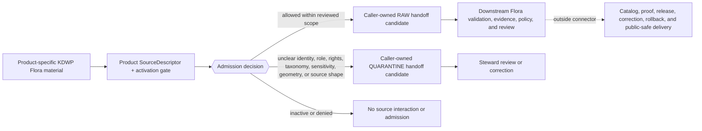

<!-- [KFM_META_BLOCK_V2]
doc_id: kfm://doc/connectors-kansas-kdwp-flora-readme
title: connectors/kansas/kdwp_flora/ — KDWP Flora Admission Lane
type: readme
version: v0.2
status: draft
owners: OWNER_TBD — Connector steward · Kansas source steward · Flora steward · Fauna steward · Habitat steward · Taxonomy/identity steward · Rights reviewer · Sensitivity reviewer · Validation steward · Docs steward
created: 2026-06-19
updated: 2026-07-12
policy_label: public-doctrine; kansas-family; provisional-product-layout; flora-status-and-stewardship; rare-plant-deny-default; rights-gated; sensitivity-gated; no-publication
current_path: connectors/kansas/kdwp_flora/README.md
truth_posture: CONFIRMED current path and inspected repository evidence / CONFLICTED product placement, SourceDescriptor role authority, and Flora source-registry topology / PROPOSED flora admission contract / UNKNOWN runtime and source-access depth
evidence_snapshot:
  repository: bartytime4life/Kansas-Frontier-Matrix
  base_ref: main
  base_commit: a02a44a1f44e7214d4acb9dfc3ca559c34ab1ac9
  prior_blob: 8faa4a5335ebc99408d9c736453223ee4cc834f7
related:
  - ../README.md
  - ../kdwp/README.md
  - ../kdwp_ert/README.md
  - ../../README.md
  - ../../kdwp/README.md
  - ../../flora/README.md
  - ../../../CONTRIBUTING.md
  - ../../../.github/CODEOWNERS
  - ../../../docs/doctrine/directory-rules.md
  - ../../../docs/sources/catalog/kansas/kdwp.md
  - ../../../docs/sources/SOURCE_DESCRIPTOR_STANDARD.md
  - ../../../docs/domains/flora/SOURCES.md
  - ../../../docs/domains/flora/SOURCE_ROLES.md
  - ../../../docs/domains/flora/CANONICAL_PATHS.md
  - ../../../docs/domains/flora/SENSITIVITY.md
  - ../../../docs/domains/flora/OBJECT_FAMILIES.md
  - ../../../contracts/source/source_descriptor.md
  - ../../../schemas/contracts/v1/source/source_descriptor.schema.json
  - ../../../schemas/contracts/v1/sources/source_descriptor.schema.json
  - ../../../data/registry/sources/flora/README.md
  - ../../../data/registry/flora/sources/README.md
  - ../../../control_plane/source_authority_register.yaml
  - ../../../policy/rights/
  - ../../../policy/sensitivity/
  - ../../../release/
tags: [kfm, connectors, kansas, kdwp, kdwp-flora, flora, listed-species, sinc, rare-plants, stewardship-context, source-admission, rights, sensitivity, raw, quarantine, governance]
notes:
  - "The current sibling path is verified under the Kansas connector family; this revision retains it without deciding whether flora-specific KDWP work should remain a sibling, become a child of `kdwp/`, or be represented through another accepted product layout."
  - "The historical statement that this README was blank is removed. The current base commit and prior blob are the rollback target."
  - "KDWP flora products must remain product- and record-specific. State listed status, SINC or stewardship ranks, range/context products, observations, review outputs, aggregates, and models must not collapse into one generic KDWP Flora feed."
  - "Flora doctrine consistently denies public exact rare, protected, or culturally sensitive plant locations by default; the exact tier vocabulary and overlapping Flora sensitivity-document authority remain PROPOSED / CONFLICTED."
  - "SourceDescriptor authority and Flora source-registry topology are conflicted: human role vocabularies, the populated singular-path schema, the empty plural-path scaffold, and parallel registry lanes do not provide one accepted machine authority."
  - "Only this Markdown file is in scope. No connector code, descriptor, fixture, policy, schema, registry record, workflow, receipt, release object, source activation, path move, or public artifact is created."
[/KFM_META_BLOCK_V2] -->

# KDWP Flora Admission Lane

> [!IMPORTANT]
> **Document lifecycle:** `draft` 
> **Component maturity:** documentation contract; connector runtime `UNKNOWN` 
> **Owner:** `OWNER_TBD` 
> **Truth posture:** `CONFIRMED` current path and inspected repository evidence · `CONFLICTED` product placement, `SourceDescriptor` role authority, and Flora registry topology · `PROPOSED` flora admission contract
> **Boundary:** admission of Kansas Department of Wildlife and Parks flora, listed-species, rank, range, and stewardship-context material only. This folder does not activate a source, establish taxonomic truth, create a legal status, decide public sensitivity, publish a plant map, or authorize release.

**Quick links:** [Purpose](#purpose) · [Authority level](#authority-level) · [Status](#status) · [What belongs here](#what-belongs-here) · [What does not belong here](#what-does-not-belong-here) · [Inputs](#inputs) · [Outputs](#outputs) · [Validation](#validation) · [Review burden](#review-burden) · [Related folders](#related-folders) · [ADRs](#adrs) · [Last reviewed](#last-reviewed) · [Evidence basis](#evidence-basis) · [Flora meaning boundaries](#kdwp-flora-record-and-meaning-boundaries) · [Authority conflicts](#sourcedescriptor-and-registry-authority-conflicts) · [Lifecycle](#lifecycle-boundary) · [Anti-collapse](#anti-collapse-and-sensitive-data-rules) · [Definition of done](#definition-of-done) · [Rollback](#rollback) · [Verification backlog](#verification-backlog)

---

## Purpose

`connectors/kansas/kdwp_flora/` is the current documentation lane for proposed source-admission work involving KDWP flora, listed-species, conservation-rank, range, and stewardship-context products.

An implementation in this lane may retrieve or parse an explicitly admitted product, preserve source-native identity and meaning, record provenance and source-head evidence, and prepare a caller-owned `RAW` or `QUARANTINE` handoff. It may do so only after the exact product has an accepted `SourceDescriptor`, activation decision, rights review, sensitivity review, and supported access method.

The connector does not make a plant name taxonomically canonical, turn a status list into an occurrence, make a range product certain presence, relax rare-plant sensitivity, or authorize public release. It preserves enough product identity, record class, role, time, rights, sensitivity, geometry, limitations, and provenance for downstream KFM controls to decide what the material can support.

[Back to top](#top)

---

## Authority level

**Implementation-bearing connector location, with a confirmed responsibility root and unresolved product placement.**

| Concern | Status | Evidence-bounded determination |
|---|---:|---|
| Responsibility root | **CONFIRMED** | Source-specific fetch and admission belong under `connectors/`; connector output is bounded to caller-owned `RAW` or `QUARANTINE` handoff plus process-memory receipt candidates. |
| Kansas family placement | **CONFIRMED** | KDWP work belongs under `connectors/kansas/`; the KDWP source catalog records `connectors/kansas/kdwp/` as the correct institutional family lane. |
| Current Flora sibling path | **CONFIRMED** | `connectors/kansas/kdwp_flora/README.md` and `.gitkeep` exist at the pinned base and remain the requested target. |
| Final Flora product home | **CONFLICTED / NEEDS VERIFICATION** | The repository contains this sibling lane and the parent `connectors/kansas/kdwp/` lane. Older Flora path doctrine proposes top-level `connectors/kdwp/`, while the current parent README treats the top-level package as noncanonical. No accepted path-specific ADR was verified. |
| Domain-scoped connector alternative | **CONFIRMED / NONCANONICAL** | `connectors/flora/` is a documentation-only compatibility index and explicitly forbids a second Flora runtime hierarchy under the current posture. It is not an implementation destination for this lane. |
| Common implementation files below this path | **CONFIRMED (exact paths absent)** | Direct probes found no `pyproject.toml`, `src/README.md`, or `tests/README.md` below this folder. This does not prove no differently named or unindexed implementation exists. |
| Connector runtime and source access | **UNKNOWN** | No client, parser, fixture execution, connector run, source endpoint, emitted receipt, or runtime log was verified for this lane. |
| Source identity and activation | **OUTSIDE THIS FOLDER** | Product descriptors and activation state belong in governed registry and control-plane surfaces. |
| Flora source-registry topology | **CONFLICTED / NEEDS VERIFICATION** | Both `data/registry/sources/flora/` and `data/registry/flora/sources/` exist, while the KDWP catalog proposes product records under `data/registry/sources/kansas/kdwp-*/`. No accepted authority resolves source-family versus receiving-domain placement. |
| Policy and publication authority | **NONE** | Rights, sensitivity, geoprivacy, taxonomy decisions, evidence closure, release, correction, withdrawal, and rollback are owned outside the connector. |

This revision documents the current path and conflicts. It does not ratify the sibling layout, revive a top-level KDWP implementation, create a Flora-domain connector hierarchy, or establish an operational Flora service.

[Back to top](#top)

---

## Status

| Item | Status | Meaning |
|---|---:|---|
| This README | **DRAFT** | Reviewable folder contract; not source activation or KFM publication. |
| Current path | **CONFIRMED** | The requested README and an empty `.gitkeep` exist in the current repository snapshot. |
| KDWP Flora product inventory | **NEEDS VERIFICATION** | Project docs name listed-species context, SINC or stewardship ranks, range products, and related context, but no accepted product inventory or activation set was verified. |
| Live source access | **DISABLED / NEEDS VERIFICATION** | No source may be contacted merely because this folder exists. |
| Product-level `SourceDescriptor` | **NOT VERIFIED** | No accepted KDWP Flora descriptor or machine source-authority entry was verified. |
| `SourceDescriptor` schema and role vocabulary | **CONFLICTED** | Human Flora and KDWP docs use overlapping but inconsistent role descriptions; the populated singular-path schema self-identifies as legacy; the plural-path schema is an empty scaffold. |
| Flora registry home | **CONFLICTED** | Subtype-first and domain-first Flora registry lanes both exist, and the KDWP catalog proposes a Kansas/product-scoped registry shape; none may be treated as an independent second authority. |
| Rights and redistribution | **NEEDS VERIFICATION** | Unknown terms, attribution, redistribution, account, or written-permission requirements fail closed. |
| Rare-plant and cultural sensitivity | **DENY BY DEFAULT** | Exact rare, protected, or culturally sensitive plant locations and culturally sensitive plant knowledge do not become public through this connector. |
| Sensitivity tier vocabulary | **PROPOSED / CONFLICTED** | Flora docs consistently require fail-closed handling, but tier ratification and overlapping sensitivity-doc authority remain unresolved. |
| Owner assignment | **UNKNOWN** | The inspected CODEOWNERS file provides only the repository-wide fallback for this path. |
| Public flora, status, or release service | **NONE** | This README creates no public map, legal-status service, ecological review, or release product. |

[Back to top](#top)

---

## What belongs here

Subject to accepted product placement and product-level governance, this lane may contain:

- README-level product navigation and migration notes;
- opt-in source clients that remain inactive without an accepted descriptor and activation decision;
- parsers for verified source-native formats such as reviewed HTML tables, PDFs, spreadsheets, delimited files, archives, or GIS exports;
- source-head probes using a supported version, checksum, `ETag`, `Last-Modified`, release identifier, or documented manual snapshot;
- preservation of the exact KDWP program, product, publication, release, or list identity rather than the agency name alone;
- preservation of Kansas legal or stewardship status vocabulary, issuing authority, scope, effective date, retirement date, correction, and supersession where present;
- preservation of SINC or other source-native rank system, rank scope, vintage, authority, caveats, and disagreement with parallel authorities;
- preservation of source taxon names, identifiers, taxonomic concept or version, and crosswalk candidates without silently selecting the canonical backbone;
- explicit separation of status, rank, range, observation, administrative compilation, ERT or review output, aggregate, and modeled records;
- preservation of geometry, precision, coordinate uncertainty, withholding state, private-versus-public intent, and source-provided obscuration;
- source, observed, valid or effective, retrieval, review, expiry, correction, withdrawal, and supersession time where material;
- caller-owned `RAW` or `QUARANTINE` handoff builders;
- process-memory retrieval, probe, denial, no-op, admission, or handoff receipt candidates when an accepted receipt contract exists;
- references to small synthetic, minimized, redacted, generalized, or rights-reviewed no-network fixtures in the repository's accepted fixture and test home;
- migration-only compatibility adapters whose purpose, canonical destination, and sunset path are explicit.

No item in this list is evidence that the corresponding implementation already exists.

[Back to top](#top)

---

## What does not belong here

This folder must not own or imply authority over:

- an all-purpose descriptor for KDWP as an institution or for “KDWP Flora” as an untyped feed;
- source activation or product admission decisions;
- `SourceDescriptor` instances, source-authority entries, or Flora registry topology decisions;
- canonical object contracts, machine schemas, source-role vocabulary, or sensitivity-tier vocabulary;
- taxonomic-backbone or taxonomic-concept decisions;
- a KFM-created Kansas legal status, conservation rank, or regulatory determination;
- field-observation truth inferred from a list, rank, range, stewardship record, or administrative compilation;
- certain presence, absence, abundance, habitat occupancy, or current population inferred from a range or status product;
- public exact locations for rare, protected, or culturally sensitive plants, seed sources, populations, collection localities, sensitive natural communities, sacred places, private properties, or steward-controlled records;
- culturally sensitive plant knowledge, private correspondence, requester details, or unreviewed stewardship material;
- rights, sensitivity, redaction, geoprivacy, access, or public-precision policy;
- direct writes to `WORK`, `PROCESSED`, `CATALOG`, `TRIPLET`, `PUBLISHED`, proof, or release stores;
- `EvidenceBundle`, proof-pack, catalog, release-manifest, correction, withdrawal, or rollback authority;
- public APIs, map layers, tiles, summaries, dashboards, exports, or AI answers;
- credentials, tokens, cookies, private URLs, or unreviewed source payloads;
- independent evolution of `connectors/kdwp/`, `connectors/flora/`, or another compatibility path as a second canonical implementation;
- generated language presented as taxonomic, regulatory, occurrence, range, habitat, sensitivity, or release truth.

A retrieved list or layer is not an admitted source. An admitted source is not validated botanical evidence. Validated evidence is not a legal determination, public-location permission, or released public claim.

[Back to top](#top)

---

## Inputs

A connector operation requires product-specific, reviewable inputs:

| Input | Required posture |
|---|---|
| Product identity | Identify the exact KDWP program and product, list, rank system, range layer, survey, or stewardship output; do not use the agency name alone. |
| `SourceDescriptor` reference | Resolve to the accepted descriptor for the exact product and version. |
| Activation state | Explicitly allows the requested fixture-only, restricted, or live operation. |
| Access surface | Reviewed URL, file, archive, request workflow, or service definition; credentials supplied only through approved secret handling. |
| Record-class map | Define how source-native rows or features map to status, rank, range, observation, administrative, ERT/review, aggregate, or model classes. |
| Status or rank authority | Preserve issuing program, jurisdiction, vocabulary, scope, effective date, vintage, caveats, and supersession state. |
| Taxon identity context | Preserve source-native taxon name and identifier, concept/version where available, and unresolved crosswalks; do not silently choose a backbone. |
| Rights state | Record current terms, attribution, redistribution, downstream-use, account, and written-permission limits. Unknown rights fail closed. |
| Sensitivity state | Record dataset- and record-level sensitivity inputs, including rare/protected taxa, culturally sensitive plants, private land, steward controls, source obscuration, and join-induced sensitivity. |
| Source-role mapping | Map each product or record through the accepted machine vocabulary. Until authority is resolved, preserve human meaning and quarantine ambiguous mixed-role records. |
| Source head | Preserve upstream version, release date, checksum, `ETag`, `Last-Modified`, or another reproducible identity signal. |
| Temporal context | Preserve source, observation, effective, expiry, retrieval, correction, withdrawal, and supersession time where applicable. |
| Geometry context | Preserve source geometry, CRS or datum, precision, uncertainty, withholding state, and original-versus-public intent. |
| Caller-owned handoff | Supply explicit `RAW` and `QUARANTINE` sinks or envelope interfaces; no implicit filesystem destination. |

The exact field names, DTOs, and machine enums are **PROPOSED / NEEDS VERIFICATION**. This table records admission obligations, not a substitute schema.

[Back to top](#top)

---

## Outputs

Permitted connector outputs are narrow and caller-owned:

1. **A `RAW` handoff candidate** preserving the immutable or reproducibly referenced source payload, source head, product identity, record class, retrieval time, checksum, descriptor reference, rights/sensitivity posture, and admission metadata.
2. **A `QUARANTINE` handoff candidate** with a structured reason when identity, role, rights, taxonomy, status/rank meaning, geometry, sensitivity, time, source shape, source head, or activation is unresolved.
3. **A process-memory receipt candidate** for retrieval, probe, denial, no-op, admission, or handoff behavior when the accepted receipt contract provides one.
4. **A deterministic operational failure** when the connector cannot safely produce one of the governed outcomes above.

The exact envelope, reason-code vocabulary, sink protocol, idempotency contract, receipt type, and retry semantics remain **PROPOSED / NEEDS VERIFICATION**. This README does not mint them.

The connector must not emit a canonical Flora object, processed botanical record, public occurrence, legal-status decision, `EvidenceBundle`, public geometry, catalog item, triplet, released layer, public answer, or publication decision.

[Back to top](#top)

---

## Validation

### Admission and record checks

Before implementation can be treated as active, tests and validators must cover at least:

- product-level descriptor resolution and explicit activation;
- no-network default behavior;
- source-head, payload, product, and record identity preservation;
- checksum or immutable-reference preservation;
- exact program/product identity rather than agency-only identity;
- record-class mapping without collapsing status, rank, range, observation, administrative, ERT/review, aggregate, or model material;
- legal/status vocabulary, issuing authority, jurisdiction, effective date, retirement, correction, and supersession preservation;
- SINC or other rank-system identity, scope, vintage, authority, caveats, and disagreement preservation;
- source-native taxon name, identifier, taxonomic concept/version, crosswalk candidates, and unresolved-name handling;
- refusal to interpret status or rank as observation, public-location permission, abundance, current presence, or taxonomic authority;
- source, observation, valid/effective, expiry, retrieval, correction, withdrawal, and supersession-time separation where applicable;
- geometry validity, precision, coordinate uncertainty, CRS or datum, source obscuration, withholding state, and original-versus-public geometry separation;
- rights, attribution, redistribution, downstream-use, account, written-permission, and terms-review state;
- rare/protected/culturally sensitive plant, private-land, cultural-place, steward-controlled, and join-induced-sensitivity negative cases;
- explicit quarantine for unknown rights, unresolved role, unresolved taxonomy, unclear status/rank meaning, missing authority/effective date, unsafe geometry, stale source head, unrecognized source shape, or ambiguous mixed-role packages;
- proof that connector code cannot write beyond caller-owned `RAW` or `QUARANTINE` handoff and process-memory receipt candidates;
- fixture safety: no actual rare-plant locality, culturally sensitive plant knowledge, private record, credential, private URL, or unclear-rights payload in the repository;
- refusal to treat `connectors/flora/`, the top-level KDWP compatibility package, or either Flora registry lane as an independent second authority;
- success, quarantine or hold, denied or inactive, no-op, source-drift, stale, corrected or superseded, and operational-error paths as applicable to the accepted contract.

### `SourceDescriptor` and registry authority gate

The current repository contains incompatible authority surfaces:

- the draft Source Descriptor Standard and Flora `SOURCES.md` / `SOURCE_ROLES.md` use a seven-role narrative vocabulary;
- the KDWP source catalog also uses `authority`, `context`, `model`, `regulatory`, `observed`, and `administrative` descriptions across products;
- the populated schema at `schemas/contracts/v1/source/source_descriptor.schema.json` declares the plural path canonical and itself legacy while using a different machine vocabulary;
- the nominal plural-path schema at `schemas/contracts/v1/sources/source_descriptor.schema.json` is an empty `PROPOSED` scaffold;
- `data/registry/sources/flora/` and `data/registry/flora/sources/` both exist and explicitly require topology reconciliation;
- the KDWP source catalog separately proposes product descriptors under `data/registry/sources/kansas/kdwp-*/`, creating an unresolved source-family-versus-domain registry placement question;
- the machine source-authority register currently has no entries;
- the referenced `docs/adr/ADR-0001-schema-home.md` path was not found in the inspected base.

> [!WARNING]
> Do not create or activate a KDWP Flora descriptor by copying a prose label, path proposal, sensitivity tier, or registry location into a machine record. Resolve schema home, role vocabulary, registry topology, and sensitivity authority through the governing contract and ADR process, then update descriptors, fixtures, validators, policy, and this README together.

### Documentation checks for this file

Review should verify:

- one H1 and a coherent heading hierarchy;
- balanced KFM metadata, code fences, tables, callouts, and links;
- preserved `doc_id`, `created` date, stable prior anchors where practical, final newline, and prior-blob rollback target;
- no remote badge, tracking image, credential, private source URL, botanical record, culturally sensitive knowledge, private project material, exact sensitive locality, or rights-restricted payload;
- current-state claims remain bounded to the pinned repository evidence;
- the diff contains only `connectors/kansas/kdwp_flora/README.md`.

Repository-wide executable validation is not established by this README. The inspected `tools/validate_all.py` and pre-commit configuration are placeholders; trusted CI results must be reported by workflow and scope rather than generalized into runtime proof.

[Back to top](#top)

---

## Review burden

At minimum, substantive KDWP Flora connector, descriptor, activation, product-layout, taxonomy, or public-geometry work should involve:

- connector steward;
- Kansas source steward;
- Flora steward;
- taxonomy or identity steward;
- Fauna steward when a mixed species/status product spans plant and animal records;
- Habitat steward when natural-community, range, habitat, or stewardship polygons are involved;
- rights reviewer;
- sensitivity or geoprivacy reviewer;
- cultural or sovereignty reviewer when culturally sensitive plant knowledge may be involved;
- validation or test steward;
- docs steward.

The inspected `.github/CODEOWNERS` file applies a repository-wide `@kfm/maintainers` fallback but does not assign a connector-specific or KDWP Flora-specific owner. Team existence, semantic ownership, and reviewer availability remain **NEEDS VERIFICATION**; this README does not invent usernames or request reviewers.

Additional governed review is required before:

- approving a live KDWP Flora product, endpoint, archive, or request workflow;
- accepting or changing rights, attribution, redistribution, account, or written-permission posture;
- accepting a source-role machine mapping;
- choosing a canonical Flora registry lane;
- changing sibling-versus-child placement or migrating compatibility material;
- accepting a taxonomic backbone, crosswalk rule, or authority-disagreement rule;
- using a KDWP status or rank as support for a public botanical claim;
- committing, exposing, or generalizing rare-plant, culturally sensitive, private-land, or steward-controlled geometry;
- publishing a range, status, rank, occurrence, habitat, or natural-community derivative;
- defining stale, correction, withdrawal, or supersession behavior;
- treating a connector or ingest receipt as evidence closure or release proof.

[Back to top](#top)

---

## Related folders

| Surface | Relationship | Status in the pinned snapshot |
|---|---|---:|
| [`../README.md`](../README.md) | Kansas connector-family boundary and sublane rules. | **CONFIRMED file / child inventory stale** |
| [`../../README.md`](../../README.md) | Connector-root source-admission boundary. | **CONFIRMED file** |
| [`../kdwp/README.md`](../kdwp/README.md) | Parent KDWP source-family coordination lane. | **CONFIRMED file / current v0.2** |
| [`../kdwp_ert/README.md`](../kdwp_ert/README.md) | ERT/stewardship sibling lane. | **CONFIRMED file / current v0.2 / placement unresolved** |
| [`../../kdwp/README.md`](../../kdwp/README.md) | Top-level KDWP compatibility package. | **CONFIRMED / NONCANONICAL** |
| [`../../flora/README.md`](../../flora/README.md) | Flora-domain connector compatibility index. | **CONFIRMED / NONCANONICAL implementation path** |
| `../../kdwp_flora/README.md` | Possible top-level Flora compatibility path. | **CONFIRMED exact path absent** |
| [`../../../docs/sources/catalog/kansas/kdwp.md`](../../../docs/sources/catalog/kansas/kdwp.md) | Human-facing KDWP source-family and product doctrine. | **CONFIRMED file / draft** |
| [`../../../docs/domains/flora/SOURCES.md`](../../../docs/domains/flora/SOURCES.md) | Flora source-family and proposed role crosswalk. | **CONFIRMED file / draft** |
| [`../../../docs/domains/flora/SOURCE_ROLES.md`](../../../docs/domains/flora/SOURCE_ROLES.md) | Flora source-role anti-collapse doctrine. | **CONFIRMED file / draft / machine authority unresolved** |
| [`../../../docs/domains/flora/CANONICAL_PATHS.md`](../../../docs/domains/flora/CANONICAL_PATHS.md) | Flora responsibility-root path register. | **CONFIRMED file / connector-path proposals conflict with current parent posture** |
| [`../../../docs/domains/flora/SENSITIVITY.md`](../../../docs/domains/flora/SENSITIVITY.md) | Rare-plant, cultural, geoprivacy, and tier guidance. | **CONFIRMED file / overlapping authority CONFLICTED** |
| [`../../../contracts/source/source_descriptor.md`](../../../contracts/source/source_descriptor.md) | SourceDescriptor semantic contract. | **CONFIRMED file / draft** |
| [`../../../schemas/contracts/v1/source/source_descriptor.schema.json`](../../../schemas/contracts/v1/source/source_descriptor.schema.json) | Populated schema at a self-declared legacy path. | **CONFIRMED file / authority CONFLICTED** |
| [`../../../schemas/contracts/v1/sources/source_descriptor.schema.json`](../../../schemas/contracts/v1/sources/source_descriptor.schema.json) | Nominal canonical-path schema scaffold. | **CONFIRMED file / not enforceable** |
| [`../../../data/registry/sources/flora/README.md`](../../../data/registry/sources/flora/README.md) | Subtype-first Flora source-registry lane. | **CONFIRMED file / topology unresolved** |
| [`../../../data/registry/flora/sources/README.md`](../../../data/registry/flora/sources/README.md) | Domain-first Flora source-registry lane. | **CONFIRMED file / compatibility posture unresolved** |
| [`../../../control_plane/source_authority_register.yaml`](../../../control_plane/source_authority_register.yaml) | Machine source-authority register. | **CONFIRMED file / currently empty** |
| [`../../../policy/rights/`](../../../policy/rights/) | Rights decisions and enforcement. | **Outside connector / implementation depth NEEDS VERIFICATION** |
| [`../../../policy/sensitivity/`](../../../policy/sensitivity/) | Sensitivity, geoprivacy, and redaction policy. | **Outside connector / implementation depth NEEDS VERIFICATION** |
| [`../../../release/`](../../../release/) | Release, correction, withdrawal, and rollback decisions. | **Outside connector** |

[Back to top](#top)

---

## ADRs

- Directory Rules govern the `connectors/` responsibility root, the `RAW` or `QUARANTINE` output boundary, the required folder-README contract, source-first connector posture, and migration discipline.
- Repository documents repeatedly reference `ADR-0001` for schema-home authority, but the directly probed `docs/adr/ADR-0001-schema-home.md` path was not found. The populated singular schema, empty plural schema, and conflicting role descriptions leave descriptor authority **CONFLICTED / NEEDS VERIFICATION**.
- No accepted path-specific ADR was verified that resolves:
  - whether Flora work remains at `connectors/kansas/kdwp_flora/`;
  - whether it moves below `connectors/kansas/kdwp/`;
  - whether any top-level KDWP compatibility package remains a redirect, mirror, transitional package, or is removed;
  - how the older Flora path register's top-level KDWP proposals reconcile with the current Kansas-family parent;
  - which machine role vocabulary represents KDWP Flora products;
  - which Flora source-registry topology is canonical;
  - which Flora sensitivity document and tier vocabulary are authoritative.
- This README update does not trigger an ADR by itself: it edits one existing Markdown file, does not move a path, create a parallel authority home, change an object contract, alter sensitivity posture, or change a lifecycle boundary.
- Any later move must preserve history, references, fixtures, tests, descriptors, registry records, receipts, deprecation state, validation, and rollback under Directory Rules migration discipline.

[Back to top](#top)

---

## Last reviewed

| Field | Value |
|---|---|
| Review date | `2026-07-12` |
| Repository | `bartytime4life/Kansas-Frontier-Matrix` |
| Base ref | `main` |
| Pinned base commit | `a02a44a1f44e7214d4acb9dfc3ca559c34ab1ac9` |
| Prior README blob | `8faa4a5335ebc99408d9c736453223ee4cc834f7` |
| README introduction commit | `f69807941ebc785d757ae4fc882fc5b5d4095d8f` |
| Review scope | Target README and introduction history; target-path implementation probes; connector root and Kansas-family READMEs; parent KDWP, ERT sibling, top-level KDWP, and Flora compatibility READMEs; KDWP source catalog; Flora source, role, canonical-path, sensitivity, and registry docs; Source Descriptor Standard, semantic contract, and both schema paths; both Flora registry lanes; source-authority register; contribution guidance; CODEOWNERS; PR template; validation placeholders; branch and PR search |
| Reviewer identity | `OWNER_TBD` — no semantic owner assignment made by this document |

[Back to top](#top)

---

## Evidence basis

| Evidence | What it supports | What it does not prove |
|---|---|---|
| Target blob `8faa4a5335ebc99408d9c736453223ee4cc834f7` at the pinned base | Exact editing baseline, current path, stale historical language, and unresolved rollback placeholder. | Runtime, source activation, or product readiness. |
| Introduction commit `f69807941ebc785d757ae4fc882fc5b5d4095d8f` | The v0.1 README replaced a blank placeholder; “blank before this update” is historical residue. | That a blank file is now the appropriate rollback. |
| Directory Rules and connector-root README | Connector responsibility, source-admission boundary, `RAW` or `QUARANTINE` handoff, folder-README contract, source-first posture, and migration discipline. | Which KDWP Flora product is active or how it is fetched. |
| Parent KDWP README and source catalog | Parent family placement, product-specific identity, regulatory-versus-observed anti-collapse, sensitivity implications, rights/cadence gaps, and KDWP Flora/ERT product boundaries. | Current product terms, machine endpoints, accepted descriptors, or runtime. |
| Flora `SOURCES.md` and `SOURCE_ROLES.md` | Listed-species, stewardship, and rare-plant role meanings; source-role anti-collapse; rights and sensitivity gates. | An accepted machine enum or valid descriptor. |
| Flora `CANONICAL_PATHS.md` | Responsibility-root doctrine and the older connector-path proposal set. | That its proposed top-level connector paths are canonical in the current repo. |
| Flora `SENSITIVITY.md` | Exact rare/protected/culturally sensitive locations fail closed; transforms and review are required before any public-safe derivative. | A ratified tier enum, one canonical sensitivity document, or an approved release. |
| Exact target-path probes | `.gitkeep` exists; common package, source-layout, test-layout, and path-scoped instruction files named above were not found. | Complete recursive absence of differently named implementation. |
| `connectors/flora/README.md` | The domain-scoped connector directory is a noncanonical documentation index under the current source-first posture. | Final placement of this KDWP product lane. |
| Both Flora registry READMEs | Parallel subtype-first and domain-first registry paths exist and explicitly require reconciliation. | Which lane is canonical or whether any KDWP Flora descriptor exists. |
| Source Descriptor Standard, semantic contract, and both schema paths | Descriptor doctrine and machine-shape surfaces exist but disagree on path and role vocabulary. | One accepted schema authority or a valid KDWP Flora descriptor. |
| Empty source-authority register | No machine authority entry exists in that inspected register. | Absence from every differently named registry or control-plane file. |
| Contribution guidance, CODEOWNERS, PR template, pre-commit config, and validator placeholder | Review language, repository fallback ownership, PR fields, and current local validation limits. | Passing CI, branch protection, reviewer availability, or enforcement maturity. |

Absence claims are bounded to exact paths, indexed searches, and the pinned commit. This README does not assert a complete recursive repository inventory.

[Back to top](#top)

---

## KDWP Flora record and meaning boundaries

KDWP Flora material is admitted by product and record meaning, not by the KDWP agency name alone.

| Product or record class | Human meaning to preserve | Admission posture | Must not become |
|---|---|---|---|
| Kansas endangered, threatened, or SINC plant list/status | KDWP-issued Kansas regulatory or stewardship status for a named taxon and effective period. | Product-level descriptor; preserve issuing program, jurisdiction, vocabulary, effective date, authority, citation, and supersession. | A field observation, KFM-created legal status, taxonomic backbone decision, or public exact-location permission. |
| SINC or other conservation/stewardship rank | Source-native rank under a defined system, scope, authority, and vintage. | Preserve rank system, rank meaning, geographic scope, authority, vintage, caveats, and disagreements with parallel authorities. | An uncited global rank, automatic release class, certain presence, or current population claim. |
| KDWP range or distribution product | Agency-published spatial context at a stated scale and method. | Preserve product/version, scale, geometry method, temporal support, uncertainty, caveats, source role, and release limits. | A point occurrence, abundance estimate, complete distribution, or certain current occupancy. |
| KDWP botanical survey or observation record | A source event tied to method, place, taxon, and time. | Preserve event identity, protocol, observer/steward posture, taxon concept, quality flags, geometry uncertainty, and withholding state. | Regulatory status, unrestricted exact locality, taxonomic authority, or complete range truth. |
| Flora stewardship or administrative compilation | Programmatic or administrative context assembled for a bounded purpose. | Preserve program, source inputs, scope, status, version, limitations, expiry, correction, and supersession when present. | A field observation, legal clearance, taxonomic authority, or public release approval. |
| Ecological Review Tool or bounded review output | Review evidence produced for a particular request or scope. | Route operational semantics through the ERT sibling; preserve request/result boundary when bundled with Flora material. | Reusable site truth, legal clearance, public occurrence layer, or a generic Flora status feed. |
| Habitat, natural-community, or stewardship polygon | Contextual or administrative spatial material whose role depends on the exact product. | Preserve management versus ecological meaning, source role, scale, method, vintage, and sensitive-join posture. | A plant occurrence, habitat occupancy certainty, or unrestricted sensitive-community location. |
| Aggregate or model | County summary, modeled surface, suitability layer, or other derived product. | Preserve aggregation unit or model/run identity, inputs, uncertainty, method, and receipt references. | A direct observation, legal determination, or exact public occurrence. |
| Corrected, withdrawn, or superseded status/rank product | A later source state changing what an earlier product can support. | Preserve lineage and make stale, withdrawn, and superseded state machine-readable once contracts exist. | A silent in-place edit or continued public claim using obsolete authority. |
| Mixed package | Multiple product or record meanings combined upstream. | Split into product- or record-specific mappings, or quarantine until role, rights, and sensitivity can be represented safely. | One untyped all-purpose “KDWP Flora” feed. |

Use human descriptions in this README until the accepted machine vocabulary is settled. Promotion cannot upgrade source role, relax sensitivity, erase taxonomic uncertainty, or remove the product boundary.

[Back to top](#top)

---

## `SourceDescriptor` and registry authority conflicts

The current repository does not provide one enforceable, internally consistent descriptor and registry authority for KDWP Flora material:

| Surface | Current evidence | Consequence |
|---|---|---|
| Source Descriptor Standard | Draft doctrine with a seven-role narrative vocabulary and proposed paths. | Useful meaning, but not machine conformance by itself. |
| Flora `SOURCES.md` and `SOURCE_ROLES.md` | KDWP listed-species context is described as regulatory; stewardship/ERT material is described as administrative or regulatory. | Product-specific review is required; prose labels are not machine authority. |
| KDWP source catalog | Uses `authority`, `context`, `model`, `regulatory`, `observed`, and `administrative` descriptions across KDWP products. | Conflicts with the Flora narrative enum and requires record-specific mapping. |
| Singular schema path | Populated Draft 2020-12 schema; metadata calls the plural path canonical and the singular path legacy. | Substantive field validation exists, but authority is conflicted. |
| Plural schema path | Empty `PROPOSED` scaffold with unrestricted properties. | Cannot validate a KDWP Flora descriptor. |
| Subtype-first Flora registry | `data/registry/sources/flora/` exists and describes itself as the likely Flora source-descriptor lane. | Does not by itself resolve topology or prove a KDWP Flora descriptor. |
| Domain-first Flora registry | `data/registry/flora/sources/` also exists and labels its layout unresolved. | Must not become a second divergent descriptor set. |
| KDWP catalog registry proposal | Proposes per-product records below `data/registry/sources/kansas/kdwp-*/`. | Conflicts with receiving-domain registry proposals until source identity and registry partitioning are ratified. |
| Source-authority register | File exists with `entries: []`. | No machine activation or authority record was verified. |
| Referenced `ADR-0001` | Direct path probe returned `Not Found`. | No inspected accepted ADR resolves schema-home authority. |
| Flora sensitivity docs | Exact sensitive flora data fail closed, but `SENSITIVITY.md` reports overlapping authority and tier ratification remains proposed. | Do not copy an unratified tier or document-local exception into connector behavior. |

**Safe current posture:** do not mint or activate a KDWP Flora descriptor from this README. Preserve source-native meaning, use `NEEDS VERIFICATION` for machine mapping, and quarantine material whose product identity, role, rights, taxonomy, sensitivity, geometry, temporal support, registry home, or reuse limits cannot be represented without guessing.

[Back to top](#top)

---

## Lifecycle boundary

The connector owns only source interaction and the governed handoff candidates. It does not own `WORK`, `PROCESSED`, `CATALOG`, `TRIPLET`, `PUBLISHED`, evidence closure, public rendering, legal interpretation, or release.

[Back to top](#top)

---

## Anti-collapse and sensitive-data rules

1. **Status is not occurrence.** A listed or SINC plant record does not prove a plant was observed at a place and time.
2. **Rank is not public-location permission.** Conservation or stewardship rank may increase sensitivity; it never authorizes public precision.
3. **Range is not certain presence.** Preserve scale, method, uncertainty, time, and caveats.
4. **Agency identity is not a source role.** Separate status, rank, range, observation, administrative, review, aggregate, and model records.
5. **Regulatory or stewardship context is not taxonomic authority.** Preserve source names and crosswalk uncertainty; do not silently choose a backbone.
6. **Exact rare, protected, or culturally sensitive locations fail closed.** Quarantine, withhold, generalize, stage, or deny before public exposure; preserve transform reasons and review state outside this connector.
7. **Culturally sensitive plant knowledge is not ordinary metadata.** Rights, sovereignty, consent, purpose, audience, and steward controls must be explicit before any downstream use.
8. **Original and public geometry are distinct.** A generalized carrier never replaces the restricted original or its transform receipt.
9. **Source obscuration must be preserved.** Do not reverse, sharpen, infer, or join around source-provided geoprivacy.
10. **Join-induced sensitivity is material.** Benign taxonomy, county, habitat, or range data can become sensitive when joined with occurrences or steward records.
11. **Mixed files must be split or quarantined.** One upstream package cannot justify one untyped role.
12. **Stale, corrected, withdrawn, and superseded states are material.** Preserve them instead of silently serving the last-seen status or rank.
13. **Fixtures must be safe.** Use synthetic, minimized, redacted, generalized, or explicitly approved material; never commit a real rare-plant locality or culturally sensitive record by default.
14. **A connector receipt is not evidence closure.** It may prove retrieval or handoff behavior; it does not prove botanical truth, legal status, policy approval, or release readiness.
15. **Derived summaries, maps, tiles, joins, graph projections, and AI explanations are downstream carriers.** They never become sovereign truth by repetition or fluency.
16. **No connector-side publication.** Promotion remains a governed downstream state transition with evidence, policy, validation, review, correction, and rollback.

[Back to top](#top)

---

## Definition of done

This README can be reviewed as a documentation-only contract when:

- [x] Current target path, base commit, prior blob, and introduction commit are recorded.
- [x] Connector, Kansas-family, parent KDWP, ERT sibling, KDWP compatibility, and Flora compatibility boundaries are linked.
- [x] Historical “blank before this update” language is removed.
- [x] Remote badges and unsupported maturity signals are removed.
- [x] Product and record-class boundaries for status, rank, range, observation, administration, review, aggregate, and model material are explicit.
- [x] Taxonomy, rights, rare-plant, culturally sensitive, geometry, lifecycle, publication, correction, and rollback boundaries are visible without inventing a source schema.
- [x] SourceDescriptor, registry-topology, and sensitivity-authority conflicts are surfaced rather than resolved by convenience.
- [ ] An ADR or migration decision resolves Flora sibling-versus-child placement and compatibility-path disposition.
- [ ] The accepted `SourceDescriptor` schema home and role vocabulary are resolved.
- [ ] One canonical Flora source-registry topology is selected, with the other lane converted to a pointer, mirror, or migration record.
- [ ] Product-level KDWP Flora descriptors, source IDs, activation decisions, rights, terms, access methods, cadence, and source heads are reviewed.
- [ ] Exact source-native status, rank, range, taxonomy, geometry, correction, withdrawal, and supersession fields are verified.
- [ ] No-network valid and invalid fixtures cover role collapse, taxonomy ambiguity, rare-plant locality, cultural sensitivity, source obscuration, unknown rights, unsafe joins, stale products, corrections, and supersession.
- [ ] Connector code proves it cannot write beyond caller-owned `RAW` or `QUARANTINE` handoff.
- [ ] Applicable CI and policy checks pass without bypass.
- [ ] Connector-specific ownership and required reviewers are assigned.

Documentation readiness does not imply source activation, runtime readiness, taxonomic authority, legal sufficiency, or public release.

[Back to top](#top)

---

## Rollback

Rollback is required if this README is used to justify:

- an unreviewed source interaction or activation;
- a canonical-path, schema-home, role-vocabulary, registry-topology, or sensitivity-tier decision not supported by governing authority;
- a KFM-created legal status, taxonomic authority, or conservation rank;
- occurrence, range, habitat, abundance, or current-presence claims unsupported by the record class;
- exposure of rare-plant, culturally sensitive, private-land, steward-controlled, or source-obscured detail;
- direct writes beyond `RAW` or `QUARANTINE` handoff;
- bypass of rights, sensitivity, taxonomy, validation, evidence, review, release, correction, or rollback gates.

Before merge, rollback is to leave the review branch unmerged and abandon the proposed change. Closing the pull request or deleting its branch requires separate authorization.

After merge, restore prior README blob `8faa4a5335ebc99408d9c736453223ee4cc834f7` from base `a02a44a1f44e7214d4acb9dfc3ca559c34ab1ac9` through a transparent revert commit or revert pull request, then re-run applicable documentation and connector-boundary validation. Do not reset, force-push, or rewrite shared history.

[Back to top](#top)

---

## Verification backlog

| Item | Status | Needed evidence |
|---|---:|---|
| Resolve Flora sibling-versus-child placement and the top-level KDWP compatibility package. | **NEEDS VERIFICATION** | Accepted ADR, migration record, current tree, and updated references. |
| Reconcile the older Flora connector-path proposals with the current Kansas-family and source-first connector posture. | **CONFLICTED** | Directory Rules decision, ADR, migration note, and path tests. |
| Confirm complete implementation inventory below or adjacent to this path. | **UNKNOWN** | Recursive tree and import/test inspection at a pinned commit. |
| Resolve `SourceDescriptor` schema home and role vocabulary. | **CONFLICTED** | Accepted ADR/contract, one enforceable schema, migration plan, fixtures, and validator results. |
| Resolve source-family versus receiving-domain registry placement, then select one canonical KDWP Flora descriptor home. | **CONFLICTED** | ADR or registry contract; migration decision; pointer/mirror rule for noncanonical lanes; registry validation. |
| Reconcile overlapping Flora sensitivity documents and ratify the tier vocabulary. | **CONFLICTED / NEEDS VERIFICATION** | Accepted ADR or docs/policy authority decision, policy tests, and migration notes. |
| Confirm KDWP Flora product identity and source IDs. | **NEEDS VERIFICATION** | Product-level descriptors and source-authority entries. |
| Confirm current official access method, package formats, terms, attribution, redistribution, account or written-permission requirements, and cadence. | **NEEDS VERIFICATION** | Source-steward review of current authoritative product documentation. |
| Verify source-native status, rank, range, observation, administrative, and review-output record classes. | **NEEDS VERIFICATION** | Reviewed source samples or documentation safe for steward use. |
| Verify taxon names, identifiers, taxonomic concepts, backbone/crosswalk rules, and disagreement handling. | **NEEDS VERIFICATION** | Taxonomy authority decision, crosswalk contracts, fixtures, and tests. |
| Verify legal/status authority, jurisdiction, effective date, correction, withdrawal, and supersession behavior. | **NEEDS VERIFICATION** | Product documentation, temporal contract, lineage rules, and tests. |
| Verify geometry, precision, uncertainty, CRS/datum, source obscuration, withholding, and public-transform rules. | **NEEDS VERIFICATION** | Policy, schema, `RedactionReceipt`, review record, and valid/invalid fixtures. |
| Define safe handling of culturally sensitive plant knowledge, steward records, private property, and requester material. | **NEEDS VERIFICATION** | Rights, sovereignty, consent, sensitivity policy, and negative fixtures. |
| Verify join-induced sensitivity handling. | **NEEDS VERIFICATION** | Join policy, provenance-preserving fixtures, and release-deny tests. |
| Verify fixture safety and repository rights. | **NEEDS VERIFICATION** | Fixture registry, rights review, sensitivity review, and test evidence. |
| Define connector outputs, sink protocol, reason codes, receipt type, retries, idempotency, no-op, source-drift, and replay behavior. | **NEEDS VERIFICATION** | Accepted contracts, schemas, policies, fixtures, and runtime tests. |
| Verify CI wiring and observed check results. | **NEEDS VERIFICATION** | Workflow files and runs for the resulting branch or pull request. |
| Assign connector-specific owner and reviewers. | **UNKNOWN** | CODEOWNERS or accepted ownership records. |

[Back to top](#top)

---

## Maintainer note

Keep this lane narrow, product-specific, and source-role preserving. KDWP flora material may be important Kansas regulatory, stewardship, range, or observation evidence, but connector code should only admit and preserve source material. Taxonomic authority, botanical interpretation, public precision, evidence closure, policy enforcement, release approval, correction, withdrawal, and rollback remain outside this folder.

[Back to top](#top)
