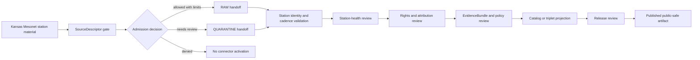

<!-- [KFM_META_BLOCK_V2]
doc_id: kfm://doc/connectors-kansas-mesonet-readme
title: connectors/kansas/mesonet/ — Kansas Mesonet Connector Lane
type: readme
version: v0.1
status: draft
owners: OWNER_TBD — Connector steward · Kansas source steward · Soil steward · Agriculture steward · Weather/atmosphere steward · Hydrology steward · Rights reviewer · Validation steward · Docs steward
created: 2026-06-19
updated: 2026-06-19
policy_label: public-doctrine; kansas-family; observed-source; station-sensor-source; rights-gated; no-publication
proposed_path: connectors/kansas/mesonet/README.md
truth_posture: CONFIRMED path exists / PROPOSED mesonet-lane contract / PLACEMENT AND IMPLEMENTATION DEPTH NEEDS VERIFICATION
related:
  - ../README.md
  - ../../kansas-mesonet/README.md
  - ../../README.md
  - ../../../docs/sources/catalog/kansas/kansas-mesonet.md
  - ../../../docs/sources/catalog/kansas/README.md
  - ../../../docs/domains/soil/README.md
  - ../../../docs/domains/agriculture/README.md
  - ../../../docs/domains/weather-atmospheric/README.md
  - ../../../docs/domains/hydrology/README.md
  - ../../../docs/sources/SOURCE_DESCRIPTOR_STANDARD.md
  - ../../../data/registry/sources/
  - ../../../data/raw/soil/
  - ../../../data/quarantine/soil/
  - ../../../data/raw/weather-atmospheric/
  - ../../../data/quarantine/weather-atmospheric/
  - ../../../fixtures/
  - ../../../schemas/contracts/v1/source/
  - ../../../schemas/contracts/v1/sensors/
  - ../../../policy/sensitivity/
  - ../../../policy/rights/
  - ../../../release/
tags: [kfm, connectors, kansas, mesonet, kansas-mesonet, soil, weather, agriculture, hydrology, observed-source, station-health, station-sensor, source-admission, raw, quarantine, governance]
notes:
  - "This README fills a previously blank Kansas Mesonet connector README under the canonical Kansas connector family."
  - "The Kansas Mesonet source page corrected the earlier top-level `connectors/kansas-mesonet/` path and says the adapter belongs under `connectors/kansas/kansas-mesonet/`."
  - "This requested shorter `connectors/kansas/mesonet/` path is marked PLACEMENT NEEDS VERIFICATION until repo convention chooses between `mesonet/`, `kansas-mesonet/`, or another ratified sublane name."
  - "Kansas Mesonet is in-situ observed point-station data with native temporal cadence preserved and station-health metadata required before downstream analytics."
  - "Operator consent and current source terms remain rights gates; unknown rights default to denial/hold before activation."
  - "Connector output may enter RAW or QUARANTINE handoff only; downstream validation, EvidenceBundle closure, station-health review, catalog/triplet projection, release review, publication, correction, and rollback remain outside this folder."
[/KFM_META_BLOCK_V2] -->

<a id="top"></a>

# Kansas Mesonet Connector Lane

> Source-admission lane for Kansas Mesonet station/sensor material under the canonical Kansas connector family. This folder is **not** a public current-conditions service, advisory surface, station-truth store, release path, or publication surface.

<p>
  
  
  
  
  
</p>

> [!IMPORTANT]
> **Status:** `experimental` Mesonet connector README · **Owner:** `OWNER_TBD`  
> **Path:** `connectors/kansas/mesonet/README.md`  
> **Truth posture:** `CONFIRMED` file exists · `PROPOSED` Mesonet-lane contract · `NEEDS VERIFICATION` placement and implementation depth  
> **Boundary:** source admission only; no public current-conditions claims, no direct publication, no station observation to gridded/model collapse.

**Quick jumps:** [Scope](#scope) · [Repo fit](#repo-fit) · [Accepted inputs](#accepted-inputs) · [Exclusions](#exclusions) · [Evidence ledger](#evidence-ledger) · [Lifecycle diagram](#lifecycle-diagram) · [Admission posture](#admission-posture) · [Anti-collapse rules](#anti-collapse-rules) · [Validation](#validation) · [Rollback](#rollback) · [Verification backlog](#verification-backlog)

---

## Scope

`connectors/kansas/mesonet/` is a proposed Kansas Mesonet source-admission sublane under the canonical Kansas connector family.

It may document station/sensor source-admission adapters, fixture rules, parser expectations, station-health preconditions, cadence preservation rules, rights checks, provenance preservation, and RAW/QUARANTINE handoff boundaries.

It must not become a public current-conditions service, advisory surface, observed-station truth store, source descriptor authority, schema authority, policy authority, catalog/triplet authority, proof authority, release authority, pipeline authority, or publication authority.

[Back to top ↑](#top)

---

## Repo fit

| Surface | Role | Status |
|---|---|---:|
| `connectors/kansas/mesonet/` | Requested Mesonet connector sublane. | **CONFIRMED path / PLACEMENT NEEDS VERIFICATION** |
| `connectors/kansas/kansas-mesonet/` | Intended adapter home named by the source-page correction. | **PROPOSED / NEEDS VERIFICATION** |
| `connectors/kansas-mesonet/` | Existing top-level compatibility path, not canonical. | **CONFIRMED path / NONCANONICAL compatibility** |
| `connectors/kansas/` | Canonical Kansas connector-family lane. | **CONFIRMED** |
| `docs/sources/catalog/kansas/kansas-mesonet.md` | Human-facing Kansas Mesonet source product page. | **CONFIRMED** |
| `data/registry/sources/` | SourceDescriptor authority. | **Outside connector / NEEDS VERIFICATION for entries** |
| `data/raw/soil/` and weather/atmosphere raw lanes | Candidate RAW handoff targets. | **PROPOSED / NEEDS VERIFICATION** |
| `data/quarantine/soil/` and weather/atmosphere quarantine lanes | Candidate quarantine targets. | **PROPOSED / NEEDS VERIFICATION** |
| `policy/rights/` and `policy/sensitivity/` | Rights and sensitivity authority. | **Outside connector** |
| `release/` | Release and publication controls. | **Out of scope for this connector lane** |

> [!NOTE]
> The Kansas Mesonet source page names `connectors/kansas/kansas-mesonet/` as the corrected adapter home. This `mesonet/` path may be a shorter alias, but it needs a placement decision before implementation depth is claimed.

[Back to top ↑](#top)

---

## Accepted inputs

Accepted Mesonet-lane content:

- connector README and navigation notes;
- station/sensor fixture rules;
- parser expectations for station ID, station location, variables, soil-depth fields, timestamps, cadence, freshness, source URI, rights, station-health, and provenance;
- SourceDescriptor-gate notes;
- station-health precondition notes;
- validation notes for observed-source discipline;
- quarantine criteria for unresolved rights, station identity, station health, cadence, variable/depth identity, freshness, geometry, or source-shape issues.

---

## Exclusions

This folder must not contain or imply authority over:

- public current-conditions or advisory services;
- published station observations or derived analytics;
- direct writes to `PROCESSED`, `CATALOG`, `TRIPLET`, `PUBLISHED`, proof, receipt, or release stores;
- SourceDescriptor authority records;
- policy or schema authority;
- generated summaries presented as authoritative station truth;
- source activation without operator consent, current source terms, station-health, cadence, variable/depth identity, and review checks.

[Back to top ↑](#top)

---

## Evidence ledger

| Source | Status | Supports | Limits |
|---|---:|---|---|
| `connectors/kansas/mesonet/README.md` | **CONFIRMED** | Target file exists and was blank before this update. | Does not prove code, fixtures, tests, or CI. |
| `connectors/kansas/README.md` | **CONFIRMED** | Kansas connector family is the canonical source-admission lane for Kansas source products. | Does not prove this child path is canonical. |
| `connectors/kansas-mesonet/README.md` | **CONFIRMED** | Existing top-level Mesonet path was documented as compatibility-only. | Does not prove migration decision. |
| `docs/sources/catalog/kansas/kansas-mesonet.md` | **CONFIRMED** | Kansas Mesonet is in-situ observed point-station data; native cadence is preserved; station-health metadata must precede downstream analytics; operator consent is a rights gate; corrected home is under `connectors/kansas/`. | Does not prove current source terms, implementation, or final sublane name. |
| Mesonet connector child files | **NEEDS VERIFICATION** | This README provides proposed boundaries. | Parser files, fixtures, tests, and workflows remain unverified. |

---

## Lifecycle diagram



[Back to top ↑](#top)

---

## Admission posture

Expected behavior for Kansas Mesonet connector work:

- no live source access unless explicitly enabled and reviewed;
- no source fetch without an accepted SourceDescriptor and activation decision;
- no activation until operator consent/current source terms are resolved;
- no implicit publication from retrieved source material;
- no relabeling of station observations as gridded/model output;
- no silent merging with SMAP, SoilGrids, SSURGO, gNATSGO, or other soil/weather products;
- no loss of station ID, station location, variable, sensor depth, cadence, timestamp, source URI, license/rights, station-health, source role, review, or release-class metadata;
- unclear rights, source role, station identity, station health, cadence, variable/depth identity, freshness, or schema drift routes to quarantine or abstention.

---

## Anti-collapse rules

The Kansas Mesonet source page identifies the controlling anti-collapse stack:

1. Kansas Mesonet is observed in-situ point-station data, not modeled raster data.
2. Kansas Mesonet is not the same as SMAP, SoilGrids, SSURGO, or gNATSGO; source roles and resolutions must stay separate.
3. Native cadence must be preserved; 5-minute, hourly, and daily values must not be silently collapsed.
4. Station-health metadata is a precondition before downstream analytics use the feed.
5. Operator consent/current source terms are activation gates, not courtesy notes.
6. Derived summaries, maps, tiles, joins, and AI explanations are downstream carriers, not sovereign truth.

---

## Validation

Mesonet-lane validation should check that:

- source metadata is preserved;
- SourceDescriptor references are required for activation;
- operator consent/source-terms state is explicit before activation;
- station ID, station location, variable, depth, cadence, timestamp, source URI, rights, station-health, source role, review, and vintage fields are explicit where available;
- malformed or incomplete records fail closed;
- records with unclear rights, unresolved source role, unresolved station identity, missing station-health, or unresolved cadence/variable/depth identity route to quarantine;
- connector output is limited to RAW or QUARANTINE handoff;
- no connector run writes directly to processed, catalog, triplet, published, proof, receipt, or release stores;
- fixture data is synthetic, minimized, redacted, generalized, or approved for committed use.

Root-level validation, policy-as-code, EvidenceBundle closure, release review, public caveats, and rollback remain outside this Mesonet lane.

[Back to top ↑](#top)

---

## Definition of done

This Mesonet connector README is ready for first review when:

- [ ] Kansas Mesonet source page is linked and current enough for review.
- [ ] A placement decision resolves `connectors/kansas/mesonet/` versus `connectors/kansas/kansas-mesonet/` or another ratified convention.
- [ ] SourceDescriptor home and Kansas Mesonet source ID are verified.
- [ ] Operator consent/current source terms are verified by source steward review.
- [ ] Live source access is disabled by default for connector code.
- [ ] Station identity, station-health, variable/depth identity, cadence, freshness, and anti-collapse checks are represented in tests.
- [ ] Connector output is limited to RAW or QUARANTINE handoff.
- [ ] No public current-conditions, advisory, or analytics claims are created by connector code.

---

## Rollback

Rollback is required if this README is used to justify source activation, current-conditions/advisory claims, station-observation-to-grid collapse, silent cadence collapse, direct publication, or bypass of `SourceDescriptor`, operator consent, station-health, validation, review, release, or rollback gates.

Rollback target:

```text
commit prior to this update: SHA_TBD_AFTER_GIT_HISTORY_CHECK
```

Because the file was blank before this update, a safe rollback is to restore the blank placeholder or replace this document with a shorter placement-only README until canonical sublane naming and implementation are verified.

---

## Verification backlog

| Item | Status | Needed evidence |
|---|---:|---|
| Confirm canonical Mesonet child path under `connectors/kansas/`. | **NEEDS VERIFICATION** | Directory Rules, ADR, migration note, or repo convention. |
| Confirm whether `mesonet/` is alias, final name, or migration target. | **NEEDS VERIFICATION** | ADR or migration decision. |
| Confirm SourceDescriptor home and Kansas Mesonet source ID. | **NEEDS VERIFICATION** | Source registry entry and accepted schema. |
| Confirm operator consent/current terms. | **NEEDS VERIFICATION** | Rights review and SourceDescriptor rights block. |
| Confirm station-health contract and tests. | **NEEDS VERIFICATION** | Sensor schema, connector tests, and station-health fixtures. |
| Confirm cadence/freshness handling. | **NEEDS VERIFICATION** | Parser tests and validation report. |
| Confirm fixture strategy and CI wiring. | **NEEDS VERIFICATION** | Fixture registry, workflow files, and test logs. |

---

## Maintainer note

Keep this lane focused on source admission. If `connectors/kansas/kansas-mesonet/` becomes the ratified canonical path, this `mesonet/` folder should become a redirect-only compatibility surface or be removed by a governed migration.

[Back to top ↑](#top)
