<!-- [KFM_META_BLOCK_V2]
doc_id: kfm://doc/connectors-kansas-mesonet-readme
title: connectors/kansas/mesonet/ — Kansas Mesonet Product Admission Contract
type: readme
version: v0.2
status: draft
owners: OWNER_TBD — Connector steward · Kansas source steward · Atmosphere steward · Soil steward · Agriculture steward · Hydrology steward · Rights reviewer · Validation steward · Docs steward
created: 2026-06-19
updated: 2026-07-12
policy_label: public; product-admission-contract; repository-present; final-child-slug-unresolved; observed-in-situ; automated-ingest-consent-gated; preliminary-data; no-network-by-default; raw-quarantine-receipt-candidates-only; no-publication
path: connectors/kansas/mesonet/README.md
truth_posture: CONFIRMED repository documentation and current official Kansas Mesonet pages / PROPOSED connector implementation and path ratification / CONFLICTED final child slug and registry identity / UNKNOWN package, tests, activation, runtime, and public-client coupling
related:
  - ../../README.md
  - ../README.md
  - ../../kansas_mesonet/README.md
  - ../../ks-mesonet/README.md
  - ../../../docs/doctrine/directory-rules.md
  - ../../../docs/sources/catalog/kansas/README.md
  - ../../../docs/sources/catalog/kansas/kansas-mesonet.md
  - ../../../data/registry/sources/README.md
  - ../../../data/registry/sources/soil/ks-mesonet.yaml
  - ../../../data/registry/sources/agriculture/ks_mesonet.yaml
  - ../../../data/registry/sources/agriculture/kansas-mesonet.yaml
  - ../../../schemas/contracts/v1/source/source_descriptor.schema.json
  - ../../../contracts/domains/soil/soil_moisture_observation.md
  - ../../../pipelines/domains/soil/mesonet_normalizer/README.md
  - ../../../schemas/contracts/v1/receipts/README.md
  - ../../../tests/domains/soil/README.md
  - ../../../data/raw/soil/README.md
  - ../../../policy/rights/
  - ../../../policy/sensitivity/
  - ../../../release/
tags: [kfm, connectors, kansas, mesonet, kansas-mesonet, observed-source, point-station, rest-csv, preliminary-data, quality-control, station-health, soil-moisture, atmosphere, automated-ingest-consent, raw, quarantine, receipts, no-network, fail-closed, governance]
notes:
  - "At inspected base commit 55c4e537f14386ea503a5879a2a4dfbaebef5384, the user-named top-level path connectors/kansas-mesonet/ had been deliberately deleted by commit 55c4e537f14386ea503a5879a2a4dfbaebef5384; this revision does not recreate it."
  - "This repository-present nested path is the closest surviving Kansas-family Mesonet product lane. The source profile still names absent connectors/kansas/kansas-mesonet/, while connectors/README.md treats nested and flat product patterns as draft. Final child-slug authority remains CONFLICTED."
  - "Two additional top-level README aliases remain: connectors/kansas_mesonet/ and connectors/ks-mesonet/. No alias is promoted or removed by this change."
  - "Three repository-present Mesonet source-registry YAML files use different domain/slug variants and are seven- or eight-line PROPOSED placeholders, not complete SourceDescriptors or activation decisions."
  - "Common target-local package and test paths directly probed were absent. A Soil Mesonet normalizer README exists, but its referenced pipeline spec was absent and executable behavior remains unverified."
  - "The referenced station-health schema path was absent. Current official Kansas Mesonet network documentation describes source QA/QC and soft/hard flags, but no KFM station-health machine contract was established in the inspected path."
  - "Official Kansas Mesonet pages were rechecked on 2026-07-12. The REST service documents CSV endpoints, 5-minute/hour/day intervals, a 3000-record request limit, station and variable caveats, and station metadata services."
  - "The current Data Usage Policy permits public use/download with citation, labels data preliminary and subject to change, and prohibits automated page scraping or data ingest without written Kansas Mesonet consent."
  - "This revision changes documentation only. It does not ratify a connector path, activate automated access, retrieve observations, create connector code or fixtures, emit a source receipt, or authorize a public current-conditions claim."
[/KFM_META_BLOCK_V2] -->

<a id="top"></a>

# Kansas Mesonet product admission contract

> Product-level source-admission boundary for the repository-present `connectors/kansas/mesonet/` lane. It records the retired top-level alias, remaining path and registry drift, current source-access constraints, and safe connector handoff rules; it does not scrape the Mesonet, activate a source, publish current conditions, or turn station observations into area-wide truth.

<p>
  
  
  
  
  
  
  
  
  
</p>

`connectors/kansas/mesonet/`

> [!IMPORTANT]
> **Document lifecycle:** draft product admission contract  
> **Component maturity:** README surfaces and named placeholders are `CONFIRMED`; connector package, tests, activation, runtime, and CI are `UNKNOWN` or `NEEDS VERIFICATION`  
> **Owner:** `OWNER_TBD` — roles are named in the metadata block; people or teams must be assigned through repository governance  
> **Output boundary:** immutable candidates plus caller-owned RAW, QUARANTINE, or process-memory receipt-candidate handoffs only  
> **Public boundary:** no current-conditions API, alert/advisory behavior, map release, catalog release, or publication behavior

> [!WARNING]
> **Do not recreate the retired alias.** The user-named `connectors/kansas-mesonet/` directory was deleted on `main` at commit `55c4e537f14386ea503a5879a2a4dfbaebef5384`. This revision updates the repository-present Kansas-family successor candidate instead. The exact final child slug remains unresolved because the source profile names absent `connectors/kansas/kansas-mesonet/`, this `mesonet/` path exists, and root connector guidance treats product-lane patterns as draft.

> [!CAUTION]
> **Public download permission is not automated-ingest permission.** The current official [Data Usage Policy](https://mesonet.k-state.edu/about/usage/) permits public use and download with citation, but prohibits automated page scraping or data ingest without written Kansas Mesonet consent. Connector execution must fail closed unless an approved access method and written-consent reference are supplied.

> [!CAUTION]
> **Current values are preliminary.** Official source material says Mesonet data is subject to quality-control assessment and change. A KFM capture may be immutable as a captured event, but it must preserve upstream preliminary, flag, revision, supersession, and correction state.

**Audience:** connector, Kansas-source, Atmosphere, Soil, Agriculture, Hydrology, rights, validation, and documentation stewards; implementers preparing a reviewed path decision or a no-network connector thin slice.

**Quick jumps:** [Scope](#scope) · [Repo fit](#repo-fit) · [Current repository snapshot](#current-repository-snapshot) · [Official source surface](#official-source-surface) · [Accepted inputs](#accepted-inputs) · [Exclusions](#exclusions) · [Authority and output boundary](#authority-and-output-boundary) · [Rights and access contract](#rights-and-access-contract) · [Station identity, cadence, and quality](#station-identity-cadence-and-quality) · [Evidence ledger](#evidence-ledger) · [Lifecycle diagram](#lifecycle-diagram) · [Admission posture](#admission-posture) · [Anti-collapse rules](#anti-collapse-rules) · [Conflict register](#conflict-register) · [Validation](#validation) · [Definition of done](#definition-of-done) · [Rollback](#rollback) · [Verification backlog](#verification-backlog)

---

## Scope

`connectors/kansas/mesonet/` is a repository-present Kansas-family product lane under the canonical `connectors/` responsibility root.

For this revision, it is a **product admission contract and successor candidate**, not a ratified implementation home.

It may:

- explain current connector-path and source-registry drift;
- point maintainers to the Kansas source family, source profile, contracts, registry placeholders, pipeline documentation, and tests;
- preserve current official REST, access, attribution, preliminary-data, QA/QC, record-limit, variable-order, and automated-ingest consent constraints;
- define the minimum source-role, station-identity, variable, depth/height, cadence, quality, rights, integrity, and output-boundary expectations that any future implementation inherits;
- describe no-network fixture and validation requirements without owning fixture or test roots;
- carry a migration/deprecation notice and concrete rollback target after a path decision is accepted.

It must not become the source catalog, `SourceDescriptor` registry, source-activation authority, station-health schema authority, Soil/Atmosphere object authority, policy home, downstream pipeline, catalog/proof/release surface, alert authority, or public client.

Substantive connector code should not expand in this lane until the final child slug and migration plan are accepted.

[Back to top ↑](#top)

---

## Repo fit

| Surface | Responsibility | Current posture |
|---|---|---:|
| [`connectors/`](../../README.md) | Canonical implementation root for source-specific fetch, probe, preservation, and admission. | **CONFIRMED** |
| `connectors/kansas/mesonet/` | This repository-present Kansas-family product lane. | **CONFIRMED path / product contract / final slug CONFLICTED** |
| [`connectors/kansas/`](../README.md) | Kansas source-family coordination lane. | **CONFIRMED README / child convention still draft** |
| `connectors/kansas-mesonet/` | Retired top-level alias. | **Deleted at pinned base; do not recreate** |
| [`connectors/kansas_mesonet/`](../../kansas_mesonet/README.md) | Repository-present underscore compatibility alias. | **CONFIRMED README / compatibility** |
| [`connectors/ks-mesonet/`](../../ks-mesonet/README.md) | Repository-present short-name compatibility alias. | **CONFIRMED README / compatibility** |
| `connectors/kansas/kansas-mesonet/` | Child path named by current repository source/profile prose. | **Not found by direct README probe at the pinned base** |
| [`docs/sources/catalog/kansas/kansas-mesonet.md`](../../../docs/sources/catalog/kansas/kansas-mesonet.md) | Human-facing source/product profile. | **CONFIRMED docs / current path and rights wording partly stale** |
| [`data/registry/sources/`](../../../data/registry/sources/README.md) | SourceDescriptor and activation authority surface. | **CONFIRMED responsibility / duplicate placeholders present** |
| [`pipelines/domains/soil/mesonet_normalizer/`](../../../pipelines/domains/soil/mesonet_normalizer/README.md) | Soil-domain normalization documentation. | **CONFIRMED README / executable behavior unverified** |
| [`contracts/domains/soil/soil_moisture_observation.md`](../../../contracts/domains/soil/soil_moisture_observation.md) | SoilMoistureObservation semantic contract. | **CONFIRMED draft contract / paired schema absent per contract** |
| `policy/rights/`, `policy/sensitivity/` | Rights, consent, attribution, sensitivity, and access decisions. | **Outside connector ownership** |
| `release/` | Release, correction, withdrawal, and rollback decisions. | **Outside connector ownership** |

Directory Rules basis: the primary responsibility is source-specific admission, so connector implementation belongs under `connectors/`. This update creates no root, child path, schema home, registry home, lifecycle phase, policy home, or release authority. The exact Mesonet child slug and alias migration remain `NEEDS VERIFICATION`.

[Back to top ↑](#top)

---

## Current repository snapshot

This snapshot is bounded to repository `bartytime4life/Kansas-Frontier-Matrix`, base commit `55c4e537f14386ea503a5879a2a4dfbaebef5384`, and the named paths inspected for this revision.

| Evidence | Observed state | Safe conclusion |
|---|---|---|
| This target README | Blob `f22414207a886f5abc23b60489cfd74a6a2a64bd` at the pinned base. | Product documentation exists; runtime behavior is not proven. |
| Retired top-level path | Commit `55c4e537f14386ea503a5879a2a4dfbaebef5384` deletes `connectors/kansas-mesonet/`. | Do not recreate the obsolete alias without a new governed decision. |
| Kansas family README | Blob `b5d8f829019c79c4fef5666139cdc8d3177123b6`. | A Kansas family coordination contract exists. |
| `connectors/kansas_mesonet/README.md` | Blob `a733d5633b0f58b770bb3e46165fb0c9e13e72c4`. | An underscore compatibility README remains. |
| `connectors/ks-mesonet/README.md` | Blob `650c180144c477ececc92e689e9e105abd568a0f`. | A short-name compatibility README remains. |
| `connectors/kansas/kansas-mesonet/README.md` | Not found by direct path probe. | The source-profile-named child README was not present at the pinned base. |
| Target-local `pyproject.toml`, `src/README.md`, `tests/README.md` | Not found by direct path probes. | No target-local package or test scaffold was observed at those conventional paths. |
| Soil registry placeholder | [`data/registry/sources/soil/ks-mesonet.yaml`](../../../data/registry/sources/soil/ks-mesonet.yaml), eight lines. | It is not a complete SourceDescriptor or activation decision. |
| Agriculture registry placeholders | [`ks_mesonet.yaml`](../../../data/registry/sources/agriculture/ks_mesonet.yaml) and [`kansas-mesonet.yaml`](../../../data/registry/sources/agriculture/kansas-mesonet.yaml), seven/eight lines. | Multiple proposed identities exist; registry authority is unresolved. |
| Station-health schema | `schemas/contracts/v1/sensors/station_health.schema.json` not found by direct probe. | No KFM machine contract was established at the referenced path. |
| Soil normalizer README | Blob `020a4d7ae84e958e4b4415ed3d9289b10aa04b50`. | Normalization documentation exists. |
| Referenced `pipeline_specs/soil/mesonet_normalizer.yaml` | Not found by direct probe. | The named declarative run spec was not established. |
| SoilMoistureObservation contract | Blob `8d91c3340e886f4fb008a1ae4767fd5c892fba7e`; paired schema described as absent. | Semantic guidance exists; machine enforcement is unverified. |
| Connector run, live access, source payload, run receipt, executable tests, CI, deployment | Not verified. | Do not infer activation or readiness. |

Absence claims are deliberately narrow. Differently named, unindexed, or externally generated implementation remains `UNKNOWN`.

[Back to top ↑](#top)

---

## Official source surface

Official Kansas Mesonet pages rechecked on **2026-07-12**:

- [Kansas Mesonet RESTful Services](https://mesonet.k-state.edu/rest/)
- [Data Usage Policy](https://mesonet.k-state.edu/about/usage/)
- [Network Architecture and QA/QC](https://mesonet.k-state.edu/about/network/)
- [Weather Parameters](https://mesonet.k-state.edu/about/parameters/)
- [Soil Moisture](https://mesonet.k-state.edu/agriculture/soilmoist/)
- [Station Metadata](https://mesonet.k-state.edu/metadata/)

| Official surface | Current source statement | Connector consequence |
|---|---|---|
| RESTful Services | CSV station observations are available by query string; documented intervals are `5min`, `hour`, and `day`; a request may return at most 3000 records. | Use an explicit, consented REST access specification. Bound time/station requests, detect truncation, and never silently exceed or reinterpret the source limit. |
| RESTful Services | Station variables are not guaranteed to appear in the same order; not every variable is available for every station or interval. | Parse by header/name, not column position. Preserve per-station/per-interval capability and quarantine unknown or missing required fields. |
| RESTful Services | Station names, station-active intervals, and most-recent timestamps are available as separate CSV services. | Treat roster, capability/active interval, and freshness evidence as distinct captures with their own digests and timestamps. |
| Data Usage Policy | Data is free for public use/download with citation; data is preliminary and subject to change; automated page scraping or data ingest without written consent is prohibited. | Distinguish public/manual use from automated connector authorization. Require citation, policy review date, written consent for automated ingest, and revision-aware capture. |
| Network Architecture | Source-side QA/QC runs in station loggers and near-real-time processing; suspect readings may receive soft or hard flags. | Preserve source quality flags and assessment state. Do not invent a KFM `station_health` value when source evidence is missing or ambiguous. |
| Network Architecture | Soil-moisture probes are installed at selected stations, not necessarily every station. | Missing depth/variable support is not a zero reading. Preserve per-station sensor capability and validity intervals. |
| Soil Moisture page | The current display exposes 5, 10, 20, and 50 cm values, including volumetric water content and percent saturation. | Depth, measure type, units, station, time, and source-surface identity are mandatory carriers. |
| Weather Parameters | The network exposes directly measured and calculated weather/agriculture parameters with different support and formulas. | Preserve whether a value is sensor-observed or source-derived; do not collapse derived indices into raw observations. |

Existence of the official REST documentation does not by itself authorize automated KFM ingestion. The current Data Usage Policy remains the controlling access constraint for automation.

[Back to top ↑](#top)

---

## Accepted inputs

This product lane may document or, after path ratification, consume:

| Accepted item | Required posture |
|---|---|
| Path and migration inventory | Pinned to repository evidence; must not imply a selected canonical child slug. |
| Current source-access and rights evidence | Link the official policy, review date, attribution requirement, written-consent reference for automated ingest, and unresolved license fields. |
| Caller-supplied SourceDescriptor and activation references | Validated externally; never discovered, approved, or mutated here. |
| Explicit REST access specification | Approved endpoint family, station/variable/time scope, interval, record budget, consent reference, timeout/retry posture, and no-fallback rule. |
| Station roster and active-interval candidates | Source-native station identity, network, metadata reference, active interval, retrieval time, source URI, digest, and preliminary/revision posture. |
| Observation candidates | Station, variable, observed/derived class, units, height/depth, timestamp/timezone, cadence, quality flags, preliminary/revision state, retrieval time, source URI, and digest. |
| Station-health candidates | Source QA/QC evidence and finite KFM disposition; never an invented canonical health status. |
| No-network fixture references | Synthetic, minimized, deterministic, public-safe, and stored under accepted fixture/test roots. |
| Candidate and handoff interfaces | Caller-owned; limited to immutable candidates, RAW, QUARANTINE, or process-memory receipt candidates. |
| Migration/deprecation notice | Names aliases, import/fixture/registry/doc impacts, compatibility period, correction plan, and rollback target. |

New connector implementation should not be placed in this lane until the final implementation home and migration plan are accepted.

---

## Exclusions

This folder must not contain or imply authority over:

- a final canonical child-slug decision;
- HTML page scraping, unconsented automated ingest, or hidden endpoint fallback;
- authoritative source terms, broad license interpretation, or consent approval;
- `SourceDescriptor` or `SourceActivationDecision` authority records;
- canonical station-health, sensor-health, or source-quality schemas;
- Atmosphere, Soil, Agriculture, or Hydrology object meaning and machine shape;
- public current-conditions, forecast, warning, alert, advisory, agronomic, irrigation, drought, fire, freeze, heat, livestock, or operational decision services;
- station observations represented as field-, county-, watershed-, or statewide truth;
- interpolated, aggregated, gridded, fused, modeled, or anomaly products without separate identities and receipts;
- direct writes to WORK, PROCESSED, CATALOG, TRIPLET, PUBLISHED, proof, registry, release, API, UI, or map stores;
- credentials, private consent documents, signed URLs, private query values, full raw bodies, or sensitive joined context in committed docs or fixtures.

Redirect those responsibilities to their owning roots. Do not create another Mesonet authority surface.

[Back to top ↑](#top)

---

## Authority and output boundary

```text
PRODUCT LANE MAY:
  preserve current official source-access constraints
  consume caller-supplied descriptor, activation, rights, consent, and integrity decisions
  build deterministic REST requests only after path and access approval
  parse explicit CSV headers into immutable candidates
  return candidates or use caller-owned RAW / QUARANTINE / receipt-candidate interfaces
  record finite admit / hold / deny / abstain / no-op / rate-limit / error outcomes
  preserve upstream preliminary / revision / correction lineage

PRODUCT LANE MUST NOT:
  choose the canonical child slug by documentation alone
  scrape HTML or automate ingest without written source consent
  auto-discover, approve, or mutate source authority
  treat placeholder registry files as activation
  invent station health, sensor support, rights, license, finality, cadence, or public precision
  contact a live service at import time or in ordinary tests
  silently select or fall back between access surfaces
  parse variable meaning by CSV column position
  write downstream lifecycle, proof, catalog, registry, release, or public stores
  claim EvidenceBundle, review, release, warning, advisory, or decision closure
```

The safest implementation default is candidate construction with no write. A write-capable adapter is permitted only after path, access, consent, descriptor, activation, rights, integrity, output-target, idempotency, correction, rollback, and test contracts are verified.

[Back to top ↑](#top)

---

## Rights and access contract

A future automated operation should require an immutable request carrying, at minimum:

| Input | Requirement |
|---|---|
| Descriptor | Accepted SourceDescriptor reference plus validated content. |
| Activation | Explicit SourceActivationDecision with allowed/restricted scope and network posture. |
| Consent | Written Kansas Mesonet consent reference that covers the selected automated ingest method. Do not commit the private consent document if access-controlled. |
| Data-usage policy | Reviewed policy URL, review date, attribution text, preliminary-data notice, and unresolved license identifier. |
| REST surface | Exact approved endpoint family. HTML page scraping is never an allowed fallback. |
| Station scope | Explicit station IDs/names or approved roster rule; no implicit `all`. |
| Variable scope | Explicit measured or source-derived variable identifiers, units, sensor height/depth, and support class. |
| Time and interval | Explicit start/end, source timezone, one of the approved intervals, freshness ceiling, and revision lookback. |
| Record/work bounds | Source record limit, chunk plan, timeout, retry, request count, byte limit, concurrency, and total-work ceiling. |
| CSV contract | Header-based parsing, required/optional columns, unknown-column posture, duplicate-header handling, and row-level error disposition. |
| Quality posture | Accepted soft/hard/source flags, station/sensor capability, and missing/unknown disposition. |
| Integrity | Expected digest, ETag/Last-Modified posture where available, source version, or explicit unknown-integrity disposition. |
| Dependencies | Injected transport, clock, identifier factory, logger, and caller-owned candidate/handoff interfaces. |

Missing, stale, conflicting, or permissive inputs fail closed. A successful REST response does not prove automated-ingest permission, completeness, finality, or publication readiness.

Allowed operation outputs are limited to:

- immutable source-response or file candidates;
- station roster/metadata/active-interval candidates;
- observation candidates;
- source-quality/station-health candidates;
- per-record and batch admission decisions;
- RAW handoff candidates;
- QUARANTINE handoff candidates;
- process-memory receipt candidates;
- finite no-op, rate-limit, abstain, deny, or error results.

[Back to top ↑](#top)

---

## Station identity, cadence, and quality

Every admitted observation should preserve, when supplied by the approved source surface:

- source family, product, REST endpoint family, policy review reference, and access-specification identity;
- station-native ID/name, network, coordinates/elevation reference, metadata version, and station validity interval;
- sensor/variable identifier, measured-versus-derived class, measurement method, units, height or soil depth, and sensor capability interval;
- source timestamp, timezone, observation interval, aggregation window, retrieval time, freshness state, and request window;
- raw/source value, source missing-value convention, source QA/QC flag, soft/hard flag state, and any source correction/revision marker;
- preliminary/final status, source revision or replacement lineage, response digest, and row/batch identity;
- SourceDescriptor, activation, rights/consent, access-specification, and integrity references;
- source role `observed` for direct in-situ measurements, with a separate role/artifact identity for source-derived indices or downstream aggregates;
- finite connector outcome, reason code, quarantine reason, and receipt lineage.

Depths, variables, cadences, and quality flags are not interchangeable. A missing station/depth value may indicate unsupported instrumentation, downtime, quality hold, source omission, request scope, or true missingness; it must not be converted to zero.

Because official REST documentation says variable order can vary, parsers must resolve columns by header names and treat duplicate, missing, or unknown required headers as explicit validation outcomes.

[Back to top ↑](#top)

---

## Evidence ledger

| Source | Status | Supports | Does not prove |
|---|---:|---|---|
| [`connectors/README.md`](../../README.md) | **CONFIRMED** | Connector responsibility, finite handoffs, fail-closed posture, and draft flat/nested product patterns. | Which Mesonet child slug is canonical. |
| This README at base `55c4e537f14386ea503a5879a2a4dfbaebef5384` | **CONFIRMED** | Target product lane exists with prior source-role and lifecycle guardrails. | Package, parser, tests, CI, or runtime behavior. |
| Deletion commit `55c4e537f14386ea503a5879a2a4dfbaebef5384` | **CONFIRMED** | The old top-level alias was deliberately removed. | Final child slug or complete migration closure. |
| [`connectors/kansas/README.md`](../README.md) | **CONFIRMED README** | Kansas family coordination surface and source-admission boundary. | Final Mesonet child name or implementation. |
| Remaining alias READMEs | **CONFIRMED** | Two top-level compatibility aliases remain. | An accepted migration or deprecation decision. |
| [`docs/sources/catalog/kansas/kansas-mesonet.md`](../../../docs/sources/catalog/kansas/kansas-mesonet.md) | **CONFIRMED docs / partly stale current-fact posture** | Source-role, cadence/depth lineage, station-health requirement, and proposed family placement. | Current automated access permission, final child slug, or connector activation. |
| Three Mesonet registry YAMLs | **CONFIRMED placeholders / CONFLICTED identity** | Proposed source paths exist in Soil and Agriculture variants. | Complete descriptor, rights approval, stable source ID, or activation. |
| [`source_descriptor.schema.json`](../../../schemas/contracts/v1/source/source_descriptor.schema.json) | **CONFIRMED schema surface / PROPOSED contract state** | A complete descriptor requires far more than the placeholders. | A valid Mesonet descriptor instance. |
| [`soil_moisture_observation.md`](../../../contracts/domains/soil/soil_moisture_observation.md) | **CONFIRMED draft semantic contract** | Station/satellite/survey support separation, unit/depth/QC/cadence requirements. | Paired schema or runtime enforcement. |
| [`mesonet_normalizer/README.md`](../../../pipelines/domains/soil/mesonet_normalizer/README.md) | **CONFIRMED docs** | Downstream Soil normalization boundary and anti-collapse rules. | Executable pipeline, spec, tests, or successful run. |
| Official Kansas Mesonet RESTful Services | **CONFIRMED current source page, checked 2026-07-12** | CSV services, intervals, request limit, station metadata surfaces, variable-order and station-support caveats. | Automated KFM permission, complete feed coverage, or finality. |
| Official Kansas Mesonet Data Usage Policy | **CONFIRMED current source page, checked 2026-07-12** | Public use/download, citation, preliminary-data notice, and written-consent requirement for automated scraping/ingest. | A KFM automation approval or broad license identifier. |
| Official network/parameter/soil-moisture pages | **CONFIRMED current source pages, checked 2026-07-12** | QA/QC flags, selected-station soil probes, supported measures, and current depth display. | Historical completeness, every station's sensor inventory, or KFM station-health shape. |

[Back to top ↑](#top)

---

## Lifecycle diagram

```mermaid
flowchart LR
  EXT[Kansas Mesonet approved REST surface] --> CONSENT[descriptor + activation + rights + written consent + access spec]
  CONSENT --> REQ[bounded station / variable / interval / time request]
  REQ --> CAPTURE[CSV response candidate]
  CAPTURE --> PARSE[header-based parse + record-limit check]
  PARSE --> QA[source flags + station capability + preliminary/revision state]
  QA --> DECIDE{{finite admission decision}}
  DECIDE -->|admit candidate| RAW[RAW handoff candidate]
  DECIDE -->|hold or unresolved| QUAR[QUARANTINE handoff candidate]
  DECIDE -->|deny / abstain / no-op / rate-limit / error| REC[process-memory receipt candidate]
  RAW -. outside connector ownership .-> WORK[WORK normalization]
  QUAR -. steward review .-> WORK
  WORK -. downstream validation .-> PROC[PROCESSED]
  PROC -. evidence and catalog closure .-> CAT[CATALOG / TRIPLET]
  CAT -. release review .-> PUB[PUBLISHED]
```



Connector documentation, source consent, successful retrieval, RAW handoff, station-health candidate, or receipt creation is not publication. Promotion remains a governed state transition outside this lane.

[Back to top ↑](#top)

---

## Admission posture

Expected behavior for any Kansas Mesonet connector implementation:

- require an accepted descriptor, explicit activation decision, current data-usage review, and written consent covering automated ingest;
- require an explicit approved REST surface, station set, variable set, time range, interval, record/work budget, quality posture, integrity posture, and output target;
- perform no network, DNS, filesystem write, secret read, descriptor discovery, consent discovery, activation, clock read, identifier generation, cache mutation, or thread/process start at import time;
- keep ordinary tests deterministic and no-network;
- never scrape source HTML or invent a fallback endpoint;
- parse CSV by header name and handle variable-order changes deterministically;
- reject or explicitly disposition over-limit, truncated, duplicated, malformed, or unexpectedly shaped responses;
- preserve station identity, sensor capability, variable class, units, height/depth, native timestamp/cadence, source QA/QC flags, preliminary/revision state, source URI, access date, rights/consent reference, and lineage;
- distinguish direct measurements from source-derived indices and downstream aggregates;
- use finite outcomes and searchable reason codes;
- route missing or conflicting consent, rights, station identity, sensor support, quality, cadence, time, integrity, header, or schema inputs to `DENY`, `ABSTAIN`, QUARANTINE, or `ERROR`;
- avoid silent station-roster expansion, variable fallback, unit conversion, timezone conversion, cadence aggregation, interpolation, or quality-flag removal;
- avoid direct writes beyond caller-owned RAW, QUARANTINE, or process-memory receipt-candidate interfaces;
- preserve upstream correction and revised preliminary values without erasing prior KFM capture lineage.

[Back to top ↑](#top)

---

## Anti-collapse rules

1. **A surviving product lane is not a ratified canonical child slug.**
2. **A deleted compatibility alias must not be silently recreated.**
3. **A public REST service is not an automated-ingest authorization.**
4. **Written automated-ingest consent is not source activation.**
5. **Source documentation is not a SourceDescriptor or activation decision.**
6. **Point-station observation is not a field, county, watershed, or statewide surface.**
7. **Directly measured variables are not source-derived indices.**
8. **One station's sensor inventory is not every station's inventory.**
9. **Missing, flagged, preliminary, revised, truncated, and zero are different states.**
10. **5, 10, 20, and 50 cm soil-moisture values are distinct supports.**
11. **5-minute, hourly, daily, and downstream aggregate cadences are distinct artifacts unless an aggregation receipt exists.**
12. **CSV column order is not variable identity.**
13. **Station QA/QC flags are source evidence; a KFM station-health decision is a separate candidate until a contract is accepted.**
14. **Mesonet, SCAN, USCRN, SMAP, SoilGrids, SSURGO, and gNATSGO are not interchangeable.**
15. **Maps, tiles, charts, summaries, joins, anomaly products, and AI explanations remain downstream carriers, not sovereign truth.**
16. **A commit, pull request, merge, or GitHub release is not KFM `PUBLISHED`.**

[Back to top ↑](#top)

---

## Conflict register

| Conflict or gap | Current evidence | Required posture |
|---|---|---|
| Which connector path is canonical? | The old top-level alias was deleted; this nested lane and two compatibility aliases remain; source profile names an absent child; root connector docs classify product patterns as draft. | **CONFLICTED / NEEDS VERIFICATION.** Preserve current tree; choose through accepted path/migration decision, not this README. |
| Should the deleted top-level alias be recreated? | Current `main` deliberately deletes it. | **No.** Recreate only under an explicit new governance decision with migration/rollback rationale. |
| Does public REST access remove the consent gate? | REST docs expose CSV services; Data Usage Policy prohibits automated page scraping or data ingest without written consent. | **No.** Scope consent to automation; do not falsely prohibit manual/public use or falsely permit automation. |
| Is there a broad open-data license? | The inspected policy page states permissions, attribution, preliminary status, and automation prohibition; no SPDX-style identifier was verified. | **NEEDS VERIFICATION.** Record the exact policy and obligations rather than inventing a license. |
| Is station health machine-defined? | Official docs describe QA/QC and soft/hard flags; referenced KFM schema path was absent. | **NEEDS VERIFICATION.** Preserve source flags and emit a candidate/disposition only under an accepted contract. |
| Is a SourceDescriptor/activation record established? | Three differently named registry YAMLs are minimal `PROPOSED` placeholders. | **No.** Reconcile identity and create separate reviewed descriptor/activation artifacts. |
| Does the Soil normalizer prove connector implementation? | A detailed pipeline README exists; named pipeline spec and target-local package/test paths were absent in bounded probes. | **No.** Documentation is not executable evidence. |
| Are 5-minute/hourly/daily services documented? | Official REST page documents all three intervals. | **Yes for the source page; KFM use still requires approved scope, consent, descriptor, activation, and tests.** |
| Are current values final? | Official Data Usage Policy says data is preliminary and subject to change. | **No.** Preserve preliminary/revision/correction state. |
| Can code rely on fixed CSV order? | Official REST docs say variable order is not guaranteed. | **No.** Header-based parsing and schema-drift outcomes are required. |

[Back to top ↑](#top)

---

## Validation

### Documentation checks for this contract

- KFM Meta Block v2 is present and preserves `doc_id` and `created`.
- One H1 is present.
- Existing source-role, cadence/depth, station-health, RAW/QUARANTINE, validation, rollback, and definition-of-done guardrails are retained and strengthened.
- Quick-jump targets, relative repository links, official source links, tables, callouts, fenced blocks, and Mermaid source are structurally reviewable.
- Current-state claims are bounded to the pinned repository evidence and named official pages.
- The deleted alias, remaining aliases, duplicate registry placeholders, absent station-health schema, absent spec, and runtime unknowns remain visible.
- Current rights language distinguishes public/manual use from automated-ingest authorization.
- REST record limit, interval, variable-order, and station-support caveats are preserved.
- No credential, private consent content, source payload, private URL, sensitive joined location, or rights-restricted third-party content is included.

### Future implementation checks

Before connector code is relied on, verify that:

- imports and ordinary tests have no network or write side effects;
- source access requires a validated descriptor, explicit activation, current rights review, and written consent for the selected automated ingest;
- the approved REST method is explicit and HTML scraping/fallback is impossible by default;
- station roster, active intervals, sensor capability, variables, units, heights/depths, timezone, cadence, QA/QC, preliminary/revision state, attribution, and integrity fail closed;
- CSV parsing is header-based and covers reordered, missing, duplicated, unknown, malformed, empty, and extra columns;
- record-limit and time-chunk logic cannot silently truncate, duplicate, skip, or overfetch observations;
- direct measurements, source-derived indices, and downstream aggregates remain distinct;
- finite outcomes cover admit, hold/quarantine, deny, abstain, no-op, skipped, rate-limited, and error cases as applicable;
- candidates and handoffs are deterministic and idempotent;
- no connector path writes WORK, PROCESSED, CATALOG, TRIPLET, PUBLISHED, proof, registry, release, API, UI, or map surfaces;
- correction, revised preliminary data, replay, invalidation, withdrawal, and rollback behavior is tested;
- CI scope and actual pass results are recorded without treating unrun checks as pass.

[Back to top ↑](#top)

---

## Definition of done

This product contract is ready to advance beyond draft only when:

- [ ] `OWNER_TBD` is replaced through repository governance.
- [ ] One Mesonet connector implementation home is accepted and all remaining aliases have a migration/deprecation/redirect plan.
- [ ] Source profile, Kansas family README, alias READMEs, imports, fixtures, registry files, tests, and rollback notes agree on the selected slug.
- [ ] Duplicate Soil/Agriculture source-registry placeholders are reconciled into one stable source identity or an explicit multi-domain projection model.
- [ ] A schema-valid SourceDescriptor and separate activation decision exist.
- [ ] Current Data Usage Policy, attribution, automated-ingest written consent, approved REST method, and any license/redistribution obligations are reviewed.
- [ ] Station metadata, active intervals, sensor capability, measured/derived variable vocabulary, units, height/depth, cadence/timezone, QA/QC, preliminary/revision state, and correction semantics are accepted.
- [ ] REST request limits, chunking, header parsing, source drift, retries, rate limits, and idempotency are specified and tested.
- [ ] Station-health meaning, machine shape/profile, fixtures, validator, and finite outcomes are accepted.
- [ ] Package/import boundaries are verified and no import-time side effects exist.
- [ ] Default tests are deterministic, synthetic, minimized, public-safe, and no-network.
- [ ] Output-boundary tests prove connector code cannot write downstream lifecycle, proof, catalog, registry, release, API, UI, or map surfaces.
- [ ] Success, failure, denial, abstention, no-op, skipped, rate-limit, quarantine, correction, revision, and withdrawal receipts are covered where applicable.
- [ ] No connector output is represented as an alert, advisory, operational decision, public current condition, or `PUBLISHED`.

[Back to top ↑](#top)

---

## Rollback

If this revision is used to justify path ratification, recreation of the retired alias, automated scraping, unconsented ingest, source activation, final-data claims, station-as-area claims, alert/advisory behavior, downstream writes, public exposure, or bypass of descriptor, rights, consent, quality, policy, validation, review, release, correction, or rollback gates, revert it.

Concrete documentation rollback target:

```text
repository: bartytime4life/Kansas-Frontier-Matrix
base commit: 55c4e537f14386ea503a5879a2a4dfbaebef5384
path: connectors/kansas/mesonet/README.md
restore blob: f22414207a886f5abc23b60489cfd74a6a2a64bd
```

Use a transparent revert commit or revert pull request and re-run applicable documentation, connector-boundary, source, rights, consent, registry, station-quality, Soil/Atmosphere, receipt, validation, policy, correction, and rollback checks. Revert the associated generated provenance receipt with the same change. Do not reset, force-push, or rewrite shared history.

[Back to top ↑](#top)

---

## Verification backlog

| Item | Status | Evidence needed |
|---|---:|---|
| Assign connector, Kansas-source, Atmosphere, Soil, Agriculture, Hydrology, rights, validation, and docs ownership. | **NEEDS VERIFICATION** | Accepted CODEOWNERS or stewardship record. |
| Resolve the surviving connector aliases and final Kansas-family child slug. | **CONFLICTED / NEEDS VERIFICATION** | Accepted path map, ADR where required, or migration decision with redirects and rollback. |
| Reconcile stale path claims in the Kansas source profile and family README after the path decision. | **NEEDS VERIFICATION** | Scoped documentation revision. |
| Reconcile `ks-mesonet`, `ks_mesonet`, and `kansas-mesonet` registry identities across Soil and Agriculture. | **CONFLICTED / NEEDS VERIFICATION** | Stable source ID, schema-valid descriptor, projections/crosswalks, supersession note, and tests. |
| Verify current Data Usage Policy, citation text, written automated-ingest consent, approved REST method, and redistribution posture. | **NEEDS VERIFICATION** | Source-steward and rights review with current official records. |
| Verify exact station roster, station IDs, metadata versioning, sensor capabilities, and validity intervals. | **NEEDS VERIFICATION** | Approved metadata capture, digest, and fixtures. |
| Verify variable vocabulary, measured-versus-derived class, units, sensor height/depth, timezone, cadence, missing values, and source QA/QC flags. | **NEEDS VERIFICATION** | Approved variable dictionary/export, fixtures, and validator output. |
| Establish station-health semantic and machine contract. | **NEEDS VERIFICATION** | Accepted contract/schema or profile, valid/invalid fixtures, validator, and tests. |
| Verify REST request-limit, chunking, header-order, retry, rate-limit, and schema-drift behavior. | **NEEDS VERIFICATION** | No-network fixtures, parser/request tests, and trusted CI. |
| Verify target package, connector interfaces, no-network tests, and CI wiring. | **UNKNOWN / NEEDS VERIFICATION** | Complete tree/import inventory, package metadata, executable tests, and trusted CI. |
| Verify Soil normalizer spec and executable behavior. | **NEEDS VERIFICATION** | Accepted pipeline spec, code, fixtures, receipts, and run results. |
| Verify correction/revision handling for preliminary source data. | **NEEDS VERIFICATION** | Replay fixtures, changed-source captures, CorrectionNotice/receipt linkage, and rollback drill. |
| Verify public-client isolation from connector internals and unreleased station data. | **NEEDS VERIFICATION** | Import graph, governed API/UI configuration, policy checks, and runtime evidence. |

[Back to top ↑](#top)

---

## Maintainer note

Keep this lane narrow and reversible. It exists to prevent a public REST service, source placeholders, path aliases, or fluent documentation from becoming accidental authority. Until path, identity, consent, access, quality, schema, and activation questions are settled, preserve the source capture candidate, quarantine, abstain, or deny—do not scrape, infer, interpolate, publish, or advise.

<p align="right"><a href="#top">Back to top</a></p>
