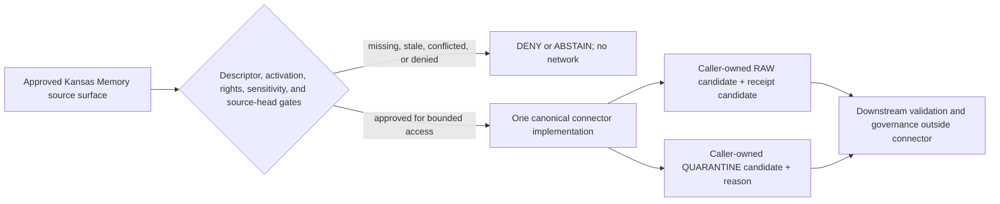

<!-- [KFM_META_BLOCK_V2]
doc_id: kfm://doc/connectors-kansas-memory-readme
title: connectors/kansas_memory/ — Kansas Memory Compatibility Connector Boundary
type: readme
version: v0.2
status: draft
owners: OWNER_TBD — Connector steward · Kansas source steward · Archives steward · Rights reviewer · Sensitivity/privacy reviewer · CARE/cultural/sovereignty reviewer · Validation steward · Docs steward
created: 2026-06-19
updated: 2026-07-12
policy_label: public-doctrine; compatibility-lane; noncanonical-path; implementation-placeholder; rights-fail-closed; sensitivity-fail-closed; care-review; raw-quarantine-receipt-boundary; no-activation; no-publication
current_path: connectors/kansas_memory/README.md
truth_posture: CONFIRMED repository-present compatibility lane and placeholder package / CONFLICTED compatibility class, final package path, SourceDescriptor authority, and local sensitivity floor / PROPOSED migration and admission contracts / UNKNOWN runtime, source activation, and live-source behavior
evidence_snapshot:
  repository: bartytime4life/Kansas-Frontier-Matrix
  base_ref: main
  base_commit: 33b4868deacd99d47e04edfe2548084f6b917ba8
  prior_blob: 15a90739649221b3b9e2a31c221182e10665f7ba
related:
  - ../README.md
  - ../kansas/README.md
  - src/README.md
  - src/kansas_memory/README.md
  - tests/README.md
  - pyproject.toml
  - ../../CONTRIBUTING.md
  - ../../.github/CODEOWNERS
  - ../../docs/doctrine/directory-rules.md
  - ../../docs/sources/catalog/kansas/kansas-memory.md
  - ../../docs/sources/catalog/kansas_memory.md
  - ../../docs/sources/SOURCE_DESCRIPTOR_STANDARD.md
  - ../../contracts/source/source_descriptor.md
  - ../../schemas/contracts/v1/source/source_descriptor.schema.json
  - ../../schemas/contracts/v1/sources/source_descriptor.schema.json
  - ../../data/registry/sources/README.md
  - ../../control_plane/source_authority_register.yaml
  - ../../policy/rights/
  - ../../policy/sensitivity/
  - ../../data/raw/archives/
  - ../../data/quarantine/archives/
  - ../../data/receipts/
  - ../../release/
tags: [kfm, connectors, kansas-memory, kansas, archives, compatibility, placeholder, source-admission, rights, sensitivity, privacy, care, raw, quarantine, receipts, fail-closed, governance]
notes:
  - "The inspected lane contains this README, a version 0.0.0 pyproject placeholder, a src documentation boundary, one placeholder kansas_memory package, and a README-only tests lane."
  - "The package initializer is empty; admit.py and fetch.py are one-line placeholders; descriptor.yaml has unresolved role and rights plus sensitivity_floor: public."
  - "The proposed connectors/kansas/kansas-memory/ child and proposed data/registry/sources/archives/kansas-memory/ path were not found at the pinned base."
  - "The current source profile describes the Kansas family lane as confirmed but the per-institution Kansas Memory adapter as proposed or unknown."
  - "This revision changes documentation only. It does not create code, tests, fixtures, descriptors, registry entries, activation, policy decisions, receipts, releases, path moves, or public artifacts."
[/KFM_META_BLOCK_V2] -->

<a id="top"></a>

# Kansas Memory Compatibility Connector Boundary

> [!IMPORTANT]
> **Document lifecycle:** `draft`  
> **Component maturity:** compatibility documentation with a `0.0.0` placeholder package; runtime `UNKNOWN`  
> **Owner:** `OWNER_TBD`  
> **Authority level:** compatibility lane; exact compatibility class `CONFLICTED / NEEDS VERIFICATION`  
> **Truth posture:** `CONFIRMED` current files and placeholders · `CONFLICTED` path, descriptor authority, and sensitivity default · `PROPOSED` migration and admission rules  
> **Boundary:** this folder does not activate Kansas Memory, establish source truth, decide rights or sensitivity, approve CARE-governed material, write downstream lifecycle state, authorize release, or publish content.

> [!WARNING]
> The current bytes do not prove an executable connector. Do not treat the folder, package name, local descriptor, documentation, commit, pull request, or merge as evidence of source activation or KFM publication.

**Quick links:** [Purpose](#purpose) · [Authority](#authority-level) · [Status](#status) · [Belongs here](#what-belongs-here) · [Exclusions](#what-does-not-belong-here) · [Inputs](#inputs) · [Outputs](#outputs) · [Validation](#validation) · [Review](#review-burden) · [Related folders](#related-folders) · [ADRs](#adrs) · [Snapshot](#current-repository-snapshot) · [Compatibility decision](#compatibility-and-migration-decision) · [Admission boundary](#proposed-admission-boundary) · [Evidence](#evidence-basis) · [Definition of done](#definition-of-done) · [Rollback](#rollback) · [Backlog](#verification-backlog)

---

## Purpose

`connectors/kansas_memory/` is the repository-present top-level compatibility lane for Kansas Memory connector material.

Its current purpose is to preserve path history, document the noncanonical boundary, and prevent placeholder package files from acquiring unearned authority while the repository resolves final placement under the Kansas source-family lane.

The intended audience is connector maintainers, Kansas source stewards, archive and provenance reviewers, rights and sensitivity reviewers, CARE/cultural/sovereignty reviewers, test and validation stewards, and migration reviewers.

This README is an orientation and boundary contract. It is not a source descriptor, activation decision, implementation specification, access agreement, rights decision, sensitivity decision, evidence bundle, release record, or publication surface.

[Back to top](#top)

---

## Authority level

**Compatibility lane; exact class unresolved.**

Directory Rules require each compatibility root to declare one of `legacy`, `mirror`, `deprecated`, `external-export`, or `transitional`. Current repository evidence does not safely establish which class applies here:

- `legacy` would imply this path was once canonical and has been superseded; that history was not verified;
- `transitional` would require an active migration decision, ADR or migration note, mapping, and rollback evidence; none was verified for this path;
- `mirror` is inaccurate because the package files are not confirmed generated copies of a canonical implementation;
- `deprecated` would require an accepted removal posture and sunset evidence; none was verified;
- `external-export` would require a downstream-consumer contract; none was verified.

Until that decision is accepted, treat this folder as **compatibility / class `CONFLICTED`** and freeze new implementation authority here. Documentation may clarify the boundary; code, descriptors, fixtures, activation state, and policy must not expand by convenience.

The confirmed responsibility root is [`connectors/`](../README.md). The current Kansas family coordination lane is [`connectors/kansas/`](../kansas/README.md). The exact proposed child `connectors/kansas/kansas-memory/` is absent at the pinned base and remains a proposal, not a destination authorized by this README.

[Back to top](#top)

---

## Status

| Item | Status | Evidence-bounded meaning |
|---|---:|---|
| This README | **DRAFT / v0.2** | Reviewable compatibility boundary; not KFM-published. |
| Top-level path | **CONFIRMED** | `connectors/kansas_memory/` is repository-present. |
| Compatibility class | **CONFLICTED** | No accepted path-specific class, ADR, migration note, sunset, or mirror contract was verified. |
| Package metadata | **PLACEHOLDER** | `pyproject.toml` declares only project name and version `0.0.0`. |
| Package runtime | **NOT IMPLEMENTED AT NAMED FILES** | Initializer is empty; `admit.py` and `fetch.py` are one-line placeholders. This does not rule out differently named or unindexed code elsewhere. |
| Local descriptor | **UNSAFE PLACEHOLDER** | `role` and `rights` are unresolved; `sensitivity_floor: public` is not accepted authority. |
| Connector-local tests | **README-ONLY AT INSPECTED PATHS** | No conventional files probed by the tests contract were found; executable coverage remains unknown. |
| Proposed Kansas-family child | **NOT FOUND AT EXACT PATH** | `connectors/kansas/kansas-memory/README.md` returned Not Found at the pinned base. |
| Product registry path | **NOT FOUND AT EXACT PATH** | `data/registry/sources/archives/kansas-memory/README.md` returned Not Found at the pinned base. |
| Source-authority register | **EMPTY / PROPOSED** | `control_plane/source_authority_register.yaml` contains `entries: []`. |
| Source access method | **UNKNOWN** | API, OAI-PMH, IIIF, export, scrape, cadence, terms, and source-head behavior remain unverified. |
| Source activation | **NOT CONFIRMED** | No accepted product descriptor or activation decision was verified. |
| Public release | **DENY BY DEFAULT** | Connector presence and source material do not authorize release. |

Absence claims are bounded to the pinned commit, exact paths, named probes, and indexed searches. They are not universal proof that no differently named or unindexed implementation exists.

[Back to top](#top)

---

## What belongs here

While the compatibility class remains unresolved, this folder may contain only the smallest material needed to make the existing path safe and reviewable:

- this compatibility and migration-boundary README;
- existing placeholder package files, preserved without treating them as runtime authority;
- documentation that identifies the canonical responsibility roots and prevents parallel authority;
- a future compatibility shim only after an accepted migration decision defines owner, callers, behavior, deprecation, tests, and rollback;
- a future path-specific migration pointer or manifest reference after it is accepted in its owning surface;
- temporary compatibility tests only when they prove delegation, no duplicate activation, no duplicate fetch, and deterministic deprecation behavior under an accepted migration.

Any future addition must be necessary for compatibility, smaller than creating a second implementation, and incapable of becoming an independent source client or policy surface.

[Back to top](#top)

---

## What does NOT belong here

Do not add or establish:

- a second Kansas Memory implementation beside a Kansas-family child;
- canonical source-family, product, registry, schema, contract, policy, proof, release, or publication authority;
- a product `SourceDescriptor` or `SourceActivationDecision` owned by package-local YAML;
- live endpoints, credentials, cookies, tokens, access agreements, scrape rules, or schedules without governed source review;
- source payloads, bulk downloads, archival media, OCR corpora, or unclear-rights fixture material;
- living-person data or exact archaeological, sacred, cultural, ecological, private-land, or security-relevant locations;
- direct writes to `WORK`, `PROCESSED`, `CATALOG`, `TRIPLET`, `PUBLISHED`, proof, release, correction, withdrawal, or public-delivery stores;
- rights, sensitivity, privacy, CARE, cultural, sovereignty, attribution, redaction, or release decisions;
- generated summaries, entity links, timelines, map layers, search indexes, embeddings, or AI output presented as source truth;
- machine contracts, schemas, validators, or enums copied into the package as a parallel authority;
- production receipts, evidence bundles, validation reports, review records, release manifests, or rollback cards;
- public API or UI behavior that reads connector internals as a normal path.

[Back to top](#top)

---

## Inputs

### Current inputs

No runtime input contract is implemented or confirmed. The current package files accept no evidenced callable input because they are placeholders.

### Permitted future inputs

If an implementation or compatibility shim is separately approved, inputs must be explicit, caller-supplied, and governed. Candidate inputs include:

- an accepted product-level `SourceDescriptor` reference;
- an active `SourceActivationDecision` or equivalent accepted activation record;
- approved source and collection identifiers;
- reviewed access method, allowed hosts and paths, terms, cadence, and source-head strategy;
- rights, attribution, sensitivity, privacy, cultural, sovereignty, CARE, and access-class decisions;
- injected transport, clock, retry, rate-limit, byte-limit, and cancellation controls;
- caller-owned `RAW`, `QUARANTINE`, and receipt-candidate sinks;
- source-native bytes or metadata supplied by an approved transport;
- correction, withdrawal, supersession, and replay context when applicable.

Missing, stale, conflicted, malformed, or unsafe trust-bearing inputs must fail closed before network access or handoff.

[Back to top](#top)

---

## Outputs

### Current outputs

**None confirmed.** The current placeholders do not evidence fetch, parse, admission, file writes, receipts, or network behavior.

### Permitted future outputs

A separately approved implementation may return caller-owned candidates only:

- source-faithful `RAW` candidate bytes or references plus identity and retrieval metadata;
- `QUARANTINE` candidates with stable reasons and preserved bounded evidence;
- deterministic no-op, deny, abstain, rate-limit, or error outcomes;
- receipt candidates describing the attempted operation without claiming evidence closure or release.

Outcome names and object shapes must come from accepted contracts. This README does not create an enum or schema.

Connector output is not a `PROCESSED` record, catalog entry, triplet assertion, evidence bundle, proof, policy approval, review approval, release decision, public layer, or published claim.

[Back to top](#top)

---

## Validation

### Documentation checks applicable now

- one H1 and logical heading hierarchy;
- KFM Meta Block v2 wrapper preserved with grounded dates, path, base, and prior blob;
- required compatibility-root README sections present in Directory Rules order;
- relative links resolve to repository-present owning surfaces where linked;
- current-state claims remain bounded to the pinned commit and inspected paths;
- proposed paths, interfaces, outcomes, and migration behavior remain labeled;
- no remote badges, tracking images, credentials, source payloads, private data, sensitive locations, or rights-restricted content;
- final newline, balanced fences, readable tables, and valid GitHub callouts;
- exactly one changed path for this documentation task.

### Required future implementation checks

- import and collection produce no network, file, credential, registration, activation, logging, thread, or global-state side effect;
- the unresolved local descriptor is rejected as authority;
- missing product descriptor or activation prevents network access;
- fake transport is the default and unexpected egress fails;
- identities, source fields, ambiguity, rights statements, and provenance remain source-faithful;
- OCR, transcription, entity resolution, and generated summaries remain distinct from source representation;
- unknown rights, sensitivity, privacy, cultural, sovereignty, CARE, archaeology, private-land, and precise-location cases fail closed;
- repeated input is deterministic and does not duplicate fetch, activation, or handoff;
- no code path writes beyond caller-owned raw, quarantine, or receipt candidates;
- compatibility and canonical paths cannot activate or fetch independently;
- accepted repository CI actually collects and runs the intended tests.

No repository-supported Kansas Memory command was verified. Do not invent a build, install, test, lint, or live-source command from the Python package name.

[Back to top](#top)

---

## Review burden

Current CODEOWNERS provides a repository-wide fallback but no Kansas Memory-specific owner. `OWNER_TBD` remains intentional and must not be silently replaced.

At minimum, future substantive changes require review appropriate to their scope:

| Change | Required review posture |
|---|---|
| README-only boundary clarification | Connector or docs steward plus a Kansas source steward when source claims change. |
| Compatibility class, move, deprecation, or removal | Architecture/Directory Rules owner, connector steward, affected callers, migration reviewer, and ADR review when triggered. |
| Endpoint, fetch, parser, or admission behavior | Connector maintainer, source steward, test/validation steward, and security reviewer as applicable. |
| Rights, attribution, redistribution, privacy, or living-person handling | Rights and privacy reviewers; legal or institutional review where required. |
| Cultural, tribal, sovereignty, sacred-place, archaeology, or CARE handling | Appropriate community/steward authority and CARE/cultural/sovereignty reviewer. |
| Descriptor, schema, registry, or activation behavior | Source registry, contract, schema, policy, and control-plane owners; no connector-local unilateral decision. |
| Release or public-client behavior | Release, policy, evidence, citation, public-surface, and domain reviewers outside this folder. |

Passing code review, CI, or merge does not substitute for a required policy, source, community, rights, sensitivity, or release decision.

[Back to top](#top)

---

## Related folders

| Surface | Relationship | Current posture at the pinned base |
|---|---|---:|
| [`../`](../README.md) | Canonical connector responsibility root. | **CONFIRMED v0.3 root contract** |
| [`../kansas/`](../kansas/README.md) | Kansas source-family coordination lane. | **CONFIRMED path / child topology provisional** |
| `../kansas/kansas-memory/` | Proposed per-institution child. | **NOT FOUND AT EXACT PATH** |
| [`src/`](src/README.md) | Compatibility source-layout boundary. | **CONFIRMED v0.2 / placeholder implementation** |
| [`src/kansas_memory/`](src/kansas_memory/README.md) | Package admission boundary. | **CONFIRMED v0.2 / placeholder package** |
| [`tests/`](tests/README.md) | Connector-local proposed test contract. | **CONFIRMED v0.2 / executable suite not confirmed** |
| [`pyproject.toml`](pyproject.toml) | Package metadata placeholder. | **CONFIRMED project version 0.0.0 only** |
| [`../../docs/sources/catalog/kansas/kansas-memory.md`](../../docs/sources/catalog/kansas/kansas-memory.md) | Current human-facing source profile. | **CONFIRMED v0.2 / several implementation claims remain proposed or stale** |
| [`../../docs/sources/catalog/kansas_memory.md`](../../docs/sources/catalog/kansas_memory.md) | Older flat catalog pointer. | **CONFIRMED lineage stub** |
| [`../../docs/doctrine/directory-rules.md`](../../docs/doctrine/directory-rules.md) | Placement, compatibility, migration, and README requirements. | **CONFIRMED v1.4** |
| [`../../contracts/source/source_descriptor.md`](../../contracts/source/source_descriptor.md) | SourceDescriptor meaning. | **CONFIRMED draft contract** |
| [`../../schemas/contracts/v1/source/source_descriptor.schema.json`](../../schemas/contracts/v1/source/source_descriptor.schema.json) | Populated singular-path schema that declares itself legacy. | **CONFIRMED PROPOSED / authority conflicted** |
| [`../../schemas/contracts/v1/sources/source_descriptor.schema.json`](../../schemas/contracts/v1/sources/source_descriptor.schema.json) | Nominal canonical plural-path schema. | **CONFIRMED empty permissive PROPOSED scaffold** |
| [`../../data/registry/sources/`](../../data/registry/sources/README.md) | Governed descriptor and activation responsibility. | **CONFIRMED registry contract / product entry unverified** |
| [`../../control_plane/source_authority_register.yaml`](../../control_plane/source_authority_register.yaml) | Machine source-authority register. | **CONFIRMED PROPOSED / entries empty** |
| [`../../policy/rights/`](../../policy/rights/README.md) | Rights policy home. | **CONFIRMED greenfield README stub** |
| [`../../policy/sensitivity/`](../../policy/sensitivity/README.md) | Sensitivity policy home. | **CONFIRMED greenfield README stub** |
| `../../data/raw/archives/` | Proposed caller-owned admitted candidate surface named by adjacent docs. | **OUTSIDE CONNECTOR / exact path content unverified** |
| `../../data/quarantine/archives/` | Proposed caller-owned hold surface named by adjacent docs. | **OUTSIDE CONNECTOR / exact path content unverified** |
| [`../../data/receipts/`](../../data/receipts/README.md) | Process-memory receipts. | **OUTSIDE CONNECTOR** |
| [`../../release/`](../../release/README.md) | Promotion, release, correction, withdrawal, and rollback authority. | **OUTSIDE CONNECTOR** |

[Back to top](#top)

---

## ADRs

No accepted path-specific ADR or migration record governing `connectors/kansas_memory/` was verified at the pinned base.

An ADR or equivalently governed structural decision is required before this lane is moved, split, made canonical, turned into a mirror, assigned a deprecation sunset, or used to create parallel authority. A future decision should cover:

- the compatibility class and reason the path exists;
- final product identity and slug;
- old-to-new package, import, documentation, fixture, test, and registry mappings;
- caller and reference inventory;
- descriptor/schema/registry authority;
- activation ownership and duplicate-run prevention;
- deprecation, warning, sunset, and removal criteria;
- verification window, migration manifest, rollback, and correction handling.

The existing Directory Rules and source-profile statements do not by themselves complete that decision.

[Back to top](#top)

---

## Last reviewed

**2026-07-12**, against repository `bartytime4life/Kansas-Frontier-Matrix` at pinned base commit `33b4868deacd99d47e04edfe2548084f6b917ba8`.

Review scope was bounded to the target, named adjacent files, exact path probes, indexed searches, repository metadata, and current GitHub state. No live Kansas Memory source, local checkout, package runner, external CI system, or unindexed repository inventory was inspected.

[Back to top](#top)

---

## Current repository snapshot

```text
connectors/kansas_memory/
├── README.md
├── pyproject.toml                         # project name + version 0.0.0 only
├── src/
│   ├── README.md                          # v0.2 layout boundary
│   └── kansas_memory/
│       ├── README.md                      # v0.2 package boundary
│       ├── __init__.py                    # empty
│       ├── admit.py                       # one-line placeholder
│       ├── fetch.py                       # one-line placeholder
│       └── descriptor.yaml                # unresolved four-field placeholder
└── tests/
    └── README.md                          # v0.2 test contract; no suite confirmed
```

This is a path-bounded snapshot of directly inspected files, not proof of a complete recursive tree.

### Local descriptor conflict

The package-local descriptor currently contains:

The current bytes are shown below for review; they are not accepted source authority.

```yaml
name: kansas_memory
role: TBD
rights: TBD
sensitivity_floor: public
```

It must fail closed because:

- role and rights are unresolved;
- `public` is not a safe sensitivity default for archival material;
- the source profile requires review for living-person, cultural, sovereignty, CARE, archaeology, sacred-place, private-land, and rights-limited cases;
- the product registry path is absent and the machine authority register is empty;
- SourceDescriptor schema authority is itself conflicted between a populated legacy path and an empty nominal canonical scaffold.

No test, documentation statement, or package import may promote this placeholder into activation authority.

[Back to top](#top)

---

## Compatibility and migration decision

The repository currently exposes three distinct facts:

1. `connectors/kansas_memory/` exists and contains placeholder package material.
2. `connectors/kansas/` exists as the Kansas family coordination lane.
3. `connectors/kansas/kansas-memory/` does not exist at the exact path inspected.

Those facts do not choose a migration outcome. Maintainers must select and govern one of these broad options:

| Option | Required evidence before acceptance |
|---|---|
| Remove the placeholder lane | Caller/reference inventory, no-consumer evidence, transparent deletion PR, rollback, and any required correction/deprecation record. |
| Retain a compatibility shim | One canonical implementation, explicit delegation, no independent activation or fetch, warnings/deprecation behavior, parity tests, sunset or retention rationale, and rollback. |
| Move implementation under the Kansas family | Accepted child identity, atomic path/reference migration, descriptor and activation mapping, tests, migration manifest, deprecation register entry when applicable, verification window, and rollback. |
| Keep this path as the implementation | Accepted exception explaining why the top-level lane is canonical, Directory Rules and source-profile reconciliation, removal of competing path claims, ownership, tests, and rollback. |

This README selects none of those options. Until a decision is accepted, new runtime work should not deepen the ambiguous top-level path.

[Back to top](#top)

---

## Proposed admission boundary

The following boundary is **PROPOSED** for any future implementation, regardless of final package path:



The connector edge must:

- use no network by default and accept an injected transport;
- preserve source, collection, item, component, page, scan, file, retrieval, and correction identities where applicable;
- preserve source-native rights, attribution, restriction, sensitivity, and uncertainty fields;
- distinguish digitized representation, source metadata, OCR, transcription, entity resolution, interpretation, and generated summary;
- produce stable bounded outcomes and reason codes from accepted contracts;
- keep raw/quarantine/receipt candidates caller-owned;
- make replay, no-op, drift, retry, correction, withdrawal, and supersession behavior explicit;
- refuse direct downstream writes or public behavior.

No source request is allowed merely because the diagram exists.

[Back to top](#top)

---

## Archive evidence and anti-collapse rules

1. Kansas Memory is a source family or product identity, not a product descriptor, activation decision, policy approval, or release decision.
2. A repository path, local descriptor, package version, passing test, commit, pull request, or merge does not activate a source.
3. A digitized representation is not the original physical object.
4. Source metadata is not automatically a verified historical claim.
5. OCR is not source transcription; transcription is not authorial text when editorial intervention occurred.
6. A name or place string is not a resolved entity without explicit evidence and uncertainty.
7. Archive presence does not resolve rights, privacy, cultural authority, sovereignty, CARE obligations, or public precision.
8. Evidence references must resolve through governed evidence and policy surfaces before consequential use.
9. Derived summaries, maps, timelines, graphs, embeddings, and AI explanations remain downstream interpretations.
10. Publication is a governed state transition through the KFM trust membrane, not connector output or GitHub state.

[Back to top](#top)

---

## Lifecycle boundary

The governing lifecycle remains:

```text
RAW -> WORK / QUARANTINE -> PROCESSED -> CATALOG / TRIPLET -> PUBLISHED
```

This connector lane may participate only at the external-source edge and candidate handoff boundary. `WORK`, `PROCESSED`, `CATALOG`, `TRIPLET`, `PUBLISHED`, proof, policy, review, correction, withdrawal, and release state remain caller- or downstream-owned.

Receipts are process memory. Proofs are integrity or evidence objects. Catalog entries are discovery and provenance surfaces. Release manifests and rollback cards govern publication state. None substitutes for another, and none may be minted as production authority by this placeholder package.

[Back to top](#top)

---

## Failure and security posture

- Missing or invalid descriptor: deny or quarantine before network access.
- Missing or inactive activation: deny before network access.
- Unknown or conflicting rights: deny or quarantine; never assume public domain.
- Unknown or conflicting sensitivity: deny, quarantine, redact/generalize for review, or abstain; never default to public.
- Cultural, sovereignty, CARE, sacred-place, archaeology, burial, private-land, or living-person concern: route to appropriate restricted review; do not expose exact content or location.
- Redirect to an unapproved, private, local, or metadata-service host: deny.
- Oversized, compressed, malformed, truncated, or unexpected content: bounded error or quarantine.
- Source drift or identity ambiguity: preserve evidence and quarantine; do not overwrite.
- Logging: redact credentials, cookies, authorization headers, signed URLs, restricted endpoints, payloads, and sensitive identifiers.
- Package import: no file writes, network, credential reads, registration, activation, thread start, or global-state mutation.
- Failure diagnostics: bounded and non-sensitive; never dump source payloads or private material.

[Back to top](#top)

---

## Evidence basis

| Evidence | Status | Supports | Does not prove |
|---|---:|---|---|
| Target blob `15a90739649221b3b9e2a31c221182e10665f7ba` | **CONFIRMED** | Exact v0.1 baseline, prior claims, remote badges, and unresolved rollback placeholder. | Runtime or source activation. |
| `pyproject.toml` blob `e356c91de5e571b505a82419262cbfa86c02e3c7` | **CONFIRMED** | Project name and version `0.0.0` only. | Buildability, dependencies, entry points, installability, or supported Python. |
| Package blobs for initializer, `admit.py`, `fetch.py`, and descriptor | **CONFIRMED** | Empty or one-line implementation placeholders and unresolved local YAML. | Safe import, fetch, parse, admission, or descriptor validity. |
| v0.2 source-layout, package, and test READMEs | **CONFIRMED documentation** | Current bounded child contracts and conflicts. | Executable behavior, coverage, or CI collection. |
| Exact proposed child and registry-path probes | **NOT FOUND AT PINNED BASE** | Named paths were absent. | Absence of every differently named or unindexed path. |
| Current Kansas Memory source profile | **CONFIRMED v0.2 document** | Intended source role, archive meaning, fail-closed rights/sensitivity/CARE posture, and proposed per-institution path. | Current endpoint, terms, connector, product descriptor, activation, or release. |
| Directory Rules v1.4 | **CONFIRMED doctrine** | Connector root, compatibility classes, migration discipline, and required README contract. | Which compatibility class maintainers have accepted for this path. |
| SourceDescriptor contract and two schema files | **CONFIRMED / CONFLICTED** | Descriptor meaning and current singular/plural authority mismatch. | Accepted final machine authority or valid Kansas Memory descriptor. |
| Source registry README and machine authority register | **CONFIRMED** | Registry/control-plane responsibility and empty machine entries. | Product activation or external systems not inspected. |
| Rights and sensitivity README files | **CONFIRMED greenfield stubs** | Named policy roots exist. | Implemented policy coverage or approval for Kansas Memory. |
| CONTRIBUTING, CODEOWNERS, and PR template | **CONFIRMED convention** | Small reversible changes, truth labels, fallback ownership, PR evidence, and rollback expectations. | Package-specific ownership or semantic approval. |

[Back to top](#top)

---

## Definition of done

### Documentation readiness for this revision

- [x] Current repository, base commit, prior blob, path, and review date are recorded.
- [x] Required compatibility-root README sections appear in Directory Rules order.
- [x] Actual placeholder package and README-only test posture are explicit.
- [x] Proposed child and registry paths are not presented as existing.
- [x] Compatibility class and SourceDescriptor authority conflicts remain visible.
- [x] Rights, sensitivity, privacy, CARE, cultural, sovereignty, archaeology, private-land, and precise-location controls fail closed.
- [x] No badges, source payloads, credentials, personal records, sensitive locations, policy decisions, activation state, or public artifacts are introduced.
- [x] Rollback and remaining decisions are reviewable.

### Compatibility-lane resolution

- [ ] Assign accountable connector, source, archive, rights, sensitivity, CARE, validation, test, and docs owners.
- [ ] Accept the compatibility class and record the rationale.
- [ ] Accept final source/product ID, package path, slug, and import strategy.
- [ ] Inventory callers, imports, docs, fixtures, tests, workflows, registries, receipts, and downstream references.
- [ ] Resolve SourceDescriptor contract, schema, registry, validator, and activation authority.
- [ ] Create and validate a product-level descriptor and activation decision if source use is approved.
- [ ] Resolve current access method, terms, credentials posture, cadence, limits, source head, and correction behavior.
- [ ] Resolve item-class rights, attribution, redistribution, privacy, sensitivity, public precision, cultural, sovereignty, and CARE posture.
- [ ] Implement one canonical connector, hermetic tests, fake transport, and duplicate-run prevention if approved.
- [ ] Complete migration/deprecation records, parity tests, verification window, and rollback drill if the path changes.
- [ ] Confirm public-client and release boundaries remain governed and connector-independent.

Documentation readiness does not imply implementation readiness, source activation, evidence closure, rights approval, sensitivity approval, community authorization, release readiness, or publication.

[Back to top](#top)

---

## Rollback

Rollback is required if this README is used to justify canonical status, a selected migration, source activation, live harvesting, descriptor authority, public sensitivity, rights approval, unsafe fixture commits, direct downstream writes, public archive claims, release, or publication.

Before merge, leave the review branch unmerged. Closing the pull request or deleting its branch requires separate authorization.

After merge, restore prior README blob `15a90739649221b3b9e2a31c221182e10665f7ba` from base commit `33b4868deacd99d47e04edfe2548084f6b917ba8` through a transparent revert commit or revert pull request, then rerun applicable documentation and connector-boundary validation. Do not reset, force-push, or rewrite shared history.

[Back to top](#top)

---

## Verification backlog

| Item | Status | Needed evidence |
|---|---:|---|
| Confirm complete lane inventory and import/reference graph. | **UNKNOWN** | Non-truncated tree, code, import, workflow, fixture, and caller search. |
| Select compatibility class. | **CONFLICTED** | Accepted ADR or path-specific migration/deprecation decision. |
| Resolve final package path and slug. | **CONFLICTED** | Accepted identity and placement decision plus mapping and rollback. |
| Reconcile flat/nested source-profile lineage and stale implementation claims. | **CONFLICTED** | Source-doc review and current-session path evidence. |
| Resolve SourceDescriptor contract/schema/registry/validator authority. | **CONFLICTED** | Accepted contract/ADR and one enforceable schema path. |
| Dispose of or replace the local descriptor placeholder. | **NEEDS VERIFICATION** | Governed descriptor reference, migration, tests, and rollback. |
| Confirm Kansas Memory product ID, publisher identity, collection hierarchy, and item identity. | **NEEDS VERIFICATION** | Current authoritative source documentation and source-steward review. |
| Confirm access modality, allowed endpoint, terms, authentication, cadence, rate limits, and source-head behavior. | **UNKNOWN** | Current primary source documentation and reviewed probe plan. |
| Confirm item-class rights, attribution, caching, redistribution, OCR/transcription, derivative, training, withdrawal, and correction terms. | **NEEDS VERIFICATION** | Rights review and current authoritative terms. |
| Confirm living-person, cultural, tribal, sovereignty, sacred-place, archaeology, burial, private-land, and public-precision handling. | **NEEDS VERIFICATION** | Policy and appropriate steward/community review. |
| Confirm package build, dependencies, public API, transport, parser, admission outcomes, and sinks. | **UNKNOWN** | Implemented code, accepted contracts, and observed tests. |
| Confirm fixture home and fixture review/retention rules. | **UNKNOWN** | Accepted fixture contract, registry, and review receipts. |
| Confirm runner, commands, markers, CI collection, and coverage. | **UNKNOWN** | Repository configuration and successful substantive logs. |
| Confirm migration consumers, warnings, parity, sunset, removal, and rollback drill. | **PROPOSED** | Accepted migration plan and observed validation. |
| Confirm no public client imports or reads this package directly. | **UNKNOWN** | Complete dependency and runtime-boundary inspection. |

[Back to top](#top)

---

## Maintainer note

Do not deepen ambiguity. First decide whether this path is legacy, transitional, deprecated, a mirror, an external export, or an accepted exception. Then implement one source client, one descriptor/activation authority, one test strategy, and one rollback path.

Until then, preserve the placeholders as evidence of repository state, reject them as runtime authority, and keep Kansas Memory material behind source, rights, sensitivity, privacy, CARE, provenance, validation, review, and release gates.

[Back to top](#top)
