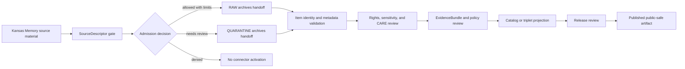

<!-- [KFM_META_BLOCK_V2]
doc_id: kfm://doc/connectors-kansas-memory-readme
title: connectors/kansas_memory/ — Kansas Memory Compatibility Connector Lane
type: readme
version: v0.1
status: draft
owners: OWNER_TBD — Connector steward · Kansas source steward · Archives steward · Rights reviewer · Sensitivity reviewer · CARE/cultural review steward · Validation steward · Docs steward
created: 2026-06-19
updated: 2026-06-19
policy_label: public-doctrine; compatibility-lane; noncanonical-path; archives-source; rights-gated; sensitivity-gated; no-publication
proposed_path: connectors/kansas_memory/README.md
truth_posture: CONFIRMED path exists / NONCANONICAL compatibility README / CANONICAL HOME NEEDS VERIFICATION
related:
  - ../README.md
  - ../kansas/README.md
  - ../kansas/kansas-memory/README.md
  - ../../docs/sources/catalog/kansas/kansas-memory.md
  - ../../docs/sources/catalog/kansas/kansas-state-archives.md
  - ../../docs/sources/catalog/kansas/khri.md
  - ../../docs/sources/catalog/kansas/README.md
  - ../../docs/standards/oai-pmh.md
  - ../../docs/standards/iiif.md
  - ../../docs/standards/snac-eac-cpf.md
  - ../../docs/sources/SOURCE_DESCRIPTOR_STANDARD.md
  - ../../data/registry/sources/archives/kansas-memory/
  - ../../data/raw/archives/
  - ../../data/quarantine/archives/
  - ../../fixtures/
  - ../../schemas/contracts/v1/source/
  - ../../policy/sensitivity/
  - ../../policy/rights/
  - ../../release/
tags: [kfm, connectors, kansas-memory, kansas, archives, kshs, digital-collections, compatibility, oai-pmh, iiif, rights, sensitivity, care, source-admission, raw, quarantine, governance]
notes:
  - "This README replaces a thin greenfield stub at a legacy-style top-level connector path."
  - "The Kansas Memory source page states the source catalog path moved from a flat underscore slug to `docs/sources/catalog/kansas/kansas-memory.md`."
  - "The Kansas Memory source page says the connector implementation lives under `connectors/kansas/kansas-memory/` as a proposed per-institution path within the confirmed `connectors/kansas/` lane."
  - "This top-level `connectors/kansas_memory/` path is therefore documented as a compatibility lane, not a new canonical authority root."
  - "Kansas Memory rights terms, API/access surface, item-count denominator, activation, fixtures, tests, and public-release classes remain NEEDS VERIFICATION."
  - "Connector output may enter RAW or QUARANTINE handoff only; downstream validation, EvidenceBundle closure, rights/sensitivity/CARE review, catalog/triplet projection, release review, publication, correction, and rollback remain outside this folder."
[/KFM_META_BLOCK_V2] -->

<a id="top"></a>

# Kansas Memory Compatibility Connector Lane

> Compatibility README for the existing top-level `connectors/kansas_memory/` path. This path is **not** the canonical connector home; Kansas Memory connector work belongs under the canonical `connectors/kansas/` source-family lane unless an ADR or migration decision says otherwise.

<p>
  
  
  
  
  
</p>

> [!IMPORTANT]
> **Status:** compatibility / noncanonical-path README · **Owner:** `OWNER_TBD`  
> **Path:** `connectors/kansas_memory/README.md`  
> **Truth posture:** `CONFIRMED` file exists · `NONCANONICAL` compatibility path · `NEEDS VERIFICATION` canonical implementation home  
> **Boundary:** source-admission compatibility only; no public archive release, no direct publication, no rights/sensitivity/CARE bypass, no canonical-family claim.

**Quick jumps:** [Scope](#scope) · [Repo fit](#repo-fit) · [Accepted inputs](#accepted-inputs) · [Exclusions](#exclusions) · [Evidence ledger](#evidence-ledger) · [Lifecycle diagram](#lifecycle-diagram) · [Admission posture](#admission-posture) · [Anti-collapse rules](#anti-collapse-rules) · [Validation](#validation) · [Rollback](#rollback) · [Verification backlog](#verification-backlog)

---

## Scope

`connectors/kansas_memory/` is retained here only as a compatibility lane because the path already exists.

The Kansas Memory source page documents a migration away from the flat underscore slug and identifies Kansas Memory as a Kansas-family archives source. It also states that connector implementation is expected under `connectors/kansas/kansas-memory/` as a proposed per-institution path within the confirmed `connectors/kansas/` lane.

This file may document the compatibility boundary, migration intent, and source-admission rules. It must not become the canonical connector home unless an ADR or migration decision explicitly authorizes that exception.

[Back to top ↑](#top)

---

## Repo fit

| Surface | Role | Status |
|---|---|---:|
| `connectors/kansas_memory/` | Existing top-level compatibility path. | **CONFIRMED path / NONCANONICAL** |
| `connectors/kansas/` | Canonical Kansas connector-family lane. | **CONFIRMED via source page** |
| `connectors/kansas/kansas-memory/` | Proposed Kansas Memory connector home named by the source page. | **PROPOSED / NEEDS VERIFICATION** |
| `docs/sources/catalog/kansas/kansas-memory.md` | Human-facing Kansas Memory source profile. | **CONFIRMED** |
| `data/registry/sources/archives/kansas-memory/` | Proposed SourceDescriptor registry home. | **PROPOSED / NEEDS VERIFICATION** |
| `data/raw/archives/` | Candidate RAW handoff target. | **PROPOSED / NEEDS VERIFICATION** |
| `data/quarantine/archives/` | Candidate quarantine handoff target. | **PROPOSED / NEEDS VERIFICATION** |
| `policy/rights/` and `policy/sensitivity/` | Rights and sensitivity authority. | **Outside connector** |
| `release/` | Release and publication controls. | **Out of scope for this compatibility lane** |

[Back to top ↑](#top)

---

## Accepted inputs

Accepted content for this noncanonical compatibility path:

- README-level migration and compatibility notes;
- links to the canonical Kansas source-family lane;
- notes that prevent this top-level path from becoming a parallel authority;
- temporary fixture or test notes only if they are explicitly migration-bound;
- adapter notes for OAI-PMH, IIIF, SNAC/EAC-CPF, or other archive access surfaces, if verified by source review;
- quarantine criteria for unresolved rights, cultural sensitivity, living-person content, collection identity, item identity, metadata shape, or access-method questions.

New implementation code should prefer the canonical Kansas family lane unless an ADR says otherwise.

---

## Exclusions

This folder must not contain or imply authority over:

- canonical connector-family status;
- public archive release decisions;
- public item summaries presented as authoritative history;
- direct writes to `PROCESSED`, `CATALOG`, `TRIPLET`, `PUBLISHED`, proof, receipt, or release stores;
- SourceDescriptor authority records;
- policy or schema authority;
- rights, sensitivity, cultural-care, or living-person release decisions;
- generated summaries presented as authoritative source truth;
- source activation without SourceDescriptor, rights, sensitivity, cultural-care, provenance, and review checks.

Redirect implementation and source-family authority to the canonical `connectors/kansas/` lane once verified.

[Back to top ↑](#top)

---

## Evidence ledger

| Source | Status | Supports | Limits |
|---|---:|---|---|
| `connectors/kansas_memory/README.md` | **CONFIRMED** | Target file exists and previously contained only a greenfield stub. | Does not prove implementation files, tests, or CI. |
| `docs/sources/catalog/kansas/kansas-memory.md` | **CONFIRMED** | Kansas Memory is a Kansas archives source; rights, API surface, and item-count details remain verification items; canonical connector work belongs under `connectors/kansas/`. | Does not prove current access method or connector activation. |
| `connectors/kansas/README.md` | **CONFIRMED** | Kansas connector family is the canonical source-admission lane for Kansas source products. | Does not prove the proposed `kansas-memory/` child exists. |
| `connectors/kansas/kansas-memory/` | **NEEDS VERIFICATION** | Named as proposed connector implementation home by source page. | Actual path/file presence is not verified in this update. |

---

## Lifecycle diagram



[Back to top ↑](#top)

---

## Admission posture

Expected behavior for Kansas Memory source-admission work:

- no live source access unless explicitly enabled and reviewed;
- no source fetch without an accepted SourceDescriptor and activation decision;
- no implicit publication from retrieved source material;
- no use of archive item text or metadata as public truth without evidence, citation, rights, sensitivity, and review gates;
- no loss of collection identity, item identity, source URI, title/creator/date fields, rights statement, cultural-care flags, sensitivity flags, access method, retrieval time, source role, review, or release-class metadata;
- unclear rights, sensitivity, cultural-care concerns, living-person concerns, item identity, source identity, access method, metadata shape, or schema drift routes to quarantine or abstention.

---

## Anti-collapse rules

The Kansas Memory source profile identifies the controlling anti-collapse stack:

1. Kansas Memory is a source-family record, not a SourceDescriptor or activation decision.
2. A digitized item or metadata row is evidence, not an automatic public historical claim.
3. Rights, API/access surface, item-count denominator, and activation remain verification work.
4. Archives material may carry cultural sensitivity, living-person, sovereignty, or rights concerns and must fail closed until reviewed.
5. Public release is a governed state transition, not a connector output.
6. Derived summaries, maps, timelines, search indexes, joins, and AI explanations are downstream carriers, not sovereign truth.

---

## Validation

Compatibility-lane validation should check that:

- the path is not treated as canonical without ADR/migration evidence;
- source metadata is preserved;
- SourceDescriptor references are required for activation;
- rights, sensitivity, and cultural-care states are explicit before promotion-track use;
- collection identity, item identity, source URI, title/creator/date fields, access method, retrieval time, source role, review, and vintage fields are explicit where available;
- malformed or incomplete records fail closed;
- records with unclear rights, unresolved sensitivity, unresolved cultural-care concerns, unresolved item identity, unresolved source role, or unresolved metadata shape route to quarantine;
- connector output is limited to RAW or QUARANTINE handoff;
- no connector run writes directly to processed, catalog, triplet, published, proof, receipt, or release stores.

Root-level validation, policy-as-code, EvidenceBundle closure, release review, public caveats, and rollback remain outside this compatibility lane.

[Back to top ↑](#top)

---

## Definition of done

This compatibility README is ready for first review when:

- [ ] Kansas Memory source page is linked and current enough for review.
- [ ] A migration or ADR decision resolves whether to remove this top-level path, keep it as a redirect, or move content under `connectors/kansas/kansas-memory/`.
- [ ] Canonical Kansas Memory implementation home is verified.
- [ ] SourceDescriptor home and Kansas Memory source ID are verified.
- [ ] Rights terms, access method, item identity rules, and sensitivity/CARE checks are verified by source steward review.
- [ ] Live source access is disabled by default for connector code.
- [ ] Metadata identity, rights, sensitivity, cultural-care, source-role, and anti-collapse checks are represented in tests.
- [ ] Connector output is limited to RAW or QUARANTINE handoff.
- [ ] No public archive claims are created by connector code.

---

## Rollback

Rollback is required if this README is used to justify canonical-family status, direct publication, source activation, rights/sensitivity/CARE bypass, public historical claims, or direct writes beyond RAW/QUARANTINE handoff.

Rollback target:

```text
commit prior to this update: SHA_TBD_AFTER_GIT_HISTORY_CHECK
```

Because the previous file was only a greenfield stub, a safe rollback is to restore that stub or replace this document with a shorter redirect-only README until canonical placement is resolved.

---

## Verification backlog

| Item | Status | Needed evidence |
|---|---:|---|
| Confirm canonical Kansas Memory connector path. | **NEEDS VERIFICATION** | Directory Rules, ADR, migration note, or repo tree. |
| Confirm whether this top-level path should remain. | **NEEDS VERIFICATION** | ADR or migration decision. |
| Confirm SourceDescriptor home and Kansas Memory source ID. | **NEEDS VERIFICATION** | Source registry entry and accepted schema. |
| Confirm current access method, item identity, and metadata shape. | **NEEDS VERIFICATION** | Source steward review and current source documentation. |
| Confirm rights and sensitivity handling. | **NEEDS VERIFICATION** | Rights review, sensitivity review, and policy references. |
| Confirm cultural-care review handling. | **NEEDS VERIFICATION** | Policy references and review receipts. |
| Confirm fixture strategy and CI wiring. | **NEEDS VERIFICATION** | Fixture registry, workflow files, and test logs. |

---

## Maintainer note

Do not build new authority here. This existing underscore path should either stay a clear compatibility pointer or be removed after migration. Implementation should converge under the canonical Kansas source-family lane unless an ADR says otherwise.

[Back to top ↑](#top)
