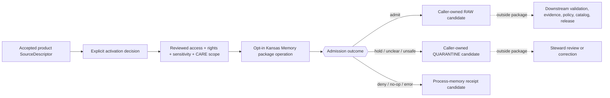

<!-- [KFM_META_BLOCK_V2]
doc_id: kfm://doc/connectors-kansas-memory-src-package-readme
title: connectors/kansas_memory/src/kansas_memory/ — Kansas Memory Compatibility Package Admission Boundary
type: readme
version: v0.2
status: draft
owners: OWNER_TBD — Connector steward · Kansas source steward · Archives steward · Rights reviewer · Sensitivity/privacy reviewer · CARE/cultural/sovereignty reviewer · Validation steward · Package maintainer · Docs steward
created: 2026-06-19
updated: 2026-07-12
policy_label: public-doctrine; package-boundary; noncanonical-compatibility-lane; placeholder-runtime; no-network-default; rights-fail-closed; sensitivity-fail-closed; care-review; no-activation; no-publication
current_path: connectors/kansas_memory/src/kansas_memory/README.md
truth_posture: CONFIRMED current package scaffold and inspected files / CONFLICTED canonical package path, catalog lineage, SourceDescriptor schema authority, and local descriptor posture / PROPOSED package admission contract / UNKNOWN source access, tests, activation, runtime, and CI depth
evidence_snapshot:
  repository: bartytime4life/Kansas-Frontier-Matrix
  base_ref: main
  base_commit: 8df2275382850b805c9ebc83a3dc7f4a2dd2169a
  prior_blob: c61a5bc9b0e1e45df33020816ff9949d66421dc2
  readme_introduction_commit: 56384daedec28c89482fb046db2efcd70474379c
related:
  - ../../../README.md
  - ../../README.md
  - ../README.md
  - ../../tests/README.md
  - ../../pyproject.toml
  - ../../../kansas/README.md
  - ../../../kansas/kansas-memory/README.md
  - ../../../../CONTRIBUTING.md
  - ../../../../.github/CODEOWNERS
  - ../../../../docs/doctrine/directory-rules.md
  - ../../../../docs/sources/catalog/kansas/kansas-memory.md
  - ../../../../docs/sources/catalog/kansas_memory.md
  - ../../../../docs/sources/SOURCE_DESCRIPTOR_STANDARD.md
  - ../../../../contracts/source/source_descriptor.md
  - ../../../../schemas/contracts/v1/source/source_descriptor.schema.json
  - ../../../../schemas/contracts/v1/sources/source_descriptor.schema.json
  - ../../../../data/registry/sources/README.md
  - ../../../../control_plane/source_authority_register.yaml
  - ../../../../policy/rights/
  - ../../../../policy/sensitivity/
  - ../../../../data/raw/archives/
  - ../../../../data/quarantine/archives/
  - ../../../../data/receipts/
  - ../../../../release/
tags: [kfm, connectors, kansas-memory, python, package, archives, compatibility, placeholder, source-admission, rights, sensitivity, care, raw, quarantine, receipts, governance]
notes:
  - "The package path and five package-local files are verified at the pinned base: README.md, empty __init__.py, one-line admit.py placeholder, one-line fetch.py placeholder, and a four-field descriptor.yaml placeholder."
  - "The parent pyproject.toml is also a greenfield placeholder with project name kfm-connector-kansas_memory and version 0.0.0; it does not prove a buildable or runnable package."
  - "The local descriptor.yaml is not a governed SourceDescriptor, registry record, activation decision, or safe sensitivity authority. Its role and rights are TBD, and its sensitivity_floor: public conflicts with the review-required/fail-closed posture in the current Kansas Memory source profile."
  - "The populated singular-path SourceDescriptor schema declares itself legacy and requires a much richer object, while the nominal plural-path schema is an empty PROPOSED scaffold. This README does not select a schema authority."
  - "The existing top-level underscore package remains a noncanonical compatibility lane. The proposed Kansas-family child path is absent at the pinned base, and no accepted path-specific ADR or migration record was verified."
  - "Only this Markdown file is in scope. No code, descriptor, registry record, fixture, test, policy, schema, workflow, receipt, source activation, path move, release object, or public artifact is created or changed."
[/KFM_META_BLOCK_V2] -->

<a id="top"></a>

# Kansas Memory Compatibility Package Admission Boundary

> [!IMPORTANT]
> **Document lifecycle:** `draft`  
> **Component maturity:** repository-present greenfield package scaffold; executable behavior `UNKNOWN`  
> **Owner:** `OWNER_TBD`  
> **Truth posture:** `CONFIRMED` current package files and placeholder bytes · `CONFLICTED` canonical placement, catalog lineage, descriptor authority, and local descriptor posture · `PROPOSED` package admission contract  
> **Boundary:** source-admission support only. This package does not activate Kansas Memory, decide source role or rights, classify material as public, establish historical truth, publish archive content, serve public clients, or authorize release.

> [!WARNING]
> **`descriptor.yaml` is an unsafe placeholder, not authority.** It contains `role: TBD`, `rights: TBD`, and `sensitivity_floor: public`. It is absent from the inspected source registry, cannot satisfy the populated singular-path schema's required field set, and conflicts with the source profile's review-required, rights-unknown, CARE-aware posture. Code and operators must fail closed rather than use it as an activation, rights, role, sensitivity, or release decision.

**Quick links:** [Purpose](#purpose) · [Authority level](#authority-level) · [Status](#status) · [Current package snapshot](#current-repository-snapshot-and-package-map) · [What belongs here](#what-belongs-here) · [What does not belong here](#what-does-not-belong-here) · [Inputs](#inputs) · [Outputs](#outputs) · [Runtime boundary](#runtime-and-admission-boundary) · [Descriptor warning](#local-descriptor-and-authority-conflicts) · [Archive meaning](#archive-evidence-and-anti-collapse-rules) · [Validation](#validation) · [Review burden](#review-burden) · [Related folders](#related-folders) · [ADRs](#adrs) · [Last reviewed](#last-reviewed) · [Evidence basis](#evidence-basis) · [Definition of done](#definition-of-done) · [Rollback](#rollback) · [Verification backlog](#verification-backlog)

---

<a id="scope"></a>

## Purpose

`connectors/kansas_memory/src/kansas_memory/` is the repository-present Python package scaffold inside the noncanonical `connectors/kansas_memory/` compatibility lane.

Its permitted future responsibility is deliberately narrow: preserve source-native Kansas Memory package or record identity, parse explicitly admitted material without upgrading its meaning, and return auditable admission candidates to caller-owned `RAW`, `QUARANTINE`, or process-memory receipt handling.

This package is not the Kansas Memory source catalog, governed source registry, source-role authority, rights or sensitivity decision engine, archival interpretation layer, evidence-closure service, public API, map layer, search index, release workflow, or publication surface.

The current bytes prove only that a scaffold exists. They do not prove a working connector, valid descriptor, safe endpoint, parser, package installation, tests, source activation, or runtime behavior.

[Back to top](#top)

---

<a id="repo-fit"></a>

## Authority level

**Implementation package scaffold inside a noncanonical compatibility lane; final migration class and canonical home remain unresolved.**

| Concern | Status | Evidence-bounded determination |
|---|---:|---|
| Responsibility root | **CONFIRMED** | Source-specific fetch and admission implementation belongs under `connectors/`. This package may support that responsibility but cannot own source doctrine, registry, policy, proof, or release authority. |
| Current package path | **CONFIRMED** | `connectors/kansas_memory/src/kansas_memory/` exists at the pinned base and contains the files listed below. |
| Parent path posture | **CONFIRMED / NONCANONICAL** | The parent README describes `connectors/kansas_memory/` as a compatibility lane rather than a canonical Kansas-family implementation. |
| Canonical family | **CONFIRMED** | `connectors/kansas/` is the current Kansas source-family coordination lane. |
| Final Kansas Memory child | **CONFLICTED / NEEDS VERIFICATION** | The current source profile proposes `connectors/kansas/kansas-memory/`, but that README path was not found at the pinned base. No accepted migration decision was verified. |
| Compatibility class | **PROPOSED TRANSITIONAL / NEEDS VERIFICATION** | The package appears to await migration or retirement, but no accepted ADR, deprecation entry, mirror rule, or sunset date was verified. |
| Package implementation | **PLACEHOLDER / NOT RUNTIME EVIDENCE** | `__init__.py` is empty; `admit.py` and `fetch.py` are one-line greenfield placeholders; `pyproject.toml` contains only project name and version `0.0.0`. |
| Local descriptor | **PLACEHOLDER / DENY FOR AUTHORITY USE** | `descriptor.yaml` is a four-field connector-local placeholder, not a governed registry instance or activation decision. |
| Tests and fixtures | **UNKNOWN / conventional paths absent** | The test README exists, but direct probes found no `test_admit.py`, `test_fetch.py`, `conftest.py`, or tests-package `__init__.py`. No test run was verified. |
| Source access and activation | **UNKNOWN / DISABLED BY DEFAULT** | No current endpoint, API, OAI-PMH, IIIF, bulk export, bespoke access method, terms approval, or activation record was verified. |
| Policy and publication authority | **NONE** | Rights, sensitivity, CARE/sovereignty, privacy, evidence closure, release, correction, withdrawal, and rollback are owned outside this package. |

This update records the package's real placeholder state. It does not ratify the underscore slug, create the proposed Kansas-family child, convert the local descriptor into authority, or establish an operational archives connector.

[Back to top](#top)

---

## Status

| Item | Status | Meaning |
|---|---:|---|
| This README | **DRAFT v0.2** | Reviewable package boundary; not source activation or KFM publication. |
| Package directory | **CONFIRMED** | Current path exists at base `8df2275382850b805c9ebc83a3dc7f4a2dd2169a`. |
| Package code | **GREENFIELD PLACEHOLDERS** | No executable admission or fetch behavior is established by the inspected files. |
| Package metadata | **PLACEHOLDER** | Project name and version exist, but build backend, dependencies, package discovery, entry points, and supported Python version were not verified. |
| Governed `SourceDescriptor` | **NOT VERIFIED** | Neither proposed registry path was present; the machine source-authority register has no entries. |
| Descriptor schema authority | **CONFLICTED** | The populated singular schema calls itself legacy; the plural schema is an empty scaffold. |
| Local descriptor activation value | **DENY / IGNORE AS AUTHORITY** | `TBD` role and rights plus `public` sensitivity are insufficient and internally unsafe. |
| Canonical package path | **CONFLICTED** | Current underscore compatibility path exists; proposed hyphenated Kansas-family child is absent. |
| Source catalog lineage | **CONFLICTED** | A nested v0.2 source profile and an older flat stub coexist with different connector and registry references. |
| Rights and redistribution | **NEEDS VERIFICATION** | Public availability does not establish reuse, redistribution, AI use, or item-class licensing. |
| Sensitivity and CARE | **REVIEW REQUIRED / FAIL CLOSED** | Living persons, archaeology, sacred or culturally sensitive places, private land, and restricted source material may be implicated. |
| Runtime, tests, CI, and deployment | **UNKNOWN** | No package build, import test, parser test, connector run, emitted receipt, workflow result specific to this package, or deployment was verified. |
| Public output | **NONE** | This package creates no public archive claim, map, timeline, search result, API response, or released artifact. |

[Back to top](#top)

---

<a id="expected-module-map"></a>

## Current repository snapshot and package map

The following map is bounded to repository `bartytime4life/Kansas-Frontier-Matrix` at base commit `8df2275382850b805c9ebc83a3dc7f4a2dd2169a` and the exact paths inspected for this update.

```text
connectors/kansas_memory/
├── README.md
├── pyproject.toml
│   └── project name = "kfm-connector-kansas_memory"; version = "0.0.0"
├── src/
│   ├── README.md
│   └── kansas_memory/
│       ├── README.md
│       ├── __init__.py        # CONFIRMED empty
│       ├── admit.py           # CONFIRMED one-line greenfield placeholder
│       ├── fetch.py           # CONFIRMED one-line greenfield placeholder
│       └── descriptor.yaml    # CONFIRMED four-field unsafe placeholder
└── tests/
    └── README.md              # test contract only; conventional test files probed absent
```

### File-by-file posture

| File | Observed bytes | Safe conclusion | Must not be inferred |
|---|---|---|---|
| `__init__.py` | Empty file. | A Python package marker exists. | Import safety, API surface, version, initialization behavior, or installability. |
| `admit.py` | One comment naming an admission-gate placeholder. | An intended responsibility is named. | Any gate logic, finite outcome, descriptor validation, policy enforcement, or handoff behavior. |
| `fetch.py` | One comment naming a fetcher placeholder. | An intended responsibility is named. | Network client, endpoint support, authentication, retry, rate limit, caching, or source access. |
| `descriptor.yaml` | `name`, `role: TBD`, `rights: TBD`, `sensitivity_floor: public`. | A legacy scaffold anticipated source metadata. | Valid SourceDescriptor, accepted role, verified rights, public sensitivity, activation, or release authority. |
| `../../pyproject.toml` | Project name and version `0.0.0` only. | A package name placeholder exists. | Buildability, dependency set, entry point, supported Python, packaging convention, or runtime maturity. |
| `../../tests/README.md` | Documentation-only test contract. | Intended tests are described. | Test files, fixtures, coverage, passing status, or CI enforcement. |

No claim of complete recursive absence is made. The map combines indexed search and exact path probes; differently named or unindexed files remain possible.

[Back to top](#top)

---

<a id="allowed-responsibilities"></a>

## What belongs here

Subject to an accepted path and product-level governance, future package code may support:

- side-effect-free imports and deterministic configuration parsing;
- fixture-only parsing of reviewed archive metadata or package shapes;
- preservation of publisher, collection, item, component, page, scan, file, and source identifiers;
- preservation of source URI, distribution identity, retrieval time, source head, checksums, media type, and upstream version;
- preservation—not invention—of titles, creators, dates, descriptions, subjects, places, names, and source-native notes;
- preservation of per-item rights, attribution, withholding, sensitivity, privacy, CARE, sovereignty, and access metadata;
- explicit separation of source metadata, OCR/transcription, extracted entities, human assertions, generated summaries, and verified KFM claims;
- descriptor-reference and activation-precondition checks against governed external authority surfaces;
- caller-owned `RAW` or `QUARANTINE` handoff candidates;
- process-memory receipt candidates for admit, deny, hold, no-op, failure, skipped, rate-limited, or source-drift outcomes;
- deterministic reason codes and error objects once accepted contracts define them;
- compatibility adapters that preserve old import identity during an accepted, reversible migration;
- no-network test helpers that use synthetic, minimized, redacted, or explicitly approved fixtures.

Implementation must preserve upstream uncertainty and restrictions. Missing, withheld, ambiguous, or conflicting fields must remain missing, withheld, ambiguous, or conflicting—not guessed into completeness.

[Back to top](#top)

---

<a id="forbidden-responsibilities"></a>

## What does NOT belong here

This package must not contain or imply authority over:

- the canonical `SourceDescriptor` instance, source-authority register entry, or activation decision;
- source-role, authority-rank, rights, sensitivity, CARE, privacy, access, or release policy;
- a second schema, contract, registry, policy, proof, receipt, or release home;
- a live endpoint, account, credential, cookie, API key, token, signed URL, or secret in source or fixtures;
- live network access enabled by import, default configuration, or default test execution;
- direct writes to `WORK`, `PROCESSED`, `CATALOG`, `TRIPLET`, `PUBLISHED`, proof, or release-decision stores;
- connector-side publication, promotion, catalog closure, evidence closure, redaction approval, or release approval;
- bulk archive harvests or rights-unclear media committed as examples;
- living-person-identifying, sacred, culturally sensitive, archaeological, private-land, or restricted-place details in fixtures, logs, or docs;
- a claim that Kansas Memory item metadata, OCR, transcription, index text, or a digitized representation is automatically verified historical truth;
- an AI-generated summary, entity match, date inference, geocode, relationship, or historical interpretation treated as evidence;
- silent correction of source text, names, dates, rights, collection identity, source role, or sensitivity;
- a claim that the underscore compatibility package is canonical;
- a claim that the proposed hyphenated child exists or is accepted;
- use of local `descriptor.yaml` as activation, rights, sensitivity, role, citation, or release authority.

Do not add substantive runtime code here until placement, descriptor authority, access posture, and migration requirements are resolved strongly enough for review.

[Back to top](#top)

---

## Inputs

A future package operation may accept input only from explicit, inspectable sources such as:

1. a product-level, machine-valid `SourceDescriptor` resolved from an accepted registry home;
2. an explicit `SourceActivationDecision` or equivalent activation state permitting the requested mode and scope;
3. current, reviewed source access documentation and terms;
4. a source-head identifier, distribution version, checksum, `ETag`, `Last-Modified`, package release, or approved manual snapshot;
5. caller-supplied network configuration that is disabled by default and contains no embedded secret;
6. caller-owned target or sink capability limited to permitted handoff candidates;
7. reviewed, no-network fixtures with rights, sensitivity, privacy, and CARE posture recorded;
8. explicit run identity, retrieval time, purpose, scope, actor, and retry/idempotency context once contracts exist.

The current local `descriptor.yaml` satisfies none of these governance preconditions. It is evidence of scaffold intent only.

[Back to top](#top)

---

## Outputs

The package may eventually return an in-memory or caller-owned admission result containing only what accepted contracts permit, such as:

- preserved source bytes, a source pointer, or a source-native metadata candidate;
- source and descriptor references;
- collection and item identity;
- retrieval/source-head metadata and checksums;
- rights, attribution, sensitivity, withholding, CARE, privacy, and access fields as supplied;
- an explicit outcome such as admit-to-RAW candidate, hold/quarantine candidate, deny, no-op, skipped, rate-limited, or error;
- deterministic reason codes and obligations;
- a process-memory receipt candidate;
- correction, withdrawal, or supersession references where supplied upstream.

The exact DTO, sink protocol, reason-code vocabulary, receipt schema, storage path, idempotency key, retry model, replay behavior, and source-drift contract remain **NEEDS VERIFICATION**. This README does not invent them.

A successful fetch or parse is not `WORK`, `PROCESSED`, catalog closure, an `EvidenceBundle`, policy approval, release approval, or publication.

[Back to top](#top)

---

<a id="runtime-posture"></a>

## Runtime and admission boundary

The current package has no verified runtime. Any later implementation must preserve these defaults:

```text
import package
  -> no network
  -> no source activation
  -> no credential lookup unless explicitly requested through approved configuration
  -> no filesystem write
  -> no public output
  -> no release object
```

A governed operation would follow this bounded path:



The package must fail closed when any of the following is unresolved: source identity, product boundary, source role, descriptor authority, activation, access terms, rights, attribution, sensitivity, CARE/sovereignty, privacy, living-person status, collection or item identity, source head, content integrity, metadata shape, output sink, or retry/replay safety.

[Back to top](#top)

---

## Local descriptor and authority conflicts

### Current local placeholder

```yaml
name: kansas_memory
role: TBD
rights: TBD
sensitivity_floor: public
```

This file has four separate problems:

1. **Wrong authority home.** A package-local descriptor is not the governed source registry.
2. **Insufficient shape.** It omits the populated schema's required object identity, versions, publisher/steward, authority rank, structured rights, sensitivity, cadence, access, citation, source head, admissibility, public release, review, release, and lifecycle fields.
3. **Unresolved authority.** The populated singular schema identifies itself as legacy, while the plural schema is an empty permissive scaffold; passing the latter would prove no meaningful conformance.
4. **Unsafe values.** `role: TBD` and `rights: TBD` require denial or hold, while `sensitivity_floor: public` conflicts with the source profile's review-required and CARE-aware posture.

### Current authority surface

| Surface | Current evidence | Safe package behavior |
|---|---|---|
| Local `descriptor.yaml` | Four-field greenfield placeholder. | Reject or ignore for authority use; never activate from it. |
| `data/registry/sources/archives/kansas-memory/source_descriptor.yaml` | Exact path not found. | Do not invent the record or source ID. |
| `data/registry/sources/kansas_memory.yaml` | Exact path not found. | Do not revive the old flat registry proposal by convenience. |
| `control_plane/source_authority_register.yaml` | Register exists with `entries: []`. | No machine authority or activation is established. |
| Singular schema path | Rich populated schema; metadata calls it legacy. | Useful as conflict evidence and minimum-field warning, not unilateral path authority. |
| Plural schema path | Empty `PROPOSED` scaffold with unrestricted properties. | Cannot establish meaningful descriptor validity. |
| Nested source profile | Current descriptive source-family page; role remains inferred/proposed and access/rights remain unresolved. | Preserve its warnings; do not convert prose into machine authority. |
| Flat source catalog stub | Older stub points to underscore connector and registry paths. | Treat as lineage/drift, not current authority. |
| Referenced `ADR-0001` | Direct path probe returned `Not Found`. | Keep schema-home authority `CONFLICTED / NEEDS VERIFICATION`. |

**Safe current rule:** no package code may contact a source or emit an admit outcome because the local placeholder exists. Activation remains denied until the governed descriptor, policy, review, fixture, and validation chain is resolvable without guessing.

[Back to top](#top)

---

## Archive evidence and anti-collapse rules

1. **Publisher authority is scoped.** KSHS may be the source authority for Kansas Memory items and indexes without making every item statement universally true.
2. **A digitized representation is not automatically the original.** Preserve representation, scan, transcription, edition, page, and source relationships.
3. **Metadata is not a verified historical claim.** Title, date, creator, subject, place, and description fields may be incomplete, inherited, approximate, corrected, or contested.
4. **OCR is a derived candidate.** Preserve OCR engine/version and uncertainty when available; never silently replace source text.
5. **Transcription is its own evidence layer.** Machine, volunteer, institutional, and scholarly transcriptions must remain distinguishable.
6. **Entity resolution is not identity truth.** Person, organization, place, event, and date matches require evidence, authority crosswalks, and review appropriate to significance.
7. **Source role is fixed by governed admission.** The local `TBD` value and prose-level `observed` inference do not establish a machine role.
8. **Public availability is not public-domain status.** Rights and reuse are item- or class-specific and fail closed when unclear.
9. **Sensitivity is not erased by age or digitization.** Living persons, descendants, sacred places, archaeology, cultural routes, private land, and community-controlled knowledge may remain sensitive.
10. **CARE is not a decorative tag.** Authority to control, consent, obligations, audience, purpose, and benefit commitments require steward review where applicable.
11. **Kansas Memory and Kansas State Archives must not silently collapse.** Their institutional and holdings relationship remains an open source-family question.
12. **Exact locations require policy.** A historic source mention does not authorize public geocoding or precise map display.
13. **Joins can create new sensitivity.** Combining archive metadata with parcels, genealogy, vital records, archaeology, or place layers can increase exposure risk.
14. **Corrections and supersession are material.** Source edits, re-cataloging, rights changes, withdrawal, and replaced scans must remain traceable.
15. **A connector receipt is process memory.** It does not prove item truth, evidence closure, policy approval, or release readiness.
16. **Maps, timelines, graphs, indexes, embeddings, search results, and AI answers are downstream carriers.** Repetition or fluency cannot upgrade authority.
17. **No connector-side publication.** Promotion remains a governed state transition outside this package.

[Back to top](#top)

---

<a id="validation-contract"></a>

## Validation

### Current documentation checks

This README update should be reviewed for:

- exact alignment with the inspected package files;
- no claim of executable behavior from placeholder comments;
- explicit rejection of local `descriptor.yaml` as authority;
- no source URL, credential, private item, sensitive location, or rights-restricted payload;
- no creation of a parallel descriptor, schema, policy, receipt, or release home;
- preservation of no-network and `RAW`/`QUARANTINE` boundaries;
- compatibility-path and migration uncertainty kept visible;
- concrete rollback target.

### Required future package checks

| Condition | Required outcome |
|---|---|
| Import triggers network, credential lookup, filesystem write, or mutable global state | **FAIL** |
| Local placeholder descriptor is supplied as authority | **DENY / ERROR** |
| Descriptor role or rights is `TBD`, unknown, missing, or contradictory | **HOLD / DENY** |
| Descriptor sensitivity says public while governed review requires restriction or review | **MOST RESTRICTIVE / HOLD** |
| Descriptor registry reference or activation decision is missing | **DENY** |
| Access method, endpoint, terms, cadence, or source head is unresolved | **ABSTAIN / HOLD** |
| Default test requires live network | **FAIL** |
| Source bytes or fixture rights are unclear | **QUARANTINE / DO NOT COMMIT** |
| Collection, item, component, page, scan, or source URI identity is missing where required | **QUARANTINE** |
| OCR, transcription, metadata, or AI summary is upgraded to verified historical truth | **FAIL** |
| Living-person, cultural, sacred, archaeological, private-land, or precise-location risk is unresolved | **HOLD / DENY PUBLIC USE** |
| Package writes beyond caller-owned `RAW`, `QUARANTINE`, or approved receipt-candidate handling | **FAIL** |
| Package writes a catalog, triplet, proof, release decision, or published artifact | **FAIL** |
| Compatibility path is treated as canonical without accepted migration evidence | **FAIL** |
| Correction, withdrawal, or supersession state is discarded | **FAIL / HOLD** |
| No valid and invalid no-network fixtures exist | **DO NOT CLAIM IMPLEMENTATION READINESS** |

No current package test result is claimed. The inspected test lane contains a README contract, while the conventional test files directly probed were absent.

[Back to top](#top)

---

## Review burden

Changes in or around this package require review proportionate to their effect:

- **README-only boundary clarification:** package maintainer or connector steward plus docs steward.
- **Live source access or endpoint code:** connector steward, Kansas source steward, archives steward, rights reviewer, security reviewer, and validation/test steward.
- **Rights, attribution, or redistribution behavior:** rights reviewer and source steward.
- **Living-person, cultural, sacred, archaeology, sovereignty, CARE, private-land, or precise-place handling:** sensitivity/privacy reviewer plus cultural/sovereignty or affected-community steward as applicable.
- **Source role, SourceDescriptor, source ID, registry home, or activation:** source-registry/contract/schema/policy stewards through their owning roots; not decided in this package.
- **Path move, rename, redirect, deprecation, or import compatibility:** connector architecture steward plus migration/ADR review, reference inventory, tests, and rollback.
- **Public release behavior:** separate release authority; never package-only approval.

The inspected CODEOWNERS file provides only the repository-wide `@kfm/maintainers` fallback for this path. Team existence, actual assignments, and required GitHub reviewer accounts remain **UNKNOWN**; this README does not invent them.

[Back to top](#top)

---

## Related folders

| Surface | Relationship | Status at the pinned base |
|---|---|---:|
| [`../../../README.md`](../../../README.md) | Connector-root admission and lifecycle boundary. | **CONFIRMED file** |
| [`../../README.md`](../../README.md) | Parent Kansas Memory compatibility lane. | **CONFIRMED / stale v0.1 / noncanonical** |
| [`../README.md`](../README.md) | `src/` layout boundary. | **CONFIRMED / stale v0.1** |
| [`../../tests/README.md`](../../tests/README.md) | Intended no-network test contract. | **CONFIRMED README / tests unverified** |
| [`../../pyproject.toml`](../../pyproject.toml) | Package metadata scaffold. | **CONFIRMED placeholder / version 0.0.0** |
| [`../../../kansas/README.md`](../../../kansas/README.md) | Kansas source-family coordination lane. | **CONFIRMED v0.2 / child topology provisional** |
| `../../../kansas/kansas-memory/README.md` | Source-profile-proposed child. | **CONFIRMED exact path absent** |
| [`../../../../docs/sources/catalog/kansas/kansas-memory.md`](../../../../docs/sources/catalog/kansas/kansas-memory.md) | Current nested human-facing source profile. | **CONFIRMED file / draft / implementation claims bounded** |
| [`../../../../docs/sources/catalog/kansas_memory.md`](../../../../docs/sources/catalog/kansas_memory.md) | Older flat source-family stub. | **CONFIRMED file / lineage and path drift** |
| [`../../../../data/registry/sources/README.md`](../../../../data/registry/sources/README.md) | Governed source-registry responsibility. | **CONFIRMED README / implementation topology mixed** |
| `../../../../data/registry/sources/archives/kansas-memory/source_descriptor.yaml` | Proposed governed descriptor instance. | **CONFIRMED exact path absent** |
| [`../../../../control_plane/source_authority_register.yaml`](../../../../control_plane/source_authority_register.yaml) | Machine source-authority register. | **CONFIRMED file / `entries: []`** |
| [`../../../../schemas/contracts/v1/source/source_descriptor.schema.json`](../../../../schemas/contracts/v1/source/source_descriptor.schema.json) | Populated descriptor schema. | **CONFIRMED file / self-declared legacy path** |
| [`../../../../schemas/contracts/v1/sources/source_descriptor.schema.json`](../../../../schemas/contracts/v1/sources/source_descriptor.schema.json) | Nominal plural schema. | **CONFIRMED empty PROPOSED scaffold** |
| [`../../../../policy/rights/`](../../../../policy/rights/) | Rights and reuse decisions. | **Outside package** |
| [`../../../../policy/sensitivity/`](../../../../policy/sensitivity/) | Sensitivity, privacy, redaction, CARE-adjacent controls. | **Outside package** |
| [`../../../../data/raw/archives/`](../../../../data/raw/archives/) | Potential caller-owned admitted capture surface. | **Outside package / exact source shape NEEDS VERIFICATION** |
| [`../../../../data/quarantine/archives/`](../../../../data/quarantine/archives/) | Potential caller-owned hold surface. | **Outside package / exact reason shape NEEDS VERIFICATION** |
| [`../../../../data/receipts/`](../../../../data/receipts/) | Process-memory receipts. | **Outside package** |
| [`../../../../release/`](../../../../release/) | Release, correction, withdrawal, and rollback decisions. | **Outside package** |

[Back to top](#top)

---

## ADRs

- Directory Rules govern `connectors/` as the source-specific admission implementation root, require compatibility posture to be visible, limit connector output to governed handoff surfaces, and require migration discipline for moves and renames.
- No accepted path-specific ADR or migration record was verified that:
  - selects `connectors/kansas/kansas-memory/` or another final package home;
  - classifies `connectors/kansas_memory/` as legacy, mirror, deprecated, transitional, or retained exception;
  - defines import compatibility and sunset behavior;
  - reconciles the flat and nested source-catalog pages;
  - resolves the singular-versus-plural SourceDescriptor schema home;
  - disposes of the package-local `descriptor.yaml`.
- Repository documents reference `docs/adr/ADR-0001-schema-home.md`, but the exact path was not found at the pinned base. Schema-home authority therefore remains **CONFLICTED / NEEDS VERIFICATION**.
- This README edit does not itself trigger an ADR: one existing Markdown file changes; no path, root, lifecycle phase, schema home, registry home, policy, source role, sensitivity posture, or public access route changes.
- Any later migration must preserve history, imports, references, fixtures, tests, descriptors, registry records, deprecation state, receipts, validation, and rollback targets.

[Back to top](#top)

---

## Last reviewed

| Field | Value |
|---|---|
| Review date | `2026-07-12` |
| Repository | `bartytime4life/Kansas-Frontier-Matrix` |
| Base ref | `main` |
| Pinned base commit | `8df2275382850b805c9ebc83a3dc7f4a2dd2169a` |
| Prior README blob | `c61a5bc9b0e1e45df33020816ff9949d66421dc2` |
| README introduction commit | `56384daedec28c89482fb046db2efcd70474379c` |
| Review scope | Target README and history; parent connector, `src/`, tests, and Kansas-family READMEs; package metadata and exact package files; conventional test probes; current and flat source catalog pages; descriptor schemas, registry README, source-authority register, Directory Rules, contribution guidance, CODEOWNERS, branch and PR search |
| Reviewer identity | `OWNER_TBD` — no semantic owner or approval assigned by this document |

[Back to top](#top)

---

<a id="evidence-ledger"></a>

## Evidence basis

| Evidence | What it supports | What it does not prove |
|---|---|---|
| Target blob `c61a5bc9b0e1e45df33020816ff9949d66421dc2` | Exact edit baseline, stale v0.1 statements, remote badges, proposed-only module tree, and rollback placeholder. | Runtime or source readiness. |
| Introduction commit `56384daedec28c89482fb046db2efcd70474379c` | v0.1 replaced a blank placeholder; current blank-file language is historical. | That a blank file remains the correct rollback target. |
| Empty `__init__.py` | A package marker exists. | Import behavior or package API. |
| One-line `admit.py` and `fetch.py` | Named greenfield implementation intentions. | Any executable gate or network behavior. |
| Four-field `descriptor.yaml` | A local source-metadata placeholder exists. | Governed descriptor conformance, role, rights, sensitivity, activation, or release. |
| Placeholder `pyproject.toml` | Package name and version `0.0.0`. | Installability, build backend, dependencies, entry points, or support matrix. |
| Exact conventional test probes | Named test files were not found. | Absence of every differently named or unindexed test. |
| Parent, `src/`, tests, and Kansas-family READMEs | Compatibility posture, intended no-network boundary, and provisional child topology. | Accepted migration or executable behavior. |
| Current nested Kansas Memory source profile | Source-family meaning, review-required rights/sensitivity/CARE posture, and open access/migration questions. | Machine descriptor, activation, endpoint, terms, or source role approval. |
| Older flat source catalog stub | Conflicting lineage paths and earlier underscore assumptions still exist. | Current canonical authority. |
| Populated singular and empty plural schemas | Descriptor-shape and schema-home conflict. | One accepted machine authority. |
| Missing proposed registry paths and empty source-authority register | No descriptor or machine authority was verified in the named surfaces. | Absence from every differently named or private system. |
| Directory Rules and connector-root README | Responsibility root, compatibility/migration discipline, README contract, and connector output boundary. | Product activation or package runtime. |
| Contribution guidance and CODEOWNERS | Smallest reversible change, truth labels, and repository-wide fallback ownership. | Actual steward assignment or approval. |

Absence claims are bounded to exact paths, indexed search, and the pinned commit. This README does not assert a complete recursive repository inventory.

[Back to top](#top)

---

## Definition of done

This README can be reviewed as a documentation-only package contract when:

- [x] Current base commit, prior blob, introduction commit, and path are recorded.
- [x] Actual package files and their placeholder bytes are described without runtime overclaiming.
- [x] Historical “blank before this update” language is removed.
- [x] Remote badges and unsupported maturity signals are removed.
- [x] The local descriptor is explicitly denied authority and its unsafe values are surfaced.
- [x] Descriptor schema, registry, catalog-lineage, and package-placement conflicts are visible rather than resolved by convenience.
- [x] Purpose, authority, status, inclusions, exclusions, inputs, outputs, validation, review burden, related folders, ADRs, last review, evidence, rollback, and backlog are present.
- [x] Archive evidence, OCR/transcription, entity resolution, rights, sensitivity, CARE, privacy, and public-release anti-collapse rules are explicit.
- [ ] An accepted ADR or migration record selects the final Kansas Memory package path and compatibility class.
- [ ] Flat and nested source-catalog lineage is reconciled with redirects or deprecation records.
- [ ] The package-local descriptor is removed, converted to a clearly labeled fixture, or replaced through an accepted governed migration.
- [ ] One enforceable SourceDescriptor contract/schema/validator path is accepted and validated.
- [ ] A product-level Kansas Memory descriptor, source ID, authority entry, rights review, sensitivity/CARE review, source head, and activation decision exist.
- [ ] Current access method, terms, attribution, redistribution, cadence, correction, withdrawal, and supersession behavior are verified.
- [ ] Package metadata, import surface, dependencies, entry points, and supported runtime are implemented and reviewed.
- [ ] Safe no-network valid and invalid fixtures and tests cover all fail-closed cases.
- [ ] Output envelope, sink, reason codes, receipts, idempotency, retries, replay, no-op, rate-limit, and drift behavior are accepted and tested.
- [ ] CI proves no default network, no unsafe side effects, and no writes beyond allowed handoff candidates.
- [ ] Connector-specific owners and required reviewers are assigned.

Documentation readiness does not imply package readiness, source activation, evidence closure, rights approval, sensitive-data approval, or public release.

[Back to top](#top)

---

## Rollback

Rollback is required if this README is used to justify:

- live harvesting or endpoint access from placeholder code;
- source activation from the local descriptor;
- `role: TBD`, `rights: TBD`, or `sensitivity_floor: public` as an accepted decision;
- canonical status for the underscore package or the absent hyphenated child;
- a parallel source registry, schema, policy, proof, receipt, or release authority;
- archive metadata, OCR, transcription, entity matches, or AI summaries as verified historical truth;
- rights, privacy, sensitivity, CARE, cultural/sovereignty, archaeology, private-land, or precise-location bypass;
- direct writes beyond caller-owned `RAW`, `QUARANTINE`, or approved receipt-candidate handling;
- connector-side cataloging, evidence closure, promotion, release, or publication.

Before merge, rollback is to leave the review branch unmerged and abandon the proposed change. Closing the pull request or deleting its branch requires separate authorization.

After merge, restore prior README blob `c61a5bc9b0e1e45df33020816ff9949d66421dc2` from base `8df2275382850b805c9ebc83a3dc7f4a2dd2169a` through a transparent revert commit or revert pull request, then re-run applicable documentation and connector-boundary validation. Do not reset, force-push, or rewrite shared history.

[Back to top](#top)

---

## Verification backlog

| Item | Status | Needed evidence |
|---|---:|---|
| Resolve canonical package path and compatibility class. | **CONFLICTED** | Accepted ADR/migration record, import/reference inventory, deprecation entry, tests, and rollback plan. |
| Reconcile `kansas_memory` underscore and `kansas-memory` hyphen slugs. | **CONFLICTED** | Stable source/package identity decision and compatibility map. |
| Reconcile flat and nested Kansas Memory source-catalog pages. | **CONFLICTED** | Docs-owner migration, redirect/deprecation treatment, and link validation. |
| Decide disposition of local `descriptor.yaml`. | **NEEDS VERIFICATION** | Source-registry, package, contract, schema, policy, and migration review. |
| Resolve SourceDescriptor schema and validator authority. | **CONFLICTED** | Accepted ADR/contract, one enforceable schema, validator entrypoint, fixtures, and migration. |
| Create and validate a governed product-level descriptor and authority entry. | **NEEDS VERIFICATION** | Registry record, source ID, review state, activation state, validation report, and control-plane linkage. |
| Confirm current Kansas Memory access method and source head. | **NEEDS VERIFICATION** | Current authoritative source documentation plus steward review. |
| Confirm rights, attribution, redistribution, AI use, and item-class restrictions. | **NEEDS VERIFICATION** | Rights review and policy tests. |
| Confirm sensitivity, privacy, living-person, cultural, sovereignty, CARE, archaeology, private-land, and exact-place rules. | **NEEDS VERIFICATION** | Policy, steward review, redaction/generalization contracts, negative fixtures, and receipts. |
| Confirm package build, import, dependency, configuration, and network behavior. | **UNKNOWN** | Package implementation and observed tests. |
| Confirm parser and identity model for collections, items, components, pages, scans, files, OCR, and transcriptions. | **NEEDS VERIFICATION** | Source samples safe for review, contracts, schemas, crosswalks, and tests. |
| Define outputs, sinks, outcomes, reason codes, receipts, retries, idempotency, replay, and source-drift handling. | **NEEDS VERIFICATION** | Accepted contracts, schemas, policy, fixtures, and runtime tests. |
| Confirm fixture home, fixture rights, and no-network test coverage. | **UNKNOWN** | Fixture registry, review receipts, test files, and logs. |
| Verify CI wiring and current checks for the resulting change. | **NEEDS VERIFICATION** | Pull-request workflow runs and scoped interpretation. |
| Assign package and connector owners and reviewers. | **UNKNOWN** | CODEOWNERS or accepted ownership records. |

[Back to top](#top)

---

## Maintainer note

Keep this package frozen as a small, explicit compatibility scaffold until governance resolves where Kansas Memory implementation belongs and what descriptor, access, rights, sensitivity, CARE, and activation evidence it requires.

When implementation begins, make the smallest proof-bearing slice offline first: a synthetic or explicitly approved fixture, deterministic identity preservation, local-placeholder rejection, fail-closed rights/sensitivity behavior, and a caller-owned quarantine outcome. Only then add a reviewed source-access path. Evidence closure, historical interpretation, cataloging, release approval, public delivery, correction, withdrawal, and rollback remain outside this package.

[Back to top](#top)
