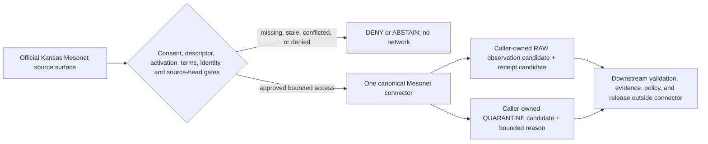

<!-- [KFM_META_BLOCK_V2]
doc_id: kfm://doc/connectors-kansas-mesonet-underscore-readme
title: connectors/kansas_mesonet/ — Kansas Mesonet Underscore Compatibility Boundary
type: readme
version: v0.2
status: draft
owners: OWNER_TBD — Connector steward · Kansas source steward · Atmosphere steward · Soil steward · Agriculture steward · Hydrology steward · Rights reviewer · Sensitivity/privacy reviewer · Validation steward · Docs steward
created: 2026-06-19
updated: 2026-07-12
policy_label: public-doctrine; compatibility-alias; noncanonical-path; documentation-only; observed-point-station; automated-ingest-consent-gated; preliminary-data; no-network-default; raw-quarantine-receipt-boundary; no-advisory; no-publication
current_path: connectors/kansas_mesonet/README.md
truth_posture: CONFIRMED repository-present README-only underscore alias, surviving nested product lane, short-name alias, deleted hyphen alias, current official source pages, and placeholder registry records / CONFLICTED compatibility class, final child slug, source identity, registry authority, and station-health machine contract / PROPOSED alias migration and admission boundaries / UNKNOWN package, tests, activation, runtime, and public-client coupling
evidence_snapshot:
  repository: bartytime4life/Kansas-Frontier-Matrix
  base_ref: main
  base_commit: 1e552048ecee0688b0f9e4284defb2d5abc0821c
  prior_blob: a733d5633b0f58b770bb3e46165fb0c9e13e72c4
related:
  - ../README.md
  - ../kansas/README.md
  - ../kansas/mesonet/README.md
  - ../ks-mesonet/README.md
  - ../../docs/doctrine/directory-rules.md
  - ../../docs/sources/catalog/kansas/kansas-mesonet.md
  - ../../docs/sources/SOURCE_DESCRIPTOR_STANDARD.md
  - ../../contracts/source/source_descriptor.md
  - ../../contracts/domains/soil/soil_moisture_observation.md
  - ../../schemas/contracts/v1/source/source_descriptor.schema.json
  - ../../schemas/contracts/v1/sources/source_descriptor.schema.json
  - ../../data/registry/sources/README.md
  - ../../data/registry/sources/soil/ks-mesonet.yaml
  - ../../data/registry/sources/agriculture/ks_mesonet.yaml
  - ../../data/registry/sources/agriculture/kansas-mesonet.yaml
  - ../../control_plane/source_authority_register.yaml
  - ../../tests/domains/soil/README.md
  - ../../data/raw/soil/README.md
  - ../../policy/rights/
  - ../../policy/sensitivity/
  - ../../release/
tags: [kfm, connectors, kansas-mesonet, mesonet, kansas, compatibility, alias, observed-source, point-station, weather, soil-moisture, agriculture, hydrology, cadence, quality-control, station-health, consent, raw, quarantine, receipts, fail-closed, governance]
notes:
  - "At the pinned base this underscore path is README-only; direct probes for pyproject.toml, src/README.md, tests/README.md, and path-scoped AGENTS.md returned Not Found."
  - "The surviving connectors/kansas/mesonet/ product README is v0.2 and documents final child-slug authority as conflicted; connectors/ks-mesonet/ remains a second top-level README alias."
  - "Commit 55c4e537f14386ea503a5879a2a4dfbaebef5384 deliberately deleted connectors/kansas-mesonet/, while the source-profile-proposed connectors/kansas/kansas-mesonet/ path was not found at the pinned base."
  - "Three Mesonet registry YAMLs use different domain/slug variants and are small PROPOSED placeholders, not complete SourceDescriptors or activation decisions."
  - "Official Kansas Mesonet REST, usage, network, parameters, soil-moisture, and metadata pages were rechecked on 2026-07-12; current terms require written consent for automated scraping or ingest."
  - "This revision changes one README only. It does not select a canonical path, restore a deleted alias, create code or tests, approve automated access, retrieve observations, activate a source, emit receipts, authorize an advisory, or publish data."
[/KFM_META_BLOCK_V2] -->

<a id="top"></a>

# Kansas Mesonet Underscore Compatibility Boundary

> [!IMPORTANT]
> **Document lifecycle:** `draft`  
> **Component maturity:** README-only compatibility alias; package and runtime `UNKNOWN`  
> **Owner:** `OWNER_TBD`  
> **Authority level:** compatibility alias; exact class `CONFLICTED / NEEDS VERIFICATION`  
> **Truth posture:** `CONFIRMED` current path and adjacent Mesonet surfaces · `CONFLICTED` final slug, registry identity, and machine health contract · `PROPOSED` migration and admission behavior  
> **Boundary:** this path does not authorize automated Kansas Mesonet access, establish station truth, create current-conditions or advisory services, decide release, or publish observations.

> [!WARNING]
> The current Kansas Mesonet policy allows public use and download with citation but prohibits automated page scraping or data ingest without written Kansas Mesonet consent. A public REST surface is not connector activation.

**Quick links:** [Purpose](#purpose) · [Authority](#authority-level) · [Status](#status) · [Belongs here](#what-belongs-here) · [Exclusions](#what-does-not-belong-here) · [Inputs](#inputs) · [Outputs](#outputs) · [Validation](#validation) · [Review](#review-burden) · [Related folders](#related-folders) · [ADRs](#adrs) · [Last reviewed](#last-reviewed) · [Snapshot](#current-repository-snapshot) · [Path conflict](#path-and-identity-conflict) · [Official source](#official-source-and-access-boundary) · [Product contract](#product-and-observation-contract) · [Admission](#proposed-admission-boundary) · [Evidence](#evidence-basis) · [Definition of done](#definition-of-done) · [Rollback](#rollback) · [Backlog](#verification-backlog)

---

## Purpose

`connectors/kansas_mesonet/` is a repository-present, underscore-named compatibility alias for Kansas Mesonet documentation.

Its current responsibility is narrow: preserve path lineage, direct readers to the repository-present Kansas-family product contract, expose unresolved naming and registry conflicts, and prevent this alias from becoming a third or fourth connector authority.

The intended audience is connector maintainers, Kansas source stewards, atmosphere, soil, agriculture, and hydrology stewards, rights and privacy reviewers, test and validation stewards, public-surface reviewers, and migration reviewers.

This README is not a product `SourceDescriptor`, activation decision, automated-access consent record, runtime specification, quality-control result, current-conditions service, agricultural or weather advisory, evidence bundle, release record, or publication surface.

[Back to top](#top)

---

## Authority level

**Compatibility alias; exact class unresolved.**

Directory Rules require compatibility roots to declare `legacy`, `mirror`, `deprecated`, `external-export`, or `transitional`. Current evidence does not safely establish one class for this alias:

- `legacy` would imply verified former canonical status, which was not established;
- `mirror` would imply generated or synchronized content from one canonical source, which is not implemented;
- `deprecated` would require an accepted removal and sunset posture, which was not verified;
- `external-export` would require a downstream-consumer contract, which was not verified;
- `transitional` would require an accepted migration record, mappings, verification window, and rollback evidence, which were not verified.

Treat this path as **compatibility / class `CONFLICTED`** and freeze implementation expansion until maintainers accept a path and alias decision.

The confirmed responsibility root is [`connectors/`](../README.md). The confirmed Kansas family coordination lane is [`connectors/kansas/`](../kansas/README.md). The repository-present [`connectors/kansas/mesonet/`](../kansas/mesonet/README.md) README is the closest surviving product contract, but it explicitly leaves final child-slug authority conflicted.

This README cannot resolve that conflict by declaring a canonical path.

[Back to top](#top)

---

## Status

| Surface | Status | Evidence-bounded meaning |
|---|---:|---|
| This README | **DRAFT / v0.2** | Reviewable compatibility boundary; not KFM-published. |
| `connectors/kansas_mesonet/` | **CONFIRMED / README-ONLY AT PROBED PATHS** | Target exists; common package, source-layout, and test README probes returned Not Found. |
| `connectors/kansas/mesonet/` | **CONFIRMED / v0.2 PRODUCT CONTRACT** | Closest surviving Kansas-family product lane; final slug and runtime remain unresolved. |
| `connectors/ks-mesonet/` | **CONFIRMED / v0.1 COMPATIBILITY README** | A second top-level alias remains and contains stale canonical-path claims. |
| `connectors/kansas-mesonet/` | **DELETED** | Commit `55c4e537f14386ea503a5879a2a4dfbaebef5384` deliberately deleted the directory. |
| `connectors/kansas/kansas-mesonet/` | **NOT FOUND AT EXACT PATH** | Source-profile-proposed child is absent at the pinned base. |
| Mesonet registry YAMLs | **THREE PROPOSED PLACEHOLDERS / CONFLICTED** | Soil and agriculture paths use three different slugs; none is a complete product descriptor. |
| Source-authority register | **PROPOSED / EMPTY** | Machine register contains `entries: []`. |
| Station-health schema | **NOT FOUND AT EXACT PATH** | Referenced sensor schema is absent; no KFM machine health contract was established there. |
| Target-local package and tests | **NOT FOUND AT PROBED PATHS** | No `pyproject.toml`, `src/README.md`, or `tests/README.md` under this alias. |
| Automated source access | **NOT AUTHORIZED BY REPOSITORY EVIDENCE** | Official policy requires written consent; no consent or activation record was verified. |
| Public current conditions or advisories | **DENY BY DEFAULT** | Connector documentation cannot authorize safety-, agriculture-, fire-, or weather-relevant claims. |

Direct pinned reads take precedence over lagging indexed search results. Indexed search returned a soil Mesonet normalizer README path that direct reads at the pinned commit did not find; its current existence and behavior therefore remain `CONFLICTED / NEEDS VERIFICATION`.

[Back to top](#top)

---

## What belongs here

While the alias class remains unresolved, this folder may contain only the smallest compatibility material required to keep the path safe:

- this README and path-lineage notes;
- links to the Kansas family and repository-present Mesonet product contract;
- explicit warnings that prevent duplicate source, registry, schema, policy, or runtime authority;
- a future compatibility import or redirect only after an accepted migration decision defines callers, delegation, warnings, tests, sunset or retention, and rollback;
- migration-bound parity tests only when they prove one canonical implementation, no duplicate fetch, no duplicate activation, and deterministic alias behavior.

Any future addition must be required for compatibility and must not operate as an independent station client.

[Back to top](#top)

---

## What does NOT belong here

Do not add or establish:

- a Kansas Mesonet fetcher, parser, normalizer, watcher, scheduler, or station client independent of the accepted product path;
- canonical product identity, descriptor, registry, schema, contract, policy, proof, release, or publication authority;
- live endpoint calls, credentials, consent artifacts, scrape instructions, or schedules without governed approval;
- production observations, station inventories, source exports, bulk downloads, or fixtures copied from the live source;
- direct writes to `WORK`, `PROCESSED`, `CATALOG`, `TRIPLET`, `PUBLISHED`, proof, release, correction, withdrawal, or public-delivery stores;
- current-conditions, forecast, warning, fire-weather, drought, irrigation, agricultural, infrastructure, emergency, or public-safety advice;
- station-to-area, station-to-grid, observed-to-modeled, source-QC-to-KFM-health, or cadence-collapsed outputs without explicit contracts and evidence;
- policy decisions for rights, consent, attribution, privacy, station location, source terms, sensitivity, public precision, or release;
- generated summaries, maps, tiles, alerts, indexes, joins, or AI explanations presented as sensor truth;
- machine schemas, contracts, validators, or enums copied here as parallel authority;
- production receipts, evidence bundles, validation reports, review records, release manifests, or rollback cards.

[Back to top](#top)

---

## Inputs

### Current inputs

No executable input interface exists at the probed target paths. The alias is documentation-only in the inspected state.

### Permitted future compatibility inputs

If a compatibility layer is separately approved, it may accept only explicit, caller-supplied references needed to delegate to one canonical implementation:

- accepted product and source identifiers plus alias mapping;
- accepted `SourceDescriptor` reference and active activation decision;
- recorded written consent for the exact automated-access method;
- reviewed source terms and citation requirements with review date;
- allowed REST host, paths, query parameters, request limits, cadence, and source-head strategy;
- station roster, station-active interval, variable capability, most-recent timestamp, and source quality evidence captured separately;
- injected transport, clock, retry, rate-limit, record-limit, byte-limit, cancellation, and caller-owned sinks;
- rights, privacy, public-precision, security, quality, review, correction, and withdrawal decisions;
- replay context and expected canonical implementation identity.

Missing, stale, conflicted, or unsafe trust-bearing inputs must deny or abstain before network access.

[Back to top](#top)

---

## Outputs

### Current outputs

**None confirmed.** A README-only alias does not fetch observations, parse CSV, emit receipts, or create lifecycle artifacts.

### Permitted future compatibility outputs

A separately approved alias layer may return only:

- deterministic delegation to the one accepted implementation;
- reviewed deprecation or compatibility warnings;
- the canonical implementation's caller-owned `RAW`, `QUARANTINE`, no-op, deny, abstain, rate-limit, or error candidate;
- receipt candidates that preserve both alias and canonical identities without claiming evidence closure or release.

Outcome names and object shapes must come from accepted contracts. This README creates no enum, schema, station-health value, quality result, or advisory class.

[Back to top](#top)

---

## Validation

### Documentation checks applicable now

- one H1 and logical heading hierarchy;
- KFM Meta Block v2 wrapper, original `doc_id`, and grounded creation/update dates preserved;
- required compatibility-root README sections present in Directory Rules order;
- repository, base, prior blob, exact probes, current official pages, and review boundary recorded;
- linked repository files and official source pages resolve;
- deleted, absent, placeholder, proposed, unknown, and conflicted surfaces remain distinct;
- no remote badges, tracking images, credentials, station payloads, private data, or new sensitive locations;
- balanced fences, readable tables, valid callouts, and final newline;
- exactly one changed repository path for this task.

### Required future alias and connector checks

- import and collection perform no network, file write, credential read, registration, activation, thread start, or global-state mutation;
- alias imports delegate to one implementation and cannot activate independently;
- missing consent, descriptor, activation, terms review, source identity, or source-head evidence prevents network access;
- fake transport is the default and unexpected egress fails;
- REST parsing uses headers, not column order, and treats missing variable support as absence rather than zero;
- the 3000-record source limit is enforced without silent truncation or pagination invention;
- `5min`, `hour`, and `day` observations remain separate and preserve source timestamps and intervals;
- roster, active interval, variable support, freshness, and observation captures remain separate evidence objects;
- source soft/hard quality flags are preserved without inventing KFM station-health authority;
- measured and source-derived variables remain distinct;
- station points are not generalized into area-wide truth, modeled grids, or advisories;
- replay is deterministic and aliases cannot duplicate fetch, receipt, handoff, correction, or withdrawal;
- no code path writes beyond caller-owned raw, quarantine, or receipt candidates;
- accepted CI collects and runs substantive tests rather than placeholder steps.

No repository-supported command for this alias was verified. Do not invent a package, install, test, or live-source command.

[Back to top](#top)

---

## Review burden

Current CODEOWNERS provides a repository-wide fallback but no Kansas Mesonet-specific owner. `OWNER_TBD` is deliberate.

| Change | Required review posture |
|---|---|
| README-only alias clarification | Connector/docs steward and Kansas source steward when source claims change. |
| Alias class, canonical child, move, deprecation, or deletion | Architecture/Directory Rules owner, affected callers, connector steward, migration reviewer, and ADR review when triggered. |
| REST access, consent, fetch, parser, or scheduler behavior | Source steward, connector maintainer, rights reviewer, security reviewer, and test/validation steward. |
| Atmosphere, soil, agriculture, hydrology, or fire-weather semantics | Applicable domain steward; cross-domain use requires each affected steward. |
| Quality flags, station health, freshness, cadence, units, depth, or derived variables | Sensor/observation contract owner, domain steward, and validation reviewer. |
| Station location, privacy, infrastructure, or public precision | Sensitivity/privacy/security reviewer and source steward. |
| Registry, descriptor, schema, or activation behavior | Source registry, contract, schema, policy, and control-plane owners outside this folder. |
| Current conditions, advisories, alerts, or public release | Public-surface, evidence, policy, citation, release, and relevant safety/domain reviewers outside this folder. |

Passing CI or merging a PR does not substitute for written source consent, policy review, semantic review, source activation, or release approval.

[Back to top](#top)

---

## Related folders

| Surface | Relationship | Current posture at the pinned base |
|---|---|---:|
| [`../`](../README.md) | Canonical connector responsibility root. | **CONFIRMED v0.3 root contract** |
| [`../kansas/`](../kansas/README.md) | Kansas source-family coordination lane. | **CONFIRMED v0.2 / child topology provisional** |
| [`../kansas/mesonet/`](../kansas/mesonet/README.md) | Closest surviving Mesonet product contract. | **CONFIRMED v0.2 / final child slug conflicted** |
| [`../ks-mesonet/`](../ks-mesonet/README.md) | Short-name top-level alias. | **CONFIRMED v0.1 / stale path claims** |
| `../kansas-mesonet/` | Former top-level hyphen path. | **DELETED BY COMMIT 55c4e537** |
| `../kansas/kansas-mesonet/` | Source-profile-proposed child. | **NOT FOUND AT EXACT PATH** |
| [`../../docs/sources/catalog/kansas/kansas-mesonet.md`](../../docs/sources/catalog/kansas/kansas-mesonet.md) | Human-facing product/source profile. | **CONFIRMED v0.2 / path claim partly stale** |
| [`../../docs/doctrine/directory-rules.md`](../../docs/doctrine/directory-rules.md) | Placement, compatibility, migration, and README requirements. | **CONFIRMED v1.4** |
| [`../../contracts/domains/soil/soil_moisture_observation.md`](../../contracts/domains/soil/soil_moisture_observation.md) | Soil moisture observation meaning. | **CONFIRMED v0.2 draft / paired schema absent per contract** |
| [`../../schemas/contracts/v1/source/source_descriptor.schema.json`](../../schemas/contracts/v1/source/source_descriptor.schema.json) | Populated singular-path SourceDescriptor schema. | **CONFIRMED PROPOSED / declares itself legacy** |
| [`../../schemas/contracts/v1/sources/source_descriptor.schema.json`](../../schemas/contracts/v1/sources/source_descriptor.schema.json) | Nominal plural-path SourceDescriptor schema. | **CONFIRMED empty permissive PROPOSED scaffold** |
| `../../schemas/contracts/v1/sensors/station_health.schema.json` | Referenced station-health schema. | **NOT FOUND AT EXACT PATH** |
| [`../../data/registry/sources/`](../../data/registry/sources/README.md) | Source descriptor and activation responsibility. | **CONFIRMED registry contract** |
| [`../../data/registry/sources/soil/ks-mesonet.yaml`](../../data/registry/sources/soil/ks-mesonet.yaml) | Soil-slug registry placeholder. | **CONFIRMED PROPOSED / incomplete** |
| [`../../data/registry/sources/agriculture/ks_mesonet.yaml`](../../data/registry/sources/agriculture/ks_mesonet.yaml) | Agriculture underscore registry placeholder. | **CONFIRMED PROPOSED / incomplete** |
| [`../../data/registry/sources/agriculture/kansas-mesonet.yaml`](../../data/registry/sources/agriculture/kansas-mesonet.yaml) | Agriculture hyphen registry placeholder. | **CONFIRMED PROPOSED / incomplete** |
| [`../../control_plane/source_authority_register.yaml`](../../control_plane/source_authority_register.yaml) | Machine source-authority register. | **CONFIRMED PROPOSED / entries empty** |
| [`../../tests/domains/soil/`](../../tests/domains/soil/README.md) | Soil domain test documentation. | **CONFIRMED v0.1 / executable depth unverified** |
| [`../../data/raw/soil/`](../../data/raw/soil/README.md) | Soil raw lifecycle contract. | **CONFIRMED v0.1 / no Mesonet child confirmed** |
| [`../../policy/rights/`](../../policy/rights/README.md) | Rights policy home. | **CONFIRMED greenfield README stub** |
| [`../../policy/sensitivity/`](../../policy/sensitivity/README.md) | Sensitivity policy home. | **CONFIRMED greenfield README stub** |
| [`../../release/`](../../release/README.md) | Release, correction, withdrawal, and rollback authority. | **OUTSIDE CONNECTOR** |

[Back to top](#top)

---

## ADRs

No accepted path-specific ADR or migration record governing the underscore alias was verified at the pinned base.

An ADR or equivalently governed structural decision is required before maintainers select a canonical Mesonet child, restore a deleted alias, turn an alias into a mirror, move code or registry identity, assign a deprecation sunset, or allow multiple import paths. The decision should cover:

- stable product and source IDs;
- canonical connector path, package name, and import path;
- the disposition of the underscore and short-name aliases;
- the deleted hyphen path and the absent source-profile-proposed child;
- all registry placeholder mappings and final descriptor authority;
- caller, docs, tests, fixtures, pipeline, workflow, and public-client references;
- written automated-access consent and terms review ownership;
- duplicate-fetch, duplicate-receipt, correction, and withdrawal prevention;
- warnings, parity tests, migration manifest, verification window, sunset, and rollback.

This README selects none of those decisions.

[Back to top](#top)

---

## Last reviewed

**2026-07-12**, against repository `bartytime4life/Kansas-Frontier-Matrix` at pinned base commit `1e552048ecee0688b0f9e4284defb2d5abc0821c`.

Repository review was bounded to the target, named adjacent files, exact path probes, indexed searches, repository metadata, current commit history, and GitHub state. Official Kansas Mesonet REST, usage, network, parameters, soil-moisture, and metadata pages were rechecked on the same date. No source observation was requested, downloaded, stored, or processed.

[Back to top](#top)

---

## Current repository snapshot

```text
connectors/
├── kansas_mesonet/
│   └── README.md                          # this underscore compatibility alias
├── ks-mesonet/
│   └── README.md                          # second top-level compatibility alias
└── kansas/
    ├── README.md                          # family coordination contract
    └── mesonet/
        └── README.md                      # repository-present v0.2 product contract
```

Additional path state:

- `connectors/kansas-mesonet/` was deleted by commit `55c4e537f14386ea503a5879a2a4dfbaebef5384`;
- `connectors/kansas/kansas-mesonet/README.md` returned Not Found at the pinned base;
- target-local `pyproject.toml`, `src/README.md`, `tests/README.md`, and `AGENTS.md` returned Not Found;
- indexed search found no additional target-local implementation path;
- indexed search results may lag the pinned tree and are not used to override direct reads.

This snapshot is path- and search-bounded, not proof of a complete recursive repository inventory.

[Back to top](#top)

---

## Path and identity conflict

| Identity surface | Current value | Conflict |
|---|---|---|
| Underscore alias | `connectors/kansas_mesonet/` | Exists but is README-only at probed paths. |
| Short-name alias | `connectors/ks-mesonet/` | Exists and still declares the absent long-name child canonical. |
| Surviving product lane | `connectors/kansas/mesonet/` | Exists and is the strongest current implementation-documentation candidate, but final slug remains unresolved. |
| Deleted alias | `connectors/kansas-mesonet/` | Must not be recreated by a documentation update. |
| Source-profile proposal | `connectors/kansas/kansas-mesonet/` | Absent; profile path statement is stale against the pinned repository. |
| Soil registry slug | `ks-mesonet` | Small PROPOSED placeholder only. |
| Agriculture registry slug | `ks_mesonet` | Small PROPOSED placeholder only. |
| Agriculture registry slug | `kansas-mesonet` | Small PROPOSED placeholder only. |
| Machine authority register | no entries | No product-level authority or activation is established there. |

Do not solve path drift by copying code, descriptors, tests, or rules into every alias. One accepted implementation and one product identity must own behavior; aliases, if retained, delegate explicitly.

[Back to top](#top)

---

## Official source and access boundary

Official pages rechecked on 2026-07-12:

- [Kansas Mesonet RESTful Services](https://mesonet.k-state.edu/rest/)
- [Kansas Mesonet Data Usage Policy](https://mesonet.k-state.edu/about/usage/)
- [Network Architecture and QA/QC](https://mesonet.k-state.edu/about/network/)
- [Weather Parameters](https://mesonet.k-state.edu/about/parameters/)
- [Soil Moisture](https://mesonet.k-state.edu/agriculture/soilmoist/)
- [Station Metadata](https://mesonet.k-state.edu/metadata/)

| Current official statement | Compatibility and connector consequence |
|---|---|
| REST observations are CSV and require query parameters. | Parse explicit headers and preserve the exact request surface; do not infer an undocumented API contract. |
| Intervals include `5min`, `hour`, and `day`. | Preserve interval and timestamp identity; never silently resample or collapse cadence. |
| Station-observation requests are limited to 3000 records. | Bound requests, detect truncation, and do not invent pagination. |
| Variable order is not guaranteed, and support varies by station and interval. | Parse by field name; missing capability is not a zero observation. |
| Station names, active intervals, and most-recent timestamps are separate services. | Capture roster, validity, freshness, and observations separately with their own provenance. |
| Data is preliminary, subject to change, and requires citation when shared or published. | Preserve source vintage, retrieval time, citation, correction, and supersession lineage. |
| Automated page scraping or data ingest without written consent is prohibited. | Deny network automation until consent for the exact method is recorded and active. |
| Source QA/QC may apply soft or hard flags. | Preserve source flags and human-review needs; do not translate them into invented KFM health authority. |
| Soil-moisture probes are installed only at selected stations. | Preserve station capability and sensor-validity intervals; missing sensor data is not zero moisture. |
| Weather/agriculture surfaces include measured and calculated parameters. | Preserve observed versus source-derived method and formula lineage. |

These facts constrain future behavior; they do not authorize this alias or any connector to access the source.

[Back to top](#top)

---

## Product and observation contract

Kansas Mesonet is an **in-situ, point-station observed source** with atmosphere, soil, agriculture, hydrology, and fire-weather relevance. Cross-domain relevance does not permit semantic collapse.

Future admitted records must preserve, where source-supported:

- stable source, network, station, sensor, variable, observation, and request identities;
- station name and coordinates with source validity and precision posture;
- observation timestamp, timezone or offset, interval, retrieval time, and source head;
- variable code, label, measured or calculated method, unit, height or depth, and aggregation;
- station and interval capability, active dates, sensor availability, and maintenance state;
- source quality flag, assessment meaning, and human-review requirement;
- request parameters, record count, digest, content type, and source URI;
- preliminary/corrected/superseded state and correction lineage;
- rights, citation, consent, privacy, security, sensitivity, review, and release posture.

Required anti-collapse boundaries:

1. A station point is not area-wide weather, soil, crop, watershed, county, or statewide truth.
2. Observed station values are not modeled rasters, interpolations, forecasts, reanalysis, satellite support, or survey products.
3. Five-minute, hourly, and daily records are distinct observation intervals.
4. A source soft flag is not a passing KFM health decision; a hard flag is not permission to erase the record.
5. A missing variable or sensor is not a zero value.
6. Source-derived heat, degree-day, evapotranspiration, or other indices are not raw sensor observations.
7. Preliminary source data is not release-stable evidence; correction and supersession remain possible.
8. Public availability is not automated-ingest consent or KFM publication approval.
9. A connector test, receipt, commit, pull request, or merge is not source activation or release.
10. AI summaries and maps remain evidence-subordinate downstream interpretations.

[Back to top](#top)

---

## Proposed admission boundary

The following is **PROPOSED** for any future implementation, regardless of final path:



The connector edge must be no-network by default, use injected transport and clocks, enforce source limits, preserve exact request and record lineage, and keep all handoff sinks caller-owned.

It must not normalize observations into grids, approve station health, produce advisories, or write directly to downstream lifecycle or public stores.

[Back to top](#top)

---

## Lifecycle and public-surface boundary

The governing lifecycle remains:

```text
RAW -> WORK / QUARANTINE -> PROCESSED -> CATALOG / TRIPLET -> PUBLISHED
```

This alias has no lifecycle write authority. A future canonical connector may prepare caller-owned raw, quarantine, and receipt candidates only. Downstream normalization, unit/depth validation, station-health assessment, evidence resolution, policy, catalog/triplet projection, correction, release, and publication remain outside connector ownership.

Normal public clients must use governed APIs and released artifacts. They must not read this alias, connector internals, raw observations, quarantine records, or registry placeholders as ordinary current-conditions data.

No connector output may be presented as an operational weather warning, fire-weather alert, irrigation recommendation, crop decision, flood statement, drought declaration, emergency message, or infrastructure control input.

[Back to top](#top)

---

## Failure, security, and sensitivity posture

- Missing written consent, descriptor, activation, or terms review: deny before network access.
- Unknown or conflicting rights, citation, or redistribution posture: deny or quarantine.
- Unapproved host, redirect, scheme, or path: deny; never fall back to scraping another surface.
- Record-limit risk, unexpected column, unsupported interval, malformed CSV, encoding drift, or source-shape drift: bounded error or quarantine.
- Unknown station, variable, depth, unit, active interval, timestamp, quality flag, or freshness: quarantine or abstain; never fabricate.
- Preliminary data corrected or withdrawn upstream: preserve prior identity and create correction/supersession candidates; never overwrite history silently.
- Station coordinates or infrastructure details: retain source provenance and apply explicit privacy, security, sensitivity, and public-precision review before downstream release.
- Logs: redact credentials, consent artifacts, cookies, tokens, signed URLs, restricted query details, payloads, and sensitive identifiers.
- Import: no network, file writes, credential reads, registration, activation, logging setup, thread start, or global-state mutation.
- Diagnostics: bounded and non-sensitive; do not dump station datasets or live responses.
- Source outage or stale freshness: emit a bounded state; do not convert missing data into safe conditions or zero values.

[Back to top](#top)

---

## Evidence basis

| Evidence | Status | Supports | Does not prove |
|---|---:|---|---|
| Target blob `a733d5633b0f58b770bb3e46165fb0c9e13e72c4` | **CONFIRMED** | Exact v0.1 baseline, strong sensor boundaries, stale blank-file claim, remote badges, and unresolved rollback placeholder. | Runtime, migration, or activation. |
| Exact target-local probes | **NOT FOUND AT PINNED BASE** | No common package/source/test README surfaces under this alias. | Absence of every differently named or unindexed implementation. |
| Nested product README blob `346fd5a5318ca6800d1d6bd9a846bec0ac35a511` | **CONFIRMED v0.2 documentation** | Current repository reconciliation, official source review, path conflicts, registry placeholders, and product boundary. | Executable connector, consent record, activation, or public release. |
| Short-name README blob `650c180144c477ececc92e689e9e105abd568a0f` | **CONFIRMED v0.1 documentation** | Second alias exists and preserves earlier posture. | Correct current canonical-path claim. |
| Commit `55c4e537f14386ea503a5879a2a4dfbaebef5384` | **CONFIRMED** | Deliberate deletion of `connectors/kansas-mesonet/`. | Final disposition of remaining aliases. |
| Exact proposed-child probe | **NOT FOUND AT PINNED BASE** | `connectors/kansas/kansas-mesonet/README.md` was absent. | Absence of every similarly named implementation. |
| Three registry placeholder blobs | **CONFIRMED / CONFLICTED** | Competing soil/agriculture slugs exist as small PROPOSED records. | Complete SourceDescriptor, product identity, consent, review, or activation. |
| Empty machine authority register | **CONFIRMED** | No entry is established in that register. | External or differently located authority not inspected. |
| Exact station-health schema probe | **NOT FOUND AT PINNED BASE** | Named schema path is absent. | Absence of all quality or health logic elsewhere. |
| SourceDescriptor contract and schema pair | **CONFIRMED / CONFLICTED** | Intended descriptor meaning and current singular/plural authority mismatch. | Accepted final schema or valid Mesonet descriptor. |
| Soil moisture contract, Soil tests README, and Soil RAW README | **CONFIRMED documentation** | Observation anti-collapse, test responsibility, and raw lifecycle boundaries. | Mesonet-specific executable normalization or tests. |
| Official Kansas Mesonet pages rechecked 2026-07-12 | **CONFIRMED CURRENT SOURCE STATEMENTS** | REST shape, record limit, intervals, capabilities, preliminary status, citation, automation consent, QA/QC flags, parameters, and selected soil sensors. | KFM consent, activation, successful request, completeness, or release. |
| Directory Rules, CONTRIBUTING, CODEOWNERS, and PR template | **CONFIRMED convention** | Compatibility/migration rules, smallest reversible change, truth labels, fallback review, and rollback expectations. | Product-specific ownership or approval. |

[Back to top](#top)

---

## Definition of done

### Documentation readiness for this revision

- [x] Current repository, base commit, prior blob, review date, official-page review date, and path set are recorded.
- [x] Required compatibility-root README sections appear in Directory Rules order.
- [x] The surviving product lane, remaining alias, deleted alias, and absent proposed child are distinguished.
- [x] Registry, SourceDescriptor, and station-health conflicts remain visible.
- [x] Current official consent, citation, preliminary-data, REST-limit, cadence, capability, and source-QC constraints are explicit.
- [x] Existing point-station, cadence, quality, no-advisory, raw/quarantine, and no-publication safeguards are preserved.
- [x] No remote badges, credentials, consent artifacts, station payloads, live-source calls, policy decisions, source activation, or public output are introduced.
- [x] Rollback and remaining work are reviewable.

### Alias and product resolution

- [ ] Assign connector, Kansas source, domain, rights, privacy, security, validation, test, public-surface, and docs owners.
- [ ] Accept one stable product/source identity, canonical path, package name, and import path.
- [ ] Select the compatibility class and disposition of each surviving alias.
- [ ] Reconcile or retire all three registry placeholders under one governed descriptor authority.
- [ ] Resolve the SourceDescriptor schema authority and create a complete validated product descriptor.
- [ ] Record active written consent for the exact automated access method and terms-review date.
- [ ] Define source-head, station roster, capability, active interval, freshness, query, record-limit, quality, correction, and withdrawal contracts.
- [ ] Define or adopt an accepted station-health/quality contract without replacing source flags.
- [ ] Implement one connector, fake transport, hermetic tests, and duplicate-run prevention if approved.
- [ ] Verify domain semantics for atmosphere, soil, agriculture, hydrology, and fire-weather uses.
- [ ] Complete alias parity, warning, migration, deprecation, verification-window, sunset, and rollback evidence.
- [ ] Confirm public clients use governed released surfaces and cannot import connector aliases directly.

Documentation readiness does not imply written consent, implementation readiness, source activation, quality approval, evidence closure, advisory suitability, release readiness, or publication.

[Back to top](#top)

---

## Rollback

Rollback is required if this README is used to justify canonical alias status, restoring the deleted path, automated access, consent, descriptor authority, source activation, public current conditions, advisories, station-to-grid collapse, silent cadence collapse, invented health state, direct downstream writes, release, or publication.

Before merge, leave the review branch unmerged. Closing the pull request or deleting its branch requires separate authorization.

After merge, restore prior README blob `a733d5633b0f58b770bb3e46165fb0c9e13e72c4` from base commit `1e552048ecee0688b0f9e4284defb2d5abc0821c` through a transparent revert commit or revert pull request, then rerun applicable documentation and connector-boundary validation. Do not reset, force-push, or rewrite shared history.

[Back to top](#top)

---

## Verification backlog

| Item | Status | Needed evidence |
|---|---:|---|
| Confirm complete Mesonet connector, import, caller, workflow, fixture, and public-client inventory. | **UNKNOWN** | Non-truncated tree and dependency inspection at one pinned ref. |
| Select stable product/source ID and canonical child slug. | **CONFLICTED** | Accepted ADR or placement/identity decision. |
| Classify and dispose of `kansas_mesonet` and `ks-mesonet` aliases. | **CONFLICTED** | Migration/deprecation decision, callers, parity tests, sunset, and rollback. |
| Reconcile the deleted `kansas-mesonet` path and stale source-profile child claim. | **CONFLICTED** | Documentation correction and accepted path mapping. |
| Reconcile three registry placeholders. | **CONFLICTED** | One product descriptor, alias map, domain relationships, validator, and migration. |
| Resolve SourceDescriptor contract/schema authority. | **CONFLICTED** | Accepted contract/ADR and one enforceable schema. |
| Confirm written consent scope, term, revocation, and evidence storage. | **NEEDS VERIFICATION** | Current signed/operator record and source/rights review. |
| Confirm endpoint allowlist, query semantics, record limit, rate limits, retries, cadence, and source-head behavior. | **NEEDS VERIFICATION** | Approved access specification and fake/live-probe plan. |
| Confirm station identity, relocation, active intervals, capability, sensor history, and coordinates. | **NEEDS VERIFICATION** | Source metadata contract and reviewed fixtures. |
| Confirm variable codes, units, heights, depths, aggregation, formulas, and measured/derived classification. | **NEEDS VERIFICATION** | Current official metadata and domain contracts. |
| Confirm source flags and KFM station-health/quality decision model. | **CONFLICTED** | Accepted contract/schema, mappings, review behavior, and tests. |
| Confirm preliminary-data correction, supersession, deletion, and withdrawal behavior. | **NEEDS VERIFICATION** | Source behavior, identity rules, receipts, and replay tests. |
| Confirm station-location privacy, security, sensitivity, and public precision. | **NEEDS VERIFICATION** | Source, policy, security, and release review. |
| Confirm fixture rights, retention, minimization, and no-network test strategy. | **UNKNOWN** | Fixture contract, registry, review receipts, and executable tests. |
| Confirm package build, runner, commands, CI collection, and coverage. | **UNKNOWN** | Implemented package/test configuration and observed logs. |
| Confirm public current-conditions and advisory boundaries. | **NEEDS VERIFICATION** | API/UI dependency review, evidence/policy gates, and release tests. |

[Back to top](#top)

---

## Maintainer note

Do not deepen path drift. Choose one product identity and one connector implementation before adding runtime behavior. Treat the underscore and short-name paths as aliases only if an accepted migration decision defines their exact purpose.

Until written automated-access consent, descriptor authority, activation, observation semantics, quality handling, tests, and release boundaries are verified, this path remains documentation-only and no-network.

[Back to top](#top)
